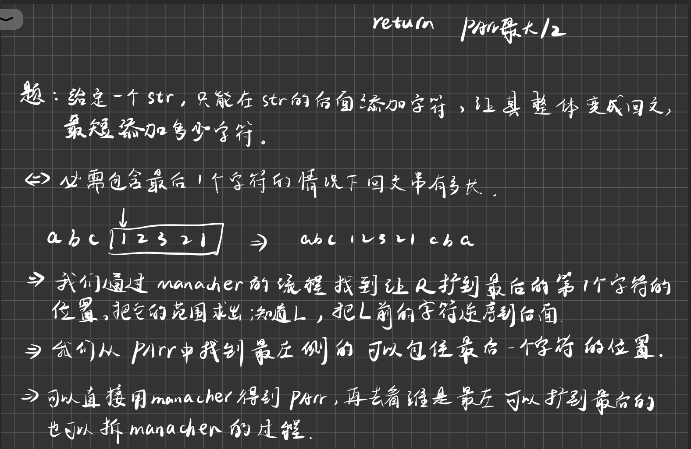

# KMP


```java
private static int kmp(String str, String match) {
    if (str==null||match==null||match.length()<1||str.length()<match.length()) return -1;
    char[] s1 = str.toCharArray();
    char[] s2 = match.toCharArray();
    int[] next=getNext(match);
    int p1=0;
    int p2=0;
    while(p1!=str.length()&&p2!=match.length()){//不越界
        if (s1[p1]==s2[p2]){
            p1++;
            p2++;
        }else if (p2!=0){//p2还可以回退
            p2=next[p2];
        }else{//p2==0,回退不了了，说明p1现在这个位置不对
            p1++;
        }
    }
    return p2==match.length()?p1-p2:-1;
}

private static int[] getNext(String match) {
    if (match.length() == 1) return new int[]{-1};
    char[] chars = match.toCharArray();
    int[] next = new int[match.length()];
    next[0] = -1;
    next[1] = 0;
    int i=2;
    int p=next[1];//当前要从2位置开始填，所以p要等于next[2-1]
    while(i!=match.length()){
        if (chars[i-1]==chars[p]){//i-1位置和p位置相等,
            next[i++]=++p;//长度是i-1位置长度+1，p即代表要比较的位置，也代表前缀子串的长度
        }else if (p==0){//p前面无路可跳
            next[i++]=0;
        }else {//p前面还有路可以跳
            p=next[p];
        }
    }
    return next;
}

private static int baoli(String str,String match){
    if (str==null||match==null||match.length()<1||str.length()<match.length()) return -1;
    char[] s1 = str.toCharArray();
    char[] s2 = match.toCharArray();
    int p1=0;
    int p2=0;
    for (int i = 0; i < str.length(); i++) {
        p1=i;
        p2=0;
        while(p1!=str.length()&&p2!=match.length()){
            if (s1[p1]==s2[p2]){
                p1++;
                p2++;
            }else
                break;
        }
        if (p2==match.length())return p1-p2;
    }
    return -1;
}
```


## 应用


# Manacher

Manacher算法解决的是最长回文子串是多长。

解决回文有什么用处呢？DNA就是一些序列，可以把DNA认为是字符串，回文有一些生理学意义，有一些基因片段它是回文属性的，比如说人是对称的。在某一些DNA序列里面，基因的序列对呈现一些回文关系。


- 事实上，如果`i'`的范围越界了，也就是超过L了，那么i加上Parr[i']也会越出R。让Parr的含义变成右边界减去中心。此时如果i+Parr[i']<R,那么我们直接让Parr[i]等于Parr[i']。如果i+Parr[i']>R,那么就让Parr[i]等于R-i。也就是说Parr[i']<R-i时选Parr[i']。Parr[i']>R-i时选R-i。等价于在i在R内，并且i'不是踩在边界的情况下Parr[i]=min（R-i,Parr[i']）

  也就是Parr[i]=min（R-i+1,Parr[i']）.

  如果i+Parr[i']==R，那么就让它等于R-i+1，然后


