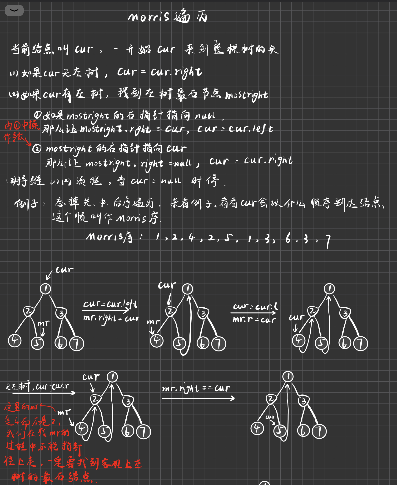
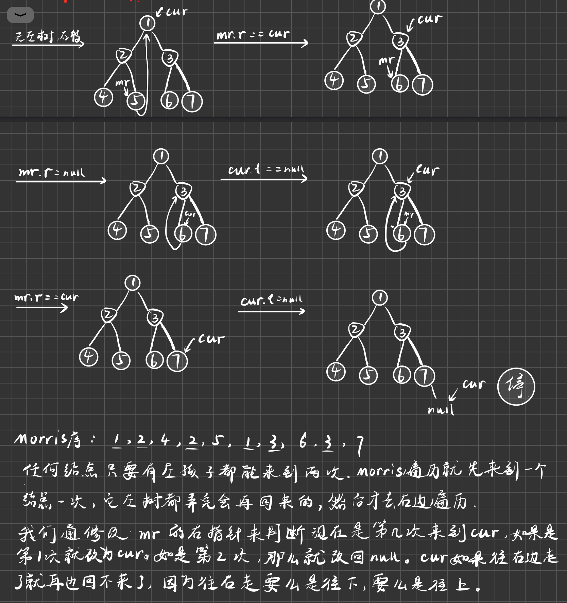

# Morris遍历

之前看过树的几种遍历方式，无论是二叉树的递归遍历还是利用非递归的方式完成遍历，都是需要额外空间的。时间复杂度是O（N），和结点的个数有关。空间复杂度和高度相关，无论你是利用的递归调用的系统栈还是自己的栈，空间复杂度都是O（h）。

Morris遍历的厉害之处在于可以把空间复杂度优化成O（1）。很多树的问题和树的遍历有关，掌握了一个性能优良的遍历，意味着某一个关于树的遍历的问题，Morris遍历的流程就是最优解。笔试的时候以最快的通过为准，面试的时候再拿出来聊。





利用递归调用，可以回到自己3次。Morris遍历不能做到检查三次，但是可以做到前两次。

```
if (head==null)return;
//1     
posOrderRecur(head.left);
//2
posOrderRecur(head.right);
//3
```

如果找到一个结点的真实的最右结点？只需要加一个判断，走到一个结点的右指针为null或者是cur就停。null的时候出来代表我当前是第一次来到cur，否则就是第二次来到cur。

即便每个结点都有找到左树右边界的代价，总的代价最多也就2N。所以总代价也不会超过O（N）

现在我们已经知道Morris序了，如果加工出先序、中序？

如何知道一个结点能不能来到自己两次？有左树就会来到自己两次。

## 先序

- 先序：对于能来到自己两次的结点就让他第1次打印，其它结点都遇到就打印。

## 中序

- 中序：对于能来到自己两次的结点就让他第2次打印，其它结点都遇到就打印。对于没有左树的结点，直接打印，然后往右移动。对于有左子树的结点，第二次来到自己是从mr的right指针回来的，回来之后也要往右移动。所以总结的说，一个结点要往右移动了就打印。

## 后序

- 后序：打印时机为在第二次回到自己的节点上。第二次回到自己，就**逆序**打印自己左树的右边界。怎么想到的？因为整棵树可以利用左子树的右边界分解，不重复！！！

  现在问题是如何逆序打印右边界？此时mr已经指向空了，我们可以把cur.left到mr的一大串看成是一个单链表，我们翻转这个单链表，用完之后再调回来。

## 判断BST

- 如何判断一个树是不是搜索二叉树？中序遍历一下，如果值一直是递增的，它就是搜索二叉树。我们把中序遍历的打印时机变成比对时机即可。

## 返回最小高度

- 一棵树，我想知道上面的最小高度。最小高度：只有我到了叶子结点我才有一个高度，我想知道在所有叶子结点中，那个是距离头部最短的，我想把那个距离返回。

利用递归套路：如果我左树不为空我就求左树最小高度+1，如果右树不为空就求右树的最小高度+1，两个比对，谁更小谁就是我的最小高度。这个方法额外空间很高，树的高度就是额外空间。

如何用Morris遍历来改写？改写的难度就是我们只能用有限几个变量。

1. cur来到任何位置的时候能否知道它现在所在的高度？
2. 如果我能够确定cur此时是叶子结点，我就记录它的高度，我用一个全局最小值min来捕捉它。

如果能够做到1,2两个机制，我们就能利用Morris遍历改出来。

如何做到1？一开始的cur在第一层，高度为1。如果cur无左树（Morris遍历的第一种情况），下一步的cur是往右移，在cur往右移动之前把level++。现在来看Morris遍历的第二种情况，如果cur有左树，我们可以区别分出它是第一次来到自己还是第二次来到自己。我们要阻止从底下的mr跳上来的情况。如果cur是第一次来到自己，cur往左走，level++。如果是mr跳上来的话怎么办？ mr-cur左树右边界的节点数。

假设pre为前驱结点，如果pre.left=cur,也就是说我们是通过从pre往左走下来的，level++。但是pre.right==cur的时候不能呢level++，因为我不能确定我的前驱是不是在底下，不能确定我是不是跳上来的。所以我们这样判断：如果pre.right==null，那么就可以level++，否则如果pre.right==cur的话就利用mr的高度-cur左树右边界的节点数。

做到2？我们能不能知道cur真实情况下是不是叶子结点？不能做到！！！！因为真正当你到达一个叶子结点的时候你判断不出来，因为它的右指针一定是改过的。

那么我们如何把所有的叶子结点拿到？所有的叶子结点都会在能回到自己两次的结点的时候重新发现一遍。


整棵树的最右的叶子结点7没有人去发现，我们需要单独去捉7的高度。从mr跳上来的时候，我们要判断一个mr是不是叶子结点，是才参与更新，不是就不参与更新。如何判断mr.left如果为空它就是叶子结点。


## 总结

什么时候一个流程可以定成Morris遍历？如果是定成从左树收集信息，从右树收集信息完了之后做整合的话就不能用Morris遍历。但是如果左树的信息用完之后我不要了，我可以利用一个变量把左树的所有信息继承下去，比如说min，那么我就可以用Morris改。

如果信息可以传递就能改，如果不能传递，就不能改。

