# LeetCode

## code0003_最长不重复子串

```
给定一个字符串 s ，请你找出其中不含有重复字符的 最长子串 的长度。

示例 1:

输入: s = "abcabcbb"
输出: 3 
解释: 因为无重复字符的最长子串是 "abc"，所以其长度为 3。

链接：https://leetcode.cn/problems/longest-substring-without-repeating-characters
```

做法1：求**必须**以每个位置结尾的最长无重复子串的长度，每个位置结尾的最长不重复子串的长度答案记在dp表里面，dp表填好之后，dp表中最的就是答案。这是个经典的尝试方法，看到子串、子数组、子序列都可以去试。

具体还需要建立i位置字符上次出现的位置，这是字符和下标的映射。我们可以用Hash表，直接做一个字符到下标的映射。也可以用一个数组来做，因为数组其实就是数字到数字的映射，字符本质上也是数字。然后这题，i-1位置的字符推的位置以及i位置字符上一次出现的位置，谁出现的近，谁就是你的瓶颈。这边说的进，可以用一个max函数来代替。

上面的方法是建立一个dp表，但是实际上只用到了一个位置的依赖，更进一步，可以做空间压缩，因为我们每次只需要前面位置的答案，然后在这个过程中用一个变量抓住最大值返回即可。

hash表做字符到下标的映射和用数组来做，其实差不多，只不过hash表的常数时间会大一点。

---


做法2：滑动窗口，本质就是求以每个位置开头的最长无重复字串的长度，有明显的单调性，窗口越小，长度肯定越小，如果已经重复了，窗口越大后面就全部不行。也是搞一个map表，记录一个字符之前有没有出现过。 


## code0007_整数反转

```
给你一个 32 位的有符号整数 x ，返回将 x 中的数字部分反转后的结果。
如果反转后整数超过 32 位的有符号整数的范围 [−231,  231 − 1] ，就返回 0。
假设环境不允许存储 64 位整数（有符号或无符号）。
 
示例 1：
输入：x = 123
输出：321

示例 2：
输入：x = -123
输出：-321

示例 3：
输入：x = 120
输出：21

示例 4：
输入：x = 0
输出：0

来源：力扣（LeetCode）
链接：https://leetcode.cn/problems/reverse-integer
```

```
原理：
1234怎么用最少次的乘法算出来。((((0*10+1)*10+2)*10+3)*10+4)
001234算出来也是对的。前两次res*10+0还是等于0，因为res初始值为0.
```

知道了上面的原理之后我们从后往前，取出整数的每一位，按照上面的公式迭代之后就是答案。

但是这道题需要判断溢出的情况。并且我们知道负数的绝对值域比正数的大一个，所以我们全部转化成负数弄会安全一些，正数转成负数去处理，这个技巧很常见！

```
Integer.MIN_VALUE:-2147483648
Integer.MAX_VALUE: 2147483647
-99%10=-9   绝对值模完再加符号
```


## code0015_三数之和

```
给你一个整数数组 nums ，判断是否存在三元组 [nums[i], nums[j], nums[k]] 满足 i != j、i != k 且 j != k ，同时还满足 nums[i] + nums[j] + nums[k] == 0 。请

你返回所有和为 0 且不重复的三元组。

注意：答案中不可以包含重复的三元组。

示例 1：

输入：nums = [-1,0,1,2,-1,-4]
输出：[[-1,-1,2],[-1,0,1]]
解释：
nums[0] + nums[1] + nums[2] = (-1) + 0 + 1 = 0 。
nums[1] + nums[2] + nums[4] = 0 + 1 + (-1) = 0 。
nums[0] + nums[3] + nums[4] = (-1) + 2 + (-1) = 0 。
不同的三元组是 [-1,0,1] 和 [-1,-1,2] 。

注意，输出的顺序和三元组的顺序并不重要。

示例 2：

输入：nums = [0,1,1]
输出：[]
解释：唯一可能的三元组和不为 0 。

示例 3：

输入：nums = [0,0,0]
输出：[[0,0,0]]
解释：唯一可能的三元组和为 0 。
 

提示：

3 <= nums.length <= 3000
-105 <= nums[i] <= 105

来源：力扣（LeetCode）
链接：https://leetcode.cn/problems/3sum
```

IC02_加和n元组

题目说的是无序数组。我们先解决在有序数组中找累加和为k的所有二元组，这是一个双指针的做法。三元组就是固定一个假设值为x，然后到后面去找对应数的二元组k-x，合起来就是三元组了。这种做法不止可以解决累加和为0的三元组，可以解决累加和为k的三元组问题。

二元组的流程：相加小于k左指针动，大于k右指针动，相等且左指针和前面的数不一样，那么就收集答案，收集完了左指针动。

三元组的流程：固定一个x，到后面去找累加和为k-x的二元组。下一次固定的数不能是x。能跳过的原因是这题求的三元组是值的三元组而不是下标位置的三元组。

在实现的时候有头插和后插效率的考虑，所以使用了从右往左的形式。

这题使用了一个排序，是n* logn 的方法，其实在笔试的过程中，如果你有n * log n的方法就够了，因为笔试的时候数据量n不会很大，所以log n可以认为是一个常数。

这是因为有一个经验，只要你常数操作次数卡在10^8 就能过。那么如果N=10^6那么一个N²的方法就过不了了，因为操作次数来到了10^12。但是它不会去区别N和N log N的问题。因为它测试不会想去卡常数，所以测试用例就10^5这样的量级，这样的量级你去log n一下，其实差不多等同于常数。


## code0016_最接近的三数之和

https://leetcode.cn/problems/3sum-closest/

先排序

枚举第一个位置，然后使用双指针的找二元组的方法，枚举所有的二元组。全部加起来如果更接近target就更新答案。


## code0017_电话号码的字母组合

```
给定一个仅包含数字 2-9 的字符串，返回所有它能表示的字母组合。答案可以按 任意顺序 返回。

给出数字到字母的映射如下图（与电话按键相同）。注意 1 不对应任何字母。

示例 1：
输入：digits = "23"
输出：["ad","ae","af","bd","be","bf","cd","ce","cf"]

示例 2：
输入：digits = ""
输出：[]

示例 3：
输入：digits = "2"
输出：["a","b","c"]
 
提示：
0 <= digits.length <= 4
digits[i] 是范围 ['2', '9'] 的一个数字。

https://leetcode.cn/problems/letter-combinations-of-a-phone-number/
```

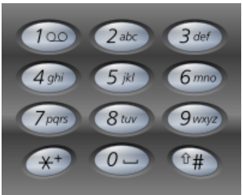

不需要优化，暴力递归就是最优解。

先搞一个映射。map[i] []，map[i]就是i按键代表的所有字符，是一个数组。

然后就去暴力递归，你把它要按的按键str传进去，然后就是暴力递归的常用做法，就是设置一个index，代表当前按到了str的哪个位置，你要去index 。。N-1继续去按。然后加一个path收集之前你按的路径。一个ans参数跟着收集答案。这里的path就是str等长的，所以直接用一个字符数组就行，这样就不需要自己去恢复现场了，因为赋值就代表了恢复现场。如果是LinkedList作为path，那么就需要去恢复现场了。但是这里我们知道path的长度，并且要填的位置就是index，所以我们不需要这么麻烦。


## code0019_删除链表的倒数第 N 个结点

```
给你一个链表，删除链表的倒数第 n 个结点，并且返回链表的头结点。
示例 1：
```

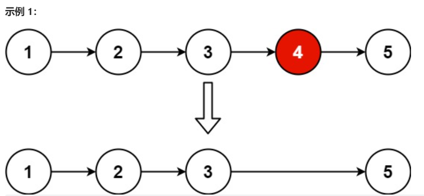

```
输入：head = [1,2,3,4,5], n = 2
输出：[1,2,3,5]

示例 2：
输入：head = [1], n = 1
输出：[]

示例 3：
输入：head = [1,2], n = 1
输出：[1]
 
提示：
链表中结点的数目为 sz
1 <= sz <= 30
0 <= Node.val <= 100
1 <= n <= sz

https://leetcode.cn/problems/remove-nth-node-from-end-of-list/
```

设计的函数应该是有返回类型的，因为可能有换头行为。找到要删除结点的前一个结点。比较难的事情就是用优雅的方式，使用最少的变量完成对边界的涵盖。


## code0020_有效的括号

```
给定一个只包括 '('，')'，'{'，'}'，'['，']' 的字符串 s ，判断字符串是否有效。

有效字符串需满足：
    左括号必须用相同类型的右括号闭合。
    左括号必须以正确的顺序闭合。
    每个右括号都有一个对应的相同类型的左括号。

示例 1：
输入：s = "()"
输出：true

示例 2：
输入：s = "()[]{}"
输出：true

示例 3：
输入：s = "(]"
输出：false

提示：
1 <= s.length <= 104
s 仅由括号 '()[]{}' 组成

https://leetcode.cn/problems/valid-parentheses/
```

参考IC01

策略：遇到左边就压栈，遇到右边就弹出，弹出来的左括号要和右括号匹配才行，全部走完之后，栈要为空。

这题有三种括号，不能用计数来做。但是如果只有小括号，那么就可以只用一个变量来做，遇到左括号++，遇到右括号--，整个过程变量不能小于0，且遍历到最后count为0，那么就有效。

这题有三种括号，用栈来做。


## code0022_括号生成

```
数字 n 代表生成括号的对数，请你设计一个函数，用于能够生成所有可能的并且有效的括号组合。

示例 1：
输入：n = 3
输出：["((()))","(()())","(())()","()(())","()()()"]

示例 2：
输入：n = 1
输出：["()"]
 
提示：1 <= n <= 8

https://leetcode.cn/problems/generate-parentheses/
```

这题如果不是要你返回所有的组合的话，而是要你返回种数，那么就是卡特兰特数的运用了，因为任何前缀上，左括号的数目都是大于等于右括号的。

这题是要你去返回所有的情况。那么就用两个变量来保证左括号的数量在任何0~index的前缀都大于等于右括号的数量，这样我们就在递归中去手动去剪枝了，比所有都生成了再去判断好。如果你不做剪枝，那么就在base去做验证。


## code0023_合并k个升序链表

```
给你一个链表数组，每个链表都已经按升序排列。

请你将所有链表合并到一个升序链表中，返回合并后的链表。

示例 1：
输入：lists = [[1,4,5],[1,3,4],[2,6]]
输出：[1,1,2,3,4,4,5,6]
解释：链表数组如下：
[
  1->4->5,
  1->3->4,
  2->6
]
将它们合并到一个有序链表中得到。
1->1->2->3->4->4->5->6

示例 2：
输入：lists = []
输出：[]

示例 3：
输入：lists = [[]]
输出：[]
 

提示：
    k == lists.length
    0 <= k <= 10^4
    0 <= lists[i].length <= 500
    -10^4 <= lists[i][j] <= 10^4
    lists[i] 按 升序 排列
    lists[i].length 的总和不超过 10^4

https://leetcode.cn/problems/merge-k-sorted-lists/
```

小根堆的运用。链表的头部放在里面，每次拿一个最小的串起来，然后更新堆顶为下一个结点，然后调整堆结构。用系统实现的也可以，每次删掉一个堆顶，然后放下一个进去。


## code0026_删除有序数组中的重复项

```
给你一个 升序排列 的数组 nums ，请你 原地 删除重复出现的元素，使每个元素 只出现一次 ，返回删除后数组的新长度。元素的 相对顺序 应该保持 一致 。然后返回 nums 中唯一元素的个数。

考虑 nums 的唯一元素的数量为 k ，你需要做以下事情确保你的题解可以被通过：

更改数组 nums ，使 nums 的前 k 个元素包含唯一元素，并按照它们最初在 nums 中出现的顺序排列。nums 的其余元素与 nums 的大小不重要。
返回 k 。

判题标准:
系统会用下面的代码来测试你的题解:

    int[] nums = [...]; // 输入数组
    int[] expectedNums = [...]; // 长度正确的期望答案

    int k = removeDuplicates(nums); // 调用

    assert k == expectedNums.length;
    for (int i = 0; i < k; i++) {
        assert nums[i] == expectedNums[i];
    }
如果所有断言都通过，那么您的题解将被通过。

示例 1：
输入：nums = [1,1,2]
输出：2, nums = [1,2,_]
解释：函数应该返回新的长度 2 ，并且原数组 nums 的前两个元素被修改为 1, 2 。不需要考虑数组中超出新长度后面的元素。

示例 2：
输入：nums = [0,0,1,1,1,2,2,3,3,4]
输出：5, nums = [0,1,2,3,4]
解释：函数应该返回新的长度 5 ， 并且原数组 nums 的前五个元素被修改为 0, 1, 2, 3, 4 。不需要考虑数组中超出新长度后面的元素。
 
提示：
    1 <= nums.length <= 3 * 104
    -104 <= nums[i] <= 104
    nums 已按 升序 排列

https://leetcode.cn/problems/remove-duplicates-from-sorted-array/
```

用有限几个变量可以搞定。用一个变量done表示0~done的范围上都是搞定的，cur去和done比较，如果不相等，那么cur的数就放到done+1位置，然后cur移动，done也移动。如果相等，那么就只cur动。


## code0029_两数相除

```
给你两个整数，被除数 dividend 和除数 divisor。将两数相除，要求 不使用 乘法、除法和取余运算。

整数除法应该向零截断，也就是截去（truncate）其小数部分。例如，8.345 将被截断为 8 ，-2.7335 将被截断至 -2 。

返回被除数 dividend 除以除数 divisor 得到的 商 。

注意：假设我们的环境只能存储 32 位 有符号整数，其数值范围是 [−231,  231 − 1] 。本题中，如果商 严格大于 231 − 1 ，则返回 231 − 1 ；如果商 严格小于 -231 ，则返回 -231 。

示例 1:
输入: dividend = 10, divisor = 3
输出: 3
解释: 10/3 = 3.33333.. ，向零截断后得到 3 。

示例 2:
输入: dividend = 7, divisor = -3
输出: -2
解释: 7/-3 = -2.33333.. ，向零截断后得到 -2 。
 

提示：
    -231 <= dividend, divisor <= 231 - 1
    divisor != 0

https://leetcode.cn/problems/divide-two-integers/
```

carry为0后，不进位相加就是答案。

```
00111+01010=10001
=========开始相加=============
===========第1轮===========
add   =     1101
carry =      100
===========第2轮===========
add   =     1001
carry =     1000
===========第3轮===========
add   =        1
carry =    10000
=========相加结束=============
res=17
10001
```

如果是减法呢？那么就是a+(-b)，那么也就是a+(~b+1)。这个加法全部都用上面我们实现的。

乘法怎么办？那么就是从低位到高位，通过位移再进行相加。每次剥掉num2的最低位，然后和num1位移相应的位数相加

```
num1 =      111
num2 =     1010
=========开始相乘=============
===========第1轮===========
num2=      101
res =        0
===========第2轮===========
num2=       10
res =     1110
===========第3轮===========
num2=        1
res =     1110
===========第4轮===========
num2=        0
res =  1000110
=========相乘结束=============
res=70
1000110
```

来看除法，因为系统最小的绝对值比系统最大的绝对值大，但是我们想用整数来做除法，所以我们要把有系统最小的情况给单独讨论。剩下的我们就可以用整数来做了。除数是系统最小很好讨论。问题是被除数是系统最小怎么办？用分配律，a/b=(a-b)/b + 1。也可以用(a-1)/b=x  => a - (x*b) = c   => res=x+c/b。把少算的结果再算一下，补偿回去。

如果a和b都是正数了，a/b就是从高到低，让b左移去接近a，但是不超过。然后a每次减掉b左移之后的数。然后b再重新去左移接近a，直到a减成0或者a小于0了。可以想想，似乎b不需要每次往左去重新移动，直接从移动31位开始试，一直试到0就行了。

```
>>和>>>区别在于>>>无论是正数还是负数，我都用0去填充高位，而>>在是负数的情况下，用1去填充高位

>> 是 Java 中的有符号右移位运算符，它将二进制数向右移动指定的位数，并在左侧用符号位填充。例如，1011010 >> 2 将得到 1110110，因为最左侧的符号位是 1。需要注意的是，如果 b 的最左侧位为 1，则在右移的过程中将一直填充 1。

>>> 是 Java 中的无符号右移位运算符，它将二进制数向右移动指定的位数，并在左侧填充零。例如，1011010 >>> 2 将得到 0010110。

在java中没有<<<，因为<<就等同于<<<的效果。
```


## code0033_搜索旋转排序数组

```
整数数组 nums 按升序排列，数组中的值互不相同 。

在传递给函数之前，nums 在预先未知的某个下标 k（0 <= k < nums.length）上进行了 旋转，使数组变为 [nums[k], nums[k+1], ..., nums[n-1], nums[0], nums[1], ..., nums[k-1]]（下标 从 0 开始 计数）。例如， [0,1,2,4,5,6,7] 在下标 3 处经旋转后可能变为 [4,5,6,7,0,1,2] 。

给你 旋转后 的数组 nums 和一个整数 target ，如果 nums 中存在这个目标值 target ，则返回它的下标，否则返回 -1 。

你必须设计一个时间复杂度为 O(log n) 的算法解决此问题。

示例 1：
输入：nums = [4,5,6,7,0,1,2], target = 0
输出：4

示例 2：
输入：nums = [4,5,6,7,0,1,2], target = 3
输出：-1

示例 3：
输入：nums = [1], target = 0
输出：-1
 
提示：
    1 <= nums.length <= 5000
    -104 <= nums[i] <= 104
    nums 中的每个值都 独一无二
    题目数据保证 nums 在预先未知的某个下标上进行了旋转
    -104 <= target <= 104

https://leetcode.cn/problems/search-in-rotated-sorted-array/
```

旋转之后分为了两段，需要判断mid处于哪一段中。和L比较，如果>=[L]那么就是处于上半部分

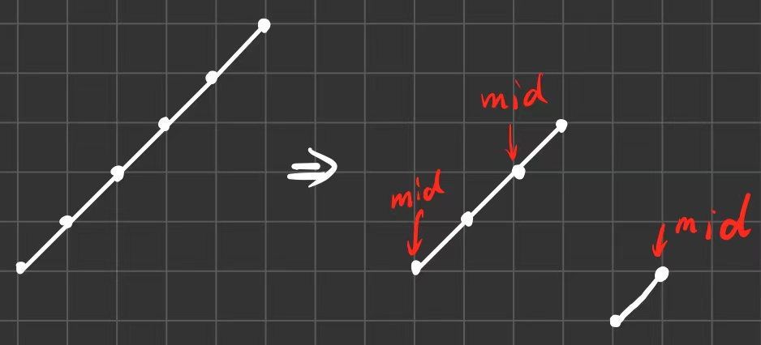


二分，但是如果L==R==M，那么就不能二分，你去手动移动L位置，直到三个不相等了再去二分。

## code0034_在排序数组中查找元素的第一个和最后一个位置

```
给你一个按照非递减顺序排列的整数数组 nums，和一个目标值 target。请你找出给定目标值在数组中的开始位置和结束位置。

如果数组中不存在目标值 target，返回 [-1, -1]。

你必须设计并实现时间复杂度为 O(log n) 的算法解决此问题。

示例 1：
输入：nums = [5,7,7,8,8,10], target = 8
输出：[3,4]

示例 2：
输入：nums = [5,7,7,8,8,10], target = 6
输出：[-1,-1]

示例 3：
输入：nums = [], target = 0
输出：[-1,-1]

提示：
    0 <= nums.length <= 105
    -109 <= nums[i] <= 109
    nums 是一个非递减数组
    -109 <= target <= 109

https://leetcode.cn/problems/find-first-and-last-position-of-element-in-sorted-array
```

使用二分，找>=x最左和<=x最右的位置。


## code0036_有效的数独

```
请你判断一个 9 x 9 的数独是否有效。只需要 根据以下规则 ，验证已经填入的数字是否有效即可。

数字 1-9 在每一行只能出现一次。
数字 1-9 在每一列只能出现一次。
数字 1-9 在每一个以粗实线分隔的 3x3 宫内只能出现一次。（请参考示例图）

注意：
    一个有效的数独（部分已被填充）不一定是可解的。
    只需要根据以上规则，验证已经填入的数字是否有效即可。
    空白格用 '.' 表示。
 
示例 1：
```

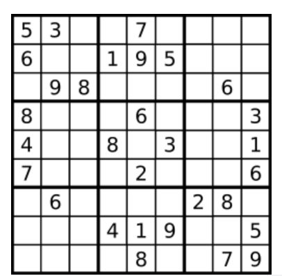

```
输入：board = 
[["5","3",".",".","7",".",".",".","."]
,["6",".",".","1","9","5",".",".","."]
,[".","9","8",".",".",".",".","6","."]
,["8",".",".",".","6",".",".",".","3"]
,["4",".",".","8",".","3",".",".","1"]
,["7",".",".",".","2",".",".",".","6"]
,[".","6",".",".",".",".","2","8","."]
,[".",".",".","4","1","9",".",".","5"]
,[".",".",".",".","8",".",".","7","9"]]
输出：true

示例 2：
输入：board = 
[["8","3",".",".","7",".",".",".","."]
,["6",".",".","1","9","5",".",".","."]
,[".","9","8",".",".",".",".","6","."]
,["8",".",".",".","6",".",".",".","3"]
,["4",".",".","8",".","3",".",".","1"]
,["7",".",".",".","2",".",".",".","6"]
,[".","6",".",".",".",".","2","8","."]
,[".",".",".","4","1","9",".",".","5"]
,[".",".",".",".","8",".",".","7","9"]]
输出：false
解释：除了第一行的第一个数字从 5 改为 8 以外，空格内其他数字均与 示例1 相同。 但由于位于左上角的 3x3 宫内有两个 8 存在, 因此这个数独是无效的。

https://leetcode.cn/problems/valid-sudoku
```

数独就是大方块的行和列1~9只能使用一次，一个小方块里面9个数，1~9只能使用一遍。

剪枝是我们要养成习惯的做法，因为如果你每次都是生成完所有的情况再去检查，你时间肯定不过！

这题是让你判断它给你的这个棋盘是不是一个有效的棋盘，不用你填好答案或者判断是否有解。还有另外一道题，也就是下一道题37，是叫你把答案返回的。

用二维布尔类型的数组做映射 [row] [num]，代表第row行有没有出现过num。同理第col行有没有出现过num。同理第x个小方块有没有出现过num。然后从头到尾遍历一遍，有数就填我们的映射数组，改为true，如果下次出现的一个数字撞上了，那么就是无效的棋盘。


## code0037_解数独

```
编写一个程序，通过填充空格来解决数独问题。

数独的解法需 遵循如下规则：

数字 1-9 在每一行只能出现一次。
数字 1-9 在每一列只能出现一次。
数字 1-9 在每一个以粗实线分隔的 3x3 宫内只能出现一次。（请参考示例图）
数独部分空格内已填入了数字，空白格用 '.' 表示。

示例 1：
```

| 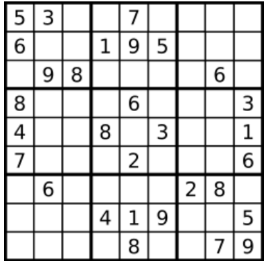 | 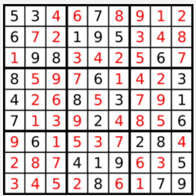 |
| ------------------------------------------------------------ | ------------------------------------------------------------ |

```
输入：
board = 
[["5","3",".",".","7",".",".",".","."],["6",".",".","1","9","5",".",".","."],[".","9","8",".",".",".",".","6","."],["8",".",".",".","6",".",".",".","3"],["4",".",".","8",".","3",".",".","1"],["7",".",".",".","2",".",".",".","6"],[".","6",".",".",".",".","2","8","."],[".",".",".","4","1","9",".",".","5"],[".",".",".",".","8",".",".","7","9"]]
输出：
[["5","3","4","6","7","8","9","1","2"],["6","7","2","1","9","5","3","4","8"],["1","9","8","3","4","2","5","6","7"],["8","5","9","7","6","1","4","2","3"],["4","2","6","8","5","3","7","9","1"],["7","1","3","9","2","4","8","5","6"],["9","6","1","5","3","7","2","8","4"],["2","8","7","4","1","9","6","3","5"],["3","4","5","2","8","6","1","7","9"]]
解释：输入的数独如上图所示，唯一有效的解决方案如上所示：

提示：
    board.length == 9
    board[i].length == 9
    board[i][j] 是一位数字或者 '.'
    题目数据保证输入数独仅有一个解

https://leetcode.cn/problems/sudoku-solver
```

利用我们36题的三个映射map，走进去剪枝，建立现场恢复现场，有剪枝，递归跑的很快。


## code0038_外观数列

```
给定一个正整数 n ，输出外观数列的第 n 项。

「外观数列」是一个整数序列，从数字 1 开始，序列中的每一项都是对前一项的描述。

你可以将其视作是由递归公式定义的数字字符串序列：

countAndSay(1) = "1"
countAndSay(n) 是对 countAndSay(n-1) 的描述，然后转换成另一个数字字符串。
前五项如下：

1.     1
2.     11
3.     21
4.     1211
5.     111221
第一项是数字 1 
描述前一项，这个数是 1 即 “ 一 个 1 ”，记作 "11"
描述前一项，这个数是 11 即 “ 二 个 1 ” ，记作 "21"
描述前一项，这个数是 21 即 “ 一 个 2 + 一 个 1 ” ，记作 "1211"
描述前一项，这个数是 1211 即 “ 一 个 1 + 一 个 2 + 二 个 1 ” ，记作 "111221"
要 描述 一个数字字符串，首先要将字符串分割为 最小 数量的组，每个组都由连续的最多 相同字符 组成。然后对于每个组，先描述字符的数量，然后描述字符，形成一个描述组。要将描述转换为数字字符串，先将每组中的字符数量用数字替换，再将所有描述组连接起来。

例如，数字字符串 "3322251" 的描述如下图：
```

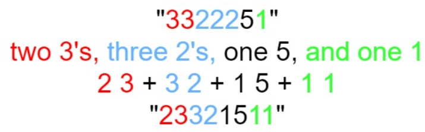

```
示例 1：
输入：n = 1
输出："1"
解释：这是一个基本样例。

示例 2：
输入：n = 4
输出："1211"
解释：
countAndSay(1) = "1"
countAndSay(2) = 读 "1" = 一 个 1 = "11"
countAndSay(3) = 读 "11" = 二 个 1 = "21"
countAndSay(4) = 读 "21" = 一 个 2 + 一 个 1 = "12" + "11" = "1211"
 
提示：1 <= n <= 30

https://leetcode.cn/problems/count-and-say
```

就是一个递归，你要读n，那么你要先把n-1的字符串告诉我，然后我给你读出来。


## code0041_缺失的第一个正数

```
给你一个未排序的整数数组 nums ，请你找出其中没有出现的最小的正整数。

请你实现时间复杂度为 O(n) 并且只使用常数级别额外空间的解决方案。
 
示例 1：
输入：nums = [1,2,0]
输出：3

示例 2：
输入：nums = [3,4,-1,1]
输出：2

示例 3：
输入：nums = [7,8,9,11,12]
输出：1
 
提示：
1 <= nums.length <= 5 * 105
-231 <= nums[i] <= 231 - 1

https://leetcode.cn/problems/first-missing-positive
```

用双指针来解决，一个L一个R。

L所在的位置代表从[0,L-1]上任取一个位置i，上面的数是i+1。也就是从0~L-1放的值是1~L。

R+1代表你没有看过的部分假设是最优的预期，你缺的正数的什么。为什么让要让R一开始指向十，我一开始什么也没看，那么最右预期是1~10这些数字全都有，所以缺失的最小的正数就是11=10+1。

上来给我一个-7，我明确知道这个数我不需要，那么就和R位置的前一个交换，然后R往前移动一个位置，来到9，此时含义还是维持住的，因为前面即便是最好的情况，10也是确实的数字。

假设换来的是15，15肯定也不是我需要的，因为我需要的是1~R，也就是1~9这些数字，你15我也是不需要的，和上面一样，继续和R前面的位置交换，R前移。

假设现在换了个9到最前面，9>R，所以依然是我们不需要的，继续交换，R前移。

所以哪些情况是L位置的数我们不需要，要和R前一个位置交换，并且R前移。L位置的数<=L或者>R都不是我们需要的。

还有一种不需要的条件，就是当前揭晓的在L上的数字是V，这个V>L且V<=R，这个时候你应该把V这个值放到V-1的位置上，也就是L位置要和V-1位置交换，如果你发现V-1位置本来就是V，那么你这个数也不是我需要的，因为那个位置已经躺好了我需要的数了。这样L和R相遇的时候就知道你缺谁了。

L移动的条件就是刚好换过来的数等于L+1。如果L位置数V>L且V<=R且V-1上面的位置不是V，那么就换过去，这个时候L不用动。

| 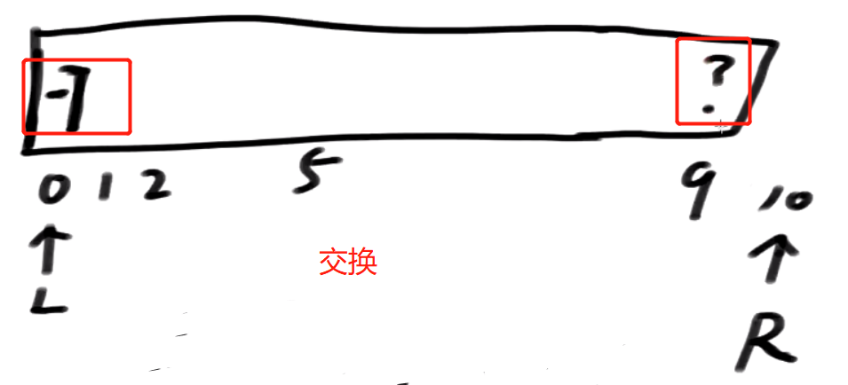 | 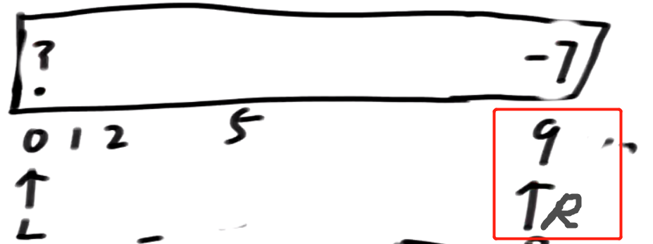 |
| ------------------------------------------------------------ | ------------------------------------------------------------ |
| 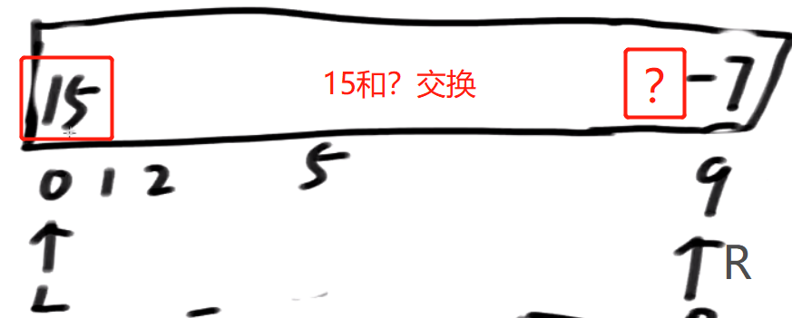 | 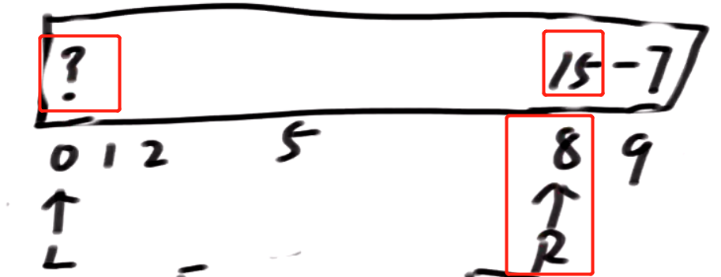 |
| 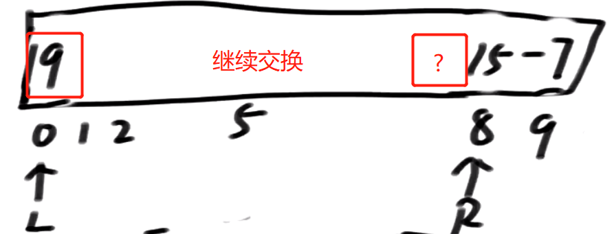 | 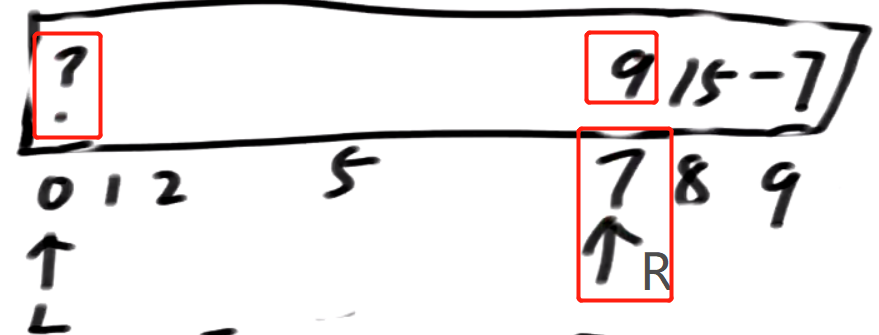 |

这题怎么在面试场上装作你没做过？通过荷兰国旗问题！

- 这题可以改成从k开始缺失的第一个数。详见code！


## code0042_接雨水

```
给定 n 个非负整数表示每个宽度为 1 的柱子的高度图，计算按此排列的柱子，下雨之后能接多少雨水。

示例 1：
输入：height = [0,1,0,2,1,0,1,3,2,1,2,1]
输出：6
解释：下图是由数组 [0,1,0,2,1,0,1,3,2,1,2,1] 表示的高度图，在这种情况下，可以接 6 个单位的雨水（蓝色部分表示雨水）。 

示例 2：
输入：height = [4,2,0,3,2,5]
输出：9

提示：
n == height.length
1 <= n <= 2 * 104
0 <= height[i] <= 105

https://leetcode.cn/problems/trapping-rain-water
```


一个位置i能装多上水，取决于左右两边最高的柱子中的最小值。用预处理数组帮你搞定。

最糙的就是搞两个辅助数组，一个告诉你左边最高，一个告诉你右边最高。

优化一点就是只有一个辅助数组，然后另外一个最大值我们用一个变量随着我们遍历过程抓住。

再来就是完全不用辅助空间。就是左右指针L、R，加上两个变量lmax，rmax分别是左右两边的最大高度。左右高度哪个小，就结算哪边的指针位置。例如此时lmax比较小，那么l就不用担心在远方的rmax。

这和LT11_盛最多水的容器 很像，如果是取决于左右两边最大值的最小值的话，那么你可以想想能不能用双指针来省掉辅助数组。


## code0043_通配符匹配

```
给你一个输入字符串 (s) 和一个字符模式 (p) ，请你实现一个支持 '?' 和 '*' 匹配规则的通配符匹配：
'?' 可以匹配任何单个字符。
'*' 可以匹配任意字符序列（包括空字符序列）。
判定匹配成功的充要条件是：字符模式必须能够 完全匹配 输入字符串（而不是部分匹配）。
 
示例 1：
输入：s = "aa", p = "a"
输出：false
解释："a" 无法匹配 "aa" 整个字符串。

示例 2：
输入：s = "aa", p = "*"
输出：true
解释：'*' 可以匹配任意字符串。

示例 3：
输入：s = "cb", p = "?a"
输出：false
解释：'?' 可以匹配 'c', 但第二个 'a' 无法匹配 'b'。
 
提示：
0 <= s.length, p.length <= 2000
s 仅由小写英文字母组成
p 仅由小写英文字母、'?' 或 '*' 组成

https://leetcode.cn/problems/wildcard-matching
```

这题和第十题的正则表达式匹配很像。只是这题的*不用和前面的搭配使用，这里的 * 是可以代表任何字符串的，甚至可以是0长度的空串。

还是一个样本做行一个做列，只不过可能性划分变了。

还是老流程，暴力递归改动态规划。

然后动态规划只有在*的时候有枚举，然后做一下斜率优化，看看附近的格子能不能帮我把枚举行为替代。依赖的格子是往下的，所以就找自己下面的格子就行了，所以就是右边格子或上下面的格子就是答案。

如果换一题，依赖的位置是往左的，那么就找自己左边的格子。

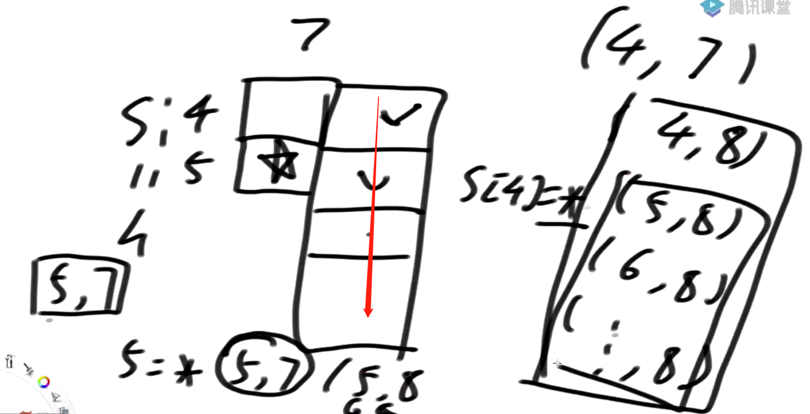


## code0045_跳跃游戏II

这题和55题一起看

```
给定一个长度为 n 的 0 索引整数数组 nums。初始位置为 nums[0]。

每个元素 nums[i] 表示从索引 i 向前跳转的最大长度。换句话说，如果你在 nums[i] 处，你可以跳转到任意 nums[i + j] 处:

0 <= j <= nums[i] 
i + j < n
返回到达 nums[n - 1] 的最小跳跃次数。生成的测试用例可以到达 nums[n - 1]。

示例 1:
输入: nums = [2,3,1,1,4]
输出: 2
解释: 跳到最后一个位置的最小跳跃数是 2。
     从下标为 0 跳到下标为 1 的位置，跳 1 步，然后跳 3 步到达数组的最后一个位置。

示例 2:
输入: nums = [2,3,0,1,4]
输出: 2
 

提示:
1 <= nums.length <= 104
0 <= nums[i] <= 1000
题目保证可以到达 nums[n-1]

https://leetcode.cn/problems/jump-game-ii
```

这题还是可以动态规划，但是斜率优化就难了，因为这题右边的那一格枚举的数量是随机的，不好被我们这格利用。

还是可以用几个优先变量做出来，比55题多了一个step。i代表当前来到的位置，R代表当前步数能到达的最远的位置，nextR为下一步能蹦到的最远的位置，step至少蹦几步到当前的i位置。


### FollowUp

```
给你一个arr，叫你从srart位置跳到end位置。arr[i]值代表你只能严格往左或者往右蹦arr[i]步。最少几步能到
```

搞一个递归，宽度优先遍历去。并且要保证重复的结点不要多次进队列里面。

和IC5结合看，都是层序遍历求最短距离，不能往回走。

原理很简单，因为往回走了路径肯定比一开始就在这里的长。这题宽度优先就是最优解。为什么45题不用宽度优先？因为如果宽度优先，那么一层里面的数量会很多，二这题一层里面最多两个。

如果这题要动态规划，也就是说要用暴力递归去尝试。如果你递归含义定义为从start位置蹦到end位置，只有start一个可变参数。那么也是不行的，因为一个位置依赖左边，又依赖右边，所以可能会出现锁死的情况，说明你条件给的不够。所以我们需要一个结构来标记一个位置之前有没有走过，在暴力递归中才能进行剪枝，不会锁死。但是其实这样和我们的层序遍历也差不多了，至少需要的结构差不多。

但是这样你的动态规划就不是一个普通的变量了，是一张boolean类型的表，可以用状态压缩，但是即便这样，也不好，因为碰撞的概率不高。

所以这个带着boolean数组的猜法不好。既然不能用数组来剪枝，我们还可以用什么剪枝？可以用当前走过的距离来剪枝，多带一个参数n代表当前走过的步数。我们知道我们最多走N步，也就是走一个数组的长度，因为如果超过了N步，说明你到一个位置到了两次，这是完全没必要的。

这种暴力递归就可以改成动态规划版本了。


## code0046_全排列

```
给定一个不含重复数字的数组 nums ，返回其 所有可能的全排列 。你可以 按任意顺序 返回答案。

示例 1：
输入：nums = [1,2,3]
输出：[[1,2,3],[1,3,2],[2,1,3],[2,3,1],[3,1,2],[3,2,1]]

示例 2：
输入：nums = [0,1]
输出：[[0,1],[1,0]]

示例 3：
输入：nums = [1]
输出：[[1]]
 

提示：
1 <= nums.length <= 6
-10 <= nums[i] <= 10
nums 中的所有整数 互不相同

https://leetcode.cn/problems/permutations
```

直接一个深度优先遍历，用一个容器去重，用另一个容器收集答案，暴力递归搞定。

还有一种方法，直接在数组的原地进行交换。i位置和i~N-1位置做交换，也是去深度优先遍历。

如果arr中有重复值，那么你就在递归函数里面加一个set，后面如果又遇到一个一样的，你就不用去试了！


## code0047_全排列II

```
给定一个可包含重复数字的序列 nums ，按任意顺序 返回所有不重复的全排列。

示例 1：
输入：nums = [1,1,2]
输出：
[[1,1,2],
 [1,2,1],
 [2,1,1]]
 
示例 2：
输入：nums = [1,2,3]
输出：[[1,2,3],[1,3,2],[2,1,3],[2,3,1],[3,1,2],[3,2,1]]
 

提示：
1 <= nums.length <= 8
-10 <= nums[i] <= 10

https://leetcode.cn/problems/permutations-ii
```

在递归枚举的时候用一个set跳过之前枚举过的值即可

## code0048_旋转图像

```
给定一个 n × n 的二维矩阵 matrix 表示一个图像。请你将图像顺时针旋转 90 度。

你必须在 原地 旋转图像，这意味着你需要直接修改输入的二维矩阵。请不要 使用另一个矩阵来旋转图像。

https://leetcode.cn/problems/rotate-image
```

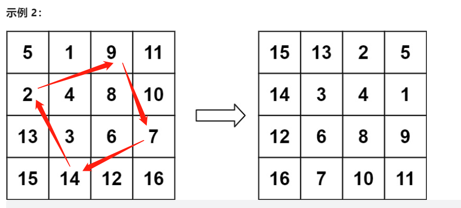

看上图10的走向，其实就是交换三次。一个正方形一个正方形的往里走。外层正方形需要交换三轮，每轮交换3次。

由于是n * n 的矩阵所以我们只需要固定r1和r2就知道是哪一个正方形了，假设本轮的正方形长度为x，那么就需要交换x-1轮。然后根据第几轮算出哪些具体的坐标要交换。

下面坐标中c1=r1，c2=r2，是第i轮

10：r1+i , c2

1 : r1,c1+i

13 : r2-i,c1

12: r2,c2-i

- 这种旋转的题目，经常的思维就是，一圈一圈处理	


### 打印星号

拓展。按照如下分解。每次按照左上角点和右下角点打印。迭代各自斜着跳两格。

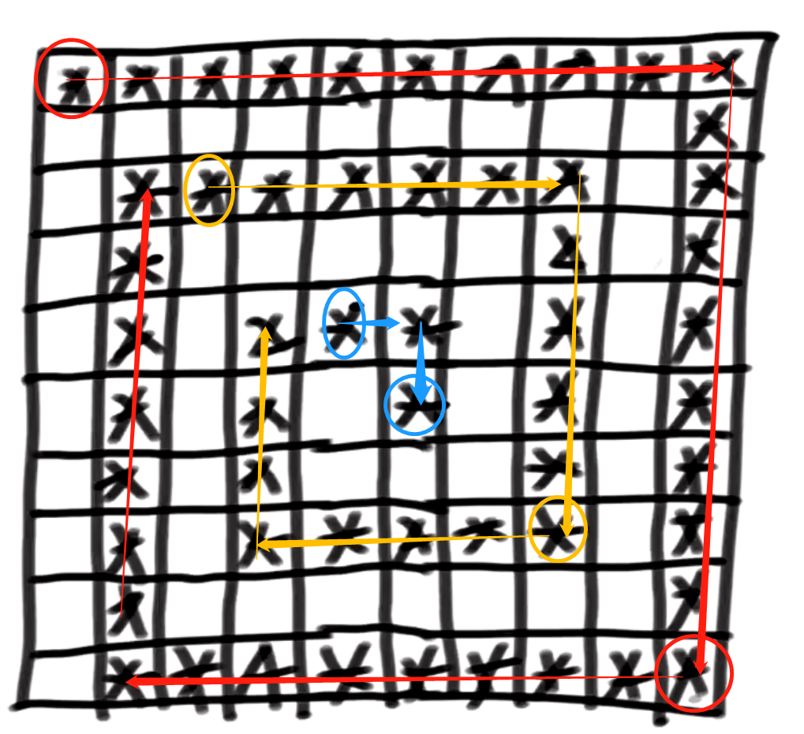


## code0049_字母异位词分组

```
给你一个字符串数组，请你将 字母异位词 组合在一起。可以按任意顺序返回结果列表。

字母异位词 是由重新排列源单词的字母得到的一个新单词，所有源单词中的字母通常恰好只用一次。

示例 1:
输入: strs = ["eat", "tea", "tan", "ate", "nat", "bat"]
输出: [["bat"],["nat","tan"],["ate","eat","tea"]]

示例 2:
输入: strs = [""]
输出: [[""]]

示例 3:
输入: strs = ["a"]
输出: [["a"]]
 
提示：
1 <= strs.length <= 104
0 <= strs[i].length <= 100
strs[i] 仅包含小写字母

https://leetcode.cn/problems/group-anagrams
```

两种方法，看菜下饭。

第一种先找出某一个单词的所有全排列，然后去set中寻找有没有中的，这种方法在单词长度k短的时候用。复杂度为K² * N

第二种方法是在String上i位置，一个一个去和i+1~N-1位置的str匹配，如果匹配成功就加入，匹配的方法就是字符数相同，且每种字符的种类的数量也相同。这种方法数组短的时候用。复杂度为N² * K

第二种方法可以优化，我们不需要两层for循环，只需一层就行了，因为我们可以找到字母异位词的代表串，排序或者是统计词频然后生成一个唯一的cstr都行。核心思想就是得到一个代表串，然后可以通过代表串找到放在HashMap里面的集合。


## code0050_Pow(x,n)

```
实现 pow(x, n) ，即计算 x 的整数 n 次幂函数（即，xn ）。

示例 1：
输入：x = 2.00000, n = 10
输出：1024.00000

示例 2：
输入：x = 2.10000, n = 3
输出：9.26100

示例 3：
输入：x = 2.00000, n = -2
输出：0.25000
解释：2-2 = 1/22 = 1/4 = 0.25

提示：
-100.0 < x < 100.0
-231 <= n <= 231-1
n 是一个整数
-104 <= xn <= 104

https://leetcode.cn/problems/powx-n
```

```
 x^10 = 1*x^8 + 0*x^4 + 1*x^2 + 0*x^1
      = 1*x^(2^3) + 0*x^(2^2) + 1*x^(2^1) + 0*x^(2^0)
```

把n按照二进制拆开，从低到高算。

不需要用负数接着，该是什么就是什么。但是n次方要转成整数，要注意n是系统最小的情况。

## code0053_最大子数组和

```
给你一个整数数组 nums ，请你找出一个具有最大和的连续子数组（子数组最少包含一个元素），返回其最大和。

子数组 是数组中的一个连续部分。

示例 1：
输入：nums = [-2,1,-3,4,-1,2,1,-5,4]
输出：6
解释：连续子数组 [4,-1,2,1] 的和最大，为 6 。

示例 2：
输入：nums = [1]
输出：1

示例 3：
输入：nums = [5,4,-1,7,8]
输出：23

提示：
1 <= nums.length <= 105
-104 <= nums[i] <= 104

https://leetcode.cn/problems/maximum-subarray
```

这题的动态规划是子数组三连问题第三道求解的前置知识！求必须以i结尾的答案。做完之后可以空间压缩。

- 这题的动态规划定义为以i结尾的答案会比较好求，因为子数组要求连续，如果定义为0~i整体的答案，到i位置的时候   i-1位置的答案是不是以i-1位置结尾你是不知道的。

还有一种用一个cur去滑的，滑到负了就变为0，中途可以抓到最大值

这题还可以进行分治法


### followUp

```
不能选相邻的数，问你最大的序列累加和
```

dp[i]不定义为必须以i结尾了，定义为0~i整体的答案。

可能性：

1. 与x有关，max{arr[i]+dp[i-2], arr[i]}
2. 与x无关，dp[i-1]

要不要定义为必须以i结尾，取决于可能性好不好划分，这题如果定义为必须以i结尾，就需要去枚举前面的0~i-2。

- 经验：子数组，子串，就定义为必须以i结尾。组合、子序列问题就定义为0~i范围的答案。

## code0054_螺旋矩阵

```
给你一个 m 行 n 列的矩阵 matrix ，请按照 顺时针螺旋顺序 ，返回矩阵中的所有元素。
https://leetcode.cn/problems/spiral-matrix/
```

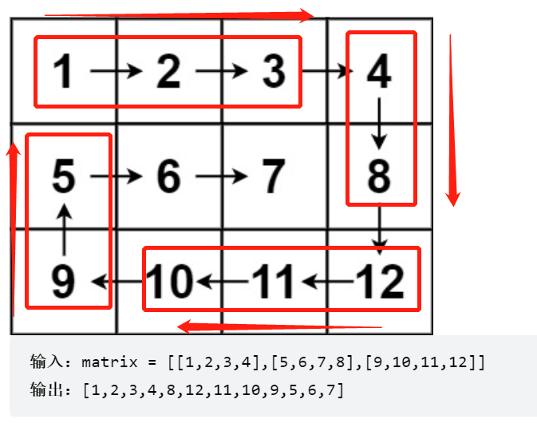

其实就是一个长方形一个长方形的打印。

用四个变量确定长方形。打印四轮，每一轮打印（长-1）或者（宽-1），注意边界条件


## code0055_跳跃游戏

和45题一起

```
给定一个非负整数数组 nums ，你最初位于数组的 第一个下标 。

数组中的每个元素代表你在该位置可以跳跃的最大长度。

判断你是否能够到达最后一个下标。

示例 1：
输入：nums = [2,3,1,1,4]
输出：true
解释：可以先跳 1 步，从下标 0 到达下标 1, 然后再从下标 1 跳 3 步到达最后一个下标。

示例 2：
输入：nums = [3,2,1,0,4]
输出：false
解释：无论怎样，总会到达下标为 3 的位置。但该下标的最大跳跃长度是 0 ， 所以永远不可能到达最后一个下标。
 
提示：
1 <= nums.length <= 3 * 104
0 <= nums[i] <= 105

https://leetcode.cn/problems/jump-game
```

这题你在一个位置，你只能往后跳，所以你依赖的是后面的格子，所以直接憋动态规划，动态规划也是从右往左填的。含义就是从i位置开跳能不能跳到N-1位置。这种做出来了之后有一个枚举，往右边去枚举的，所以看看右边的格子能不能帮我们省掉部分枚举。

这题动态规划省掉枚举之后效率还是可以的，但是还有一种做法是只用有限几个变量即可，用一个变量表示当前能到达的最右边界，然后从左往右推，一直更新右边界。如果有一个位置i超过右边界了，那么说明到不了。


## code0056_合并区间

```
以数组 intervals 表示若干个区间的集合，其中单个区间为 intervals[i] = [starti, endi] 。请你合并所有重叠的区间，并返回 一个不重叠的区间数组，该数组需恰好覆盖输入中的所有区间 。

示例 1：
输入：intervals = [[1,3],[2,6],[8,10],[15,18]]
输出：[[1,6],[8,10],[15,18]]
解释：区间 [1,3] 和 [2,6] 重叠, 将它们合并为 [1,6].

示例 2：
输入：intervals = [[1,4],[4,5]]
输出：[[1,5]]
解释：区间 [1,4] 和 [4,5] 可被视为重叠区间。
 

提示：
1 <= intervals.length <= 104
intervals[i].length == 2
0 <= starti <= endi <= 104

https://leetcode.cn/problems/merge-intervals
```

和IC21那题要区分开，那题的数是一个一个来的，所以我们可以用Map做，但是这题是一个区间来的，所以不好用Map。

这题按照区间开头排序，找出开头相同，结尾最大的作为相同开头的代表区间。找出每一个开头的代表区间。然后再去代表区间中合并。代表区间中，开头如果在前面一个区间的结尾以内，并且结尾位置没有比前面位置的结尾大，那么就被吞掉，否则就扩大结尾位置。


## code0062_不同路径

```
一个机器人位于一个 m x n 网格的左上角 （起始点在下图中标记为 “Start” ）。

机器人每次只能向下或者向右移动一步。机器人试图达到网格的右下角（在下图中标记为 “Finish” ）。

问总共有多少条不同的路径？

https://leetcode.cn/problems/unique-paths
```

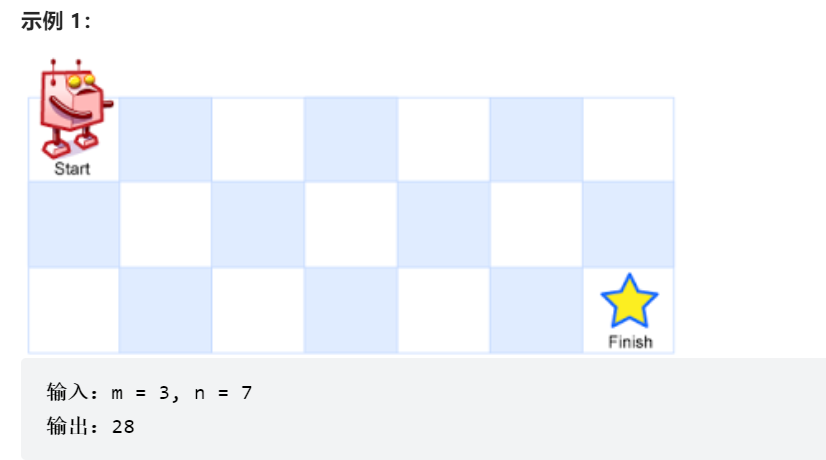

这题很简单，总共n+m-2步，选m-1往右走，剩下的n-1都是往下走，一个C（m+n-2，m-1）组合公式搞定。

接下来就是计算这个公式了，要防止溢出，所以在过程中要边约分边计算。


## code0066_加一

```
给定一个由 整数 组成的 非空 数组所表示的非负整数，在该数的基础上加一。

最高位数字存放在数组的首位， 数组中每个元素只存储单个数字。

你可以假设除了整数 0 之外，这个整数不会以零开头。

示例 1：
输入：digits = [1,2,3]
输出：[1,2,4]
解释：输入数组表示数字 123。

示例 2：
输入：digits = [4,3,2,1]
输出：[4,3,2,2]
解释：输入数组表示数字 4321。

示例 3：
输入：digits = [0]
输出：[1]
 
提示：
1 <= digits.length <= 100
0 <= digits[i] <= 9

https://leetcode.cn/problems/plus-one
```

关键操作

```java
		while(--i>=0&&digits[i]==9) digits[i]=0;//找到第一个不为9的位置，并把前面为9的位置都改为0
		等价于
        while(--i>=0&&!(digits[i]!=9)) digits[i]=0;
```


## code0069_x的平方根

```
给你一个非负整数 x ，计算并返回 x 的 算术平方根 。

由于返回类型是整数，结果只保留 整数部分 ，小数部分将被 舍去 。

注意：不允许使用任何内置指数函数和算符，例如 pow(x, 0.5) 或者 x ** 0.5 。

示例 1：
输入：x = 4
输出：2

示例 2：
输入：x = 8
输出：2
解释：8 的算术平方根是 2.82842..., 由于返回类型是整数，小数部分将被舍去。
 
提示：
0 <= x <= 231 - 1

https://leetcode.cn/problems/sqrtx
```

直接去二分，二分到底，找平方之后小于x最右的数，也就是满足就l动，l动就会往右找，最后l==r的时刻，r左移来到答案的位置。


## code0070_爬楼梯

```
//f(n)=f(n-1)+f(n-2)  f(1)=1,f(2)=2
```

用上面递归式，迭代求解

## code0073_矩阵置零

https://leetcode.cn/problems/set-matrix-zeroes/

类似于泡泡堂的游戏。

不用辅助矩阵，在原始矩阵上调整，难点在于在原始矩阵上原地调整，如果遇到0就改，我们要解决遍历的过程中遇到的零是不是前面改的。

既然不能申请空间，那么我就创造空间。现在第一行和第一列找看看有没有0，把有没有0的信息记录在两个变量里面，那么我就可以把第一行和第一列当做我的辅助空间，上面记录着对应的行和列要不要变0。

## code0075_颜色分类

三向切分，荷兰国旗问题


## code0076_最小覆盖子串

滑动窗口+记账的技巧


## code0078_子集

一个递归搞定，注意恢复现场，以及base case 加入path的时候new一下新的再加进去。

就是收集所有子序列的问题。


## code0079_单词搜索

https://leetcode.cn/problems/word-search/

暴力递归搞定，看你是登上去之后检查格子还是登上去之前检查格子


## code0088_合并两个有序数组

https://leetcode.cn/problems/merge-sorted-array/

归并排序的merge，但是两个指针从尾部开始，然后放到arr1的后面，这样就怕有覆盖问题了。


## code0127_单词接龙

首先找出所有单词的邻居，搞处一张图。然后宽度优先遍历，找到最短路径即可，注意建立不走回头路的机制。当长度都认为是1的时候，求最短路径可以用宽度优先遍历来代替。

建立图有两种方法，一种是遍历N，然后从头遍历一遍N，找邻居，这样就是N²K的复杂度。但是如果你提前把所有的单词放到一个set里面，你每到一个单词，都可以把它的所有位置的字符都变为26个字母，然后到set里面找，这样复杂度就是K²*N，因为它告诉你只有小写字母。

看菜下饭。

还可以优化，每次从end和start中的小头开始走，这种coding更巧妙！


## code0134_加油站

dis[i]代表从i到i+1的距离。i为N-1的时候指的是到0位置的距离，也就是需要消耗的油。要你返回一个数组，代表你一滴油也没有，能不能从一个加油站出发转一圈。

做一个简化，做出一个储能值数组，oil-dis。变成你从一个加油站出发可以储存的油。那么你从一个点出发，如果储能值数组的累加和没有出现过0以下，那么就是一个良好出发点。这样一来我们至少可以用N²的算法搞定，我们每一个位置转一圈。


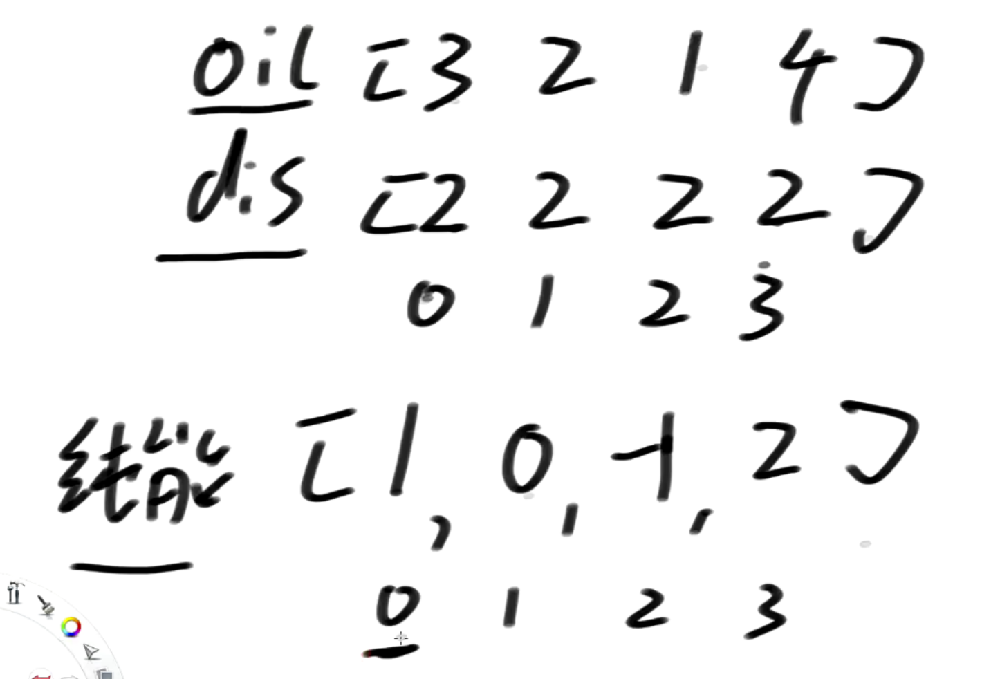


更近一步，把储能数组再加工出一个前缀和数组，准确的说，是两倍长的前缀和数组，这样我们就可以模拟出一个环了，你从任何一个结点出发的累加和，即使是一个环，我们也可以用这个两倍长的前缀和数组加工出来。前面说沿途的累加和不能到0以下，而从0出发沿途的累加和就在一次出现在数组的前面几个位置上。但是1出发的怎么办呢，我们只需把后面的数统一把前缀减掉就行了。例如从0出发的窗口是[6,5,3,7,5,1]那么从1出发的窗口就是[5,3,7,5,1,7]统一减掉前缀6，那么就变成了[-1,-3,1,-1,-5,1]。这样就转化为了滑动窗口

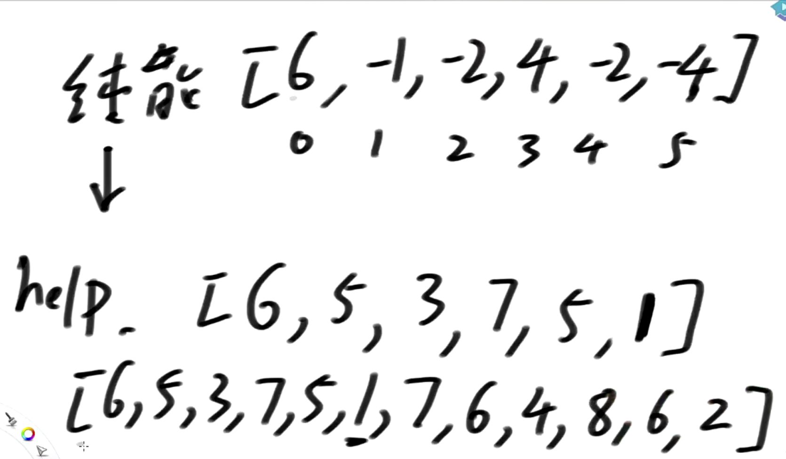

能不能用有限几个变量，并且做完之后你给我的初始数组我不给你弄脏，我还给你改回来。我们不改变dis，只把oil数组改成储能值数组，我们是可以还原回去的。

储能数组一定有非负数，否则就直接返回flase。找储能数组的任意一个非负值作为初始出发点。用rest、need、s、e来玩。逆时针转，rest是剩余的油、need是你的顺时针方向的那个点连到你的条件，need初始值为0，s和e表示连通区。

一个点出发先逆时针扩，扩到阔不动了，去顺时针看看能连到自己的点，看看加上他们能不能帮助自己冲过瓶颈，如果你找遍了顺时针的联通区以外的点都没有办法冲破瓶颈，那么说明联通区里面的点全部都是false。一旦你发现一个点转回自己了，那么你就只需要去关心顺时针的点能不能连到自己，如果可以连到自己，那么就是Ture。


## code0163_缺失区间

```
给定一个排序的整数数组 nums，其中元素的范围在 [lower, upper]（包括边界）之内，返回所有缺失的区间。

示例 1： 输入：nums = [0, 1, 3, 50, 75], lower = 0, upper = 99 
输出：["2", "4->49", "51->74", "76->99"] 
解释：在范围 [0, 99] 内，缺失的区间有：2，4 到 49，51 到 74，76 到 99。
```

解决这个问题的一种思路是，遍历数组 nums，使用两个指针 start 和 end 来标记缺失区间的起始和结束。初始时，start 和 end 均为 lower。在遍历数组时，如果当前元素与 start 相等，则将 start 更新为当前元素加 1。如果当前元素与 start 不相等，则表示存在一个缺失区间，将其加入结果数组中。

当遍历结束后，需要处理可能存在的最后一个缺失区间。如果 start 小于等于 upper，则表示存在一个缺失区间，将其加入结果数组中。最后，返回结果数组即可。


## code0251_Flatten2DVector

```
题目描述：
设计并实现一个迭代器，用来展开二维向量。该迭代器需要支持next和hasNext两种操作。

示例：
输入:
[[1,2],[3],[4,5,6]]

输出: [1,2,3,4,5,6]
```


题目就是叫你实现一个二维数组的迭代器。给你一个二维数组，你调用next就给你返回下一个。[[1,3,5],[2],[6]]]，调用next，返回的顺序就是1 3 5 2 6。

如果上来把所有的二维数组全变成一维的，那不叫迭代器的本质。所谓的迭代器是指，别把全局数据全生成一个一维数组，再给我生成迭代器。我要多少你才处理多少。


- 如果真的笔试题出现了，管它三七二十一，直接打扁平！


## code0253_会议室 II

```
题目描述：
给定一组会议时间间隔，你需要找到需要的最小会议室数量。

输入的会议时间间隔是一个二维数组，每个会议时间间隔都有开始时间和结束时间。请确保会议时间间隔之间没有重叠。

示例：
输入: [[0, 30],[5, 10],[15, 20]]
输出: 2

解释: 需要两个会议室，因为第一个会议在 [0, 30] 的时间段内，第二个会议在 [5, 10] 和 [15, 20] 的时间段内。
```

解题思路： 这道题可以使用贪心算法来解决。首先，将输入的会议时间按照开始时间进行排序。然后，使用一个最小堆（优先队列）来存储当前正在进行的会议的结束时间。遍历排序后的会议时间，如果当前会议的开始时间大于最小堆的堆顶（即当前正在进行的会议的最早结束时间），说明可以使用同一个会议室进行这两个会议。如果当前会议的开始时间小于等于最小堆的堆顶，说明需要新的会议室，将当前会议的结束时间加入最小堆中。在这个过程中最小堆的最大大小就是答案。但是其实最终的最小堆的大小也是答案。

这是一个高效的解法，时间复杂度为O(nlogn)，其中n是会议的数量。

这题也可以用扫描线来做。

也可以用两个数组，按照开始时间和结束时间分别排序来做。我其实不关心开始时间和结束时间分别对应哪一个meeting，我只关心什么时候有一个会议需要会议室，什么时候空出来了一个会议室。

这里starts 数组对应着的时间点就是需要会议室的时间点。ends数组对应的就是空出会议室的时间点。

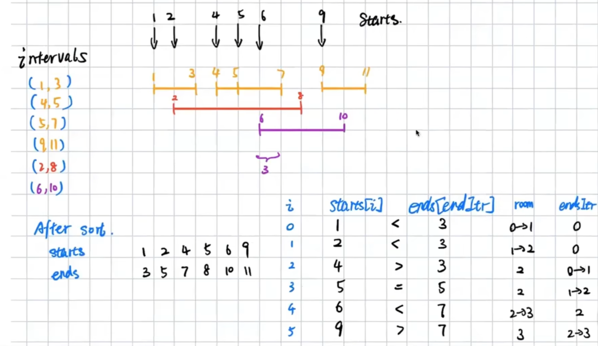


## code0268_丢失的数字

```
给定一个包含 [0, n] 中 n 个数的数组 nums ，找出 [0, n] 这个范围内没有出现在数组中的那个数。
```

这题的原题解法很简单，下面升级一下，这个数组未排序，且可能含有任意的整数，可正可负，请你找出缺失的最小正数。其实变成了第41题。


## code0277_寻找名人


```
题目描述：
假设有n个人标记为0到n-1，其中有一个人被称为"名人"。名人的定义是，他不认识任何其他人，并且所有其他人都认识他。你需要找出这个名人。

你将获得一个辅助函数bool knows(a, b)，该函数可以告诉你A是否认识B。实现函数int findCelebrity(n)，找出名人的标记号。如果找到名人，则返回名人的标记号；否则返回-1。

注意：

假设所有人都认识自己，但是名人不认识任何人。
可以假设函数knows()的调用次数最多为5*n。

解题思路：
这道题可以使用一个双指针的方法来解决。首先，设定两个指针，一个指向0，另一个指向n-1。接下来，我们要逐渐排除掉不可能是名人的人，直到只剩下一个可能的名人候选。

我们从左右指针开始，检查knows(left, right)是否成立。如果成立，说明left认识right，即left不可能是名人，我们将left指针右移一位。如果不成立，说明left不认识right，即right不可能是名人，我们将right指针左移一位。重复这个过程直到left和right相遇。

此时，如果剩下的候选人是名人，那么他肯定是整个候选人集合中唯一一个不认识其他人的。我们需要进行一次确认，即遍历一次候选人集合，检查他是否不认识其他人，并且其他人都认识他。如果满足这个条件，则该候选人就是名人；否则，不存在名人。
```

推理得到：这样的明星不一定有，如果有那么只有一个。

你认识我，你就不是明星了。

还有一种做法：从左到右来一遍，有一个变量cand，是候选的明星。如果i不认识cand，那么就把cand改为i。那么最后得到的cand之前的人都不是明星，因为之前的人如果是明星，那么候选就是它了！后面的人肯定也不是明星，因为cand不认识他们！

所以接下来只需要去验证cand是不是明星就行了，cand如果不是，那么就没明星。验证的过程有两步，一步是看是否所有人都认识cand。以及cand不认识所有人。


## code0269_外星人字典

```
给定一个由小写字母组成的字符串数组 words，其中的单词按照字典序进行排序。同时，给定一个新的字母顺序 alienOrder，你需要确定这个字母顺序是否有效，并根据该顺序重新排序字符串数组 words。

为了判断字母顺序的有效性，我们需要遵循以下规则：

给定的字母顺序是由小写字母组成的，且没有重复的字母。
如果 alienOrder 中的字母 x 在字母 y 之前，那么在所有的 words 中，单词顺序中字母 x 会在字母 y 之前出现。
如果有多个有效的字母顺序，你可以返回其中任意一个。
如果无法确定有效的字母顺序，或者输入的数据不足以进行排序，则应该返回一个空字符串。此外，如果输入的 words 数组中存在循环的情况，也应该返回一个空字符串，因为无法满足字母顺序的要求。

举个例子，假设输入为 words = ["wrt", "wrf", "er", "ett", "rftt"]，alienOrder = "wertf"。根据给定的字母顺序，我们可以确定 "w" 在 "e" 之前，"e" 在 "r" 之前，"r" 在 "t" 之前，"t" 在 "f" 之前。因此，根据字母顺序重新排序 words 可得 ["wertf", "wrf", "er", "ett", "rftt"]。
```

字典序：如果两个字符串长度相同，那么直接当做26进制计算然后比较。如果长度不相同，等价于短的后面补0然后和长的比较。

这题其实就是重新规定了字典序。不是按照abcdef这样的顺序了，而是按照它给定的顺序。所以你需要根据它给的alienOrder推测出它的字典序。无法推测的部分你随意返回。如果你推测出来的字典序排名是相互矛盾了，那么你就返回无，这种情况出现了循环比较。

一个字符串去和另一个字符串比较，只要不一样就找到了一条边，小的指向大的。还有注意下面的特殊情况。

完成之后可以得到一个图。接下来求拓扑排序即可。关于拓扑排序，看code210；

| 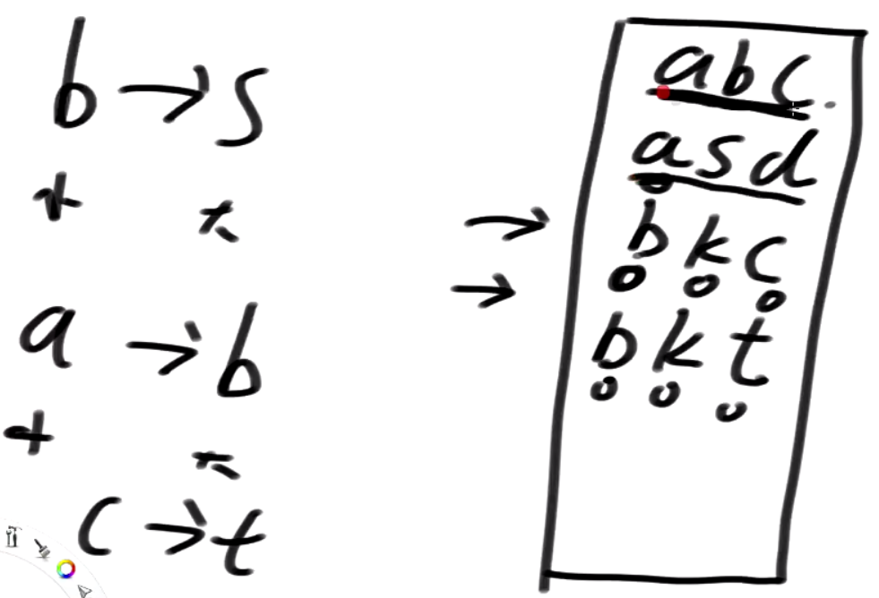 | 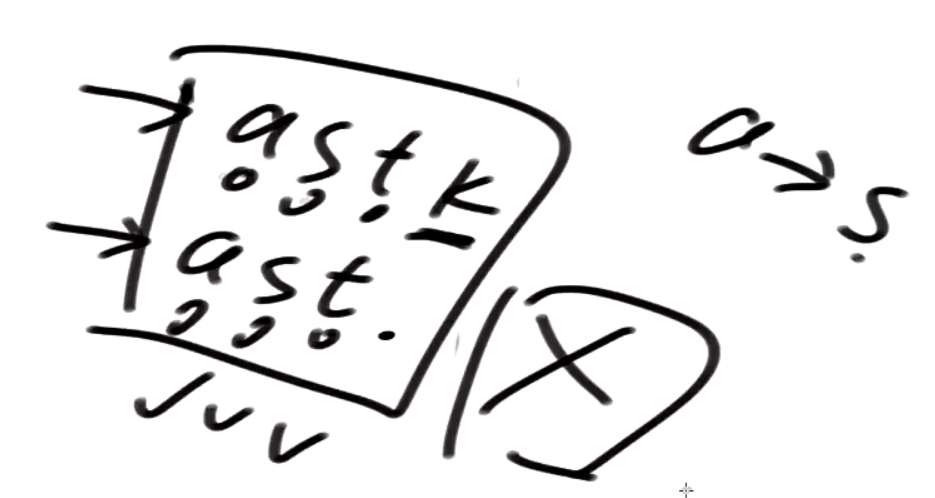 |
| ------------------------------------------------------------ | ------------------------------------------------------------ |


## code0285_二叉搜索树中的中序后继


```
给定一棵二叉搜索树（BST）和其中的一个节点 p，找到该节点在中序遍历中的后继节点。BST 的定义是：对于任意节点，其左子树中的节点值都小于该节点的值，右子树中的节点值都大于该节点的值。

后继节点的定义是：在中序遍历中，位于给定节点 p 之后且比 p 大的节点。如果 p 没有后继节点，则返回 null。
```

这道题的解题思路通常可以通过中序遍历来实现。中序遍历二叉搜索树会得到一个按节点值递增排序的节点序列。所以，我们可以按照中序遍历的顺序找到节点 p，并返回它的下一个节点作为后继节点。


## code0296_最佳会议点

```
问题描述：
给定一个二维的01矩阵，其中1表示某个人的位置，0表示空地。找到一个点使得所有人到达该点的距离之和最小，假设距离的计算方式为曼哈顿距离。

例如，给定下面的矩阵：

1 - 0 - 0 - 0 - 1
|   |   |   |   |
0 - 0 - 0 - 0 - 0
|   |   |   |   |
0 - 0 - 1 - 0 - 0
其中，最佳会议点是(0,2)，因为所有人到达该点的距离之和最小，为2 + 2 + 2 = 6。

要求编写一个函数，给定一个01矩阵，返回最佳会议点的最小距离之和。
```

贪心，我们用两个数组分别统计每一行每一列上有多少个1。然后我们知道我们的会议点肯定要定在一个合适的行上，让所有的人走过来比较省。所以我们有两个方向，分别累计历史包袱，谁的包袱轻谁就往中间靠，靠到相遇了，行数就定了。列也这么玩。玩完之后就搞定了。


## code0340_至多包含k个不同字符的最长子串

```
题目描述如下：
给定一个字符串s，找出最多包含k个不同字符的最长子串的长度。

示例：
输入：s = "eceba", k = 2
输出：3
解释：最长的子串是 "ece"，其中包含2个不同的字符。

输入：s = "aa", k = 1
输出：2
解释：最长的子串是 "aa"，其中包含1个不同的字符。

请注意，答案必须是一个子串（连续的子序列），而不是任意两个字符之间的距离。
```

还是用一个类似记账表的东西加上滑动窗口。一个map记录数量，一个diff记录种数。

具备单调性，窗口变大和变小，字符的种类只会变多和变少。


## code0348_设计井字棋

```
题目描述：
设计一个 Tic-Tac-Toe（井字棋）游戏，让两位玩家在一个 n x n 的棋盘上进行游戏。每位玩家轮流将自己的棋子放在空白位置上，直到有一位玩家在水平、垂直或对角线方向上连成了 n 个自己的棋子。

实现 TicTacToe 类的以下三个方法：

TicTacToe(n)：构造函数，初始化游戏棋盘，其中 n 表示棋盘的大小。
int move(row, col, player)：玩家 player 在指定的 row 和 col 下棋。row 和 col 是以 0-based 的索引表示，其中 0 <= row, col < n。player 可以是 1 或 2，分别表示两位玩家。每个玩家最多只能在空白位置上放置一个棋子。如果当前玩家在这一步中获胜，返回当前玩家的编号；如果游戏平局，返回 0；如果游戏还未结束，返回 -1。
思路：
为了实现 Tic-Tac-Toe 游戏，我们可以使用两个数组来记录每个玩家在每一行、每一列以及两个对角线上的棋子个数。

首先，我们定义两个大小为 n 的数组 rows 和 cols，以及两个变量 diagonal 和 anti_diagonal。数组 rows[i] 表示第 i 行上玩家 1 的棋子个数减去玩家 2 的棋子个数，数组 cols[j] 表示第 j 列上玩家 1 的棋子个数减去玩家 2 的棋子个数。变量 diagonal 表示主对角线上玩家 1 的棋子个数减去玩家 2 的棋子个数，变量 anti_diagonal 表示副对角线上玩家 1 的棋子个数减去玩家 2 的棋子个数。

在每一步下棋时，我们首先根据当前玩家来确定该在对应的数组或变量上进行操作。然后，我们更新对应的数组或变量，并检查是否有玩家获胜。

检查是否有玩家获胜的方法是，当某一行、某一列、某一对角线或某一副对角线上的某个数的绝对值等于 n 时，说明有玩家获胜。
```

- 思路，两个2*n的矩阵。分别记录两个玩家在某一行某一列上下了几个棋子。由于对角线有且仅有两个，所以用四个变量分别统计两个玩家分别在两个对角线上下了几个棋子。


## code0687_最长同值路径

https://leetcode.cn/problems/longest-univalue-path/

路径长度其实就是结点数-1，所以我们算出节点数就行了。

列出可能性，找出需要的变量

1. 与x无关的最大节点数
2. 与x有关但是只往左边扎的最大节点数
3. 与x有关但是只往右边扎的最大节点数
4. 与x有关往左右两边扎的最大节点数
5. 再来额外一个变量max来决出1234中的最大值。


可以省

1. 与x无关的最大节点数
2. 与x有关只往一边扎的最大节点数
3. 再来额外一个变量max来决出所有情况的最大值。变量1和变量2先决出一个最大值，其实就是上面123的最大，然后根据left和right的信息，再更新出max的信息。

这样信息就少两个。


