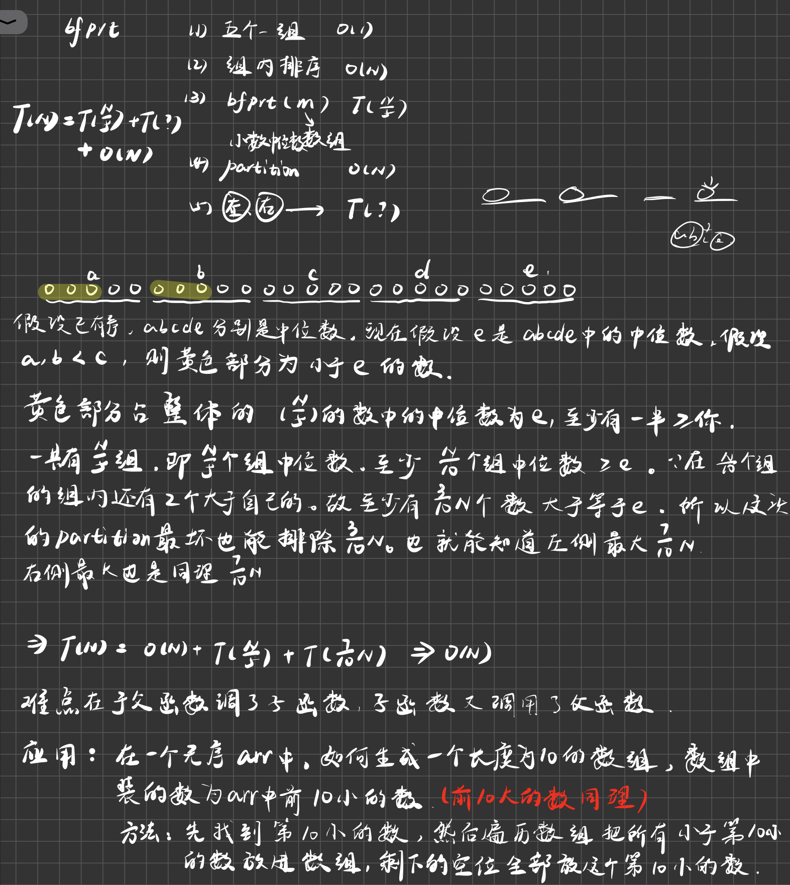

# 蓄水池算法

蓄水池问题：假设有一个机器，源源不断吐出球，机器可以认为是一个流，从一号球开始吐，吐完一号球一定吐二号球，以此类推。但是你只有一个能装下十个球的袋子。机器吐出来的每一个球你都要去决定是入袋子还是扔掉。如果你扔掉了这个球，那么你永远也无法找回。那么现在要保证吐出来的每一个球被选中的概率都是相等的。也就是说如果吐了1000个球，你要保证每一个球被选中的概率都是10/1000。它每吐出任何一个球都得保证吐出过的求被选中的概率都是相等的。

- 这个题不是说我搞了一个序列之后我才弄随机，弄不了，因为只有十个球的空间。不能把过往的球都留下来才弄随机。难点在这。

流程：

1. 在机器吐出1~10号球的期间，完全入袋子，没有筛选逻辑。每一个球都不扔掉，都进袋子。

- 接下来引入一个随机函数f，假设有一个随机函数给我们用，随机函数当我传入i的时候给我返回1~i等概率的一个数字。

2. 如果我吐出了k号球，k号球是1~10之外的一个数。当它出现的时候我要有一个决策来决定要不要它。我用10/k的概率决定这个球要不要入袋子。那么就调用f（k），如果f（k）返回的是1~10那么就进入袋子，否则就扔掉。如果k号球要进袋子，舍弃袋子里的谁？--袋子里的球等概率扔一个。

为什么这样的流程可以保证在每一次吐出一个球的时候，之前吐出的所有球都等概率进袋子。


这样的算法有什么用？想象你有100的用户，要在今天选出所有登录的用户中的100个作为幸运观众。如果你是暴力解，你只能先把所有的登录作为一个list，然后去掉重复的用户，然后再从中做随机，选出100个观众。这样的暴力求解需要把所有数据放到一个大服务器上进行运算，而且只选出100个观众。

但是如果使用蓄水池算法，那么我只需要一台服务器，就给我100个位置每个用户在登录的时候实现两个方法。f1验证你今天是不是首次登录。f2方法得出你是全球第几个（x）登录的用户。如果用户是首次登录，那么就以100/x的概率决定进去，然后从袋子中随机踢出去一个。最后再开奖的时候直接公布这100个人即可。根本不需要各个服务器之间同步数据。稍微有点难度的就是要知道你是全球第几个登录的用户，这个还是相对好实现的。

原本以非常大的代价才能能够搞定的事情，现在变成了动态决定。我就准备只有100个人的空间，这个事情就拿下了。

```java
public static class RandomBox {
   private int[] bag;
   private int N;//袋子的大小
   private int count;//已经过了count个球

   public RandomBox(int capacity) {
      bag = new int[capacity];
      N = capacity;
      count = 0;
   }

   private int rand(int max) {
      return (int) (Math.random() * max) + 1;
   }

   public void add(int num) {
      count++;
      if (count <= N) {
         bag[count - 1] = num;
      } else {
         if (rand(count) <= N) {
            bag[rand(N) - 1] = num;
         }
      }
   }

   public int[] choices() {
      int[] ans = new int[N];
      for (int i = 0; i < N; i++) {
         ans[i] = bag[i];
      }
      return ans;
   }

}
```


# bfprt算法

- 有更好的算法笔试使用。笔试的时候不要使用bfprt算法。这是面试用的




