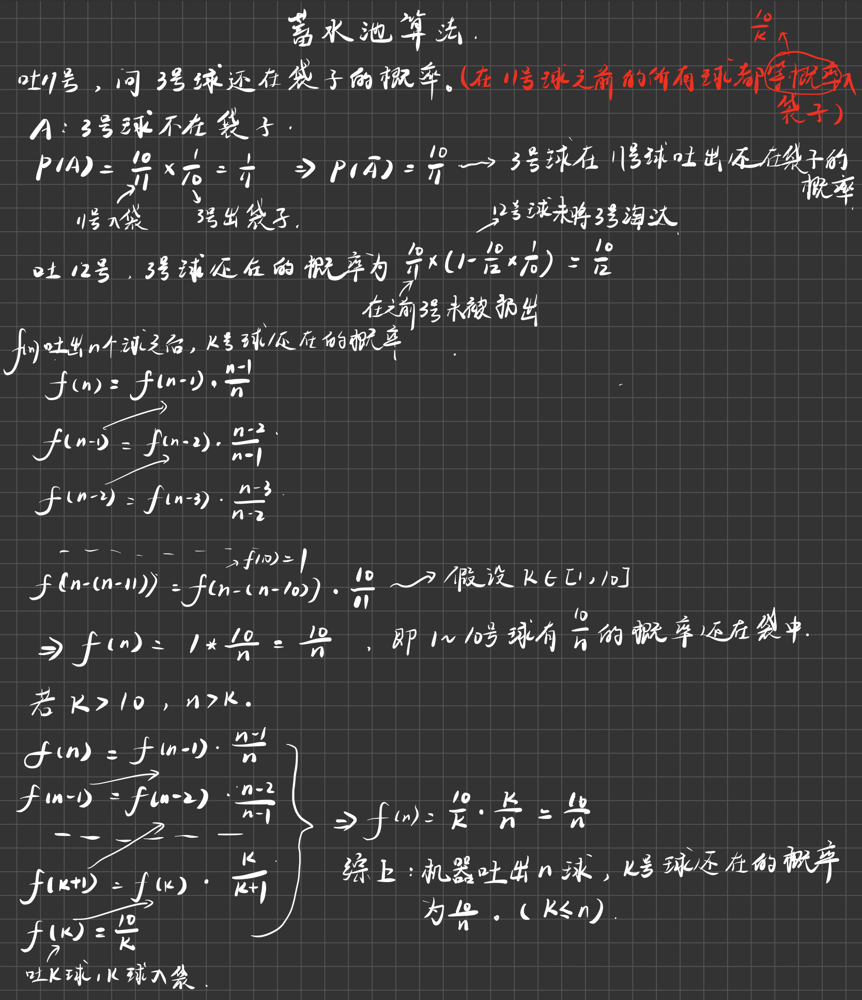

# 蓄水池算法

蓄水池问题：假设有一个机器，源源不断吐出球，机器可以认为是一个流，从一号球开始吐，吐完一号球一定吐二号球，以此类推。但是你只有一个能装下十个球的袋子。机器吐出来的每一个球你都要去决定是入袋子还是扔掉。如果你扔掉了这个球，那么你永远也无法找回。那么现在要保证吐出来的每一个球被选中的概率都是相等的。也就是说如果吐了1000个球，你要保证每一个球被选中的概率都是10/1000。它每吐出任何一个球都得保证吐出过的求被选中的概率都是相等的。

- 这个题不是说我搞了一个序列之后我才弄随机，弄不了，因为只有十个球的空间。不能把过往的球都留下来才弄随机。难点在这。

流程：

1. 在机器吐出1~10号球的期间，完全入袋子，没有筛选逻辑。每一个球都不扔掉，都进袋子。

- 接下来引入一个随机函数f，假设有一个随机函数给我们用，随机函数当我传入i的时候给我返回1~i等概率的一个数字。

2. 如果我吐出了k号球，k号球是1~10之外的一个数。当它出现的时候我要有一个决策来决定要不要它。我用10/k的概率决定这个球要不要入袋子。那么就调用f（k），如果f（k）返回的是1~10那么就进入袋子，否则就扔掉。如果k号球要进袋子，舍弃袋子里的谁？--袋子里的球等概率扔一个。

为什么这样的流程可以保证在每一次吐出一个球的时候，之前吐出的所有球都等概率进袋子。



这样的算法有什么用？想象你有100的用户，要在今天选出所有登录的用户中的100个作为幸运观众。如果你是暴力解，你只能先把所有的登录作为一个list，然后去掉重复的用户，然后再从中做随机，选出100个观众。这样的暴力求解需要把所有数据放到一个大服务器上进行运算，而且只选出100个观众。

但是如果使用蓄水池算法，那么我只需要一台服务器，就给我100个位置每个用户在登录的时候实现两个方法。f1验证你今天是不是首次登录。f2方法得出你是全球第几个（x）登录的用户。如果用户是首次登录，那么就以100/x的概率决定进去，然后从袋子中随机踢出去一个。最后再开奖的时候直接公布这100个人即可。根本不需要各个服务器之间同步数据。稍微有点难度的就是要知道你是全球第几个登录的用户，这个还是相对好实现的。

原本以非常大的代价才能能够搞定的事情，现在变成了动态决定。我就准备只有100个人的空间，这个事情就拿下了。

```java
public static class RandomBox {
   private int[] bag;
   private int N;//袋子的大小
   private int count;//已经过了count个球

   public RandomBox(int capacity) {
      bag = new int[capacity];
      N = capacity;
      count = 0;
   }

   private int rand(int max) {
      return (int) (Math.random() * max) + 1;
   }

   public void add(int num) {
      count++;
      if (count <= N) {
         bag[count - 1] = num;
      } else {
         if (rand(count) <= N) {
            bag[rand(N) - 1] = num;
         }
      }
   }

   public int[] choices() {
      int[] ans = new int[N];
      for (int i = 0; i < N; i++) {
         ans[i] = bag[i];
      }
      return ans;
   }

}
```


# bfprt算法

- 有更好的算法笔试使用。笔试的时候不要使用bfprt算法。这是面试用的


```java
public class Code01_FindMinKth {//bfprt,寻找第k小

    // 利用大根堆，时间复杂度O(N*logK)。原理：k大小的大根堆，每次遍历数组都让比较大的出堆，这样到结束大的都出去了，剩下的就是第k小的
    // 因为剩下的k个是arr中前k小的数，他们之中最大的，也就是位于堆顶的数就是第k小的数。
    public static int minKth1(int[] arr, int k) {
        PriorityQueue<Integer> maxHeap = new PriorityQueue<>((Integer o1,Integer o2)->{return o2-o1;});
        for (int i = 0; i < k; i++) maxHeap.add(arr[i]);//保持堆有k的空间即可，这样每次添加或者删除都是常数操作lgk
        for (int i = k; i < arr.length; i++) {
            if (arr[i] < maxHeap.peek()) {//让两者之间比较大的那个进不了堆，或者出堆
                maxHeap.poll();
                maxHeap.add(arr[i]);
            }
        }
        return maxHeap.peek();
    }

    // 改写快排，时间复杂度O(N)
    public static int minKth2(int[] array, int k) {
        int[] arr = copyArray(array);
        return process2(arr, 0, arr.length - 1, k - 1);
    }

    public static int[] copyArray(int[] arr) {
        int[] ans = new int[arr.length];
        for (int i = 0; i != ans.length; i++) {
            ans[i] = arr[i];
        }
        return ans;
    }

    /**
     * @param arr:在arr中找在下标[L,R]中排在第index位置的数。arr数组无序，在无序的arr中找出实际上应该排在index位置的数
     * @param L:左边界，包括
     * @param R:右边界，包括
     * @param index:找出在下标[L,R]中排在第index位置的数
     * @return :返回这个在下标[L,R]中排在第index位置的数
     */
    public static int process2(int[] arr, int L, int R, int index) {
        if (L == R)  return arr[L];//base case。此时L=R=index
        int pivot = arr[L + (int) (Math.random() * (R - L + 1))];//pivot ∈ [L,R-L]
        int[] range = partition(arr, L, R, pivot);//三向切分
        if (index >= range[0] && index <= range[1]) {//index在它们之间，数都是相等的说明已经找到了
            return arr[index];
        } else if (index < range[0]) {//到左边去递归
            return process2(arr, L, range[0] - 1, index);
        } else {//到右边去递归
            return process2(arr, range[1] + 1, R, index);
        }
    }

    /**
     *
     * @param arr:进行划分的函数
     * @param L:划分的左边界，包括
     * @param R:划分的右边界，包括
     * @param pivot:这里显式指定了一个划分值，我们也可以实现一个默认是最左边的数或者是最右边的数做划分值的partition函数
     *             但是这样的话我们就要在调用函数中从[L,R]中随机选择一个数与最左或右的数做交换，再进行partition，实现随机
     * @return :返回与划分值相等的范围
     */
    public static int[] partition(int[] arr, int L, int R, int pivot) {
        int less = L - 1;
        int more = R + 1;
        int cur = L;
        while (cur < more) {//与more撞上就停止，说明中间的不确定区域已经全部搞定
            if (arr[cur] < pivot) {
                swap(arr, ++less, cur++);
            } else if (arr[cur] > pivot) {
                swap(arr, cur, --more);
            } else {
                cur++;
            }
        }
        return new int[] { less + 1, more - 1 };
    }

    public static void swap(int[] arr, int i1, int i2) {
        int tmp = arr[i1];
        arr[i1] = arr[i2];
        arr[i2] = tmp;
    }

    // 利用bfprt算法，时间复杂度O(N)
    public static int minKth3(int[] array, int k) {
        int[] arr = copyArray(array);
        return bfprt(arr, 0, arr.length - 1, k - 1);
    }

    // arr[L..R]  如果排序的话，位于index位置的数，是什么，返回
    public static int bfprt(int[] arr, int L, int R, int index) {
        if (L == R) {
            return arr[L];
        }
        int pivot = medianOfMedians(arr, L, R);
        int[] range = partition(arr, L, R, pivot);
        if (index >= range[0] && index <= range[1]) {
            return arr[index];
        } else if (index < range[0]) {
            return bfprt(arr, L, range[0] - 1, index);
        } else {
            return bfprt(arr, range[1] + 1, R, index);
        }
    }

    /**
     *
     * @param arr:arr[L,R]中的元素五个一组，返回组中位数们的中位数
     * @param L:包括
     * @param R:包括
     * @return :返回中位数们的中位数
     */
    public static int medianOfMedians(int[] arr, int L, int R) {
        int size = R - L + 1;
        int offset = size % 5 == 0 ? 0 : 1;//是否有不够五个的组
        int[] mArr = new int[size / 5 + offset];
        for (int team = 0; team < mArr.length; team++) {
            int teamFirst = L + team * 5;
            mArr[team] = getMedian(arr, teamFirst, Math.min(R, teamFirst + 4));
        }
        // marr中，找到中位数
        // marr(0, marr.len - 1,  mArr.length / 2 )
        return bfprt(mArr, 0, mArr.length - 1, mArr.length / 2);
    }

    /**
     * @return :取得arr[L,R]的中位数。偶数返回上中位数
     */
    public static int getMedian(int[] arr, int L, int R) {
        insertionSort(arr, L, R);//排序的个数小，使用插入排序反而快
        return arr[(L + R) / 2];
    }

    public static void insertionSort(int[] arr, int L, int R) {
        for (int i = L + 1; i <= R; i++) {
            for (int j = i; j-1 >= L && arr[j-1] > arr[j]; j--) {
                swap(arr, j, j - 1);
            }
        }
    }
```
