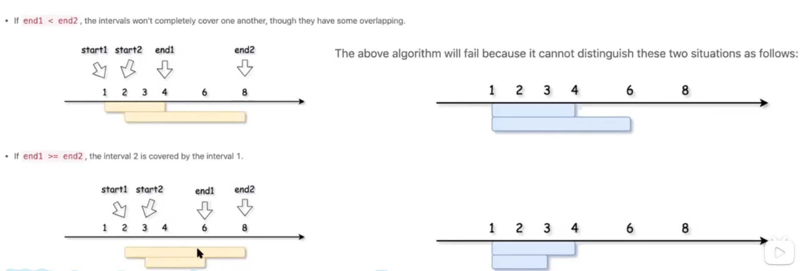
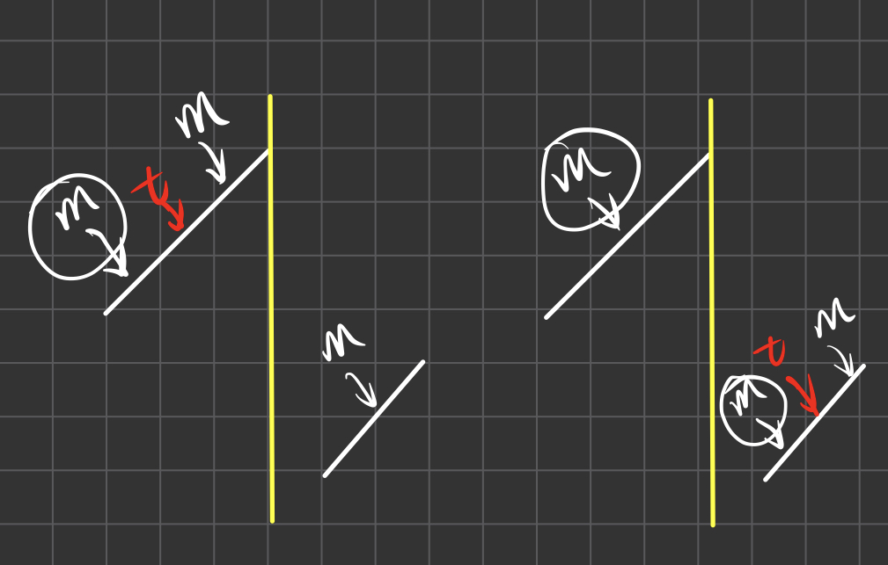
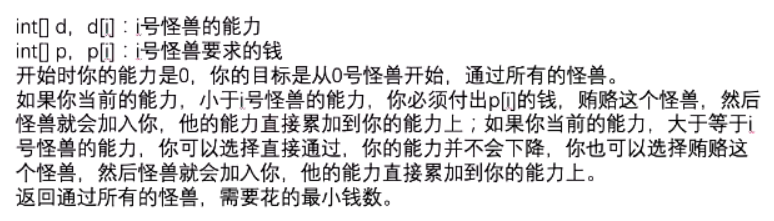

# 专题

## 扫描线

### 会议室II

253

1. 扫描线，把会议的结束时间点一个权重1，结束时间点权重-1。按照时间点从大到小排序，依次处理权重，这个过程中权重的最大值就是所需要的会议数量。本质上就是最大的重叠数！

2. 优先队列

3. 开始时间数组，以及结束时间数组，分别从小到大排序。

   这种解法的核心思路就是我不关心具体是哪个会议的开始时间和结束时间，我只关心什么时候我们需要一间空会议室，什么时候可以放出一间空会议室。

   

### 合并

56

先排序，从左往右merge，如果next和cur有重合，就把他们merge起来，重合就是next的开始时间早于cur的结束时间。加入ans的实际是next和cur没有重合了。由于加入时机的缘故，我们退出循环的时候需要再添加一次答案。

### 插入

57

分阶段，第一阶段是cur和new没有重合，直接把cur加入ans。第二阶段是cur和new有重合，合并到new身上，第三阶段cur和new没有重合了，把new和cur一起加入到ans中，然后把new置空，加上判断，回到第一阶段。

### 删除

1272

有overlap的时候再去做逻辑判断，没有overlap就直接加入ans。

有overlap的时候分为三种情况

1. cur的左边界小于删除区间的左边界，左边留出来
2. cur右边界大于删除区间的右边界，右边留出来
3. 两边都没有留出来，也就是被删除区间完全包含了

1和2是可以同时发生的。


### 移除多余区间

435

题目要求移除最少的区间，所以我们要尽量保留多的区间。按照结束时间排序，选择结束时间早的留下来，那么后面就可以有更多的区间可以留下。


### 删除被覆盖的区间

1288

排序，按照开始时间从小到大，结束时间从大到小排序。

由于开始时间从小到大，所以pre肯定比cur的开始时间早于或者等于，所以我们只需要关心pre的结束时间是否比cur的结束时间晚，如果晚的话，那么cur就可以被pre合并了。



### 将数据流变为多个不相交区间

352

1. 使用TreeSet，自定义比较器比较int[]。排除掉被原有的区间含住的情况。剩下的情况如果需要merge，那么就是下面的三种，分类讨论。这三种都不是的话就不需要merge，直接加入即可


2. 使用TreeMap。使用715题的思路即可。


### RangeModule

715

使用TreeMap实现增删区间。

```
     * 添加逻辑：就是让left~right，先往左扩，再往右扩，中间的全删，left~right最后加入
     * 删除逻辑：我们知道被left~right压中的都要删除，只有左右边界是特殊的，所以先把左右边界搞定，
     *          然后中间的一并删除即可。处理左边界的时候会修改值，所以右边界先处理
```


### 安排会议日程

1229

```
给定两个人的空闲时间表：slots1 和 slots2，以及会议的预计持续时间 duration，请你为他们安排 时间段最早 且合适的会议时间。

如果没有满足要求的会议时间，就请返回一个 空数组。

「空闲时间」的格式是 [start, end]，由开始时间 start 和结束时间 end 组成，表示从 start 开始，到 end 结束。 

题目保证数据有效：同一个人的空闲时间不会出现交叠的情况，也就是说，对于同一个人的两个空闲时间 [start1, end1] 和 [start2, end2]，要么 start1 > end2，要么 start2 > end1。
```

开始时间取晚的，结束时间取早的。这样减一下就是公共部分。


### 区间列表的交集

986

区间的交集，本质上和上题一模一样。取开始时间晚的，和结束时间早的。


### 员工空闲时间

759

```
给定员工的 schedule 列表，表示每个员工的工作时间。

每个员工都有一个非重叠的时间段  Intervals 列表，这些时间段已经排好序。

返回表示 所有 员工的 共同，正数长度的空闲时间 的有限时间段的列表，同样需要排好序。
```


这题可以用优先队列做，用优先队列帮我们合并，一旦在合并不了的时刻出答案。


### 天际线

218

其实就是返回每一个点高度如果变化了，返回变化之后的高度，这个高度是这个时间段最大的高度。

这题用扫描线的方法。给坐标的每一个点加上一个权重，权重就是它的高度。我们把题目的信息转化为一个一个的info，代表在某些结点加上一个info或者移出一个info。我们用一个结构动态的返回此时的最大值即可，这个结构就是优先队列。每当最大值发生变化的时候，就是我们添加答案的时候。


### 矩形面积

扫描线+动态开点线段树维护区间的有效长度。

动态开点线段树递归结构有所改变！区间是可以重叠的，base case是区间里面正好有两个元素的时候，也就是叶子是两个


## 二分查找

定义l和r的含义。我们把[l,r]定义为待探索区间。把l或者r的其中一定定义为可能区，一个定义为不可能区。如果把l的左边定义为可能区，意思是答案可能会出现在[0,l)的范围上，r为不可能区，意思是(r,N-1]为不可能出现答案的区域。

那么最终L会来到R+1的位置。所以[0,r+1)=[0,r]是答案可能出现的地方，[r+1,N-1]是答案不可能出现的地方。所以r就是答案。因为我们让l移动的时候的含义维持能一直往答案的位置靠，所以r位置就一定是答案。

例如，我们要求<=n最右的位置，那么我们就让arr[mid]<=n的时候，l移动，我们知道l移动一定是往<.n最右的位置靠的，也就是一定是往答案位置靠的。并且我们也知道如果arr[mid]>n了，那么r右边就一定不是答案，也就是垃圾区了。

### 二分找元素

#### 二分查找

经典的二分查找也可以改成这种染色的方法。等价于找小于等于的最右或者大于等于的最左。然后最后验证是不是答案

```
    public int search(int[] nums, int target) {
        int l=0,r=nums.length-1;
        while(l<=r){
            int mid=l+(r-l>>1);
            if (nums[mid]<=target) l=mid+1;
            else r=mid-1;
        }
        return r==-1||nums[r]==target?r:-1;
    }
```


#### 在排序数组中查找元素的第一个和最后一个位置

34

有序数组中找一个元素出现的最后位置。此时定义l为有效区。那么只要nums[mid]<=target，我们知道我们还可以继续往右边去寻找答案，l-1位置已经是一个候选答案了。那么最后r压中的位置一定是答案。

```JAVA
	private static int findRight(int[] nums, int target) {//<=target 最右
		int l=0,r=nums.length-1,mid;
		while(l<=r){
			mid=l+(r-l>>1);
			if (nums[mid]<=target) l=mid+1;
			else r=mid-1;
		}
		return r;
	}
```

同理，有序数组中找一个元素出现的最开始的位置，此时定义r为有效区会合适。只要nums[mid]>=target那么说明我们还可以往左边去探寻一个更好的答案。最后l压中的位置一定是答案

```JAVA
	private static int findLeft(int[] nums, int target) {//>=target 最左
		int l=0,r=nums.length-1,mid;
		while(l<=r){
			mid=l+(r-l>>1);
			if (nums[mid]>=target) r=mid-1;
			else l=mid+1;
		}
		return l==nums.length?-1:l;
	}
```


#### 搜索旋转排序数组

33

我们知道，一个数组旋转以后一定如下图。那么target要么上半区要么在下半区。m和t的关系有三种，那么总的有6种情况。此时我们定义l为有效区。那么我们只需要研究好什么时候让l往右边走即可。那么其实就是下面画圈的三种情况。



那么可以看到，下面的if条件其实就是上面三个画圈的。注意arr[mid]<=target这里是可以取到等号的，因为条件我们就往右边走，==的时候显然是满足条件的，往右边继续去寻找答案。最终r会来到答案的位置。

注意特殊情况，特殊情况就是r一直往左边走，此时会来到-1位置，此时代表没有答案。如果没有来到-1，那么也只是代表可能有答案，我们需要验证。

```JAVA
	public static int search2(int[] arr, int target) {//arr不重
		int l=0,r=arr.length-1;
		while(l<=r){
			int mid=l+(r-l>>1);
			if ((target<arr[0]&&(arr[mid]>=arr[0]||arr[mid]<=target))||(target>=arr[0]&&arr[mid]>=arr[0]&&arr[mid]<=target)){
				l=mid+1;
			}else {
				r=mid-1;
			}
		}
		return arr[r]==target?r:-1;
	}
```


81，有重复元素

没有什么变化，就是把l事先移动到和arr[n-1]不一样的位置。这样才能判断在上半区还是在下半区

```JAVA
public static boolean search(int[] arr, int target) {//arr不重
		int n=arr.length,l=0,r=n-1;
        while(l<r&&arr[l]==arr[n-1])l++;
		while(l<=r){
			int mid=l+(r-l>>1);
			if ((target<=arr[n-1]&&(arr[mid]>arr[n-1]||arr[mid]<=target))||(target>arr[n-1]&&arr[mid]>arr[n-1]&&arr[mid]<=target)){
				l=mid+1;
			}else {
				r=mid-1;
			}
		}
		return r==-1?false:arr[r]==target;
	}
}
```


#### 寻找旋转排序数组中的最小值

153

复用上题的图。这题其实就是一个阉割版，我们要找的其实就是下半区的最左边的数。所以我们定义r为有效区，往左边去搜寻答案。只要我在下半区就一直往左边走。最后l就是答案。

但是特殊情况是l一直往右边走，走到了N位置。证明此时没有下半区。那么答案就是[0]

```JAVA
        int l=0,r=nums.length-1;
        while(l<=r){
            int mid=l+(r-l>>1);
            if (nums[mid]<nums[0]) r=mid-1;//在下半区就往左动，此时r右边是可能为答案，l左边不可能为答案
            else l=mid+1;
        }
        return nums[l%nums.length];//最特殊的情况就是没有下半区，那么一直是l在动，此时最小值就是[0]
```

- 这题题目保证数组没有重复值。如果有重复值，我们需要让l的初始位置不等于arr[n-1]----剑指11&leetcode154

```JAVA
    public int minArray(int[] arr) {
        int n=arr.length,l=0,r=n-1;
        while(l<r&&arr[l]==arr[n-1]) l++;//数组中有重复元组，避免上半区和下半区的右端点一致
        while(l<=r){
            int mid=l+(r-l>>1);
            if(arr[mid]<=arr[n-1]) r=mid-1;
            else l=mid+1;
        }
        return arr[l];
    }
```


#### 寻找峰值

162

这题l代表的是垃圾区，如果还能爬坡就一直爬。l是最终答案

```JAVA
	public int findPeakElement2(int[] nums) {//染色法
		int l=0,r=nums.length-1;
		while (l<=r){
			int mid=l+(r-l>>1);
			if (mid+1<nums.length&&nums[mid]<nums[mid+1]) l=mid+1;
			else r=mid-1;
		}
		return l;
	}
```

或者让l作为有效区，那么mid==0的时候，左边肯定没有比它大的，所以肯定合法。所以这里是或的符号。

```JAVA
    public int findPeakElement(int[] nums) {
		int l=0,r=nums.length-1;//l是有用区
		while(l<=r){
			int mid=l+(r-l>>1);
			if (mid==0||nums[mid-1]<nums[mid]) l=mid+1;
			else r=mid-1;
		}
		return r==-1?0:r;
    }
```


#### 最大宽度坡

```
962
给定一个整数数组 A，坡是元组 (i, j)，其中  i < j 且 A[i] <= A[j]。这样的坡的宽度为 j - i。

找出 A 中的坡的最大宽度，如果不存在，返回 0 。
```

这题和找<=k累加和的思路一样，我们希望左端点越早出现越好，越往右条件越宽松，也就是头部放大的，尾部放小的，是一个递减的序列。那么我们固定每一个右端点，然后二分去找最早满足的左端点。

```JAVA
    public int maxWidthRamp(int[] nums) {
        int n=nums.length;
        int[] down=new int[n];
        down[0]=nums[0];
        for(int i=1;i<n;i++)  down[i]=nums[i]<down[i-1]?nums[i]:down[i-1];
        int ans=0;
        for(int i=1;i<n;i++){
            int l=0,r=i-1,m;
            while(l<=r){
                m=l+(r-l>>1);
                if(down[m]<=nums[i]) r=m-1;
                else l=m+1;
            }
            ans=Math.max(ans,i-l);
        }
        return ans;
    }
```


#### 总结

找一个条件，能让l或者r往符合答案的方向靠。

一般要找最小就是让r往左边走。要找最大就是让l往右边走。


### 二分找答案

这种题目一般是题目要求的指标与某个另外的指标有单调性。例如题目要求速度，那么速度就与完成时间有单调性。这种题目如果你能找到一个O(N)的在固定速度v下能否完成任务的函数，那么你就找到了一个n log n的方法。

#### 775-爱吃香蕉的珂珂

```
珂珂喜欢吃香蕉。这里有 n 堆香蕉，第 i 堆中有 piles[i] 根香蕉。警卫已经离开了，将在 h 小时后回来。

珂珂可以决定她吃香蕉的速度 k （单位：根/小时）。每个小时，她将会选择一堆香蕉，从中吃掉 k 根。如果这堆香蕉少于 k 根，她将吃掉这堆的所有香蕉，然后这一小时内不会再吃更多的香蕉。  

珂珂喜欢慢慢吃，但仍然想在警卫回来前吃掉所有的香蕉。

返回她可以在 h 小时内吃掉所有香蕉的最小速度 k（k 为整数）。
```

显然，吃香蕉的速度越大，越能完成“吃完全部香蕉”这项任务，所以题目所求的速度 与 完成任务是具有单调性的，速度越快，越容易完成任务。并且我们可以找到一个O(N)的方法判断珂珂在v速度下能不能吃完香蕉。所以这题有n logn的解法。

#### 2071-你可以安排的最多任务数目

```
给你 n 个任务和 m 个工人。每个任务需要一定的力量值才能完成，需要的力量值保存在下标从 0 开始的整数数组 tasks 中，第 i 个任务需要 tasks[i] 的力量才能完成。每个工人的力量值保存在下标从 0 开始的整数数组 workers 中，第 j 个工人的力量值为 workers[j] 。每个工人只能完成 一个 任务，且力量值需要 大于等于 该任务的力量要求值（即 workers[j] >= tasks[i] ）。

除此以外，你还有 pills 个神奇药丸，可以给 一个工人的力量值 增加 strength 。你可以决定给哪些工人使用药丸，但每个工人 最多 只能使用 一片 药丸。

给你下标从 0 开始的整数数组tasks 和 workers 以及两个整数 pills 和 strength ，请你返回 最多 有多少个任务可以被完成。
```

显然，能完成的任务数量与药片的数量是正相关的，至少药丸的数量增加了，能完成的数量不会减少，并且如果要求完成的任务数量越多，所要求的工人的力量也就越高，所以这是由单调性的。那么我们的条件就变为判断能否完成k个任务。判断的方法是贪心，我们挑选k个力量最强的工人去完成k个最简单的任务。挑选出来之后，从最简单的任务开始完成，让简单的任务给最弱的工人完成（这里的最弱的工人指的是挑选出来的k个工人中比较弱的），如果这个工人完成不了，由于我们必须要完成所有的k个任务，所以这个工人必须要吃药来完成至少一个任务，这个工人吃完药之后，肯定需要去完成自己能力范围内最难的那个任务，而不只是完成之前那个最弱的任务。这样一来，我们就写出了一个n logn 的算法。

#### 2517-礼盒的最大甜蜜度

```
给你一个正整数数组 price ，其中 price[i] 表示第 i 类糖果的价格，另给你一个正整数 k 。

商店组合 k 类 不同 糖果打包成礼盒出售。礼盒的 甜蜜度 是礼盒中任意两种糖果 价格 绝对差的最小值。

返回礼盒的 最大 甜蜜度。
```

显然礼盒的甜蜜度定的越高就越难完成，所以也是具有单调性的。直接先排序，然后遍历一遍相邻的差即可，所以判断的函数可以是线性的，总体也可以达到 n logn


#### 2560-打家劫舍 IV

```
沿街有一排连续的房屋。每间房屋内都藏有一定的现金。现在有一位小偷计划从这些房屋中窃取现金。

由于相邻的房屋装有相互连通的防盗系统，所以小偷 不会窃取相邻的房屋 。

小偷的 窃取能力 定义为他在窃取过程中能从单间房屋中窃取的 最大金额 。

给你一个整数数组 nums 表示每间房屋存放的现金金额。形式上，从左起第 i 间房屋中放有 nums[i] 美元。

另给你一个整数 k ，表示窃贼将会窃取的 最少 房屋数。小偷总能窃取至少 k 间房屋。

返回小偷的 最小 窃取能力。
```

显然，窃取能力越小，能偷的房间就越少，所以还是存在单调性。


#### 410-分割数组的最大值

```
给定一个非负整数数组 nums 和一个整数 m ，你需要将这个数组分成 m 个非空的连续子数组。

设计一个算法使得这 m 个子数组各自和的最大值最小。
```

二分答案，设计一个函数看看让各块的最大和<=x,k块够不够


#### 2305-公平分发饼干

```
给你一个整数数组 cookies ，其中 cookies[i] 表示在第 i 个零食包中的饼干数量。另给你一个整数 k 表示等待分发零食包的孩子数量，所有 零食包都需要分发。在同一个零食包中的所有饼干都必须分发给同一个孩子，不能分开。

分发的 不公平程度 定义为单个孩子在分发过程中能够获得饼干的最大总数。

返回所有分发的最小不公平程度。
```


```JAVA
    //二分找答案+剪枝回溯实现can方法
    public int distributeCookies3(int[] cookies, int k) {
        Arrays.sort(cookies);
        int n=cookies.length,l=0,r=Arrays.stream(cookies).sum(),mid;
        while(l<=r){
            mid=l+(r-l>>1);
            if(can(cookies,k,mid)) r=mid-1;
            else l=mid+1;
        }
        return l;
    }

    public boolean can(int[] cookies, int k,int target){//最大值的最小<=target就成功
        int n=cookies.length;
        return f(cookies,k,target,n-1,new int[k]);
    }

    //index代表当前要分配的饼干，index方向从右往左，因为大的先分配可以剪枝。
    //sum[i]代表i号孩子累计接到的饼干总量
    //回溯的枚举方式：枚举每一个饼干发给每一个孩子
    public boolean f(int[] cookies, int k,int target,int index,int[] sum){
        if(index==-1) return true;
        for(int i=0;i<k;i++){//枚举把cookies[index]发给一个孩子
            if(cookies[index]+sum[i]<=target){
                sum[i]+=cookies[index];
                if(f(cookies,k,target,index-1,sum)) return true;
                sum[i]-=cookies[index];
            }
            //如果当前孩子什么都没有，进入递归都没有返回，那么意味着无论怎么分配都满足不了target
            if(sum[i]==0) return false;//极其重要的剪枝！！！
        }
        return false;
    }
```


#### 总结

最大化的最小、最小化的最大 这种题目都是二分查找

## Morris

### 二叉树展开为链表（先序）

114

题目要求将一个二叉树展开为链表，按照**先序**遍历的顺序，right作为指向下一个结点，left为空。

做法就是用morris改。我们将最基本morris的先序遍历的打印行为换成pre指向cur即可。使用pre的left指针，right是用来指路的。

```JAVA
public void flatten(TreeNode root) {
        if (root==null) return;
        TreeNode cur=root,mr=null,pre=null;
        while(cur!=null){
            mr=cur.left;
            if (mr!=null){//有左树
                for (;mr.right!=null&&mr.right!=cur;mr=mr.right);
                if (mr.right!=cur){//第一次来到一个这个结点，去左树
                    if (pre!=null) pre.left=cur;
                    pre=cur;
                    mr.right=cur;
                    cur=cur.left;
                    continue;
                }else {//第二次来到这个结点,把指针改回去
                    mr.right=null;
                }
            }else {
                if (pre!=null) pre.left=cur;
                pre=cur;
            }
            cur=cur.right;
        }
        for (cur=root;cur!=null;cur=cur.right){
            cur.right=cur.left;
            cur.left=null;
        }
    }
```


### 二叉树展开为双链表（中序）

426

这一题和上一题最大的区别在于，我们直接用pre去串，最后一个结点的left是没有修改过的，可能会形成环。所以我们结束的时候pre刚好是最后一个结点，需要将pre的left置空。还有一个区别是中序遍历的第一个结点可能不是root，我们需要在遍历的时候换头。

在上题中，先序遍历的特性完全规避了这两个问题

```JAVA
public static Node treeToDoublyList(Node root) {
        if(root==null) return null;
        Node cur=root,mr=null,pre=null;
        while(cur!=null){
            mr=cur.left;
            if (mr!=null){//处理左子树
                for (;mr.right!=null&&mr.right!=cur;mr=mr.right);
                if (mr.right==null){//第一次来到
                    mr.right=cur;
                    cur=cur.left;
                    continue;
                }else {
                    mr.right=null;
                }
            }
            if (pre==null) root=cur;//中序第一个打印的结点不是root,需要换头
            if (pre!=null) pre.left=cur;
            pre=cur;
            cur=cur.right;
        }
        pre.left=null;//出来之后pre是最后一个结点，最后一个结点没有后继，所以需要置为空
        for (cur=root,pre=null;cur!=null;pre=cur,cur=cur.right){
          cur.right=cur.left;
          cur.left=pre;
        }
        pre.right=root;
        root.left=pre;
        return root;
    }
```

### 后序

145

本质上就是按照cur的左子树的右边界进行分解。注意，root自己没有被分解，所以出循环之后，需要把自己的右边界也打印了。打印左子树边界的时机是第二次来到自己的时候。

打印边界，其实就是先逆序一遍，然后在第二遍逆序的时候顺便打印。逆序只需要一行代码。

```JAVA
    public List<Integer> postorderTraversal2(TreeNode root) {
        List<Integer> ans=new LinkedList<>();
        TreeNode cur,mr,pre,c,next;
        for (cur=root,mr=pre=null;cur!=null;){
            mr=cur.left;
            if (mr!=null){//处理左树
                for (;mr.right!=null&&mr.right!=cur;mr=mr.right);
                if (mr.right==null){//第一次来到
                    mr.right=cur;
                    cur=cur.left;
                    continue;
                }else {//第二次来到的时候就是打印的实际，按照cur的左子树的右边界逆序打印,mr此时就是cur左子树的最右
                    mr.right=null;
                    printEdge(cur.left,ans);
                }
            }
            cur=cur.right;
        }
        printEdge(root,ans);
        return ans;
    }
    public void printEdge(TreeNode from,List<Integer> ans){
        TreeNode cur,pre,next,tail;
        for (cur=from,pre=null;cur!=null;next=cur.right,cur.right=pre,pre=cur,cur=next);
        for (cur=pre,pre=null;cur!=null;ans.add(cur.val),next=cur.right,cur.right=pre,pre=cur,cur=next);
    }
```


## 树

### 子树

```
给你两棵二叉树 root 和 subRoot 。检验 root 中是否包含和 subRoot 具有相同结构和节点值的子树。如果存在，返回 true ；否则，返回 false 。
二叉树 tree 的一棵子树包括 tree 的某个节点和这个节点的所有后代节点。tree 也可以看做它自身的一棵子树。
572
```

其实就是两个维度的先序遍历，第一维在root为头的树上先序遍历，检查每一个遍历到的结点为头开始是不是subRoot。

另外一个维度就是在f函数中，f函数检查root（固定）子树，是不是subRoot。做法就是subRoot的一个先序遍历，去检查每一个结点是否和root匹配。并且自己为空的时候root也要为空，因为这里是子树，所以要求root也要被用完。

### 子结构

```
输入两棵二叉树A和B，判断B是不是A的子结构。(约定空树不是任意一个树的子结构)
B是A的子结构， 即 A中有出现和B相同的结构和节点值。
剑指Offer26
```

和子树问题同理，只不过在f函数中，subRoot为空的时候不要求root为空，因为子结构不要求root使用完。


### 二叉树里的累加和问题

看子数组累加和问题，类似的解决方法。

```
给定一个二叉树的根节点 root ，和一个整数 targetSum ，求该二叉树里节点值之和等于 targetSum 的 路径 的数目。

路径 不需要从根节点开始，也不需要在叶子节点结束，但是路径方向必须是向下的（只能从父节点到子节点）。
code473
```

在先序遍历中维持一个map即可，要记得恢复现场。


## 拓扑排序

### 课程表I II


### 火星词典


### 从外往里收集树的叶子结点


## 子数组累加和

- ps：遇到子矩阵问题其实就等价于问你子数组问题


### 子数组最大累加和

IC04

方法：两个变量一次遍历。


#### 子矩阵最大累加和

IC04


### 子数组<=K最大累加和

363&IC09

假设我们要找以i结尾的<=k最大的累加和。假设x~i是答案，[x~i]=[0~i]-[0~x-1]==》找x~i<=k最大的累加和，等价于找[0~i]-[0~. ]<=k最接近的，等价于在[0~x-1]上找>=[0~i]-k最接近的。x是0的时候没有[x~i]=[0~i]-[0~x-1]这个转化，所以需要提前放一个0到有序表里面。  


#### 子矩阵<=K最大累加和

363&IC09

利用上面的子数组问题+压缩技巧


### 累加和为k的子数组的个数

560&剑指10

这题关心的是子数组的个数，所以我们需要保存某一个累加和出现了几次。

当然如果题目关心的是最长的，那么就保存下标在map里面。


#### 累加和为k的子矩阵的个数

1074

数组压缩直接套用上题


### 累加和为k的最长子数组（正数）

325

```
给你一个数组arr，里面都是正数，再给你一个数sum。我想知道累加和正好等于sum的子数组最长是多长。
```

如下图，sum为6的最长子数组的长度就是6。


注：子数组、子串都是连续的。子序列是可以不连续的。

在滑动窗口的时候说过，累加和和范围是有单调性的，这个数组都是正数，累加和与范围是严格单调性。只要发现了单调性，就一定可以找到一个很优雅的解法。如果发现了单调性，要么是左右指针往中间跑。要么是一个窗口从左往右滑动。

这一题我们只需要一个窗口从左往右滑动就可以解题。只需要分三种情况，当窗口内的sum<目标sum的时候，R往右移动。当窗口内的sum>目标sum的时候L往右移动。当窗口内的sum==目标sum的时候，更新maxlen，L往右移动。（这里L和R谁先动都可以）

原理：当你窗口在左边界是x，并且右边界R能够扩到使得窗口内数组的累加和是sum，那么以这个左边界开头，有且仅有这个子数组可以使得sum为目标sum。所以这个时候可以更新maxlen。并且右移窗口的左边界。因为单调性，所以我们可以大胆的直接丢掉右边的那些没试过的位置。


### 累加和为k的最长子数组（任意）

```
给你一个数组arr，里面有负、有正、有0，再给你一个数sum。我想知道累加和正好等于sum的子数组最长是多长。
```

这一题单调性就没有了，数组范围增大累加和是可能变小的。 我们把结果数组分成几类，arr中每一个位置开头的数组算作是1类，这些所有类的最大值就是总的最大值。或者按照子数组的结尾来进行分类。在上面的解法中，我们就是用了每个位置开头的答案取最大值。

这一题我们按照子数组的结尾来分类。假设以i位置结尾，并且0~i的累加和是1000。我们假设目标target是200。如果0~m的累加和是800，并且m是最小的使得0~m累加和是200的下标。那么从m+1到i的累加和一定是800，并且是以i结尾最长的。

我们用一个map来记录每一个累加和最早出现的位置。**并且最开始的时候要有（0,-1）这条记录**，因为一开始前面累加和为0的就是一个数也没选。用Map还是Set取决于你关不关心某个累加和对应的下标，例如这题要求长度，所以你需要一个Map来把累加和对应的下标拿出来。

- 加（0，-1）这条记录是为了使得我们的转化可以完全等价，因为如果不加这条记录，子数组是前缀的时候这种情况是被忽略的。如果这题关心下标且只要找**正好等于**某个累加和最早的位置对应的下标，那么就用HashMap，初始化就加一个（0，-1）。如果这题关心下标且只要找**小于等于**某个累加和最早的位置对应的下标，那么就用TreeMap，初始化就加一个（0，-1）。如果不关心下标，只关心前缀和这个值，那么就用TreeSet，初始化加一个0进去即可。
- 我关系一个累加和L~R，转化为[R]-[L-1]，在L>=1的时候才成立，也就是说0~L的范围是我们忽略的，要补上。当L==0的时候L-1==-1，也就是(0,-1)这条记录补进去就行了。
- 这和我们有时候设置presum大小为N+1的道理是一样的

继续拓展：给你一个数组arr，**里面有负、有正、有0**，只有1和2的数量一样的多的子数组才是达标的，问所有达标子数组中长度最长是多少。

可以转化为本题，把所有非1和2的数全部变成0，把所有的2变成-1。然后变成在这样的一个处理后的数组中求累加和为0的最长子数组。


### 累加和小于等于k的最长子数组

```
给你一个数组arr，里面有负、有正、有0，以及一个数k，此时所有sum小于等于k的子数组都是达标的。问所有达标子数组中最长的长度是多少。
```

先定义一个概念：以i开头的的所有子数组，使得累加和最小的子数组的信息我要捕获到，信息有：累加和是多少，你是从i到哪的。

累加和记录在minsum[i]中。这个记录的填写方式就是LT53

从i到哪记录在minsumend[i]中

如何填这些信息就是一个动态规划的过程。

```java
minsum[i]=minsum[i+1]<=0?arr[i]+minsum[i+1]:arr[i]; 
minsumend[i]=minsum[i+1]<=0?minsumend[i+1]:i;
```

得到了我们的预处理结构之后。我们把这题按照每个位置开始分类。每一个位置我们都可以扩出一块区域，如果没超就继续扩，直到阔不动了就停。但是停了之后不从下一个位置从头扩，我们要充分利用前面一个位置扩出来的遗留信息。

如下图所示，也就是说右边界m不回退。


还有一个广泛流传的解法：时间复杂度O(N * logN)

用的是有序表的解法。我们的流程是列举子数组的结尾然后求一个答案。假设sum是前缀和数组，由于sum[i]=sum[m+1,i]+sum[m]。故sum[m+1,i]=sum[i]-sum[m]，我们要sum[m+1,i]是<=k的，由于此时sum[i]是已知，等价于sum[i]-sum[m]<=k  ==>  sum[m]>=k-sum[i]。只要我们找到>=k-sum[i]最早出现的位置m，那么sum[m+1,i]对应的子数组长度i-m也一定也是累加和<=中以i结尾最长的。所以找以i结尾的子数组中<=k最长的这个问题等价于找>=sum[i]-k出现的最早的位置的下标index，i结尾的答案就是i-index。

那么现在问题来到我们怎么找到前缀和>=某个数最早出现的位置？**我们可以把前缀数组进行加工维持一个只升不降的趋势**。如下所示。**这样的话我们就可以利用二分来求大于等于某个数出现的最早的位置了**。用有序表也有得到>=某个数最早出现的位置，做法就是如果此时的sum>=这个数，那么我就把这个数加到有序表中，下次再来一个数如果查表发现存在了，那么就不管他。

```[]
arr [3,-1,6,-4,2,3, 4]
sum [3, 2,8, 4,6,9,13]
sum'[3, 3,8, 8,8,9,13]
```

```JAVA
	// <=k 的最长等价于找x>=sum-k,维持一个只升不降的序列up
	//为什么维持一个up而不是down？因为我们希望维持最希望的左侧，由于x>=? 所以肯定是维持一个升序。
	public static int maxLengthAwesome2(int[] arr, int k) {
		int n=arr.length,ans=0,sum=0;
		int[] up=new int[n+1];
		for (int i = 0; i < n; i++) {
			sum+=arr[i];
			up[i+1]=sum>up[i]?sum:up[i];
		}
		sum=0;
		for (int i = 1; i <= n; i++) {//脑补遍历前缀和数组s
			sum+=arr[i-1];//s[i]
			int l=0,r=i-1,m;
			while(l<=r){//在一个非递减序列up中找>=sum-k的最左
				m=l+(r-l>>1);
				if (up[m]>=sum-k) r=m-1;
				else l=m+1;
			}
			ans = Math.max(ans, i-l);
		}
		return ans;
	}
```

我们还可以对上面的解法利用**单调栈**继续优化。

在上面我们利用一个直升不降的序列是为了能够在固定r的情况下，可以找到最左侧的端点。但是其实这些最左侧的端点我们是可以确定的！我们可以利用一个栈维持值只升不降对应的下标，这样我们就有单调性，如果abc是递增的，到d下降了，由于题目要的是<=k，如果d满足作为左端点，那么c必定也满足。这样一来我们维持了一个只升不降的值对应的下标，那么栈顶下标对应的值就是那个最大的值，这个值是最有希望的！固定尾部，我们从**最右侧**开始，从这个最有希望的值开始如果满足就依次弹出。

- 都是在累加和数组s上面讨论

- 思想：因为要求最长，所以我们从最右侧right开始，希望在right固定的情况下，可以和一些候选下标left得到最长的<=k的子数组，这些候选的left如何实现呢？如果right和某一个left相减<=k了，那么left一定比自己右边的比自己小的值要优秀，因为自己值比较大更容易满足，并且靠左，长度更长。如此一来，其实left的候选只是从左往右依次递增的序列。right如果和left候选匹配了，那么left候选就可以退出了，因为接下来的right会往左走，长度没有之前好了！

  固定right的情况下，如果有一个left满足了，往左边继续找候选，左边的候选肯定要更难，否则本次的left就不可能出现在候选。如果left不满足，那么就需要往右边走，右边的候选可能需要更简单，不然往右走也不行。且不看满足与否，一个left右边只可能值比自己优秀才可能成为候选，因为自己的地理位置好，别人要成为候选，只能更加努力！

```JAVA
	//>=0，固定右边的情况下希望左边越小越好。所以单调栈越靠近右边就越小,所以是一个递减的序列
	public static int moreSumSubArrayLength2(int[] arr, int k) {//使用单调栈-这里把单调栈叫做候选可能更加合适
		int n=arr.length,ans=0,top=-1;
		int[] stack=new int[n+1],s=new int[n+1];//单调栈和前缀和数组
		for (int i=0;i<n;i++) s[i+1]=s[i]+arr[i];//处理成前缀和数组之后就忘掉源数组！
		for (int i=0;i<n;i++) if (top==-1||s[i]<s[stack[top]]) stack[++top]=i;//不踢人，比栈顶小就进来,放下标
		for (int i=n;i>=0;i--) while(top>=0&&s[i]-s[stack[top]]>=k) ans = Math.max(ans,i-stack[top--]);
		return ans;
	}
```


### 累加和大于等于k的最长子数组

为什么维持一个非递增？因为题目要求sum-x>=k 也就是 x<=k-sum，我们肯定希望维持一个降序的序列。这样以后遇到了卡在我们降序范围内的sum我们就可以不管里，因为我们之前维持的值更靠近左端。

```JAVA
	public static int moreSumSubArrayLength(int[] arr, int k) {//使用二分，更加通用
		int n=arr.length,ans=0,sum=0;
		int[] down=new int[n+1];
		for(int i=0;i<n;i++) {
			sum+=arr[i];
			down[i+1]=sum<down[i]?sum:down[i];//维持一个非递增序列down
		}
		sum=0;
		for (int i=1;i<=n;i++){
			sum+=arr[i-1];//代表s[i]
			int l=0,r=i-1,mid;
			while(l<=r){
				mid=l+(r-l>>1);
				if (down[mid]<=sum-k) r=mid-1;
				else l=mid+1;
			}
			ans = Math.max(ans, i-l);
		}
		return ans;
	}
```

同理，使用单调栈最快！只要比栈顶小就可以放进来，因为我们栈顶率先去匹配最后的位置，一定要求希望是最大的。

```JAVA
	public static int moreSumSubArrayLength2(int[] arr, int k) {//使用单调栈
		int n=arr.length;
		int[] s=new int[n+1];
		for(int i=0;i<n;i++) s[i+1]=s[i]+arr[i];//前缀和数组
		int[] stack=new int[n+1];
		int top=-1,ans=0;
		for(int i=0;i<=n;i++){
			if(top==-1||s[i]<s[stack[top]]) stack[++top]=i;//栈顶放有希望的，也就是小的
		}
		for(int i=n;i>0;i--){
			while(top>=0&&s[stack[top]]<=s[i]-k) ans=Math.max(ans,i-stack[top--]);//这里是while不是if
		}
		return ans;
	}
```


### 累加和大于等于k的最短子数组

```
862
给你一个整数数组 nums 和一个整数 k ，找出 nums 中和至少为 k 的 最短非空子数组 ，并返回该子数组的长度。如果不存在这样的 子数组 ，返回 -1 。

子数组 是数组中 连续 的一部分。
```

由于要最短，那么我们就要求累加和数组的两段相减要大于等于k，并且下标要离得尽量近。使用单调队列，单调队列的队头放小的元素，因为我们>=k,要求队头是比较小的。换个角度，维持一个递增序列，头也是小的。

产生的答案是时机是在一个新元素入队的时候，和队头看一下能不能产生一个答案，如果可以产生答案，那么就把队头弹出。既然产生答案的时机是在一个新元素入队的时候，那么当有一个更小的元素来到的时候，可以放心的踢掉之前的元素，因为之前的元素已经产生过答案了。

另一种解释就是变为遍历到s[i]的时候，寻找前面 x <=s[i]-k ，显然，x越小越能满足答案，所以队头放的肯定是小的元素，一旦和队头产生答案了，队头就没有用了，因为本质上就是寻找队头为左端点的答案，为什么先寻找队头作为左端点的答案呢？因为队头是最小的，队头最有机会！

队头固定，队尾进来的如果比前面的队尾小，可以直接踢掉队尾，因为队尾已经产生了答案，自己进去可以让后面进来的元素和自己更容易产生答案，因为自己比较小。

- 单调性分析：我们的前缀和s数组如果生成完成，要暴力出答案需要N²的复杂度选择头尾。我们如果固定头来分析，由于这里要>=，所以我们希望尾的元素应该大一点。一旦头可以和尾产生答案了，那么这个头就可以淘汰了，因为留下来和后面产生的距离只可能更远，所以有一个只进不退的单调性。

- coding细节：先结算答案再加入新元素，每当一个新元素到来的时候先看看能不能和队头构成答案。

```JAVA
    public int shortestSubarray(int[] nums, int k) {
        int n=nums.length,h=0,t=-1,ans=n+1;
        int[] dq=new int[n+1];
        long[] s=new long[n+1];
        for(int i=0;i<n;i++) s[i+1]=s[i]+nums[i];
        for(int i=0;i<=n;i++){
            while(h<=t&&s[i]-s[dq[h]]>=k) {
                ans=Math.min(ans,i-dq[h++]);
            }
            while(h<=t&&s[i]<s[dq[t]]) t--;
            dq[++t]=i;
        }
        return ans==n+1?-1:ans;
    }
```


### 累加和小于等于k的最短子数组

类似的，遍历到s[i]的时候，等价于找前面的x满足s[x]>=s[i]-k 即 s[x]>= C。那么显然此时队头应该越大越好，所以队头应该放大的。


```JAVA
    public static int shortestSubarray(int[] nums, int k) {//累加和<=k的最短子数组
        int n=nums.length,h=0,t=-1,ans=n+1;
        int[] dq=new int[n+1];
        long[] s=new long[n+1];
        for(int i=0;i<n;i++) s[i+1]=s[i]+nums[i];
        for(int i=0;i<=n;i++){
            while(h<=t&&s[i]-s[dq[h]]<=k) {
                ans=Math.min(ans,i-dq[h++]);
            }
            while(h<=t&&s[i]>s[dq[t]]) t--;
            dq[++t]=i;
        }
        return ans==n+1?-1:ans;
    }
```


### 子数组累加和总结

题目有几种问法：

1. 问你最大的子数组累加和、最小的累加和、>=k最小的累加和、<=k最大的累加和。关键点：叫你返回累加和值的大小。使用TreeSet记录之前出现过的累加和。

2. 问你累加和**等于k**的子数组的个数、累加和等于k的最长子数组长度、累加和等于k的最短子数组长度，关键词是等于。这种问题叫你返回长度，但是条件是累加和等于k，可以用HashMap来做，如果要求累加和等于k的最长子数组，那么就记录最早出现的下标，要求最短的子数组就存最晚出现的下标，如果要求个数，那么就记录此时之前出现过的某个累加和的个数。关键点：HashMap

3. 问你累加和**>=k或者<=k**的**最长**子数组，关键点是最长。既然是最长，那么我们肯定关心左端点越靠左越好，固定好右端点，我们使用二分查找最靠左的端点。对于找>=k的，我们需要维持一个单调减序列，因为越往右我们肯定保留小的的，虽然越往右就越短，但是我们要保证越往右得到答案的概率越大。我们用一个特殊的单调栈来维护这个序列，这个单调栈特殊，没有踢人的行为。关键点：不踢人的单调栈

4. 问你累加和**>=k或者<=k**的**最短**子数组，关键点是最短。我们希望每一个左端点找到离它最近的右端点，对于>=k的来说，我们肯定维持一个单调升的序列，当遍历到一个新的右端点的时候，判断一下能不能和队头形成答案，答案形成完了之后才把它加进去，这个单调队列是会踢人的，因为要维持单调增的序列。对于<=k来说就是要维持一个单调增的序列。关键点：单调队列


## 二叉树上的路径和

### 根到叶子

112

```
给你二叉树的根节点 root 和一个表示目标和的整数 targetSum 。判断该树中是否存在 根节点到叶子节点 的路径，这条路径上所有节点值相加等于目标和 targetSum 。如果存在，返回 true ；否则，返回 false 。

叶子节点 是指没有子节点的节点。
```

- 注意到，题目要求的是从根节点出发且到叶子结点结算。

本质上就是一个先序遍历，到叶子结点看看是否相等

- 这题的变形就是113题，不仅要判断并且需要找出所有。那么其实就是在叶子结点的时候有加入答案的动作
- 再一个变形就是129，求的是从根到所有的叶子结点的路径代表的数字的累加和。其实也是到叶子结点结算。
- 666题也是求从根到所有的叶子结点的路径的累加和。但是有一步转化。

### 任意到任意，不能拐弯

437

```
给定一个二叉树的根节点 root ，和一个整数 targetSum ，求该二叉树里节点值之和等于 targetSum 的 路径 的数目。

路径 不需要从根节点开始，也不需要在叶子节点结束，但是路径方向必须是向下的（只能从父节点到子节点）。
```

类比找累加和为target的子数组，用哈希表记录一下之前每一个前缀累加和出现的次数。

sum-x=t等价于找存不存在sum-t。


### 最大路径和，可以拐弯

124

```
二叉树中的 路径 被定义为一条节点序列，序列中每对相邻节点之间都存在一条边。同一个节点在一条路径序列中 至多出现一次 。该路径 至少包含一个 节点，且不一定经过根节点。

路径和 是路径中各节点值的总和。

给你一个二叉树的根节点 root ，返回其 最大路径和 。
```

这题的难点是从一个结点出发，可以走两天路向下。这题使用二叉树的递归套路来做。


## 滑动窗口

子数组的最长最短问题，要么就是必须以i结尾的dp，要么就是滑动窗口

### 最长

#### 3-最长无重复子串

```
给定一个字符串 s ，请你找出其中不含有重复字符的 最长子串 的长度。
```

固定r，只有窗口快要不达标才去缩

```JAVA
    public static int lengthOfLongestSubstring4(String s) {
        char[] str=s.toCharArray();
        boolean[] exist=new boolean[128];
        int n=str.length,ans=0;
        for(int r=0,l=0;r<n;r++){//固定r，发现即将不达标了就缩
            while(exist[str[r]]) exist[str[l++]]=false;
            exist[str[r]]=true;
            ans=Math.max(ans,r-l+1);
        }
        return ans;
    }
```

固定r，已经不达标了才缩

```JAVA
   public static int lengthOfLongestSubstring5(String s) {
        int[] cnt=new int[128];
        char[] str=s.toCharArray();
        int n=str.length,ans=0;
        for(int r=0,l=0;r<n;r++){//固定r，已经不达标了才缩
            cnt[str[r]]++;
            while(cnt[str[r]]>1) cnt[str[l++]]--;
            ans=Math.max(ans,r-l+1);
        }
        return ans;
    }
```

或者固定l，r死命往外扩，扩到不能阔为止

```JAVA
    public static int lengthOfLongestSubstring7(String s) {
        int n=s.length(),ans=0;
        boolean[] exist=new boolean[128];
        char[] str=s.toCharArray();
        for(int l=0,r=0;l<n;){
            while(r<n&&!exist[str[r]]) exist[str[r++]]=true;
            if (r-l>ans) ans=r-l;
            exist[str[l++]]=false;
        }
        return ans;
    }
```


#### 395-至少有 K 个重复字符的最长子串

```
给你一个字符串 s 和一个整数 k ，请你找出 s 中的最长子串， 要求该子串中的每一字符出现次数都不少于 k 。返回这一子串的长度。
```

这题需要借用76题的解法。我们指定正好包含types种字符，并且每种字符至少重复k次，这样我们就可以维持一个种类diff，以及欠账即可。这里我们把欠账换成当前有多少种字符满足也行。

固定r，不满足了才缩

```JAVA
	public static int longestSubstring4(String s, int k) {
		if (s==null||s.length()==0) return 0;
		char[] str=s.toCharArray();
		int ans=0,n=str.length;
		for (int m=1;m<=26;m++){//恰好有m种字符至少重复了k次
			int all=m*k,diff=0;//同时维护欠账和种数两个字段
			int[] cnt=new int[128];
			for (int l=0,r=0;r<n;){//固定r，只有在种数要超了我才缩
				if (cnt[str[r]]==0) diff++;//下面三句是让这次固定r进窗口，维护diff和all
				if (cnt[str[r]]<k) all--;
				cnt[str[r++]]++;
				while(l<n&&diff>m){//种数超,我必须得缩小窗口了
					if (cnt[str[l]]==1) diff--;
					if (cnt[str[l]]<=k) all++;
					cnt[str[l++]]--;
				}
				if (all==0&&r-l>ans) ans=r-l;
			}
		}
		return ans;
	}
```

固定r，快不满足了就缩

```JAVA
	public static int longestSubstring5(String s, int k) {
		if (s==null||s.length()==0) return 0;
		char[] str=s.toCharArray();
		int ans=0,n=str.length;
		for (int m=1;m<=26;m++){//恰好有m种字符至少重复了k次
			int all=m*k,diff=0;//同时维护欠账和种数两个字段
			int[] cnt=new int[128];
			for (int l=0,r=0;r<n;){//固定r，只有在种数要超了我才缩
				while(l<n&&diff==m&&cnt[str[r]]==0){//种数快超就缩
					if (cnt[str[l]]==1) diff--;
					if (cnt[str[l]]<=k) all++;
					cnt[str[l++]]--;
				}
				if (cnt[str[r]]==0) diff++;//下面三句是让这次固定r进窗口，维护diff和all
				if (cnt[str[r]]<k) all--;
				cnt[str[r++]]++;
				if (all==0&&r-l>ans) ans=r-l;
			}
		}
		return ans;
	}
```


固定l，能阔就阔

```JAVA
	public static int longestSubstring3(String s, int k) {
		if (s==null||s.length()==0) return 0;
		char[] str=s.toCharArray();
		int ans=0,n=str.length;
		for (int m=1;m<=26;m++){//恰好有m种字符至少重复了k次
			int all=m*k,diff=0;//同时维护欠账和种数两个字段
			int[] cnt=new int[128];
			for (int l=0,r=0;l<n;){//固定l,r能扩就扩
				while(r<n&&diff<m){//先搞定种数
					if (cnt[str[r]]<k) all--;
					if (cnt[str[r]]==0) diff++;
					cnt[str[r++]]++;
				}
				while(r<n&&diff==m&&cnt[str[r]]!=0){//保持种数的情况下，让all尽量的减小
					if (cnt[str[r++]]++<k) all--;
				}
				if (all==0&&r-l>ans) ans=r-l;
				if (cnt[str[l]]==1) diff--;
				if (cnt[str[l]]<=k) all++;
				cnt[str[l++]]--;
			}
		}
		return ans;
	}
```

把两个while合在一起,条件刚好是longestSubstring5的while条件取反。

```JAVA
	public static int longestSubstring6(String s, int k) {
		if (s==null||s.length()==0) return 0;
		char[] str=s.toCharArray();
		int ans=0,n=str.length;
		for (int m=1;m<=26;m++){//恰好有m种字符至少重复了k次
			int all=m*k,diff=0;//同时维护欠账和种数两个字段
			int[] cnt=new int[128];
			for (int l=0,r=0;l<n;){//固定l,r能扩就扩
				while(r<n&&!(diff==m&&cnt[str[r]]==0)){//先搞定种数
					if (cnt[str[r]]<k) all--;
					if (cnt[str[r]]==0) diff++;
					cnt[str[r++]]++;
				}
				if (all==0&&r-l>ans) ans=r-l;
				if (cnt[str[l]]==1) diff--;
				if (cnt[str[l]]<=k) all++;
				cnt[str[l++]]--;
			}
		}
		return ans;
	}
```


#### 159-至多包含两个不同字符的最长子串

和340题一起看。

```
给你一个字符串 s ，请你找出 至多 包含 两个不同字符 的最长子串，并返回该子串的长度。
```

固定r，但是在不满足之前就缩了

```JAVA
    public int lengthOfLongestSubstringTwoDistinct(String s) {
        char[] str=s.toCharArray();
        int ans=0,n=str.length,diff=0;
        int[] cnt=new int[128];
        for(int l=0,r=0;r<n;){//固定r，不满足之前就缩，和不满足了之后才缩都可以
            while(diff==2&&cnt[str[r]]==0){//这里是不满足之前就缩
                if(--cnt[str[l++]]==0) diff--;
            }
            if(cnt[str[r++]]++==0) diff++;
            if(r-l>ans) ans=r-l;
        }
        return ans;
    }
```

固定r，在不满足之后才缩

```JAVA
    public int lengthOfLongestSubstringTwoDistinct2(String s) {
        char[] str=s.toCharArray();
        int ans=0,n=str.length,diff=0;
        int[] cnt=new int[128];
        for(int l=0,r=0;r<n;){//固定r，不满足之前就缩，和不满足了之后才缩都可以
            if(cnt[str[r++]]++==0) diff++;
            while(diff>2){//这里是不满足了才缩
                if(--cnt[str[l++]]==0) diff--;
            }
            if(r-l>ans) ans=r-l;
        }
        return ans;
    }
```

固定l，能扩就扩。while的条件就是！的lengthOfLongestSubstringTwoDistinct的while的条件。

```JAVA
    public int lengthOfLongestSubstringTwoDistinct3(String s) {
        char[] str=s.toCharArray();
        int ans=0,n=str.length,diff=0;
        int[] cnt=new int[128];
        for(int l=0,r=0;l<n;){//固定l,能阔就阔
            while(r<n&&!(diff==2&&cnt[str[r]]==0)) if (cnt[str[r++]]++==0) diff++;
            if (r-l>ans) ans=r-l;
            if (cnt[str[l++]]--==1) diff--;
        }
        return ans;
    }
```


#### 340-至多包含k个不同字符的最长子串

```
给你一个字符串 s 和一个整数 k ，请你找出 至多 包含 k 个 不同 字符的最长子串，并返回该子串的长度。
```


```JAVA
    public int lengthOfLongestSubstringKDistinct(String s, int k) {
        char[] str=s.toCharArray();
        int ans=0,n=str.length,diff=0;
        int[] cnt=new int[128];
        for(int l=0,r=0;r<n;){
            while(diff==k&&cnt[str[r]]==0){
                if(--cnt[str[l++]]==0) diff--;
            }
            if(cnt[str[r++]]++==0) diff++;
            if(diff<=k&&r-l>ans) ans=r-l; 
        }
        return ans;
    }
```


#### 992-恰好K 个不同整数的子数组

```
给定一个正整数数组 nums和一个整数k ，返回 num 中 「好子数组」 的数目。

如果 nums 的某个子数组中不同整数的个数恰好为 k，则称 nums 的这个连续、不一定不同的子数组为 「好子数组 」。

例如，[1,2,3,1,2] 中有 3 个不同的整数：1，2，以及 3。

子数组 是数组的 连续 部分。
```

和上面两题很像，只不过这题的f函数求的是个数。本题需要进行转换，题目要求的是恰好种类为k的子串的数量，等价于求小于等于k子串的数量，f(k)-f(k-1)就是答案。

- 恰好可以用至多来转换。

```JAVA
    public int subarraysWithKDistinct(int[] nums, int k) {
        return f(nums,k)-f(nums,k-1);
    }

    public int f(int[] nums,int k){//种数<=k的子串的个数
        int ans=0,n=nums.length,diff=0;
        int[] cnt=new int[2*(int)(1e4)+1];
        for(int l=0,r=0;r<n;){
            while(diff==k&&cnt[nums[r]]==0){
                if(--cnt[nums[l++]]==0) diff--;
            }
            if(cnt[nums[r++]]++==0) diff++;
            if(diff<=k) ans+=r-l; 
        }
        return ans;
    }
```


#### 904-水果成篮


```
你正在探访一家农场，农场从左到右种植了一排果树。这些树用一个整数数组 fruits 表示，其中 fruits[i] 是第 i 棵树上的水果 种类 。

你想要尽可能多地收集水果。然而，农场的主人设定了一些严格的规矩，你必须按照要求采摘水果：

你只有 两个 篮子，并且每个篮子只能装 单一类型 的水果。每个篮子能够装的水果总量没有限制。
你可以选择任意一棵树开始采摘，你必须从 每棵 树（包括开始采摘的树）上 恰好摘一个水果 。采摘的水果应当符合篮子中的水果类型。每采摘一次，你将会向右移动到下一棵树，并继续采摘。
一旦你走到某棵树前，但水果不符合篮子的水果类型，那么就必须停止采摘。
给你一个整数数组 fruits ，返回你可以收集的水果的 最大 数目。
```

其实依然和记账差不多，但是这里记录的是种类。固定r即可，快不达标了才缩

```JAVA
    int MIN=1<<31,MAX=MIN-1;
    public int totalFruit(int[] fruits) {
        HashMap<Integer,Integer> map=new HashMap<>();
        int all=0;//不同的种类数
        int n=fruits.length;
        int ans=MIN;
        for(int l=0,r=0;r<n;r++){
            while(all==2&&!map.containsKey(fruits[r])) {
                if(map.get(fruits[l])==1) {
                    map.remove(fruits[l]);
                    all--;
                }else{
                    map.put(fruits[l],-1+map.get(fruits[l]));
                }
                l++;
            }
            if(!map.containsKey(fruits[r])){
                all++;
                map.put(fruits[r],1);
            }else{
                map.put(fruits[r],1+map.get(fruits[r]));
            }
            ans=Math.max(ans,r-l+1);
        }
        return ans;
    }
```

#### 总结

1. 固定r，要最长，那么就要求能不缩就不缩，只有不达标的时候才缩。

   不达标的时候才缩，这里有两种，不达标了之后才缩，还是发现即将要不达标了才缩。这两种都可以

2. 固定l，要最长，那么就要求能扩就扩，扩到不满足了才停。while里面的条件与固定r，快不达标了才缩的条件类似。

### 最短

#### 76-最小覆盖子串


```
给你一个字符串 s 、一个字符串 t 。返回 s 中涵盖 t 所有字符的最小子串。如果 s 中不存在涵盖 t 所有字符的子串，则返回空字符串 "" 。
```

固定l，一直扩到达标就停止。

```JAVA
    int MIN=1<<31,MAX=MIN-1;
    public String minWindow(String s, String t) {
        char[] str1=s.toCharArray(),str2=t.toCharArray();
        int n=str1.length,m=str2.length,all=m,len=MAX,start=0;
        int[] cnt=new int[128];
        for(char c:str2)cnt[c]++;
        for(int l=0,r=0;l<n;){
            while(r<n&&all>0){
                if(cnt[str1[r++]]-->0) all--;
            }
            if(all==0&&r-l<len){
                len=r-l;
                start=l;
            }
            if(++cnt[str1[l++]]>0) all++;
        }
        return len==MAX?"":s.substring(start,start+len);
    }
```

固定r，满足条件的情况下能缩就缩

```JAVA
    public static String minWindow4(String s, String t) {
        char[] str1=s.toCharArray(),str2=t.toCharArray();
        int n=str1.length,m=str2.length,all=m,len=MAX,start=0;
        int[] cnt=new int[128];
        for (char c:str2) cnt[c]++;
        for (int l=0,r=0;r<n;){//固定r，能缩就缩
            if (cnt[str1[r++]]-->0) all--;//本轮固定的r先进来
            while(l<n&&all==0&&cnt[str1[l]]<0) cnt[str1[l++]]++;//如果满足条件all==0，那么就能缩就缩
            if (all==0&&r-l<len){
                len=r-l;
                start=l;
            }
        }
        return len==MAX?"":s.substring(start,start+len);
    }
```


#### 209-长度最小的子数组


```
给定一个含有 n 个正整数的数组和一个正整数 target 。

找出该数组中满足其和 ≥ target 的长度最小的 连续子数组 [numsl, numsl+1, ..., numsr-1, numsr] ，并返回其长度。如果不存在符合条件的子数组，返回 0 。
```

固定l，r扩到满足条件就停。

```JAVA
    int MIN=1<<31,MAX=MIN-1;
    public int minSubArrayLen(int target, int[] nums) {
        int ans=MAX,n=nums.length,sum=0;
        for(int l=0,r=0;l<n;){
            while(sum<target&&r<n){
                sum+=nums[r++];
            }
            if(sum>=target&&r-l<ans) ans=r-l;
            sum-=nums[l++];
        }
        return ans==MAX?0:ans;
    }
```

固定r，如果当前窗口缩完之后满足sum>=target就一直缩

```JAVA
    public static int minSubArrayLen2(int target, int[] nums) {
        int ans=MAX,n=nums.length,sum=0;
        for (int l=0,r=0;r<n;){//固定r，满足条件(sum>=target)的情况下能缩就缩
            sum+=nums[r++];//当前要固定的r进来
            while(l<n&&sum>=target&&sum-nums[l]>=target) sum-=nums[l++];//满足条件就一直缩小
            if (sum>=target&&r-l<ans) ans=r-l;
        }
        return ans==MAX?0:ans;
    }
```


#### 总结

1. 固定l，扩到满足条件就停止
2. 固定r，满足条件的情况下能缩就缩


### 固定窗口大小

#### 438-找到字符串中所有字母异位词


```
给定两个字符串 s 和 p，找到 s 中所有 p 的 异位词 的子串，返回这些子串的起始索引。不考虑答案输出的顺序。

异位词 指由相同字母重排列形成的字符串（包括相同的字符串）。
```

异位词，代表窗口的大小是固定的。利用记账的技巧，在窗口大小固定的情况下，如果能使得all变为0，那么一定是一个达标的子串。

```JAVA
    public List<Integer> findAnagrams(String s, String p) {
        List<Integer> ans=new ArrayList<>();
        char[] str=s.toCharArray();
        int n=str.length,m=p.length(),all=m;
        int[] cnt=new int[128];
        for(char c:p.toCharArray()) cnt[c]++;
        for(int l=0,r=0;l+m-1<n;){
            while(r<l+m) if (cnt[str[r++]]-- > 0) all--;           
            if(all==0) ans.add(l);
            if(++cnt[str[l++]]>0) all++;
        }
        return ans;
    }
```

#### 30-串联所有单词的子串

​	

```
给定一个字符串 s 和一个字符串数组 words。 words 中所有字符串 长度相同。

 s 中的 串联子串 是指一个包含  words 中所有字符串以任意顺序排列连接起来的子串。

例如，如果 words = ["ab","cd","ef"]， 那么 "abcdef"， "abefcd"，"cdabef"， "cdefab"，"efabcd"， 和 "efcdab" 都是串联子串。 "acdbef" 不是串联子串，因为他不是任何 words 排列的连接。
返回所有串联字串在 s 中的开始索引。你可以以 任意顺序 返回答案。
```

和上面那题类似，但是窗口大小固定。但是这里分了几组窗口。还是使用记账的技巧，只不过这里记账的单位是一个字符串。

- 要点，由于是哈希表进行记账，遇到没有记录过的就直接跳过即可。

```JAVA
    public List<Integer> findSubstring(String s, String[] words) {
        char[] str=s.toCharArray();
        int n=str.length,wlen=words[0].length(),wid=wlen*words.length;
        HashMap<String,Integer> origin=new HashMap<>();
        for(String w:words){
            if(!origin.containsKey(w)) origin.put(w,1);
            else origin.put(w,1+origin.get(w));
        }
        List<Integer> ans=new ArrayList<>();
        for(int start=0;start<wlen;start++){//根据单词长度定起始位置
            int all=words.length;
            HashMap<String,Integer> map=new HashMap<>(origin);
            for(int l=start,r=start;l+wid-1<n;){//窗口
                while(r<=l+wid-1){//将窗口扩到wid长度
                    String t=s.substring(r,r+wlen);
                    r+=wlen;
                    if (map.containsKey(t)){//如果map里面没有这个t，那么就直接无视，all不可能减到0
                        if (map.get(t)>0)all--;
                        map.put(t,-1+map.get(t));
                    }
                }
                if(all==0)ans.add(l);
                String t=s.substring(l,l+wlen);//l位置出窗口
                if(map.containsKey(t)) {//map里面有这个t我才管
                    if (map.get(t) >= 0) all++;
                    map.put(t, 1 + map.get(t));
                }
                l+=wlen;
            }
        }
        return ans;
    }
```


#### 239-滑动窗口最大值


```
给你一个整数数组 nums，有一个大小为 k 的滑动窗口从数组的最左侧移动到数组的最右侧。你只可以看到在滑动窗口内的 k 个数字。滑动窗口每次只向右移动一位。

返回 滑动窗口中的最大值 。
```


```JAVA
    public int[] maxSlidingWindow(int[] nums, int k) {
        int n=nums.length,h=0,t=-1;
        int[] ans=new int[n-k+1];
        int[] dq=new int[n];//头指针为h，尾指针为t
        for(int l=0,r=0,index=0;l+k-1<n;){
            while(r<l+k){//窗口大小固定
                while(h<=t&&nums[r]>nums[dq[t]]) t--;
                dq[++t]=r++;
            }
            ans[index++]=nums[dq[h]];
            if(dq[h]==l++) h++;
        }
        return ans;
    }
```


## 单调栈

### 去除&保留

#### 316 去除重复字母

```
给你一个字符串 s ，请你去除字符串中重复的字母，使得每个字母只出现一次。需保证 返回结果的字典序最小（要求不能打乱其他字符的相对位置）。
```

题目要求字典序小，要求保留的字符从从左到右是增大的，中间被舍弃的字符都是小于保留的字符的，符合单调栈的定义

```java
    //需要维持一个头部比较小的单调队列。需要注意几点：
    //1.当队尾元素没有多余的时候，不能弹出队尾，当前元素直接入队即可
    //2.由于不能重复，如果当前元素之前出现过，那么就直接跳过。
    public String removeDuplicateLetters(String s) {
        int n=s.length();
        char[] str=s.toCharArray();
        int[] cnt=new int[128];//统计词频
        for(char c:str) cnt[c]++;
        boolean[] exist=new boolean[128];//标记字符有没有在dq中
        char[] dq=new char[n];
        int h=0,t=-1;//dq的头尾指针
        for(char c:str){
            cnt[c]--;
            if(exist[c]) continue;//之前出现过直接跳过
            while(t>=h&&cnt[dq[t]]>0&&c<dq[t]) {//队尾元素还有剩余才能弹出
                exist[dq[t--]]=false;
            }
            dq[++t]=c;
            exist[c]=true;
        }
        StringBuilder sb=new StringBuilder();
        for(int i=h;i<=t;i++){
            sb.append(dq[i]);
        }
        return sb.toString();
    }
```


#### 402 移掉 K 位数字

```
给你一个以字符串表示的非负整数 num 和一个整数 k ，移除这个数中的 k 位数字，使得剩下的数字最小。请你以字符串形式返回这个最小的数字。
```

思路：要你删除k个等价于就是要你留下n-k个。利用单调栈帮我筛，栈底的是小的，如果栈里面的加上n-i 还够，那么就可以继续加单调栈。如果正好够，就退出，把剩下的直接加到尾巴去。

这题比上题简单，因为这题不需要保证每种都得剩下一个。

```JAVA
    public String removeKdigits(String num, int k) {
        int n=num.length(),len=n-k;//删除k个，等价于保留n-k个
        char[] str=num.toCharArray();
        char[] dq=new char[n];//单调栈
        int h=0,t=-1,i;//单调栈的指针
        for(i=0;i<n&&(t-h+1+n-i)>len;i++){//t-h+1+n-i代表家底，家底够你霍霍才能去dq里面踢人
            while(h<=t&&(t-h+1+n-i)>len&&str[i]<dq[t]) t--;//家底够才能踢           
            dq[++t]=str[i];
        }
        StringBuilder sb=new StringBuilder();
        for(int j=h;j<=t;j++) sb.append(dq[j]);
        sb.append(num.substring(i,n));//如果附加的不是空串，说明家底刚好够凑len个
        String ans=sb.toString().substring(0,len).replaceAll("^(0+)","");//只保留len、去掉前导0
        return ans.length()==0?"0":ans;
    }
```

只利用rm来限制踢人，不限制外层循环

```JAVA
    public String removeKdigits2(String num, int k) {
        char[] str=num.toCharArray();
        int n=str.length,h=0,t=-1,rm=0;
        char[] dq=new char[n];
        for(char c:str){
            for(;h<=t&&rm<k&&c<dq[t];t--,rm++);
            dq[++t]=c;
        }
        String ans=String.valueOf(dq).substring(h,h+n-k).replaceAll("^0+","");
        return ans.equals("")?"0":ans;
    }
```


### 找最近

#### 739 每日温度

```
给定一个整数数组 temperatures ，表示每天的温度，返回一个数组 answer ，其中 answer[i] 是指对于第 i 天，下一个更高温度出现在几天后。如果气温在这之后都不会升高，请在该位置用 0 来代替。
```

要求右边比自己大的，天然是单调栈。

```JAVA
    public int[] dailyTemperatures(int[] tmp) {
        int n=tmp.length,h=0,t=-1;
        int[] dq=new int[n];
        int[] ans=new int[n];	
        for(int i=0;i<n;i++){
            while(h<=t&&tmp[i]>tmp[dq[t]]) ans[dq[t]]=i-dq[t--];
            dq[++t]=i;
        }        
        return ans;
    }
```


#### 84 柱状图中最大的矩形

```
给定 n 个非负整数，用来表示柱状图中各个柱子的高度。每个柱子彼此相邻，且宽度为 1 。

求在该柱状图中，能够勾勒出来的矩形的最大面积。
```

老题了，直接单调栈

为什么栈底放小的呢？因为栈底放小的，那么小的之间夹着的就都是大的，这题来讲，要想以height[i]作为高，那么就要求两边的柱子要大于等于自己。

- 对于每一个height[i]作为高我们都求一遍最大值，其实就是求在这个高度下最长的宽。height[i]作为高肯定需要涵盖进来的柱子都大于等于自己。如果需要一整个区间都>=自己，那么就需要栈底为小的单调栈

```JAVA
    public int largestRectangleArea2(int[] heights) {
        int ans=0,top =-1,n=heights.length;
        int[] stack=new int[n];
        for(int i=0;i<n;i++){
            while(top>=0&&heights[i]<heights[stack[top]]){
                int left=top>=1?stack[top-1]:-1;
                ans=Math.max(ans,(i-left-1)*(heights[stack[top--]]));
            }
            stack[++top]=i;
        }
        while(top!=-1){
            int left=top>=1?stack[top-1]:-1;
            ans=Math.max(ans,(n-left-1)*(heights[stack[top--]]));
        }
        return ans;
    }
```


#### 85 最大矩形
```
给定一个仅包含 0 和 1 、大小为 rows x cols 的二维二进制矩阵，找出只包含 1 的最大矩形，并返回其面积。
```

85题加一个矩阵压缩套用84题就可以解决！

```JAVA
    public int maximalRectangle3(char[][] matrix) {
        int n=matrix.length,m=matrix[0].length;
        int[] arr=new int[m];
        int ans=0;
        for(int i=0;i<n;i++){
            for(int j=0;j<m;j++) {
                arr[j]=matrix[i][j]=='1'?(arr[j]+1):0;
            }
            ans=Math.max(ans,largestRectangleArea3(arr));
        }
        return ans;
    }

    public int largestRectangleArea3(int[] heights) {
        int ans=0,top =-1,n=heights.length;
        int[] stack=new int[n];
        for(int i=0;i<n;i++){
            while(top>=0&&heights[i]<heights[stack[top]]){
                int left=top>=1?stack[top-1]:-1;
                ans=Math.max(ans,(i-left-1)*(heights[stack[top--]]));
            }
            stack[++top]=i;
        }
        while(top!=-1){
            int left=top>=1?stack[top-1]:-1;
            ans=Math.max(ans,(n-left-1)*(heights[stack[top--]]));
        }
        return ans;
    }
```


#### 496 下一个更大元素 I

```
nums1 中数字 x 的 下一个更大元素 是指 x 在 nums2 中对应位置 右侧 的 第一个 比 x 大的元素。

给你两个 没有重复元素 的数组 nums1 和 nums2 ，下标从 0 开始计数，其中nums1 是 nums2 的子集。

对于每个 0 <= i < nums1.length ，找出满足 nums1[i] == nums2[j] 的下标 j ，并且在 nums2 确定 nums2[j] 的 下一个更大元素 。如果不存在下一个更大元素，那么本次查询的答案是 -1 。

返回一个长度为 nums1.length 的数组 ans 作为答案，满足 ans[i] 是如上所述的 下一个更大元素 。
```

1. 哈希表做下标映射
2. 单调栈确定填答案的时机。

遍历nums2，维持一个底大的单调栈，判断弹出的元素在不在nums1中，如果在就填写答案。
要判断元素在不在nums1中需要额外的一个HashMap。

```JAVA
    public int[] nextGreaterElement(int[] nums1, int[] nums2) {
        int n=nums1.length,m=nums2.length,top=-1;
        int[] ans=new int[n];
        Arrays.fill(ans,-1);
        int[] s=new int[m];
        HashMap<Integer,Integer> map=new HashMap<>();
        for(int i=0;i<n;i++) map.put(nums1[i],i);
        for(int i=0;i<m;i++){
            while(top!=-1&&nums2[i]>nums2[s[top]]){
                if(map.containsKey(nums2[s[top]])) {
                    ans[map.get(nums2[s[top]])]=nums2[i];
                }
                top--;
            }
            s[++top]=i;
        }
        return ans;
    }
```


#### 503 下一个更大元素 II

```
给定一个循环数组 nums （ nums[nums.length - 1] 的下一个元素是 nums[0] ），返回 nums 中每个元素的 下一个更大元素 。

数字 x 的 下一个更大的元素 是按数组遍历顺序，这个数字之后的第一个比它更大的数，这意味着你应该循环地搜索它的下一个更大的数。如果不存在，则输出 -1 。
```

循环数组，那么就存两遍，先存下标。

```JAVA
    public int[] nextGreaterElements(int[] nums) {
        int n=nums.length,top=-1;
        int[] s=new int[n<<1];//空间翻倍，因为要存两遍
        int[] ans=new int[n];
        Arrays.fill(ans,-1);//暂时先存下标，方便判断有没有填过
        for(int t=0;t<2;t++){//循环数组那就存两遍
            for(int i=0;i<n;i++){
                while(top!=-1&&nums[i]>nums[s[top]]){
                    if(ans[s[top]]==-1) ans[s[top]]=i;//先存下标
                    top--;
                }
                s[++top]=i;
            }
        }
        for(int i=0;i<n;i++) if(ans[i]!=-1)ans[i]=nums[ans[i]];//变为值
        return ans;
    }
```


### 保存单调序列

#### 剑指 Offer 33. 二叉搜索树的后序遍历序列

```
输入一个整数数组，判断该数组是不是某二叉搜索树的后序遍历结果。如果是则返回 true，否则返回 false。假设输入的数组的任意两个数字都互不相同。
```

第一种方法很显然就是递归。但是递归的方法是平方阶的复杂度。

第二种方法就是使用单调栈。使用单调栈的原因是后序遍历反过来就是根右左，我们可以使用类似先序遍历的方式类判断是否为二插搜索树。根右左的顺序，所以是按照右边界压栈，越往下值越高，所以我们使用单调栈，栈顶放小的元素，这样一来按照右边界走下去就是一路压栈。第一次弹出的时候说明当前结点变小了，那么此时栈顶的元素就是这个元素的根节点，更换根节点。

```JAVA
    public boolean verifyPostorder2(int[] pos) {//单调栈解法：O(N)&O(N)
        int n=pos.length,top=-1;
        int[] stack=new int[n];
        int root=Integer.MAX_VALUE;//当前的根节点的值
        for(int i=n-1;i>=0;i--){
            if(pos[i]>=root) return false;//当前遍历的结点认为是在root的左子树
            while(top>=0&&pos[i]<pos[stack[top]]){//栈底小
                root=pos[stack[top--]];
            }
            stack[++top]=i;
        }
        return true;
    }
```

### 保存单调候选

- 子数组累加和问题之：累加和>=  <=  的最长子数组有运用

#### 1124 表现良好的最长时间段

```
给你一份工作时间表 hours，上面记录着某一位员工每天的工作小时数。

我们认为当员工一天中的工作小时数大于 8 小时的时候，那么这一天就是「劳累的一天」。

所谓「表现良好的时间段」，意味在这段时间内，「劳累的天数」是严格 大于「不劳累的天数」。

请你返回「表现良好时间段」的最大长度。
```

这题的单调栈很特殊，实际上是使用了单调栈找最长的累加和大于0的子数组。

思路

1. 把hours变为代表分数的前缀和数组。把原问题转化为求累加和大于0的最长子数组。
2. 求前缀和大于0的最长子数组可以使用单调栈或者是哈希表。这里使用单调栈
3. 特殊的地方是这题的单调栈不踢人，只是维持一个只降不升的序列，因为这题求的是最长的，我们在最前面维持只降不升，那么最长的子数组的左端点一定来自于这些点。那么右端点自然是从右往左枚举，如果可以匹配栈顶就一直匹配，直到匹配不了。

```JAVA
    public int longestWPI(int[] hours) {
        int n=hours.length;
        int[] s=new int[n+1];
        for(int i=0;i<n;i++) s[i+1]=s[i]+(hours[i]>8?1:-1);//分数的前缀和数组
        int[] stack=new int[n+1];
        int top=-1,ans=0;
        for(int i=0;i<=n;i++){
            if(top==-1||s[i]<s[stack[top]]) stack[++top]=i;//不踢人
        }
        for(int i=n;i>0;i--){
            while(top>=0&&s[i]>s[stack[top]]) ans=Math.max(ans,i-stack[top--]);//这里是while不是if
        }
        return ans;
    }
```

这题可以使用单调栈的原因是我们利用递减的单调栈确定了左端点的候选。位于栈顶的左端点是容错率最高的，因为它最小。我们使用容错最高的栈顶去和数组的最后一个位置匹配，肯定是没有问题的。

- 本质就是求累加和<=k&>=k的最长子数组问题


#### 962 最大宽度坡

```
给定一个整数数组 A，坡是元组 (i, j)，其中  i < j 且 A[i] <= A[j]。这样的坡的宽度为 j - i。

找出 A 中的坡的最大宽度，如果不存在，返回 0 。
```

显然如果固定右侧我们希望左端点越左越好，我们维持一个递减的序列。中途递增的毛刺统统不要，因为左边的值既靠左，值又小，比增大的值好。这样一来，栈中的元素就都是我们想要的了，并且栈顶的元素容错率最高，从它开始看看能不能匹配数组的最右的位置。

```JAVA
    public static int maxWidthRamp2(int[] nums) {//单调栈
        int n=nums.length,ans=0,top=-1;
        int[] s=new int[n];
        for (int i=0;i<n;i++) if (top==-1||nums[i]<nums[s[top]]) s[++top]=i;//栈顶放小的，更有希望
        for(int i=n-1;i>=0;i--){
            while(top>=0&&nums[i]-nums[s[top]]>=0) ans = Math.max(ans, i-s[top--]);
        }
        return ans;
    }
```


### 总结

单调栈就是阉割版的单调队列。

使用单调栈

1. 需要区间都>=x ，那么就需要栈底为小的单调栈
2. 需要端点是递增的也是需要栈底为小的单调栈

- 注意区分你要的是区间还是端点！


## 单调队列

#### 特点

和单调栈很像，只不过单调队列多了一个队头的指针，可以得到队头的元素。


#### 239 滑动窗口最大值

在滑动窗口专题有


#### 918 环形子数组的最大和

```
给定一个长度为 n 的环形整数数组 nums ，返回 nums 的非空 子数组 的最大可能和 。

环形数组 意味着数组的末端将会与开头相连呈环状。形式上， nums[i] 的下一个元素是 nums[(i + 1) % n] ， nums[i] 的前一个元素是 nums[(i - 1 + n) % n] 。

子数组 最多只能包含固定缓冲区 nums 中的每个元素一次。形式上，对于子数组 nums[i], nums[i + 1], ..., nums[j] ，不存在 i <= k1, k2 <= j 其中 k1 % n == k2 % n 。
```

这题有动态规划的解，等价于找到最大和最小，在max和totol-min中取一个最大值。下面使用的是单调队列的解。

利用前缀和数组s和单调队列。拼接数组将问题转化为求在拼接数组中长度<=n的最大累加和。用单调队列，本质上是希望左端点越小越好。但是需要多一个数组idxs来控制长度。

```JAVA
    int MIN=1<<31,MAX=MIN-1;
    public int maxSubarraySumCircular(int[] nums) {
        int n=nums.length,h=0,t=-1,ans=MIN,sum=0;
        int[] dq=new int[n<<1|1];//单调队列，存值
        int[] idxs=new int[n<<1|1];//和单点队列配合使用存下标
        dq[++t]=0;//什么都没开始之前已经有一个累加和叫做0了,s[0]
        for(int i=0;i<n<<1;i++){
            sum+=nums[i%n];//s[i+1]
            while(h<=t&&i-idxs[h]>=n) h++;//拉的太长了，超出环形数组了       
            while(h<=t&&sum<dq[t]) t--;//队头到到队尾是单调递增的
            ans=max(ans,sum-dq[h]);
            dq[++t]=sum;
            idxs[t]=i;
        }       
        return ans;
    }
    public int max(int a,int b){return a>b?a:b;}
```


#### 2071 你可以安排的最多任务数目

```
给你 n 个任务和 m 个工人。每个任务需要一定的力量值才能完成，需要的力量值保存在下标从 0 开始的整数数组 tasks 中，第 i 个任务需要 tasks[i] 的力量才能完成。每个工人的力量值保存在下标从 0 开始的整数数组 workers 中，第 j 个工人的力量值为 workers[j] 。每个工人只能完成 一个 任务，且力量值需要 大于等于 该任务的力量要求值（即 workers[j] >= tasks[i] ）。

除此以外，你还有 pills 个神奇药丸，可以给 一个工人的力量值 增加 strength 。你可以决定给哪些工人使用药丸，但每个工人 最多 只能使用 一片 药丸。

给你下标从 0 开始的整数数组tasks 和 workers 以及两个整数 pills 和 strength ，请你返回 最多 有多少个任务可以被完成。
```

先把任务以及工人的能力值排序。利用单调队列存从简单到困难的任务。取出前k个最强的工人去完成最简单的k个任务判断是否可以完成k个任务的目标。

```JAVA
    public int maxTaskAssign(int[] tasks, int[] workers, int pills, int strength) {
        int n=tasks.length,m=workers.length;
        Arrays.sort(tasks);
        Arrays.sort(workers);
        int l=1,r=n,mid;
        while(l<=r){
            mid=l+(r-l>>1);
            if(can(tasks,workers,pills,strength,mid)) l=mid+1;
            else r=mid-1;
        }
        return r;
    }
    
    public boolean can(int[] tasks, int[] workers, int pills, int strength,int target){
        int n=tasks.length,m=workers.length,h=0,t=-1;
        if(target>m) return false;
        int[] dq=new int[n];//存值，由于是排序过，不需要踢人也能维持单调
        for(int wi=m-target,ti=0;wi<m;wi++){
            while(ti<n&&workers[wi]>=tasks[ti]) dq[++t]=tasks[ti++];
            if(h<=t&&workers[wi]>=dq[h]){//非空，并且可以完成最简单的任务
                h++;
                continue;
            }
            if(pills--==0) return false;
            while(ti<n&&workers[wi]+strength>=tasks[ti]) dq[++t]=tasks[ti++];
            if(h>t) return false;//说明一个任务也完成不了
            t--;//吃药的人做最难的任务
        }
        return true;
    }
```


#### 862 累加和>= K 的最短子数组

```
给你一个整数数组 nums 和一个整数 k ，找出 nums 中和至少为 k 的 最短非空子数组 ，并返回该子数组的长度。如果不存在这样的 子数组 ，返回 -1 。

子数组 是数组中 连续 的一部分。
```

求出前缀和数组s之后，维持一个从小到大的序列。本质上就是找到了和队头最早匹配的之后就可以将队头淘汰了。

```JAVA
    public static int shortestSubarray(int[] nums, int k) {
        int n=nums.length,h=0,t=-1,ans=n+1;
        int[] dq=new int[n+1];//存下标
        long[] s=new long[n+1];//防止溢出
        for(int i=0;i<n;i++) s[i+1]=s[i]+nums[i];
        for(int i=0;i<=n;i++){
            while(h<=t&&s[i]-s[dq[h]]>=k) {
                ans=Math.min(ans,i-dq[h++]);
            }
            while(h<=t&&s[i]<s[dq[t]]) t--;
            dq[++t]=i;
        }
        return ans==n+1?-1:ans;
    }
```


## 动态规划

### 数位DP

#### 数位互不相同

```
如果一个正整数每一个数位都是 互不相同 的，我们称它是 特殊整数 。
给你一个 正 整数 n ，请你返回区间 [1, n] 之间特殊整数的数目。
2376
```

思路，我们从高位到低位去构造一个数，也就是一个从左到右的尝试模型，参数设计至少需要一个index。

我们需要满足每一个数位都是互不相同的，所以我们还需要一个信息来表示之前填了哪些数字。由于我们是10进制，最多就10个整数，所以我们可以用一个int来做状态压缩，这个参数叫做mask。

由于我们还需要保证构造出来的数字小于等于n，所以还需要另外一个参数来代表当前位有没有受到约束，如果受到了约束，那么就只能填写从0~自己，否则就能填写0~9。这个参数叫做is_limit

为了模板的完整性，有些题目你把前导0算进去答案会出错，对着这类题目，我们需要把前导零区分开，需要另外一个变量is_fill,代表前面有没有填数字。

参数设计如下

```JAVA
public int f(char[] str,int index,int mask,boolean is_limit,boolean is_fill)
```

is_limit为true的情况递归中只算一次。Is_fill为false的情况在递归中也只算一次。所以我们只需记忆化is_limit为false并且Is_fill为true的情况即可。所以dp只需要二维

```JAVA
    int[][] dp;//只需记忆化前两个参数，因为is_limit==true的时候以及is_fill为false的时候只会计算一次
    public int countSpecialNumbers2(int n) {//数位dp把n转为字符串来做
        char[] str=String.valueOf(n).toCharArray();
        dp=new int[str.length+1][1<<10];
        for (int[] a:dp) Arrays.fill(a,-1);
        return f2(str,0,0,true,false);
    }
    public int f2(char[] str,int index,int mask,boolean is_limit,boolean is_fill){
        if (!is_limit&&is_fill&&dp[index][mask]!=-1) return dp[index][mask];
        if (index==str.length) {
            if (!is_limit&&is_fill) dp[index][mask]=is_fill ? 1 : 0;
            return is_fill ? 1 : 0;
        }
        int up=is_limit?str[index]-'0':9;
        int ans=0;
        if (!is_fill) ans=f2(str,index+1,mask,false,false);//只有一开始可以跳过，一旦开始填了就不能跳过
        for (int d=is_fill?0:1;d<=up;d++){
            if ((mask>>d&1)==0){
                ans+=f2(str,index+1,1<<d|mask,is_limit&&d==up,true);
            }
        }
        if (!is_limit&&is_fill) dp[index][mask]=ans;
        return ans;
    }
```

#### 数位至少有一位相同

```
给定正整数 n，返回在 [1, n] 范围内具有 至少 1 位 重复数字的正整数的个数。
1012
```

容易发现，这个问题和数位互不相同的问题相反。我们可以考虑直接解决这个问题，或者是用n减去上一个问题的解。

哪个简单我们就使用哪个。显然，上一个问题的解决更简单。

- 遇到至少有一个、都不相同这种问题的时候，我们想想看问题的反面会不会更好解决。

```JAVA
    int[][] dp;
    public int numDupDigitsAtMostN(int n) {//数位dp把n转为字符串来做
        char[] str=String.valueOf(n).toCharArray();
        dp=new int[str.length+1][1<<10];
        for (int[] a:dp) Arrays.fill(a,-1);
        return n-f(str,0,0,true,false);
    }
    public int f(char[] str,int index,int mask,boolean is_limit,boolean is_fill){
        if (!is_limit&&is_fill&&dp[index][mask]!=-1) return dp[index][mask];
        if (index==str.length) {
            if (!is_limit&&is_fill) dp[index][mask]=is_fill ? 1 : 0;
            return is_fill ? 1 : 0;
        }
        int up=is_limit?str[index]-'0':9;
        int ans=0;
        if (!is_fill) ans=f(str,index+1,mask,false,false);//只有一开始可以跳过，一旦开始填了就不能跳过了
        for (int d=is_fill?0:1;d<=up;d++){
            if ((mask>>d&1)==0){
                ans+=f(str,index+1,1<<d|mask,is_limit&&d==up,true);
            }
        }
        if (!is_limit&&is_fill) dp[index][mask]=ans;
        return ans;
    }
```

#### 数字1的个数

```
给定一个整数 n，计算所有小于等于 n 的非负整数中数字 1 出现的个数。
233
```

只要有小于等于 n这种要求，is_limit这个参数就一定需要。也就是index、和is_limit是一定需要的。

那么这题需要考虑前导零吗？由于这题我们统计1的个数，所以前导零就算考虑进来了也不会影响答案。例如00011和11都是2个1。

这题不需要考虑重复的问题，但是需要记录1的个数，所以mask这个位置换成cnt，来记录1的个数。

```JAVA
    int [][] dp;
    public int countDigitOne(int n) {
        char[] str = String.valueOf(n).toCharArray();
        dp=new int[str.length+1][str.length+1];
        for (int[] a:dp) Arrays.fill(a,-1);
        return f(str,0,0,true);
    }
    public int f(char[] str, int index, int cnt, boolean is_limit) {
        if (!is_limit&&dp[index][cnt]!=-1) return dp[index][cnt];
        if (index == str.length) {
            if (!is_limit) dp[index][cnt]=cnt;
            return cnt;
        }
        int up = is_limit ? str[index] - '0' : 9;
        int ans = 0;
        for (int d = 0; d <= up; d++) {
            ans += f(str, index + 1,d==1?cnt+1:cnt,is_limit&&d==up);
        }
        if (!is_limit) dp[index][cnt]=ans;
        return ans;
    }
```


#### 范围内数字计数

```
给定一个在 0 到 9 之间的整数 d，和两个正整数 low 和 high 分别作为上下界。返回 d 在 low 和 high 之间的整数中出现的次数，包括边界 low 和 high。
1067
```

遇到这种统计范围内的题目，我们要先想能不能转化为先求1~n的答案。然后用两个相减。注意，我们把low减掉了，需要加回来。

这题其实就是在范围上统计1的个数。只不过这个“1”是通过参数传进来的。

```JAVA
    public int digitsCount(int d, int low, int high) {
        char[] str_high=String.valueOf(high).toCharArray();
        char[] str_low=String.valueOf(low).toCharArray();
        int[][] dp_high=new int[str_high.length+1][str_high.length+1];
        int[][] dp_low=new int[str_low.length+1][str_low.length+1];
        for (int[] a:dp_high) Arrays.fill(a,-1);
        for (int[] a:dp_low) Arrays.fill(a,-1);
        int count=0;
        for(char c:str_low)if(c-'0'==d)count++;
        return f(str_high,d,0,0,true,false,dp_high)
                -f(str_low,d,0,0,true,false,dp_low)+count;
    }
    public int f(char[] str,int target,int index,int cnt
                 ,boolean is_limit,boolean is_fill,int[][] dp){
        if (!is_limit&&is_fill&&dp[index][cnt]!=-1) return dp[index][cnt];
        if (index==str.length) {
            if (!is_limit&&is_fill) dp[index][cnt]=cnt;
            return cnt;
        }
        int up=is_limit?str[index]-'0':9;
        int ans=0;
        if (!is_fill) ans=f(str,target,index+1,cnt,false,false,dp);
        for (int d=is_fill?0:1;d<=up;d++){
            ans+=f(str,target,index+1,d==target?cnt+1:cnt,is_limit&&d==up,true,dp);
        }
        if (!is_limit&&is_fill) dp[index][cnt]=ans;
        return ans;
    }
```


#### 使用给定数位

```
给定一个按 非递减顺序 排列的数字数组 digits 。你可以用任意次数 digits[i] 来写的数字。例如，如果 digits = ['1','3','5']，我们可以写数字，如 '13', '551', 和 '1351315'。
返回 可以生成的小于或等于给定整数 n 的正整数的个数 。
902
```

这题需要使用题目给定的数位，所以我们可以把题目给定的数位给变成一个布尔类型的数组，代表每一个数字能不能使用。其它的不要去改！

这题一定需要考虑前导0，因为不考虑前导零的情况一定需要我们可以使用0，并且使用0作为前导不会影响答案。这题题目可能不给我们使用0，所以前导0的情况我们需要判断。

```JAVA
    int [] dp;
    boolean[] dg=new boolean[10];
    public int atMostNGivenDigitSet(String[] digits, int n) {
        char[] str = String.valueOf(n).toCharArray();
        for (int i = 0; i < digits.length; i++) {
            dg[digits[i].charAt(0)-'0']=true;
        }
        dp=new int[str.length+1];
        Arrays.fill(dp,-1);
        return f(str,0,true,false);
    }
    public int f(char[] str, int index, boolean is_limit,boolean is_fill) {
        if (is_fill&&!is_limit&&dp[index]!=-1) return dp[index];
        if (index == str.length) {
            if (is_fill&&!is_limit) dp[index]=1;
            return is_fill?1:0;
        }
        int up = is_limit ? str[index] - '0' : 9;
        int ans = 0;
        if (!is_fill) ans=f(str,index+1,false,false);
        for (int d = is_fill?0:1; d <= up; d++) {
            if (dg[d])ans += f(str, index + 1,is_limit&&d==up,true);
        }
        if (is_fill&&!is_limit) dp[index]=ans;
        return ans;
    }
```

#### 数位和

```
给你两个数字字符串 num1 和 num2 ，以及两个整数 max_sum 和 min_sum 。如果一个整数 x 满足以下条件，我们称它是一个好整数：
num1 <= x <= num2
min_sum <= digit_sum(x) <= max_sum.
请你返回好整数的数目。答案可能很大，请返回答案对 10^9 + 7 取余后的结果。
注意，digit_sum(x) 表示 x 各位数字之和。
2719
```

面对这种范围上，依然是先求1~n的答案。然后相减。最后把num1加回来。

需要边算边取模，并且做减法的时候需要加一个MOD再取一个MOD，因为答案不能是负数。

```JAVA
final int MOD = (int) 1e9 + 7;
    int min_sum, max_sum;
    public int count(String num1, String num2, int min_sum, int max_sum) {
        this.max_sum = max_sum;
        this.min_sum = min_sum;
        char[] str1 = num1.toCharArray();
        char[] str2 = num2.toCharArray();
        int sum = 0;
        for (int i = 0; i < str1.length; sum += str1[i] - '0', i++) ;
        boolean isok = sum >= min_sum && sum <= max_sum;
        long[][] dp1 = new long[str1.length + 1][max_sum + 1];
        long[][] dp2 = new long[str2.length + 1][max_sum + 1];
        for (long[] a : dp2) Arrays.fill(a, -1);
        for (long[] a : dp1) Arrays.fill(a, -1);
        return (int) ((f2(str2, 0, 0, true, dp2)
                - f2(str1, 0, 0, true, dp1) + (isok ? 1 : 0) + MOD) % MOD);
    }
    public long f2(char[] num, int index, int preSum, boolean is_limit, long[][] dp) {
        if (dp[index][preSum] != -1 && !is_limit) return dp[index][preSum];
        if (index == num.length) {
            if (!is_limit) dp[index][preSum] = preSum >= min_sum ? 1 : 0;
            return preSum >= min_sum ? 1 : 0;
        }
        long ans = 0;
        for (int digit = 0, up = is_limit ? num[index] - '0' : 9; digit <= up; digit++) {
            if (preSum + digit <= max_sum) {//提前剪枝，不剪枝的话和min_sum一起放在base case
                ans += f2(num, index + 1, preSum + digit, is_limit&&digit == up, dp);
                ans %= MOD;
            }
        }
        if (!is_limit)dp[index][preSum] = ans;
        return ans;
    }
```


### 背包

#### 经典01背包

第一种写法：

这种写j的含义是背包的大小，不一定需要装满背包。是经典的解法

```JAVA
    /** 直接憋动态规划
     * dp[i][j]代表前i个物品自由选择，背包大小为j所能达到的最大价值。---背包不一定装满j
     * @param weight:固定参数，代表货物的重量，数组的长度代表货物的种类，数组的长度一定和value数组的长度一样
     * @param value:固定参数，代表货物的价值
     * @return :返回bag大小的背包所能装到的最大价值
     */
    public static int dp2(int[] weight, int[] value,int bag){
        if (value.length == 0 || weight.length == 0 || bag <= 0) {
            return 0;
        }
        int n=weight.length;
        int[][] dp=new int[n+1][bag+1];
        for (int i=1;i<=n;i++){
            for (int j=0;j<=bag;j++){
                dp[i][j]=dp[i-1][j];
                if (j-weight[i-1]>=0) dp[i][j] = Math.max(dp[i][j], value[i-1]+dp[i-1][j-weight[i-1]]);
            }
        }
        return dp[n][bag];
    }
```

第二种写法：

这种写法是第一种写法的变式，j的含义依然是背包大小，但是必须要装满，不装满就没有含义。那么不装满的时候没有含义，我们可以将没有含义的格子定义为-1或者是MIN/2，区别是-1的时候我们需要加上条件判断，MIN/2的时候只需要判断越界即可，可以直接将没有含义的格子参与决策并且不会影响答案。

```JAVA
    /** 直接憋动态规划
     * 改一改可以解决种数的问题
     * dp[i][j]代表前i个物品自由选择，刚好装满了j的背包大小，所能达到的最大价值。---背包一定装满j
     * @param weight:固定参数，代表货物的重量，数组的长度代表货物的种类，数组的长度一定和value数组的长度一样
     * @param value:固定参数，代表货物的价值
     * @return :返回bag大小的背包所能装到的最大价值
     */
    public static int dp3(int[] weight, int[] value,int bag){
        if (value.length == 0 || weight.length == 0 || bag <= 0) {
            return 0;
        }
        int n=weight.length,res=MIN;
        int[][] dp=new int[n+1][bag+1];
        for (int j=1;j<=bag;j++) dp[0][j]=-1;//除了dp[0][0]是0，其它都是-1，代表不能恰好装满j的背包大小
        for (int i=1;i<=n;i++){
            for (int j=0;j<=bag;j++){
                dp[i][j]=dp[i-1][j];//i不选就取决于上面的
                if (j-weight[i-1]>=0&&dp[i-1][j-weight[i-1]]!=-1)//赋值为-1就需要严格判断，如果赋值为MIN/2就不用了
                    dp[i][j] = Math.max(dp[i][j], value[i-1]+dp[i-1][j-weight[i-1]]);
            }
        }
        for (int i = 0; i <=bag; i++) res = Math.max(res, dp[n][i]);//最后一行的最大值就是答案
        return res;
    }
```

第三种写法：

这种写法可以解决的直接问题为装到背包的价值为v，至少需要多少空间。利用最后一行，我们也可以得出当你有bag的背包大小的时候，可以装到的最大价值是多少。这次我们采用了将无意义的格子赋值为MAX>>1的做法，只需要判断越界。

```JAVA
    /** 直接憋动态规划
     * dp[i][j] 代表0~i自由选择，背包里面物品价值恰好为j，最少使用多少背包空间。---背包物品价值一定刚好为j
     * @param weight:固定参数，代表货物的重量，数组的长度代表货物的种类，数组的长度一定和value数组的长度一样
     * @param value:固定参数，代表货物的价值
     * @return :返回bag大小的背包所能装到的最大价值
     */
    public static int dp4(int[] weight, int[] value,int bag){
        if (value.length == 0 || weight.length == 0 || bag <= 0) {
            return 0;
        }
        int n=weight.length,res=MIN,valSum=0;
        for (int i = 0; i < value.length; i++) valSum+=value[i];
        int[][] dp=new int[n+1][valSum+1];
        for (int j=1;j<=valSum;j++) dp[0][j]=MAX>>1;//dp[0][0]才是合法的，其它都是不合法的值,dp放的是最小，所以不合法存最大/2
        for (int i=1;i<=n;i++){
            for (int j=0;j<=valSum;j++){
                dp[i][j] = dp[i - 1][j];
                if (j-value[i-1]>=0){//这种写法由于赋值了MAX/2，不会溢出，也不会影响答案，可以直接去决
                    dp[i][j] = Math.min(dp[i][j],weight[i-1]+dp[i-1][j-value[i-1]]);
                }
            }
        }
        for (int v = 0; v <=valSum; v++) if (bag>=dp[n][v]) res=v;
        return res;
    }
```

什么时候第一种和第二种，什么时候采用第三种写法呢？背包大小比较小的时候采用第12种，价值总和比较小的时候采用第3种。利用这三种写法的，可以解决大部分的背包问题。


#### 打怪兽

01背包



第一种做法，第二维度表示恰好花的钱数

```java
	/**
	 * dp[i][j]代表通关前i关，刚好花够j元，所能达到的最大武力值.
	 * 注意，需要保持dp的含义，含义是需要通过前i关！！！
	 * @param d 怪兽武力值，>0
	 * @param p 怪兽的贿赂价格,>0
	 * @return 返回最少花多少钱能通关
	 */
	public static int dp1(int[] d,int[] p){
		if (d.length==0||p.length==0) return -1;
		int n=d.length,sum=0,ans=Integer.MAX_VALUE;
		for (int i=0;i<n;i++) sum+=p[i];//最大贿赂金额
		int[][] dp=new int[n+1][sum+1];//通关前i关，刚好花够j元，所能达到的最大武力值
		for (int[] a:dp) Arrays.fill(a,-1);
		dp[0][0]=0;
		for (int i=1;i<=n;i++){
			for (int j=0;j<=sum;j++){
				if (dp[i-1][j]>=d[i-1]&&dp[i-1][j]!=-1) 
                    dp[i][j]=dp[i-1][j];//这一关不贿赂，前提是能力值够通过当前怪兽，从上面转移下来
				if (j-p[i-1]>=0&&dp[i-1][j-p[i-1]]!=-1) 
                    dp[i][j] = Math.max(dp[i][j],d[i-1]+dp[i-1][j-p[i-1]]);//决定贿赂
			}
		}
		for (int j=0;j<=sum&&ans==Integer.MAX_VALUE;j++) if (dp[n][j]!=-1) ans =j;
		return ans;
	}

```

第二种做法，第二维度表示恰好凑满的能力值

```JAVA
	/**
	 * dp[i][j]代表通关前i关，刚好凑够j的能力值，所花的最少钱数
	 * @param d 怪兽武力值，>0
	 * @param p 怪兽的贿赂价格,>0
	 * @return 返回最少花多少钱能通关。dp数组最后一行中不等于-1最小的值就是答案
	 */
	public static int dp2(int[] d,int[] p){
		if (d.length==0||p.length==0) return -1;
		int n=d.length,MAX=Integer.MAX_VALUE,ans=MAX,sum=0;
		for (var c:d) sum+=c;
		int[][] dp=new int[n+1][sum+1];
		for (var a:dp) Arrays.fill(a,MAX);//最小就赋值为最大
		dp[0][0]=0;
		for (int i = 1; i <= n; i++) {
			for (int j = 0; j <= sum; j++) {
				if (j>=d[i-1]&&dp[i-1][j]!=MAX) 
                    dp[i][j]=dp[i-1][j];//不贿赂，要求当前武力值大于怪兽，并且前面的状态有效
				if (j-d[i-1]>=0&&dp[i-1][j-d[i-1]]!=MAX) 
                    dp[i][j] = Math.min(dp[i][j],p[i-1]+dp[i-1][j-d[i-1]]);//贿赂
			}
		}
		for (var c:dp[n]) if (c!=MAX) ans = Math.min(ans, c);
		return ans;
	}
```

- 看题目的数据，能力值总数小使用第1种，钱总数小就使用第2种。


#### 2572-无平方子集计数

```
给你一个正整数数组 nums 。

如果数组 nums 的子集中的元素乘积是一个 无平方因子数 ，则认为该子集是一个 无平方 子集。

无平方因子数 是无法被除 1 之外任何平方数整除的数字。

返回数组 nums 中 无平方 且 非空 的子集数目。因为答案可能很大，返回对 109 + 7 取余的结果。

nums 的 非空子集 是可以由删除 nums 中一些元素（可以不删除，但不能全部删除）得到的一个数组。如果构成两个子集时选择删除的下标不同，则认为这两个子集不同。
```


```JAVA
    //考虑如何把方便表示数。例如6和15这两个数字，6=2x3 15=3x5 ，如果同时选入一个集合，会有平方因子9。
    //找到这个表示数的方法之后，使得我们可以快速判断两个数相乘是否有平方因子。
    //因为数据范围只有1~30，所以我们可以找出里面所有的质数，每个数可以又哪些质数相乘得到也表示出来，
    //由于1~30只有10个质数，所以我们可以用int的10个位置来表示一个数可以拆分哪些质数,
    //所以我们需要先把每一个无平方因子数的质数因子表示为一个二进制，并且每一位对应的质数恰好只有1个
    //这样我们就可以转化为一个背包问题，枚举每一个数，放到每个不同的背包里面
    //f[i][j]定义为，前i个数自由选取(01背包)，恰好凑成j的方案个数。这里的j是质数因子表述的二进制数
    static int final MOD=1e9+7;
    static int[] primes=new int{2,3,5,7,11,13,17,19,23,29};
    static int[] nsq_to_mask=new int[10];//nsq>=0,其他数都是-1
    static{
        for(int i=1;i<=30;i++){
            if(int j=0;j<primes.length;j++){
                if(i%j==0){
                    if(i%(j*j)==0) nsq_to_mask[i]=-1;
                    else {
                        
                    }
                }
            }
        }
    }
    public int squareFreeSubsets(int[] nums) {
        int n=nums;
        
        

    }
```


#### 494-目标和

```
给你一个非负整数数组 nums 和一个整数 target 。

向数组中的每个整数前添加 '+' 或 '-' ，然后串联起所有整数，可以构造一个 表达式 ：

例如，nums = [2, 1] ，可以在 2 之前添加 '+' ，在 1 之前添加 '-' ，然后串联起来得到表达式 "+2-1" 。
返回可以通过上述方法构造的、运算结果等于 target 的不同 表达式 的数目。
```


```JAVA
    //添加正号数的和p，总和s，那么添加负数的和s-p
    //根据题目要求p-(s-p)=t , 2p=s+t , p=(s+t)/2
    //p一定是整数，所以s+t一定要是偶数才行。并且由于nums都是非负数，所以p>=0
    //这题转化为一个01背包问题，等价于每个位置有 选和不选 最终需要挑选出出(s+t)/2这么多
    public int findTargetSumWays(int[] nums, int target) {
        int n=nums.length;
        int s=Arrays.stream(nums).sum(),p=s+target>>1;
        if((s+target&1)!=0||p<0) return 0;//s+t不是偶数或者p为偶数都不行

        int[] f=new int[p+1];
        f[0]=1;
        for(int i=n-1;i>=0;i--){
            //由于每次都是依赖自己上面的，左边的位置，所以我们从右边开始更新，不会覆盖左边导致铸错
            for(int j=p;j>=0;j--){
                if(j<nums[i]) f[j]=f[j];
                else f[j]=f[j]+f[j-nums[i]];
            }
        }
        return f[p];

        // int[][] f=new int[n+1][p+1];//可以改空间压缩
        // f[n][0]=1;//边界条件
        // for(int i=n-1;i>=0;i--){
        //     for(int j=0;j<=p;j++){
        //         if(j<nums[i]) f[i][j]=f[i+1][j];
        //         else f[i][j]=f[i+1][j]+f[i+1][j-nums[i]];
        //     }
        // }
        // return f[0][p];

        // return f(nums,0,p); //改动态规划
    }

    //暴搜：nums[index]讨论选或者不选，还需要选出rest的值
    public int f(int[] nums,int index, int rest){
        if(index==nums.length) return rest==0?1:0;//边界条件
        if(rest<nums[index]) return f(nums,index+1,rest);//不够选
        return f(nums,index+1,rest)+f(nums,index+1,rest-nums[index]);     
    }
```


#### 322-零钱兑换

完全背包问题

```
给你一个整数数组 coins ，表示不同面额的硬币；以及一个整数 amount ，表示总金额。

计算并返回可以凑成总金额所需的 最少的硬币个数 。如果没有任何一种硬币组合能组成总金额，返回 -1 。

你可以认为每种硬币的数量是无限的。
```


```JAVA
    final int MIN=1<<31,MAX=MIN-1;
    public int coinChange(int[] coins, int amount) {
        int n=coins.length;

        int[] f=new int[amount+1];
        Arrays.fill(f,MAX>>1);
        f[0]=0;
        for(int i=n-1;i>=0;i--){
            for(int j=0;j<=amount;j++){
                if(j<coins[i]) f[j]=f[j];
                else f[j]=Math.min(f[j],1+f[j-coins[i]]);
            }
        }
        int ans=f[amount];
        return ans>=MAX>>1?-1:ans;

        // int[][] f=new int[n+1][amount+1];//改空间压缩
        // for(var a:f)Arrays.fill(a,MAX>>1);
        // f[n][0]=0;
        // for(int i=n-1;i>=0;i--){
        //     for(int j=0;j<=amount;j++){//依赖自己上面和本行左边，所以要从左往右填，因为自己左边要填好
        //         if(j<coins[i]) f[i][j]=f[i+1][j];
        //         else f[i][j]=Math.min(f[i+1][j],1+f[i][j-coins[i]]);
        //     }
        // }
        // int ans=f[0][amount];
        // return ans>=MAX>>1?-1:ans;
        

        // int ans=f(coins,0,amount);//改动态规划
        // return ans>=MAX>>1?-1:ans;
    }

    public int f(int[] coins,int index,int rest){//因为可以无限选，所以选完之后可以继续呆在原地
        if(index==coins.length) return rest==0?0:MAX>>1;//MAX>>1是为了加完不溢出
        if(rest< coins[index]) return f(coins,index+1,rest);//只能不选
        return Math.min(f(coins,index+1,rest),f(coins,index,rest-coins[index])+1);//转移到原地
    }
```


### 子集状压dp

特点：

1. 答案和输入的顺序无关
2. 划分若干子序列或者叫做子集
3. 有消耗的概念

 

#### 2305-公平分发饼干

- 本题和1723一样。

- 本题也可以用二分查找的方法，在对应的专题中

```
给你一个整数数组 cookies ，其中 cookies[i] 表示在第 i 个零食包中的饼干数量。另给你一个整数 k 表示等待分发零食包的孩子数量，所有 零食包都需要分发。在同一个零食包中的所有饼干都必须分发给同一个孩子，不能分开。

分发的 不公平程度 定义为单个孩子在分发过程中能够获得饼干的最大总数。

返回所有分发的最小不公平程度。
```

```JAVA
    //答案和输入的顺序无关
    //涉及到集合(子序列)的划分、这里面有消耗的概念，你需要去消耗k个集合，这k个集合组成了输入
    //当看到如上特点的时候，就要往状态压缩dp上面想。
    //f[i][j]:消耗了i个子序列，这些子序列组成了集合j，这k个子序列最大值的最小值为f[i][j]
    //推荐使用消耗和集合的思想来解决这类问题
    //f[i][j]怎么转移？我们肯定需要枚举j集合的子集s，算出子集s的元素和sum[s],我们需要从f[i-1][j^s]
    //转义过来，f[i-1][j^s]其实就是剩下集合划分中最大值最小的，需要和sum[s]再pk出i个集合中最大的
    //所以f[i][j]=min{max(f[i-1][j^s],sum[s]) for s in j}
    public int distributeCookies2(int[] cookies, int k) {
        int n=cookies.length;
        int[][] f=new int[k+1][1<<n];//n个元素的集合一共有2^n个子集
        for(var a:f) Arrays.fill(a,1<<30);//求最小，初始化为大的值
        int[] sum=new int[1<<n];//sum[i]代表集合i的元素和
        for(int i=0;i<1<<n;i++){//i是一个集合
            for(int j=0;j<n;j++){//枚举子集的j个位置看看是否有元素
                if((i>>j&1)==1) sum[i]+=cookies[j];
            }
        }
        //f的第一行，也就是消耗了0个序列，组成了j集合是没有意义的，初始化第二行，从第三行开始填
        System.arraycopy(sum,0,f[1],0,1<<n);//消耗了1个集合组成j集合，那么说明f[1][j]=sum[j]
        for(int i=2;i<=k;i++){
            for(int j=0;j<1<<n;j++){
                for(int s=j;s>0;s=(s-1)&j){//s为j的非空子集
                    f[i][j]=Math.min(f[i][j],Math.max(f[i-1][j^s],sum[s]));
                }
            }
        }
        return f[k][(1<<n)-1];
    }

    //上面的f[i][j]的转移只和f[i-1][x]有关，并且x<j，如果采用滚动数组，左边的需要晚点更新，所以j逆序填
    public int distributeCookies(int[] cookies, int k) {
        int n=cookies.length;
        int[] f=new int[1<<n];//n个元素的集合一共有2^n个子集
        int[] sum=new int[1<<n];//sum[i]代表集合i的元素和
        for(int i=0;i<1<<n;i++){//i是一个集合
            for(int j=0;j<n;j++){//枚举子集的j个位置看看是否有元素
                if((i>>j&1)==1) sum[i]+=cookies[j];
            }
        }
        //f的第一行，也就是消耗了0个序列，组成了j集合是没有意义的，初始化第二行，从第三行开始填
        System.arraycopy(sum,0,f,0,1<<n);//消耗了1个集合组成j集合，那么说明f[1][j]=sum[j]
        for(int i=2;i<=k;i++){
            for(int j=(1<<n)-1;j>=0;j--){
                f[i]=1<<30;
                for(int s=j;s>0;s=(s-1)&j){//s为j的非空子集
                    f[j]=Math.min(f[j],Math.max(f[j^s],sum[s]));
                }
            }
        }
        return f[(1<<n)-1];
    }
```


#### 698-划分为k个相等的子集

```
给定一个整数数组  nums 和一个正整数 k，找出是否有可能把这个数组分成 k 个非空子集，其总和都相等。
```

这题数据不好，只能回溯剪枝通过。

```JAVA
    //f[i]代表i集合能否划分出相等的状态，因为这里的sum是确定的，所以不需要sum数组了，f[i][i]也可以减维度
    public boolean canPartitionKSubsets2(int[] nums, int k) {
        int n=nums.length,all=Arrays.stream(nums).sum(),avg=all/k;
        if(all%k!=0) return false;
        Arrays.sort(nums);//剪枝需要排序
        int[] sum=new int[1<<n];//sum[i]代表集合i的元素和
        for(int i=0;i<1<<n;i++){//i是一个集合
            for(int j=0;j<n;j++){//枚举子集的j个位置看看是否有元素
                if((i>>j&1)==1) sum[i]+=nums[j];
            }
        }
        boolean[] f=new boolean[1<<n];//n个元素的集合一共有2^n个子集
        f[0]=true;
        for(int i=1;i<1<<n;i++){
            for(int s=i;s>0;s=(s-1)&i){//s为i的非空子集
                f[i]|=f[i^s]&&sum[s]==avg;
                if(f[i]) break;//重要剪枝，后面的子集对应的累加和越来越大，可以提前退出了
            }
        }
        return f[(1<<n)-1];
    }
```


