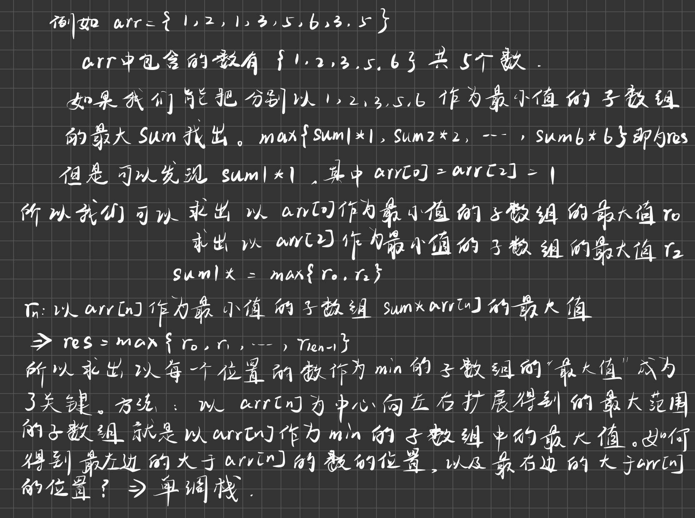
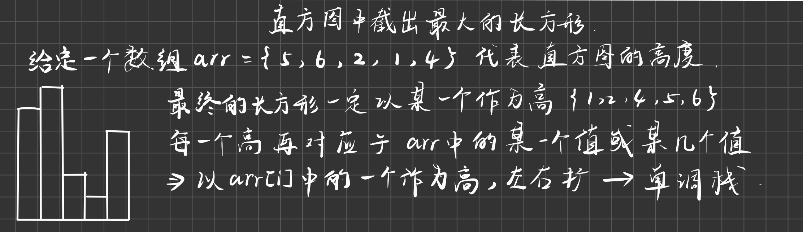

# 滑动窗口

> 滑动窗口是什么?滑动窗口是—种想象出来的数据结构:
> 
> ​	滑动窗口有左边界L和右边界R
> ​	在数组或者字符串或者一个序列上，记为S，窗口就是S[L..R]这一部分
> ​	L往右滑意味着一个样本出了窗口，R往右滑意味着一个样本进了窗口
> ​	L和R都只能往右滑

---

假如有一个数组，一开始窗口的左边界和右边界都在最左侧的位置，-1位置。没有包住任何一个数。

窗口运动遵循几个原则：

1. 右边界右移即R++，指的是新的一个数从右侧进入了窗口。
2. 左边界右移即L++，指的是已经进来的数从左侧出去了。
3. 任何时候L都要小于等于R。也就是不能跑到R的右边去。

---

每次L和R的移动都会导致窗口的状况改变。那么我如何知道每一个状况窗口的最大值或者是最小值？我能不能找一个不遍历的方法来实现这个功能。是可以的，这就是我们所说的窗口内最大值的更新结构，我做出一个结构，这个结构随着窗口的状况变化也随之变化，效果就是我每次想要达到窗口内的最大值我都能迅速的得到。

我们可以用单调双端队列（一个数可以从头进从头出，也可以从尾进从尾出）来实现这个结构---得到最大值，我们维持双端队列从头到尾是从大到小。

1. 在进数的时候也就是R++，从尾部加，如果队列为空或者前一个位置的数比自己大，那么就直接从尾部放入。如果加数的时候发现前面的数比自己小，就不停的从双端队列的尾部弹出数，直到双端队列为空或者前一个数比自己大了才从尾部进去
2. 在出数的时候也就是L++，看一下当前双端队列的头部的数是不是过期的那个数，例如L=5，L++变成了6，那么过期的那个数的下标就是5。此时看一下双端队列的头部是不是过期的那个数，如果是就弹出，如果不是就跳过，什么也不做。

这样做出来的双端队列头部的值就是我们现在窗口的最大值。可以看到，这个双端队列在进数的时候可以一直保证队列的头部是最大值。因为窗口可能会出数，所以利用L来推算出过期的数，这样就让双端队列的最左边一直保持的是不过期的（不过期说明这个数还在窗口里）最大值。

- 在R不动，L++的情况下，L位置的数过期了。此时双端队列里面的值代表的是哪些数会成为最大值的优先级。即值决定了哪些位置会依次成为最大值。例如双端队列现在的情况是2,1。现在我们进入了一个3，根据我们的规则，1和2都要弹出。凭什么可以这样？因为这个时候L不动，我从L到R的最大值就是3，因为3晚过期，怎么都轮不到3前面的1和2当最大值。同理，如果下一个进来的数比3小的话例如1，我们可以把它入队，放到3的后面。因为一旦3过期了，最大值就是1了，因为这个时候只有1不是过期的。
- 值比你好，比你晚过期----直接把前面的扔了。值比你坏但是比你晚过期，先留着。（好坏决定于是要最大还是最小，如果要最大，那么好的就是大于）
- 值相等也把前面的扔了
- 要把得到窗口的最小值我们只需要维持从头开始到尾部双端链表的值是从小到大就行了。
- 一个数要把从尾巴出去，要么从头出去。从尾巴出去（R++，出数的时候）就是后面进来了一个晚过期而且比它好的数（这个“好”取决于你要的是最大值还是最小值）。从头出去说明这个数是被过期掉的（L++，出数的时候）。每一个记录最多进双端队列一次，出双端队列一次。
- 窗口划过了N个数，双端队列的总代接是O（N），因为每个位置（index）最多进一次，最多出一次。平均下来每划过一个数的代价就是O（1）。
- 窗口用两个整型控制即可
- L的值代表的是最近一次出窗口的数的下标，R代表的最近一次进窗口的下标。也就是说(L,R]代表的是窗口囊括的数

## 固定大小窗口划过数组

- 题目：假设一个固定大小为W的窗口，依次划过arr。返回每一次滑出状况的最大值
  例如, arr = [4,3.5,4,3,3,6,7],W = 3

  返回:[5.5,5,4,6,7]

分析：根据前面的滑动窗口的结构，我们先让窗口滑动到R=w-1，记录下此时的最大值。之后每次都r++，l++再记录一次最大值。直到r越界了。

- java中LinkedList就是双端队列。前面在讲的时候双端队列里有index还有值。由于这里是arr，我们要值需要arr[index]即可。一定不能只放值！！！因为我们有通过index来判断过期，有了位置我即可拿到值，也可以判断是否过期。靠近头部存放的位置所对应的值一定要是最大的。
- 窗口并不是要独立写一个数据结构才能用。只需要维持一套逻辑就能用。这道题固定窗口大小决定了过期位置是确定的，即L可以用R推断出来。L=R-w+1,w为窗口大小

### 代码

```java
public static int[] getMaxWindow(int[] arr, int w){
    if (arr == null || arr.length == 0||w<=0) {
        return null;
    }
    int[] res=new int[arr.length-w+1];//长度为3对应1个结果，3-w+1
    int index=0;//专门给res数组用
    //这是一个双端队列。队头放大的值，需要谁就把谁放在队头。里面的值是下标
    LinkedList<Integer> qmax=new LinkedList<>();
    for (int R=0;R<arr.length;R++){//arr的每一个数一个一个进入窗口
        //不断的循环，直到当前队尾比R对应的值大，或者一直到队列为空。
        while (!qmax.isEmpty()&&arr[qmax.peekLast()]<=arr[R]){//把队列里面值比R小的先踢出去
            //比不过R就从尾巴出去，位置留给R
            qmax.pollLast();
        }
        qmax.addLast(R);
        if (R>=w-1){//从窗口扩大到w开始之后。不仅要进去一个，还要过期一个。在过期一个之前顺便得到一个结果
            res[index++]=arr[qmax.peekFirst()];//先得到一个结果再去过期一个
            if (R-w+1==qmax.peekFirst()){//过期操作。R-w+1是过期的位置，去判断当前队头是不是过期了！
                qmax.pollFirst();//过期就从队头出去
            }
        }
    }
    return res;
}
```

## 达标子数组问题

- 题目：给定一个整型数组arr，和一个整数num
  某个arr中的子数组sub，如果想达标，必须满足∶

  sub中最大值-sub中最小值<= num,
  返回arr中达标子数组的数量

### 分析

暴力解很显然，就是枚举每一个数组，看看每一个达不达标。枚举出每一个子数组-----N²，找出最大值最小值----N。合起来就是N³的解。

这里有一个隐藏条件：子数组A要满足条件，必须满足子数组A的子数组A1也要满足条件。因为子数组A如果满足条件，maxa>maxa1,mina<mina1。既然A都满足maxa-minb<=num，那么maxa1-mina1也必然<=num。

隐藏条件的拓展：如果小范围上的子数组已经不达标了，这个子数组扩充得到的大数组一定也不达标。

做法：做出两个窗口的更新结构，一个更新最大值，一个更新最小值。这样我就可以让窗口一直长大，一直到窗口不达标了我就停，不让那个会使得窗口不达标的数进这个窗口（体现在R++会因为不合格break跳过）。这样一来我们就可以知道以L开始的窗口的达标个数。然后让L往右边走，继续让R扩充（也可能不扩充了，因为第二次进来会反复加一次R，如果还是不达标，那么R还是不能++），这样又可以求出L+1开始的窗口达标的有几个。有几个？----利用下标相减。

整个过程L和R不回退。代价为O（N）。


---

优化一个题有几个方向：

1. 数据状况
2. 问题本身

这题是属于两个方向结合做优化。首先要能够用窗口内最大值和最小值的更新结构的前提是它的求解流程得是一个窗口。这道题得益于我们的那两个隐藏条件。子数组达标外扩必定不达标。子数组达标，它的子数组必定达标。这样一来我们就把范围和问题本身建立了单调性-----不达标，扩大必定不达标。达标，缩小必定达标。

把范围和问题建立单调性经常可以用首尾指针或者滑动窗口写。

### 代码

```java
/**
 * @param arr:
 * @param num:子数组的最大值和最小值的差<=num
 * @return :返回满足条件的子数组的个数
 */
public static int getNum(int[] arr, int num){
    if (arr==null||arr.length==0||num<0){
        return 0;
    }
    int res=0;
    LinkedList<Integer> qmin=new LinkedList<>();
    LinkedList<Integer> qmax=new LinkedList<>();
    int R=0;//一直向前不回退
    //求出以每一个位置作为开头的达标子数组的数量
    for (int start=0;start<arr.length;start++){
        while(R<arr.length){
            //R进到窗口中,维持最大值和最小值的结构
            while(!qmax.isEmpty()&&arr[R]>=arr[qmax.peekLast()]){//谁大谁有理
                qmax.pollLast();
            }
            qmax.addLast(R);
            while(!qmin.isEmpty()&&arr[R]<=arr[qmin.peekLast()]){//谁小谁有理
                qmin.pollLast();
            }
            qmin.addLast(R);
            //判断是否达标。下面出窗口需要peek，所以这里不能因为不达标就直接出了。在上面重复进队的时候while会帮我们重置。
            if (arr[qmax.peekFirst()]-arr[qmin.peekFirst()]>num){
                break;//不达标---加入了R之后变得不达标了1。
            }
            R++;
        }
        //start出窗口，过期，更新结构
        if (start==qmin.peekFirst()){
            qmin.pollFirst();
        }
        if (start==qmax.peekFirst()){
            qmax.pollFirst();
        }
        res+=(R-start);//偏移了R-start次到达了不达标的位置。算上自己的位置刚好就是偏移量。
    }
    return res;
}
```

# 单调栈

给定一个数组，要你找出每一个数左右两边离它最近并且比它小的数在哪。没有的话标记为-1。

我想求每一个位置，左边和右边离它最近的比它小的数的位置在哪，这么一张表就是单调栈要解决的问题。

暴力解法是O（N²），单调栈可以做到O（N）。

流程：先假设这个数组没有重复值。栈底放的是比较小的数，因为这里我们要求的是左右边离最近的比它小的数。如果是要求比它大的数的话，栈底就放比较大的数。所以现在我们的栈从栈底到栈顶是从小到大的。

如果栈为空就直接进栈，如果不为空就检查目前的栈顶是不是比你小。如果比你小就直接进栈。如果比你大，那么栈顶就弹出，同时生成栈顶那个数的记录。谁让你出来的，谁就是右边离你最近的小于你的数。你底下压的是谁，谁就是左边离你最近的比你小的数。让栈顶一直弹出，弹出几个数就生成几个记录，直到这个数被放入栈中。

整个数组处理完了就开始单独处理栈里还剩下的东西。这个时候栈里的数就都没有右边离它最近比它小的数了，因为这个时候的栈里面的数是我让他弹出的，而不是因为有一个数要进来才导致它弹出的。这个数底下压的是谁，谁就是左边的最近的比它小的数。

在这一整个流程中，所有的数都是进一次出一次，所以整体的时间复杂度是O（1）。

- 看下图abc情况。b在a的上面，意味着之前加载a和b之间的数都比b大，所以a一定是左边最近的比b小的数。同理，b和c之间的数都被c给弹出了，说明这些数都比b大，但是比c小。因为此时c要把b也弹出。所以c也比b小。所以b的右边最小就是c


---

上面的是没有重复值的数组。如果有重复值的话，栈里面就放的不是整型了，而是放一个整型列表，里面存的是对应值相等的下标。

- 流程类似。唯一不同的点就是如果相等的话就加到列表里面去。如果弹出就整个列表一起弹出，一起设置。


## 实现代码

```java
public static int[][] getNearLessNoRepeat(int[] arr){
    int [][] res=new int[arr.length][2];//一左一右
    Stack<Integer> stack =new Stack<>();//存放下标
    for (int i=0;i<arr.length;i++){
        while(!stack.isEmpty()&&arr[i]<arr[stack.peek()]){
            int index=stack.pop();//弹出
            //设置
            int left=stack.isEmpty()?-1:stack.peek();//前面一步有弹出，这里要检查
            int right=i;
            res[index][0]=left;
            res[index][1]=right;
        }
        stack.push(i);
    }
    while(!stack.isEmpty()){
        int index=stack.pop();//弹出
        //设置
        int left=stack.isEmpty()?-1:stack.peek();
        int right=-1;
        res[index][0]=left;
        res[index][1]=right;
    }
    return res;
}


/**
 * 逻辑：1.空栈，直接创建列表入栈然后把数插进去。2.栈非空且数组中的数大于栈顶列表代表的数，创建列表入栈然后把数插进去
 * 3.栈非空且数组中的数等于栈顶列表代表的数，直接把数插进栈顶的的列表中。
 * 4. 栈非空且数组中的数小于栈顶列表代表的数，循环弹出栈顶的列表并且设置直到跳出循环进入到123的逻辑分支
 * @param arr:目标数组
 * @return :数组的行号代表arr数组中的每一个数的下标，列一左一右放左右两边的最小
 */
public static int[][] getNearLess(int[] arr){
    int [][] res=new int[arr.length][2];//一左一右
    Stack<LinkedList<Integer>> stack =new Stack<>();//存放下标的列表
    for (int i=0;i<arr.length;i++){
        while(!stack.isEmpty()&&arr[i]<arr[stack.peek().peekLast()]){//小于
            LinkedList<Integer> list=stack.pop();//弹出
            //设置
            int left=stack.isEmpty()?-1:stack.peek().peekLast();//压着的队列的最后一个
            int right=i;
            for ( Integer j:list){
                res[j][0]=left;
                res[j][1]=right;
            }
        }
        if (!stack.isEmpty()&&arr[i]==arr[stack.peek().getLast()]){//等于
            stack.peek().addLast(i);//从尾部加
        }else {//大于
            LinkedList<Integer>list=new LinkedList<>();
            list.addLast(i);//从尾部加
            stack.push(list);
        }
    }
    while(!stack.isEmpty()){
        LinkedList<Integer> list =stack.pop();
        int left=stack.isEmpty()?-1:stack.peek().getLast();
        int right=-1;
        for (Integer i:list){
            res[i][0]=left;
            res[i][1]=right;
        }
    }
    return res;
}
```

## 求子数组（累加和 * 最小值）的最大值

- 题目：给定一个只包含正整数的数组arr, arr中任何一个子数组sub,一定都可以算出(sub累加和)* (sub中的最小值)，那么所有子数组中，这个值最大是多少?


子数组求和的技巧：生成一个前缀和数组sum[],其中sum[i]代表arr[0]+...+arr[i]。这样一来arr[L]+...+arr[R]=sum[R]-sum[L-1]

分析：

​	问题拆解，这里有两个变量，一个是累加和一个是最小值。我们先把最小值定下来，然后此时要求整体的最大值就变成了求累加和的最大值，显然累加和要越大子数组的范围也要越大。然后在众多值中，求出来的情况中再选一个最大的。这样就得到了整体的最大值。

​	所以这里我们就选中arr[0]当做这个最小值，看看往右边扩展可以扩展到多大。注意上面说的是找到最小值定下来最为一个最小情况。这里我们以arr中的每一个位置作为最小值是对上面说的进行进一步的拆解。

- 对单调栈做一个改进，我们找到离一个数最近的小于等于它的数就行。如果新数小于等于栈顶，那么栈顶就弹出。



### 代码

```java
/**
 * 数组的每一个数作为最小值，找出扩展出来的最大子数组，因为这个数要作为最小值，所以数组里面的数都是要<=它。所以我们找出离它最近的
 * 大于它的左右两边的数L和R，(L,R)即是我们要找的最大子数组。我们要找出最近的大于index的数，while的判断条件就是
 * arr[i]<=arr[stack.peek()],注意观察<=是>的相反面。
 * @param arr:
 * @return :
 */
public static int max(int[] arr){
    int [] res=new int[arr.length];
    Stack<Integer> stack =new Stack<>();//存放下标
    int[] sum=new int[arr.length];
    sum[0]=arr[0];
    int max=Integer.MIN_VALUE;
    for (int i=1;i<arr.length;i++){
        sum[i]=sum[i-1]+arr[i];
    }
    for (int i=0;i<arr.length;i++){
        while(!stack.isEmpty()&&arr[i]<=arr[stack.peek()]){//这里是小于等于就行，不需要严格小于
            int index =stack.pop();
            //栈为空说明左边没有比arr[index]大的数，换言之左边的全部范围都属于我们的最大子数组
            max=Math.max(max,arr[index]*(stack.isEmpty()?sum[i-1]:sum[i-1]-sum[stack.peek()]));
        }
        stack.push(i);
    }
    while(!stack.isEmpty()){
        int index=stack.pop();
        //栈为空说明右边没有比arr[index]大的数，换言之右边的全部范围都属于我们的最大子数组
        max=Math.max(max,arr[index]*(stack.isEmpty()?
                                     sum[arr.length-1]:sum[arr.length-1]-sum[stack.peek()]));
    }
    return max;
}
```

- 直方图中截出最大的长方形（和上面一样的解法）




- 找出你要求的结果和范围之间的单调性。
