# 算法和数据结构体系学习

## 时间复杂度、空间复杂度、对数器和二分法

### 位运算

- **题目：打印一个数（可正可负）在底层的二进制存储形式。**

  **例如：-1打印1111···1111，总共32个1.**

根据下图可知，总体的思想就是利用1左移i位来得到掩码，利用掩码判断第i为是0还是1.利用for循环，循环32次就可以把一个int类型的数的二进制表示打印出来。


### 代码

```java
public static void print(int num){
        for (int i=31;i>=0;i--){//i等于31，因为从高位开始
            System.out.print((num&(1<<i))==0?"0":"1");
        }
        System.out.println();
    }

    public static void main(String[] args) {
        print(4165454);
    }
```

### 算法

所谓的算法就是解决一个具体问题的具体流程，还有一些评价这些流程的可量化的指标。

算法的分类：1. 明确知道怎么算的流程，比如3+4。 2. 明确知道怎么尝试的流程，比如求一个数的所有的因子。

- **题目：给定一个数N，返回1!+2!+...+N!**

看下面的代码可以很明显的看出两种不同的算法的优劣。


### 代码

```java
	/**
	 * 返回1！+2！+...+N!
	 * @param N
	 * @return
	 */
	public static long f1(int N) {
		int res=0;
		for (int i=N;i>=1;i--){
			res+=factorial(i);
		}
		return res;
	}

	/**
	 * 求N!
	 * @param N:求N！，也就是返回n*(n-1)*(n-2)*...*1
	 * @return
	 */
	public static long factorial(int N) {
		int res=1;
		for (int i=N;i>=1;i--){
			res*=i;
		}
		return res;
	}

	public static long f2(int N) {
		int res=0;
		int cur=1;
		for (int i=1;i<=N;i++){
			cur*=i;//cur每次都乘上i
			res+=cur;
		}
		return res;
	}

	public static void main(String[] args) {
		int N = 10;
		System.out.println(f1(N));
		System.out.println(f2(N));
	}
```

### Java中的Math.random()

1. 首先要知道Math.random()返回的是[0,1)范围中的一个double类型的数，因为double类型是有精度的，所以Math.random()的值域是一个有限集。
2. 显而易见，Math.random()* k，其中k是一个整数，那么Math.random() *k就返回一个[0,k)范围内的double类型的数
3. 在2的基础上如果我们对Math.random()* k取整，(int)(Math.random()* k)返回的就是一个[0,k-1]范围内的一个整数。
4. 因而我们如果需要随机返回一个[0,k]上的整数，我们只需要(int)(Math.random()* (k+1))

代码如下：

```java
int ans = (int) (Math.random() * K); // [0,K-1]
```

---

**题目：现在我们要写一个函数，使得任意的x∈[0,1)，[0,x)上的数出现的概率变为x²。**

解析一下为什么，如果现在要返回的数<0.3，那么说明两个Math.random()都要<0.3才行，也就是说这是两个独立的事件。也就是说最终的数要小于0.3的概率是0.3²。

```java
public static double xToXPower2() {
   return Math.max(Math.random(), Math.random());
}
```

同理，如果我们现在要让概率变成x³，那么就调用三次Math.random()，他们的最大值要<x。


---

**题目：现在我们有一个函数f，它可以在1-5上等概率返回一个整数，也就是1,2,3,4,5中等概率返回一个。现在我们要你只使用这个f函数，实现一个另一个函数g，这个函数可以从1-7上等概率返回一个。**

分析：如果我们可以实现一个01等概率发生器，那么我们可以利用01等概率发生器，等概率产生2的k次方个数---这个01等概率发生器调用k次即可。然后我们让范围之外的数回卷，让概率均摊在我们想要的数的范围上。如何实现这个01等概率发生器呢？我们只需要让12返回0,45返回1，如果是3那么就重新调用一遍f。

```java
// lib里的，不能改！
public static int f1() {
   return (int) (Math.random() * 5) + 1;
}

// 随机机制，只能用f1，
// 等概率返回0和1
public static int f2() {
   int ans = 0;
   do {//利用do-while循环进行赋值可以保证赋值的结果一定不等于3
      ans = f1();
   } while (ans == 3);
   return ans < 3 ? 0 : 1;
}

// 得到000 ~ 111 做到等概率 0 ~ 7等概率返回一个
public static int f3() {//调用三次01等概率发生器，产生的三个数分别作为二进制的第1-3位
   return (f2() << 2) + (f2() << 1) + f2();
}

// 0 ~ 6等概率返回一个
public static int f4() {
   int ans = 0;
   do {//利用do-while循环进行赋值可以保证赋值的结果一定不等于7，返回结果为0-6
      ans = f3();
   } while (ans == 7);
   return ans;
}

public static int g() {+1返回1-7
   return f4() + 1;
}
```


---

**通过上面那题，我们能不能实现由a-b的等概率发生器实现c-d的等概率发生器？**

可以的。我们假设a-b一共有奇数个数。那么我们就让中间的那个数重来。例如9-19的话就让(9+19)/2=14重来。然后do-while返回一个不等于14的数。接着如果ans<14就返回0，>14就返回1。这样我们就得到了一个01等概率发生器。然后我们实现一个0-(d-c)的等概率发生器，我们找到大于d-c的最大2次方。然后让大于d-c的数全部重算即可。

```java
/**
 * 这个函数23-43随机返回一个整数，先从0-20返回一个整数，再加上23
 * @return
 */
public static int randomInt23to43(){
   return (int)(Math.random()*(20+1))+23;
}

/**
 * 只利用randomInt23to43()函数，实现从16-39中随机返回一个整数.先实现0-23随机返回一个
 * @return
 */
public static int randomInt16to39(){
   int ans=0;
   do {
      ans=(generate01UsingRandomInt23to43()<<4)
            +(generate01UsingRandomInt23to43()<<3)
            +(generate01UsingRandomInt23to43()<<2)
            +(generate01UsingRandomInt23to43()<<1)
            +generate01UsingRandomInt23to43();
   }while(ans>23);
   return ans+16;
}

/**
 * 利用randomInt23to43实现01等概率发生器
 * @return
 */
public static int generate01UsingRandomInt23to43(){
   int ans=0;
   do {
      ans=randomInt23to43();
   }while(ans==(23+43)/2);//最终出来的ans一定不等于33
   return ans<33?0:1;
}
```


---

现在我们给你一个x函数，这个x函数不等概率的返回01，如何只利用这个x函数来构造一个y函数01等概率发生器？

我们现在调用两次，返回00和返回11的概率是不一样的。但是返回01和10的概率是一样的。所以我们只要是00或者11就重做，让概率均摊到10和01上就能实现01等概率发生器。

```java
// 你只能知道，x会以固定概率返回0和1，但是x的内容，你看不到！
public static int x() {
   return Math.random() < 0.84 ? 0 : 1;
}

// 等概率返回0和1
public static int y() {
   int ans = 0;
   do {
      ans = x();
   } while (ans == x());
   return ans;
}
```


### 动态数组

- 是什么？

规定长度不变的数组叫做固定数组。在java中有一个arrayList是一个动态数组，它也是数组。但是arraylist如果超出长度了就会进行扩容。会新开拓一个比之前长一倍的数组，然后把老数组里面的值拷贝下来。

- 扩容行为的代价？

扩容行为会不会影响ArrayList整体的表现？假设我们现在放入了n个数。那么在这期间扩容的代价是1+2+4+...+(2^k)，其中2^k是接近n的。所以整体的代价就是O(N)的。均摊到n个数，每个数放入的时候时间复杂度还是O(1).所以扩容行为对整体的性能影响不大。

### 异或运算

- 面试题（异或）：（1）在一个整型数组中只有一种数出现了奇数次，其它的所有数都出现了偶数次，怎么找到出现了奇数次的数？(2)在这个数组中如果有两种数出现了奇数次其它所有的数都出现了偶数次，怎么样找到这两种数？

> 要求时间复杂度O(N)，额外空间复杂度O(1).

- 第一问

很简单，把数组上的数从头异或到尾的结果就是唯一的出现奇数次的那个数。

```JAVA
public static void printOddTimesOneNumber(int[] arr){
        int eor=0;
        for(int i:arr)  eor^=i;//出来之后eor就是我们要的
        System.out.println(eor);
    }
```

- 第二问

```JAVA
public static void printOddTimesTwoNumber(int[] arr){
        int eor=0;
        for(int i:arr)  eor^=i;//出来之后eor=a^b
        /**
         * 我们异或了所有的数得到了eor=a^b，现在要分别得到a和b还缺少一个条件。
         * 一个思路就是不去异或所有的数，我们只异或一部分的数，并且这一部分只包含 a和b的其中一个
         * 方法是找出a与b不同的那一位，利用掩码将a和b划分成两个子集，每个子集异或进去可以达到a或者是b。
         * 问题关键来到如何找出a和b不同的那一位，事实上a^b为1的那些位都是a和b不同的位，这里我们找a^b最右边的1
         * 小结论：一个数和它的补码的与运算得到的就是最右边的那一位---想想补码是怎么求的
         */
        int mask=eor&(~eor+1);//得到了掩码
        int aORb=0,another=0 ;
        for(int i:arr)  {
            if((i&mask)==mask) aORb^=i;
        }
        another=eor^aORb;
        System.out.println(another+" "+aORb);
    }
```


### 二分法的详解与扩展

> 1）在一个有序数组中，找某个数是否存在
>
> 2）在一个有序数组中，找>=某个数最左侧的位置
>
> 3）局部最小值问题

#### 1）在一个有序数组中，找某个数是否存在

```java
public static boolean exist(int [] sortedArr,int num){
    if (sortedArr.length==0||sortedArr==null)
        return false;
    int left=0,right= sortedArr.length-1,mid;
    while(left <= right){
        mid=((right-left)>>1)+left;
        if (sortedArr[mid]>num)
            right=mid-1;
        else if (sortedArr[mid] < num)
            left=mid+1;
        else
            return true;
    }
    return false;
}
```

#### 2）在一个有序数组中，找>=某个数最左侧的位置

这一题和第一题的区别就是1第一题它找到了这个数（也就是满足==条件了）就返回。但是这一题当它找到了一个数>=满足条件了，还是不返回，还是接着去二分，总之一定会**二分到底**，一直到某个范围已经没有数了。

不是只有找一个数可以二分，找>=最左侧的数或者是<=最右侧的位置也可以二分

```java
private static int nearestIndex(int[] sortedArray,int num){//大于num的最小数字
    if (sortedArray==null&&sortedArray.length==0)
        return -1;
    int left=0,right=sortedArray.length-1,mid=0,index=-1;
     while(left<=right){
         mid=((right-left)>>1)+left;
         if (sortedArray[mid]>num){
             index=mid;
             right=mid-1;
         }
         else
             left=mid+1;
     }
     return index;//如果没有找到那么index就是等于-1
}
```


#### 3）局部最小值问题

局部最小值说的是这样一件事：在一个数组中，arr无序，但是告诉你任何两个相邻的数不相等。要求局部最小，局部最小就是比两边小（端点只要比一个小就行）。在这样的数组中我只求一个局部最小的位置。要求时间复杂度好于O(N)。

先判断首尾是不是局部最小，如果有其中一个是局部最小那么就直接返回。如果都不是局部最小，那么0位置处导数小于0，N-1位置的导数大于0，这里说导数不科学，但是方便理解。0-1是减的趋势，N-2~N-1是增加的趋势，中间一定有一个地方会从一开始减的趋势过渡到增的趋势。然后我从中间找一个位置，假设是M，如果M不是局部最小，那么就至少比左右两边其中一边要大，比左边大就递归左边，比右边大就递归右边。最终就可以找到局部最小。并不一定只有有序才能二分，要根据具体的数据状况，二分之后能不能归结到同一类问题来求解。

优化有两种情况：一种是数据状况、一种是问题流程。数据特殊你可以优化，问题特殊你也可以优化。当构建出排他性的时候就可以二分了，当你确定左右两边和你求的问题有关，并且确定可以甩掉一边（另一边一定有）。

```java
    private static int getLessIndex(int[] arr) {//这边的数组不要求是有序数组
        if (arr.length < 2 || arr == null)
            return -1;
        if (arr[0] < arr[1])
            return 0;
        if (arr[arr.length - 1] < arr[arr.length - 2])
            return arr.length - 1;
        //left和right设为1和len-2是为了防止后面判断局部最小的时候防止越界
        int left = 1, right = arr.length - 2, mid = 0;
        while (left <= right) {
            mid = ((right - left) >> 1) + left;
            if (arr[mid] > arr[mid + 1])
                left = mid + 1;
            else if (arr[mid] > arr[mid - 1])
                right = mid - 1;
            else
                return mid;
        }
        return -1;
    }
```

### 对数器

你实现了一个想测的方法a，有一个暴力的好实现的 方法b。生成一个随机样本产生器给你产生随机数据，产生的样本分别在a和b里面跑，比对结果。具体就是两段代码拿来对数器里面一直跑，跑个几万几十万次，两个结果一定要一样。如果跑出来都是一样的，那么就说明两个方法都对了。如果不对我可以调小范围， 在对数器里面增加打印来进行调试排除错误。

这种方法可以不依赖线上测试平台就能知道写的对不对

> 对数器的概念和使用
> 1，有一个你想要测的方法a
> 2，实现复杂度不好但是容易实现的方法b3，实现一个随机样本产生器
> 4，把方法a和方法b跑相同的随机样本，看看得到的结果是否一样。
> 5，如果有一个随机样本使得比对结果不一致，打印样本进行人工干预，改对方法a或者方法b
> 6，当样本数量很多时比对测试依然正确，可以确定方法a已经正确。

### Master公式

子问题 等规模的递归可以用master公式。

> 剖析递归行为和递归行为时间复杂度的估算 
>
> 用递归方法找一个数组中的最大值，系统上到底是怎么做的？ 
>
> master公式的使用 
>
> T(N) = a*T(N/b) + O(N^d) 
>
> log(b,a) > d -> 复杂度为O(N^log(b,a)) 
>
> log(b,a) = d -> 复杂度为O(N^d * logN)
>
> log(b,a) < d -> 复杂度为O(N^d) 
>
> 补充阅读:www.gocalf.com/blog/algorithm-complexity-and-master- theorem.html


返回数组某一个范围上的最大值的递归算法。

```java
public static int getMax(int[] arr) {
		return process(arr, 0, arr.length - 1);
	}
public static int process(int[] arr, int L, int R) {
   if (L == R) {
      return arr[L];
   }
   int mid = L + ((R - L) >> 1);
   int leftMax = process(arr, L, mid);
   int rightMax = process(arr, mid + 1, R);
   return Math.max(leftMax, rightMax);
}
```

### 认识复杂度

#### 常数操作

常数操作：数组的寻址，a=arr[i]。数组是随机存取，这边时间和数据规模无关，不管你ar有多大，算一个偏移就把数组里面的数拿出来了；加减乘除；位运算；

什么时候不是常数操作，假如有一个链表，我要得到链表i位置的值，int a=list.get(i)，那么这个就不是一个常数操作。链表要遍历去找。虽然逻辑上是线性结构，但是实际在物理上不是连续的。所以这是一个和数据量有关的操作。

和数据量无关的就是常数操作，否则就不是。

时间复杂度估计的指标在数学上就是上限。当数据量很大的时候，这个上限就成为了一个流程速度快慢的瓶颈。例如n²+99999999n+80，假如常数操作的表达式是这个，时间复杂度依然是O（n²）。

如果两个算法都是On的话就要拼常数项，但是不能只按照常数项来估计，因为同样是常熟操作，乘法操作和加法操作的时间是不一样的。所以用理论值无法估计，要实际去运行来确定哪个更好。虽然你估计出明确的常数数量，但是每一种常数操作的时间还是有差别的。

> 认识时间复杂度
>
> 常数时间的操作
>
> 一个操作如果和样本的数据量没有关系，每次都是固定时间内完成的操作，叫做常数操作。
>
> **时间复杂度为一个算法流程中，常数操作数量的一个指标**。常用0(读作big 0)来表示。具体来说，先要对一个算法流程非常熟悉，然后去**写出这个算法流程中，发生了多少常数操作，进而总结出常数操作数量的表达式**。
>
> 在表达式中，只要高阶项，不要低阶项，也不要高阶项的系数，剩下的部分如果为f(N)，那么时间复杂度为0(f(N))。
>
> **评价一个算法流程的好坏，先看时间复杂度的指标，然后再分析不同数据样本下的实际运行时间，也就是“常数项时间”。**

---

当你只需要有限几个变量就能完成算法，那么这个算法的额外空间复杂度就是O（1）。如果你需要申请一个和数据量等规模的数组的时候，那么这个算法的额外空间复杂度就是O(N)。

> 选择排序、冒泡排序细节的讲解与复杂度分析时间复杂度O(N^2)，额外空间复杂度0(1)


### 比较器

Java有一个比较器接口，我们可以去完成这个接口来设计一个比较器的对象。把比较器对象传进java自带的排序函数里面即可。返回负数第一个排前面，正数第二个排前面，0的话无所谓先后。Java的比较器等同于cpp的重载运算符。

这是降序。如果是O1在前面就是升序了。传a，b------如果return b-a那么堆就变成了最大堆了。


> 1）比较器的实质就是重载比较运算符 
>
> 2）比较器可以很好的应用在特殊标准的排序上 
>
> 3）比较器可以很好的应用在根据特殊标准排序的结构上


### 哈希表

hashmap的put方法可以是增加也可以是更新，更新的是value。同样的hashmap也可以remove一个key，把key连同它的value一起删掉。哈希表在使用的时候认为时间复杂度都是常数级别---但是这个常数比较大。哈希表map和set都是一个东西，无非就是带不带value。

java里面是按值传递，你往里面放一个key，它会拷贝一份放进去。你自己创建的对象就是拷贝它的引用--内存地址进去。


### 有序表

在Java里面叫做，treemap和treeset。map和set的区别就在于key带不带伴随。有序表的意思就是内部按照key来组织有序的。也就是哈希表能实现的功能有序表都能实现，而且有序表还能根据key有序这件事有新的功能--增加了一些新的API。性能上比哈希表要差一点，哈希表不管是什么数据量，增删改查都是常数级别的。但是有序表增删改查都是logN级别的。

放入有序表的东西，如果不是基础类型，必须要提供比较器，因为有序表需要利用到比较。


### 有序表的操作


## 链表

#### 利用链表实现队列和栈

###### 代码

```java
public static class Node<V>{
   public V value;
   public Node<V> next;

   public Node(V value){
      this.value=value;
   }
}

public static class MyQueue<V>{
   public Node<V> head;//从头出
   public Node<V> tail;//从尾进
   public int size;

   public MyQueue(){
      head=null;
      tail=null;
      size=0;
   }

   public int size(){
      return size;
   }

   public boolean isEmpty(){
      return size==0;
   }

   public void EnQueue(V value){
      Node<V> node=new Node<>(value);
      if (tail==null){
         head=node;
         tail=node;
      }else {
         tail.next=node;
         tail=node;
      }
      size++;
   }

   public V DeQueue(){
      V ans=null;
      if (head!=null){
         ans=head.value;
         head=head.next;
         size--;
      }
      if (head==null){
         tail=null;
      }
      return ans;
   }

   public V peek(){
      V ans=null;
      if (head!=null){
         ans=head.value;
      }
      return ans;
   }
}

/**
 * 栈用头插来实现。从头部出
 * @param <V>
 */
public static class MyStack<V>{
   Node<V> head;
   int size;

   public MyStack(){
      head=null;
      size=0;
   }

   public boolean isEmpty(){
      return 0==size;
   }

   public int size() {
      return size;
   }

   public void push(V value){
      Node<V> node=new Node<>(value);
      if (head==null){
         head=node;
      }else {
         node.next=head;
         head=node;
      }
      size++;
   }

   public V pop(){
      V value=null;
      if (head!=null){
         value=head.value;
         head=head.next;
         size--;
      }
      return value;
   }

   public V peek(){
      return head!=null?head.value:null;
   }

}
```

#### 利用双向链表实现双向入队出队的队列

###### 代码

```java
public static class Node<V> {
   public V value;
   public Node<V> last;
   public Node<V> next;

   public Node(V v) {
      value = v;
      last = null;
      next = null;
   }
}

public static class MyDeque<V> {
   private Node<V> head;
   private Node<V> tail;
   private int size;

   public MyDeque() {
      head = null;
      tail = null;
      size = 0;
   }

   public boolean isEmpty() {
      return size == 0;
   }

   public int size() {
      return size;
   }

   public void pushHead(V value) {
      Node<V> node = new Node<>(value);
      if (head == null) {
         head = node;
         tail = node;
      } else {
         node.next = head;
         head.last = node;
         head=head.last;
      }
      size++;
   }

   public void pushTail(V value) {
      Node<V> node=new Node<>(value);
      if (head==null){
         head=node;
         tail=node;
      }else{
         tail.next=node;
         node.last=tail;
         tail= tail.next;
      }
      size++;
   }

   public V pollHead() {
      V value=null;
      if (head!=null){//至少有1个元素
         value= head.value;//把值存下来
         head= head.next;//head后移
         if (head==null){//防止下面出现空指针异常，进入这个if语句说明只有一个元素
            tail=null;
         }else {//能执行这一段代码说明至少有两个元素。确保前面的next不指向任何结点，让JVM释放
            head.last=null;
         }
         size--;
      }
      return value;
   }

   public V pollTail() {
      V value=null;
      if (tail!=null){
         value=tail.value;
         tail= tail.last;
         if (tail==null){
            head=null;
         }else{
            tail.next=null;
         }
         size--;
      }
      return value;
   }

   public V peekHead() {
      return head!=null?head.value:null;
   }

   public V peekTail() {
      return tail!=null? tail.value:null;
   }

}
```

#### K个节点组内逆序调整

题目：链表分组，每组k个节点，组内逆序，不够k个的不管。也就是1->2->3->4->5->6->7->8->9->10，如果k为3，结果为3->2->1->6->5->4->9->8->7->10。

可以看到，这个函数一定是一个换头函数。因为头变了，变成了3。


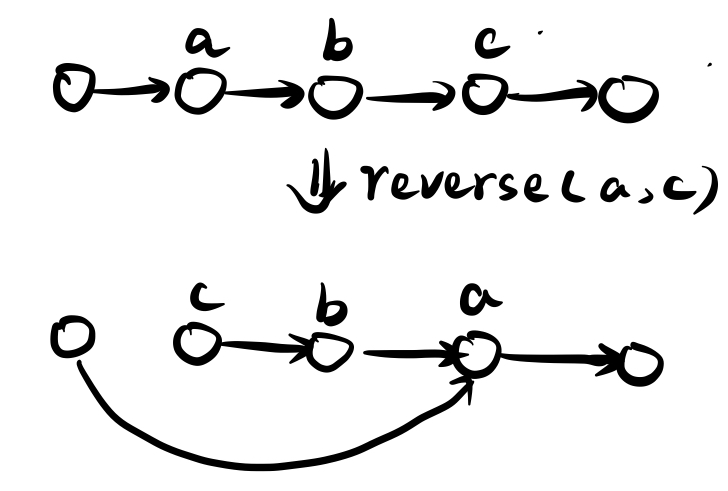

###### 代码

```java
// 测试链接：https://leetcode.com/problems/reverse-nodes-in-k-group/
public class Code04_ReverseNodesInKGroup {

   // 不要提交这个类
   public static class ListNode {
      public int val;
      public ListNode next;

      public ListNode(int value){
         this.val=value;
         this.next=null;
      }
   }

   public static ListNode reverseKGroup(ListNode head, int k) {
      ListNode start=head;
      ListNode end=countK(head,k);
      head=end;
      ListNode last=null;//记录上一组的最后一个结点

      if (end==null){
         return head;
      }

      reverse(start,end);
      last=start;
      while(start.next!=null){
         start=start.next;
         end=countK(start,k);
         if (end==null){
            break;
         }
         reverse(start,end);
         last.next=end;
         last=start;
      }


      return head;
   }

   /**
    * 这个函数的功能就是从start结点开始（第一个结点），返回第k个节点。
    * @param start
    * @param k
    * @return
    */
   public static ListNode countK(ListNode start, int k) {
      while(start!=null&&k!=1){
         start= start.next;
         k--;
      }
      return start;
   }

   public static void reverse(ListNode start, ListNode end) {
      ListNode pre=end.next;
      end=end.next;
      ListNode next=null;
      while(start!=end){
         next=start.next;
         start.next=pre;
         pre=start;
         start=next;
      }
   }
}
```

reverse函数写成下面这个是不对的，因为start指针最后会运动到和end一样的地方，然后把end的next指针给改了。这样会导致end.next就不是原本的最后一个结点的下一个了，而是原本最后一个结点的前一个了。会导致start停不下来，一直往后走，导致空指针异常

```java
public static void reverse(ListNode start, ListNode end) {
      ListNode pre=end.next;
      end=end.next;
      ListNode next=null;
      while(start!=end){
         next=start.next;
         start.next=pre;
         pre=start;
         start=next;
      }
   }

public static void reverse(ListNode start, ListNode end) {
      ListNode pre=end.next;
      ListNode next=null;
      while(start!=end.next){
         next=start.next;
         start.next=pre;
         pre=start;
         start=next;
      }
   }
```

#### 两个链表相加

- 题目：给定两个链表的头节点head1和head2,认为从左到右是某个数字从低位到高位，返回相加之后的链表例子：

  4 ->3-> 6		2->5-> 3

  返回6-> 8->9

思路：先选出比较长的那一个链表，然后逐位相加，直接改在长链表上。短链表不为空是第一个逻辑分支--long.value+short.value+carry，长链表不为空是第二个逻辑分支---long.value+carry。长短链表都结束了，检查是否有进位是第三个逻辑分支--carry。

###### 代码

```java
// 测试链接：https://leetcode.com/problems/add-two-numbers/
public class Code05_AddTwoNumbers {

    // 不要提交这个类
    public static class ListNode {
        public int val;
        public ListNode next;

        public ListNode(int val) {
            this.val = val;
        }

        public ListNode(int val, ListNode next) {
            this.val = val;
            this.next = next;
        }
    }

    public static ListNode addTwoNumbers(ListNode head1, ListNode head2) {
        int len1 = listLength(head1);
        int len2 = listLength(head2);
        ListNode longList = len1 >= len2 ? head1 : head2;//longList为head1和head2中比较长的那个
        ListNode shortList = longList == head1 ? head2 : head1;//shortList为另外一个比较短的
        ListNode head = longList;//返回它
        ListNode longPre = longList;//指向长链表指针的前一个位置

        int carry = 0;
        int sum = 0;
        while (shortList != null) {
            sum = shortList.val + longList.val + carry;
            longList.val = sum % 10;
            carry = sum / 10;
            longPre = longList;
            longList = longList.next;
            shortList = shortList.next;
        }

        while (longList != null) {
            sum = longList.val + carry;
            longList.val = sum % 10;
            carry = sum / 10;
            longPre = longList;
            longList = longList.next;
        }

        if (carry != 0) {
            longPre.next = new ListNode(1);
        }

        return head;

    }

    // 求链表长度
    public static int listLength(ListNode head) {
        int len = 0;
         while (head != null) {
            len++;
            head = head.next;
        }
        return len;
    }
```


#### 合并有序链表

- 题目：给定两个有序链表的头节点head1和head2,返回合并之后的大链表，要求依然有序

  例子：1->3 ->3->5 ->7			2 -> 2 -> 3->3->7

  返回：1->2 ->2->3->3->3->3->5->7->7

######## 代码

```java
// 测试链接：https://leetcode.com/problems/merge-two-sorted-lists
public class Code06_MergeTwoSortedLinkedList {

   // 不要提交这个类
   public static class ListNode {
      public int val;
      public ListNode next;
   }

   public static ListNode mergeTwoLists(ListNode head1, ListNode head2) {
      if (head1==null||head2==null){
         return head1!=null?head1:head2;
      }
      ListNode head=null;
      ListNode cur=null;
      if (head1.val<= head2.val){
          head=head1;
          head1= head1.next;
      }else {
         head=head2;
         head2= head2.next;
      }
      cur=head;
      while(head1!=null&& head2!=null){
         if (head1.val<= head2.val){
            cur.next=head1;
            head1= head1.next;
         }else {
            cur.next=head2;
            head2= head2.next;
         }
         cur= cur.next;
      }
      cur.next=head1!=null?head1:head2;
      return head;
   }

}
```

#### 翻转链表

如果链表中不涉及到换头的操作就可以定义成void类型，如果涉及到了换头的操作，那么就需要有返回值。比如下面，123变成321返回的应该是以三为头。


###### 代码

```JAVA
private static class Node {//单向链表
        public int value;
        public Node next;

        public Node(int data) {
            value = data;
        }
    }

    /**
     * 翻转单链表
     * @param head:单链表的头节点
     * @return
     */
    private static Node reverseList(Node head){
        Node pre=null,next=null;
        while(head!=null){//从第一个结点遍历到最后一个结点
            next=head.next;//保存下一个结点，以便于next迭代
            head.next=pre;//改变当前结点的next指针的指向，指向前一个结点pre.
            pre=head;//当前结点head在一次迭代之后就变成了pre。pre一开始是null
            head=next;//head迭代
        }
        return pre;//head迭代成null之后pre正好指向的就是原来链表最后一个结点，也就是现在的头节点
    }

    private static class DoubleNode {//双向链表结点
        public int value;
        public DoubleNode last;
        public DoubleNode next;

        public DoubleNode(int data) {
            value = data;
        }
    }

    /**
     * 翻转双向链表
     * @param head :双向链表的头节点
     * @return
     */
    private static DoubleNode reverseList(DoubleNode head){
        DoubleNode pre=null,next=null;//两个辅助指针，分别保存下一个结点和前一个结点
        while(head!=null){//从第一个结点遍历到最后一个结点
            next=head.next;//保存下一个结点，以便于next迭代
            //翻转当前结点的两个指针
            head.next=pre;
            head.last=next;

            pre=head;//迭代pre
            head=next;//迭代next
        }
        return pre;
    }
```


#### 打印两个有序链表的公共部分

两个指针，谁小谁移动，相等打印，打印完成之后一起移动。有越界就停。


###### 代码

```JAVA
public static class Node {
        public int value;
        public Node next;
        public Node(int data) {
            this.value = data;
        }
    }

    /**
     * 打印两个链表的相同值
     * @param head1：链表1的头节点
     * @param head2：链表2的头节点
     */
    private static void printCommonPart(Node head1,Node head2){
        System.out.print("common part is ");
        while(head1!=null&&head2!=null){
            if (head1.value<head2.value)
                head1= head1.next;//谁小谁动
            else if (head2.value< head1.value)
                head2= head2.next;//谁小谁动
            else {//相等一起动
                System.out.print(head1.value+" ");
                head1= head1.next;
                head2= head2.next;
            }
        }
        System.out.println();
    }
```


#### 链表方法论


#### 判断回文


以node为最小单位判断回文。

笔试：把链表的值放到栈里面，然后从头遍历链表依次从栈中弹出比对。

现在问题是能不能省一点空间，我只把右半部分放进栈里？现在的问题是我怎么只把右半部分放入栈？单链表有一个缺点，就是我不能知道后面的情况，我只能一个一个往下走，所以这里我们只用一个指针是不能知道我指针到底处在链表的什么位置。这里有一个技巧----快慢指针。快指针一次走两步，慢指针一次走一步。快指针走完的时候慢指针会来到中点的位置，然后我们就可以把慢指针后面的东西都放入到栈里面去了。

要根据实际的需求自己去定制快慢指针，这只和边界条件的控制有关，和算法无关。实现这样的差别可能只需要快慢指针分别多走几步或者少走几步就可以实现，但是一定要写熟练。尤其在链表的规模在比较小的时候比如1,2,3个节点，这样的情况要分析是否需要特殊处理。


利用格外的空间可以实现，但是这样一来就太简单了。如果不使用额外的空间要实现这样的功能怎么办？如何用有限几个变量去做到这点。慢指针指向中间的时候，把后面的指针全部改了，然后一个从头开始，一个从尾开始，一个一个比对，如果中间有其中一个不一样，那么就结束，如果有一个走到头了，那么就成功。完成之后再把链表再改回来。


###### 代码

```java
public static class Node {
        public int value;
        public Node next;

        public Node(int data) {
            this.value = data;
        }
    }

    private static boolean isPalindrome1(Node head){//暴力解法。利用栈逆序
        Stack<Node> stack=new Stack<>();
        Node temp=head;
        while(temp!=null){//压栈实现逆序
            stack.push(temp);
            temp= temp.next;
        }
        while(!stack.isEmpty()){//从栈中弹出比对
            if (stack.pop().value!=head.value)
                return false;
            head= head.next;
        }
        return true;
    }

    private static boolean isPalindrome2(Node head){
        if (head==null||head.next==null)// 确定至少有两个元素
            return true;
        Node n1=head.next;//定制快慢指针返回中和中右(2,2)
        Node n2=head.next;
        while(n2.next!=null&&n2.next.next!=null){//返回中和右中
            n2=n2.next.next;
            n1=n1.next;
        }
        //出循环，现在n1在对称轴右边
        Stack<Node>stack=new Stack<>();
        while(n1!=null){
            stack.push(n1);
            n1=n1.next;
        }
        while(!stack.isEmpty()){
            if (stack.pop().value!=head.value)
                return false;
            head=head.next;
        }
        return true;
    }

    private static boolean isPalindrome3(Node head){
        if (head==null||head.next==null)//0~1个结点直接返回true
            return true;
        Node fast=head.next;
        Node slow= head.next;//返回中和中右(2,2)
        while(fast.next!=null&&fast.next.next!=null){
            fast=fast.next.next;
            slow=slow.next;
        }
        Node tail=reverse(slow);//从尾巴出发，副作用为翻转slow以后的链表
        Node tail2=tail;
        Node h=head;//从头出发
        boolean res=true;
        while(tail!=null){//从n1这里开始因为偶数的时候右边比较短
            if (tail.value!= h.value){
                res= false;
                break;
            }
            tail=tail.next;
            h=h.next;
        }
        //恢复链表
        reverse(tail2);
        return res;
    }

    /**
     * 翻转以head为头节点的链表，并最终返回新的链表的头节点
     * @param head
     * @return
     */
    private static Node reverse(Node head){
        if (head==null||head.next==null) return head;
        Node pre=null,next=null;
        while(head!=null){
            next=head.next;
            head.next=pre;
            pre=head;
            head=next;
        }
        return pre;
    }
```


#### 划分单链表（左边小、中间相等、右边大）


笔试：把这一个一个结点放入到一个结点数组里面，然后在数组里面partition，然后再把数组里面的节点重新串起来。

面试：如果不用额外的空间呢？单链表的移动没有这么重，还可以保证稳定性。我们需要六个变量。

然后从链表的头开始遍历，一个一个和num进行比较，然后看对应区域的头和尾，如果两个都是空，那么说明这是第一个发现的结点，让头也指向这个结点尾也指向这个结点。然后如果再发现一个，就让尾结点指向这个结点，然后尾结点更新成这个结点。最后这三堆结点尾串头全部连起来就行。

###### 代码

```java
public static class Node {
        public int value;
        public Node next;

        public Node(int data) {
            this.value = data;
        }
    }

    public static Node listPartition1(Node head, int pivot){
        Node temp=head;
        int num=0;
        while (temp!=null){//遍历统计链表的大小
            num++;
            temp=temp.next;
        }
        Node[] arr=new Node[num];
        temp=head;
        int i=0;
        while(temp!=null){
            arr[i++]=temp;
            temp=temp.next;
        }
        for (i=0;i<arr.length-1;i++){
            arr[i].next=arr[i+1];
        }
        arr[i].next=null;
        return arr[0];
    }

    private static void partition(Node[] arr, int pivot) {
        int less=-1;
        int more=arr.length;
        int index=0;
        while(index<more){
            if (arr[index].value<pivot){
                swap(arr,++less,index++);
            }else if (arr[index].value>pivot){
                swap(arr,--more,index);
            }else {
                index++;
            }
        }
    }

    private static void swap(Node[] arr, int a, int b) {
        Node temp=arr[a];
        arr[a]=arr[b];
        arr[b]=temp;
    }

    /**
     *思路：创建三个单向链表，分别用来存储小于、等于、大于的。这样一来就要三个头节点，但是为了速度更快，不需要每次都遍历到尾结点，所以
     *     我们对于每个单向链表还额外增加了一个尾结点。这样一来最后拼接三个链表就很容易，而且中途增加新节点也很容易。创建完了三个单链表
     *     以后，我们从头遍历链表，每次孤立一个结点。孤立一个结点指的是让这个结点和后面的结点脱离联系，也就是让这个结点的next指针置为null
     * @param head:head为头的单向链表
     * @param pivot:以pivot作为划分值，把单向链表划分成三段
     * @return
     */
    public static Node listPartition2(Node head, int pivot) {
        Node ss=null,se=null,es=null,ee=null,bs=null,be=null;
        while(head!=null){
            Node next=head.next;
            head.next=null;//孤立这个结点。如果不置空，可能会导致大于链的最后一个结点和某一个其它结点连接形成闭环，导致无限循环。
            if (head.value<pivot){
                add(ss,se,head);//重新写成一个方法
            }else if (head.value==pivot){
                add(es,ee,head);
            }else {
                add(bs,be,head);
            }
            head=next;
        }
        //开始连接这三个链。如果小于链有东西，就让小于链的末尾连接等于链，然后更新小于链的尾结点，因为最后我们是返回小于链、等于链，大于链
        //中第一个非空链的头节点。
        if (ss!=null){//小于链有东西，最后肯定返回小于链---我们在小于链的我们串上东西
            se.next=es;//小于链末尾连上等于链的头。
            se=es==null?se:ee;//如果等于链为空小于链的尾就不更新，而如果等于链不为空就换成等于链的尾
            se.next=bs;//接着连上大于链的头，现在可以返回了
            return ss;
        }
        if (es!=null){//潜台词是小于链已经为空了，最后直接返回等于链的头
            ee.next=bs;
            return es;
        }
        return bs;
    }

    /**
     *
     * @param head:
     * @param tail:
     * @param val:将val结点加到以head为头，tail为尾的单链表上
     */
    private static void add(Node head,Node tail,Node val){
        if (head==null){//蕴含着tail也为null
            head=val;
            tail=val;
        }else {
            tail.next=val;
            tail=tail.next;
        }
    }
```

#### 复制随机指针节点的链表


利用hashmap，把老结点作为key，新的结点作为value。然后遍历老链表，利用老结点和新节点的对应关系可以拷贝过来。

如果不用hashmap？哈希表是通过结构来实现一一对应，让我们通过老结点可以找到对应的新节点。如果我们就把新节点放到老结点的next上，那么也可以实现一一对应。也就是我们遍历老链表，生成一个新节点，老的next指向新的。接着就再一次遍历，我们一对一对的调整新结点的random，调整完成再分离开。


###### 代码

```java
public static class Node {
        public int value;
        public Node next;
        public Node rand;

        public Node(int data) {
            this.value = data;
        }
    }

    public static Node copyListWithRand1(Node head){
        Node p=head;
        HashMap<Node,Node> map=new HashMap<>();
        while(p!=null){
            map.put(p,new Node(p.value));
            p=p.next;
        }
        p=head;
        Node res=map.get(head);
        while(p!=null){
            map.get(p).next=map.get(p.next);
            map.get(p).rand=map.get(p.rand);
            p=p.next;
        }
        return res;
    }

    public static Node copyListWithRand2(Node head){
        if (head==null)
            return null;
        Node p=head;
        Node next;
        while(p!=null){//在每一个老结点的后面插上对应的新结点，插入完成以后链表的长度一定为偶数，2N
            next=p.next;//把p的后继存起来，后面要迭代
            p.next=new Node(p.value);
            p.next.next=next;//让新节点指向老结点的下一个
            p=next;
        }
        p=head;
        while(p!=null){//不涉及到破坏next链，一个p变量就可以搞定
            p.next.rand=p.rand==null?null:p.rand.next;//p.next代表新结点x，老结点的random指向另一个老结点y，y.next就是对应的新结点
            p=p.next.next;//下一个老结点。偶数个节点数，不会报错
        }
        p=head;
        Node p2,res;
        res=head.next;//保存新链头节点
        while(p!=null){//分离新老结点。奇偶结点分离
            next=p.next.next;//老结点。偶数个结点跳不出去
            p2=p.next;//新结点
            p.next=next;//老结点和老结点相连
            p2.next=next==null?null:next.next;
            p=next;
        }
        return res;
    }
```

#### 单链表相交


这题不仅可以标记有没有相交，还有返回第一个相交的结点。相交的意思就是两个链表中有两个结点各自的内存地址是同一个。

这题首先要判断有环和无环，因为有环和无环处理起来应该是不一样的。怎么判断有环无环？我们想要实现这样一个函数，如果有环的话就返回第一个入环结点，如果无环就返回空。这样设计的话函数的含义要比返回布尔类型的函数含义要丰富一些。框起来的是第一个入环结点。

如果我们使用额外的数据结构来做这件事情，那么我们只需要一个hashset，也就是一个集合。从头遍历链表，我们每到一个结点就先查一下set里面有没有这个元素，没有这个元素就放进去，如果集合里面有了这个元素，那么这个结点就是第一个入环结点。有环的结点一个是一个6的形状，因为链表一旦入环就不可能再出来了。

让快慢指针从head开始走，如果相遇了那么就说明有环，如果快指针走到头了就说明没有环。如果相遇了重置其中一个指针到head，再一个指针走一步，再次相遇的点就是第一个入环结点，证明如下。


现在我们解决了链表是否有环的情况，现在我们解决相交问题。如果是两个无环单链表相交的话，那么就说明这两个链表**共有**从相交的结点到结尾的部分。

这样我们就分别遍历两个链表，分别记录两个链表的长度和最后一个结点，如果两个链表的最后一个结点相同那么说明他们相交了，如果不同就说明他们没有相交。然后我们让长链表的指针先走差值步，然后两个链表的指针一起走，最后一定会在相交的结点相遇。

如果一个链表有环一个链表无环的话，那么这两个链表一定不会相交！相交就代表公用，公用就一定会有环。

最后一种情况就是两个链表都有环。一个是不相交。相交分两种情况，一种是入环结点相同，一种是入环结点不同。但是相交的话有一个可以肯定，就是他们一定是同一个环。

第二种情况（loop1==loop2）可以归结为无环结点的相交问题。因为我们可以把loop1和loop2看成是终止结点，后面的环我们不管了。loop1和loop2分别是链表1和链表2的入环结点。（思考我们是否可以直接把loop.next=null，然后直接用前面写的函数。最后再接回来）。

情况1和情况3怎么办？1和3最大的区别就是环是不是公用的。如果环是公用的，那么loop1转一圈一定可以遇到loop2。这个时候返回loop1或者loop2都对。


###### 代码

```java
public static class Node {
        public int value;
        public Node next;

        public Node(int data) {
            this.value = data;
        }
    }

    /**
     * 传进来两个链表要判断他们两个是否相交，由于这两个链表可能是循环链表也可能不是。所以我们要写一个函数来判断
     * 他们的类型。由于无环链表只能和无环链表相交，循环链表只能和循环链表相交，其中无环链表和循环链表不可能相交。
     * 所以我们这里就分成两种情况就行。
     *
     * @param head1
     * @param head2
     * @return
     */
    public static Node getIntersectNode(Node head1, Node head2) {
        Node in1=getLoopNode(head1);//入环结点1
        Node in2=getLoopNode(head2);//入环结点2
        if (in1==null&&in2==null){
            return noLoop(head1,head2);
        }else if (in1!=null&&in2!=null){
            return bothLoop(head1,in1,head2,in2);
        }else {
            return null;
        }
    }

    /**
     * @param head:判断以head为头的链表是不是循环链表
     * @return :是循环链表返回第一个入环结点，否则返回null
     */
    public static Node getLoopNode(Node head) {
        if (head==null||head.next==null){//可能有单节点自己循环,head.next==head
            return null;
        }
        Node p1=head.next.next;//快，这里不能设置成head，因为有p1与p2的判断
        Node p2=head.next;//慢，都从下标为0的位置开始
        while(p1.next!=null&&p1.next.next!=null&&p1!=p2){//要么是到头了，要么是相交了
            p1=p1.next.next;
            p2=p2.next;
        }
        if (p1==p2){//是循环链表
            p1=head;//p1从头开始跑
            while(p1!=p2){//p1、p2一人走一步，相遇的结点就是第一个入环结点
                p1=p1.next;
                p2=p2.next;
            }
            return p1;
        }else{//不是循环链表
            return null;
        }
    }

    /**
     * @param head1:链表1，不是循环链表
     * @param head2:链表2，不是循环链表
     * @return :如果两个都是非循环链表，如果相交返回相交结点，如果不相交，返回null
     */
    public static Node noLoop(Node head1, Node head2) {
        if (head1==null||head2==null){
            return null;
        }
        Node p1=head1;
        Node p2=head2;
        int len=0;//最终len代表两链表相差的结点个数。len并不是链表长度，他比长度少1
        while(p1.next!=null){//p.next!=null的形式是返回最后一个节点
            len++;
            p1=p1.next;
        }
        while(p2.next!=null){
            len--;
            p2=p2.next;
        }
        if (p1==p2){//说明有相交
            p1=head1;
            p2=head2;
            if(len>0){//让长的链表多走相差的节点数
                while(len>0){
                    p1=p1.next;
                    len--;
                }
            }else if (len<0){
                while(len<0){
                    p2=p2.next;
                    len++;
                }
            }
            while(p1!=p2){//p1和p2相遇的地方一定是相交结点
                p1=p1.next;
                p2=p2.next;
            }
            return p1;
        }else{
            return null;
        }
    }

    /**
     *
     * @param head1:链表1的头节点，是循环链表
     * @param loop1:链表1的第一个入环结点
     * @param head2:链表2的头节点，是循环链表
     * @param loop2:链表2的第一个入环结点
     * @return ：如果两链表有相交则返回相交结点，否则返回null。
     */
    public static Node bothLoop(Node head1, Node loop1, Node head2, Node loop2) {
        Node p1=loop1;
        Node p2=loop2;
        if (p1==p2){//转化成两个单链的情况
            p2=p1.next;//记住p1的后继结点，方便后面复原
            p1.next=null;//把循环的部分拆掉最后再复原
            Node res=noLoop(head1,head2);
            p1.next=p2;//恢复后面的循环部分
            return res;
        }else{
            p1=loop1.next;
            while(p1!=loop1&&p1!=loop2){
                p1=p1.next;
            }
            if (p1==loop2){//说明相交了
                return loop1;
            }else{//说明没有相交
                return null;
            }
        }

    }
```

#### 删除给定值

- 题目：给你一个链表和一个值val，删除这个链表里面所有值为val的结点

  例如：1->1->1->2->3->1->2->4->1,如果要删除的val为1

  结果：2->3->2->4

思路：先让head跳到第一个不等于val的位置，也就是2位置，然后利用cur指针向后一个一个遍历，利用pre记住上一个不等于val的结点。如果cur不等于val那么就往后跳。如果cur为val那么pre的next就指向cur的下一个结点，然后cur往后跳。

```java
public static class Node {
        public int value;
        public Node next;

        public Node(int data) {
            this.value = data;
        }
    }

    public static Node removeValue(Node head, int num) {
        while(head!=null&&head.value==num) head= head.next;
        //现在来到了第一个不用删除的非空结点
        Node pre=head;//记录离cur最近的不用删除的结点
        Node cur=head;
        while(cur!=null){
            if (cur.value==num){//如果cur结点要删除，就让pre指向cur的下一个
                pre.next=cur.next;
            }else {//cur不需要删除，更新pre
                pre=cur;
            }
            cur=cur.next;
        }
        return head;
    }
```


#### 返回最小值的特殊栈

- 实现一个特殊的栈，在基本功能的基础上，再实现返回栈中最小元素的功能
  1. pop、push、getMin操作的时间复杂度都是O(1)。
  2. 方法1：准备两个栈，第一个栈data就是正常的栈。第二个栈min，当前data栈的栈顶和min栈的栈顶，谁小加谁。data栈和最小栈同步上升。最小栈就记录着每一个高度，栈的最小值是什么。

方法2：也是两个栈，但是我只有在当前数比最小栈的栈顶小的时候才压入最小栈，大于的时候不压入。弹出的时候只有data栈和min栈的栈顶相等的时候才弹出。

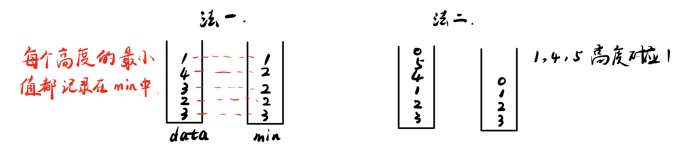

```java
public static class MyStack1 {
   private Stack<Integer> stackData;
   private Stack<Integer> stackMin;

   public MyStack1() {
      this.stackData = new Stack<Integer>();
      this.stackMin = new Stack<Integer>();
   }

   public void push(int newNum) {
      if (this.stackMin.isEmpty()) {
         this.stackMin.push(newNum);
      } else if (newNum <= this.getmin()) {
         this.stackMin.push(newNum);
      }
      this.stackData.push(newNum);
   }

   public int pop() {
      if (this.stackData.isEmpty()) {
         throw new RuntimeException("Your stack is empty.");
      }
      int value = this.stackData.pop();
      if (value == this.getmin()) {
         this.stackMin.pop();
      }
      return value;
   }

   public int getmin() {
      if (this.stackMin.isEmpty()) {
         throw new RuntimeException("Your stack is empty.");
      }
      return this.stackMin.peek();
   }
}

public static class MyStack2 {
   private Stack<Integer> stackData;
   private Stack<Integer> stackMin;

   public MyStack2() {
      this.stackData = new Stack<Integer>();
      this.stackMin = new Stack<Integer>();
   }

   public void push(int newNum) {
      if (this.stackMin.isEmpty()) {
         this.stackMin.push(newNum);
      } else if (newNum < this.getmin()) {
         this.stackMin.push(newNum);
      } else {
         int newMin = this.stackMin.peek();
         this.stackMin.push(newMin);
      }
      this.stackData.push(newNum);
   }

   public int pop() {
      if (this.stackData.isEmpty()) {
         throw new RuntimeException("Your stack is empty.");
      }
      this.stackMin.pop();
      return this.stackData.pop();
   }

   public int getmin() {
      if (this.stackMin.isEmpty()) {
         throw new RuntimeException("Your stack is empty.");
      }
      return this.stackMin.peek();
   }
}
```

#### 使用栈结构实现队列

准备两个栈，一个栈是pop栈一个栈是push栈。我们把push栈里面的数导到pop栈里面，再从pop栈中弹出就实现了逆序。但是从push栈导入到pop栈要遵循几个原则：第一个原则就是只有pop栈为空的时候才能倒入pop栈。第二个原则，每次push栈往pop栈里面导数据的时候要一次性倒完。

```java
public static class TwoStacksQueue {
   public Stack<Integer> stackPush;
   public Stack<Integer> stackPop;

   public TwoStacksQueue() {
      stackPush = new Stack<Integer>();
      stackPop = new Stack<Integer>();
   }

   // push栈向pop栈倒入数据
   private void pushToPop() {
      if (stackPop.empty()) {
         while (!stackPush.empty()) {
            stackPop.push(stackPush.pop());
         }
      }
   }

   public void add(int pushInt) {
      stackPush.push(pushInt);
      pushToPop();
   }

   public int poll() {
      if (stackPop.empty() && stackPush.empty()) {
         throw new RuntimeException("Queue is empty!");
      }
      pushToPop();
      return stackPop.pop();
   }

   public int peek() {
      if (stackPop.empty() && stackPush.empty()) {
         throw new RuntimeException("Queue is empty!");
      }
      pushToPop();
      return stackPop.peek();
   }
}
```

#### 使用队列实现栈

准备两个队列，一个队列data一个队列help。把前n-1个数导到help队列里面，打印第n个。下一次help和data身份互换就行。

```java
public static class TwoQueueStack<T> {
   public Queue<T> queue;
   public Queue<T> help;

   public TwoQueueStack() {
      queue = new LinkedList<>();
      help = new LinkedList<>();
   }

   public void push(T value) {
      queue.offer(value);
   }

   public T poll() {
      while (queue.size() > 1) {
         help.offer(queue.poll());
      }
      T ans = queue.poll();
      Queue<T> tmp = queue;
      queue = help;
      help = tmp;
      return ans;
   }

   public T peek() {
      while (queue.size() > 1) {
         help.offer(queue.poll());
      }
      T ans = queue.poll();
      help.offer(ans);
      Queue<T> tmp = queue;
      queue = help;
      help = tmp;
      return ans;
   }

   public boolean isEmpty() {
      return queue.isEmpty();
   }

}
```

#### 定制快慢指针

奇数情况按照3个节点来看，偶数情况按照4个结点来看。从1开始计数

1. 奇数返回中点，偶数返回中右。这里奇数返回中点，所以我们一开始先把slow指向中间的结点（奇定慢）。因为在奇数的时候slow就要在2位置，所以fast只能在2或3位置。因为如果fast在1位置会跳到3位置，这样一来slow就到了3位置了。所以现在是slow在2位置，fast只能在2和3之中选一个。由于偶数返回中右，偶数的情况我们就想象有四个结点，此时slow要移动到3位置，也就意味着fast只能在2位置，这样fast从2移动到4，slow才有机会移动到3位置。(2,2)

2. 奇数返回中，所以slow起始位置在2。偶数返回左中（2位置），所以fast放在3位置影响不到slow。(2,3)
3. 奇数返回中前（1位置），所以slow起始位置为1。偶数返回右中前（也就是左中2），所以fast为2来影响slow移动.(1,2)
4. 奇数返回中前，所以slow起始位置为1.偶数返回左中前（1），所以fast在3位置，影响不了slow。(1,3)

在3个结点和4个结点的情况下设定好了slow和fast的位置之后，slow和fast可以同时退后，那么就同时退后。退后完了之后，fast在的位置就是至少要有的节点数。

1. (2,2)，至少要有两个结点，0~1个结点的情况要自己返回值。
2. (1,1)，至少要有一个结点，0个结点的情况要自己返回值。
3. (1,2)，至少要有两个结点，0~1个结点的情况要自己返回值。
4. (1,3)，至少要有三个结点，0~2个结点的情况要自己返回值。


```java
public static class Node {
        public int value;
        public Node next;

        public Node(int value) {
            this.value = value;
        }
    }

    /**
     * 奇数返回中点，偶数返回左中。例如：1,2,3,4返回2  1,2,3,4,5返回3
     * slow放在2位置（从1开始计），fast放在3位置。通过if来手动返回节点数小于3的情况
     * @param head
     * @return
     */
    public static Node MidOrLeftMid(Node head) {//（2,3）-->(1,1)
        Node slow=head;
        Node fast=head;
        while (fast.next != null && fast.next.next != null) {
            slow = slow.next;
            fast = fast.next.next;
        }
        return slow;
    }

    /**
     * 奇数返回中点，偶数返回右中。例如：1,2,3,4返回3  1,2,3,4,5返回3
     * @param head
     * @return
     */
    public static Node MidOrRightMid(Node head) {//(2,2)-->(2,2)
        if (head==null||head.next==null) return head;//0~1个结点自己判断返回，有1个结点是有意义的
        Node slow=head.next;
        Node fast=head.next;
        while (fast.next != null && fast.next.next != null) {
            slow = slow.next;
            fast = fast.next.next;
        }
        return slow;
    }

    /**
     * 奇数返回中点的前一个，偶数返回左中的前一个。例如：1,2,3,4返回1  1,2,3,4,5返回2
     * 至少要有3个结点，因为2结点的时候没有左中前
     * @param head
     * @return
     */
    public static Node MidPreOrLeftMidPre(Node head) {//(1,3)-->(1,3)
        if (head == null || head.next == null || head.next.next == null) {//保证了至少有三台结点,少于3个都是没有意义的。
            return null;
        }
        Node slow = head;//1位置
        Node fast = head.next.next;//slow最后要在左中前，fast不能影响slow，放在3位置
        while (fast.next != null && fast.next.next != null) {
            slow = slow.next;
            fast = fast.next.next;
        }
        return slow;
    }

    /**
     * 奇数返回中点的前一个，偶数返回右中的前一个。例如：1,2,3,4返回2  1,2,3,4,5返回2
     * @param head
     * @return
     */
    public static Node MidPreOrRightMidPre(Node head) {//(1,2)-->(1,2)
        if (head == null || head.next == null) {//至少要有两个结点,少于两个结点都是没有意义的
            return null;
        }
        Node slow = head;//1位置
        Node fast = head.next;//slow要动，fast要在2位置
        while (fast.next != null && fast.next.next != null) {
            slow = slow.next;
            fast = fast.next.next;
        }
        return slow;
    }
```

## 排序算法

### 选择排序

第一步先把捣乱的数组剔除，没法排或者直接就有序。

for循环要做的就是从i到n-1上选一个最小值，并且把最小值放到i上去。我们先假设最小值的指针是minIndex（数组的下标），然后如果j位置上的值比minIndex位置上的小那么我就把j赋值给minIndex。出了for循环之后，我们就把minIndex位置上的值和i位置上的值做交换，这样完成了一趟选择。完成n-1趟选择之后数组就有序了。

外层for循环控制第几趟，内层for循环控制每一趟。

```java
public static void selectionSort(int[] arr) {
		if (arr == null || arr.length < 2) {
			return;
		}
		// 0 ~ N-1  找到最小值，在哪，放到0位置上
		// 1 ~ n-1  找到最小值，在哪，放到1 位置上
		// 2 ~ n-1  找到最小值，在哪，放到2 位置上
		for (int i = 0; i < arr.length - 1; i++) {
			int minIndex = i;
			for (int j = i + 1; j < arr.length; j++) { // i ~ N-1 上找最小值的下标 
				minIndex = arr[j] < arr[minIndex] ? j : minIndex;
			}
			swap(arr, i, minIndex);
		}
	}
```

### 冒泡排序

想象一堆水下的泡泡，我从最底下开始，两两比较，小的上移，这样一来完成一趟 之后最小的就在最上面了。然后循环往复，最终实现有序。

这边的交换利用异或来实现，因为利用异或运算的交换律和结合律即可轻松证明，异或运算就是不进位相加，既然是不进位相加，那么最终某一位的结果和某一位上1的个数(奇偶)有关，所以当然满足交换和结合。可以得到一个结论：同一批数异或在一起不所谓谁先谁后，结果一定一样。**但是这边的交换要注意：i和j一定不能相等，因为这是在数组里面，如果相等那么就是在同一块内存空间来做这件事情，会把这片内存空间的数据抹成0。**

```JAVA
public static void bubbleSort(int[] arr) {
		if (arr == null || arr.length < 2) {
			return;
		}
		// 0 ~ N-1
		// 0 ~ N-2
		// 0 ~ N-3
		for (int e = arr.length - 1; e > 0; e--) { // 0 ~ e
			for (int i = 0; i < e; i++) {
				if (arr[i] > arr[i + 1]) {
					swap(arr, i, i + 1);
				}
			}
		}
	}

	// 交换arr的i和j位置上的值
	public static void swap(int[] arr, int i, int j) {
		arr[i] = arr[i] ^ arr[j];
		arr[j] = arr[i] ^ arr[j];
		arr[i] = arr[i] ^ arr[j];
	}
```

### 插入排序

> 插入排序细节的讲解与复杂度分析
> 时间复杂度O(N^2)，额外空间复杂度0(1)算法流程按照最差情况来估计时间复杂度

插入排序在完全逆序的情况下，时间复杂度是O(N²)。在完全有序的情况下，时间复杂度是O(N)。所以我们所说的时间复杂度是最差情况下的时间复杂度。大θ是平均时间复杂度，大Ω是最好时间复杂度。大O是最差。

选择排序和冒泡排序是严格的O(N²)，而插入排序在某些数据状况下并不用严格的O(N²)。

```JAVA
public class Code03_InsertionSort {

	public static void insertionSort(int[] arr) {
		if (arr == null || arr.length < 2) {
			return;
		}
		// 不只1个数
		for (int i = 1; i < arr.length; i++) { // 0 ~ i 做到有序
			for (int j = i - 1; j >= 0 && arr[j] > arr[j + 1]; j--) {
				swap(arr, j, j + 1);
			}
		}
	}
```

第二种方法是浙江大学插牌法，而非交换。

```JAVA
public static void insertionSort_02(int[] arr) {
		if (arr == null || arr.length < 2) {
			return;
		}
		int p,i;
		for (p=1;p<arr.length;p++){
			int temp = arr[p];
			for (i=p;i>0&&temp<arr[i-1];i--){
				arr[i]=arr[i-1];
			}
			arr[i]=temp;
		}
	}
```


### 归并排序 


#### 递归

```java
    private static void mergeSort(int[] arr){
        if (arr==null||arr.length<2)
            return;
        mergeSort(arr,0,arr.length-1);
    }

    private static void mergeSort(int[] arr, int l, int r) {
        if (l>=r)return;
        int mid=l+((r-l)>>1);
        mergeSort(arr,l,mid);
        mergeSort(arr,mid+1,r);
        merge(arr,l,mid+1,r);
    }

    /**
     *
     * @param arr:在arr数组的相应下标进行merge
     * @param ls:merge的左边数组的开始下标
     * @param rs:merge的右边数组的开始下标
     * @param re：merge的右边数组的结束下标
     */
    private static void merge(int[] arr, int ls, int rs, int re) {
        int[] help =new int[re-ls+1];
        int p1=ls;
        int p2=rs;
        int i=0;//help的辅助指针
        while(p1<=rs-1&&p2<=re){
            help[i++]=arr[p1]<=arr[p2]?arr[p1++]:arr[p2++];
        }
        //出来就是p1和p2有其中一个越界了，下面的两个while循环只会进入一个
        while(p1<=rs-1)
            help[i++]=arr[p1++];
        while(p2<=re)
            help[i++]=arr[p2++];
        for (i=0;i<help.length;i++){
            arr[ls+i]=help[i];
        }
    }
```


#### 非递归

这个版本会对数组频繁的创建销毁

```java
 //先给用户提供一个接口
    private static void mergeSort(int [] arr){
        if (arr==null||arr.length<2)
            return;
        mergeSort(arr,0,arr.length-1);
    }
    //arr在[l,r]范围上排好序
    private static void mergeSort(int[] arr, int l, int r) {
        /**
         * 两两合并子列，子列长度一开始是1
         */
        for (int len=1;len<=arr.length;len*=2){
            mergePass(arr,l,r,len);
        }
    }

    private static void mergePass(int[] arr, int l, int r, int len) {
        /**
         * i是merge的左边的起点，rs就是i+len是merge的右边的起点，l+2len-1是右边的终点
         */
        int i=0;
        for(;i<=arr.length-2*len;i+=2*len){
            int rs=i+len;
            merge(arr,i,i+len,i+2*len-1);
        }
        if(i+len<arr.length){//说明还有两个子列
            merge(arr,i,i+len,arr.length-1);
        }
    }

    /**
     * 直接把arr中的[l,rs-1]和[rs,r]merge起来。要注意的是这里我们是的help数组是建立在merge函数里面的。
     * @param arr，数组
     * @param l ，merge的左边的起点
     * @param rs ，merge的右边的起点
     * @param r ，merge的右边的终点
     */
    private static void merge(int[] arr, int l, int rs, int r) {
        int help[]=new int[r-l+1];
        int p1=l,p2=rs;//定义2个指针一个指向左边数组的头，一个指向右边数组的头
        int i=0;//指向help数组的头
        while(p1<=rs-1&&p2<=r){
            help[i++]=arr[p1]<=arr[p2]?arr[p1++]:arr[p2++];
        }
        //退出while说明有其中一个越界了
        while(p1<=rs-1){//如果左边没有越界
            help[i++]=arr[p1++];
        }
        while(p2<=r){
            help[i++]=arr[p2++];
        }
        for(i=0;i<help.length;i++){
            arr[l+i]=help[i];
        }
    }
```


这个版本不会对数组频繁销毁

```java
/**
 * 这里的while里面拷贝了两次是因为我们在merge中为了节约时间，没有把help数组里面的数组拷贝回arr
 * 所以这里反过来调用，让help的数组再传输回arr
 * @param arr
 */
private static void mergeSort(int [] arr){
    if (arr==null||arr.length<2)
        return;
    int help[] =new int[arr.length];
    int len=1;
    while(len<arr.length){
        mergePass(arr,help,len);
        len*=2;
        mergePass(help,arr,len);
        len*=2;
    }
}

private static void mergePass(int[] arr, int[] help, int len) {
    int i=0;
    for(;i<=arr.length-2*len;i+=2*len){
        merge(arr,help,i,i+len,i+2*len-1);
    }
    if (i+len<arr.length){
        merge(arr,help,i,i+len,arr.length-1);
    }else{
        while(i<arr.length){
            help[i]=arr[i++];
        }
    }
}

private static void merge(int[] arr, int[] help, int l, int rs, int r) {
    int p1=l,p2=rs;//定义2个指针一个指向左边数组的头，一个指向右边数组的头
    int i=0;
    while(p1<=rs-1&&p2<=r){
        help[i+l]=arr[p1]<=arr[p2]?arr[p1++]:arr[p2++];
        i++;
    }
    //退出while说明有其中一个越界了
    while(p1<=rs-1){//如果左边没有越界
        help[i+l]=arr[p1++];
        i++;
    }
    while(p2<=r){
        help[i+l]=arr[p2++];
        i++;
    }
}
```

#### 归并排序的扩展 

- 归并排序的扩展 

  小和问题和逆序对问题

  小和问题

  在一个数组中，数组中每一个数的左边比当前数小的数累加起来，叫做这个数组的小和。求一个数组的小和

  例子: [1,3,4,2,5] 1左边比1小的数，没有; 3左边比3小的数，1; 4左 边比4小的数，1、3; 2左边比2小的数，1; 5左边比5小的数，1、3、4、 2; 所以小和为1+1+3+1+1+3+4+2=16 

  逆序对问题  ： 在一个数组中，左边的数如果比右边的数大，则这两个数 构成一个逆序对，请打印所有逆序 对或找到逆序对的数量。

###### 分析

这道题原本是要求所有数左边比它小的数的和，既然左边的数比右边的数小，那么对于左边这个数来说，右边的数就比左边的数大。所以这个问题就变成求每一个数在右边有多少个比它大，假设这个数是n，右边有m个比它大，那么整个数组的小和的一部分就是nm。

我在归并排序merge的时候，左右指针的值比较，左侧小的时候就产生了一个小和。也就是在归并排序的merge中增加一个功能，就是当左侧的数往help数组里面放的时候就产生了一个小和，因为这时候右边指针的值比左侧的大。为什么这样不会遗漏呢？因为我在merge的过程中一定会把右侧范围扩大到整体的。为什么不重复？因为经过merge之后右侧的数已经被纳入了整体，在内部是不会重复产生小和的。只是因为左组和右组merge的时候因为左组的某一些数比右组的小才会产生新的小和。

来看3的经过：3和1merge的时候因为它是以右组的姿态参与merge，所以一定不会产生3的小和。但是merge完之后1,3会进一步和4去merge，这个时候就求出有一个数比3大了。然后1,3,4又和2，5去merge，又求出有一个数比3大，所以求解谁比3大也是不遗漏不重算的。

同理一开始1,3和4merge，4是以右组的姿态，所以不会产生关于4的小和。接下来1,3,4和2,5merge，产生了一个关于4的小和。

另外，merge的过程中是通过R-j+1来直接计算出右边有多少数比左边的这个数大。这种算法是建立在merge的两组是有序的情况下。


这道题的merge的原来归并的merge有不同的地方，也就是当i和j指向的值相等的时候我一定是拷贝右边的，因为如果我拷贝了左边了，那么我就会丢失左边的这个数的小和---我不知道右边有多少个数比它大，我还不能拷贝左边。原本的归并排序先拷贝左边是因为要保证这个排序是稳定的，但是现在我们在只需要算出小和就行，所以先拷贝右边。只有当右边的数严格的比左边的数小，我才能够算出右边有多少个数比左边这个数小。

- 我们随便拿一个数，看看它的心路历程，无论他在哪里，merge的时候只有它是属于左边的那一组才有可能产生它的小和，在一步步的merge中，求它的小和的范围是不断的往右边扩展的。所以右边一定会拓展到头，所以这个数一定不会漏算。而为什么不会漏算，因为一旦这个数和一个组合并了（也就是因为这个组产生小和了），一个组内部是不会产生小和的。只有做左组和右组PK的时候才会产生小和。对于所有的数来说都是这个过程

###### 代码

```java
private static int smallSum(int[] arr) {
    if (arr == null || arr.length < 2)
        return 0;
    return mergeSort(arr, 0, arr.length - 1);
}

private static int mergeSort(int[] arr, int l, int r) {
    if (r == l)
        return 0;
    int mid = l + ((r - l) >> 1);
    return mergeSort(arr, l, mid) + mergeSort(arr, mid + 1, r) + merge(arr, l, mid, r);
}

private static int merge(int[] arr, int l, int mid, int r) {
    int[] help = new int[r - l + 1];
    int p1 = l;
    int p2 = mid + 1;
    int i = 0;
    int res = 0;
    while (p1 <= mid && p2 <= r) {
        res += arr[p1] < arr[p2] ? (r - p2 + 1) * arr[p1] : 0;
        help[i++] = arr[p1] < arr[p2] ? arr[p1++] : arr[p2++];
    }
    while (p1 <= mid)
        help[i++] = arr[p1++];
    while (p2 <= r)
        help[i++] = arr[p2++];
    for (i = 0; i < help.length; i++) {
        arr[i + l] = help[i];
    }
    return res;
}
```

#### 小和问题

右边的数比左边的数小就是一个逆序对。小和问题是求右边有多少个数比左边的数大，现在的问题就是要求右边有多少数比左边的数要小。也就是merge的时候右边的数往help数组里面放的时候，逆序对就要增加了。


### 堆排序

#### 堆结构

堆排序远没有堆结构重要。我们用heapsize来描述完全二叉树的大小。如果是从数组的0位置开始连续放置，i结点的左孩子是2i+1，右孩子是2i+2，父亲结点是i-1/2.如果是从1位置开始连续放置，那么左孩子就是2i，右孩子就是2i+1.父节点是i/2.

堆是特殊的完全二叉树。分为最大堆和最小堆。现在问题来了，我可以把数组连续出发的一段理解成完全二叉树，但是我怎么把数组连续出发的一段弄成堆？用户给的第一个数本身自己是最大堆，然后后面每次来一个数我就顺着放在完全二叉树的下一个结点，往上去比，调整成一个最大堆。

如果现在用户要叫你给它一个最大值，并且把最大值从堆中去掉。因为这个时候我们的size要减小，并且第一个数要删掉，所以一个很自然的想法就是把最后一个数放到0位置，我们用一个变量把0位置的数先记住--后面是要返回给用户的。现在的问题就是要把现在完全二叉树再次调整成最大堆。从头节点开始，找它的左右孩子中最大的---如果有的话，如果2i+1<=heapsieze-1的话说明至少有一个左孩子。只要向下比较，知道我没有左孩子了，或者说左孩子和右孩子中最大的都比我的小就停。

所以现在我们知道了，insert操作就是向上比较。delete操作就是把最后一个调上去然后往下比较。那么现在我们要直接把中的某一个i位置的值改变，叫你再把它调整成最大堆，我们只要知道它是变大了还是变小了就行，变大了就向上去比较，变小了就往下比较就行。

- 左程云的代码的insert就是向上调整。heapify就是向下调整。

如果用户已经给了N个数，现在要再给一个数，那么调整的代价就是logN。

> 堆
>
> 1，堆结构就是用数组实现的**完全二叉树**结构 
>
> 2，完全二叉树中如果每棵子树的最大值都在顶部就是大根堆 
>
> 3，完全二叉树中如果每棵子树的最小值都在顶部就是小根堆 
>
> 4，堆结构的heapInsert与heapify操作 
>
> 5，堆结构的增大和减少 
>
> 6，优先级队列结构，就是堆结构


---

#### 分析

堆排序无非就是用户给你一个数组。你先认为堆大小就是1，也就是0下标位置的数自己构成堆。然后1~N-1位置的数一个一个insert，让堆的大小慢慢变大。这样一来就完成了堆的构建，代价是NlogN。这样一来我们构建成了最大堆，接下来我们只需要一个一个删除最大值即可，因为最大值删除之后按照我们的思路最大值是可以保存在原本的堆的最后的，而我们要的排序是从小到大，这正好符合我们的要求，随后size--让现在这个排好的最大值断掉和最大堆的联系，删除之后调整成最大堆，然后继续刚刚的操作----删掉最大值然后继续调整size--。

整个过程没有递归，没有生成大的数组结构，insert和delete方法也都是O(1)的。所以整个的堆排序的空间复杂度是O(1)。在时间复杂度是NlogN的排序里面只有堆排序能做到。

其实如果用户一次性给你一个数组，你的目标就是把这个数组调整成最大堆的结构，那么这一步有更好的方法，不需要一个一个去调整。相当于给你一个完全二叉树叫你去调整成堆的结构。我们可以把堆看成是一个根节点和子堆构成的。那么我们可以从下面开始，从最小的子堆开始，往下调整。最终整体有序。就类似于删除操作把最后一个换到第一个的往下调整的过程，因为你把最后一个换到第一个，第一个的左右两边都是子堆，都是调整好的。所以是一个思想。第一种方法就是insert的向上调整，这种方法就是delete的向下调整。

这种方法好，因为这种方法只需要一个线性的时间复杂度。叶子结点有N/2个看一眼......。快的根本原因就是向下调整的话完全二叉树的越下面结点越多，这种方法就是把更多的结点用更少的步骤解决了。

所以我们从数组的右边开始，也就是尾部开始，一个一个的向下调整。后面的操作没有变，只是把一个数组调整成一个堆的速度变快了。


> 堆排序 
>
> 1，先让整个数组都变成大根堆结构，建立堆的过程: 1)从上到下的方法，时间复杂度为O(N*logN) 2)从下到上的方法，时间复杂度为O(N) *
>
> *2，把堆的最大值和堆末尾的值交换，然后减少堆的大小之后，再去调 整堆，一直周而复始，时间复杂度为O(N*logN) 
>
> 3，堆的大小减小成0之后，排序完成

#### 代码

```java
private static void heapSort(int[] arr){
    if (arr==null||arr.length<2)
        return;
    for (int i=arr.length-1;i>=0;i--){
        percDown(arr,i,arr.length);
    }
    for (int i=arr.length-1;i>=1;i--){
        swap(arr,0,i);//这边的i代表下标
        percDown(arr,0,i);//这边的i代表大小
    }
}

/**
 * 从i的地方开始向上调整成最大堆。不需要知道size因为向上的边界自动是0
 * @param arr
 * @param i
 */
private static void insert(int[] arr, int i) {
    int child=i,temp=arr[i];
    for (;child>0&&arr[(child-1)/2]<temp;child=(child-1)/2)
        arr[child]=arr[(child-1)/2];
    arr[child]=temp;
}

/**
 * 从index的地方向下调整成最大堆，堆的大小为size。这里需要知道size，因为我们需要确定
 * 向下调整时候的边界。
 * @param arr
 * @param index
 * @param size
 */
private static void percDown(int[] arr, int index, int size) {
    int child,parent=index,temp=arr[index];
    for (;parent*2+1<size;parent=child){//迭代如果不是唯一的，那么就需要额外变量
        child=parent*2+2<size&&arr[parent*2+2]>arr[parent*2+1]?parent*2+2:parent*2+1;
        if (temp<arr[child])
            arr[parent]=arr[child];
        else
            break;//如果temp>=arr.[child]说明找到了，退出
    }
    arr[parent]=temp;
}

private static void swap(int[] arr, int a, int b) {
    int temp=arr[a];
    arr[a]=arr[b];
    arr[b]=temp;
}
```

#### 堆排序扩展

> 堆排序扩展题目 
>
> 已知一个几乎有序的数组，几乎有序是指，如果把数组排好顺序的话，每个元 素移动的距离可以不超过k，并且k相对于数组来说比较小。请选择一个合适的 排序算法针对这个数据进行排序。

因为每个元素移动的距离不超过k，所以数组的最小值一定在0-6的下标范围上。那么我就建立一个最小堆，每一次弹出最小的元素，放到数组的前面去，然后再从后面新增加一个数，再调整成最小堆。周而复始。时间复杂度为NlogK，因为这个k很小，甚至我们可以认为是一个O(N)的算法。


在java中优先级队列就是最小堆---PriorityQueue，甚至都不用自己实现。这里有一个问题是扩容代价，我一共有N个数，总的扩容代价是NlogN,但是如果均摊到每一次的代价就是logN了。扩容这件事并不会影响最终的表现。

另外一点如果你使用了系统提供的对结构，那么你就只能用它给你的add和pull方法，添加一个值或者是给你弹出一个最小值并且删除它。你不能指望系统的已经在内部调整好的堆结构你给它中间某一个值改了还要他用很轻的代价像我们手写的堆结构一样去看看向上insert还是向下heapify。你就把系统的heap看成是一个黑盒，你给一个数，它给你一个数，你不要到内部去搞，这会让它搞乱，或者是调整回来的代价高。如果你自己有需求，那么就自己写一个堆。这就是为什么在很多面试场合必须要手写堆，因为在有些情景下必须要手写堆才能做到高效。

但是对于我们这道题来说，我们不涉及到要手写堆的需求，所以我们用这个黑盒就行了。

###### 代码

```java
private static void sort(int[]arr ,int k){

    PriorityQueue<Integer>heap=new PriorityQueue<>();
    int index=0;//用来放进堆
    for (;index<Math.min(arr.length,k+1);index++){
        heap.add(arr[index]);
    }
    int i=0;//用来指示排序的进度
    for (;index<arr.length;i++,index++){
        arr[i]=heap.poll();
        heap.add(arr[index]);
    }
    while(i<arr.length){
        arr[i++]=heap.poll();
    }

}
```


### 快排

#### 荷兰国旗问题

问题一 

- 给定一个数组arr，和一个数num，请把小于等于num的数放在数 组的左边，大于num的 数放在数组的右边。要求额外空间复杂度O(1)，时间复杂度O(N) 

思想就是小于等于区域推着大于等于区域一直往右边走，在i和小于等于区域中间的就是大于区域，当i越界了，也就是大于等于区域到数组的头了，那么我们就完成了划分。

情况1：如果arr[i]<=num，那么arr[i]和小于等于区域的下一个数做交换，小于等于区域往外扩，i++.

情况2：如果arr[i]>num，那么i++，相当于大于等于区域直接往外扩。


```java
private static void twoArea(int []arr,int num){
    int less=-1;
    for (int i=0;i<arr.length;i++){
        if (arr[i]<=num){
            swap(arr,less+1,i);
            less++;
        }
    }
}
```

根据上面的算法，可以得到一种快排的实现方法


---


问题二(荷兰国旗问题) 

- 给定一个数组arr，和一个数num，请把小于num的数放在数组的 左边，等于num的数放 在数组的中间，大于num的数放在数组的 右边。要求额外空间复杂度O(1)，时间复杂度 O(N)

原本小于等于区域是不分家的，现在我要把小于等于区域再分为小于区域和等于区域。小于和大于区域不要求有序但是要让数组的严格分成三块----这就是荷兰国旗问题。

思想就是在原本的基础上多一个大于区域---大于区域从数组的右边开始，小于区域从数组的左边开始。夹在中间的就是等与区域。大于区域和小于区域分别用一个变量，相等于比问题一多用了一个变量。让i从数组的头开始走，表示当前数的下标。

情况1：如果当前数arr-i比num小，那么和小于区域的下一个数交换，小于区域往右扩，i++

情况2：如果当前数arr-i与num相等，i++

情况3：如果当前数arr-i比num大，那么和大于区域的前一个数交换，大于区域往左扩，i不动。

i不动的原因是大于区域前面的数我还没有看过，i不能++。

i根据现在自己来到的数，如果等于num，那么就让等于区域直接扩充。如果i是小于区域的，那么就把i放到小于区域的下一个，把等于区域的第一个拿过来，然后扩充小于区域。相当于小于区域推着等于区域往右边走。如果这个i是大于区域的，那么就把i换到大于区域的前一个，让大于区域左扩，新来的谁重新来到i的位置，继续看。当你小于区域推着等于区域和大于区域撞上的时候就完成了。要么i左走，小于区域推着等于区域右走，要么i右走，大于区域左扩。


```java
private static int [] flag(int []arr,int l,int r,int num){
    int less=l-1;
    int more=r+1;
    while(l<more){
        if (arr[l]<num){
            swap(arr,++less,l++);
        }else if (arr[l]>num){
            swap(arr,--more,l);
        }else {
            l++;
        }
    }
    return new int[]{less+1,more-1};
}
```


#### 不改进的快速排序

> 不改进的快速排序 : 
>
> 1）把数组范围中的最后一个数作为划分值，然后把数组通过荷兰国旗问题分成三个部 分： 左侧<划分值、中间==划分值、右侧>划分值 
>
> 2）对左侧范围和右侧范围，递归执行 
>
> 分析 :
>
> 1）划分值越靠近两侧，复杂度越高；划分值越靠近中间，复杂度越低 
>
> 2）可以轻而易举的举出最差的例子，所以不改进的快速排序时间复杂度为O(N^2)

快排1.0是说，在整个数组中，我拿最后一个值做划分值。最后这个数就是我们前面的num。0-n-2位置划分成<=和>区域，划分完成之后最后这个数和>区域的第一个数做交换即可。然后让左侧和右侧重复这个行为---递归。我每次划分的时候都会有一个数被排好，所以递归下去总有有序的时候。


快排2.0就是利用了荷兰国旗问题。一开始在整个范围上拿最后一个数num做划分，让前面的范围做到</=/>，这样让num和>num的第一个数做划分，那么我等于的区域就可以不用动了，在<和>的区域继续做递归。这种方法一次可以搞定一批数---一批等于NUN的数。

不管是快排1.0还是快排2.0时间复杂度都是O(N²)。因为我们可以举出最差的例子，在数组完全逆序或者是完全有序的时候，一次的划分只搞定了一个数。所以必然有一个快排3.0.

划分值打的很偏会产生差情况。最好的情况是划分值打在几乎中间的位置，因为这样一来左右两侧递归的规模差不多。这时候T(N)=2T(N/2)+O(N).划分值如果打偏，就会退化成N²的算法。

快排3.0，在数组l-r的范围上，我拿谁做划分？随机选一个数做划分，随机选了一个数之后我把它和最后一个数做交换，然后拿最后的这个数做划分，现在这个最后的数和1.0和2.0的最后一个数可不一样，它是我们随机选出来的数。既然是随机选的，那么好情况和坏情况就被分摊了---好坏都是概率事件。这个时候就不能构建出最坏情况了。

快排的1.0版本和2.0版本的空间复杂度是O(N)级别的，因为如果我的数据完全有序。我每次的patition之后num的位置要告诉quickSort，所以要为这个num的位置开一个int。这种情况下就要开N个int给num----开了N层。如果加了随机行为那么就退化到O(logN)。左侧递归使用的空间可以给右侧递归使用，所以主要就是看开了几层。

现在的问题就是如果我是用非递归来写的话，能不能省掉这个空间？不行！因为这个位置是我具体算出来的，我去解决子问题的时候，我先要记住母问题的这个位置，回到母问题的时候才能根据这个位置继续去解决右边的问题。所以即便改成迭代了，这个中点的位置也是要记录的，无非就是在递归里面是递归帮你压栈的，改成迭代的话就是要自己做一个栈，然后自己压栈，所以无论如何空间都没有办法省略。写递归只是因为好理解。所以这个问题变成了我划分值的位置决定了我额外空间的多少，最差是N，最好是logN，由于随机，还是一个概率的累加，最终还是收敛到logN的水平。


#### 随机快速排序

> 随机快速排序（改进的快速排序） 
>
> 1）在数组范围中，等概率随机选一个数作为划分值，然后把数组通过荷兰国旗问题分 成三个部分： 左侧<划分值、中间==划分值、右侧>划分值 
>
> 2）对左侧范围和右侧范围，递归执行 
>
> 3）时间复杂度为O(N*logN)

#### 代码

```java
public static void swap(int[] arr, int i, int j) {
		int tmp = arr[i];
		arr[i] = arr[j];
		arr[j] = tmp;
	}

	// arr[L..R]上，以arr[R]位置的数做划分值
	// <= X > X
	// <= X X
	public static int partition(int[] arr, int L, int R) {
		if (L > R) {
			return -1;
		}
		if (L == R) {
			return L;
		}
		int lessEqual = L - 1;
		int index = L;
		while (index < R) {
			if (arr[index] <= arr[R]) {
				swap(arr, index, ++lessEqual);
			}
			index++;
		}
		swap(arr, ++lessEqual, R);
		return lessEqual;
	}

	// arr[L...R] 玩荷兰国旗问题的划分，以arr[R]做划分值
	// <arr[R] ==arr[R] > arr[R]
	public static int[] netherlandsFlag(int[] arr, int L, int R) {
		if (L > R) { // L...R L>R
			return new int[] { -1, -1 };
		}
		if (L == R) {
			return new int[] { L, R };
		}
		int less = L - 1; // < 区 右边界
		int more = R; // > 区 左边界
		int index = L;
		while (index < more) { // 当前位置，不能和 >区的左边界撞上
			if (arr[index] == arr[R]) {
				index++;
			} else if (arr[index] < arr[R]) {
//				swap(arr, less + 1, index);
//				less++;
//				index++;						
				swap(arr, index++, ++less);
			} else { // >
				swap(arr, index, --more);
			}
		}
		swap(arr, more, R); // <[R]   =[R]   >[R]
		return new int[] { less + 1, more };
	}

	public static void quickSort1(int[] arr) {
		if (arr == null || arr.length < 2) {
			return;
		}
		process1(arr, 0, arr.length - 1);
	}

	public static void process1(int[] arr, int L, int R) {
		if (L >= R) {
			return;
		}
		// L..R partition arr[R] [ <=arr[R] arr[R] >arr[R] ]
		int M = partition(arr, L, R);
		process1(arr, L, M - 1);
		process1(arr, M + 1, R);
	}

	
	
	
	
	
	public static void quickSort2(int[] arr) {
		if (arr == null || arr.length < 2) {
			return;
		}
		process2(arr, 0, arr.length - 1);
	}

	// arr[L...R] 排有序，快排2.0方式
	public static void process2(int[] arr, int L, int R) {
		if (L >= R) {
			return;
		}
		// [ equalArea[0]  ,  equalArea[0]]
		int[] equalArea = netherlandsFlag(arr, L, R);
		process2(arr, L, equalArea[0] - 1);
		process2(arr, equalArea[1] + 1, R);
	}

	
	
	
	
	
	
	public static void quickSort3(int[] arr) {
		if (arr == null || arr.length < 2) {
			return;
		}
		process3(arr, 0, arr.length - 1);
	}

	public static void process3(int[] arr, int L, int R) {
		if (L >= R) {
			return;
		}
		swap(arr, L + (int) (Math.random() * (R - L + 1)), R);
		int[] equalArea = netherlandsFlag(arr, L, R);
		process3(arr, L, equalArea[0] - 1);
		process3(arr, equalArea[1] + 1, R);
	}
```


### 桶排序(计数和基数)

桶排序是一个思想

#### 计数排序

我们前面说的归并排序、插入排序、选择排序、冒泡排序、快速排序这些排序都是基于比较的排序。如果我现在有一个数组，数组里面是员工的年龄，年龄的话最多0-150.那么就开一个151大小的数组，下标代表年龄，数组的值代表这个年龄的员工有多少人。遇到一个员工是几岁，对应下标的位置就++。然后再把这个统计年龄的数组还原到原数组即可。但是这种排序只有在待比较的的数的范围在一个可以接受的范围内我才能做

所以说不基于比较的排序都是根据数据状况做的排序，他没有基于比较的排序有那么广的运用范围。不管是人对象还是动物对象，只要我告诉它两个对象怎么比大小就可以很自然的实现比较的排序。 不基于比较的排序路很窄，一定要根据数据状况来定制。

```java
//0~200
private static void countSort(int[] arr){
    int max=arr[0];
    for (int a:arr){
        max=a>max?a:max;
    }
    int count[]=new int[max+1];
    for (int a:arr)
        count[a]++;
    for (int i=0,j=0;i<count.length;i++){
        while(count[i]!=0){
            arr[j++]=i;
            count[i]--;
        }
    }
}
```

#### 基数排序

先看最大数的位数，其它数补齐位数。是几进制就准备几个桶。然后从个位数到高位数进出进出。这种排序依然要基于数据状况，因为你要排序的东西要和进制有关系。

实际上再代码实现的时候没有真的弄了很多个桶。我只需要一个数组，利用前面计数排序先得到每一个数有多少个，然后和前面的累加，变成<=某个数的数有多少个。因为进桶的顺序是从左到右，所以出桶的顺序是从右往左（假设12,22,32,42这几个数在原来数组的相对顺序是这样的，那么它们在出2这个桶的时候就是42,32,22,12这样的顺序出桶的，这样出桶是因为我们假设是队列出桶，这样可以保证不交换，稳定）。现在我们假设<=2的数有9个，那么也就是说包括了12,22,32,42这几个数，那么这几个数只能排在数组的[5,8]，就让42排在9位置上，然后修改这个累加数组2下标的值，让它--。也就是对于任何一个数n，我去找到对应的累加数组arr[N]然后它的前一个也就是help[arr[n-1]]上就可以放数值了。

从右往左是因为我们要满足先入桶的先出，保证顺序相对位置不变。可以理解成累加之后的数组提供了某个位数是n的那一堆数的右边界，我知道右边界我当然是从原数组的右边开始遍历，这样我的相对位置才不会变。


```jAVA
private static void radixSort(int [] arr){
    if (arr==null||arr.length<2)
        return;
    int maxDigit=maxDigit(arr);
    radixSort(arr,0,arr.length-1,maxDigit);
}

private static int maxDigit(int[] arr) {
    int max=arr[0];
    boolean flag=false;
    for (int a:arr){//找arr中最大
        if (a<0) flag=true;
        if (a>max) max=a;
    }
    if (flag) return -1;//如果有小于零
    int res=0;
    while(max!=0){
        res++;
        max/=10;
    }
    return res;
}

/**
 *
 * @param arr
 * @param l
 * @param r
 * @param maxDigit:确定要出入桶几次，maxDigit是arr数组中最大的位数，个位数是1，十位是2....
 */
private static void radixSort(int[] arr, int l, int r, int maxDigit) {
    final int radix=10;
    int i,j;
    int[] help=new int[r-l+1];
    for (i=1;i<=maxDigit;i++){//进出桶的轮数控制
        int[] count=new int[radix];//十进制0-9
        for (j=l;j<=r;j++){
            count[getDigit(arr[j],i)]++;
        }
        for (j=1;j<count.length;j++){
            count[j]+= count[j-1];
        }
        for (j=r;j>=l;j--){
            help[--count[getDigit(arr[j],i)]]=arr[j];
        }
        for (j=0;j< help.length;j++){
            arr[l+j]=help[j];
        }
    }
}
```


### 排序算法的稳定性及其汇总


### 常见的坑

归并排序变成了额外空间复杂度为1但是它会因此丧失稳定性，还不如直接用堆排序。

快排可以改成稳定的，但是会让时间复杂度变成N²，不如直接用归并。


- 面试大坑

  我们在快排的时候是把<=左边，>的放右边，这是01标准，一个数不是小于一个划分值就是大于一个划分值。这就等同于把奇数放左边偶数放右边。也就是说这道题是要做到01标准的stable sort，快排都做不到，这是论文级别的难度。

- 稳定性

  在基础数组中稳定性没有什么用。在什么地方有用呢---非基础类型。

  有很多学生，先按照年龄排序，然后按照班级号进行排序。最后进行的班级号的排序如果是稳定的，那么在一个班级内部，也就是班级号相同的学生中是按照年龄大小来排序的，也就是说不会打乱之前的排序结果。

  

  1. 选择排序不是稳定的。

     

  2. 冒泡是稳定的

  3. 插入也是稳定的。

  4. 归并也是稳定的，关键就是mege的时候，左右两边相等先拷贝左边的。我们在做小和问题的时候，右边是先拷贝，所以小和问题的时候修改过的merge就没有稳定性了，但是整个排序是对的。

  5. 快排不是稳定的。两种类型的partition都做不到稳定。patition中i位置在和小于区的下一个做交换的时候就已经做不到稳定了，和选择排序道理一样。

  6. 堆排序在调整成最大堆的时候已经不能做到稳定了。堆中的结点只和自己和父亲和孩子玩，很轻易就能破坏 稳定。

  7. 计数排序和基数排序是稳定的，因为可以做到先入桶的先出桶。他们不是基于比较的排序，是一个萝卜一个坑，我只要这个桶内部次序维持好就能做到稳定。

  一般来说使用快速排序，因为通过实验，快排的常数项指标是最低的。

  如果你要稳定性，那么势必要N的空间。如果你要速度快，那么势必会失去稳定性。

  

  


### 工程上对排序的改进

我们可以在小样本量是利用插入排序常数项低的优势，在大样本量上利用快速排序调度上的优势，综合两个排序算法，这叫做综合排序。

Java系统内部给你的排序，Arrays.Sort它发现如果你是基础类型就给你用快速排序。如果它 发现你是自己定义的非基础类型，就会给你用归并。原因就是因为稳定性。各个语言内部的排序都很复杂，因为他在利用各个排序算法的优势往一起拼装。但是一般来说都是往下面这两个角度来做优化。


## 树

### 递归序

- 递归序

递归序，每一个结点都回到自己三次。前中后序遍历本质上就是选择在第几次回到自己才打印。

非递归先序：1-从栈中弹出一个结点cur 2-弹出就打印 3-右左子树按顺序进栈，没有就什么也不做、

非递归后序：1-从栈中弹出一个结点cur 2-弹出就放到另外一个栈里面 3-左右子树按顺序进栈，没有就什么也不做、4- 打印所有另外一个栈里面的结点。（这里是利用栈的逆序把根右左变成了左右根）

非递归中序：1-整个树的左边界全部进栈 2-弹出就打印 3-对弹出结点的右子树重复流程。（整棵树的按照左边界分解掉了，但是右树的左边界后做）


对于二叉树来说它的**先序遍历就是它的深度优先遍历**。现在要看看二叉树的广度优先遍历怎么写，也就是按层来打印。这里把上面的栈换成队列就行了，头先进，弹出就打印，先放左后放右，弹出就打印。

### 二叉树的最大宽度

题目求一颗二叉树的最大宽度---也就是同层结点的最大个数。需要知道这一层是第几层，还要知道这一层有多少个结点。可以利用hashmap将每一个结点和层数对应起来。分别用一个变量来记录当前在第几层。另外一个变量记录这一层有多少个结点。再来一个变量记录所有层中的最大结点数。如果当前的层和之前记录的层不一样了就说明之前那个层要和max去结算了。从新的这个层开始算。

也有不用哈希表的。我们设置三个变量，当前节点所在层的最后一个结点curEnd和下一层的最后一个结点nextEnd，还有当前层。一开始当前层的最后一个结点设置为根节点，下一层的最后一个结点设置为null。根节点先进队，出来的时候先让左孩子进队，然后看看nextEnd为不为空，如果是空，就把它设置成当前入队的结点，再让右孩子进队，**永远把当前入队的结点让它等于nextEnd**。都入队之后，当前的结点的层就多发现了一个结点。然后看看当前结点是不是本层的最后一个结点curEnd,如果是,max就更新。然后迭代curend和nextend。


### 判断二叉搜索树

左树都比自己小右树都比自己大。

有一个方法，根据左小右大，我们用**中序遍历**可以保证不降序。原来打印的时机变成了和前面一个打印的结点比较的时机。我们把前面的结点用pre记下来。

---

### 判断是否是完全二叉树

按照层序遍历。条件1：中间的任意结点如果有右无左那么直接返回false。条件2：在不违反条件1的情况下如果遇到了左右孩子不**双**全的情况，那么接下来的每一个结点都是叶子结点。

### 判断平衡二叉树

递归套路


### 判断满二叉树

递归套路


### 设计一棵树的打印函数

箭头是父函数调用给的

中间部分就是说明当前结点是如何打印的

打印的时候前面要留多少个空格是由层数决定的。

打印出来的值我们用一个String类型来表示。例如我们可以让String的长度永远是17，这样就不用担心值差距悬殊的时候会乱掉。


### 找最低公共祖先节点

- 给定两个二叉树的节点node1和node2，找到他们的最低公共祖先节点

就看node1往上和node2往上哪一个是最初汇聚的点。

一种方法就是我们把所有结点的父节点都记录到一个hashmap里面。然后把node1往上的祖先全部放到一个hashset里面，然后node2往上翻，第一个发现在hashset里面重复的点就是第一个相遇的结点。为什么要一个hashmap，因为这是我能够往上翻的前提。

有一个很精简的代码但是很难理解。node1和node2的所有情况就两大类。o1或者o2是另一个的公共祖先。还有一种情况就是o1o2不互为公共祖先，是通过汇聚的方式找到的。

### 找后继节点（特殊结构Node）


### 序列化与反序列化


### 折纸问题


### 树的最大距离

- 题目：返回整棵树的最大距离。一个结点到另一个结点的最大距离就是中间要经过的节点数（算上自己）

- 一个结点到另一个结点的最大距离就是中间要经过的节点数（算上自己），可以走曲线，走上走下

如果想要计算从 head 的左子树的某一个结点到 head 的右子树的某个结点的距离，可以先计算出这两个子树的最大深度，然后将它们相加即可。具体地，假设 head 的左子树的最大深度为 leftDepth，右子树的最大深度为 rightDepth，则从 head 的左子树的某一个结点到 head 的右子树的某个结点的距离为 leftDepth + rightDepth + 1（其中 1 表示 head 这个根节点）。

而本道题的最大距离不一定要经过头结点head。但是一定会经过某一个子树的头节点。所以可以通过递归抓到答案。

解法1：枚举任意两个结点，计算他们距离，最后抓出最大值。这种方法，枚举了N²。计算距离是log N的代价。总代价是N² log N；

解法2：直接去递归。计算树的最大高度的代码是一个深度优先遍历，是O(N)的复杂度。本质是在每一个结点上去求左右子树的最大高度，所以总的复杂度所O(N²）


### 最大二叉搜索子树

最大二叉搜索子树指的是一个二叉树中，最大的满足二叉搜索树性质的子树。其中，二叉搜索树性质是指对于任意一个节点，它的左子树中的所有节点的值都小于该节点的值，它的右子树中的所有节点的值都大于该节点的值。

因此，一个最大二叉搜索子树必须满足以下条件：

1. 该子树本身是一棵二叉搜索树。
2. 该子树的大小最大，即该子树包含的节点数最多。

找到一个给定二叉树的最大二叉搜索子树是一个经典的问题，可以使用递归的方法进行解决。具体来说，对于一个根节点，如果它满足二叉搜索树的性质，那么以它为根节点的子树就是一个合法的二叉搜索子树，否则就需要在其左右子树中寻找最大的二叉搜索子树。最后，返回所有子树中大小最大的那个子树即可。


---


### 派对的最大快乐值

 * 题目：派对的最大快乐值

   公司的每个员工都符合Employee类的描述。整个公司的人员结构可以看作是一棵标准的、没有环的多叉树。树的头节点是公司唯一的老板。

   除老板之外的每个员工都有唯一的直接上级。叶节点是没有任何下属的基层员工(subordinates列表为空)，

   除基层员工外，每个员工都有一个或多个直接下级。

```java
public class Code15_MaxHappy {
    public static class Employee {
        public int happy;
        public List<Employee> nexts;

        public Employee(int h) {
            happy = h;
            nexts = new ArrayList<>();
        }
    }

    public static int maxHappy1(Employee boss) {
        if (boss == null) {
            return 0;
        }
        return process1(boss, false);
    }

    // 当前来到的节点叫cur，
    // up表示cur的上级是否来，
    // 该函数含义：
    // 如果up为true，表示在cur上级已经确定来，的情况下，cur整棵树能够提供最大的快乐值是多少？
    // 如果up为false，表示在cur上级已经确定不来，的情况下，cur整棵树能够提供最大的快乐值是多少？
    public static int process1(Employee cur, boolean up) {
        if (up) { // 如果cur的上级来的话，cur没得选，只能不来
            int ans = 0;
            for (Employee next : cur.nexts) {
                ans += process1(next, false);
            }
            return ans;
        } else { // 如果cur的上级不来的话，cur可以选，可以来也可以不来
            int p1 = cur.happy;
            int p2 = 0;
            for (Employee next : cur.nexts) {
                p1 += process1(next, true);
                p2 += process1(next, false);
            }
            return Math.max(p1, p2);
        }
    }

    public static int maxHappy2(Employee head) {
        Info allInfo = process(head);
        return Math.max(allInfo.no, allInfo.yes);
    }

    public static class Info {
        public int no;//x不来时候的最大快乐值
        public int yes;//x来时候的最大快乐值

        public Info(int n, int y) {
            no = n;
            yes = y;
        }
    }

    public static Info process(Employee x) {
        if(x==null){
            return new Info(0,0);
        }
        if (x.nexts.isEmpty()){
            return new Info(0,x.happy);
        }

        int no=0;
        int yes=x.happy;

        for (Employee employee:x.nexts){
            no+=Math.max(process(employee).no,process(employee).yes);
            yes+=process(employee).no;
        }

        return new Info(no,yes);
    }
```

## 前缀树

1) 单个字符串中，字符从前到后的加到一棵多叉树上
2) 字符放在路上，节点上有专属的数据项（常见的是pass和end值)
3) 所有样本都这样添加，如果没有路就新建，如有路就复用
4) 沿途节点的pass值增加1，每个字符串结束时来到的节点end值增加1可以完成前缀相关的查询

- 每一个结点都有两个字段：pass 和 end。

  pass：如果有一个字符经过了这个结点，那么这个结点的pass值就加一

  end：如果一个字符是一个字符串的结尾，那么当前停在的结点的end值加一

- 流程：每一次添加一个字符串都从头节点开始。如果有通往某一个字符的路那么就复用。如果没有就新建。

- 作用：

  1. 可以确定一个字符串是否有被记录过，和记录过几次---end值
  2. 可以知道有多少字符串以另一个字符串作为前缀---pass值。只要你通过了我，那么你就是以我之前的路径作为前缀的。
  3. 可以在特殊题目上再前缀树的节点上增加额外的信息支持解决问题。


```java
public static class Node{
    public int pass;
    public int end;
    public Node[] next;//指路

    public Node(){
        pass=0;
        end=0;
        next=new Node[26];//假设我们只放26个字母的小写，那么我们就有26条路
    }


}

public static class Trie1 {
    public Node head;

    public Trie1(){
        head=new Node();
    }

    public void insert(String val){
        if (val==null) {
            return;
        }

        char[] arr=val.toCharArray();
        Node p=head;
        p.pass++;
        for (char a:arr){
            if (p.next[a-'a']==null){
                p.next[a-'a']=new Node();
            }
            p=p.next[a-'a'];
            p.pass++;
        }
        p.end++;
    }

    /**
     * 找val在前缀树中存入了几次。
     * 思路很简单，就是怎么加的就怎么找。
     * @param val
     * @return
     */
    public int search(String val){
        if (val==null) {
            return 0;
        }

        char[] arr=val.toCharArray();
        Node p=head;
        for(char a:arr){
            if (p.next[a-'a']==null){
                return 0;
            }
            p=p.next[a-'a'];
        }
        return p.end;
    }

    public int prefixNumber(String val){
        if (val==null){
            return 0;
        }

        char[] arr=val.toCharArray();
        Node p=head;
        for (char a:arr){
            if (p.next[a-'a']==null){
                return 0;
            }
            p=p.next[a-'a'];
        }
        return p.pass;
    }

    public void delete(String val){
        if (search(val)==0){
            return;
        }

        char[] arr=val.toCharArray();
        Node p=head;
        p.pass--;
        for (char a:arr){
            if (--p.next[a-'a'].pass==0){
                p.next[a-'a']=null;
                return;
            }
            p=p.next[a-'a'];
        }
        p.end--;
    }
}

public static class Node2 {
    public int pass;
    public int end;
    public HashMap<Integer, Node2> nexts;//26个大小的空间不够就用这个，Integer表示这条路的ASCII码值

    public Node2() {
        pass = 0;
        end = 0;
        nexts = new HashMap<>();
    }
}

public static class Trie2 {
    private Node2 root;

    public Trie2() {
        root = new Node2();
    }

    public void insert(String word) {
        if (word == null) {
            return;
        }
        char[] chs = word.toCharArray();
        Node2 node = root;
        node.pass++;
        int index = 0;
        for (int i = 0; i < chs.length; i++) {
            index = (int) chs[i];
            if (!node.nexts.containsKey(index)) {
                node.nexts.put(index, new Node2());
            }
            node = node.nexts.get(index);
            node.pass++;
        }
        node.end++;
    }

    public void delete(String word) {
        if (search(word) != 0) {
            char[] chs = word.toCharArray();
            Node2 node = root;
            node.pass--;
            int index = 0;
            for (int i = 0; i < chs.length; i++) {
                index = (int) chs[i];
                if (--node.nexts.get(index).pass == 0) {
                    node.nexts.remove(index);
                    return;
                }
                node = node.nexts.get(index);
            }
            node.end--;
        }
    }

    // word这个单词之前加入过几次
    public int search(String word) {
        if (word == null) {
            return 0;
        }
        char[] chs = word.toCharArray();
        Node2 node = root;
        int index = 0;
        for (int i = 0; i < chs.length; i++) {
            index = (int) chs[i];
            if (!node.nexts.containsKey(index)) {
                return 0;
            }
            node = node.nexts.get(index);
        }
        return node.end;
    }

    // 所有加入的字符串中，有几个是以pre这个字符串作为前缀的
    public int prefixNumber(String pre) {
        if (pre == null) {
            return 0;
        }
        char[] chs = pre.toCharArray();
        Node2 node = root;
        int index = 0;
        for (int i = 0; i < chs.length; i++) {
            index = (int) chs[i];
            if (!node.nexts.containsKey(index)) {
                return 0;
            }
            node = node.nexts.get(index);
        }
        return node.pass;
    }
}

public static class Right {

    private HashMap<String, Integer> box;

    public Right() {
        box = new HashMap<>();
    }

    public void insert(String word) {
        if (!box.containsKey(word)) {
            box.put(word, 1);
        } else {
            box.put(word, box.get(word) + 1);
        }
    }

    public void delete(String word) {
        if (box.containsKey(word)) {
            if (box.get(word) == 1) {
                box.remove(word);
            } else {
                box.put(word, box.get(word) - 1);
            }
        }
    }

    public int search(String word) {
        if (!box.containsKey(word)) {
            return 0;
        } else {
            return box.get(word);
        }
    }

    public int prefixNumber(String pre) {
        int count = 0;
        for (String cur : box.keySet()) {
            if (cur.startsWith(pre)) {
                count += box.get(cur);
            }
        }
        return count;
    }
}
```

## 打表法


### 买苹果问题


- 分解质因数法 ---找两个数的最小公倍数

  分解质因数法就是先把要求最小公倍数的那几个数分别分解质因数，然后将原来几个数里所含该质因数的最多个数的每一个质因数相乘，所得的积就是要求的最小公倍数。 

  如：求60、42的最小公倍数。 

  解：60=2×2×3×5 42=2×3×7 

  60和42的最小公倍数=2×3×2×5×7=420 。 

  这种方法是把60和42分别质因数后，观察相同的质因数只取一个（如2，3），把各自独有的质因数全部乘进去，所得的积就是这两个数的最小公倍数。


### 吃草问题


```java
// n份青草放在一堆
// 先手后手都绝顶聪明
// string "先手" "后手"
public static String winner1(int n) {
    if (n==0){
        return "后手";
    }
    int eat=1;
    while(true){
        if (winner1(n-eat).equals("后手")){
            return "先手";
        }
        if (eat>n/4){
            break;//退出条件放在这里是为了防止越界
        }
        eat*=4;
    }
    return "后手";
}

public static String winner2(int n) {
    if (n==0){
        return "后手";
    }
    return ((n-1)%5==2||(n-1)%5==4)?"后手":"先手";
}
```

### 连续累加数


``` java
public static boolean isMSum1(int num) {
    if (num <= 1) {
        return false;
    }

    for (int i = 1; i <= num; i++) {//控制开头
        int sum = i;
        for (int j = i + 1; j <= num; j++) {
            sum += j;
            if (sum == num) {
                return true;
            } else if (sum > num) {
                break;
            }
        }
    }
    return false;
}

public static boolean isMSum2 ( int num){
    return (num & (num - 1)) != 0;
}
```


### 开灯关灯问题

- 有一个布尔类型的数组，有先手和后手之分。先手和后手和可以把i~0位的布尔值取反。谁率先把数组里面的数都变成true谁赢。

我们可以把布尔数组转发成int，然后打表找规律。


## 矩阵打印

1) zigzag打印矩阵
2) 转圈打印矩阵
3) 原地旋转正方形矩阵

- 核心技巧:找到coding上的宏观调度

### zigzag打印


```java
public static void printMatrixZigZag(int[][] matrix) {
    int rEnd = matrix.length-1;//最大行数下标--有多少个一维数组
    int cEnd = matrix[0].length-1;//最大列数下标--每一个一维数组有多少个元素
    int a = 0;//(a,b)在上右边运动
    int b = 0;
    int c = 0;//(c,d)在左下边运动
    int d = 0;
    boolean up = true;
    while (a != rEnd+1) {
        printLevel(matrix, a, b, c, d, up);
        a = b == cEnd ? a + 1 : a;//a先更新，因为a的更新会收列的影响
        b = b == cEnd ? b : b + 1;
        d = c == rEnd ? d + 1 : d;
        c = c == rEnd ? c : c + 1;
        up = !up;
    }
    System.out.println();
}

/**
 * @param m:矩阵
 * @param a:(a,b)在上面和右面的边运动
 * @param b:
 * @param c:(c,d)在左边和下面的边运动
 * @param d:
 * @param up:如果up为true就自下往上打印
 */
public static void printLevel(int[][] m, int a, int b, int c, int d, boolean up) {
    if (m == null) {
        return;
    }
    if (up) {//自下往上打印
        while (c != a - 1) {
            System.out.print(m[c--][d++] + " ");
        }
    } else {//自上往下打印
        while (a!=c+1) {
            System.out.print(m[a++][b--] + " ");
        }
    }
}
```

### 转圈打印矩阵


```java
public static void spiralOrderPrint(int[][] matrix) {
    int a=0;
    int b=0;
    int c=matrix.length-1;
    int d=matrix[0].length-1;
    while(a<=c){//直到他们碰上
        printEdge(matrix,a++,b++,c--,d--);
    }
}

public static void printEdge(int[][] m, int a, int b, int c, int d) {
    if(m==null){
        return;
    }
    if (a==c){//横线和单点的逻辑
        while(b!=d+1){
            System.out.print(m[a][b++]+" ");
        }
    }else if(b==d){//竖线的逻辑
        while(a!=c+1){
            System.out.print(m[a++][b]+" ");
        }
    }else{//长方形的逻辑
        //打印上面
        int b2=b;
        while (b2!=d){//不让碰上
            System.out.print(m[a][b2++]+" ");
        }
        //打印右边
        int a2=a;
        while (a2!=c){

            System.out.print(m[a2++][d]+" ");
        }
        //打印下边
        int d2=d;
        while (d2!=b){
            System.out.print(m[c][d2--]+" ");
        }
        //打印左边
        int c2=c;
        while(c2!=a){
            System.out.print(m[c2--][b]+" ");
        }
    }
}
```

### 原地旋转正方形矩阵


```java
public static void rotate(int[][] matrix) {
    int a=0;
    int b=0;
    int rEnd=matrix.length-1;
    int cEnd=matrix[0].length-1;
    while(a<=rEnd){
        rotateEdge(matrix,a++,b++,rEnd--,cEnd--);
    }
}

public static void rotateEdge(int[][] m, int a, int b, int c, int d) {
    if(m==null||d-b!=c-a){
        return;
    }
    for (int i=0;i<c-a;i++){//一共有c-a组
        int temp=m[a][i+b];//第i组的一号
        m[a][i+b]=m[c-i][b];//第i组的4号赋值给第i组的1号
        m[c-i][b]=m[c][d-i];//第i组的3号赋值给第i组的4号
        m[c][d-i]=m[a+i][d];
        m[a+i][d]=temp;
    }
}

public static void printMatrix(int[][] matrix) {
    for (int i = 0; i != matrix.length; i++) {
        for (int j = 0; j != matrix[0].length; j++) {
            System.out.printf("%3d",matrix[i][j]);
        }
        System.out.println();
    }
}
```

## 贪心算法

**贪心算法求解的标准过程**

- 1，分析业务
  2，根据业务逻辑找到不同的贪心策略
  3，对于能举出反例的策略直接跳过，不能举出反例的策略要证明有效性
- 这往往是特别困难的，要求数学能力很高且不具有统一的技巧性

**贪心算法的解题套路**

- 1，实现一个不依靠贪心策略的解法×，可以用最暴力的尝试
  2，脑补出贪心策略A、贪心策略B、贪心策略C...
  3，用解法X和对数器，用实验的方式得知哪个贪心策略正确
  4，不要去纠结贪心策略的证明

**贪心算法**

- 1)最自然智慧的算法
  2)用一种局部最功利的标准，总是做出在当前看来是最好的选择
  3)难点在于证明局部最功利的标准可以得到全局最优解
  4)对于贪心算法的学习主要以增加阅历和经验为主

### 会议室宣讲

- 一些项目要占用一个会议室宣讲，会议室不能同时容纳两个项目的宣讲。

  给你每一个项目开始的时间和结束的时间。

  你来安排宣讲的日程，要求会议室进行的宣讲的场次最多。返回最多的宣讲场次。

发现这一题我们按照会议最短的时间来安排或者按照会议最早的时间来安排都不能得到最优解，因为我们可以找出反例。


- 这一题的正确的贪心是按照谁最早结束就安排谁

#### 代码

```java
public static class Program {
    int start;
    int end;

    public Program(int start, int end) {
        this.start = start;
        this.end = end;
    }
}

public static int bestArrange1(Program[] arr) {
    if (arr==null||arr.length==0){
        return 0;
    }
    return process1(arr,0,0);
}

/**
 *
 * @param arr:还剩下的没安排的会议
 * @param done:已经安排了几个会议
 * @param timeLine:现在来到的时间点
 * @return
 */
public static int process1(Program[] arr,int done,int timeLine){
    if (arr==null||arr.length==0){
        return 0;
    }
    int best=done;
    for (int i=0;i<arr.length;i++){
        if (arr[i].start>=timeLine){
            Program[] p=copyButExcept(arr,i);
            best=Math.max(best,process1(arr,done+1,arr[i].end));//利用递归for，让best一直更新
        }
    }
    return best;
}

public static Program[] copyButExcept(Program[] arr,int index){
    int i=0;//给p用
    Program[] p=new Program[arr.length-1];
    for (int j=0;j<arr.length;j++){//遍历arr
        if (j!=index){
            p[i++]=arr[j];
        }
    }
    return p;
}

public static int bestArrange2(Program[] arr){
    int timeLine=0;
    int best=0;
    Arrays.sort(arr,new ProgramComparator());//按照结束时间先后来排序
    for (int i=0;i<arr.length;i++){
        if (arr[i].start>=timeLine){
            best++;
            timeLine=arr[i].end;
        }
    }
    return best;
}

public static class ProgramComparator implements Comparator<Program>{
    public int compare(Program o1,Program o2){
        return o1.end-o2.end;
    }
}
```


### 放灯

- 题目：给定一个字符串str,“只由×'和∵'两种字符构成。‘×'表示墙，不能放灯，也不需要点亮
  ".'表示居民点，可以放灯，需要点亮
  如果灯放在i位置，可以让i-1， i和i+1三个位置被点亮返回如果点亮str中所有需要点亮的位置，至少需要几盏灯

- 代码技巧：如果递归公用老的数组就需要恢复现场，如果每次都复制出一个新的就不需要恢复现场。

- 如何贪心：

  第一个分支：如果i位置是一个x，那么直接跳到i+1位置做决定

  第二个分支：

  - 如果i位置是一个点，i+1位置是一个x，那么就在i位置放灯，跳到I+2位置做决定。
  - 如果i位置是一个点，i+1位置也是一个点，那么就在i+1的位置放灯，跳到I+3位置做决定。i+2位置不用管了，因为不管是不是墙都是满足的。
  - 如果i位置是一个点，i+1位置没有字符了，那么就在i位置放一个灯，结束。


#### 代码--暴力递归

```java
/**
 * 利用暴力递归来实现
 *
 * @param road:只带有叉和点的字符串
 * @return
 */
public static int minLight1(String road) {
    if (road==null||road.length()==0){
        return Integer.MAX_VALUE;
    }
    return process1(road.toCharArray(),0,new HashSet<Integer>());
}

/**
 * 因为index之前的位置已经决定好了，我们只需要决定index之后的位置是否放灯即可，最后lights中的元素个数就是灯的总数。
 * 每到一个'点'都有两种情况,放灯或者不放灯，我们让它递归下去。然后判断‘点’自己有没有被点亮，点亮说明左右两边或者自己位置有灯
 * 注意：在递归的时候不要把叉和点区别对待，不然不好递归
 * @param road:只带有叉和点的字符数组
 * @param index:在index之前的位置已经做好了是否放灯的决定---不包括index自己
 * @param lights:决定放灯的位置记录在light中
 * @return :返回能够照亮所有居民点的最少灯数
 */
public static int process1(char[] road, int index, HashSet<Integer> lights) {
    if (index == road.length) {//结束--base case//说明[0,road.length-1]做完决定
        for (int i = 0; i < road.length; i++) {//对于数组里面的每一个点都进行判断
            if (road[i]=='.'&&!lights.contains(i - 1) && !lights.contains(i) && !lights.contains(i + 1)) {
                return Integer.MAX_VALUE;//说明没有照亮所有的居民区
            }
        }
        return lights.size();
    } else {//还未结束
        int no=process1(road,index+1,lights);//index位置不放灯
        int yes=Integer.MAX_VALUE;//index位置放灯,如果index位置是x那么将一直保持MAX_VALUE
        if (road[index]=='.'){//只有index位置是'点'这个yes才有意义。因为墙不能放灯
            lights.add(index);
            yes=process1(road,index+1,lights);
            lights.remove(index);
        }
        return Math.min(no,yes);

    }
}
```


- 可能出错的地方：no或者yes不能多加lights，因为process本身就是一个全局的最小值。

  int no=process1(road,index+1,lights)+lights.size();

- 由于这里有递归方法，所以样本的大小要小一点，否则一直压栈速度慢，甚至可能溢出。


#### 代码--贪心

```java
public static int minLights2(String road) {
    if (road == null || road.length() == 0) {
        return 0;
    }
    return process2(road.toCharArray());
}

/**
 * 潜台词：index前面的影响不到index
 *
 * @param road:数组空不空在minLights2控制，这里默认是非空
 * @return
 */
public static int process2(char[] road) {
    int index = 0;
    int res = 0;
    while (index < road.length) {//因为index后跳的距离不规律所以不用for循环
        if (road[index] == 'x') {
            index++;
        } else {//index是点
            if (index + 1 == road.length) {//index后面没有了，那么只能在index放灯
                res++;
                break;
            } else {//index后面还有
                if (road[index + 1] == 'x') {//index+1是x
                    res++;
                    index += 2;
                } else {//index+1是点,不管index+2是x还是‘点’我们都要在index+1的位置放灯，然后跳到index+3
                    res++;
                    index += 3;
                }
            }
        }
    }
    return res;
}
```

### 切金条

- 一块金条切成两半，是需要花费和长度数值一样的铜板的。
  比如长度为20的金条，不管怎么切，都要花费20个铜板。一群人想整分整块金条，怎么分最省铜板?
  例如,给定数组{10,20,30}，代表一共三个人，整块金条长度为60，金条要分成10，20，30三个部分。
  如果先把长度60的金条分成10和50，花费60;再把长度50的金条分成20和30，花费50;—共花费110铜板。但如果先把长度60的金条分成30和30，花费60;再把长度30金条分成10和20，花费30;—共花费90铜板。

  输入一个数组，返回分割的最小代价。


#### 代码

```java
public static int lessMoney1(int[]arr){
    if (arr==null||arr.length==0){
        return 0;
    }
    return process1(arr,0);
}

/**
 *暴力的思路就是不断的去更新这个less。和安排会议思路差不多
 * @param arr:现在需要合并的金条，逆向思维寻求最小金额。
 * @param preMoney:因为是递归函数，子调用需要从父调用中得知之前已经累计了多少金额
 * @return
 */
public static int process1(int []arr,int preMoney){
    if (arr.length==1){
        return preMoney;
    }
    int less=Integer.MAX_VALUE;
    for (int i=0;i<arr.length;i++){
        for (int j=i+1;j<arr.length;j++){
            int []p=mergeTwoNum(arr,i,j);
            less=Math.min(less,process1(p,preMoney+arr[i]+arr[j]));
        }
    }
    return less;
}

public static int[] mergeTwoNum(int[]arr,int i,int j){
    int[] p=new int[arr.length-1];
    int index=0;//p
    for (int k=0;k<arr.length;k++){
        if (k!=i&&k!=j){
            p[index++]=arr[k];
        }
    }
    p[index]=arr[i]+arr[j];
    return p;
}

public static int lessMoney2(int[] arr){
    PriorityQueue<Integer> heap=new PriorityQueue<>();
    for (int a:arr){
        heap.add(a);
    }
    int sum=0;
    int cur=0;
    while (heap.size()>=2){
        cur=heap.poll()+heap.poll();//产生这次要付的钱
        sum+=cur;
        heap.add(cur);
    }
    return sum;
}
```


### 获得最大钱数

- 题目：输入:正数数组costs、正数数组profits、正数K、正数M
  costs[i]表示i号项目的花费
  profits[们]表示i号项目在扣除花费之后还能挣到的钱(利润)

  K表示你只能串行的最多做k个项目
  M表示你初始的资金
  说明:每做完一个项目，马上获得的收益，可以支持你去做下一个项目。不能并行的做项目。输出:你最后获得的最大钱数。


#### 代码

```java
public static class Program {
    public int cost;
    public int capital;

    public Program(int cost, int capital) {
        this.cost = cost;
        this.capital = capital;
    }
}

public static class LessCostComparator implements Comparator<Program>{
    @Override
    public int compare(Program o1, Program o2) {
        return o1.cost-o2.cost;
    }
}

public static class MoreCostComparator implements Comparator<Program>{
    @Override
    public int compare(Program o1, Program o2) {
        return o2.capital-o1.capital;
    }
}

/**
 * cost数组一定和capital数组等长
 * @param k:最多接收k个项目
 * @param w:是初始资金
 * @param cost:数组下标i代表第i个项目的花费
 * @param capital:第i个项目的净利润
 * @return
 */
public static int findMax(int k, int w, int[] cost, int[] capital) {
    PriorityQueue<Program> costHeap=new PriorityQueue<>(new LessCostComparator());
    PriorityQueue<Program> capitalHeap=new PriorityQueue<>(new MoreCostComparator());
    for (int i=0;i<cost.length;i++){//全部放入costHeap等待解锁
        costHeap.add(new Program(cost[i],capital[i]));
    }
    for (int i=0;i<k;i++){
        while(!costHeap.isEmpty()&&w>=costHeap.peek().cost){//有有待解锁的项目，并且我有能力启动
            capitalHeap.add(costHeap.poll());
        }
        if (capitalHeap.isEmpty()){
            return w;
        }
        w+=capitalHeap.poll().capital;
    }
    return w;
}
```


## 并查集

- 1)有若干个样本a、b、c、d…类型假设是V
  2)在并查集中一开始认为每个样本都在单独的集合里

  3)用户可以在任何时候调用如下两个方法:

  ​		`boolean isSameSet(V x,V y)`:查询样本x和样本y是否属于一个集合

  ​		`void union(V x,V y)`:把x和y各自所在集合的所有样本合并成一个集合

  4)isSameSet和union方法的代价越低越好


- 并查集的大致思路就是如上。但是实现的方法有很多。

- 这里的并查集是用链表来实现的。这里有两个可以优化的地方，一个是在找父亲的时候，要沿途中要把链变成扁平的，就是全部都指向他们的最终父亲。还有一个就是小的集合挂在大的集合下面。
- 虽然我们这里把沿途的链变成扁平有额外的开销，但是分摊到每一次上，总体的时间复杂度就是O(1)的。

```java
/**
 * nodes表用来记录每一个结点
 * parents表用来记录每一个结点的代表结点,用于实现向上指
 * size表只有当一个结点是代表结点的时候才会有记录
 * 所有方法中的V v，默认都是在并查集里面的
 * @param <V>
 */
public static class UnionFind<V> {

    public static class Node<V> {
        V value;

        public Node(V value) {
            this.value = value;
        }
    }

    public HashMap<V, Node> nodes;
    public HashMap<Node, Node> parents;
    public HashMap<Node, Integer> size;

    public UnionFind(List<V> values) {
        nodes = new HashMap<>();
        parents = new HashMap<>();
        size = new HashMap<>();

        for (V v : values) {
            Node node = new Node<>(v);
            nodes.put(v, node);
            parents.put(node, node);
            size.put(node, 1);
        }
    }

    /**
     *
     * @param node:如果node不在nodes表里面，那么会返回自己
     * @return
     */
    public Node findFather(Node node) {
        Stack<Node> stack = new Stack<>();
        while (node != parents.get(node)) {
            stack.add(node);
            node = parents.get(node);
        }
        while (!stack.isEmpty()) {//扁平化
            parents.put(stack.pop(), node);
        }
        return node;
    }

    public boolean isSameSet(V a, V b) throws Exception {
            return findFather(nodes.get(a)) == findFather(nodes.get(b));
    }

    /**
     * 小挂大，所以第一步是确认不是一个集合后找大小
     *
     * @param a
     * @param b
     */
    public void union(V a, V b) {
        Node head1 = findFather(nodes.get(a));
        Node head2 = findFather(nodes.get(b));
        if (head1 == head2) {
            return;
        }
        int size1 = size.get(head1);
        int size2 = size.get(head2);
        Node big = size1 >= size2 ? head1 : head2;
        Node small = big == head1 ? head2 : head1;
        parents.put(small, big);
        size.put(big, size1 + size2);
        size.remove(small);
    }

    public int sets() {
        return size.size();
    }

}
```

### 合并用户


#### 代码

```java
public static int HowManyPeople(List<Person> arr) {
    UnionFind<Person> unionFind = new UnionFind<Person>(arr);
    HashMap<String,Person> mapA=new HashMap<>();
    HashMap<String,Person> mapB=new HashMap<>();
    HashMap<String,Person> mapC=new HashMap<>();
    for (Person p:arr){
        if (mapA.containsKey(p.a)){
            unionFind.union(p,mapA.get(p.a));
        }else {
            mapA.put(p.a,p);
        }
        if (mapB.containsKey(p.b)){
            unionFind.union(p,mapB.get(p.b));
        }else {
            mapB.put(p.b,p);
        }
        if (mapC.containsKey(p.c)){
            unionFind.union(p,mapC.get(p.c));
        }else {
            mapC.put(p.c,p);
        }
    }
    return unionFind.sets();
}
```

## 图

### 图的介绍和两种遍历方式


#### 代码--BFS

```java
public static void bfs(Node node){
    if (node==null){
        return;
    }
    LinkedList<Node> queue=new LinkedList<>();//实现层序遍历的功能
    HashSet<Node> set=new HashSet<>();//保证结点不重复入队
    queue.add(node);
    set.add(node);//入队和入集合一定是绑定在一起发生
    while(!queue.isEmpty()){
        node=queue.poll();
        System.out.print(node.value+" ");
        for (Node p:node.nexts){//让node周围一圈没有入过队的结点入队
            if (!set.contains(p)){
                queue.add(p);
                set.add(p);
            }
        }
    }
}
```

#### 代码--DFS

```java
public static void dfs(Node start){
    if (start == null) {
        return;
    }
    Stack<Node> stack=new Stack<>();
    HashSet<Node> set=new HashSet<>();
    stack.push(start);
    set.add(start);
    System.out.print(start.value+" ");//入栈就打印

    while (!stack.isEmpty()) {
        Node cur=stack.pop();
        for (Node node:cur.nexts){
            if (!set.contains(node)){
                stack.push(cur);//cur压回去
                stack.push(node);
                set.add(node);
                System.out.print(node.value+" ");//入栈就打印
                break;//回到while循环从刚刚加进去的这个最深的结点node重新开始
            }
        }
    }
}
```

### 拓扑排序


- 代码

```java
public static List<Node> sortedTopology(Gragh gragh){
    HashMap<Node,Integer> inMap=new HashMap<>();
    Queue<Node> zeroQueue=new LinkedList<>();
    for (Node node:gragh.nodes.values()){
        inMap.put(node,node.in);
        if (node.in==0){
            zeroQueue.add(node);
        }
    }
    List<Node> result=new ArrayList<>();
    while(!zeroQueue.isEmpty()){
        Node cur=zeroQueue.poll();
        result.add(cur);
        for (Node next:cur.nexts){
            inMap.put(next,inMap.get(next)-1);
            if (inMap.get(next)==0){
                zeroQueue.add(next);
            }
        }
    }
    return result;

}
```

### 最小生成树

#### kruskal


- 代码

```java
public static class UnionFind{

    HashMap<Node,Node> parents=new HashMap<>();//向上找到父亲
    HashMap<Node,Integer> sizeMap=new HashMap<>();//只有是一个集合的代表结点才在这个表里

    public UnionFind() {
        parents=new HashMap<>();
        sizeMap=new HashMap<>();
    }

    public void makeSets(Collection<Node> collection){
        parents.clear();
        sizeMap.clear();//先清空老的并查集
        for (Node cur:collection){
            parents.put(cur,cur);
            sizeMap.put(cur,1);
        }
    }

    public Node findFather(Node node){
        Stack<Node> stack=new Stack<>();
        while(node!=parents.get(node)){//出while的时候node就是代表结点
            stack.push(node);
            node=parents.get(node);
        }
        while(!stack.isEmpty()){
            parents.put(stack.pop(),node);
        }
        return node;
    }

    public boolean isSameSet(Node node1,Node node2){
        return findFather(node1)==findFather(node2);
    }

    public void union(Node node1,Node node2){
        Node head1=findFather(node1);
        Node head2=findFather(node2);
        if (head1!=head2){
            int size1=sizeMap.get(head1);
            int size2=sizeMap.get(head2);
            Node big=size1>=size2?head1:head2;
            Node small=big==head1?head2:head1;
            parents.put(small,big);
            sizeMap.remove(small);
            sizeMap.put(big,size1+size2);
        }
    }
}

public static class EdgeComparator implements Comparator<Edge>{//从小到大的比较器
    @Override
    public int compare(Edge o1, Edge o2) {
        return o1.weight-o2.weight;
    }
}

public static Set<Edge> Kruskal(Gragh gragh){
    UnionFind unionFind=new UnionFind();
    unionFind.makeSets(gragh.nodes.values());//传来一个容器，初始化并查集
    PriorityQueue<Edge> heap=new PriorityQueue<>();
    HashSet<Edge> res=new HashSet<>();
    for (Edge edge:gragh.edges){
        heap.add(edge);
    }
    while (!heap.isEmpty()) {
        Edge edge= heap.poll();
        if (!unionFind.isSameSet(edge.from,edge.to)){
            unionFind.union(edge.from, edge.to);
            res.add(edge);
        }
    }
    return res;
}
```

#### prim


- 代码

```java
public static class EdgeComparator implements Comparator<Edge> {
    @Override
    public int compare(Edge o1, Edge o2) {
        return o1.weight - o2.weight;
    }
}

public static Set<Edge> Prim(Gragh gragh) {
    HashSet<Edge> res = new HashSet<>();
    PriorityQueue<Edge> heap = new PriorityQueue<>(new EdgeComparator());//存解锁的边
    HashSet<Node> set = new HashSet<>();//存解锁的点
    for (Node node : gragh.nodes.values()) {//for循环是为了防止森林，如果不是森林那么随便选一个就行

        if (!set.contains(node)) {
            set.add(node);
            for (Edge edge : node.edges) {
                heap.add(edge);
            }
            while(!heap.isEmpty()){
                Edge edge= heap.poll();
                if (!set.contains(edge.to)){
                    set.add(edge.to);
                    res.add(edge);
                    for (Edge e:edge.to.edges){
                        heap.add(edge);
                    }
                }
            }
        }
    }
    return res;
}
```


### Dijkstra


- 代码-1版本

```java
/**
 * 从distanceMap中选一个距离最小的结点，并且这个结点不在set里面。
 * @param distanceMap
 * @param set
 * @return
 */
public static Node find(HashMap<Node,Integer> distanceMap, HashSet<Node> set){
    int distance=Integer.MAX_VALUE;
    Node minNode=null;//如果distanceMap中的结点都已经被选过了，那么就返回null
    for (Node node:distanceMap.keySet()){
        if (!set.contains(node)&&node.value<distance){
            minNode=node;
            distance= node.value;
        }
    }
    return minNode;
}

public static HashMap<Node,Integer> Dijkstra(Node from){
    HashMap<Node,Integer> distanceMap=new HashMap<>();
    HashSet<Node> set=new HashSet<>();
    distanceMap.put(from,0);
    Node cur=from;
    while(cur!=null){//开始一个一个选最小距离的结点
        int distance=distanceMap.get(cur);
        for (Edge edge:cur.edges){
            if (!distanceMap.containsKey(edge.to)){//这个点本来到达不了
                distanceMap.put(edge.to,distance+edge.weight);
            }else {//如果可以到达，就更新原本map里面的值
                distanceMap.put(edge.to,Math.min(distanceMap.get(edge.to),distance+ edge.weight));
            }
        }
        set.add(cur);
        cur=find(distanceMap,set);
    }
    return distanceMap;
}
```

- 代码-2版本

小根堆里面存的是一条一条记录，记录里面有两个字段，一个是目的结点，一个是从源节点到目的结点的距离。小根堆需要更新并且调整结构，因为距离是会更新的。由于我们需要更新位置，所以我们的小根堆需要一个额外的结构来记住每一个记录放在了哪一个位置。还需要一个一个忽略方法，让我弹出过的记录不能再一次加进来，也就是这个结点我们不会再对它做操作了，所以我们还需要另一个结构set来记录我们加入过的结点。

```java
public static class Record{
    public int distance;
    public Node node;

    public Record(int distance, Node node) {
        this.distance = distance;
        this.node = node;
    }
}

public static class Heap{
    public Node[] nodes;
    public HashMap<Node,Integer> distanceMap;//用来实现Node之间的映射比较
    public HashMap<Node,Integer> indexMap;//用来实现更新调整
    public int size;

    public Heap(int size) {
        this.size = size;
        nodes=new Node[size];
        distanceMap=new HashMap<>();
        indexMap=new HashMap<>();
    }

    /**
     * @param index:从index这个位置开始，向上调整为小根堆结构
     */
    private void upHeapify(int index){
        int child=index;
        Node temp=nodes[child];
        for(;distanceMap.get(nodes[child-1>>1])>distanceMap.get(temp)&&child>0;child=child-1>>1){
            indexMap.put(nodes[child-1>>1],child);
            nodes[child]=nodes[child-1>>1];
        }
        indexMap.put(temp,child);
        nodes[child]=temp;
    }

    /**
     *
     * @param index:从index开始向下调整成最小堆
     * @param maxIndex:nodes数组的最大下标为maxIndex
     */
    private void downHeapify(int index, int maxIndex){
        Node temp=nodes[index];
        int parent=index;
        int child;
        for (;parent*2+1<=maxIndex;parent=child){
            child=parent*2+2<=maxIndex
                    &&distanceMap.get(nodes[parent*2+2])<distanceMap.get(nodes[parent*2+1])?parent*2+2:parent*2+1;
            if (distanceMap.get(nodes[child])<distanceMap.get(temp)){
                indexMap.put(nodes[child],parent);
                nodes[parent]=nodes[child];
            }else {
                break;//写在for循环的（）里面太长了。换成写在for循环里面需要break
            }
        }
        indexMap.put(temp,parent);
        nodes[parent]=temp;
    }

    private Record pop(){
        Record record=new Record(distanceMap.get(nodes[0]),nodes[0]);
        indexMap.put(nodes[0],-1);//改成曾经来过，现在不在的状态
        distanceMap.remove(nodes[0]);//出去了，并且以后也回不来，彻底的不要了
        swap(0,size-1);
        nodes[size-1]=null;//释放
        downHeapify(0,--size-1);
        return record;
    }

    private void addOrUpdateOrIgnore(Node node,int distance){
        if (isInHeap(node)&&distance<distanceMap.get(node)){
            distanceMap.put(node,distance);
        }else if (!isEntered(node)){
            distanceMap.put(node,distance);
            indexMap.put(node,size);
            nodes[size++]=node;
            upHeapify(size-1);
        }
    }


    private boolean isEmpty(){
        return size==0;
    }

    private boolean isEntered(Node node){
        return indexMap.containsKey(node);
    }

    private boolean isInHeap(Node node){
        return isEntered(node)&&indexMap.get(node)!=-1;
    }

    private void swap(int index1,int index2){
        indexMap.put(nodes[index1],index2);
        indexMap.put(nodes[index2],index1);
        Node temp=nodes[index1];
        nodes[index1]=nodes[index2];
        nodes[index2]=temp;
    }

}

public static HashMap<Node,Integer> Dijkstra2(Node from,int size){
    HashMap<Node,Integer> res=new HashMap<>();
    Heap heap=new Heap(size);
    heap.addOrUpdateOrIgnore(from,0);
    while(!heap.isEmpty()){
        Record record=heap.pop();
        int distance=record.distance;
        Node node=record.node;
        for (Edge edge:node.edges){
            heap.addOrUpdateOrIgnore(edge.to,distance+edge.weight);
        }
        res.put(node,distance);
    }
    return res;
}
```

## 暴力递归到动态规划


### 汉诺塔问题


#### 代码

```java
private static void Hanoi1(int n){
    LeftToRight(n);
}

private static void LeftToRight(int n){
    if (n==1){
        System.out.println("left to right");
        return;
    }
    LeftToMid(n-1);
    System.out.println("left to right");
    MidToRight(n-1);
}

private static void MidToRight(int n) {
    if (n==1){
        System.out.println("mid to right");
        return;
    }
    MidToLeft(n-1);
    System.out.println("mid to right");
    LeftToRight(n-1);
}

private static void MidToLeft(int n) {
    if (n==1){
        System.out.println("mid to left");
        return;
    }
    MidToRight(n-1);
    System.out.println("mid to left");
    RightToLeft(n-1);
}

private static void LeftToMid(int n) {
    if (n==1){
        System.out.println("left to mid");
        return;
    }
    LeftToRight(n-1);
    System.out.println("left to mid");
    RightToMid(n-1);
}

private static void RightToMid(int n) {
    if (n==1){
        System.out.println("right to mid");
        return;
    }
    RightToLeft(n-1);
    System.out.println("right to mid");
    LeftToMid(n-1);
}

private static void RightToLeft(int n) {
    if (n==1){
        System.out.println("right to left");
        return;
    }
    RightToMid(n-1);
    System.out.println("right to mid");
    MidToLeft(n-1);
}
//==========================================================================

private static void Hanoi2(int  n){
    process(n,"left","right","mid");
}

private static void  process(int n,String from,String to,String other){
    if (n==1){
        System.out.println(from+" to "+to);
        return;
    }
    process(n-1,from,other,to);
    System.out.println(from+" to "+to);
    process(n-1,other,to,from);
}
```


### 逆序一个栈


#### 代码

```java
/**
 * 抓住栈底的元素，其它的元素往下沉。利用递归栈帮我们存信息。reverse函数控制不会传空栈
 *
 * @param stack
 * @return
 */
private static int f(Stack<Integer> stack) {
    int res = stack.pop();

    if (stack.isEmpty()) {
        return res;//栈的最后一个元素返回
    } else {
        int last = f(stack);//最终会last会抓住最后一个元素
        stack.push(res);
        return last;//把最后一层递归抓到的栈底元素一路往上扔到最开始的递归
    }
}

/**
 * 从宏观的来看，空栈不用翻。先从栈底抽一个，然后把剩下的翻转，然后再放回去。
 * @param stack
 */
private static void reverse(Stack<Integer> stack) {
    if (stack.isEmpty()) {
        return;
    }
    int p=f(stack);
    reverse(stack);
    stack.push(p);
}
```


### 打印一个字符串的全部子序列

- 思路：打印全部子序列其实就是对于每一个字符进行选择，递归到底，把叶子结点放入list中。过程中的选择利用path来记录


- 代码

```java
private static List<String> subs(String str){
    char[] arr=str.toCharArray();
    String path="";
    LinkedList<String> list=new LinkedList<>();
    process(arr,0,list,path);
    return list;
}

/**
 * 在index位置分两种情况，一种是要了index位置，一种是不要index位置。
 * @param chars:这是一个固定参数
 * @param index:从index位置开始把后面的决定做完。0~index-1位置已经做好了决定
 * @param res:不需要返回值，我们把决定的结果放到res中
 * @param path:记录之前做决定的状态
 */
private static void process(char[] chars, int index, LinkedList<String> res, String path) {
    if (index==chars.length){//base case,已经把决定做好了，直接加入到res中，返回
        res.add(path);
        return;
    }
    String yes=path+ chars[index];
    process(chars,index+1,res,yes);
    String no=path;
    process(chars,index+1,res,no);
}
```


- 把上面的算法改成打印不重复的

我们把收集的容器变成set而不是list就行了。如果结果要List，我们就再把set遍历一遍。、

- 思考：如果不要你给出所有的不重复的子序列，我只要你给出不同的子序列的个数。怎么求？---动态规划

代码

```java
private static LinkedList<String> subsNoRepeat(String str){
    char[] arr=str.toCharArray();
    LinkedList<String> list=new LinkedList<>();
    String path="";
    HashSet<String> set=new HashSet<>();//去重
    process2(arr,0,set,path);
    for(String s :set){
        list.add(s);
    }
    return list;
}

private static void process2(char[] chars, int index, HashSet<String>res, String path) {
    if (index==chars.length){//base case,已经把决定做好了，直接加入到res中，返回
        res.add(path);
        return;
    }
    String yes=path+ chars[index];
    process2(chars,index+1,res,yes);
    String no=path;
    process2(chars,index+1,res,no);
}
```

### 打印一个字符串的全部排列

- 要注意还原现场

思想：想象成str.len大小的空位，从第一个位置开始一个一个填充。

代码

- 思路1：将string放入一个List中，然后递归的从中选择一个出来贴到path中，选择出来后需要删除。path一开始是空串。
- 思路2：将string转化中一个char[]，然后从第一个位置开始递归。在第i位置，从[i,len-1]位置选一个和i位置进行交换，这里是包括i自己的，如果是i自己就意味着没有人和自己交换。

```java
/**
 * @param str
 * @return
 */
private static LinkedList<String> permutation1(String str) {
    if (str == null || str.length() == 0) {
        return null;
    }
    char[] s = str.toCharArray();
    ArrayList<Character> rest = new ArrayList<>();
    for (char c : s) {
        rest.add(c);
    }
    String path = "";
    LinkedList<String> res = new LinkedList<>();
    process1(rest, path, res);
    return res;
}

/**
 * 不需要返回值，这里相当于返回值加到res里面了
 * @param rest:从rest中选一个放到path中。当rest空了就说明path就是其中一个答案
 * @param path:记录之前选过的路径
 * @param res:当rest为空的时候把path放入到res中
 */
private static void process1(ArrayList<Character> rest, String path, LinkedList<String> res) {
    if (rest.isEmpty()) {//base case
        res.add(path);
        return;
    }
    for (int i = 0; i < rest.size(); i++) {
        char c = rest.get(i);
        rest.remove(i);
        process1(rest, path + c, res);//这里我们不写成path=path+c然后里面是path。如果这样写我们也需要恢复现场
        rest.add(i, c);//上面破坏了rest，这里从递归中返回需要恢复现场
    }
}


private static LinkedList<String> permutation2(String str) {
    if (str == null || str.length() == 0) {
        return null;
    }
    char[] s = str.toCharArray();
    LinkedList<String> res = new LinkedList<>();
    process2(s, 0, res);
    return res;
}

/**
 *
 * @param s:直接在s上面做操作
 * @param index:index~len-1位置选一个和index做交换
 * @param res：index走到了最后一个坐标len的时候就是一个结果
 */
private static void process2(char[] s, int index, LinkedList<String> res) {
    if (index == s.length) {
        res.add(String.valueOf(s));
    }else {
        for (int i=index;i<s.length;i++){//从这些位置中选一个和index做交换
            swap(s,index,i);
            process2(s,index+1,res);
            swap(s,index,i);
        }
    }

}

private static void swap(char[] s, int a, int b) {
    char temp=s[a];
    s[a]=s[b];
    s[b]=temp;
}
```

- 改成打印一个字符串的**不重复**的全部排列

- 可以通过集合来实现

- 但是有一个更加优雅的实现，**分支限界**。在每一层的递归中用一个set记录，阻止一些分支的进行。

代码

```java
/**
 * 和上面的不一样的是这个版本给出的是不重复的排列
 * @param str
 * @return
 */
private static LinkedList<String> permutation3(String str){
    if (str == null || str.length() == 0) {
        return null;
    }
    char[] s = str.toCharArray();
    LinkedList<String> res = new LinkedList<>();
    process3(s, 0, res);
    return res;
}

private static void process3(char[] s, int index, LinkedList<String> res) {
    if (index == s.length) {
        res.add(String.valueOf(s));
    }else {
        boolean[] visited=new boolean[26];//26个字母，如果量大可以用集合来代替
        for (int i=index;i<s.length;i++){
            if (!visited[s[i]-'a']){
                visited[s[i]-'a']=true;
                swap(s,index,i);
                process3(s,index+1,res);
                swap(s,index,i);
            }
        }
    }
}
```

### 数字字符串转化成字母字符串

- 问多少种转化结果，其实就是递归到底部，收集合格的叶子结点的个数

```
ConvertToLetterString
```


- 代码

```java
private static int number(String str){
    if (str == null || str.length() == 0) {
        return 0;
    }
    char[] s=str.toCharArray();
    return process1(s,0);
}

/**
 *
 * @param s:固定参数，参与的数字串
 * @param index:s数组0~index-1范围已经决定好。现在要返回从index~len-1范围上组织有多少方式
 * @return
 */
private static int process1(char[] s, int index) {
    if (index == s.length) {//base case，从最底层的调用返回1给上层收集
        return 1;
    }
    if (s[index]==0){
        return 0;
    }
    int ways=process1(s,index+1);
    if (index+2<=s.length&&(s[index] - 'a') * 10 + s[index + 1] - 'a' <= 26) {
        ways+=process1(s,index+2);
    }
    return ways;
}

private static int dp1(String str) {
        char[] s = str.toCharArray();
        int N = s.length;
        int[] dp = new int[N + 1];
        dp[N] = 1;
        for (int index = N - 1; index >= 0; index--) {
            //默认就是0，所以第二个if语句默认已经初始化好了
            dp[index] = dp[index + 1] + (index + 2 <= N && (s[index] - 'a') * 10 + s[index + 1] 				- 'a' <= 26 ?dp[index + 2] : 0);
        }
        return dp[0];
    }
```

###  背包问题--从左到右尝试模型

- 此题和深度返回的改版。只不过是在递归的后面加上对应的价值。如果只是返回深度，那么就是在递归的后面加上1

****

很显然背包问题是有很多计算的，所以我们改成动态规划是有意义的。

回想之前背包问题，index位置是从0~n-1，但是由于在暴力递归代码里我们用index到达了n来判断结束，所以index实际上可以到达n。所以我们就让index多来一行。

二维的数组。两层for循环，暴力递归怎么调，动态规划就怎么填。

动态规划转移方程其实就是暴力尝试中是如何组织决策的。

- 代码

```java
private static int maxValue(int[] weight, int[] value, int bag) {
    if (weight == null || value == null || value.length == 0 || weight.length == 0 || bag <= 0) {
        return 0;
    }
    return process1(weight, value, 0, bag);
}

/**
 * @param weight:固定参数，代表货物的重量，数组的长度代表货物的种类，数组的长度一定和value数组的长度一样
 * @param value:固定参数，代表货物的价值
 * @param index:代表index之前的货物已经做过选择了。
 * @param rest:还剩下多少空间可以装载货物
 * @return :返回的是rest背包种类，对从index下标开始货物做选择能得到的最大价值
 */
private static int process1(int[] weight, int[] value, int index, int rest) {
    if (index == weight.length) {//base case 已经没有货物可以选了
        return 0;
    }
    int p1 = process1(weight, value, index + 1, rest);//不选index位置的货物所能得到的最大值
    int p2 = rest - weight[index] >= 0 ?
            process1(weight, value, index + 1, rest - weight[index]) + value[index] : 0;
    return Math.max(p1, p2);
}

private static int dp1(int[] weight, int[] value,int bag){
    if (weight == null || value == null || value.length == 0 || weight.length == 0 || bag <= 0) {
        return 0;
    }
    int[][] dp=new int[weight.length+1][bag+1];
    //weight.len行默认就是0，已经初始化完毕
    for (int index=weight.length-1;index>=0;index--){//index
        for (int rest=0;rest<=bag;rest++){//bag
            dp[index][rest]=Math.max(dp[index+1][rest],
                    rest - weight[index] >= 0 ? dp[index + 1][ rest - weight[index]] + value[index] : 0);
        }
    }
    return dp[0][bag];
}
```

### 拿牌的获胜者--范围上的尝试模型


- 代码

```java
private static int scoreOfWinner1(int[] arr) {
    if (arr == null || arr.length == 0) {
        return 0;
    }
    int first = f1(arr, 0, arr.length - 1);
    int second = s1(arr, 0, arr.length - 1);
    return Math.max(first, second);
}

private static int f1(int[] arr, int l, int r) {
    if (r == l) {
        return arr[l];
    }
    int case1 = s1(arr, l + 1, r) + arr[l];
    int case2 = s1(arr, l, r - 1) + arr[r];
    return Math.max(case1, case2);//一定给自己最有利的情况
}

private static int s1(int[] arr, int l, int r) {
    if (r == l) {
        return 0;
    }
    int case1 = f1(arr, l + 1, r);
    int case2 = f1(arr, l, r - 1);
    return Math.min(case1, case2);//对手是坏蛋，一定给你最差的情况
}

/**
 * 使用傻缓存方法
 *
 * @param arr
 * @return
 */
private static int scoreOfWinner2(int[] arr) {
    if (arr == null || arr.length == 0) {
        return 0;
    }

    int N = arr.length;
    int dpf[][] = new int[N][N];
    int dps[][] = new int[N][N];
    for (int i = 0; i < N; i++) {
        for (int j = 0; j < N; j++) {
            dpf[i][j] = -1;
            dps[i][j] = -1;
        }
    }

    int first = f2(arr, 0, arr.length - 1, dpf, dps);
    int second = s2(arr, 0, arr.length - 1, dpf, dps);
    return Math.max(first, second);
}

private static int f2(int[] arr, int l, int r, int[][] dpf, int[][] dps) {
    if (r == l) {
        return arr[l];
    }
    if (dpf[l][r] != -1) {
        return dpf[l][r];
    }
    int case1 = s2(arr, l + 1, r, dpf, dps) + arr[l];
    int case2 = s2(arr, l, r - 1, dpf, dps) + arr[r];

    dpf[l][r] = Math.max(case1, case2);//一定给自己最有利的情况
    return dpf[l][r];
}

private static int s2(int[] arr, int l, int r, int[][] dpf, int[][] dps) {
    if (r == l) {
        return 0;
    }
    if (dps[l][r] != -1) {
        return dps[l][r];
    }
    int case1 = f2(arr, l + 1, r, dpf, dps);
    int case2 = f2(arr, l, r - 1, dpf, dps);

    dps[l][r] = Math.min(case1, case2);//对手是坏蛋，一定给你最差的情况
    return dps[l][r];
}

/**
 * 动态规划版本
 *
 * @param arr
 * @return
 */
private static int scoreOfWinner3(int[] arr) {
    if (arr == null || arr.length == 0) {
        return 0;
    }
    int N = arr.length;
    int dpf[][] = new int[N][N];
    int dps[][] = new int[N][N];
    for (int i = 0; i < N; i++) {
        dpf[i][i] = arr[i];
    }
    for (int l = N - 2; l >= 0; l--) {//从下往上
        for (int r = l+1; r < N; r++) {//从左往右
            dpf[l][r] = Math.max(dps[l + 1][r] + arr[l], dps[l][r - 1] + arr[r]);
            dps[l][r] = Math.min(dpf[l + 1][r], dpf[l][r - 1]);
        }
    }
    return Math.max(dps[0][N - 1], dpf[0][N - 1]);

}
```


### 人过河问题


### 海盗分硬币问题


### 村内送信问题


### N皇后问题

- 题目：N皇后问题是指在N*N的棋盘上要摆N个皇后，要求任何两个皇后不同行、不同列,也不在同一条斜线上给定一个整数n,返回n皇后的摆法有多少种。

  n=1，返回1

  n=2或3，2皇后和3皇后问题无论怎么摆都不行，返回0

  n=8，返回92

- 方法：

  规定每一行只能放一个皇后，也只能这样

  每一行皇后的位置，横纵坐标记在一个结构里。每一行有一个结构。每次要新增加一个皇后都要和之前所有的皇后都不共行也不共列。如果发现某一层没有皇后可以摆了，那么就退到上一层去，让上一层的皇后换地方。

  这里的结构使用一个数组即可，数组的下标代表行数，数组的值代表列数。

  Process1的返回值的含义代表前面皇后是那样摆的情况下能摆出多少种。

- 如何验证皇后不打架。在我们的设定中，皇后一定不同行，所以我们不需要验证皇后共行问题。我们验证共列问题。共斜线问题：(a,b)和(c,d)只要满足|a-c|==|b-d|即可。


- 算法常数项的改进。 位运算。


- 代码

```java
package class07_RecursionToDP;

public class Code08_NQueens {

    private static int num1(int n) {//n皇后
        if (n < 1) {
            return 0;
        }
        int[] record = new int[n];
        return process1(n, 0, record);
    }

    /**
     * @param n:总共有n个皇后要排
     * @param index:目前已经把0~index-1的皇后排好了，现在要看看在之前决策的基础上，从index~n-1有多少种排法 index对应于行
     * @param record:index之前的皇后的布局放置在record中，用来判断index位置的皇后能放在哪里。record[i]=j代表的是第i行的皇后放在了j列位置
     * @return :返回从index~n-1有多少种排法---在之前的基础上
     */
    private static int process1(int n, int index, int[] record) {
        if (index == n) {//顶层递归收集底层递归的这些1
            return 1;
        }
        int sum = 0;
        for (int i = 0; i < n; i++) {//index行的每一列都下去试试看。
            if (isOk(record, index, i)) {
                record[index] = i;
                sum += process1(n, index + 1, record);
            }
        }
        return sum;
    }

    /**
     * @param record:0~index-1的皇后在棋盘上的位置
     * @param index:index行想放入一个皇后。我们的结构天生决定了两个皇后不可能共行
     * @param colum:判断把皇后放在index行的colum位置可不可行。
     * @return
     */
    private static boolean isOk(int[] record, int index, int colum) {
        for (int i = 0; i < index; i++) {
            if (record[i] == colum || index - i == Math.abs(colum - record[i])) {//判断是否共列和共斜线
                return false;
            }
        }
        return true;
    }

    private static int num2(int n) {
        if (n < 1) {
            return 0;
        }
        int limit = (1 << n) - 1;//得到右边n位全是1，其它都是0
        return process2(limit, 0, 0, 0);
    }

    /**
     *
     * @param limit:对于n皇后问题所对应的特定限制
     * @param col:列限制
     * @param left:左斜线限制
     * @param right:右斜线限制
     * @return:
     */
    private static int process2(int limit, int col, int left, int right) {
        if (col==limit){//当col==limit也就意味着每一列都放好了皇后
            return 1;
        }
        int sum=0;//累加种数
        int pos=~(col|left|right)&limit;//limit作用是让未越界的位保持不变，越界的位清零，因为我们我们要从右到左一个一个取1
        int mostRightOne=0;
        while(pos!=0){//还有1给我们取。循环的含义是在当前行把每一列都试一遍。
            mostRightOne=(~pos+1)&pos;//pos最右边的1被我们拿到。补数与上自己可以拿到最右边的1
            pos-=mostRightOne;//最右边的1被我们取了，减去。
            sum+=process2(limit,col|mostRightOne,(left|mostRightOne)<<1,(right|mostRightOne)>>1);
        }
        return sum;//所有位置都取不了了就返回0，说明这种情况不行。
    }

    public static void main(String[] args) {
        System.out.println(num1(8));
        System.out.println(num2(8));
    }


}

```


### 套路


### 动态规划

- 怎么尝试—件事?
  1)有经验但是没有方法论?
  2)怎么判断一个尝试就是最优尝试?
  3)难道尝试这件事真的只能拼天赋?那我咋搞定我的面试?

  4)动态规划是啥?好高端的样子哦…和尝试有什么关系?
  后面给你带来最强的私货! ->暴力递归到动态规划的套路!解决任何面试中的动态规划问题!

- 什么暴力递归可以继续优化?
  有重复调用同一个子问题的解,这种递归可以优化
  如果每一个子问题都是不同的解，无法优化也不用优化

- 常见的4种尝试模型
  1)从左往右的尝试模型
  2)范围上的尝试模型
  3)多样本位置全对应的尝试模型
  4)寻找业务限制的尝试模型

### 机器人走路问题

- 思想：有选择的返回叶子结点。有0和1

- 题目：假设有排成一行的N个位置，记为1~N，N一定大于或等于2

  开始时机器人在其中的M位置上(M一定是1~N中的一个)

  如果机器人来到1位置，那么下一步只能往右来到2位置;

  如果机器人来到N位置，那么下一步只能往左来到N-1位置;

  如果机器人来到其它位置，那么下一步可以往左走或者往右走;

  规定机器人必须走K步，最终能来到P位置(P也是1~N中的一个)的方法有多少种给定四个参数N、M、K、P，返回方法数。


- 我们有一种暴力递归的写法。但是这种写法会有上面所说的重复计算问题，这里可以优化，我们可以把之前计算得到过的放到一个缓存里面。暴力递归函数有两个可变参数，那么我们就准备一个二维数组，存入可变参数对的答案。这个优化就是动态规划。这是动态规划里面最粗糙的一种解法，叫做记忆化搜索。这是一种傻缓存的形式
- 动态规划实际上就是把参数的组合弄成结构化的缓存。缓存里面的依赖关系就来自于某一个暴力递归。能改成动态规划的暴力递归一定是有很多重复计算的。一旦已经写出了暴力递归就已经不用管原始题意了，根据递归就可以直接改成动态规划。

- 代码

```java
private static int ways(int n, int start, int end, int k){
    if (n<=1||start>n-1||start<0||end>n-1||end<0||k<0){
        return 0;
    }
    return process1(n,start,end,k);
}

private static int process1(int n, int cur, int end, int rest) {
    if (rest==0){//base case，上层收集这些1
        return cur==end?1:0;
    }
    int goLeft=cur>0?process1(n, cur-1, end, rest-1):0;
    int goRight=cur<n-1?process1(n, cur+1, end, rest-1):0;
    return goLeft+goRight;
}

private static int ways2(int n, int start, int end, int k){
    if (n<=1||start>n-1||start<0||end>n-1||end<0||k<0){
        return 0;
    }
    int [][]dp=new int[n][k+1];//0~n-1  0~k
    for (int i=0;i<dp.length;i++){
        for (int j=0;j<dp[0].length;j++){
            dp[i][j]=-1;
        }
    }
    return process2(n,start,end,k,dp);


}

private static int process2(int n, int cur, int end, int rest, int[][] dp) {
    if (rest==0){//base case，上层收集这些1
        return cur==end?1:0;
    }
    if (dp[cur][rest] != -1) {
        return dp[cur][rest];
    }
    int goLeft=cur>0?process1(n, cur-1, end, rest-1):0;
    int goRight=cur<n-1?process1(n, cur+1, end, rest-1):0;
    dp[cur][rest]=goLeft+goRight;
    return goLeft+goRight;
}

private static int ways3(int n, int start, int end, int k){
    if (n<=1||start>n-1||start<0||end>n-1||end<0||k<0){
        return 0;
    }
    int dp[][]=new int[n][k+1];//[cur][rest]
    dp[end][0]=1;//rest=0已经初始化
    for (int rest=1;rest<=k;rest++){
        for (int cur=0;cur<n;cur++){
            int goLeft=cur>0?dp[cur-1][rest-1]:0;
            int goRight=cur<n-1?dp[cur+1][rest-1]:0;
            dp[cur][rest]= goLeft+goRight;
        }
    }
    return dp[start][k];
}
```

### 凑金额


- 单参数的方法可以实现返回最小或者最大的硬币数量（通过计算树展开的深度）。但是没办法返回方法的总数，因为例如{2,3}凑10,2323和2233其实是同一种方法。

#### 返回最少要多少个硬币--代码

- 和递归的深度有关。一种方法是每一层利用每一种硬币下去递归，这种方法硬币的个数直接就是深度。第二种方法是每一层利用硬币的使用个数下去递归，这样的话就是深度的改进，也就是每次+1变成每次加上对应的个数。
- 这里比背包问题多了一个向上返回深度的条件。也就是这里的rest一定要为0才能向上返回，由于多了这个条件，所以需要通过一个特殊的返回值作为判断，主动取消返回特殊值分支的收集。所以这里的min设置为了MAX，如果此题不需要rest为0的话min设置为0即可。
- 从合格的叶子结点中选择最小的。return 0代表是合格的叶子结点，可以参与竞争。return MAX说明是不合格的叶子结点。不参与竞争

```java
/**
     * 每一层按照特点一种硬币（index）使用了几个来进行展开
     *
     * @param amount:硬币的面额
     * @param aim:目标
     * @return :返回的是最少的硬币数
     */
    private static int minCoins(int[] amount, int aim) {
        if (amount == null || amount.length == 0 || aim < 0) {
            return 0;
        }
        return process1(amount, 0, aim);
    }

    /**为什么要保证next!=MAX,因为在Java程序中MAX+i会变成负数，这是底层决定的。
     * @param amount:固定参数面额
     * @param index:index之前的硬币已经决定使用多少
     * @param rest:需要用index及其往后的硬币凑成rest
     * @return :返回凑成rest需要的最少硬币
     */
    private static int process1(int[] amount, int index, int rest) {
        if (index == amount.length) {//需要用返回值来区分一个调用是否合法
            return rest == 0 ? 0 : Integer.MAX_VALUE;
        }
        int min = Integer.MAX_VALUE;
        for (int i = 0; amount[index] * i <= rest; i++) {//i代表amount[index]硬币选了几个
            int next = process1(amount, index + 1, rest - amount[index] * i);
            min=next != Integer.MAX_VALUE ?Math.min(min,i+next):min;
        }
        return min;
    }

    /**为什么要保证next!=MAX,因为在Java程序中MAX+i会变成负数，这是底层决定的。
     * 没有优化过的动态规划，里面有for循环
     * @param amount
     * @param aim
     * @return
     */
    private static int minCoinsDp1(int[] amount, int aim) {
        if (amount == null || amount.length == 0 || aim < 0) {
            return 0;
        }
        int N = amount.length;
        int[][] dp = new int[N + 1][aim + 1];//[index][rest]
        for (int rest = 1; rest <= aim; rest++) {//初始化第N行
            dp[N][rest] = Integer.MAX_VALUE;
        }
        for (int index = N - 1; index >= 0; index--) {
            for (int rest = 0; rest <= aim; rest++) {
                int min = Integer.MAX_VALUE;
                for (int i = 0; amount[index] * i <= rest; i++) {//i代表amount[index]硬币选了几个
                    int next = dp[index + 1][rest - amount[index] * i];
                    min=next != Integer.MAX_VALUE ?Math.min(min,i+next):min;
                }
                dp[index][rest] = min;
            }
        }
        return dp[0][aim];
    }

    /**dp[index][rest - amount[index]] != Integer.MAX_VALUE需要保证，因为MAX+1是没有意义的
     * 优化过的动态规划，去掉了for循环
     * @param amount
     * @param aim
     * @return
     */
    private static int minCoinsDp2(int[] amount, int aim) {
        if (amount == null || amount.length == 0 || aim < 0) {
            return 0;
        }
        int N = amount.length;
        int[][] dp = new int[N + 1][aim + 1];//[index][rest]
        for (int rest = 1; rest <= aim; rest++) {//初始化第N行
            dp[N][rest] = Integer.MAX_VALUE;
        }
        for (int index = N - 1; index >= 0; index--) {
            for (int rest = 0; rest <= aim; rest++) {
                dp[index][rest] = dp[index + 1][rest];//一张都不选
                if (rest - amount[index] >= 0 && dp[index][rest - amount[index]] != Integer.MAX_VALUE) {//至少有一张的话利用空间感可以优化
                    dp[index][rest] = Math.min(dp[index][rest], dp[index][rest - amount[index]] + 1);
                }
            }
        }
        return dp[0][aim];
    }

    /**
     * 用另一种递归过程来实现。每一层按照是否能够使用每一种硬币来展开，每层都只能使用一个.这种递归方式会导致调用得很深
     * 会有非常非常多的重复计算，数据量大的话很可能跑不完。所以一定要改成动态规划。
     *
     * @param amount:面额数组
     * @param aim:要凑成的金额
     * @return
     */
    private static int minCoins2(int[] amount, int aim) {
        if (amount == null || amount.length == 0 || aim < 0) {
            return 0;
        }
        return process3(amount, aim);
    }

    /**
     * 注意：此题是利用递归的深度来解题。并不是收集最底层的1来进行解题。所以rest==0的时候return 0.如果return 1的话边数会多一个
     * @param amount:面值
     * @param rest:还剩下多少钱要凑
     * @return
     */
    private static int process3(int[] amount, int rest) {
        if (rest == 0) {
            return 0;
        }
        if (!restIsOk(amount, rest)) {//这段代码可以省略，因为这里的min进去之后如果还是MAX也就代表着现在没有合适的硬币了
            return Integer.MAX_VALUE;
        }
        int min = Integer.MAX_VALUE;
        for (int coin : amount) {
            if (rest - coin >= 0) {//每一层选择性展开
                int next = process3(amount, rest - coin);
                min = next!= Integer.MAX_VALUE?Math.min(min,next+1):min;
            }
        }
        return min;
    }

    private static boolean restIsOk(int[] amount, int rest) {//至少有一个硬币可以用
        for (int coin : amount)
            if (rest >= coin) return true;
        return false;
    }

    private static int minCoins2Dp(int[] amount, int aim) {
        if (amount == null || amount.length == 0 || aim < 0) {
            return 0;
        }
        int []dp=new int[aim+1];//dp[rest]=0,
        for (int rest=1;rest<aim+1;rest++){
            if (!restIsOk(amount, rest)) {
                dp[rest]= Integer.MAX_VALUE;
            }
            int min = Integer.MAX_VALUE;
            for (int coin : amount) {
                if (rest - coin >= 0) {//每一层选择性展开
                    int next = dp[rest-coin];
                    min = next!= Integer.MAX_VALUE?Math.min(min,next+1):min;
                }
            }
            dp[rest]=min;
        }

        return dp[aim];
    }
```

- minCoins  minCoinsDp1    minCoinsDp2时间比较

  

  可以看到暴力递归的会比下面两个动态规划慢很多

- minCoinsDp1    minCoinsDp2时间比较

  

  可以看到优化后的动态规划又比没有优化的动态规划快了很多

- 上面的这段代码是按照硬币的种类来展开递归的，递归的深度就是硬币的种类数


```java
/**
     * 每一层按照特点一种硬币（index）使用了几个来进行展开
     *
     * @param amount:硬币的面额
     * @param aim:目标
     * @return :返回的是最少的硬币数
     */
    private static int minCoins(int[] amount, int aim) {
        if (amount == null || amount.length == 0 || aim < 0) {
            return 0;
        }
        return process1(amount, 0, aim);
    }

    /**为什么要保证next!=MAX,因为在Java程序中MAX+i会变成负数，这是底层决定的。
     * @param amount:固定参数面额
     * @param index:index之前的硬币已经决定使用多少
     * @param rest:需要用index及其往后的硬币凑成rest
     * @return :返回凑成rest需要的最少硬币
     */
    private static int process1(int[] amount, int index, int rest) {
        if (index == amount.length) {//需要用返回值来区分一个调用是否合法
            return rest == 0 ? 0 : Integer.MAX_VALUE;
        }
        int min = Integer.MAX_VALUE;
        for (int i = 0; amount[index] * i <= rest; i++) {//i代表amount[index]硬币选了几个
            int next = process1(amount, index + 1, rest - amount[index] * i);
            min = Math.min(next != Integer.MAX_VALUE ? i + next : Integer.MAX_VALUE, min);
        }
        return min;
    }

    /**为什么要保证next!=MAX,因为在Java程序中MAX+i会变成负数，这是底层决定的。
     * 没有优化过的动态规划，里面有for循环
     * @param amount
     * @param aim
     * @return
     */
    private static int minCoinsDp1(int[] amount, int aim) {
        if (amount == null || amount.length == 0 || aim < 0) {
            return 0;
        }
        int N = amount.length;
        int[][] dp = new int[N + 1][aim + 1];//[index][rest]
        for (int rest = 1; rest <= aim; rest++) {//初始化第N行
            dp[N][rest] = Integer.MAX_VALUE;
        }
        for (int index = N - 1; index >= 0; index--) {
            for (int rest = 0; rest <= aim; rest++) {
                int min = Integer.MAX_VALUE;
                for (int i = 0; amount[index] * i <= rest; i++) {//i代表amount[index]硬币选了几个
                    int next = dp[index + 1][rest - amount[index] * i];
//                    min = Math.min(next != Integer.MAX_VALUE ? i + next : Integer.MAX_VALUE, min);
                    min=next != Integer.MAX_VALUE ?Math.min(min,i+next):min;
                }
                dp[index][rest] = min;
            }
        }
        return dp[0][aim];
    }

    /**dp[index][rest - amount[index]] != Integer.MAX_VALUE需要保证，因为MAX+1是没有意义的
     * 优化过的动态规划，去掉了for循环
     * @param amount
     * @param aim
     * @return
     */
    private static int minCoinsDp2(int[] amount, int aim) {
        if (amount == null || amount.length == 0 || aim < 0) {
            return 0;
        }
        int N = amount.length;
        int[][] dp = new int[N + 1][aim + 1];//[index][rest]
        for (int rest = 1; rest <= aim; rest++) {//初始化第N行
            dp[N][rest] = Integer.MAX_VALUE;
        }
        for (int index = N - 1; index >= 0; index--) {
            for (int rest = 0; rest <= aim; rest++) {
                dp[index][rest] = dp[index + 1][rest];//一张都不选
                if (rest - amount[index] >= 0 && dp[index][rest - amount[index]] != Integer.MAX_VALUE) {//至少有一张的话利用空间感可以优化
                    dp[index][rest] = Math.min(dp[index][rest], dp[index][rest - amount[index]] + 1);
                }
            }
        }
        return dp[0][aim];
    }

    /**
     * 用另一种递归过程来实现。每一层按照是否能够使用每一种硬币来展开，每层都只能使用一个.这种递归方式会导致调用得很深
     * 会有非常非常多的重复计算，数据量大的话很可能跑不完。所以一定要改成动态规划。
     *
     * @param amount:面额数组
     * @param aim:要凑成的金额
     * @return
     */
    private static int minCoins2(int[] amount, int aim) {
        if (amount == null || amount.length == 0 || aim < 0) {
            return 0;
        }
        return process3(amount, aim);
    }

    /**
     * 注意：此题是利用递归的深度来解题。并不是收集最底层的1来进行解题。所以rest==0的时候return 0.如果return 1的话边数会多一个
     * @param amount:面值
     * @param rest:还剩下多少钱要凑
     * @return
     */
    private static int process3(int[] amount, int rest) {
        if (rest == 0) {
            return 0;
        }
        if (!restIsOk(amount, rest)) {
            return Integer.MAX_VALUE;
        }
        int min = Integer.MAX_VALUE;
        for (int coin : amount) {
            if (rest - coin >= 0) {//每一层选择性展开
                int next = process3(amount, rest - coin);
                min = next!= Integer.MAX_VALUE?Math.min(min,next+1):min;
            }
        }
        return min;
    }

    private static boolean restIsOk(int[] amount, int rest) {//至少有一个硬币可以用
        for (int coin : amount)
            if (rest >= coin) return true;
        return false;
    }

    private static int minCoins2Dp(int[] amount, int aim) {
        if (amount == null || amount.length == 0 || aim < 0) {
            return 0;
        }
        int []dp=new int[aim+1];//dp[rest]=0,
        for (int rest=1;rest<aim+1;rest++){
            if (!restIsOk(amount, rest)) {
                dp[rest]= Integer.MAX_VALUE;
            }
            int min = Integer.MAX_VALUE;
            for (int coin : amount) {
                if (rest - coin >= 0) {//每一层选择性展开
                    int next = dp[rest-coin];
                    min = next!= Integer.MAX_VALUE?Math.min(min,next+1):min;
                }
            }
            dp[rest]=min;
        }

        return dp[aim];
    }
```

- 这段代码是每一层都使用一个硬币来展开。递归的深度可能会非常的恐怖！所以一定一定要改成动态规划。这种暴力递归的方法速度会被上一种暴力的递归的速度慢很多！！！

- minCoins2Dp  minCoinsDp2速度进行比较

  

  可以看到下面这一种尝试方式虽然说暴力递归的情况速度很垃圾，但是它的动态规划版本完爆上面已经改进过的动态规划版本。因为下面这种版本的变量只有rest一个

#### 有多少种方法可以凑成-代码

- 此题就是收集叶子结点问题，收集合格的叶子结点。合格为1，不合格为0.

```java
/**
 *
 * @param amount:面额数组，每种硬币可以使用无数个
 * @param aim:要凑成的目标
 * @return :凑成aim一共有多少种方法
 */
private static int ways(int[] amount, int aim) {
    if (amount == null || amount.length == 0 || aim < 0) {
        return 0;
    }
    return process2(amount, 0, aim);
}

/**
 * @param amount:
 * @param index:
 * @param rest:
 * @return :返回的是有多少种方法凑成rest
 */
private static int process2(int[] amount, int index, int rest) {
    if (index == amount.length) {
        return rest == 0 ? 1 : 0;
    }
    int sum = 0;
    for (int i = 0; amount[index] * i <= rest; i++) {//i代表amount[index]硬币选了几个
        int next = process2(amount, index + 1, rest - amount[index] * i);
        sum += next;
    }
    return sum;
}

private static int waysDp1(int[] amount, int aim) {
    if (amount == null || amount.length == 0 || aim < 0) {
        return 0;
    }
    int N = amount.length;
    int dp[][] = new int[N + 1][aim + 1];
    dp[N][0] = 1;//第N行初始化完毕
    for (int index = N - 1; index >= 0; index--) {
        for (int rest = 0; rest <= aim; rest++) {
            int sum = 0;
            for (int i = 0; amount[index] * i <= rest; i++) {//i代表amount[index]硬币选了几个
                int next = dp[index + 1][rest - amount[index] * i];
                sum += next;
            }
            dp[index][rest] = sum;
        }
    }
    return dp[0][aim];
}

/**
 * 去for循环的方法：如果至少可以用一个硬币就可以使用规律。如果一个都不用就保留dp[index+1][rest]
 * @param amount:
 * @param aim:
 * @return
 */
private static int waysDp2(int[] amount, int aim) {
    if (amount == null || amount.length == 0 || aim < 0) {
        return 0;
    }
    int N = amount.length;
    int dp[][] = new int[N + 1][aim + 1];
    dp[N][0] = 1;//第N行初始化完毕
    for (int index = N - 1; index >= 0; index--) {
        for (int rest = 0; rest <= aim; rest++) {
            dp[index][rest]=dp[index+1][rest];
            if (rest-amount[index]>=0){
                dp[index][rest]+=dp[index][rest-amount[index]];
            }
        }
    }
    return dp[0][aim];
}
```


### 贴纸问题


我们这里要规定每一次都先搞定原始字符串的第一个字符，防止贴纸没有符合的会导致递归跑不完。最终的结果和你先搞定哪个字符是无关的。所以我可以规定每一次都先搞定第一个字符。我也可以使用一个函数来判断贴纸至少可以解决一个字符我才进去。

这个暴力递归明显有重复过程。但是这里我们只能用记忆化搜索的方式就够了，因为String参数的变化范围是无穷的，我们没有办法进行精细化。本质上动态规划就是把傻缓存细粒度结构化的样子。

- 第一种尝试的方法也是一颗多叉树展开的方法，但是是按照使用了哪一种贴纸进行的多叉树展开。我们还有第二种尝试的方法，我们按照使用了多少张某一种贴纸来展开

- 第二种尝试的方法需要有另一个参数index记录贴纸，多了一个参数，不如第一种尝试。把可变参数的数量减下来，依次增加缓存的命中率。


- 代码

```java
private static int minStickers1(String[] sticker, String aim) {
        if (sticker == null || sticker.length == 0 || aim == null) {
            return 0;
        }
        return process1(sticker, aim);
    }

    private static int process1(String[] sticker, String rest) {
        if (rest.length() == 0) {
            return 0;
        }
        int min = Integer.MAX_VALUE;
        for (String str : sticker) {
            String s = minus(rest, str);
            if (s.length() != rest.length()) {//贴纸有用才递归
                int next = process1(sticker, s);
                min = next == Integer.MAX_VALUE ? min : Math.min(min, next + 1);//和上面这段可以互换
            }
        }
        return min;
    }

    /**
     * 观察到这里的减法是先转化成数组才进行的。所以自然可以想到，如果我们一开始就把贴纸和目标转化成数组的话就可以省下转化的时间。
     *
     * @param a
     * @param b
     * @return
     */
    private static String minus(String a, String b) {//a-b
        String res = "";
        char[] charsA = a.toCharArray();
        char[] charsB = b.toCharArray();
        int[] alphabet = new int[26];
        for (char c : charsA) {
            alphabet[c - 'a']++;
        }
        for (char c : charsB) {
            alphabet[c - 'a']--;
        }
        for (int i = 0; i < alphabet.length; i++) {
            if (alphabet[i] > 0) {
                while (alphabet[i]-- != 0) {
                    res += (char) (i + 'a');
                }
            }
        }
        return res;
    }

    /**
     * 这里不把aim也转化成char[]是因为，如果转化了就不能通过每次消除第一个字符来做贪心算法了
     * @param stickers
     * @param aim
     * @return
     */
    private static int minStickers2(String[] stickers, String aim) {
        if (stickers == null || stickers.length == 0 || aim == null) {
            return 0;
        }
        int[][] charsSticker = new int[stickers.length][26];
        for (int i = 0; i < stickers.length; i++) {//对每一个字符串
            for (char c : stickers[i].toCharArray()) {//转化成字符类型的数组，然后对此数组进行遍历
                charsSticker[i][c - 'a']++;//第i的字符串对应的特定字符的位置+1
            }
        }
        return process2(charsSticker, aim);
    }

    private static int process2(int[][] stickers, String aim) {
        if (aim.length() == 0) {
            return 0;
        }
        char[] charsAim = aim.toCharArray();
        int min = Integer.MAX_VALUE;
        for (int[] charsSticker : stickers) {//每张贴纸都试
            if (charsSticker[charsAim[0] - 'a'] > 0) {//目标的第一个字符先变为0.这是一步贪心。只有能消去目标的第一个字符的贴纸我才选
                int next = process2(stickers, minus2(charsSticker, aim));//改变目标，继续删除它的第一个字符
                min = next == Integer.MAX_VALUE ? min : Math.min(min, next + 1);
            }
        }
        return min;
    }

    private static String minus2(int[] sticker, String rest) {
        char[] charsRest = rest.toCharArray();
        int[] restCount = new int[26];
        for (char c : charsRest) {
            restCount[c - 'a']++;
        }
        for (int i = 0; i < sticker.length; i++) {
            if (sticker[i] > 0) {
                restCount[i] -= sticker[i];
            }
        }
        String res = "";
        for (int i = 0; i < restCount.length; i++) {//对于每一个字母
            for (int j = 0; j < restCount[i]; j++) {//把字母加restCount[i]次到res上
                res += (char) (i + 'a');
            }
        }
        return res;
    }

    private static int minStickers3(String[] stickers, String aim) {
        if (stickers == null || stickers.length == 0 || aim == null) {
            return 0;
        }
        int[][] charsSticker = new int[stickers.length][26];
        for (int i = 0; i < stickers.length; i++) {//对每一个字符串
            for (char c : stickers[i].toCharArray()) {//转化成字符类型的数组，然后对此数组进行遍历
                charsSticker[i][c - 'a']++;//第i的字符串对应的特定字符的位置+1
            }
        }
        HashMap<String, Integer> dp = new HashMap<>();
        dp.put("",0);
        return process3(charsSticker, aim, dp);
    }

    private static int process3(int[][] stickers, String aim, HashMap<String, Integer> dp) {
        if (dp.containsKey(aim)){
            return dp.get(aim);
        }
        char[] charsAim = aim.toCharArray();
        int min = Integer.MAX_VALUE;
        for (int[] charsSticker : stickers) {//每张贴纸都试
            if (charsSticker[charsAim[0] - 'a'] > 0) {//目标的第一个字符先变为0.这是一步贪心。只有能消去目标的第一个字符的贴纸我才选
                int next = process2(stickers, minus2(charsSticker, aim));//改变目标，继续删除它的第一个字符
                min = next == Integer.MAX_VALUE ? min : Math.min(min, next + 1);
            }
        }
        dp.put(aim,min);
        return min;
    }
```

### 总结


### 两字符串最长公共子序列

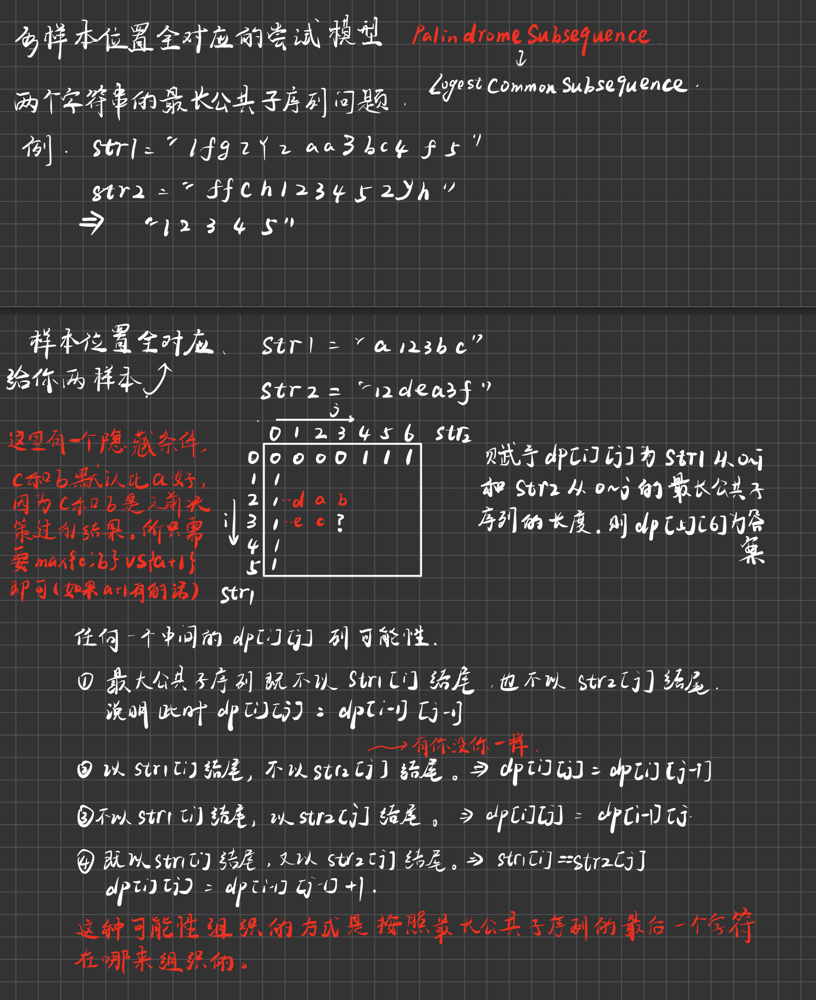

- 真正在写代码的时候左上角的格子可以不管，因为左上角的格子一定比上面的格子和左边的格子弱。

代码

```JAVA
private static int longestCommonSubsequence(String a, String b) {
        if (a == null || b == null || a.length() == 0 || b.length() == 0) {
            return 0;
        }
        char[] string1 = a.toCharArray();
        char[] string2 = b.toCharArray();
        return process1(string1, a.length() - 1, string2, b.length() - 1);
    }

    /**
     * @param a:固定参数
     * @param index1:0~index1 的字符串
     * @param b:固定参数
     * @param index2:0~index2 的字符串
     * @return :返回a的0~index1的字符串和b的0~index2的字符串的最大公共子序列长度
     */
    private static int process1(char[] a, int index1, char[] b, int index2) {
        if (index1 == 0 && index2 == 0) {//二维递归的base case
            return a[index1] == b[index2] ? 1 : 0;
        } else if (index1 == 0) {//base case
            return a[index1] == b[index2] ? 1 : process1(a, index1, b, index2 - 1);
        } else if (index2 == 0) {//base case
            return a[index1] == b[index2] ? 1 : process1(a, index1 - 1, b, index2);
        } else {//至少都有两个字符
            //p1这里一定有一个前提条件就是a[index1]==b[index2]
            int p1 = a[index1] == b[index2] ? process1(a, index1 - 1, b, index2 - 1) + 1 : 0;//最长公共子序列的最后一个字符都在a和b的最后
            int p2 = process1(a, index1, b, index2 - 1);//最长公共子序列的最后一个字符在a不在b
            int p3 = process1(a, index1 - 1, b, index2);//最长公共子序列的最后一个字符在b不在a
            //p4这种情况可以不存在，因为p4一定小于p1,p2,p3.p2/p3的子串范围都大于p4，或者说p4已经包含在p2或者p3的决策中了。
//            int p4=process1(a,index1-1,b,index2-1);
            return Math.max(Math.max(p2, p3), p1);
        }
    }

    private static int longestCommonSubsequence2(String str1, String str2) {
        if (str1 == null || str2 == null || str1.length() == 0 || str2.length() == 0) {
            return 0;
        }
        char[] a = str1.toCharArray();
        char[] b = str2.toCharArray();
        int[][] dp = new int[str1.length()][str2.length()];
        dp[0][0] = a[0] == b[0] ? 1 : 0;
        for (int index2 = 1; index2 < b.length; index2++) {
            dp[0][index2] = a[0] == b[index2] ? 1 : dp[0][index2 - 1];
        }
        for (int index1 = 1; index1 < a.length; index1++) {
            dp[index1][0] = a[index1] == b[0] ? 1 : dp[index1 - 1][0];
        }
        for (int index1 = 1; index1 < a.length; index1++) {
            for (int index2 = 1; index2 < b.length; index2++) {
                int p1 = a[index1] == b[index2] ? dp[index1 - 1][index2 - 1] + 1 : 0;
                int p2 = dp[index1][index2 - 1];
                int p3 = dp[index1 - 1][index2];
                dp[index1][index2]= Math.max(Math.max(p2, p3), p1);
            }
        }
        return dp[str1.length() - 1][str2.length() - 1];
    }
```

### 洗咖啡杯问题


### 马跳棋盘问题


```java
private static int steps1(int x,int y,int k){
    return process1(x,y,k);
}

/**
 *棋盘的大小是9*10 --->映射到下标就是0~8和0~9
 * 按理来说应该是由五个参数，2个目标位置的参数不变化，3个可变参数，2个现在位置，1个剩余的步数
 * 但是我们考研进行转化，我们的马从(0,0)走向(x,y)，其实反过来看，我们的马可以等价于从(x,y)走向(0,0)，
 * 所以我们可以省略目标参数
 * @param x:目标位置横坐标
 * @param y:目标位置纵坐标
 * @param k:还有k步可以走
 * @return :返回总共有多少种方法可以走到目标位置。这明显是一个收集合格的叶子结点的问题，合格为1，不合格为0.
 *          以及需要将跳出界限的分支杀死--返回0.
 */
private static int process1(int x, int y, int k) {
    if (k==0) return x==0&&y==0?1:0;//走到了最底下的叶子结点，收集合格的叶子结点
    if (x<0||x>8||y<0||y>9) return 0;//扼杀不合格的分支
    return process1(x+1,y+2,k-1)+process1(x+1,y-2,k-1)+
            process1(x-1,y+2,k-1)+process1(x-1,y-2,k-1)+
            process1(x+2,y+1,k-1)+process1(x+2,y-1,k-1)+
            process1(x-2,y+1,k-1)+process1(x-2,y-1,k-1);
}

private static int waysDP(int x,int y,int k){
    int[][][] dp=new int[9][10][k+1];//0~8  0~9  0~k
    dp[0][0][0]=1;//初始化，其它默认就是0，不用管
    for (int level=1;level<=k;level++){//k
        for (int i = 0; i < 9; i++) {//x
            for (int j = 0; j < 10; j++) {//y
                dp[i][j][level]=getVal(dp,i+1,j+2,level-1)+getVal(dp,i+1,j-2,level-1)+
                        getVal(dp,i-1,j+2,level-1)+getVal(dp,i-1,j-2,level-1)+
                        getVal(dp,i+2,j+1,level-1)+getVal(dp,i+2,j-1,level-1)+
                        getVal(dp,i-2,j+1,level-1)+getVal(dp,i-2,j-1,level-1);
            }
        }
    }
    return dp[x][y][k];
}

private static int getVal(int[][][]dp,int x,int y ,int k){
    if (x<0||x>8||y<0||y>9) return 0;
    return dp[x][y][k];
}
```

## 滑动窗口

> 滑动窗口是什么?滑动窗口是—种想象出来的数据结构:
>
> 	滑动窗口有左边界L和右边界R
> 	在数组或者字符串或者一个序列上，记为S，窗口就是S[L..R]这一部分
> 	L往右滑意味着一个样本出了窗口，R往右滑意味着一个样本进了窗口
> 	L和R都只能往右滑

---

假如有一个数组，一开始窗口的左边界和右边界都在最左侧的位置，-1位置。没有包住任何一个数。

窗口运动遵循几个原则：

1. 右边界右移即R++，指的是新的一个数从右侧进入了窗口。
2. 左边界右移即L++，指的是已经进来的数从左侧出去了。
3. 任何时候L都要小于等于R。也就是不能跑到R的右边去。

---

每次L和R的移动都会导致窗口的状况改变。那么我如何知道每一个状况窗口的最大值或者是最小值？我能不能找一个不遍历的方法来实现这个功能。是可以的，这就是我们所说的窗口内最大值的更新结构，我做出一个结构，这个结构随着窗口的状况变化也随之变化，效果就是我每次想要达到窗口内的最大值我都能迅速的得到。

我们可以用单调双端队列（一个数可以从头进从头出，也可以从尾进从尾出）来实现这个结构---得到最大值，我们维持双端队列从头到尾是从大到小。

1. 在进数的时候也就是R++，从尾部加，如果队列为空或者前一个位置的数比自己大，那么就直接从尾部放入。如果加数的时候发现前面的数比自己小，就不停的从双端队列的尾部弹出数，直到双端队列为空或者前一个数比自己大了才从尾部进去
2. 在出数的时候也就是L++，看一下当前双端队列的头部的数是不是过期的那个数，例如L=5，L++变成了6，那么过期的那个数的下标就是5。此时看一下双端队列的头部是不是过期的那个数，如果是就弹出，如果不是就跳过，什么也不做。

这样做出来的双端队列头部的值就是我们现在窗口的最大值。可以看到，这个双端队列在进数的时候可以一直保证队列的头部是最大值。因为窗口可能会出数，所以利用L来推算出过期的数，这样就让双端队列的最左边一直保持的是不过期的（不过期说明这个数还在窗口里）最大值。

- 在R不动，L++的情况下，L位置的数过期了。此时双端队列里面的值代表的是哪些数会成为最大值的优先级。即值决定了哪些位置会依次成为最大值。例如双端队列现在的情况是2,1。现在我们进入了一个3，根据我们的规则，1和2都要弹出。凭什么可以这样？因为这个时候L不动，我从L到R的最大值就是3，因为3晚过期，怎么都轮不到3前面的1和2当最大值。同理，如果下一个进来的数比3小的话例如1，我们可以把它入队，放到3的后面。因为一旦3过期了，最大值就是1了，因为这个时候只有1不是过期的。
- 值比你好，比你晚过期----直接把前面的扔了。值比你坏但是比你晚过期，先留着。（好坏决定于是要最大还是最小，如果要最大，那么好的就是大于）
- 值相等也把前面的扔了
- 要把得到窗口的最小值我们只需要维持从头开始到尾部双端链表的值是从小到大就行了。
- 一个数要把从尾巴出去，要么从头出去。从尾巴出去（R++，出数的时候）就是后面进来了一个晚过期而且比它好的数（这个“好”取决于你要的是最大值还是最小值）。从头出去说明这个数是被过期掉的（L++，出数的时候）。每一个记录最多进双端队列一次，出双端队列一次。
- 窗口划过了N个数，双端队列的总代接是O（N），因为每个位置（index）最多进一次，最多出一次。平均下来每划过一个数的代价就是O（1）。
- 窗口用两个整型控制即可
- L的值代表的是最近一次出窗口的数的下标，R代表的最近一次进窗口的下标。也就是说(L,R]代表的是窗口囊括的数

### 固定大小窗口划过数组

- 题目：假设一个固定大小为W的窗口，依次划过arr。返回每一次滑出状况的最大值
  例如, arr = [4,3.5,4,3,3,6,7],W = 3

  返回:[5.5,5,4,6,7]

分析：根据前面的滑动窗口的结构，我们先让窗口滑动到R=w-1，记录下此时的最大值。之后每次都r++，l++再记录一次最大值。直到r越界了。

- java中LinkedList就是双端队列。前面在讲的时候双端队列里有index还有值。由于这里是arr，我们要值需要arr[index]即可。一定不能只放值！！！因为我们有通过index来判断过期，有了位置我即可拿到值，也可以判断是否过期。靠近头部存放的位置所对应的值一定要是最大的。
- 窗口并不是要独立写一个数据结构才能用。只需要维持一套逻辑就能用。这道题固定窗口大小决定了过期位置是确定的，即L可以用R推断出来。L=R-w+1,w为窗口大小

#### 代码

```java
public static int[] getMaxWindow(int[] arr, int w){
    if (arr == null || arr.length == 0||w<=0) {
        return null;
    }
    int[] res=new int[arr.length-w+1];//长度为3对应1个结果，3-w+1
    int index=0;//专门给res数组用
    //这是一个双端队列。队头放大的值，需要谁就把谁放在队头。里面的值是下标
    LinkedList<Integer> qmax=new LinkedList<>();
    for (int R=0;R<arr.length;R++){//arr的每一个数一个一个进入窗口
        //不断的循环，直到当前队尾比R对应的值大，或者一直到队列为空。
        while (!qmax.isEmpty()&&arr[qmax.peekLast()]<=arr[R]){//把队列里面值比R小的先踢出去
            //比不过R就从尾巴出去，位置留给R
            qmax.pollLast();
        }
        qmax.addLast(R);
        if (R>=w-1){//从窗口扩大到w开始之后。不仅要进去一个，还要过期一个。在过期一个之前顺便得到一个结果
            res[index++]=arr[qmax.peekFirst()];//先得到一个结果再去过期一个
            if (R-w+1==qmax.peekFirst()){//过期操作。R-w+1是过期的位置，去判断当前队头是不是过期了！
                qmax.pollFirst();//过期就从队头出去
            }
        }
    }
    return res;
}
```

### 达标子数组问题

- 题目：给定一个整型数组arr，和一个整数num
  某个arr中的子数组sub，如果想达标，必须满足∶

  sub中最大值-sub中最小值<= num,
  返回arr中达标子数组的数量

#### 分析

暴力解很显然，就是枚举每一个数组，看看每一个达不达标。枚举出每一个子数组-----N²，找出最大值最小值----N。合起来就是N³的解。

这里有一个隐藏条件：子数组A要满足条件，必须满足子数组A的子数组A1也要满足条件。因为子数组A如果满足条件，maxa>maxa1,mina<mina1。既然A都满足maxa-minb<=num，那么maxa1-mina1也必然<=num。

隐藏条件的拓展：如果小范围上的子数组已经不达标了，这个子数组扩充得到的大数组一定也不达标。

做法：做出两个窗口的更新结构，一个更新最大值，一个更新最小值。这样我就可以让窗口一直长大，一直到窗口不达标了我就停，不让那个会使得窗口不达标的数进这个窗口（体现在R++会因为不合格break跳过）。这样一来我们就可以知道以L开始的窗口的达标个数。然后让L往右边走，继续让R扩充（也可能不扩充了，因为第二次进来会反复加一次R，如果还是不达标，那么R还是不能++），这样又可以求出L+1开始的窗口达标的有几个。有几个？----利用下标相减。

整个过程L和R不回退。代价为O（N）。


---

优化一个题有几个方向：

1. 数据状况
2. 问题本身

这题是属于两个方向结合做优化。首先要能够用窗口内最大值和最小值的更新结构的前提是它的求解流程得是一个窗口。这道题得益于我们的那两个隐藏条件。子数组达标外扩必定不达标。子数组达标，它的子数组必定达标。这样一来我们就把范围和问题本身建立了单调性-----不达标，扩大必定不达标。达标，缩小必定达标。

把范围和问题建立单调性经常可以用首尾指针或者滑动窗口写。

#### 代码

```java
/**
 * @param arr:
 * @param num:子数组的最大值和最小值的差<=num
 * @return :返回满足条件的子数组的个数
 */
public static int getNum(int[] arr, int num){
    if (arr==null||arr.length==0||num<0){
        return 0;
    }
    int res=0;
    LinkedList<Integer> qmin=new LinkedList<>();
    LinkedList<Integer> qmax=new LinkedList<>();
    int R=0;//一直向前不回退
    //求出以每一个位置作为开头的达标子数组的数量
    for (int start=0;start<arr.length;start++){
        while(R<arr.length){
            //R进到窗口中,维持最大值和最小值的结构
            while(!qmax.isEmpty()&&arr[R]>=arr[qmax.peekLast()]){//谁大谁有理
                qmax.pollLast();
            }
            qmax.addLast(R);
            while(!qmin.isEmpty()&&arr[R]<=arr[qmin.peekLast()]){//谁小谁有理
                qmin.pollLast();
            }
            qmin.addLast(R);
            //判断是否达标。下面出窗口需要peek，所以这里不能因为不达标就直接出了。在上面重复进队的时候while会帮我们重置。
            if (arr[qmax.peekFirst()]-arr[qmin.peekFirst()]>num){
                break;//不达标---加入了R之后变得不达标了1。
            }
            R++;
        }
        //start出窗口，过期，更新结构
        if (start==qmin.peekFirst()){
            qmin.pollFirst();
        }
        if (start==qmax.peekFirst()){
            qmax.pollFirst();
        }
        res+=(R-start);//偏移了R-start次到达了不达标的位置。算上自己的位置刚好就是偏移量。
    }
    return res;
}
```

## 单调栈

### 基本实现

给定一个数组，要你找出每一个数左右两边离它最近并且比它小的数在哪。没有的话标记为-1。

我想求每一个位置，左边和右边离它最近的比它小的数的位置在哪，这么一张表就是单调栈要解决的问题。

暴力解法是O（N²），单调栈可以做到O（N）。

流程：先假设这个数组没有重复值。栈底放的是比较小的数，因为这里我们要求的是左右边离最近的比它小的数。如果是要求比它大的数的话，栈底就放比较大的数。所以现在我们的栈从栈底到栈顶是从小到大的。

如果栈为空就直接进栈，如果不为空就检查目前的栈顶是不是比你小。如果比你小就直接进栈。如果比你大，那么栈顶就弹出，同时生成栈顶那个数的记录。谁让你出来的，谁就是右边离你最近的小于你的数。你底下压的是谁，谁就是左边离你最近的比你小的数。让栈顶一直弹出，弹出几个数就生成几个记录，直到这个数被放入栈中。

整个数组处理完了就开始单独处理栈里还剩下的东西。这个时候栈里的数就都没有右边离它最近比它小的数了，因为这个时候的栈里面的数是我让他弹出的，而不是因为有一个数要进来才导致它弹出的。这个数底下压的是谁，谁就是左边的最近的比它小的数。

在这一整个流程中，所有的数都是进一次出一次，所以整体的时间复杂度是O（1）。

- 看下图abc情况。b在a的上面，意味着之前加载a和b之间的数都比b大，所以a一定是左边最近的比b小的数。同理，b和c之间的数都被c给弹出了，说明这些数都比b大，但是比c小。因为此时c要把b也弹出。所以c也比b小。所以b的右边最小就是c


- 栈顶如果放小，那么求出来的就是离得最近的大于它的两个数。


上面的是没有重复值的数组。如果有重复值的话，栈里面就放的不是整型了，而是放一个整型列表，里面存的是对应值相等的下标。

- 流程类似。唯一不同的点就是如果相等的话就加到列表里面去。如果弹出就整个列表一起弹出，一起设置。

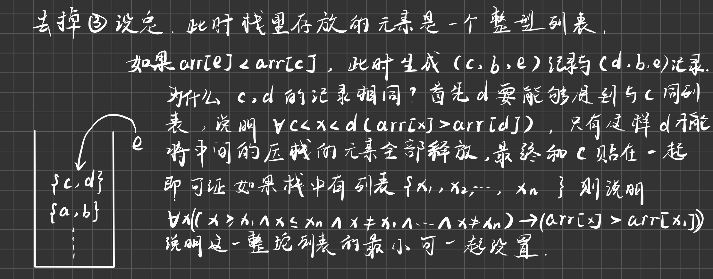


- 你要求小于你的两边离你最近的数的下标，那么就arr[i]<stack.peek，因为你是弹出的时候设置，arr[i]小于你，所以可以设置你。栈底是小的。

```java
public static int[][] getNearLessNoRepeat(int[] arr){
    int [][] res=new int[arr.length][2];//一左一右
    Stack<Integer> stack =new Stack<>();//存放下标
    for (int i=0;i<arr.length;i++){
        while(!stack.isEmpty()&&arr[i]<arr[stack.peek()]){
            int index=stack.pop();//弹出
            //设置
            int left=stack.isEmpty()?-1:stack.peek();//前面一步有弹出，这里要检查
            int right=i;
            res[index][0]=left;
            res[index][1]=right;
        }
        stack.push(i);
    }
    while(!stack.isEmpty()){
        int index=stack.pop();//弹出
        //设置
        int left=stack.isEmpty()?-1:stack.peek();
        int right=-1;
        res[index][0]=left;
        res[index][1]=right;
    }
    return res;
}


/**
 * 逻辑：1.空栈，直接创建列表入栈然后把数插进去。2.栈非空且数组中的数大于栈顶列表代表的数，创建列表入栈然后把数插进去
 * 3.栈非空且数组中的数等于栈顶列表代表的数，直接把数插进栈顶的的列表中。
 * 4. 栈非空且数组中的数小于栈顶列表代表的数，循环弹出栈顶的列表并且设置直到跳出循环进入到123的逻辑分支
 * @param arr:目标数组
 * @return :数组的行号代表arr数组中的每一个数的下标，列一左一右放左右两边的最小
 */
public static int[][] getNearLess(int[] arr){
    int [][] res=new int[arr.length][2];//一左一右
    Stack<LinkedList<Integer>> stack =new Stack<>();//存放下标的列表
    for (int i=0;i<arr.length;i++){
        while(!stack.isEmpty()&&arr[i]<arr[stack.peek().peekLast()]){//小于
            LinkedList<Integer> list=stack.pop();//弹出
            //设置
            int left=stack.isEmpty()?-1:stack.peek().peekLast();//压着的队列的最后一个
            int right=i;
            for ( Integer j:list){
                res[j][0]=left;
                res[j][1]=right;
            }
        }
        if (!stack.isEmpty()&&arr[i]==arr[stack.peek().getLast()]){//等于
            stack.peek().addLast(i);//从尾部加
        }else {//大于
            LinkedList<Integer>list=new LinkedList<>();
            list.addLast(i);//从尾部加
            stack.push(list);
        }
    }
    while(!stack.isEmpty()){
        LinkedList<Integer> list =stack.pop();
        int left=stack.isEmpty()?-1:stack.peek().getLast();
        int right=-1;
        for (Integer i:list){
            res[i][0]=left;
            res[i][1]=right;
        }
    }
    return res;
}
```

### 求子数组（累加和 * 最小值）的最大值

- 题目：给定一个只包含正整数的数组arr, arr中任何一个子数组sub,一定都可以算出(sub累加和)* (sub中的最小值)，那么所有子数组中，这个值最大是多少?


子数组求和的技巧：生成一个前缀和数组sum[],其中sum[i]代表arr[0]+...+arr[i]。这样一来arr[L]+...+arr[R]=sum[R]-sum[L-1]

分析：

	问题拆解，这里有两个变量，一个是累加和一个是最小值。我们先把最小值定下来，然后此时要求整体的最大值就变成了求累加和的最大值，显然累加和要越大子数组的范围也要越大。然后在众多值中，求出来的情况中再选一个最大的。这样就得到了整体的最大值。
	
	所以这里我们就选中arr[0]当做这个最小值，看看往右边扩展可以扩展到多大。注意上面说的是找到最小值定下来最为一个最小情况。这里我们以arr中的每一个位置作为最小值是对上面说的进行进一步的拆解。

- 对单调栈做一个改进，我们找到离一个数最近的小于等于它的数就行。如果新数小于等于栈顶，那么栈顶就弹出。


```java
/**
 * 数组的每一个数作为最小值，找出扩展出来的最大子数组，因为这个数要作为最小值，所以数组里面的数都是要<=它。所以我们找出离它最近的
 * 大于它的左右两边的数L和R，(L,R)即是我们要找的最大子数组。我们要找出最近的大于index的数，while的判断条件就是
 * arr[i]<=arr[stack.peek()],注意观察<=是>的相反面。
 * @param arr:
 * @return :
 */
public static int max(int[] arr){
    int [] res=new int[arr.length];
    Stack<Integer> stack =new Stack<>();//存放下标
    int[] sum=new int[arr.length];
    sum[0]=arr[0];
    int max=Integer.MIN_VALUE;
    for (int i=1;i<arr.length;i++){
        sum[i]=sum[i-1]+arr[i];
    }
    for (int i=0;i<arr.length;i++){
        while(!stack.isEmpty()&&arr[i]<=arr[stack.peek()]){//这里是小于等于就行，不需要严格小于
            int index =stack.pop();
            //栈为空说明左边没有比arr[index]大的数，换言之左边的全部范围都属于我们的最大子数组
            max=Math.max(max,arr[index]*(stack.isEmpty()?sum[i-1]:sum[i-1]-sum[stack.peek()]));
        }
        stack.push(i);
    }
    while(!stack.isEmpty()){
        int index=stack.pop();
        //栈为空说明右边没有比arr[index]大的数，换言之右边的全部范围都属于我们的最大子数组
        max=Math.max(max,arr[index]*(stack.isEmpty()?
                                     sum[arr.length-1]:sum[arr.length-1]-sum[stack.peek()]));
    }
    return max;
}
```

- 直方图中截出最大的长方形（和上面一样的解法）


- 找出你要求的结果和范围之间的单调性。

## KMP

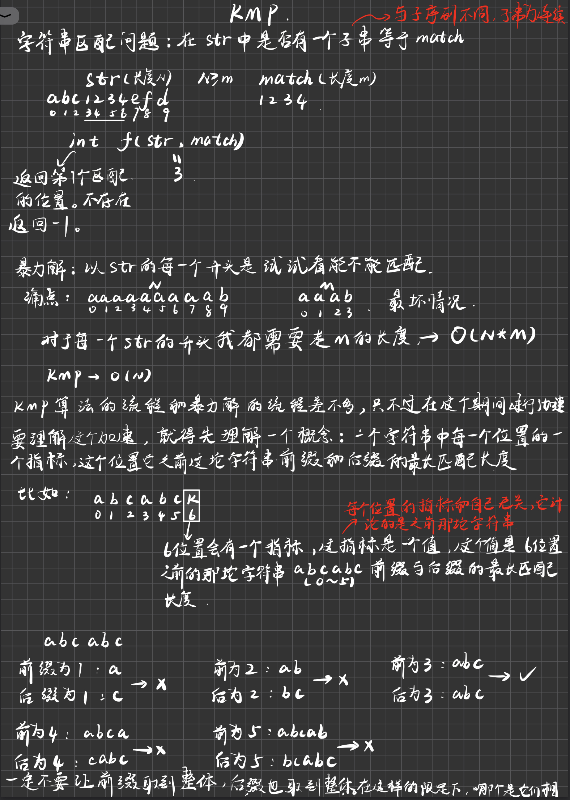


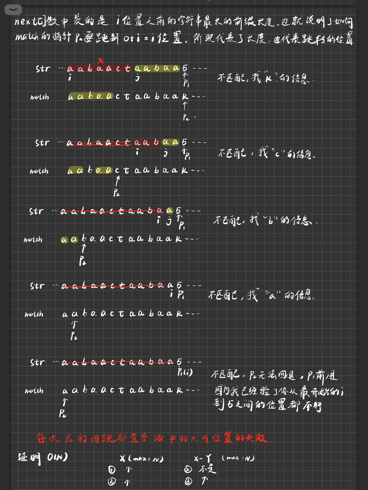

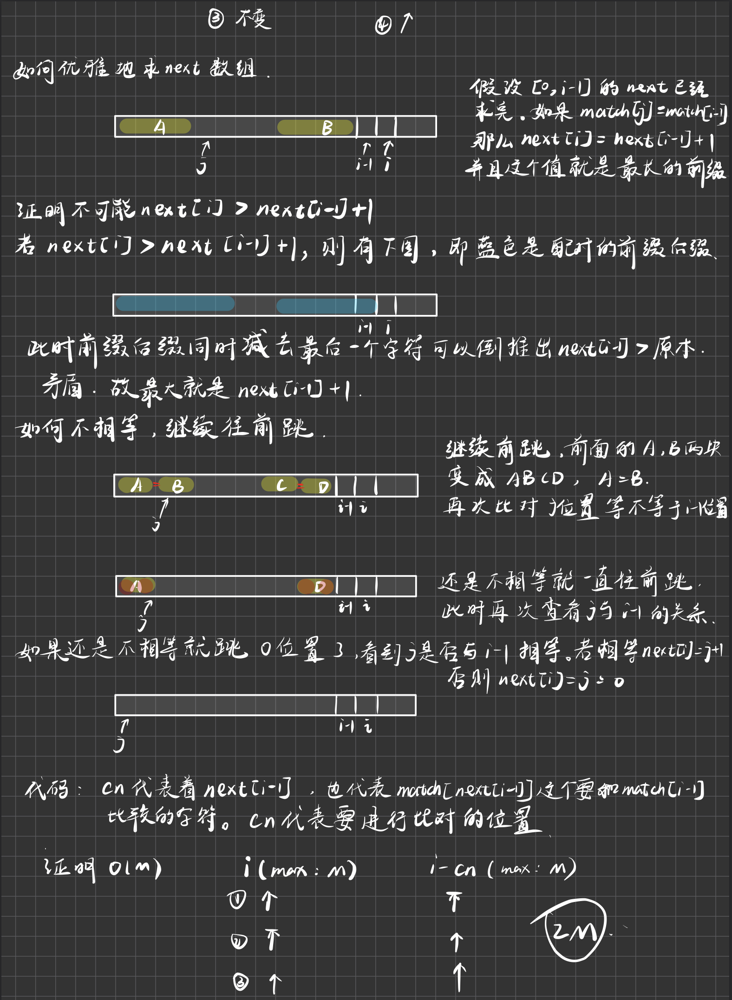

```java
private static int kmp(String str, String match) {
    if (str==null||match==null||match.length()<1||str.length()<match.length()) return -1;
    char[] s1 = str.toCharArray();
    char[] s2 = match.toCharArray();
    int[] next=getNext(match);
    int p1=0;
    int p2=0;
    while(p1!=str.length()&&p2!=match.length()){//不越界
        if (s1[p1]==s2[p2]){
            p1++;
            p2++;
        }else if (p2!=0){//p2还可以回退
            p2=next[p2];
        }else{//p2==0,回退不了了，说明p1现在这个位置不对
            p1++;
        }
    }
    return p2==match.length()?p1-p2:-1;
}

private static int[] getNext(String match) {
    if (match.length() == 1) return new int[]{-1};
    char[] chars = match.toCharArray();
    int[] next = new int[match.length()];
    next[0] = -1;
    next[1] = 0;
    int i=2;
    int p=next[1];//当前要从2位置开始填，所以p要等于next[2-1]
    while(i!=match.length()){
        if (chars[i-1]==chars[p]){//i-1位置和p位置相等,
            next[i++]=++p;//长度是i-1位置长度+1，p即代表要比较的位置，也代表前缀子串的长度
        }else if (p==0){//p前面无路可跳
            next[i++]=0;
        }else {//p前面还有路可以跳
            p=next[p];
        }
    }
    return next;
}

private static int baoli(String str,String match){
    if (str==null||match==null||match.length()<1||str.length()<match.length()) return -1;
    char[] s1 = str.toCharArray();
    char[] s2 = match.toCharArray();
    int p1=0;
    int p2=0;
    for (int i = 0; i < str.length(); i++) {
        p1=i;
        p2=0;
        while(p1!=str.length()&&p2!=match.length()){
            if (s1[p1]==s2[p2]){
                p1++;
                p2++;
            }else
                break;
        }
        if (p2==match.length())return p1-p2;
    }
    return -1;
}
```

- 应用

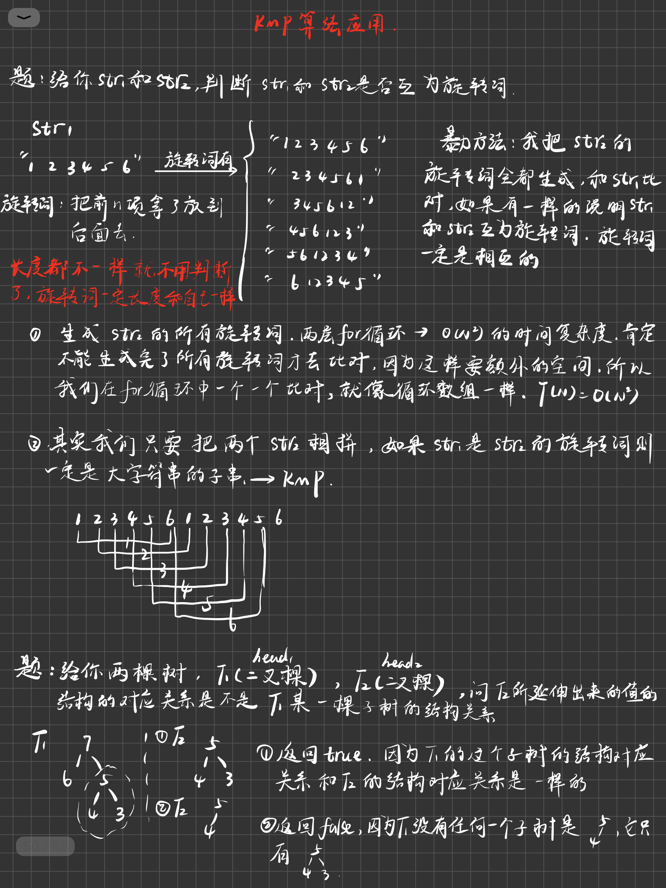


## ManACher

Manacher算法解决的是最长回文子串是多长。

解决回文有什么用处呢？DNA就是一些序列，可以把DNA认为是字符串，回文有一些生理学意义，有一些基因片段它是回文属性的，比如说人是对称的。在某一些DNA序列里面，基因的序列对呈现一些回文关系。

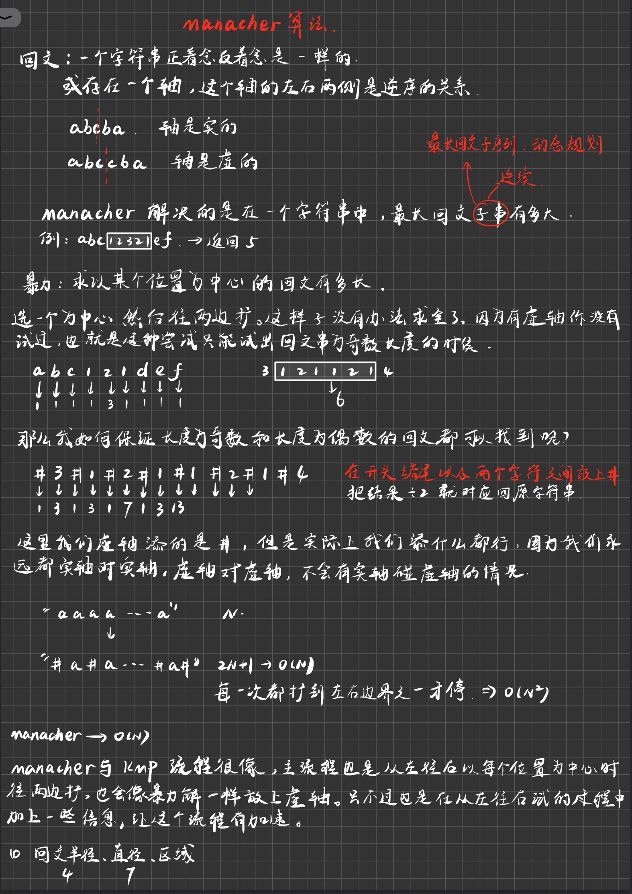


- 事实上，如果`i'`的范围越界了，也就是超过L了，那么i加上Parr[i']也会越出R。让Parr的含义变成右边界减去中心。此时如果i+Parr[i']<R,那么我们直接让Parr[i]等于Parr[i']。如果i+Parr[i']>R,那么就让Parr[i]等于R-i。也就是说Parr[i']<R-i时选Parr[i']。Parr[i']>R-i时选R-i。等价于在i在R内，并且i'不是踩在边界的情况下Parr[i]=min（R-i,Parr[i']）

  也就是Parr[i]=min（R-i+1,Parr[i']）.

  如果i+Parr[i']==R，那么就让它等于R-i+1，然后

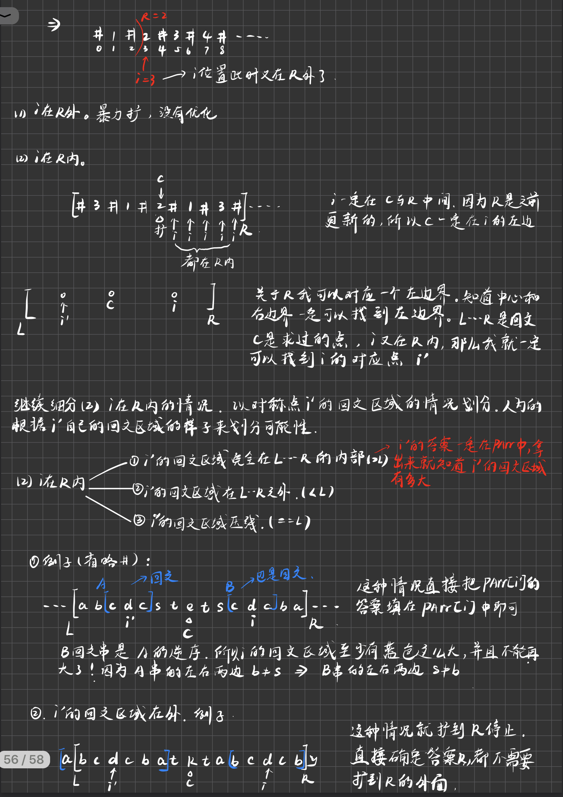

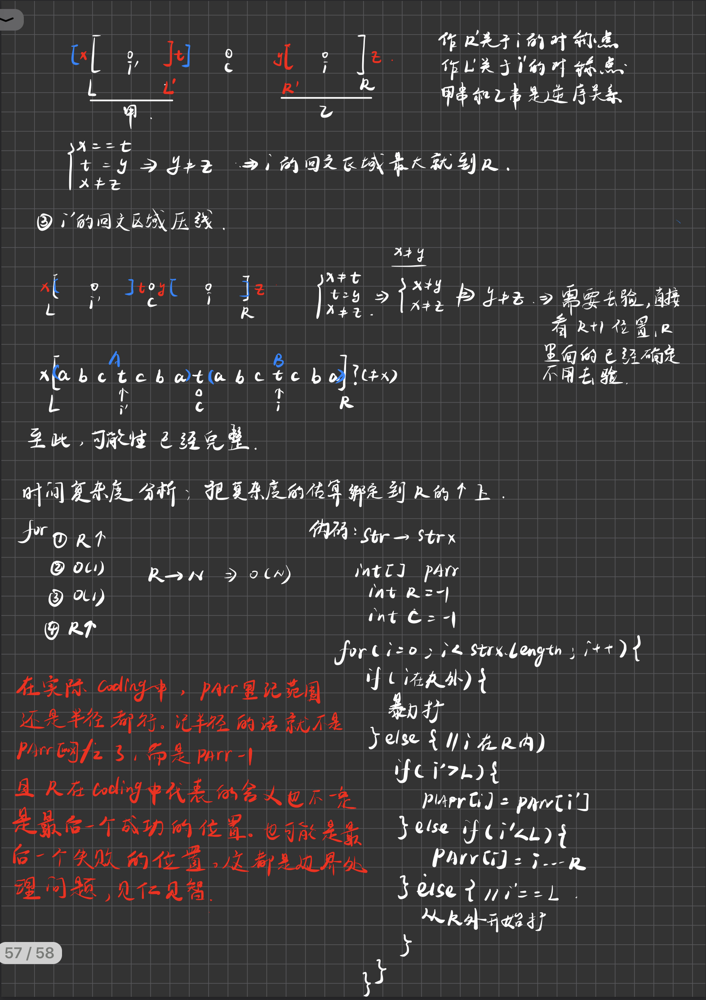


- 运用：如果我们有Parr数组。那么原始串0~i的前缀串，如果i+1==Parr[i+1]，那么0~i的前缀串就是回文串。这里说的Parr是差值，而不是长度


## 斐波那契数列

- 斐波那契数列的递推式，F(N)=F(N-1)+F(N-2)，f(0)=1,f(2)=1.

斐波那契数列是由严格递推式的，不随条件转移。不是说在某些情况下才等于这个递推式，而是在任何情况下都满足这个式子。


```java
//普通递归
private static int f1(int n){
    if (n<1)return 0;
    if (n==1||n==2)return 1;
    return f1(n-1)+f1(n-2);
}

/**
 * 利用动态规划
 * @param n:返回斐波那契数列的第n项
 * @return :
 */
private static int f2(int n){
    if (n<1)return 0;
    if (n==1||n==2)return 1;
    int res=0;
    int n1=1;
    int n2=1;
    for (int i = 0; i < n - 2; i++) {//res迭代n-2次就是答案
        res=n1+n2;
        n1=n2;
        n2=res;
    }
    return res;
}

private static int f3(int n){
    if (n<1)return 0;
    if (n==1||n==2)return 1;
    int[][] m=new int[][]{{1,1},{1,0}};
    m=matrixPower(m,n-2);
    return m[0][0]+m[1][0];
}

/**
 *
 * @param a:矩阵
 * @param n:矩阵a的n次方
 * @return :返回结果
 */
private static int[][] matrixPower(int[][] a,int n){
    if (n<=0) return null;
    int[][] res=new int[a.length][a[0].length];
    for (int i = 0; i < res.length; i++) {//初始化为单位矩阵
        res[i][i]=1;
    }
    int [][]m=a;//一次方
    for (;n!=0;n>>=1){
        if ((n&1)==1) res=mulMatrix(res,m);
        m=mulMatrix(m,m);//m平方
    }
    return res;
}


private static int[][] mulMatrix(int[][]a,int[][]b){
    int[][] res=new int[a.length][b[0].length];
    for (int i = 0; i < a.length; i++) {
        for (int j = 0; j < b.length; j++) {
            for (int k = 0; k < b[0].length; k++) {
                res[i][j]+=a[i][k]*b[k][j];
            }
        }
    }
    return res;
}
```

达标字符串问题


 

```java
public static int getNum1(int n) {
    if (n < 1) {
        return 0;
    }
    return process(1, n);
}

/**
 * fi,如果i+1位置是1，那么就变成fi+1.如果i+1位置是0，那么fi+2位置就是1，就变成fi+2
 * @param i:从str[i,n]假设i位置是1，有多少种方法
 * @param n:01序列的长度
 * @return
 */
public static int process(int i, int n) {
    if (i == n - 1) {//n位置分别取1和2
        return 2;
    }
    if (i == n) {//n位置直接就是1，只有一种方法
        return 1;
    }
    return process(i + 1, n) + process(i + 2, n);
}

public static int getNum2(int n) {
    if (n < 1) {
        return 0;
    }
    if (n == 1) {
        return 1;
    }
    int pre = 1;
    int cur = 1;
    int tmp = 0;
    for (int i = 2; i < n + 1; i++) {
        tmp = cur;
        cur += pre;
        pre = tmp;
    }
    return cur;
}

public static int getNum3(int n) {
    if (n < 1) {
        return 0;
    }
    if (n == 1 || n == 2) {
        return n;
    }
    int[][] base = { { 1, 1 }, { 1, 0 } };
    int[][] res = matrixPower(base, n - 2);
    return 2 * res[0][0] + res[1][0];
}

public static int fi(int n) {
    if (n < 1) {
        return 0;
    }
    if (n == 1 || n == 2) {
        return 1;
    }
    int[][] base = { { 1, 1 },
            { 1, 0 } };
    int[][] res = matrixPower(base, n - 2);
    return res[0][0] + res[1][0];
}

public static int[][] matrixPower(int[][] m, int p) {
    int[][] res = new int[m.length][m[0].length];
    for (int i = 0; i < res.length; i++) {
        res[i][i] = 1;
    }
    int[][] tmp = m;
    for (; p != 0; p >>= 1) {
        if ((p & 1) != 0) {
            res = muliMatrix(res, tmp);
        }
        tmp = muliMatrix(tmp, tmp);
    }
    return res;
}

public static int[][] muliMatrix(int[][] m1, int[][] m2) {
    int[][] res = new int[m1.length][m2[0].length];
    for (int i = 0; i < m1.length; i++) {
        for (int j = 0; j < m2[0].length; j++) {
            for (int k = 0; k < m2.length; k++) {
                res[i][j] += m1[i][k] * m2[k][j];
            }
        }
    }
    return res;
}
```

## 蓄水池算法

蓄水池问题：假设有一个机器，源源不断吐出球，机器可以认为是一个流，从一号球开始吐，吐完一号球一定吐二号球，以此类推。但是你只有一个能装下十个球的袋子。机器吐出来的每一个球你都要去决定是入袋子还是扔掉。如果你扔掉了这个球，那么你永远也无法找回。那么现在要保证吐出来的每一个球被选中的概率都是相等的。也就是说如果吐了1000个球，你要保证每一个球被选中的概率都是10/1000。它每吐出任何一个球都得保证吐出过的求被选中的概率都是相等的。

- 这个题不是说我搞了一个序列之后我才弄随机，弄不了，因为只有十个球的空间。不能把过往的球都留下来才弄随机。难点在这。

流程：

1. 在机器吐出1~10号球的期间，完全入袋子，没有筛选逻辑。每一个球都不扔掉，都进袋子。

- 接下来引入一个随机函数f，假设有一个随机函数给我们用，随机函数当我传入i的时候给我返回1~i等概率的一个数字。

2. 如果我吐出了k号球，k号球是1~10之外的一个数。当它出现的时候我要有一个决策来决定要不要它。我用10/k的概率决定这个球要不要入袋子。那么就调用f（k），如果f（k）返回的是1~10那么就进入袋子，否则就扔掉。如果k号球要进袋子，舍弃袋子里的谁？--袋子里的球等概率扔一个。

为什么这样的流程可以保证在每一次吐出一个球的时候，之前吐出的所有球都等概率进袋子。


这样的算法有什么用？想象你有100的用户，要在今天选出所有登录的用户中的100个作为幸运观众。如果你是暴力解，你只能先把所有的登录作为一个list，然后去掉重复的用户，然后再从中做随机，选出100个观众。这样的暴力求解需要把所有数据放到一个大服务器上进行运算，而且只选出100个观众。

但是如果使用蓄水池算法，那么我只需要一台服务器，就给我100个位置每个用户在登录的时候实现两个方法。f1验证你今天是不是首次登录。f2方法得出你是全球第几个（x）登录的用户。如果用户是首次登录，那么就以100/x的概率决定进去，然后从袋子中随机踢出去一个。最后再开奖的时候直接公布这100个人即可。根本不需要各个服务器之间同步数据。稍微有点难度的就是要知道你是全球第几个登录的用户，这个还是相对好实现的。

原本以非常大的代价才能能够搞定的事情，现在变成了动态决定。我就准备只有100个人的空间，这个事情就拿下了。

```java
public static class RandomBox {
   private int[] bag;
   private int N;//袋子的大小
   private int count;//已经过了count个球

   public RandomBox(int capacity) {
      bag = new int[capacity];
      N = capacity;
      count = 0;
   }

   private int rand(int max) {
      return (int) (Math.random() * max) + 1;
   }

   public void add(int num) {
      count++;
      if (count <= N) {
         bag[count - 1] = num;
      } else {
         if (rand(count) <= N) {
            bag[rand(N) - 1] = num;
         }
      }
   }

   public int[] choices() {
      int[] ans = new int[N];
      for (int i = 0; i < N; i++) {
         ans[i] = bag[i];
      }
      return ans;
   }

}
```


## bfprt算法

- 有更好的算法笔试使用。笔试的时候不要使用bfprt算法。这是面试用的

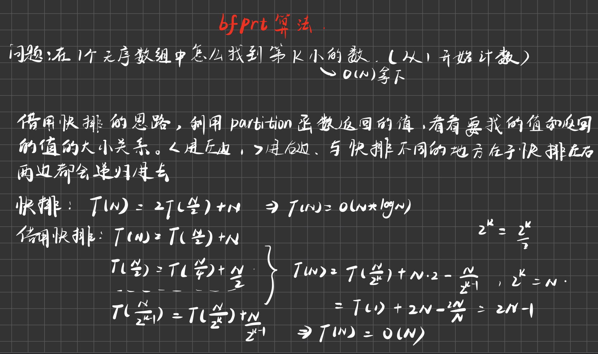


```java
public class Code01_FindMinKth {//bfprt,寻找第k小

    // 利用大根堆，时间复杂度O(N*logK)。原理：k大小的大根堆，每次遍历数组都让比较大的出堆，这样到结束大的都出去了，剩下的就是第k小的
    // 因为剩下的k个是arr中前k小的数，他们之中最大的，也就是位于堆顶的数就是第k小的数。
    public static int minKth1(int[] arr, int k) {
        PriorityQueue<Integer> maxHeap = new PriorityQueue<>((Integer o1,Integer o2)->{return o2-o1;});
        for (int i = 0; i < k; i++) maxHeap.add(arr[i]);//保持堆有k的空间即可，这样每次添加或者删除都是常数操作lgk
        for (int i = k; i < arr.length; i++) {
            if (arr[i] < maxHeap.peek()) {//让两者之间比较大的那个进不了堆，或者出堆
                maxHeap.poll();
                maxHeap.add(arr[i]);
            }
        }
        return maxHeap.peek();
    }

    // 改写快排，时间复杂度O(N)
    public static int minKth2(int[] array, int k) {
        int[] arr = copyArray(array);
        return process2(arr, 0, arr.length - 1, k - 1);
    }

    public static int[] copyArray(int[] arr) {
        int[] ans = new int[arr.length];
        for (int i = 0; i != ans.length; i++) {
            ans[i] = arr[i];
        }
        return ans;
    }

    /**
     * @param arr:在arr中找在下标[L,R]中排在第index位置的数。arr数组无序，在无序的arr中找出实际上应该排在index位置的数
     * @param L:左边界，包括
     * @param R:右边界，包括
     * @param index:找出在下标[L,R]中排在第index位置的数
     * @return :返回这个在下标[L,R]中排在第index位置的数
     */
    public static int process2(int[] arr, int L, int R, int index) {
        if (L == R)  return arr[L];//base case。此时L=R=index
        int pivot = arr[L + (int) (Math.random() * (R - L + 1))];//pivot ∈ [L,R-L]
        int[] range = partition(arr, L, R, pivot);//三向切分
        if (index >= range[0] && index <= range[1]) {//index在它们之间，数都是相等的说明已经找到了
            return arr[index];
        } else if (index < range[0]) {//到左边去递归
            return process2(arr, L, range[0] - 1, index);
        } else {//到右边去递归
            return process2(arr, range[1] + 1, R, index);
        }
    }

    /**
     *
     * @param arr:进行划分的函数
     * @param L:划分的左边界，包括
     * @param R:划分的右边界，包括
     * @param pivot:这里显式指定了一个划分值，我们也可以实现一个默认是最左边的数或者是最右边的数做划分值的partition函数
     *             但是这样的话我们就要在调用函数中从[L,R]中随机选择一个数与最左或右的数做交换，再进行partition，实现随机
     * @return :返回与划分值相等的范围
     */
    public static int[] partition(int[] arr, int L, int R, int pivot) {
        int less = L - 1;
        int more = R + 1;
        int cur = L;
        while (cur < more) {//与more撞上就停止，说明中间的不确定区域已经全部搞定
            if (arr[cur] < pivot) {
                swap(arr, ++less, cur++);
            } else if (arr[cur] > pivot) {
                swap(arr, cur, --more);
            } else {
                cur++;
            }
        }
        return new int[] { less + 1, more - 1 };
    }

    public static void swap(int[] arr, int i1, int i2) {
        int tmp = arr[i1];
        arr[i1] = arr[i2];
        arr[i2] = tmp;
    }

    // 利用bfprt算法，时间复杂度O(N)
    public static int minKth3(int[] array, int k) {
        int[] arr = copyArray(array);
        return bfprt(arr, 0, arr.length - 1, k - 1);
    }

    // arr[L..R]  如果排序的话，位于index位置的数，是什么，返回
    public static int bfprt(int[] arr, int L, int R, int index) {
        if (L == R) {
            return arr[L];
        }
        int pivot = medianOfMedians(arr, L, R);
        int[] range = partition(arr, L, R, pivot);
        if (index >= range[0] && index <= range[1]) {
            return arr[index];
        } else if (index < range[0]) {
            return bfprt(arr, L, range[0] - 1, index);
        } else {
            return bfprt(arr, range[1] + 1, R, index);
        }
    }

    /**
     *
     * @param arr:arr[L,R]中的元素五个一组，返回组中位数们的中位数
     * @param L:包括
     * @param R:包括
     * @return :返回中位数们的中位数
     */
    public static int medianOfMedians(int[] arr, int L, int R) {
        int size = R - L + 1;
        int offset = size % 5 == 0 ? 0 : 1;//是否有不够五个的组
        int[] mArr = new int[size / 5 + offset];
        for (int team = 0; team < mArr.length; team++) {
            int teamFirst = L + team * 5;
            mArr[team] = getMedian(arr, teamFirst, Math.min(R, teamFirst + 4));
        }
        // marr中，找到中位数
        // marr(0, marr.len - 1,  mArr.length / 2 )
        return bfprt(mArr, 0, mArr.length - 1, mArr.length / 2);
    }

    /**
     * @return :取得arr[L,R]的中位数。偶数返回上中位数
     */
    public static int getMedian(int[] arr, int L, int R) {
        insertionSort(arr, L, R);//排序的个数小，使用插入排序反而快
        return arr[(L + R) / 2];
    }

    public static void insertionSort(int[] arr, int L, int R) {
        for (int i = L + 1; i <= R; i++) {
            for (int j = i; j-1 >= L && arr[j-1] > arr[j]; j--) {
                swap(arr, j, j - 1);
            }
        }
    }
```

## Morris遍历

之前看过树的几种遍历方式，无论是二叉树的递归遍历还是利用非递归的方式完成遍历，都是需要额外空间的。时间复杂度是O（N），和结点的个数有关。空间复杂度和高度相关，无论你是利用的递归调用的系统栈还是自己的栈，空间复杂度都是O（h）。

Morris遍历的厉害之处在于可以把空间复杂度优化成O（1）。很多树的问题和树的遍历有关，掌握了一个性能优良的遍历，意味着某一个关于树的遍历的问题，Morris遍历的流程就是最优解。笔试的时候以最快的通过为准，面试的时候再拿出来聊。


利用递归调用，可以回到自己3次。Morris遍历不能做到检查三次，但是可以做到前两次。

```
if (head==null)return;
//1     
posOrderRecur(head.left);
//2
posOrderRecur(head.right);
//3
```

如果找到一个结点的真实的最右结点？只需要加一个判断，走到一个结点的右指针为null或者是cur就停。null的时候出来代表我当前是第一次来到cur，否则就是第二次来到cur。

即便每个结点都有找到左树右边界的代价，总的代价最多也就2N。所以总代价也不会超过O（N）

现在我们已经知道Morris序了，如果加工出先序、中序？

如何知道一个结点能不能来到自己两次？有左树就会来到自己两次。

---


- 先序：对于能来到自己两次的结点就让他第1次打印，其它结点都遇到就打印。

- 中序：对于能来到自己两次的结点就让他第2次打印，其它结点都遇到就打印。对于没有左树的结点，直接打印，然后往右移动。对于有左子树的结点，第二次来到自己是从mr的right指针回来的，回来之后也要往右移动。所以总结的说，一个结点要往右移动了就打印。

- 后序：打印时机为在第二次回到自己的节点上。第二次回到自己，就**逆序**打印自己左树的右边界。怎么想到的？因为整棵树可以利用左子树的右边界分解，不重复！！！

  现在问题是如何逆序打印右边界？此时mr已经指向空了，我们可以把cur.left到mr的一大串看成是一个单链表，我们翻转这个单链表，用完之后再调回来。

- 如何判断一个树是不是搜索二叉树？中序遍历一下，如果值一直是递增的，它就是搜索二叉树。我们把中序遍历的打印时机变成比对时机即可。

---


- 一棵树，我想知道上面的最小高度。最小高度：只有我到了叶子结点我才有一个高度，我想知道在所有叶子结点中，那个是距离头部最短的，我想把那个距离返回。

利用递归套路：如果我左树不为空我就求左树最小高度+1，如果右树不为空就求右树的最小高度+1，两个比对，谁更小谁就是我的最小高度。这个方法额外空间很高，树的高度就是额外空间。

如何用Morris遍历来改写？改写的难度就是我们只能用有限几个变量。

1. cur来到任何位置的时候能否知道它现在所在的高度？
2. 如果我能够确定cur此时是叶子结点，我就记录它的高度，我用一个全局最小值min来捕捉它。

如果能够做到1,2两个机制，我们就能利用Morris遍历改出来。

如何做到1？一开始的cur在第一层，高度为1。如果cur无左树（Morris遍历的第一种情况），下一步的cur是往右移，在cur往右移动之前把level++。现在来看Morris遍历的第二种情况，如果cur有左树，我们可以区别分出它是第一次来到自己还是第二次来到自己。我们要阻止从底下的mr跳上来的情况。如果cur是第一次来到自己，cur往左走，level++。如果是mr跳上来的话怎么办？ mr-cur左树右边界的节点数。

假设pre为前驱结点，如果pre.left=cur,也就是说我们是通过从pre往左走下来的，level++。但是pre.right==cur的时候不能呢level++，因为我不能确定我的前驱是不是在底下，不能确定我是不是跳上来的。所以我们这样判断：如果pre.right==null，那么就可以level++，否则如果pre.right==cur的话就利用mr的高度-cur左树右边界的节点数。

做到2？我们能不能知道cur真实情况下是不是叶子结点？不能做到！！！！因为真正当你到达一个叶子结点的时候你判断不出来，因为它的右指针一定是改过的。

那么我们如何把所有的叶子结点拿到？所有的叶子结点都会在能回到自己两次的结点的时候重新发现一遍。

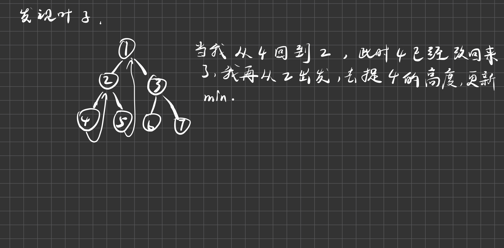

整棵树的最右的叶子结点7没有人去发现，我们需要单独去捉7的高度。从mr跳上来的时候，我们要判断一个mr是不是叶子结点，是才参与更新，不是就不参与更新。如何判断mr.left如果为空它就是叶子结点。

- 代码：


---

- 总结

什么时候一个流程可以定成Morris遍历？如果是定成从左树收集信息，从右树收集信息完了之后做整合的话就不能用Morris遍历。但是如果左树的信息用完之后我不要了，我可以利用一个变量把左树的所有信息继承下去，比如说min，那么我就可以用Morris改。

如果信息可以传递就能改，如果不能传递，就不能改。

## 线段树

### 基本实现

- 线段树是用来更快的区间的修改、更新、查询一些东西。

先看典型的应用场景再看如何推广。给定一个有0~1000下标的数组。做出一个线段树结构，对外提供三个接口。

  add：将arr数组中L~R范围上的数全部+v

  update：将arr数组中L~R范围上所有的数全部变成v

  getsum：将arr数组中L~R范围上所有的数的累加和返回

  也可以把线段树称为区间修改树。在实现中0下标的位置全部弃而不用。要做到三个方法全部都做到logN为复杂度

  

先来建立一些概念。先假设数组的长度是2的次幂。例如数组的长度是8，下标的值对应1~8。要把某一个大范围二分下去的每一个小范围的信息都记录下来，如何实现，用某一个结点记录1~8的信息，这个“信息”具体可能是一个整数值。也就是L~R的一个范围会对应一个信息，这个信息是一个整数值。那么1~8这个范围二分下去的小范围就是1~4以及5~8。以此类推往下分。

分完之后的结构如下。现在随便给你一个范围，如果是正好二分到的范围，那么就可以直接找到。如果不是正好二分到的范围，也可以通过某些组合得到。刚刚我们说“信息”先看成一个整数，现在把信息看成是累加和，那么观察下图可以发现此时线段树的**每一个结点的信息都可以由左右孩子的信息得到**。并且可以计算的值这个树的总结点数在我们的假设的条件下为2N-1个。

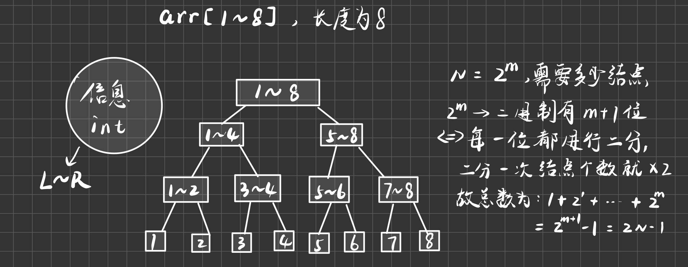

前面我们的假设是arr中元素的个数是2的次幂。现在希望在arr的个数不是2的次幂的时候，都希望构建出来的这棵树是满二叉树。举个例子，假设现在arr只有6个数，我可以认为最底层还是8个结点，但是我认为第7个数和第8个数都是0，并且如果你让我在某个范围修改的时候发现下标已经超过6了，那么我就忽略，我自己是知道我自己的空间是1~6，但是我为了让它变成满二叉树，我们可以通过补0的方式来实现。这么做是因为只有arr的个数刚好是2的次幂的时候才能够每次二分都能够均分，所以当个数不够的时候我们也要一个满二叉树。

并且可以计算得出对于任意arr中元素的个数N，所需要的线段树的结点个数。经过推导可以知道，4N的空间肯定够用，那么我每次底层都准备4N的空间来装树的结点，没用到的浪费了就浪费了。

可以知道，给定1~n的范围，那么总共是n个数，要分到最底下，需要往下分log2 n向上取整层，所以公共有log2 n向上取整＋1层，所以总的结点数如下


这个满二叉树如何表示呢？利用数组即可，因为满二叉树有一个优雅的性质，一个结点的父节点为index/2，左孩子为2index，右孩子为2index+1。


算法的思想：

- 这个树中的每一个结点可以映射为(L,R)，也就是arr数组中的起始下标和终止下标。我们的目标是把4N长度的sum数组填好，要填好sum[0]需要知道sum[1]和sum(2)。如此，我们可以自顶向下利用递归填好sum数组，(L,R)只有当L==R的时候才能够填入sum[x]。所以递归的结构应该为process(int l,int r,int x)，意思是sum[x]位置对应的是L~R范围上的信息。
- 可以不用递归来做。我们可以不直接建立4N的空间，这样做太没脑子。我们可以聪明一点，因为每次我们都是要建立出一个满二叉树，根据上面的总结，结点的个数最多为，并且废弃掉0下标，我们可以直接建立一个大小的数组即可。这样一来我们直接倒着填充这个数组，从最后一个下标开始填，如果不存在就填0，把最后一层的填完之后就可以自底向上迭代的填好这个数组了。

---

现在假设我们已经填好了sum数组。现在提出一个概念：**懒更新**。假如现在要你在1~6范围上调用add方法，使得上面的数全部+4。此时的任务范围是1~6。1~6任务首先在顶部1~8，先看1~6有没有把当前所在的结点的范围包括了，没有的话就向左右孩子下发任务1~6。接着1~6任务来到了1~4结点，此时已经把1~4结点包括了，这次就不再去下发任务了。开始往lazy中填入信息，在lazy信息中找到对应的1~4的位置，把信息（这个信息是4，也就是要add的数值）填入。意味着我曾经收到过一个任务，让1~4所有的数字都+4，但是这个任务我不再下发了。同理，脑补出右边的执行过程1~6的任务会下发到5~6的范围，然后找到lazy对应的5~6范围，填入4。

那么利用懒更新机制可以达到多少的时间复杂度？代价：logN。因为其实就是左边往下走，右边往下走，直到左右两边都无路可走。沿途总有很多的结点会被lazy了。可以把这个过程看成是在拼接任务范围，利用小的范围拼接成任务范围的过程。

现在假设我们已经利用一个一个的小范围拼成了大范围的一个任务，并且这些小范围已经在lazy数组中的相应位置填上了你要add的数值。但是如果上面又下发了一个新任务到了某个范围（位置），此时如果这个范围的lazy不是0，那么说明这个范围的结点之前懒过，现在有任务来了，不能再懒了，我们需要把这个范围的lazy的值下发给它的左右孩子，然后把自己的lazy值变为0，表示我现在开始接活了。然后接着根据这个新任务的范围，决定下发给左右孩子。

例如：假设现在1~256的lazy为7。说明它之前懒住了。现在来了一个1~100的任务到1~256这个结点上，有新任务来了，它懒不住了，下发它的懒信息。左右孩子的lazy全部都更新为7。然后1~100的这个任务发放到1~128这个结点，然后1~128又懒不住了，继续下发lazy给它的左右孩子，然后才接活。以此类推。


- 算法add(int L,int R,int C,int l,int r,int rt)：L~R就是任务，C就是要加的数值。l~r是当前任务来到的范围，rt是l~r范围对应的结点的下标。

- 算法update。当l~r结点收到一个任务L~R上所有的数都更新为C。那么此时l~r结点的lazy直接清空，因为lazy其实就是我之前懒得告诉下边的结点你要去更新你的sum值。现在你都要全部更新成C了，那我还告诉你啥，你直接C * 对应的范围内数的个数不就行了。

- 大范围上的懒东西，无论是懒更新还是懒增加，一定都比子范围上的懒东西要晚！！所以父节点在发懒更新的时候子任务攒的懒更新和懒增加全部失效，sum也直接改了。在一个结点上面如果同时有懒更新和懒增加，懒更新一定是早于懒增加的，所以下发懒东西的时候一定要先发懒更新再发懒增加。

- 算法为什么快？因为一个范围性的信息被我们分割组合了，上级比较大，如果他自己能解决掉这个任务就不把任务下发给下级了，也就是上级lazy住了。如果上级解决不了这个任务再把之前自己lazy的分给下级也是不迟的，所以这样可以极大的提高了时间效率。lazy只是缓住了下级的更新，但是上级的sum值都是正确的。

  

### 俄罗斯方块

  线段树题目

- 想象一下标准的俄罗斯方块游戏，X轴是积木最终下落到底的轴线
  下面是这个游戏的简化版：
  1)只会下落正方形积木
  2)[a,b]->代表一个边长为b的正方形积木，积木左边缘沿着X=a这条线从上方掉落
  3)认为整个X轴都可能接住积木，也就是说简化版游戏是没有整体的左右边界的
  4)没有整体的左右边界，所以简化版游戏不会消除积木，因为不会有哪一层被填满。

  给定一个N*2的二维数组matrix,可以代表N个积木依次掉落
  返回每一次掉落之后的最大高度

如何变成线段树模型：正方形-->落下来会导致有一个区域全部都+边长。落了一个[3,4],会导致3~6范围上全部+4，注意这里不是3~7范围，因为[3,4]这个块不会影响到另外一个块落到7上。那么这个模型需要维护哪些信息呢？sum数组变成了height数组，height数组里面维护的是每个范围对应的最大高度。并且我们是需要update而不是add，不要被前面说的“加”迷惑！因为下图在2下标落下了一个3边长的正方形之后会导致2~4下标范围全部更新为5！


- 做离散化：它落的下标可能很远，不可能建一个非常大的数组。我们把落下来的每个方块对应的左右边界放进一个数组即可。


### 房子染色问题

题目：房子染色问题。

给你1~n个房子，给你m个颜色。[a,b,x]表示a~b范围的房子全部染成颜色x，对应update。[a,b]表示叫你返回a~b范围的房子有多少种不同的颜色，对应query。那么对应于每个区间我要维护什么信息呢？我关心的是这个区间里面使用了些什么样的颜色，别的我不关心。一个区间里面使用了什么颜色可以用一个boolean类型的数组来表示，数组里面的每一个位置对应的是一个颜色有没有使用。这样一来父区间使用的颜色就可以用左右孩子的两个boolean类型的数组或运算得到。


### 最大线段重合问题

题目：最大线段重合问题。[1,3]代表在1~3范围上描一段，[2,4]表示在2~4范围上描一段。那么现在两段线段在2~3上是有重合的，这个重合信息记为2。那么[1,3]可以看成是在add(1,2,1)，也就是在1~2上加1，因为[1,3]在1~3画了一条线，不认为3被盖住了，其实这种边界问题见仁见智。父区间的重合信息其实是两个子区间的重合信息的最大值。依然需要进行离散化。

解释一下[1,3]映射成add(1,2,1)的原因。看下图，如果我们把[1,3]定义为就是在严格的1~3划线，那么此时跨越了，3个点，但是我们知道[1,3]其实只有2个单位的长度。所以跨越的点多了。并且基于这样的事实：我们把上面的三段线段整体向左平移一丢丢，其实整体的线段的重合数也是不变的。所以我们把[1,3]映射为在1的左边一点，划到3的左边一点，这样一来就包括了1而不包括3。此时某一个下标的位置例如1就代表着一段从1的左边一丢丢，向右延伸1单位长度的线段。这样一来[1,3]映射为add(1,2,1)，即在1代表的这段线和2代表的这段线对应的个数都加1。

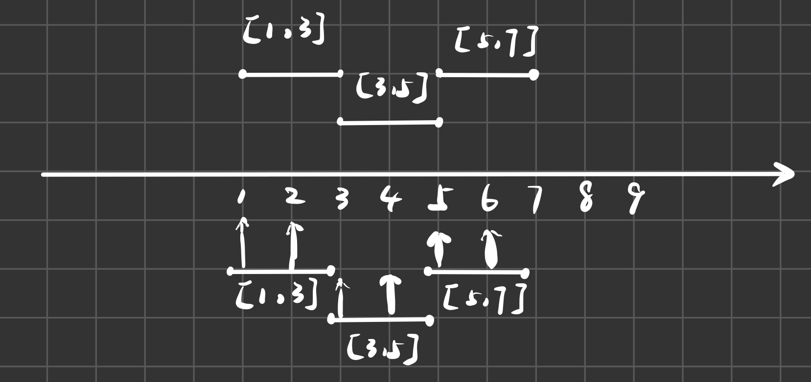

上面这题用线段树解太重了，有一种更好的方法。不管哪个线段，都把每一个线段开始位置排个序，如果开头一样，谁前谁后无所谓。例如[4,6],[1,10],[2,5],[1,7]，排序完了之后就是[1,10],[1,7],[2,5],[4,6]。

准备一个小根堆。我们从[1,10]开始，每次拿出结尾的位置10。如果堆为空就直接进去。如果堆非空就看看小根堆的最小值是不是小于线段的开头1，如果**小于等于**1，那么小根堆就弹出最小值，直到堆顶是一个比1大的数，10就入堆。记录此时堆的大小。等到所有的线段都遍历结束之后，之前所有的状态中，堆的最大的size就是答案。

- 小根堆按照r来排序，r小谁就小。
- 开头一样的，一定是重合的。把开头一样的先一股脑放到小根堆，堆顶的一定是r最小的，现在来了一个开头不一样的，如果这个开头不一样的和堆里面的有重合，那么开头一定小于小根堆堆顶的r。

小根堆里面放的元素的含义：之前出现的线段还有哪些会对此时的线段产生影响的结尾都在小根堆里面。

### 矩阵最大覆盖

对上面的线段重合问题继续扩展。给你一堆矩形，矩形可以用两点来表示，这两点是矩形的斜边，做直角的时候按照直角坐标系直上直下来画。也就是四个变量，最右边到哪里，最左边到哪里，最下面到哪里，最上面到哪里。要求出矩形最多重合的数量。

我们可以按照矩形的底来遍历，越靠下的矩形越先遍历。我们可以把矩形按照底排好序放在一个数组中。从底最小的矩形开始遍历。我们每遍历到一个矩形R，可能和这矩形R产生相交的矩形X的顶部一定是超过这个矩形R的顶部的。我们把这些顶比R的底低的矩形略去，只把R以及底小于R、顶高于R的底的矩形参与运算，把有关的矩形放到一个TreeSet中，按照左边界排序。此时把他们在x轴上跨度拿出来，转化成线段重合问题即可。

---

总结：

- 什么样的题可以用线段树解？区间范围上我要统一add或者update或者query，如果父范围的信息可以由左树和右树的信息直接加工得到，并且这样的信息是不需要调研具体的左树的状况和右树的状况的就可以用线段树做。也就是我们不需要跨越左孩子和右孩子来得到父亲的信息，父亲的信息可以直接由左右孩子的信息得到。

  例子：例如我要求一个范围上出现最多次数的一个数，假设现在左孩子1出现最多，10次；右孩子2出现最多，20次。但是可能左孩子中可能有3出现了9次，右孩子中3出现了19次，这样一来父亲出现最多次数最多的数应该是3才对。也就是说此时父节点的信息需要对左孩子和右孩子中具体的信息进行整合才能得到，也就是说需要具体了解左右孩子中每个数出现的状况。这种情况就不能使用线段树。


## 数组累加和问题 三连

---

小插曲：假设要设计一个系统，这个系统的功能是让你提供不同的uuid。这个系统可能全球都在用，并且用的极其频繁，只需要你能够一直提供不重复的uuid即可。要求要从原理上杜绝相同，那么说明hash的方法是不行的，因为hash只是说以极小的概率会产生碰撞，但是原理上是可能的。由于调用的很频繁，所以你可能不是一台机器提供服务，而是多台机器提供服务。

这样行不行：每台机器上都有ip地址、mac地址、或者hostname。我拿ip去拼现在的纳秒时间。但是这样每台机器上的时间要强同步，并且每台机器的ip要不一样。

我们可以这样设计。类似于dns服务器的架构。全球有一个皇帝机器，可以无穷无尽的给出uuid的范围。按照一个树形结构扩展。孩子结点可以向父节点一次性要很多很多的uuid的范围，然后自己再去分配。

---

**数组累加和问题1**：给你一个数组arr，**里面都是正数**，再给你一个数sum。我想知道累加和正好等于sum的子数组最长是多长。

如下图，sum为6的最长子数组的长度就是6。

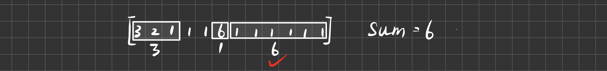

注：子数组、子串都是连续的。子序列是可以不连续的。

在滑动窗口的时候说过，累加和和范围是有单调性的，这个数组都是正数，累加和与范围是严格单调性。只要发现了单调性，就一定可以找到一个很优雅的解法。如果发现了单调性，要么是左右指针往中间跑。要么是一个窗口从左往右滑动。

这一题我们只需要一个窗口从左往右滑动就可以解题。只需要分三种情况，当窗口内的sum<目标sum的时候，R往右移动。当窗口内的sum>目标sum的时候L往右移动。当窗口内的sum==目标sum的时候，更新maxlen，L往右移动。（这里L和R谁先动都可以）

原理：当你窗口在左边界是x，并且右边界R能够扩到使得窗口内数组的累加和是sum，那么以这个左边界开头，有且仅有这个子数组可以使得sum为目标sum。所以这个时候可以更新maxlen。并且右移窗口的左边界。因为单调性，所以我们可以大胆的直接丢掉右边的那些没试过的位置。

---

**数组累加和问题2**：给你一个数组arr，**里面有负、有正、有0**，再给你一个数sum。我想知道累加和正好等于sum的子数组最长是多长。

这一题单调性就没有了，数组范围增大累加和是可能变小的。 我们把结果数组分成几类，arr中每一个位置开头的数组算作是1类，这些所有类的最大值就是总的最大值。或者按照子数组的结尾来进行分类。在上面的解法中，我们就是用了每个位置开头的答案取最大值。

这一题我们按照子数组的结尾来分类。假设以i位置结尾，并且0~i的累加和是1000。我们假设目标target是200。如果0~m的累加和是800，并且m是最小的使得0~m累加和是200的下标。那么从m+1到i的累加和一定是800，并且是以i结尾最长的。

我们用一个map来记录每一个累加和最早出现的位置。**并且最开始的时候要有（0.-1）这条记录**，否则如果0~i正好是1000，那么你就要找和为1000-1000=0最早出现的位置。初始的记录有时候也设置成0，这次设置成-1，具体设置为什么要根据具体的题目求什么，例如这题求的是长度，你从map中查出来的答案是m，那么答案就是i-m，你们如果要查如果你0~i本身就是1000，你要找sum为0最早出现的位置，初始只能设置为-1，因为只有是-1，i+1才是0~i的长度。

- 加（0，-1）这条记录是为了使得我们的转化可以完全等价，因为如果不加这条记录，子数组是前缀的时候这种情况是被忽略的。如果这题关心下标且只要找**正好等于**某个累加和最早的位置对应的下标，那么就用HashMap，初始化就加一个（0，-1）。如果这题关心下标且只要找**小于等于**某个累加和最早的位置对应的下标，那么就用TreeMap，初始化就加一个（0，-1）。如果不关心下标，只关心前缀和这个值，那么就用TreeSet，初始化加一个0进去即可。

继续拓展：给你一个数组arr，**里面有负、有正、有0**，只有1和2的数量一样的多的子数组才是达标的，问所有达标子数组中长度最长是多少。

可以转化成数组累加和问题2。把所有非1和2的数全部变成0，把所有的2变成-1。然后变成在这样的一个处理后的数组中求累加和为0的最长子数组。

---

**数组累加和问题3**：给你一个数组arr，**里面有负、有正、有0**，以及一个数k，此时所有sum小于等于k的子数组都是达标的。问所有达标子数组中最长的长度是多少。

先定义一个概念：以i开头的的所有子数组，使得累加和最小的子数组的信息我要捕获到，信息有：累加和是多少，你是从i到哪的。

累加和记录在minsum[i]中

从i到哪记录在minsumend[i]中

如何填这些信息就是一个动态规划的过程。

```java
minsum[i]=minsum[i+1]<=0?arr[i]+minsum[i+1]:arr[i];
minsumend[i]=minsum[i+1]<=0?minsumend[i+1]:i;
```

得到了我们的预处理结构之后。我们把这题按照每个位置开始分类。每一个位置我们都可以扩出一块区域，如果没超就继续扩，直到阔不动了就停。但是停了之后不从下一个位置从头扩，我们要充分利用前面一个位置扩出来的遗留信息。

如下图所示，也就是说右边界m不回退。


第三连的广泛流传的解法：时间复杂度O(N * logN)

用的是有序表的解法。我们的流程是列举子数组的结尾然后求一个答案。假设sum是前缀和数组，由于sum[i]=sum[m+1,i]+sum[m]。故sum[m+1,i]=sum[i]-sum[m]，我们要sum[m+1,i]是<=k的，由于此时sum[i]是已知，等价于sum[i]-sum[m]<=k  ==>  sum[m]>=k-sum[i]。只要我们找到>=k-sum[i]最早出现的位置m，那么sum[m+1,i]对应的子数组长度i-m也一定也是累加和<=中以i结尾最长的。所以找以i结尾的子数组中<=k最长的这个问题等价于找>=sum[i]-k出现的最早的位置的下标index，i结尾的答案就是i-index。

那么现在问题来到我们怎么找到前缀和>=某个数最早出现的位置？**我们可以把前缀数组进行加工维持一个只升不降的趋势**。如下所示。**这样的话我们就可以利用二分来求大于等于某个数出现的最早的位置了**。用有序表也有得到>=某个数最早出现的位置，做法就是如果此时的sum>=这个数，那么我就把这个数加到有序表中，下次再来一个数如果查表发现存在了，那么就不管他。

```[]
arr [3,-1,6,-4,2,3, 4]
sum [3, 2,8, 4,6,9,13]
sum'[3, 3,8, 8,8,9,13]
```


## 哈希函数有关的结构和岛问题

认识哈希函数 -> out f(in data)    输入一个in类型的变量data，输出一个out类型的结果。
1)输入参数data,假设是in类型，特征：可能性无穷大，比如str类型的参数
2)输出参数类型out,特征：可能性可以很大，但一定是有穷尽的
3)哈希函数没有任何随机的机制，固定的输入一定是固定的输出
4)输入无穷多但输出值有限，所以不同输入也可能输出相同（哈希碰撞）
5)再相似的不同输入，得到的输出值，会几乎均匀的分布在out域上
重点：第5条！

- hash没有一点的随机成分。hash函数的离散型和均匀性其实是一码事。

假设有一个40亿个无符号整数的文件，每一个整数4字节。假设只有1G内存。想要统计哪个数字出现的次数是最多的。我可以用这1G的内存做一张hash表出来。这个hash表中的key代表某一个数，value代表key出现的次数。假设把key和value都弄成无符号整数。拿这1G内存做hash表最多可以放几条记录？一条键值对记录8byte。40亿条整数如果每一个每一个都不一样，那么我们就需要有40亿条记录。此时我们需要320亿字节---》32G。也就是说我只有1G内存的话按照这种方法可能会内存溢出。也就是说当我的内存中存的记录数不超过1亿条的时候，内存不会爆。

思路：由于内存只有1G，我们可以把40亿个整数分成40份，这样一份只有大概1亿的整数，我们把1亿个整数放到内存里面是可以的。但是40亿个整数怎么个分法是很有讲究的。因为我们希望若干数值为x的数即使分布在40亿整数的不同位置，他们也能被分到一个文件里面。这一点哈希函数是可以做到的，因为数值相同的数经过相同的hash计算得到的值一定是相同的。那么我们把这40亿个整数一个一个的进行hash运算，算出来的结果%40，分到40个不同的文件。由hash函数的性质可知这40个文件里面的元素个数一定是差不多的。然后我们逐个把40个不同的文件分别求出其中出现次数最多的数，最后得到答案。


---

经典的hash表的实现。就准备17条记录。对于每一个输入求hash然后模17。这里的hash表记录的value其实是一个指针，把所有的映射到这个位置的数全部串起来。但是这样会有问题，当我的数越来越多的时候，链也会越来越长。并且我们知道这些链表的长度一定是均匀变长的。当某一条链的长度超过6了，那么大概率其它的链长度也超过6了。这个时候我们进行扩容。我们把hash表的记录数增加，然后重新计算原本hash表中元素的位置，重新放到新的hash表中。

计算hash -》O（1）、取模-》O（1）、到一条链中找 ，如果链长度都不超过6-》O（1）、扩容分摊之后也只是O（1）

---

### 布隆过滤器

1)利用哈希函数的性质
2)每一条数据提取特征
3)加入描黑库

布隆过滤器有啥用？类似于实现一个黑名单系统，并且是没有删除行为的。应用场景：爬虫、网络上禁止的资源。

最暴力的实现-》hash表，但是太浪费内存。而布隆过滤器可以极大地节约空间。

---

设计：有一个类似于位图的东西。位图就是位数组。可以直接拿int[]类型的数组去拼出位数组。但是如果位图要求很大，我们用int[]类型来表示就不够了。这个时候我们可以用一个二维数组来表示位图。

布隆过滤器先搞出一个m长度的位图，初始状态全0，全白的状态，如果有一个位变为1，就是一个描黑的状态。

对于一个url如果我们要加入到黑名单中，我们准备k个hash函数，算出k个hash值，模m把对应的位置涂黑。

对于另外一个url，只有k个hash值模m之后都是黑的，才判断它在黑名单里。

布隆过滤器是有失误率的，它可能会冤枉好人，但是它一定不会放过任何一个坏人。

现在出现的问题：位图选多大？选多少个哈希函数？你知道的只有样本量。通过样本量事先定义好m和k，因为不存在扩容的操作。并且和样本类型无关，因为我只需要hash函数把这个类型接收进去然后算出值即可。我还需要知道你预期的错杀率，我才能对应设计布隆过滤器。甚至如果你不允许错杀率，那么就不能使用布隆过滤器。所以我们需要知道样本量n以及失误率p。

---

布隆过滤器的三个重要公式。

m我们可以明显的想到：m越大肯定失误率越低

k如果很小，那么提取的特征就少，就容易失误。但是提取的特征太多了，m就不够你用了，失误率反而上来。

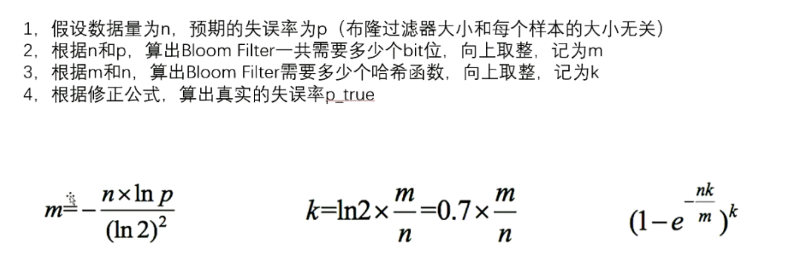

算出来这些值之后还有一个重要的问题

k个hash函数怎么找，还要求k个hash函数是独立的。

很简单，hash(x)=f(x)+k*g(x)

### 一致性哈希

- 解决数据分布式存储的一种方案

假设数据层有三台机器。对于每一个任务，我可以经过hash运算%3来判断在哪一台机器。但是这种方法在查询一个范围的数据的时候就很麻烦。物品需要在三台机器分别找出来，然后merge。

如果在业务上中低高频的key量都不少，那么经过hash函数的映射就可以实现几台数据存储服务器是负载均衡的。但是这样的设计在做服务器扩容的时候数据迁移代价很高，需要全量的迁移数据。这是无法接受的。这是传统的架构的问题。一致性哈希就是用来解决这个问题的，一致性hash可以做到负载均衡也可以做到迁移代价很低。

把hash函数的返回值范围想象成一个环。假设三台机器按照hostname进行区分，把这三个hostname分别进行hash运算，然后体现在环上。注意：不一定会均分这个环，但是现在我们先假设他们三个均分了这个环。然后假设现在我们要找一个key属于哪个机器，那么就把这个key进行hash运算，算出来的结构顺时针寻找，找到的第一个机器就是它归属的机器。

这样的话在一台机器下线的时候只需要把它管的数据给到他顺时针的下一个机器即可。机器上线的时候就把他所属的数据从它的顺时针的下一个机器上拿过来即可。

那么如何找？我们可以把机器的hostname算出来的hash值排序一下，做成一个路由表。上层在拿到key算出hash值之后，利用这个路由表决定去哪个存储服务器上，找到>=num最左

现在要解决几个问题。如果一开始的机器数量太少，算出来的几个hash值可能会离得很近。哪怕一开始均分，突然下线一个机器，马上就不均分了。

一致性hash最关键的技术：虚拟结点技术。之前我们假设是直接拿机器的hostname去抢环，现在我们给三个机器分别分配1000个字符串。用这些分配的字符串去抢环。当一个key到来的时候，算出它的hash值，看看顺时针先找到哪一个字符串，这个字符串属于谁，这个key就存到哪台机器。

那么如果机器的性能不一样，给性能好的机器多分配几个结点就等价于分配了权重了。

---

知道每一个商家的经纬度，如何知道任意给定的一个位置周围1km、2km有多少商家。我们可以把整个地图划分为很多的小格子，是一个二维平面。我们可以把商家具体存在哪个格子的信息记录下来。当我们得到一个任意的位置的时候我们可以通过经纬度算出它属于哪一个格子，然后我们可以顺着这个格子的位置扩充出更多的格子。我们只需要把这些格子的商家的信息拿出来，然后一个一个计算看看是否符合预期。

### 并行算法

- 岛问题：一个只有0和1两种数字的二维矩阵中，上下左右能连成一片的1，算一个岛返回矩阵中，一共有几个岛

- 下图：2个岛

  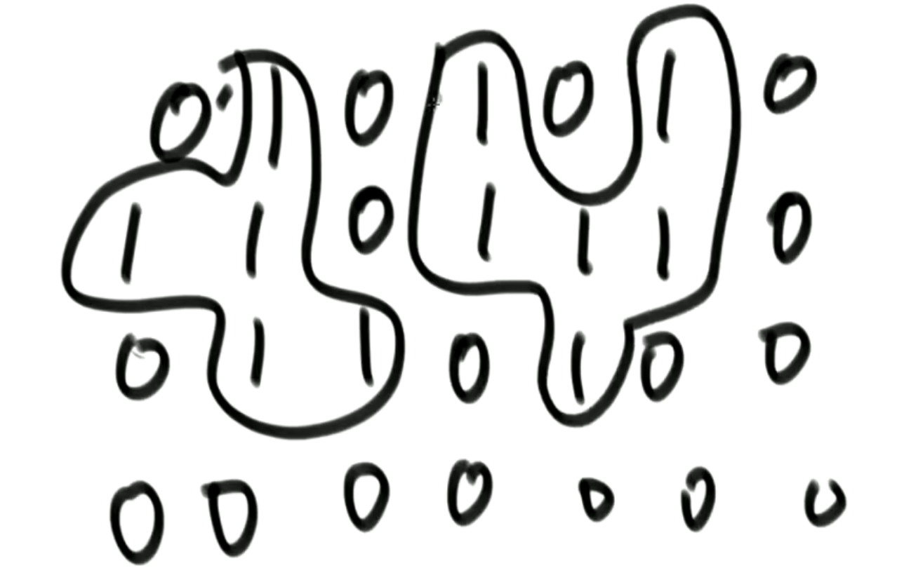

- 代码： 有感染行为   O(N)


没有比上面复杂度更好的方法，因为至少要把矩阵看过一遍。

用并查集来做。可以把一个图拆分成很多小区域分别交给cpu去跑。cpu只需要记录边界的信息即可，最后全部拿到一起用并查集合并。


## 如何解决资源限制类题目

- 技巧：

  1)布隆过滤器用于集合的建立与查询，并可以节省大量空间（已讲）
  2)一致性哈希解决数据服务器的负载管理问题（已讲）
  3)利用并查集结构做岛问题的并行计算（已讲）》
  4)哈希函数可以把数据按照种类均匀分流
  5)位图解决某一范围上数字的出现情况，并可以节省大量空间
  6)利用分段统计思想、并进一步节省大量空间
  7)利用堆、外排序来做多个处理单元的结果合并

---

题目1：

- 32位无符号整数的范围是0-4,294,967,295，现在有一个正好包含40亿个无符号整数的文件，可以使用最多1GB的内存，怎么找到出现次数最多的数？

用hash做离散分到40个文件


---

题目2：

- 32位无符号整数的范围是0-4,294,967,295，现在有一个正好包含40亿个无符号整数的文件，所有在整个范围中必然存在没出现过的数。可以使用最多1GB的内存，怎么找到所有未出现过的数？
  【进阶】
  内存限制为10MB,但是只用找到一个没出现过的数即可

  内存限制为10KB,但是只用找到一个没出现过的数即可

  内存限制为3个变量,但是只用找到一个没出现过的数即可


用位图可以比map省下32倍的空间，用一个比特位表示一个数出没出现过。

如果只有10MB呢？假设现在只有3KB。可以做出750长度的int类型数组并且不会爆。接着找离750最近的2的某次方--》2^9=512。所以我们知道我们把数组长度定位512的时候，内存不会爆。所以我们可以把int类型的取值范围的2^32均分为512份。也就是一份有2^23这么大的范围，。然后我们遍历这40亿个整数，遍历到每一个整数我们算出它属于哪份，对应的那份就++。我们知道，就算40亿个整数都不相等，也无法把把int类型的所有取值都取过一遍。也就是说我们均分的这么多份中，一定有不足2^23的。那么我们也就知道了在这个范围上必定缺数字。然后继续在这个范围上再分出512份，以此类推，直到有一次，这个范围已经可以全部放入512大小的数组中。


如果只有三个变量？三个变量，l，r，mid（mid不参与变量，直接通过l和r算）。从头遍历一遍文件，考虑在l~mid范围上满还是不满，用第三个变量count来统计。一直二分。


---

题目3：

- 有一个包含100亿个URL的大文件，假设每个URL占用64B,请找出其中所有重复的URL
  【补充】
  某搜索公司一天的用户搜索词汇是海量的（百亿数据量），
  请设计一种求出每天热门Top100词汇的可行办法

哈希分类到不同的机器上，在机器上继续哈希到不同的文件中，然后在单独的每个文件中统计url出现的次数。

top100如何知道？在每个小文件中找出top100，然后总的合起来找到一个top100。方法就是每次都取小文件的top的top。利用二维堆可以比这个方法快。二维堆就是把每个单独的堆的顶部再组成一个堆。


---

题目4：

- 32位无符号整数的范围是0~4294967295，现在有40亿个无符号整数，可以使用最多1GB的内存，找出所有出现了两次的数。

也是用位图，不过这次用两个比特来表示一个数出现了几次。


---

题目5：

- 32位无符号整数的范围是0~4294967295，现在有40亿个无符号整数可以使用最多10MB的内存，怎么找到这40亿个整数的中位数？

中位数指的是如果排完序之后的中位数

和题目3一样的思路，先按照你给我空间大小把42亿的范围给分了。然后统计在每个范围上数出现的次数。统计完成之后一顿累计，找到哪个范围加上之后超过了21亿。假设加之前是19亿，加上之后是25亿。那么我们就可以推断出我们要找的数是这个范围的第2亿小。

---

题目6：

- 32位无符号整数的范围是0-4294967295，有一个10G大小的文件，每一行都装着这种类型的数字，整个文件是无序的，给你5G的内存空间，请你输出一个10大小的文件，就是原文件所有数字排序的结果。

按照给定的空间我计算出合适大小的map和一个小根堆，假设小根堆可以放100个数。map存每一个数字在堆里面的下标，堆里面的结点包括数字以及出现的频次。过完一遍文件只有小根堆就把top100的数搞定了。然后再去一遍一遍的遍历。

## 有序表的原理、应用、扩展

- 搜索二叉树：搜索二叉树一定要说明以什么标准来排序经典的搜索二叉树，树上没有重复的用来排序的key值。如果有重复节点的需求，可以在一个节点内部增加数据项用来表述重复出现了几次。

- 经典的搜索二叉树为什么值是不重复的？因为如果要考虑平衡性的话，有左旋右旋操作，平衡性是保持不住的。

---

- 搜索二叉树查询key（查询某个key存在还是不存在)
  l)如果当前节点的value==key,返回true
  2)如果当前节点的value<key,当前节点向左移动
  3)如果当前节点的value>key,当前节点向右移动
  4)如果当前节点变成null,返回false

- 性能取决于输入状况

- 这个时候我们引入平衡机制，有左旋和右旋的概念。左旋右旋的概念是针对头节点来说的。Right(Node x)意思就是x结点要往自己的右侧方向倒下去。

Java中TreeMap的底层是平衡搜索二叉树。和hashMap的区别是，hashMap的增删改查都是O（1）的时间复杂度，TreeMap的增删改查时间都是O(logN)

---

有序表是一种接口名，是一种规范：

1. key按序组织
2. 增删改查O(logN)

AVL树、SB树、红黑树都可以完成有序表的接口功能。

AVL树拥有最严格的平衡性，任何结点的左右数的高度差小于2。

SB树，任何叔结点所拥有的的节点数不少于它的任何一个侄子结点。

如下图，b结点的侄子结点是f和g。b的节点数有3个，不小于f和g的，所以达标。

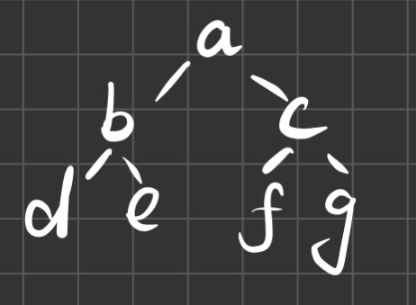

两边的差距最多的为n:2n+1。差距不是特别悬殊的时候时间复杂度就是logn


- 红黑树：

  1. 每一个结点不是红就是黑
  2. 头节点是黑、叶节点是黑
  3. 红结点的子一定是黑结点
  4. 从任何结点到它的每一个子，所有路径上黑结点的数量一样多。

  

红结点的子一定是黑说明两个红结点不能相邻。最长的链是黑红交替的。最短的链全黑。因为最长的链和最短的链黑结点一样多，并且长链是黑红交替，说明长链短链相差的长度一定不会超过两倍。

无论是AVL树、SB树、红黑树，都设计了属于自己的调整策略。但是底层是会使用左旋和右旋这两个基本动作。在插入、删除、查找的时候都和二叉搜索树无二。只是在删完了或者插完了之后会有额外的动作来进行平衡。

AVL树是往上去调整整条链，看看有没有结点的平衡性被破坏。只查受这条链上的结点有没有收到影响。

****

如果是删除一个结点，并且这个结点是有左右孩子的。例如下图画插的是要删除的结点。白色箭头是它的后继结点顶上它的位置。要检查的链应该是后继结点原来的位置往上检查，而不是后继节点来到的位置开始检查。如何理解？可以看成就是删除了这个后继结点，所以要从那里开始查，因为那里少结点了嘛！

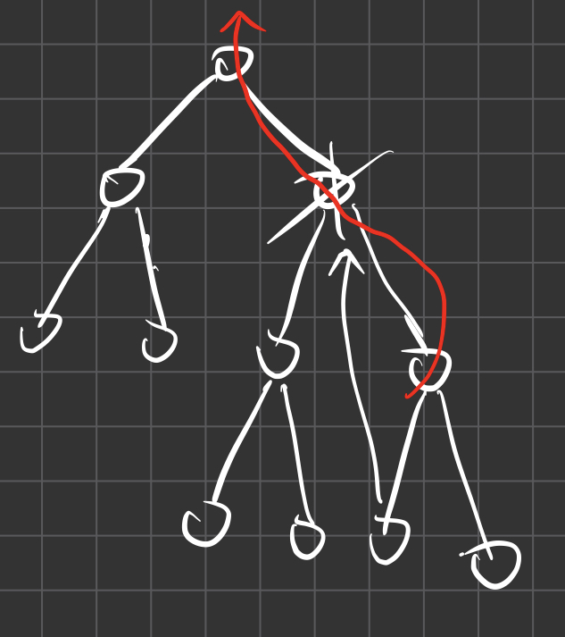

---

AVL树、SB树、红黑树，都是一样的，都是往上走同一条链来看看要不要调整平衡。只是发现不平衡时候的调整动作有差异。


### AVL Tree

怎么去查那一条链上的平衡性？只有左右旋两个动作。有四种违规情况，LL、LR、RL、RR。四种违规情况只会中一个，因为每次增删结点我们都查。

一个结点的左右树的高度差如果超过1，那么就是违规了。

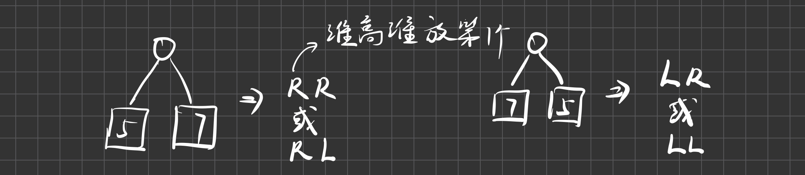

第一个字母是L之后就往a的左树走，也就是从a往左边走到b，然后看看是b的左边还是右边导致不平衡的。

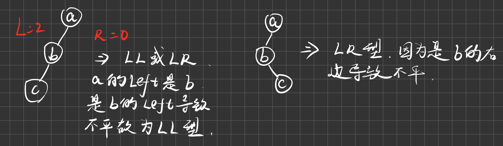

在左右子树都比较大的时候如何确定是LL还是RR呢？看下图，如果是插入导致违规，E子树和F子树一定只有一个是6高度。因为现在是添加了一个结点违规了，如果两个都是6的话说明之前就违规了，矛盾！那么E子树和F子树谁的高度是6谁就违规！

如果是删除导致违规，那么E和F可能都为6高度。


现在假设我们知道了一个结点是LL或者是LR违规。如何调整？

圆圈是结点，方块是子树。

如果是LL型，直接对x结点做一个右旋。


如果是LR型，让x的孙结点z上到顶部。目标是要让z上到顶部，根据下图，可以先让y左旋，再让x右旋。因为y左旋之后情况就变成LL型了。

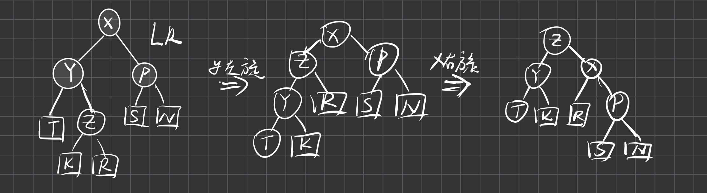

左旋右旋调整的代价是O（1），四种违规情况最多中一个，最多调整两次。沿着一条logn长度的链往上检查。所以总的调整平衡性的时间复杂度是O(1)。


- 总结：

  LL、LR、RR、RL。LL和、LR一组；RR和RL一组。不可能同时遇到两组，因为要么左孩子高要么右孩子高。

  假设我们中了LL、LR这组。假设x.l.l的高度和x.l.r的高度不一样，那么如果x.l.l高，就对x做一次右旋。如果x.l.r高，那么就做两次旋转。如果x.l.l的高度和x.l.r的高度一样，那么就对x做一次右旋，也就是只能当成LL型进行处理，不能当做LR型进行处理。

  如何简单理解？如果出现x.l.l的高度和x.l.r的高度一样，**说明x的左树的高度违规是因为右树删了结点导致的**。右侧少了结点那么我们就把x右旋下去，十分合理！！

### Size Balance Tree

如果一个结点的左孩子的节点数不如他右孩子的左孩子的个数多，就是RL。

如果一个结点的左孩子的节点数不如他右孩子的右孩子的个数多，就是RR。

如果一个结点的右孩子的节点数不如他左孩子的右孩子的个数多，就是LR。

如果一个结点的右孩子的节点数不如他左孩子的左孩子的个数多，就是LL。

m（x）用来检查x的左右孩子违规与否。发现LL型违规之后，x进行一次右旋，然后m（x），x（b），只要是换过左右孩子的结点都需要重复调用m函数检查是否违规。

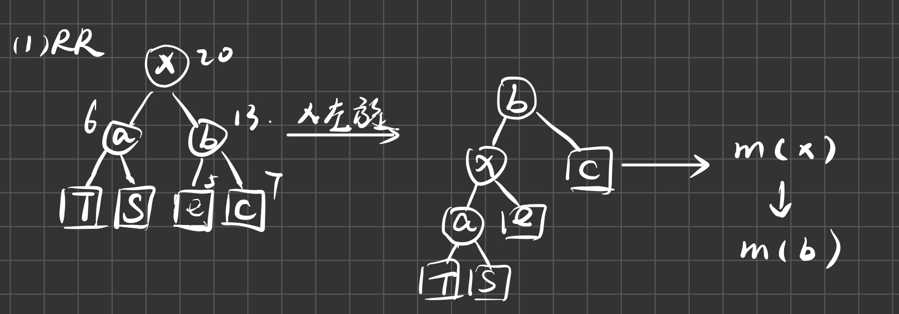

RL型也是先进行两次旋转，把孙子转到顶部。然后发现有三个结点的子发生了变化，继续调用m函数。上游结点的递归最后去做。

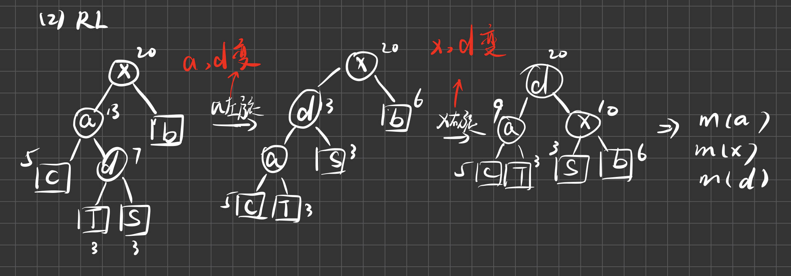

- 为什么size balance tree比AVL快？因为size balance tree的平衡性模糊，avl树的扰动大。

- 高手在一个结点删除的时候不做平衡性调整，这样做的确有可能会越删越不平衡，一律把平衡的实际放在add的时候。在某一次add的时候由于有递归行为，所以可以把之前由于删掉的不平衡的结点全部调整成平衡的。


### Skip List

跳表可以用用来实现有序表，性能也是logn水平。但是它的实现和搜索二叉树没关系。

跳表是由Node串成的，Node内部有一个List<Node>也就是有多条往外指的指针。跳表开始的第一个结点的key是null，标记为整个系统的最小值。跳表最左侧的结点认为是弃而不用的。一开始结点只有一条往外指的指针。

加入结点的时候先建出一个新节点，并且默认有一条指针。然后随机的决定要额外生成多少条指针。调用01随机生成器，是0就增加一条指针，是1就停。然后一开始的那个弃而不用的结点如果发现有一个新的结点的层数比自己的层数高，一定要保证自己的层数和新出来的那个最高层数一样。

- 加入结点的时候，从第一个结点的最高层开始看看能不能往右跳，往右跳的条件是往右跳到的那个结点要小于等于自己。如果不能再往右跳了就往下走一层，然后继续往右跳。如果发现右边没有结点，就还是在当前这个结点，继续往下跳，重复上面的过程。
- 查询的时候同理。


可以发现第1层，也就是最底下的一层串了所有的结点。越高层跨度越大。由于是摇色子决定拥有的层数，所以第一层1/

2，第二层1/4，第三层1/8。。。跳表其实是从高层到底层建立了索引关系。为什么可以保证是logn？因为完全凭运气来决定自己占了几层。

### 红黑树

1. 一个结点非红即黑
2. 头节点是黑、叶子结点也是黑
3. 红结点的黑子结点不能是红
4. 从任何一个结点出发，到它能到达的叶子结点的所有路径中，黑结点的数量一样多。

增删改查都和搜索二叉树一样。区别就是增完删完在之后要从受影响的结点开始一条链上去都做有效性的检查。但是红黑树的平衡性太容易被破坏了！破坏红黑树的平衡性的情况非常的多！插入的情况下，违规五种可能。删除的情况下违规的可能性8种。总共13情况。

为什么红黑树这么麻烦但是还这么著名呢？因为它的平衡性很模糊，对增删没有这么敏感。我每次都检查是否违规，但是我并不是很经常去调整。也就是说当你在磁盘上实现了一种数据结构，对于增删很敏感，那么就最好不用像AVL树这样对增删敏感的数据结构，就应该使用sb树或者红黑树。更进一步说，如果你对磁盘的IO真的很敏感，敏感到你愿意牺牲一些查询的常数项的时间，那么我们就应该使用调整次数更少的B树和B+树，这是多叉树。

redis为什么选择跳表来作为底层的数据结构？因为跳表这样的结构是一层一层的线性结构，比较好进行序列化。

### 题目

题目1：

给你一些数组，长度不一，每个数组里面是有序的。整体是一个二维数组，但是每一行有序。想找到一个**最窄**[a,b]，是一个闭区间，使得上面的所有数组都至少有一个数命中在这个区间里。最窄区间可能有多个，我想要开始序号最小的那个区间。

流程：第一回，把所有数组的第一个元素（最小的），放到有序表中，然后得到一个区间，这个区间就是有序表中的最小值和有序表中的最大值，用一个变量记录此时的区间。接着 从有序表中弹出最小的，弹出来的数来自于哪个数组，就从哪个数组再取一个扔到有序表中，再次生成一个新的区间，和原本记录下来的那个区间比较，如果更窄才更新，大于或等于都不更新。

原理：我们本质是在寻求，如果以某一个数字为区间的开头，这个区间最窄是多少。

这道题完全不需要自己去改写有序表，我们只需要拿系统的来用即可。

---

题目2：

- 给定一个数组arr,和两个整数a和b（a<=b)
  求arr中有多少个子数组，累加和在[a,b]这个范围上
  返回达标的子数组数量

假设我们知道0~i的累加和是100，我们要求p~i的累加和落到[10,30]的范围，那么0~p-1的累加和就落在[70.90]。

反过来，假设0~i的累加和是100，如果我们知道0~j累加和范围落在[70~90]范围上，那么必然存在j+1~i累加和落在[10.30]范围上。

所以，要求以i结尾的子数组中有多少累加和落到[10,30]的范围，本质上就是求0~0,0~1,0~2,....,0~i-1这些数组中有多少个累加和范围落在[70,90]范围上。

如果我们把有前缀和数组sum，sum[i]代表从0~i范围的累加和。把上面的100换成sum[i]，假设目标范围是[a,b]，那么以i结尾的这部分答案就是sum[0...i-1]有多少个值落在[sum[i]-b,sum[b]-a]。

我们发现，我们要找到sum[0...i-1]中有多少个值落在[sum[i]-b,sum[b]-a]中，可以一个一个遍历sum数组，但是这样需要O(i)的时间复杂度，如果i从0~n都要加起来，那么就是O(n²）的时间复杂度。太慢了！

如果我们能够在二叉搜索树中允许重复值，并且有一个字段all可以记录每个结点接收了多少数字的话，要求多少个值落在[sum[i]-b,sum[b]-a]其实就是log(N)的时间。注意，你所增加的all字段在调平衡的时候也需要注意交换，把all信息维持对。


---

题目3：

- 有一个滑动窗口（讲过的）
  1)L是滑动窗口最左位置、R是滑动窗口最右位置，一开始LR都在数组左侧
  2)任何一步都可能R往右动，表示某个数进了窗口
  3)任何一步都可能L往右动，表示某个数出了窗口
  想知道每一个窗口状态的中位数（严格中位数，如果是偶数个，需要返回（上中位数+下中位数） /2）

这题本质上就是要求：你的结构允许增加、删除、并且查询第k小的数是什么。

还是需要一棵维持了all字段的允许重复值出现的搜索树。要查第k小，只需要一个递归即可。

## AC自动机、卡特兰数

### AC

AC自动机解决：在一个大文章中，我有多个候选串，我想知道这个文章中命中了哪些候选串。

先把这么多个候选串全部都加到前缀树上。但是前缀树的结点多了一个字段，叫做fail指针。头节点的fail指针认为规定指向空。第一级孩子的fail指针认为规定指向头。

fail指针的设置时机是当你把所有的候选串都加好了之后，再通过宽度优先遍历的方式设置fail指针。

1. 初始情况，head.fail=null。

2. 当来到一个结点x，如果x.fail==null，那么直接把x结点的孩子的fail指针指向头

3. x.fail != null。如果x的某个孩子X是b，如果x.fail 也有某个孩子Y是b，那么x的这个孩子X的fail就指向Y。

   如果x的某个孩子X是b，但是x.fail 没有某个孩子Y是b。那么就继续到x.fail.fail继续去找看看有没有某个孩子是b。依次类推，如果走到null都没有找到，那么就指向头。

   

fail字段的本质是什么？我们知道前缀树的一个结点代表一个前缀字符串X，以及一个结尾字符x。fail字段代表的是，如果必须以字符x结尾，哪一个另外的前缀串和我以e结尾的后缀串相等并长度最大。

上面那个流程本质上就是动态规划。子节点如何设置fail指针？通过父节点的fail指针来设置。

fail指针多次跳转的含义就是最大可能性不行就去找次大可能性

有什么用？fail指针跳转就意味着从某一个位置开始要找到匹配串失败了！fail的跳转可以让我们节省从下一个位置开始的匹配次数。

- 过程是一个层序的贪心


如何收集答案？每到一个结点顺着fail指针去收集一圈黑，顺便把黑（黑的含义就是有一个字符串以当前这个结点代表的字符结

尾）的改白。

如果在匹配的时候连续时候，一直到开头的时候，说明a、b、c三个位置都失败，从t开始重新匹配。

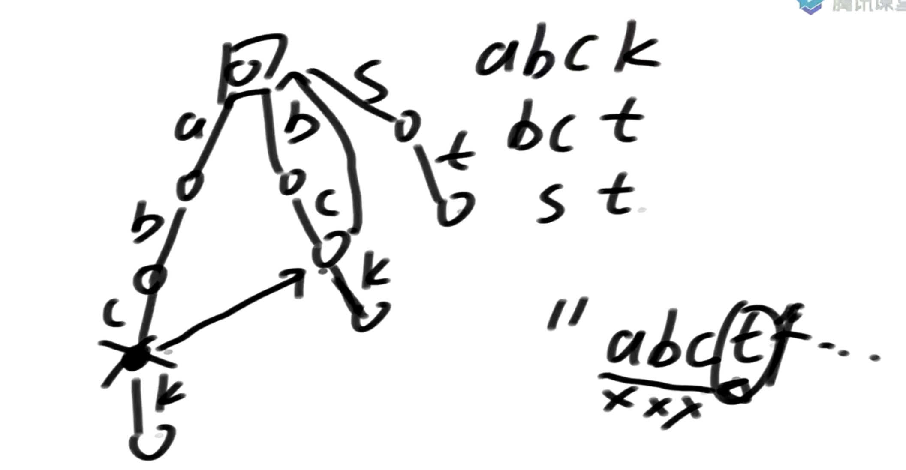


### 卡特兰数

为什么这么奇葩的一个数组会被定义为卡特兰数呢？其实是这样一种数列，有可能有多种关系都能得到这组数列。

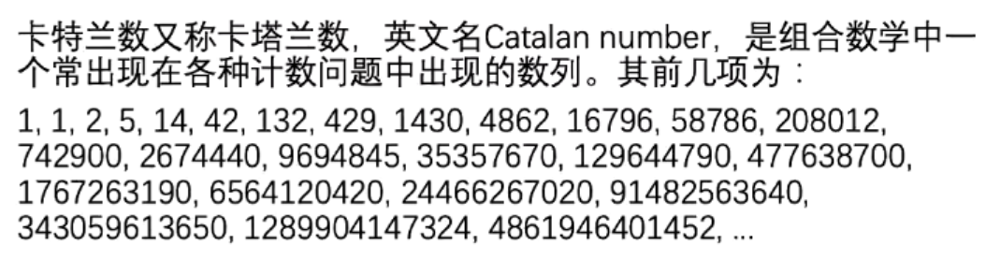

举个例子。

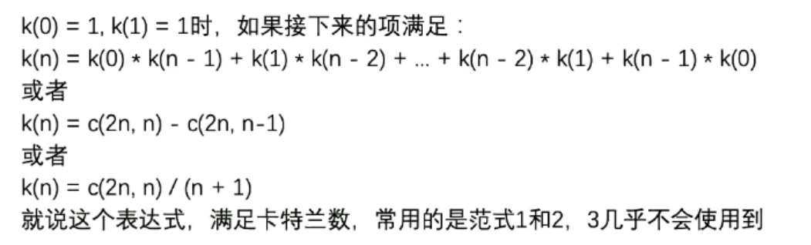

很绕对不对？我给你说个题，你就你就明白了。假设二叉树的结点是无差别的，它有n个结点，这n个结点是无差别的，问这n个结点能形成多少种不同的结构？

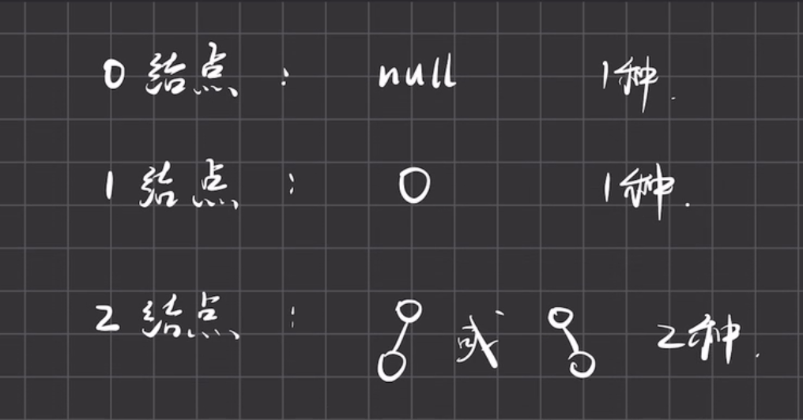

那么这个题怎么解呢？很简单。那么如果我把f(n)认为是n个结点的二叉树最终会形成多少结构，返回值是整形的这么一个函数的话。毫无疑问f(0)=1  f(1)=1  f(2)=2  。往下怎么怎么推一个普遍的f(n)？fn是下面一坨东西的累加和。具体的某一个问题，他正好中了这么一种式子，这就是卡特兰数。

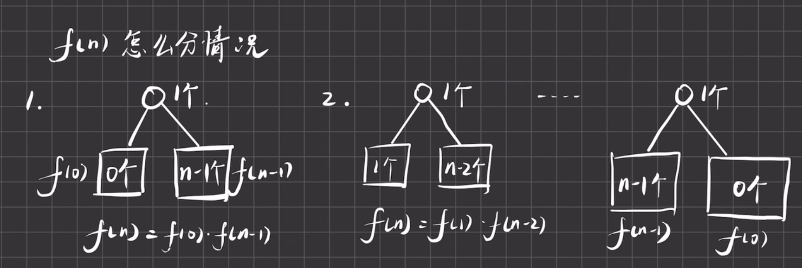

二叉树问题，它只是碰巧种了这样的式子。那么下回一个别的问题，如果也中了这个式子，那它也是卡特兰数。

卡特兰数最常见的一道例题是什么呢？不是二叉树问题。二叉树只是碰巧是。是这样一种问题。就是说，假设我给你n个0，再给你n个1，然后这n个0跟n个1自由组合，就是n个0跟n个1混在一起，一共2n个字符。**任何前缀上你都要保证0的数量不要比1少**，这个组合才是达标的，我问你这样的达标结果有多少个？接下来讲为什么这个问题他就能够命中第二个式子----k(n) = c(2n,n) - c(2n,n-1)。

首先我们需要一点点的启发性的好玩的东西。这种思想就是集合论的思想，它其实非常的朴素，但是，你不具备这样的一种思想的还原，你其实去看帖子，你是看不懂的。在数学上，我说所有的整数和所有的偶数数量是一样多的，因为所有的整数你乘以2就能找到和它对应的整数。如果一个集合和另外一个集合存在一一对应的关系，那么就说两个集合的元素个数是一样多的。那跟我们讲这个题有啥关系呢？太有关系了。我们现在想在两个集合之间建立一种映射，A集合是n个0与n个1所组出来的不达标的东西。B集合就是n+1个1和n- 1个0所组出来的所有的情况，不分合法违法。那么这两个集合，我要证明它的数量是一样多的。

因为A集合都是非法的，它里面每一个元素一定有一个最早的前缀，让我一的数量比零多一个，也就是最早的非法前缀。那么在这个非法前缀的后面，一定是0比1多了一个。此时我们如何找映射？我们把除去非法前缀剩余的部分中的0变成1,1变成0。这样一来整体就变成了N+1个1，N-1个0的东西。

上面我们证明了对于A中的每一个元素，我们都能一对一的映射到B集合中的一个元素中。现在证明B集合中的每一个元素也能映射到A集合中。显然，B集合里面的1比较多，那么就必然存在一个前缀1比0多，也就是非法的前缀，此时把除了非法前缀的剩余部分也1变0,0变1，也对应于A集合中的一个元素。

综上，A可以一一映射到B，B也一一映射到A，所以A集合与B集合是相同的。


公式如下。

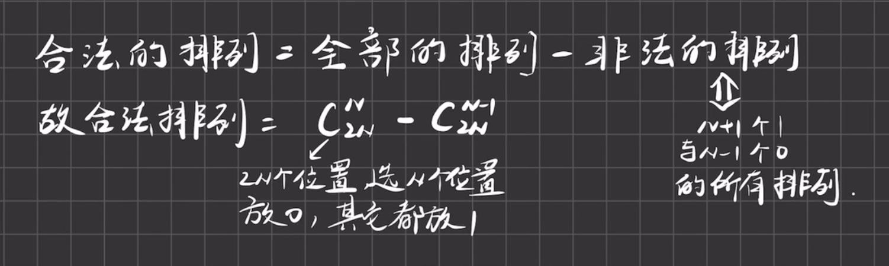

任何前缀上0的数量都比1的多，这样的题有很多，这个公式很有用。举个例子，我有一坨数字要进一个栈，这些数字都不一样，这些数字进栈的顺序是固定的，也就是顺序靠前的数字没有进栈，顺序靠后的数字也不能进栈，但是你可以在任意时刻出栈和进栈，问你有多少种出栈的顺序。做一个抽象，其实就是入的数量在任何情况前缀上不要大于出的数量，也就是卡特兰特数。

再举个例子。一条坐标轴上，一开始这个股票的变化在（0,0）点。然后股票每次要么往右上方斜率45度涨、要么往右下方斜率45度跌。股票的变化趋势可以有非常多种。我问你，如果跌到这个x轴以下叫无效，如果你是一个啊你你是一个完可以完全控制股票的大亨，你控制这条线波动的可能性有几种？同理，也是在任何一个前缀上，涨的次数要大于跌的次数才行。

所以卡特兰数的问题，大部分它就变成了公式二的找敏感度的问题。其中最重要的敏感度就是任 何一个前缀上，零的个数都不要少于一的个数。这个经典问题无数无穷无尽的在每年的面试过程中，以一个新的样子出现，难倒了一大批观众。


## 四边形不等式

先给大家来一个思考问题。一个数组，它一定能够切成两半。它有多少种切法呢？数组一定砍成两半，左部分和右部分必须有数，那么就有下面这么多种切法。在每一种切法下，会有一个左部分的累加和、和一个右部分的累加和。在这种切法下，左部分的累加和叫sum，左右部分的累加和叫sum右。那么，它必然会有一个sum左和sum右 谁是最小值的问题min{sum[a],sum[b-f]}、谁是最大值的问题max{sum[a],sum[b-f]}。我想知道哪一种划分能让左部分的累加和与右部分累加和之中的最大值(max{sum[a],sum[b-f]})尽量小。这个算法可以优化成线性阶的。

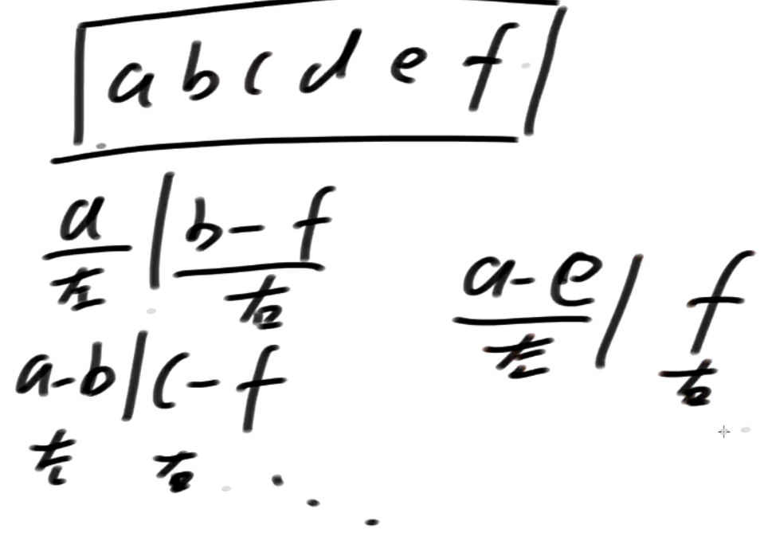

怎么优化呢？这样来想，首先，所有数都是正数，这是一个限定条件。用前缀和数组作为辅助结构，我们就可以知道从i~j任何一个范围上的累加和问题。

p1，我这一刀切这的时候，我可以求出组部分的累加和是三，右部分的累加和是22。那么max就是22。

p2，当这刀往右动，我就求出来了下一个指标。左部分累加和是8，右部分累加和是17。max就是17。我想让max尽量小，发现这一刀挪的很有道理，确实得到了一个更小的值。

p3，那么我就继续动，我就继续动。当我这一刀挪到这儿的时候。左部分累加和是14，右部分累加和是11，它们求max得到结果是14。比上面还好，因为它确实又变小了，这一刀挪的有道理，我再去试下一刀。

|  | 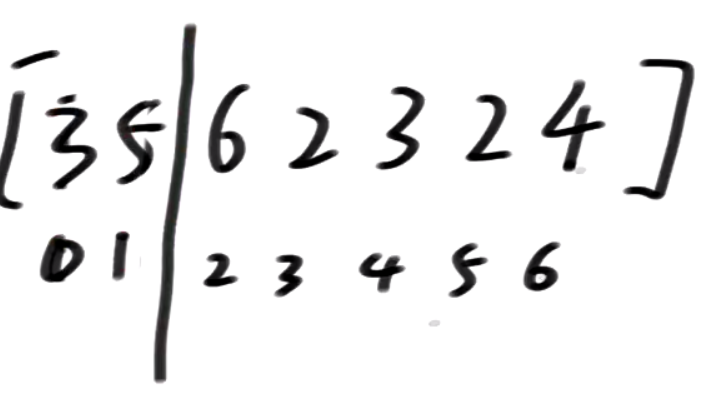 | 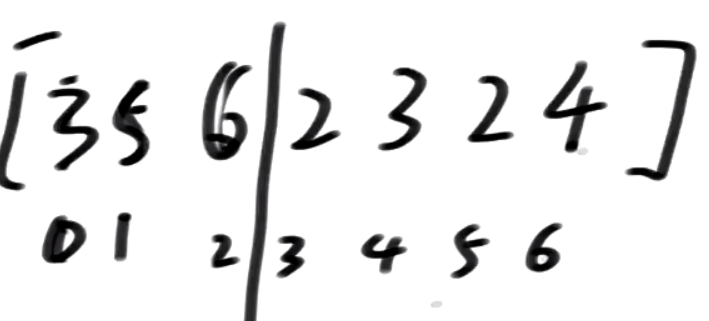 |
| ------------------------------------------------------------ | ------------------------------------------------------------ | ------------------------------------------------------------ |

p4，我再去试下一刀。左部分累加和是16，右部分累加和是9，发现开始变大了。好，下面我不用试了。因为接下来左侧这个瓶颈只会变得越来越差了。

p5，所以我们通过这几步，知道了14就是最优了，14是左部分累加和跟右部分累加和的最大值，尽量小的时候。

我不是想讲这个，我只是告诉你，当你这个划分点往右移动开始变差的时候，你不需要再试后面的东西了。这是由于我们的限定，正数，具有单调性，越往左走，左侧的值越大，越占上风，它对你求整体最大值尽量小，是没有意义的。

| 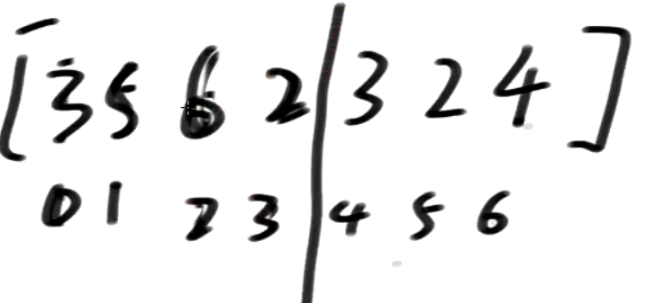 | 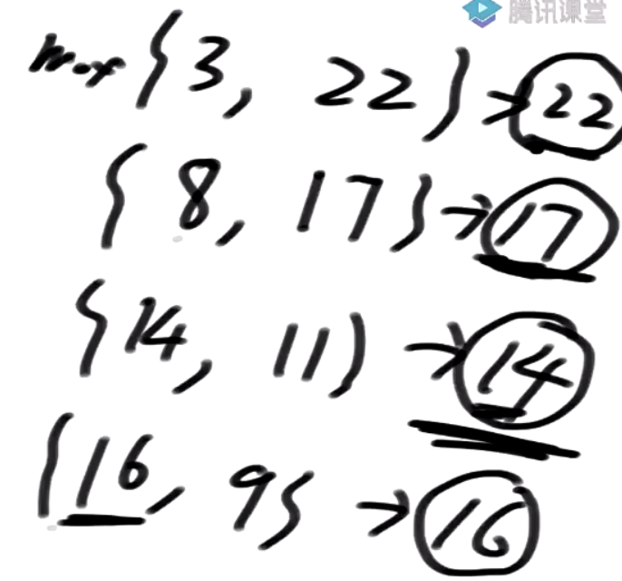 |      |
| ------------------------------------------------------------ | ------------------------------------------------------------ | ---- |

假设给你一个数组arr，0~n- 1位置，我不是让你求整个数组砍一刀，得到左部分累加和右部分累加和的最大值怎么尽量小。现在这个问题变了，我不是让你求整个数组这个尽量小的值是啥？我想让你求一组记录，给我返回一个answer数组，ans和arr等长，ans[1]代表如果我就在0~i范围上去切这一刀，这个指标最优的是什么。怎么做到线性时间求所有的事情？

我们原来是0到n- 1这个大范围上切一刀怎么最好？所谓的最好，就是让左部分跟右部分的累加和的最大值尽量小。现在我们只在0~i这个范围上求这个最好。先说一个最重要的优化，假设客观上来讲，0~i范围上最优的这一刀切在了k位置，什么叫切到了k位置？就是这一刀，再往右挪动一刀就开始不优了。说个结论，当我想求0到i+1整个这个范围上最优一刀在哪儿的时候，你只用从k往后开始尝试。如果我们这个结论成立，它就是线性时间的，因为切的位置不回退。但是这个结论它为什么成立？我们就得要下功夫了。

我们现在来证一下为什么我如果在i位置上最右一刀切在k，当我范围扩了一个数之后，这一刀不用往左是只用从k往右试。

0~i范围上最优一刀切在了k位置，i+1位置的数到来了，它上面是个a这个数。好，现在开始分情况了。你当时在零到i范围上的最优划分，谁是瓶颈 会有一个不同的情况，瓶颈就是到底是你左部分的累加和更大还是右部分的累加和更大。最后单独讨论相等其实也无所谓。

第一种情况，我0~i范围上切出来最优一刀，右部分的累加和是大于左部分的累加和的。如果在这种情况下，下面你面临的可是我的右侧范围扩大了，我把这个a这个数会算到右部分的累加和里去。也就是说我的sum右会增加。因为我们要求两个东西的最大值尽量小，所以大的那个是瓶颈。在这种情况下sum右是瓶颈，你现在还让他增加一个数（正），那么sum右变得更大，如果此时你还把这一刀往左挪了，到右侧的数更多了，它一定不会让你得到一个尽量小的值。所以在这种情况下，你这一刀是不需要往左挪的。所以在第一种情况下。我们k这一刀不需要左挪的结论是成立的

第二种情况是sum左是大于sum右的。当我把i+1这个位置a算到右部分里来的时候就意味着sum右会增加。情况2分裂一下，第一种小情况就是在sum右它增加了a之后，sum右就开始大于sum左了，这样就和第一种情况一样道理，这一刀不需要左挪了。现在最麻烦的情况就是第二种小情况，sum右它增加之后还是小于sum左。但是依然不需要左移。因为0~i范围上，它如果能往左移的话，它早就往左移了。

| 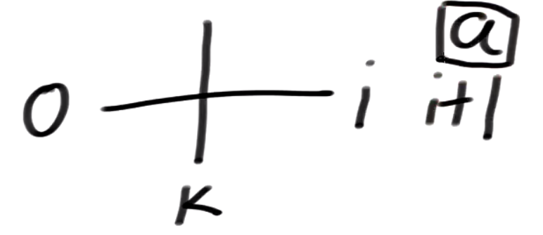 | 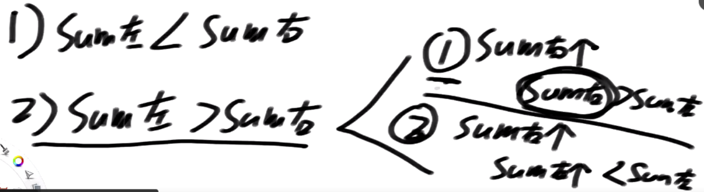 |
| ------------------------------------------------------------ | ------------------------------------------------------------ |

举个例子，0~3范围上这一刀切在1，瓶颈是左边。这一刀不管是往左移还是往右移，在零到三这个范围上，这一刀确实这样切是最优的。当你有了新的数五，即便把这个五算进来之后，右边依然干不过左边。但这一刀依然不能往左挪，你当时不算五的时候你说你这一刀为什么没有往左挪？那一定是因为往左挪之后，右侧的瓶颈不如你就别动，让左侧做瓶颈的时候好。如果当时往左挪了，右侧做瓶颈，100+16+20那得多大呀！所以现在你即便把五算进来，你这刀依然不能往左挪。因为那面临着就是，它一定会让右侧瓶颈变得不如还不如左侧成为瓶颈的时候好。

所以我们知道我们不回退的这种优化是成立的。它为什么会有这个性质？源自于累加和这件事儿和范围有单调性。源自于arr压根儿就是个正数数组，范围变大累加和一定变大。如果这个单调性不成立，没有这个优化。

| 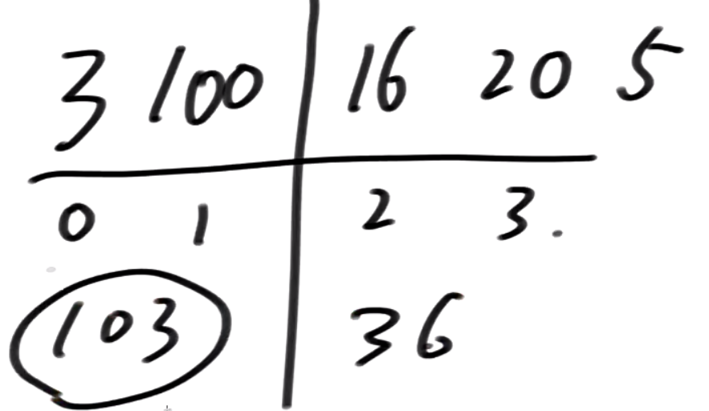 |
| ------------------------------------------------------------ |

下面我们就开始说一个结论。对于这个问题来说，求sum是它的指标，左侧的sum是它具体的指标。然后两个指标决策出来的max是它的第一步决策，再求个相对来说尽量小的东西是它第二步决策。而且这个f1跟f2是一种相反的评价方式。把指标也代替一下，变成S标准。所以我们就可以抽象理解为这么一件事，关于左侧范围的某一个指标s和右侧范围的某一个指标s，求一个较好的值，但是问你这个较好的值中（有很这样较好的值），哪种情况是所有较好值中较差的情况？这就可以认为是，这个原问题所代表的东西是这样一种范式的其中一种情况。

下面结论来了，盯着这个范式，如果下回一个别的问题告诉你它的s指标与范围之间存在单调性，这个另外一个问题，可能这个s这个指标就不再是累加和了，它可能是个别的指标，但是这个指标和范围依然存在单调性。下回一个别的问题，可能不是求max，但是也是在所有的决策中求一个较好。下回一个别的问题，可能不是求min，但他也是在所有好的指标中求一个相对较差。那么这种问题可能都存在划分点的位置不需要回退这种优化。就是以后相应的问题，只要带有类似特征，你都可以去猜是否枚举位置、划分位置不需要回退。它只是提醒你，你可以往那猜，但是你不能说它一定成立。


| 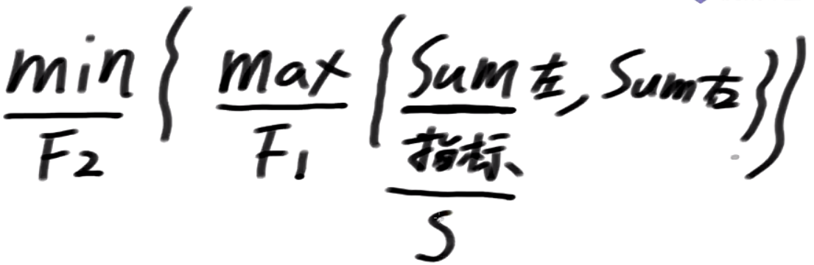 | 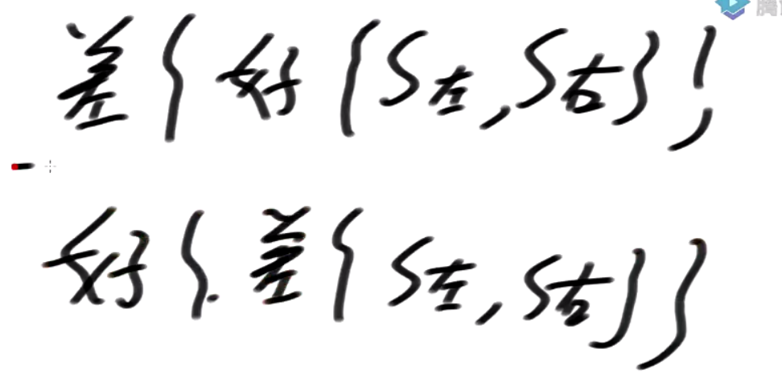 |      |
| ------------------------------------------------------------ | ------------------------------------------------------------ | ---- |


# 经典面试题目

## Interview Coding 01

### 绳子盖点

题目1：

- 给定一个有序数组arr,从左到右依次表示X轴上从左往右点的位置
  **给定一个正整数K,返回如果有一根长度为K的绳子，最多能盖住几个点**
  绳子的边缘点碰到X轴上的点，也算盖住

思路1：

- 首先我们要考虑绳子放在哪？如下图，我们可以把绳子的开头放在1位置，也可以把绳子放在1.5位置。但是很明显，我们绳子的开头一定要放在arr数组中的点，例如1,3,7,10,13，才会使得压中的结点数最多。

- 定下了绳子的开头之后我们可以把问题拆分为，绳子开头在1时候的最大压中数量、绳子开头在3时候的最大压中数量、绳子开头在7时候的最大压中数量。。。。按照绳子的开头来进行求解答案，所有答案的最大值一定是全体的最大值。
- 有无单调性？有！如果在某一个位置的绳子已经无法盖住前面的点了，一定也无法盖住后面的点。所以我们可以利用滑动窗口来求解。每当arr[R]大于arr[L]+k的时候就更新一次全局的max，此时绳子以arr[L]开头，最大覆盖的点的个数就是R-L+1。

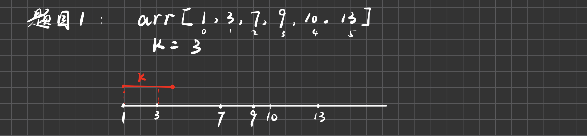

思路2：

- 和思路1一样，我们也把问题拆分为绳子以1,3,7,9开头分别求出最大然后求整体的最大。
- 不同的是，我们不使用滑动窗口来解。我们通过绳子的开头7以及绳子的长度3可以算出绳子的末尾10。我们只需要在arr数组的下标2~arr.len-1 部分求<=10最右的位置即可。
- 在一个数组的a~b部分求<=某个数最右的位置可以用二分法搞定！这样时间复杂度是nlogn


---

### 括号有效配对

题目2：

- 括号有效配对是指：
  1)任何一个左括号都能找到和其正确配对的右括号
  2)任何一个右括号都能找到和其正确配对的左括号
  有效的：(())  ()()  (()())  等
  无效的：(()  )(  等
  
  **问题一：怎么判断一个括号字符串有效？**
  **问题二：如果一个括号字符串无效，返回至少填几个字符能让其整体有效**

问题一思路：

- 只需要一个变量就能判断，不需要用栈，也不需要左右指针。
- 假设这个字符串只有左括号和右括号。只需要准备一个整型变量count，从左到右遍历这个字符串，遇到左括号就++，遇到右括号就--。如果在遍历的过程中count<0了，直接返回false。如果遍历结束之后count的值不等于0也返回false。否则就返回true。
- 为什么可以这样？如果count在任意时刻都不小于0，说明在任意一个位置，右括号的数量都不比左括号的数量多。并且如果最后count等于0了，就说明所有的左括号都可以找到一个右括号配对。

问题二思路：

- 和思路1一样，准备一个count变量，还有一个额外的need变量。从左往右遍历字符串，遇到左括号就++，遇到右括号就--，如果中途count== -1 ，就让need++，让count重新归为0，然后继续遍历。如果最后count>0，那么返回结果就是need+count。
- 原理：如果中途有count== -1 的情况，说明我需要在前面的某个位置补充一个左括号。如果最后count>0,说明我需要在后面的某个位置补充count个右括号。


---


题目3：

- 括号有效配对是指：
  1)任何一个左括号都能找到和其正确配对的右括号
  2)任何一个右括号都能找到和其正确配对的左括号
  **返回一个括号字符串中，最长的括号有效子串的长度**
- 有可能给你一个无效的字符串，但是它的一部分子串是有效的，要返回最长的有效子串的长度。( **( ) ( )** ( **( ( ) )** 的最长有效子串是4

- 思路：这是一道动态规划。首先看到子串、子数组的问题。一个很自然的拆分思路就是枚举每一个位置开头或者结尾的答案，答案一定在其中。这样拆分，我们就可以把之前求过的位置都记在一个数组中，看看能不能帮助我现在这个位置求出答案。动态规划就是类似的思路，你在求0~i的答案的时候看看能不能用0~i-1的答案来帮助你。

  假设dp[i]代表0~i范围上，以i位置结尾的最长有效子串的长度。现在要求0~i范围的答案，**如果第i个位置是左括号，那么这个位置的答案就是0**，因为以左括号结尾一定是非法的。

  那么**如果i位置是右括号**？由于已经知道了dp[i-1]，那么我们就从i-1位置倒推dp[i-1]长度到达另外一个位置p，位置p是不在范围dp[i-1]的有效范围里面的。**如果`str[(i-1)-dp[i-1]]`是右括号，那么dp[i]等于0**

  现在有个难点，为什么p位置不是左括号dp[i]就一定是0？要理解“最长”，如果p位置是右括号的话，那么p之前就不可能出现如下图的一个方块外加一个左括号的结构，因为如果出现了这样的结构，那么dp[i-1]就求错了！矛盾。

  4里面的块也不可能有一小块和i位置的右括号匹配的，因为只有4里面的左括号才能和这个右括号匹配，但是4里面的左括号早就被4块中自己的右括号匹配光了！

  综上，只有p位置是左括号才能和i位置的右括号配对，其它情况都不可能匹配。


- 所以，如果i位置是左括号，dp[i]=0。如果i位置是右括号，并且p位置是右括号，dp[i]=0。
- 但是如果i位置是右括号，并且p位置是左括号，那么dp[i]至少等于dp[i-1]+2。它可能会更长！！我们继续看p-1位置然后加上dp[p-1]。


还有一个题，在代码中为deep方法

问的就是有效子串中最深的嵌套层数。很简单，还是只要一个count，遇到左括号++，遇到右括号--，count到达的最大值就是最大嵌套层数。前提是count到达这个最大值后还能够到达0.


---

### 正方形涂色

题目4：

- 有一些排成一行的正方形。每个正方形已经被染成红色或者绿色。现在可以选择任意一个正方形然后用这两种颜色的任意一种进行染色，这个正方形的颜色将会被覆盖。目标是在完成染色之后，每个红色R都比每个绿色G距离最左侧
  近。返回最少需要涂染几个正方形。
  如样例所示：s=RGRGR我们涂染之后变成RRRGG满足要求了，涂染的个数为2，
  没有比这个更好的涂染方案。

题意：

- 意思就是要把RGRRGRR这样的正方形排列，经过涂色变成左边都是R，右边都是G。左边几个R右边几个G不关系，我要求的是涂色的次数最少可以变成这样的效果。例如RRRRGGG/RRRRRRR/RRGGGGG都是合法的。但是要的是涂色次数最少的涂法。

思路：

- 这题可以枚举分界线。定下分界线，左边的G的个数加上右边的R的个数就是这个分界线的答案。
- 技巧：利用预处理数组来快速得到G和R的数量。gcount[i]代表从0~i范围上有几个G。rcount[i]代表从i~len-1范围上有几个R。但是其实我们只要知道gcount和rcount中的一个即可。另外一部分可以在遍历的过程中用一个变量抓住。
- 其实一个变量也可以实现count数组的作用。例如我要知道i~len-1的R的数量，那么我们先遍历一遍得到R的总数totol，当我来到一个位置如果这个位置是R那么totol就--，这样totol的含义就变成了右侧还有几个R。


---

### 矩阵中最大正方形

题目5：

- 给定一个N*N的矩阵matiⅸ，只有0和1两种值，返回边框全是1的最大正方形的边长长度。
  例如：
  01111
  01001
  01001
  01111
  01011
  其中边框全是1的最大正方形的大小为4*4，所以返回4。


 可以直接计算得到数量的阶数。长方形的数量有更简单直观的估计方式，就是在矩阵中任意找两个点。正方形的估计就是任意找一个点，然后往两边扩。

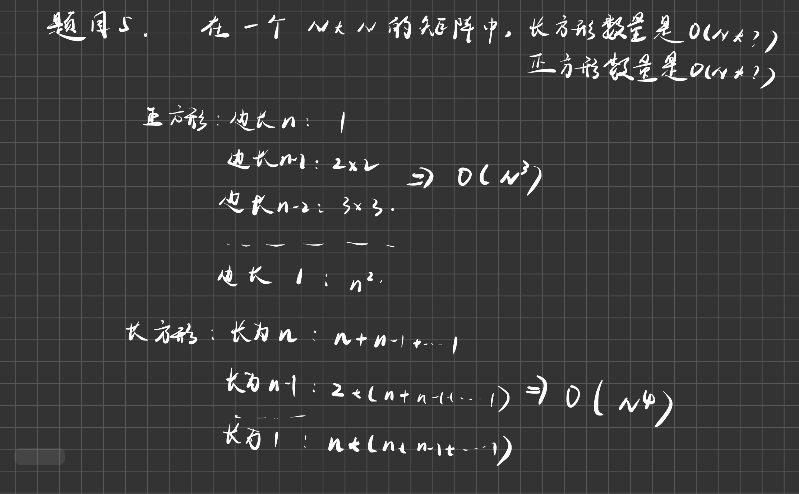

因为正方形的总数为O(N³)，所以算法的时间复杂度肯定也是O(N³)，因为你至少要把所有的正方形看过一遍才能知道答案

所以我们至少需要三个循环嵌套，前两个循环定一个点，第三个循环延长边。我们能优化的地方在于如果验证某个正方形是不是边框都是1。

所以我们使用额外的结构来加速我们验证正方形合法性的过程。r[i] [j] 代表在(i,j)这个点右边（连同自己在内）有多少个连续的1。d[i] [j] 代表在(i,j)这个点下面有多少个连续的1。很明显，我们只需要O（N²）的时间就可以得到这两个辅助结构。


---

笔试：

- C、C++ 10^8~10^9 常数级别的操作 1~2s内能过。java、python3~4s内能过。
- 如果数据量是10^6，那么如果你的算法是O(N²)，那么肯定过不了，因为你的常数级别操作就到了10^12的量级，超过了10^8~10^9。

---

### 构造数组

题目6：

- 给定一个正整数M,请构造出一个长度为M的数组arr,要求
  对任意的i、j、k三个位置，如果i<j<k,都有arr[i]+arr[k]!=2*arr[j]
  返回构造出的arrr

- 思路：分治。假设现在你有一个达标数组X，根据X数组，对X数组进行两次变化。分别是奇变换和偶变换，分别变换出A数组和B数组。A数组里面都是通过2x+1变换出来的奇数。B数组里面都是通过2x变换出来的偶数。A和B拼凑成一个新的数组AB，AB数组左半边和右半边分别达标。跨越A和B的边界也是达标的，因为A和B分别选一个相加为奇数，而AB数组中的任何一个数*2都是偶数，偶数一定不等于奇数。
- 空间复杂度不使用递归的话可以优化到O(1)。但是时间复杂度一定是最优了！
- 思考：想想看给你一个合格的，你怎么把它通过加工拼成一个更大的合格的。如果可以做到那么就可以分治了


---

### 二叉树路径

题目7：

- 给定一个二叉树的头节点head,路径的规定有以下三种不同的规定：
  1)路径必须是头节点出发，到叶节点为止，返回最大路径和
  2)路径可以从任何节点出发，但必须往下走到达任何节点，返回最大路径和
  3)路径可以从任何节点出发，到任何节点，返回最大路径和。（可以往上走）


思路

1. 第一种规定。可以不使用递归套路，如果使用递归套路的话需要注意，不能把null定为base case，要把叶子结点定位base case。

2. 第二种规定。 需要使用二叉树的递归套路。需要划分可能性：答案和头有关、答案和头无关。

   和头无关的时候会出现答案，例如头是负数的时候。此时我们需要左树的最大路径和以及右树的最大路径和（**不一定从头出发**）。

   和头有关的时候，有三种情况。a. 不往左走也不往右走，只有自己。b. 往左走。c.往右走。但是此时左右子树要给的信息是左右子树的最大路径和（**从头出发**，要和上面的情况区分开）。

   所以我们需要两种信息。第一个信息是和头无关的情况需要的，第二个信息是和头有关的时候需要的。分别是整棵树的最大路径和、从头结点出发的最大路径和。注意：**由于规定只能往下走，所以左右两边只能走一边**

3. 第三种规定。和第二种的区别就是路径可以往上走，但是沿途结点只能经过一次。

   依然是列可能性。第一种大情况是和头结点无关的时候，那么就往左右孩子要他们各自的最大路径。

   和头节点有关的时候。 a. 不往左走也不往右走，只有自己。b. 往左走。c.往右走。d. 既往左又往右。

4. 第四种规定：从任何结点出发但是一定要到叶子结点的最大路径和。


## Interview Coding 02

### 二维数组中寻数

题目1：

- 在行也有序、列也有序的二维数组中，找num,找到返回true,否则false


思路：

- 从左下角或者右上角开始走。如果从右上角开始走，那么只可能往左或者往下。
- 不能从左上角开始走，因为可能有两个方向，不好走。


---

### 打包机器

题目2：

- 有个打包机器从左到右一字排开，上方有一个自动装置会抓取一批放物品到每个打包机上
  放到每个机器上的这些物品数量有多有少，由于物品数量不相同，需要工人将每个机器上的
  物品进行移动从而到达物品数量相等才能打包。每个物品重量太大、每次只能搬一个物品进
  行移动，为了省力，只在相邻的机器上移动。请计算在搬动最小轮数的前提下，使每个机器
  上的物品数量相等。如果不能使每个机器上的物品相同，返回-1。

  每一轮指的是每一台机器都可以选择往左或者往右扔包裹或者不扔包裹。

  例如[1,0,5]表示有3个机器，

  每个机器上分别有1、0、5个物品，[1,0,5]，经过这些轮后：
  第一轮：[1,1,4]；第三台机器往左扔包裹，其它机器不动。

  第二轮：[2,1,3]；第三台和第二台机器都往左扔包裹。

  第三轮：[2,2,2];  第三台机器往左扔包裹。
  移动了3轮，每个机器上的物品相等，所以返回3
  例如[2,2,3]表示有3个机器，每个机器上分别有2、2、3个物品，这些物品不管怎么移动，都
  不能使三个机器上物品数量相等，返回-1

思路：贪心算法（难证明，不需要证明）

- 首先我们可以知道任何一个i位置需要多少件衣服，总衣服数/机器个数。并且我们需要用到每个i位置的前缀和。

- 对于任意一个i位置，我们可以求出它的左边的盈余left，如果盈余>0说明左边的衣服多了，如果盈余<0说明左边的衣服少了。右边的盈余right也同理。

  分情况讨论：

  a. 如果left>0,right>0，那么说明左右两边衣服都多了，需要向i位置扔衣服。左右两边可以同时往i位置扔衣服，所以此时需要max(left,right)。

  b. 如果left<0,right>0 , 说明此时左边缺衣服，左边缺的衣服一定是从i来的，所以至少需要|left|次，left次完了之后right如果不等于0还需要继续往i送。所以此时需要的轮数为max(|left|,|right|)。

  c.  如果left>0,right<0，和b情况类似，需要的轮数为max(|left|,|right|)。

  d. 两边的衣服都不够，需要i往左右两边送。因为一次只能送一件，所以此时的轮数为|left|+|right|。

  

- 贪心思路：我们从左到右遍历机器数组的每一个位置，依次求出所需要的轮数。所有的轮数中最大的就是答案，因为它是整个系统的瓶颈。

- 由于是从左到右的遍历流程，所以前缀和数组我们都可以不用求出来，直接在遍历的过程中求即可。空间复杂度只需O(1)

- 上面的a、b、c三种情况都可以用max(|left|,|right|)来表示


---

### 左右最大值相减的最值

题目3：

- 给定一个数组arr长度为N,你可以把任意长度大于0且小于N的前缀作为左部分，剩下的作为右部分。
  但是每种划分下都有左部分的最大值和右部分的最大值，请返回最大的，左部分最大值减去右部分最大值的绝对值。


思路：

- 本人第一眼看到的想法是准备两个大根堆。
- 实际上不需要这么麻烦，左部分最大值和右部分最大值肯定有一个就是全局的最大值。如果最大值在左边，那么问题就变成怎么让右边的最大值尽可能小。要让一个数组的某个范围内的最大值尽可能小最好的方法就是让这个范围缩小！因为右边部分必须包含len-1位置，那么我就让右部分只有arr[len-1]这个元素。同理，如果最大值在右边，那么就让左边只有0位置的数。两种情况求最大值。
- 单调性：一个部分的范围变大，最大值只可能变大或者保持不变，如果这个部分还已经包含了全局的最大值，那么范围变大最大值只会保持不变。在这部分不变的情况下，要让左部分最大值减去右部分最大值的绝对值达到最大，只需要让没有全局最大值的那个部分的范围最小即可 ----》arr[0] 或者 arr[len-1]


---

### 接雨水

题目4：

- 给定一个数组arr,已知其中所有的值都是非负的，将这个数组看作一个容器，请返回容器能装多少水

  容器两边的趋势认为是无限低的

  比如，r={3,1,2,5,2,4}根据值画出的直方图就是容器形状，该容器可以装下5格水
  
  再比如，arr={4,5,1,3,2},该容器可以装下2格水

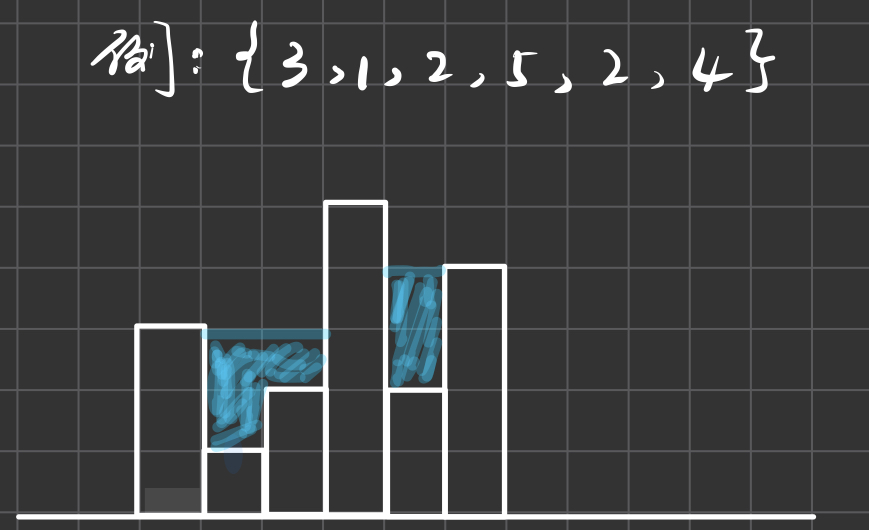

- 思路：一个位置i可以放多少水，取决于左边最大高度以及右边最大高度当中的最小值。例如，左边最大值是12，右边最大值是15。那么这个位置就取决于12这个值。如果这个值大于等于12，那么放的水就为0，如果这个值小于12，那么可以放的水就等于12-这个位置的值。
- 只需要辅助数组,arr1[i]存放0~i位置的最大值，arr2[i]存放i~N-1的最大值。即可把时间复杂度降为线性。
- 还可以不需要辅助数组，直接用几个变量。L和R分别从第二个位置以及倒数第二个位置开始遍历，因为第一和倒一的位置肯定无法放水。用lm以及rm来表述此时0~L-1以及R+1~N-1的最大值。即使lm和rm是局部的最大值我们也可以对位置进行放水。每次遍历都选择lm和rm中较小的一边放水，例如lm小那么就往L位置放水，然后移动L。直到L和R相遇了。原理是尽管rm是局部的，如果lm已经小于rm了，那么lm肯定也小于全局的rm。

---

### 地形储水

题目5：

- 如果给你一个二维数组，每一个值表示这一块地形的高度
  求整块地形能装下多少水。

  认为每个格子只和自己的上下左右相连

- 流程：

  1. 准备一个堆，记录着当前数字来自于二维数组中的哪行哪列，也就是记录着三个指标，(num,row,col)，这是一个小根堆，根据num来排序。之前进堆过的元素不能重复进堆，用boolean类型的数组来记录。
  2. 先把二维数组边缘的所有元素放到堆中
  3. 设置一个全局变量max
  4. 从堆中弹出堆顶得到num，row，col。看看num能不能更新max。
  5. 把这个元素上下左右没有入过堆的都入堆，在boolean类型的数组中标记，并且结算水量，water累加上max-(up/down/left/right)num。

- 原理：

  1. 边缘放进去之后，堆顶就是短板。max就是此时的短板，只要没有更新max，后面弹出的元素都是以max作为短板。

  2. 当max更新说明你已经转到另一个局部区域了。例如下图，你从5区域转移到了6区域

     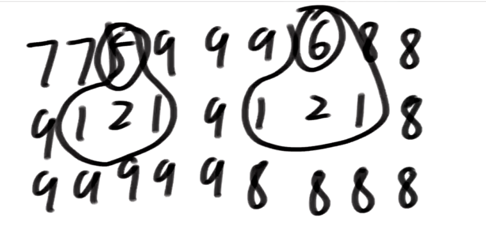

- 时间复杂度：O(M * N * logK)，k为堆的大小

---

### 加和n元组

题目6：

- 给定一个**有序**数组arr,给定一个正数aim
  1)返回累加和为aim的，所有不同二元组
  2)返回累加和为aim的，所有不同三元组

  例如1122233356666777788899，aim=9，---》  (1,8)/(2,7)/(3,6)

思路：

1. 找出所有的二元组。左右指针，相加小于aim左指针动，大于aim右指针动。相等了，可以规定左指针动，如果此时arr[L-1]==arr[L]那么就不能收入答案，否则就收入答案。
2. 找出所有的三元组。只需要固定第一个，后面两个用找二元组的方法找即可。11122233344567，例如第一次固定了1，找出来之后，后面的两个1就可以省略了，因为后面两个1的范围比第一个1小，它们都被第一个1包括了。


---

### k小数值对

题目7：

- 长度为N的数组arr,一定可以组成N²个数值对。
  例如arr=[3,1,2],
  数值对有(3,3)(3,1)(3,2)(1,3)(1,1)(1,2)(2,3)(2,1)(2,2)
  也就是任意两个数都有数值对，而且自己和自己也算数值对。
  数值对怎么排序？规定，第一维数据从小到大，第一维数据一样的，第二维数组也
  从小到大。所以上面的数值对排序的结果为
  (1,1)(1,2)(1,3)(2.1)(2,2)(2.3)(3,1)(3,2)(3.3)
  给定一个数组arr,和整数k,返回第k小的数值对。

  注意：就算arr中有相同的元素，例如1,1,2,3,(1,2)和(1,2)看做是不一样的，因为分别是下标为0的1和下标为1的1.

思路：

1. 暴力方法，就是整出所有的数值对，然后排序，接着取第k个。
2. 我们可以做到O(N)的时间复杂度。假设arr有10个数，那么按照数值对的第一个元素来进行排列，每一排都有10个数值对。假设我们的每一排都是按照递增顺序，那么我们就可以根据这个来找到我们要找的数值对，如果排好了序应该在第几排。找出在第几排之后，那么需要知道它在第几列。这里的第几列不是严格的第几列，因为它可能大于10，因为数组中可能有重复值。所以我们需要除以它重复的个数。
3. 假设arr有序，首先定位序列的第一个数，arr[k-1/N]。找出小于arr[k-1/N]的数有多少个a，我们的目标变为找以arr[k-1,N)开头的第k-N*a（赋值为p）小。 如果arr[k-1/N]这个数有重复b次，如何知道我们要的来源于第几个这个重复的数---(p-1)/b。
4. arr没序了，想起我们之前的快排改进算法，可以找出一个无序数组的第k小的数，我们把其改成非递归，空间也省了。第一步，找k-1/N小的数，确定一个数。然后找(k-1/N)+(p-1/b)即可。

## Interview Coding 03

### 找工作

题目1：

- 每种工作有难度和报酬，规定如下
  class Job{
  	public int money;/该工作的报酬
  	public int hard:/该工作的难度
  }

  给定一个Job类型的数组jobarr,表示所有岗位，每个岗位都可以提供任意份工作
  选工作的标准是在难度不超过自身能力值的情况下，选择报酬最高的岗位
  给定一个int类型的数组arr,表示所有人的能力
  返回int类型的数组，表示每个人按照标准选工作后所能获得的最高报酬

思路：将工作排序，按照两个维度排序。第一个维度是难度，从小到大排序。第二个维度是钱数，从大到小排序。

第一步，将工作按照难度升序，钱数降序排列。

```
	public static class JobComparator implements Comparator<Job> {
		@Override
		public int compare(Job o1, Job o2) {//先按照工作的难度升序，再按照钱降序排列
			return o1.hard != o2.hard ? (o1.hard - o2.hard) : (o2.money - o1.money);
		}
	}
```

第二步，相同难度工作中留下一个钱最多的作为队长。

第三步，删掉队长中难度增加，钱减少的。

- 也就是只留组长，并且组长中必须保证难度上升报酬也在上升

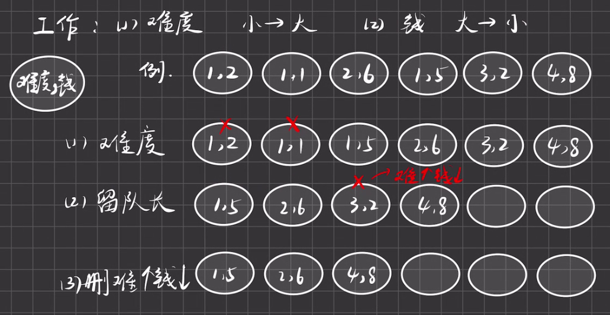

这样做完之后难度是递增的，钱也是递增的了。然后把这些都放到一个有序表中，根据难度来排序，然后来一个人，就根据它的能力值，在有序表中查找<=他的能力值最近的那个工作，就是那个人应该选的工作。


---

### 零食（背包）

题目2：

- 背包容量为w
  一共有n袋零食，第i袋零食体积为v
  总体积不超过背包容量的情况下，
  一共有多少种零食放法？（总体积为0也算一种放法）。

在动态规划中，尝试的方法是最重要的。

尝试的方法有：从左往右的尝试模型。---从暴力递归的从左往右的尝试优化成动态规划。

暴力递归有三个参数`int[] arr,int index,int rest`，含义是arr的0~index-1范围的零食我已经选择过了，让你在背包容量还有rest的时候选择index~len-1范围的零食，看看有多少种方法。

- coding层面的问题，在返回0还是-1上面，自己要分得清无方案和值0的区别。如果你不希望上游用0，那么就使用-1自己进行判断。

递归写完之后去改动态规划就很简单

第二种方法：dp [ i ] [ j ] 代表0~i自由选择，凑成 j 的的方法数。可以写出最优子结构。最终结果就是sum{dp [n-1] [0...j]}。因为这里的dp的含义是刚好等于而不是<=


---

### 空间压缩

假设某一个动态规划问题在求dp [i] [j]的时候即依赖于它左边的格子又依赖于它右边的格子的时候，是否真的有必要申请一整张二维表的空间？能不能只申请一个数组呢？我们知道一个要填的dp二维数组中的第一行的值以及第一列的值是我们知道的。那么如果有一个策略可以使得我们可以从第i行的值退出第i+1行的值，那么我们就可以只要一个一位数组就够了。

看图可知，我们是可以通过一个数组迭代得到最后一行的值的。bcde可以从a得到，a'可以从a得到，b‘从b和a’得到。

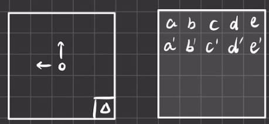

那么如果依赖自己左上角的位置和上面的位置可以完成更新吗？也是可以的。不过这次数组是从右往左更新。


那么如果依赖自己的左边的，左上角的，上面的，有三个方向可以做到吗？依然可以。但是需要一个额外的变量来抓住被覆盖的之前的值

- 上下左右都要的就不能做空间压缩了。

如果需要自己左边的，上面的，跳一行左上角的，依然可以做到。但是需要三个数组交替的进行


但是如果二维数组行和列相差大，那么也可以用列申请一个数组，横着滚过去。

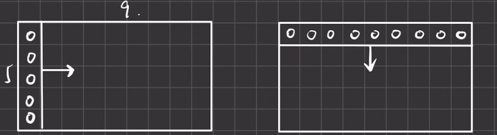


---


题目3：

- 给定一个二维数组matrix,其中每个数都是正数，要求从左上到右下
  每一步只能向右或者向下，沿途经过的数字要累加起来
  最后请返回最小的路径和
- 动态规划的空间压缩技巧！


---

题目4：

- 请注意区分子串和子序列的不同，给定两个字符串str1和str2,
  求两个字符的最长公共**子序列**
- 动态规划的空间压缩技巧！


---

题目5：

- 请注意区分子串和子序列的不同
  给定两个字符串str1和str2,求两个字符串的最长公共**子串**
- 动态规划的空间压缩技巧！

子串和子序列不同，子串是连续的。

所以这里dp [i] [j]的含义是同时以str1[i]位置结尾以及以str2[j]位置结尾，最长公共子串长度。这个和最长子序列的区别很大，因为最长公共子序列dp [i] [j]的含义是0~i 的str1和0~j的str2的最长公共子序列。造成这样的区别就是一旦str1[i]!=str2[j]的时候，子串的dp[i] [j]要清零，而子序列的dp[i] [j]不需要清零。

在最长子串问题中，答案是二维表中的最大值，而不是右下角的位置。

那么我们能否用子序列问题中的dp的含义来解子串问题？好像是不行的，因为子序列可以是跳跃的，所以dp [ i ] [ j ] 可以继承前面的值。如果子串问题继承前面的值是没有什么意义的，因为前面可能已经断掉了，判断是多少只能一个一个往前比对，这样就太低效了。

- 这题的最优解不是用动态规划，而是用求后缀数组的方法。这个在后面有

因为这题的dp只需要依赖左上角的值，所以我们用有限几个变量就可以了，都不需要数组。我们利用有限几个变量按照斜线的方式来进行更新。并且返回最大值以及返回是谁是一码事。

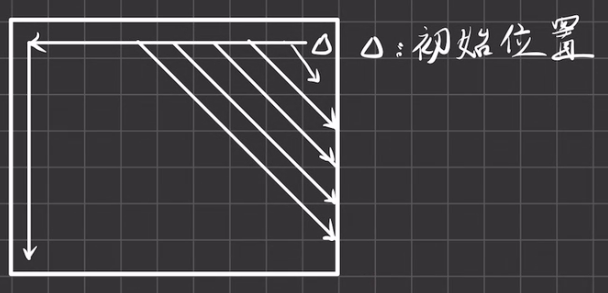


---

### 词频最大的前K个字符串

题目6：

- 给定一个由字符串组成的数组String[] strs,给定一个正数K
  返回词频最大的前K个字符串，假设结果是唯一的

先全部放到一个hash表中统计词频。接着把字符串和词频封装成一个对象。把这些对象全部放入一个大小为k的小根堆中。在小根堆中剩下的就是top k。

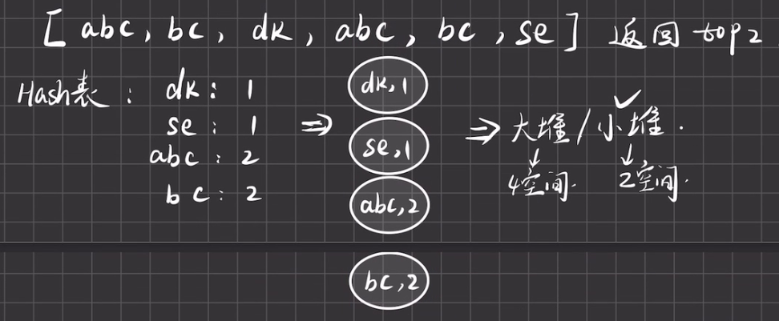


---

### 实现词频统计结构

题目7：

- 请实现如下结构：
  ```
  TopRecord{
      public TopRecord(int K):构造时事先指定好K的大小，构造后就固定不变了
      public void add(String str):向该结构中加入一个字符串，可以重复加入
      public List<String>top():返回之前加入的所有字符串中，词频最大的K个
  }
  ```

  要求 ：
  add方法，复杂度O(Iog k):
  top方法，复杂度O(k)

- 固定只能要top k，不能一会top 2，一会top 3

 用自己实现的堆结构来实现。自己实现的堆结构在基础班第四节。

系统实现的堆只能做到你给他一个（string ，integer），它帮你插入到堆中。但是没有办法帮你定位到string所在堆中的位置，然后直接把它的词频+1，接着做堆结构的调整。要实现这个功能我们需要有一个额外的结构，例如hash table帮助我们记录下string对应在heap中的位置。另外一个hash table帮助我们string与词频的对应关系，这样我们就不需要一个额外的类。但是创建一个Node也是可以的，看个人的偏好，区别就是判断在堆上移动的标准是从times表中拿还是从Node本身拿。

来一个字符串就在index表中看看这个字符串在不在堆上，如果在堆上，那么直接在对应的times表上+1，并且做堆结构的调整。如果不在堆上，那么仍然是times表上对应加一，然后直接插入小根堆，接着从小根堆中弹出一个。如果times表上找不到这个字符串，那么就在times表和上创建，然后插入小根堆。

- 另外一种思路：先遍历一遍，在hash表中统计词频。统计完了之后string和次数封装起来放到一个数组中，然后利用bfprt算法找到第k小的。接着遍历一遍数组把符合的全部挑出来，这样算法的复杂度是O（N)	

## Interview Coding 04

### 打印目录结构

题目1：


- 用前缀树。前缀树除了必须有一个指路结构之外，其它的结构都是看需求建立的。例如这题要打印目录结构，我们是来到一个结点之后打印的，所以我们就在结点中多记下我们是从那条路（这个路代表的就是某个字符或者是字符串，看题目）到这个结点的。如果每条路都是字符的话那么只需要26大小的数组即可，如果是字符串的话就要使用hash了。因为这里说的是同一级别要按照字典序，所以要使用TreeMap。
- java中\是转义。因为在正则表达式中`\\`表示匹配`\`，所以我们要在java中表示正则表达式的`\\`，就需要在正则表达式中的每个`\`前面多加一个`\`也就是`\\\\`


### 搜索二叉树转双向链表

题目2：

- 双向链表节点结构和二叉树节点结构是一样的，如果你把last认为是left，next认为是next的话。给定一个搜索二叉树的头节点head，请转化成一条有序的双向链表，并返回链表的头节点。

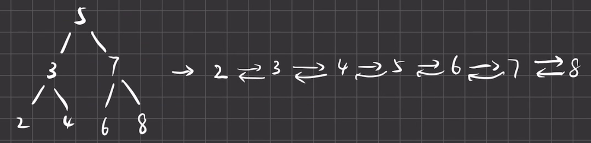

思路：可以用递归套路。用一个f(head)返回[start,end]。


### 先序、中序数组求中序数组

题目3：


思路：建树的话就慢了。这里我们搞一个函数f(arr pre,0,6,arr in,0,6,arr post,0,6)，先序数组给你0~6这段，中序数组也给你0~6这段，然后你帮我生成好后序数组0~6。

这题就是一个递归设计题，先序遍历的第一个数就是后序遍历的最后一个数，先填好，然后到中序遍历中找到先序遍历的第一个数在中序数组中的什么位置，然后继续递归。

但是这个找先序数组第一个数在中序数组的什么位置，可以遍历，也可以预处理数组。利用一个map即可。用了预处理就是n的复杂度，如果不用就是n²了。


### 最长递增子序列(n logn)

题目4：

- 给一个数组arr，求最长递增子序列

什么叫最长递增子序列呢？必须严格递增,连相等都不行。然后子序列：可以不连续

dp[i]啥意思？如果子序列必须以i结尾，最长递增子序列是多长。

求法：求i位置的dp，首先找到arr中i左边比你小的，在它们中找到一个dp最大的，然后+1即可。例如arr=[1,4,8,11,9,**10**],例如求加粗的10这个位置的dp，那么就找到前面有[1,4,8,9]比你小，下标分别是[0,1,2,4]，然后看一个求max{dp[0],dp[1],dp[2],dp[4]}，这个值+1就是加粗10位置dp的答案

对上面的过程做一个加速，因为不做加速的话，找前面比你小的数的下标位置就是一个n复杂度的了。我们必须引入一个新的东西---ends数组。ends数组，它跟原来的这个array是等长的。ends[i]它的含义是：目前找到的所有长度为i+1的递增子序列中最小结尾是什么值。注意这个ends数组中，如果我没有填过的位置，认为是无效区。所以一开始ends都是无效区。只有在有效区里面的东西才有这个含义。然后ends有效区一定是有序的，因为如果无序，也就是ends[4]=8,ends[5]=6的话，说明我找到了一个长度为6的子序列，并且以6结尾是最小的。那么我直接少一个结尾6的话，长度为5的子序列的最小结尾肯定是小于6的，而这里是8，所以矛盾了！故一定有序。

ends[i]和dp[i]是一起更新的，如何更新？在ends的有效区中，找到最左的大于等于arr[i]的位置，找到了就把这个位置改成arr[i]，然后数一数这个位置左边包括自己在内有几个数，有几个，dp[i]就填几。如果ends找不到最左的大于等于arr[i]的位置，那么就扩充有效区，然后把自己填进去。接着数这个位置左边包括自己在内有几个数，然后填进去。

- 如果只要最长递增子序列的长度，dp都可以省略了，只需要用一个max抓住即可。ends代表每种长度下最长递增子序列的结尾是多大。显然既然是最长递增子序列，如果尾巴的数越小，那么对于后面获得最长就越有利。所以每次来一个数，就去更新ends中大于等于它的最左边。

  你得到dp之后，遍历拿到的最大值就是最长的递增子序列的长度。如果要得到最长的递增子序列具体是什么，需要拿着dp去加工。


题目5：

- 每个信封都有长和宽两个维度的数据，A信封如果想套在B信封里面，A信封必须在长和宽上都小于B信封才行。如果给你一批信封，返回最大的嵌套层数

思路：第一维的数据从小到大，第二维的数据从大到小。

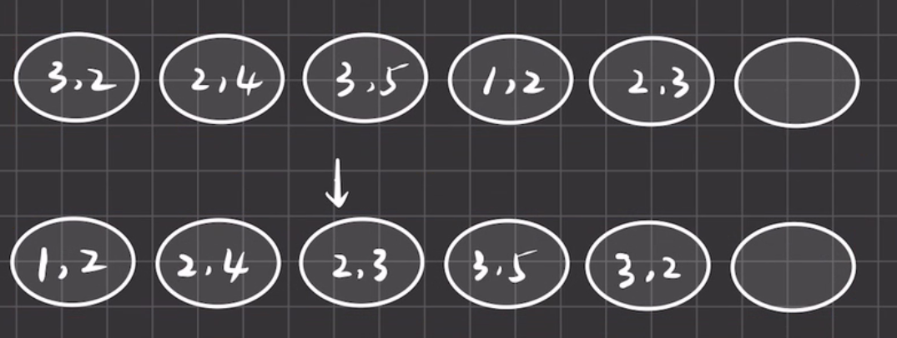

然后把二维数据单独拎出来做一个最长递增子序列就知道答案了。一维数据从小到大保证了底从小到大，然后二维数据打破了同底的递增序，这样一来只有是不同底的在二维数据中才可能递增。

我再给你举个例子。我给你一些二维的点，每一个点给你一个x方向的值，给你一个y方向的值。我问你我想找到一条线，一条曲线，这条曲线一定要严格的不断的往右上方窜的一条曲线。它不能够往下走，也不能够往左走，它只能往右或者往上走，或者平着来，或者往上走，怎么找到这么一条曲线穿过的点最多？这是不是信封套娃的问题啊？


### 子数组最大累加和

题目6

- 给定一个数组arr，返回子数组的最大累加和。

子数组：连续

用两个变量即可，一个变量cur，一个变量max。cur从左往右遍历数组，遇到一个数就加上去，然后看看能不能更新max。如果cur加得都<0了，那么就把cur置为0，然后继续遍历。

这个算法在数组是全负的时候也是对的。有负数和0的时候也是对的。现在证明三个都有的时候也是对的，我们假设数组的[m...n]是最大的累加和子数组，那么[m....i]和[i....n]这边上两段一定不小于0。并且[k...m-1]的累加和也小于0。所以说当我们的cur遍历到m位置的时候，cur一定是0，因为之前的[k...m-1]一定小于0。

设计流程！


### 子矩阵的最大累加和

题目7：

- 给定一个整型矩阵，返回子矩阵的最大累加和

子矩阵在大矩阵里面就是一个长方形。

思路：列举行的情况。0~0/0~1/..../0~n-1     1~1/1~2/.../1~n-1

然后在每种行的情况求一下列怎么囊括。列怎么囊括用子数组最大累加和即可。例如求0~3行情况的最大，那么把0~3行中的每一列加起来，压缩到一个数组里面，然后在哪个压缩数组里面求子数组的最大累加和。每次行情况求出来结果都用max看看能不能更新。

- 小优化：考虑行列的差异。


## Interview Coding 05

### 删成子串问题

code1：

- 给定两个字符串s1和s2，问s2最少删除多少字符可以成为s1的子串 ?

  比如 s1 ="abcde”，s2 =“axbc"。返回1。s2删掉x就是s1的子串了

思路1：如果s2比较小，那么就列出s2的所有子序列，然后和s1去kmp。原理是子序列删掉中间那些就连起来了。

思路2：把s1的所有子串搞出来，和s2去做编辑距离问题，这个编辑距离问题只能删除。或者反过来对称的，只有插入行为。和题目二的动态规划很像，只不过情况少了，只能删除了。

小优化：没有优化之前，子串N²，做编辑距离问题N*M复杂度，总复杂度O（N³ * M）。但是我们发现，我们从0~n子串到0~n+1的情况的时候，可以只加一行的dp就行。所以复杂度可以优化为O（N² * M）。那么我们可以利用没有优化之前的dp算法，返回一个dp数组出来，然后最后一列就是我们需要的答案。

### 编辑距离问题

code2：


比如说大家在用某搜索引擎搜索的时候，你搜了一个父亲节礼物。然后他给你联想了一个父亲节的礼物。他怎么做到的？编辑距离问题。他就把这个候选串中高频的候选串，看你的输入跟它有多少相似度。你编辑距离很小的，他先推荐。

思路：这题的插入和删除我们都认为在哪个位置插入和删除的代价都是一样的。这是一个样本做行一个样本做列的对应模型。


### 完全二叉树的结点个数

code3：

- 求完全二叉树节点的个数
  要求时间复杂度低于O(N)

思路：

1. 求树的总深度，假设有N层
2. 去看看head的右树的最左的结点是不是在第N层。如果在的话，那么说明head的左树是满的。如果没有在，那么说明右树是满的，只不过高度比左树满的情况少了一层。
3. 递归去求

复杂度：

- 在深度上玩等差数列，所以是O(  (log n)²  )

---


- 牛客网--面经。

- 北欧人--全

- career cup --- 国外的热门

### LRU

code4：

LRU算法：假设一个结构只能放三条数据。每个数据我都对应一个时间戳。每次查询或者修改的时候都更新为现在的时间戳。然后如果结构满了，又有新数据要进来，那么就找时间戳离现在最远的那个数据删掉，把新数据换进来。那么要你实现这么一个结构，通过k的方式给你，告诉你这个结构最多只能放k条记录。然后如果超过了，就按照上面说的来进行替换。只有put和get两种操作。要求put和get时间复杂度都是O(1)。

如果是堆和有序表实现的话，那么O(log n)是逃不了的。这个是LRU的算法设计。很难的是LFU--训练营第五期。这种数据结构设计题，它基本上也是用到讲过的结构拼出来的，我讲过哪些结构：队列、栈、哈希表、双链表、有序表。就这些玩意儿。

我们是双链表加哈希表的设计。一张表叫哈希表，这个哈希表的key就是用户给你的key，例如用户叫你把("abc",20)这条记录放到结构里，"abc"就是hash表的key，把“abc”这个字符串和20你给我怼到一起，做成一个node，作为hash表的value。这个node包含了用户的记录，还包含了两个指针---双链表。

当结构没满的时候，用户put记录，那么就把记录直接记到hash表中。例如用户记录为("a",10)，那么hash表的key就是“a”,value就是包含了记录的一个node结点，这个node结点是双向链表的一部分。如果现在用户get了，那么就可以直接从hash表中取出结果，结果都在node里。然后由于hash表可以直接找到node的位置，那么就把这个node直接从双向链表中间的位置拿出来，放到双向链表的最后位置，然后要把原本双向链表连好。双向链表中越尾巴的就是越近操作的。改双向链表的操作都是O(1)的时间复杂度。

你如果只有单链表，你单链表你通过中间的node，找前面那个你找不到，你没有办法把node分离出来之后，前面环境跟后面的环境连好，所以不能用单链表。


### 打印所有最短变换路径

code5：

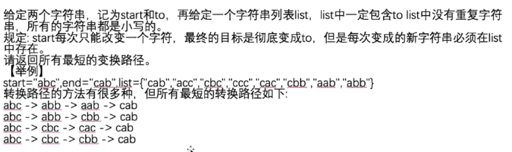

- 这题的操作全是替换。start和end和list中的每一个字符串的长度都是一样长的。
- 这题就是一个宽度优先遍历结合深度优先遍历。

我们先解决一个什么问题，list中所有的字符串，离star的最近距离是什么？先把这个整个这个list给我变成一张图，图中每一个字符串就是一个点。那两个点之间怎么样去知道有没有边呢？如果两个字符串只通过改动一个位置的字符，能相互变到，我就认为它有边。如下图所示。

abc邻居：akc、abb

abb邻居：acb、akb、abc

。。。。

然后我们就可以生成一张hash 表，hash表的key就是字符串，value就是一个list，里面放的是key的所有邻居。但是怎么去生成list中字符串的所有邻居呢？如果你是一个一个遍历，str1去看看和str2、str3、... 、strn有没有路径，所有都这么过一遍，需要O(N²)的复杂度，如果字符串长度是k，那么总体需要O(N² * k)的时间复杂度。太慢了！

来看看另一种思路。你把list里面所有的字符串都放到一个hashset里面。例如现在要找str1="abc"的邻居。要知道，有路代表abc中只能变一个，那么a可以变成b/c/d/e/f/.../z，总共有25个。字符串的每一位都有25种变法。那么str1是三个字符，那么就有3 * 25种变法。你去hashset中看看没有，如果有，那么它就是你的邻居。如果字符串长度为k，那么就有k * 25种候选邻居。str1~strn都去hashset里面查，时间复杂度降为O(N * k * 25)，降了一阶。但是这个时间复杂度是在认为在set中查找的代价为O（1）的情况下。但是由于hashset要把字符串的所有字符遍历一下，去求hash值，所以和k有关。所以我们认为在hashset中找存不存在是O（k）的复杂度，故最终复杂度为O(N * k²)，25忽略。如果字符不只是小写字母，如果是ASCII字符，那么也就是128 * k。所以实际上是O(N * k²)大还是O(N² * k)大，根据具体的数据去决定。


coding问题：要返回一个list的list。因为我们需要返回所有的路径，一个路径就是一个list，返回所有的list就需要list的list。

- 当我们不能忽略hashset中单样本大小的时候，在hashset中求这个样本的hash值的时候，时间复杂度就是O(K)。因为算String的hashcode需要遍历string中的每一个字符串。

所以现在我们有所有结点的邻居。然后求了start到所有结点的最短距离---宽度优先。然后根据知道的最短距离去深度优先遍历收集答案，在深度优先遍历的时候，只有让距离增大的邻居我才去走，父保证子的递归是合法的。要记得恢复现场。

### 图结构练习题

code6：

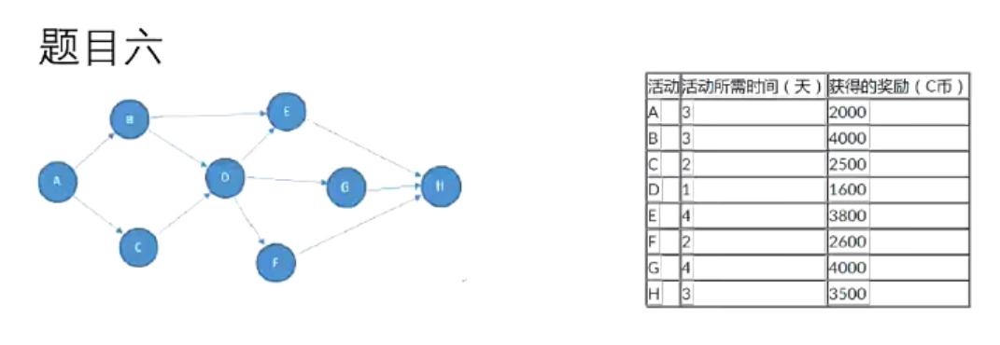


## Interview Coding 06


### 异或和问题

题目1：

- 一个数组的异或和是指数组中所有的数异或在一起的结果给定一个数组arr，求最大子数组异或和。

它是一道比较难的题。首先我没有说这个数组正负零这回事儿。那你就可以认为这个数组中什么值都可能会出现。而且它不是什么累加和最大，它也不是什么乘积最大，它是异或和最大，这个运算它跟乘跟加可不一样。两个超小的数异或起来可能超大，两个超大的数异或起来可能超小，一个两个中不溜的数异或起来可能超大或者超小。你完全无法摸住这个这个运算的性质。

你看到这种子数组的问题，你把你流程定成啥呀。每个位置开头的情况下怎么怎么样，每个位置结尾的情况下怎么怎么样，如果我都求出来，每个位置结尾或者开头时候的答案，那么我总答案不会错过。

暴力流程。我们枚举以每个位置结尾的子数组的异或和，然后求出最大的。0位置结尾的就是0~0。1位置结尾的就有0~1,1~1。这样去枚举肯定可以求出答案。异或这个运算太魔性了，我们摸不出什么规律。我们不摸这个规律我们怎么做比较快呢？如果是暴力的话，子数组个数是N²，然后遍历子数组求异或和是N的复杂度，所以总的求子数组的最大异或和的时间复杂度就是O（N³）。

这道题最终可以做到O（N）的复杂度！

我们先从我们的流程入手。我们前面暴力解在求异或和的时候是遍历子数组求异或和的，但是其实0~i的异或和其实等于0~i-1的异或和再异或arr[i]。所以我们可以用一个前缀异或和的预处理数组来加速我们的流程。求异或和数组只需要O（N）的复杂度，子数组个数依然是N²，但是求子数组的异或和只需要O（1）的复杂度了。所以总的复杂度可以降为O（N²）。eor[i]代表0~i的前缀异或和。那么arr[i...j]的异或和就是eor[j] ^ eor[i-1]。

我们不能优化的原因就是我们不知道我们之前算的哪一个异或和是有用的，是可以让后面异或和更大的。所以我们只能去枚举。这是慢的根本原因。

异或就是二进制的不进位相加。现在你要求5结尾的最大异或和。此时你知道0~5的前缀异或和eor[5]。按照我们之前的流程，我们是让eor[5]一个一个的和eor[0]/eor[1]/.../eor[4]去异或，看看哪个比较大的。但是由于异或是不进位相加，eor[5]的二进制是0110。我们肯定希望eor[0]~eor[4]中有1001。即便没有，我们在选择的时候也是从左到右优先的去选，例如1110就比0001好。1110只有第一个符合我们的预期，即便0001有三个符合我们的预期，但是也是1110最好。所以说我们可以把之前求的所有的前缀异或和按照二进制的形式全部加到前缀树里面。然后按照预先的决策，朝着最有可能最大的路去走。例如我们现在把eor[0]~eor[4]的前缀和的按照二进制的形式全部加到前缀树里面。然后我们希望按照1001的决策去走。也就是在头节点先看看有没有走向1的路。如果有就走，如果没有就走另外一边。然后第二次选路的时候就优先选走向0的路，以此类推，最后走到的位置我们拿到走向它的路径。去和eor[5]异或一下，就是以5结尾的子数组异或和的最大值了。

所以给了我们一个启发，如果你的优化思路和前缀预处理结构有关，那么前缀树可能是你解题的突破口。

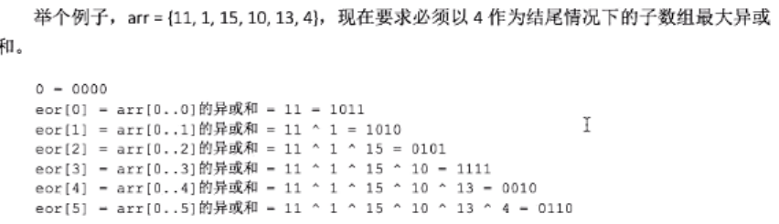

但是还要继续推广。因为我们上面讨论是无符号的整数的情况。int类型是有正负的。我们肯定希望最后的结果是一个正数，也就是最高位是0。那么如果最高位是1，我们希望异或一个最高位也是1的让它变成0。如果最高位是0，那么希望异或一个最高位是0的。如果最高位可以满足变成0，那么我们希望从左到右异或完之后是1，这样可以保证结果最大。如果最高位只能是1，那么由于计算机里面是补数的概念，全1表示-1，也就是我们还是希望从左到右异或完是1，这样结果不会那么小。

所以我们的贪心策略是：我们希望高位和xor[i]一样，然后剩下的位从左到右最好能和xor[i]异或完之后能都是1。

---

加一道题，但是和异或有关的。在训练营四期

给你一个数组，你可以随便划分，划分成多少块都行，问你划分出来的块，异或和为0的块，最多能有几块？

假设dp[i]为arr[0...i]进行划分，异或和为0的块的最大数量。假设eor[i] ^ eor[j] = arr[j+1^...^i] = 0。很显然arr[j+1...i]可以划分为一个块，异或和是0 ,那么dp[i]=max{dp[i-1],dp[j]+1}。分类原则就是看i位置的数所在的块，是不是异或和为0的，如果不是，那么这块就没有用，dp[i]=dp[i-1]。如果是异或和为0的，那么就找到最近的异或和等于eor[j]==eor[i]的，然后就等于dp[j]+1。这两种情况求最大值。

- 我自己的尝试思路：如果arr[i]=0，那么就可以自己单独成块！至少是dp[i-1]+1。如果自己是1，那么就找到最近的异或和等于eor[j]==eor[i]的，然后就等于dp[j]+1。两种情况求最大值。（正确性待验证）
- 假设答案法，分析最后一个位置和答案有关还是无关。
- 注意，你划分出来的块不都是0，只是说你划分出来为0的块最多就行了

### 运算顺序组合

题目2：


- 你可以利用小括号得到所有的运算顺序，假设通过你加小括号总共有all种运算次序。问你这all中运算次序中能返回true的有几种。

一开始偶数位置上的东西不是0就是1，奇数位置上是与、或、异或。整个字符串的长度是奇数

- 动态规划，范围上的尝试模型

定义f(str,l,r,desired)。代表在str[l...r]的范围上，期待结果是desired总共有多少方式。假设f(str,0,10,desired)，那么就可以按照某个运算符作为最后一个运算来划分。假设以str[1]的运算符来作为最后一个运算符、以str[3]的运算符来作为最后一个运算符、...   、 然后根据这些位置的运算符是什么，来确定递归的左右两边分别期待什么结果。

l和r都是压中字符“0”和字符“1”的位置，不可能压中逻辑符号的位置，因为我们进递归之前都检查了字符串的合法性。暴力递归搞定，动态规划就出来了。f有三个可变参数，但是有一个参数只有两个可能的值，所以两张二维表可以搞定，一张true表，一张false表。

表是一个正方形。因为l<=r，所以表只有一半有用。由于l和r都是偶数位置，所以表中的奇数位置也没用。

照着递归直接改动态规划

### 跳格子问题

题目3：

- 给出一组正整数arr，你从第0个数向最后一个数，每个数的值表示你从这个位置可以向右跳跃的最大长度，计算如何以最少的跳跃次数跳到最后一个数。

思路：5步内能跳到的右边界是多少，可以由4步内能跳到的右边界决定的。base case就是0步内只能跳到0。准备三个变量，step代表现在走了几步，curR代表当前步数能到达的右边界，next是下一层能到达的右边界。从左往右遍历，遍历到9位置的时候step就是答案。从左往右的尝试模型。

### topk两数累加和

题目4：

- 给定两个有序数组arr1和arr2，再给定一个正数K，求两个数累加和最大的前K个，两个数必须分别来自arr1和arr2。

这里说的不能重复不是说12+14=26这个值不能重复，而是说两个数组中下标组合不能重复。


思路是一个样本做行一个样本做列的模型。

最开始先把最右下角的放进大根堆，大根堆用累加和来排序。然后以后每次都从大根堆中弹出一个node作为一个答案，然后把node的左边和上边都压进大根堆。但是要防止重复压入大根堆，所以需要有一个二维的boolean数组来判断是否已经压入过。

复杂度是O（k * logk）


### 切分累加和相等的数组

题目5：


这道题其实非常简单啊O（N）搞定。然后只用一张哈希表。这也不是啥动态，要分辨能不能动态规划有时候还挺麻烦。有一个很大的套路，是关于动态规划的，二叉树也是递归套路也是动态规划，在树上做动态规划，几种什么套路模型也是搞动态规划的。那你面对这种设计怎么算的这种算法呢？其实还挺难找感觉，只能练。

思路：我先把所有的前缀和。全记在这个哈希表里。注意，它是正数数组。其实如果不是正数数组的话，也有办法做，我们先说一下正数数组，因为正数数组它分析起来很简单。这个正数数组，那么它所有的前缀和都是不一样的，是递增的前缀和。用一个map记录每个位置结尾的前缀和。

首先你要知道。你切出来的部分得有数。你又是严格是切三刀。画出四个部分来。所以你知道你这个数组长度一定是大于等于七的。我们枚举什么呢？我们从1位置开始枚举。枚举的是第一刀的位置。为什么不从零枚举？因为零它做不了第一刀零，它要做第一刀，它左边没东西。我第一刀枚举的位置应该到哪？恐怕不是到n- 1。因为这样剩下的几刀没法放了。例如上面的arr[3,2,4,1,4,9,5,10,1,2,2]，假设第二刀下标在N-2，第三刀在N-4，那么第一刀只能枚举到N-6。也就是说第一刀枚举的位置是1~N-6。

如果第一刀的位置是i，如果有第二刀j，假设sum[i]代表前缀累加和数组，那么sum[i-1]=sum[j-1]-sum[i]，转化一下，也就是sum[j-1]=2 * sum[i-1] + arr[i] 。如果有第三刀z，那么就再看看sum[z-1]=3 * sum[i-1] + arr[i] + arr[j] 。我们是用hashmap来记录前缀和了，用数组记录也是一样的。在第一刀定了之后，中间如果有任何一个环节不对，那么说明第一刀放在那个位置是不行的。由于你只枚举了第一个位置，后面所有的位置成不成立都是在map中查的，所以复杂度为			O（N）。


### 判断交错组成字符串

题目6：


如果str1和str2没有重复字符，那么就可以用两个指针搞定。但是如果有重复字符就不行了，因为你没有办法判断这个重复字符属于哪个str。

思路：动态规划。首先过滤，str3的长度一定是str1和str2长度之和。还是一个做行一个做列的模型。还是一张二维表，但是行和列是0~N和0~M了。dp [i] [j] 的含义是str1前缀i的长度，str1[1...i-1]。str2拿j长度出来，也就是str2[0...j-1]。问能否交错组成str3的i+j长度，str3[0...i+j-1]。dp表中填的是布尔类型的变量。dp [N] [M]就是答案。

接下来就是填格子。dp [0] [0] 就是str1和str2都是空串，肯定是true。第一行和第一列都是看前缀是不是和str3的前缀一样，如果一样就一路true。一旦不等后面都是false。然后填普遍位置的顺序就是从上往下，从左往右。这样填每个格子的时候左边和上面的格子都是填好了。

接下来整理可能性。如果dp [i] [j]来自于dp [i-1] [j] ，那么dp [i] [j]=dp [i-1] [j] && str3[i+j-1]==str1[i]。如果dp [i] [j]来自于dp [i] [j-1] ，那么dp [i] [j]=dp [i] [j-1] && str3[i+j-1]==str2[j]。

### 最少的回文部分数

题目7：

再来一个范围上的尝试模型题目：一个字符串中，最少把字符串分为几个部分，能让分出来的部分全是回文串。

当然有一种方法是把每一个字符都切开，这一定是回文串。

这个几个尝试模型。你比如说从左往右的尝试模型。太多了，背包问题，每个位置要不要这种展开的。包括我们这个题，其实它利用的是从左往右的尝试模型加范围上尝试模型解决的。那么一般来讲，我们练的稍微多一点的是一个样本做行一个样本做列的对应模型。当你解题的时候，你发现前缀串只讨论结尾字符的可能性，能够把所有可能性列全，而且能试出来，那就是一个样本做行一个样本做列的对应模型。

他还是从尝试来的，就有一个东西就非常关键，可能性的组织。我发现我讨论前缀串的结尾的情况是能讨论干净的。这个尝试能做，那就是一个样本做行一个样本做列的对应模型。所谓的范围上尝试的模型是什么样？一种尝试思路就是在整个串或者一个样本上，我选择各种不同的分割点。这样的可能性展开，它最后就对应到范围上尝试的模型。因为你有分割点的话，你意味着左侧一个范围，右侧一个范围。

所以所谓的一个样本做行一个样本做列的对应模型，还是我们范围上尝试的模型，只是可能性的组织方式不同。就是如果我发现我利用前缀串可能性的组织，只讨论前缀串的结尾，类似于这种样的讨论。不需要再通过枚举，什么割裂点，分割点这种玩意儿，能够讨讨论干净，那就是一个样本做行一个样本做列的对应模型，但是如果发现我在一个范围上，我在讨论可能性的时候，我必须把它找若干个分割点去求这个答案的话，它就是范围尝试的模型。

这题f(arr,i),含义为arr[i...N-1]最少能划出几个部分让这几个部分都是回文。假设现在要求f(arr,i)，假设i位置以后的字符串是ababckkcb121。那么看看以i位置为前缀开头，能有多少个回文串，都去尝试一下，凑出答案。例如a自己就是一个回文，所以dp[i+1]+1就是一个答案。ab不是回文，所以dp[i+2]就不用考虑。aba是回文串，所以dp[i+3]+1也是一个答案。最后这些可能的答案求一个最小值。如果我们是遍历的方式去检查回文，那么复杂度就是N，你填dp表的时候需要列举后面所有的可能，复杂度是N²，所以总的复杂度是N³。

- 因为我们的复杂度组成是N² * N，如果我们可以用N²的复杂度，设计出一个预处理结构，可以把后面的O（N）变成   O（1），那么总的复杂度就变为N²。

但是如果我有一张表，是一个二维数组，可以告诉你这个数组l~r是不是一个回文。那么复杂度就低了。我们来看一下怎么生成呢？范围上的尝试，对角线单独填好，左下半区没用。然后一个普遍的位置dp [i] [j] ，i~j范围上要是回文，首先i位置的字符要等于j位置的字符。并且i+1~j-1的范围上也是回文。所以一个普遍的点(i,j)依赖左下角的点。所以我们可以一条对角线一条对角线的填。


## Interview Coding 07

### 需要排序的最短子数组

code1：

- 给定一个无序数组arr，如果只能在一个子数组上排序
  返回如果让arr整体有序，需要排序的最短子数组长度

1,2,3,7,6,5,4,8,9。这样的数组只需要7,6,5,4排序即可，所以返回4。如果数组是4,3,2,1那么就只能整体排序。

流程：先从左往右遍历，然后从右往左遍历。从左往右遍历的时候，来到了i位置，一路更新0~i位置的最大值max，一旦你发现i位置的数小于max了，那么说明递增断掉了，i位置不合格。找到最右的不合格的位置r。从右往左遍历的时候我们想要数组是递减的，所以要记录min，一路更新i~N-1的min，然后找到最左的不合格的位置l。l~r就是我们要排序的范围。

原理：我们利用max可以找到非递增区间，利用min找到非递减区间。在这两个区间之外的就是从左往右递增，从右往左递减，是不需要排序的。从左往右遍历打上叉号意思就是以后需要给比自己大的让路。从右往左遍历打上叉号意思就是以后需要给比自己小的让路。两边的就是不需要让路的，自然就不用动了。

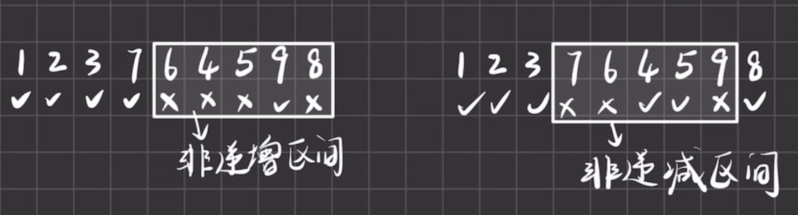

### 最小不可组成和

code2：

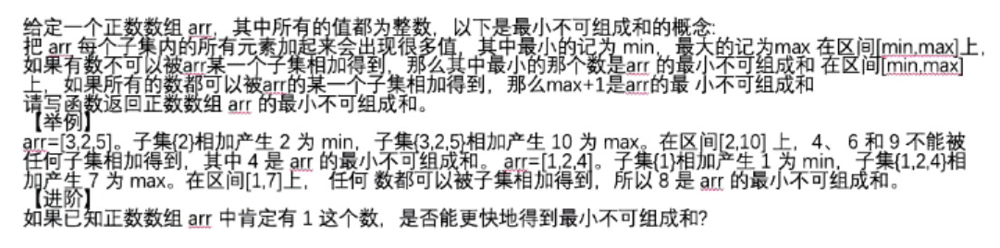

- 背包问题。dp[i] [j]代表arr[0...i]能不能组成j的累加和。如果dp [i-1] [j] = true 则 dp [i] [j] = true。 

  否则dp [i] [j] = dp [i-1] [j-arr[i]] 
  
- 背包问题的解法，二维矩阵至少是N²，因为就算arr里面素有值都是1，加和最小也是N。

直接做进阶。之前的所有条件都不变，多加一个条件，arr中一定有1这个数，问有没有更快的解法。

先排序--N log N。然后有一个变量range表示0~range所有的数都可以加出来，range一开始设置为1。来到一个位置i的时候，假设这个位置的值是a。有两种情况，a>range+1 和 a<=range+1。在面对第二种情况的时候，range=range+a，因为range的含义就是0~range的所有我都能得到，所以如果a比我range+1小，那么此时range就能够凑成更大范围的数了。如果中了第一种，那么直接返回答案，答案就是range+1，因为往后的数都不能用了，因为太大了，range+1永远都得不到了。那么如果一直没违规，那么把数组处理完之后的range+1就是答案。


### 加和全覆盖

code3：


用题目2的技巧来解题目3。先看arr如果没有，我们缺几个数----二进制！(1,2,4,8,16.....)。

如果你已经达到了1~range所有的数你都能累加出来了，但是你还没有达到aim，那么你永远缺的是range+1这个数，它一定是最省且最经济的数。加上之后，你能到达的范围就从1~range变成了1~2 * range+1 了。

思路：在遍历的过程中如果我来到了i位置，值是a，那么我在这之前一定要完成1~a-1的这个范围才行，否则就缺数了！range在遍历的过程中会变大，变大的来源是你补上了缺的数字，或者你使用了arr中的数字。只要你的range在遍历的过程中达到了aim，那么就停，返回答案。如果你遍历完数组之后还是没有达到aim，那么就每次补上range+1，最经济的去接近aim。


### 返回数组中独立的域

code4：

- 一个数组中，如果两个数的公共因子有大于1的，则认为这两个数之间有通路。返回数组中，有多少个独立的域
- 一个数组中，如果两个数的公共因子有大于1的，则认为这两个数之间有通路。返回数组中，最大的域有多少个元素

3和6有一个公共因子3,3和21也有一个公共因子3，所以可以认为3和6和21是连在一块的，连在一块的称为一个域。问你一个数组中，互不相连的域有几个。


- 思路肯定是并查集，关键是怎么用并查集。假设并查集你已经实现了，并查集的操作复杂度是O（1）。对于一个arr，先把arr里面所有的数都加到这个并查集里面，每个数都是单独的集合。然后0下标和1下标、0下标和2下标、0下标和3下标、。。。、0下标和n-1下标看最大公约数是不是大于1的，是的话两个集合就union。然后最后看看并查集里面有几个集合就是有几个域。这种方法的复杂度是O（N²）

- 接下来换一个思路。如果我告诉你arr里面的数值范围不是很大。假如我现在拿到了第一个数20，下标是0，那么20背后的质数因子就是2和5。那么就用一个map记录(2,0)/(5,0)。第二个数是7，下标是1，map记录下(7,1)。第三个数14，下标2，指数因子是2和7，一查在map里面有，那么map就不需要记录了，map只有在没有的时候才添加。在map里面一查，发现之前下标0的那个元素对应的结合里面有质数因子2，所以就把2下标的集合与0下标的集合合在一起。同理，2下标的集合与1下标的集合也合在一起。这样等价于012下标对应的集合都合在一起了。 

  要得到一个数V的所有质数因子，需要O（V）的复杂度，因为你需要从1一直遍历到V才知道。整个算法的时间复杂度变为O（N * V）。如果V比n小，那么就可以用这种方法。

- 还有更好的方法，最终可以优化成O（N * 根号V）。其实遍历最多只需要遍历到根号V即可，我们不找质数因子，找所有因子。下面是证明。 也就是我要找17的所有因数，我们从1开始试，从1一直试到根号17下取整，也就是4。我们只找到了一对 1 * 17=17，我们把1忽略，只放17进去。

  

- 补充一个知识点：如果求a和b的最大公约数？辗转相处法！一行代码。唯一的约束就是初始调用的时候保证m和n都不是0。假设求30和20的最大公约数。gcd(20,30)-->gcd(30,20)-->gcd(20,10)--->gcd(10,0)--->10，20和30的最大公约数就是10。

  ```JAVA
  public static int gcd(int m, int n) {
     return n == 0 ? m : gcd(n, m % n);
  }
  ```

  证明：
  
  ```
  辗转相除法，也称欧几里得算法，可以用来求两个正整数a和b的最大公约数（Greatest Common Divisor，缩写为GCD）。当a和b不是正整数时，辗转相除法可能会失效，因此a和b必须是正整数。
  
  辗转相除法的基本思想是：假设a>=b，则a和b的最大公约数等于b和a%b的最大公约数。如果a%b=0，则b即为a和b的最大公约数。如果a%b不等于0，则继续对b和a%b进行相同的操作，直到a%b等于0为止。
  
  由于负整数的余数可能为负数，所以当a或b为负整数时，辗转相除法的结果可能不是最大公约数，因此a和b必须是正整数。
  
  证明：
  对于两个自然数 a 和 b,若存在正整数 q,使得 a=bq,则 b 能整除 a,记作 b | a,我们叫 b 是 a 的因数,而 a 是 b 的倍数.
  那么如果 c | a,而且 c | b,则 c 是 a 和 b 的公因数.
  
  由此,我们可以得出以下一些推论:
  
  推论一:如果 a | b,若 k 是整数,则 a | kb.因为由 a | b 可知 ha=b,所以 (hk)a=kb,即 a | kb.
  
  推论二:如果 a | b 以及 a | c,则 a | (b±c).因为由 a | b 以及 a | c,可知 ha=b,ka=c,二式相加,得 (h+k)a=b+c,即 a | (b+c).同样把二式相减可得 a | (b-c).
  
  推论三:如果 a | b 以及 b | a,则 a=b.因为由 a | b 以及 b | a,可知 ha=b,a=kb,因此 a=k(ha),hk=1,由於 h 和 k 都是正整数,故 h=k=1,因此 a=b.
  
  辗转相除法是用来计算两个数的最大公因数,在数值很大时尤其有用而且应用在电脑程式上也十分简单.其理论如下:
  
  如果 q 和 r 是 m 除以 n 的商及余数,即 m=nq+r,则 gcd(m,n)=gcd(n,r).
  
  证明是这样的:
  
  设 a=gcd(m,n),b=gcd(n,r)
  
  则有 a | m 及 a | n,因此 a | (m-nq)(这是由推论一及推论二得出的),即 a | r 及 a | n,所以 a | b (其中a和b都是最大公约数（为所有不同公约数的乘积），故若a是n和r的公约数，那么a必然能整除n和r的最大公约数b，即a | b)
  
  ---公约数可以整除最大公约数---
  
  又 b | r 及 b | n,所以 b | (nq+r),即 b | m 及 b | n,所以b | a.因为 a | b 并且 b | a,所以 a=b,即 gcd(m,n)=gcd(n,r).
  ```
  
  
  
  

### 保留单个字符使结果字典序最小

code5：

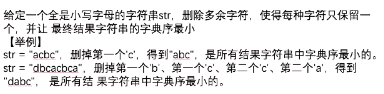

- 字典序

  ```
  显然的做法是先按照第一个字母、以 a、b、c……z 的顺序排列；如果第一个字母一样，那么比较第二个、第三个乃至后面的字母。如果比到最后两个单词不一样长（比如，sigh 和 sight），那么把短者排在前。
  ```

- 假设你有一个str，里面有三种字符，那么你就去删，删的最后里面还是三种字符（你不能给我删成两种字符了），但是要求字典序最小。
- 其实删除的顺序等价于一个挑选的次序。因为客观上就是你在原本的str中挑选几个下标下面的字符，这几个字符是互不相同的，并且满足挑出来的这几个字符组成的字符串字典序最小。
- 贪心流程：
  1. 首先统计词频，记在一个map里面。
  2. 然后从左往右遍历，遍历到str[i]就把map里面对应str[i]的词频-1。
  3. 假设从左往右遍历到k位置的时候第一次发现你把map中某个字符c词频减成0了，那么你就需要在0~k之间的位置挑选一个位置字符的作为你答案的第一个字符，因为在k位置往后开始挑的话你就没有c这个字符了，因为c的词频已经在k位置减成0了。0~k位置这么多字符我挑哪个作为我答案的字符呢？挑选0~k中字典序最小的，且最靠左的字符，选字典序最小的是显而易见的，最靠左是为了右边有更多的选择空间。例如0~k位置的str为dccdbc，我们就选择b。
  4. 把3.中你挑选的那个字符a的位置，假设是index位置，在str[index+1....N-1]位置中把所有的a字符去掉，重新生成一个str，回到1. ，继续挑选。直到重新生成的字符串是空串。


### 最长不重复子串

code6：


思路：动态规划！看到**子串**、**子数组**，想每个位置开头的子串怎么怎么样，或者每个位置结尾的子串怎么怎么样。我们现在就求子串必须以i位置结尾的情况下， 最长的无重复字符的子串长度是多少？求出以i结尾的子串答案是什么，0~N-1的答案你都求完之后，答案就在其中。影响你i结尾往前推到多少，取决于你str[i]这个位置的字符（a）上次出现的位置，如果上一次出现字符a的位置是k，那么从i位置最多推到k+1。用map来记录每个字符最近一次出现的位置。如果dp[i-1]最多推到k位置，那么dp[i]一定也不会推超过k位置。

`dp[i]=map[s[i]]==-1||map[s[i]]<i-dp[i-1]?dp[i-1]+1:i-map[s[i]]`。

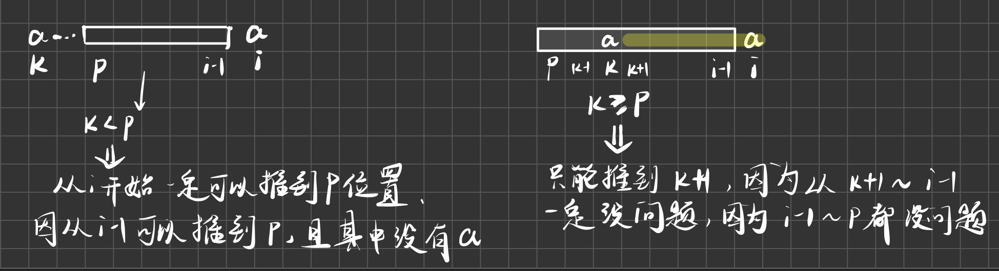

- 我自己在做的时候想到的是滑动窗口。--Code2718

### 直线穿过的最多点数

code7：

- 给定两个数组arrx和arry，长度都为N。代表二维平面上有N个点，第i个点的x坐标和y坐标分别为arrx[i]和arry[i]，返回求一条直线最多能穿过多少个点?

如何尝试：假设二维平面总共有(a,b,c,d,e,f,g)这几个点，我们尝试直线必须经过a的情况下求一个答案，必须经过b的时候求一个答案，。。。，最终答案一定在其中。遍历一遍数组，统计和a重合的点，和a的x坐标相同的点，和a有一个斜率的点---记在一个map，key就是斜率，value就是这个线经过了几个点。共y的情况就是斜率为0的情况，也记在map里面。最后从map中取出一个最大和共x的pk，取出一个max，max+重合的点的数量就是这条线经过的点的数量。这个流程太慢了，求必须经过某个点的经过二维平面上点最多的直线，是一个N的过程，总的就是N²的过程。

重合的点算不算取决于题目。

上面的过程能不能优化一下，你在求直线必须经过c点的时候，其实a和b就不需要考虑了，因为直线经过c又经过a的情况已经在直线经过a的时候就求了一个max了。即便如此，复杂度还是O(N²)

但是这道题还有一个很大的问题就是map中的那个斜率你怎么表示？你如果用double来表示斜率，有可能因为精度误差导致你明明不是一个斜率的直线，你认为是同一个直线了。所以我们就不要把x/y算成double值当成斜率，我们把x/y记成一个字符串或者一个Node来表示斜率。但是x和y我们要约分一下，约到不能再约，例如100/300，我们就除他们的最大公约数100（辗转相处法），然后把1/3记成一个字符串“1_3”，这样可以保证万无一失。可以用一个map(分子,map(分母，次数))来统计。要注意，辗转相除法计算的时候m和n都要是正整数。负数的话你就分为规定分母上带负号还是分母上带负号。


## Interview Coding 08

### 接收消息打印结构设计

code1：

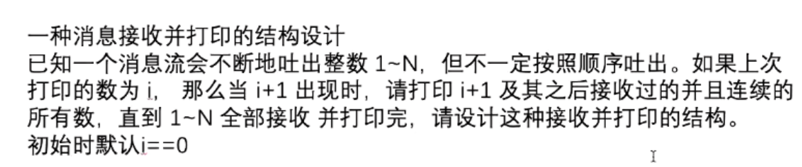

看电影的场景。这是一个结构，那么这个视频网站它会给你发电影的包。比如说从零号包开始，0/1/2/3/4/5..../n，它不一定是一个顺序来的。加入按照2、5 、4 的顺序来了，这时候你只在这个结构中留着它们，但是你不给用户播放，因为你零号包没到，然后1/3/9按照顺序来了，接着0号包来了，那你就给用户先播放零到五的内容。

看B站的时候，有的时候会卡一下。有可能你网络其实挺好的，但是为什么会卡一下呢？其实就是因为它这个在缓的过程中，迟迟等不到某个包，有可能你这个视频中其他内容已经加载好了，但是迟迟等不到那个按时序的那个包。那么这个时候你的这个APP，就会给这个远程的这个视频网站重新发一个请求，说你把这个我一直等不来的信息，你再发我一份儿，我整合完了之后，我就可以继续往下播了。

这个结构，信息体是一个单链表结构，有一个Node里面封装这序号和内容，以及还有一个指向Node的指针。然后有两张表，一张表叫头表，一张表叫尾表，都是map<Integer,Node(sequence,content)>。头表和尾表的元素的个数是相同的。添加过程如下，每次有信息到来都在head和tail分别建立一个结点，这个结点里面装的是信息的内容以及信息的序号k。然后看看k-1这个序号有没有在tail表里面，如果有的话就把tail表里面的key为k-1的记录删掉并把对应的Node取出，指向这个新节点，把head表里面把key为k的记录也删掉。这样还没完，继续查一下head表里面有没有key为k+1，如果有的话还要和后面的连。

因为你加入一个信息序号是k，其实就是把k~k的连续区间加进去了，你除了看tail表里面有没有k-1的key，还要看head表里面有没有k+1的key。

然后你等的那个信息序号（waitPoint）记在结构里面，等到那个序号的信息到来了，你就可以打印一串，然后更新你等的那个信息的序号。

Node里面你放不放编号其实无所谓，来信息的时候我知道这个编号方便我建立记录就行了。因为我打印信息的时候不需要打印编号，所以编号可以爱要不要。

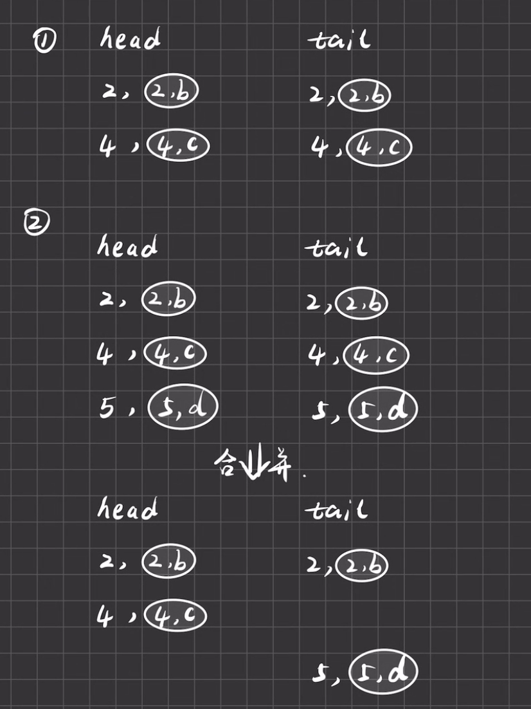

为什么需要用单链表把它串在一起？这个事情要解释一下。因为当我们等迟迟等着的那个信息到来的时候。我们可以一打印就打印一串。别看你只记录了头结点和尾结点，实际上中间的那些结点都被你串好了，可以一下子打印好多信息。结构中头只有头表跟尾表，那是为了让你的连续区间该合的合，该化简的化简，非常的快速。但是你迟迟等到的信息，如果到来的时候因为单链表的缘故，也能让你一打打印一串儿出来。

### 普通币、纪念币凑面值

code2：

- 现有n1+n2种面值的硬币，其中前n1种为普通币，可以取任意枚，后n2种为纪念币，每种最多只能取一枚，每种硬币有一个面值，问能用多少种方法拼出m的面值?

普通币里面。无重复值。因为它每一枚币本来就可以表示任意一枚，你有重复值是没有用的。另外就是纪念币呢，它这个是有可能有重复值的。重复值的具体情况在输入的时候提前约定。

这道题其实它就是两个动态规划。

第一个动态规划。给你一个无重复值的数组。这个无重复数组中每一个值代表一种面值，它可以使用任意一张的情况下，找出某一个钱数有多少种方法。dp1 [i] [j]代表使用arr[0....i]的情况下，凑出j元的有几种方法。j=0的情况下，二维表的值都是1，因为凑出零元，我一张货币也不用也是一种方法。i=0的情况下，只有是arr[i]整数倍的列才填1，其它都是0。

然后对于任意的一个dp1 [i] [j]位置，我来列举i号货币我使用0~k张的情况下，dp1 [i-1] [j-k * arr[i]] 的值全部加起来就是dp1 [i] [j]。之前说过，这种累加的是可以优化的。其实dp1 [i] [j] = dp1 [i] [j-arr[i]]+dp1 [i-1] [j]。看下图就很清晰了，i位置等于上面三个红色相加，蓝色等于上面两个红色相加，那么i其实就等于蓝色的加上自己头顶上那个红色的就行了。

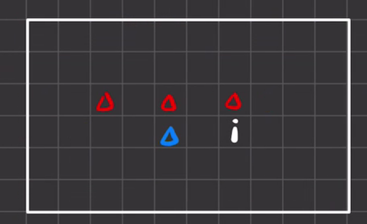

dp1求出来之后对我们有纪念币这题的作用就是最后一行。

第二个动态规划，就是处理纪念币的问题。这个问题就是普通背包问题。和第一种动态规划的区别就是第一种的动态规划每种货币可以使用很多次，你要去累加上一行的很多格子的答案。第二种动态规划就是每种币只能使用一次，你只要累加上一行两个格子的答案就行了。

两个动态规划都求好以后，假设要凑出m元。那么就列举第一种方法搞定k元（0<=k<=m），假设有n1种方法。第二种方法搞定m-k元，假设有n2种方法。n1*n2累加到总的方法数sum里面。累加m次之后，sum就是要的答案。

### 从1写到N，写了多少1

code3：

- 给定一个正数N，表示你在纸上写下1~N所有的数字。返回在书写的过程中，一共写下了多少个1

打表法没法做！

这道题很难，而且这道题。它就属于我们在尝试模型给的四种尝试模型中没有提到的那个额外的那一种。这是一个数位dp的模型。

设计一个递归f（N）。递归里面，它有一个非递归的部分和一个递归的部分累加得到。例如f(13625),我先在里面用一个非递归算法把3626~13625有多个1给求出来，然后调用递归f(3625)。f(3625)还是先在里面用一个非递归算法把626~3625有多个1给求出来，然后调用递归f(625)。这个递归有一个base case，就是当i小于10的时候，就只有1个1了。

现在的问题就是非递归部分怎么算了，分为最高位是1和不是1的情况，13625就是最高位为1的情况。3626~13625 中万位有1的就是10000~13625，总共3626个1。那么现在假设是xxxx~1xxxy，那么总共就是1xxxy/10 +1 ，或者假设1xxxy是k位，表示为1xxxy % 10^(k-1)   +1  也行。

最高位是1。公式如下。

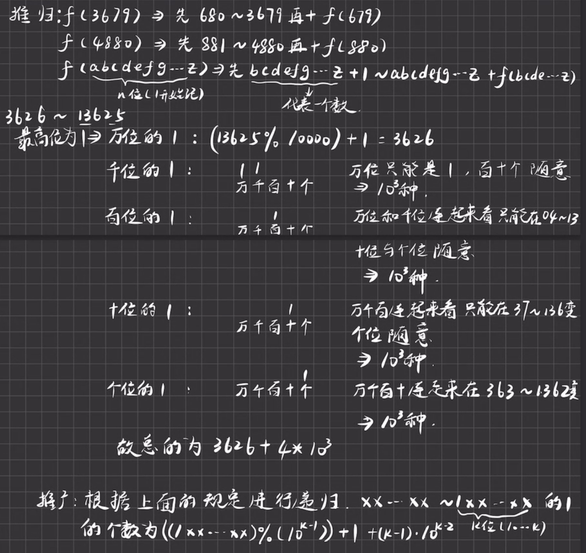

最高位不是1，公式如下。其实除了最高位为1上面公式和下面公式不一样，最高位不是1的时候其实公式可以统一的，因为下面其实就是乘了一个最高位的数firstNum，上面的情况其实就是乘了个1。

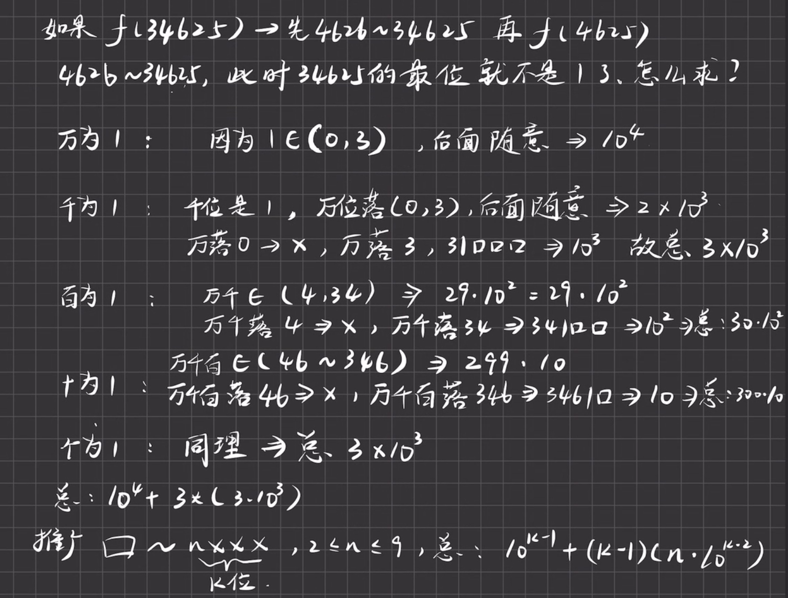

注意：固定为1的时候，有很多种情况，10^k次方种可能是左右两边一起共献，也可能是单边共献的。

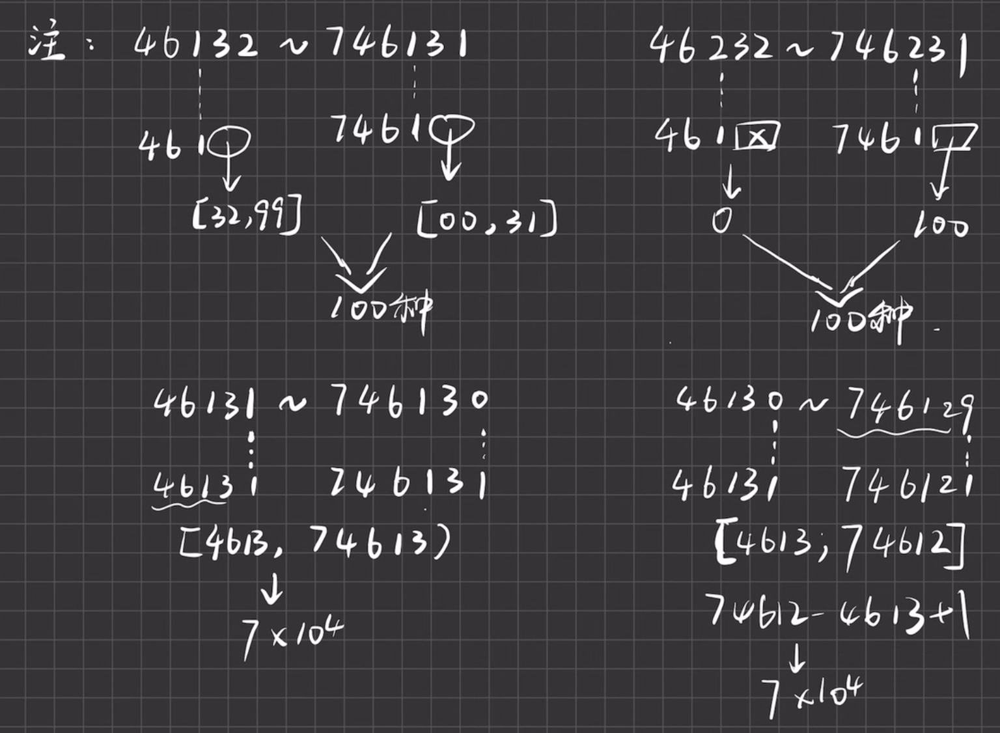

可以根据最高位数字进行分段。例如上面就可以分为46131~146130  146131~246130   246131~346130    346131~446130     446131~546130   546131~646130   646131~746130  可以分为七段。你可以个十百千万随便变		 10 ^ 5 这么多数。例如12345，那么我调整最高位是1让它落在第一段。调整最高位可以让个十百千万随意变都落在七段里面。因为你十百千万十万随意变我都可以满足七段，所以我现在固定其中的一位为1，其它随意变，还剩下4位可以随意变，所以就是7 * 10^4 。个十百千万这五位都可以这样搞，所以现在个十百千万上的1个数就有7 * 10^4 * 5了，还剩下十万位上的1的个数，那就是100000~199999，总共10^ 5 个。加起来就是总数。

我们先看一下这个时间复杂度是啥呀。大的调度是你每次拨掉一个数字，一共拨了log n次，然后你在非递归里面就是套公式，在算10^ n怎么算，10 ^ n 计算是一个log n的时间复杂度。所以总的时间复杂度就是 log n * log n 。

### 打怪兽问题

code4：


这道题它是根据输入数据的状况看菜下饭的题。动态规划有两种猜法。

第一种尝试方法：从递归开始f(d,p,ability,index)，尝试的方式就是从左往右尝试。如果你当前的能力值小于当前index的怪兽，那么你只能贿赂。如果你的能力值大于这个怪兽，那么你可以贿赂，也可以不贿赂，依次递归你这个怪兽贿赂和不贿赂需要花多少钱，从贿赂和不贿赂中选一个最省的。base case就是来到N了，也就是没有怪兽了，那么你一块钱也不用花。

- 你不好直接憋动态规划，你就先去写递归！

但是发现上面这个递归，如果要做成一个动态规划，ability的变化范围是所有怪兽能力值的累加和，如果怪兽的能力值都很大，那么你那张二维表也就很大，你可能填不完，甚至直接溢出了！

第二种尝试方法：dp [i] [j]定义为，我从0一直**通关**到i位置，必须**严格花够j元**，所到达的最大能力是多少。多一分少一分都不行。那么dp[i] [j]一个普遍的位置如何填写呢？如果dp[i-1] [j] >= d[i]，那么dp[i] [j]=dp[i-1] [j]，也就是如果上面的格子累计的能力值够我用，那么我就继承上面格子的能力。如果上面那个格子的能力值不够，那么我说明我得贿赂这个怪兽了，也就是在贿赂了的情况下是花了j元，那么就看看dp[i-1] [j-p[i]]是不是为-1，如果不是，那么说明我们我们可以通过贿赂的方式通过这个怪兽，且dp[i] [j] =dp[i-1] [j-p[i]]+d[i]，否则就不能，不能通过就为-1。在贿赂和不贿赂的方式中选择max。最终答案就是在dp中的最后一行找到第一个不是-1的那个行号就是你最少的钱数。

这种尝试方法的二维表就是N * 钱数累加和。这种方法适合钱数不是特大的时候。

这题当时腾讯给的数据规模是，N可能是0~500，能力值可能是10~10^6，钱数是1~200。此时毫无疑问选择第二种尝试。

- 此题第一种尝试和背包问题的区别就是背包问题在一个位置i，是通过此时背包的大小来判断取不取，背包最大的大小一开始就固定了，不会很大。而此题在一个位置i是通过你当前的能力值来判断取不取，能力值是怪兽能力值的累加，可能会爆炸！

### 最大可整合子数组

code5：

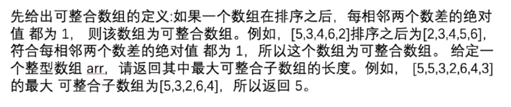

子数组总数N²，并且你不能再题目给的arr[l...r]去原地排序，因为你可能破坏原本arr的结构。所以你如果要排序，只能复制出一个子数组，然后排序一下，排序验证是一个n log n 的复杂度，验证是一个N的复杂度。所以总的就是N² * N * log N的复杂度，暴力方法复杂度完全不能接受。那么你能不能把这个可整合数组的定义等价变换一下？

这里我们改一下定义：

1. 数组无重复值
2. max - min = N -1

为什么要无重复值，直接max - min= N-1不行吗？不行！因为1,1,3与1,2,3 max -min=N-1。无重复值可以保证你的数组一定是排完序之后是单调的 最大值其实就是排完序的最后一个，也就是(N-1,max)，最小值是排完序的第一个，也就是(0,min)，你要这个数组相邻两个数都差1，那么不就是一个斜率为1的直线吗？有斜率的直线是单调的，那么一定要求无重复值。max-min/N-1-0 = 1，等价于max-min=N-1。

优化之后的流程还是尝试所有子数组，但是验证是否为可整合数组就是用的我们自己的标准了。

用窗口是不能做的，因为假设l~r你已经失败了，发现不是可整合数组，但是这时候你不能确定继续往下阔可能会重新是一个可整合数组。例如l~r上是[3,5,6,7,8,9],但是后面如果是[3,5,6,7,8,9,4]那么就是一个可整合数组了。max-min和个数之间是没有单调性的。

### 任意位置添加字符形成回文串

code6：

- 给定一个字符串，如果可以在字符串任意位置添加字符，最少添加几个能让字符串整体都是回文串。 

f(l,r)定义为，str[l...r]最少添加多少让整体都变成回文串。那么答案就是f(0,N-1)。如果这个暴力递归可以顺利写出来，改成动态规划就是一个二维表。这就是一个范围上的尝试。依然是只能l<=r，也就是说左下半区是没有用的。那么在填写dp [i] [j] 的时候，初始化我们先填第一个对角线，上面全都是0，因为自己就是一个回文串。填第二条对角线的时候，如果str对应的两个位置的字符相等就填0，如果不相等就填1。因为aa就不用添加，ab就添加一个变成aba。然后考虑dp [i] [j]怎么由dp[i+1] [j]或者dp[i] [j-1] 得到或者dp[i+1] [j-1]。假设从dp [i+1] [j]来的，你已经把str[i+1 ... j]变成了回文串，我们现在要str前面多了一个i位置字符，我只需要在最后一个位置添上和i位置一样的字符即可，也就是此时dp [i] [j] =dp [i+1] [j] +1 。同理dp [i] [j]= dp[i] [j-1] +1 。如果str[i]==str[j]，dp[i] [j] = dp[i+1] [j-1]。这三种情况选最少的，一个普遍位置由左边下边左下角的格子决定。

一个样本做列的对应模型，往往只讨论结尾如何。但是范围上的尝试模型讨论的是开头和结尾共同可能性如何。可能性怎么组织？就按照开头结尾分开组织。

我给大家加一个东西。就是有没有发现在某些面试题里面，它就让你求一个动态规划问题，最后的那个答案，那个长度就是一个简单的整数值。但在有些动态规划里面，它让你求一种结果是什么。我们现在目前为止面对的大量动态规划题目都是说我最后给你，让你求一个量，这个量是个整数值，让你返回的。我用这道题跟大家说一个事儿，就是如果他不仅仅要一个值，他要的是一种结果，一种决策的路径，你拥有动态规划表是可以把所有决策路径都搞对的。求动态规划表和最终要一个具体的结果是一码事儿，只不过需要一些加工的过程。就拿这道题来举例。这道题我们改了。我不仅让你添最少的字符，让它整体都变成回文串。你还告诉我它一种填完之后变成回文串的一个总结果。

例如看下面的例子，我要你告诉我生成的那一整个回文串是什么？如何通过dp表加工？如果只要一个路径，那么就根据答案的位置还原出当时是从哪个格子来的，然后最终得到答案。如果要得到所有的路径，那么就玩一个深度优先遍历。

如果你的动态规划做了空间压缩就没有办法反推了！

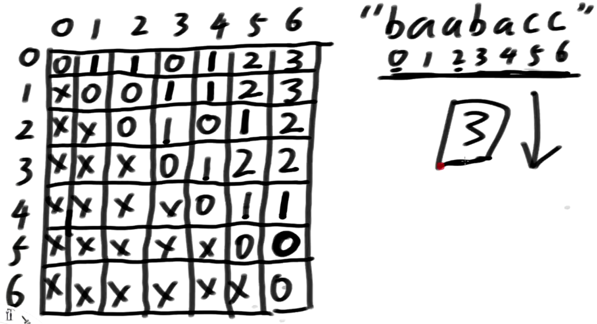


## Interview Coding 09

训练营4，第一节

### 二维数组最长递增链

code1：

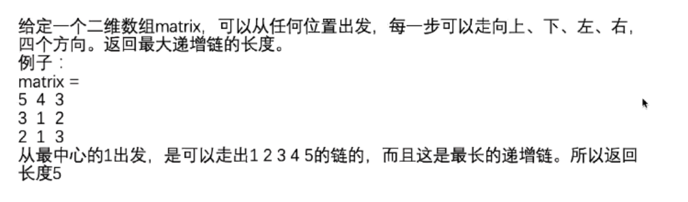

f(i,j)定义为从(i,j)位置出发，最长的递增链是多少，递归很好写，写完之后N²个位置全部调一遍f，可以求出一个答案，但是太暴力了！我们可以搞一个傻缓存（记忆化搜索）来加速，这也是自顶向低的动态规划。加了缓存之后，如果矩阵的规模是N * M，那么时间复杂度就是 N* M。这道题做到这个程度就可以了。

这题不好直接改动态规划，一个位置i，j可以依赖上下左右的值，你告诉我你怎么去写出状态转移出来，你怎么去给二维表dp做初始化。并且这种题目，记忆化搜索和严格位置依赖的动态规划都是依赖有限的几个位置，所以效率没有什么差别。但是如果递归里面由枚举行为，那么你最好去改成动态规划，观察看看转移方程的特征，看看是否枚举行为可以被临近的位置替代。


### 离k最近的子数组累加和

code2：

- 给定一个数组arr，再给定一个k值返回累加和小于等于k，但是离k最近的子数组累加和

流程：把子数组以某一个位置结尾都求一个答案，答案定在其中。你要求以i位置结尾的子数组中哪一个是小于等于k离k最近的，假设sum[i]=m,等价于在sum[0...i-1]中找一个 >= k-m 且离k-m最近的一个值。而找离某个值最近的这件事情可以用有序表来做。你就把所有的前缀核加到有序表里去，用这个有序表就行了。

以j作为结尾的子串一共有j+1个子串,str[0/1/2/3/j ... j]。**sum[i...j]=sum[j]-sum[i-1]**，和前面对照一下，发现后面这种加粗的等价转换有一种情况是不行的，i=0的时候不行，这种情况恰好子串就是str[0...j]。所以我们在遍历的时候，在sum[0~j]找>=某个值最接近的时候，需要把0先初始化上去，这代表的是str[0...j]一整个作为子串的情况。这样一来就不会漏掉了，可以完美的进行等价转换。

- 有序表中，在遍历开始前就要先加一个数0进去，指的是就是一个数也没有的时候就已经有一个前缀和是0了。所有的数组三连问题。用一个表来记录之前所有的结论，累加和问题的固有的一种做法就是你必须要加一个，一个数都没有的时候的累加和。
- 这题不需要告诉index下标是谁，我们只需要那个值即可，所以只用一个key就行了，不需要value，我在求i位置结尾的子数组的那个最大值的时候，可以用这个有序表记录之前所有的sum[0...i-1]，找出里面的我们需要的值就行，不用知道下标位置。
- 这题的累加和三连问题的第三题不一样，那题是小于等于某一个值的最长子数组，它关心的是长度，既然是长度，那么就需要知道下标位置。而我们这里面是关心的是小于等于累加和离它最近，不需要知道哪个小标的前缀和离的最近，我只需要知道这个前缀和的值即可。
- 关心下标就用数组三连问题第三连的解法，关心值就用有序表。

之前讲的求累加和小于等于k情况下最长。这个问题确实能够做到O（N）。可以再给大家介绍一个可能更好理解，但是不是O(N)的方法，就O(n×log n)的方法，这个在网上是大量流行的一个方法。回过头去看数组三连问题的第三连。

### 离k最近的子矩阵累加和

code3：

- 给定一个二维数组matrix，再给定一个k值。返回累加和小于等于k，但是离k最近的子矩阵累加和

思路：上面有一道题是求子矩阵的最大累加和的，也是先解决了子数组的最大累加和。对于矩阵来说也就是列举两个行，然后列举两个列。我们列举两个行的时候，例如列举r1~r2，那么在列举两个列的时候就可以利用子数组问题的解法来帮我们得到答案，我们可以把r1~r2的行全部都加到一个数组里面，在这个数组里面玩出来的子矩阵问题的答案就对应列举r1~r2时候子矩阵的答案。

假设矩阵是N * M的，那么复杂度就是N² * M * logM。

- 以后看到子矩阵问题，可以先去看看子数组问题怎么解。

### 二维数组走路拼单词

code4：

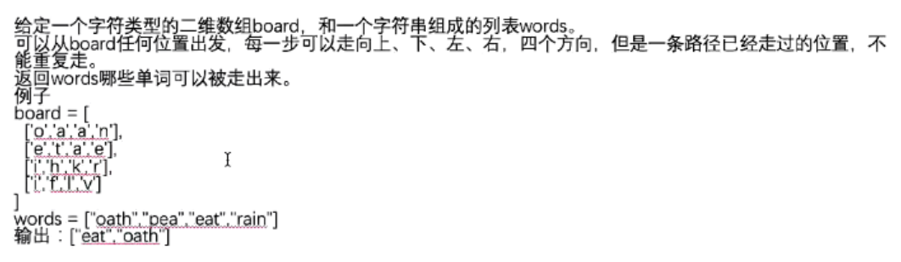

code4和code5很练递归，虽然在面试中出现的没有那么频繁了，但是还是很重要，这代表了递归的能力

- 这题所说的不能重复走指的是你在试图走出某个单词word的时候不能走走过的路，a单词走过的路是不影响b单词的。

设f(i,j)为从(i,j)位置出发，能走出的words中的所有的单词。最终答案就是对与二维数组中的每一个位置我都调用一遍f。

接下来就是f函数具体怎么设计。首先要有一个机制保证不走回头路，再来就是一个机制来知道某一个单词已经被我凑出来了。把words变成前缀树来保证知道某一个单词已经被凑出来了，用前缀树可以保证一个好的决策，在我们进行递归的时候可以进行剪枝，我们只走可能凑出words中单词的路，其它路我一律不走。不走回头路的机制就是在进入另一个递归进行深度优先遍历的时候，我们先把board中此时的位置标为0，递归结束的时候再改回来。另外还有一个地方可以优化，让递归不走冤枉路，具体做法就是前缀树Node中的pass值代表底下有多少个字符串经过了这个字符，假设我们当前位置调用了递归，然后加了8个字符串到结果里面，那么我就把pass值减去8，减到0了以后我以后再来到前缀树的这个结点我就不再往下走了，因为pass被我减为0，说明pass底下所有的字符串已经被我收集了！所以递归不是void返回类型，而是有一个int返回值代表我收集的字符串数量来做优化。

这递归难想是因为上面集齐了很多的优化，你能够想出多少剪枝的条件来优化你的递归。


## Interview Coding 10

训练营4，第二节

### 股票问题--系列

#### 买卖一股赚的最大钱数

code1：

- 给定一个数组arr，从左到右表示昨天从早到晚股票的价格。作为一个事后诸葛亮，你想知道如果**只做一次交易**，且每次交易只买卖一股，返回能挣到的最大钱数

买的时间点一定要比卖的时间点早。[3,5,2,9,10,6]，最好的就是2的时候买入，10的时候卖出。

枚举所有的可能的卖出点0~N-1，在一个卖出点i，用arr[i]-min{arr[0...i]}就是在i点卖出股票能得到的最大收益。把每一个卖出点求出来的最大值再抓出一个最大值就是总体的最大值。买入点可以和卖出点一样。

- 用一个变量就能抓住i左边的最小值

#### 随意交易赚的最大钱数

code2：

- 给定一个数组arr，从左到右表示昨天从早到晚股票的价格。作为一个事后诸葛亮，你想知道如果**随便交易**，且每次交易只买卖一股，返回能挣到的最大钱数

你手里最大就是一股，要么就是零股。不能够同时有很多股。但是对你在一个节点的操作不做限制，你可以在一个结点上又卖又买，随便你玩，但是要求你手上只能有一股。

思想：把每一个递增的区间都榨干！跌的时候你不持有股票，每次你都在要涨的最低点买了，在最高点卖了。3,4,5,6你可以在3买6卖，你也可以在3卖4卖，4买5卖，5买六卖。这是等效的。


#### 限定交易赚的最大钱数

code3：

- 给定一个数组arr，从左到右表示昨天从早到晚股票的价格。作为一个事后诸葛亮，你想知道如果交易次数不超过K次且每次交易只买卖一股，返回能挣到的最大钱数

比较难的是这题。这个题其实是个动态规划，但是在讲动态规划之前，我们来讲一种特殊情况，这是一个结论。假设你数组长度是100，你的交易次数限制在k次，而且这个次数指的是不超过k次，也就说这个k是你交易的上限。那我现在说这样一个结论，如果这个交易的上限大于了二分之n。它就等同于无限次交易。因为你在一个数组中，递增区间的个数一定是小于N/2的，因为一个递增区间最少两个元素。所以当k大于1/2的时候，可以用code2直接出答案，这是一个过滤器。

接下来这个k在小于二分之N的时候，我们就要好好讨论一下了。dp的行对应数组的index，列对应K。dp[i] [j] 的含义就是arr[0...i] 你去交易，但是交易次数不超过j次赚的最大钱数。dp初始化，第0列和第0行都是0。

dp[i] [j]一个普遍位置。第一种情况，最后一个点的股票价格，他压根不参与交易，那么dp[i] [j]=dp[i-1] [j]。第二种可能性就是i号股票参与交易。这里面有一个贪心，如果I号股票价格要参与交易的话。他只用去参与最后一次交易的卖出时机，除此之外，他参与什么交易都不会得到更好的解。贪心很显然，因为i是最后一个位置了，你在这个位置买，那么只能在这个位置卖，这样收益是零元，所以不需要参与买入时机。所以可能性二是按照最后一次交易的买入时机来枚举的。既然是枚举买入时机，那么买入时机当然有可能就是i的时候，所以dp[i] [j] = dp[i] [j-1] +arr[i] - arr[i]。第二种情况，dp[i] [j] = dp[i-1] [j-1] + arr[i] - arr[i-1]。第三种。。。其实这些情况都可以合起来，dp[i] [j] = max{dp[i-k] [j-1] +arr[i] - arr[i-k]}，0<=k<=i。 

- dp[i] [j] = max{dp[i-k] [j-1]  - arr[i-k]} + arr[i]，0<=k<=i。 

这是一个枚举行为，如果你不优化这个枚举行为，复杂度不会仅仅是二维表的规模，恐怕还要再乘上每一个格子时候的枚举代价。那我们就来调研一下这个枚举行为能不能省掉，很有意思，关键就是这个优化。看下图，蓝色部分去掉白色部分是两个位置共同求过的，如果我们可以在计算dp[10] [3]的时候把这个公共部分记录下来，当然这个公共部分要去掉arr[10]那么我们在求dp[11] [3]的时候就可以利用。也就是这个公共的部分是可以从上往下依次迭代的，所以我们for循环的嵌套的时候列号的for循环在最外层，行号for循环在里层，这样我们的公共部分的指标可以很好的传递。

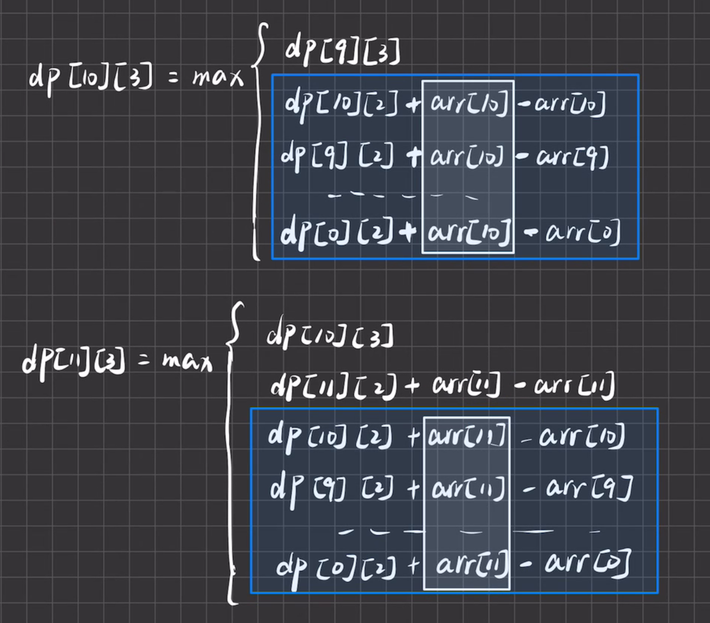

### S不同子序列和T字符串相同

code4：

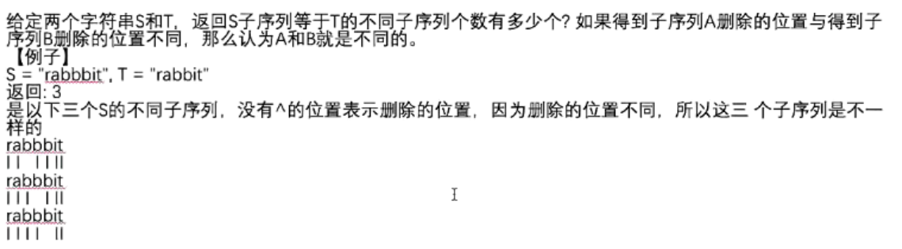

- 这题编辑距离似乎不是很直观，编辑距离问题是最小代价，这题是方法种数

一个样本做行一个样本做列。dp[i] [j]的含义是s[0...i]这个前缀，删成t[0...j]这个整体，有几种方法。答案就是最右下角的值。第一列只要遇到了t[0]就+1，连通dp [0] [0] 也填好了。第一行除了0,0这个位置，其它位置都是0。看一个普遍的位置dp[i] [j]怎么填，0~i上删掉几个字符变成t等价于0~i上选择几个字符保留变成t。可能性1就是i位置不参与t的组成，dp[i-1] [j]。可能性2，i位置参与t字符串的构成，能参与的前提是s[i]==t[j]，dp[i-1] [j-1]。


### 骑士最少的初始血量

code5：

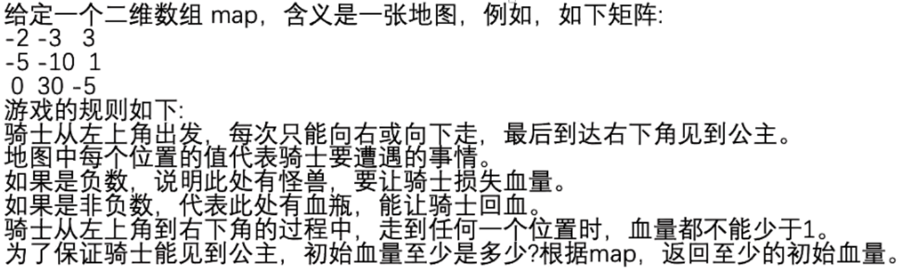

- 很显然，这是一个动态规划，只依赖上面的值和左边的值。

先从最朴实无华的暴力递归讲起。f(i,j)代表的就是从i，j出发到达最右下角需要多少血？首先是base case，就是到达最右下角的时候，如果最右下角的值是负数，那么你此时的血量至少要比这个负数的绝对值大，如果右下角的值是正数，那么你此时的血量只要大于1就行。

一个普遍的位置，也是讨论正负值。如果是负数，那么负数+此时的血量>=后面那个关卡需要的至少的血量。所以可以求出此时至少需要多少血量。如果是正数，要看看你这个正数+此时血量是不是大于后面通关的要求，如果是，那么血量只要是1就行了，如果不是，那么后面通关要求减去这个正数就是你至少需要的血量。

接着就是暴力递归改动态规划。

- 为什么递归含义不定义为从（0，0）出发到（i，j）需要多少血？因为如果是这样的含义，我们一个普遍的位置需要依赖上面的和左边的格子，这样我就丢失了左边和上边的剩余血量，丢失了这个信息导致我们无法判断一个普遍位置需要多少血。但是如果是定义为从（i，j）出发到右下角需要多少血，那么我们就可以根据后面需要的血量，推算出我们此时应该剩余多少血，这样一来剩余多少血这件事就不会丢失了。
- 猜，如果是求最少，那么就定义为（i，j）到右下角。如果求最大，那么就定义为0,0到i，j

### 矩阵最大路径和

code6：

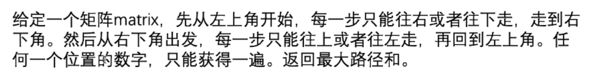

这道题不适用于贪心。

怎么尝试？有一个规则：就是同一个位置，如果你去的时候拿过了，回来的时候如果再经过它，你获得零。接着就是两个人同时从左上角出发，如果两个人同时到达了一个位置，那么只获得一次这个位置的值，然后返回两个人一起的路径和。这个就等价于一个人从左上角出发再回来且不能重复获得路上的值。

限制，由于A和B都是只能往下或者往右，所以如果A此时在的位置B此时没在，那么B以后再也来不到A这个位置。 但是递归不要带上四个可变参数了，只要三个就行，因为a和b走的步数一样，可以算。

base case就是两个人同时来到右下角，只获得一份值。然后一个普遍位置列出a和b走向的几种组合，总共4种。


## Interview Coding 11

训练营4，第三节

### 假想排序相邻数最大差值

code1：

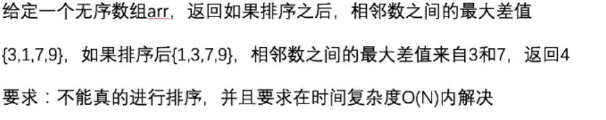

我们这个设计这个流程怎么做呢？这个流程的第一步。在这个数组中，把最小值跟最大值得到遍历一遍，得到最小值、最大值。假设最小值是0，最大值是99，那么，所有的数都是在0到99这个范围上的。假设你有9个数，我把从最小值到最大值这个这个范围我给它分成十等份。你有N个数就分为N+1等份。我们就称为N+1的桶，且一定有一个空桶，你遍历一遍数组，把对应的数放到相应的桶里面，根据我们设置的范围，最小值和最大值一定被放进第一个桶和最后一个桶。相邻的数只可能来自同一个桶，也可以跨桶，跨桶就是后面那个桶的最小和前面那个桶的最大是相邻数。由于一定有一个空桶，所以一定至少有一个对跨桶的相邻数，所以相同桶内的数我们都可以不用管了，肯定不是最大。所以说我们只要管跨桶的最大值即可。

进一步优化成最终流程，既然只考虑跨桶，跨桶只考虑桶的最大和最小，中间的都是桶内部的，不用考虑。所以我们桶里面只放最大值和最小值。遍历一遍数组，一直更新每个桶里面的最大值和最小值。更新完毕之后，把相邻的非空桶，前桶的最大值减去后桶的最小值，最终的答案就是这些值中的最大值。

 这是我们之前讲过哪一种题的思维方法，取舍可能性，数组三联问题的第三个。我一旦找到一种可能性，我分析出某一类的可能性，它完全不可能是答案，我该舍弃就舍弃了。但是它比数组三联难的地方在于，n个数准备n+1个桶，这一套模型是他自己奠定的。数组三连问题是我们研究假设答案之后分析出来的性质。而这一套做法它是在利用桶思想，架构出来一个模型，在这种模型下居然有可能性的舍弃，你构建这种舍弃可能性的模型很难。

### 多种小串拼大串的方法数

code2：

- 假设所有字符都是小写字母。长字符串是str，arr是去重的单词表，每个单词都不是空字符串且可以使用任意次。使用arr中的单词有多少种拼接str的方式，返回方法数

递归`f(char[] str , int i, HashSet<String> set)`，假设所有的贴纸（单词）都已经放到set里面了，这个递归的含义是str[i...N-1]如果可以被set里面的单词拼出来的话，返回方法数。base case就是i=str.len的时候，你已经没有需要分解的字符串了，所以有一种方法，这种方法就是一个word也不用。一个普遍的位置i，枚举由i开头的所有前缀串，看看在set里面有没有，如果有就进去递归，把所有的分支都加起来。这换成动态规划就是一个一维的动态规划，但是还不够优。

- 这题dp[i]含义明显是从i出发到N-1可以拼成的方法数，答案就是dp[0]。这样一来一个普遍位置i，就要列举i开头的所有前缀串。
- 如果dp[i]的含义是0~i可以拼成的方法数，那么就从i往前数串，就不是前缀串了，所以这题用上面的含义。

左的代码里面使用的substring获取一个string中间的子串，这是一个O(N)的方法，不太好。substring方法只有是获取前缀和后缀的时候是O(1)的复杂度。我们把substring优化成用一个变量累加即可，Hashset算作O(1)的复杂度，这样填写动态规划的时候就只有O（N²）的时间复杂度，如果用的是substring那么代价就是O(N³）。

```
在 Java 中，String 类型的 substring() 方法的时间复杂度为 O(n)，其中 n 是截取的子字符串的长度。

具体来说，如果调用 substring() 方法获取一个字符串的子字符串，假设原字符串的长度为 m，那么 substring() 方法会创建一个新的字符串对象，将原字符串中指定范围内的字符复制到新字符串中。这个复制的过程需要遍历原字符串中指定范围内的字符，因此时间复杂度为 O(n)。

需要注意的是，如果使用 substring() 方法获取字符串的前缀或后缀，也可以通过修改索引参数来实现常数时间复杂度的截取，例如：
String str = "hello world";
String prefix = str.substring(0, 5); // O(5) = O(1)
String suffix = str.substring(str.length() - 5); // O(5) = O(1)
在这些情况下，时间复杂度为 O(1)。但如果需要截取中间的子串，则需要进行复制操作，时间复杂度为 O(n)。
```

前面我们说填写dp一维表，首先一个for填写dp，另外一个for枚举前缀串，然后里面不用substring，用一个变量累加得到前缀串是O(N）复杂度，HashSet平均查找效率为O(1)，所以总的平均的效率是N²。

上面是用HashSet，平均复杂度是O(1)，但是最差的情况下是O(N)的复杂度，所以最差的情况下还是O(N³）的复杂度。所以还可以优化，一看到前缀串，想想看能不能用前缀树优化。把所有的word都加进去，这样我们在拿到一个前缀串以后，只需要通过移动一个位置就能知道这个位置合不合法，一定是O(1)的复杂度，而不是Set的平均的O(1)。


### 二叉树上累加和为k的最长路径

code3：

- 给定一棵二叉树的头节点head，和一个数K。

  路径的定义:可以从任何一个点开始，但是只能往下走，往下可以走到任何节点停止

  返回路径累加和为K的所有路径中，最长的路径最多有几个节点?

这题用树形dp递归套路肯定可以解。但是比较麻烦

我们用数组上的累计和为k的最长子数组长度问题的解来优雅解决这个问题---数组三连。

可以利用一个有序表存一个累加和最早出现的层数。

大流程是一个深度优先遍历，在遍历的过程中，把沿途一条链上的的累加和求出来--需要一个参数提供之前路径上的累加和presum以及当前的结点 x 。然后map中记录每一个前缀和最早出现的层数，遍历的时候需要一个参数是当前的层数level以及一个map。如果到当前层的累加和为sum，且sum-K这个累加和在map里面存在，那么就可以更新答案了，答案是一个全局的static变量，也可以用一个只有一个元素的数组来代替。整个递归的过程注意要恢复现场。

- 每条深度优先遍历的路线都维持自己的一个唯一的前缀和，利用类似累加和为k为最长子数组长度来计算这个最长路径。所有深度优先遍历的路线都求一个最长路径，答案必定在其中。

### 每个数出现k次的数组找出现1次的数

code4：

- 给定一个int类型数组arr，已知除了一种数只出现1次之外，剩下所有的数都出现了k次（k>1），如何使用O(1)的额外空间，找到这个数。

使用了k进制异或的思想。使用k进制来表示一个数，建立一个32个空间的数组digit，用这个数组来表示k进制中的每一位。然后遍历数组arr，每一个arr[i]都去算一下它怎么用k进制表示，对应位置上的数加到digit数组里面，全部遍历完之后，把digit上面的所有位置都模k，剩下的digit去算一下转成十进制就是我们要的答案。原理很简单，每个数都出现了k次，所以加到digit的同一些位置上，这些位置加了k次肯定是可以被k整除的。

之前有一道题是有一个数出现了1次，其它都出现了2次。求那个出现了一次的数。那题直接把所有数异或在一起就行了。直接异或，其实就是在计算机底层用了2进制异或，计算机的异或运算就是2进制异或。k进制异或就是k进制不进位相加

### 水王问题

code5：

- 给定一个数组arr，如果有某个数出现次数超过了数组长度的一半，打印这个数，如果没有不打印


一定要是超过了才打印，就正好一半都不打印。这题当然可以用Hash表来做，但是肯定不是最好的，这题的目标是有限几个变量可以搞定。

思路就是如果我能够实现一种机制，在数组中一次删掉两个不同的数，如果真的有一个数出现了一半以上的话，它最后一定会剩下来。是必要条件而不是充分条件，不是说剩下了这数就一定是出现一半以上，而是说出现一半的数-也就是我们需要的答案是在那剩下的数里面。所以说我们一次删掉两个不同的数，找出剩下的那个数之后还需要再遍历一边数组，看看是否真的出现了一半以上。

一次删掉两个不同数怎么实现？代码很精简！两个变量，一个是hp，一个是cand，遍历到i没有候选的时候我们就立其arr[i]这个数作为候选，并且hp设置为1。如果有候选，看看这个arr[i]这个数和候选一不一样，如果不一样，那么就把hp-1，如果hp减为0了，那么就视为此时是无候选状态。如果一样，那么就把hp++。有没有候选用hp来判断

你会发现在这个方法中有一件非常奇妙的事，你可能没有注意，就是我根本不需要知道数组中具体的值是多少，我只用关心它跟候选相等还是不相等这件事。

一道非常著名的题--摩尔投票。投票机制是为了选一个领导人，所有公民可以选择任何人作为领导，把领导的身份证号写到票上，不是说只能在一些提名的人上面选，而是可以选任何人，你也可以选自己。国家会统计说哪一个身份证号得票人数最多。但是必须至少有一个人的投票次数超过了国家人数的一半能才宣告这次选举领导人成功，否则就是失败。有一个重要限制，国家为了保证公平，只提供给一个机器，这个机器就只能放两张票，这个机器上放两张票的时候可以告诉我这两张票是不是一个身份证号。这个机器只是一个布尔类型的机器，就是你放上去两张票，它只告诉你一样还是不一样。唱票的人只能够干把票放在这个机器上，看看返回一样还是不一样，告诉一个结果，但是绝对不能够看这个票上面的身份证号是什么。也就是两张票放在机器里面，唱票的人并不知道里面两张票是谁的身份证号码。请问你怎么样确定最终谁当选或者这次票选活动是失败的。

利用刚刚我们的代码，选择cand不需要知道具体值的这种特点，我们可以实现上面的摩尔投票问题，首先选出一个cand，再拿到机器过一遍，看看是否出现一半以上，如果是，那么选举活动成功，否则就是失败。


- 给定一个数组arr和整数k，arr长度为N，如果有某些数出现次数超过了N/K.打印这些数，如果没有不打印

很容易知道，上面最多只有K-1个候选。那么还是类似的做法，我们这次搞出一个map，里面只能放k-1个候选。然后还是遍历去，如果候选没满，那么就把当前数立为候选，给一点血量。如果满了，看看自己是不是在候选里面，如果是就把自己血量+1，否则就把候选里面的所有-1，陪当前数死去。最后把剩下的候选遍历一遍，跳出真正的候选，只有大于N/K的才是达标的候选。时间复杂度是O(N * K），因为我需要频繁的删，删的代价是k。


## Interview Coding 12

训练营4，第4节

### 返回楼群的轮廓线

code1：

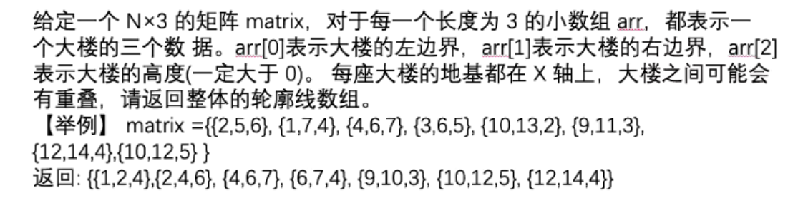

题目意思：[1,3,2]表示一个大楼从1坐标开始一直到3结束，2是大楼的高度。只关心轮廓线就是在外面的那些线。用颜色笔标记的就是轮廓线。

这道题的难度其实在于我们怎么把这件事情给在脑海中就脑补出来，整个建立模型去抓轮廓线的这个过程，建模过程可能是特别重要的一件事情。你说这道题它真的有什么算法吗？其实不多，它主要是模拟的一种流程，或者说模型建立。

我们先建立一种机制，这种机制来自于我最大高度的变化。只要最大高度有变化了，无论是在某一个位置的时候大楼消失了还是大楼立起来了都可能导致最大高度的变化。如果在某一个点一座大楼起来了，并且使得最大高度发生了变化，那么这时候前面一个被超越的大楼的轮廓线就生成了。如果在某一个某一座大楼消失了，这时候最大高度就会变成别的大楼，那么此时消失的大楼轮廓线也出来了。所以只要最大高度发生了变化，就会产生得到一个轮廓线。 

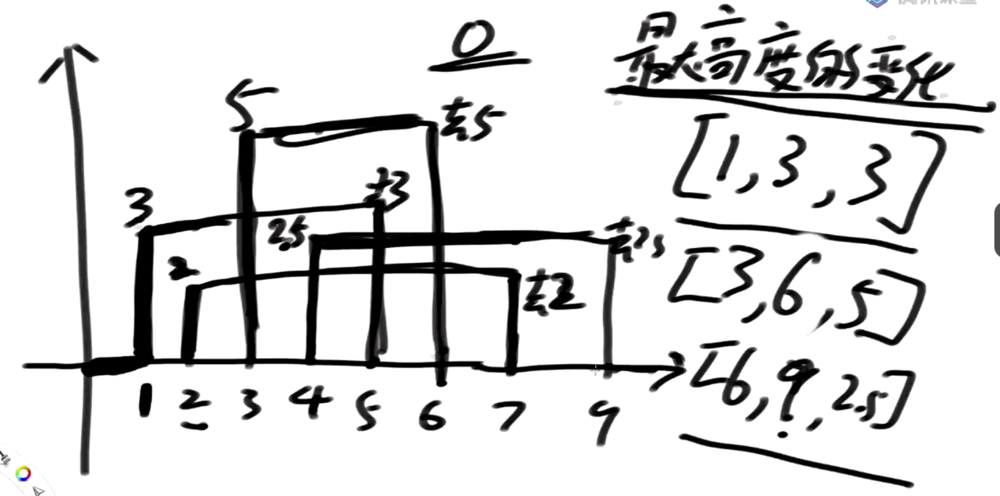

我们说这个轮廓线的产生来自于最大高度的变化，那么你给我一张表，这张表放着每一个位置对应的最大高度。拿这样一张表去生成轮廓线，我们就可以忘掉原来的结构，只拿这张表生成所有正确的轮廓线。为了能够得到所有的轮廓线，我们需要建立一组记录，这组记录就是说我们只去关注所有大楼的崛起点跟结束点，剩下的x的点我们可以不看。那么我怎么样生成这张表现在就变成了关键。

我们不要大楼了，把[3,7,4]这样的数据变成两个对象，分别代表起始点和结束点。我们说你没有必要去记录大楼，你只需要去记录这一个大楼生成在哪个点位置加了高度，在哪个点位置要减掉一个高度就行了。这就有一个问题了，你有没有可能一个高度它被加了多次。有可能，那你要不要记录它加入高度的次数？需要的。

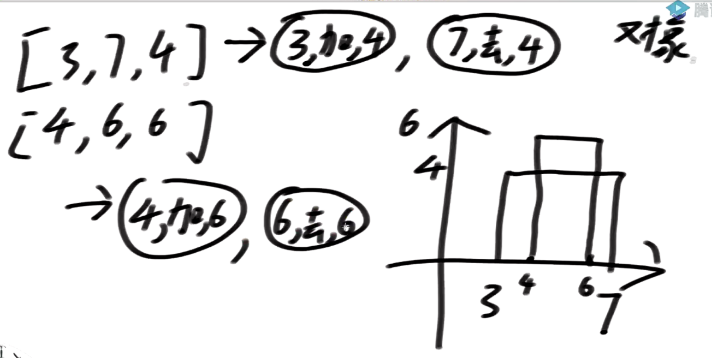

看下图，一个高度4可能被多次加入，1位置加一个高度4的时候，记录里面是（4,1）；2位置加一个高度4的时候，记录里面是（4,2）、3位置加一个高度4的时候，记录里面是（4,3）。那么在7/8/9位置减的时候也是一次减掉一个。当记录里面的高度4减到零的时候，这个高度才彻底不要了。所以这张表应该是一个有序表，这样我们就可以拿出当前key的最大高度，然后每一个key加入了几次我们也可以记录。接下来我们来到某一个点，直接从有序表里面拿，就知道当前的最大高度了。先把数据做一个离散化，按照小到大排序，依次处理我们生成的对象。但是注意，你从小到大排序完了之后，要注意一维数据，如果一维数据都一样，例如在一个7位置可能有多次加多次减，那么你要把7位置的加加减减一次性处理完了之后再去看7位置现在的最大高度是多少。

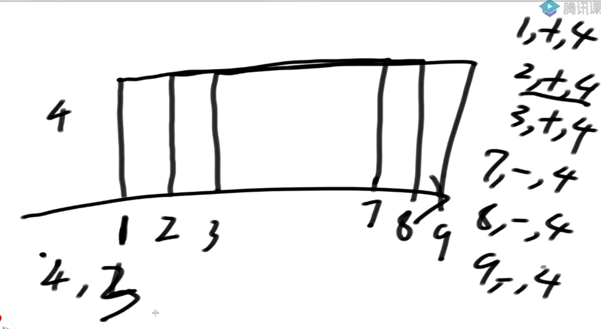

但是我们要警惕一种大楼。也就是纸片大楼[7,7,6]，这种大楼如果你把减高度6排在加高度6前面了，那么就出错了。如果没有这种纸片大楼那么你只需要关心一维数据，如果有这种大楼，那么就最好把二维数据加的排在减的前面。

我们把op操作对象放到一个一个有序表中map1。然后根据这个有序表去生成另外一张表map2，map2代表的就是轮廓线，因为我们可以把map1中的操作对象操作完了之后得到对应的最大高度。map2也是一个有序表，因为我们希望从小到大生成轮廓线。map1存在的意义就是帮我们生成map2，map2告诉我们每一个点的最大高度是多少。


### 两个有序数组中找topK

code2：

给定两个整数数组A和B。A是长度为m、元素从小到大排好序了。B是长度为n、元素从小到大排好序了。希望从A和B数组中，找出最大的k个数字

- 最后这题能做到复杂度O（log {min{N，M}}），和k没关系。
- 找出最大的k个数字和找到第k大的数字其实是一码事

最普遍的解法，就是两个指针分别指向两个数组，谁小谁动，最后可以动到k。复杂度是O(K)。

第二种方法就是在A中二分，用mid拿出来，看看在两个数组之中是第几小，如果这个数拿小了就去右边二分，拿大了就去左边二分。如果A中二分到底也没有找到，那么就去B中重复这个行为。因为在A中要二分，二分里面还要去B里面二分找mid在B中干过了几个数，也就是找>=mid最左的位置，所以总的复杂度是O(log n * log m）

那么最优解是什么？我们先忘掉这个事，开一个更基本的题。这个题是这样的，a和b的长度等长，等长的情况下还有序。问题是求两个等长数组整体的上中位数。注意这道题目，它长度为奇数与长度为偶数，它是有区别的。直接拿例子来说，比如说如果我先告诉你a和b的长度是偶数的。

A和B长度都是偶数。先取出A和B的上中位数。第一种情况如果相等，直接返回。如果不等，不妨讨论b>b'的情况。可以知道，如果一个数大于了N个数，那么它一定不是上中位数。如果一个数小于了N+1个数，那么它一定也不是上中位数。看下面例子，所以cd一定不是上中位数，因为c大于了a/b/a'/b'。a'和b'也一定不是上中位数，因为b'小于了b/c/d/c'/d'。所以我们一下子把讨论的范围缩小了一半。

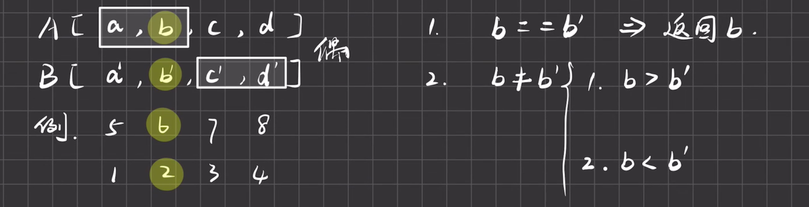

下面来一个很魔性的结论。我接下来就进递归。[a,b]和[c',d']继续去找上中位数，在[a,b]和[c',d']里面找到的上中位数mid，一定就是[a,b,c,d]和[a',b',c',d']中的上中位数。证明如下，下面证明了

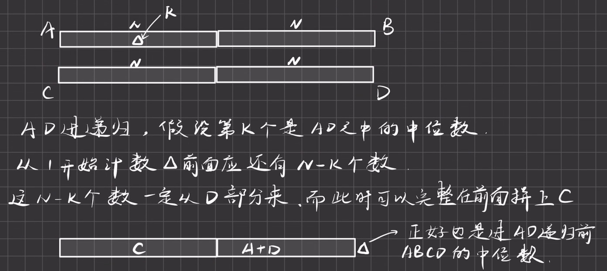

如果是奇数，那么情况就有所不同了。假设a和b两边刚好是n。N=2n+1。如果一个数大于了N个数，那么它一定不是上中位数。如果一个数小于了N+1个数，那么它一定也不是上中位数。a大于了n+n+1=N，所以a肯定不是中位数。b只小于了2n+1个数，不到N+1，所以b可能是。但是b左边的数就至少小于2n+2个数了已经小于N+1，所以b左边的肯定不是中位数。所以现在两个范围不一样大了。不能递归。

所以下面有两种解决方案：

1. 我们就把b和a左边的位置c手动比一下。当b>=c的时候，b是蓝色两部分的中位数。b加上前面的四个格子放到c的后面，这样b刚好被推到最右边，成为了整体的中位数。其它情况b就不是中位数，等价于下面的蓝色区域缩小一格，求剩余蓝色区域的中位数，就可以递归了。
2. 不去手动比一下，上面的蓝色部分补上黄色的a进去递归也可以。虽然我明确知道a不是中位数，但是我为了维持递归的含义，我放进去递归也可以的。

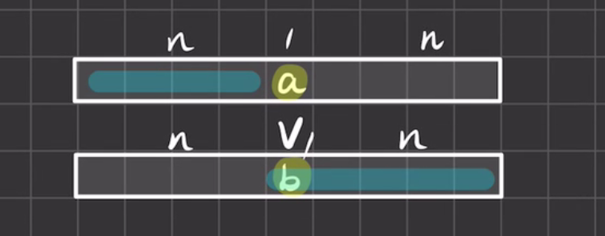

错一格也可以刚好维持上面的性质。再错就不行了。

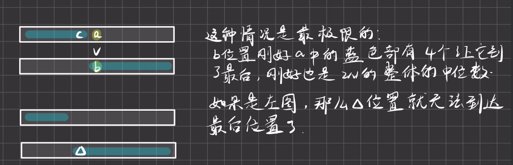

这个解法是对数级别可以拿下的。但是拿下这个问题只是万里长征的第一步。

主问题，两个数组的长度可能不一样。所以分情况，如果小数组是A，大数组是B。

如果1<=k<=N，那么就等价于A取前k个，M取前k个，去拿他们的第k小，也就是都取前k个，玩一个取中位数。

如果N<k<=M，不妨设k=15，可以先掐掉1'~4'，以及16'~17'。然后5‘手工比较，如果<=10，那么就返回5’。否则就6‘~15’与1~10求上中位数，也就是第十小，加上前面的1‘~5'这五个数，刚好是第15小。

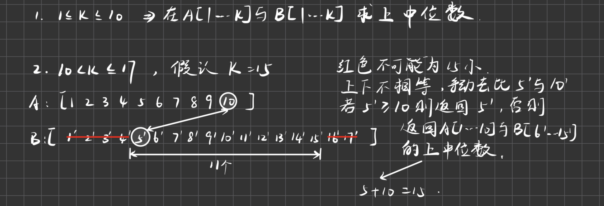

如果M<k<=N+M。如下，不能直接调用中位数，需要手动扣一次

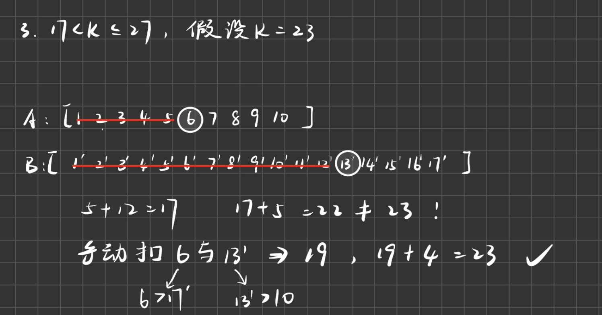

### Nim博弈问题

code3：

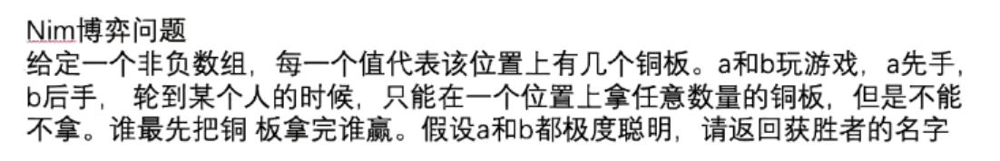

解释一下nim博弈。有一个数组[9,3,6,2,7]，里面的数值代表硬币。有两个人，一个先手一个后手，先手先拿硬币，每一次都可以拿任意位置的任意个硬币，也就是我可以到9位置上去拿硬币，可以拿1~9个，但是你不能拿零个。谁先拿光硬币谁赢，或者谁最先让对让对方面对无硬币可拿谁赢。假设先手跟后手都绝顶聪明，博弈论的一个基础，请你告诉我，给你输入一个数组返回是先手赢还是后手赢？

这个题的流程是你把数中所有的数异或起来，得到的异或和最终是是零的话先手输，异或和不是零的话，先手赢。

你最后输家面对都是零的数组，那这所有的零异或起来就是0。先手就给自己定下一个目标。如果我每一次先手，在面对数组的时候异或和我能做到都不是零，但是我每一步弄完都能让我的对手后手面对这个数组的时候，它面对的异或和永远都是零。如果先手能够做到这样一个更严格的目标，其实先手一定会赢。因为能完成这样的目标，先手一定遇不到都是0的数组。

例如，此时先手就让111变成110即可，也就是拿走一个硬币。然后就变成异或和是0的情况了，后手无论怎么拿，肯定会让数组再变成异或和不是零的情况。

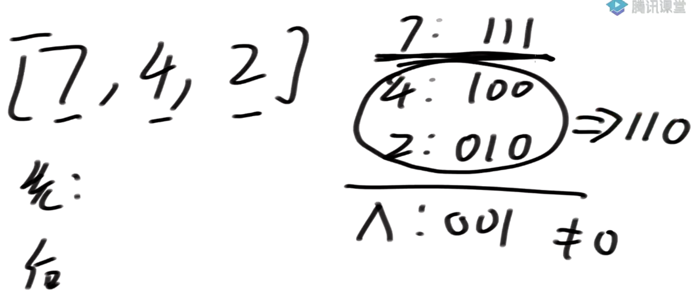

### 约瑟夫环问题

code4：

- 约瑟夫环

是一个单链表问题，头尾相连成环。从第一个结点开始数数，报数，假设是7，那么从1开始报数的话，7这个结点就死了，然后从7的下一个结点，也就是8继续从1开始报数，继续数到7的结点就死了。依次类推，问最后谁能活下来。

模拟的方法代价太大了，是一个O(N * K）的复杂度。这个问题就是没有O(N)就能确定的方法。

数到最后只剩一个节点，他在自己的链表中编号，这个节点就是一号节点。假设我有一个公式，这公式可以让我算出杀之前的编号。你在变成一个结点之前，肯定经历过2个结点的时候，这个f（n）函数可以算出你之前的n+1轮的时候的编号。也就是f(1)就算出有两个结点的时候你的编号是多少。然后继续调f(f(1))就知道有三个结点的时候编号是多少。这样我们就可以一直往外调，调用到n结点的时候就知道编号是多少，直接把那个结点保留，其它的都干掉。

先不说这个公式是什么，因为它比较难求，我们先搞一些基础的那些一些内容。我们先认识一个很简单的函数，假设i是一个常数，y=x%i就是一个一堆平行的线，有一个周期性。

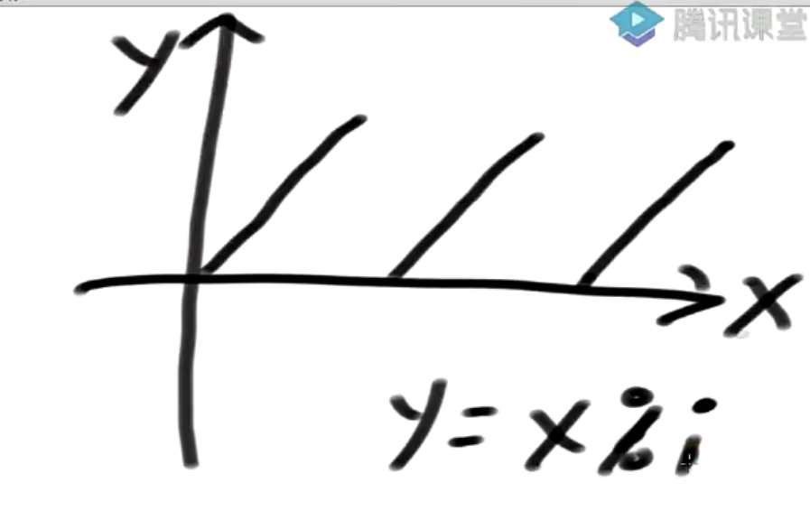

我们把这个函数给放在旁边，我们先不去推新老编号之间的关系，我们先搞一个更基本的，就是我在一个环形链表中编号和所报的数字是一个什么关系？假设有四个结点，1~4号，1号报的数就是4k+1，2号就是4k+2，等等。图像如下，发现上面那个图像往右上角移动就可以得到下面的图像，然后利用初中数学得到下面图像y=(x-1)%i+1。不要依赖自己找规律的能力，发现是剃刀感觉的函数，直接画图，和最原始的那个y=x%i函数做比对。

号是编号，数是报的数，i是人数。报数一直在增加1234 5678  --  对应 1234 1234 的人 。 图像画出来

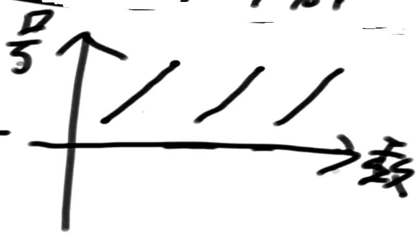

现在我们开始来搞，我们真正想做的了。找杀之前的编号和杀之后的编号是什么规律。

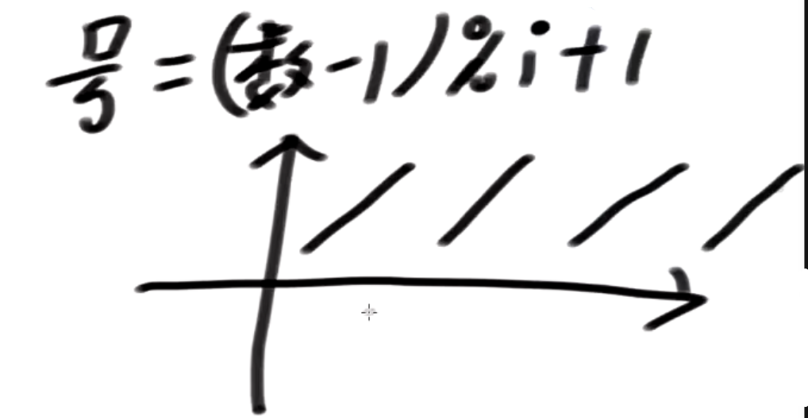

杀之前假假设有1234567这些编号。那我杀谁是个问题，我们假设杀掉3。但你把3干死之后。四号就变成一号，五号变就会变成二号，六号就会变成三号，七号就会变成四号，而原来的一号会变成五号，二号会变成六号。三的编号就没了，因为它被干掉了。我们用杀之后去推杀之前，或者说是用新的去推旧的。新旧之间，它的长度会发生变化，如果旧编号的长度是i的话，那么新编号中它的长度就是i- 1。

所以我们根据这个来画图像，新的作为x，旧的作为y，（1,4），（2,5），（3,6），（4,7），（5,1），（6,2），发现延长之后会和y=1这条线相交在一个可以算出来的点。抽象化，假设s号死了，那么就会相交在(-s+1,1)这个位置。左下角这图图像其实就是左上角那个图像往左移动s位。

所以旧=(新+s-1)%i + 1。但是现在还有一个问题，s是啥？s就是报号为k对应的那个人s=(k-1)%i+1。

所以旧=(新+(k-1)%i+1-1)%i + 1。这个公式还能优化。**旧=(新+k-1)%i + 1**。f(i,k)=(f(i-1,k)+k-1)%i+1，新的--人少了

- 报到k死一个人、i是还没死人的时候有多少人。


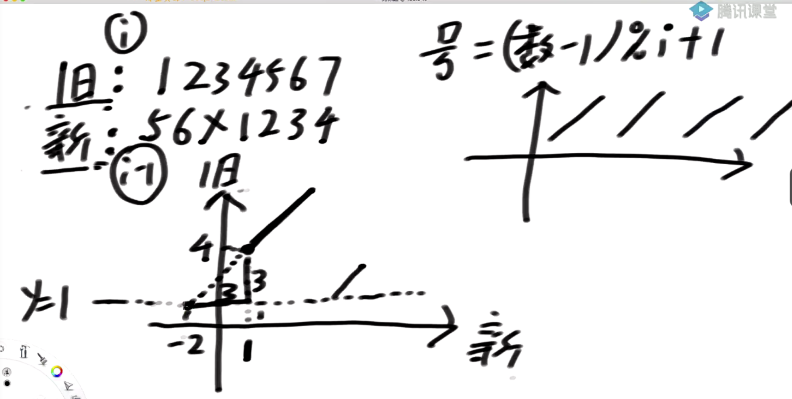

### 过河需要几条船

code5：

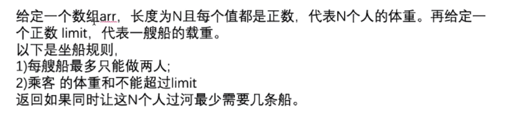


乘客有7的体重，而船只有5，那么怎么都过不去，你需要max条船也过不去，无解，返回-1；

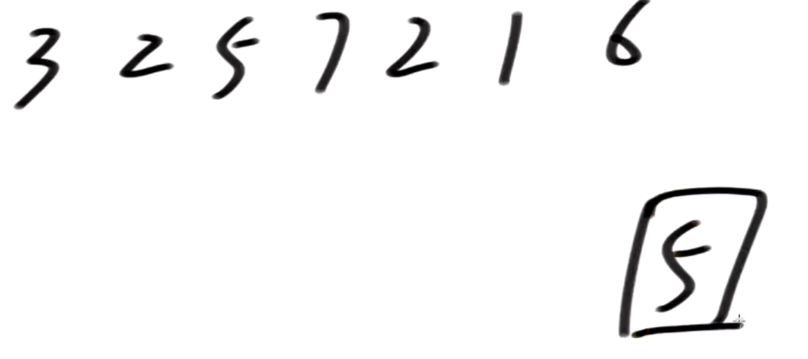

下面的情况至少需要4条船

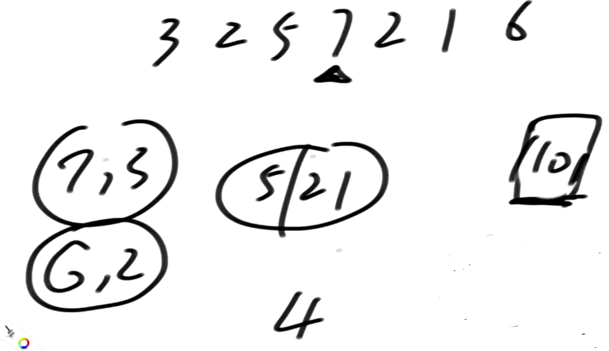

这个题其实是个贪心。先搞一个大过滤器，确定没有大胖子导致怎么都过不去。然后把这个数组排个序。我们关注limit/2的位置，在这个数组中找到小于等于limit/2最右的位置，你这里面可以二分也可以不二分，因为排序已经卡着了。

我们接下来的目标就是让l的的数搭配r位置的一个数凑一团，l和r位置的只有两种情况，一种是l+r位置的数大于limit，另一种就是小于等于limit。第一种不达标，第二种达标。

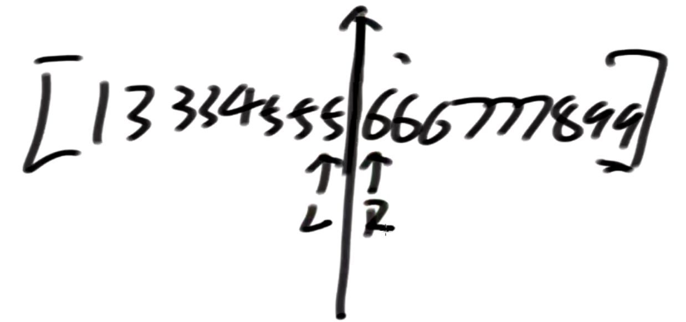

如果不达标就让l往左移动，前三个5显然不达标，直到l走到4的时候达标了。然后r再往右走，一直走到l搞不定的位置，也就是此时的7位置。然后让l往左边找三个去搞定r那边空出来的三个，这一定是最经济的。原因很显然，你肯定希望左边更小的数得到更好的利用。这就是我们主要的思路，但是有一些边界条件要处理一下。我们分别举两个例子来解释有哪些边界条件。

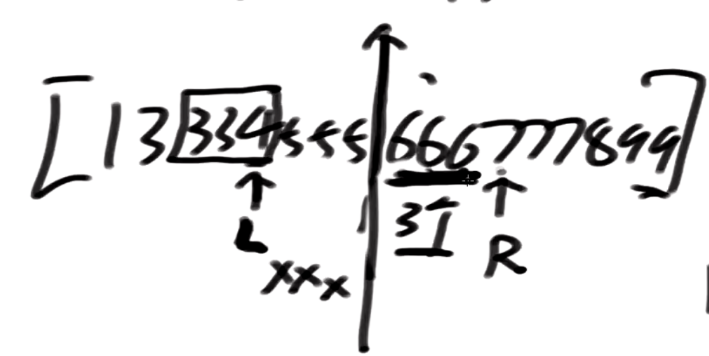

可以看到左边的先耗尽了，没办法来搞定右侧这么多的胖子。

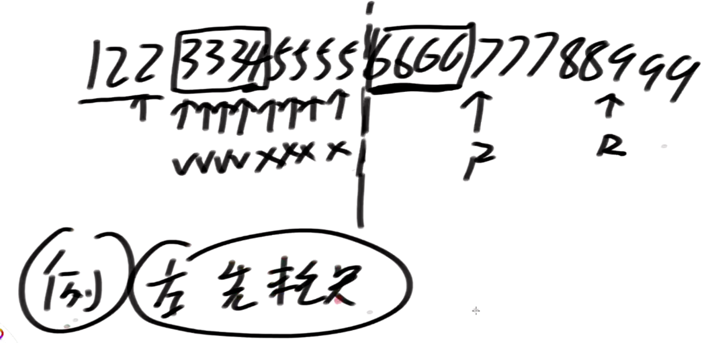

此时就可以知道需要几条船了。看看左侧有多少的对号，然后加上那些没有凑对的胖子自己一条船，然后左侧中所有画叉的都可以两个人一条船。这三块算一下，加在一起。

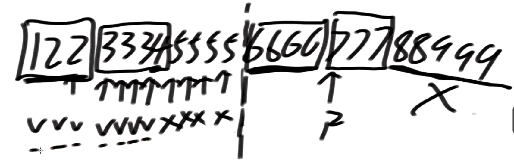

右侧先耗尽，就是对号加上画叉的两两一条船，没有单独的胖子。

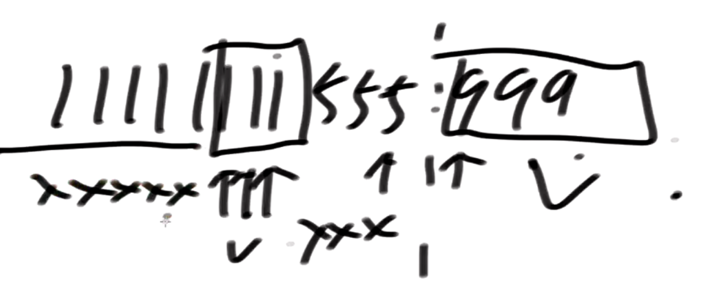

小技巧：N/2向上取整，可以写成(N+1)/2


### 咖啡机问题

code6：

我们在基础课的时候。讲了一个咖啡问题，咖啡问题几乎是我们目前为止对于业务限制模型唯一的认识。下面有一个小题，它不是业务限制模型。我给你个数组，我告诉你这个数组里面代表每一个是泡咖啡的机器的工作时间。N台咖啡机可以一起工作，但是每一台咖啡机只能是串行的产生咖啡，一杯咖啡生成完才能生成下一杯。假设我有m个人，比如说我有100个人，这100个人都在零号时间点的时候开始排队，也就是零号时间点的时候，这100个人涌向这n台机器。实际上，从0号人到99号人是无差别的。请你返回一个数组res,res[i]代表i号人得到咖啡的最好时间是多少。如果这个你理解不了，那么返回res，res[i]代表i号咖啡机应该帮你搞定几个人。这两个res实际上是等价的，就是这么多人，我想保证所有人得到咖啡的总时间最短、最后一个人他得到咖啡的时间尽量早。

这道题没有挥发的设定，只是做咖啡的问题，和洗咖啡还没有关系，你先给我解决这个问题，然后才有机会去解决加上挥发的那个更复杂的问题。这道题用一个小根堆就行，Node代表里面有一个值代表咖啡机多少时间能产生一杯咖啡，以及还有一个时间点。小根堆按照时间点和咖啡机生成时间的和来比较。很接近自然智慧，因为人肯定是选择能尽快产出咖啡的机器去排队。


## Interview Coding 13

训练营4，第5节

### 最长回文子序列

code1：

- 给定一个字符串，求最大回文子序列的长度

做最长回文子序列这个问题有两种解法。

第一种方法。你如果知道两个字符串，一个字符串叫string 1，一个字符串叫string 2。它俩求最长公共子序列那个那个算法原型。那么一个字符串求最长回文子序列就是这个字符串和自己的逆序串，这两个串的最长公共子序列就是原串的最长回文子序列。它属于什么模型？一个样本做行，一个样本做列的对应模型。

第二种方法。去看看[l,r]范围上的最长回文子序列是多长，看看这个能不能做。左下半区没有用。第一条对角线都是1，第二条对角线，如果相等就是2，不相等就是1。问题就是看看一个普遍位置i，j怎么填。分为四种情况，分别列举i参不参与构成与j参不参与构成。第一种情况就是i和j都参与最长回文子序列的构成，那么只有可能i和j相等的情况下等于		dp[i+1] [j-1]+2。第二种情况就是只有i参与构成，那么有i和无i是一样的，那么dp[i] [j]=dp[i+1] [j]。第三种就是只有j参与构成，那么有j和无j是一样的，那么dp[i] [j]=dp[i] [j-1]。第四种情况i和j都不参与构成，dp[i] [j]=dp[i+1] [j-1]。

没有哪一种模型是单独解决哪一类问题的，有可能一个问题可以被多种问题解多种模型来解，关键就是你得掌握模型的试法。用模型的这种试法来启发你想到


### 贪吃蛇问题

code2：

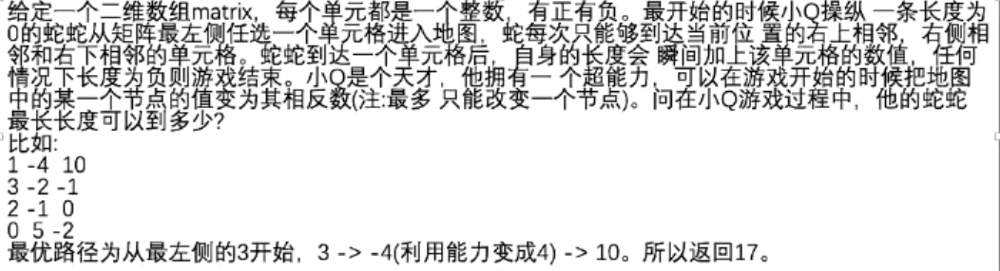

- 蛇从最左一列任意一个位置出发都行。右上邻角的意思是可以往右上、右下、正右侧走，也就是必须往右边一格，但是上下可以-1,0,1的偏移量。并且蛇不会回头，每一步都往右边靠，走到最后一列就结束。中途可以为0的长度，但是不能为负

边界条件很多，如果上来所有格子都是负数，那么它可以发动一次能力。即便如此接下来也可能走哪死哪，那么最长的长度就是登上最左侧的时候。就是说它这个它这个蛇它是很有可能它走不到最右侧的。

这道题其实是一个非常标准的业务限制模型。业务它要怎么走？它会怎么选？题目告诉你清清楚楚。所以你业务上想怎么试？它可能不属于我们说的那几种模型，但是它属于一个业务限制模型。所以你们的暴力尝试无非就是业务逻辑把它抽象成递归表达。为什么我不直接去憋动态规划？因为可能动态规划憋出来之后，万一你这个状态转移方程写不对，你这个代价不是挺高的嘛？

假设我要登上某个位置，这个蛇我想登到这个格子上去。这个格子如果是正数的话，我固然可以登上去。但它如果是负数的话我就得看一下我要不要用能力了。粗略的分析，你就知道，我登上一个格子，恐怕应该收集两个答案，第一个答案就是我彻底不用能力的情况下，我登上它最大的长度是能是多少？第二个就是我登上去，我在其中用过一次能力的情况下，我登上去能够让我的长度能够到达多少？你有可能一开始想不到这两种可能性，但你试着试着，你会发现你试不下去，因为你确实依赖你前面的过程告诉你。哎，你在之前的过程中，到底你使没使用过能力呀？我得知道这件事儿，我才能决定我此时登上去到底不能用能力还是能用能力。


### 计算表达式


code3：

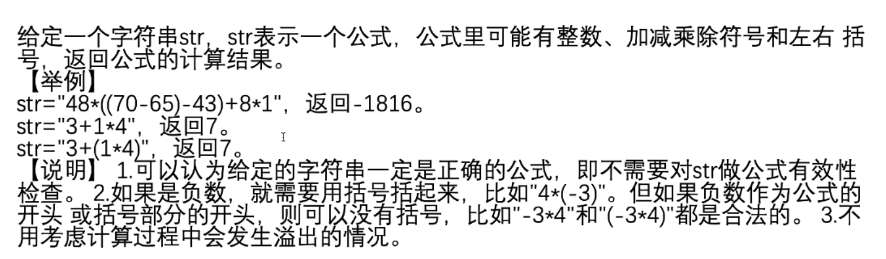

这种类型的题就是类似于文法解析，还有小黄号给你打乱优先级这种题经常见。这样的题递归结构都一样。只要我给你讲一个，你就知道以后其他的优先级的题怎么搞了。类似于编译原理什么文法分析这种什么大括号小括号优先级什么顺序改变这种题全可以这么干。给你讲一个非常经典的递归模型，你要是用栈去做，这道题150行以外了，很难写。用递归函数的便利性帮你做。思路很清晰。如果参数的有效性没给你保证，那你还是去跑，能跑出来说明就是有效的，不然就是无效的，直接try-catch。

有几个说明。第一，可以认为字符串一定是正确的，我不需要对string的公式进行有效性检查。第二点，如果是个负数我需要用括号括起来，因为负数那个负号和减号容易混淆，括起来的的前提是负数会产生歧义，如果不产生歧义，那么就可以不用括起来。三点限制，其实就是帮助你不要去抠太多的边界条件，你把整个过程梳理清楚，这就算你过。

f（i）的含义是你告诉我从i位置一直算到一个合适的位置，答案是多少。另外还要告诉我你是算到哪里停的。

那什么叫合适的位置呢？我规定从i开始往后遍历，我如果遇到整个字符串的结尾，或者我遇到右括号就停。这种递归结构，它几乎可以搞定，类似于所有编译原理，文法解析的问题。关键就在于我设计了一个在哪停的这个信息的返回。这样主函数就调用f（0）

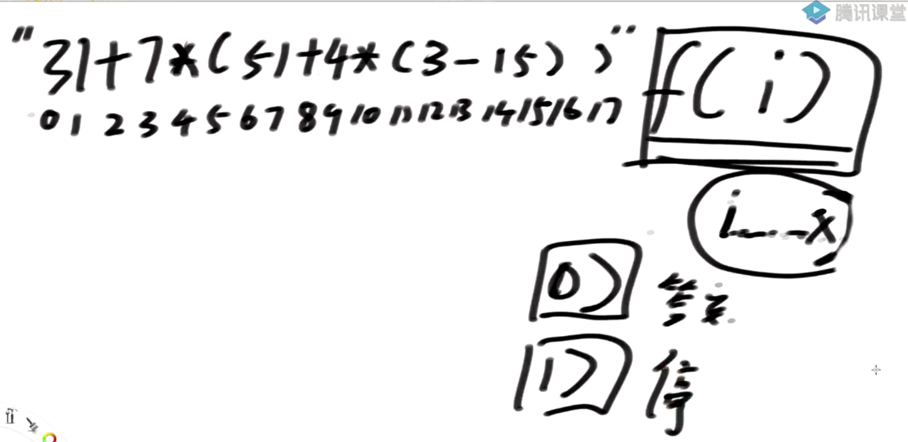

这是解决括号优先级的一个递归设计。那如果一个字符串中它没有括号。这个公式应该怎么算？一个栈其实很好做。两种情况，你遇到数字的时候就意味着就是我现在在收集数字的阶段。你遇到加减乘除，就意味着我之前收集数字的阶段结束了。

看下图，我遇到3，cur是"3"，遇到1，cur变成“31”。然后遇到了+号，这时候就把数字和加号都放进去，把cur清空。

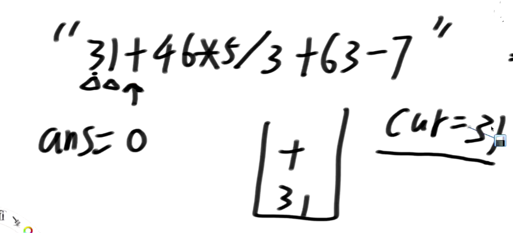

然后继续，cur收集成"46"了，然后遇到乘号了，看到此时栈顶是加号，我不管，直接把46和乘号都放进去。然后继续，cur收集到"5"，然后遇到除号了，这时候看一下栈顶，发现栈顶是乘号，如果栈顶是乘号或者除号，那么就把当前收集到的数字和乘号下面压着的46数字先计算一下再扔回去，最后再把除号也放进去。

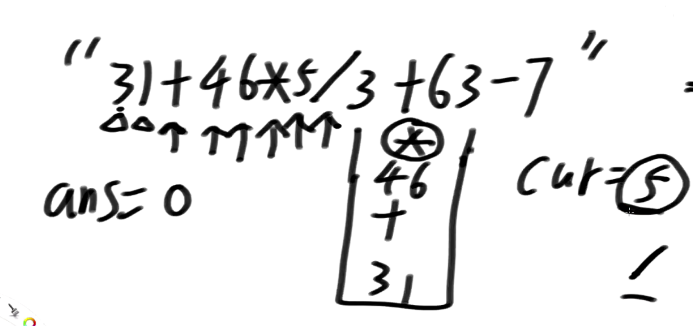


所以我们把46 * 5计算了一下，把结果重新放回去，然后把除号放进去。这样的含义进行下去，实际上就是把这个式子中乘除连着的先算了，最后只保留加减号。所以当我没有括号的时候。我们我们知道一个公式怎么算。按照上面流程即可，一个栈搞定。

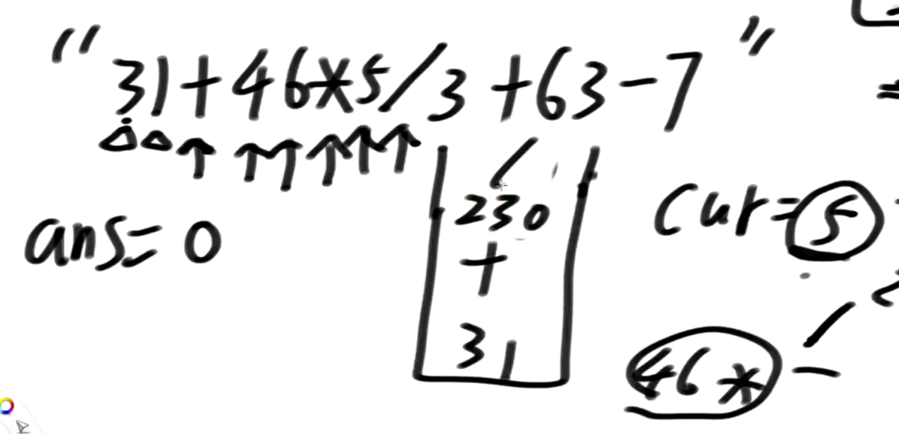

现在所有的东西都已经具备了，我们先来展示一个它混着它混着小括号的东西怎么弄。f（0）在自己的小空间里面玩我们上面的没有括号的过程，如果没有遇到括号就一直玩，知道在5位置遇到了一个小括号，我才不想自己算左括号里面的答案是多少，我让递归f（6）去算，所以在f（0）里面，我的cur现在是一个等着递归函数告诉我的状态。

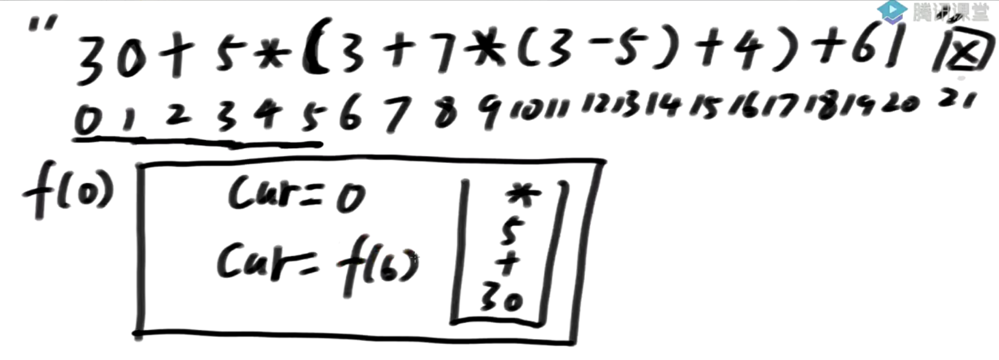

如果一直遇不到右括号或者结尾，而是一直遇到左括号，那么我就一直调递归。直到有一个递归遇到了右括号了，这里     f（11）在14位置遇到了右括号，这个时候就可以给前面返回了，f（11）把3-5算出来=-2，然后把-2以及自己算到了14位置返回给了这两个信息返回给了f（6）。所以f（6）就知道了我当时不关心的(3-5)的值是-2，所以cur为-2了，然后自己从15位置开始算。所以进一次递归就是消了一对括号。

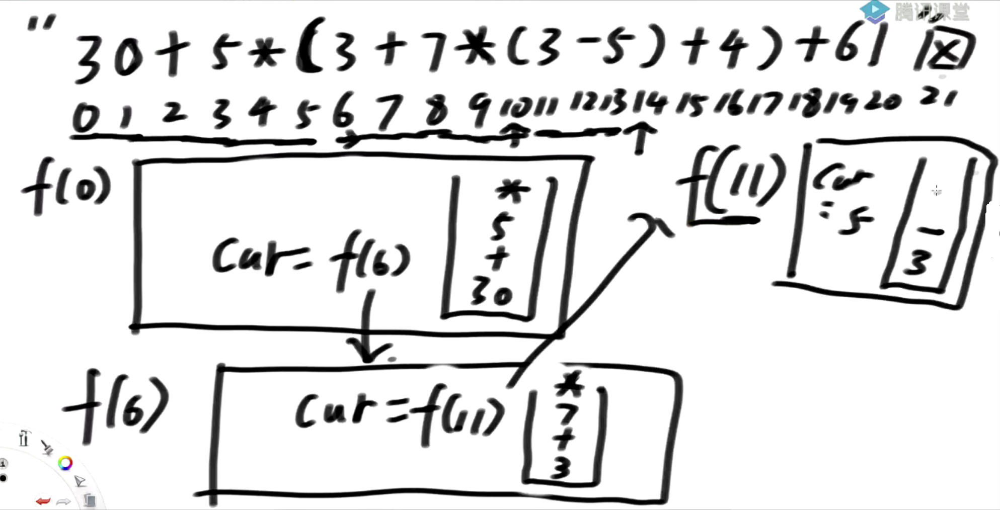

f（0）永远遇不到右括号，因为括号都被自己的子过程消完了。


### 删成回文串方案数

code4：

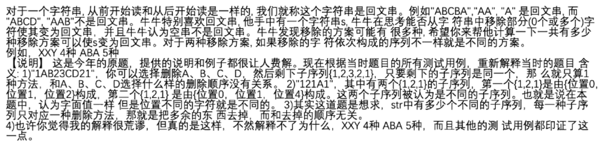

首先我们还是明确一点，就是删怎么删除字符跟怎么保留字符是一回事儿。空串不是回文串，这是一个非常重要的限制。只要你删除的字符的下标构成的序列不一样，就认为不一样，不管你这些下标序列构成的字符串一不一样，例如1,3,4下标子序列是“abc”，5,6,7下标的子序列是“abc”,认为是不一样的删法。

这道题它很难，不是难在找范围尝试的模型，在于它可能性的梳理，这道题可能是把范围上尝试的模型玩到一种比较变态的地步了。第一条对角线和第二条对角线都好填。第一条都是1，因为空串不是回文串。第二条，如果两个字符相等就是3，如果不相等就是2。

问题就来到了一个普遍位置怎么填。这个跟长度就不一样了，这是问你严格的总数有几种保留的方案能够让他出回文，而不是关心长度，这是和长度最大的区别。还是按照L和R位置参不参与来列出四种可能性，假设方案数分别为abcd，abcd必然没有重合部分。我们拿abcd去拼答案。abcd是我们拿L-R这个范围去拆出来的，讨论了L和R参与和不参与分出来的四个不重合的子答案。dp[L+1] [R]位置，我们不按照左右边界去分了，我们拿R位置参不参与来做拆分，R参与其实就是c，R不参与对应的就是a，所以dp[L+1] [R]=a+c。同理dp[L] [R-1]=a+b。所以左边的和下边格子的和也就是						dp[L+1] [R]+dp[L] [R-1]=2a+b+c。所以a+b+c=dp[L+1] [R]+dp[L] [R-1]-dp [L+1] [R-1]。然后最后一个就是d，d的情况是L和R都参与构成，这种情况只有L和R相等才行。也就是说L和R两边固定，中间随便变！但是注意！中间随便变是不包含空串的，但是L和R中间夹着空串也是合法的，所以d=a+1。这就是为什么说空串这个限定很重要！

- 看到依赖了很多地方，而且是种数的时候，长个心眼。a就是dp[L+1] [R-1]，但是b不是dp[L] [R-1]，								c不是dp[L+1] [R]。只有中间全是省略号的部分才能用dp的值代替

- 还是下图的关系，如果是求最长回文子串的时候，dp[L+1] [R] = max{a,c} , dp[L] [R-1] = max{a,b} ,所以dp[L] [R]就等于max{dp[L+1] [R] ,dp[L] [R-1],d} ， 而d就是 2+a=2+dp[L+1] [R-1]。所以dp[L] [R]就等于max{dp[L+1] [R] ,dp[L] [R-1],dp[L+1] [R-1]+2(这种情况当且仅当前后相等)}

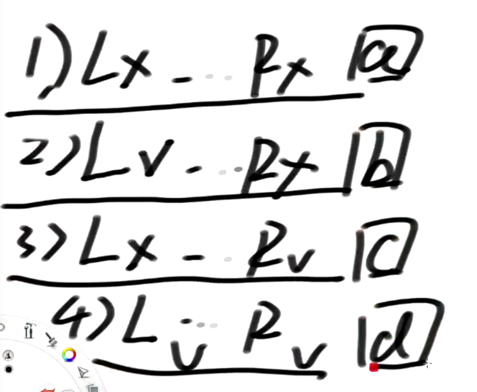


## Interview Coding 14

训练营4，第6节

### 正数裂开方法数

code1：

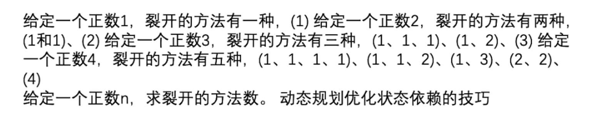

这题就是从左往右的尝试模型，两个参数是因为加了限制。你用一个参数去试，发现试不出来，你就看看加上一些限制能不能帮到你。

它要求裂开的方式是你不能够出现下降趋势，就一定要是一个有序的方式裂开。

f（int pre，int rest）。假设你是5，那么f（1,5）代表5的第一块不能用比1小的裂开，你还剩下5要去裂开。第一块裂开的不能比1小。前面的pre其实是一个对后面的rest裂开方案的约束，rest裂开的数不能比pre小。到rest为0的时候，递归结束。实际上就是在每一步决定裂开多少的时候留下了一个答案。

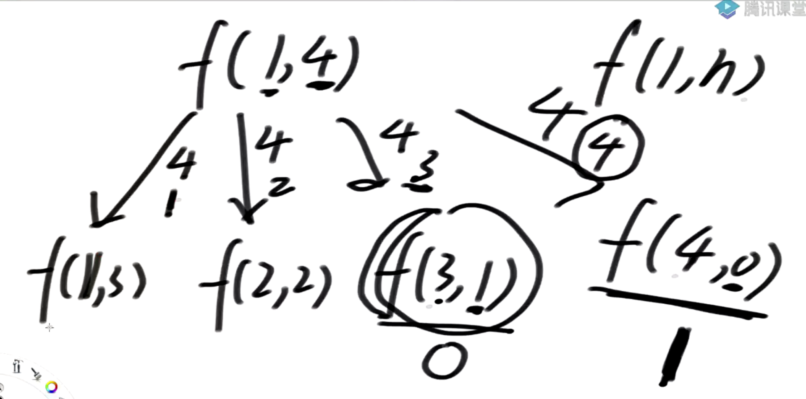

写出递归之后，直接改动态规划，把pre做行，rest做列的话，发现一个格子依赖自己左边的和下面的。所以从下往上，从左往右就填好了，或者沿着对角线填。但是改完之后还没完，因为有枚举行为，去优化！对号位置加下方位置

rest固定，这其实就是一条斜率为负的斜线。肯定可以优化

```
ways += dp[i] [rest - i];
```


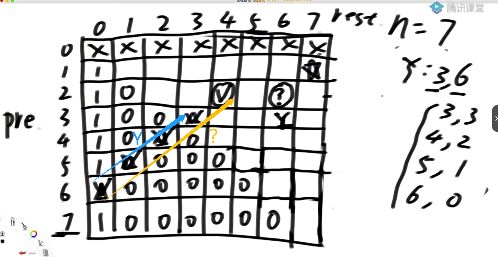


### 正好有K个逆序对

code2：

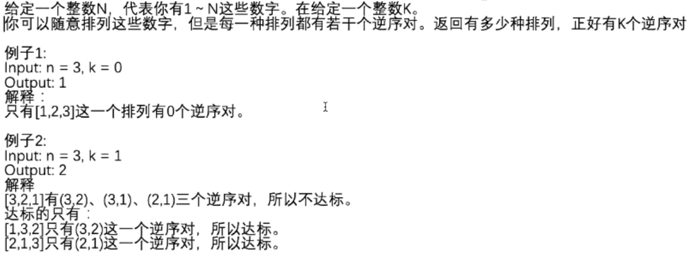

给了你两个参数，猜，一个样本做行一个做列。表规模就是dp[1~N] [0~K]。dp[i] [j] 含义定为给你1~i的数，逆序对为j的有几个。dp[i] [0]，0个逆序，也就是排序完的情况，只有一种。dp[0] [i]无意义，因为需要N>=1。dp[1] [i]，只有一个数，不可能有逆序对，所以只有dp[1] [0] = 1，其它都是0。

然后我们从左往右再从上往下填，这样我们来到一个普遍位置就认为我上面的东西已经填好了，也就是少一个数字的时候，k为任何的答案我都有。那么现在是一个普遍位置，我就看我怎么把这个多的数字插到上面去，按照插进去的位置列可能性。假设我要求dp[7] [3] ，开始列可能性，如果我把7放在最后，前面的6个需要排出k个逆序对，因为7在最后，不会产生逆序对。如果7放在倒数第二个位置，因为7是最大的，所以它右边一定会产生1个逆序对，所以前面的6个数需要排出3-1个逆序对。依次类推！所以dp[7] [3]依赖dp[6] [3] 、 dp[6] [2]、dp[6] [1]、dp[6] [0]。但是要注意dp[7] [7]，当7放第一个的时候，依赖dp[6] [1]。会有差异的！所以dp[num] [k]依赖dp[num-1] [k-i] ，其中i∈[0,num)，保证k-i不越界。

因为一个样本做行一个样本做列的模型很关注最后一个在哪，所以你就可能会憋出讨论7插哪这个可能性了。

在求dp[i] [j]的时候，其实我们就是列举最后这个数排在1~i的哪一个位置，j比较小的时候，0~j个逆序对也就j+1种情况，对应不上1~i。所以你自己要注意做一个统一--max函数，让j不要减到越界了。

写完动态规划，看到枚举行为，直接看看能不能优化。要分为i>j的时候的优化和i<=j时候的优化。把最初始的情况也看看是不是也可以助力。不然就要抠掉。

因为是7，所以公共7个坑位，枚举7个位置，如果不越界的话。会有错位的，想象两个等长的线段错一位是啥样的。

dp[7] [8] = dp[6] [2] + ...+dp[6] [8] = dp[7] [7] - dp[6] [1] + dp[6] [8]

dp[7] [7] = dp[6] [1] + ...+dp[6] [7] =dp[7] [6]- dp[6] [0] + dp[6] [7]

dp[7] [6] =  dp[6] [0] + ...+dp[6] [6] = dp[7] [5] + dp[6] [6]

dp[7] [5] =  dp[6] [0] + ...+dp[6] [5]

就是因为有枚举行为我才去搞出动态规划看看能不能依赖，没有枚举行为我才懒得搞！


### 最大二叉搜索树拓扑结构

code3：

- 给定一棵二叉树的头节点head，已知所有节点的值都不一样，返回其中最大的、且符合搜索二叉树条件的最大拓扑结构的大小。拓扑结构:不是子树，只要能连起来的结构都算。

拓扑结构：不一定要是子树，只要是连成一片的都是拓扑结构。而子树是你从一个结点出发，下面的结点我全都要了。

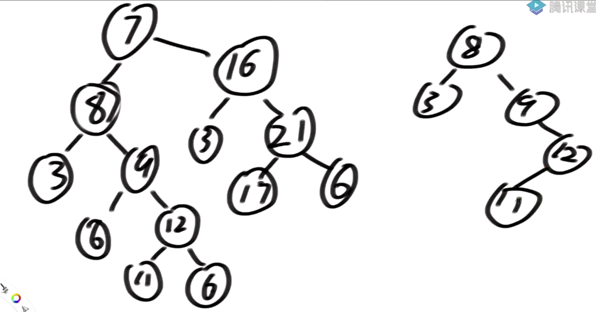

暴力它的流程是这样的，拓扑结构也有头结点，我现在可以抠掉某些点，可以留下某些点，这都叫结构，但它这个结构也有一个具体的头结点。f（Node node）定义为以必须以你传入的这个参数node为头，满足二叉搜索树条件的最大拓扑结构能有几个点。那么我对于每一个结点都调一次f，毫无疑问，答案一定在其中。

对于node的左右结点left和right，分别再以搜索二叉树的搜索方式找一遍，看看能不能找到left或者right，如果找不到我就不算到拓扑结构里面，如果找得到我就算到我的拓扑结构里面。left和left的左右孩子，继续以node为头继续按照搜索二叉树的方式找。

具体就是node按照先序遍历，可以找到它下面的所有结点，对它到达的结点x从node开始用搜索二叉树的方式找，看看能不能找到，找得到我就加进去，找不到，连同它下面的子树都不要了。这只是对node这个结点玩了一遍f函数，你接下来要对所有的N个结点都玩一遍这个f函数，这是一个N³的算法。

下面的方法可以达到线性阶。先说一个东西叫拓普贡献记录的概念，这个拓扑贡献记录它针对的是唯一的一个头部。

假设现在针对5的贡献记录。1结点它的左树和右树分别给五这个头部贡献了几个结点，左树零个结点，右树零个结点。4这个结点它左树和右树给这个头部分别贡献了一个结点，零个结点。在每一个节点上，我都有两个记录，这个记录就是拓扑贡献记录，每一个节点上的贡献记录是对最大的这个头部（5号结点）说的。

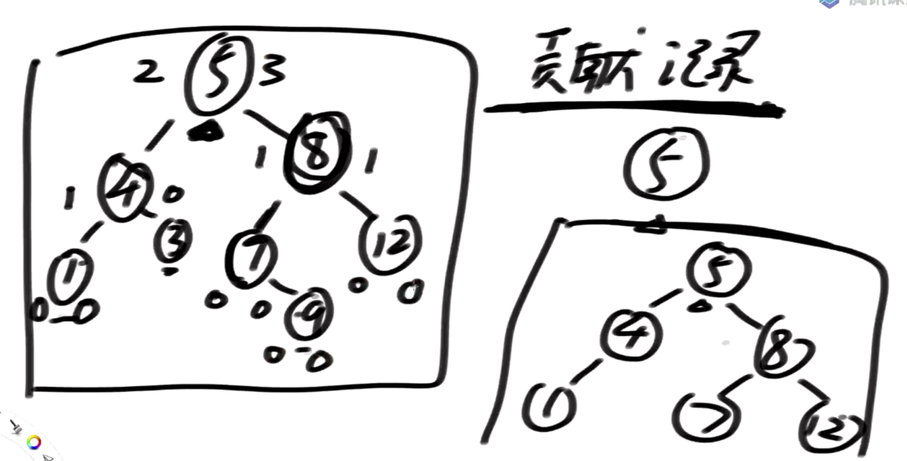

你要写递归，递归一个很重要的就是递归含义的传递。也就是L子树下面的所有的结点所形成的记录都是对L负责的，同理R子树下面的所有的结点所形成的记录都是对R负责的。如果我可以把对L下面所有的结点中的对L负责的贡献记录、R下面所有的结点中的对R负责的贡献记录，转变为对X负责的贡献记录，那么递归含义就可以传递了。如果从子到父，这种更新逻辑很快的话，那你写一个递归不就玩起来了。

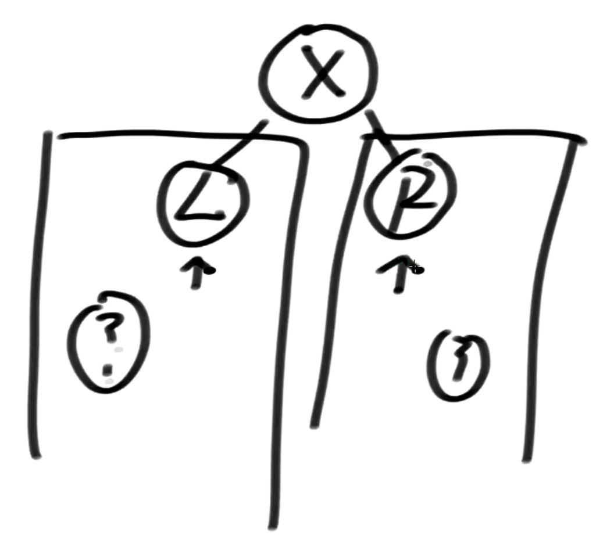

怎么改负责呢？其实有些都可以不用改，10这个结点的左树的含义直接可以迁移为对13的共献，同理12的左树也是可以直接含义迁移的。但是到了14这个结点的时候，因为14本身算不进去了，所以14不能要，那么12也就和14断开了，所以要沿途把右树的信息改回去，一路改信息，具体就是25-25,50-25。这个是过左树的右边界。

如果是改13的右孩子的话，右孩子的右边界肯定是达标的，主要就是看一下右孩子的左边界，所以就是过一遍13的左边界然后改回去。

虽然每一个结点都过了自己左树的右边界和右树的左边界，整棵树相当于按照边界分解掉了，总体复杂度就是N的。

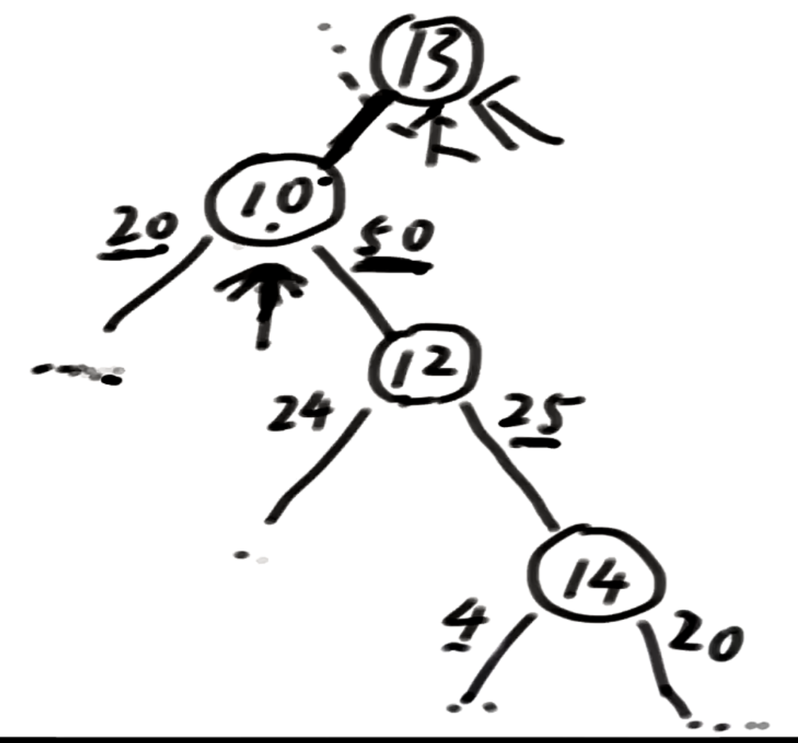

### 完美洗牌问题

题目4：


目标，只用有限几个变量，O(N)。

这道题为什么重要？讲leetcode的时候你就知道它为什么重要了，因为有他参与的时候，很多题目都是通过最基本的这种调整做出来的最优解，所以说完美洗牌问题很重要。

我们先想观察一下，它的下标变化其实挺规律的，你R1位置会变到第1位置、R2位置是插到第3位置，R3会到第5位置。这道题所有讲述过程中，假设下标都是从1开始的。元素的个数得偶数，`arr.len`为偶数，不然没法洗牌。

其实你对于一个位置他要去哪，是一个简单公式就可以确定了。有一个f函数，你告诉我你原始的i以及数组一半的长度N（数组的总长度是2N），我给你返回这个i位置的数应该去哪，返回值也是一个整数。当i>N时，去的位置为(i-N) * 2 -1 ；i<=N时，去的位置为 2 * i 位置。所以一个位置去哪就是常数时间可以决定的。


所以下面一个比较启发性的思路就来了。例如abcd，应该变为cadb，我先来到a，把a通过公式算到它应该去2位置，直接空降到2位置，然后把那个位置的b抓住，通过公式算出应该去4位置，然后直接空降4位置，抓住d，算出来去3位置，抓住c，算出应该去1位置。这样一来全部排好。

但是有没有可能在特定的偶数长度下这样的流程会失效？如下图，可能到一半就回到1了，可能不是一个环就能搞定。如果你能找到每一个环，你就对了，独立这个多条环之间，它不可能有相交的。所以问题就来到了你怎么找到所有的环的出发点，而且不能用O(N)以上的空间，并且不能用额外的结构？


这里就开始上一个结论了，这也是完美洗牌问题特别屌的一个结论。对于一些非常特殊的长度是有规律的。当总长度`S= (3^k) -1`的时候，环的出发点就是1,3,9,27,...,3^(k-1) 。意思就是当我的长度是(3^k)-1的时候，环的出发点就是3^(k-1)。证明很难，不用管。那你给我一个普通的偶数，我怎么弄呢？答案是，利用这些东西来分解。


在解决普通偶数长度的数组怎么分解之前，我们先来一个小的底层模型。假设我给你一个范围[1,8]，另外一个参数k=4，k=4的意思是前四个是左部分，后四个是右部分。如果k=5，那么就是前五个是左部分，后三个是右部分。你给我调整成左部分彻底，右部分彻底跑到左边去，左部分彻底跑到右边来。过程是O(1)的，并且用有限几个变量。

这个怎么做？左部分逆序一下，右部分逆序一下，再整体逆序一下就做到了。复杂度是O(N)可以搞定的


下面我们就开始了。你现在具备了两个底层函数，一个底层函数是f函数，决定一个位置 i 它应该去 i‘ 。还有在l到r范围上，如果我给你左侧的范围，你怎么把右侧侧底拿到左边来，把左侧侧彻底拿到右边去。这两个底层函数是有限几个变量，时间复杂度线性阶可以做到。这就这么两个底层，然后再加上刚才那个结论就可以进行分解普通偶数长度的数组了。

一个普遍的偶数，先找最接近它的3^k -1的数，这个例子是8。那么就把前八个他要的结果先搞出来。所以下一步的目标就是让L1~L4，R1~R4贴在一起。L5~L7，R5~R7贴在一起。这样左边可以直接用结论调整好，右边去递归。如何从上面的变到下面的呢？L5~R4这个范围调用一下k=3那个底层。


时间复杂度证明，你每一次循环怼，其实就是搞定a这个量，a就是上面的结论。循环怼是O(N)的，并且你交换的规模是C+a/2，C的大小肯定不会超过a的3倍，因为你的a是找最接近的，所以交换的规模也是a的常数倍，并且也是O(N)的。所有的数循环怼之后就到左边去了，再也不会参与右边的循环怼和交换。所以总的复杂度为O(N)。


## Interview Coding 15

训练营4，第7节

### 项目结束的时间

code1：

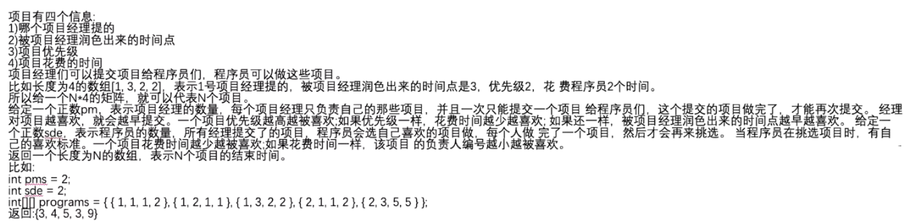

第一维数据是这个项目是被谁提出的。第二维数据是提出的时间点，在这时间点之前此项目不可见。第三维数据是项目优先级，越低越紧迫。第四维数据就是这个项目需要花费程序员多少时间。

讲一下这个大流程，假设我一开始是零号时间点。

每一个项目经理他有一个自己的一个设计书的池子。这个设计池是啥意思？就是当一个一号经理的项目写完设计书，它才会出现在项目经理一的设计池。如果设计书在当前时间点还没有润色出来，哪怕它属于项目经理一，它也不在这个设计池。现在时间点往后推了，过了一些时间，那么可能就有一些设计池里面有设计书了。每一个项目经理都会有自己的设计池。项目经理会按照什么样的策略组织自己的设计池？他有一个自己的喜好排序，这个喜好排序是什么规则？**优先级**是项目经理喜欢的第一要素。如果优先级一样，**花费时间**越少，项目经理越喜欢，如果这个也还一样，那么项目项目经理被润色出来的**时间点**哪个是最早设计的哪个最喜欢。所有的项目经理都按照这个排序规则，那么就可以认为项目经理自己内部的设计文书，它就能组成一个堆。

程序员这边，我给你五个程序员，你可以认为这五个人的程序员是没有差别的，任何一个程序员，他们工作效率一样。这五个程序员就等待着要做项目。但怎么做项目呢？这五个程序员都盯着一个项目池。项目经理可以把自己的某一个项目扔到项目池里去。项目经理会怎么扔到项目池里去？自己最喜欢的方案扔到项目池里去。也就是把自己的设计池的堆顶扔进来。每一个项目经理只能把一个项目扔到项目池里去，除非他当前申报的项目被做完了，他才可以把下一个项目再扔到这个项目池里去。但是从这这五个程序员会在项目池中挑选项目做，他们的策略是什么？那是程序员自己的喜好标准。一个项目**花费时间**越少越被程序员喜欢，如果花费时间一样，项目的**负责人编号**越小程序员越喜欢。所以你可以认为这个项目池会根据程序员的喜好标准维持一个堆。所有的程序员都会在项目池里面领项目做。都会在项目中领项目做，就这么个流程。他问你所有项目被做完的时间，请你返回。

先来看一个基本结构。这个结构里面是这样的，每一个项目经理有自己的堆，维持着每一个项目经理喜欢的设计文档。有一个程序员堆。这个结构它对外开放两个功能，第一，你把一个新的项目文档加到这个结构里去，也就是add（book x）。这个x它内部有信息，它自己知道它是哪个项目经理润色出来的。他是他是项目经理几，他就丢到相应项目经理的池子里去。第二个方法，就是程序员去调这个结构，你告诉我程序员堆里面目前为止堆顶的项目是什么，get。外部怎么调用这个结构先不说，你内部怎么去协调？例如经理1把自己目前的池子里最喜欢的a项目，放到程序员堆了，但是现在到了一个新的时间点，来了一个新的b项目，现在经理1最喜欢b项目，所以它需要到程序员堆中找到之前他加进去的那个项目，然后把它删掉（或者引用换掉），把现在自己最喜欢的项目加进去。所以这是需要两个堆配合的一个结构。你每次一个东西进到堆中，或者堆里面的东西改了，删了，都需要进行堆结构的调整，swim和sink！！这是当一个项目进来的时候。一个项目出去的时候是啥样？程序员堆里面弹出了一个项目x，这个x需要找到对应的经理的设计池，删掉！

当我一个设计书被润色出来，我就调这个结构的add。当有任何程序员想做项目，我就调这个结构的get方法，你把这个结构想的简单一点儿，再想外部如何调用。

外部调用，时间点怎么表示，你有几个员工，你就有几个时间点！表示时间的东西也是一个堆结构。


### 找到两个错误结点

code2：

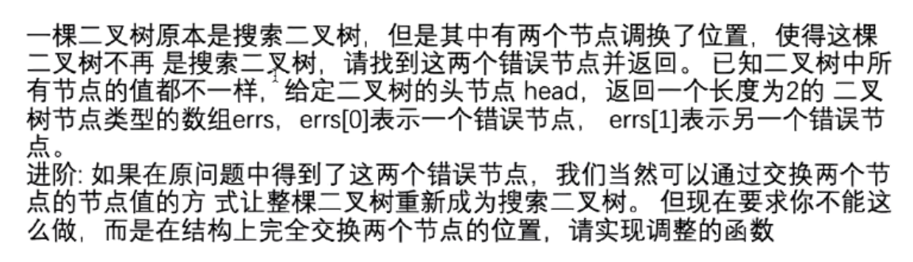

这题有更难的问法：问你这棵树上，可能有0个结点、2个结点、或者更多结点错了，如果0个结点错了你就返回没有，2个结点就返回那两个错的结点，更多的话你就不用返回了。但是这里没有必要，我就规定这里一定有两个结点错了。

怎么找？先把中序遍历的序列搞出来。如果有两次降序，那么这两结点一定是第一次降序的第一个结点和最后一次降序的最后一个结点，也就是6和3。但是不一定有两次降序，可能只有一个降序，但是一定也是第一次降序第一个结点和第一次降序最后一个结点，只不过在这种情况中，第一次降序和第二次降序是同一次。其它情况的降序情况也是这个规律

| 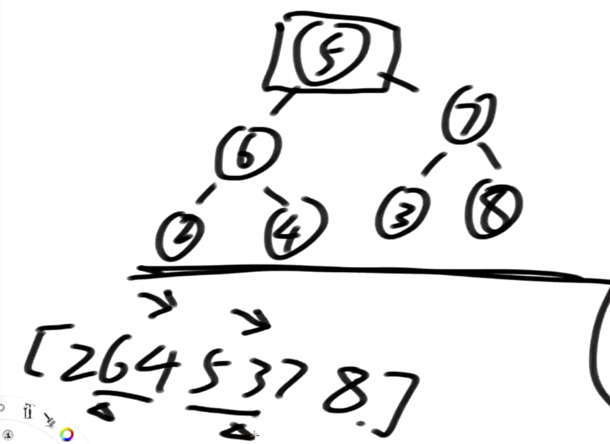 | 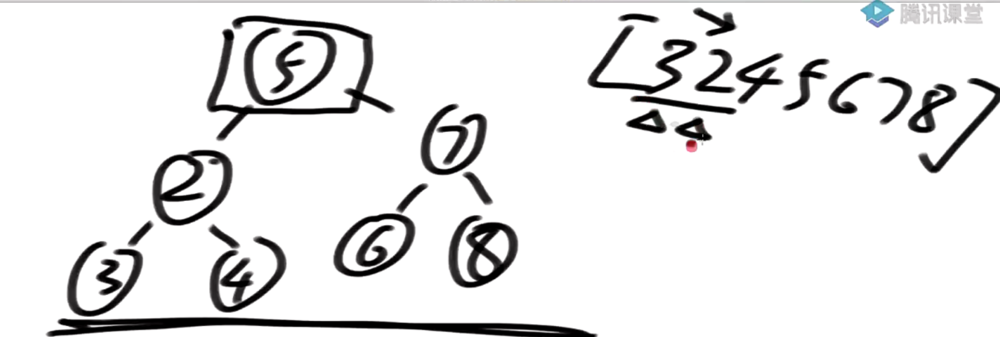 | 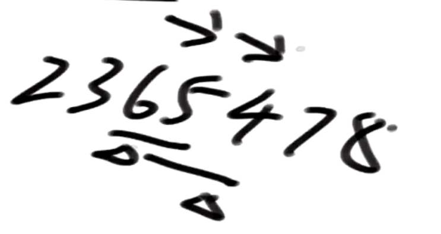 |
| ------------------------------------------------------------ | ------------------------------------------------------------ | ------------------------------------------------------------ |

你找到两个错误节点之后，你怎么把它调对？怎么把整棵树调对？在lead code上，它的标准答案就是你找到两个结点之后，你把它们内部的值调换一下。这样其实不好，为啥呢？因为其实你并没有在结构上把它们换回来，你只是把两个结点的值互换了，我们想想它会有什么问题。如果你在工程上，你的这个你一个节点就是一台服务器的话，你把这个结点的值换一下，其实是没有什么用的。所以其实按道理来讲，应该是你找到两个结点之后，在结构上把它们彻底调过来。可能是更有建设性的一种方式。

那么f（ head，e1，e2），作用是把e1和e2在head为头的树上，把结构互换了。f函数一定返回Node类型而不是void，因为f函数玩下去可能会换头的。你要返回你的新头部。这其实挺复杂的，因为e1和e2可能的情况非常多。怎么在结构上整理好彼此之间的关系？是这道题的重点。

要考虑的点很多

1. e1和e2可能是头
2. e1和e2与其父亲结点的关系--左孩子？右孩子？
3. e1和e2是紧挨着的吗？如果挨着，e1和e2谁是谁的父亲。

但是要注意了，你e1和e2是按照中序遍历找的。所以下面，第一种和第四种情况一定不会出现，所以你的代码里面就不需要考虑。但是如果你考虑了，没关系，这段代码它又跑不进去，只是你做无用功了。

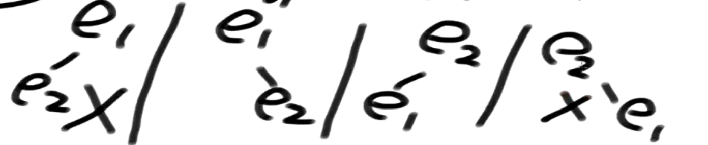

这题我并不打算把所有的细节都给你抠明白，但是。我给你提供的方法中，我把14种情况全部列出来，每一种情况针对怎么调整全写了。这道题目如果你练会了二叉树，调整这个问题，以后就不叫事儿了。接下来就是一件纯粹非常tricky的事情，就完全就只是恶心你。让你去整理清楚所有的边界条件，这是一道非常练边界条件整理能力的题。


### 可见环形山

code:3：

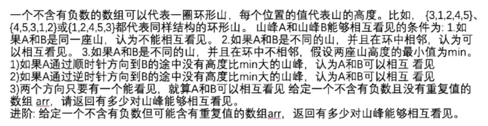

不要重复算，例如1和3可见了就不要写3和1可见，你只要按照升序排列，就不会重了。{n,m}，后面的m不要比前面的n小，就不会重了。不相邻山相互看见的规定很符合自然，因为中间隔着的话，中间的山不能挡住才行，挡住了那座矮的山就看不见高的山了，所以肯定不能相互可见。暴力肯定好做，从一个点出发，所有点都遍历一遍。 

这题中，无重复值是最简单的，复杂度O(1)。f(1)=0、f(2)=1、f(3)=3 。限定找山峰对的时候都是小的去找大的山，因为小的比较矮，才会被挡住，并且规定小的找大的永远都是去重的。公式是2 * (N-2)+1，因为既然山峰数量大于3，那么肯定有一个最大和一个次大的山，除去这两个最高的山给定任意一个x，一定有且只能找到两对。加上这两个最大的山，由于我们限定小找大，所以就是1对。总的2n-3对。

下面来看可能有重复值的时候。找一个数两边离你最近的比自己大的---》单调栈。是一个环形山所以你肯定得实现一个能够环形遍历的这么一个机制。

先遍历这个array，找到其中的最大值，这个最大值可能不是一个，那就随便拿一个，你找到它的位置。不妨设arr中最大值是5，这个5可能有多个，你从哪一个5出发都可以。我通过它，逆时针方向依次遍历，最后会回到5。

在这个过程中，我们准备一个栈利用单调栈的做法，并且是有重复值的单调栈的实现，准备一个队列装值相等的下标，弹出来的时候一起设置，这题就是找离你最近的大于你的。如果弹出设置的时候列表都是1个数，那么就不用管，就是2个记录。但是如果弹出设置的时候列表有n个数，那么已经有2 * n了，并且n个山峰一样高，一样高我们认为两两可以看见所以还有C(n,2)对。注意为什么是C(n,2)，因为我们认为只有中间有比你高的才会挡住，意思就是和你一样高的山不会挡住你。

这样一来按照单调栈的流程，你到最后肯定栈里面会剩下东西，这些东西怎么结算？注意，在之前别的题的单调栈中，最后单独处理的时候单调栈会认为右边已经没有大于你的数了，但是，这题的特殊之处在于，是环形的。也就是即使现在已经没有东西可以让栈顶弹出了，但是不意味着栈顶在逆时针方向上看不见山了，这些山现在可能就压在你的下面，因为栈底是放大的数，如果你下面压着的山不止两条，那么你对外就有两条记录，因为环形的缘故你可以从两个方向上分别看到比你高的山，对内还是C(n,2)。如果你下面压着的只有一条了，那么看看这一个队列里面有一座山还是两座山以上，如果只有一座山那么对外就只能有一条否则或者就还是2条，对内C(n,2)。如果你下面一条都没压，说明你是最大的，对外没有，对内C(n,2)。说一点，其实栈底就是你逆时针看能看到的第一座高山，你顺时针看就能看到你栈顶下面压着的第一座高山。

- C(n,2)其实也把1个山对内0条也包含进去，用一个公式就行了。

现在回到一开始。为什么一定要从数组的最大值开始：为了给我压一个永远不会弹出的底，否则在逆时针加的时候，如果栈底不是最大值，那么栈底就可能弹出，那么栈底弹出来了，我逆时针看这个把我弹出来的数，那我顺时针看谁呢？所以一定从最大值开始。

- 这题好像只关心我栈里面同一高度的山出现了几次，不关心山的下标，所以可以不用一个队列来存放相同值对应的下标，我们用一个Record结构来代替队列，Record里面记录山出现了几次即可！


### 子序列模m最大值

code4：

- 给定一个非负数组arr，和一个正数m。返回arr的所有子序列中累加和%m之后的最大值

这题就是一个背包问题。dp[i] [j] 代表arr的0~i自由选择能否严格凑出j，是一个布尔类型的二维数组。然后遍历dp的最后一行，把能搞定的j去模m，抓住最大值即可。但是这样列数可能很多，如果里面的值都很大的话，你需要把每个数都加起来，甚至可能会溢出。

那么我们就把dp[i] [j] 的含义变一下。dp[i] [j] 含义变为arr的0~i自由选择的累加和%m之后能否凑出j，也是一个布尔类型的表。

```GPT
在计算数组的子序列时，可以选择从数组中选取一些元素，也可以不选取任何元素。如果不选取任何元素，则子序列为空序列。因此，全不选的情况也属于子序列的一种情况。

一个序列的累加和定义为该序列中所有元素的和。对于空序列而言，它不包含任何元素，因此其累加和为0。

在数组的子序列中，空子序列是一种特殊的子序列，它不包含任何元素。因此，如果要计算数组的所有子序列的累加和，需要把空子序列的累加和也算上。由于空子序列的累加和为0，因此可以把它看作是一个初始值，并在计算其他子序列的累加和时累加上去。

子数组是原数组的一段连续子序列，因此子数组不可能为空。子数组至少包含一个元素。

相反，子序列可以为空，因为子序列不要求元素是连续的，可以从原序列中选取任意个数的元素，包括空序列。
```

dp[0] [0] = T ，因为0~0自由选择累加和凑出0，我一个都不选，累加和就是0。

第一列，都是T，空序列

第一行，dp[i] [arr[0]]=T，别的不管，保持默认值。

一个普遍的位置dp[i] [j]，讨论i位置参与和不参与的情况。

1. 如果i位置不参与累加加去模m，那么如果dp[i-1] [j]=T，那么dp[i] [j]也为T。
2. 如果i位置参与累加和然后去模m，如果(arr[i]%m)-j<0，依赖dp[i-1] [m+c-j]；如果(arr[i]%m)-j>=0，依赖dp[i-1] [c-j]

```
取模运算具有分配律。

具体来说，对于任何三个整数 a、b 和 c，以及一个给定的正整数 m，以下等式成立：

(a + b) % m = (a % m + b % m) % m

这意味着，如果你想要计算一个表达式 (a + b) % m 的值，你可以先计算 a % m 和 b % m 的值，然后将它们相加，最后再将和取模 m 的结果。这样做不会影响最终的结果。

同样地，对于任何整数 a 和 b 以及一个给定的正整数 m，以下等式也成立：

(a * b) % m = ((a % m) * (b % m)) % m

这意味着，如果你想要计算一个表达式 (a * b) % m 的值，你可以先计算 a % m 和 b % m 的值，然后将它们相乘，最后再将积取模 m 的结果。这样做同样不会影响最终的结果。
```

presum是我希望你前面给我搞出来的累加和，加上我的arr[i]刚好模上m就等于j了。等价变换一下，这等价于你之前搞出来的累加和模上m等于km+arr[i]%m-j。这等价于你0~i-1位置累加和模上m，你能不能给我搞出一个km+arr[i]%m-j。也就是依赖dp[i-1] [km+arr[i]%m-j]，这里的k只可能为0或1，如果arr[i]%m-j小于0它就是1，否则就是0。

```
(presum+arr[i])%m=j   <==>  (presum%m+arr[i]%m)%m=j
假设arr[i]%m=c，则(presum%m+c)%m=j  ==>  presum%m + c = mk+j,(k<=1)，因为c+presum%m不超过2m
presum%m = mk+j-c
如果c-j<0,presum%m =m+j-c
如果c-j>=0,presum%m =c+j-c
```

搞定dp表之后，从右往左，第一个true的就是答案。

看菜下饭的题。第一种方法复杂度N * sum。第二种N * m。但是如果数组里面的值也很大，m也很大，但是N不太大，怎么办？第三种方法，把数组切成两半，一半去算所有的子序列累加和%m所能凑出来的数，另一半也同样去算。第一种情况就是我直接去左边的List找离m-1最近的。第二种情况就是去右边找离m-1最近的。第三种情况就是列举所有的List1里面的，然后到List里面找离m-1-x最近的。但是可以注意到第三种其实包含了第一和第二种，list1或者list2枚举累加和为0的情况就是情况1和情况2。这是指数级别的！！分两半是为了减少指数的次方，分治。在这种情况下我暴力递归去做，我都不用记忆化搜索或者动态规划了，因为N本身很小，但是sum和m很大，你去记忆化搜索或者动态规划，根本命中不了几次。

为什么决定要用np问题，我告诉大家实际状况是啥？这道题在出的时候，它就逼着你用第三种方法。

## Interview Coding 16

训练营4，第8节

### 正则表达式匹配

`leetcode-10`

code1：

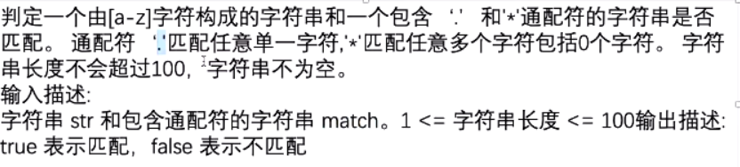

可以认为，除了点跟星之外，剩下的字符都是没有特殊字符的。我们现在讨论的字符串都是由数字、字母、点、星  构成的，而string它只会由数字跟字母构成，match串在含有数字跟字母的基础上还可能含有点和星。点可以变成任何一个单一字符，但是它不能变成星字符。星不能自己单独使用，它必须跟它前面一个字符配合使用，前面的字符可以是点、数字、字母。a*代表0个a、1个a、.....  、n个a。它必须跟前一个字符配合使用，那也就是意味着，即便是在match串中，两个星也不可能在一起，因为这不合法。

| 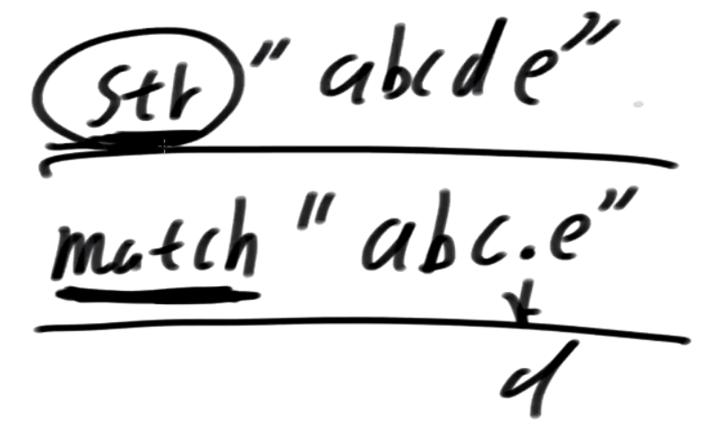 | 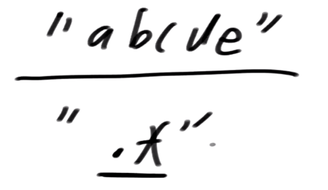 | 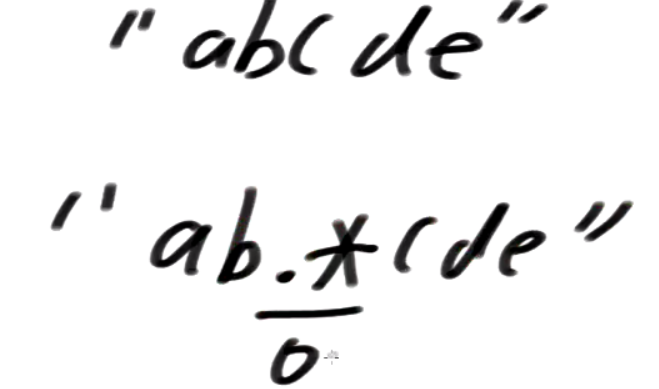 | 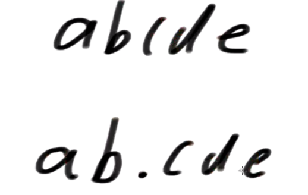 |
| ------------------------------------------------------------ | ------------------------------------------------------------ | ------------------------------------------------------------ | ------------------------------------------------------------ |
| 匹配，点变成d                                                | 匹配，点星变成5个点                                          | 匹配，点星变为0个点                                          | 不匹配，点至少变一个字符                                     |

这道题怎么试？给你两个样本了，一个样本做行一个样本做列的对应模型。

定义以下函数f。str从si出发往后的所有字符能否被express串从ei出发往后的所有字符变出来。动态规划嘛，要么0~i要么i~N-1，一道题可能两种定义都行，也可能只能一种行。所以主函数调用f(str,exp,0,0)。

```
boolean f(String str,String exp,int si,int ei)
```

接下来我们就来看一下这个函数应该怎么拆。我们先不看这个终止位置，就比如说你si碰到str结尾了怎么样，越界了怎么办。express如果这个ei碰到终止位置怎么样，也先不管。f函数我们省掉固定参数，用可变参数来讨论。在主函数里面，我先检查一下，确保string中没有点没有星，再确保match串中星号不在开头位置。因为如果星号在开头位置，它是一个不合法的串，星号必须跟前面一个字符搭配使用，所以match串的开头不能是星，还有就是两个星不能挨着。在整个调主函数这个f之前，先做有效性检查。

base case是，ei来到了这个串的结尾，就相当于是你的表达式串已经耗尽了，它已经是空串了。你的表达式串已经是空串了，你怎么能变成s的东西呢？只有si后面的也是空串才能变，如果不是空串就返回false。

看普遍情况，ei和si都在一个正常位置，都有字符。可能性怎么整理？看ei+1位置是不是星？如果ei+1位置不是星，首先你si和ei的位置要能匹配才行，所以要求你的字符要和str字符相同或者exp这个位置的字符是点。

f函数有一个潜台词，隐含的限制。你不能让ei压中 星 的位置，你调所有的f函数必须满足这个限制。因为星开头的东西不合法，你递归的东西含义要传递，既然你说星开头不合法，你怎么能让子过程星开头？所以我以后调的每一个子的过程，ei位置请你不要去压星，有星你给我跳过，你得想办法不让它压中星。所以我们才可以只讨论ei+1位置是不是星，而不讨论ei位置是不是星。

注意：如果ei来到了exp的结尾，ei来到exp结尾隐含着ei+1也不是星，因为没有字符。在ei+1不是星的情况下，你ei来到一个位置，只要ei还在[0,exp.len-1]的范围内，那么就要求si...往后有东西，也就是si<str.len才行，并且ei位置的字符和si的字符能对上，并且调用子过程，往后的也得配上才行。

下一种情况就是ei+1位置是星的情况，因为你做了有效性检查，ei+2位置一定不是星。如果ei字符和si字符不一样，那么只能靠ei+1位置的星来挽救，把你这个不一样的字符变成0个，所以后续要调用f(si,ei+2)。如果ei位置和si位置的字符一样，那么就要枚举了，让星变成0个你f(si,ei+2)，让星变成1个你f(si+1,ei+2)，变成2个你f(si+2,ei+2)，变成3个你f(si+3,ei+2)，直到前缀串不一样了才停，只要有一个分支调用是true，整个就能变出来。

最麻烦的就是点星了，点星可以帮你搞定所有前缀。

搞定了暴力递归之后，来搞二维表看看能不能斜率优化。我们发现初始化完了之后，一个普遍格子依赖自己右下角的格子，以及跳1列下面的格子。有枚举，但是这题不能优化，因为它条件有转移，一会说。

看下面的位置依赖，好像我的初始位置不够用。一个格子需要依赖右下角的格子，那么你至少也需要把下面的格子也填好吧？也就是我们需要把第三列和第五行都填好，我们的普遍位置才有救。 如果我不准备好最后一行和倒数两列的话，我们填格子就优点困难了。先来看第三列怎么填，第三列其实代表exp已经到达了最后一个字符了，首先确定这个exp的字符不可能是*，因为如果这个位置是星，递归行为永远调用不到它，递归行为调用不到我当然不需要填了。所以如果exp[3]位置是星的话，你倒数第二列求都不要求了。如果exp的最后一个字符不是星，那么第3列的最后一个位置必定是false，因为str耗尽了，但是你exp还剩下一个。4,3位置意味着str剩一个，exp也剩一个，那么取决于他们相不相等。(0~3,3)都是false，因为exp剩下一个，但是str还不止一个。这样一来倒数两列解决了，现在解决最后一行，也就是第五行。最后一行代表str已经没了，耗尽了，而exp还有，那么exp只有变成空串才有戏，所以只有是某星某星某星这样下去，所以最后一行从右往左都是星某星某，星的位置是T，某的位置是false，一旦false true断掉，左边全部都是false，一旦断了左边都是false。

这道题我想说什么？有的时候递归函数很凑巧，看似我没有讨论si到最后的时候是啥情况，实际上，这个讨论是掺在每一个循环里的。但是你掺在一起，发现你看不出来了。我介绍这个技巧是说你写递归函数的时候，如果你base case你不知道怎么想，无所谓，你先把普遍位置写好，普遍位置写好之后，你再反推，你需要垫什么样的base case？写递归函数，你就可以假设一种最普通的情况去写，可能你写完的时候你都不知道你base case怎么去整理？不要紧，你就看你普遍位置的依赖关系，你至少要准备多少，要准备什么样的情况，成为你的base case。

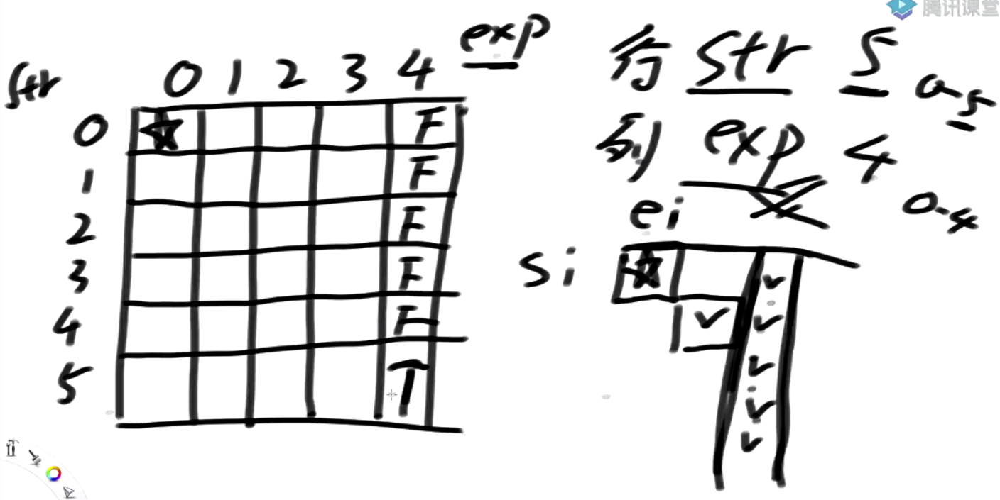

dp补不补位置取决于你暴力递归能不能到达len位置。

dp定位从0~i还是从i~N-1，取决你的题目从左往右试舒服还是从右往左试舒服。从左往右试，跟从右往左试，其实没有太大的区别，它可能决定你在列可能性的时候的一个方向，但是策略应该是差不多的。这道题我们为什么决定从从左往右试，因为到一个字符，它是往后去看是不是星号的，而不是往前去看是不是星号，所以可能从前往后试，会比较舒适一点。因为到一个位置，取决于后面的字符是不是星，所以要求后面的dp求过了，所以dp定义为i~N-1。

暴力递归的从左到右尝试对应到动态规划其实就是i~N-1这样的，例如这题，你需要知道后面的情况怎么样。如果是从右往左尝试的话，对应到动态规划就是0~i这样的范围，0~i这样的范围对应之前的题，有最长不重复子串，因为要依赖前面出现的字符，所谓依赖前面的位置，就是要求前面位置的dp求过了，所以定义为0~i去试，会舒服一点。

### 自由之路

`LEETCODE-514`

code2：

- 电子游戏“辐射4”中，任务 “通向自由” 要求玩家到达名为 “Freedom Trail Ring” 的金属表盘，并使用表盘拼写特定关键词才能开门。

  给定一个字符串 ring ，表示刻在外环上的编码；给定另一个字符串 key ，表示需要拼写的关键词。您需要算出能够拼写关键词中所有字符的最少步数。

  最初，ring 的第一个字符与 12:00 方向对齐。您需要顺时针或逆时针旋转 ring 以使 key 的一个字符在 12:00 方向对齐，然后按下中心按钮，以此逐个拼写完 key 中的所有字符。

  旋转 ring 拼出 key 字符 key[i] 的阶段中：

  您可以将 ring 顺时针或逆时针旋
  
  转 一个位置 ，计为1步。旋转的最终目的是将字符串 ring 的一个字符与 12:00 方向对齐，并且这个字符必须等于字符 key[i] 。
  如果字符 key[i] 已经对齐到12:00方向，您需要按下中心按钮进行拼写，这也将算作 1 步。按完之后，您可以开始拼写 key 的下一个字符（下一阶段）, 直至完成所有拼写。

| 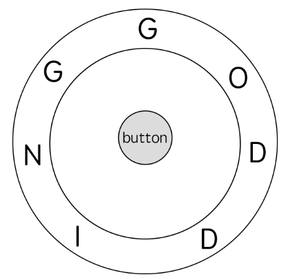 | 输入: ring = "godding", key = "gd"<br/>输出: 4<br/>解释:<br/> 对于 key 的第一个字符 'g'，已经在正确的位置, 我们只需要1步来拼写这个字符。 <br/> 对于 key 的第二个字符 'd'，我们需要逆时针旋转 ring "godding" 2步使它变成 "ddinggo"。<br/> 当然, 我们还需要1步进行拼写。 因此最终的输出是 4。 |
| ------------------------------------------------------------ | ------------------------------------------------------------ |

str从0位置开始编号，一开始顶针在0位置，字符串按照顺时针排开。你给我搞定一个函数，f(i,j)，从顶针指向i位置字符，到顶针指向j位置字符最少需要移动几次，这肯定是一个公式可以搞定的，g是0位置，走到6位置，0-6+7=1，6-0=6，选1步。

```
(i+x)%m=j,  km+j=i+x  => x=j-i+km (k=0或1)  i顺时针走x可以到j
(i+m-x)%m=j , km+j=i+m-x => x=i+m-j-km => x=i-j+km (k=0或1)  i逆时针走x可以到j
顺指针步数x1:j-i+(j-i<0?m:0)
逆时针步数x2:i-j+(i-j<0:m:0)
f(i,j)=min{x1,x2}
m为字符串的长度
```

- 简单的理解上面公式，从i顺时针到另一个地方j需要走的步数就是末位置减去首位置j-i然后根据正负去加上m。从i逆时针到另一个地方j需要的步数，等价于从j顺时针走到i，所以需要的步数就是i-j然后根据正负加上m。


然后你把ring遍历一遍，看看每一个字符都出现在哪些位置，所以是一个装着List的HashMap，key是字符。然后你根据它要的，玩一个深度优先遍历，搞一个全局最小值，抓住。暴力递归很容易搞出来，直接记忆化搜索，因为就两个可变参数。


### 打气球

code3：

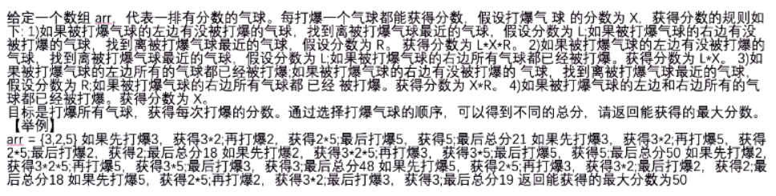

爆了的气球自己有一个分数，叫做m。它得到的分是，左侧找离他最近的没爆的，右侧找离他最近的没爆的，得到的分数是L * m * R 。如果它左侧已经没有气球了，那你认为L就变成1。如果他右侧已经没有气球了，那就认为R就是1。

我们先把这道题的试法给大家讲明白，然后我们再看看有可能产生的试法为什么不对。这道题是在练什么？我们总是很强调模型，好像用到原理的时候不多，原理说的是什么？尝试的时候如果要加可变参数，要是简单类型。如果你要准备可变参数的话，你一定要保证它的类型不要突破单个整形这个复杂程度。l到r上这些气球要打爆，最大得分是多少？有很强的潜台词：我在arr的l到r上这个范围打爆气球的时候。l- 1位置的气球一定没爆。r+1位置的气球也一定没爆。所以这道题我们再次强调一点，这个函数f(L,R)啥含义，返回一个整形，他说的是你在arr的l到r上要打爆气球，但我告诉你l- 1位置，它一定是没爆的，r+1位置也一定是没爆的情况下，你打爆上面所有的气球，最大得分是多少？

你主函数在调用的时候，你把给的arr左右都补个1，然后传进去。例如arr[2,3,5] => arr[1,2,3,5,1]，调用f(arr,1,3)。

我怎么整理可能性，注意：可能性整理谁是最后爆的气球。假设L是最后爆的气球，那么就等于f(L+1,R)+arr[L-1] * arr[L] * arr[R+1]。假设R是最后爆的，那么就等于f(L,R-1)+arr[L-1] * arr[R] * arr[R+1]。开头L和结尾R我们都讨论，还有情况就是中间一个普遍的位置i都可能是最后爆的，那么就等于f(L,i-1)+f(i+1,R)+arr[L-1] * arr[i] * arr[R+1]。所有情况求max。

这题重点不是上面的思路，而是你怎么想到这个思路。你有可能会想到范围上的尝试，因为有L个R嘛。这样一来，有可能干扰你的一个非常强大的干扰，就是我去尝试每个气球最先打爆。那么含义是f（L，R）还是你能获得的最大值，但是你是通过枚举每一个位置最先打爆来进行递归的。这样一个问题就来了，我其实很关系你L~R外面两边的数据状况的。去枚举每个位置上最先打爆，我就没有办法补那个潜台词，我可能不得不去加参数，加什么参数呢？我左侧离我最近的不爆东西是啥？你打爆之后你进递归，你需要给你的递归函数更新这个结构，维持左边最近的没爆的是谁。左右的状况你都要维持，这样你的参数就太多了。你想完谁最先打爆，是不是就该想谁最后打爆了。这样列可能性，你就不需要维持左右两边最后没爆的信息了。原理不能够帮你去启发，但是可以把你不靠谱的路提前堵死。

这道题如果换一问。我每个气球在爆的时候。左侧离我最近的最先爆的气球的因子，乘以我自己，乘以右侧离到我最近的最先爆的气球，如果是这样一种评价标准，我告诉你，尝试每个气球最先爆是最好的。他这个问题本身就一定要拿最后场，拿最后打爆气球去试的。他这个问题本身就一定要拿最后打爆气球去试的。你发现你试不下去了，你发现你潜台词补不出来了，你发现你要必须加一个很复杂的可变参数才能描述这种状况了，你别试了，咱换一个可能性去罗列。

### 数组汉诺塔

code4：

- 给定一个数组arr，数组中只有三种值，分别是1,2,3。那么这个arr从下标0开始到N-1，圆盘的大小从小到大，数组里面的值123代表左中右三根柱子。这样一个数组可以表示一个汉诺塔的状态。如果这个数组它表示的汉诺塔的状态是最优解的其中一步的状态的话，你返回它的第几步。如果你给我的这个状态，它最优解走的过程中根本不会有这个状态出现，你就返回-1。

我们假设现在解决的是i层汉诺塔问题。主函数的时候是解决的一到n的问题。定义f(arr,N,from,to,other)，如果圆盘总共有10个，调f(arr,9,1,3,2)，9代表0~9，数组从下标0开始编号。圆盘它对应下标是零到九，他们整体要从1柱子移到3号柱子去2是另外一个柱子。你告诉我这个array里面的状况是这个大目标的第几步？如果它不是大目标的任何一步你返回负一。如果这个而位的状况是大目标的一步你返回它是第几步？这是f函数的含义。

汉诺塔问题就是三步，第一步和第三步去递归，i不可能会去other位置，因为去other位置它肯定不是最优解。那它不等于other，它一定等于from或to，再看下一种情况。第二种情况是当前arr[i]等于from，说明你第一步没走完，那你就调下图的第一步呗，递归去，f(arr,i-1,from,other,to)。

最大的那个盘就是i位置，最大盘不可能去other位置，是显然的。再来，如果i在from位置，说明此时，在你给的那个大范围上，第一步都没有走完，所以让它进递归到子过程中分解。如果i位置已经到了to位置了，那么要算总步数，就还要算上前面一二步的步数，计算方法就是n层汉诺塔问题最优解的步数是2^n -1步，所以0~i 这个子过程的一二步的总和就是	2^(i-1)然后再加上第三步进去递归。

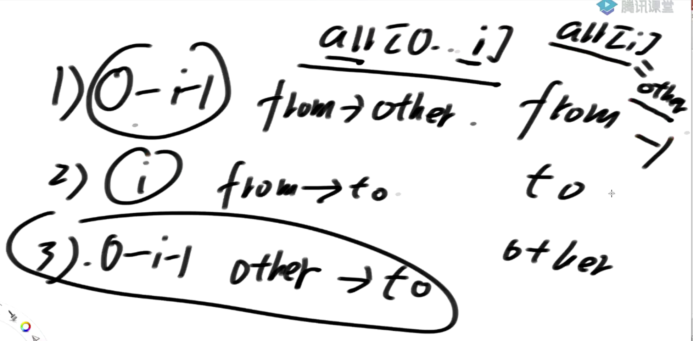

### 最小合成代价

code5：

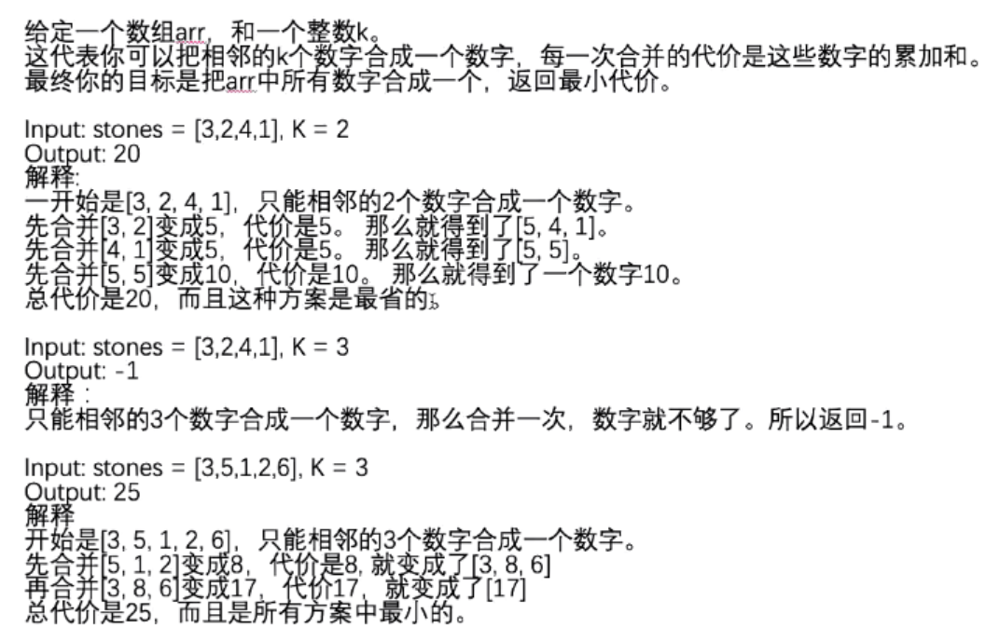

一定存在一个关于长度跟k的这样一个关系。这个n和k满足某种关系，才能最终合成一个数。例如k为3的时候，4个数你无论如何都合不了，所以有一个过滤条件。n- 1模k- 1大于零就合成不了----观察法。

尝试：f(L,R,part)，含义是l到r上，相邻k合完之后正好剩下part个数。请问最小代价是多少？主函数调f(0,N-1,1)。

如果只有一个数，那么只要part==1的时候才返回0，其它都是-1，本身就是1个数，不需要和别人搞在一起，所以只有0的代价。如果不止一个数，但是你要我搞出1份，由于只能k份合并，所以我调用子过程帮我搞出k份，然后合并。如果想让你合出来的不止1，那么就所有的前缀都去试，然后调递归。但是要注意，这些所有的前缀中，只有一些是合法的，就是只有个数是k整数倍的才合法。

这题其实是一个动态规划，但是有点难，大的主逻辑其实是一个范围上尝试的模型，但是又掺了一些业务限制，叫做我合了多少份，等到我真正去讨论part大于1的时候，它又是一个前缀，类似于从左往右的尝试模型。这题为位置依赖很乱，你去记忆化搜索。


## Interview Coding 17

训练营5，第1节

有的视频音画不同步


### str1包含str2所有字符的最小子串

code2：

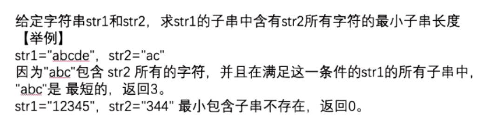

滑动窗口。因为你需要含有str2中的所有字符，所以你既需要知道str2中的字符种类，又需要知道字符出现的次数，所以我们需要一个HashMap做映射。map作为我们的欠账表。一开始你欠账8个，说明你的账没有还完，就让这个窗口右边界移动，c先进来，看看是不是有欠c，如果是就还掉，all也-1变成7。一直这样下去，直到all为0，具体怎么维持，是coding，然后l往右边移动，直到all不能为0了，就收集窗口的大小。

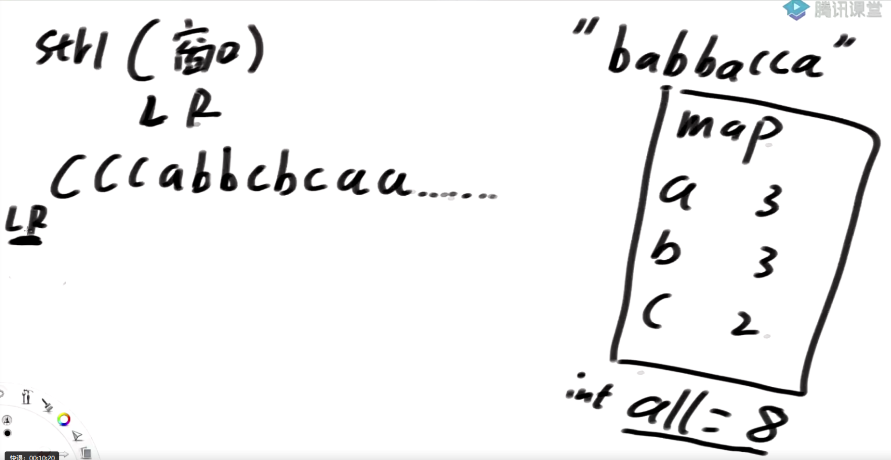


### LFU

code3：

 

既然是一个内存替换算法，那就要指定不要超过多少条记录，假如是k条记录。你对同一个记录，put或者get，都会增加那个记录的频度。当你的已经装满k条记录了，你就可以淘汰掉记录，怎么替换，你扔掉频度最低的记录。如果里面频度都一样，替换谁？替换最早进来的那个。

所以lfu其实包含两个策略，第一个就是当我频度能够分出最小值，而且这个最小值是唯一的一条记录的时候就扔掉这条记录，那如果我多个频度都是最小值我扔掉哪条记录？你看所有的key中，离你最遥远的上次操作的那个key扔掉。这是我们的所谓的lfu内存替换算法，这道题很有名。实际上，它的算法、它的数据结构设计并不特别的复杂。它是一个什么结构？我put方法跟get方法都要求时间复杂度O(1)，这个难。你搞一个时序的机制很好实现，用结构记录来到的时间，但是这样就不是O(1)了。用堆也不行，用堆O(logN)跑不了。

map是肯定要用的，但是跟大家说这个题难点在于什么？它是一个二维双向链表。首先我有桶这个概念，大概是个大盒子里面放的是一个一个的大桶，桶就是一个容器。当然这个桶其实它是双链表结构的。这个桶它跟下一个桶的连接方式是双向链表。

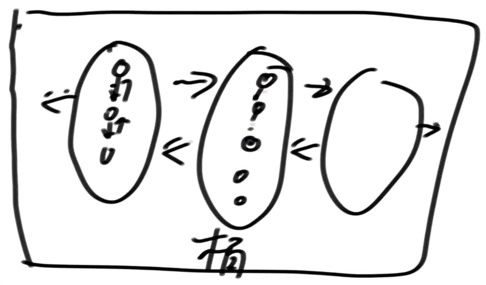

然后怎么玩？首先我有一个map，map里面放key对应的那个结点的内存地址。具体来说就是来了一个记录(A,17)，我会创建一个Node，放到某一个桶里，但是下次如果你要put(A,19)，我希望我通过这个map里面的记录找到A这key被我封装到了哪个结点里面，map直接把这个结点的内存地址告诉我。同时我还会有一个map2，这个map2是具体某一个元素的node它对应的桶是多少？具体来说，我是有桶的概念的，所以我们不仅需要找到那个结点，还需要知道那个结点在那个桶里。桶和Node都是我自己定义的结构，都可以通过记录一个引用直接找到。

举个例子，看到具体是怎么做的。一开始进来一条记录(A,17)，我先在map里面查一下，有没有A这个key，没有我就建出这个结点Node（A，17）。桶是依次建立，并且是双向链表连接。那我就查，你既然是刚进来的，所以你频度是1。我这个结构中最左边的桶意味着次数最少的，最右边的桶意味着是次数最多的，那我就看我这个桶中最左侧的桶有没有。一看，发现没有，说明不仅你是新进来的，而且你是第一个。此时你就是第一个，连大桶都没有，所以我就建出一个桶对象放在最左的位置，然后把（A，17,1）扔进去。那么这个桶叫什么名字？给它取个名字叫做频度为1的桶，因为里面放的次数是1。也就说这个桶里面以后只放频度为1的东西。然后不要忘记更新map2，知道Node在哪个桶。

| 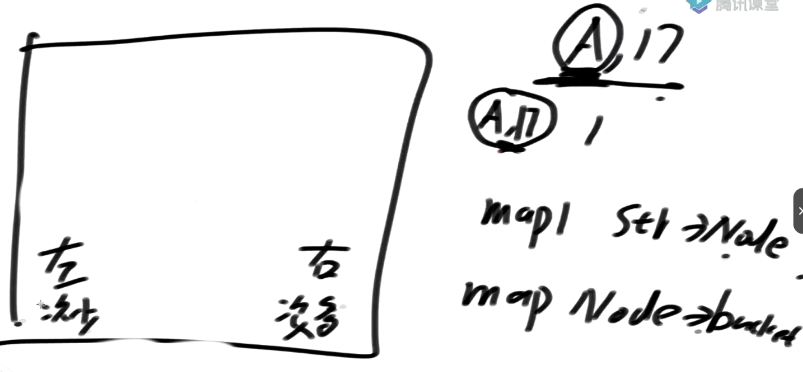 |  |
| ------------------------------------------------------------ | ------------------------------------------------------------ |

下条记录来了，（B，13），map 1查没有关于这个B这个key的记录，所以建出一个东西来（B，13,1）。既然你是刚进来的，所以你频度肯定是1。然后我看看这个大结构中最左侧的桶频度是几？最左侧的桶频度就是你这个桶中元素随便拿出一个它频度是几，桶的频度就是几。这里发现第一个桶的频度是1，发现正好，（B，13,1）这个Node就放进去这个桶里面。同样的map2记得更新一下。

再来一条记录（C，10），那就继续加。

| 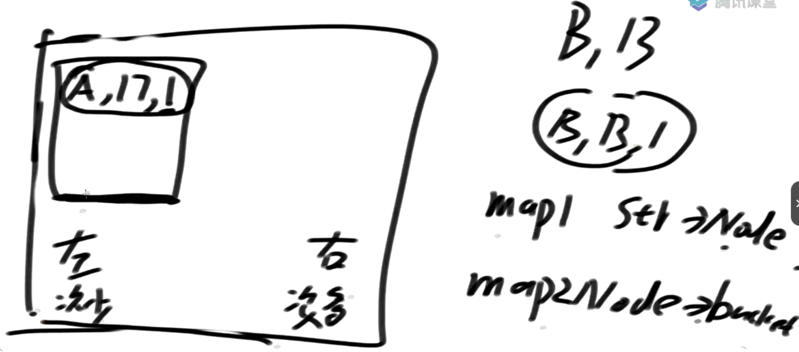 | 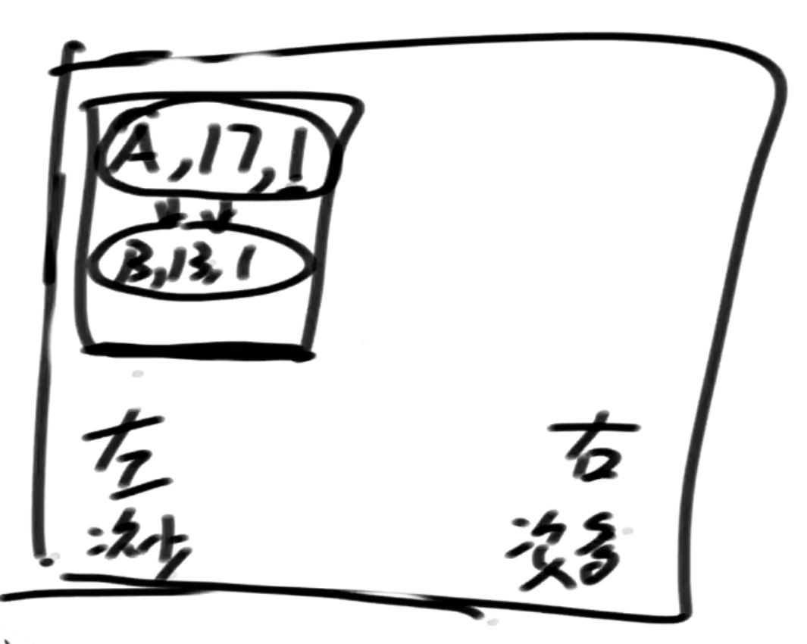 | 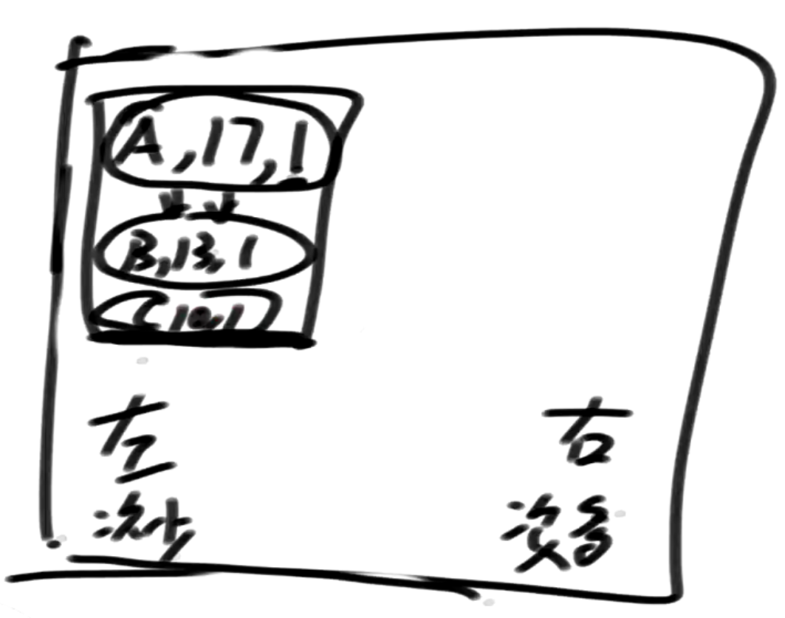 |
| ------------------------------------------------------------ | ------------------------------------------------------------ | ------------------------------------------------------------ |

假设现在我要put（B，26）了。我就在map 1中查有没有你这个点，有你这个点，有你这个点直接能够一杆子插到这个点。因为我这个表中是直接记内存地址的，我不根本不需要遍历桶，我也不需要遍历桶里面的元素，我直接能找到它，通过这个map1！所以你直接把它值改成26。

然后注意，此时B在对应的那个桶里面，词频要+1，+1之后就不再属于那个桶了，要从那个桶里面分离出来。那么我分离出来，这个代价就是上下环境重连，这毫无疑问是常数时间的事情。所以接下来你就把B拿走，A和C连好。

然后干嘛？我这么看你现在的词频为二，我看看你这个桶下面有没有桶？你这个桶下面是木有桶的，所以我就知道自己一定要新建一个桶，把B放进去，桶与桶之间是双向链表结构。

| 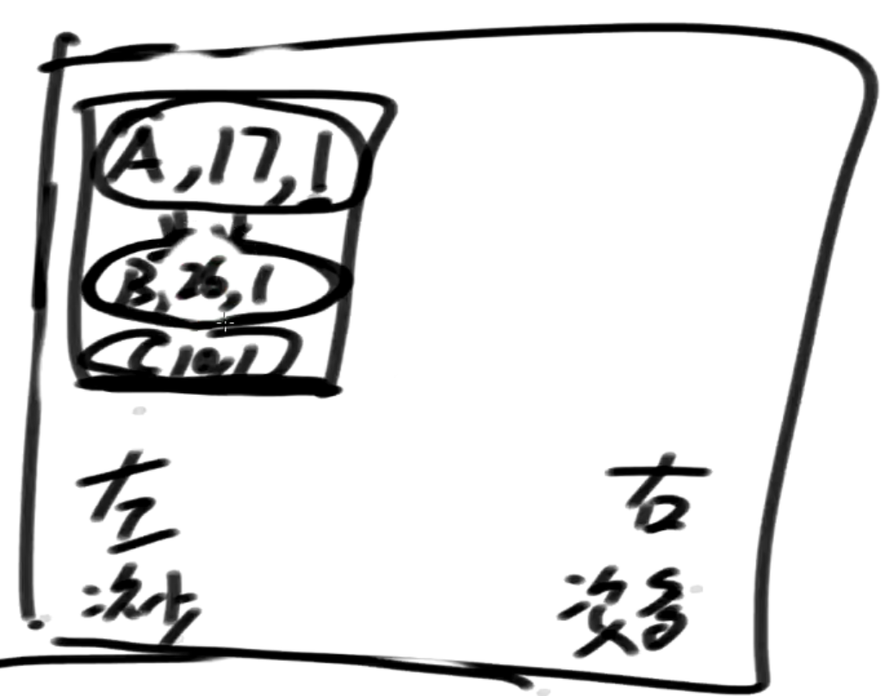 | 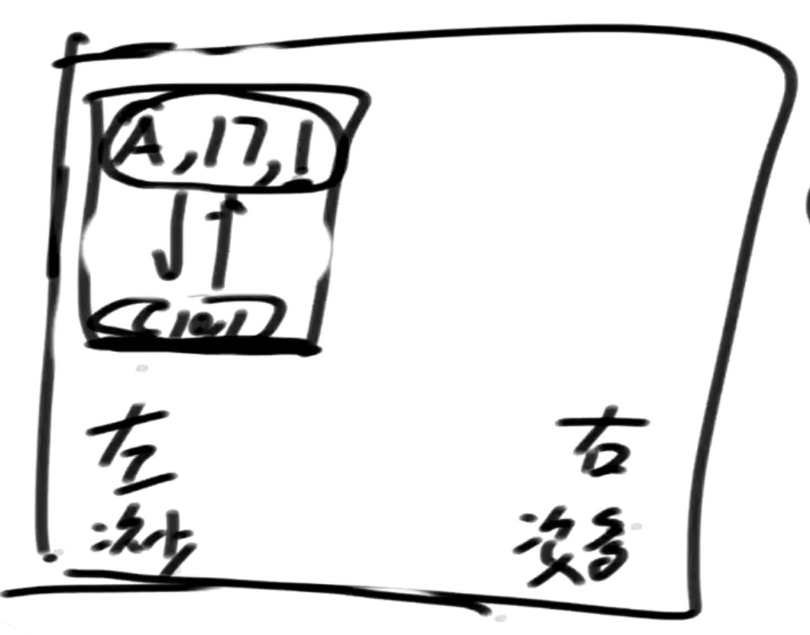 | 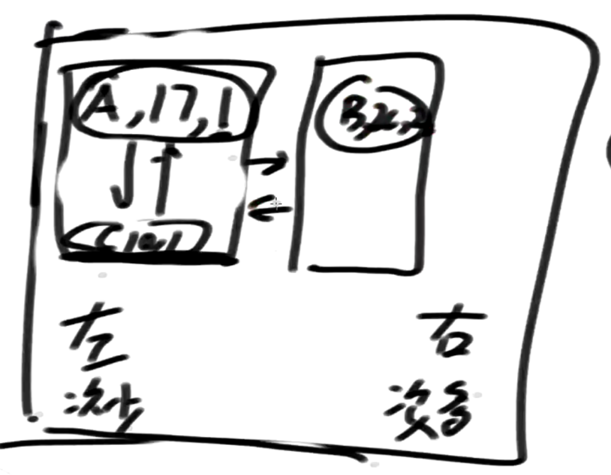 |
| ------------------------------------------------------------ | ------------------------------------------------------------ | ------------------------------------------------------------ |

更魔幻的事情到来了，我又get了一遍B，我肯定可以拿到它的值，因为map 1能够告诉我它node在哪。然后这个时候，B这个结点的频度变为3了，不再属于2这个桶了，继续把自己从原本的桶分离出来，然后看看下面有没有桶，没有桶，新建，把（B，26，3）放进去。

而且这个桶空了，你要把它删掉，桶与桶之间前后环境重连。

为什么要删掉桶？因为如果你留着空桶的话会有问题。它可能会造成空间的浪费。如果我就是对一个key做了100万次操作，你这个程序会不会内存泄露。如果真的这时候C，get了一下，你从原本的一号桶分离出来，然后看看下一个桶有没有，有的话是不是装2频度的桶，如果不是你就临时新建一个。

|  | 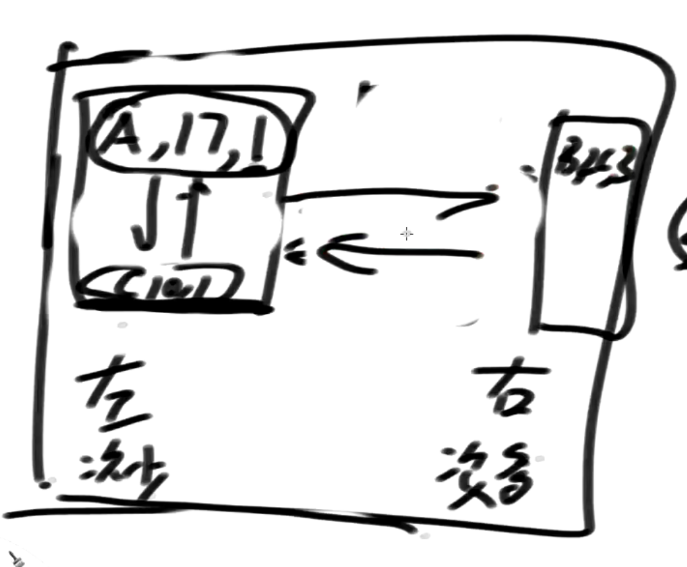 | 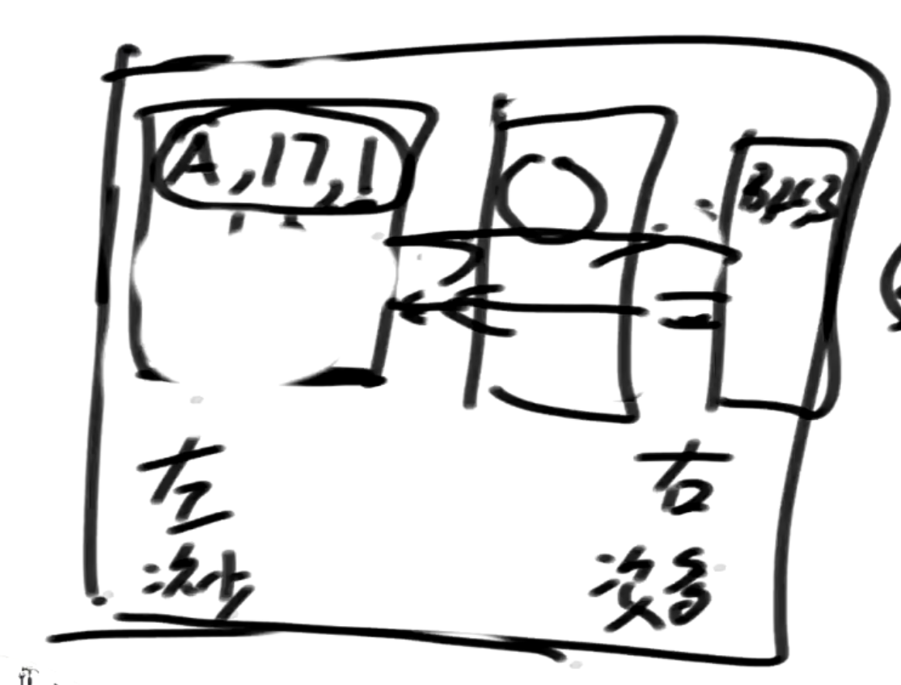 |
| ------------------------------------------------------------ | ------------------------------------------------------------ | ------------------------------------------------------------ |

为啥需要桶呢？替换的时候，直接找到最左边的桶，把最上面的记录扔了就行了，这里删头部因为默认我们来了一个新节点是尾插到桶里面的，如果你来一个新节点是头插到桶里，那么就删除的时候就删尾部。为什么要用二维桶？为了当一个结点的频度变的时候方便的更新它的频度，并且移动到另一个位置（下一个桶中）。

所有结构之间，每动一点，想清楚怎么配合？这是这道题的难点，它算法并不难。但是变化情况很多，想清楚怎么去配合。临时建立桶、临时销毁桶、桶的头变了、要替换元素的头变了、要替换元素的尾变了、要替换元素不在桶里面、已经没元素了怎么办？这个coding难度决定这道题很难。


## Interview Coding 18

训练营5，第2节

### 距离为i的城市有几座

code1：

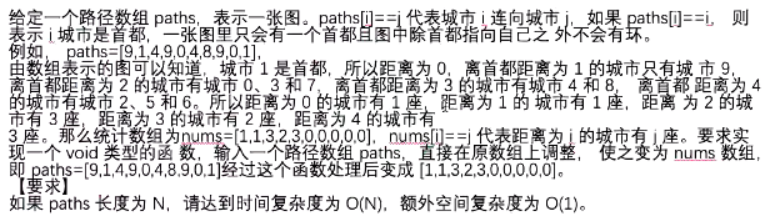

这题纯是coding！难点在于

array只会有一个首都，而且我告诉你的数据一定能够串成一棵树，我在输入的时候就可以保证这一点。所以一个数组就可以对应成一张图，唯一的首都，而且每一个点往上串，最后都能串到首都。答案就是让你统计一个每一层的结点数。res[i]表示到首都距离为i的城市有几座

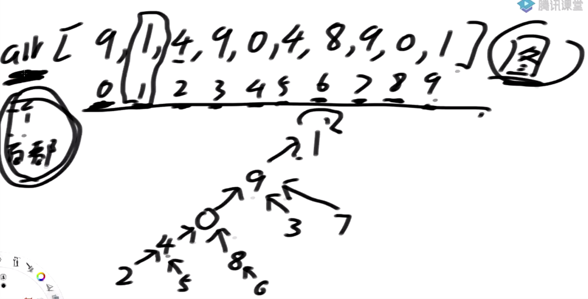

这道题，没有什么难度的，这道题你把图建出来，宽度优先，遍历一下就解决了。但是难在它要你用有限几个变量，在原本的这个图数组中自己更新出答案。

我们先别想这么可以直接变就变出答案了，我们看看怎么先有一个过渡的过程。我们想能不能先把arr变成这样一种含义，0到首都的真实距离是2，但是我们要把它变成-2的形式，arr[i]含义为i到首都的距离，用负数的形式来表达。我们来看看这个arr能不能由题目的arr自主更新得到，再来看能不能变成到首都距离有几座这样的res的含义。

我们是用下标循环怼的方式得到中间的这个状态。假设我们从零出发。我们用两个变量就够了。第一个变量叫next，接下来要去的地方。第二个变量叫lase，我上一回从哪儿来的。你现在从0出发，你完全知道下面要去9，next就设置为9，我即将要蹦到九位置上去了，但是还没蹦呢，我知道我一旦蹦到九位置上去。我是从哪来的？我是从零位置来的。然后我们跳到9上，我又知道要去1了，所以next设置为1，然后我把last填到9的位置上去。填完之后，把last改为当前位置下标9，接着我们就通过next记录来到1了，来到一位置，我发现是首都，它是首都，我就开始往回蹦，提供往回蹦的机制就是这个last。

| 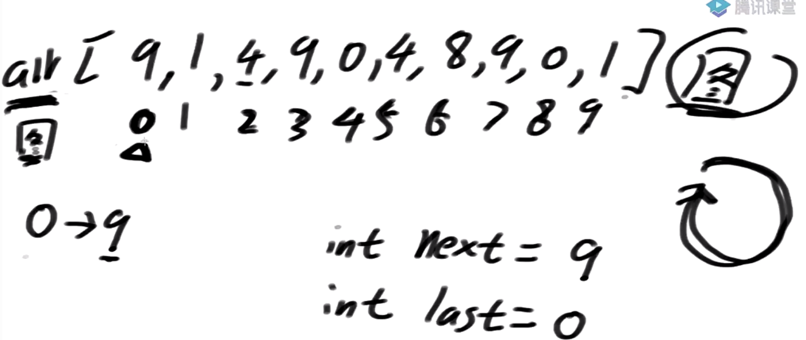 | 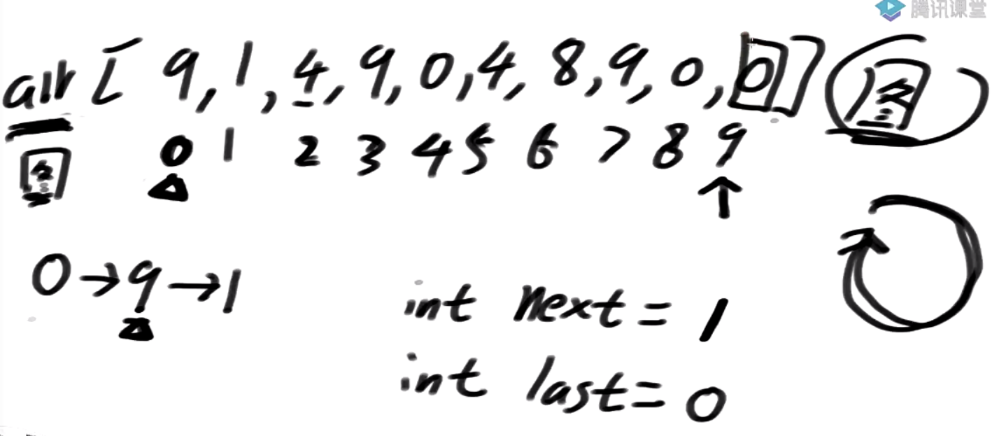 | 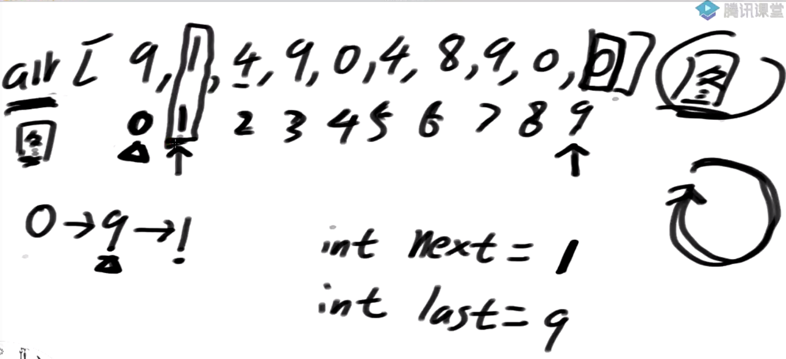 |
| ------------------------------------------------------------ | ------------------------------------------------------------ | ------------------------------------------------------------ |

所以我们现在往回蹦，所以我们在1位置，通过last值，蹦回了9。来到9位置怎么继续往回蹦，这就用到我们刚刚把9位置的值改成了之前的last，这样就可以一直往回蹦。所以现在我们来到了9位置，知道我们下一步去0位置，所以我们把next改为0，并且把9位置的值改为-1，这个-1代表我们现在到首都的距离是1，但是我使用负数的形式表达的。接下来我可以来到零位置。而且我如果用再单用一个变量init表示我是从0位置开始跳的，我就知道我到零位置可以不用再往前蹦了，我把这上面的值改成负二，代表到首都的距离是2了。我在用正负性这件事情表示，这个点是新含义还是老含义。

不一定每次都蹦到首都，可能中途蹦到扭转过含义的结点，就一路返回改含义即可。图三。最终，你把整个数组都改对。那么，只有首都是没有动过的，那最后你再把首都自己的位置改成它到自己的距离是零。

| 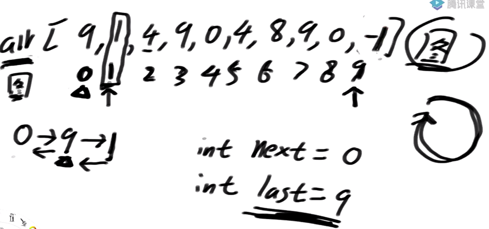 | 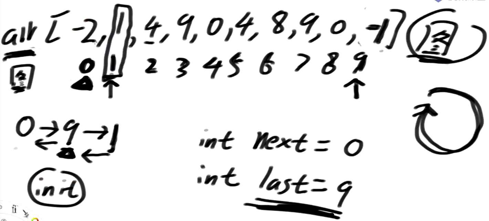 | 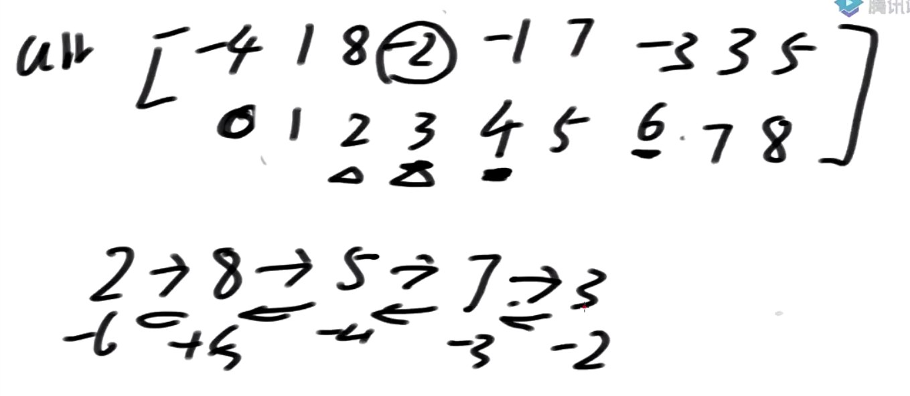 |
| ------------------------------------------------------------ | ------------------------------------------------------------ | ------------------------------------------------------------ |

接下来的任务就是把上面那个中间过程的含义变成到首都距离为i的有几座这种含义。现在上面是负数，代表是老含义，如果不是负数，代表是统计含义，也就是res要的含义。一开始从0出发，init还是0，如果0位置是负数，就先把0位置的值变成统计学含义的0，因为上面的值我用完就没用了，我发现0位置上面的老值是-2，代表我找到了一座城到首都距离是2，那么就把2位置的值改成1，代表我现在找到了一座城到首都距离是2，但是你把原来的老值踢掉之前，要存一下，方便下次到对应的距离下标循环怼，所以这里把2位置改为1了。老值拿出来-2，发现到首都距离为2的城又发现一座，一看2下标位置是正数了，所以是统计学含义，直接++即可。

在这整个过程中到首都的位置就认为结束，所以最后0位置需要我们手动去修改，为什么可以手动改，因为我们明确知道到首都距离为0的只有首都自己。

| 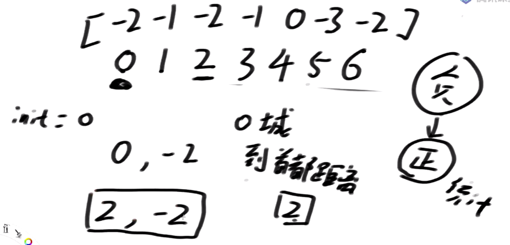 | 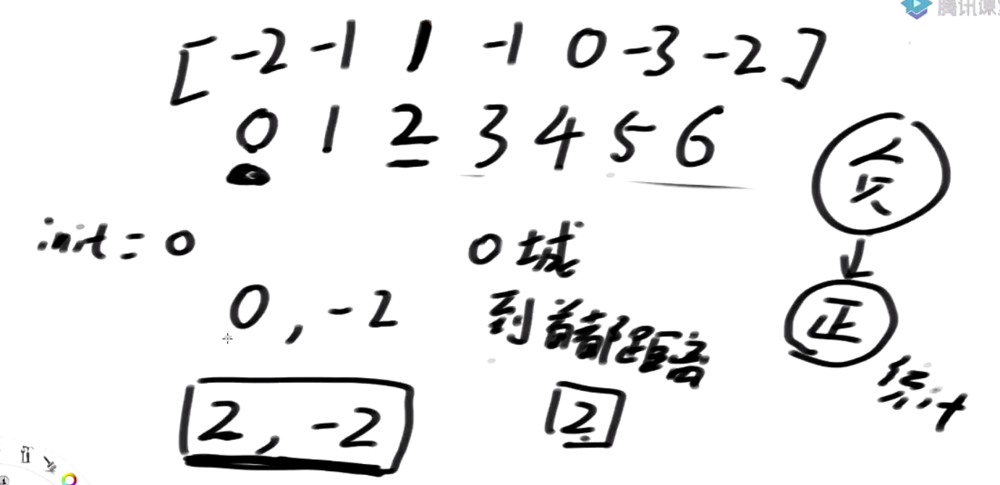 | 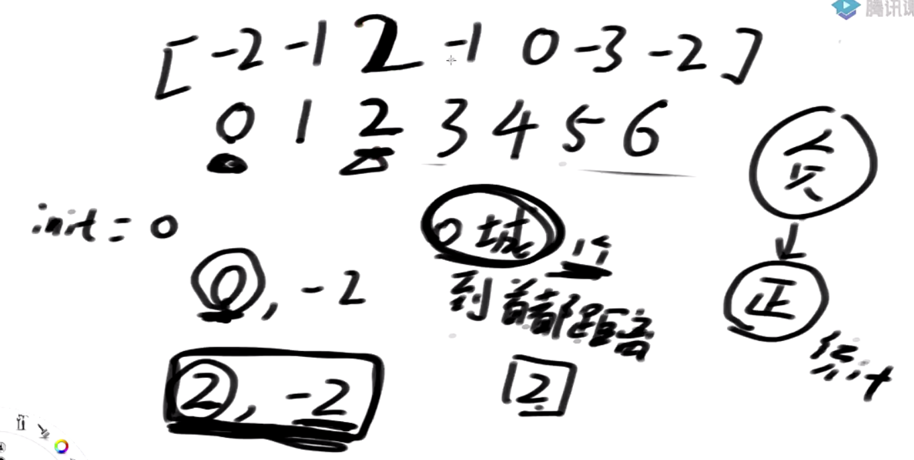 |
| ------------------------------------------------------------ | ------------------------------------------------------------ | ------------------------------------------------------------ |


### 分糖果

code2：

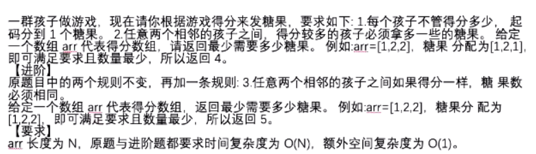

它规则是这样的，每一个小朋友必须至少得一块糖。第一个规则也就说你这个数组中不可能有某个位置等于零。第二规则，这孩子他会攀比。如果有两个相邻的小孩子，相邻孩子如果得分一样，你给它怎么分糖是无所谓的，多了少了都不会闹。但是相邻孩子如果，比如说甲这个分数明显大于乙，但是如果你给甲的糖块数不如乙多，那么甲这个孩子会闹。你为了让所有孩子都不闹，请问你至少要怎么去生成这个数组而且要保证总糖块数最少。这就是我们初始的设定，进阶的设定就是多了规则三，相等得分的孩子一定要得相等的糖。

这个题很简单，它其实是个贪心，比较好猜。举个特殊例子，这个数组是相邻孩子得分不一样，怎么决定？把变化趋势列出来，顶峰的几个点，看看左右两边哪边下的点多，按照坡度大的算，例如数组的得分为6的孩子，左边两个孩子，右边1个孩子，那么就给得分为6的孩子3块糖就行。

更简单的来了。先来一个left，从左往右遍历，第一个孩子要1，第二个孩子不必左边的孩子大，我就要一个1。如果比左边的孩子大，就比它多分一块糖，当前的数只要比左侧数大，那么就等于左侧的数+1。当前数如果不比左侧的数大回到1。再来一个right数组，从右往左遍历，当前的数只要比右侧数大，那么就等于右侧的数+1。当前数如果不比右侧的数大回到1。总体怎么分糖果，res[i]=max{left[i],right[i]}。

进阶就是相等孩子一定要拿同样多的糖。还是left，但是只不过在相等的时候维持和左侧相等就行了。right也求出来。res求法和上面一样

| 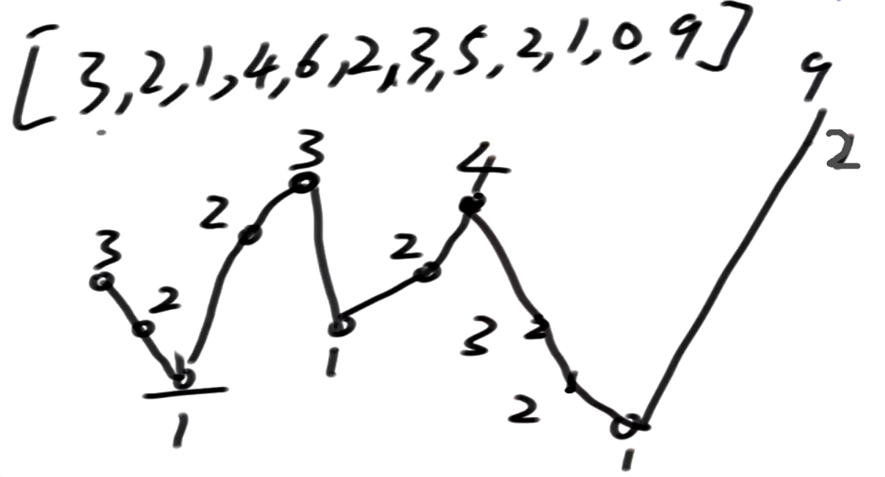 | 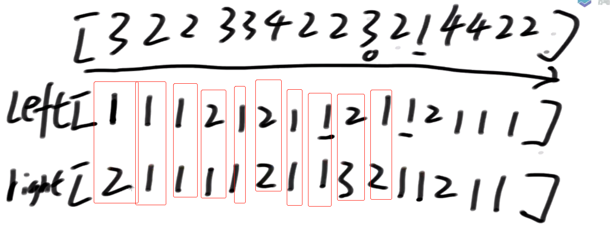 | 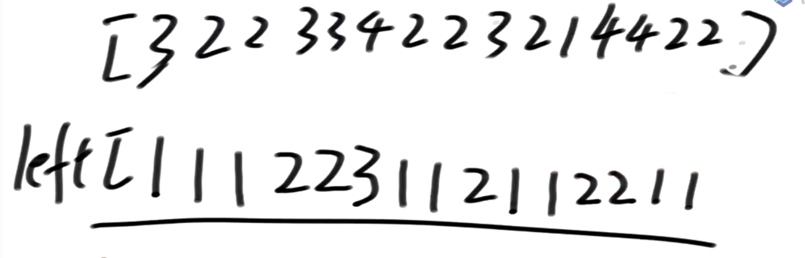 |
| ------------------------------------------------------------ | ------------------------------------------------------------ | ------------------------------------------------------------ |

怎么想到的？其实就是一个爬坡的问题，你开始先想到爬坡这个解，然后想办法用怎么样用优雅的coding来实现，结果发现这么简单，就就两个辅助数组搞定了。这题也可以不用辅助数组，但是就需要你自己去维持上坡下坡的逻辑，很考验coding，发现拐点这件事情全靠coding手撸出来。


### 二叉树放置相机全覆盖

code3：

- 给定一棵二叉树的头节点head，如果在某一个节点x上放置相机，那么x的父节点、x的所 有子节点以及x都可以被覆盖。返回如果要把所有数都覆盖，至少需要多少个相机。

这个题用到二叉树的递归套路，而且它好用到什么程度？你想不出他最牛逼的那个贪心的解。你这道题时间复杂度也能做到跟那个最优的解时间复杂度一样。你如果不想去做贪心，这道题你依然可以线性复杂度解掉。

放置一个相机在x结点，如果x结点有父亲，有左右孩子，那么最多就覆盖4个结点。x的兄弟结点是覆盖不到的。但是麻烦的地方在，一个相机能影响自己，也能影响子，也能影响父。

当我们想在以x为头整棵树上求最少几个相机才能全覆盖，自然而然就想到递归定义为以x为头的时候整棵树至少放几个相机。那我发现如果只定义成这一个信息可能性，它够不够列？这样你会发现你的左右孩子给你的信息只有左右孩子分别覆盖完了整棵子树的答案，换句话说，左右孩子给你的这一条唯一的信息意味着左右孩子已经被覆盖了。但是这题我们在x结点讨论的时候，我们应该是可以在左右孩子放相机的，既然x可以往左右孩子放相机，那么就需要知道左孩子在头结点没有被覆盖的情况下其它结点都覆盖了的最少相机。所以这样可能性你列不出来。因为对x来说，它需要知道的是，我左孩子没覆盖的情况下，剩下节点都被覆盖了，和我右孩子没被覆盖的情况下，剩下节点都被覆盖了，最少需要几个相机。那你需要这个信息，你补一个不就完了吗。

来到一个x结点，它可能有三种状态，x放了相机，x没放相机但是被覆盖了，x没被覆盖。既然是哪个可能性，我们就设置三个信息

1. x位置放相机并且它下面的结点全部被覆盖了最少需要几个相机。
2. x位置不放相机，但是x已经被覆盖了，并且下面的结点也都被覆盖了，最少需要几个相机
3. x位置没有被覆盖，并且下面的结点也都被覆盖了，最少需要几个相机

我的递归一定要返回这三个值。需要强调一点的是，为什么每一个答案都强调它底下的节点一定要被覆盖？因为它底下节点如果不覆盖的话，你往上返回，你是补救不了的，因为上面的结点管不了下面。就是说我只希望让我的子函数给我在我这一层能解决的，你子函数把你自己的问题先解决好，你返回一定要给我返回好好的。

base case就是为空的时候，为空的时候肯定认为是被覆盖了，因为这个问题根本就不管空，我们就认为空节点一定是已经被覆盖的。空节点返回上面的三个信息怎么组织，由于null天然被覆盖，并且你不可能在上面放相机，所以1和3信息都为空，只有2信息返回一个0，代表我天然被覆盖了，并且我下面放0个相机就全覆盖。

如何加工出自己的信息？如果x自己没有被覆盖，那么左右孩子肯定不能放相机，并且左右孩子必须要被覆盖了，所以用左右孩子的2信息加工出自己的3信息。如果x被覆盖，但是x上没有相机，那么就通过左右孩子的1信息也就是有相机的情况（3种，左右都有、只有左有、只有右有），求出一个min，就是自己的2信息。自己的1信息，也就是x放了相机了，你左右孩子无所谓了，你用左右孩子的123信息来求出一个最小。

来看最优解。最优解它是基于一种假设。我们刚才说以x为头的情况下三种情况的答案我都要，这是我们刚才不贪心的那个解。你为什么要都返回呢？因为你不确定你的父亲需要哪个。我并不知道我父亲对什么答案感兴趣，我都给他。最优解基于一种假设，就是我明确知道我的父亲只要一种答案的解。举个例子，假设这个节点左孩子是空，右边不清楚。这个空结点知不知道自己的父亲需要什么答案？明确知道，因为它只有一种答案。这种答案叫我没有办法放相机。我也没有办法，不被覆盖。这已经不是说我知不知道我父亲需要哪个答案的问题了，是我只能给他一个答案。这个情况比较简单。那我们再举个例子，这种情况x也知道父亲需要上面，我只能x这里放一个，因为我这里不放我父亲补救不了。所以我肯定会给我的父亲一个答案。我上面既放了相机，又被覆盖。那这只是一些很片段化的东西。那你推成一个普遍状况下，x可能身处于各种各样的情况，是不是每一次他都能够知道自己父亲一定需要自己的一个唯一解呢？这就是我们这个假设。如果这个假设成立的话，我就不用把三种情况的解都给我的父亲了。

那么我就不需要返回我之前三种状态时候的所有最小数量给父亲，我只需要返回其中一种状态时候的相机数量给父亲即可。我就把我的返回值定成只有一种情况下的最优解

| 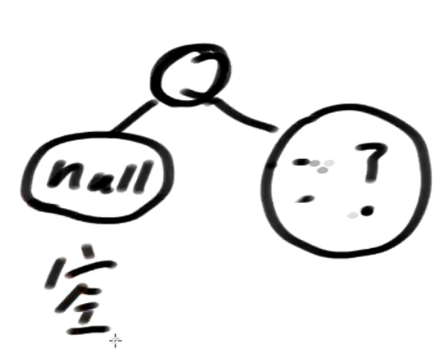 | 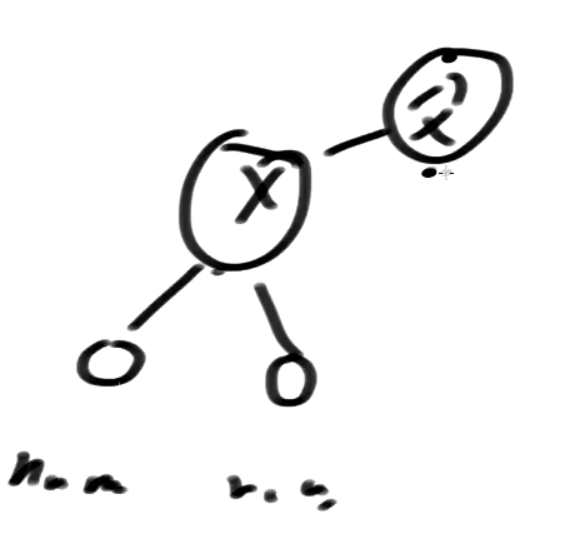 |
| ------------------------------------------------------------ | ------------------------------------------------------------ |

现在从左右孩子获得信息。列举如下可能性

1. 如果得知左右孩子中有其中一个没有被覆盖，那么x一定要放相机，别无选择然后给父亲返回。
2. 如果左右孩子中都被覆盖了并且其中一个还放了相机，那么我这里就贪心了，我明知道x这个点已经被覆盖了，我可以放相机，也可以不放相机。但是我这里只给父亲返回了我不放相机的状态，因为我明知道在我这里放相机肯定没有在父亲上放相机好，所以我把选择权交给父亲了，这里做了一个贪心。
3. 如果得知左右孩子都被覆盖了，并且都没有放相机，那么x这个点我不放相机，我交给我的父亲去决定，因为我x这个点放相机一定没有父亲放相机的收益高。

可能性列举完毕，我发现我只给我的父亲返回一个类型的信息就够了。我怎么把我的返回值优化成这个样子的？是在所有情况下我都明确的知道我的父亲，只要我一种答案。这个其实很难想的。


### 长度为k的三子数组最大和

code4：

- 给定一个数组arr，给定一个正数k。选出3个不重叠的子数组，每个子数组长度都是k，返回最大的三子数组的最大和。

假设我只让你求子数组哪一个累加和是最大的。我能不能建立这么一些记录，dp2[i]表示arr[0...i]所有子数组中累加和最大的是多少，不要求你以i结尾。求dp2怎么求？如果不以i结尾，那么dp2[i]=dp2[i-1]。如果以i结尾，根据下面的dp1的含义，如果dp1[i]的含义为：必须以arr[i]结尾的情况下，子数组的累加和最大是多少。第一种情况，只包含arr[i]。第二种情况，可以往前推，那么arr[i]+dp1[i-1]。

真的有必要用dp1的含义帮助怼出dp2吗？我们之前谈到过一个算法原型，一个数组中求最大累加和是多少？只需要有限几个变量就能搞定，在那个过程中，走到每一步，max的值天然的含义就是0~i上子数组累加和必须是多少。甭管你用什么办法，我们现在就有了一个结论了，有一个记录了，我们的dp2[i]我就可以认为是arr[0 ... i]范围上的子数组最大累加和。你反过来再来一遍，dp3[i]代表i~N-1这个范围上子数组的最大累加和。有了dp2和dp3了。

现在再来一个dp4，dp4[i]代表arr[0...i]这个范围上长度必须为k的子数组最大累加和是多少。这样一来，我们来一个dp5，代表的是arr[i...N-1]这个范围上长度必须为k的子数组最大累加和是多少。dp5相当于dp4反。主问题的调度，前面dp4告诉我，后面dp5告诉我，中间那块卡死的直接求。

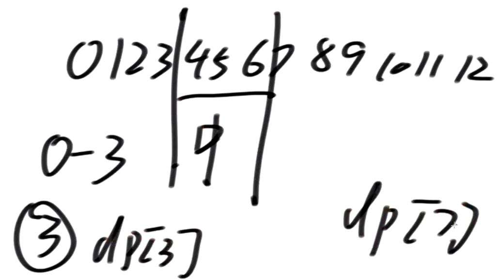

重新梳理，上面相当于是别的题：现在有k的限制。dp[i]告诉你0~i范围上必须是k长度子数组的最大累加和。dp'[i]告诉你i~N-1范围上必须是k长度子数组的最大累加和。你前面枚举，选够k个，然后往后枚举，中间刚好选够k个，推算出dp'需要什么位置。这样就枚举完毕

dp[i]告诉你0~i范围上必须是k长度子数组的最大累加和，这个dp含义怎么求？很简单，如果不以i位置结尾，那么就是dp[i-1]。如果以i结尾，那么就是sum[i-k+1,i]。


## Interview Coding 19

训练营5，第3节

### 分田地问题

```
测试到牛客网搜索分田地
```

code1：

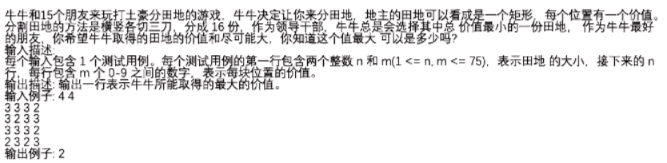

这道题是说一定要横切三刀，竖切三刀，分成16份。不管是哪一种切法的情况下，牛牛这个人一定会选择总价值最小的一份。目标就是让切出来的田地最小值尽量大，让牛牛多拿点。

算法原型：在一个大的长方形中我怎么求出任意一个矩阵的累加和来。遍历太慢，有没有得到一个区域长方形的时间复杂度变为常数阶。

你给我abcd，我快速给你算出来。搞一个辅助结构出来，help[i] [j]代表（0,0）这个点作为矩形左上角、（i，j）做右下角的矩形的累加和。观察help和matrix几个格子的关系，发现左边的和上面了重复算了左上角的，所以`dp[i] [j]=dp[i-1][j]+dp[i][j-1]-dp[i-1][j-1]+matrix[i][j] `。

| 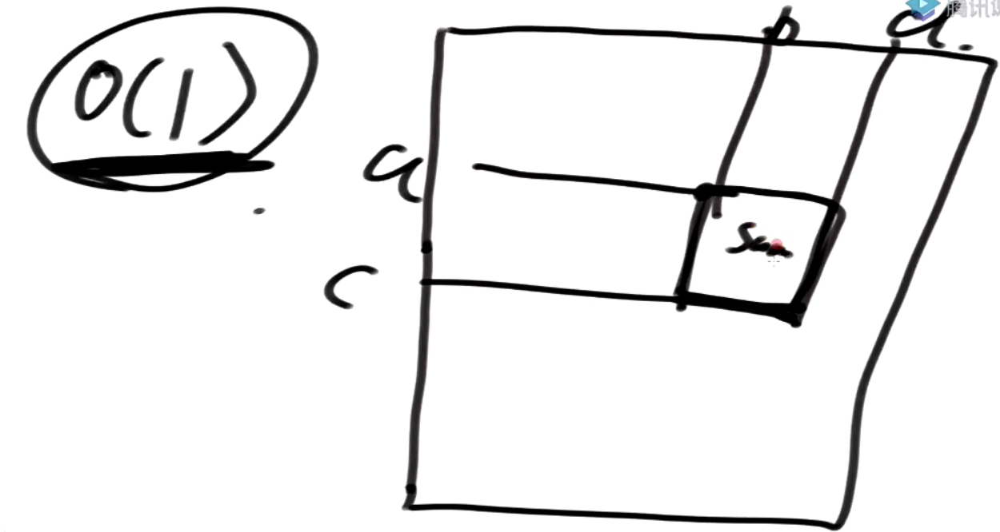 | 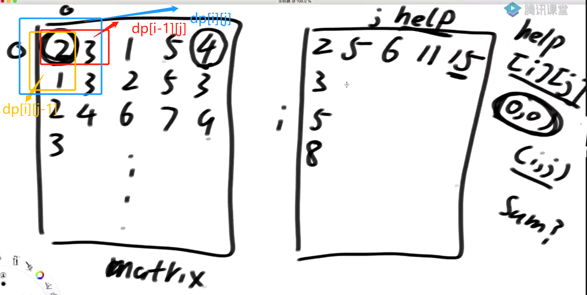 |      |
| ------------------------------------------------------------ | ------------------------------------------------------------ | ---- |

help从左到右从上到下填好。到矩阵里面，给你一个任意的矩形，怎么求？

看图`S=help[i][j]-help[i-1][j]-help[i][j-1]+help[i-1][j-1]`。

| 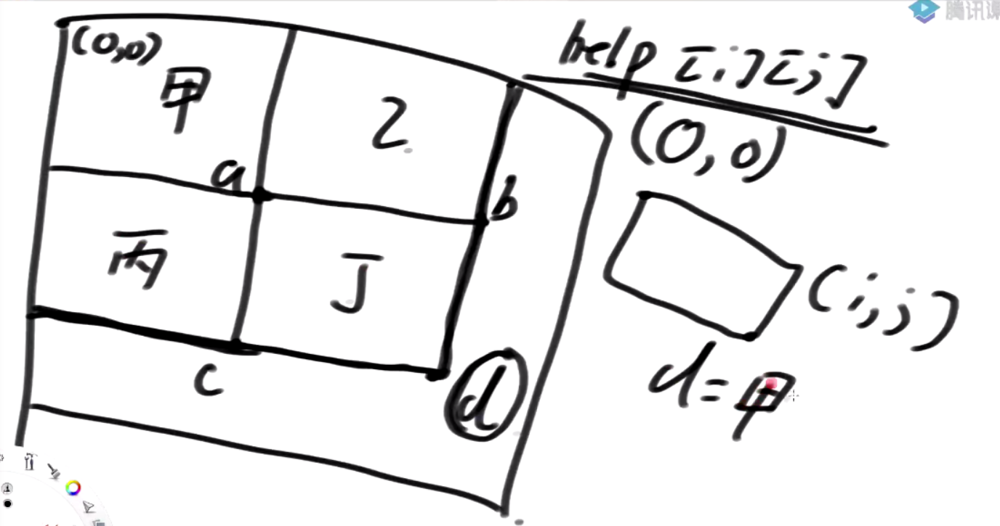 |      |      |
| ------------------------------------------------------------ | ---- | ---- |

再来解决一个底层问题。

假设在一个矩阵中，竖着的三刀已经规定好了，但是你可以决定横着的一刀，如何让切出来的8块中最小值尽量大。把红色的看成一个矩阵，求怎么切一刀让它的最小值尽量大，其实和一个数组切一刀，怎么让左部分累加和与右部分累加和尽量大，是一个问题。无非就是在这个问题中，我要把abcd遍历一下就知道最小值了，efgh遍历一下就知道最小值了。本质是一样的。

接下来我就固定这竖着的三刀。我就问从0~i范围上怎么横着切一刀最好，我把这所有信息记录下来。

| 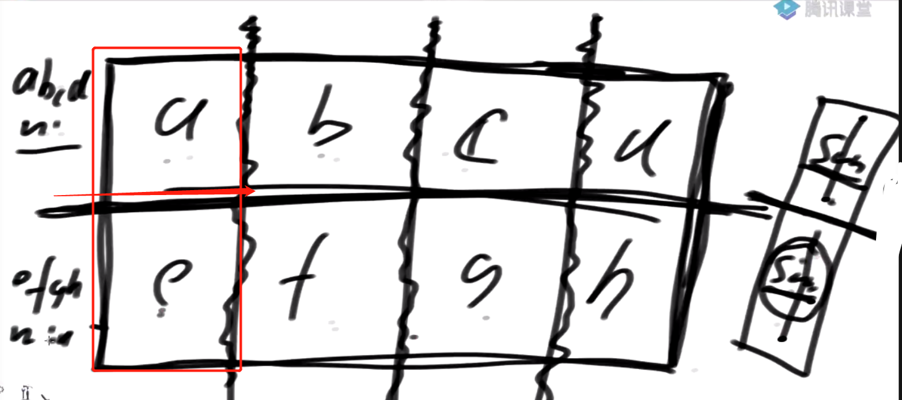 | 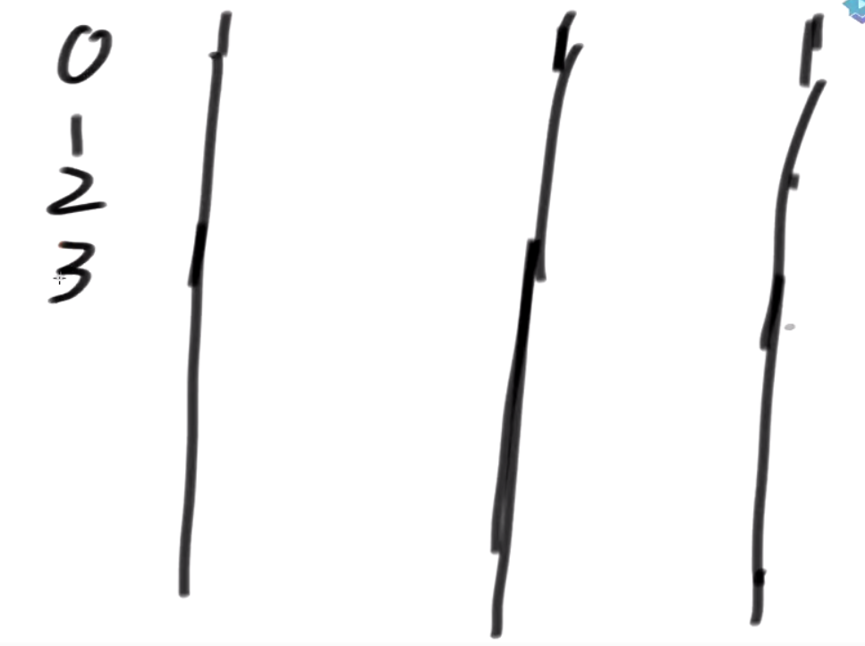 |      |
| ------------------------------------------------------------ | ------------------------------------------------------------ | ---- |

然后我在反着求，把i~N-1怎么横着一刀最好也记录下来。

那么主问题就可以变成枚举中间一刀的位置。上下用我们之前的记录。

| 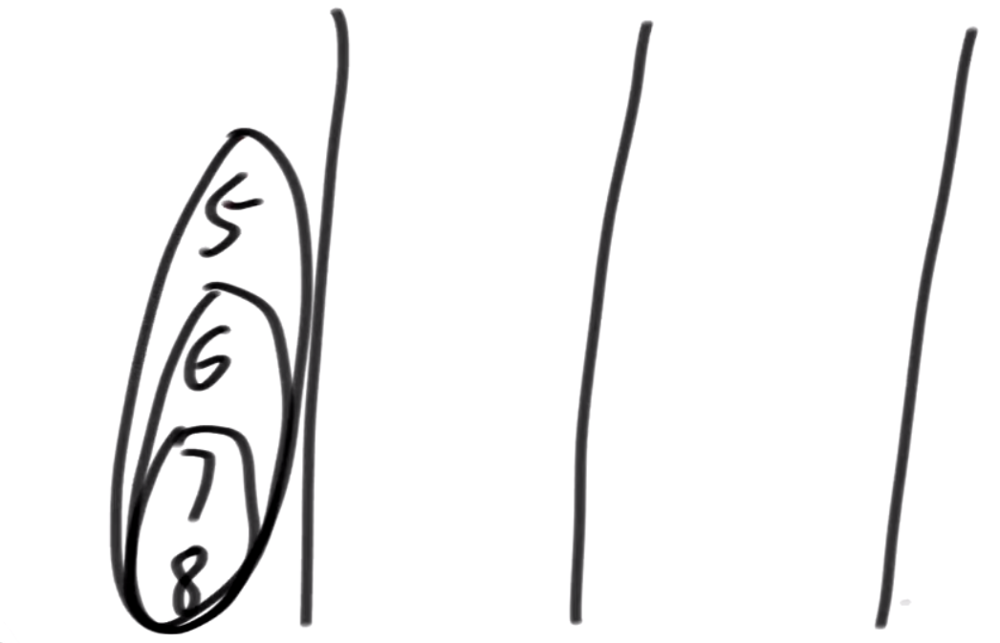 | 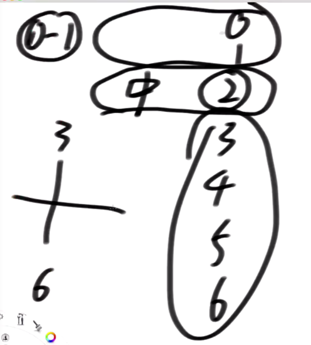 |  |
| ------------------------------------------------------------ | ------------------------------------------------------------ | ------------------------------------------------------------ |

up数组怎么求？求0~1，只能有一种切法。这种切法下，我已经有一个help数组可以告诉我abcdefgh的值，我只要把他们求一个min出来就行了，这样up[1]就搞定了。

现在问你up[2]怎么求，也就是012行怎么切最好。注意，四边形不等式。如果0~i-1行的最好一刀在k位置，0~i行的时候最好一刀你不用去k之前枚举。这样的话你去求up[1...N-1]这个过程可以是O(N)。

这个s跟范围是有单调性的。范围越大，这四块儿的范围越大，它的最小值只会上升，不会减小。它的它下面块也是范围越大，它最小值只会上升，不会减小时又是一个差外面套好这个问题，存在区间划分不用回退的情况。

| 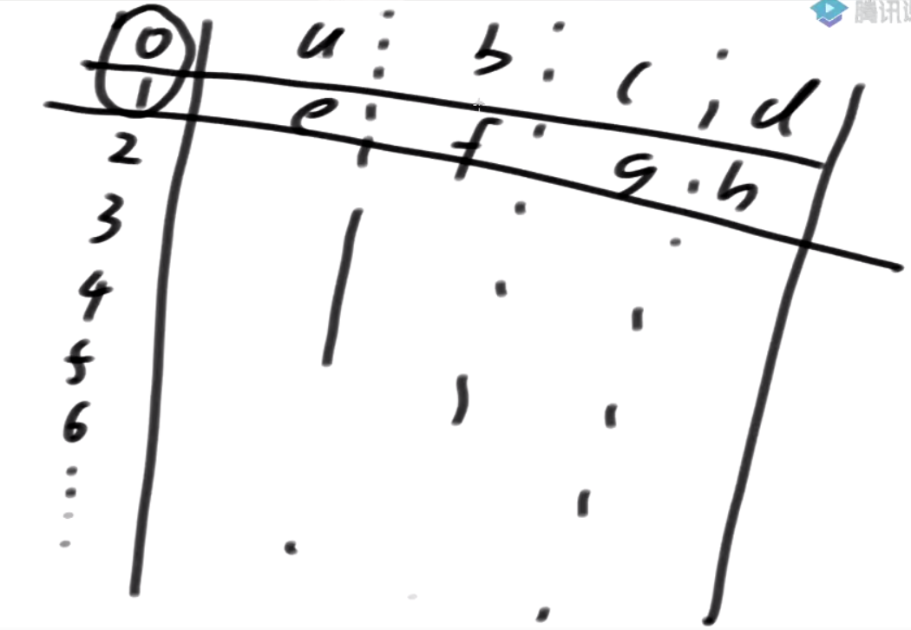 | 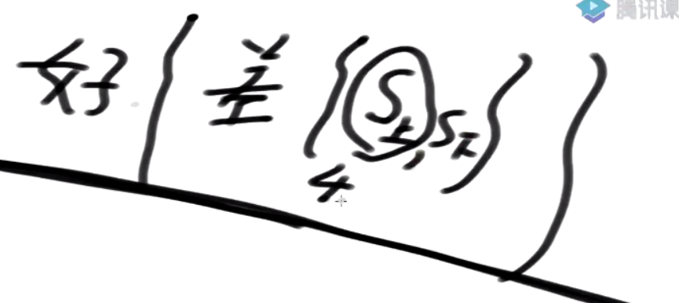 |      |
| ------------------------------------------------------------ | ------------------------------------------------------------ | ---- |

这道题我们整体过程我们来梳理一下。首先，我们要求出一个结构help，任何子矩阵的累加和O(1)能得到。这样的话，我们在每一次切一刀的时候，提取出一行的四块来就很快了。把这个问题搞定之后，我们去枚举所有可能的竖三刀，暴力三个for循环去枚举所有可能竖三刀。在三层for里面就等于说竖三刀已经固定了，接下来我们先去求up数组，再去求down数组，都是O(N)的。然后再去枚举中间一刀，上面的东西就可以在up里面拿了，下面的东西也可以在down里面拿了。整体三层for里面是一O(N)的过程。如果整个矩阵是n×n的矩阵的话，这个做法O(N^4)，无法优化了，这就是最优解。

- 思路和长度为k的三个子数组的最大和差不多，在那题中我们求三个子数组最大累加和也不是一口气求出来的，而是先搞定0~i最大的子数组累加和、以及i~N-1最大的子数组累加和，有了前面两个的基础，我们再来手动列举中间的可能性，求出三个时的最大是多少。这题也是一样，我们不能一口吃掉，我们先固定竖着的三刀，然后利用和那题一样的思想，先求出0~i范围上怎么切最好，然后再去求i~N-1范围上怎么切最好，最后手动罗列最后一刀的可能性，逐步把问题拆解。


### 炮弹打天花板

```
https://leetcode.cn/problems/bricks-falling-when-hit/
```

code2：

返回每一发炮弹能打落多少的砖块，炮打打上去的那个砖块认为直接碎掉，不会掉落

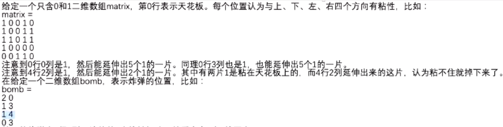

2,0打完之后下面的和右边的砖块就不稳定了，没有1连接，就会掉下来。接着1,3的炮弹，下面的三个1会掉落，不稳定了，一个格子只和上下左右四个发现格子相粘，斜线方向是没有粘度的，所以会掉落三个。下一发炮打在1,4位置，打空了，因为第三发炮弹让这个位置的砖块掉落了，所以掉落0个砖块。最后炮弹打在0,3，就只是它自己碎了，没有砖块掉落。所以返回[2,3,0,0]

| 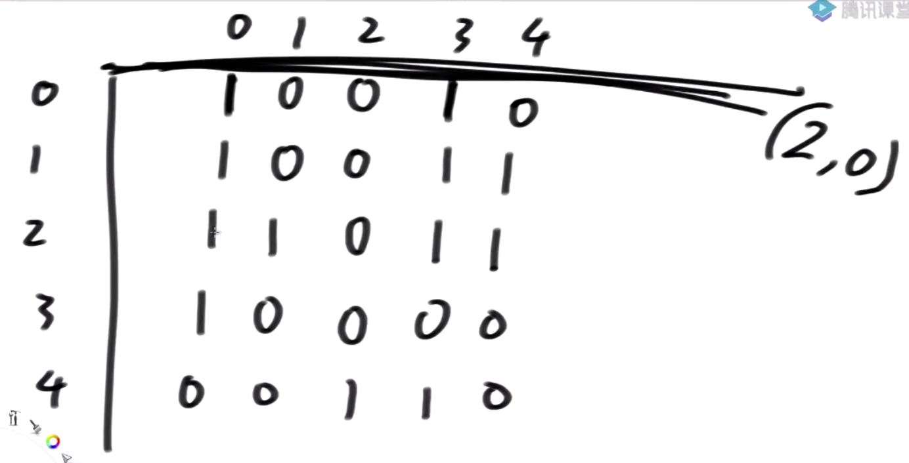 | 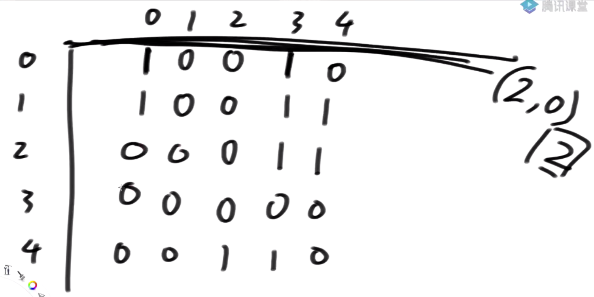 | 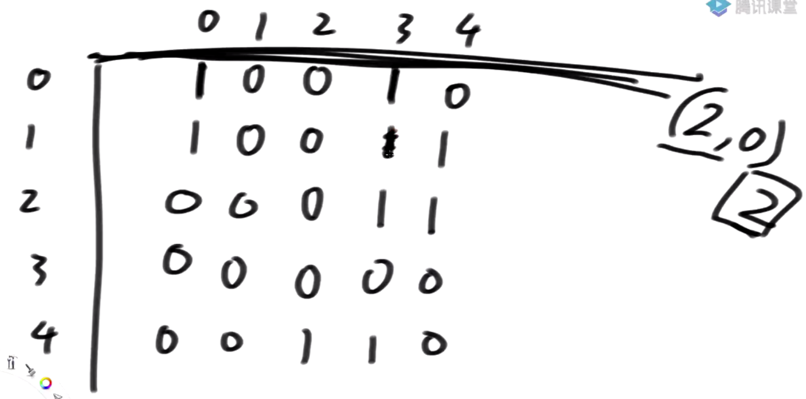 |
| ------------------------------------------------------------ | ------------------------------------------------------------ | ------------------------------------------------------------ |
|  | 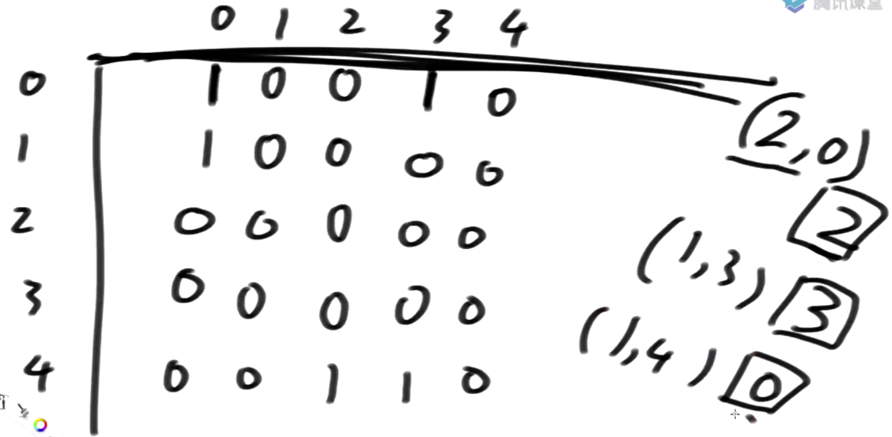 | 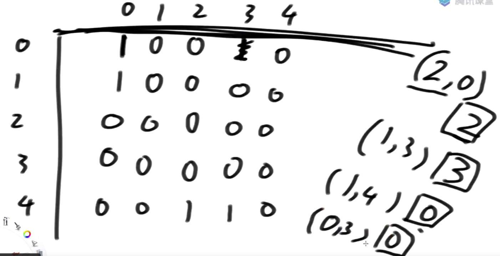 |

我想用什么样的一种方式来评估炮弹打完之后砖块会掉落这件事情。我们先把炮弹的影响给它加上。比如说我一开始第一个炮弹是打在（2,0）位置，我把这个位置变成二。炮弹打的位置上如果真的有一，请你把一变成二。炮弹位置上如果是0，就维持0。

接下来，假设2是分割点，我们看一下此时接到天花板上一的数量，就两，所以指标是2。求解的过程中，我们从炮弹最晚发生的，逆着回去求。先到（0,3）去看一眼，发现它是2，所以你把它变成1，此时再看一下，接到天花板的数量变成3了，但是这个三是你自己打碎了，指标只加了1，这个1是你自己打碎了，所以掉落了0块砖。

| 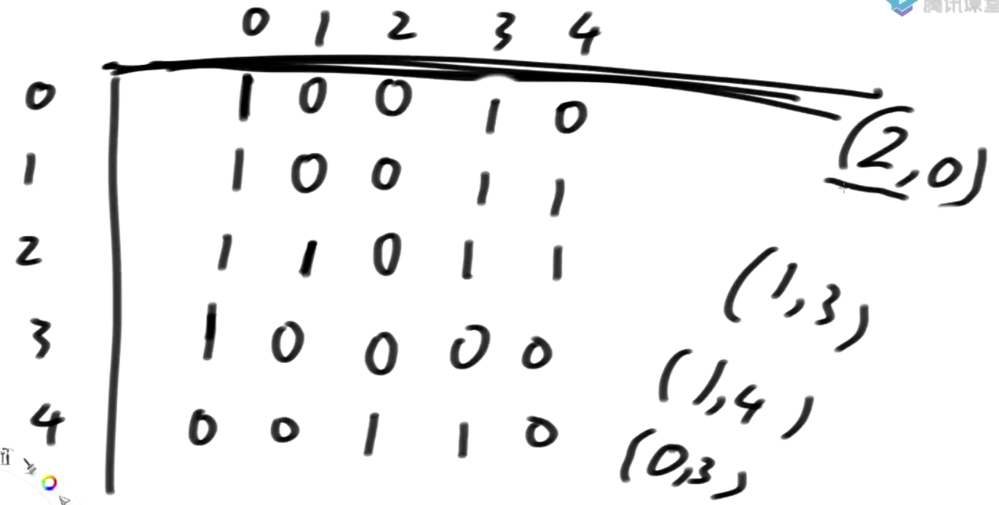 |  | 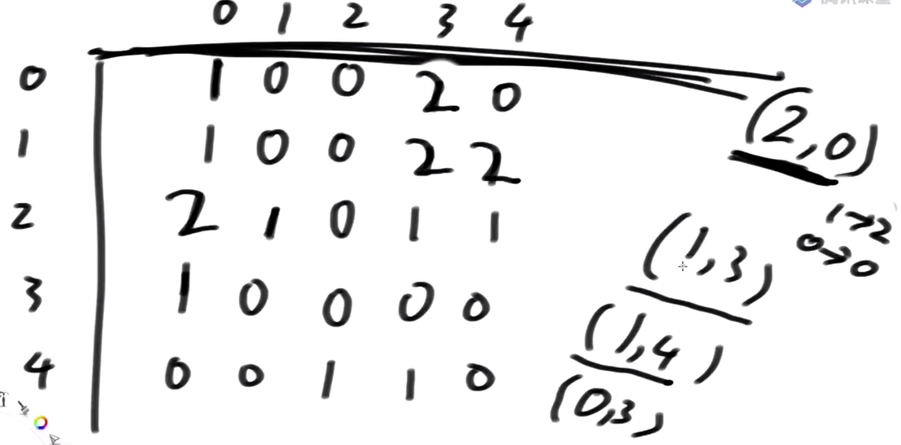 |
| ------------------------------------------------------------ | ------------------------------------------------------------ | ------------------------------------------------------------ |
| 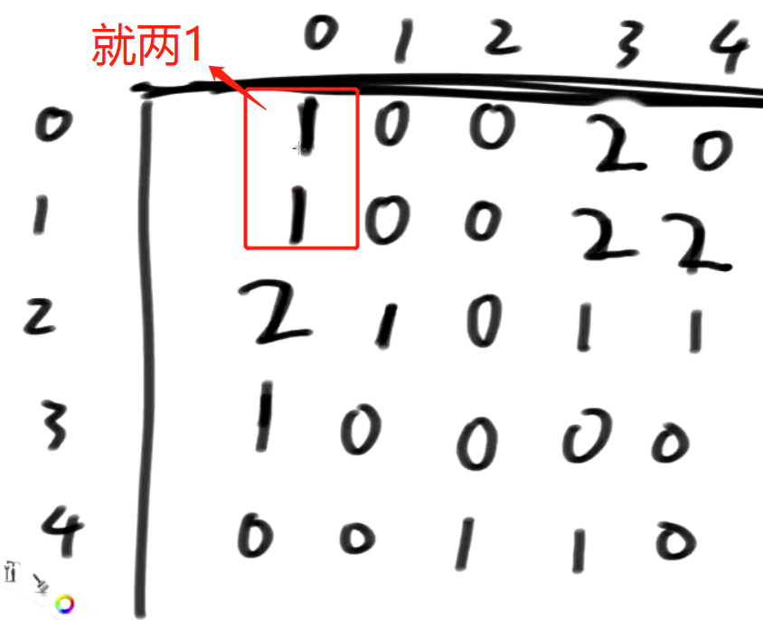 | 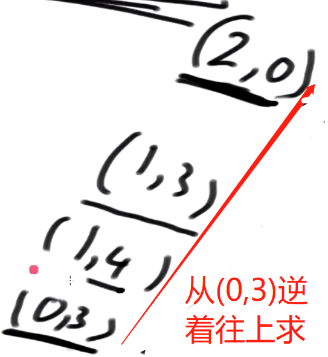 | 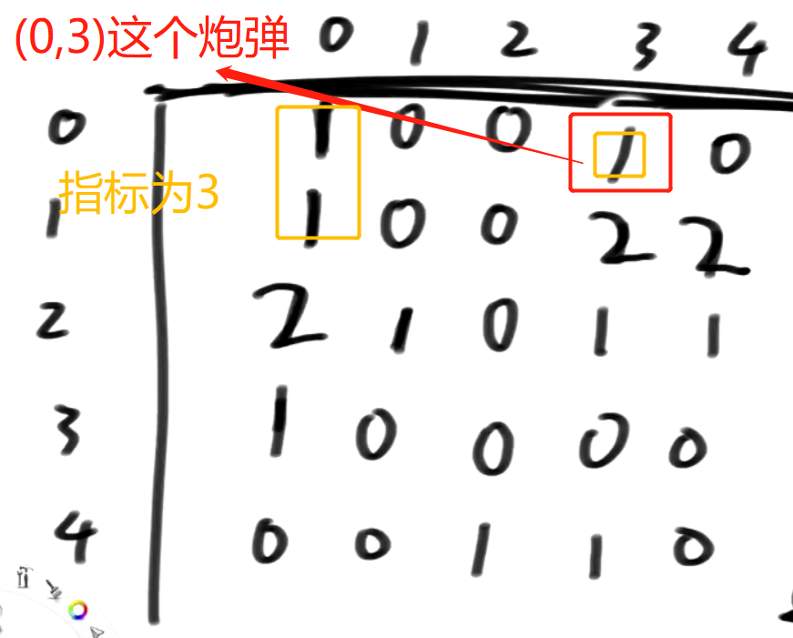 |

为什么我要把零三最后处理，得到答案才是对的？这两个二要先影响的情况下，你再看你能掉落几个砖块。你现在就等于说因为有二的存在的位置相当于之前的炮弹是已经影响过的。我们从后面的炮弹往前面的炮弹去枚举的原因是我必须考虑前面影响的情况下我能够让天花板上加几个1。

然后继续玩，看（1,4）这个炮弹，我看一眼（1,4）这个位置，发现是2，那么说明之前是1，把2还原成1。再看指标，连在天花板1的数量还是3。说明接到天花板上数量的依旧没有变过，答案零。

再看（1，3），把2还原，指标变为7。多了4个1，你自己碎一个，所以掉了3个。

再看（2,0），还原，指标变为10，多了3个1，自己碎一个，所以掉了2个。

如果还原你之后。跟还原你之前接到天花板上的一的数量是不变的，那你答案也是零。如果加完你之后跟加完你之前只相差一，那你答案也是零。

| 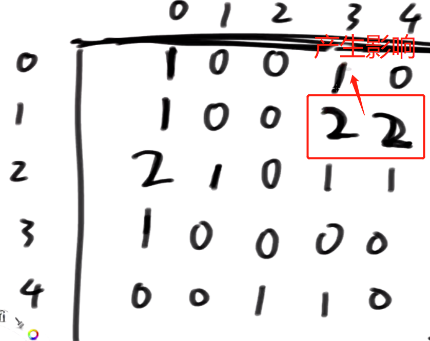 | 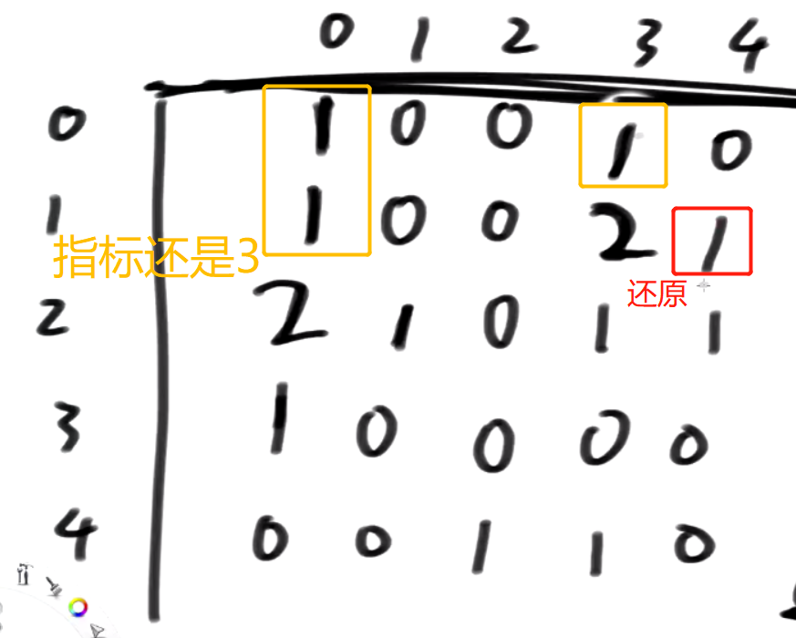 |  |
| ------------------------------------------------------------ | ------------------------------------------------------------ | ------------------------------------------------------------ |
| 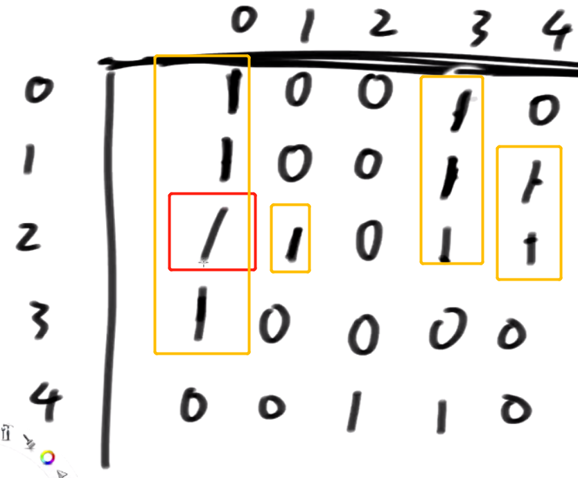 |                                                              |                                                              |

那么你知道是用并查集。但是具体怎么用并查集呢？你没用并查集之前也和上面的流程一样，先变2。然后你把里面每一个1认为是单独一个集合，并且一个集合上面要多加一个属性，他有没有连在天花板上。然后你再把每一个1上下左右给我去连，所以这这两个一就会合成一个集合，它共同是接在天花板上的。其它1也是该合的合，接在天花板为红框，没有接在天花板的为黄框。

接下来（0,3）出现了，把2还原为1，建出这个集合，它是连在天花板上的。我们的并查集还得给我们连到天花板上的1的数量，这时候并查集告诉我连在天花板上的有三个。

然后（1,4），还原为1，把小集合建出来，然后和下面的就连在一起了，三个1连成一片了，但是这个集合没有接在天花板上。

（1,3）来了，还原为1之后把小集合建出来，然后上下左右相连，所以这5个1连在一起了，此时由于有其中一个集合是在天花板上的，所以总的合完之后是连在天花板上的。这时候并查集告诉我连在天花板上1的数量为7，7-3-1=3。

（2,0），还原为1，建出小集合，然后相连，这5个就连在一起了，并且合成的集合是连在天花板上的。

所以并查集的用法，大体逻辑如下。

|  | 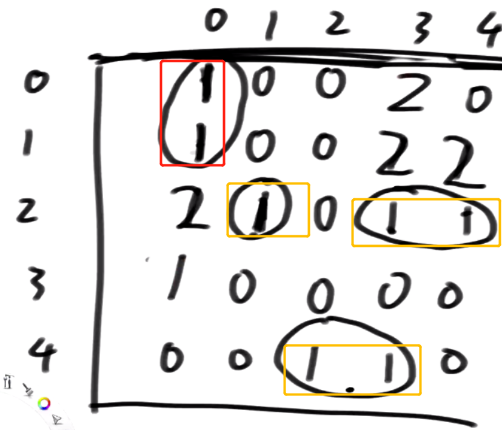 | 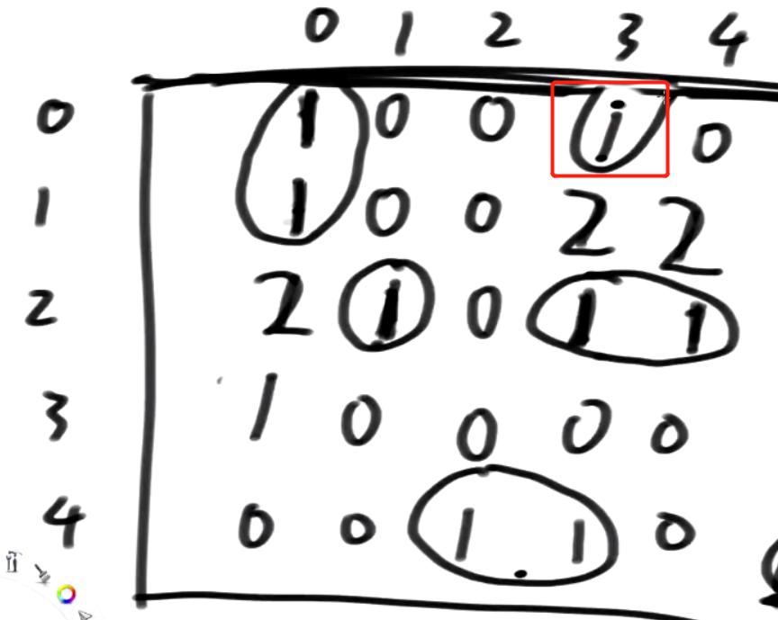 |
| ------------------------------------------------------------ | ------------------------------------------------------------ | ------------------------------------------------------------ |
| 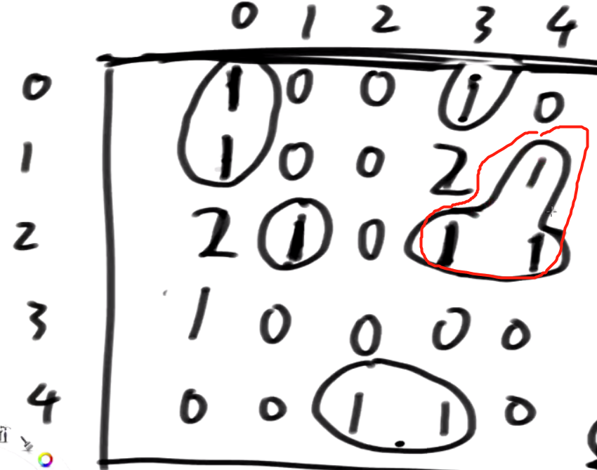 | 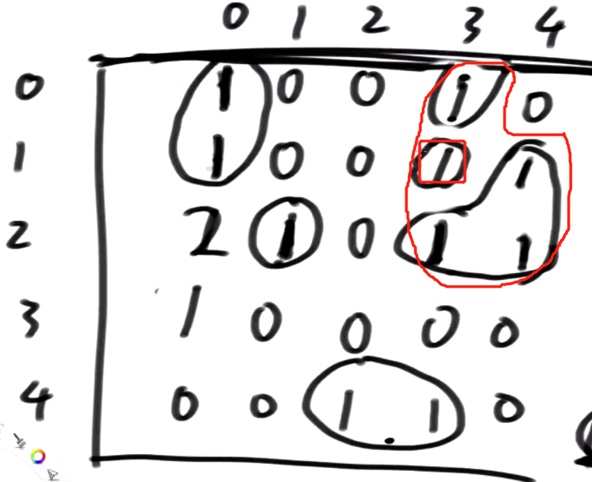 | 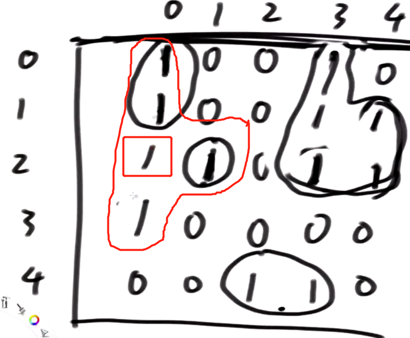 |

这里面有两个新操作。我们这里要加一个其他属性确定集合是否是连在天花板上。这个并查集结构还得告诉我们此时接到天花板上一共有多少个一？这件事如果把这两个事玩的好好的，这个问题就解了。

这题难点在于建模。并且要想到你要逆着去还原，还要先把这个matrix先处理一下。逆着还原是因为前面会对后面产生影响，那么我就从后面开始，既然是从后面开始，那么你就对matrix处理一下，先把前面的影响反应在matrix上，这个反应就是打过的地方1变成2。接着就是并查集去加信息。

- 技巧：如果前面的对后面的有影响，看看能不能倒着求。


### 等累加集合对

```
https://leetcode.cn/problems/tallest-billboard/
```

code3：

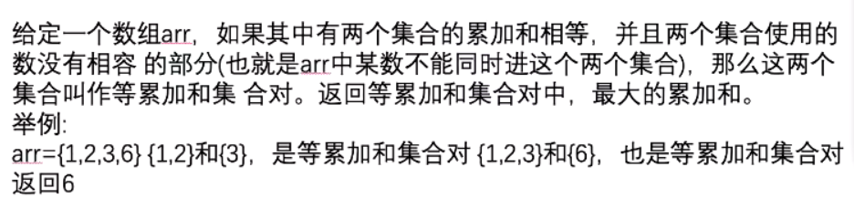

就是拼木棍问题，arr里面就是木棍，你要给我选拼出两根一样长的木棍，材料都是从arr来，arr里面的木棍只能选一次，那么就是等价于上面这个问题，问的就是你能从arr中选材，拼出两根一样长的木棍，最长有多长。

思路，生成一个map，key的含义是数组arr中任意选出两个不重合的集合累加和的差值，例如[1,2]，差值有0,1,2,3。0就是两个集合都是空，1就是1进了一个集合，另外一个集合啥也没有；2就是2进了一个集合，另外一个集合啥也没有；3就是1/2同时进了一个集合，另外一个集合啥也没有。会产生差值为一的集合对有哪些。它value会记录所有会产生这个差值的集合对儿中比较大的那一对的最小值，那么差值为1的这个key，value就对应着（2,1）中的1，（1，空）我是不管的。既然是记录最小值，我又知道差值，所以大的那个就是value+key（差值）。所以（key，value）其实等价于差值为1中基础最好（比较大的）的那一对。

如果我可以把这个map，在我遍历第一个数的时候把它更新对，我遍历第二个数的时候把它更新对，我遍历第三的时候也把它更新对，我来每一个数的时候，我都能够保证这个map它每一个差值都不错过，而且每一个差值最好的那一对我也不错过。那么，我遍历完所有数组的时候，在map中把key等于零的记录拿出来，那就是我要的答案。关键点就在于你怎么更新map。

比如说你一开始的第一个数是二。map搞出两个记录。两个集合都是空，差值是0，最小的那个是0；一个集合是2，另一个为空，差值是2，小的那个是0。假设第二个数字是3，3到来了，你拿出map中的第一条记录，第一条记录代表{空}{空}这两个集合，然后3有两个可能性，一个是进左边，一个是进右边，那么拱出了两个新的差值对{空}{3}、{3}{空}。然后我搞一个map‘出来，把我们拱出来的新差值记录放进去，去重一下{x}{y}、{y}{x}视为一样。接下来把map中（2,0）记录拿出来，这代表{2}{0}这两个集合，拱出来两个新的{5}{0}、{2}{3}，放到map’里面。然后map和map‘去合并，合并的时候key一样，选value大的保留。同样，新供出来的新的要放到map’里面的时候，如果key一样，也是保留大的。

我们为什么要留一个明显不是零的差值？因为我们不知道后面会出什么样的数，又重新拱出一个为零的来。那么这道题其实就是leet code上的最优解了。

| 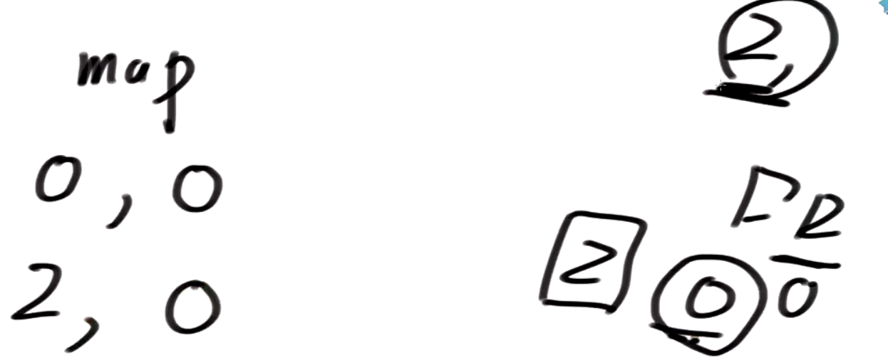 | 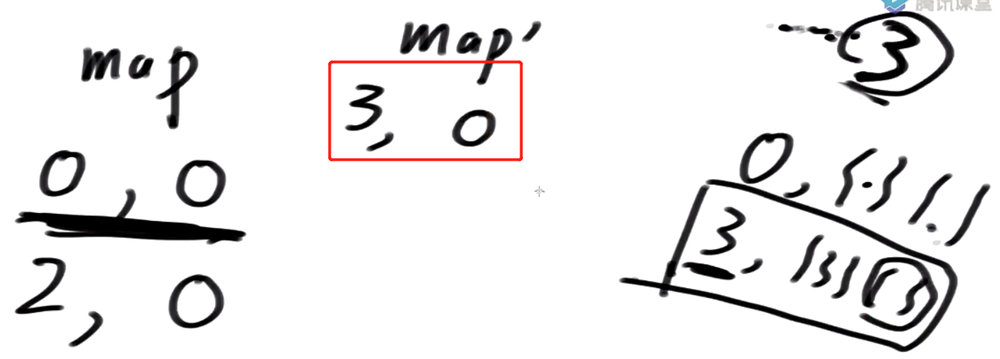 |  |
| ------------------------------------------------------------ | ------------------------------------------------------------ | ------------------------------------------------------------ |


### 字面值不相同的子序列

code4：

- 给定一个字符串s，求s中有多少个字面值不相同的子序列

[1,1,1]这个数组都是1，字面值为1的子序列有很多，保留1的方式有三种。这道题问的就是。给你一个s，s的所有子序列不同字面值有多少。

我们来先看一种比较简单的情况，就是假设这个字符串中没有重复的字符。这是整个字符串，我建立这么一些信息，我假设这个字符串中所有的字符就是a到z小写。我建立这样记录（a，types），以a结尾有type种不同的字面值。一个字符都没遍历的时候所有信息都是零。这里的a不是说某一个位置的a，而是a这种字符，以这种字符结尾就都算。

| 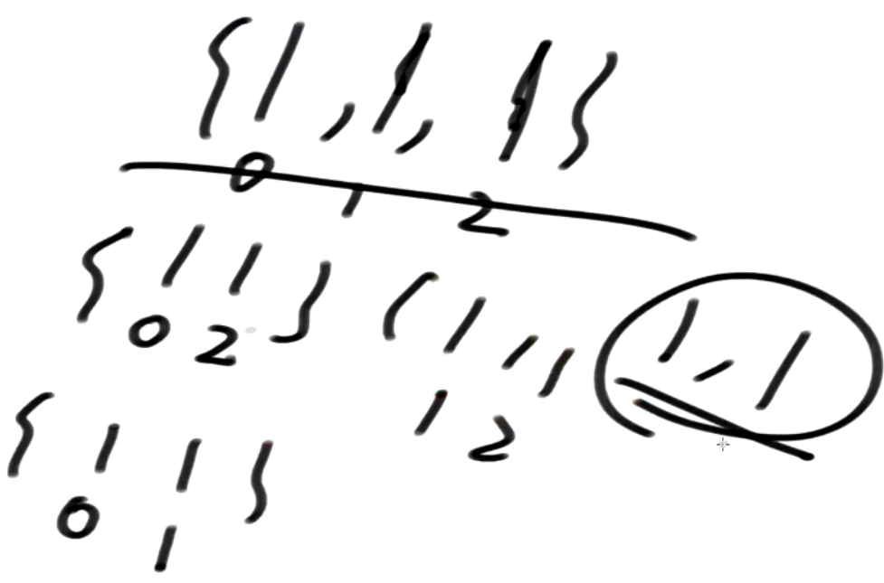 | 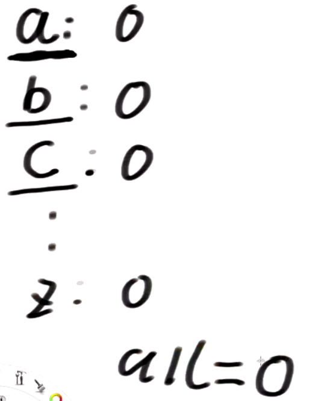 |      |
| ------------------------------------------------------------ | ------------------------------------------------------------ | ---- |

下面开始推这些东西。在这之前我们规定一个字符都没有也算一种字面值，所以all一开始是1。假设第一个字符是a，a来了，我们要算新出现的字面值有哪些。你之前的集合有哪些？只有一个空集，那么毫无疑问，这个空集往后添一个a变成{a}的话，它肯定是新的。所以我知道新产生的不同字面值就一种，把这个a设置成1，因为它确实是以a结尾的，然后这个all加上1变成2。

假设下一个字符b来了，我要算推到b为止，新出现的子集有几种，2种，你这个all里面任意一个集合，不管哪一个形成的字面值，往后面统一添一个b都是新的字面值。如果在字符都没有重复的情况下，很容易就就想到就是说我新增的就是all。

| 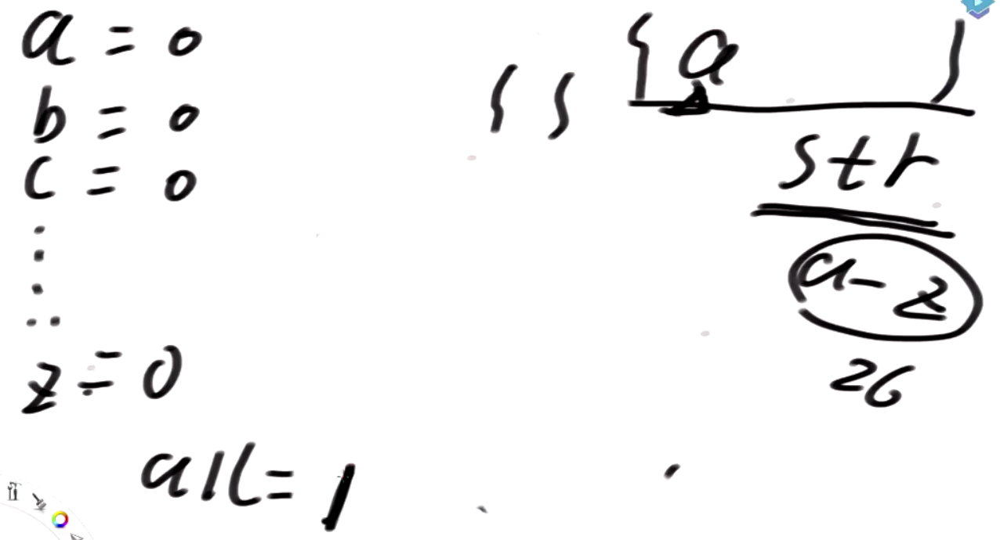 | 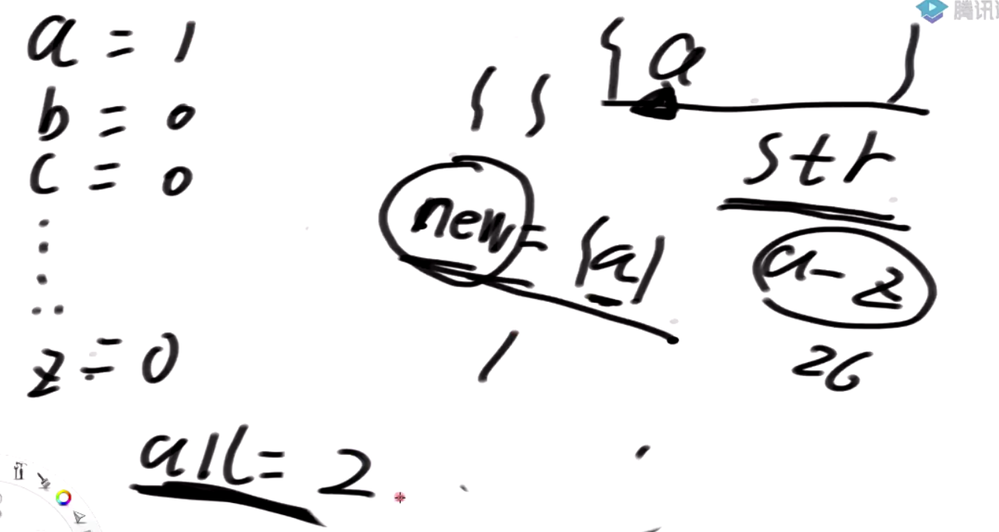 | 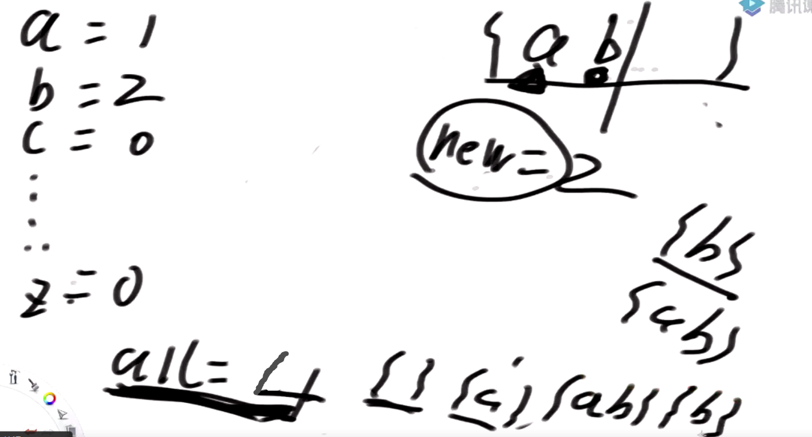 |
| ------------------------------------------------------------ | ------------------------------------------------------------ | ------------------------------------------------------------ |

如果如果你下面还是没有重复字符，就来个c，新增的幅度还是all，所以all变成8。

| 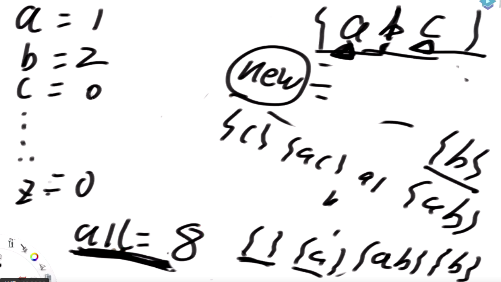 |      |      |
| ------------------------------------------------------------ | ---- | ---- |

我们来分析有，如果有重复字符都是啥情况。假设我们已经考虑ab了。假设下面又来了个b。我新增的是什么？你还能够按刚才原来那样算吗？你先画一个大体范围是可以的，假设我这四个集合，后面统一填个b之后都是新的，先这么假设，发现如下，你会重一块之前原先是b结尾的。所以`NEW=ALL-MAP['b']`。所以你此时新增了2个，更新。

| 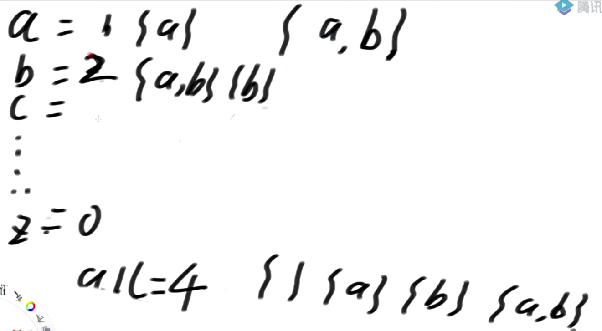 | 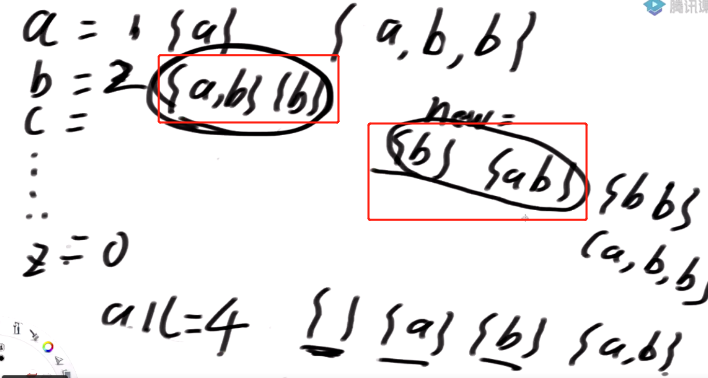 | 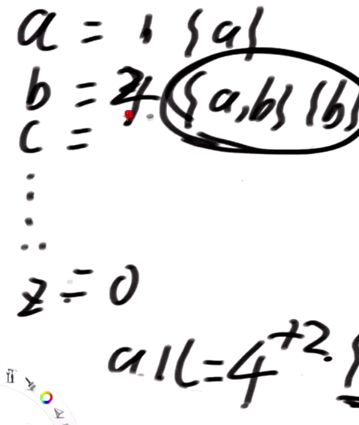 |
| ------------------------------------------------------------ | ------------------------------------------------------------ | ------------------------------------------------------------ |

为什么是`NEW=ALL-MAP['b']`,因为你现在用all再拱一遍，你会把之前b出现的那些老集合再拱一遍出来，那些是重复的。

- code3思路很像，都是“拱”的思想


## Interview Coding 20

训练营5，第4节

### 画匠作画问题

```
分割数组的最大值
https://leetcode.cn/problems/split-array-largest-sum/
```

四边形不等式

code1：

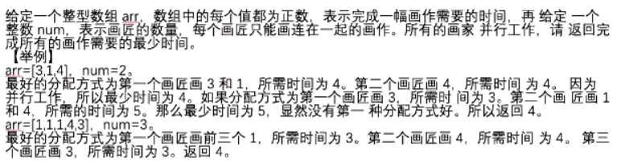

我们有一个数组如下，实际上就是问你，一定要把整个数组分成三份，怎么分能够让最后总结束的总时间最短。

画家只能画连续的画，这题就是问你，数组彻底分解成k块儿不相容的子数组，sum分别为sum1~k，让他们总的最大值尽量小。

| 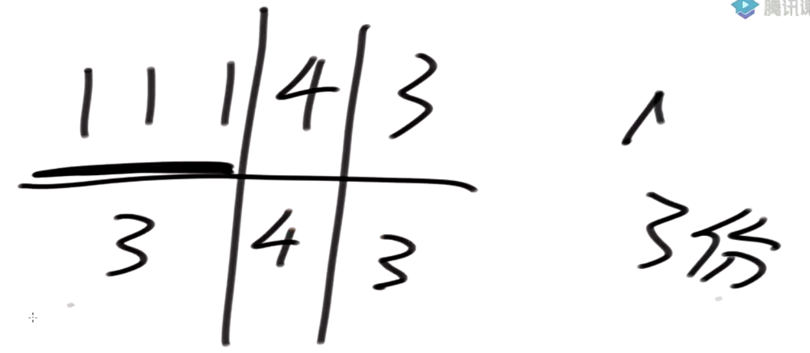 | 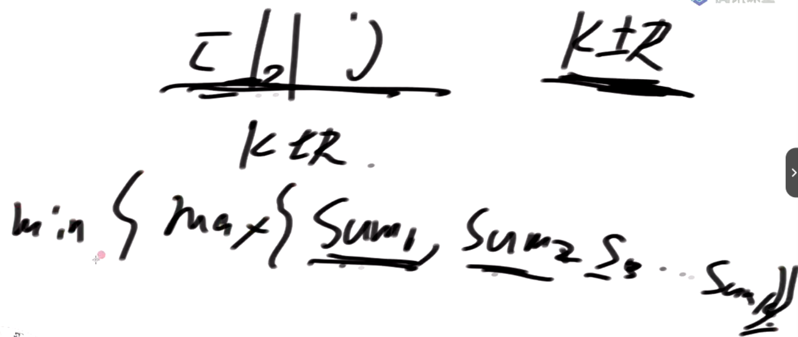 |      |
| ------------------------------------------------------------ | ------------------------------------------------------------ | ---- |

怎么试？一个样本做行一个样本做列。dp [i] [j] 的含义是0~i这些画你就给我分成不相容的k块，由k个画家画。问你哪种划分情况下，累加和各块累加和最大值怎么尽量小的那个答案记在dp里。如果这张表能顺利填好最右下角的值就是我们要的。跟那个邮局问题基本上是一样的，怎么枚举啊？最后一个画家负责的范围是啥？

所以怎么依赖的呀？举一个具体的例子。你的画是下边零到七这些画，每一个画上面有时间，我给你三个画家，dp[7] [3]这个格子怎么填？第一种情况，最后一个画家，自己负责七这幅画，那么剩下的画家就是负责0~6，max{dp[6] [2],arr[7]}。枚举所有的情况，求一个min出来。

再来看看位置怎么依赖的。第一个特征，有枚举。第二个特征，画家变多，只可能变好，不可能变差。画变多，只可能变差不可能变好。第三个特征，很明显区间划分。第四个特征，不同时依赖自己本行和本列。直接猜！！

| 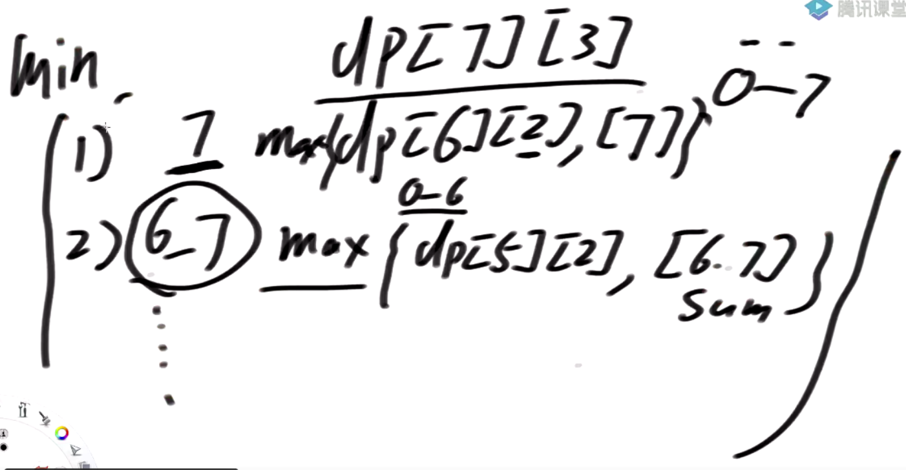 | 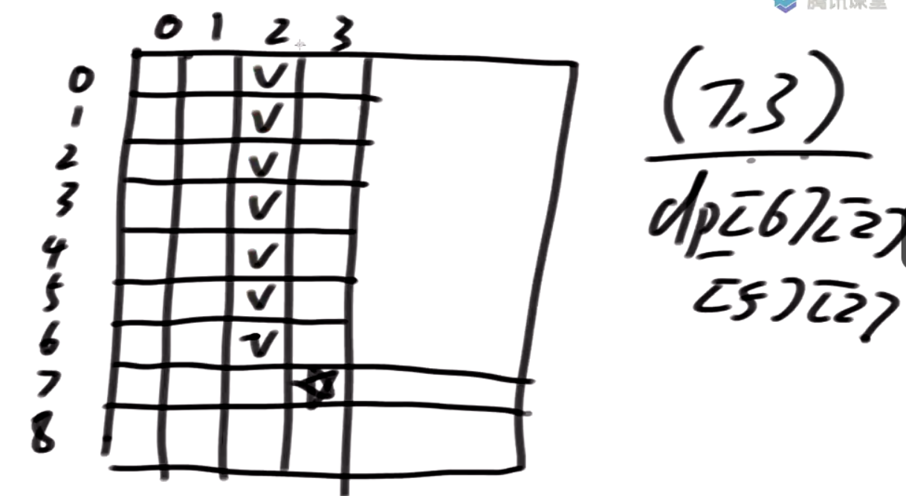 |      |
| ------------------------------------------------------------ | ------------------------------------------------------------ | ---- |

画匠问题结束了吗？没有。关于四边形不等式的技巧，我们就其实已经讲完了。但是在面对具体题目的时候，我告诉大家，四边形不等式的题目往往背后对应着一个比四边形不等式优化本身还好的尝试。就是说你可以用四边形不等式干出来一个非常优良的解，但它可能不是最优解，邮局问题四边形不等式的解确实是最优解，但画像问题其实不是。那画像问题的最优解是什么？它的最优解的尝试跟原来的尝试方法根本没关系。

我们这么想：我所有的这些画放在array里，我假设我先给它定一个目标。目标是啥意思？就是你在你拆块的时候，你拆出来的每一块的累加和不能大于这个目标。问你。能够做到这一点的情况下，你至少要拆几块。举个例子。画在arr中，k=2。假设我先定一个粗略的小目标，我去画块，但是每一块的累加和不能超过五，请问我至少要几块？其实就是用一个sum依次去加，加到超过了，就把那些划进去。然后算出最后至少需要画出多少块来满足你的目标。所以f(arr,target)函数假设可以搞定我们目标为target的时候arr至少需要划分出几块。

现在的问题是我一共就两人。我想知道最合适的目标是什么。那你就在从零到所有正数的累加和之间二分去。二分的时候你看看每一个二分的点，你是不是超过两人了。因为你的目标一定在零到总共所有数的累加和之间，挑二分的方式总能找到最合适的目标。

| 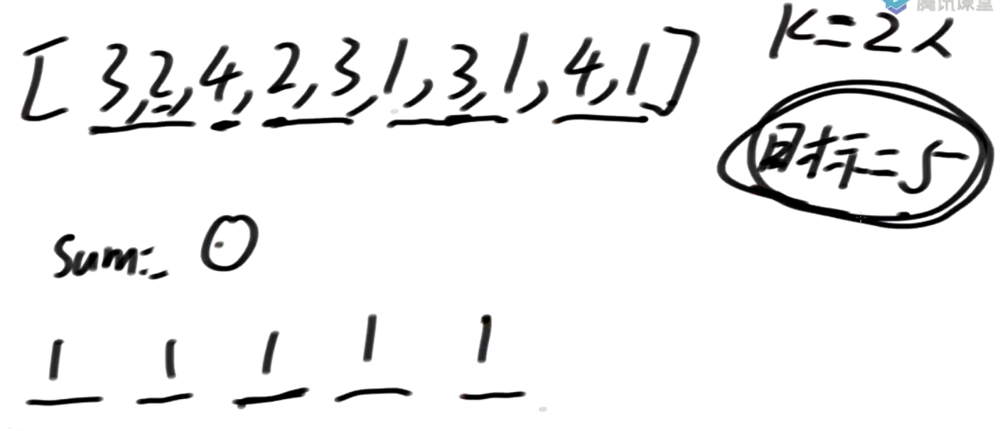 |      |      |
| ------------------------------------------------------------ | ---- | ---- |

举个例子。最开始，目标定为12。调用f函数，发现至少要三个块，也就是要三个人。我就知道我目标定严苛了，恐怕12小时内是结束不了的。所以下一个目标选18。然后发现18可以拿下。然后继续去13~18之间去二分。最晚的那个位置，结束的位置，就是最好的位置。所以复杂度为O(N log_sum)。

| 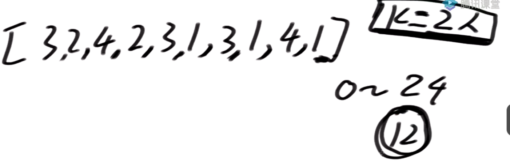 |      |      |
| ------------------------------------------------------------ | ---- | ---- |

优化技巧的上限来自你的试法。如果试法不好，即便你有再多手段优化，也可能不如好的试法。我们优化的技巧可以帮助你把一个不怎么样的试法优化到一个很好的程度，比如说我们有斜率优化，比如说我们有四边形不等式。但是归根结底在于你试法优不优秀。把话说回来，四边形不等式的题目，其实在大量的面试中或者比赛中以四边形不等式做最优解的题是有的，但是比较少，比如说邮局问题。但是在面试中有面试中其实更大量的情况，或者说70%以上它都存在一个更好的试法，把四边形不等式优化的那个很好的解再干掉。为什么能够总是带有这种特征？因为我们新的试法对单调性的挖掘特别极致。它其实在于你能够炸出多少它单调性的好处，四边形不等式，你可以认为它炸单调性的好处其实是有限的。四边形不等式，只是说我存在一种模糊单调性，然后我告诉你它可以有这样一个上限跟下限。它莫不如你直接去挖掘单调性。


### 扔棋子问题

四边形不等式

code2：

- 一座大楼有0~N层，地面为0层，最高一层为N层。棋子从第0层掉落一定不碎，1层及以上就可能会碎了。给定N作为楼层数，K作为棋子数，返回如果想找到棋子不会碎的最大高度，找到最少次数，这个最少次数是考虑了最差情况也能达到的最少次数。一次只能扔一个棋子。

这道题的难点就在于，你一定要随时随地的想到它可能遇到最差情况。假设你只有一颗棋子。你的目标一定要试出最高的不会碎的楼在哪一层。你一定要确保即便遇到最差情况你这个目标也能达到。如果你只有一颗棋子，但是你有五层楼，我们规定零层楼是不会碎的，一共只有五层楼，你一定要完成这个目标，你只能每个楼层都去扔一次，因为你只有一个棋子。我一定得保证我完成这个目标，我还没有办法控制它在哪层碎，我还得假设它对我是最不友好的情况，请问我至少要扔几次。我一定要确保完成目标。我还得时刻提防着最差情况发生，请问我至少要扔几次。

来看看这题。首先我们有个大过滤器，如果k大于了log2_n，你就二分去，棋子够用。试法是什么？就是第一颗棋子扔哪。定义一个函数f(i,j)，含义是如果我还剩 i 层楼需要去试，我还有j个棋子，请问最差情况下我还得满足目标的情况下，我至少要扔几次。大家不要小看这个函数，设我已经知道99层楼是不碎的了，我还剩下100层楼，101层楼，102层楼，103层楼和104层楼需要去试五层楼，我就调f(5,3)，我不管你到了哪层楼，你就剩下五层楼，这个问题让我去试，我i就等于五。

| 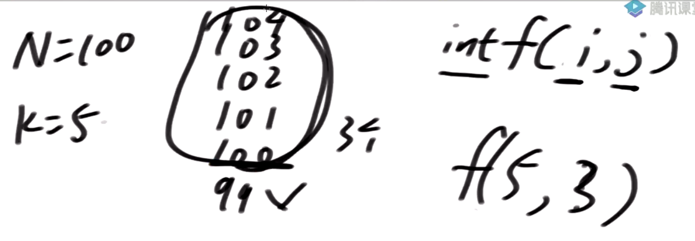 |      |      |
| ------------------------------------------------------------ | ---- | ---- |

假设楼100层，棋子5。你不用管它最底层是到了第几层，假设是a层，那么上面是a+1、是a+2、。。、第100层是a+99。第一种情况是我第一颗棋子就扔在a处。两种情况了，如果碎了，a- 1层是最高的不会碎的楼。你为什么还剩100层需要去试？你一定知道你底下的楼层是不碎的，所以我们再补一个潜台词，假设底下的楼层都是不碎的。所以一开始上来100层，我可以调f（100,5），因为我知道我零层肯定不碎。所以我们看如果我在a层我碎了，我就知道a- 1层是最高的不碎的。这样一种情况下，我就其实就试出来了，我就扔了一次，我把第一个棋子扔在a处。换句话讲，就是我第一颗棋子扔在a处，如果它碎了，我就还剩零层需要去试，还剩四颗棋子，f（0，4）。如果它没碎，我就还有99层需要去试，还有五颗棋子，因为它没碎。永远假设最差情况，所以取max再+1是我最少的次数。

到一个普遍位置i，可能分为碎和不碎，但是默认命运总是给我最差的情况。那我就枚举所有可能的i。所以我们来试看一下f（7,2）。

| 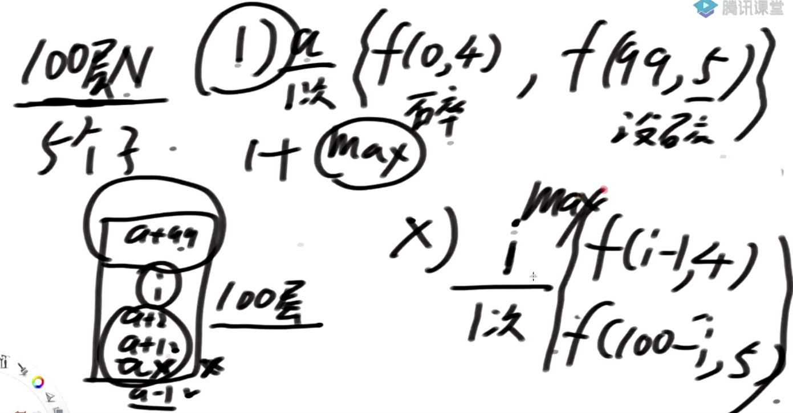 | 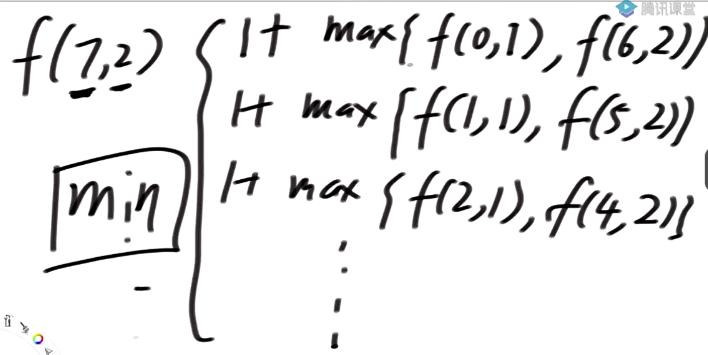 |      |
| ------------------------------------------------------------ | ------------------------------------------------------------ | ---- |

这个暴力解中，我们只要解决一些base case就行了，只有两个可变参数。i=0，你扔0次。如果你只剩一颗棋子，那么你只能从上往下一个一个试，所以扔i次。两个base case一套，所有大问题拆吧。就两个可变参数，所以是张二维表，这是什么模型？业务限制模型。你发现它就给你两个可变参数，一个是表示楼层，一个表示棋子，很自然的就硬憋这个递归。业务限制模型指的是当我去猜递归的时候，我的可变参数都要深入的去搞题目本身所透露给我的提议。

来看位置依赖。星星需要把我自己本列和我前一列的东西都枚举一下，才能知道星星位置的值。开始猜，有枚举、有单调性，区间问题，不同时依赖行列。四个条件，一成立，每一个格子在算的时候，我上边儿的格子在算的时候，你告诉我你枚举到哪一层的时候，是得到最优解。我右边格子在枚举的时候，你告诉我你枚举到哪一层的时候，得到最优解，我就在你们中间枚举。

| 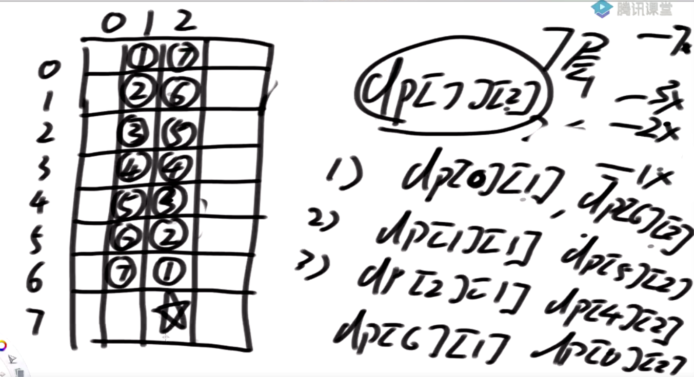 |      |      |
| ------------------------------------------------------------ | ---- | ---- |

这是最优解吗？不是。这道题它依然是一个试法能够很好的把四边形不等式的解给干掉的一个题。最优解的试法很奇怪，是反过来想的。他这么想，我定义一张dp表，i是棋子数，j是扔的次数，dp [i] [j] 就是我假设我有i个棋子，在我可以扔j次的情况下。可以搞定多少层楼的问题？题目的目标是你是要搞定100层楼，假设你有三颗棋子。请问你要扔多少次？这个dp表怎么用？

假设五颗棋子，所以我这张表。我要准备下标零到五，列我不知道准备多少，我顺着往下。第零列废掉，扔0次，搞定不了。第一行也不用填，你没有棋子怎么搞定。第二列，都是1，因为你只能扔一次。最好搞定1层楼的问题。第二行就是从底往上一层层试，也好填。一个普遍位置怎么求，我们要搞定这个问题了。

假设要搞定dp[3] [10]。我假设在求dp[3] [10]之前我能够先求dp[3] [9]=a，还有一个dp[2] [9]=b，我们可以假设，因为我们可以控制填格子的顺序。用两种方式来解释dp[3] [10]怎么求。

第一种解释。你剩三颗棋子。你还能扔十次。我假设你扔到的是最优层。如果它碎了，你已经扔过一次了，所以你还剩9次可以扔。如果你碎了，你下边能够解决b层楼的问题。如果没碎，那么你往上可以解决a层。dp[3] [10]=a+b+1。

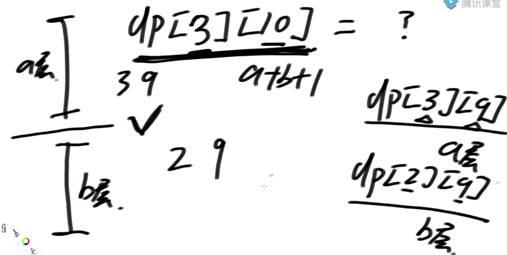

第二种解释，我告诉你客观情况下，三个棋子扔九次可以解决20层楼的问题，两颗棋子扔九次可以解决15层楼的问题。假设这都是客观的值。我问你，你三颗棋子。扔十次能不能解决36层楼的问题？一定可以。我就把第一个棋子扔在16位置，如果碎了，那么就去底下调，如果没碎就去上面调。我们还是用第二种解释更加平易近人一点。

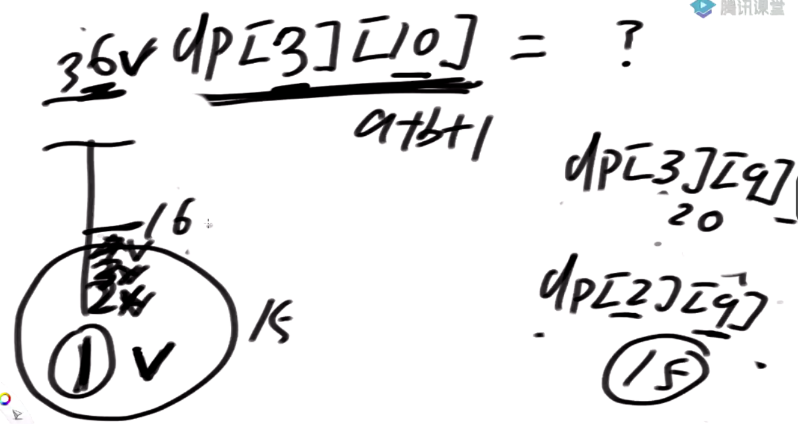

开始填表。刚刚超过一百或者等于100的列数就是你的答案。这张表是增长极快的。列不定，用空间压缩的方式让它动态滚动下去，不准备整张表，我就一直滚到你出现100。这是最优解吗？我们先算一下这个解它的时间复杂度是多少？如果你给我一个具体的n给我一个具体的k，假设客观上来讲实际解决的次数是s次。时间复杂度就k×s。假设你这个k只有一颗棋子，你这个s也就是n的水平，所以最差可能是O（k  *  n）。但如果你的k比较大的话，这个s会其实非常会非常小。

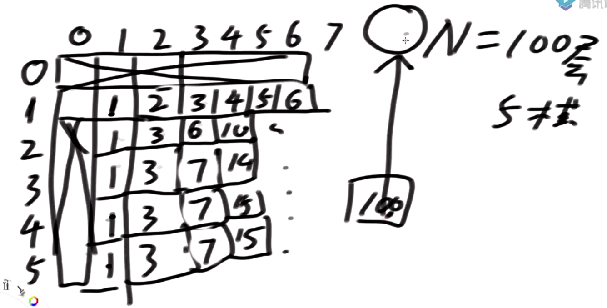

为什么说还能优化，随着你往后填，你会发现，一列上的值不重复了。你看看能不能搞定一个类似斐波那契数列的解。

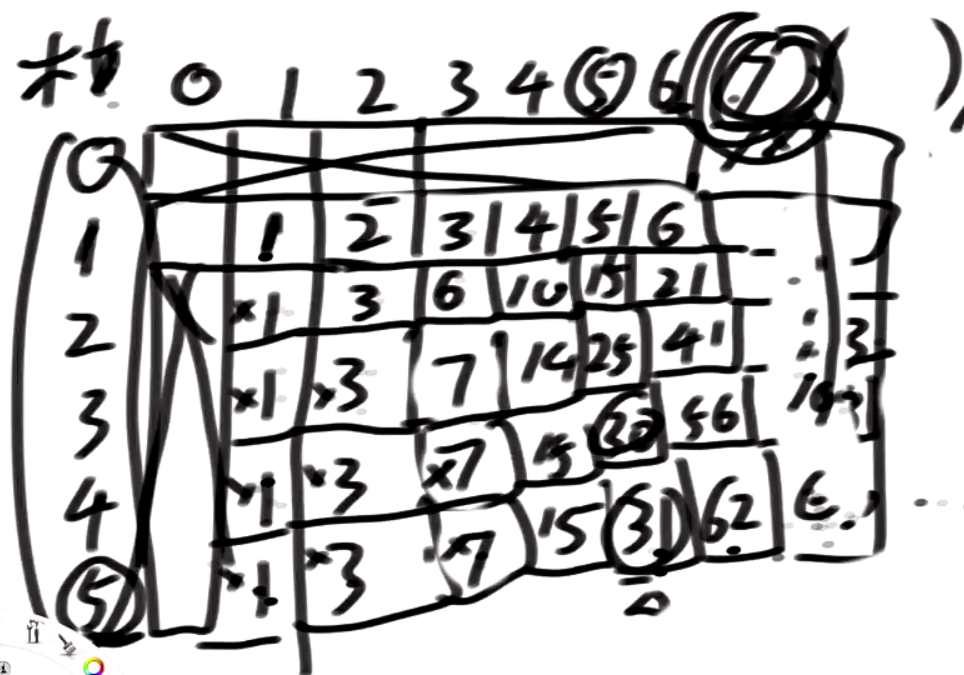


### 邮局问题

四边形不等式

code3:

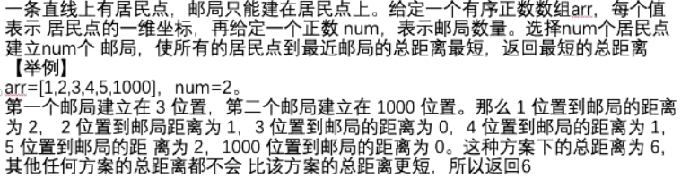

给你一个array，它是有序的。代表着在x轴上，有3,17,60,76这样一些居民点，然后再给你一个参数k代表一共要建的邮局数量。你有很多居民点你的邮局只能建在居民点上。你的邮局只能建在居民点上。但是你建在具体哪个居民点上，它会让总距离不一样。举个例子p2，你只有三个居民点，要建k个邮局，你只能建在7位置，因为这样别的居民点到你的距离的累加和最短，建在3和15都没有7好。

假设每一个居民都会选择离自己最近的邮局去寄邮件，那么会存在一个总距离的问题。请你告诉我总距离怎么能够尽量小？返回最后最小的总距离是多少？

| 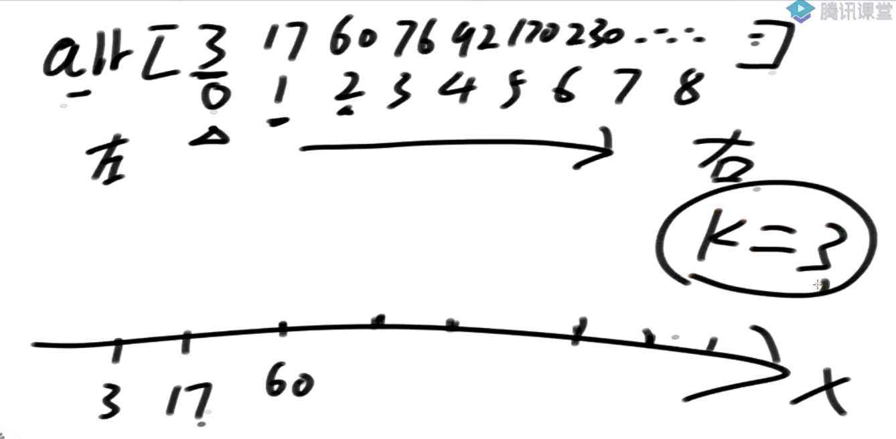 | 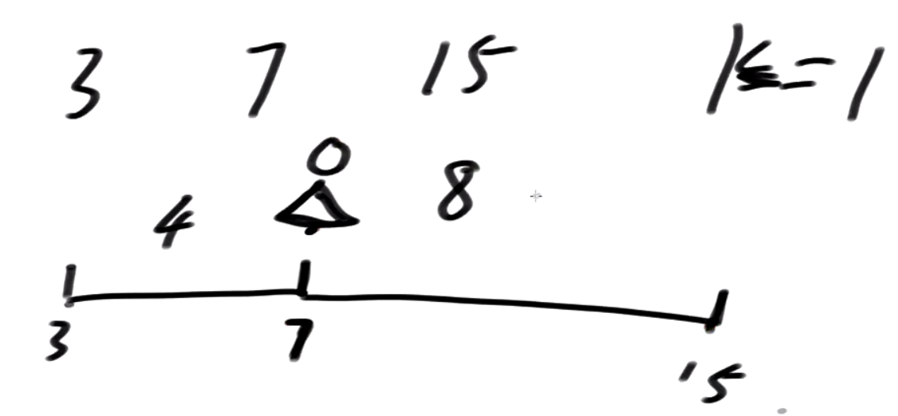 |      |
| ------------------------------------------------------------ | ------------------------------------------------------------ | ---- |

让你做动态规划，你会怎么猜。dp[i] [j]代表0~i这些居民点里面，一定要刚好建够j个邮局，总距离最小是多少？所以这张表它的行数。就是居民点的index，它的列数就是零到k。如果你能够把这张表填好。最右下角的值就是你要的。你永远不用去讨论零个邮局的时候如何如何，所以这张表中最左一列画个叉，用不到。第一行都是0，因为你只有一个居民点，建几个都是在原地。

再来看第二列，硬求，我奇数建中点，偶数建上中点和下中点一模一样，能求。第二行，邮局比居民点还多的情况，都是都是0。

现在我们要求一个普遍位置的dp[i] [j]，一个样本做行，一个样本做列的对应模型是不是总去讨论结尾的情况，我们按照最后一个邮局能够处理的居民点来分，最后一个邮局单独处理i、i-1~i、i-2~i，这样枚举下去，答案必定在其中。 

为什么这样去枚举？因为你会发现你枚举i位置建不建邮局，当i不建邮局的时候你不知道你之前最后一个邮局在哪，你没办法算出一个答案。所以你会发现，我好像关心最后一个邮局在哪，所以我何不去枚举最后一个邮局的可能性，所以我去枚举，最后一个邮局在i，在i-1，在i-2，这样枚举下去。这样枚举可能有建在同一个点的邮局，无所谓！我当它炸掉了！但是你会发现枚举邮局建的位置，似乎信息还是不够，因为我并不知道我这个邮局实际处理了多少在它左侧的居民点。所以我们枚举邮局建的位置，也不太好。既然我们还需要这个邮局实际处理了多少居民点，那么我何不枚举最后一个邮局处理的范围呢？所以枚举处理[i,i] [i-1,i] [i-2,i] [i-3,i]这些居民点交给最后一个邮局处理，抖机灵--我最后一个邮局什么都不处理，也是一种情况，我当它炸掉了。

| 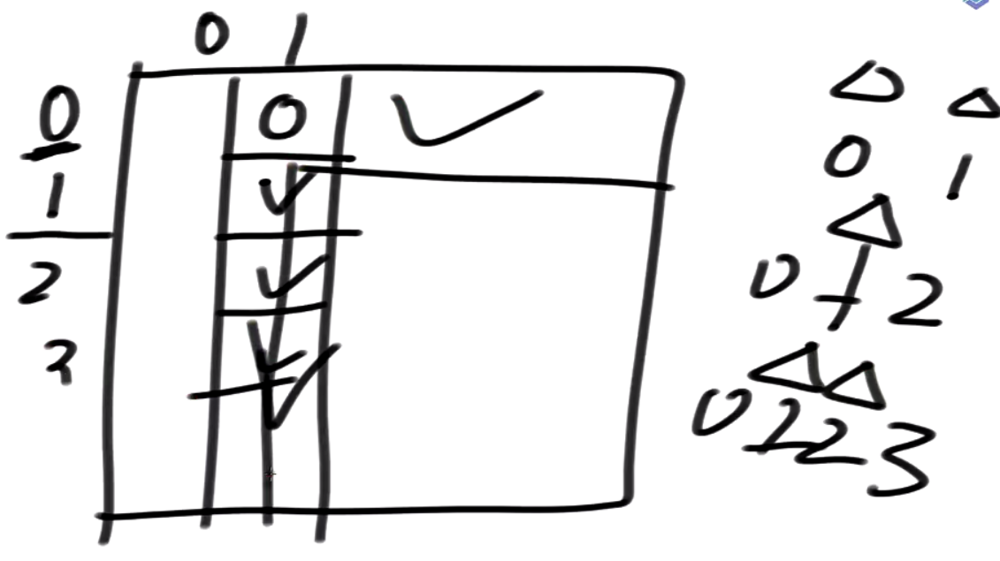 | 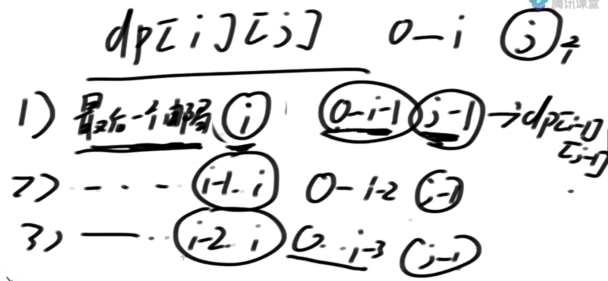 | 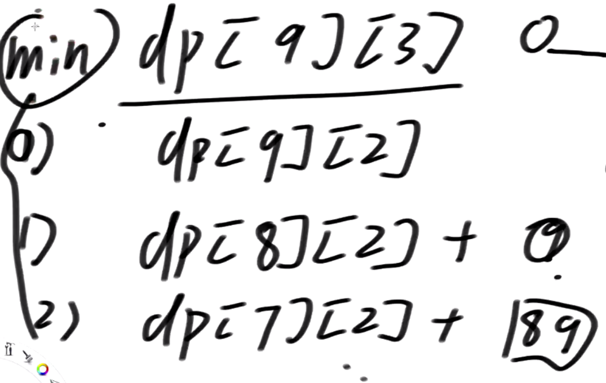 |
| ------------------------------------------------------------ | ------------------------------------------------------------ | ------------------------------------------------------------ |

所以我们枚举了一个范围交给一个邮局去处理，我们肯定希望邮局建立在这个范围的最合适的位置。这样的话我们需要做一个预处理结构，算出一个范围上的居民到某一个邮局的总距离最小是多少。record数组可以告诉我i~j范围上，如果只建一个邮局总距离最小是多少。我要把这个record做出来之后，毫无疑问，可以去加速我们刚才那个流程。注意！我们确实可以直接算出中点，得到最优的居民点在i~j中的哪一个位置。但是record不是要告诉我们最优邮局建在哪，而是要告诉我们一个最小的距离，你要帮我把值算出来，而不是就告诉我邮局建在中点，这个中点我都可以自己去算。

所以现在问题来了，我们再求l~r这个范围的最小距离和的时候，我们不能去枚举每一个位置到中点的距离是多少，然后加起来，这样就n³了，太慢了。我们要利用已知的格子的信息，快速的求出来，时间复杂度要维持在N²才行。很简单，假设你现在要求L~R范围上的最小值，L~R的中点和L+1~R的中点一样吗？可以一样，如果L+1~R是偶数，那么就放在下中点，如果是奇数，就直接放在中点，到L~R范围的时候，邮局的位置就成了L~R位置的上中点了。既然如此，那么dp[L] [R] = dp[L+1] [R] + (arr[R]-arr[R+L>>1])。

位置依赖，星号依赖上面那些点。不优化是O(N²K）复杂度。你有枚举行为的时候，有一种技巧叫斜率优化。这就牵扯到接下来我要提到的一个非常重要的技巧。这个技巧叫做四边形不等式。我们现在已经有一个O(N²K）的方法了，这玩意儿能不能做我们的对数器？也就说我们以后猜的话，即便猜中跟猜不中，都不需要证明，你既然有这么一个对数器，如果你猜出可能的一种一种优化的话，你最多拿两个对数去验一下，结果你就知道你猜对还是没猜对了吗？

怎么猜？我当然要关注这个星号的临近位置。注意到有几个特征。第一个特征，每一个格子有枚举行为。第二个特征，这个问题所要求的动态规划的值就dp，具体某个格子(i,j)的值。他对这两维参数有一种说不清道不明的单调关系。你的dp[i] [j] 这个i一旦增大，这个dp值只升不降。你的dp[i] [j] 这个j一旦增大，这个dp值一定小于等于原本的。这是有关于四边形不等式的两个特征。第三个特征。我们所求的这个dp值，它粗略上概念上来讲，它是一种区间划分问题。

现在猜一件事儿，居民点的个数从零到5的，邮局给的数量3个。假设0-4范围上最右边的邮局负责，k~4。当你的范围变为0~5的时候，你的最后一个邮局负责的范围k'~5，这个k'一定不会小于k。

| 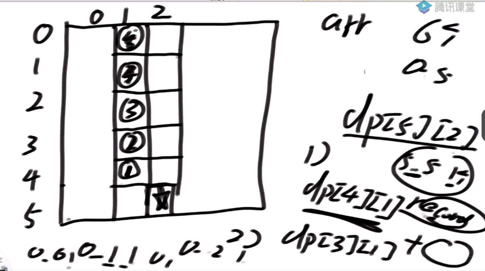 | 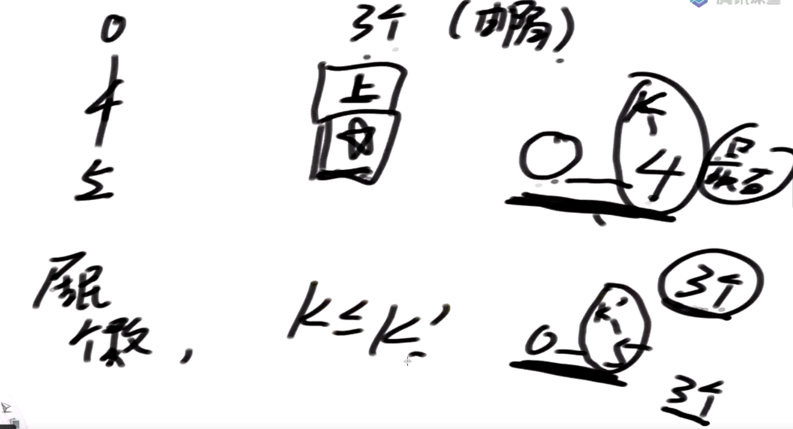 |      |
| ------------------------------------------------------------ | ------------------------------------------------------------ | ---- |

想一下我们当前格子是0~5居民点，你给我三个邮局，我上面的格子是零到四号这些居民点，分三个邮局，假设上面这个格子的最优划分在a位置。轮到我再去试的时候再去枚举的时候，我划分点的位置 不用在a之前，相当于我在尝试的时候，我只用从a开始往右试就行了。这是一边。

右边那个格子，有四个邮局，如果最优划分是4~5，那么当我减少一个邮局的时候，我恐怕不需要在4的右边去试。

我上边给了我一个枚举的下限，我右边可以给我一个枚举的上限。我只用在a跟b之间去试。我们不知道它成不成立我们在猜。i增大是增，j增大是降，所以我们往i小，j大的方向去依赖。也就是依赖上面的和右边的。

任何一个格子它上边的位置会给它一个指导a，它右边的位置会给它一个指导b，这个格子如果只在大于等于a跟小于等于b之间去枚举，就能省掉很多枚举行为。

我们一旦发现有一个dp问题，具备三个特征。第一个特征，有枚举行为。第二个特征，dp值跟两个参数之间存在一种单调关系，但是不是很清晰。第三种情况，它是一个区间划分问题。我们就直接看看任何一个格子它上边、它右边这一组，跟它的枚举是否存在一些关系？如果你分析不出来，你就假设它存在。比如说这道题，我们就假设当我在求某一个格子的时候，我不仅填一个dp，我还在求每一个格子的时候，把它的划分位置记在了另外一张表里。叫选择表--choose表，choose表的规模跟dp是一样的，这个choose表只负责记录我上面的格子，当时它在枚举的时候，它取得最优解的时候这个划分值a。我右边的格子在当时他没举的时候，他能算出来他最优的划分值在b。那么，我如果假设它上面的格子跟它右面的格子能够对它产生影响，在我算这个星号的时候，我就只用再把最后一个邮局负责的划分位置限制在a和b之间。我不知道这对不对，我就先这么猜，我们有对数器帮我们验。

| 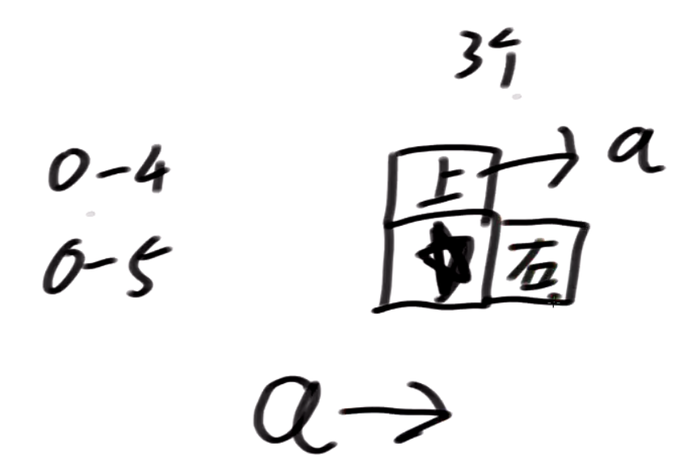 | 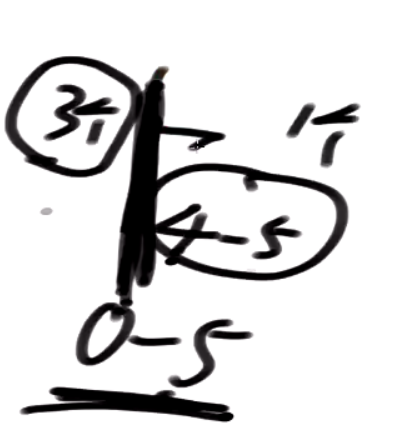 | 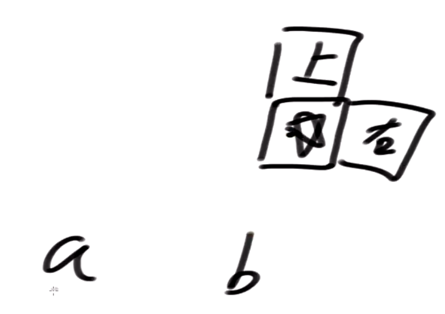 |
| ------------------------------------------------------------ | ------------------------------------------------------------ | ------------------------------------------------------------ |

我为了让每一个位置都能够有优化。所以我每一行从右往左算。因为什么我们同时需要上面的和右边的帮我们优化。你算1的时候没有上限只有下限，算完1之后，234格子都有上限又有下限。

我们只关注一个动态规划问题，具备了四边形不等式的特征，如果有，直接硬猜不去证明。如果能优化，是直接减掉一阶的！

补一个特征，第四个特征，求单独一个格子的时候，它不同时依赖于自己本行的值和自己本列的值。如果我这个格子，我既依赖自己本行，又依赖自己本列。当我求一个格子的时候，我指望它上面的位置跟它右面的位置是算过了的，这点是做不到的。

| 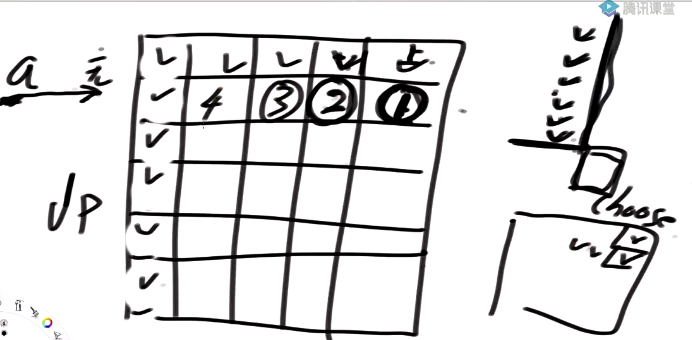 |      |      |
| ------------------------------------------------------------ | ---- | ---- |


### 反转数组求每次逆序对

code4：

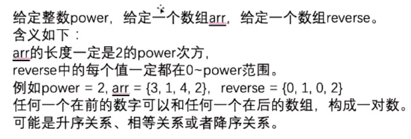

- 限制：p>=0；arr长度是2^p；0<=reverse[i]<=p

例子：arr{3,1,4,2}  op{0,1,0,2}

第一个操作是0，代表整个数组，如果每一块的长度是2^0=1的情况下是怎么分组的。经过零操作之后，还是原数组，因为都是自己和自己反转。问你在这样一个数组中逆序对儿有多少个？有3个。

下一个操作是1，2^1=2，也就是每一块长度为2。所以[3,1] [4,2]组队，然后逆序[1,3] [2,4]，再整个的[1,3,2,4]看看几个逆序对，1个。

在变过之后的数组中做第三个操作0，在[1,3,2,4]这个上次操作过的数组中搞一个操作0，我们知道操作零不动，所以逆序对还是1。

接下来操作2,也就是4个一组。变成[4,2,3,1],逆序对是5。

- 也就是操作数组中可能会有[0,1,2,4,...,k]，拿到k就代表2^k一组的数去reverse

| 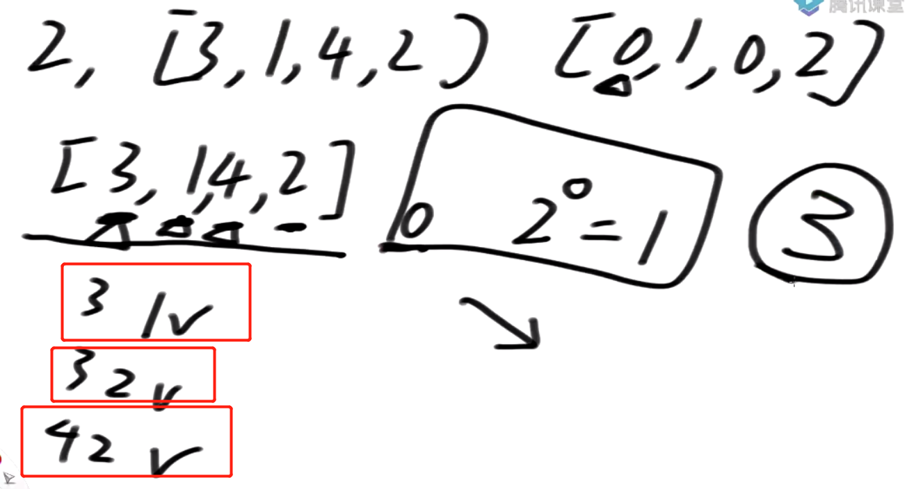 | 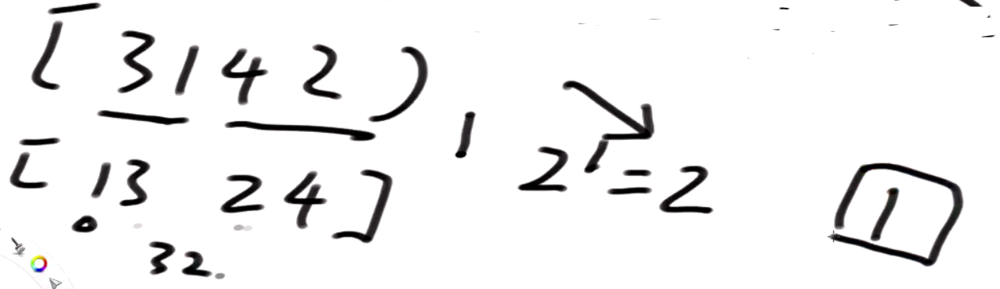 |      |
| ------------------------------------------------------------ | ------------------------------------------------------------ | ---- |

我们把这个逆序对这么来分类，比如说[3,1,4,2]。我们定义一个数组dp1[4]，dp1[i]的含义就是以2^i分组，假设每组的大小为s，每组的逆序对只能来自于前一半的s/2以及后一半的s/2，统计所有组逆序对的数量之和。这个分组是按照题目的意思分，从左到右分，不重复。并且一组里面逆序对的来源，是分别来自于左部分和右部分。

如下，dp1[2]，每组4个，有两组，第一组逆序对，分别来自[3,0] [6,2]，所以有（3,2）总共1对。第二组同理，有（7,6）、（7,5）、（8，6）、（8,5），4对，总的就是1+4=5对。

```
正序对+逆序对+sum{C(k,2)}=C(N,2)   k为每个数重复的次数
正序对+逆序对=C(N,2) - sum{C(k,2)} (在数组中某个数重复了k次)
```


然后你再建立一个dp2的信息。dp2[i]的含义和dp1一样，不过统计的是正序对的数量。两个信息。先如果都提前建好，我们看接下来怎么玩。现在你去把数组两两一组，逆序一下，看看新的这个数组dp和dp'有什么规律。当你p=i操作的时候，其实就是dp[k<=i]和dp'[k<=i]交换一下，大的不变，小的全部交换，这是因为我们的特殊规定导致的。

也就是说。当我们对一个原始数组。先建立dp跟dp撇的记录的话，来一个reverse。我们就可以知道dp跟dp撇里面怎么交换。你每一步的答案怎么求啊？所有dp里面值累加起来不就是答案吗。每一回都这么干，所有答案顺利求出来。

| 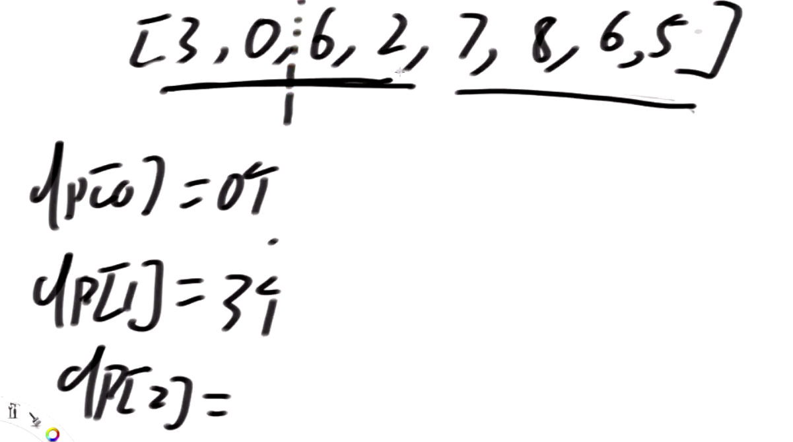 | 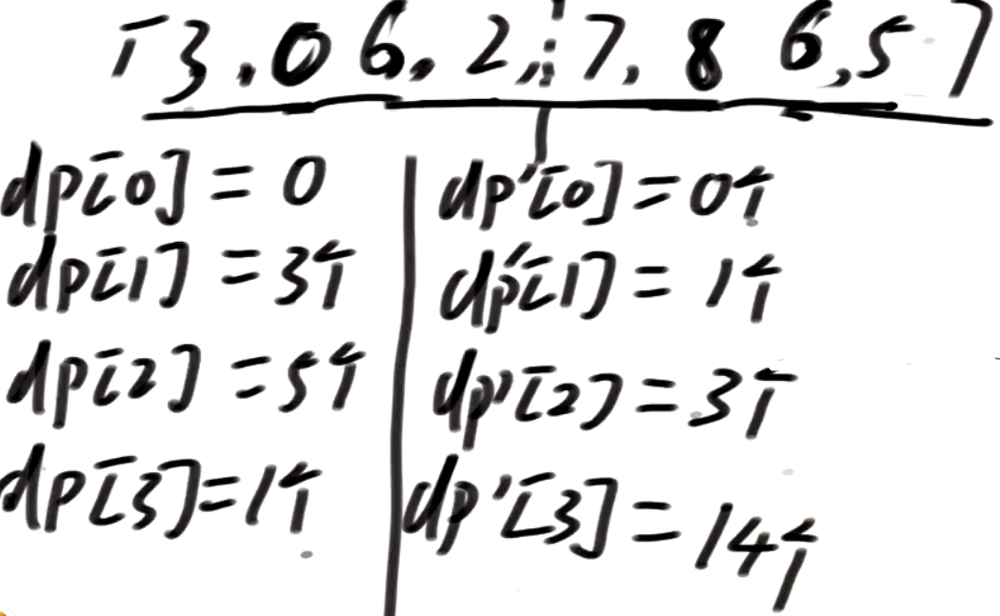 |      |
| ------------------------------------------------------------ | ------------------------------------------------------------ | ---- |

关键就是dp跟dp撇怎么求----小和问题。用一个归并排序把dp和dp‘搞出来。


### 全是1的最大正方形

加一个题。在一个matrix中必须要画正方形，里面全是一这样的正方形才叫达标的正方形。假设这个矩阵中不是零就是一只有两种值，可能会有很多正方形达标。我让你返回达标的正方形，里面含有一数量最多的那个个数是多少。

怎么猜？dp[i] [j]代表啥，正方形必须以（i，j）这个点做右下角的点的情况下，它往左上方延伸最大的正方形是多大（边长）。第一行第一列好填，都是自己。看一个普遍位置。首先matrix[i] [j]如果为0，那么对应的dp直接就是0。我们只要讨论matrix[i] [j]如果为1的情况，如果左边上面左上角其中有一个是0，那么dp[i] [j] 直接就是1。

`dp[i][j]=min{dp[i-1][j-1],dp[i-1][j],dp[i][j-1]}+1`。

| 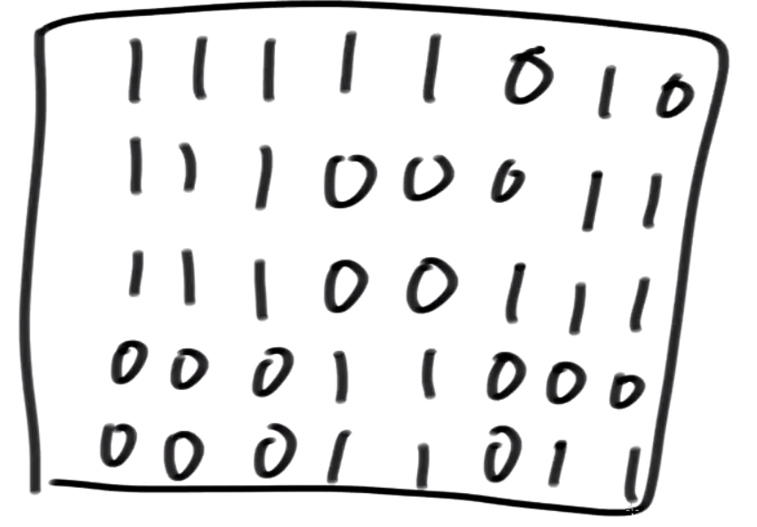 | 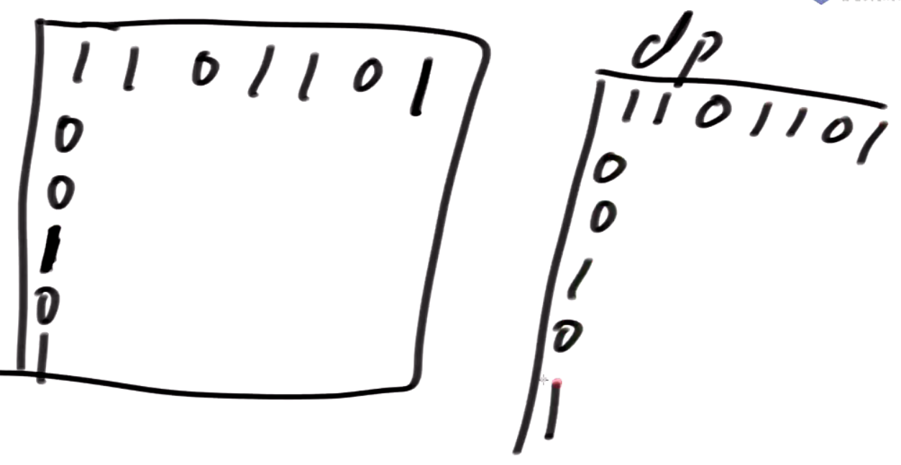 | 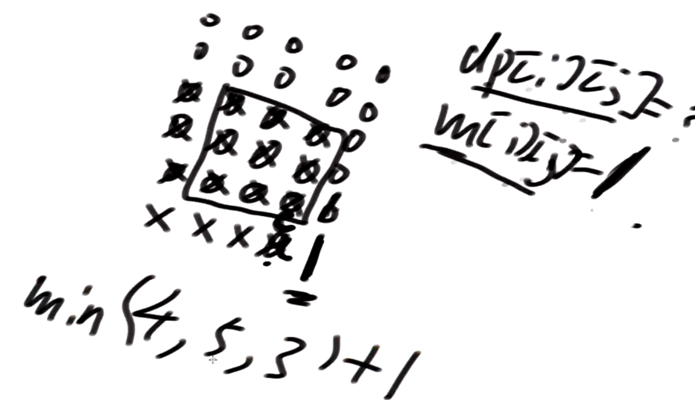 |
| ------------------------------------------------------------ | ------------------------------------------------------------ | ------------------------------------------------------------ |


## Interview Coding 21

训练营5，第5节

### 回文串记录

code1：

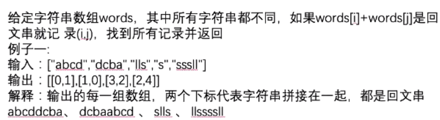

这里面我们不能忽略的一件事情就是字符串长度。字符串的长度是一定会考虑到时间复杂度里去的，因为它这里面拼的过程中，它是需要字符串长度的。所以在这里面，我们得把长度这个因素考虑上。假设字符串平均长度是k。那么如果你有n个字符串，你每两个字符串试一下暴力去试，就是O(N² * K）。

那还有一个方法是这样的，我先把所有的字符串放到一个哈希set里去。然后假设我拿出了一个字符串，我们之前的做法是说我找其他的字符串跟它配，能不能成回文，现在我们不这么做了。现在我们挖掘这个字符串本身的一些特征。怎么挖掘呢？这个字符串先看前缀，前缀哪些是回文的情况？第一种情况。前缀单独是a的时候，它是回文。然后我把它后面的一坨拿出来，我到set里面去找，找它的逆序。如果有的话。那么把这一段彻底拼到前面去，它整体就是回文串了。这是一种可能性。

换一个短点的。当前的字符串是aabaa。第一种可能性就是前缀为a的时候。我就查什么的逆序呢？ABAA的逆序。如果它发现它有a aba这个逆序的形式，拿前面去就就整体就拼成回文了。第二种可能性前缀是AA的时候。它是回文串那我就在set中查什么baa的逆序aab？如果我有aab的话，拿到前面去，它就是回文了。第三种可能性前缀为a ab的时候，它不是回文，所以跳过，因为不是回文，你即便后面有它的逆序，拼到前面去，也不是回文。最后一种情况，就是我整体AAbaa是回文是，那我就查有没有空串。

| 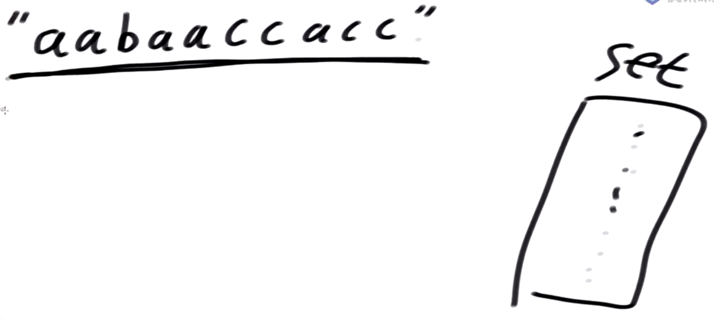 | 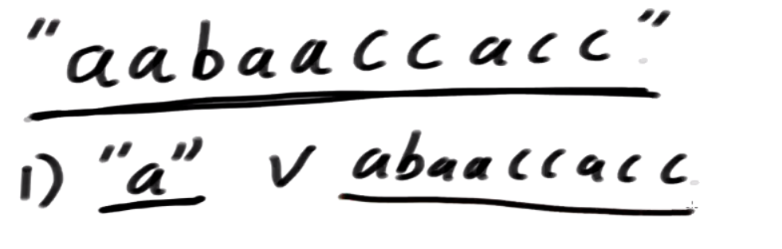 | 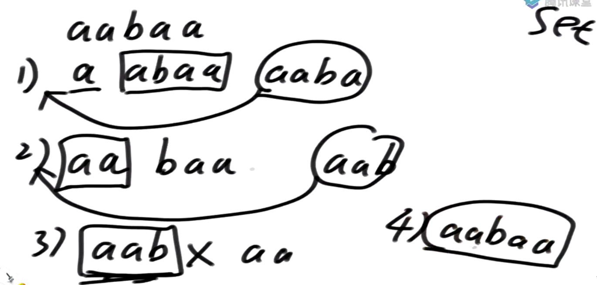 |
| ------------------------------------------------------------ | ------------------------------------------------------------ | ------------------------------------------------------------ |

第一种方法是先拼再看是不是回文，第二种是我挖掘自己的特征，然后去set里面找有没有能构成回文的。如果你这种前缀试完了之后，你再试后缀。举个例子，aaaccc。所以就分为两大块来求解。第一大块，所有前缀是回文的情况。完之后检查后缀，后缀是同理的。你前缀查一遍，后缀查一遍，所有这个字符串的情况都枚举了。然后还差一种，你看看在set中有没有它本身的逆序。

- 前缀枚举所有的可能性，后缀枚举所有的可能性，然后看自己的逆序有没有？一切只用查set就够了。

估计一下复杂度，有N个字符串，你都是这么玩，所以外头乘一个N，然后在里头，一个字符串的长度是K，你去枚举字符串的每一个前缀，是外头再套一个K，然后再里面，检查是否是回文O(K），再看看set里面有没有+O(K)。所以总的是O(N * K²）的复杂度。为什么Set中查也是O(K)，因为这个时候字符串的长度不可忽略，你set底层是通过遍历str来计算hashcode的。

你用第一种还是第二种，看菜下饭吧。

| 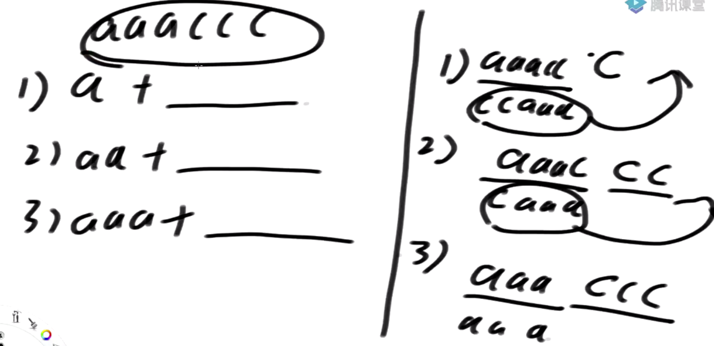 |      |      |
| ------------------------------------------------------------ | ---- | ---- |

流程就是这样。但是检查一个字符串的哪些前缀串是回文串这个过程是可以加速的。但是在这道题里面，这个加速就显得无关紧要了。因为检查一个前缀串是否是回文串，你即便把它做得非常高效，但是后面这两个过程还是O(K)的，这是相加的关系，拖你后腿了。

对于我们这道题来说，你把一个前缀检查它是否是回文这件事情，你优化还是不优化，都不会影响最后的复杂度，因为你后面的过程怎么也得把它生成逆序的形式，这个字符串还得在哈希表中查，这两个东西你是省不掉的。

下面我们换一道题，我给你个字符串，你告诉我它哪些前缀是回文，给我返回。

下面是例子，"aacaab"，返回res[0,1,4]代表，0~0/1/4是回文。返回的数组里面每一个值代表零开头到当前位置是回文哪些前缀串是回文。这道题你前缀串的优化就有必要了，因为它只要你哪些前缀串是回文这件事儿。我怎么样生成这个结果数组？ManACher算法。manacher算法中对于每一个位置都会有个回文半径，有一个Parr。你先用manacher算法，把所有位置的回文半径数都跑出来，接下来，哪些前缀是回文你就知道了，你只要看一个位置推一个回文半径能不能达到0位置，是的话整个直径包括的东西，都是回文串。整个得到所有前缀串的代价是O(N)。当你得到Parr之后，你可以方便检查前缀串或者后缀串是不是回文了，所以你检查前缀串跟后缀串是否是回文这件事是可以加速的，相当于用manacher算法帮你搞一个Parr预处理结构出来。

| 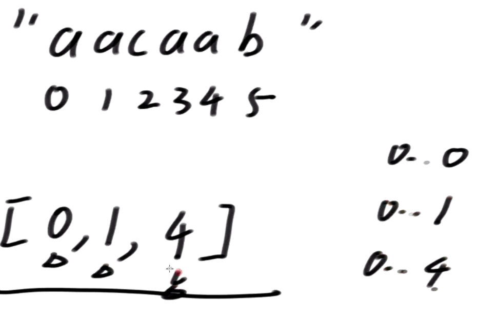 |      |      |
| ------------------------------------------------------------ | ---- | ---- |


### 数组的最长的连续序列

code2：

- 给定无序数组 arr，返回其中最长的连续序列的长度。

  例子：arr=[100,4,200,1,3,2]，最长的连续序列为[1,2,3,4]，所以返回4

这个复杂度可以做到O(N)。这道题你到面试上遇到你一定要把逼装好，这个题可以装逼装的很高端。先说一下我们这个最优解的比较好理解的一种版本，这个版本的思想在Interview Coding 08 的code1中也有。

随便来个例子。你设两个map，一个叫map头，一个叫map尾。任何一个连续区间，头记录在map头里，尾记录在map尾里。比如说一开始你遇到这个100了，那么就空降了一个100~100的区间，记一下。

| 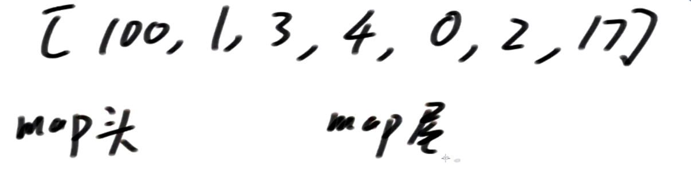 | 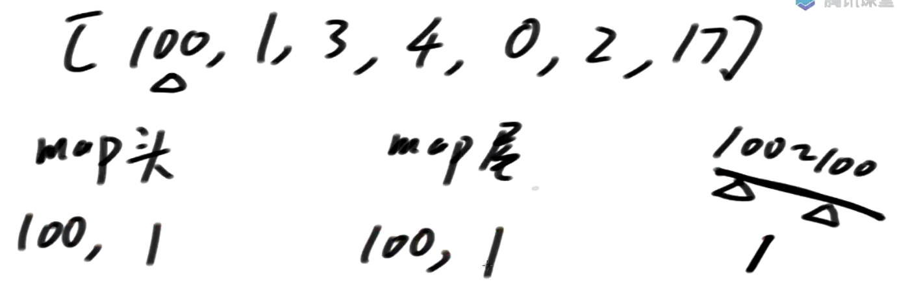 |      |
| ------------------------------------------------------------ | ------------------------------------------------------------ | ---- |

然后空降了1~1的连续区间，然后你看看能不能和之前的合并，合并就是在头表查2，在尾表里面查0，发现不行，然后继续。

继续空降3~3的连续区间。

| 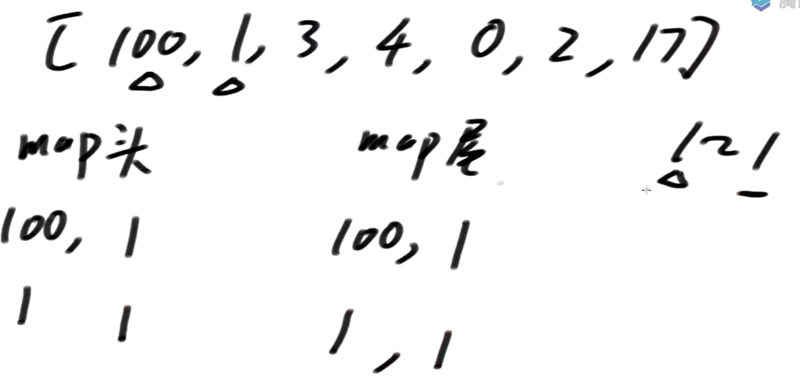 |  |      |
| ------------------------------------------------------------ | ------------------------------------------------------------ | ---- |

接下来四就热闹了。发现可以合并，该删的删，该改的改。就这样下去。最后map中value的最大值就是要返回的。

| 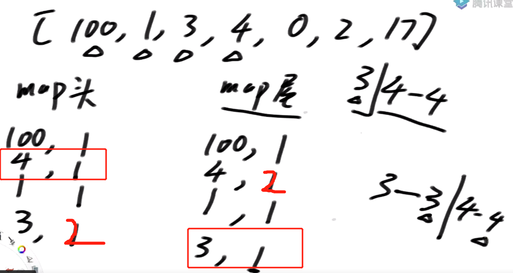 |      |      |
| ------------------------------------------------------------ | ---- | ---- |

这种做法是非常直白的最优解，装逼版本来了，就用一张表。先空降一个100，直接只加一条记录（100,1）。（key：所在的连续区间，value：长度）。我不去纠结这个100到底是开头还是结尾。那你这样做，你能更新对吗？首先，这张map表还做有一个功能，我所有的key都不删。如果我下回再遇到一个100，我看都不看它，我完全不处理它。因为我们最终想求那个连续区间有重复值跟没重复值 答案不会变。所以我遇到重复值的时候，我就直接跳过。map既然所有的key都不删，它可以帮助我做去重这件事情。

现在1也空降了，看了一下，map里面既没有0也没有2，所以就孤零零的加。3也同理。

| 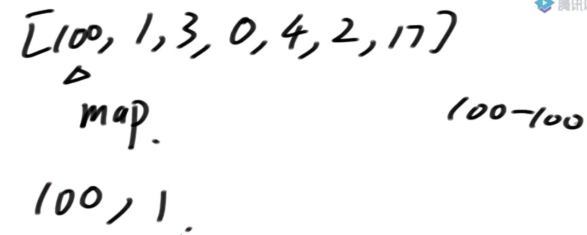 | 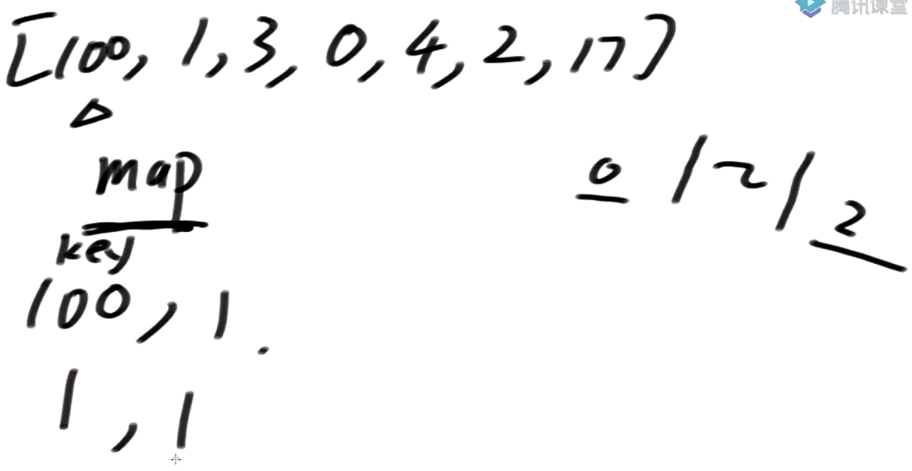 | 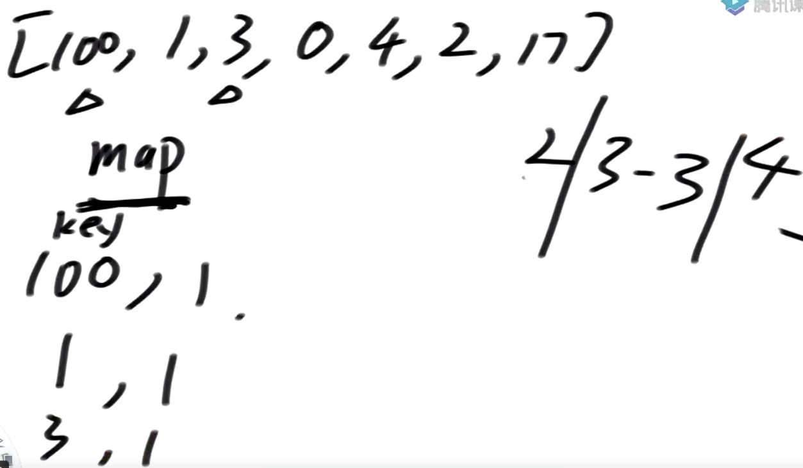 |
| ------------------------------------------------------------ | ------------------------------------------------------------ | ------------------------------------------------------------ |

然后0来了。我们为什么要处理零是因为零之前没出现过，如果零之前出现过，我们就不会处理此时的零了，你之所以能够处理此时的零说明零是刚出现的。所以你去查1的记录，如果有，它就表示开头。也就是说我这个记录的含义本身是不表示1是开头的，但此时它就是开头的意思。所以这时候我们就把0和1的value都改为2。

现在处理4，你之所以能够处理四是因为之间没出现过4，我查有没有3这个数，发现有，查出来长度是1，那就是三到三这个连续区间。这个3它虽然在map中它不表示结尾。但是你既然你空降一个四，你能处理说明之前没出现过四，既然没出现过四，你是第一个四，你去查这个三，它必表示结尾。所以3和4的value就可以改为2了。 

| 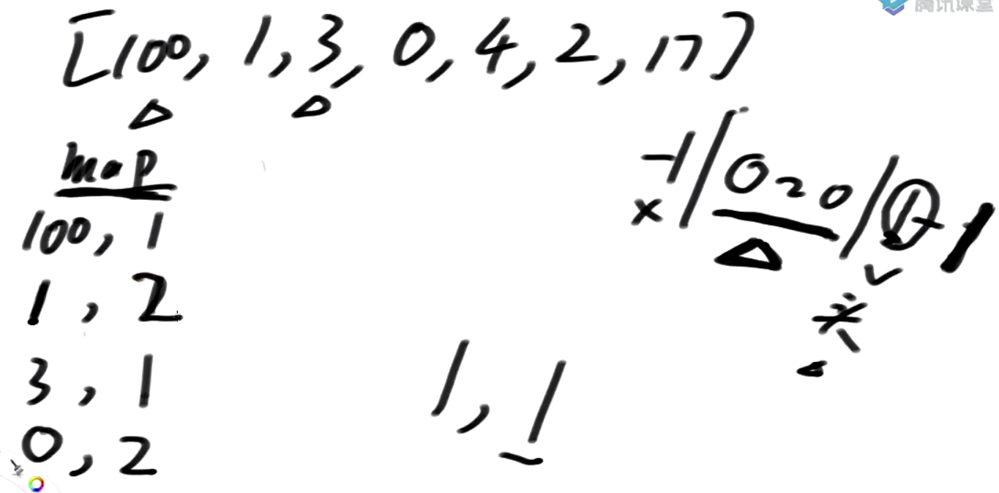 | 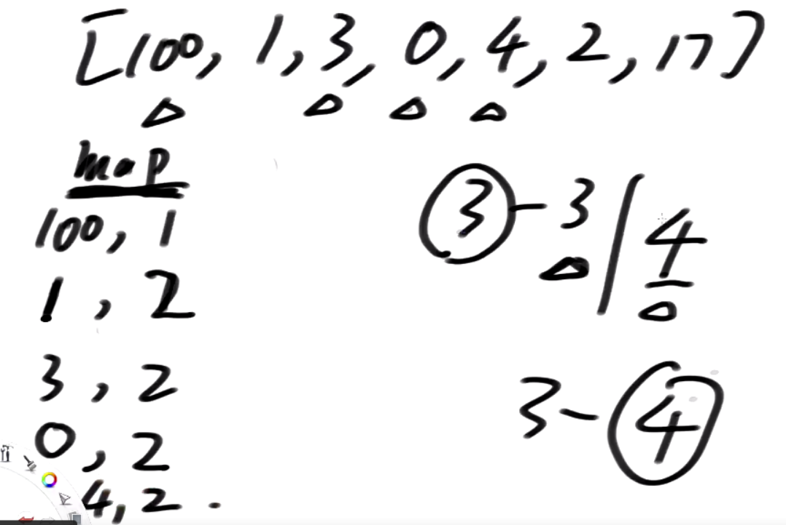 |      |
| ------------------------------------------------------------ | ------------------------------------------------------------ | ---- |

现在2来了。2之前没出现过，我查1必然是结尾，我查3必然是开头。所以就更新为2+2+1了，但是注意，我们只修改0和4这两个key的value。1,2,3这几个key我不修改，他们是脏数据，用来过滤重复值，不会影响我的解。 也就是以后再出现1~3，我只用知道它在我的map里面出现过，它的值我不关心，如果出现-1或者6，那么我本身也只需要知道0的value和5的value。

你先跟面试官说出正常版本，然后你说哎，其实我们可以讨论一下这个map可以省掉一个。然后你最后还来一句说哎，如果在工程上的话，为了防止同事产生歧义，看代码产生歧义，所以还是用两个map比较好，这个逼装的多圆润。面试官既知道你有能力，还知道你不会在工作上乱干。


### 查询o1和o2的最近公共祖先

code3：

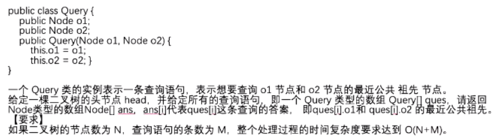

基础课讲过的那个查最低公共祖先，但是那个是只查一次，这个是批量查！ 

| 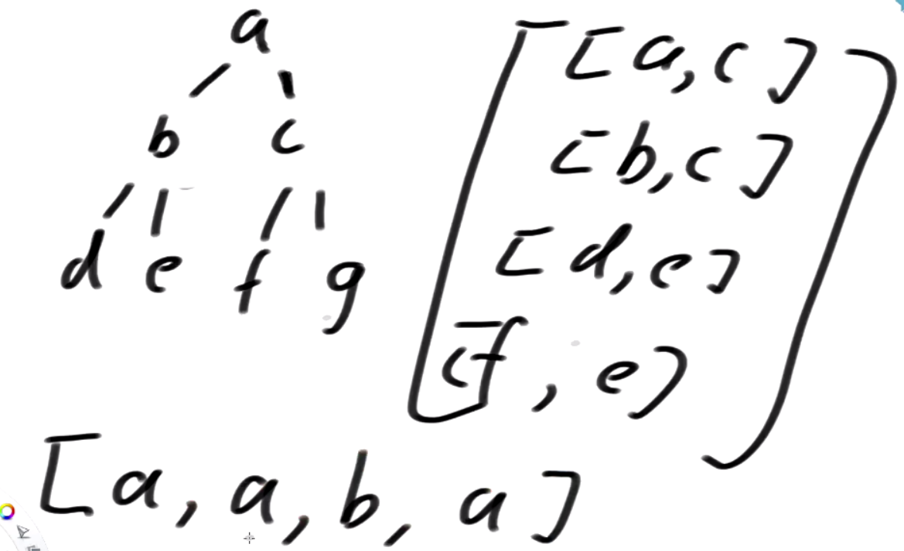 |      |      |
| ------------------------------------------------------------ | ---- | ---- |

先说一个普遍的，一个解啥呢？就是你把每一个节点，它的这个父亲节点全记录一下。这个和基础课的那个代码类似。搞一遍树的先序遍历就行了。 给你一个极端的查询要求，你又刚好是比较尴尬的形状，那么你每次都要查N次，总代价就是M * N。

| 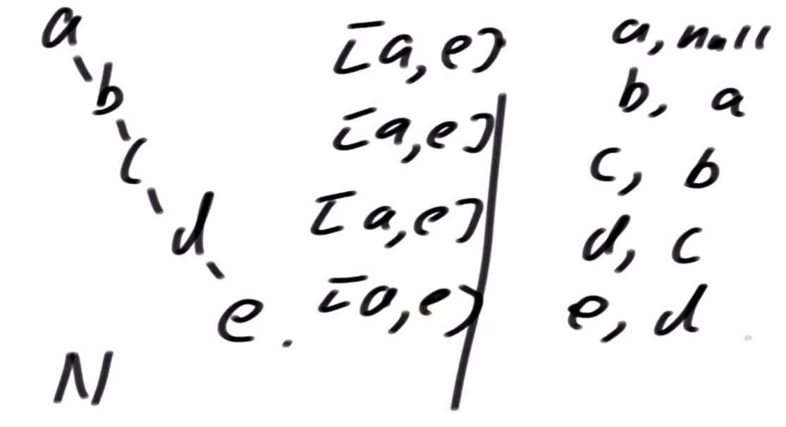 |      |      |
| ------------------------------------------------------------ | ---- | ---- |

从流程的设计上来讲。它是一个tangent算法，你们没接触过。从底层用到的东西来讲并插集，这个见过。我们要说一下，就是我们首先并查集。我们知道这个并查集它有集合代表节点的概念。我们接下来这个流程中谈的代表结点就指的是并插集的内部的这个最顶部的节点叫代表节点。然后每一个集合上面还要打上一个tag，这个tag叫父结点。你现在认为父结点跟代表结点是两回事儿，我现在还没有解释这个父结点是要干啥。但是我提的时候请你注意，我提代表节点的时候就指的并插集内部，这个集合的代表元素是啥。我提父结点不是在并查集里面的它的这个最顶部这个节点的意思。是一门一整个集合打上了某一个父结点的tag，是另外的一个属性。

然后我们看流程如何设计。查询中，我先洗数据。第一，如果是c结点跟c结点之间的最低公共组先这样的查询，直接告诉他答案。第二，如果是某个结点跟空结点之间的查询，直接告诉他答案。这种查询不值得我去遍历。那么剩下的就是实打实要查的。


| 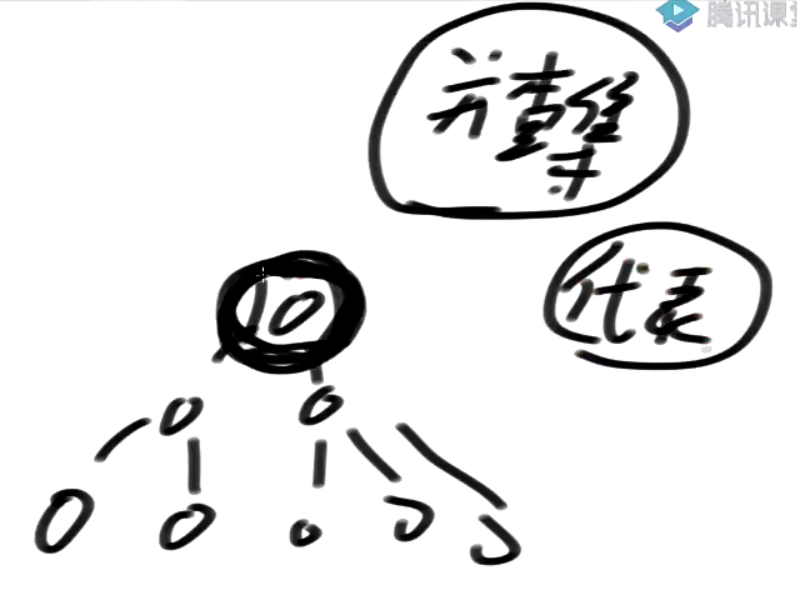 | 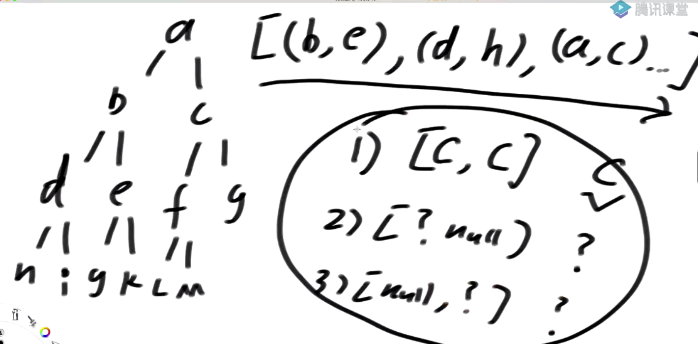 |      |
| ------------------------------------------------------------ | ------------------------------------------------------------ | ---- |

然后我生成这么几个表。这个表是为了我们将来填答案以及做查询用的两张表。第一张表叫问题表。第二张表叫填写答案表。你有一个（b，e）这样的查询，那么我这里就在问题表里，记录b和e有一个问题，e和b之间也有一个问题。因为这个查询在你查询请求中的0位置，所以在填写表中，记录关于b的第一个查询填在结果的0位置。e也是。

下面假设是b和c之间的一个查询。继续做出响应的更新。问题表就是依次往列表里面放。填写表也是根据查询的序号，依次往里面放。你遍历一遍，生成两张表。


| 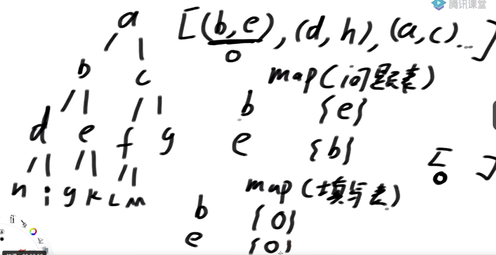 | 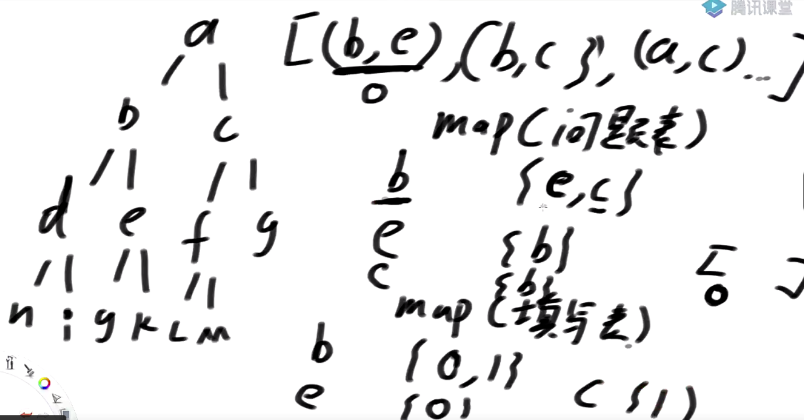 |      |
| ------------------------------------------------------------ | ------------------------------------------------------------ | ---- |

我们为什么要记两个呢？我们主逻辑想这么干，我们整体遍历的顺序就是一棵二叉树的递归遍历。那么递归便利就一定能够来到自己三次。如果我一次也没有来到的时候，比如说我来到这个a的时候，我能够查询关于a的有哪些问题。在这里假设它没有问题，任何人跟a都没有问题，a跟任何节点也没有问题。a就跳过，来到b。来到b的时候我就可以查询你b跟c和e，但问题是e跟c你还没遇到过。所以此时。我就删掉b跟e之间的问题，也删掉b跟c之间的问题。同时也删掉填写表上b的记录。我删掉是没有问题的，为啥因为我记了两个反向，b和e、c的问题可以通过c和e的记录还原回来。等到下次我遇到e的时候我就有一个机制知道b已经遍历过了，此刻b的填写滞后了，但是无所谓，因为下回你遇到e的时候，你就会发现你跟b之间有查询。并且b也遇到过，你也遇到过，这个时候你们就可以填答案了，通过e的查询表知道把答案填在零位置。就是一个问题表中两个结点，我们都遇到过，我们才填答案。这就是我们做反向的记录的原因。

你到e的时候发现b遇到过，e也遇到过，那么就可以把答案填好，填在0位置。但是c之前没有遇到过，所以删掉，在填写表也对应着删掉。那这个答案会不会错过？不会，你总有遇到c的时候。

| 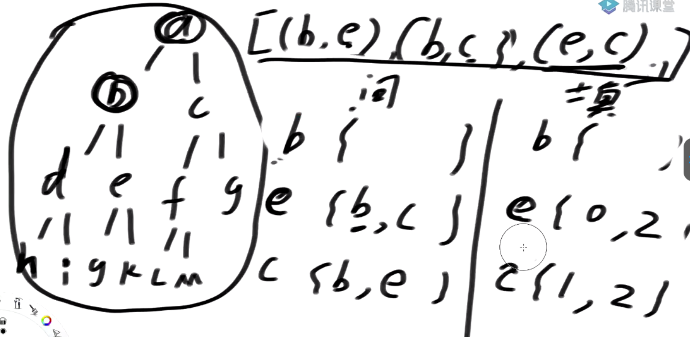 | 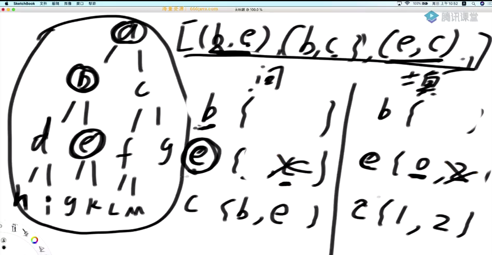 |      |
| ------------------------------------------------------------ | ------------------------------------------------------------ | ---- |

那么我们的流程就开始了。我们先简单的讲一下查问题的时候，我们用什么机制。假设我们要查一个ED之间的问题。一开始每一个点。都是单独的集合。从a开始遍历，它逻辑是这样的，去左侧递归的时候，请你把所有的结点合成一个大集合然后返回。返回的时候把a自己这个结点合并进左侧的集合里。然后打上父结点的tag是a再去查右边。在遍历到a的时候，它左侧遍历完之后是啥样？bce会合在一块。这个样子，回到你的时候，你把a也融进这个集合里去，abce彻底一个集合，然后abce这个集合统一打上一个tag叫做a这个结点。你至于abce内部谁是代表结点，我不关心。

然后我去右边遍历，当我遇到d的时候，我能够查出d跟e之间有一个问题，这个问题的答案是什么？这个问题的答案是e所在集合的tag。就是说你发现d跟e之间有有一个问题，怎么查出答案？你先查e所在的集合是啥？把代表节点查出来，这个代表节点上会打一个tag，发现是a，那么d跟e的答案就是a。

| 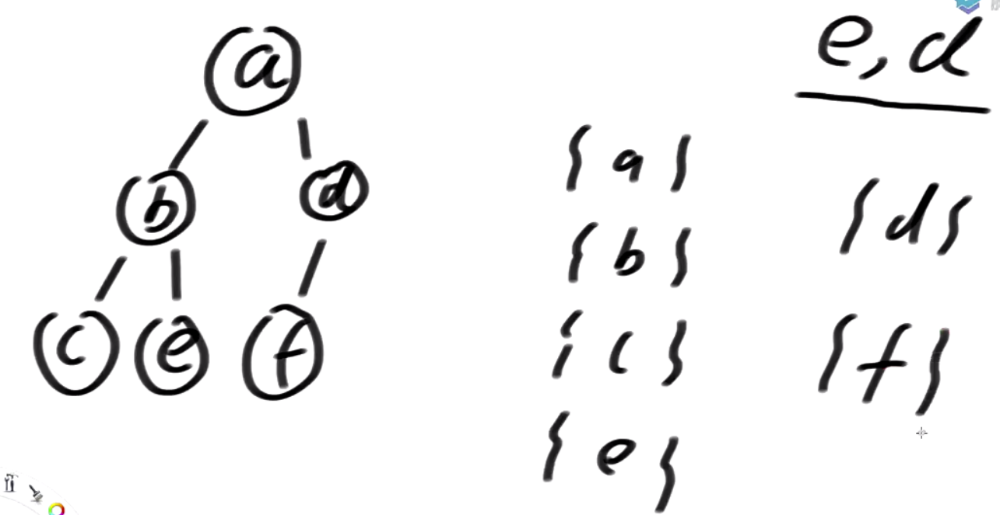 | 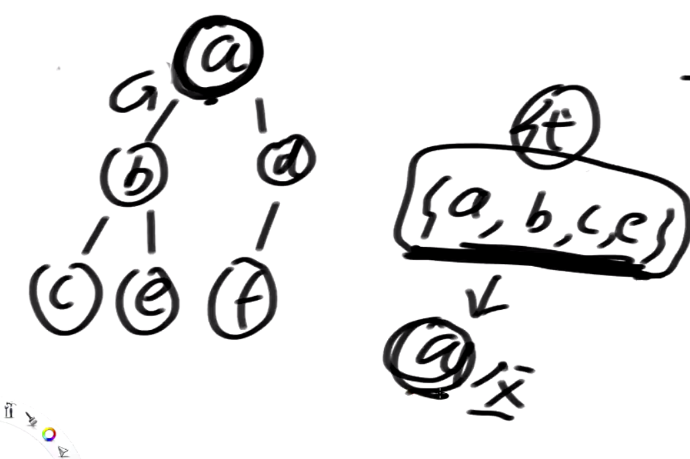 |      |
| ------------------------------------------------------------ | ------------------------------------------------------------ | ---- |

再来一个例子，假设查询e和f的答案。你遍历到c之前afks已经遍历过了，他们是一个集合，tag是a。你来到c的时候。左边遍历一下，回来，ce也合成一块，tag是c。遇到f的时候，你一看f和e是有问题的，通过表知道e也变量过了，那么此时就生成答案，答案就是e所在集合的代表结点打上的tag c，然后你通过填写表，把答案填到相应的位置。

所以粗略上来说就是x左树遍历完之后，把左树的集合跟自己合在一块，打上x的tag。右树遍历完之后，在第三次回到x的时候，把自己x所在的集合和这个右树所在集合彻底合在一起，打上x的tag。

打tag的顺序是这样的。查问题的时候，第二次遇到的节点和第一次遇到的节点之间怎么查答案，第一次遇到的结点所在的tag就是你们的答案。下图，2,1这个问题现在遇到了，发现1之前已经遇到过了，你么1所在集合的tag就是答案。

| 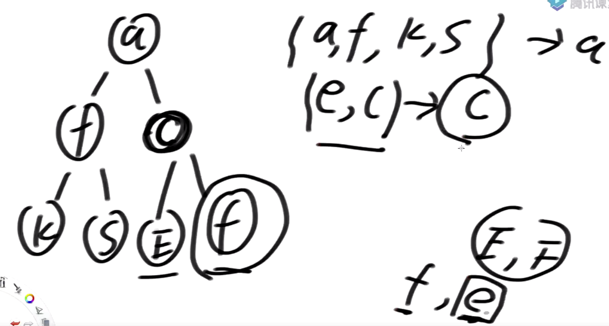 | 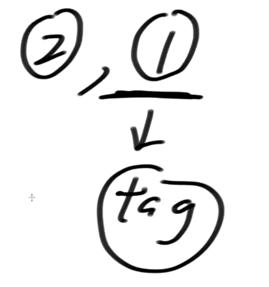 |      |
| ------------------------------------------------------------ | ------------------------------------------------------------ | ---- |

看例子。一开始所有集合都是空都打都没tag。所以你可以把怎么样叫遍历过，怎么样叫没遍历过，你就可以用这个东西来标记了，如果一个结点，它所在的集合没tag。这个节点没遍历过。如果一个结点，它所在的集合有tag，这个结点遍历过。然后你就开始遍历，a，b都没问题，依次往下，到e的时候，发现有两个问题，然后你就知道f和c之前没遍历过，因为f和c所在集合没有tag。此时e就可以打上tag了，tag就是e自己。

| 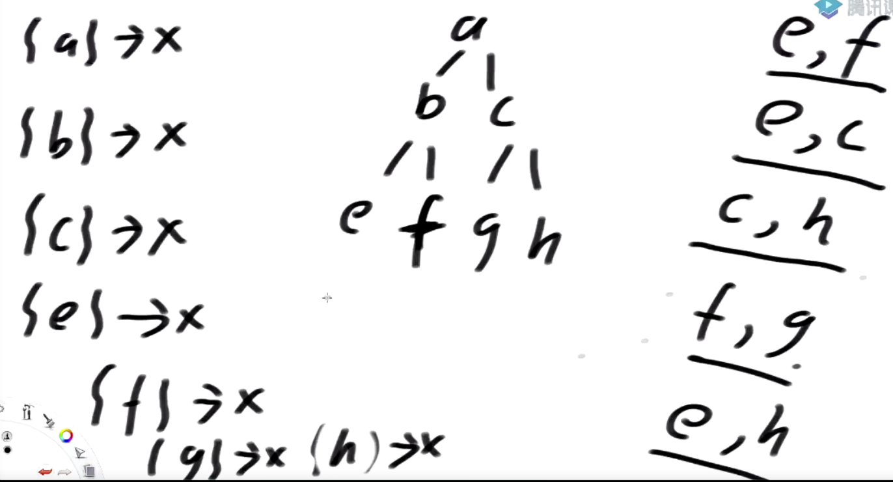 | 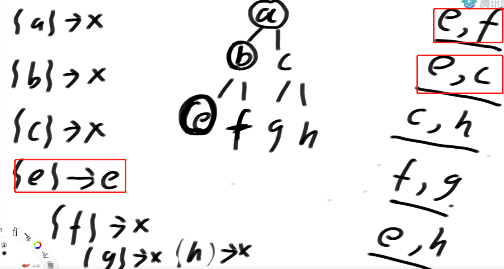 |      |
| ------------------------------------------------------------ | ------------------------------------------------------------ | ---- |

开始往上回，来到b。把b所在的集合跟e所在的集合合在一块并且打上b的tag。所以现在be合在一起了，tag是b。然后接下来来到f。f干件什么事，把自己所在的集合打成自己。开始查问题，发现f和e之间，并且e已经遍历过了，因为e所在集合有tag。所以e和f的答案就是e所在集合的tag，所以答案是b，这个答案就可以结算了。f和g还有问题，但是g没有遍历过，因为g集合没有tag。所以先滞后这个问题，等到轮到g的时候再去解答，然后f就返回了。f就返回到了b，b所在的集合跟f所在的集合合并而且打上自己的tag b。

| 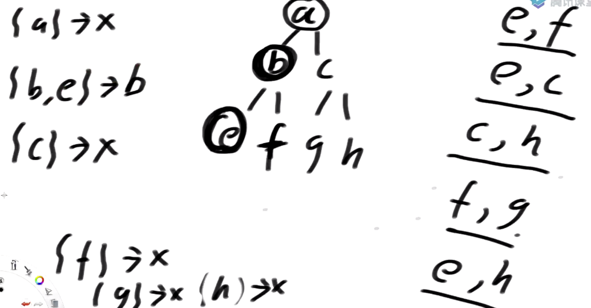 | 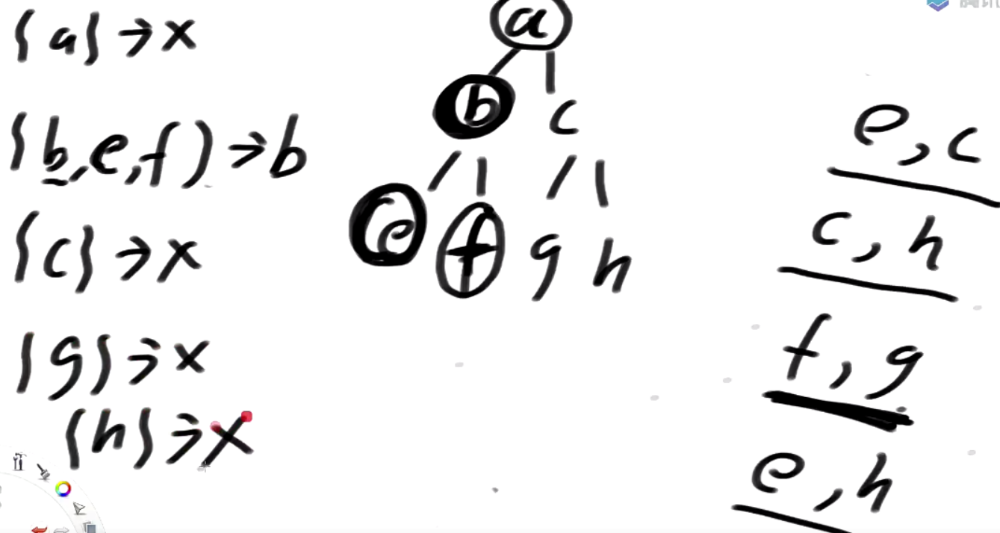 |      |
| ------------------------------------------------------------ | ------------------------------------------------------------ | ---- |

往上返回来到a，然后就把左树b所在集合和a所在集合合并，打上a的tag。往右边便利，来到c的时候，查发现c和h、e有问题。h没遍历过，滞后。但是e已经遍历过了，所以结算e和c，答案就是e集合的tag a。

来到g的时候，发现有一个f和g的问题，f遍历过，所以答案是f所在集合代表结点的tag a。要走之前，g所在集合tag打上自己。

| 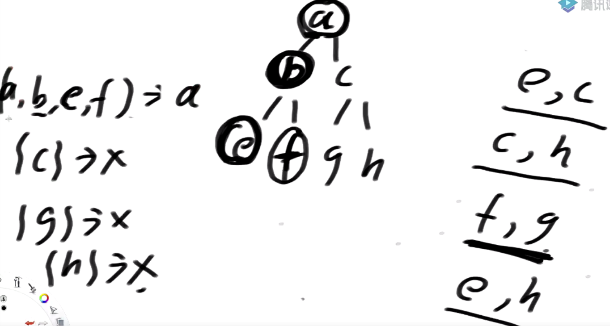 | 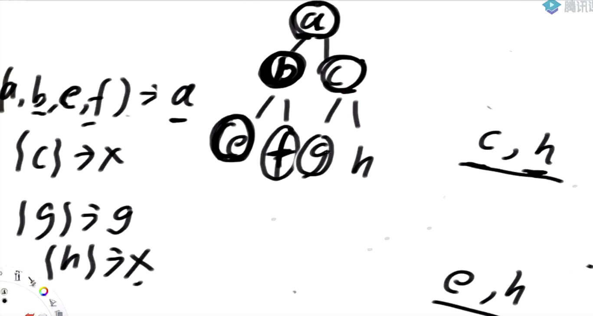 |      |
| ------------------------------------------------------------ | ------------------------------------------------------------ | ---- |

回到c的时候合并，gc打上tag c。接着来到h，c和e都遍历过，c所在集合tag是c。e所在集合tag是a。结算答案，至此搞定所有。

| 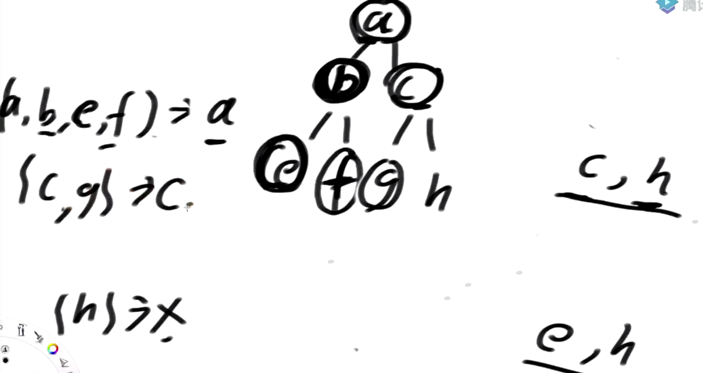 | 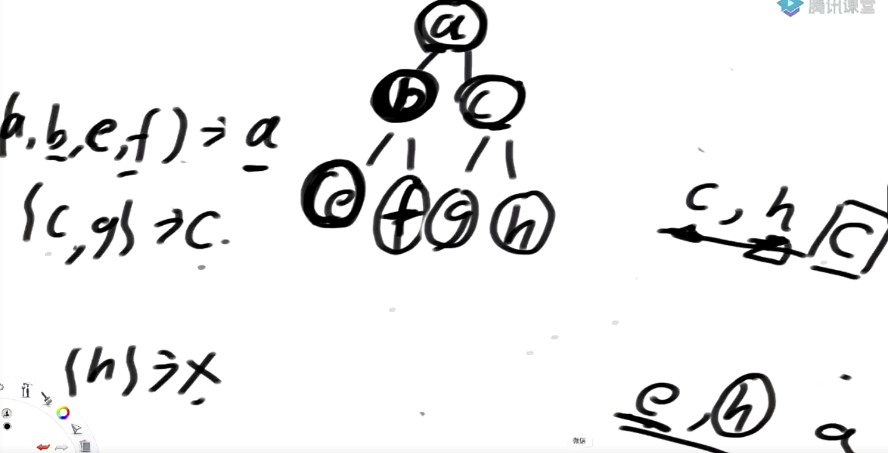 |      |
| ------------------------------------------------------------ | ------------------------------------------------------------ | ---- |

我就是从祖先往下才遇到你的，所以我不会弄错。例如下面的f和g。我一定是c弄完之后才会和f和g合并的往b走的，所以我tag不会变成b，此时的tag就是离你最近的。因为tag就是一直插到底，然后往上走的，一定会达到最低公共祖先的位置。

其实到第二个点的时候，第一个点到过的最高点就是答案，我们这个算法就是在模拟这个最高点到哪这件事。

| 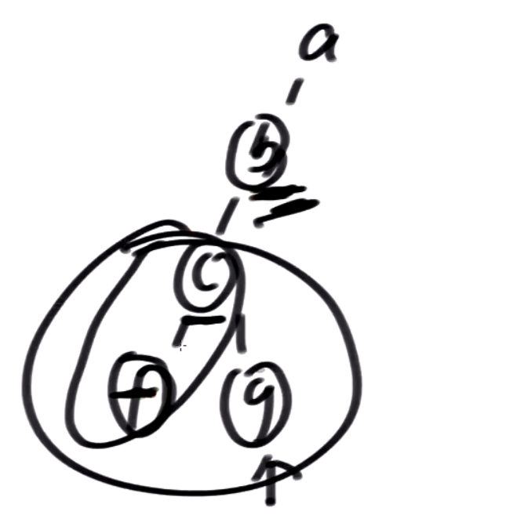 |      |      |
| ------------------------------------------------------------ | ---- | ---- |

coding：集合打tag等价于代表结点存一个记录。并查集中所有的元素，他都是他怎么拿自己的tag，他不是说直接拿的，他是往上走到自己的代表节点，然后再看看自己代表节点上打了什么tag。

它这整体就是一次后序遍历。所以代价就是O(N)。问题的数量如果是m的话，最多就搞m个问题，都是在遍历这一遍的过程中搞的。所以总复杂度n+m。


### 全是1的最大子矩阵

常考

code4：

- 给定一个二维数组matrix，其中的值不是0就是1，其中，内部全是1的所有子矩阵中，含有最多1的子矩阵中，含有几个1?

前面有一个正方形的，这道题是长方形。

我们先看一个算法原型。求直方图的最大矩形面积。leetcode85题。就是单调栈，求每个数两边离自己最近的比自己小的。言外之意，中间的就是都是大于等于自己的，那么就可以构成一个长方形。

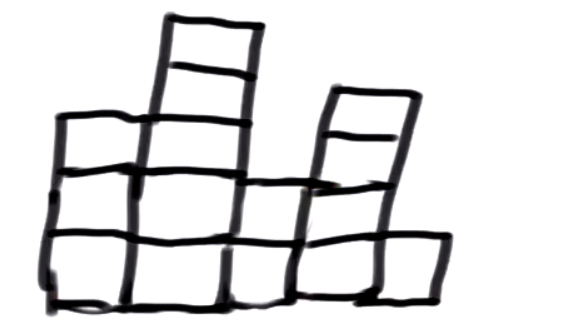

那么这题中，就是列举matrix每一行作为直方图的底就能做出来。复杂度O(N * M）。


## Interview Coding 22

训练营5，第6节


### 移除盒子

leetcode546

code1：

```题目
给出一些不同颜色的盒子 boxes ，盒子的颜色由不同的正数表示。

你将经过若干轮操作去去掉盒子，直到所有的盒子都去掉为止。每一轮你可以移除具有相同颜色的连续 k 个盒子（k >= 1），这样一轮之后你将得到 k * k 个积分。

返回 你能获得的最大积分和 。

示例 1：

输入：boxes = [1,3,2,2,2,3,4,3,1]
输出：23
解释：
[1, 3, 2, 2, 2, 3, 4, 3, 1] 
----> [1, 3, 3, 4, 3, 1] (3*3=9 分) 
----> [1, 3, 3, 3, 1] (1*1=1 分) 
----> [1, 1] (3*3=9 分) 
----> [] (2*2=4 分)
```

怎么设计递归函数呢？你一开始可能想到f(L,R)表示L~R范围上消掉的最大得分是多少。但是你会发现。像1122211这样的样例，你决定把222消掉了，后面会变成11xxx11，这样其实是不对的。这几个1应该视为连起来。这样的话你的arr就不是固定的了，你需要改变arr的值，而可变参数突破整型是我们的大忌！我一定要找出一种设计，让我的可变参数还是整形。

所以我们递归就设计成这个`int f(arr,L,R,K)`，三个可变参数，意思是我在L~R这个范围上，还有k个东西和L这个位置的东西一样。就是我这个范围上，我前面跟着k个a的情况下，请问这一坨东西都消掉得分是多少？

举个例子，主函数这么调。我最大的目标是在零到七范围上都消掉，那我前面跟了几个一呢？零个，所以如果我的递归含义真的能尝试出来的话。主函数就应该调它把值返回就可以了。

我们递归含义定了，那你到底想怎么展开可能性呢？展开可能性的同时，你也得维持原来的递归含义。我们递归含义只告诉我们前面的k个是和L位置相同的，别的我不知道。所以f(L,R,K),第一种可能性展开就是f(L,L,K)+f(L+1,R,0 )，意思就是我这个L位置的东西决定和前面的东西一起消掉。这样一来消掉之后，后面的范围就没有包袱了，所以k清空。这里有一个贪心，如果你前面有一坨1，然后你L后面还有和L位置一样的，那么你肯定把连着的一起消掉增长的快。但是跨着的就不一定一起消了，也就是222右边的11不一定一起消。

| 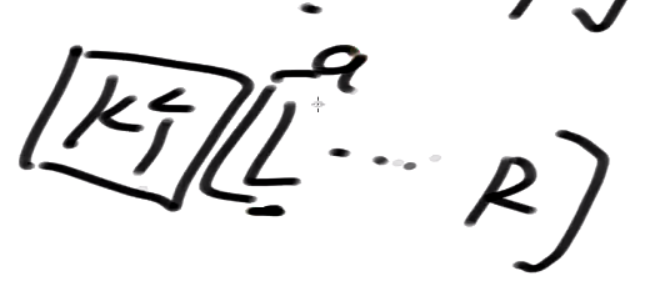 | 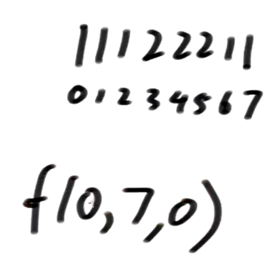 | 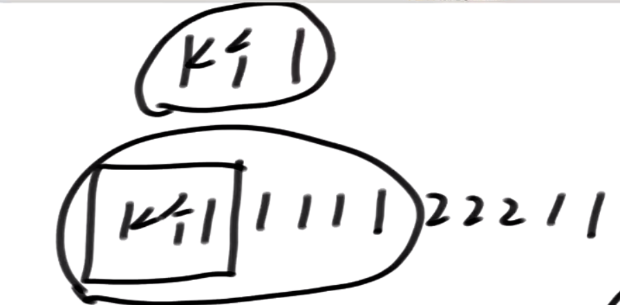 |
| ------------------------------------------------------------ | ------------------------------------------------------------ | ------------------------------------------------------------ |

重新列一下可能性。由于贪心，有一种可能性肯定是我前面的k个1和后面的11111一起消掉。这个得分假设叫a，位置假设x，那么第一种可能性如下，a+f（x，r，0），消掉就意味着包袱清空了

但是我也可以不清空我的包袱，我要把我的包袱变大，和222后面的111一起消掉，所以当务之急就是把222消掉？222怎么消？调用递归即可。这也一来，前面的包袱就累加到后面的111里面了。所以调用，f（x，y，0）+f（y+1，r，k+5），包袱变大！

我还想让包袱变得更大怎么办？那继续递归。一直这样尝试，直到后面的1都被你搞完了。

| 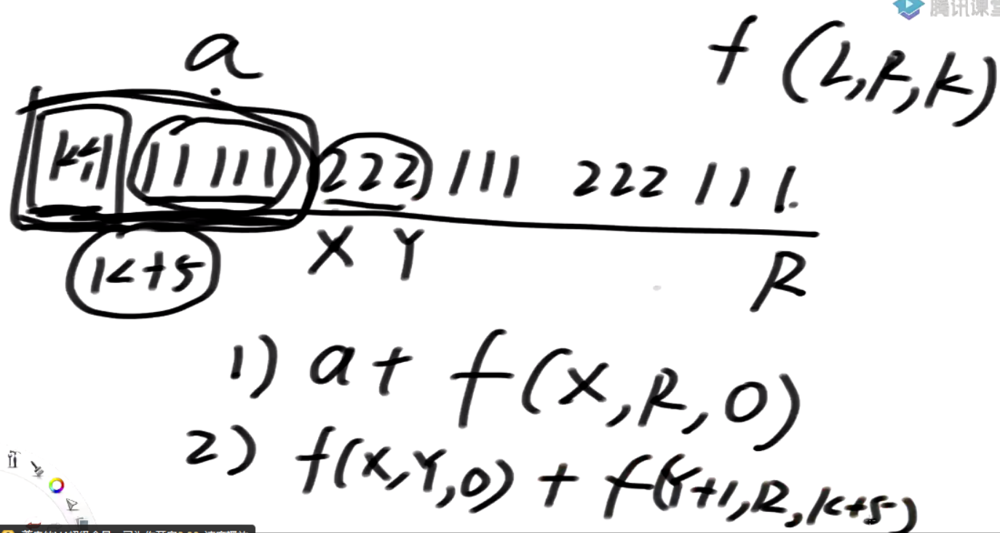 |      |      |
| ------------------------------------------------------------ | ---- | ---- |

这种试法我们来说一下，它完全就是根据我们这个原则给硬憋出来的。它牵扯到一个外部信息变简单化的过程，这个说实话，这种题都很难。你我们一开始说了，如果你整个在array上直接去修改的话，你的外部信息就没有办法变简单化，它就会变成一个很复杂的可变参数array本身。所以说我们就把L~R需要的信息给它放到外面去，变成一个简单的参数。它完全就是根据我们这个原则。想想尽办法补充潜台词，然后给硬憋出来的设计L、R、K都不超过整形的这样一种憋法。

### 奇怪的打印机

lc664

code2：

```
有台奇怪的打印机有以下两个特殊要求：
    -打印机每次只能打印由 同一个字符 组成的序列。
    -每次可以在从起始到结束的任意位置打印新字符，并且会覆盖掉原来已有的字符。
    
给你一个字符串 s ，你的任务是计算这个打印机打印它需要的最少打印次数。
 
示例 1：
输入：s = "aaabbb"
输出：2
解释：首先打印 "aaa" 然后打印 "bbb"。

示例 2：
输入：s = "aba"
输出：2
解释：首先打印 "aaa" 然后在第二个位置打印 "b" 覆盖掉原来的字符 'a'。
```

f（L，R）意思是你的L~R范围上要变成s[L...R]至少需要几转，主函数就是f（0，N-1）。范围上的尝试不难，想含义也不难定，关键就是可能性怎么列？还是先需要建立一些贪心。如果我就解决l到r上的问题，边缘处是啥情况？第一个贪心是，第一次如果我强行要求第一转的时候就把边缘的这个数弄出来，以后再也不改了，如果把策略定成这个，不会影响最后的最优转数。最优转法可能不止一种，但即便我们规定了边缘处的是第一次转出来，而且以后再也不改了，它也不会影响到最优解。

想法是你一个一个去枚举，潜台词是第一转全部都变成L位置，枚举每一个范围f（L，L+k）+f（L+k+1，R），如果s[L]==s[L+k+1]的话，最后需要减-1，因为开头这个位置在之前帮你做了。不要考虑会跨区间的问题，这个递归就是让左边帮你搞定，右边也帮你搞定，然后你再看看加工的时候要不要-1。

当大家遇到一道题目，可能性过多，你发现你守不出来一个整型的参数的时候，你发现你设计不出这个参数列表的时候，你可以从业务本身去挖掘它的一些贪心的东西。


### 最小区间

在有序表那里讲过

leetcode632

code3：

```
你有 k 个 非递减排列 的整数列表。找到一个 最小 区间，使得 k 个列表中的每个列表至少有一个数包含在其中。
我们定义如果 b-a < d-c 或者在 b-a == d-c 时 a < c，则区间 [a,b] 比 [c,d] 小。

示例 1：
输入：nums = [[4,10,15,24,26], [0,9,12,20], [5,18,22,30]]
输出：[20,24]
解释： 
列表 1：[4, 10, 15, 24, 26]，24 在区间 [20,24] 中。
列表 2：[0, 9, 12, 20]，20 在区间 [20,24] 中。
列表 3：[5, 18, 22, 30]，22 在区间 [20,24] 中。
```

那这个题其实它有可能有多个解。如果有如果这个最窄区间不止一个，你选那个开始的位置最小的。你建个有序表，放的数字从小到大组织。先把每个数组第一个数放进来。然后你在有序表中把最小值跟最大值拿到得到一个区间，那么，毫无疑问，这个区间一定是每一个数组中至少有一个数包含在里面的。一共多少个数你记录一下。然后最小值-9弹出，并且我有机制来知道-9来自哪，来自哪你就从拿再拿一个数放进来，所以拿了6放进来。然后再得到最大和最小，这次还是11个数，之前的开始位置-9比现在的-4早，所以我要之前的区间。

| 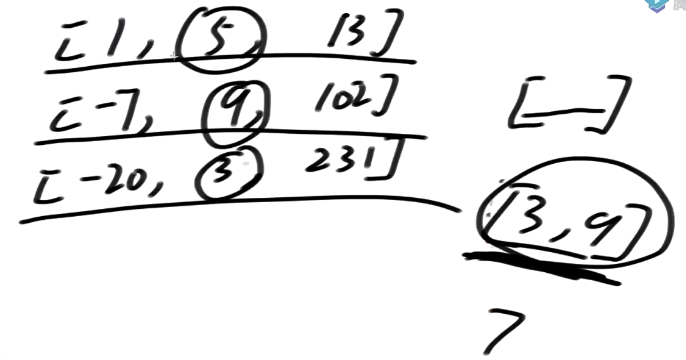 | 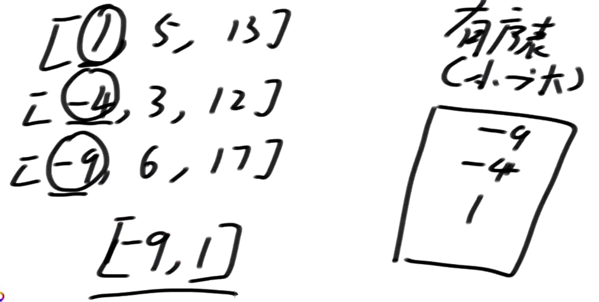 | 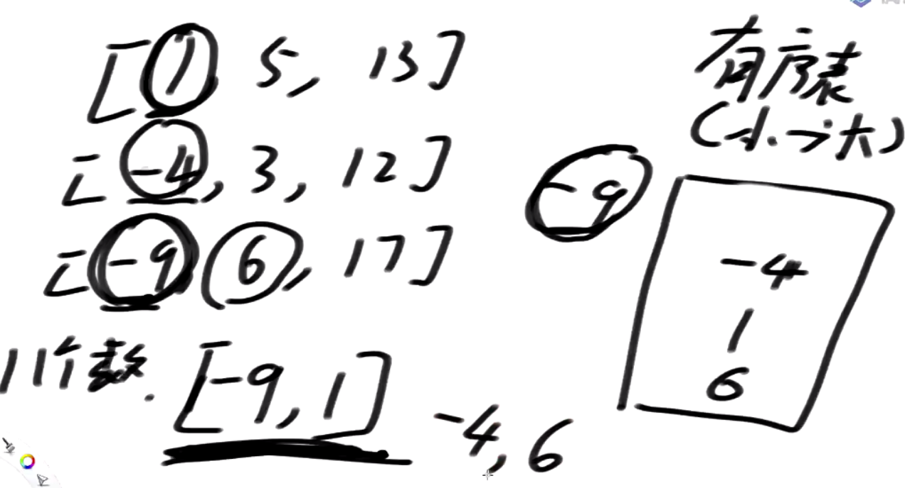 |
| ------------------------------------------------------------ | ------------------------------------------------------------ | ------------------------------------------------------------ |

再把-4弹出来，3进去。这次又得到一个新的区间，6个数，比之前窄，更新区间。依次类推你能找到所有的答案。本质上我们在枚举区间以每一个数字开头的答案是什么。这里有一个贪心，我区间的开始和结尾没有必要包含数组没有出现过的数。

| 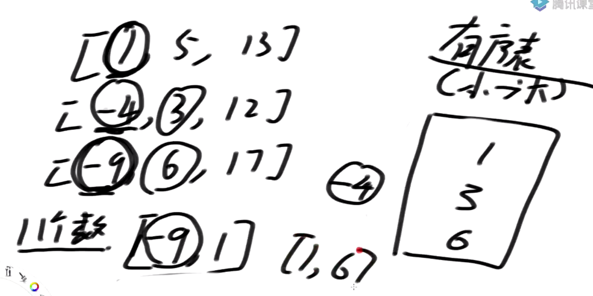 |      |      |
| ------------------------------------------------------------ | ---- | ---- |

### 丢失数字

code4:

这种这个题，它出来是有功能的。不是给这个普通学生做的。它是为了在有一有一些别的功能的。筛出一些聪明人。

- 整型数组arr长度为n(3 <= n <= 10^4)，最初每个数字是<=200的正数且满足如下条件
  1. 对0位置的要求：arr[0] <= arr[1]
  2. 对n-1位置的要求：arr[n-1] <= arr[n-2]
  3. 对中间i位置的要求：arr[i] <= max(arr[i-1]，arr[i+1])
  
  但是在arr有些数字丢失了，比如k位置的数字之前是正数，丢失之后k位置的数字为0请你根据上述条件，计算可能有多少种不同的arr可以满足以上条件
  比如 [6,0,9] 只有还原成 [6,9,9]满足全部三个条件，所以返回1种。


它的麻烦点在于一个位置可能是跟它左边跟右边共同有关系。猜法：f（v，i，s）。i代表我现在来到了i位置，i位置的数字是v，s代表右边的数和当前数的关系，s==0代表右边大，s==1代表相等，s==2代表右边小。f就是在这情况下，0~i有几种有效的变法。主函数如下。最右侧不是丢失的数字0，因为右边没有数了，要让右边对你没有影响，所以传2。如果最右边数0，也就是一个丢掉的数字，你就把N-1位置变为1~200，去枚举。

这个v是我意想的。不是arr中真的是v。能不能递归下去你要去验证。

这个题跟我们remove box那个问题都很难猜，它的难点在于什么，你自己猜的时候，你发现你怎么都要改变一下array的值，千万别，还是那句话，不能让可变参数突破到整形以上。这样的话，你就得想尽办法绞尽脑汁把这种变化给它搞出一个外部信息，而且是简单参数能代表的。

coding你可以先去想象然后再去递归里面验证，你页可以调用的时候就先看看它能不能让你想象。这题有枚举，我们改成经典的动态规划去看看能不能省掉枚举。

| 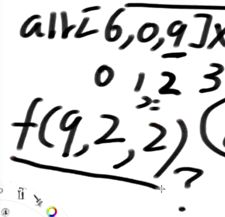 | 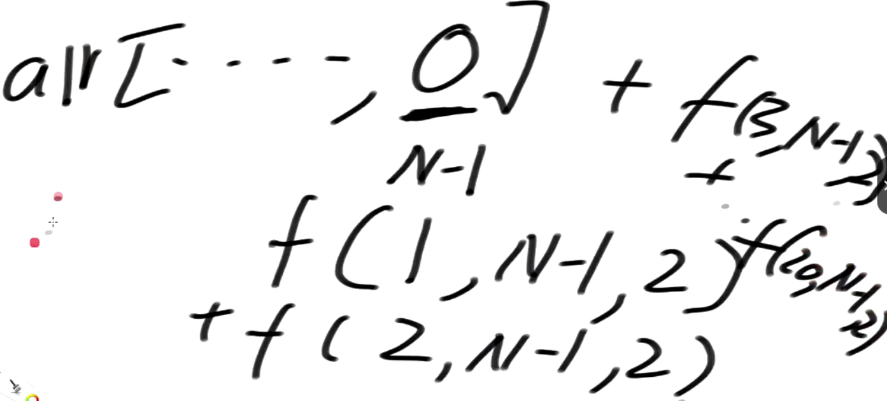 |      |
| ------------------------------------------------------------ | ------------------------------------------------------------ | ---- |

你会发现，只有中间这一坨在枚举，而且是累加和的关系，那么我就想，我如果有dp[i-1] [xx] [0/1/2]的前缀和就好了！所以我们的优化就来了。

| 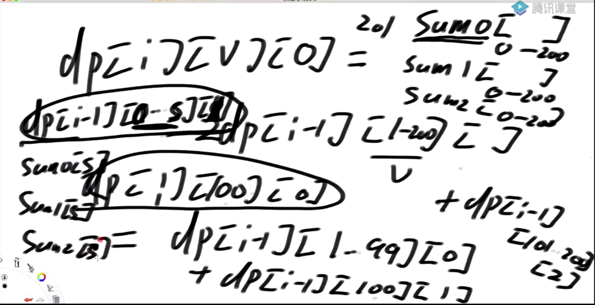 |      |      |
| ------------------------------------------------------------ | ---- | ---- |


## Interview Coding 23

训练营5，第7节

我们现在都不知道说一个np问题，能不能转化成一个p问题，这个都不知道。那如果一个p类的高阶问题，能不能转化成一个p类的低阶问题，更不知道了。


### TSP问题

code1：

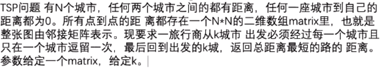

它这个图是一个全连接图。也就是说比如我给你0~4这五座城市，这个图是个全连接的，任意两个点之间都有距离。有向图2->3距离不一定等于3->2，但是这里我们认为是无向图，也就是2->3距离等于3->2距离。tsp问题本身是无效图，有效图都能解，那么这里面我先简单的理解为无向图。你这样一来的话，你这张表里面所有的值假设都没有正无穷，那么它就是一个全连接图。

既然是全连接图，就有一个问题了。我假设我某一个邮差，我这是零座城市，一座城市，二座城市，三座城市，四座城市。我某一个小人。我想做的工作是什么？我从一个点出发。比如说我从一出发。我想最终我从一出去，我想最终回来。沿途的每一个城市都必须经过一遍，而且只能经过一遍，最后回到一。请问这个过程中我选哪条路能够让总距离最短？这就是TSP问题。首先我们来看。TSP问题有一个特征，就是你不管从哪个城市出发，最终回到哪个城市。最短的总距离是一样的。也就是你，不管是你从从零出发，最终回到零，还是从一出发，最终回到一，还是从二出发，最终回到二，还是从三出发，最终回到三。还是从四出发，最终回到四，这个总距离的值是一定是一样的。因为你整个最优的这个这个路，它是一个环。也就是说tsp问题是不用指定从哪出发的。它不管指定从哪儿出发，它的最优总距离转一圈儿回来都是一样的。

这里面尝试怎么写？我们这样来想这件事情。假设我有个递归函数。那么，这个第一个参数呢？是一个集合。第二个参数呢，是假设它是某一个出发点。这个出发点一定是属于这个集合里面的某个点。返回的是，我有一个规定好的原出发点。这个是一个外部信息，跟f没关系，这个函数指的是通过这个出发点，把这里面集合，所有东西都连通之后，最终回到原出发点，请问最优的总距离是多少？

举个例子。假设我们有五座城市，我们规定从谁出发最终回到谁都行，我们就可以规定零，也可以规定一，也可以规定二，哪个都能规定，那么就选一个。假设原出发点，它就是零。那么我们主函数怎么调？就这样调-p2。这个函数指的是。你在这个集合里面有零一二三四，这五座城。我指定好了你要从零出发。最终，请你把通过零城市，通过一城市，通过二城市，通过三城市，并且通过四城市之后。再回到原来的点零，请问这个过程中最优距离是多少？

我现在已经来到零这个点了。我有几种选择。第一种选择。我就想从零直接去一。那你子函数是什么？--图3。在这个集合中，一二三四这个集合中，我是从一出发的。我一定要经过一经过二经过三经过四沿途节点，只经过一次之后，最终回到零点，最小距离是多少？这个距离我求出来，我只要再加上零到一的距离，就是总距离。回去的点永远是固定的，当做是一个潜台词

| 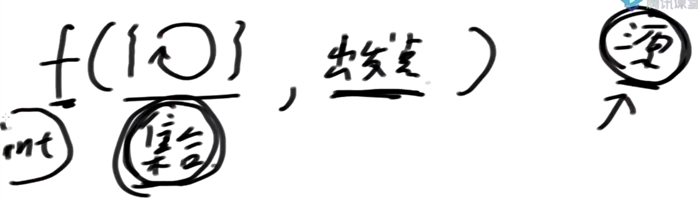 | 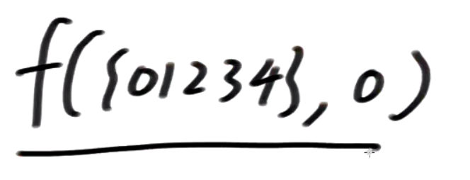 |  |
| ------------------------------------------------------------ | ------------------------------------------------------------ | ------------------------------------------------------------ |

那我还能怎么选？零这个点我就想让它直接去二，那么继续调子过程。请你去从二位置出发，最终。经过一。。。经过四之后回去的总距离最好是多少？如果我把这个总距离求出来，再加上零到二的距离就主问题的解。第三个分支就是我零到三。下个分支就是我零到四。只有这么四条路。我把每一个子问题都列出来，那你说最好的是啥？那就是几个子问题补上相应的一段距离，那个好选哪个。

你会发现base case这里是你人为规定回到0，所以最终所有会串起来。

|  | 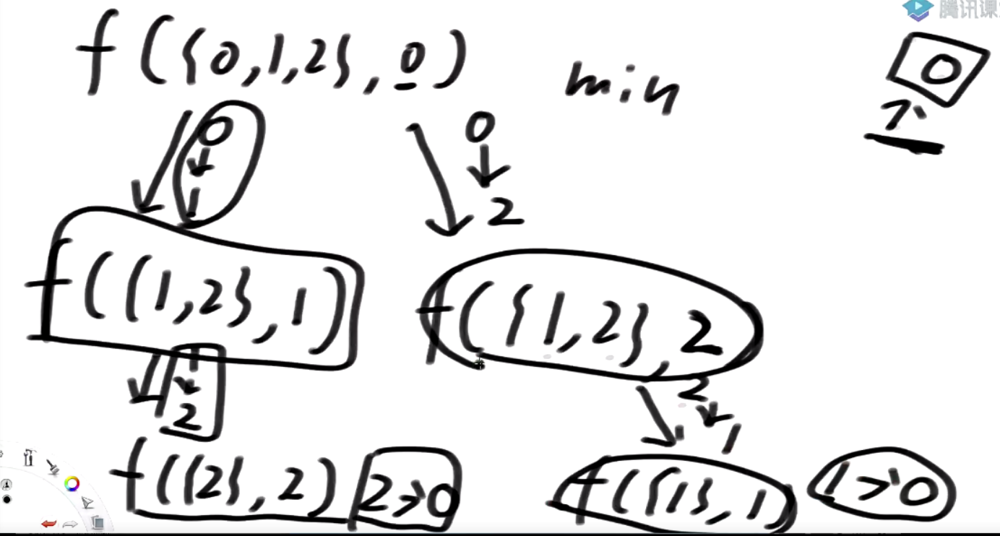 |      |
| ------------------------------------------------------------ | ------------------------------------------------------------ | ---- |

我们先了解一个问题。就是说你。你两个可变参数，你会不会撞到重复解？有的。既然它有重复解。既然它有重复解，就势必。存在某种形式的动态规划，不让它重复计算。但是怎么确定集合是一样的呢？我们这个递归函数是f函数，它是集合的概念。它可变参数是个集合，对不对？它第二个参数是个整数，这个好说。如果你第一个可变参数，它是一个集合概念的话，它就很复杂了。这也就相当于违反了我们猜递归猜动态规划的那个原则，不要让你单一的可变参数突破到整形以上。因为你如果突破到了整形以上，就意味着这个单独参数的可能性非常的多。所以tsp问题可以说是我们面试中遇到动态规划的一个异类，它叫状态压缩的动态规划。什么叫状态压缩的动态规划，就指的是我无论怎么样尝试，我这个集合都没有办法化成更简的形式了。事实上，这种尝试就是世界上tsp问题的最优解。

我们说我们刚才怎么表示集合的？零位置是空表示不存在，一位置是一表示存在，二位置是空表示不存在，三位置是一表示存在，四位置是一表示存在。你能不能用位信息代替啊？位信息可不可以再给它搞成一个整数？也就是说，我们这个f函数可以设计成两个整形的东西。但是这个整数我不是用它的值来表示可能性的，我是用它每个位的状态来表示可能性的。这样一个整数的位状态就可以替代一个列表形式，存在跟不存在的样子。所以叫状态压缩。所以我们的暴力递归还可以改写一版。

| 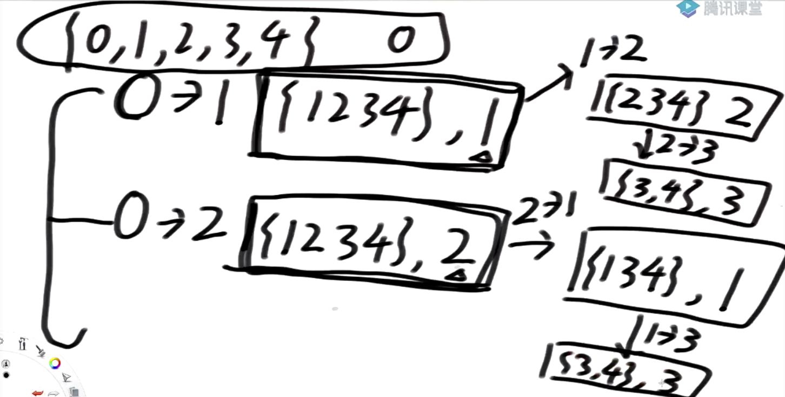 | 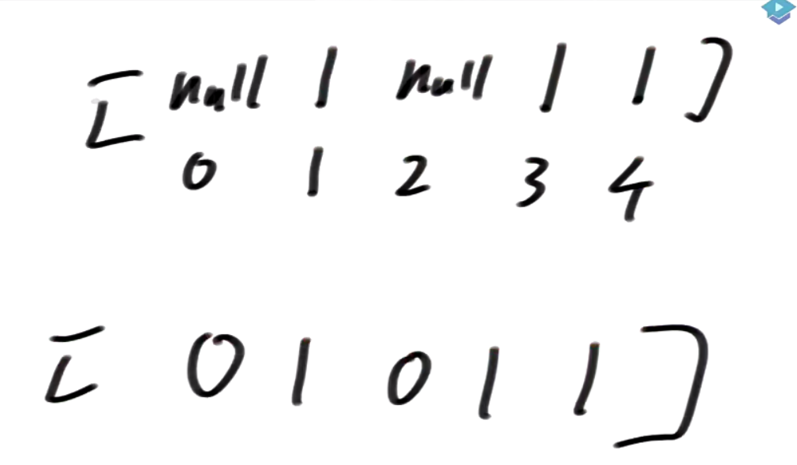 |      |
| ------------------------------------------------------------ | ------------------------------------------------------------ | ---- |

搞完之后，就是两个可变参数int了，直接记忆化搜索。

```
位运算怎么得到最右边的城市？
status&(~status+1)，与上自己的补码就可以得到右边的1

如何把第i座城市去掉？城市从0开始编号
status&(~(1<<i))
  10110011
& 11101111     <=> ~(1<<4)= ~(00010000) = 11101111
= 10100011

如何把第i做城市加回来？
status|(1<<i)

如何检查第i座城市在不在？
status&(1<<i) != 0 ，不为0说明在，否则就是不在
```

记忆化搜索完了，你也别给我弄说明记忆化搜索了，你严格位置依赖，能不能把表给我填好直接返回？先分析一下它这个状态怎么依赖的来看？假设我有五座城。f函数的第一个参数做了行对应，也就是状态做了行对应，出发城市做了列对应。所以第一个状态就是全零的状态。请问全零的状态怎么填？0这座出发城市都不在，所以全零的第一行无意义。第二行，00001呢？因为只有第0位是1，所以只有0这座城市出发才有意义，其它都无意义。 并且只有零这座城市，它最终回到自己，所以值为0。再下来是00010，还是一样，只有从1城市出发才有意义，并且它只有一座城市，所以填从1到0的距离。接下来是00011，2~4城市格子无意义。00011依赖（00001,1）以及（00010,0），这两个上面都有。

所以它精髓的地方就在于我们通过状态依次加一所得到的所有状态，在求具体一个状态的时候，上边的状态我们都已经求过了，你依赖的任何一行在顶上的状态我们都有。为什么让状态加1，你需要依赖的东西我上面都有？因为你去除某一个城市的时候，一定是让status变小的！一定不会变大！！

复杂度如下。是目前世界上最优解。很多的经典的一些新的算法流派也会去算tsp问题，但它不是奔着最优解去的，它奔的是一个还不差的优良解去的。如果要最优解，这个复杂度就是最好的。

| 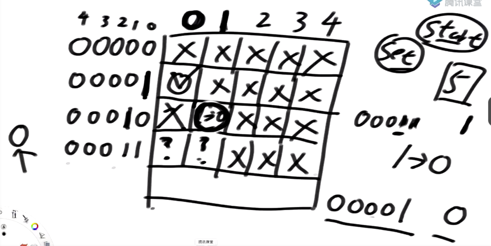 | 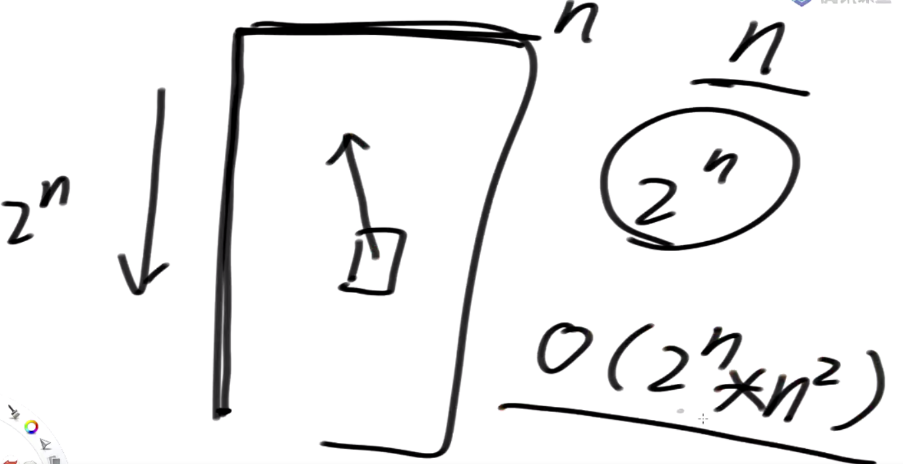 |      |
| ------------------------------------------------------------ | ------------------------------------------------------------ | ---- |


### 贴瓷砖问题

- 你有无限的1 * 2的砖块，要铺满2 * N的区域，不同的铺法有多少种?
- 你有无限的1 * 2的砖块，要铺满M * N的区域，不同的铺法有多少种?

这道题很难猜。你正常猜就一个可变参数设计的时候，它不用突破到整形以上，再次强调这一点。今天只是给大家长长见识而已。

第一题，在斐波那契数列问题里面有。很简单。f（n）就代表摆平2 * n区域有多少种方法。

| 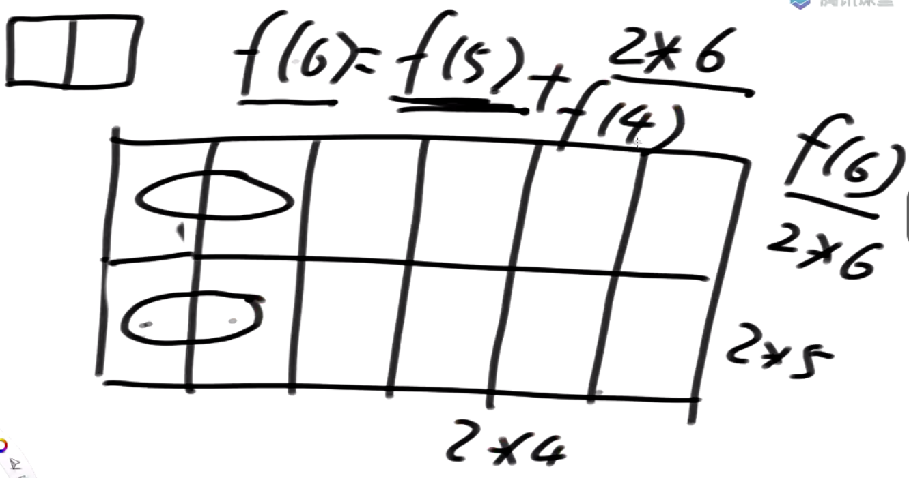 | 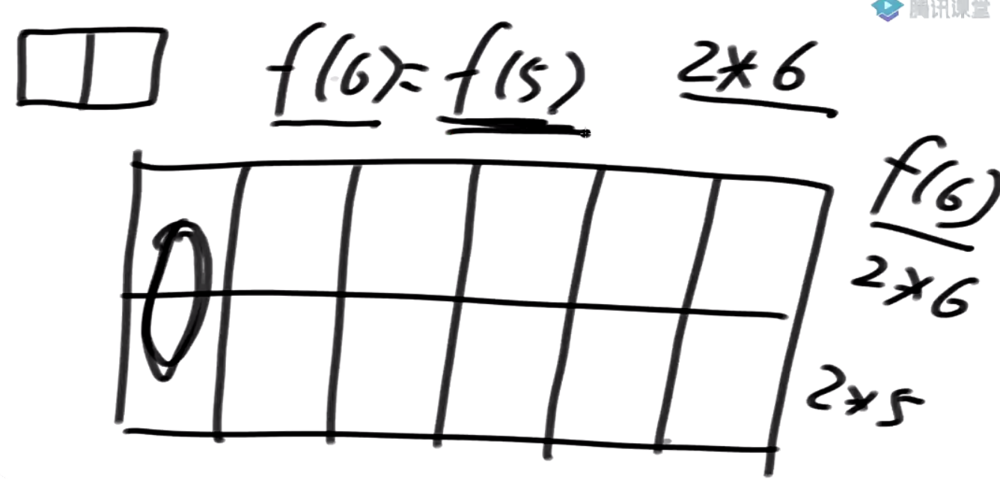 |      |
| ------------------------------------------------------------ | ------------------------------------------------------------ | ---- |

如果我给你参数是一个m×n的区域，你想铺满它有多少种不同的铺法？我定义一个函数f，其中第一维参数是一个矩形，是一个二维的可变参数。问你在这个二维的可变参数上铺满有多少种方法？如果你随便放了一个，你要把这两块给抠掉，如果你这么猜的话。你就干了。你可变参数是一维的时候都已经很复杂了，你还搞个二维的。但是它有没有可能有重复解？有可能。但是命中率太低了。

猜法很特别啊。他怎么憋出来的？它已经单精竭虑到把二维可变参数变成一维，就以这个猜法就已经很怪了。它定义这么一个可变参数	f（int[] , i），一个状态的数组一维的，i行。这个递归代表啥意思？这个递归代表你现在来到了第I行，我告诉你第i行上现在还没有填瓷砖呢。然后我们限制一下一个点上铺瓷砖的方式只有两种，而不是任意的四种。一个点，要么你往右侧摆，要么你往上侧摆。那你做这样的限制，会不会影响你的方法数？不会为什么，因为一个点往左摆，就等同于你在这个点的左边的时候选择往右摆。实际上这样并不会影响我们的方法数。我们先把摆瓷砖的方式限制死，之后我们再来分析这个递归是啥意思？

我现在来到di行。从第I行开始往下，从第I行开始，包括第I行及其下面的所有行都是干净的。这个数组它只由零和一组成的一个数组，这个数组，它表示i行的上一行也就是i- 1行它的状况，零代表没瓷砖，1代表有瓷砖。也就是说。第一个参数表示i- 1行，有砖无砖的状况。第i行表示，我从第i行开始往下都是干净的，而且我现在要考虑在第i行放砖的问题。这是强大的潜台词。还有一个。我认为i- 1行网上的所有的行都是无空隙的。i- 1行，往上所有的行我都认为摆的满满当当，已经摆完了。

总共这个函数是说。我现在来到第i行，开始摆瓷砖，i行及其往下所有东西都是干净的。我告诉你i- 1行的状况在数组里。而且我告诉你i- 2行及其上面所有的行都是无空隙的，被砖头塞满了。这种情况下，你把i- 1行都填满，且把i行下面的东西都填满，方法数是多少？

| 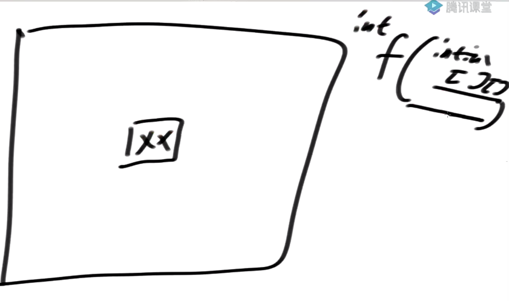 | 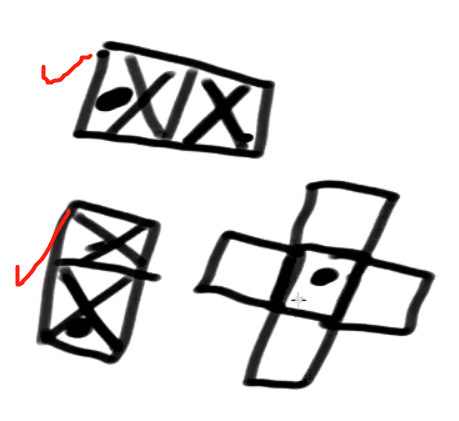 | 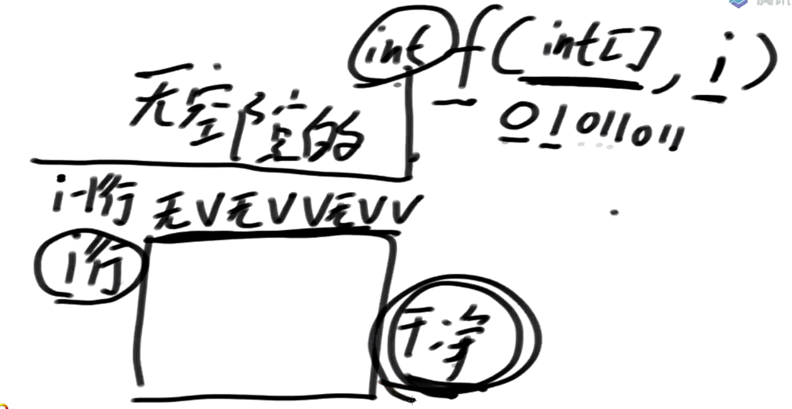 |
| ------------------------------------------------------------ | ------------------------------------------------------------ | ------------------------------------------------------------ |

主函数怎么调？从零行开始填起。我负一行的状态全是满的。负一行及其网上的砖都填满了，问你把零行填满，把负一行所有的砖都填满，并且把底下的地方都填满，有几种方法？我的base case是什么呢？假设你一共有从零行到n- 1行。你什么时候停当你的f。来到n行的时候，你就可以停了。你来到n行，就意味着你已经无法再填瓷砖了。来到n行，就已经意味着你无法再填瓷砖了，那f的返回值是什么？如果这个参数是全一的状态，返回一。如果这个参数，哪怕有一点不是全一的状态返回零。既然我N行没办法填了，你N-1行给我的数组必须全是1，你给我把N-1塞满了。

下面问题就是你普遍位置怎么拆？假设你来到第零行。负一行完全不用你操心。你说你第零行想怎么填？因为我们规定你砖头只能往上和往右，上面又插满了，所以你砖头只能往右摆。我可以在前面塞一个砖，然后我就不管了，你去下面做决定吧。还可以右边的那种，继续去下面做决定。第0行所有可以自由发挥的可能性巨多种每种都给我去试！你0行可以尝试的状态是因为你-1行已经插满了，现在我们假设上面没插满。

| 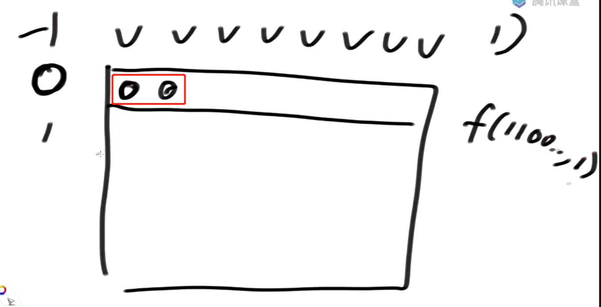 | 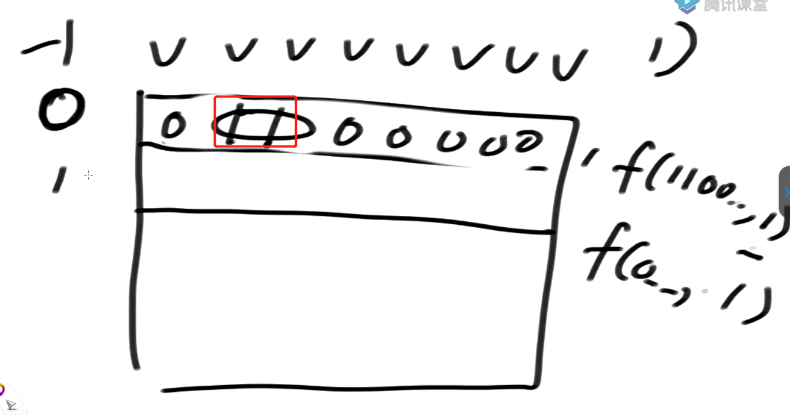 |      |
| ------------------------------------------------------------ | ------------------------------------------------------------ | ---- |

当上面没有插满，在上面为空的时候，只能在你这里竖着摆。其它没有空着的地方你去自由发挥。上一行的数据状况决定了你哪，你这一行哪些点不能胡乱试，只能竖着往上摆。但是上一行满的，在这一行你是可以自己去自由搞的，摆砖或不摆砖，随你的便。

|  |      |      |
| ------------------------------------------------------------ | ---- | ---- |

这种状态压缩的方法，一旦在面试场上出现，它的概率是极低的。我怎么设计一个非常简洁的外部信息其实对于设计一个递归参数是非常有帮助的，或者说有很有启发意义的。尽量把你依赖的外部信息变得很少或者说结构很简单。你越变得越简单，你的最后的动态规划越好写。再比如说打气球那个问题，如果我让每一个气球都最后爆，我发现我外部信息就只用限制成潜台词就够了，就是在l跟r上试气球的时候l- 1位置的气球一定不爆、r+1位置的气球一定不爆，我就能试出来了。关键就在于如果一道题它很难猜，你的着眼点应该集中在我依赖的外部信息怎么样最省。潜台词是什么、怎么去设计含义。第六节里面就有两道题是关于外部信息简单化这个问题的讲解。还是那几个原则，你设计出一个不好的外部信息，你是能知道的，只要你发现你的可变参数突破了整形，你就知道你没猜对，你就换一种猜法。

## Interview Coding 24

训练营5，第8节


### 后缀数组

后缀数组的地位。后缀数组比官方的最优解还好，但是太难，不会作为标准。

首先很多字符串问题是以后缀数组作为最优解的。这就意味着有很多问题在你在面试的时候聊出来的话，会极大的涨身价。所以它有点像装逼性质的，但实际上它非常有用，只是因为过于难，导致反而在要求上不会到这种程度。

后缀数组它是个解决什么问题的呢？它解决的是这样的问题。我们都知道一个字符串，它可以认为是字符类型的数组。0~6开头的后缀串如下。如果我要排序的话，按照字符串的字典序来排谁是排第一位的。什么叫后缀数组呢？就是把这个排名记下来。这东西返回了，它就是我的后缀树组。所以后缀数组是什么？后缀数组的意思是以某个位置开始，后面整体的后缀串它在所有开头位置的后缀串中排名第几？把这个排他自己的排名作为成一个数组返回。跟它对应的就是rank数组。rank数组是啥意思呢？所以后缀数组和rank数组，它就是一种转化关系，你拿后缀数组可以在O(N)的时间转化出rank数组来。你拿rank数组可以在O(N)的时间转化出后缀数组来。后缀数组的下标代表后缀串，rank的下标代表排名。

后缀数组与rank数组这两个东西可以解决非常多字符串的问题。大名鼎鼎的rmq。所以有关于这个后缀数组，如果你会了之后，它有哪些应用？如果你就可以下面自己去看帖子学习了。关键点就是在于后缀数组怎么样去生成最方便。

| 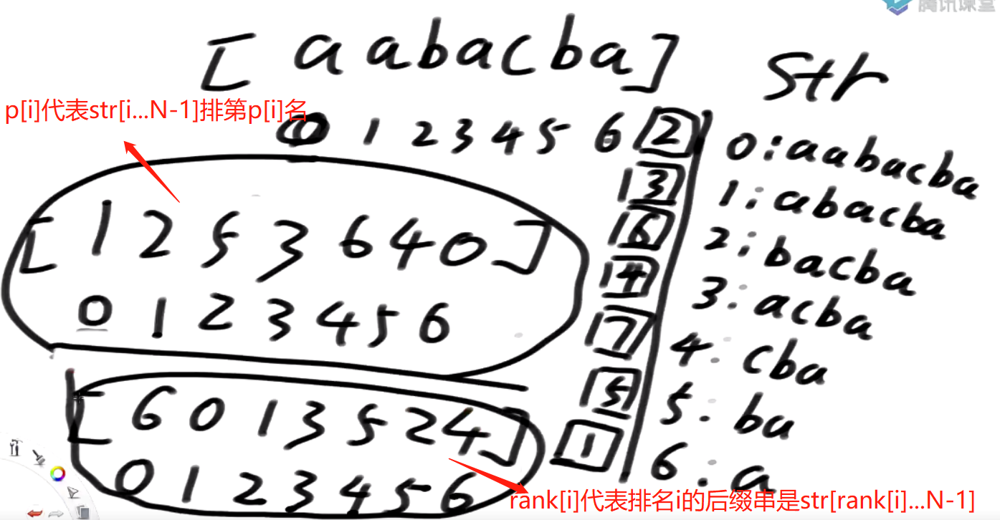 |      |      |
| ------------------------------------------------------------ | ---- | ---- |

暴力方法当然是我生成所有的后缀串。我光生成这个所有后缀串的代价就已经是N²了，N是字符串的长度。排序的代价是N² log N，N是后缀串的个数，由于比较的代价和N有关，所以多了一阶。这样一来总的复杂度就是N² log N。最优解可以做到O(N)！！前提是字符串里面的字符类型不超过ASCII。

在正式介绍后缀数组最好的生成办法之前，先来温故需要用到的一个排序，这个排序叫基数排序。升级一下，假设有两位信息，那么就拿第一位过一遍，再拿第二位过一遍就行了。这个东西有了。我们来想一下，那哪怕你一个数字是三位信息，并且告诉你每一位的值不会特别大，那么这些好多对象排序完还是O(N)的，无非就是每一位过一遍桶。

| 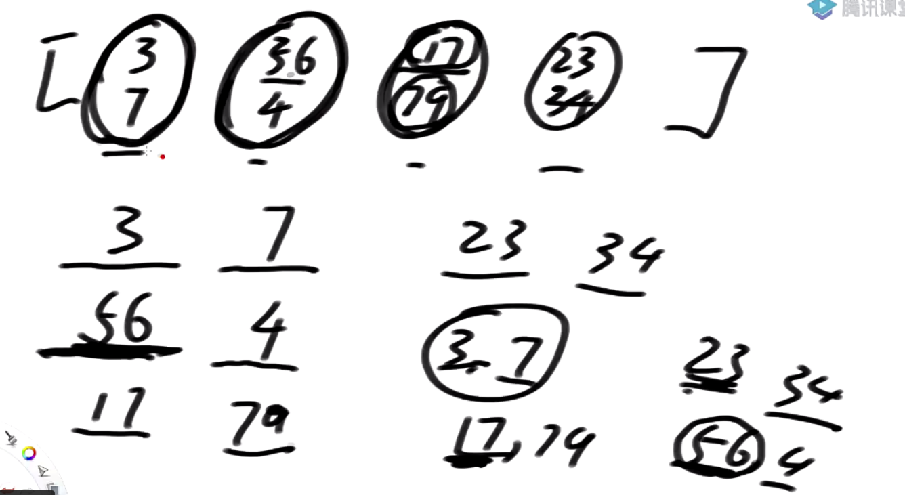 |      |      |
| ------------------------------------------------------------ | ---- | ---- |

开始真正的搞后缀数组的求解了。整个求后缀数组的解法叫DC 3算法，2002年出来的算法，也叫skew。还有一个叫倍增算法就是。但是倍增它的复杂度，其实没有DC 3好，但是它这个常数项优秀一点是吧？这个我们就不讲倍增了，你理解完DC 3，你去你去搞倍增跟玩一样。

首先我把我下标分类。如果I模上三之后是零，我就认为I是零类下标，代号s0类。如果I模三之后是一的话我就认为这个I属于一个一类下标，代号就是s1类。如果这个I模三之后等于二的话，我就认为这个I它是一个二类下标，代号就是s2。那么我们就看一下这个这个这些下标都属于什么类？它一定是交替的。所有后缀串长度是不一样的，不可能有重复排名。

我假设有一个非常方便的方法可以把s1类跟s2类开头的后缀字符串的数组排名求出来。你比如说。一开头的是s1类，那它的后缀字符串是BAAAACC。所以二下标的后缀字符串，它也属于这个范畴。四开头的它也属于s一二类、然后五开头的也属于s一二类。但是3/6这种位置就不是了。假设s一二类可以非常方便的求出来，我能不能得出所有零类下标一类下标跟二类下标整体的排名？也就是我们通过s1和s2类的这个排名，加工出整体的排名。

我先看看s一二类能不能把s0内部的排名搞定？就是下标为零开头的，下标为三开头的，下标为六开头的你们这三个的排名能不能得到？你发现还不用s1和s2的信息，我就先知道了6下标的肯定不如前面的，因为它是c开头的，这个过程可以用一个基数排序。也就是说你s0内部的首字母如果不一样，其实根据首字母就可以画块儿了。我a块的东西就是比c块的好，首字母不一样的块儿，不同的块儿之间的排名我一定能够求出顺序。那么，下面的问题就是说我零开头的后缀串跟三开头的后缀串就是同样在一块，怎么排名？六已经决定出来了，它是最后一名。

|  | 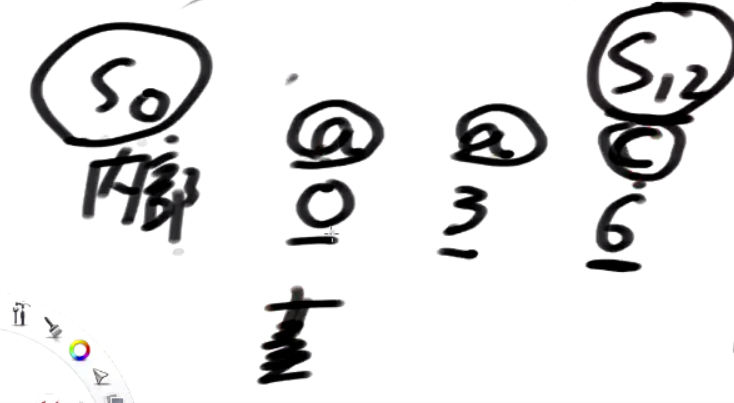 |      |
| ------------------------------------------------------------ | ------------------------------------------------------------ | ---- |

那我以零开头的这个字符是a，我三开头的字符也是a，我接下来PK什么？接下来pk后面的所有。但是现在你有发现了，0下标后面是1开头，3下标后面是4开头，1和4不就是s1的信息吗，这个是我们当前假设可以得到的信息。下面假设0开头的后缀串后面跟着的s1信息是3，而3开头的后缀串后面跟着的信息是1，那么我就知道0开头的这个串干不过3开头的这个串，那么排名也就出来了。就是它往后整体的信息，它需要的都在s一二内部。我们在s0内部排完之后，发现决定不了的，通过s1和s2的信息再过一遍排序。

也就是说，我通过s一二的信息是可以把s0内部信息搞定了。现在的情况是，s0内部你搞定了，s1s2内部你也搞定了。你要整体排名，你只要有merge策略就行了。那么看能不能merge？你先把s0内部的第一拿出来，然后s12内部的第一拿出来，发现第一个字符都是a，比不出来。然后你往后列，直到列到两个字符的位置都在s12内部，再去调用s12的信息。具体就是再往后比两个字符，发现5和4往后的信息在s12里面有了，就可以直接用了。也就是当s0位下标遭遇s2位置的下标的时候你最多比较三次就知道谁大谁小了。如果是s0位下标遭遇s1位置的下标的时候你最多比较2次就知道谁大谁小了。

| 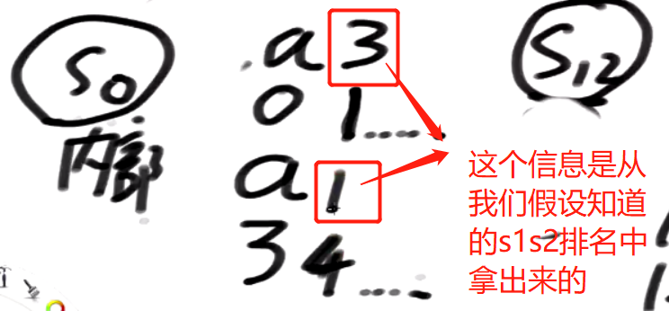 | 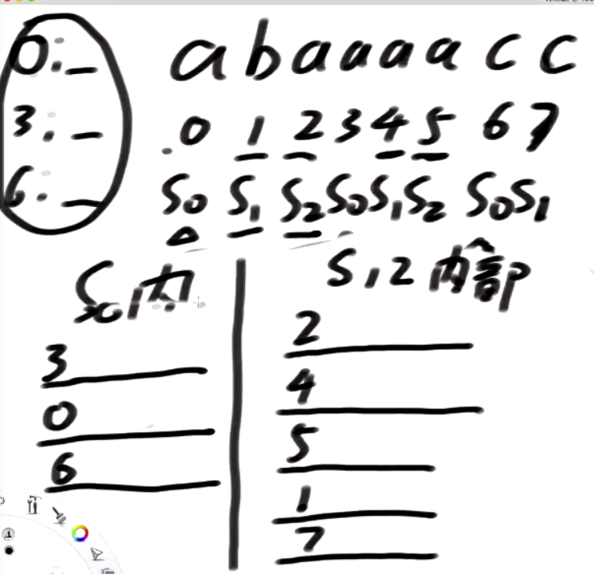 | 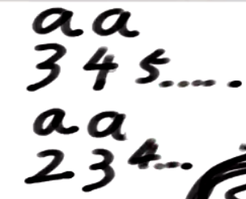 |
| ------------------------------------------------------------ | ------------------------------------------------------------ | ------------------------------------------------------------ |

4和5开头的后缀串从s12的值，4的在前。所以2位置开头的后缀串在所有中排第一。所以2这个后缀串就排出去了，s12内部的指针来到了4位置开头。4位置开头继续和s0内部的3位置开头的pk。然后只需要比两位就够了，到4和5的时候直接去s12拿信息。发现4比5排名高。所以3开头的后缀串也排出去了。s0内部的指针继续往下。继续去merge，可以统统排干净。

| 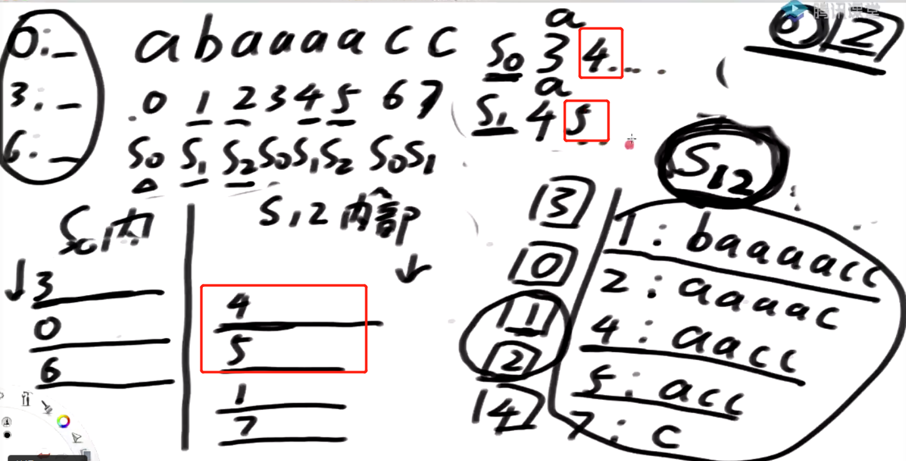 |      |      |
| ------------------------------------------------------------ | ---- | ---- |

梳理一下。字符串长度N。第一步我必须有一个迷之的f函数的过程，帮我得到所有s12内部的排名。第二步就是我用s12的这个信息，我去得到s0内部的信息，也就是内部排名，那么这个过程都用基数排序O(N)。第三步就是我把s12跟s0去merge，我又利用到s12类的信息都排出来，这个毫无疑问也是O(N)的。也就是说成败的关键就是第一步，后面两个过程都是O(N)的一个过程。

下面我们就要把目光聚焦在第一步上了。我要你搞定s12类精确的排名，里面肯定没有重复值。画三角的它就是s0类，我们不管它。画下划线的就是s一二类。我们先这么想，我们怎么决出1/2/4/5/7/8/10/11开头的后缀串的排序？我们先不急，我们先只拿前三维信息来比一下。一开头我先不考虑所有，我先只拿前三个字符来试一下它。1开头前三个aab，2开头前三个abb，。。。，11开头前三个a00。这个例子给你展示的是，如果我们仅拿三位信息，就足以得到严格排名的话，那岂不爽哉。你这一个基数排序直接精确排名出来了，如果这样呢，就这个例子就给你展示很爽，是最好生成的一个例子，你就是过了一遍基数排序是一个O(N)的事情。

| 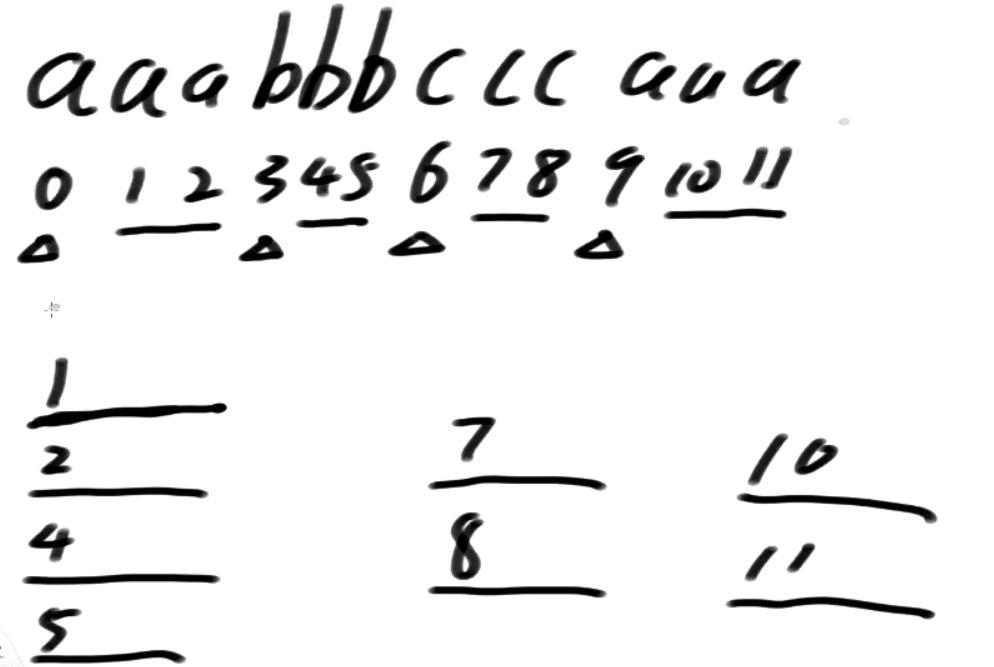 | 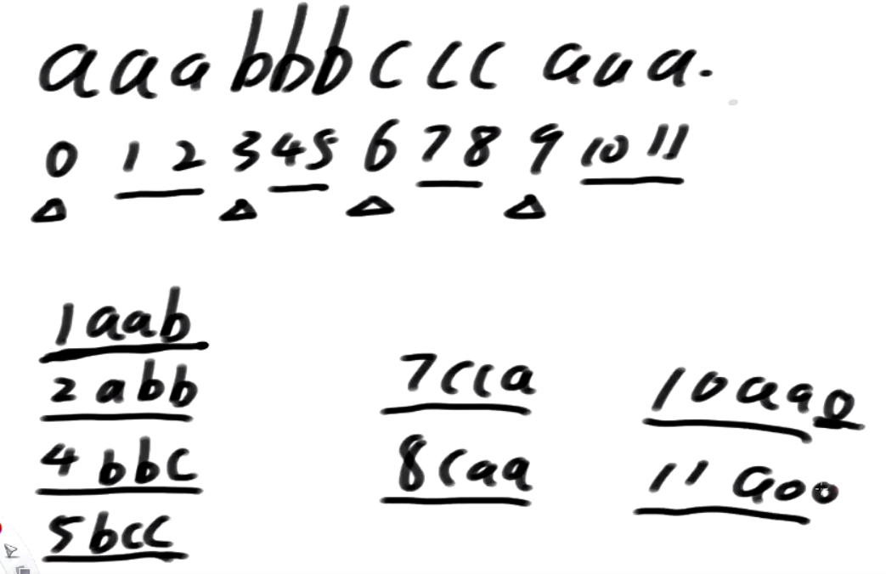 |      |
| ------------------------------------------------------------ | ------------------------------------------------------------ | ---- |

但是现实情况是，他有可能只拿前三位信息，他排不出严格的。我们拿Mississippi作为例子，这个例子你发现只拿前三字符决不出来。这样的话，我们就没有决出精确排名。下面的过程很有意思了，这个过程是整个算法最精髓的地方。接下来我生成一个数组，把s1类整体的排名，3321放在数组左边，对应的后缀串开头位置是1、4 、7 、10，数组对应的下标是0 、 1、 2 、 3。把s2类全部放在数组的右边，后缀串开头位置是2、 5 、8，排名是554，数组下标是4 、5、 6。

我把这个数组我就认为它是一个字符串数组。我递归的调用求它后缀数组的排名。你就认为字符串就是3321554。如果求出来了，那么这个数组下标3位置就是第一名，对应回原来就是10开头的后缀串是第一名。

| 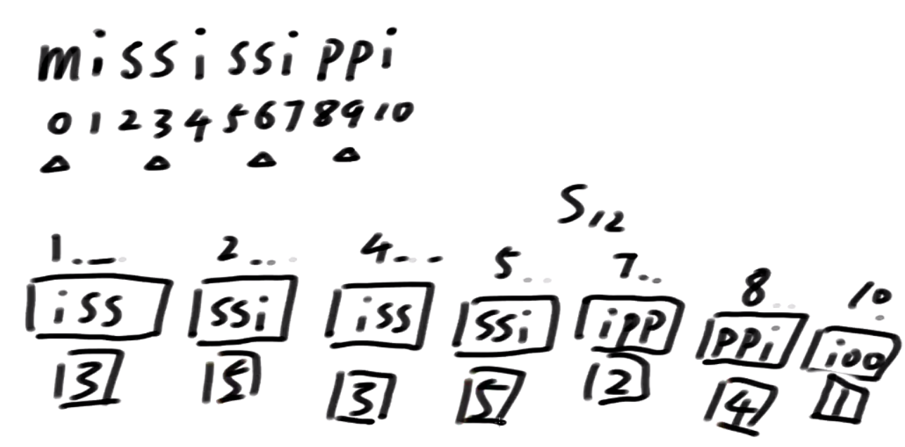 | 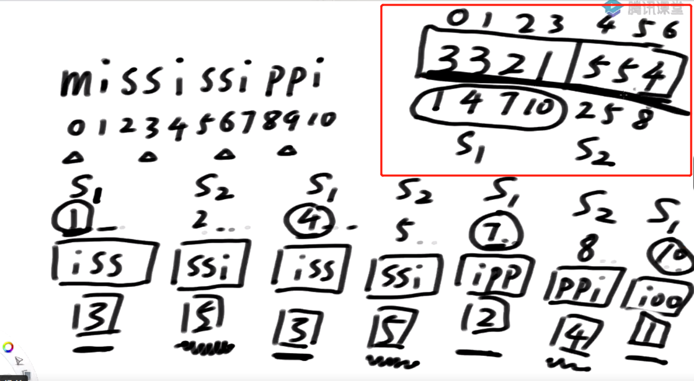 |      |
| ------------------------------------------------------------ | ------------------------------------------------------------ | ---- |

这个数组当做字符串，去求后缀数组，求出来的rank数组是如下。第一名是数组下标为3的，对应回原来的就是10开头的后缀数组排第一。第二名是数组下标为2的，对应回原来的就是7开头的后缀树组排第2名。

为什么是这样？你有一个比较糙的排名，我虽然没有得到精确排名。我这里面有两个三。有两个五，但如果你把这个排名的值当做是字符的话。我这个1它不可能在排完之后排名往后掉，因为相当于我的首字母是1。同理，首字母是2也不可能排到首字母是3或者4后面去。也就是说我们操作出来，原本的排名不会被打乱。那么问题就来到了，为什么我们的摆放是有讲究的，我们还分了左右，然后才当做一个做字符串继续去求后缀树组？

我们原本s12里面，为什么1开头和4开头比不出来，就是因为我们前三个字符是一样的，1开头后面就要补4...，4开头的后面就要补7...。你会猛然发现，我们排在这个新数组的上的位置，刚好续上了。第二个位置的3代表从4开头的后缀串，这不就是第一个位置3想要的信息吗，同理第二个3想要的信息在后面也续上了。

| 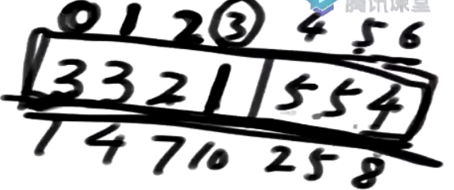 | 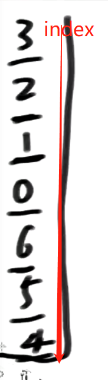 | 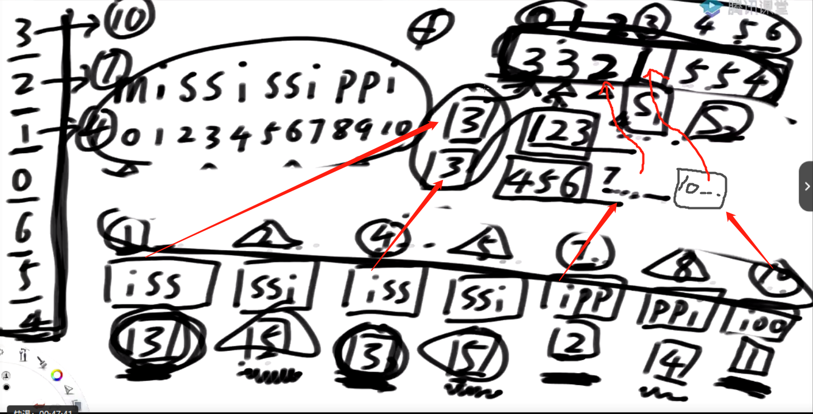 |
| ------------------------------------------------------------ | ------------------------------------------------------------ | ------------------------------------------------------------ |

所以，总体来说，如果我们只拿出前三位可以逼出来1，那么万事大吉。如果比不出来，没关系，2/3规模的数据量，也就是那个排名，进递归。构造的数组会适当的补0来去除边界的干扰。  

我是把排名再扔进去再求一次后缀数组，排名肯定不会超过N，所以去基数排序即便你的排名搞的很大，也是O(N)的算法。

| 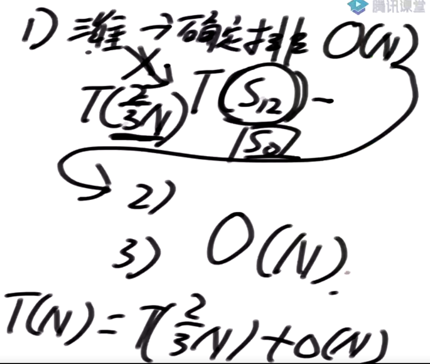 | 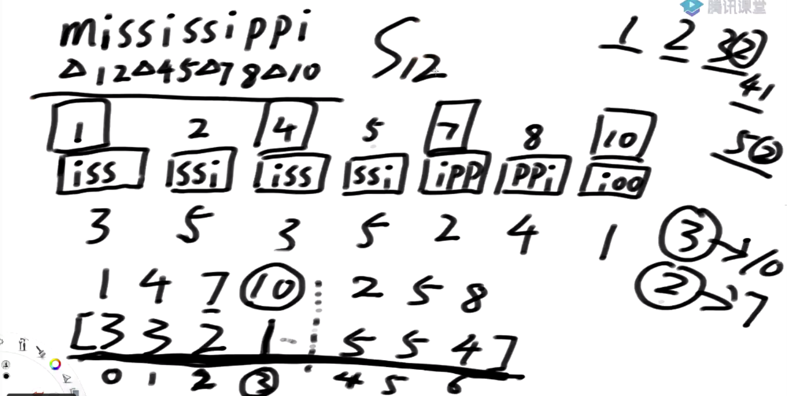 |      |
| ------------------------------------------------------------ | ------------------------------------------------------------ | ---- |


### 拼接最大数

code1:

```
给定长度分别为 m 和 n 的两个数组，其元素由 0-9 构成，表示两个自然数各位上的数字。现在从这两个数组中选出 k (k <= m + n) 个数字拼接成一个新的数，要求从同一个数组中取出的数字保持其在原数组中的相对顺序。

求满足该条件的最大数。结果返回一个表示该最大数的长度为 k 的数组。

说明: 请尽可能地优化你算法的时间和空间复杂度。

示例 1:

输入:
nums1 = [3, 4, 6, 5]
nums2 = [9, 1, 2, 5, 8, 3]
k = 5
输出:
[9, 8, 6, 5, 3]
```

大流程就是枚举str1挑几个，str2里面挑剩下的。我们先搞一个f（arr，p）是叫你再arr里面挑p个数来，最好的结果是啥。调度如下，无非就是要想想怎么merge，让两个最好的merge出最终的那个最好的

| 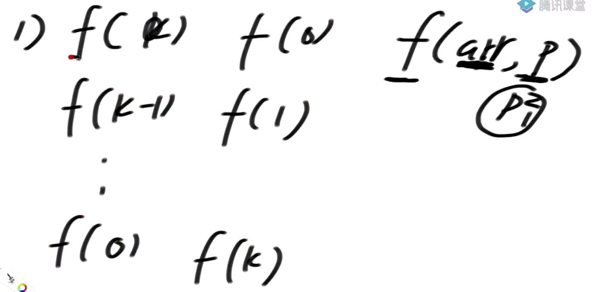 |      |      |
| ------------------------------------------------------------ | ---- | ---- |

那么挑选的函数其实是一个dp，含义为：如果我只能在i~N-1范围，一定要挑出j个数去拼数。得到的最好结果中开始的数在什么位置上？存的是一个位置。先把无意义的位置填了，没得选的位置填了。普遍位置，从下往上从左往右填。一个普遍位置i,j就讨论选i做开头与不选i做开头。然后两个开头到数组里面比较一下，选大的那个。如果两个值一样，选下标小的。

dp搞完之后主流程就是在这个表上跳转k次。leetcode上merge是一个指针漂，遍历的过程，O(N²）

后缀数组可以加速这件事情。全部数字加2，然后中间夹一个1。去搞后缀数组。

| 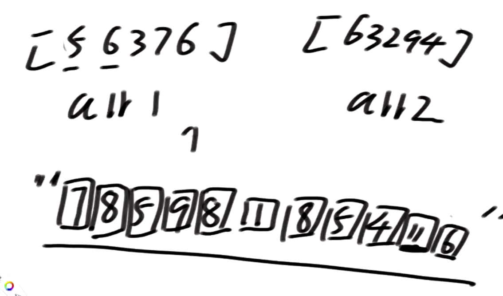 |      |      |
| ------------------------------------------------------------ | ---- | ---- |


# LeetCode

## code0001_两数之和

```
给定一个整数数组 nums 和一个整数目标值 target，请你在该数组中找出和为目标值 target的那两个整数，并返回它们的数组下标。

你可以假设每种输入只会对应一个答案。但是，数组中同一个元素在答案里不能重复出现。

你可以按任意顺序返回答案。

示例 1：

输入：nums = [2,7,11,15], target = 9
输出：[0,1]
解释：因为 nums[0] + nums[1] == 9 ，返回 [0, 1] 。

链接：https://leetcode.cn/problems/two-sum
```

思路：用一个hashmap做数值和下标位置的映射即可。


## code0002_两数相加

```
给你两个 非空 的链表，表示两个非负的整数。它们每位数字都是按照 逆序 的方式存储的，并且每个节点只能存储 一位 数字。

请你将两个数相加，并以相同形式返回一个表示和的链表。

你可以假设除了数字 0 之外，这两个数都不会以 0 开头。

链接：https://leetcode.cn/problems/add-two-numbers
```


这是一道链表的题目

思路：用长链表做头，保持相加进位。

## code0003_最长不重复子串

```
给定一个字符串 s ，请你找出其中不含有重复字符的 最长子串 的长度。

示例 1:

输入: s = "abcabcbb"
输出: 3 
解释: 因为无重复字符的最长子串是 "abc"，所以其长度为 3。

链接：https://leetcode.cn/problems/longest-substring-without-repeating-characters
```

做法1：求**必须**以每个位置结尾的最长无重复子串的长度，每个位置结尾的最长不重复子串的长度答案记在dp表里面，dp表填好之后，dp表中最的就是答案。这是个经典的尝试方法，看到子串、子数组、子序列都可以去试。

具体还需要建立i位置字符上次出现的位置，这是字符和下标的映射。我们可以用Hash表，直接做一个字符到下标的映射。也可以用一个数组来做，因为数组其实就是数字到数字的映射，字符本质上也是数字。然后这题，i-1位置的字符推的位置以及i位置字符上一次出现的位置，谁出现的近，谁就是你的瓶颈。这边说的进，可以用一个max函数来代替。

上面的方法是建立一个dp表，但是实际上只用到了一个位置的依赖，更进一步，可以做空间压缩，因为我们每次只需要前面位置的答案，然后在这个过程中用一个变量抓住最大值返回即可。

hash表做字符到下标的映射和用数组来做，其实差不多，只不过hash表的常数时间会大一点。

---


做法2：滑动窗口，本质就是求以每个位置开头的最长无重复字串的长度，有明显的单调性，窗口越小，长度肯定越小，如果已经重复了，窗口越大后面就全部不行。也是搞一个map表，记录一个字符之前有没有出现过。 


## code0004_寻找两个正序数组的中位数

```
给定两个大小分别为 m 和 n 的正序（从小到大）数组 nums1 和 nums2。请你找出并返回这两个正序数组的 中位数 。

算法的时间复杂度应该为 O(log (m+n)) 。

示例 1：

输入：nums1 = [1,3], nums2 = [2]
输出：2.00000
解释：合并数组 = [1,2,3] ，中位数 2
示例 2：

输入：nums1 = [1,2], nums2 = [3,4]
输出：2.50000
解释：合并数组 = [1,2,3,4] ，中位数 (2 + 3) / 2 = 2.5

链接：https://leetcode.cn/problems/median-of-two-sorted-arrays
```


用到两个有序正序数组中找k大的算法原型。看Interview Coding 12


## code0005_最长回文子串问题

```
给你一个字符串 s，找到 s 中最长的回文子串。

如果字符串的反序与原始字符串相同，则该字符串称为回文字符串。

示例 1：

输入：s = "babad"
输出："bab"
解释："aba" 同样是符合题意的答案。

链接：https://leetcode.cn/problems/longest-palindromic-substring
```

这题其实就是ManACher算法。


## code0007_整数反转

```
给你一个 32 位的有符号整数 x ，返回将 x 中的数字部分反转后的结果。
如果反转后整数超过 32 位的有符号整数的范围 [−231,  231 − 1] ，就返回 0。
假设环境不允许存储 64 位整数（有符号或无符号）。
 
示例 1：
输入：x = 123
输出：321

示例 2：
输入：x = -123
输出：-321

示例 3：
输入：x = 120
输出：21

示例 4：
输入：x = 0
输出：0

来源：力扣（LeetCode）
链接：https://leetcode.cn/problems/reverse-integer
```

```
原理：
1234怎么用最少次的乘法算出来。((((0*10+1)*10+2)*10+3)*10+4)
001234算出来也是对的。前两次res*10+0还是等于0，因为res初始值为0.
```

知道了上面的原理之后我们从后往前，取出整数的每一位，按照上面的公式迭代之后就是答案。

但是这道题需要判断溢出的情况。并且我们知道负数的绝对值域比正数的大一个，所以我们全部转化成负数弄会安全一些，正数转成负数去处理，这个技巧很常见！

```
Integer.MIN_VALUE:-2147483648
Integer.MAX_VALUE: 2147483647
-99%10=-9   绝对值模完再加符号
```


## code0008_字符串转换整数

```
请你来实现一个 myAtoi(string s) 函数，使其能将字符串转换成一个 32 位有符号整数（类似 C/C++ 中的 atoi 函数）。

函数 myAtoi(string s) 的算法如下：

读入字符串并丢弃无用的前导空格
检查下一个字符（假设还未到字符末尾）为正还是负号，读取该字符（如果有）。 确定最终结果是负数还是正数。 如果两者都不存在，则假定结果为正。
读入下一个字符，直到到达下一个非数字字符或到达输入的结尾。字符串的其余部分将被忽略。
将前面步骤读入的这些数字转换为整数（即，"123" -> 123， "0032" -> 32）。如果没有读入数字，则整数为 0 。必要时更改符号（从步骤 2 开始）。
如果整数数超过 32 位有符号整数范围 [−231,  231 − 1] ，需要截断这个整数，使其保持在这个范围内。具体来说，小于 −231 的整数应该被固定为 −231 ，大于 231 − 1 的整数应该被固定为 231 − 1 。
返回整数作为最终结果。
注意：

本题中的空白字符只包括空格字符 ' ' 。
除前导空格或数字后的其余字符串外，请勿忽略 任何其他字符。
 

示例 1：

输入：s = "42"
输出：42
解释：加粗的字符串为已经读入的字符，插入符号是当前读取的字符。
第 1 步："42"（当前没有读入字符，因为没有前导空格）
         ^
第 2 步："42"（当前没有读入字符，因为这里不存在 '-' 或者 '+'）
         ^
第 3 步："42"（读入 "42"）
           ^
解析得到整数 42 。
由于 "42" 在范围 [-231, 231 - 1] 内，最终结果为 42 。

示例 2：

输入：s = "   -42"
输出：-42
解释：
第 1 步："   -42"（读入前导空格，但忽视掉）
            ^
第 2 步："   -42"（读入 '-' 字符，所以结果应该是负数）
             ^
第 3 步："   -42"（读入 "42"）
               ^
解析得到整数 -42 。
由于 "-42" 在范围 [-231, 231 - 1] 内，最终结果为 -42 。

示例 3：

输入：s = "4193 with words"
输出：4193
解释：
第 1 步："4193 with words"（当前没有读入字符，因为没有前导空格）
         ^
第 2 步："4193 with words"（当前没有读入字符，因为这里不存在 '-' 或者 '+'）
         ^
第 3 步："4193 with words"（读入 "4193"；由于下一个字符不是一个数字，所以读入停止）
             ^
解析得到整数 4193 。
由于 "4193" 在范围 [-231, 231 - 1] 内，最终结果为 4193 。
 

提示：

0 <= s.length <= 200
s 由英文字母（大写和小写）、数字（0-9）、' '、'+'、'-' 和 '.' 组成

来源：力扣（LeetCode）
链接：https://leetcode.cn/problems/string-to-integer-atoi
```

这题的边界条件挺多。

