# 基本概念

## 什么是数据结构

### 统一的定义？

可以看到数据结构和算法是两个经常挨在一起的东西。

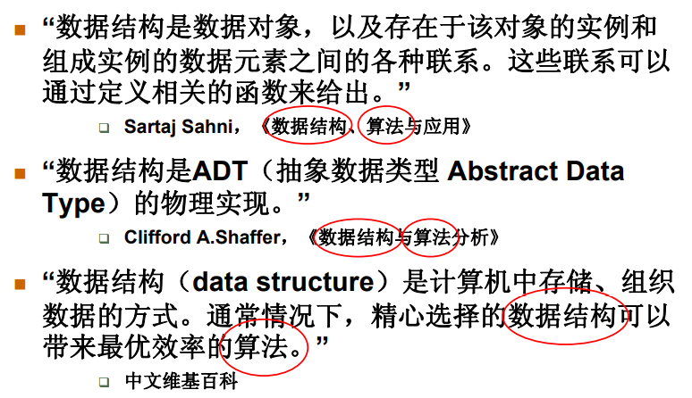

### 例1：如何在书架上摆放图书？


给你一些书架和书，怎么把书放在书架上？也就是我给了数据和存储空间，你怎么把数据存起来？但是这边少了一个很重要的因素，也就是问题的规模有多大，也就是书有多少，数据有多少？不一样的规模处理起来的难度不一样。问题不是难在你怎么放数据，而是你放的数据要对一些事情或者操作有用。也就是我怎么放一个新的数据？我怎么找数据？

最直接的就是随便放，那么新书插入这个操作就很简单，哪里空着就放哪里，我可以选择把书一本本挨着放。但是这样查找就很麻烦了，一本一本挨着找！放的有多随意，找的就有多痛苦。如何让我找书找的舒服一点？

按照书名的拼音字母顺序放。我们可以利用书是顺序放的这个特点来使用二分查找，加快我们找书的效率。但是这样的话新书来了这么插入就成为了一个让人头痛的问题！这时候我们就需要把某一位置后面的书一本本全部往后面错位，这时候就会很麻烦！所以要找一个两全其美的方法很难。

书店里的书都是按照类别来分的，而不是你一开始从中间某一本（二分）开始找，也不需要从第一本（从头到尾）找。我们把书架划分成几块区域，每块区域指定摆放 某种类别的图书；在每种类别内，按照书名的拼音 字母顺序排放。这种方法的好处是不管我在哪一个类里面做什么样的操作，总的来说图书的规模都小了很多，这样一来插入和查找的工作都会简单一点。要查找，就在二分查找之前先找到指定的那个类别，在一个类的小范围去二分查找。插入也是先定一个类别，然后在那一个类别里面用二分查找确定要插入的位置，挪出空位再插入。

问题：空间如何分配？类别应该分多细？我们分的各种类别的书藏书量都是不一样的，不能给每一种类事先分好固定的多少书架，给多了浪费，给少了不够放。类别分多细好呢？你要是分的粗，一类里面有很多书，那么就又回到最开始的问题，书的量太大了。减少工作量就要分细一点，但是一分细，找类别又会成为一个新的问题。

**所以说解决问题方法的效率， 跟数据的组织方式有关。**

### 例2：写程序实现一个函数PrintN，使得 传入一个正整数为N的参数后，能顺序 打印从1到N的全部正整数

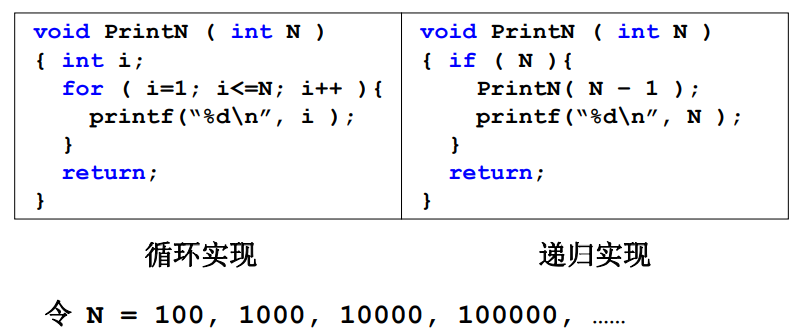

测试一下上面的两种不同的实现。发现递归的代码当数据量大到一定程度的时候就罢工了！虽然递归程序看起来很简洁也很容易理解，但是计算机可不喜欢跑递归的程序！因为递归的程序对空间的占用是很恐怖的。

**所以说解决问题方法的效率， 跟空间的利用效率有关**

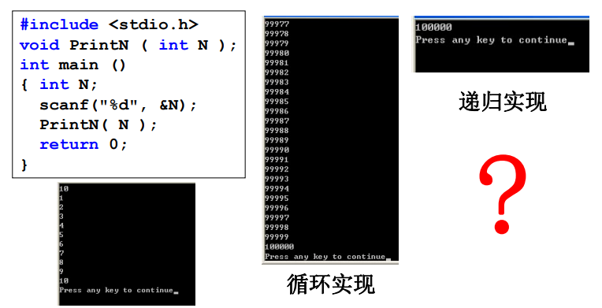

### 例3：写程序计算给定多项式在给定点x 处的值

如果我们把多项式写成这个样子

那么我们可以用一个循环，每一次循环加一项。但是这个方法太笨！！

```c
double f( int n, double a[], double x )
{ 
    int i;
    double p = a[0];
    for ( i=1; i<=n; i++ )
    	p += (a[i] * pow(x, i)); 
    return p;
} 
```

秦九韶给了一个很聪明的算法把多项式写成这个形式

巧妙用了结合律，每一次把x当做公因子提出来。我们程序在计算的时候是从里往外算的。

```c
double f( int n, double a[], double x )
{ 
    int i;
    double p = a[n];
    for ( i=n; i>0; i-- )
        p = a[i-1] + x*p;
    return p;
} 
```

下面我们来比较一下这两个实现的快慢。

- C语言提供了一个工具：clock()：捕捉从程序开始运行到clock()被调用时所耗费的时间。这个 时间单位是clock tick，即“时钟打点”。 

  常数CLK_TCK(或CLOCKS_PER_SEC)：机器时钟每秒所走的时钟打点。

  这两个东西配合在一起我们可以算出一个函数跑了多少秒。

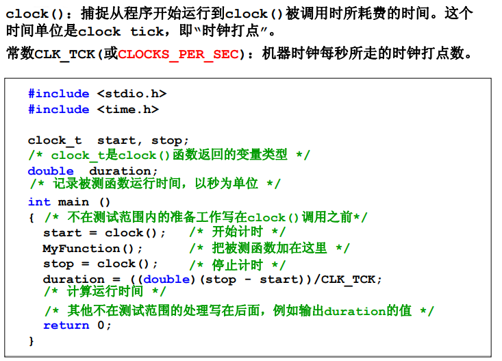

```c
#include <stdio.h>
#include <time.h>

clock_t start, stop;
/* clock_t是clock()函数返回的变量类型 */
double duration;
/* 记录被测函数运行时间，以秒为单位 */
int main ()
{ /* 不在测试范围内的准备工作写在clock()调用之前*/
    start = clock(); /* 开始计时 */
    MyFunction(); /* 把被测函数加在这里 */
    stop = clock(); /* 停止计时 */
    duration = ((double)(stop - start))/CLK_TCK;
    /* 计算运行时间 */
    /* 其他不在测试范围的处理写在后面，例如输出duration的值 */
    return 0;
} 

```

跑一个具体的例子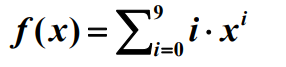

算它在1.1处的值。

这段代码有两个重复的片段，可以改的好看一点。运行会发现两个函数运行时间都是0，因为重复的次数太小了，函数又跑得快。所以我们可以增加函数的调用次数。

```c
#include <stdio.h>
#include <time.h>
#include <math.h>
clock_t start, stop; 
double duration;
#define MAXN 10 /* 多项式最大项数，即多项式阶数+1 */
double f1( int n, double a[], double x );
double f2( int n, double a[], double x );
int main ()
{ 
    int i;
    double a[MAXN]; /* 存储多项式的系数 */
    for ( i=0; i<MAXN; i++ ) a[i] = (double)i; 
    
    start = clock();
    f1(MAXN-1, a, 1.1); 
    stop = clock();
    duration = ((double)(stop - start))/CLK_TCK; 
    printf("ticks1 = %f\n", (double)(stop - start));
    printf("duration1 = %6.2e\n", duration);
    
    start = clock();
    f2(MAXN-1, a, 1.1); 
    stop = clock();
    duration = ((double)(stop - start))/CLK_TCK; 
    printf("ticks2 = %f\n", (double)(stop - start));
    printf("duration2 = %6.2e\n", duration);
    return 0;
}
```

让被测函数重复运行充分多次，使得测出的总的时钟打点 间隔充分长，最后计算被测函数平均每次运行的时间即可!

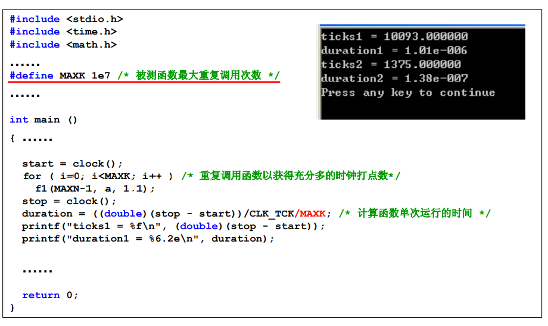

## 什么是算法

### 定义

> 算法（Algorithm）
>
>  一个有限指令集 
>
>  接受一些输入（有些情况下不需要输入） 
>
>  产生输出 
>
>  一定在有限步骤之后终止 
>
>  每一条指令必须  :  有充分明确的目标，不可以有歧义  计算机能处理的范围之内  描述应不依赖于任何一种计算机语言以及具体的实现手段

### 例1：选择排序算法的伪码描述

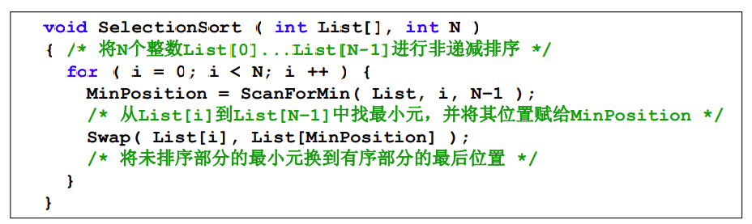

> 抽象 : List到底是数组还是链表（虽然看上去很像数组）？ Swap用函数还是用宏去实现？

### 什么是好的算法？

> 空间复杂度 S ( n ) —— 根据算法写成的程序在执行时 占用存储单元的长度。这个长度往往与输入数据的 规模有关。空间复杂度过高的算法可能导致使用的 内存超限，造成程序非正常中断
>
> 时间复杂度 T( n ) —— 根据算法写成的程序在执行时 耗费时间的长度。这个长度往往也与输入数据的规 模有关。时间复杂度过高的低效算法可能导致我们 在有生之年都等不到运行结果

### 例2

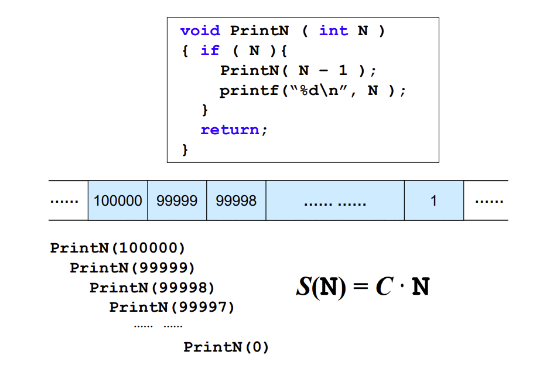

### 例3

乘除法的速度要比加减法慢得多，所以我们算一个函数的时间复杂度基本上就是算它的乘除法的次数，加减法几乎可以忽略不计。

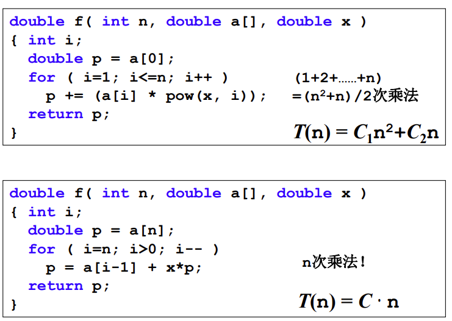

### 什么是好的算法？

一般我们关心最坏时间复杂度，因为平均不好分析

> 在分析一般算法的效率时，我们经常关注下面 两种复杂度 :
>
> 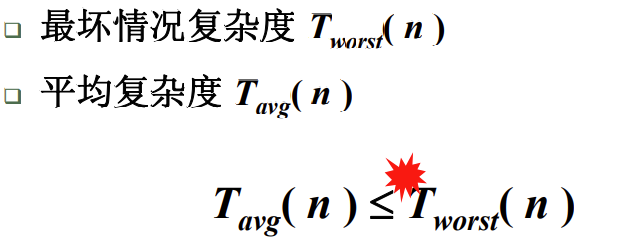

### 复杂度的渐进表示法


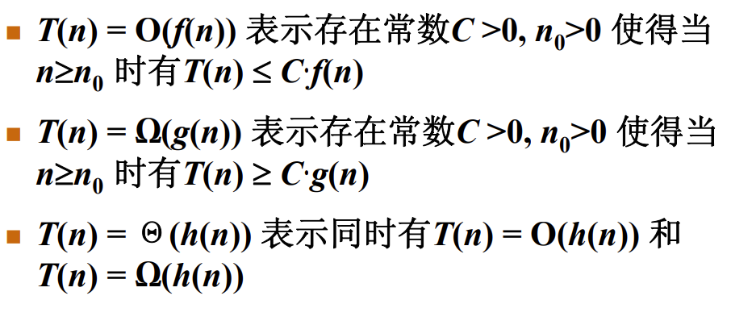

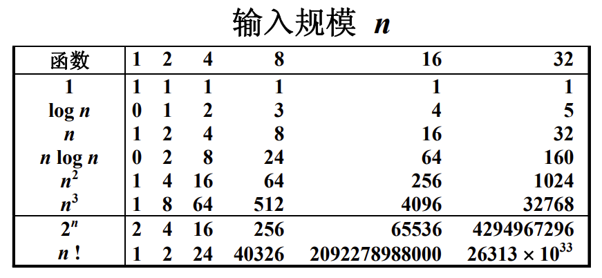


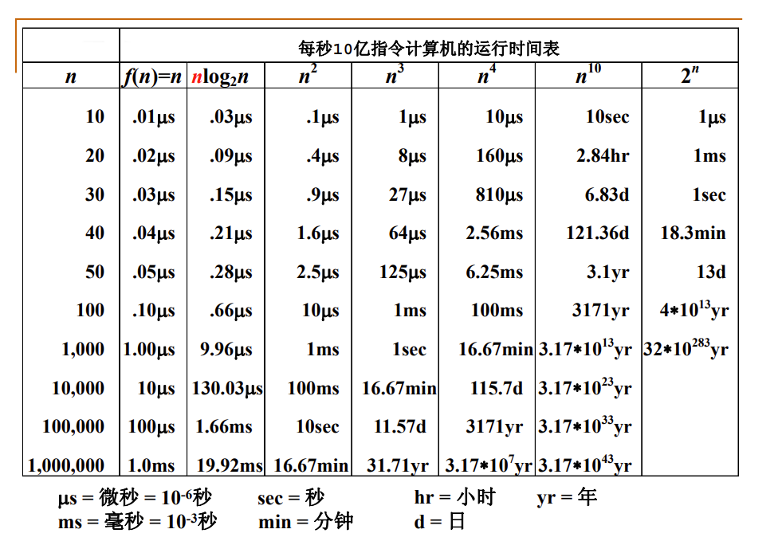

### 复杂度分析小窍门


## 应用实例： 最大子列和问题

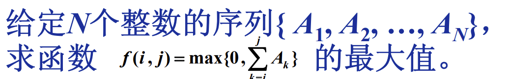

### 算法一：O（n³）

```c
int MaxSubseqSum1( int A[], int N )
{ 
    int ThisSum, MaxSum = 0;
    int i, j, k;
    for( i = 0; i < N; i++ ) { /* i是子列左端位置 */
        for( j = i; j < N; j++ ) { /* j是子列右端位置 */
            ThisSum = 0; /* ThisSum是从A[i]到A[j]的子列和 */
            for( k = i; k <= j; k++ )
            	ThisSum += A[k];
            if( ThisSum > MaxSum ) /* 如果刚得到的这个子列和更大 */
            	MaxSum = ThisSum; /* 则更新结果 */
        } /* j循环结束 */
    } /* i循环结束 */
    return MaxSum;
}
```

### 算法二：O（n²）

```c
int MaxSubseqSum2( int A[], int N )
{ 
    int ThisSum, MaxSum = 0;
    int i, j;
    for( i = 0; i < N; i++ ) { /* i是子列左端位置 */
        ThisSum = 0; /* ThisSum是从A[i]到A[j]的子列和 */
        for( j = i; j < N; j++ ) { /* j是子列右端位置 */
            ThisSum += A[j];
            /*对于相同的i，不同的j，只要在j-1次循环的基础上累加1项即可*/
            if( ThisSum > MaxSum ) /* 如果刚得到的这个子列和更大 */
            	MaxSum = ThisSum; /* 则更新结果 */
        } /* j循环结束 */
    } /* i循环结束 */
    return MaxSum;
} 
```

### 算法三：分治算法---O（nlogn）

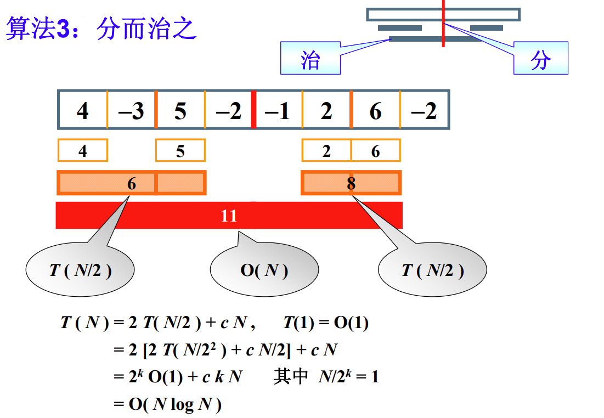

```c
int Max3( int A, int B, int C )
{ /* 返回3个整数中的最大值 */
    return A > B ? A > C ? A : C : B > C ? B : C;
}

int DivideAndConquer( int List[], int left, int right )
{ /* 分治法求List[left]到List[right]的最大子列和 */
    int MaxLeftSum, MaxRightSum; /* 存放左右子问题的解 */
    int MaxLeftBorderSum, MaxRightBorderSum; /*存放跨分界线的结果*/

    int LeftBorderSum, RightBorderSum;
    int center, i;

    if( left == right )  { /* 递归的终止条件，子列只有1个数字 */
        if( List[left] > 0 )  return List[left];
        else return 0;
    }

    /* 下面是"分"的过程 */
    center = ( left + right ) / 2; /* 找到中分点 */
    /* 递归求得两边子列的最大和 */
    MaxLeftSum = DivideAndConquer( List, left, center );
    MaxRightSum = DivideAndConquer( List, center+1, right );

    /* 下面求跨分界线的最大子列和 */
    MaxLeftBorderSum = 0; LeftBorderSum = 0;
    for( i=center; i>=left; i-- ) { /* 从中线向左扫描 */
        LeftBorderSum += List[i];
        if( LeftBorderSum > MaxLeftBorderSum )
            MaxLeftBorderSum = LeftBorderSum;
    } /* 左边扫描结束 */

    MaxRightBorderSum = 0; RightBorderSum = 0;
    for( i=center+1; i<=right; i++ ) { /* 从中线向右扫描 */
        RightBorderSum += List[i];
        if( RightBorderSum > MaxRightBorderSum )
            MaxRightBorderSum = RightBorderSum;
    } /* 右边扫描结束 */

    /* 下面返回"治"的结果 */
    return Max3( MaxLeftSum, MaxRightSum, MaxLeftBorderSum + MaxRightBorderSum );
}

int MaxSubseqSum3( int List[], int N )
{ /* 保持与前2种算法相同的函数接口 */
    return DivideAndConquer( List, 0, N-1 );
}
```

### 算法四：在线处理---O（n）

```c
int MaxSubseqSum4( int A[], int N )
{ 
    int ThisSum, MaxSum;
    int i;
    ThisSum = MaxSum = 0;
    for( i = 0; i < N; i++ ) {
        ThisSum += A[i]; /* 向右累加 */
        if( ThisSum > MaxSum )
        	MaxSum = ThisSum; /* 发现更大和则更新当前结果 */
        else if( ThisSum < 0 ) /* 如果当前子列和为负 */
        	ThisSum = 0; /* 则不可能使后面的部分和增大，抛弃之 */
    }
    return MaxSum;
}
```


# 线性表及其实现

## 多项式的表示

对于这样的多项式，我们关心的就是多项式的项数，各项的系数和指数

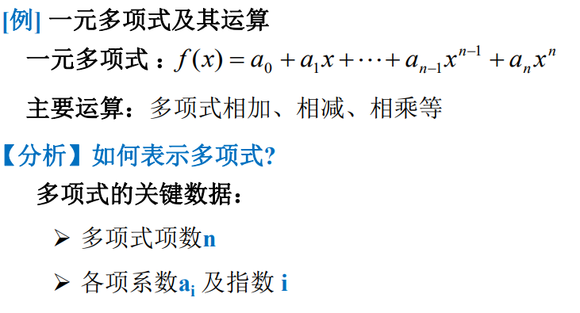

### 方法1：顺序存储结构直接表示

我们这边给数组的下标i赋予一个意义：指数。数组分量的值我们表示系数。这样就可以把一个多项式用一个数组表示出来。但是可以看到数组的大小取决于多项式的最高指数，也就是说如果多项式的指数很大，那么数组也会开的很大，数组开的很大不代表它会多利用这个空间，相反，很多时候会造成空间的巨大浪费。而且在做相加的时候，很多时候我们在做无效的0的相加。

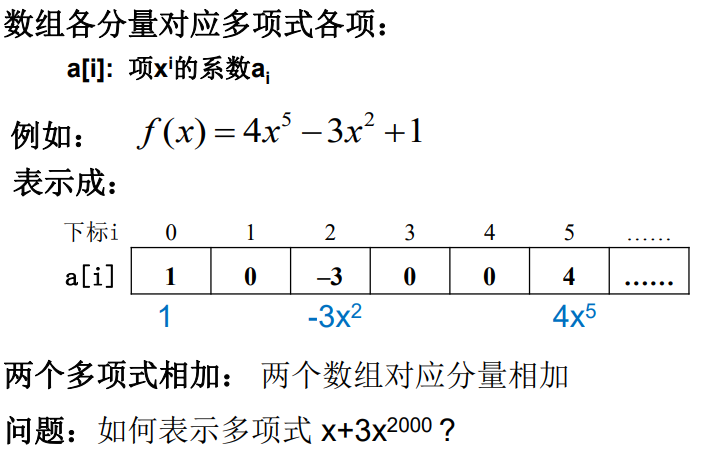

### 方法2：顺序存储结构表示非零项

为什么要把所有零项、非零项，系数为零的、非零的，全都要表示进来呢？有没有可能我只表示非零项？所以这就引入了第二种方法。每个非零项实际上有两个信息：一个是系数，一个是指数。所以我们可以把多项式看成一个由系数跟指数二元组组成的一种集合。所以我们也可以用数组来表示。那么数组的每个分量是什么呢？现在我们这里的每个分量就不能简简单单是系数了，而且要包含指数。所以我们可以用结构数组来表示这样的多项式。数组的分量是由系数和指数所构成的这样一种结构。它对应着我们一个非零项。

用这样的一种表示方法，显然我们只要表示非零项就可以了。很多零的项，我们可以省下来。这样的表示方法对于前面哪个例子，我们只要用2个分量就能表示，大大节约了空间。但是这样的表示方法运算方便吗？我们同样可以做到运算方便地进行，其中要点就是，我们的每一项按照指数大小有序进行存储。在我们这个例子里边，我把指数大的排在前面，指数小的排在后面。把它递降地去存储。相加它的基本方法，就是从头开始比较，看哪个指数高，那个指数高的那项出来；指数相等对应系数相加。

酱的一种方法，是一种节省空间的方法，而且它的操作效率也不算差。同样的表示非零项的酱种方法，我也不一定说一定要用数组来做，我们可以用另外一种方法，是什么呢？链表。

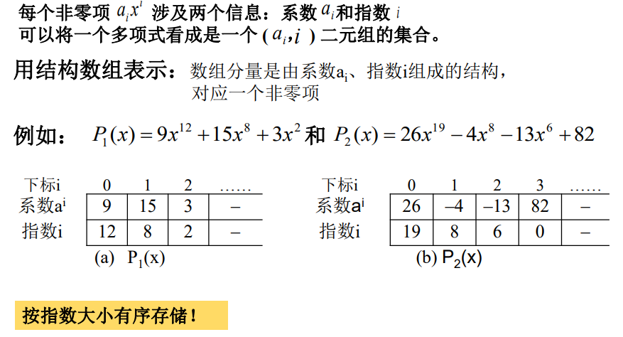

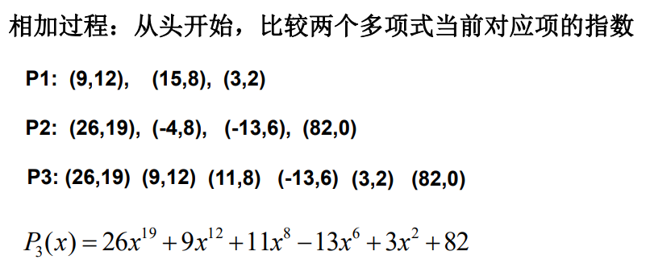

### 方法3：链表结构存储非零项

同样的道理，在这个链表里面，每个结点也是包含两个最主要的信息，一个是指数，一个是系数；然后用指针域，把不同的项串起来。同样，排列的时候，我们仍然可以按照指数递降的顺序进行排。或者递升也可以，按照一定顺序，有序地进行排列就可以了。

> 链表中每个结点存储多项式中的一个非零项，包 括系数和指数两个数据域以及一个指针域
>
> 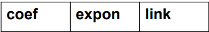

```c
typedef struct PolyNode *Polynomial;
struct PolyNode {
    int coef;
    int expon;
    Polynomial link;
}
```

这样前面的两个多项式用链表就可以表示成这样。同样它的加法运算，整个逻辑过程跟前面两个数组的运算是一样的。也就是说，我们分别指向多项式的头，然后比较指数大小，大的输出；相等的话，系数相加。

所以这就是我们给大家看到的，同样一个问题，一元多项式酱一个问题。可以有多种的表示方法。可以用数组实现，也可以用链表实现。用数组实现还有两种方法，一个直接表示，还有一个只表示非零项。

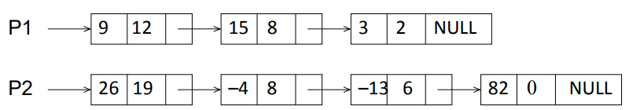

## 什么是线性表

前面那个多项式的问题给我们什么启示呢？首先一个：同一个问题可以有不同的表示方法，也就是不同的存储方法。那么一般来说，我们在数据结构里面最常见的就是两种方法。要么用数组来存储，要么用链表来存储。实际上不仅仅是多项式这个问题，还有很多其他一系列问题，跟多项式问题是有共性的。也就是我们的目标，是想管理一个有序的线性序列，我们就把它归结为“线性表”的问题。

> 多项式表示问题的启示： 1. 同一个问题可以有不同的表示（存储）方法 2. 有一类共性问题：有序线性序列的组织和管理

> “线性表(Linear List)”：由同类型数据元素构成有序序列的线性结构 :  表中元素个数称为线性表的长度  线性表没有元素时，称为空表  表起始位置称表头，表结束位置称表尾

## 线性表的抽象数据类型表述

前面介绍过，所谓抽象类型实际上包含了两个要素。一个是这个类型所包含的数据对象集是什么。另外一个，在这个对象集上面，有什么操作。那么对线性表来说，它的对象集是由n个元素所组成的一个有序的序列。假定说，线性表类型叫 List，对其中的一个具体的线性表叫 L，它里面的元素 X 有个类型叫 ElementType，这个类型可以是整型，也可以是实型，也可以是个结构。

我们接下来更关心的是，一般的线性表是怎么存储的？以及，它有关的，我们列的这几个操作是怎么实现的。根据我们前面多项式的这个例子来讲，我们可以想象的出来。其中一个最简单的一种存储方法，就是顺序存储。就是用数组的方法来进行实现。

```c
类型名称：线性表（List）
数据对象集：线性表是 n (≥0)个元素构成的有序序列( a1, a2,...,an)
操作集：线性表L ∈ List，整数i表示位置，元素X ∈ ElementType，
线性表基本操作主要有：
1、List MakeEmpty()：初始化一个空线性表L；
2、ElementType FindKth( int K, List L )：根据位序K，返回相应元素 ；
3、int Find( ElementType X, List L )：在线性表L中查找X的第一次出现位置；
4、void Insert( ElementType X, int i, List L)：在位序i前插入一个新元素X；
5、void Delete( int i, List L )：删除指定位序i的元素；
6、int Length( List L )：返回线性表L的长度n。
```

## 线性表的顺序存储实现

前面刚才讲的线性表，它这个序列：a1、a2、a3……到an酱一个序列。我们按照顺序把它放到数组里面。酱的一种存储方法，我们相应的一些数据结构的定义应该是怎么样呢。

> 利用数组的连续存储空间顺序存放线性表的各元素

在酱的一种存储方法里面，显然我们有两个东西需要知道的。数组是什么？因为数组可以放不同长度的线性表，它是连续存放的。那它最后一个元素在哪里？所以我们要有个指针 Last。来指示在这个数组里面存放的、线性表的最后一个元素所在的位置。数组我们这里叫做data。定义个数组，它的分量类型是 ElementType。再定义一个 Last，代表线性表的最后一个元素。酱构成一个结构，这个结构就可以抽象地实现一个线性表。那么利用线性表这个类型，我们可以定义一个变量L，还有个 PtrL。

打个比方说，我们想访问下标为 i 的元素。按照这样一种实现方法是很简单的，就是 L.Data[i]。或者 PtrL->Data[i] 就可以了。线性表的长度呢，我们直接取 Last 的值就可以了。因为Last的值代表位置，因为我们是从0开始，所以长度是Last+1。前面介绍过线性表，它的一些主要的操作，我们来看一下。

```c
typedef struct LNode *List;
struct LNode{ 
ElementType Data[MAXSIZE]; 
 int Last;
} ; 
struct LNode L;
List PtrL;
```

> 访问下标为 i 的元素：L.Data[i] 或 PtrL->Data[i] 线性表的长度：L.Last+1 或 PtrL->Last+1

### 主要操作的实现

如果按照顺序存储这样一种方法，放在数组里面，操作如何实现。

#### 初始化（建立空的顺序表）

MakeEmpty 的实现方法，显然是比较简单的。前面提到过，我们表的表示呢，是用结构来表示。它包含了数组，还有代表最后一个元素的 Last。所以我们首先就想要去申请这样的一个结构。所以建表的第一个是通过 malloc 这个函数，申请酱一个结构。然后把结构的 Last 设为 -1，因为 Last 代表最后一个元素。所以 Last（为）0是代表这个表里有一个元素放在第一个位置。没元素就设为 -1。然后把这个结构的指针返回回来。这是我们第一个函数的实现：初始化，MakeEmpty。

```c
List MakeEmpty( )
{ 
     List PtrL;
     PtrL = (List )malloc( sizeof(struct LNode) );
     PtrL->Last = -1; 
     return PtrL;
}
```

#### 查找

它是告诉你一个 PtrL，它是一个线性表结构的指针。通过这个结构，我们知道这个数组是谁，Last 是谁。然后我们要在这个线性表里面找 X 它所在的位置。可以通过一个循环来实现。这个变量是 i，我们从 0 开始，一个个地往后找。一直找到最后一个元素 Last 为止。然后在找的过程当中，比较一下 Data[i] 是不是等于 X。如果等于X说明找着了；如果不等于它，我们的循环不断地走。循环不断地走就是 i 不断地往后挪。当这个循环退出来的时候，有两种可能。第一种可能是 Data[i]!=X 这个条件被破坏了。也就是说找着一个 Data[i] 它等于 X 了。还有一种呢，是 i<=Ptr->Last 这个条件被破坏了。那么就是 i>Ptr->Last 了。那么这两种情况实际上对应于“找到”跟“没找到”这两种情况。所以如果 i>Ptr->Last，说明就没找着，我们就 return -1。否则就找着了，那么 i 就是相应的位置。这样的一种找法，可以知道，它的查找成功的平均比较次数是 (n+1)/2。也就是说运气好，第一个就找着了；运气不好，最后一个找着了。那么平均就是 (n+1)/2。

> 查找成功的平均比较次数为 (n +1)/2，平均时间性能为 O(n)

```c
int Find( ElementType X, List PtrL )
{ 
     int i = 0;
     while( i <= PtrL->Last && PtrL->Data[i]!= X )
     	i++;
     if (i > PtrL->Last) return -1; /* 如果没找到，返回-1 */
     else return i; /* 找到后返回的是存储位置 */ 
} 
```

#### 插入（第 i (1≤i≤n+1)个位置上插入一个值为X的新元素)

插入它的一个目标是要在线性表的第 i 个位置上面。插入 X 这个元素。这里的第 i 个位置指的是 i 的值是从 1 到 n+1。1 就插在线性表的头上；n+1 是插在线性表的最后。那么线性表是在数组里表示的，下标是从 0 开始的。所以实际上就意味着，我们要把这个元素放在哪个位置呢？放到 i-1 这个位置。你要把新插入的元素 X 放到 i-1 这个位置，那怎么办？它是连续存放的。所以你首先要做的一个事情，是要把i-1之后的这些元素全部往后挪一位。腾出 i-1 这个位子来，然后再往里边放。所以这个操作第一个要想做的事情是：先移动。每一个元素都往后挪，显然有个循环就可以做了。那这个循环怎么写？还是倒过来挪？n 挪到 n+1，n-1 挪到 n？还是倒过来挪？n 挪到 n+1，n-1 挪到 n？显然应该是从后面开始挪，把最后一个往后挪，倒数第二个往后挪……否则你从前往后挪，这个算法是不对的。

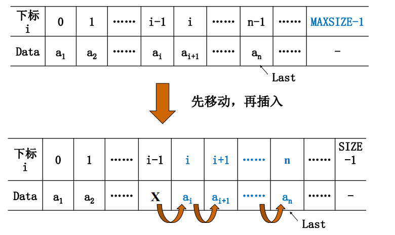

Insert：X 插在 PtrL 这个链表的第 i 个位置。首先我们要看一下，这个表有没有满。判别表满的条件就是 Last 是否等于 MAXSIZE-1。MAXSIZE 是数组的大小。因为数组下标是从0开始的，所以最后一个元素的下标是 MAXSIZE-1。如果等于它说明数组已经满了，最后一个元素正好是数组的最后一个元素。那么就不行，就 return。是不是落在 1 跟 n+1 之间？。是不是落在 1 跟 n+1 之间？。所以下面的 if 语句做了这个判别。接下来的一个 for 循环就是一个个往后挪。那么大家看到了，控制变量是 j。它从哪里开始做呢？从 Last 开始做，不能从 i-1 开始做。从 Last，最后一个元素开始做。每次循环就是把j这个元素移到j+1这个位置，酱的一种挪法。每次 j--，一直挪到 i-1 为止。这样一个 for 循环，就是把第 i 个元素开始的后面这些元素.下标为 i-1，实际上是第 i 个元素之后的元素都往后挪了.挪了之后腾出了 i-1 这个位置，也就是说第 i 个位置. 那么这个时候把 X 放进去。由于你放进去之后，多了一个元素，所以 Last++。

整个算法的时间复杂性就在这个 for 循环里面。平均移动次数为 n /2。

> 平均移动次数为 n /2，平均时间性能为 O(n)。

```c
void Insert( ElementType X, int i, List PtrL )
{ 
     int j;
     if ( PtrL->Last == MAXSIZE-1 ){ /* 表空间已满，不能插入*/
         printf(＂表满＂); 
         return; 
     } 
     if ( i < 1 || i > PtrL->Last+2) { /*检查插入位置的合法性*/
         printf(＂位置不合法＂);
         return; 
     } 
     for ( j = PtrL->Last; j >= i-1; j-- )
     	PtrL->Data[j+1] = PtrL->Data[j]; /*将 ai～ an倒序向后移动*/
     PtrL->Data[i-1] = X; /*新元素插入*/
     PtrL->Last++; /*Last仍指向最后元素*/
     return; 
} 
```

#### 删除（删除表的第 i (1≤i≤n)个位置上的元素)

就是我们要删除第 i 个位置上的元素，这个 i 是 1 到 n 之间--第一个元素到最后一个元素。当然对应的数组的下标就是 0 到 n-1 。我们要把第 i 个元素移掉，意味着整个连续存放空间里面，这个位置空出来了，所以必须把 i 之后的这些元素全部往前挪。因为我们要删掉的是第i个位置上的元素，也就是下标为i-1的元素。所以这个时候要把它后面的那个元素挪到前面来。也就是说，下标为i的元素挪到i-1，下标为i+1的元素挪到i。是按照从左往右的顺序往前挪。

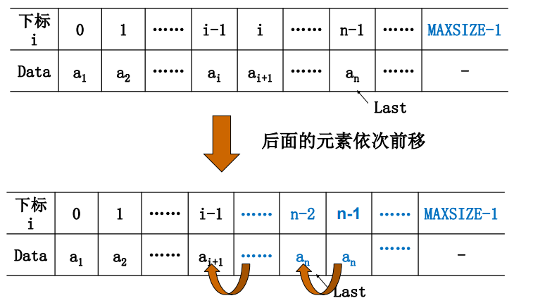

我们已知一个 PrtL 线性表，然后要删除第 i 个元素。首先我们要判别一下，要删除的这个 i 值对不对。别给我删一个不在这个表里的位置酱一个元素，所以先是做这个if的判别。接下来一个 for 循环，是从 i 这个位置开始，一个个往前挪。也就是说，一开始是i挪到i-1，接下来i+1挪到i，再下来i+2挪到i+1……。所以是酱的一个循环，循环顺序跟前面我们插入的时候不一样。插入的时候j是从Last这个地方开始循环，这是从i这个地方开始循环。在这个循环中每次做的事情就是把Data[j]这个元素挪到前面去。那么因为挪掉了之后，我们整个的元素就少了一个。所以最后 Last--。同样的，它的平均移动次数是(n-1)/2。

> 平均移动次数为（n-1）/2，平均时间性能为O（n）

```C
void Delete( int i, List PtrL )
{ 
     int j;
     if( i < 1 || i > PtrL->Last+1 ) { /*检查空表及删除位置的合法性*/
     	printf (“不存在第%d个元素”, i ); 
     	return ; 
     }
     for ( j = i; j <= PtrL->Last; j++ )
     	PtrL->Data[j-1] = PtrL->Data[j]; /*将 ai+1～ an顺序向前移动*/
     PtrL->Last--; /*Last仍指向最后元素*/
     return; 
}
```

### 代码

```c
typedef int Position;
typedef struct LNode *List;
struct LNode {
    ElementType Data[MAXSIZE];
    Position Last;
};

/* 初始化 */
List MakeEmpty()
{
    List L;

    L = (List)malloc(sizeof(struct LNode));
    L->Last = -1;

    return L;
}

/* 查找 */
#define ERROR -1

Position Find( List L, ElementType X )
{
    Position i = 0;

    while( i <= L->Last && L->Data[i]!= X )
        i++;
    if ( i > L->Last )  return ERROR; /* 如果没找到，返回错误信息 */
    else  return i;  /* 找到后返回的是存储位置 */
}

/* 插入 */
/*注意:在插入位置参数P上与课程视频有所不同，课程视频中i是序列位序（从1开始），这里P是存储下标位置（从0开始），两者差1*/
bool Insert( List L, ElementType X, Position P ) 
{ /* 在L的指定位置P前插入一个新元素X */
    Position i;

    if ( L->Last == MAXSIZE-1) {
        /* 表空间已满，不能插入 */
        printf("表满"); 
        return false; 
    }  
    if ( P<0 || P>L->Last+1 ) { /* 检查插入位置的合法性 */
        printf("位置不合法");
        return false; 
    } 
    for( i=L->Last; i>=P; i-- )
        L->Data[i+1] = L->Data[i]; /* 将位置P及以后的元素顺序向后移动 */
    L->Data[P] = X;  /* 新元素插入 */
    L->Last++;       /* Last仍指向最后元素 */
    return true; 
} 

/* 删除 */
/*注意:在删除位置参数P上与课程视频有所不同，课程视频中i是序列位序（从1开始），这里P是存储下标位置（从0开始），两者差1*/
bool Delete( List L, Position P )
{ /* 从L中删除指定位置P的元素 */
    Position i;

    if( P<0 || P>L->Last ) { /* 检查空表及删除位置的合法性 */
        printf("位置%d不存在元素", P ); 
        return false; 
    }
    for( i=P+1; i<=L->Last; i++ )
        L->Data[i-1] = L->Data[i]; /* 将位置P+1及以后的元素顺序向前移动 */
    L->Last--; /* Last仍指向最后元素 */
    return true;   
}
```


## 线性表的链式存储实现

前面我们讲了，线性表可以用顺序存储，也就说用数组来实现。同样的，线性表也可以用链表来实现。那么线性表用链式存储怎么实现呢？实际上就是把逻辑上相邻的两个元素，通过链把它连接在一起。而不要求这两个元素在物理上相邻。一个线性表用数组存储的时候，两个相邻的元素不仅逻辑上是相邻的，而且物理上也是相邻的。我们前面看到了，插入、删除都要把数组后面的元素往前挪或者往后挪。而在链里面，只要轻易地修改链就行了，不需要对很多元素进行挪动。

> 不要求逻辑上相邻的两个元素物理上也相邻；通过“链”建 立起数据元素之间的逻辑关系。 
>
> • 插入、删除不需要移动数据元素，只需要修改“链”。

这个链表每个结点都是一个结构，这个结构里面至少有两个分量，一个分量是代表这个结点所对应的数据，另外一个是代表它的下一个结点的位置，就是Next酱的一个指针。在数组里面，我们知道，要找到序号为i的元素是很简单的，a[i-1]就可以了。那么我们要求线性表的长度，有个Last指针，很快也能求出来。但是如果在一个链表里面，我们光知道一个链表头，我们怎么知道第 i 个元素在哪里？链表的长度是多少？所以显然，链式的存储方法跟数组相比，在这两个问题上面就要复杂了。下面我们看看，如果按链表方式来实现线性表，它的主要操作是怎么实现的。

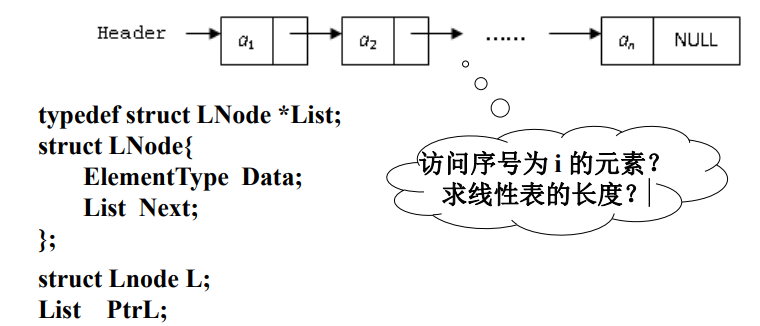

### 求表长

用链表来实现的时候，我们只知道这个链表的头指针。而且它是单向链表。这个时候要想求这个表里的元素。我们一种方法就是把这个链表遍历一遍。就从头到尾一个个看，看到最后一个元素为止。这里就是用链表遍历的方法来求表长。一开始设一个临时的指针p，指向链表的头，在我们这里是PtrL。然后我们有个计数器，就是 j，一开始设为 0。然后每遍历一个，加个 1；每遍历一个，加个 1 ……所以下面是一个循环。循环条件是什么？就这个链表还没结束，也就是说这个 p 指针不等于 NULL。那么我们的循环就不断地做，每循环一次，p->Next 赋给 p。就是让这个链表的指针往后挪一位，同时 j 加个 1。一直循环到最后一个结点的时候，p->Next 是个 NULL。所以这个时候 p 得到的是个 NULL，那么这个循环就退出来。这个时候 j 的值就代表表长的值。

> 时间性能为 O(n)。

```c
int Length ( List PtrL )
{ 
     List p = PtrL; /* p指向表的第一个结点*/
     int j = 0;
     while ( p ) { 
         p = p->Next; 
         j++; /* 当前p指向的是第 j 个结点*/
     } 
     return j;
}
```

### 查找

在数组里面，我们要找第 K 个元素是很简单的。直接返回 a[K-1] 就可以了。在链表里面就没那么简单了，我们必须要一个个往后找。所以采用的方法也类似链表的这样一种遍历方法。我们首先把 p 这个临时的指针变量设为链表的表头。我们弄个 i 来代表第几个元素。一开始的时候p是指向第1个元素，所以这个时候的i就设为1。然后接下来是个循环。只要 p 不等于空，就是说链表没结束，就一个个往后错。当然还有个条件，就是说我们还没找到第 K 个元素。所以循环有两个条件：一个是表不空，另外一个 i 小于 K。这时候循环体就做两件事情。一件事情是 p->Next 赋给 p，就是往后挪一个结点。第二个把 i 加了 1。所以往后挪一下，i 加个 1 …… 循环一直做，做到循环退出来。循环退出来意味着这两个条件里面，有一个被破坏了。一个条件是 p 不等于 NULL，一个是 i 小于 K。所以这个循环退出来就有两种可能。一个是 p 等于 NULL；一个呢，i 等于 K 了。这两种可能也是代表了两种不同的情况。如果 i 等于 K，说明找着了，所以这个时候 return p。否则就意味着p等于NULL了，这个时候就没找着，就return NULL。

还有一种叫“按值查找”。我已知一个 X，然后问你，这个 X 是在这个表的哪个位置。也就是返回这个结点的指针，（即）这个结点所在的地址。同样的也是一个链表遍历的一种基本方法。一开始 p 就设为这个链表的头，就是把 PtrL 赋给 p。接下来是个循环，循环条件也是两个。一个表不空，（即）p 不等于 NULL。另外一个，我们没找着，就是 Data 不等于 X。所以只要没找着，而且表不空，就不断地往后挪往后挪……。往后挪就是 p->Next 赋给 p。所以这个循环退出来的时候，也是两种可能。一个可能呢，这个 Data 等于 X 了，找着啦。找着的时候就返回这个 X 所在结点的这个地址，就是 p。另外一个呢，p 等于 NULL 了，没找着，就 return NULL。所以你只要调用这个 Find 函数，发现它返回值等于 NULL。就说明肯定是没找着。

#### （1）按序号查找: FindKth

```c
List FindKth( int K, List PtrL )
{ 
     List p = PtrL;
     int i = 1;
     while (p !=NULL && i < K ){
     p = p->Next;
     i++; 
     }
     if ( i == K ) return p; 
     /* 找到第K个，返回指针 */
     else return NULL; 
     /* 否则返回空 */
} 


```

#### （2）按值查找: Find

```c
List Find( ElementType X, List PtrL )
{ 
     List p = PtrL;
     while ( p!=NULL && p->Data != X )
        p = p->Next; 
     return p;
}
```

### 插入（在第 i-1(1≤i≤n+1)个结点后插入一个值为X的新结点)

我们希望插入一个新的结点，这个结点插在哪里呢？插在第 i-1 个结点的后面。那么在链表的插入呢，一定要知道插的结点的前面一个是谁。这样我们才能够把这个结点接上去。我们就指定是插在第 i-1 个结点的后面。为了做这个事情，有这么几个步骤要做。首先我们要构造这个新的结点。可以用malloc这个函数来申请一块空间。接下来我们要找着链表的第 i-1 个结点。 也就是说准备要插入的前一个结点到底是谁，我们用p指向它。接下来把这个结点插进去，基本过程是酱的。我们有个 s 指向一个新的结点，我们新申请的空间。p 是我们准备要插入的、之前的这个结点。也就是说我们准备要插在 p 这个结点后面。所以在这个时候呢，我们就要做两件事情。第一件事情：这个指针要指到这来。第二件事情：指针要指到这来。所以只要完成这两个指针的修改动作，就把这个结点插进去了。这个动作怎么做呢。我们可以用这两个语句来表示。让 s 指向下一个结点，p 的 Next 赋给 s 的 Next。我们要让 p 的结点指向 s，就是 s 赋给 p->Next。所以通过两个赋值语句就可以修改两个指针方向。就可以把这个结点插进去了。在这里有个问题：这两个赋值语句有没有顺序关系？对调一下怎么样？显然是不能对调的。大家想想为什么？

> （1）先构造一个新结点，用s指向； （2）再找到链表的第 i-1个结点，用p指向； （3）然后修改指针，插入结点 ( p之后插入新结点是 s)

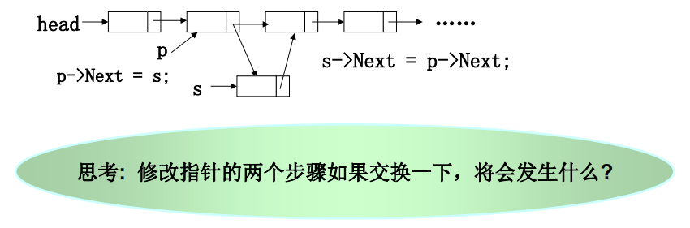

我们要把 X 插在 PtrL 这个链表的第 i 个位置。也就是说插在第 i-1 个位置之后。那么这里有个情况：如果 i 等于 1，也就是插在链表的头上。那么这里有个情况：如果 i 等于 1，也就是插在链表的头上。那么 i-1 是 0，0 这个位置在链表里面是不存在的。所以这个结点如果插在头上我们要做特殊处理。所以前面先来一句话：if (i==1) 那么我们做插入。如果插在头上，同样也是先申请一块空间。把 X 值赋给 Data，然后把 s->Next 指向第一个结点。也就是说把 PtrL 的值赋给 s->Next。酱就完成了把一个 s 结点插在链表的头上。当然插在链表的头上之后，整个链表的头指针就发生了变化了。所以我们就 return s;。酱的话你在调用 Insert 函数的时候。你的一种做法可以使 PrtL = Insert(...)。这样通过Insert调用，它会返回插入之后新的链表的头指针。所以你把新的链表的头指针赋给 PtrL 就可以了。这是我们一开始先有一个(i==1)的判断。接下来我们要找找 i-1 这个结点在哪个位置通过 FindKth 这个函数找到这个位置，把它赋给 p。然后看看 p 是不是等于 NULL。p 如果等于 NULL 就说明 i-1 这个结点不存在。否则的话就意味这个 p 不等于 NULL 是正常的。先申请一块空间，把 X 值赋给 Data，然后就做我们刚才讲的那两个赋值语句，修改两个指针。注意：这两个位置不能颠倒。然后我们就 return 回来新的链表的头指针。当然在这种情况下，新的链表的头指针是不变的。平均查找次数是 n/2。

> 平均查找次数为 n /2，平均时间性能O(n)

```c
List Insert( ElementType X, int i, List PtrL )
{ 
     List p, s;
     if ( i == 1 ) { /* 新结点插入在表头 */
         s = (List)malloc(sizeof(struct LNode)); /*申请、填装结点*/
         s->Data = X; 
         s->Next = PtrL;
         return s; /*返回新表头指针*/
     }
     p = FindKth( i-1, PtrL ); /* 查找第i-1个结点 */
     if ( p == NULL ) { /* 第i-1个不存在，不能插入 */
         printf(＂参数i错＂);
         return NULL; 
     }else {
         s = (List)malloc(sizeof(struct LNode)); /*申请、填装结点*/
         s->Data = X; 
         s->Next = p->Next; /*新结点插入在第i-1个结点的后面*/
         p->Next = s; 
         return PtrL;
     }
 }
```

### 删除（删除链表的第 i (1≤i≤n)个位置上的结点

接下来我们看看删除操作怎么做。我们想做的删除操作是想删除链表里面第 i 个位置上的结点。要把第 i 个结点删除，前面一个结点要接到后面去。 被删除的第i个结点的后面。所以我们同样地也要找到链表的第 i-1 个结点。然后用 p 指针指向它。接下来我们要做的事情是什么呢？我们要删的是这个结点，因为是单向链表，所以我们必须找到前一个结点，然后将来把指针指到这个位置来。是通过一个赋值语句就可以实现的。但如果简单地这么做，会有问题。什么问题呢？被删除的结点，当时是通过 malloc 申请的空间。现在你不要了，要还回去，要通过 free 函数还回去。所以我们的这个过程就变成酱。

首先用 s 指针指向被删除的结点，接下来修改这个指针，就是把 p 的指针指向 s 的后面，那么用这个语句 s->Next 赋给 p->Next 就可以了。接下来很重要的一步：释放，就是 free(s)。这样的话，内存空间才不会泄漏。刚才我们讲的这几个步骤，能不能随意改变？

> （1）先找到链表的第 i-1个结点，用p指向；
>
> （2）再用指针s指向要被删除的结点（p的下一个结点）;
>
> （3）然后修改指针，删除s所指结点; 
>
> （4）最后释放s所指结点的空间。
>
> 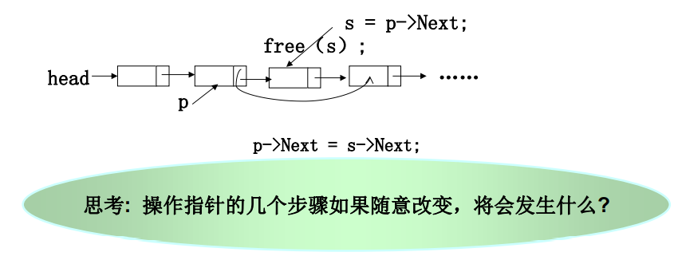

同样地我们也要区分i==1的情况，即要删除的是头结点的情况。删除头结点有两种可能：一个是 PtrL 本身就是空的，这个时候就是删除不成功。直接 return NULL;。然后另外一个呢，它本身不空。这个时候把链表的头结点挪到下一个位置。就是这样的一句话，PtrL->Next 赋给 PtrL。接下来同样我们也要 free 一下。这是第一块，i==1 的情况，就是我们删除的是第一个结点。接下来的过程跟我们前面的插入有点像。就是找到 i-1 （个结点）的位置。就是要删除的结点的前一个结点在哪里。接下来做前面讲的那几个赋值语句。当然，如果这个结点不存在，我们要提示一些信息。所以接下来做的一些语句就是。p->Next 赋给 s；接下来 s->Next 赋给 p->Next。就是把 s 所在的前一个结点的指针，指向 s 的下一个结点。就把 s 结点跳过，然后再 free(s)。平均时间复杂度也是 n/2。

```c
List Delete( int i, List PtrL )
{ 
     List p, s;
     if ( i == 1 ) { /* 若要删除的是表的第一个结点 */
         s = PtrL; /*s指向第1个结点*/
         if (PtrL!=NULL) PtrL = PtrL->Next; /*从链表中删除*/
         else return NULL;
         free(s); /*释放被删除结点 */
         return PtrL;
     }
     p = FindKth( i-1, PtrL ); /*查找第i-1个结点*/
     if ( p == NULL ) { 
     	printf(“第%d个结点不存在”, i-1); return NULL; 
     } else if ( p->Next == NULL ){ 
     	printf(“第%d个结点不存在”, i); return NULL; 
     } else {
         s = p->Next; /*s指向第i个结点*/
         p->Next = s->Next; /*从链表中删除*/
         free(s); /*释放被删除结点 */
         return PtrL;
     }
}
```

### 代码

```c
typedef struct LNode *PtrToLNode;
struct LNode {
    ElementType Data;
    PtrToLNode Next;
};
typedef PtrToLNode Position;
typedef PtrToLNode List;

/* 查找 */
#define ERROR NULL

Position Find( List L, ElementType X )
{
    Position p = L; /* p指向L的第1个结点 */

    while ( p && p->Data!=X )
        p = p->Next;

    /* 下列语句可以用 return p; 替换 */
    if ( p )
        return p;
    else
        return ERROR;
}

/* 带头结点的插入 */
/*注意:在插入位置参数P上与课程视频有所不同，课程视频中i是序列位序（从1开始），这里P是链表结点指针，在P之前插入新结点 */
bool Insert( List L, ElementType X, Position P )
{ /* 这里默认L有头结点 */
    Position tmp, pre;

    /* 查找P的前一个结点 */        
    for ( pre=L; pre&&pre->Next!=P; pre=pre->Next ) ;            
    if ( pre==NULL ) { /* P所指的结点不在L中 */
        printf("插入位置参数错误\n");
        return false;
    }
    else { /* 找到了P的前一个结点pre */
        /* 在P前插入新结点 */
        tmp = (Position)malloc(sizeof(struct LNode)); /* 申请、填装结点 */
        tmp->Data = X; 
        tmp->Next = P;
        pre->Next = tmp;
        return true;
    }
}

/* 带头结点的删除 */
/*注意:在删除位置参数P上与课程视频有所不同，课程视频中i是序列位序（从1开始），这里P是拟删除结点指针 */
bool Delete( List L, Position P )
{ /* 这里默认L有头结点 */
    Position pre;

    /* 查找P的前一个结点 */        
    for ( pre=L; pre&&pre->Next!=P; pre=pre->Next ) ;            
    if ( pre==NULL || P==NULL) { /* P所指的结点不在L中 */
        printf("删除位置参数错误\n");
        return false;
    }
    else { /* 找到了P的前一个结点pre */
        /* 将P位置的结点删除 */
        pre->Next = P->Next;
        free(P);
        return true;
    }
}

```

## 广义表

前面我们知道了一元多项式的一种表示方法，也就是里面只含一个变量 x。那我们就想一个问题：如果是二元多项式呢？也就是说我这里面含有两个变量。一种处理方法可以把二元多项式看成是一个一元多项式。这样我们可以把前面的二元多项式，经过重新整理变成这样。它里面有 x^12、x^8、x^2。然后 x^12（这一项）在一元多项式里面它是个系数，是个常量。但在我们这里，它是一个关于y的一元多项式。所以我们可以仿照一元多项式的一种表示方法。用个链表把它表示出来。在原来一元多项式里面，我们 x^12、x^8 相应的系数是常量。那在我们这里呢就不是常量了,也是一个一元多项式。所以我们可以形成酱的一种链表来表示。大家看到p指向的多项式的第一项应该是12。12前面这个位置原来是个系数。现在又是一个指针，指向了一个关于y的一元多项式。第二项也是一个指针，指向关于y的一元多项式。也就是说原来这个位置相当于都是常量的位置。现在变成了指针了，指向了另外一个一元多项式。这种表我们称之为广义表。

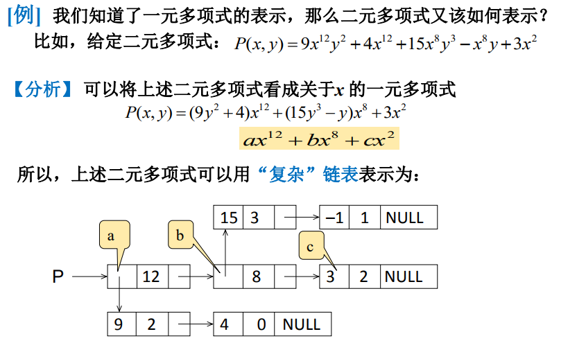


> 广义表(Generalized List) :  广义表是线性表的推广  对于线性表而言， n个元素都是基本的单元素；  广义表中，这些元素不仅可以是单元素也可以是另一个广义表。

所以在广义表构造的时候。我们会碰到一个问题，就是一个域有可能就是不能分解的单元，有可能是一个指针。那么这个问题怎么处理呢。C语言提供了一种手段，叫做联合 union。union可以把不同类型的数据组合在一起，可以把这个空间理解成某种类型，也可以理解成另外一种类型，那么怎么区分不同的类型呢，往往采用的方法（是）再弄个标记，类似刚才讲的二元多项式的酱表示的问题。就是说在某些域里面，它可能有不同的理解。一般的一种方法，就是设一个标记。然后用union把它组在一起。根据这个标记，假如说这个标记等于0，就是单元素。1是代表一个指针，指向另外一张广义表。所以它的结构指向通过Tag来区分后面的这块空间。到底是Data还是Sublist。

```c
typedef struct GNode *GList;
struct GNode{
     int Tag; /*标志域：0表示结点是单元素，1表示结点是广义表 */
     union { /*子表指针域Sublist与单元素数据域Data复用，即共用存储空间*/
         ElementType Data;
         GList SubList; 
     } URegion;
     GList Next; /* 指向后继结点 */
};

```

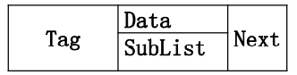

## 多重链表

接下来我们来讲多重链表。刚才我们看了那个广义表的例子。实际上它就是一个多重链表。它里面的一些结点是关于x的一元多项式的一个结点，也是关于y多项式的一个结点。所谓多重链表是指的它里面的这个链表的结点，可能同时隶属于多个链表。也就是说这里面结点的指针会有多个。但是一个结点包含了多个指针并不意味着是多重链表。比方说我们以前见到过的双向链表。一个往前指，一个往后指。但实际上这两个指针所串起来的链表是同一个。无非是指向了结点的不同方向，所以它不叫多重链表。多重链表有广泛的用途，以后我们在树、图里面会大量地用到。多重链表这样的方法来存储。

> 多重链表：链表中的节点可能同时隶属于多个链:  多重链表中结点的指针域会有多个，如前面例子包含了Next和 SubList两个指针域；  但包含两个指针域的链表并不一定是多重链表，比如在双向链表 不是多重链表。

>  多重链表有广泛的用途： 基本上如树、图这样相对 复杂的数据结构都可以采 用多重链表方式实现存储

矩阵最简单表示方法就是二维数组，但二维数组来表示，很明显地有这么几个缺陷，一个这个数组大小事先需要知道，第二个，如果这个矩阵是一个稀疏矩阵，所谓稀疏矩阵，就是说矩阵里面的0很多。一个很典型的例子，假如说我们想表示一个大学里面每个学生选了什么课程，什么课程是被哪些学生选的，所以我们可以用二维数组来表示选课的一种记录。比方说行代表课程、列代表学生，那么对一般学校来讲，学生可能有一两万人，课程可能有三四千门，所以这是一个巨大的矩阵，但是大家可以想象，在这个矩阵里面 0 是很多很多的，非零项是很少很少的，像这种矩阵，我们叫稀疏矩阵。如果我们简单地用二维数组来表示一个稀疏矩阵，很明显地存在一个空间浪费，所以接下来我们在想怎么样节省空间，这个道理跟我们前面讲到的这个多项式的道理也一样。我们前面讲一元多项式 x+3x²ººº。如果你简单地用数组来存储，直接来存储，就会占了大量的空间是0，所以我们是存储非零项。那么在我们这个稀疏矩阵里面，同样地，能不能我也存储非零项。那么存储非零项 —— 非零项的要素是什么？它的信息是什么？

非零项的信息主要是这么几样。A（i,j）的值，它的行i，列j。 所以我们要存储i、j个A（i,j）。也就是说行坐标Row、列坐标Col、还有它的值Value。这是它的关键信息。如果把这三个信息做成一个结点。由于它是个矩阵，矩阵即意味着行跟行之间、列跟列之间还有关系呢，那么怎么建立这样的关系？我们可以通过两个指针，一个Right、一个Down，把行的元素串起来，同一行的元素串起来，把同一列的元素串起来，这就是我们讲的，用多重链表来表示稀疏矩阵的一种方法。那么从这里可以看得到，每一个结点它是同时又属于某一行，同时也属于某一列。


这个是我们刚才看到的A这个矩阵。它的一种多重链表表示。从这里我们可以看到，这里的结点大家看一下，这里的结点共有两种类型，第一种类型是Term类型。Term类型它是有两个指针，一个是指向同一行的，一个是指向同一列的，同一行的指针它把同一行同一列都设计成一个叫循环链表。所以每个结点属于某一行也属于某一列，形成了这样的十字结构，所以我们叫十字链表。我们还有另外一个结点叫Head，这个Head干什么？是作为行这个链表的头结点，也作为这个列链表的头结点，那么大家如果仔细看的话，可能还可以发现这里还有一个结点--左上角，这个结点它的结构是跟Term一样的，因为Term我们说是代表稀疏矩阵里面的非零的项，现在左上角这个Term干啥用？它是整个稀疏矩阵的一个入口，这里的行值、列值跟Value值是什么呢？这里大家看到了4、5、7，4代表这个稀疏矩阵总共有4行，总共有5列，非零项个数总共有7项，也就是说这个矩阵是一个4行5列的这样的一个稀疏矩阵，非零项总共有7项，所以它的结构跟Term结构是一样的。通过指针，这个指针，它就可以找到所有列的头结点，所有行的头结点。所以这个是整个矩阵的一个入口结点，通过它可以知道整个矩阵的有关信息。多少行、多少列、多少个非零项。

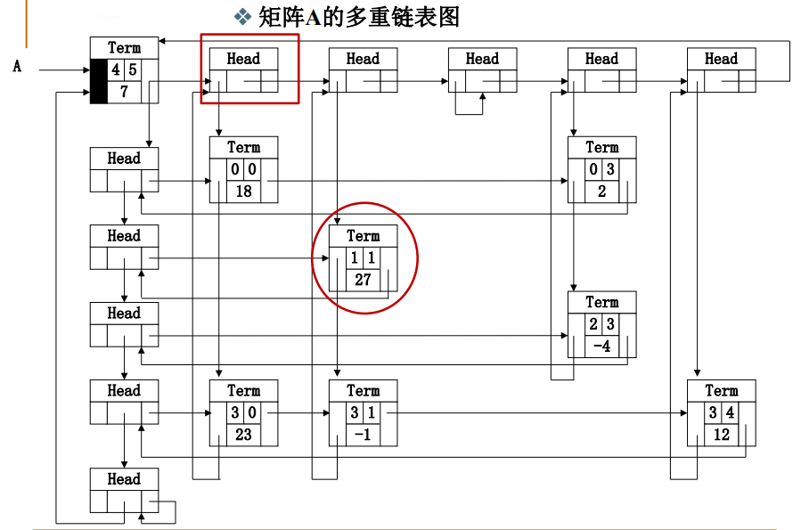

我们有两个不同的结构，一个是Head的结构，一个Term的结构，一个是Head的结构，一个Term的结构，这两个结构明显不一样，但是有共性，都有两个指针，一个行方向，一个列方向。这是他们的共性，但是里面的内容是不一样的。同样地，我们可以采用一种方法，就是把这两个不同的结点，通过union把它串在一起，也就是说不管是Term结点还是Head结点，它们的共性都是有两个指针：一个Down、一个Right。它们不一样的地方是在这，一个是Row、Col、Value，一个是Next。所以我们可以建立一个union，把这两项内容union在一起，形成一个统一的结构，就是我们上面这个结构。所以这就是稀疏矩阵用十字链表解决的一种基本的思路

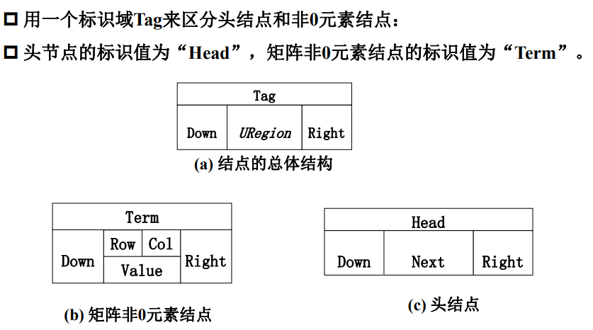

# 堆栈

堆栈是一种线性结构 也是一个特殊的线性表。堆栈在计算机学科领域里面有广泛的用途。像我们的函数调用、递归、表达式求值。 

## 什么是堆栈

表达式求值 我们这里讲的表达式指的是算数表达式，大家都很熟悉 比方说 5+6/2-3*4。这样的一个表达式 计算机里面是怎么求解的。如果表达式没有一个优先级，这样的表达式的求解是很容易的，那关键的问题是 我们的运算符号它是有优先级的。所以就把这个问题变得比较复杂了。一般的算数表达式它是有两类对象所构成的，一个我们叫运算数 一个我们叫运算符号，而这个运算符号又是有优先级的。表达式到底为什么复杂呢，因为我们的运算往往是放在两个运算数的当中，所以我们什么时候做计算，我们是看到运算符号的时候我们就希望做计算，而这个时候呢 你只知道一个运算数，另一个运算数还在后面，但是紧挨的这个运算符号后面那个运算数呢，又不一定是参与你这个运算的那个运算数，就像我们这里的5+6，你看到了6呢 这个6不一定是拿来做加法运算的。后面的还有个运算呢，那个运算优先级比你高 它的除比你高，所以先后面算完了之后 你才把它加进来，所以正是由于表达式是把运算符号放在当中，所以其实这个求值就变得比较困难了，反过来碰到运算符号的时候，我们已经知道两个运算数了，那这个计算是不是就比较简单了，这种表达式呢就是运算符号是在两个运算数的后面，这个我们叫做后缀表达式。

> 计算机如何进行表达式求值？
>
> 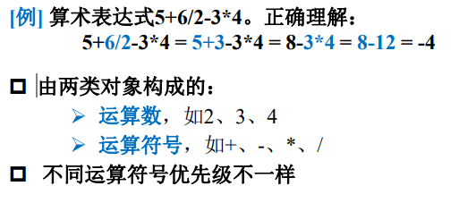

### 后缀表达式

我们日常生活当中使用的表达式是中缀表达式，是运算符号位于两个运算数当中，比方说 a+b * c-d/e，那么我们的后缀表达式呢，就是把运算符号放在这个运算数之后，比方说abc * +de/-。这里看到的中缀和后缀表达式 它是等价的。但是比较明显 我们可以看得到，后缀表达式求表达式的值相对容易，因为我们碰到运算符号的时候，两个运算数在前面已经知道了，马上就可以做计算了，不像中缀表达式一样 还要等 还要去后面看，所以接下来我们看一下后缀表达式 它怎么求值。比方说这么一个表达式 它怎么求值呢。按计算机一般处理数据的方法。是一个个地扫描 一个个地处理，那么对这样的表达式 我们很自然地 就是这样的，从左往右看 先碰到了一个6 记住，再碰到了一个2 再记住 然后碰到了一个/，我们知道了 后续要做除法运算，而这两个除法运算的运算数前面已经有啦，所以可以把前面两个数 拿来除一下，那么得到了一个结果 就是等于3。接下来我们再往后面看，又看到了一个3 又碰到了一个减号，所以这个时候知道了，减号它要减的两个数也知道了，就是把这两个3减一减 得到一个结果就是0。接下来我们再往后看 看到了一个4，看到了一个2，那么这个时候呢 再往后看，看到了一个乘法运算，那么我们也知道了，这个乘法运算是谁跟谁乘的啊，是最后的两个数 是4跟2乘，得到的结果是 等于8。所以我们就得到了一个0 一个8，接下来再往后看 看到了一个加法运算。这个时候两个运算数也知道了 0和8加起来，所以我们最后得到的结果就等于8。

所以这就是我们讲的它的一种计算策略基本上是这样的。从左往右扫描 逐个处理运算数和运算符号，当碰到运算数的时候 把它记住，当碰到运算符号的时候，就把最近记住的两个数来做对应的运算，所以按照这样的策略，我们需要有一种数据结构来有效地组织，记住我们的运算数。这个数据结构应该满足什么条件呢？它能按顺序记住 我给你的这些数，当我需要运算的时候，你能够把最后两个数拿出来做运算，所以这样的数据结构就有一个特点，就是 先放进去的后拿出来，后拿进去的先拿出来做运算，那么这实际上就是堆栈。

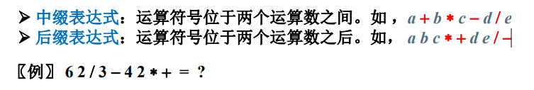

> 后缀表达式求值策略：从左向右“扫描”，逐个处理运算数和运算符号 1. 遇到运算数怎么办？如何“记住”目前还不未参与运算的数？ 2. 遇到运算符号怎么办？对应的运算数是什么？

> 启示：需要有种存储方法，能顺序存储运算数， 并在需要时“倒序”输出!

对刚才这个例子 我们来看一下，这样的数据结构是怎么实现的。我们说的堆栈 一定要有这个特点，我逐个地往里放 我要往里拿的时候 再反过来拿，所以我们可以把这个东西很形象地，用倒立的 口子朝上的东西来进行存储，记住我们的运算数。所以我们碰到一个数字就往里面放，碰到一个运算符就拿两个数出来算，算出来的结果再放回去。依次类推，直到没有运算符号了，栈顶的元素就是结果。所以就可以很简单地实现我们刚才这个过程，后缀表达式的求值过程，所以可以看到它的时间复杂性呢是线性的。


## 堆栈的抽象数据类型描述

堆栈从抽象数据类型的角度来讲可以这样子做描述。首先的话 它是一个受约束的一种线性表，它只能在一端做插入跟删除，插入数据的地方我们叫做入栈，删除数据呢我们叫出栈，它有一个很重要的特点叫后入先出。

> 堆栈（Stack）：具有一定操作约束的线性表 只在一端（栈顶，Top）做 插入、删除

>  插入数据：入栈（Push）  删除数据：出栈（Pop）  后入先出：Last In First Out（LIFO）

它的操作主要是有这么5种，对任何一个堆栈S 它的元素叫item，它是属于类型ElementType。其中最主要的是两个操作，一个叫Push 一个叫Pop，就相当于做插入跟删除操作，当然要注意 做插入跟删除的时候，往往会伴随要判别堆栈有没有满，你插入的时候有没有满，删除的时候有没有空。

```C
类型名称: 堆栈（Stack）
数据对象集：一个有0个或多个元素的有穷线性表。
操作集：长度为MaxSize的堆栈S ∈ Stack，堆栈元素item ∈ ElementType
1、Stack CreateStack( int MaxSize )： 生成空堆栈，其最大长度为MaxSize；
2、int IsFull( Stack S, int MaxSize )：判断堆栈S是否已满；
3、void Push( Stack S, ElementType item )：将元素item压入堆栈；
4、int IsEmpty ( Stack S )：判断堆栈S是否为空；
5、ElementType Pop( Stack S )：删除并返回栈顶元素；
```

我们一开始CreateStack() 建立一个空的堆栈，然后Push(S,A) 把A放进去，再Push(S,B) 把B放进去，再Push(S,C) 把C放进去，接下来呢我们做Pop，Pop一个出来 就出来一个C，再Pop一个出来就出来B，再Pop出来就出来A。最后堆栈就变成空的了。它产生的结果呢就是把原来进去的顺序倒个个。

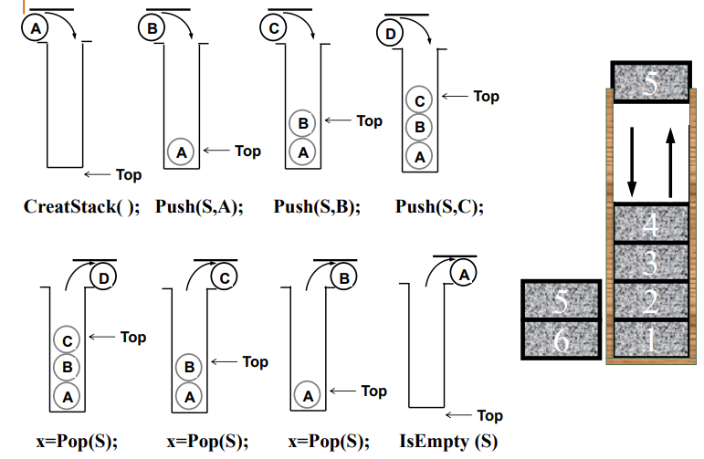

实际上 Push 和Pop穿插进行，比方说 我们刚才讲了3个Push 3个Pop，那么它输出来结果呢，就是把你刚才Push进去的ABC的顺序，倒个个 出来的结果是CBA。第二个是一个Push Pop Push Push Pop Pop，那么Push(S,A)进去 再Pop 就A出来，再Push(S,B) Push(S,C)，这个时候呢 我们B在下面 C在上面，接下来Pop的时候就Pop 出C出来，再Pop呢就Pop出 B出来。所以这样的序列它出来呢就是ACB这样的序列。

同样的 Push Pop的序列呢 我们可以写出很多，那就会产生不同的输出结果，那这里就有一个问题，我们刚才讲了 ABC三个顺序进去，那么它出来的序列，是不是3个ABC的所有排列都有可能呢，我们来看一下 CAB可以产生吗，不可能，你要让C出来 一定是把A Push进去了，B也Push进去了，这个时候才能Push C 再把C Pop出来，C成为第一个，当C成为第一个的时候意味着AB都在里面，而且先后顺序是先放A 再放B，因为我们规定好了要按ABC这样的顺序进去的，所以这个时候 A在下面 B在上面，那你怎么可能把A从底下弹出来呢，一定是先弹出B再弹出A，所以不可能出现CAB这样的一种序列。同样大家可以思考一下如果是ABCD 4个，有几组是可能的 几组是不可能的，

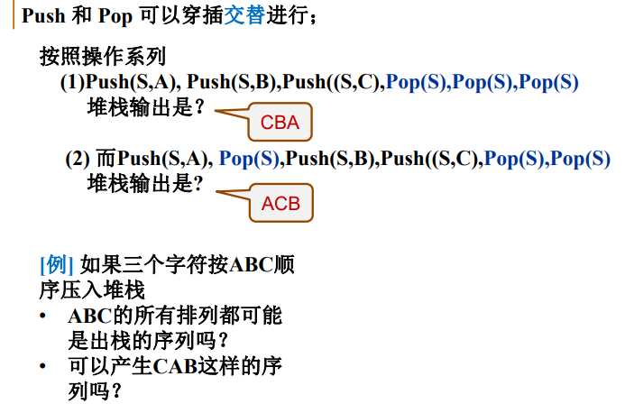


## 栈的顺序存储实现

一个很自然一种想法呢，就是把堆栈用一个数组来进行实现，这样的一种堆栈 它不仅需要一个数组，而且还需要有一个地方来记录，当前栈顶的元素在哪个位置，所以我们可以用这样的结构来表示我们的堆栈。这个结构 包含了两个分量，一个叫Data是一个数组，数组的分量是ElementTpye这个类型，然后我们用个Top 这个变量，来指示这个栈顶在哪个位置，当然指示栈顶在哪个位置，这个Top不是一个地址，是一个整型变量，实际上是代表了，就是栈顶位置它的数组下标是在哪里。我们来看一下 相应的操作怎么实现。

> 栈的顺序存储结构通常由一个一维数组和一个记录 栈顶元素位置的变量组成。

```C
#define MaxSize <储存数据元素的最大个数>
typedef struct SNode *Stack;
struct SNode{
    ElementType Data[MaxSize];
    int Top;
};
```

### (1) 入 栈

我们来看一下 相应的操作怎么实现，首先一个入栈，就是我们的Push操作。它包含两个参数 一个是堆栈本身，那么在这里呢 我们是用一个指针来表示 PtrS，它是Stack这种类型的一种指针，也就是说一种结构指针。准备入栈呢 这个item，那么来看一下 假定说这是一个堆栈，当前的Top指向的是A这个元素，那么在这个堆栈里面 只有一个元素 Top值等于0，当Top值等于0的时候，意味着在分量下标为0的这个地方是有一个元素，那么没有元素呢？栈空呢？栈空就是Top就是在再下面一个位置，再下面一个位置呢就是-1，所以在用数组表示堆栈的时候呢，Top -1就代表堆栈空，那么现在 我们Top是指向分量下标为0的位置，下面 我们想放进一个元素B，所以这个时候呢 它应该是把Top+1，Top挪到上面这个位置 然后把这个item放到这个里面去，这样完成了一次入栈的操作，那么入栈操作首先判别一下 堆栈满不满，因为我们用数组来表示，数组的话 它有界限，也就是说 最多放MaxSize这些元素。因为数组的下标是从0开始的，所以从0一直到MaxSize-1，所以当你的Top指向MaxSize-1的时候，意味着全部放满了 n个元素全部放满了，那么这个时候呢 就指示栈满 就return，否则的话就把我们的item放进去，item放哪个位置呢，item应该是放Top上面的一个位置，所以我们用一个赋值语句，叫做item赋给Data[++(Ptrs->Top]，这样的一个语句实际上做了两件事情，一个是把item是把Top放到加1这个位置，同时把Top值加个1，所以++放在Top前面，这实现了入栈的操作。

```C
void Push( Stack PtrS, ElementType item )
{
 if ( PtrS->Top == MaxSize-1 ) {
 	printf(“堆栈满”); return;
 }else {
     PtrS->Data[++(PtrS->Top)] = item;
     return;
 }
}
```

### (2)出栈

那么同样的 有这样的一个过程，我们搭建的Top值就等于1，且指向数组的第二个分量，下面我们要把它出栈，要Pop一下，Pop之后呢 就是要把B抛出来return出来，然后Top值自己要减掉，指向下面这个位置，所以出栈它要做两件事情，一件事情要return一个值，下标为Top这个位置的值，同时 要把Top值减个1，所以我们就通过return这个PtrS->Data[(Ptrs->Top)--]，这样的操作就可以完成这两个功能。但是在做出栈之前 我们检查一下堆栈到底空不空，如果空 那我们要显示出一种信息，所以一开始的时候有个if语句，来判别一下Top是不是等于-1。

```C
ElementType Pop( Stack PtrS )
{
 if ( PtrS->Top == -1 ) {
 printf(“堆栈空”);
 return ERROR; /* ERROR是ElementType的特殊值，标志错误*/
 } else 
 return ( PtrS->Data[(PtrS->Top)--] );
}

```

### [例] 请用一个数组实现两个堆栈，要求最大地利用数组空间，使 数组只要有空间入栈操作就可以成功。

下面我们来看一个例子，用一个数组实现一个堆栈，那弄一个数组能不能实现两个堆栈呢？我把数组对分，左边一半是个堆栈 右边一半是另外一个堆栈，这样的话一个数组就实现了两个堆栈，那如果说我们是这样子来做的时候，我们来看一下有什么问题。堆栈1是往右边长，堆栈2也往右边长，所以大家都空出来 右边这一段是空的，那么假定说第二个堆栈它继续长，到后面 放满了，那么这个时候想把元素放到第二个堆栈里面去就放不进去了，而这个时候呢 事实上数组还是有空余空间的，也就是第一个堆栈它还剩了一些地方没放，所以如果简单地把一个数组对分，来做2个堆栈就会存在一个问题，会有一个堆栈满了而另外一个堆栈是空的，它还有空余空间。所以我们的要求是 只要数组有空余空间，那么就允许有入栈操作，那怎么做呢？我们可以换一种思路，一个数组我们做两个堆栈，分别往当中长 大家都往当中放（一个往右长，一个往左长），所以如果这样的话 第一个堆栈放到这个位置，第二个堆栈放到这个位置，那么当中是空余的 大家都好用的，所以如果第一个堆栈，想把元素往里放的时候就往右边挪，第二个堆栈想把元素往里放的时候，就往左边挪。反过来删除就倒过来 向相反的方向做。

这样做 很明显的好处，只要你这个数组还有空余空间，那么我的入栈操作就可以完成，我们大家来看一下怎么判别这个堆栈满了。第一个堆栈是有个top1，第二个堆栈有个top2，是不是把top1 加top2等于n，那就代表堆栈满了呢？这样显然不行，因为我们的top1是代表了数组的下标，我们的top2也是数组的下标，都是距离数组头部的距离，显然用他们两个相加来判断。所以我们的思路是从两头往中间增长，当两个堆栈的指针相遇的时候 堆栈就满了，而不是说把top1加top2等于n的时候就满了。

> 【分析】 一种比较聪明的方法是使这两个栈分别从数组的两头开始 向中间生长；当两个栈的栈顶指针相遇时，表示两个栈都满了。

我们可以定义这样的数据结构，我们用一个数组Data，然后用两个Top，一个Top1 一个Top2，当然这里都是代表Data这个数组的下标，什么时候是空的，第一个堆栈什么时候空 第二个堆栈什么时候空，第一个堆栈空的条件 跟当堆栈是一样的，也就是说-1的时候是空的。而第二个堆栈什么时候是空的呢，就是说指针是跑到外面来了 跑到这种位置来了，那么这个位置是什么呢 就是MaxSize，因为数组的最后一个位置是MaxSize-1。再过去一个就是MaxSize。所以的话 用-1跟MaxSize，分别来表示这两个堆栈的空的位置，我们来看一下里面具体的Push操作

```C
#define MaxSize <存储数据元素的最大个数>
struct DStack {
 ElementType Data[MaxSize]; 
 int Top1; /* 堆栈１的栈顶指针 */ 
 int Top2; /* 堆栈２的栈顶指针 */
} S;
S.Top1 = -1; 
S.Top2 = MaxSize;
```

那么我们的Push操作 就是把我们的一个item，要放到某一个堆栈里去，那么我们有两个堆栈，到底怎么区别第一个堆栈跟第二个堆栈呢，我们这里用了一个变量Tag，当Tag等于1的时候 代表第一个堆栈，否则的话就代表第二个堆栈。这里面的话，PtrS就是我们讲的前面那个结构的一个指针，里面有3个分量 一个数组 然后Top1 跟Top2，那么我们要把元素放到Tag标记的那个堆栈里去，所以我们的第一步要判别堆栈是不是满了，不是用Top1加Top2是不是等于MaxSize判断，而是不是两个挨在一起了。挨在一起就Top2-Top1等于1。所以如果是这种情况就属于堆栈满了，否则的话我们看一下，你是想入第一个堆栈还是入第二个堆栈，如果入第一个堆栈，我们就把item放到Top1的后面一个位置，如果是第二个堆栈，我们就把item放到Top2及前面一个位置，所以的话 在这里面，第一个堆栈跟第二个堆栈操作是不一样的。一个是++操作 一个是--操作，因为第一个堆栈 Top是往后长，第二个堆栈 Top是往左边长 往前长，所以一个是++ 一个是--。

```C
void Push( struct DStack *PtrS, ElementType item, int Tag )
{ /* Tag作为区分两个堆栈的标志，取值为1和2 */
 if ( PtrS->Top2 – PtrS->Top1 == 1) { /*堆栈满*/
	printf(“堆栈满”); return ;
 }
 if ( Tag == 1 ) /* 对第一个堆栈操作 */
 	PtrS->Data[++(PtrS->Top1)] = item;
 else /* 对第二个堆栈操作 */
 	PtrS->Data[--(PtrS->Top2)] = item;
}
```

那我们来看一下 Pop操作，抛出一个元素 同样的，到底从哪个栈里抛出一个元素也需要一个tag，这个Tag来指示我到底是对第一个堆栈操作。所以这里就区分两种情况，当Tag等于1的时候要判别一下 堆栈1空不空，堆栈1空不空怎么判别呢，就是看它是不是等于-1。所以如果堆栈1不空，那么这个时候我们就做else操作，就return。那么这个语句跟前面，我们用数组来表示当堆栈的时候是一样的。反过来Tag不等于1 就对第二个堆栈操作，同样的我们要判别一下 第二个堆栈空不空，第二个堆栈空不空呢是这个语句，如果它不空 我们就return，return Data 由Top2所指向的分量，同时把Top2 挪一下，往哪边挪 往右边挪，所以这边呢是一个++。

```C
ElementType Pop( struct DStack *PtrS, int Tag )
{ /* Tag作为区分两个堆栈的标志，取值为1和2 */
     if ( Tag == 1 ) { /* 对第一个堆栈操作 */
         if ( PtrS->Top1 == -1 ) { /*堆栈1空 */
            printf(“堆栈1空”); return NULL;
         } else return PtrS->Data[(PtrS->Top1)--];
     } else { /* 对第二个堆栈操作 */
         if ( PtrS->Top2 == MaxSize ) { /*堆栈2空 */
         printf(“堆栈2空”); return NULL;
     	} else return PtrS->Data[(PtrS->Top2)++];
    }
}
```

## 堆栈的链式存储实现

我们前面讲了怎么用数组来实现一个堆栈，同样来讲的话 也可以用链表来实现堆栈，堆栈不会是一个有序的序列 在一头做操作，所以可以想象 可以用一个单向链表来实现我们的堆栈。当然由于堆栈的特点 我们的插入 删除操作，只能在这条链的一头进行 但问题是，对一个单向链表来讲 它是有两头的，比方说这是一个单向链表，这是单向链表的头 这是单向链表的尾，我们究竟是用哪一头来作为我们的Top，我们来看一下，如果我们用左边，就是单向链表的头作为我们的Top，那么在这一头要做插入操作跟删除操作，方便不方便，显然是方便的。我们要做删除，由于头结点它知道下一个元素的位置在哪里，所以你就可以把Top指向下一个元素，我们要插入，那么你只要把插入的结点指向这个头结点，然后把Top指向刚刚插入的结点就可以了。反过来 我们如果把链的尾巴作为我们的Top 行不行，插入操作没问题，我们可以用当前的这个链表的尾巴指向一个新的结点，但删除就有问题了，删了之后 它前一个结点在哪里，因为这是单向链表 找不到前面一个结点，所以 链尾是不能作为Top的，所以当用链表来表示堆栈的时候，一定要记住 它的Top一定是在链表的头上。

> 栈的链式存储结构实际上就是一个单链表，叫做链栈。插入和删 除操作只能在链栈的栈顶进行。栈顶指针Top应该在链表的哪一头？

> (1) 堆栈初始化（建立空栈） (2) 判断堆栈S是否为空

这是我们的结构，那么我们定义了这样的结构 这个结构里面是有两个域，一个叫Data域 一个叫Next域，为了方便操作，我们可以给链式存储这种堆栈 取一个栈头结点，这样的话 在链表里面，插入 删除都处理起来比较方便。

```C
typedef struct SNode *Stack;
struct SNode{
    ElementType Data;
    struct SNode *Next;
} ;
```

设计这个函数 CreateStack 这个函数。就相当于是建一个空的堆栈，它实际上是生成一个堆栈的头结点，这个头结点呢 是不代表任何一个元素，只是通过这个头结点，可以方便地找到堆栈里面的一些具体的元素，所以CreateStack 这个操作，就是首先以通过malloc函数申请这样的一个结点，S指向它 然后S->Next就把它设为NULL，所以我们建一个空的堆栈实际上是形成这样一个结构，将来有结点要插入的时候就是插在这个后面。如果采用这样的一个结构 我们要判别一个堆栈是不是空的，你只要判别S->Next是不是等于NULL，等于NULL那就是后面没结点 那么它就是空的了。

```C
Stack CreateStack() 
{ /* 构建一个堆栈的头结点，返回指针 */
 Stack S;
 S =(Stack)malloc(sizeof(struct SNode));
 S->Next = NULL;
 return S;
}
int IsEmpty(Stack S) 
{ /*判断堆栈S是否为空，若为空函数返回整数1，否
则返回0 */
	return ( S->Next == NULL );
}
```

我们来看一下 Push操作，根据刚才讲的这样的一个结构，那么我们要往堆栈里面插入一个结点，实际上 就是往堆栈的头上插入我们的结点，可以这样子来理解。S是一个指针 它指向的是堆栈的头结点，然后这里有一个指针，指向后面的堆栈的元素，就是从这开始的结点（头节点后面的第一个结点）后面才是真正的元素。做Push操作呢 那么是要把item把它插进去，所以我们的做法肯定是先申请一个结点malloc，然后这个结点 就是由Tmpcell指示到这个地方来，接下来就是把item这个值填到这里去，再下来因为我们是要把它插到堆栈里面去，那就插到链表的头上，那么链表的头在哪里呢，是这个位置（S的后面），那么这个时候 我们要有一个指针指向它，那么同样的 S是堆栈的头结点就要指向新的结点。

```C
void Push( ElementType item, Stack S) 
{ /* 将元素item压入堆栈S */
    struct SNode *TmpCell;
    TmpCell=(struct SNode *)malloc(sizeof(struct SNode));
    TmpCell->Element = item;
    TmpCell->Next = S->Next;
    S->Next = TmpCell;
}
```

pop同理，首先要判别一下 堆栈空不空，那么这个时候 有同学会问为什么我做Push操作的时候为什么不去判别满不满，由于我们这个是由链表来实现，如果是用数组来实现堆栈的时候，数组大小是固定的，所以它存在满不满的问题，那么我们是用链表，我们是通过不断地申请结点空间往里面插，所以这个时候 就不需要判别它是不是满了，在我们做Pop之前，要判别一下是不是空，如果不空 那我们就做一个删除的操作，删除操作跟插入的话就是倒过来。被删掉的节点的空间必须释放，我们用一个变量来记录这个结点。

```C
ElementType Pop(Stack S)
{ /* 删除并返回堆栈S的栈顶元素 */
    struct SNode *FirstCell;
    ElementType TopElem;
    if( IsEmpty( S ) ) {
    	printf(“堆栈空”); return NULL;
    } else {
        FirstCell = S->Next; 
        S->Next = FirstCell->Next;
        TopElem = FirstCell ->Element;
        free(FirstCell);
        return TopElem;
    }
}

```

## 堆栈应用：表达式求值

下面我们回过头来再讲讲表达式的求值问题。前面我们已经讲了后缀表达式的一种实现方法，也就是用堆栈来进行实现，把我们的运算数放到堆栈里去，碰到运算符号的时候呢 把运算数抛出来做计算，再放到堆栈里面去，整个过程就是从左到右读入表达式的各项，然后根据运算数跟运算符号分别做不同的处理。

>  回忆：应用堆栈实现后缀表达式求值的基本过程： 从左到右读入后缀表达式的各项（运算符或运算数）；

> 运算数：入栈； 
>
> 运算符：从堆栈中弹出适当数量的运算数，计算并结果入栈； 
>
> 最后，堆栈顶上的元素就是表达式的结果值。

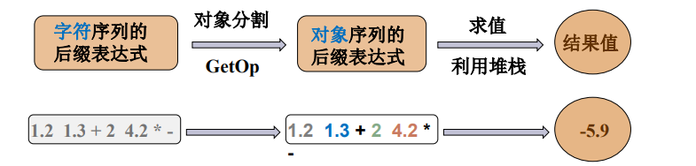

### 中缀表达式求值

其实我们最关心的是中缀表达式，也就是说我们日常生活当中、工作当中，使用的一种算数表达式 它应该怎么处理呢，有没有可能把中缀表达式，转换为后缀表达式 再求值，因为后缀表达式很容易求。我们观察一个例子 2+9/3-5，它所对应的后缀表达式呢是 2 9 3/+5-，观察一下中缀表达式和后缀表达式，我们可以发现 第一个，不管是中缀还是后缀，它的运算数的相对顺序是不变的，都是2 9 3 5。那无非是运算符号发生了变化，所以有没有可能这样子来做，我们碰到2，2输出，碰到加号 那加号能不能输出呢 我们不知道，我们要看后面运算符号的优先级，所以我们把这个运算符号加号呢先记下来，等一等，然后碰到9 输出，碰到除号呢 它能不能输出呢，除号的优先级比加号要高，但是你能不能这个时候就把9除以3呢，不一定的，后面如果还有一个优先级比方说指数运算 3的5次方，那你这个除号 这个时候还不能除呢，所以你看到除号的时候 你仍然需要记住，把它保留下来 等待，然后我们再看 再下面的符号是3 那么3输出，碰到减号 好 这个时候放心了，减号的优先级比除号要低，所以这个时候我们知道 除号可以出来了，所以这样的一种处理过程呢，我们是不是可以这样来理解，碰到运算数 我们就把它输出，碰到运算符号 我们等着，看后面的这个运算符号到底怎么样，也就是说当前读到一个运算符号的时候，我们跟前面的运算符号去做比较，如果前面的一个运算符号的优先级，比我要来的高，就说明它可以拿来计算，如果它优先级比我低，那么这个时候当前的运算符号还不能说我就可以拿来运算了，因为后面可能还有优先级比我高的，所以我仍然要保留起来，所以在这个过程当中 我们就需要一种结构，来实现 我们运算符号的存储，而这个结构呢 就是堆栈。它的特点就是 按顺序来保留这个运算符号，当我要做比较的时候呢 是跟前面一个去比较，这是一般的情况 如果有括号怎么办，下面我们来看一下有括号的例子。a*(b+c)/d 我们来看一看，这样的一种中缀表达式怎么来转化为后缀表达式。

> 基本策略：将中缀表达式转换为后缀表达式，然后求值 如何将中缀表达式转换为后缀？
>
> 观察一个简单例子： 2+9/3-5    =>    2 9 3 / + 5 -

> 1 运算数相对顺序不变 2. 运算符号顺序发生改变  需要存储“等待中”的运算符号  要将当前运算符号与“等待中”的最后一个运算符号比较

> 有括号怎么办？

基本策略仍然跟刚才一样的，碰到运算数 我们就把它输出，碰到运算符号的时候呢 把它存起来，跟后面的运算符号做个比较，所以我们的策略就这样了 用个堆栈。我们碰到一个运算数 那我们把它输出，然后碰到一个乘号，因为这个时候乘号还不能马上出来的，所以乘号得先存起来，接下来呢 碰到一个括号，我们可以把括号当成一个运算，那么大家看看 这个括号的优先级高，还是乘号的优先级高，显然的括号的优先级高，所以它的优先级比乘号要高，那么放到堆栈里去。接下来碰到b 运算数输出，那么再下来碰到+，加是一个运算符号 刚才讲了左括号优先级比乘号高，乘号又比加号高，是不是这个时候 左括号优先级比加号高呢，我们想了想 好像不是这么回事情，当把一个左括号放在堆栈外面的时候，那么这个时候就意味着括号先进行计算，然后 当它放到堆栈里去的时候，这个时候必须要把括号的内容先算完，而这时候不能把左括号拿出来做计算了，所以左括号一旦扔到堆栈里去，它的优先级就降到最低，所以在这种情况下面呢，我们不应该认为 左括号优先级比加号高，而是认为优先级比加号低，那就把加号继续扔进去，所以同样的一个运算符号，它在堆栈外面跟堆栈里面 它的优先级是不一样的，主要指的是左括号。然后碰到运算数c 输出，碰到右括号 这个时候怎么办，这个时候意味着括号这一堆东西已经全部处理完了，那么我们的一种处理方法 就是，把堆栈顶的运算符号，一个一个地抛出来，直到碰到左括号为止，所以就把+抛出来，那么这个时候呢 堆栈里面就只有一个乘号了，接下来我们继续往后看 碰到了除号，除号优先级跟乘号比 谁的优先级高，优先级是一样的，但这里 算数运算里面还有一个规则，同一个优先级的时候 它的顺序是从左到右，也就是说乘号跟除号 碰上的时候呢，它的顺序是左边的优先，所以 就乘号要先运算，这个时候 乘号就可以出来了，就把除号放进去，碰到d，d输出，再往后面看 没了，没了就把堆栈的运算符号也抛出，所以这样的话 就得到了对应的后缀表达式。从这个过程当中可以看到 它的时间复杂性是线性的。每循环一次处理一个运算数 或者运算符号。

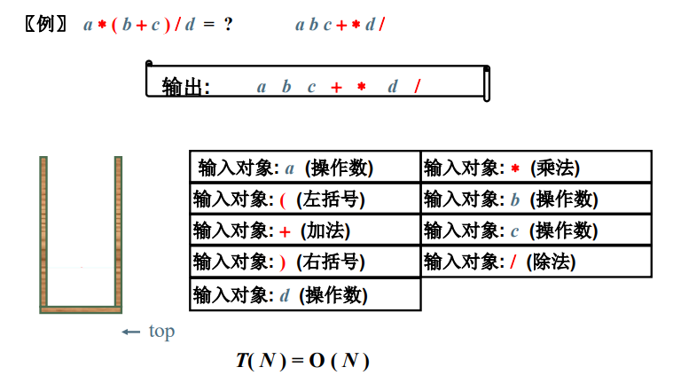

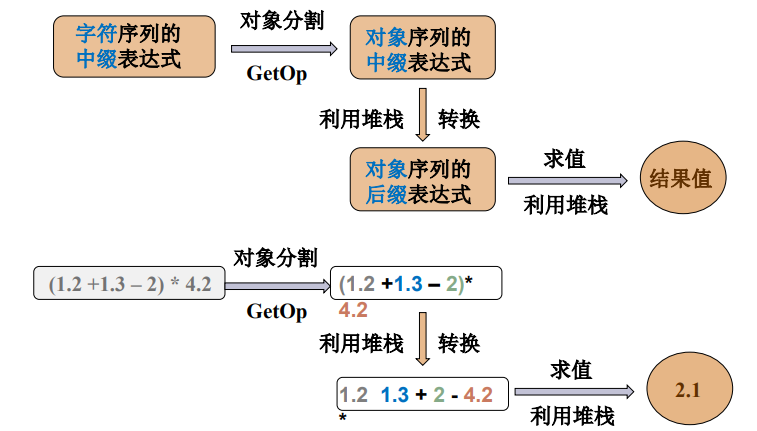

### 中缀表达式如何转换为后缀表达式

那么至于怎么把一个中缀表达式转化为后缀表达式，它的流程 我们总结一下 大概是这样的一个流程，首先 我们从头到尾读取中缀表达式的每个对象，这个对象有几种情况，一个是运算数 一个是运算符号，一个是左括号 还有一个是右括号，我们根据这个不同的情况做不同的处理，如果我们碰到的是一个运算数 那么直接输出，如果碰到的是左括号 把它压到堆栈里去，如果碰到是右括号，就把堆栈顶的运算符号一个一个地弹出来，一直碰到左括号为止，当然这个左括号是不用输出 就扔掉不要了。然后如果是个运算符呢，我们要比较一下 它的优先级跟栈顶运算的优先级，如果它的优先级大于栈顶运算的优先级，我们这个时候就把外面的这个运算符号压到堆栈里去，如果它的优先级小于栈顶运算符的优先级，就把栈顶的运算符号弹出来，然后继续比较，继续把外面的预算符跟栈顶的运算符再做比较，一直到 外面的运算符大于栈里面的栈顶的运算符为止，这个时候就把外面的往里压。

>  从头到尾读取中缀表达式的每个对象，对不同对象按不同的情况处理。
>
> ① 运算数：直接输出； 
>
> ② 左括号：压入堆栈； 
>
> ③ 右括号：将栈顶的运算符弹出并输出，直到遇到左括号（出栈，不输出）； 
>
> ④ 运算符： 
>
> ​	• 若优先级大于栈顶运算符时，则把它压栈；
>
> ​	• 若优先级小于等于栈顶运算符时，将栈顶运算符弹出并输出；再比 较新的栈顶运算符，直到该运算符大于栈顶运算符优先级为止，然 后将该运算符压栈； 
>
> ⑤ 若各对象处理完毕，则把堆栈中存留的运算符一并输出。

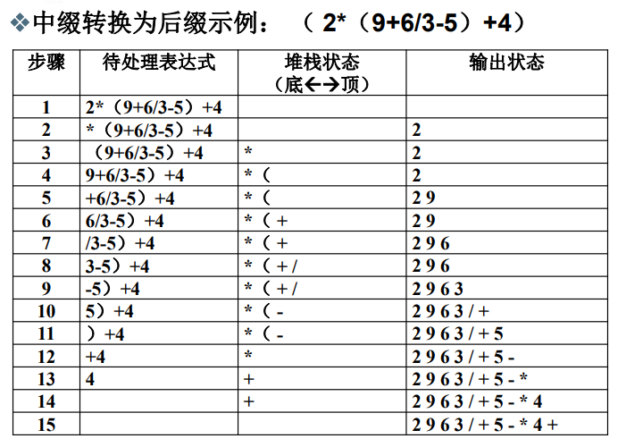

堆栈除了求表达式之外 还有别的很多用途，很典型的 比方说它用在我们实现函数的调用，以及递归的实现过程当中，我们知道在程序设计语言里面，我们从一个函数调用另外一个函数，等那个函数执行完了之后 再回过头来，这里需要解决一个问题，就是那边调用完了回到哪里，还有回来的时候原来的状态要能恢复出来，所以这个时候呢，我们需要把调用之前的一些变量的状态，以及调用回来之后，准备要执行的程序的地址把它保存起来，我们从这个函数调用那个函数，到那个函数的时候呢 它可能还会再调下一个函数，下一个函数还可能还会再调下一个函数，如果是有一系列函数的调用过程，我们就需要保存一系列的东西，而函数调用回来的时候呢，是倒过来一步一步地返回，a调用b b调用c，然后c回到b b再回到a，所以我们需要有一个管理的机制，能够把我们调用之前的一些变量状态，以及我们准备要返回的地址 保留起来，而这个过程可能是一系列执行的，所以你需要一系列地恢复过来，这样的一种能够保存这些变量跟返回地址的，一种数据结构的组织方式呢，它必须要有一个特点，就是按照顺序地存 然后按倒过来的顺序返回，这个特点实际上就是堆栈。堆栈除了在函数调用里面呢，更重要地 它实现了一种递归函数调用的一种实现机制，如果没有堆栈这样的一种实现机制，递归函数要实现是非常困难的。

除了这个之外 在回溯算法的实现当中，堆栈也发挥了重要作用，回溯法是算法设计中一种主要思想，我们教材里面举了一个例子，叫做老鼠走迷宫这样的例子，就是说我们给了一个迷宫，老鼠要从一个入口进去要找到一条路径，从一个出口出来，在这个过程当中，没有什么特别的算法能做这个事情，只能不断地试探，试探各种可能性，从这一步试探 下一步哪个地方可以走，下一步再来试探各种可能性，当到某一步各种可能性试探都走不通的时候，它要回到上一步的位置，然后在上一步的位置进一步地再去试探，所以这个过程呢 要把我们试探的路径保存起来，等到哪一步试探不成功的时候呢，要回到最近一次试探的状态，所以这个实际上也是堆栈的特性，所以有了堆栈呢，我们的回溯算法就可以很容易地实现。

另外还有包括在图里面深度优先搜索的实现，也是借助于堆栈来实现的。当然表现形式很可能是一种递归，实际上它就是堆栈。

> 堆栈的其他应用：  函数调用及递归实现  深度优先搜索  回溯算法.......

## 队列及实现

队列跟堆栈一样的，也是一种受限制的线性表，其实我们在日常生活当中经常会碰到排队。我们来观察一下 什么是队列，它里面有最主要的有两个操作，一个叫做入队 一个叫做出队。也就是有人加入到这个队伍，还有人受到服务之后离开这个队伍。你加入这个队伍 必须加在队尾，然后你接受服务从对头开始。

### 什么是队列

队列它是一个 我们叫做受操作约束的一种线性表，它两个最主要的操作，插入跟删除分别发生在队列的两头，而一般的线性表都可以在任何位置进行插入和删除，对比堆栈 堆栈也是一个受限的线性表，但是我们知道堆栈它的插入 删除 只能在一端进行，而队列是分别在两端，数据的插入我们称之为入队，数据删除我们称之为出队。所以由于它是从一端插入另外一端删除，所以它表现出来的特点 叫做先来先服务，所以它这种表又被称为先进先出表。

> 队列(Queue)：具有一定操作约束的线性表  插入和删除操作：只能在一端插入，而在另一端删除。

> 数据插入：入队列（AddQ）  数据删除：出队列（DeleteQ） 先来先服务 先进先出：FIFO

### 队列的抽象数据类型描述

队列它的操作涉及到队列Q 还有里面的一个item，它的类型是ElementType 这个类型。五种主要操作。

```C
类型名称：队列(Queue)
数据对象集：一个有0个或多个元素的有穷线性表。
操作集：长度为MaxSize的队列Q  Queue，队列元素item  ElementType
1、Queue CreatQueue( int MaxSize )：生成长度为MaxSize的空队列；
2、int IsFullQ( Queue Q, int MaxSize )：判断队列Q是否已满；
3、void AddQ( Queue Q, ElementType item )： 将数据元素item插入队列Q中；
4、int IsEmptyQ( Queue Q )： 判断队列Q是否为空；
5、ElementType DeleteQ( Queue Q )：将队头数据元素从队列中删除并返回。
```

### 队列的顺序存储实现

队列的存储实现也一样的有两种方式，一个是顺序存储 一个是链式存储，顺序存储就是用我们这个数组来进行表示，也就是我们用一个数组来存储我们队列的元素，因为队列有两头 我们在一头插入 另外一头删除，所以我们有两个变量来指示这两头，队列的头我们叫front 队列的尾叫rear。我们对比堆栈，堆栈是一个数组 再加上一个Top，因为它只在一头插入 删除，所以用一个变量Top就可以，而我们队列是在两头发生 所以用front和rear，那么这就形成了我们队列的一个结构。

所以我们给定一个队列 它这个结构，这个结构呢 有三个分量，一个是Data 是个数组，然后另外是front跟rear 这两个指针，实际上是数组的下标。

> 队列的顺序存储结构通常由一个一维数组和一个记录队列头元 素位置的变量front以及一个记录队列尾元素位置的变量rear组成。

```C
#define MaxSize <储存数据元素的最大个数>
struct QNode {
    ElementType Data[ MaxSize ];
    int rear;
    int front;
}; 
typedef struct QNode *Queue;
```

假定说我们有一些工作需要处理，那么我们按照这个工作到来的先后顺序进行处理，所以我们准备要处理的这些工作就形成了一个队列，那么一开始的时候队列是空的，这个时候front rear指向哪里呢，一开始我们都可以把它设为-1，那么大家都等于-1 这个时候队列就是空的了。接下来我们往里面加入一个工作，那么这个时候呢 rear 就指向了0，再加一个工作 rear再往后挪，往后挪就是加1 下标往后挪一位，然后 下面接下来操作呢，我们要从队列里面删除一个元素了，我们连续加入3个元素 然后要删除1个元素了，这个时候 front的值等于-1，因为没有删除 所以front一直保持不动，所以实际上这个front是指向队列的头一个元素的再前面一个，也就是头一个元素是0 再前面一个-1，所以这个时候front值是-1，然后我们删除了一个Job，挪走一个，现在队列头在下标为1的位置，但是我们front指向是0。所以整个队列操作就是当你加入一个元素的时候呢，rear加1 删除一个元素的时候 front加1。

我们再加一个元素 我们到了这个状态（rear走到头了），这个状态我们看到了这个队列已经排到了数组的最后了，这个时候你想加入一个元素 就加不进去了，而实际上 我们队列呢 前头还是空的，但是你加不进去了 因为你已经排到最后了，所以这个时候要想一个办法来解决这个问题，我们很自然地就想到，后面排不了你就排到前面去就可以了，接下来如果来新的元素的时候，我们可以把新的元素放在这个位置，那么这就形成了我们后面称之为的叫做顺环队列。

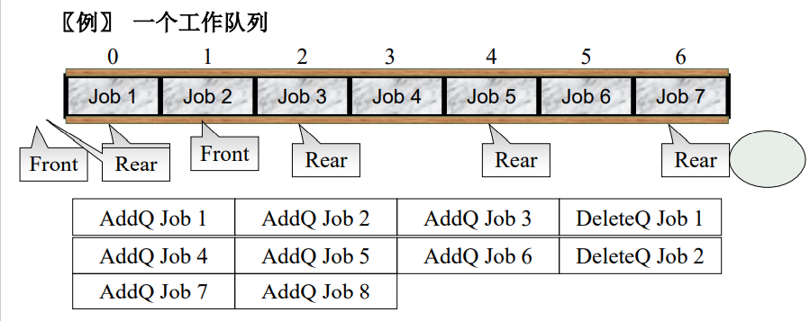

就是我们把这个数组扳过来 形成一个环，所以你一直放 从0的这个位置开始放，放满了 接下来再回过头来再放到0，这就形成了我们顺环队列这样的组织结构，那么一开始的时候呢 front rear都指向某个位置，front rear相等的时候是空的，因为按照我们前面的组织方法，rear是指向这个队列的实际的最后一个元素的位置，而front是第一个元素的前一个，所以当front跟rear相等的时候，就意味着这个队列里是没有元素的，接下来 我们开始加入一个元素 那么rear落到这个位置，front保持不动 还在0这个位置，所以这个时候队列有一个元素，rear等于1 front等于0，我们再加，又加了一个元素，再加，不断的加，一直到rear再加就和front重合了，总共这个数组分量是6个，我们现在已经放了5个元素了，如果这个时候 我们再想放一个元素，会发生什么，这个数组本身有一个空位，照道理是应该能加进去，但是加进去之后产生什么结果呢，加进去之后rear 加1等于1，front也等于1，front rear相等了。按照这样的组织方法 front rear相等，是代表队列是空的，现在呢 被你加了一个元素 队列满了，front rear也等于1，那么倒过来说 front rear如果相等，我问你 队列是空的还是满的，你就搞不清楚了，因为空的时候 front rear相等，满的时候 front rear也相等，所以这就是我们碰到的一个问题，那么为什么会出现这种情况，我们判别队列的状态 也就是说这个队列到底，是空还是一个元素，还是两个元素 还是满，我们是怎么判别的，我们是根据front rear的相对关系，也就是说它们的距离 来判别的，而front rear的取值范围是0到n-1，对我们这个例子来讲是0到5，所以front跟rear的差距是几种情况，也是这6种情况 0到5，也就是说 我这个数组，如果大小是n的话，front跟rear之间的差距 它的情况就是n种，那么我们来看一下 队列有几种情况。对于我们这6个元素组成的数组来讲，队列的情况有这么几种 什么元素也没有 这是一种情况，1个元素 2个元素 3个元素 4个元素，5个元素 6个元素，所以数组大小如果是等于n的话，队列的装载元素的情况有n+1种，而我们要判别队列空满 或者它的队列放多少元素的状态，是根据front rear的差距，这个差距只有n种情况，也就是你想用n种的状态 来区分实际上存在的n+1种情况，怎么可能 ，一定有矛盾，就像我们用一个bit 用一个0 1，让你来区分3种情况 做不到。所以这是它的根本原因。

解决的方案有两种，第一种我们增加一个额外的标记，比方说我们用个变量Size 或者tag，Size是用来记录当前队列元素的个数，当你加入一个元素的时候 Size加1，删除一个元素的时候呢 Size减1，所以我只要根据Size是等于0还是等于n，就可以知道是空的还是满的，所以这是一种。另外一个呢 我用一个标记tag 0 1，当你插入一个元素的时候呢，Tag设为1 删除一个元素的时候tag等于0，所以当你front跟rear相等的时候，你搞不清楚是空或满的时候，你就要去看这个tag，这个tag就代表了最后一次操作是插入还是删除，那么你就知道了到底是空还是满 所以这是一种解决方法。另外一种解决方法呢 我这个数组大小虽然是n，但是我不放满 不放n个元素，最多只放n-1个元素，就像我们这个一样的 数组有6，但是我最多放5个，到了目前这个状态就认为是满了 不能再放了，所以这个时候也不会出现 front跟rear相等，不知道空和满的情况，所以这是我们的解决方法。

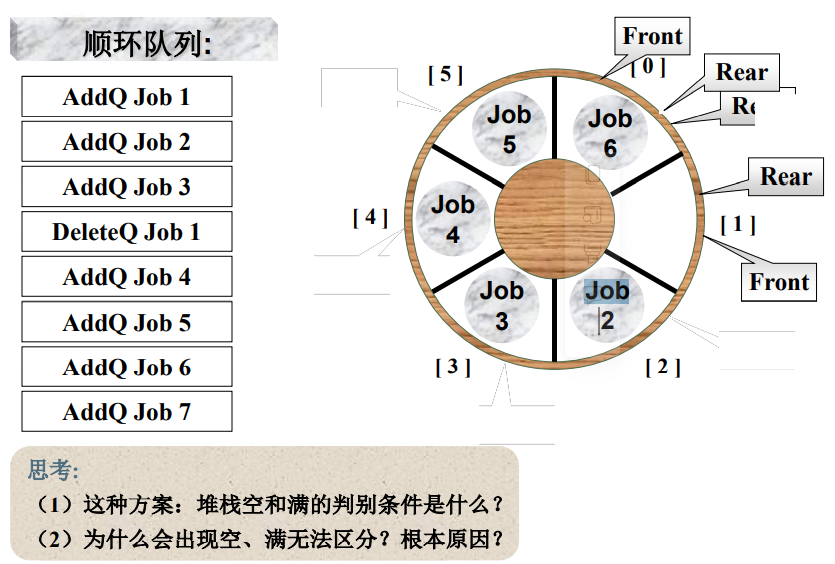

#### (1)入队列

我们可以采取第二种方案。就是说不要把它全放满 就最多放n-1个元素。按这样的一种原则 我们可以设计出相应的入队函数，我们有个item 我们要放到队列里面去，这个队列呢 我们用一个Queue的结构指针PtrQ 来进行表示，那么这个时候 我们要看一下 队列是不是满的，怎么判别队列是不是满的呢。从我们前面这个例子也看到，我们要加入一个元素，那么rear要加1，rear加1 的时候 跟front碰上了，所以这个时候我们就认为它是满的。前面我们还讲到过了，我们这是一个顺环队列，一个个地 就是一直放从0开始放 放到5，5的下一位置是0，那么在程序上怎么实现5的下一个又是变成0呢？我们用求余函数 5+1对6求余 就是等于0了，所以这是我们实现顺环队列的方法 用求余函数，所以的话 我们入队的操作要首先判别队列是不是满了，是不是满了就是说 rear加1 然后求余，是不是等于front 如果等于，就是说明是满了。如果不等于 这个时候我们rear加1再求余，所以一般情况就是rear加1 了，到最后一位的时候呢 一求余就变成0，然后我们把item放进去 放到数组里面去，这是入队 非常简单。

> Front和rear 指针的移动 采用“加1取 余”法，体 现了顺序存 储的“循环 使用”。

```C
void AddQ( Queue PtrQ, ElementType item)
{ 
 if ( (PtrQ->rear+1) % MaxSize == PtrQ->front ) {
 printf(“队列满”); 
 return;
 }
 PtrQ->rear = (PtrQ->rear+1)% MaxSize;
 PtrQ->Data[PtrQ->rear] = item;
}
```

#### (2)出队列

出队也一样的，我们要判别一下队列是不是空的，怎么判别是不是空的呢，就是我们前面看到的，比较front rear是不是相等，如果相等就是空了，否则的话 就出队，出队怎么做呢，就是front加1，front加1 同样的 我们也求余，所以一般情况下就是front加1，到最后一位的时候 加1求余就变成0了，我们知道这个front是指向队列头上的前一个，所以front加1的时候呢，front值指向正好是队列头上元素的位置，所以就return Data front就可以了，

```C
ElementType DeleteQ ( Queue PtrQ )
{ 
 if ( PtrQ->front == PtrQ->rear ) { 
 printf(“队列空”);
 return ERROR;
 } else {
 PtrQ->front = (PtrQ->front+1)% MaxSize;
 return PtrQ->Data[PtrQ->front];
 }
}
```

#### 代码

```C
typedef int Position;
struct QNode {
    ElementType *Data;     /* 存储元素的数组 */
    Position Front, Rear;  /* 队列的头、尾指针 */
    int MaxSize;           /* 队列最大容量 */
};
typedef struct QNode *Queue;

Queue CreateQueue( int MaxSize )
{
    Queue Q = (Queue)malloc(sizeof(struct QNode));
    Q->Data = (ElementType *)malloc(MaxSize * sizeof(ElementType));
    Q->Front = Q->Rear = 0;
    Q->MaxSize = MaxSize;
    return Q;
}

bool IsFull( Queue Q )
{
    return ((Q->Rear+1)%Q->MaxSize == Q->Front);
}

bool AddQ( Queue Q, ElementType X )
{
    if ( IsFull(Q) ) {
        printf("队列满");
        return false;
    }
    else {
        Q->Rear = (Q->Rear+1)%Q->MaxSize;
        Q->Data[Q->Rear] = X;
        return true;
    }
}

bool IsEmpty( Queue Q )
{
    return (Q->Front == Q->Rear);
}

ElementType DeleteQ( Queue Q )
{
    if ( IsEmpty(Q) ) { 
        printf("队列空");
        return ERROR;
    }
    else  {
        Q->Front =(Q->Front+1)%Q->MaxSize;
        return  Q->Data[Q->Front];
    }
}
```


### 队列的链式存储实现

队列的另外一种实现方法呢，就是链表，这跟我们堆栈一样的，所以同样地 我们可以用单向链表来实现我们的队列，这个时候同样的问题就冒出来了，比方说 这是一个单向链表，我们有两个东西 一个叫front 一个rear，那么链表有一个头 有一个尾，那么我们到底front设在链表的头，还是front设在链表的尾，这个问题跟我们前面堆栈的时候讨论过的问题是一样的，我们说front是要做删除操作，rear是要做插入操作，而链表的头也就是说是这个位置，这个位置做插入或者删除都方便的，删除很快可以找到下一个，插入 知道这个位置了 所以也方便直接插入，链表的末尾做插入没有问题，做删除有问题。因为这是单向链表，你删了之后不知道前面一个在哪里，所以的话 这个位置（链表尾）是不能做front，所以我们如果这样做的话，只能这里（链表头）做front，这里（链表尾）做rear。这里前面做删除 后面做加入，你不能倒过来，倒过来如果后面做front的时候呢，删掉了就不知道前面一个在哪里了。所以这是我们链表实现的时候，它的一个设计的要注意的这样的一点。

> 队列的链式存储结构也可以用一个单链表实现。插入和删除操作 分别在链表的两头进行；队列指针front和rear应该分别指向链表的哪一头？
>
> 

这是我们具体的数据结构，我们在这个链表里面 每个结点，都有2个域 一个叫Data 是结点本身的信息，还有一个指针Next是把结点串在一起，这是链表的结点结构。接下来我们要有一个结构，来代表这个队列，最主要的就是两个指针，两个指针 一个是front 一个是rear，分别指向链表的头和尾，这个显示的是用链表实现队列它的基本思路。这边的话 这里的每一个Node，链表里面每一个结点就是我们定义的Node，然后我们这里定义的结构 就是front rear，就是指这个结构，所以每个链表 它是一个结构，这个结构实际上就两个指针，分别指向当下链表 就是队列的头跟队列的尾，所以我们这边定义的两个结构。

```C
struct Node{
 ElementType Data;
 struct Node *Next;
}; 
struct QNode{ /* 链队列结构 */
 struct Node *rear; /* 指向队尾结点 */
 struct Node *front; /* 指向队头结点 */
}; 
typedef struct QNode *Queue;
Queue PtrQ;

```

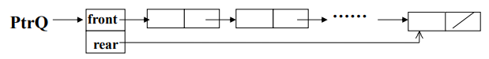

#### 不带头结点的链式队列出队操作的一个示例

这里显示的是 链表队列出队的一个操作，已知的是一个队列，那么这个队列用PtrQ，就是我们刚才讲的包含front跟rear结构的指针用PtrQ来指示，那么我们第一步要做的事情，就是判别队列是不是空的，那么什么情况下队列是空的呢，从这里我们看得到，当你的front 就是我们的front不指向任何东西，等于NULL的时候 队列就是空的，否则的话 让这个front找到队列的头上一个元素，所以我们这里看到的FrontCell它就是找到队列头个元素 就是这个元素，那么这个位置，这就是我们的FrontCell，那么找到它 接下来我们要做什么事情呢，要删除一个元素呢，接下来很关键的一步，就是要把这个指针挪到这个地方来，然后我们做一个释放操作，把这个空间把它释放掉，就要把这个结点把它删掉，那么就要free掉这个FrontCell，所以一开始要把链表的头结点把它找着 就是FrontCell，然后改变这个front指针的值 就在这个地方，就是front值把它改掉 改成front->Next，这时候这里面我们要判别一下，队列是不是只有一个元素，当front跟rear相等的时候，就是我们这边的这个情况，当front跟rear相等的时候，因为队列只有一个元素 被你删了，那么这个rear值要改变了，如果队列不止一个元素，你把头结点删掉了之后，队列头拿掉了之后rear是不动的，rear仍然指向最后一个元素，所以当你队列只有一个元素的时候，front rear都把它设为NULL，否则的话只要改变front指针就行了。接下里把第一个结点的元素的值，通过我们赋值先保存在一个变量里面，我们free掉第一个结点，最后return出这个变量的值。这里给大家看到的是，用链式队列出队操作的这样的一个例子，反过来 根据这样的一个思想，大家也很容易地能够实现入队的操作。

```C
ElementType DeleteQ ( Queue PtrQ )
{ 
 struct Node *FrontCell; 
 ElementType FrontElem;
 if ( PtrQ->front == NULL) {
 	printf(“队列空”); return ERROR;
 } 
 FrontCell = PtrQ->front;
 if ( PtrQ->front == PtrQ->rear) /* 若队列只有一个元素 */
 	PtrQ->front = PtrQ->rear = NULL; /* 删除后队列置为空 */
 else 
 	PtrQ->front = PtrQ->front->Next;
 FrontElem = FrontCell->Data;
 free( FrontCell ); /* 释放被删除结点空间 */
 return FrontElem;
}
```

#### 代码

```C
typedef struct Node *PtrToNode;
struct Node { /* 队列中的结点 */
    ElementType Data;
    PtrToNode Next;
};
typedef PtrToNode Position;

struct QNode {
    Position Front, Rear;  /* 队列的头、尾指针 */
    int MaxSize;           /* 队列最大容量 */
};
typedef struct QNode *Queue;

bool IsEmpty( Queue Q )
{
    return ( Q->Front == NULL);
}

ElementType DeleteQ( Queue Q )
{
    Position FrontCell; 
    ElementType FrontElem;
    
    if  ( IsEmpty(Q) ) {
        printf("队列空");
        return ERROR;
    }
    else {
        FrontCell = Q->Front;
        if ( Q->Front == Q->Rear ) /* 若队列只有一个元素 */
            Q->Front = Q->Rear = NULL; /* 删除后队列置为空 */
        else                     
            Q->Front = Q->Front->Next;
        FrontElem = FrontCell->Data;

        free( FrontCell );  /* 释放被删除结点空间  */
        return  FrontElem;
    }
}
```

## 应用: 多项式加法运算

我们现在来简单回忆一下,我们有两个多项式,一个是P1 一个是P2，两个多项式相加，如果有两个指数是一样的时候就把对应的系数相加，否则的话就把这些项拷贝过来就行了，那么这是我们加后的结果。大家仔细观察一下，P1 P2 它们这些项我们安排是有序的，我们是指数高的项排在前面，指数低的项排在后面，所以X5 之后是X4 然后X3 是按这样子排的，整个加的过程 X5只有这一项就拷贝，X4有两项 系数相加 等于6······所以它的一种基本的多项式相加的基本思路。

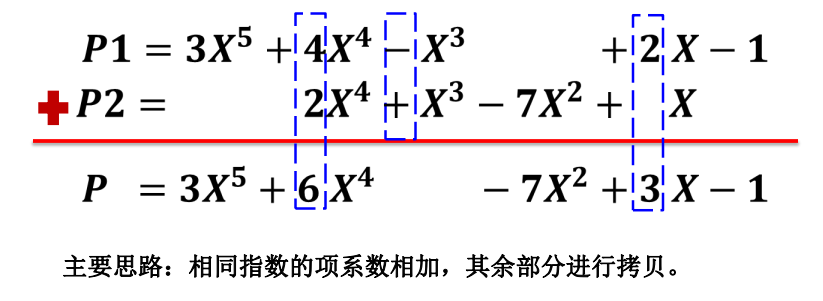

多项式相加在我们计算机里怎么实现，那么我们可以采用一个不带头结点的单向链表来表示，我们这个多项式，这是P1多项式的表示 下面还有一个P2多项式的表示，在这个表示里面 我们可以看到，我们的每一项是对应这个单向链表的一个结点，这个结点就包含三个分量，一个是系数 一个是指数 一个是指针 指向下一项，所以每一项在我们这里都是一个单向链表里的一个结点，按照指数递降的顺序 串在一起，接下来 我们来看一下 它具体的数据结构，数据结构就定义成是一个结构类型，包含三个分量 系数 指数 指针，那么P1 P2都是这种结构的指针。

> 采用不带头结点的单向链表，按照指数递减的顺序排列各项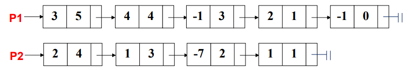

```C
struct PolyNode {
    int coef; // 系数
    int expon; // 指数
    struct PolyNode *link; // 指向下一个节点的指针
};
typedef struct PolyNode *Polynomial;
Polynomial P1, P2;
```

那么下面 我们想把这两个多项式把它加在一起，那么这两个多项式加在一起呢，我们的这种思路是这样的，我们用P1 P2分别指向这两个多项式的第一个结点，也就是这两个多项式最高项，然后不断地循环 循环的过程是这样的。比较这两项的指数 指数如果相等 就系数相加，如果结果不为零 那么就作为一个新的项，把它放到这个多项式里去，如果P1 P2 这两项的指数，P1这一项的指数大，那就把P1这一项拷贝过去 同时P1往后挪，反过来如果P2的指数大，就把P2这一项拷贝过去 然后P2往后挪，当这两个多项式P1 P2往后挪的时候，可能有一项就已经挪完了，那就把剩下的那个多项式 剩下的那些项，全部接到结果多项式的后面去。所以这就是说 我们算法的思路具体来看我们这个例子。 


> 算法思路：两个指针P1和P2分别指向这两个多项式第一个结点，不断循环： 
>
>  P1->expon==P2->expon: 系数相加，若结果不为0，则作为结果多项式对应项 的系数。同时，P1和P2都分别指向下一项； 
>
>  P1->expon>P2->expon: 将P1的当前项存入结果多项式，并使P1指向下一项； 
>
>  P1->exponexpon: 将P2的当前项存入结果多项式，并使P2指向下一项；
>
> 当某一多项式处理完时，将另一个多项式的所有结点依次复制到结果多项式中去。


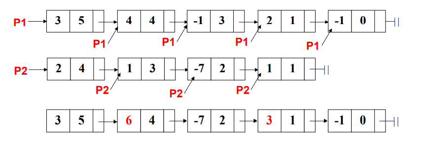

我们设计一个函数 这个函数的参数是两个，一个是 P1 P2，它是两个指针 指向这两个多项式，我们P1 P2相加全部加到这个结果多项式里去，对结果多项式来讲，我们需要记住 结果多项式的头在哪里，因为我们最后要返回回去的。return的是这个结果多项式 这个单向链表的第一个结点，所以我们要记住结果多项式的头在哪里。同时我们要知道结果多项式的尾巴在哪里，因为我们不断地要把新的一项加到结果多项式的后面。所以我们用两个指针，一个front 一个rear，分别指向结果多项式的头和尾。那么为了方便这个操作 我们构造一个临时的空结点，作为结果多项式的表头，一开始 front rear都指向这个空结点，所以我们一开始申请一块空间 front rear都指向它，这只是一个临时的结点，最后我们在程序返回的时候 要把这个空结点释放掉。接下来这个循环 这个循环就不断地判别，P1 P2是不是为空，当P1 P2都不空 也就是当前这两个多项式都有需要处理的项的时候，我们就不断地循环，循环里面干什么呢，就是比较P1 P2这两个项的所指向的当前这个项的指数，比较它们大小 用的函数叫Compare函数，Compare函数比较简单 就是比较这两个参数值的大小，如果第一个参数值大就返回1，第二个参数值大就返回-1，两个值相等就返回0。所以如果case是1，就说明第一个参数 也就是说 P1所指向的当前项的指数大，就把P1指向当前这一项 拷贝过去，拷贝到结果多项式里去，这个拷贝过程我们有个Attach，Attach有3个参数，第一个 第二个参数分别代表我要拷贝的这一项的系数和指数，然后把这个作为系数跟指数，形成的一个新的项 把它接到rear的后面，所以这是Attach要做的事情。所以把新的这一项拷贝过去之后呢，接下来 就是P1往后挪，反过来 如果k是-1 就意味着第二个多项式，就P2所指向的当前项指数高，那就把这一项拷贝到结果多项式里面去，就Attach这个P2的指数 系数，把它接到rear的后面 然后P2往后挪。k是0 就是这两个相等了，相等就是把系数相加，所以就把这两个加的系数就赋给sum，然后我们需要判别这个sum，如果等于0 那就不用加到结果多项式里去，如果不等于0，if(sum) 就说明这个sum不等于0，然后把这个sum作为系数，跟对应的指数凑在一起 把它接到rear的后面去，同时 P1 P2都往后挪，所以这就是我们这个循环的整个过程。当循环做完 退出的时候，就说明什么呢，就是P1 P2里面有一个为空了，这个循环 while循环的前提是P1 P2都不空，所以当循环退出来的时候，就意味着P1 P2有一个是空的，有一个是空的 就要把另外一个后面剩下来的项，全部接到结果多项式的后面，所以接下来我们用到两个for循环，第一个for循环 处理P1不空，就是如果P1不空 这个时候P2肯定空了，P1不空 就是把P1后面的每一项全部Attach。同样的 第二个for是处理P2不空的情况，也把P2后面的每一项一个一个拷贝到rear的后面去，这两个for做完，就意味着我们两个相加 基本完成了，然后接下来是要做函数返回之前的扫尾工作。扫尾工作有哪些呢，第一个我们的rear是指向结果多项式的最后一项，现在已经加完了 最后一项后面没了，所以我们要把它的link设为NULL。然后我们前面提到过，一开始我们产生了一个临时的空结点，要把这个空结点 把它释放掉，怎么释放呢 就把front赋给temp，然后front往后挪，front原来是指向这个临时的表头结点，这个表头结点的下一项就是我们真正的多项式的第一项，所以front->link就赋给front，然后把这个temp free掉，最后return front。

```C
Polynomial PolyAdd (Polynomial P1, Polynomial P2)
{
    Polynomial front, rear, temp;
    int sum;
    rear = (Polynomial) malloc(sizeof(struct PolyNode)); 
    front = rear; /* 由front 记录结果多项式链表头结点 */
    while ( P1 && P2 ) /* 当两个多项式都有非零项待处理时 */
        switch ( Compare(P1->expon, P2->expon) ) {
            case 1: 
                Attach( P1->coef, P1->expon, &rear);
                P1 = P1->link;
                break;
            case -1: 
                Attach(P2->coef, P2->expon, &rear); 
                P2 = P2->link;
            	break;
            case 0: 
                sum = P1->coef + P2->coef;
                 if ( sum ) Attach(sum, P1->expon, &rear);
                 P1 = P1->link; 
                 P2 = P2->link;
             	break;
        }
    /* 将未处理完的另一个多项式的所有节点依次复制到结果多项式中去 */
    for ( ; P1; P1 = P1->link ) Attach(P1->coef, P1->expon, &rear);
    for ( ; P2; P2 = P2->link ) Attach(P2->coef, P2->expon, &rear);
    rear->link = NULL; 
    temp = front;
    front = front->link; /*令front指向结果多项式第一个非零项 */
    free(temp); /* 释放临时空表头结点 */
    return front;
}
```

最后我们看一下 Attach是怎么实现的，Attach有3个参数，它要求传进来的是c跟e 系数跟指数，然后我告诉你 当前最后一个结点的指针位置，传进来的是 Polynomial这个类型的指针，要注意Polynomial本身也是指针，所以这里的pRear 实际上是指针的指针，为什么这么做呢 前面讲过了C语言是函数常数值传递，那么在Attach里面呢 我们做什么事情呢，首先 通过malloc申请这个结点，这个结点的类型就是struct PolyNode这个类型，接下里对这个结点关键信息赋值，接下来 它的link就把它设为NULL，最后两句话 把新申请的结点P插到rear的后面。原来我们的pRear是指针的指针，所以我们* pRear 就代表指针了，它指向的是我们当前链表的最后一个结点，然后我们来了一个新结点，里面的值赋好了 是c跟e，然后我们这个结点挂到pRear的后面，所以就是通过这两句话，把p赋给(* pRear)->link，这样的指针就指过去了。再下面一句话 把p赋给* pRear，就是把*pRear的值改了，这就完成了我们Attach的过程。

```C
void Attach( int c, int e, Polynomial *pRear ) 
{ /* 由于在本函数中需要改变当前结果表达式尾项指针的值， */
/* 所以函数传递进来的是结点指针的地址，*pRear指向尾项*/
 Polynomial P; 
 P =(Polynomial)malloc(sizeof(struct PolyNode)); /* 申请新结点 */
 P->coef = c; /* 对新结点赋值 */
 P->expon = e;
 P->link=NULL;
 /* 将P指向的新结点插入到当前结果表达式尾项的后面 */ 
 (*pRear)->link = P; 
 *pRear = P; /* 修改pRear值 */
}
```


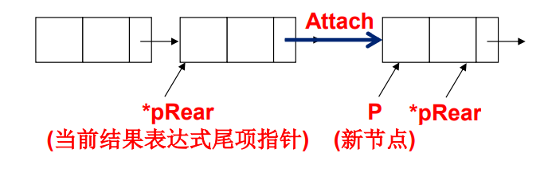

## 小白专场：一元多项式的 加法与乘法运算

### 题意理解

题目要求设计函数分别，求两个一元多项式的乘积与和。这里大家看到的是两个多项式的例子，因为是一元多项式，所以这个多项式的变量只有一个。在我们的例子里按照指数递降的顺序进行排列的。对于这样的两个多项式，我们要求做的是，这两个多项式的乘积与和。

> 设计函数分别求两个一元多项式的乘积与和

第一个蓝色的输入是项的个数。后面把每一项的系数指数列出来。输出同理，但是没有项的个数了。


### 求解思路

1.多项式表示 2. 程序框架 3. 读多项式 4. 加法实现 5. 乘法实现 6. 多项式输出

### 多项式的表示

多项式的表示方法，最核心的就是要表现多项式的关键信息，什么是多项式的关键信息呢，就是他的非零项的系数指数。一对一对的这个信息要把它表示出来，这是一个线性的序列。那么这种线性序列，有两种在计算机上面存储实现方式，数组和链表。数组的方法相对来说他编程比较简单，而且调试也比较容易，但是用数组来表示这些非零项，很重要的一个东西我们必须要事先确定数组的大小，因为我们事先要定义这个数组，当你这个多项式的项数，事先不知道的时候，我们就只能以最大可能的项数来进行表示，实际上像数可能会没那么多，那就会造成空间的浪费。另外还有一种方法就是链表，链表的方法正好克服了数组这个特点，他不需要事先知道有多少项，你来一个我给你处理一个 来一个处理一个，来了一个项的信息我就把它作为一个节点插到这个链表里去，所以他的优点是动态性比较强，但是编的程序就会比较复杂，涉及到指针 调试也比较困难，这两种表示方法在我们数据结构设计里面都有它各自的用途 特点不一样，我们要根据应用的场景来确定到底用什么比较合适。那么对于我们这道题来讲，其实我们有个很重要的信息，就事先告诉你了我有多少项，所以对这道题来讲有一种比较好的实现方法就是**动态数组**，你告诉我有四项我就通过空间申请 malloc，申请四个结构的这样的一个数组，然后把后面四个信息，都放到这个结构数组里面去。所以对这道题来讲，比较简单的实现方法就是用动态数组。我们为了，训练大家的链表方面的编程能力，所以后面例子实现的时候，我们还是介绍用链表的表示方法。

> 仅表示非零项

> 数组：  编程简单、调试容易  需要事先确定数组大小
>
> 链表： 动态性强 编程略为复杂、调试比较困难
>
> 一种比较好的实现方法是: 动态数组

> 下面介绍链表表示

用链表进行表示的时候，首先我们要进行数据结构的设计，链表他是由若干个节点所构成的，那么这个节点的信息是什么呢，多项式的关键数据来讲一个是系数，一个是指数，既然作为一个链表他的节点还有一个阈是作为指针指向下一个节点，所以的话列表上的节点就由这三个信息所构成的系数指数和一个指针。那么这个指针，就是这个结构指针，一开始把这个结构指针定义成一个新的类型叫 Polynomial，对于前面这样的一个例子这样四项所构成的多项式，我们用链表来表示如下。其中的话 链表头我们用一个变量P1，然后每个节点都有一个指针，指向下一个节点。都含包含两个关键的信息，就是系数跟指数。同样的P2也用对应的链表来表示。

```C
typedef struct PolyNode *Polynomial;
struct PolyNode {
    int coef;
    int expon;
    Polynomial link;
};

```

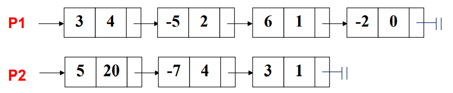

### 程序框架搭建

根据我们程序编程的这个要求，我们整个程序的框架就是 main函数框架大概如下。我们希望设计一些函数来辅助我们整个程序的完成。那我们应该设计哪些函数呢？首先一个读入多项式，两个多项式相乘，是把两个多项式相加，把这个多项式输出。

```C
int main()
{
 读入多项式1
 读入多项式2
 乘法运算并输出
 加法运算并输出
 return 0;
}
```

根据这样的一种想法，我们形成的main函数他的主要的过程是这样，首先我们定义几个变量，其中有两个变量P1，P2，分别代表这两个输入的多项式，所以我们通过ReadPoly来读入这两个多项式，读入的这两个多项式它是链表，这里的P1 P2都是链表的结构的指针-就是我们前面定义过的Polynomial。通过调用这两个函数，就返回了这个P1 P2的指针，然后利用这个指针传递到函数Mult里面去做乘法运算，乘法运算的结果也是一个链表，所以他返回的是一个结构的指针，接下来要把这个多项式输出，所以只要把链表的头，第一个节点的指针作为参数传到一个函数叫PrintPoly，由他来输出多项式。同理的加法运算，那就把P1 P2作为参数传进去，返回一个新的多项式的指针，然后输出。这就是我们整个程序的框架。

有了这个框架了之后，接下来我们需要讨论怎么读多项式，怎么相乘，怎么相加，怎么输出。

```C
int main()
{
 Polynomial P1, P2, PP, PS;
 P1 = ReadPoly();
 P2 = ReadPoly();
 PP = Mult( P1, P2 );
 PrintPoly( PP );
 PS = Add( P1, P2 );
 PrintPoly( PS );
 return 0;
}

```

> 需要设计的函数：  读一个多项式  两多项式相乘  两多项式相加  多项式输出

### 如何读入多项式

首先我们来看一下怎么读多项式，我们要考虑怎么读多项式的时候，我们必须要考虑输入的数据的格式是什么，前面我们看到了，题目要求输入的数据他的格式是这样的，4 3 4 -5 2 6 1 -2 0。第一个整数代表它有多少项，接下来是一对一对的系数指数。所以读多项式这个程序来讲，他应该是先读这个整数接下来是一对一对的读入系数跟指数，所以我们整个这个程序框架就变成先是scanf把这个4读进来赋给变量N，接下来做四轮的循环，那么就是while（N--）这种形式，来控制循环的次数，然后每轮循环里面要做什么事情呢，就是读入一对数 就是系数指数读进来，分别放到c跟e里面去，然后把系数指数读进来了之后，我们就要构造一个节点，把这个节点插到多项式里面去，读的过程，是从指数递降的顺序来进行读的。所以读入一个新的节点的时候，应该插在前面一个节点的后面，这个最后就形成我们所需要P1所指向的这样的一张链表。所以这个是我们读多项式这样的一个结构。

那么在这里面有一个关键的问题，就是我们读入的是从左到右读入的，而且先读的是指数高的这一项，完了之后我们要插到一个链表里面去，接下来再读一对数再插进去 再形成一个节点，再插到前面去。接下来这样读入一对系数指数，再插到多项式里去。因为我们是指数递降的顺序，在链表里面也是指数递降的，所以应该插到原来结果的后面，所以我们这里就需要有个指针rear，这个Rear就代表了当前结果多项式的最后一项，那么使得我们现在下面读入的新的这一对是c跟e能插到最后一项的后面，所以我们需要有个指针来指向当前结果多项式的最后一项，将来投入了一个新的一对数，是c跟e的时候我们就构造一个新的节点，把这个节点就插到Rear的后面，那这个过程就通过函数 Attach 来完成，所以我们等会还要再设计一个函数叫 Attach，它的目的是什么呢，他是要把 c 跟 e，我们刚刚读入了这对数构造一个新的结点，然后把它插到当前结果表达式的后面就是 Rear的指针的后面。那么在这个过程当中我们应该注意到，Rear原来是指向一个链表的最后，因为你插入了一个新的节点之后，这个新的节点就成为这个链表的最后一项，所以Rear的值要更改，Rear要指到新的节点上面去。那么也就意味着Rear这个变量在Attach这个函数里面必须要被改变，这在C语言里面他的参数传递是值传递的，所以传进去的这个变量Rear要是指针，所以这是通过指针传递的方式（指针要改变就要传指针的指针），保证Rear在Attach这个函数里面能够被改变。

```C
Polynomial ReadPoly()
{
     ……
     scanf("%d", &N);
     ……
     while ( N-- ) {
    scanf("%d %d", &c, &e);
    Attach(c, e, &Rear); 
     }
     …..
     return P;
}
```


那接下来的问题是，Rear的初值是什么？我们说Rear是指向到目前为止链表结果多项指的最后一项，那么一开始的时候Rear值是什么呢，这里有两种处理方法。一种是Rear一开始都设为NULL，然后Attach函数里面就判别Rear是NULL还是非NULL，Rear是NULL的时候说明是刚开始的第一个节点，这个时候就要申请这个节点，然后把Rear指向这个节点，就是把Rear值从NULL改为指向这个节点。如果Rear值不为NULL，因为从第二项开始Rear值不为NULL了，不为NULL的时候那么我们就直接把这个新的节点插到Rear的后面。大家可以知道这样的一种处理方法在Attach函数里面他必须判别Rear是不是NULL，因为这两个过程处理的程序是不一样的。

> Rear初值是多少？ 两种处理方法： 1. Rear初值为NULL 在Attach函数中根据Rear是 否为NULL做不同处理

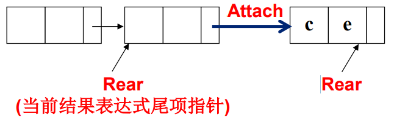

还有一种程序上更简单的一种处理方法，一开始我们构造一个空的节点，然后让Rear值指向这个空的节点，以后所有的新插入的节点全插在这个Rear后面，如果是这样的一种进行处理，我们Rear一开始指向一个空的节点，那么在Attach函数里面就不需要判别Rear是不是NULL还是不是NULL，那程序上面在 Attach这个函数的程序里面，就比较简单，他不需要判别空还是不空，所以这是一种利用临时申请一个空的节点的方法，使得程序的处理起来一致性比较强，而且代码简单，当然到了最后你必须要把这个空节点把它删掉，所以根据这样的一种思路，我们采用的一种方法是先申请空节点这样的一种方法，这样的话在Attach函数里面程序就比较简单。

> 2 Rear指向一个空结点

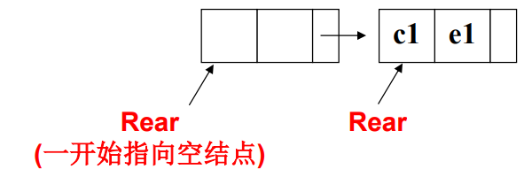

他传进来的是c跟e 系数跟指数，然后我告诉你当前最后一个节点的指针位置，传进来的是Polynomial这个类型的指针，要注意Polynomial本身也是指针，所以这里的pRear实际上是指针的指针，因为要改rear。在attach函数里面，首先通过malloc申请这个节点这个节点的类型，就是stuct PolyNode这个类型，接下来对这个节点的关键信息赋值，把c跟e都赋给他，接下来他的 link 就把他设为NULL，在后面最后两句话就是把新申请的这个节点P插到Rear后面，原来我们的pRear是一个指针的指针，所以这里* pRear就代表指针了，他指向的是我们当前链表的最后一个节点，然后来了一个新节点，里面的值赋好了是c跟e，要把这个结点挂到pRear后面，所以就是通过这两句话把P赋给* pRear link，那么这样的一个指针就指过去了，再下面一句话把P赋给 			* pRear，就是把* pRear的值改了，让他指到了这个地方（最后一个节点），

```c
void Attach( int c, int e, Polynomial *pRear )
{ 
    Polynomial P;
    P = (Polynomial)malloc(sizeof(struct PolyNode)); 
    P->coef = c; /* 对新结点赋值 */
    P->expon = e;
    P->link = NULL;
    (*pRear)->link = P; 
    *pRear = P; /* 修改pRear值 */
}
```

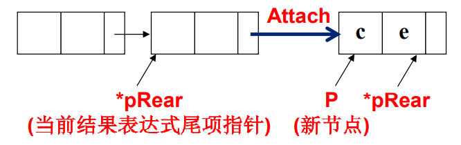

根据前面的这个分析，我们读入多项式的这个完整的程序就出来了，先scanf读进了N，然后while循环读进一对一对的这个数c跟e，然后把c跟e通过Attach函数，把它插到当前链表的最后。除了这个程序框架之外，首先一个就是我们要申请一个空的节点，通过malloc这种方式申请一个空的节点，然后让Rear指向这个空的节点。

```c
Polynomial ReadPoly()
{
     Polynomial P, Rear, t;
     int c, e, N;
     scanf("%d", &N);
     P = (Polynomial)malloc(sizeof(struct PolyNode)); /* 链表头空结点 */
     P->link = NULL;
     Rear = P;
     while ( N-- ) {
        scanf("%d %d", &c, &e);
        Attach(c, e, &Rear); /* 将当前项插入多项式尾部 */
     }
     t = P; P = P->link; free(t); /* 删除临时生成的头结点 */
     return P;
}

```

最后要把这个空的节点把它删掉，也就是最后完成的时候我们得到链表可能是像下面这样，我们有个P指向一个空的节点，然后空的节点的指向后面真正的多项式，这个时候我们要把第一个节点 就空的节点删掉，我们就通过这么几个语句实现，让t指向P P的link指向P那么就P指向了下一个就是3 4这样的一个节点，然后把t释放。最后p就指向了3 4 开始的一个真正的多项式。最后return p。

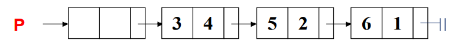

### 如何将两个多项式相加

多项式按照指数递降的顺序排列，相加比较简单，前面有对应的程序了。这边回忆程序架构，一开始用t1和t2分别指向这两个多项式，接下来为了处理方便我们采用前面的一种方法就是先构造一个空节点，这两个语句就是构造一个空的节点，我们用rear指向当前处理多项式的尾巴，这样我们就能把t1t2的项插入到rear的后面，所以整个程序的架构就是三个while循环。第一个while就是当t1 t2都不空的时候，比较当前t1 t2所指向的指数，相等就系数相加，看看等不等于0，等于0就不管他了，t1t2分别往后挪。如果不等于零，那就把新的系数和指数加到rear的后面。如果t1 t2指向的指数不相等，那我们就比较一下看哪个大，把大的把它拷贝到Rear的后面，这个循环（第一个while循环）不断的做，只要两个t1t2都不空，那么就一直做，当有一个空的时候循环就退出来了，退出来了之后要把另外一个可能还不空的全部接到Rear的后面，所以接下来分别要用两个while循环，分别来处理 t1不空的情况，跟t2不空的情况。最后返回，这是相加的程序框架。

```c
Polynomial Add( Polynomial P1, Polynomial P2 )
{ 
    ……
    t1 = P1; t2 = P2;
    P = (Polynomial)malloc(sizeof(struct PolyNode)); P->link = NULL;
    Rear = P;
    while (t1 && t2) {
        if (t1->expon == t2->expon) {
            …..
        }
        else if (t1->expon > t2->expon) {
            ……
        }
        else {
            ……
        }
    }
    while (t1) {
    	……
    }
    while (t2) {
   	 …..
    }
    ……..
    return P;
}
```

### 如何相乘

接下来我们讲讲两个多项式的相乘，两个多项式相乘有两种方法，一种方法是把乘法运算把它转化为加法运算，两个多项式相乘他的基本要求是把一个多项式的每一项跟另外一个多项式的每一项相乘，然后把这些结果都加起来，合并同类项。这个过程可以看成第一个多项式的当前项乘以第二个多项式，把一项乘以一个多项式，获得了一个新的多项式，然后把这个新的多项式加到结果多项式里去，那么这样的话就可以把乘法运算变成一系列多项式的一个累加运算。P1的当前项乘以P2的每一项这个这么做呢？这我们有个基本的程序框架，假如说P1的当前项用t1来指示，可以用t2来指向P2的多项式的头上，一开始可以按照前面的方法申请一个空节点，让Rear指向这个空节点，接下来是一个循环，对t2的每一项进行处理，就是把t1的这一项乘以t2的当前项两项相乘是系数相乘指数相加，我们仍然可以用Attach这个函数把乘之后的系数跟指数Attach到这个Rear的后面，把这项加进去加完了之后t2指向下一项，所以这个while循环是对P2多项式的每一项进行处理，这个是一种做法。

还有一种做法是是逐项插入的一种做法，要把P1的每一项乘以P2的每一项实际上就可以设置两个循环，一个循环对P1循环，一个循环对P2循环，这样把每一项相乘的结果把它插入到结果多项式里去，进行逐项插入，一开始我们可以用P1的第一项乘以P2的多项式，形成我们的这个初始结果。接下来就是把P1的当前项跟P2当前项相乘，逐步的插到这里面去。我们要把乘后的新的一项要插到结果多项式里面去，要插到哪一个位置，因为要求的结果多项式仍然是指数递降的顺序的，用这种方法做的一个关键就是怎么样把一个新的项插入到原来已经有序排好的多项式里面去，我们后面就讲讲逐项插入的做法。

> 方法： 
>
> 1.将乘法运算转换为加法运算 将P1当前项(ci,ei)乘P2多项式，再加到结果多项式里  
>
> ​	t1 = P1; t2 = P2; 
>
> ​	P = (Polynomial)malloc(sizeof(struct PolyNode)); P->link = NULL; 
>
> ​	Rear = P; 
>
> ​	while (t2) {  
>
> ​	Attach(t1->coef*t2->coef, t1->expon+t2->expon, &Rear); 
>
> ​	t2 = t2->link; 
>
> ​	} 
>
> 2.逐项插入 将P1当前项(c1i,e1i)乘P2当前项（c2i,e2i),并插入到结果多项式 中。关键是要找到插入位置 
>
> ​	初始结果多项式可由P1第一项乘P2获得（如上）

程序基本框架是这样的，首先构造一个初始结果多项式就是把第一个多项式的第一项乘以第二个多项式的每一项，形成一开始的这个结果。 那就是前面这段程序。接下来的话是一个两重循环，第一个是对t1的每一项进行循环，在里面嵌套的对t2的每一项进行循环，每次循环的时候就是把两项相乘，就是指数相加系数相乘，然后把形成结果c和e，构造一个新的节点把它插到结果多项式里面去。接下来t2指针往后挪，t1指针往后挪。所以这是我们两个多项式相乘的这个框架。具体来说我们有几个事情需要解决，首先一个怎么构造初始的多项式，就是把P1的第一项要乘以P2的每一项，然后再下来在这两个循环里面碰到了一个问题，就是我把当前这两项乘的结果，就是c跟e知道了之后，怎么插进去。还有一块就是最后的这个结果怎么进行处理。所以我们还有三块内容需要解释，三块省略号。

```c
Polynomial Mult( Polynomial P1, Polynomial P2 )
{ 
    …….
    t1 = P1; t2 = P2;
    …….
    while (t2) { /* 先用P1的第1项乘以P2，得到P */
    	……..
    }
    t1 = t1->link;
    while (t1) {
        t2 = P2; Rear = P;
        while (t2) {
            e = t1->expon + t2->expon;
            c = t1->coef * t2->coef;
            ………..
            t2 = t2->link;
        }
        t1 = t1->link;
    }
    …….
}
```

先来看第一块内容，怎么把第一个多项式的第一项乘以第二个多项式的每一项，就是先申请一个空的节点赋给P然后Rear指向这个空节点，接下来是对t2循环，把每一项乘的系数跟指数通过Attach的函数加到Rear的后面，然后t2往后挪。在这个之前我们要判别一下P1 P2空不空，因为这两个多项式相乘只要有一个为空那么就return NULL了，所以这就是我们第一句话。当然在这个之前要定义若干一些变量。

```c
Polynomial Mult( Polynomial P1, Polynomial P2 )
{ 
    Polynomial P, Rear, t1, t2, t;
    int c, e;
    if (!P1 || !P2) return NULL;
    t1 = P1; t2 = P2;
    P = (Polynomial)malloc(sizeof(struct PolyNode)); P->link = NULL;
    Rear = P;
    while (t2) { /* 先用P1的第1项乘以P2，得到P */
        Attach(t1->coef*t2->coef, t1->expon+t2->expon, &Rear);
        t2 = t2->link;
    } 
    t1 = t1->link;
    while (t1) {
        t2 = P2; Rear = P;
        while (t2) {
            ………..
            t2 = t2->link;
        }
        t1 = t1->link;
    }
    …….
}
```

接下来是一个两重循环，对t1的循环跟对t2的循环，这个循环就是把t1的每一项乘以t2的每一项，乘完之后结果怎么插入进去，所以这是我们第二块要讲解的内容。首先我们要把当前这两项相乘的指数跟系数算出来，就是指数相加系数相乘，接下来我们要找我们要插入的点在哪里，我们要看到到目前为止已经知道计算结果，也是按照指数递降的顺序的，我们来了新的一项要插进去，仍然要保证指数递降的顺序，所以这个问题实际上就变成已知一个有序的序列，我来了一个新的数怎么把这个数插到有序的序列里面去。他的基本思路可以是这样，我们已经知道当前的一个计算结果由P所指示的，那么我们把这个P赋给一个Rear，当然这个rear不是一直指向当前结果多项式的最后一项，它只是一个临时变量。一开始指向的是结果多项式的第一项，所以一开始rear指向p，接下来是一个循环，这个循环就判别当前这个rear的下一项跟我们准备要插入的新的项的关系。如果比新的项的指数大新的项就一直往后挪，如果<=那么就停下来退出这个while循环，退出来就说明新项要插在rear的后面了。这时候我们要看rear的下一项和我们新项的指数一不一样，这个时候就是做合并。如果如果比新的项小那么就插在rear后面。

```c
Polynomial Mult( Polynomial P1, Polynomial P2 )
{ 
    …….
    while (t1) {
        t2 = P2; Rear = P;
        while (t2) {
            e = t1->expon + t2->expon;
            c = t1->coef * t2->coef;
            while (Rear->link && Rear->link->expon > e)
            	Rear = Rear->link;
            if (Rear->link && Rear->link->expon == e) {
            ……..
            }
            else {
            ……..
            }
            t2 = t2->link;
        }
        t1 = t1->link;
    }
    …….
}
```

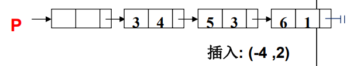

具体细节是这样的，如果rear要指向的下一项和新项的指数相等，那么就不需要申请新的结点，直接合并，而且合并要注意相加完之后系数等不等于0，如果等于0就要把这个rear后面这个项删掉。这里的else语句就是做一个删除操作。rear后面的项如果小于新项，那么就要申请新的结点，赋值，插入。

```c
Polynomial Mult( Polynomial P1, Polynomial P2 )
    { 
    …….
    while (Rear->link && Rear->link->expon > e)
    	Rear = Rear->link;
    if (Rear->link && Rear->link->expon == e) {
        if (Rear->link->coef + c)
        Rear->link->coef += c;
        else {
        t = Rear->link;
        Rear->link = t->link;
        free(t);
        }
    }
    else {
        t = (Polynomial)malloc(sizeof(struct PolyNode));
        t->coef = c; t->expon = e;
        t->link = Rear->link;
        Rear->link = t; Rear = Rear->link;
    }
    …….
}
```

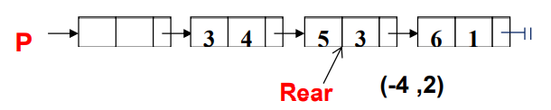

最后一个细节就是如何返回。我们前面知道一开始我们是构造了一个空的节点，我要把空节点删掉。当前p指向的链表是这样的，第一个结点是空节点，我们要把P所指向的这点把它删掉，所以我们做这样一件事情。

```c
Polynomial Mult( Polynomial P1, Polynomial P2 )
{ 
    …….
    t1 = P1; t2 = P2;
    …….
    while (t2) { /* 先用P1的第1项乘以P2，得到P */
   	 ……..
    }
    t1 = t1->link;
    while (t1) {
        t2 = P2; Rear = P;
        while (t2) {
            e = t1->expon + t2->expon;
            c = t1->coef * t2->coef;
            ………..
            t2 = t2->link;
        }
        t1 = t1->link;
    }
    t2 = P; P = P->link; free(t2);
    return P;
}
```

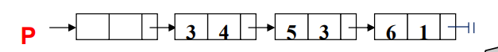

### 如何将多项式输出

实际上是链表的遍历问题。遍历的框架就是这样的while（P），P不空就对p的信息进行处理，然后p的link赋值给p。 所以这个是链表的遍历的一个基本程序框架。当然我们要先判别一下，空不空。空的就我们就print00。如果不空我们就开始做这个循环了，在这个循环我们要print什么东西，我们要print这个多项式的系数指数，他的输出是系数指数空格，系数指数空格 最后一项没有空格，那么怎么控制这样的过程并不是每组后面都有空格，最后一项没有的，我们可以倒过来理解，是不是可以把它理解成每一项都是空格系数指数，第一项没有空格，所以一开始不出空格就是系数指数，然后后面都是空格系数指数 空格系数指数，如果来这样理解的时候我们就要判别是不是第一项，所以我们这里用个flag一开始等于0，如果flag等于0的时候，那么不输出把flag设为1，否则的话不是第一项的时候，我们都先输出一个空格然后再输出系数指数。最后输出一个回车。

```c
void PrintPoly( Polynomial P )
{ /* 输出多项式 */
    int flag = 0; /* 辅助调整输出格式用 */
    if (!P) {printf("0 0\n"); return;}
    while ( P ) {
        if (!flag)
        flag = 1;
        else
        printf(" ");
        printf("%d %d", P->coef, P->expon);
        P = P->link;
    }
    printf("\n");
}
```

# 排序

## 简单排序

我们这边主要是讨论的10000个数据起步规模的排序，那么排序算法的效率就变得非常重要

#### 前提

在介绍到各种排序算法的时候，函数头都有一个统一规范的格式

```c
void X_Sort ( ElementType A[], int N )
```

X:排序算法的名称

默认输入的参数有两个，一个是待排的元素放在一个数组里，这里元素可以是任意的类型。只要你可以比较大小就行。另外一个是N，表示我们待排的元素的个数

- 大多数情况下，为简单起见，讨论从小大的整数排序
- N是正整数
- 只讨论基于比较的排序（> = < 有定义）
- 只讨论内部排序
- 稳定性：任意两个相等的数据， 排序前后的相对位置不发生改变
- 没有一种排序是任何情况下 都表现最好的

#### 冒泡排序

基本思想，想象从上到下有一堆泡泡，我们要保证泡泡从上到下是从小到大的，那么我们就从上到下依次比较两个泡泡，如果两个泡泡的相对位置不对那么我就交换它们的位置。这样一趟一来，这一趟所涉及到的最大的泡泡肯定已经在最下面了。也就是说我们只需再把第二大的泡泡继续放在最下面，之前那个最大的泡泡就不用动了。也就是说我们只需要再对剩下的n-1个数再来一趟即可。

如果没有这个flag，那么这个冒泡排序就比较傻，也就是如果我们的排序在中间某一趟就排好了，它还会继续排。那么我们就增加一个flag标记，如果flag为0就说明swap函数一次都没有执行过，就可以退出了。

来看看冒泡排序的时间复杂度，一种是最好的情况，一种是最坏的情况。最好的情况就是一开就就已经排好了，但是我们还是得至少从上到下扫描一遍，是O（N）的时间复杂度。最坏的情况就是我们一开始的泡泡是逆序的，也就是按照从大的小的顺序我们要把它调成从小到大，那么这时候我们每一趟只能排一个最大的到下面，我们需要执行n-1趟，每一趟中两两元素需要不停的交换，时间复杂度就是O（N²）级别的。

冒泡排序的好处就是很简单，如果不加标识的话就是两重for循环和一个if判断。当然了，效果不是特别好，毕竟是N²级别的排序算法。但是冒泡排序也有一个别的排序算法没有的好处，也就是如果所有的待排元素是放在**单向链表**里的冒泡排序也是可以解决的。但是其它的排序算法是不容易的。另外一点就是如果两个元素相等我们不做交换，保证了冒泡排序算法是**稳定**的。

```c
void Bubble_Sort( ElementType A[], int N ) 
{ 
    for ( P=N-1; P>=0; P-- ){
        flag = 0;
        for( i=0; i<P; i++ ) { /* 一趟冒泡 */
            if ( A[i] > A[i+1] ) {
                Swap(A[i], A[i+1]); 
                flag = 1; /* 标识发生了交换 */
            }
        }
        if ( flag==0 ) break; /* 全程无交换 */
    }
}
```

#### 插入排序

想象一个过程，你在一张一张的摸牌，然后你要把这些牌从小到大排好。你会怎么做呢，你现在摸进第一张牌，放在手上。摸进第二张牌的时候，如果第二张比第一张小，那么就把第一张往后挪一位，然后把第二张牌插在原本第一张牌的位置。总之抓到一张牌以后，依次从右到左比较，如果这张牌小就一直把之前排好的牌往右移动一位，直到左边的没牌了或者左边的牌小于或等于这张牌才插入。

P从1开始是因为我们默认第一张牌已经在手里了，这里相当于我们既在这个数组里拿牌，又在这个数组里排序。因为排序涉及到移动的问题，所以我们需要一个临时变量来存储P位置的牌，来空出数组上的那个位置。我们先从手里的这张牌开始--i=P--一张一张往前比，如果我手里这张牌比前面的牌小，那么就把前面的牌后移，腾出前面那张牌的位置i。就这样等到我找到了一个位置我的手里牌大于等于前面的牌或者是我走到头了（即i=1）我就跳出。i就是我们要放的位置，直接放入即可。

什么情况下是最好的情况呢，也就是一开始就是排好的。我摸进来的总比前面的大，也就是说我永远都不需要去移动前面的牌就直接放入了。此时是一个N数量级的时间复杂度。最坏的情况依然和冒泡的一样，也就是逆序排好的，这样我每次摸进来一张都需要把前面排好的牌都往后错一位。这是一个N²数量级的时间复杂度。

插入排序的好处也是程序很短，看上去很简单。冒泡排序是两两交换，两两元素互换需要涉及到三步，插入排序是每一个元素往后错一位，然后最后一次性放入空位，会剩下很多步骤，但是这个不是插入排序存在的主要原因，这个原因后面说。

因为我们是在这张牌严格比前面的牌小的时候才移位，所以插入排序算法也是**稳定**的。

```c
void Insertion_Sort( ElementType A[], int N ) 
{ 
    for ( P=1; P<N; P++ ) { //默认第一张牌已经在手里了
        Tmp = A[P]; /* 摸下一张牌 */
        for ( i=P; i>0 && A[i-1]>Tmp; i-- ) 
        	A[i] = A[i-1]; /* 移出空位 */
        A[i] = Tmp; /* 新牌落位 */
    }
}

```

###### 代码--插入排序

```c
void InsertionSort( ElementType A[], int N )
{ /* 插入排序 */
     int P, i;
     ElementType Tmp;
     
     for ( P=1; P<N; P++ ) {
         Tmp = A[P]; /* 取出未排序序列中的第一个元素*/
         for ( i=P; i>0 && A[i-1]>Tmp; i-- )
             A[i] = A[i-1]; /*依次与已排序序列中元素比较并右移*/
         A[i] = Tmp; /* 放进合适的位置 */
     }
}
```


#### 时间复杂度下界

前面讲了冒泡排序和插入排序，它们都是简单排序，都是由公共的时间复杂度下界的。

先来看看逆序对的概念，在我们默认是从小到大排序的情况下，我们认为i和j这两个元素是待错了位置。如果有这种情况，那么我们就把<i,j>叫做一个逆序对。那么对于下面这个例子，数一数有多少个逆序对呢？前面我们发现，冒泡排序和插入排序都正好是交换九次以后完成的。为什么都正好是9次？说明每一次交换元素都正好消去了一个逆序对，因为交换两个相邻的元素正好可以消去一个逆序对。所以两个算法交换的次数相同并不是巧合。我们来看看插入排序的时间复杂度，时间复杂度不仅和N相关，还跟元素序列的逆序对的个数相关。无论怎么样算法都需要把整个数组扫描一遍，所以至少是一个O（N）数量级的，另外它的操作次数是和逆序对的个数成正比的。所以整个是一个O( N+I )的复杂度。如果这个序列里面的逆序对的个数很少，换言之，如果这个序列是基本有序的那么插入排序是简单有效的，也就是如果逆序对的个数跟N是同一个数量级的，那么整个算法的时间复杂度就是线性的。是一种很快的排序算法。

- 对于下标i<j，如果A[i]>A[j]，则称(i,j) 是 一对逆序对(inversion)

- 问题：序列{34, 8, 64, 51, 32, 21}中有多少逆序对？

  (34, 8) (34, 32) (34, 21) (64, 51) (64, 32) (64, 21) (51, 32) (51, 21) (32, 21)

- 交换 2个相邻元素正好消去 1个逆序对！

- 插入排序： T(N,  I) =  O( N+I ) — 如果序列基本有序，则插入排序简单且高效

对于一般的情况下我们有下面的定理，从定理一（0+N（N-1）/2/2）可以看出逆序对的个数是N²数量级的。所以可以得到下一个定理，也就是任何仅以交换相邻元素来排序的算法，时间复杂度都是ΩN²，Ω指的是下界，也就是说这个算法最好也就是N²这是数量级的了。这个听上去是一个坏消息，但是我们要注意到限制是仅以交换相邻两元素的算法。换句话说就是，如果我们想要提高算法的效率，我们应该怎么努力？前面的两个算法之所以慢是因为每一次交换只能消去一个逆序对，而平均有N²数量级的逆序对，所以快不起来。所以我们目标就是每一次交换都消去不止一个逆序对。如何做到这一点呢？我们说如果我们每次交换相邻的元素的我们是做不到这个的，所以我们目标就是每次交换相隔比较远的两个元素。跳着交换，就有希望在一次交换中一次消掉好几个逆序对。

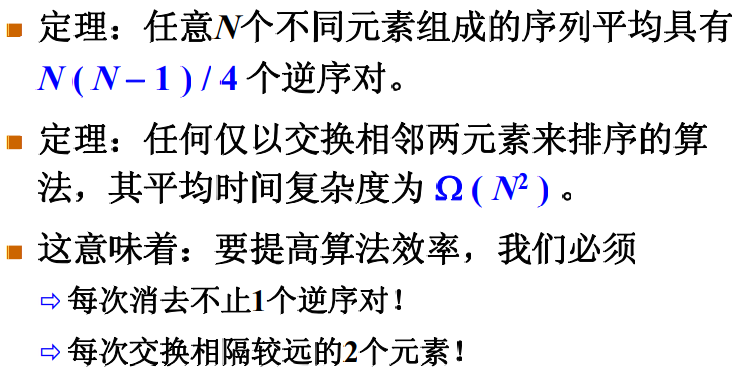

## 希尔排序（by Donald Shell）

基本思路就是利用了插入排序的简单，同时克服插入排序的每次只交换相邻的两个元素的这个缺点。

举个例子，shell sort的第一步是先做一个5-间隔的排序，也就是我考虑这个序列里面的一个子序列，这个子序列的元素是每隔五个来选取的，也就是说我先选的第一个元素，然后再选第6个，再选第11个，排序之后的结构放在他们相应的位置。这样排完了五组之后，继续完成3-间隔的排序，继续排完了三组之后，最后我再做一个1-间隔的插入排序，但是在我们做1间隔的插入排序之前这个序列在做完了5间隔和3间隔排序之后，序列就已经基本有序了。也就是它大部分的逆序对已经在前面的两趟排序中被消掉了。

所以它的思想就是先定义一个增量序列，也就是我现在是随便定义了一个5，3,1,你也可以定义你自己的从某个数字开始，几间隔几间隔，无论如何这个序列它是递减的，递减到最小的那个，也就是最后一步必须是1间隔的。定义了这么一个增量序列之后，我们对每一个增量进行一个对应间隔的排序，k是从m开始一直减到1。

在这里有一个很重要的性质我们要观察到，当我对这个序列先进行了5-间隔的排序然后又进行了3-间隔的排序，问题是3-间隔的排序之后，这个序列还是5间隔有序的吗？观察可以知道，更小间隔的排序没有把上一步的排序的结果变坏，否则希尔排序就不好用了。

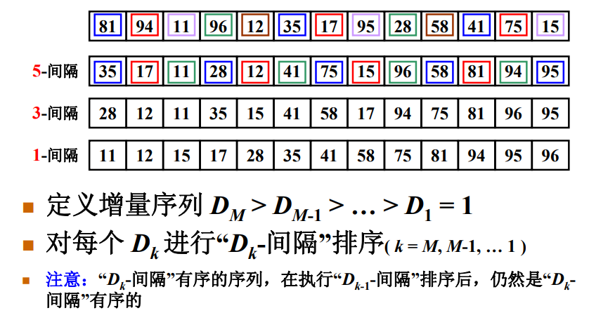

所以希尔排序的增量序列一开始就选一个N/2的向下取整，每次减半，直到减到1为止。

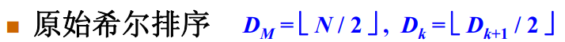

所以我们就在最外层套一个大循环，是关于增量的。在里面就直接执行插入排序。P代表我们的第2张牌，第一张牌是0，默认已经拿了。由于是间隔D，所以第2张牌是D，这是第一组，后面还有第二组，第三组一直到D组，我们这边是在一个for循环中把这几组的排序一起做了，也就是也默认了从0-D-1的牌我已经拿了。注意到就是把原来的插入排序中的1全部换成D就可以了。

但是一个很坏的消息告诉我们最坏情况下希尔排序的时间复杂度是Θ（N²）的，Θ的意思是什么？我们说O是一个上界，它有可能达不到这个上界。Ω是一个下界，Θ既是一个上界又是下界，也就是说它的增长速度真的是和N²一样快的。到底是什么地方出了问题？

```c
void Shell_sort( ElementType A[], int N ) 
{ 
    for ( D=N/2; D>0; D/=2 ) { /* 希尔增量序列 */
        for ( P=D; P<N; P++ ) { /* 插入排序 */
            Tmp = A[P]; 
            for ( i=P; i>=D && A[i-D]>Tmp; i-=D )
            	A[i] = A[i-D]; 
            A[i] = Tmp; 
        }
    }
}
```

我们来看一个坏例子，如果我们用希尔的这个增量序列，我们会一开始用8间隔的排序，然后是4间隔，然后是2间隔，然后是1间隔。你会发现我前面做的三趟排序全部都白跑了，最后还是和原始的插入排序一样。我们通过分析发现，增量元素不互质，小的增量在后面的排序里头可能根本不起作用。

- **增量元素不互质，则小增量可能根本不起作用**。

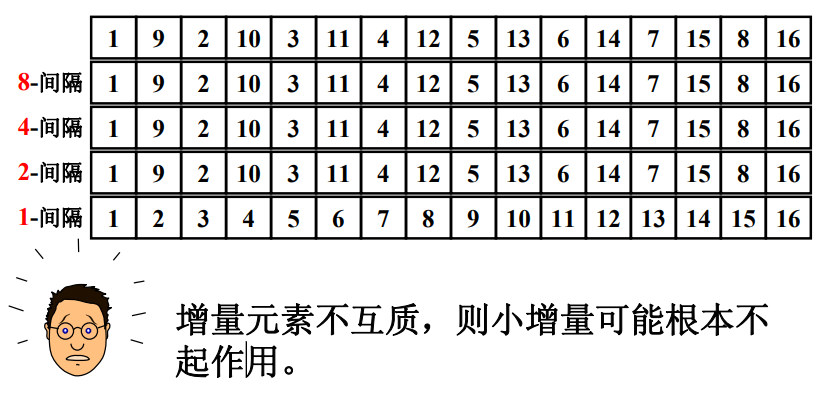

为了克服这个问题，有更多的学者提出了更多的增量序列，比如说Hibbard增量序列，它把每一步的增量定义成2的k次方-1，这个增量序列的好处是保证了相邻的元素是互质的。这样它的最坏时间复杂度是N的3/2次方，事实上这个证明比较困难。还有一个猜想就是平均时间复杂度是N的5/4次方。

还有一个Sedgewick增量序列，猜想它的平均时间复杂度可能是N的7/6次方，最坏时间复杂度可能是N的4/3次方。

希尔排序从实际应用的角度来讲，如果你要排序的元素它的数量是几万这个数量级的，那么用希尔排序加上edgewick增量序列的话效果是比较好的。希尔排序给我们一个很好的例子，你就看到一个算法它会如此简单但是关于它的复杂度分析是非常非常困难的。

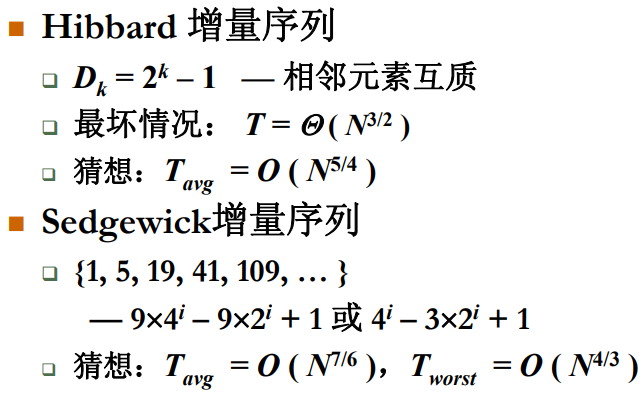

#### 代码--希尔排序

```c
void ShellSort( ElementType A[], int N )
{ /* 希尔排序 - 用Sedgewick增量序列 */
     int Si, D, P, i;
     ElementType Tmp;
     /* 这里只列出一小部分增量 */
     int Sedgewick[] = {929, 505, 209, 109, 41, 19, 5, 1, 0};
     
     for ( Si=0; Sedgewick[Si]>=N; Si++ ) 
         ; /* 初始的增量Sedgewick[Si]不能超过待排序列长度 */

     for ( D=Sedgewick[Si]; D>0; D=Sedgewick[++Si] )
         for ( P=D; P<N; P++ ) { /* 插入排序*/
             Tmp = A[P];
             for ( i=P; i>=D && A[i-D]>Tmp; i-=D )
                 A[i] = A[i-D];
             A[i] = Tmp;
         }
}
```


## 选择排序

在说堆排序之前我们先要看看选择排序。选择排序的基本思想就是每一次从i到N-1的位置上找到一个最小的，换到i这个位置上。我们交换的这两个元素在大多数情况下都不是相邻的，可能是跳了很远做了一次交换，一次交换就是一个好消息，我们可能一次交换消去了很多的逆序对。对于选择排序而言，最坏情况下我们需要做多少次的交换呢？反正我就是找一个最小元然后交换。最坏的情况就是每次都换。也就是最多换n-1次，所以交换这一步的时间复杂度是线性的，但是瓶颈在于找最小元，选择排序用的是一各简单粗暴的方法，就是从i一直扫描到n-1，找出最小元。如果是这样的话那么，scanformin这个函数对应的也是一个for循环，外头又套了一层for循环，于是很显然，它的时间复杂度就是Θ（N²）这个数量级的，这个时间复杂度是无所谓最好情况还是最坏情况的。我们要想得到一个更快的算法，关键就是把最小的元素变快。也就是说我们如何才能更快的找到最小元，看到最小元就要想到最小堆，最小堆的特点就是根节点就一定存的是最小元，所以就有了后面的堆排序。

```c
void Selection_Sort ( ElementType A[], int N )
{ 
    for ( i = 0; i < N; i ++ ) {
    MinPosition = ScanForMin( A, i, N–1 ); 
    /* 从A[i]到A[N–1]中找最小元，并将其位置赋给MinPosition */
    Swap( A[i], A[MinPosition] );
    /* 将未排序部分的最小元换到有序部分的最后位置 */
    }
}
```

#### 堆排序

堆排序其实是对选择排序的一种改进。先看一个比较傻的算法。就是一个非常直截了当的deleteMin，开始建了一个堆，有一个线性复杂度的算法可以把一个数组调整成一个最小堆，调整好了以后我每次就调用一次deleteMin把根节点弹出来，弹出来以后我得有一个地方存，就另外开一个临时数组去存这些元素，总之我就依次弹出最小元然后存在这个数组里面。最后我们必须还需要将临时数组里面的元素倒回到A数组中，因为我们的Sort默认的接口是什么？你的用户把一个无序的数组给你，你在执行完了这个Sort之后返回给它的必须是一个有序的数组，而这个有序的数组必须要存在原来的这个数组里。我们只要生成一个临时数组就行了，我们还需要把数组中的元素导回A中，导回是很浪费时间的。

时间复杂度是多少？BuildHeap是一个线性时间复杂度的一个算法。在循环里面，每一步是一个DeleteMin是一个logN复杂度的，所以乘上外循环应该是NlogN的复杂度，导出这一步是N复杂度的。所以整体的时间复杂度应该是NlogN复杂度的。这个算法看上去非常简单，但是它有一个非常大的问题就是它需要额外开一个O（N）级别的空间，这就使得你2GB的内存原本能一次性排2GB的东西，东西只能排1GB了。这个时候就有问题了，如果你要排2GB的元素你就开不出空间了。你这个算法就不能用了。另外导出到A这一步也是需要时间的，我们其实可以不做这一步。

```c
void Heap_Sort ( ElementType A[], int N )
{ 
    BuildHeap(A); /* O(N) */
    for ( i=0; i<N; i++ ) 
    TmpA[i] = DeleteMin(A); /* O(logN) */
    for ( i=0; i<N; i++ ) /* O(N) */
    A[i] = TmpA[i];
}
```

我们来看更聪明的第二个算法。要理解算法二，我们先看一个例子。比如说我们有一个数组有四个元素，算法二的一个想法是，我不是要把它调整成一个最小堆，而是把它调整成一个最大堆

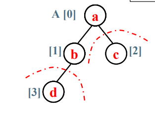

这样我们调整成了最大堆，d是最大的字母，处于根节点。因为我们知道d是最大的元素，而在一个正常排好序的数组里面，最大元素应该放在最后一个位置，我们应该做的就是把根节点和最后一个元素做一个交换

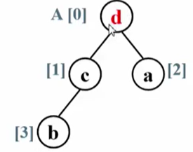

交换完以后我们就把整个堆的规模-1，那么就把这个d排除在外了，因为后面再做什么这个d都不用动了，它已经放在它最终的正确的位置上了。然后我们再来看剩下的这个堆剩下这个堆还有三个元素，然后我要继续把这个堆调整成一个最大堆

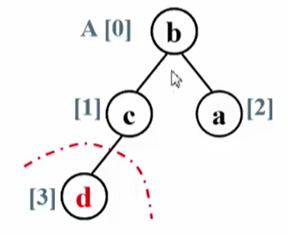

下面是调整的结果，c应该在最上面，然后重复前面的步骤也就是把c换到现在最后一个位置上，把c和a换位


然后我们把c也给砍掉

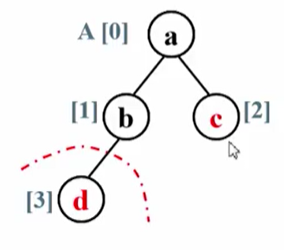

现在堆只剩两个元素，我们继续调整成最大堆，然后b和a做最后一次交换

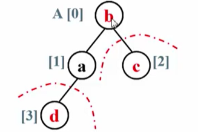

就完成了我们最后的排序

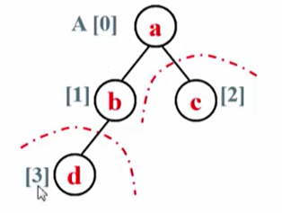

在这要稍微说一下，要讲堆这个概念的时候，我们说堆的元素是从第一个下标为的元素开始计数的，A[0]是不放任何真的元素的，A[0]里面放的是一个哨兵，但是在我们排序算法里面，你的用户可不知道前面应该给你留一个哨兵，你的用户是从第0个就开始存的，所以在堆排序里面的这个堆它的元素是从0开始记的。这也就导致了任何一个节点，他跟他的孩子节点的那个下标的关系就不一样了。左孩子为2i+1，右孩子为2i+2.搞清楚了这个关系之后我们就来看看堆排序的伪码。

前面的一个for循环实际上是把BuildHeap写的更具体了，核心是调用了一个向下过滤的一个子函数。i对应的是根节点所在的位置，N对应的是当前堆的元素个数，从i=N/2开始反复的调用，就把一个最大堆建立起来了。然后就进入了堆排序的循环，在这个循环里要做的事是在我最大堆建立完了以后我就知道A[0]这个根节点里面一定存的是最大的元素，我把它和A[i],A[i]记录的是当前最后一个结点的下标。也就是把当前这个根节点换到堆的最后一个元素的位置上。相当于是一个DeleteMax，然后把剩下的元素继续调整成一个最大堆。调整的时候是以0为根节点，i是当前元素的个数。

那么时间复杂度如何？由下面的定理可以知道，它的时间复杂度比NlogN小，因为它减掉了一个东西。

- 定理：堆排序处理N个不同元素的 随机排列的平均比较次数是 2N logN - O(Nlog logN) 。 
- 虽然堆排序给出最佳平均时间复 杂度，但实际效果不如用 Sedgewick增量序列的希尔排序

```c
void Heap_Sort ( ElementType A[], int N )
{ 
    for ( i=N/2-1; i>=0; i-- )/* BuildHeap */
    	PercDown( A, i, N ); 
    for ( i=N-1; i>0; i-- ) { 
        Swap( &A[0], &A[i] ); /* DeleteMax */
        PercDown( A, 0, i ); 
    } 
}
```

###### 代码--堆排序

```c
void Swap( ElementType *a, ElementType *b )
{
     ElementType t = *a; *a = *b; *b = t;
}
 
void PercDown( ElementType A[], int p, int N )
{ /* 改编代码4.24的PercDown( MaxHeap H, int p )    */
  /* 将N个元素的数组中以A[p]为根的子堆调整为最大堆 */
    int Parent, Child;
    ElementType X;

    X = A[p]; /* 取出根结点存放的值 */
    for( Parent=p; (Parent*2+1)<N; Parent=Child ) {
        Child = Parent * 2 + 1;
        if( (Child!=N-1) && (A[Child]<A[Child+1]) )
            Child++;  /* Child指向左右子结点的较大者 */
        if( X >= A[Child] ) break; /* 找到了合适位置 */
        else  /* 下滤X */
            A[Parent] = A[Child];
    }
    A[Parent] = X;
}

void HeapSort( ElementType A[], int N ) 
{ /* 堆排序 */
     int i;
      
     for ( i=N/2-1; i>=0; i-- )/* 建立最大堆 */
         PercDown( A, i, N );
     
     for ( i=N-1; i>0; i-- ) {
         /* 删除最大堆顶 */
         Swap( &A[0], &A[i] ); /* 见代码7.1 */
         PercDown( A, 0, i );
     }
}
```

## 归并排序

说到归并排序，核心就是两个有序子列的归并。

- **核心：有序子列的归并**

假设我们有两个子序列，这两各子序列本身已经是排好序的了。我们的目标是开另外一个数组，然后要把这些数字一个一个放到这个数组里。希望最后一个数组是从小到大有序的。 在之前的线性表中有讲过两个多项式的相加问题，思想是非常相似的，我们准备三个指针，A指针指向A序列的第一个元素，B指向B序列第一个元素，C指针指向现在你要放元素的位置，当我们在说到一个指针的时候，它不一定是C语言语法上的指针，所谓指针它的本质就是它存的是位置，如果我们在讨论的是一个数组，那么数组元素的位置是由它的小标确定的。所以其实我们在这里说指针，这个指针可以是整数，这个整数存储的是这个元素的下标。接下来我们看这件事情怎么开始。

第一步就是先比一下A指针和B指针指向的元素，我们把比较小的那个元素放到C指针指的这个位置上，做完这件事情以后，因为我改变了A，所以A++往后走，C++也往后走到下一个空位，一直类似的往下做。

问题是如果两个子列一共有N个元素，那么这一趟归并的时间复杂度是多少？很显然是N级别的时间复杂度，因为每一个元素被扫描一遍，每一个元素被存进去一次。

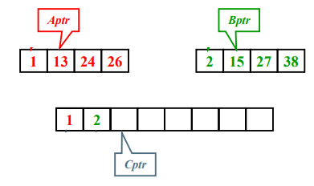

接下来看看有序子列归并的代码怎么写。函数名叫Merge-归并。注意到传进来了很多的参数，A数组是原本待排的那个序列，同时传进来一个TempA因为我们归并的时候需要一个临时的数组，L指的是我要归并的左边的起始位置也就是A指针，R是有边的起始位置也就是相当于我们的B指针，我们还需要一个量来存右边的终点的位置，也就是右边这一半最后一个元素所在的位置。我们假设左右两列紧挨着，我们就可以算出左边这个子列它的终点的位置。temp一开始等于L指的是C指针，它指的是在这个临时数组里要从哪开始存放归并完了以后的结果。归并结果的位置跟原始数组里面元素的位置是对着的，所以它也要从第L个开始放。通过传进来的参数我们可以算出来到底我们归并完了以后元素的总个数是多少，也就是最右边终点的那个位置减去最左边的位置+1得到的是整个归并完了以后中间会有多少个元素。准备工作完成就可以开始归并了

归并的过程中，每一次比较左边的元素和右边的元素谁更小，把更小的放到临时数组里。跳出循环就意味着其中一个子序列已经空了，我们就直接把有剩下的直接都导入到数组里。下面两个while只有一个会被执行。完了之后我们临时数组里面已经归并好了，但是我们还需要导回A中。由于在归并过程中L一直在++，我们不能利用从L一直到RightEnd来完成这件事。但是我们发现RightEnd这个东西从头到尾没有变过，所以我们就可以从rightend开始导回，每一次rightend--，一共减数组的个数就行了，这也是为什么我们一开始计算出了数组的个数。（思考，我们一开始存L是不是也行？）

```c
/* L = 左边起始位置, R = 右边起始位置, RightEnd = 右边终点位置 */
void Merge( ElementType A[], ElementType TmpA[], 
int L, int R, int RightEnd ) 
{ 
    LeftEnd = R - 1; /* 左边终点位置。假设左右两列挨着 */
    Tmp = L; /* 存放结果的数组的初始位置 */
    NumElements = RightEnd - L + 1; 
    while( L <= LeftEnd && R <= RightEnd ) {
        if ( A[L] <= A[R] ) TmpA[Tmp++] = A[L++]; 
        else TmpA[Tmp++] = A[R++]; 
    }
    while( L <= LeftEnd ) /* 直接复制左边剩下的 */ 
    	TmpA[Tmp++] = A[L++]; 
    while( R <= RightEnd ) /*直接复制右边剩下的 */ 
    	TmpA[Tmp++] = A[R++]; 
    for( i = 0; i < NumElements; i++, RightEnd -- ) 
    	A[RightEnd] = TmpA[RightEnd]; 
}

```

#### 递归算法

归并算法其实有两种实现，递归算法比较好理解，先来看看递归算法。归并排序的递归算法就是一种非常典型的分而治之策略的应用。思想就是我递归的去把左半边排好序，再递归去把右半边排好序，然后我们就得到了两个有序的肩并肩排在一起的子序列，我们再调用之前的那个Merge即可完成排序。

仍然是传进待排数组、临时数组。还有L和RightEnd，L指的是当前这个待排序列最左边的这个位置，RightEnd指的是待排序列最右边的位置。我们需要一个变量来记录中间的位置，因为我要把它从中间一分为2.当什么条件满足的时候我们才能进行分治呢？在待排序列有元素的时候我们做这件事才有意义，也就是说只有当RightEnd>L的时候，相等的时候代表只有一个元素，我们不需要排。

T( N ) = T( N/2 ) + T( N/2 ) + O( N ) =======》T( N ) = O( N logN )。时间复杂度在任何情况下都是NlogN。另外，归并排序是稳定的算法。

但是到这我们还没完，因为我们一开始约定的函数接口是传进来数组和元素的个数，而不是这么一大堆参数。

```c
void MSort( ElementType A[], ElementType TmpA[],
int L, int RightEnd ) 
{ 
    int Center; 
    if ( L < RightEnd ) {
        Center = ( L + RightEnd ) / 2; 
        MSort( A, TmpA, L, Center );
        MSort( A, TmpA, Center+1, RightEnd ); 
        Merge( A, TmpA, L, Center+1, RightEnd ); 
	} 
}

```

所以我们要给用户一个统一的函数接口

```c
void Merge_sort( ElementType A[], int N ) 
{ 
    ElementType *TmpA;
    TmpA = malloc( N * sizeof( ElementType ) ); 
    if ( TmpA != NULL ) { 
        MSort( A, TmpA, 0, N-1 ); 
        free( TmpA ); 
    } 
    else Error( “空间不足" ); 
}

```

这里我们还需要思考一个问题，就是为什么我们要在MSort这一层一直带着临时数组进去递归呢？思考如果我们不这么做，就是我们只在Merge函数中声明临时数组，你要记得临时数组就只有一个作用就是导入A中。也就是说我们在递归中运行了多少次的Merge我们就要声明多少次的临时数组，用完了之后还要把它free掉。这样来来回回的申请和释放其实还不如就在最外层申请一个临时数组，我们在中间递归的时候就在它的中间某一段上操作。

###### 代码--递归算法

```c
/* 归并排序 - 递归实现 */

/* L = 左边起始位置, R = 右边起始位置, RightEnd = 右边终点位置*/
void Merge( ElementType A[], ElementType TmpA[], int L, int R, int RightEnd )
{ /* 将有序的A[L]~A[R-1]和A[R]~A[RightEnd]归并成一个有序序列 */
     int LeftEnd, NumElements, Tmp;
     int i;
     
     LeftEnd = R - 1; /* 左边终点位置 */
     Tmp = L;         /* 有序序列的起始位置 */
     NumElements = RightEnd - L + 1;
     
     while( L <= LeftEnd && R <= RightEnd ) {
         if ( A[L] <= A[R] )
             TmpA[Tmp++] = A[L++]; /* 将左边元素复制到TmpA */
         else
             TmpA[Tmp++] = A[R++]; /* 将右边元素复制到TmpA */
     }

     while( L <= LeftEnd )
         TmpA[Tmp++] = A[L++]; /* 直接复制左边剩下的 */
     while( R <= RightEnd )
         TmpA[Tmp++] = A[R++]; /* 直接复制右边剩下的 */
         
     for( i = 0; i < NumElements; i++, RightEnd -- )
         A[RightEnd] = TmpA[RightEnd]; /* 将有序的TmpA[]复制回A[] */
}

void Msort( ElementType A[], ElementType TmpA[], int L, int RightEnd )
{ /* 核心递归排序函数 */ 
     int Center;
     
     if ( L < RightEnd ) {
          Center = (L+RightEnd) / 2;
          Msort( A, TmpA, L, Center );              /* 递归解决左边 */ 
          Msort( A, TmpA, Center+1, RightEnd );     /* 递归解决右边 */  
          Merge( A, TmpA, L, Center+1, RightEnd );  /* 合并两段有序序列 */ 
     }
}

void MergeSort( ElementType A[], int N )
{ /* 归并排序 */
     ElementType *TmpA;
     TmpA = (ElementType *)malloc(N*sizeof(ElementType));
     
     if ( TmpA != NULL ) {
          Msort( A, TmpA, 0, N-1 );
          free( TmpA );
     }
     else printf( "空间不足" );
}
```


#### 非递归算法

递归算法虽然好理解但是它需要占用系统的堆栈，有很多额外的操作会使得它比较慢。那么我们能不能用一个非递归的算法来把它做出来？是可以的

非递归算法的基本思路是这样的，假设在一开始的时候一共有n个有序的子序列，每一个子序列都只含有一个元素，下一步我就把相邻的两个有序的子序列做一次归并，于是我就形成了诺干个有序的子序列，每个子序列的长度就变成了2，继续如下操作，一直到最后得到一个完整的有序的序列。但是你会发现中间需要申请的空间有点多，就算你及时释放，释放和申请也会使得算法不是那么优。那么我们可以直接申请一个数组，我们一次归并就把数组从A到临时数组，再一次就从临时数组又归并成A。这样循环往复即可，如果最后一步就是A那么就万事大吉，如果不是那么也只需要一趟导入即可。它的核心步骤就是一趟归并。

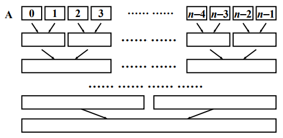

我们需要传进的参数有，A、临时数组、元素个数、以及当前有序子列的长度length。很明显，每一个数字自己就是一个有序的子列，length输出化为1.第一步执行的就是从左到右一对一对的Merge，每一次给的i是最左边的位置，i+length就是右边的起始，i+2length-1就是右边的终止。每一次循环i都要加上2length。还有一个要注意的就是这边的Merge1和Merge不一样，在Merge里面我们是要把temp里面的导回到A里面的，但是在Merge1里面我们不做这步，因为归并的结果在temp里面，这种交换的效果就是我们想要的。还有就是我们循环结束的条件不是N，而是执行到N-2length的时候结束的，因为我们最终的序列可能是奇数对的，那么我们就不能一次性处理，我们把尾巴留在最后处理，因此我们只处理到倒数第二对。

前面的处理完了之后我们再看尾巴，如果i+length，还是小于n的那么就说明最后是有两个序列的，那么我再继续去调用merge1，把最后两个子列归并一下，注意到最后一个子列的尾巴一定是n-1。否则就是只剩下了一个子列，直接把剩下的这个子列直接导入到temp中即可。这样就完成了我们一趟的归并。

```c
void Merge_pass( ElementType A[], ElementType TmpA[], int N,
                int length ) /* length = 当前有序子列的长度 */
{ 
    for ( i=0; i <= N–2*length; i += 2*length )
    	Merge1( A, TmpA, i, i+length, i+2*length–1 );
    if ( i+length < N ) /* 归并最后2个子列 */
    	Merge1( A, TmpA, i, i+length, N–1);
    else /* 最后只剩1个子列 */
    	for ( j = i; j < N; j++ ) TmpA[j] = A[j];
}
```

接下来看看统一的接口怎么写，我们一开始请求一个临时数组，如果请求成功了，那么我们就开始做排序。做完了之后要把空间释放了。最开始我们假设了有序子列的长度是1，所以我们在一开始初始化字序列长度。要记得我们需要merge两次，一次导出一次导回，这样可以保证当我while循环跳出来的时候无论如何最终的结构都是保存在A中的。尽管可能在执行了一次merge之后length*2比N大了，也没关系mergepass就是做了一次导出到A中。

归并排序有一个非常好的性质它是稳定的。归并排序有各种的好处有各种好处，包括的它的复杂度是nlogn。但是有一点不好，就是它需要一个额外的空间，并且它需要在数组和数组之间来回的去复制导这个元素。所以在实际应用的时候，归并排序不被用于内排序，也就是说我们所有的元素都可以在内存里面完成这个时候没人会用归并排序做这件事情，归并排序在外排序的时候是一个非常有用的工具。

```c
void Merge_sort( ElementType A[], int N ) 
{ 
    int length = 1; /* 初始化子序列长度 */
    ElementType *TmpA;
    TmpA = malloc( N * sizeof( ElementType ) ); 
    if ( TmpA != NULL ) { 
        while( length < N ) { 
            Merge_pass( A, TmpA, N, length );
            length *= 2;
            Merge_pass( TmpA, A, N, length ); 
            length *= 2;
        }
        free( TmpA ); 
    } 
    else Error( “空间不足" ); 
}
```

###### 代码--非递归算法

```c
/* 归并排序 - 循环实现 */
/* 这里Merge函数在递归版本中给出 */

/* length = 当前有序子列的长度*/
void Merge_pass( ElementType A[], ElementType TmpA[], int N, int length )
{ /* 两两归并相邻有序子列 */
     int i, j;
     //n-1-(2len-1)=n -2len
     for ( i=0; i <= N-2*length; i += 2*length )//当前这组开头等于N-2LEN的话刚好不越界
         Merge( A, TmpA, i, i+length, i+2*length-1 );
     if ( i+length < N ) /* 归并最后2个子列，i*/
         Merge( A, TmpA, i, i+length, N-1);
     else /* 最后只剩1个子列*/
         for ( j = i; j < N; j++ ) TmpA[j] = A[j];
}

void Merge_Sort( ElementType A[], int N )
{ 
     int length; 
     ElementType *TmpA;
     
     length = 1; /* 初始化子序列长度*/
     TmpA = malloc( N * sizeof( ElementType ) );
     if ( TmpA != NULL ) {
          while( length < N ) {
              Merge_pass( A, TmpA, N, length );
              length *= 2;
              Merge_pass( TmpA, A, N, length );
              length *= 2;
          }
          free( TmpA );
     }
     else printf( "空间不足" );
}
```

## 快速排序

快排是在现实应用中最快的一种排序算法。在前面说过，没有一种算法是在任何一种情况下都是最好的，所以快速排序也不是在任何情况下都是最好的，我们总是可以构造出一种它的最坏情况，在最坏的情况下排序算法的表现也可以是非常糟糕，但是在大多数的情况下，对于大规模的随机数据，快速排序的表现还是相当出色的，但是前提条件是你把快速排序中所有的小细节都实现的非常到位，因为快速排序的一个特点就是你自己写的话很容易写错，一不小心有一个细节实现不好它就不是快速排序了，它还会相当的慢。

快速排序的算法和归并函数的算法有一定的相似之处，就在于它们的策略都是采用分而治之，说到分而治之我们就想到了递归。下面来看一个例子，比如说我们给了一堆整数，然后随便挑一个出来当做主元pivot。我么以65作为枢纽，那么原来的数字集合变成了两大块，一边小于65，另外一边大于65.然后递归去治理左边和右边，然后我们把三块的结果放在一个数组里就完成了一次快速排序。

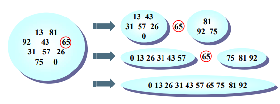

下面是快排算法的伪码描述，第一步是从待排的数组里面取一个主元，除掉这个数组，把数组分成其它两个独立的子集，一部分小于主元，一部分大于。完成以后我们就递归的调用左边，中间放上主元，然后递归调用右边。然后把最后的结果放回到数组里，就完成了整个排序。注意到这是一个递归的流程，我们在说到递归的时候必须要有一个最小集合，也就是递归到什么时候我就跳出来了？条件放在前面，进来的时候先判断N，如果只有一个元素的话那么我们递归就不用继续了，直接return。算法不是很复杂，但是实现的时候有很多的细节需要注意

第一个就是主元要怎么选，主元选的不好快速排序也就快不起来。再一个就是根据主元把它变成两个子集，分的过程如果耗费的时间太多，快速排序也快不起来。在我们考虑快速排序的效率的时候，我们先考虑它的最好情况和最坏情况。快速排序最好的情况就是每次主元都正好在数组的中间，那么这种算法的时间复杂度就是nlogn。后面在选主元的时候就知道什么情况下快排是最糟糕的

```c
void Quicksort( ElementType A[], int N ) 
{ 
    if ( N < 2 ) return;
    pivot = 从A[]中选一个主元; 
    将S = { A[] \ pivot } 分成2个独立子集:
    A1={ a∈S | a ≤ pivot } 和
    A2={ a∈S | a ≤  pivot };
    A[] = Quicksort(A1,N1)∪
    {pivot}∪
    Quicksort(A2,N2);
}
```

#### 选主元

一个很直接的方法就是直接把主元取成数组的第0个元素，但是这其实是一种非常笨拙的取法。因为如果对于一个基本有序的数组那么快排就需要N²的时间复杂度。所以pivot一定不能这么取。

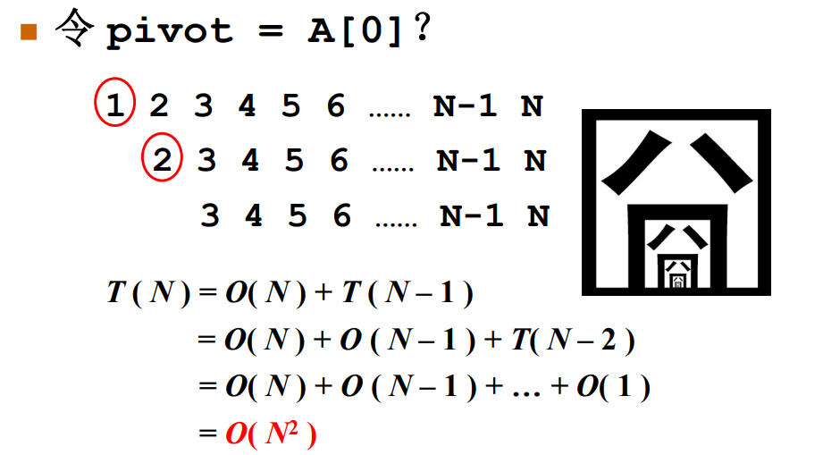

一种比较安全的方法就是随机取，但是随机你要涉及到一个随机函数，不便宜的意思就是它需要花时间，时间就是金钱。有好几种经典的方法

比较常用的就是取头、中、尾的中位数。除了这种方法以外还有其它的方法，一般还有五个数取中位数，在复杂就是7个数取中位数。不管咋说，这都是随机函数来的容易。

- 随机取 pivot？rand()函数不便宜啊！ 

- 取头、中、尾的中位数 
  - 例如 8、12、3的中位数就是8
  - 测试一下pivot不同的取法对运行速度有多大影响？

下面来看看最时髦的Median3，也就是三个数取中位数。除了传进去数组以外还得知道它的头和尾在哪。有了头和尾之后就可以算出中间的位置，接下来做了三步的比较和交换，前三步就是一个选择排序的手动过程，前两步完最小的在最左边，第三步完就完成了从小到大从左到右的排序。为了后面的子集划分操作方便，我们先把它放在要考虑的子集的最右边。

```c
ElementType Median3( ElementType A[], int Left, int Right ) 
{ 
    int Center = ( Left + Right ) / 2; 
    if ( A[ Left ] > A[ Center ] ) 
    	Swap( &A[ Left ], &A[ Center ] ); 
    if ( A[ Left ] > A[ Right ] ) 
    	Swap( &A[ Left ], &A[ Right ] ); 
    if ( A[ Center ] > A[ Right ] ) 
    	Swap( &A[ Center ], &A[ Right ] ); 
    /* A[ Left ] <= A[ Center ] <= A[ Right ] */ 
    Swap( &A[ Center ], &A[ Right-1 ] ); /* 将pivot藏到右边 */ 
    /* 只需要考虑 A[ Left+1 ] … A[ Right–2 ] */
    return A[ Right-1 ]; /* 返回 pivot */ 
}
```

#### 子集划分

来看下面例子，可以看到调用完了median3以后，选的主元被我们藏到了最右边的这个位置。这时候就要开始找6这个元素应该被放在哪里。首先我么定一个左边的指针叫做i，右边的指针j。这边的指针不是c语法上的指针，指针本质是位置，我们这里用整数来指代数组元素位置。

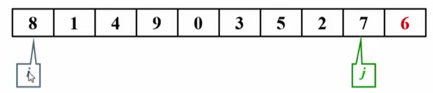

先比较i所指的这个元素和主元，如果发现i所指的元素比主元大说明出现问题了，因为i在主元的左边，需要比主元小才是对的。那么这时候我们的i就保持不动红色警报，我们来看j所指的元素。7没问题，大于6，然后接着看2,2这边就出现问题了，红色警报。在两边都发现了有不对的元素以后，我们应该把两个不对的元素交换一下。i和j所指的元素互换。

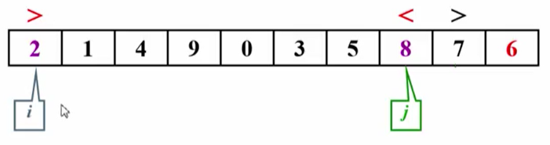

然后开始下一轮的比较，到种类又出现了两个红色警报，我们再把5和9换一下。

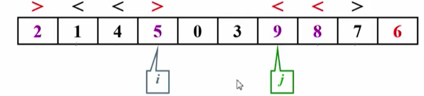

i会继续往前走，中间会和j重叠，但是机器不知道结束了还是没结束，所以机器会一直往前走，一直到i<j，i所在的位置就是主元的正确位置。所以最后一步我们就把i位置和主元交换。所以说，快速排序为什么快，是因为每一次它选定一个主元后，在完成子集划分以后它就被一次性的放到了它最终的正确的位置上。和插入排序不一样，插入排序在你拿来一张牌插入以后，在后序还可能发生移动。

看上去子集划分也不是一个很复杂的问题，但是有一个很有趣的情况，如果有元素正好等于pivot怎么办？我们有两种选择，我们换不换？我们来考虑一个极端的情况，也就是这个数组全部的元素都是等于1的。这个时候会放生什么事情呢？我们首先调用median3，比一比头尾中间，然后发现都不需要动，然后我把中间的median换到了right-1。然后开始考虑两个指针，i和j。比较了一下发现i和主元相等，我就停住了，然后再比较右边的j，又停住了，然后i和j交换。然后i++，j--交换。发现，当所有的元素都相等的时候它会做一大堆没有意义的交换。这件事情有点傻，但是有一个好处，就是做了很多没有意义的交换以后，最后i和j它会停在比较中间的位置，于是最后我们的主元会被换到中间的位置。这么做的一个好处就是每一次递归的时候这个原始的序列都会被基本上等分成两个等长的序列，也就是N/2的序列，这样往下递归，这么做的最后的时间复杂度是NlogN。

另外一种选择，也就是如果碰到相等的元素，我不理，继续移动指针，那么在刚才那种全部元素都相等的情况下，在这种情况下i指针会一直往右移动到j的位置，j指针根本没有机会移动。这样的好处是我避免了很多没有意义的交换。但是坏处是每一次划分的时候基本上主元都是被放在某一个端点的。于是我们就回到了我们前面最囧的状况，变成了一个N²的算法。所以两种情况来比较，**我们宁可选择停下来交换**

如果有元素正好等于pivot怎么办？  停下来交换？  不理它，继续移动指针？

#### 小规模数据的处理

我们必须要意识到快速排序一个最大的问题就是递归的，它会占用很多额外的系统堆栈的空间，而且在每一次调用系统堆栈的时候它会有很多的进栈，然后一次递归结束以后它返回的时候要有很多pop。所以整个递归的过程其实是很慢的。于是对于小规模的数据，例如N还不到100，这个时候快排可能还不如插入排序。解决方案就是对于大规模的数据我们用递归，对于小规模的数据我们就不要递归了。

- 快速排序的问题

   用递归……  对小规模的数据（例如 N不到100）可能还不如插 入排序快 

- 解决方案  当递归的数据规模充分小，则停止递归，直接调用 简单排序（例如插入排序）  在程序中定义一个Cutoff的阈值 —— 课后去实践 一下，比较不同的Cutoff对效率的影响

#### 算法分析

这是Quicksort一个递归的函数接口，既然我们在说递归，就是每一次我需要知道这个数组从哪里开始哪里结束的，所以我需要知道它最左端的下标和最右端的下标。第一件事情就是调用median3去得到一个主元，当我从median3跳出的时候，返回的不仅仅是一个主元的值，调用这个函数就意味着对原来的数组left和right也做了一个修改，这个时候left存的是三个里面的最小值，right存的是最大值，主元藏在right-1的位置。当我们开始做自己划分的时候，定义i和j的值。这里i和j不是从i-1到j-2，你也可以这么定义，但是后面的代码要改一下。我们在这是这样来做的，子集划分是一个不断循环的过程，在每一次循环里面，因为i是初始化为left，所以上来++i，先把i向右边移动一个位置，也就是移动到了left+1这个位置，然后把它和主元做一个比较，如果它比主元小的话那么一切正常，我什么都不做，一直向右移动指针，一直到这个元素大于主元的时候红色警报，i就停住了，停住以后就进入到j的while，一直到j也停住。（注意到我们这边是先减后用也就是先--，如果我们初始化是left-1和right-2那就是后--）。调换i和j的位置的时候先看看他们之间的顺序对不对。如果顺序不对那么说明子集划分的循环就结束了，我们就从循环中跳出。然后把主元换到i位置就行了。

子集划分也完成了以后我们就开始递归了，递归的对左半部分，递归的对右半部分。因为所有的元素都是直接放到A数组里面的，所以当递归完成的时候我们整个排序也就完成了。但是我们还有一个cutoff，也就是如果当前待排序列太短了，那么我们就用简单排序即可。

还有一个问题就是现在这个快排函数的接口不对，我们要把它改成一个只含有数组A和元素个数的接口，但是这个快排函数是一个递归的函数，它必须要知道数组的左端和右端。所以它不符合要求。于是我们要在外面给它套一个壳，壳是符合接口要求的。

```c
void Quicksort( ElementType A[], int Left, int Right ) 
{ 
    if ( Cutoff <= Right-Left ) {
        Pivot = Median3( A, Left, Right );
        i = Left; j = Right – 1;
        for( ; ; ) { 
            while ( A[ ++i ] < Pivot ) { }
            while ( A[ ––j ] > Pivot ) { }
            if ( i < j ) 
                Swap( &A[i], &A[j] );
            else break;
        } 
        Swap( &A[i], &A[ Right-1 ] );
        Quicksort( A, Left, i-1 ); 
        Quicksort( A, i+1, Right );
    }
    else
    	Insertion_Sort( A+Left, Right-Left+1 );
}
```

```c
void Quick_Sort(ElementType A[],int N) 
{ 
	Quicksort( A, 0, N-1 ); 
}
```

#### 代码--快速排序 - 直接调用库函数

```c
##include <stdlib.h>

/*---------------简单整数排序--------------------*/
int compare(const void *a, const void *b)
{ /* 比较两整数。非降序排列 */
    return (*(int*)a - *(int*)b);
}
/* 调用接口 */ 
qsort(A, N, sizeof(int), compare);
/*---------------简单整数排序--------------------*/


/*--------------- 一般情况下，对结构体Node中的某键值key排序 ---------------*/
struct Node {
    int key1, key2;
} A[MAXN];
 
int compare2keys(const void *a, const void *b)
{ /* 比较两种键值：按key1非升序排列；如果key1相等，则按key2非降序排列 */
    int k;
    if ( ((const struct Node*)a)->key1 < ((const struct Node*)b)->key1 )
        k = 1;
    else if ( ((const struct Node*)a)->key1 > ((const struct Node*)b)->key1 )
        k = -1;
    else { /* 如果key1相等 */
        if ( ((const struct Node*)a)->key2 < ((const struct Node*)b)->key2 )
            k = -1;
        else
            k = 1;
    }
    return k;
}
/* 调用接口 */ 
qsort(A, N, sizeof(struct Node), compare2keys);
/*--------------- 一般情况下，对结构体Node中的某键值key排序 ---------------*/
```

#### 代码--快速排序

```c
ElementType Median3( ElementType A[], int Left, int Right )
{ 
    int Center = (Left+Right) / 2;
    if ( A[Left] > A[Center] )
        Swap( &A[Left], &A[Center] );
    if ( A[Left] > A[Right] )
        Swap( &A[Left], &A[Right] );
    if ( A[Center] > A[Right] )
        Swap( &A[Center], &A[Right] );
    /* 此时A[Left] <= A[Center] <= A[Right] */
    Swap( &A[Center], &A[Right-1] ); /* 将基准Pivot藏到右边*/
    /* 只需要考虑A[Left+1] … A[Right-2] */
    return  A[Right-1];  /* 返回基准Pivot */
}

void Qsort( ElementType A[], int Left, int Right )
{ /* 核心递归函数 */ 
     int Pivot, Cutoff, Low, High;
      
     if ( Cutoff <= Right-Left ) { /* 如果序列元素充分多，进入快排 */
          Pivot = Median3( A, Left, Right ); /* 选基准 */ 
          Low = Left; High = Right-1;
          while (1) { /*将序列中比基准小的移到基准左边，大的移到右边*/
               while ( A[++Low] < Pivot ) ;
               while ( A[--High] > Pivot ) ;
               if ( Low < High ) Swap( &A[Low], &A[High] );
               else break;
          }
          Swap( &A[Low], &A[Right-1] );   /* 将基准换到正确的位置 */ 
          Qsort( A, Left, Low-1 );    /* 递归解决左边 */ 
          Qsort( A, Low+1, Right );   /* 递归解决右边 */  
     }
     else InsertionSort( A+Left, Right-Left+1 ); /* 元素太少，用简单排序 */ 
}

void QuickSort( ElementType A[], int N )
{ /* 统一接口 */
     Qsort( A, 0, N-1 );
}
```


## 表排序

表排序用于这样的一种情形，就是你的待排元素不是一个简简单单的整数，你的每一个待排的元素都是一个庞大的结构，比如说是一本书，所以你的A不是一个简单的整数，它是一个结构体。然后这个结构体里面包含的元素非常多，非常复杂，所以当你需要移动一个元素的时候，移动这本书的时间是不能忽略不计的。于是如果我们简单的调用比如说快速排序，不管哪一种算法，它都涉及到需要频繁交换这些元素，我们需要频繁移动这些元素。当你要移动的元素是一本书的时候。或者你想的更大一点，是一部电影的时候，它有1G的东西，然后你要不停的把他们移来移去。这就变成了很恐怖的事情。表排序就是这样一种算法，就是你在排序的过程中，实际上是不需要移动这些原始数据的，你要移动的只是指向他们的位置的指针

#### 算法概述

不移动元素本身，而只移动指针的这种排序方法我们叫做间接排序。我们只需定义一个指针数组，作为一个表table。

先看一个例子，这里我们给了一个待排序列A，A的每一个元素它有一个关键字，我们是要把它按照关键字来排序的。但是A不仅仅是一个关键字而已，它背后包含的结构，这个每一个结构体里面装的都是一本书的内容。所以我们不能随便动这些书，因为动起来很慢。我们想要达到的目的是把这些书按照它的关键字--编号--来做一个排序，我们先定义一个table，这个表是一个指针数组，但是不是c语言里面的指针，他只是记了这个数组的下标。在初始的时候这个table[i]就等于i，也就是table的第i个指针就指向A的第i个元素。于是我们对这个数组调用任何一种排序算法来看看是怎么执行的。比如简单的说，我们就用插入排序，来做一个演示。

#### 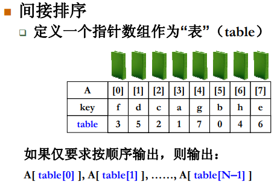 物理排序

在表排序完成以后，如果在某种情况下我们必须要对所有的元素做一个物理排序。也就是我最后非得把那些书物理上按照顺序排出来。我们有一种聪明的方法，可以在线性的时间复杂度里面完成。它利用到了一个很重要的原理，也就是**N个数字的排列由若干个独立的环组成**，这句话是什么意思？我们回到刚刚的例子。table排完以后对应的是这8个数字的一个排列，这个排列一定由若干个独立的环组成，什么叫环呢？我们从table[0]开始，然后我们就跳到table[3]，等于1，然后跳到table[1]=5，然后table[5]=0.我们发现由回到了原始点，这四个数字就组成了环。

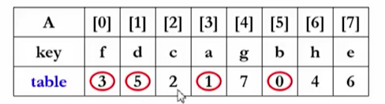

下一步我们就找到c，然后发现table[2]就等于2，于是这个环里面就只有一个元素2。

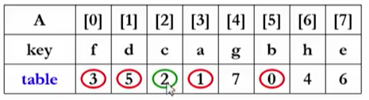

下一个没有被全的数字就是7，table[7]=6,table[6]=4.然后我们又回来了。这三个数字由组成了另外一个环。我


们发现三种不同颜色的环他们之间是没有交集的，这就是独立，也就是他们之间是互不相干的。我们很高兴有这么一个结论就是N个数字的排列由若干个独立的环组成。为什么说这是一个很好的消息呢？那就意味着我们在调整的时候我们就可以按照一个环一个环来调整书的位置。比如说对于这个红色的环，我们可以想象对于这四本书排成一个环状，然后他们之间要错一下位而已。错位的时候要怎么做呢？我首先把第一本书拿下来，存在一个临时的地方，就是我把A[0]和它的key f存在一个临时的位置，书架上这一块就空出来了，这个地方应该放3，也就意味着它应该放A3，A3对应的是a这本书，所以我们就把a放到A0这个位置同时也把这本书放过来。下一步就是A3的位置空出来了。我们应该放1，然后我们就把A1这个位置挪到A3，然后A1也空出来，A1要放5，也就把A5挪到A1。然后A5的位置要放A0，当我们看到A0的时候我们就意识到这个环已经结束了，把A0这本书从刚刚的临时位置放回A5.这样就完成了一个环的排序。在这个环里，现在书的顺序是对的了。

这里有一个技术问题，也就是我们如何判断一个环结束？if ( table[i] == i )，当tablei等于i的时候就说明这个环已经结束了。每访问一个空位i后，就令table[i]=i。当发现table[i]==i时，环就结束了。每当我们放到一本书的时候，就把这本书的tablei设置成i，比如说第一步我们把a放到A0位置，放完了以后我就把table0设置成0。当我从某一个地方回到0的时候，我发现table0等于0，那么就说明书已经放对位置了。于是我们就把书从临时位置中拿出放到正确的位置。

#### 复杂度分析

显然最好的情况是所有的书在一开始就已经是排好的了。移动书的最坏情况就是两本书直接做交换，两个元素直接调用swap的时候我们必须要走三步，把一本书放到一个临时的位置。然后另外一本书放过去，然后临时位置的书再放上去。对于每两本书我们都要做三步操作。但是如果元素多一点，后面移动就只要一步。所以元素越多越好，也就是说最坏情况是元素最少的情况，也就是每个环2个元素.（不是1，因为1不需要交换）。这样我们就需要3*N/2次元素移动。

T = O( m N ) ，m 是每个A元素的复制时间

## 基数排序

前面说了这么多个排序算法，他们有一个共同的特点就是他们仅仅是基于比较大小来决定元素位置的，那么有定理结论告诉我们，仅仅基于比较进行的排序所有的这些算法他的最坏时间复杂度，下界是NlogN，也就是说不管有多快，我们总能制造出一个最坏情况，让它用最快的算法跑，他也只能跑到NlogN。那么还有没有可能更快？当然可以！就是我们除了比较之外还干点别的事，这就是基数排序。

#### 桶排序

在介绍基数排序之前我们先看看桶排序。事实上基数排序是桶排序的一个升级。举一个例子---假设我们有 N 个学生，他们的成绩是0到100之间 的整数（于是有 M = 101 个不同的成绩值 个不同的成绩值）。如 何在线性时间内将学生按成绩排序？----

成绩只有101个不同的值，当我们的数据具有这种特点的时候我们是不是有一种更聪明的办法，在线性时间内就把学生的成绩排序。答案是可以！我们只有这么多个不同的成绩值，于是我们就为每一个成绩值构造一个桶。于是我就建了101个桶。换言之我就是在程序里面设了一个叫count的数组，这个数组的每一个元素是一个指针，它一开始被初始化为一个空链表的头指针，所以我们一开始有了101个空链表，也就对应了101个空的桶。当第i个学生进来的时候，比如说有一个学生他考了88分，我们就先找到88这个桶，然后把这个学生的信息插到这个链表的表头里。

下面是桶排的一个伪码描述，一开始我初始化这么多个桶。然后进入一个循环，把一个一个学生的成绩读进来，当我读到一个学生成绩的时候，根据他的成绩的值，我去找到count数组中相应的链表。然后把这个学生的信息插入到这个链表里去。最后我要输出的时候我就扫描每一个桶如果这个桶不是空的，那么我就输出整个count链表。走过这一趟之后我就把N个学生的信息按照他们的成绩从小到大，输出来了。那么我们可以看到这个算法它的时间复杂度是受两个因素的影响的，它受N的影响和M的影响。那么时间复杂度就是O（N+M）。当M相对N来说很小的时候，这其实就是一种线性的算法了。但是如果M比N要大很多怎么办？

```c
void Bucket_Sort(ElementType A[], int N) 
{ 
    count[]初始化;
    while (读入1个学生成绩grade)
    	将该生插入count[grade]链表;
    for ( i=0; i<M; i++ ) {
        if ( count[ ( count[i] )
        输出整个count[i]链表;
    } 
}
```

另一个例子--假设我们有 N = 10 个整数，每个整数的值在0到 999之间（于是有 M = 1000 个不同的值）。还有 可能在线性时间内排序吗？--

这个时候用桶排序需要1000个桶，十分不合算，需要用到我们的基数排序了。这个方法被叫做基数排序是根据我们实际上使用的基数，十进制基数就是10，充分利用这一点建桶。我们采取的策略是**次位优先**的排序。什么叫做次位优先？我们来看216，我们认为6也就是个位数是最次位，2也就是百位数是主位，有一种方法也叫主位优先的排序，我们现在考虑的是次位

优先的排序，也就是说我们排序的时候，先从比较个位数开始，首先我们先建立10个桶，根据基数是10，在第一趟排序的时候我们按照它的个位数把他们放到桶里去。第二趟的时候我们继续建立这样的桶，把他们放到桶里去，根据十位数，在这一趟排序以后我们再做一次收集，收集就是扫描每一个桶然后把这个桶里面的元素按照顺序访问十个链表（桶），然后按顺序把他们串起来。最后按照百位数来进行最后的排序，然后再最后一次收集，把每个桶的元素串在一个链表上输出。

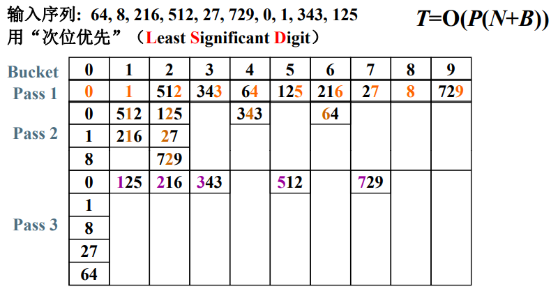

设元素个数为N，整数进制为B，LSD的趟数为P，则最坏时间复杂度是O（P*（N+B）），时间复杂度在什么情况下会比我们正常的好，什么情况下会比较糟糕呢？这取决你的基数有多大，取决于你到底有多少桶。如果桶的个数非常小的话那么整个算法差不多是一个线性复杂度的。

#### 多关键字的排序

基数排序还有很多别的应用，不仅仅是用于处理整数的基数，它还可以用于处理有多关键字的排序。

我们可以用主位优先的方法排，然后在桶的内部再进行排序。最后合并。这个方法还是需要我们在每个桶里面调用相应的排序算法，但是总体的时间复杂度会比完整把它看成一个数组来排来得快。但是显然这么做不是很聪明

一副扑克牌是按 2种关键字排序的

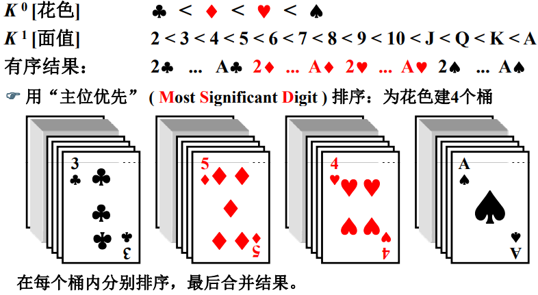

聪明的方法依然是次位优先的方法，还是为它的次关键字面值建立13个桶，然后把50多张牌分别往13个桶里丢，每个桶对应的是一种面值。下一步再把结果合并，再为四个花色建桶，再合并即可。在这里次位优先比主位优先好，但是是在任何情况下次位优先都比主位优先好吗？

#### 代码--基数排序 - 次位优先

```c
/* 假设元素最多有MaxDigit个关键字，基数全是同样的Radix */
##define MaxDigit 4
##define Radix 10

/* 桶元素结点 */
typedef struct Node *PtrToNode;
struct Node {
    int key;
    PtrToNode next;
};

/* 桶头结点 */
struct HeadNode {
    PtrToNode head, tail;
};
typedef struct HeadNode Bucket[Radix];
 
int GetDigit ( int X, int D )
{ /* 默认次位D=1, 主位D<=MaxDigit */
    int d, i;
    
    for (i=1; i<=D; i++) {
        d = X % Radix;
        X /= Radix;
    }
    return d;
}

void LSDRadixSort( ElementType A[], int N )
{ /* 基数排序 - 次位优先 */
     int D, Di, i;
     Bucket B;
     PtrToNode tmp, p, List = NULL; 
     
     for (i=0; i<Radix; i++) /* 初始化每个桶为空链表 */
         B[i].head = B[i].tail = NULL;
     for (i=0; i<N; i++) { /* 将原始序列逆序存入初始链表List */
         tmp = (PtrToNode)malloc(sizeof(struct Node));
         tmp->key = A[i];
         tmp->next = List;
         List = tmp;
     }
     /* 下面开始排序 */ 
     for (D=1; D<=MaxDigit; D++) { /* 对数据的每一位循环处理 */
         /* 下面是分配的过程 */
         p = List;
         while (p) {
             Di = GetDigit(p->key, D); /* 获得当前元素的当前位数字 */
             /* 从List中摘除 */
             tmp = p; p = p->next;
             /* 插入B[Di]号桶尾 */
             tmp->next = NULL;
             if (B[Di].head == NULL)
                 B[Di].head = B[Di].tail = tmp;
             else {
                 B[Di].tail->next = tmp;
                 B[Di].tail = tmp;
             }
         }
         /* 下面是收集的过程 */
         List = NULL; 
         for (Di=Radix-1; Di>=0; Di--) { /* 将每个桶的元素顺序收集入List */
             if (B[Di].head) { /* 如果桶不为空 */
                 /* 整桶插入List表头 */
                 B[Di].tail->next = List;
                 List = B[Di].head;
                 B[Di].head = B[Di].tail = NULL; /* 清空桶 */
             }
         }
     }
     /* 将List倒入A[]并释放空间 */
     for (i=0; i<N; i++) {
        tmp = List;
        List = List->next;
        A[i] = tmp->key;
        free(tmp);
     } 
}
```

#### 代码--基数排序 - 主位优先

```c
/* 假设元素最多有MaxDigit个关键字，基数全是同样的Radix */

##define MaxDigit 4
##define Radix 10

/* 桶元素结点 */
typedef struct Node *PtrToNode;
struct Node{
    int key;
    PtrToNode next;
};

/* 桶头结点 */
struct HeadNode {
    PtrToNode head, tail;
};
typedef struct HeadNode Bucket[Radix];
 
int GetDigit ( int X, int D )
{ /* 默认次位D=1, 主位D<=MaxDigit */
    int d, i;
    
    for (i=1; i<=D; i++) {
        d = X%Radix;
        X /= Radix;
    }
    return d;
}

void MSD( ElementType A[], int L, int R, int D )
{ /* 核心递归函数: 对A[L]...A[R]的第D位数进行排序 */
     int Di, i, j;
     Bucket B;
     PtrToNode tmp, p, List = NULL; 
     if (D==0) return; /* 递归终止条件 */
     
     for (i=0; i<Radix; i++) /* 初始化每个桶为空链表 */
         B[i].head = B[i].tail = NULL;
     for (i=L; i<=R; i++) { /* 将原始序列逆序存入初始链表List */
         tmp = (PtrToNode)malloc(sizeof(struct Node));
         tmp->key = A[i];
         tmp->next = List;
         List = tmp;
     }
     /* 下面是分配的过程 */
     p = List;
     while (p) {
         Di = GetDigit(p->key, D); /* 获得当前元素的当前位数字 */
         /* 从List中摘除 */
         tmp = p; p = p->next;
         /* 插入B[Di]号桶 */
         if (B[Di].head == NULL) B[Di].tail = tmp;
         tmp->next = B[Di].head;
         B[Di].head = tmp;
     }
     /* 下面是收集的过程 */
     i = j = L; /* i, j记录当前要处理的A[]的左右端下标 */
     for (Di=0; Di<Radix; Di++) { /* 对于每个桶 */
         if (B[Di].head) { /* 将非空的桶整桶倒入A[], 递归排序 */
             p = B[Di].head;
             while (p) {
                 tmp = p;
                 p = p->next;
                 A[j++] = tmp->key;
                 free(tmp);
             }
             /* 递归对该桶数据排序, 位数减1 */
             MSD(A, i, j-1, D-1);
             i = j; /* 为下一个桶对应的A[]左端 */
         } 
     } 
}

void MSDRadixSort( ElementType A[], int N )
{ /* 统一接口 */
    MSD(A, 0, N-1, MaxDigit); 
}
```


## 排序算法的比较

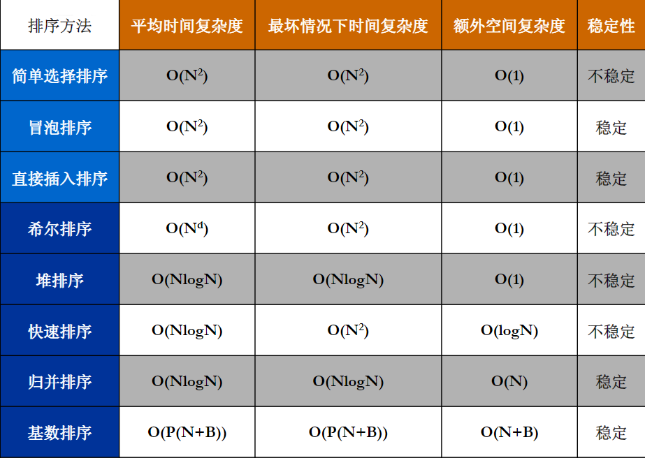

# 树

## 什么是树

- 客观世界中许多事物存在层次关系

  - 人类社会家谱

  - 社会组织结构

  - 图书信息管理

- 分层次组织在管理上具有更高的效率!

#### 查找

-  如何实现有效率的查找？

-  查找：根据某个给定关键字K ，从集合R中找出关键字与K相同的记录

静态查找:集合中记录是固定的-----没有插入和删除操作，只有查找
动态查找:集合中记录是动态变化的----除查找,还可能发生插入和删除

###### 静态查找

- 方法1：顺序查找

  建立哨兵可以免去边界条件的判断，提高效率

```c
int SequentialSearch (StaticTable *Tbl, ElementType K)
{ /*在表Tbl[1]~Tbl[n]中查找关键字为K的数据元素*/
     int i;
     Tbl->Element[0] = K; /*建立哨兵*/
     for(i = Tbl->Length; Tbl->Element[i]!= K; i--);
     return i; /*查找成功返回所在单元下标；不成功返回0*/
}
```

顺序查找算法的时间复杂度为O(n)

- 方法2：二分查找（Binary Search)

假设n个数据元素的关键字满足**有序**（比如：小到大） 并且是连续存放（数组），那么可以进行二分查找。

**例：假设有13个数据元素，按关键字由小到大顺序存放. 二分查找关健字为444的数据元素过程如下：**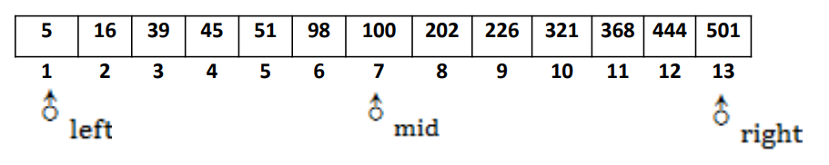

1. left = 1, right = 13; mid = (1+13)/2 = 7: 		**100 < 444;**
2. left = mid+1=8, right = 13; mid = (8+13)/2 = 10:     **321 < 444;**
3. left = mid+1=11, right = 13; mid = (11+13)/2 = 12:        **查找结束;**

例：仍然以上面13个数据元素构成的有序线性表为例 二分查找关健字为 43 的数据元素如下：

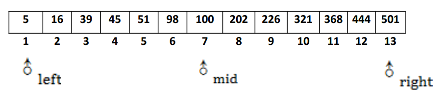

1. left = 1, right = 13; mid = (1+13)/2 = 7: 	        **100 > 43;** 
2. left = 1, right = mid-1= 6; mid = (1+6)/2 = 3:    **39 < 43;** 
3. left = mid+1=4, right = 6; mid = (4+6)/2 = 5:     **51 > 43;** 
4. left = 4, right = mid-1= 4; mid = (4+4)/2 = 4:     **45 > 43;** 
5. left = 4, right = mid-1= 3; left > right ?                **查找失败，结束**

```c
int BinarySearch ( StaticTable * Tbl, ElementType K)
{ /*在表Tbl中查找关键字为K的数据元素*/
     int left, right, mid, NoFound=-1;
     left = 1; /*初始左边界*/
     right = Tbl->Length; /*初始右边界*/
     while ( left <= right ){
         mid = (left+right)/2; /*计算中间元素坐标*/
         if( K < Tbl->Element[mid]) right = mid-1; /*调整右边界*/
         else if( K > Tbl->Element[mid]) left = mid+1; /*调整左边界*/
         else return mid; /*查找成功，返回数据元素的下标*/
     }
     return NotFound; /*查找不成功，返回-1*/
}
```

二分查找算法具有对数的时间复杂度O(logN)

###### 11个元素的二分查找判定树

- 判定树上每个结点需要的查找次数刚好为该结点所在的层数;  
- 查找成功时查找次数不会超过判定树的深度
- n个结点的判定树的深度为[log2n]+1.
- ASL = (4*4+4*3+2*2+1)/11 = 3


#### 树的定义

树（Tree）: n（n≥0）个结点构成的有限集合。

- 当n=0时，称为空树；
- 对于任一棵非空树（n> 0），它具备以下性质：
  - 树中有一个称为“根（Root）”的特殊结点，用 r 表示；
  - 其余结点可分为m(m>0)个互不相交的有限集T1，T2，... ，Tm，其 中每个集合本身又是一棵树，称为原来树的“子树（SubTree）”

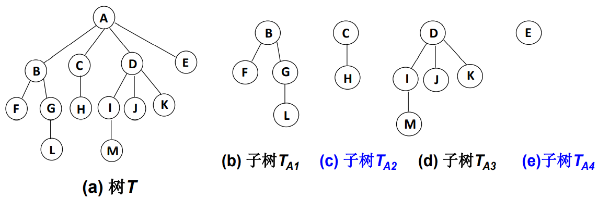

注意：

1. 子树是不相交的； 
2. 除了根结点外，每个结点有且仅有一个父结点； 
3. 一棵N个结点的树有N-1条边。

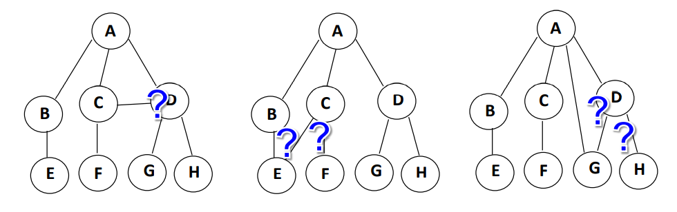

#### 树的一些基本术语

1. 结点的度（Degree）：结点的子树个数 
2. 树的度：树的所有结点中最大的度数 
3. 叶结点（Leaf）：度为0的结点 
4. 父结点（Parent）：有子树的结点是其子树的根结点的父结点 
5. 子结点（Child）：若A结点是B结点的父结点，则称B结点是A结点的子结点；子结点也称孩子结点。 
6. 兄弟结点（Sibling）：具有同一父结点的各 结点彼此是兄弟结点。
7. 路径和路径长度：从结点n1到nk的路径为一个结点序列n1 , n2 ,… , nk , ni是 ni+1的父结点。
8. 路径所包含**边的个数**为路径的长度。 
9. 祖先结点(Ancestor)：沿树根到某一结点路径上的所有结点都是这个结点的祖先结点
10. 子孙结点(Descendant)：某一结点的子树中的所有结点是这个结点的子孙。 
11. 结点的层次（Level）：**规定根结点在1层**，其它任一结点的层数是其父结点的层数加1。
12. 树的深度（Depth）：树中所有结点中的**最大层次**是这棵树的深度
13. 树的高度：等于根节点的高度
14. 结点的高度：**该节点到叶子结点**的最长路径长度
15. 结点的深度：**根节点到这个结点**的路径长度


##  二叉树及存储结构

#### 二叉树的定义

二叉树T：一个有穷的结点集合。

- 这个集合可以为空 
- 若不为空，则它是由根结点和称为其左子树TL和右子树TR的 两个不相交的二叉树组成。


二叉树具体五种基本形态

- 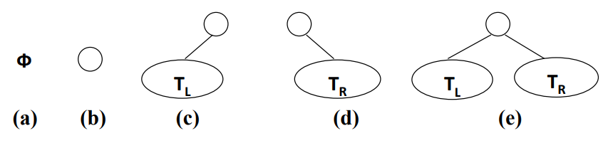

二叉树的子树有左右顺序之分

- 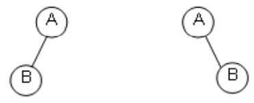

###### 特殊二叉树

1. 斜二叉树(Skewed Binary Tree)

2. 完美二叉树(Perfect Binary Tree)  满二叉树(Full Binary Tree） ：设最高层为k，则节点的总数为2的k次方-1

3. 完全二叉树 (Complete Binary Tree) ：有n个结点的二叉树，对树中结点按 从上至下、从左到右顺序进行编号， 编号为i（1 ≤ i ≤ n）结点与满二叉树 中编号为 i 结点在二叉树中位置相同


###### 二叉树几个重要性质

1. 一个二叉树第i层的最大结点数为:2^(i-1)，i>1。
2. 深度为k的二叉树有最大结点总数为:2^k-1，k>1。
3. 对任何非空二叉树T，若n0表示叶结点的个数、n2是度为2的非叶结点个数，那么两者满足关系n0=n2+1。

###### 二叉树的抽象数据类型定义

```c
类型名称：二叉树
数据对象集：一个有穷的结点集合。
若不为空，则由根结点和其左、右二叉子树组成。
操作集： BT∈ BinTree, Item ∈ ElementType，重要操作有：
1、Boolean IsEmpty( BinTree BT )： 判别BT是否为空；
2、void Traversal( BinTree BT )：遍历，按某顺序访问每个结点；
3、BinTree CreatBinTree( )：创建一个二叉树。
```

常用的遍历方法有：

```c
void PreOrderTraversal( BinTree BT )：先序----根、左子树、右子树；
void InOrderTraversal( BinTree BT )： 中序---左子树、根、右子树；
void PostOrderTraversal( BinTree BT )：后序---左子树、右子树、根
void LevelOrderTraversal( BinTree BT )：层次遍历，从上到下、从左到右
```

#### 二叉树的存储结构

###### 顺序存储结构

完全二叉树：按从上至下、从左到右顺序存储

 n个结点的完全二叉树的结点父子关系：

- 非根结点（序号 i > 1）的父结点的序号是 i / 2; 
- 结点（序号为 i ）的左孩子结点的序号是 2i， （若2 i <= n，否则没有左孩子）; 
- 结点（序号为 i ）的右孩子结点的序号是 2i+1， （若2 i +1<= n，否则没有右孩子）;

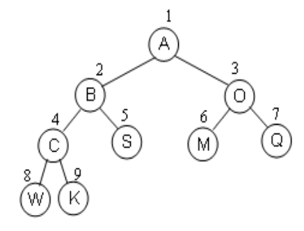

一般二叉树也可以采用这种结构，但会造成空间浪费

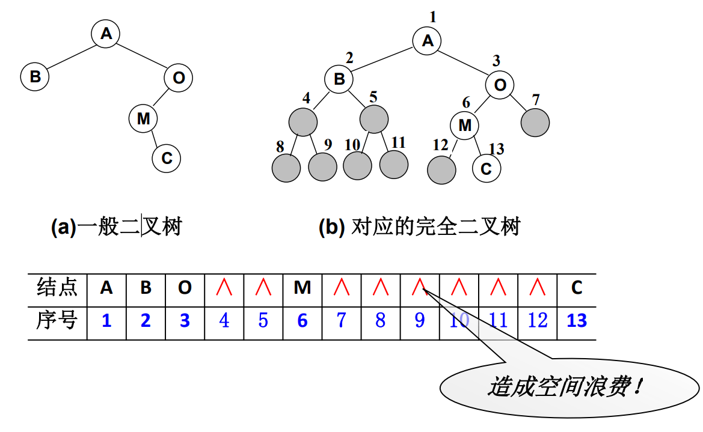

#### 链表存储

```c
typedef struct TreeNode * BinTree;
typedef BinTree Position;
struct TreeNode{
    ElementType Data;
    BinTree Left;
    BinTree Right;
}
```

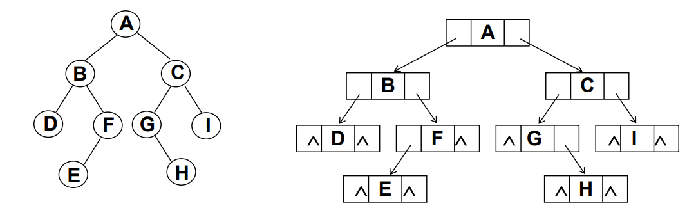


## 二叉树的遍历

#### 先序遍历

遍历过程为： ① 访问根结点； ② 先序遍历其左子树； ③ 先序遍历其右子树。

```c
void PreOrderTraversal( BinTree BT )
{
     if( BT ) {
         printf(“%d”, BT->Data);
         PreOrderTraversal( BT->Left );
         PreOrderTraversal( BT->Right );
     }
}
```

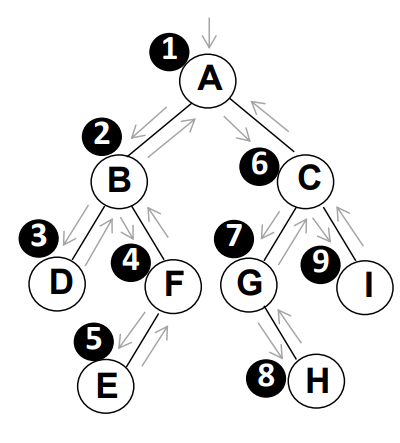


#### 中序遍历

遍历过程为： ① 中序遍历其左子树； ② 访问根结点； ③ 中序遍历其右子树。

```c
void InOrderTraversal( BinTree BT )
{
     if( BT ) {
         InOrderTraversal( BT->Left );
         printf(“%d”, BT->Data);
         InOrderTraversal( BT->Right );
     }
}
```

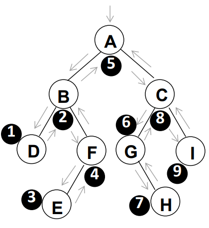

#### 后序遍历

遍历过程为： ① 后序遍历其左子树； ② 后序遍历其右子树； ③ 访问根结点。

```c
void PostOrderTraversal( BinTree BT )
{
     if( BT ) {
         PostOrderTraversal( BT->Left );
         PostOrderTraversal( BT->Right);
         printf(“%d”, BT->Data);
     }
}
```

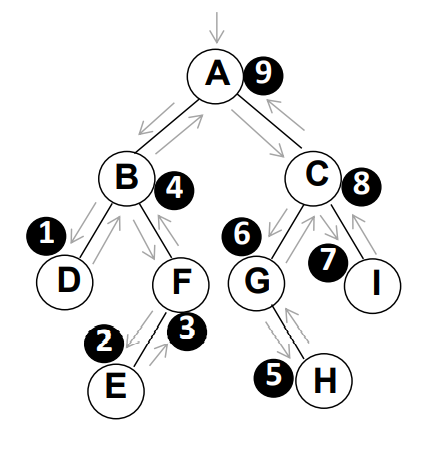

- 先序、中序和后序遍历过程：遍历过程中经过结点的**路线一 样**，只是访问各结点的**时机不同**。 
- 图中在从入口到出口的曲线上用打叉、五角星 和三角形三种符号分别标 记出了先序、中序和后序访问各结点的时刻

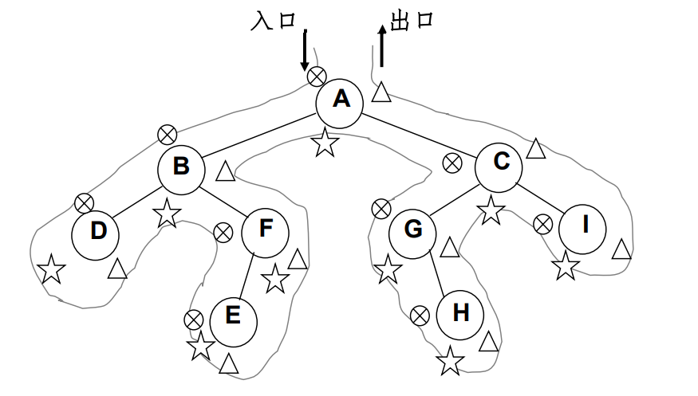

#### 二叉树的非递归遍历

中序遍历非递归遍历算法 

非递归算法实现的基本思路：使用堆栈

- 前面三种方法都是利用递归来实现的，但是递归的根本实现还是堆栈，所以这里想直接用堆栈来实现


###### 中序遍历非递归遍历算法

- 遇到一个结点，就把它压栈，并去遍历它的左子树；
- 当左子树遍历结束后，从栈顶弹出这个结点并访问它；
- 然后按其右指针再去中序遍历该结点的右子树

这边我们要把一个节点入栈的时候首先得考虑一下它是不是空的，也就有了while（T）中T的判断。我们要pop出一个结点的时候，首先要考虑栈中是否还有元素，这边我们这么写if纯粹是为了保险，因为有时候我们没有办法判断出到底需不需要这个逻辑判断，但是实际上这里我们可以不需要这个判断，因为如果T为空并且栈也为空是不可能进入最外层循环的，也就不可能有机会让我们pop，也就不需要检查是否为空。如果T不为空，那么尽管在最外层的while判断栈是空的，经过push之后栈也就不为空了。所以这里的if语句判断是不必要的，但是在编程的过程中需要养成良好的习惯，还是可以写这么一个if语句的。

```c
void InOrderTraversal( BinTree BT )
{ 	BinTree T=BT;
    Stack S = CreatStack( MaxSize ); /*创建并初始化堆栈S*/
    while( T || !IsEmpty(S) ){//树为空，栈也为空代表已经遍历完毕
         while(T){ /*一直向左并将沿途结点压入堆栈*/
             Push(S,T);
             T = T->Left;
         }
         if(!IsEmpty(S)){
             T = Pop(S); /*结点弹出堆栈*/
             printf(“%5d”, T->Data); /*（访问）打印结点*/
             T = T->Right; /*转向右子树*/
         }
    }
}
```

###### 先序遍历的非递归遍历算法

```c
void InOrderTraversal( BinTree BT )
{ 	BinTree T=BT;
    Stack S = CreatStack( MaxSize ); /*创建并初始化堆栈S*/
    while( T || !IsEmpty(S) ){
         while(T){ /*一直向左并将沿途结点压入堆栈*/
             printf(“%5d”, T->Data); /*（访问）打印结点*/
             Push(S,T);
             T = T->Left;
         }
        if(!IsEmpty(S)){
             T = Pop(S); /*结点弹出堆栈*/
             T = T->Right; /*转向右子树*/
         }
    }
}
```

###### 后序遍历非递归遍历算法

这里需要在结点定义中添加一个标记，标记右子树是否已经被访问。注意到，出栈就是意味着打印。while(BT)结束以后意味着左子树是空了，如果要打印就意味着右子树为空或者右子树已经被访问过了。也就是说如果右子树不为空并且没有被访问过那么就访问右子树。打印完由于左子树其实已经访问过了，不需要再进去while(BT)循环，所以令BT=NULL

```c
void PostOrderTraversalByStack2(BinTree BT) {//直接利用栈完成后序遍历 
	int top=-1;
	BinTree p;
	BinTree* stack=(BinTree*)malloc(20*sizeof(BinTree));
	while(top+1||BT){
		while(BT){			
			stack[++top]=BT;
			BT=BT->left;
		}	
		p=stack[top];//看一眼
		if(p->right&&p->r!=1){
			BT=p->right;
			p->r=1;//访问过标记为1 
		} else{
			top--;//正式出栈
			printf("%d\t",p->data);
			BT=NULL;//跳过while,左斜列都已经入栈 
		}
	}		
}
```

```c
void PostOrderTraversalByStack(BinTree BT) {//直接利用栈完成后序遍历 
	//左右根转化成根右左，到入栈中倒序输出出来 
	int top1=-1;
	int top2=-1;
	BinTree p;
	BinTree* stack1=(BinTree*)malloc(20*sizeof(BinTree));
	BinTree* stack2=(BinTree*)malloc(20*sizeof(BinTree));
	while(top1+1||BT){
		while(BT){
			stack2[++top2]=BT;
			stack1[++top1]=BT;
			BT=BT->right;
		}
//		if(top1+1){
			p=stack1[top1--];
			BT=p->left;
//		}	
	}
	//循环完成之后将stack2中的元素依次弹出输出即可
	while(top2+1){
		printf("%d\t",stack2[top2--]->data);
	}	
}
```

#### 代码--树的基本实现

```c
##include <stdio.h>
##include <stdli
b.h>
##include <string.h>
typedef int DataType;//定义数据类型为整形 
typedef struct TreeNode{//经典树的数据结构 
	DataType data;
	int r;//为了实现后序遍历非递归算法所设置的标记位 
	TreeNode* left;
	TreeNode* right;
}TreeNode,*BinTree;

void PreOrderTraversal(BinTree BT){//递归完成先序遍历 
	if(BT){
		printf("%d\t",BT->data);
		PreOrderTraversal(BT->left);
		PreOrderTraversal(BT->right);
	}
}

void InOrderTraversal(BinTree BT){//递归完成中序遍历 
	if(BT){
		InOrderTraversal(BT->left);
		printf("%d\t",BT->data);
		InOrderTraversal(BT->right);
	}
}

void PostOrderTraversal(BinTree BT){//递归完成后序遍历 
	if(BT){
		PostOrderTraversal(BT->left);
		PostOrderTraversal(BT->right);
		printf("%d\t",BT->data);
	}
}

void PreOrderTraversalByStack(BinTree BT) {// 直接利用栈完成先序遍历
	int top=-1;
	BinTree p;
	BinTree* stack=(BinTree*)malloc(20*sizeof(BinTree));
	while(top+1||BT){
		while(BT){
			printf("%d\t",BT->data);			
			stack[++top]=BT;
			BT=BT->left;
		}
//		if(top+1){
			p=stack[top--];
			BT=p->right;
//		}	
	}	
}

void InOrderTraversalByStack(BinTree BT) {//直接利用栈完成中序遍历 
	int top=-1;
	BinTree p;
	BinTree* stack=(BinTree*)malloc(20*sizeof(BinTree));
	while(top+1||BT){
		while(BT){
			stack[++top]=BT;
			BT=BT->left;
		}
//		if(top+1){
			p=stack[top--];
			printf("%d\t",p->data);
			BT=p->right;
//		}	
	}	
}

void PostOrderTraversalByStack(BinTree BT) {//直接利用栈完成后序遍历 
	//左右根转化成根右左，到入栈中倒序输出出来 
	int top1=-1;
	int top2=-1;
	BinTree p;
	BinTree* stack1=(BinTree*)malloc(20*sizeof(BinTree));
	BinTree* stack2=(BinTree*)malloc(20*sizeof(BinTree));
	while(top1+1||BT){
		while(BT){
			stack2[++top2]=BT;//用入栈代替打印，入栈后出栈的顺序就是正确的打印顺序
			stack1[++top1]=BT;
			BT=BT->right;
		}
//		if(top1+1){
			p=stack1[top1--];
			BT=p->left;
//		}	
	}
	//循环完成之后将stack2中的元素依次弹出输出即可
	while(top2+1){
		printf("%d\t",stack2[top2--]->data);
	}	
}

void PostOrderTraversalByStack2(BinTree BT) {//直接利用栈完成后序遍历 
	int top=-1;
	BinTree p;
	BinTree* stack=(BinTree*)malloc(20*sizeof(BinTree));
	while(top+1||BT){
		while(BT){			
			stack[++top]=BT;
			BT=BT->left;
		}	
		p=stack[top];//看一眼
		if(p->right&&p->r!=1){
			BT=p->right;
			p->r=1;//访问过标记为1 
		} else{
			top--;//正式出栈
			printf("%d\t",p->data);
			BT=NULL;//跳过while,左斜列都已经入栈 
		}
		
	}		
}


void copy(BinTree T,BinTree &nt){//复制树 
	if(!T){
        nt=NULL;
    }
    else{
        nt=(TreeNode*)malloc(sizeof(TreeNode));
        nt->data=T->data;
        copy(T->left,nt->left);
        copy(T->right,nt->right);
    }
}

int NodeCount(BinTree T){
	if(!T)return 0;
	else return NodeCount(T->left)+NodeCount(T->right)+1;
}

int LeafCount(BinTree T){
	if(!T) return 0;
	if(!T->left&&!T->right){//左右结点都为空,说明是叶子结点 
		return 1;
	}
	return LeafCount(T->left)+LeafCount(T->right);//负责把各个叶子结点return的1收集起来 
} 

int main(){
	BinTree p1;	
	BinTree p2;	
	int arr[100];
	int i=0;	
	for(i=0;i<100;i++){
		arr[i]=0;
	}
	for(i=0;i<12;i++){
		arr[i]=i+1;
	}
	CreatTree(p1,arr);//创建完全二叉树
	copy(p1,p2);
	printf("leaf结点总数为：%d\n",LeafCount(p1));
	//中序 
	InOrderTraversalByStack(p1);
	printf("\n");
	InOrderTraversal(p2);
	printf("\n");
	//先序 
	PreOrderTraversalByStack(p1);
	printf("\n");
	PreOrderTraversal(p1);
	printf("\n");
	//后序
	PostOrderTraversalByStack(p1);
	printf("\n");
	PostOrderTraversal(p1);
	printf("\n");
	PostOrderTraversalByStack2(p1);
	printf("\n");
	
}
```


#### 线索化二叉树

为什么要有线索二叉树？当用二叉链表作为二叉树的存储结构时，可以很方便地找到某个结点的左右孩子;但一般情况下，无法直接找到该结点在某种遍历序列中的前驱和后继结点。

提出问题：如何寻找特定遍历序列中二叉树结点的前驱和后继？

解决的方法：

1. 通过遍历寻找------费时
2. 再增设前驱、后继指针域——增加了存储负担。
3. **利用二插链表中的空指针域**

在n个节点二叉链表中有2n-（n-1）个空指针域。

利用二叉链表中的空指针域:

- 如果某个结点的左孩子为空，则将空的左孩子指针域改为指向其前驱;如果某结点的右孩子为空，则将空的右孩子指针域改为指向其后继

- 这种改变指向的指针称为“线索”

加上了线索的二叉树我们就叫做线索二叉树（Threaded Binary Tree）

对二叉树按某种遍历次序使其变为线索二叉树的过程叫线索化

为区分Irchid和rchild指针到底是指向孩子的指针，还是指向前驱或者后继的指针，对二叉链表中每个结点增设两个标志域ltag和rtag，并约定:

- ltag = 0  lchild 指向该结点的左孩子
- ltag = 1 Ichild指向该结点的前驱
- rtag = 0 rchild 指向该结点的右孩子
- rtag = 1 rchild 指向该结点的后继

这样节点的结构为：在原本经典的树的结构上新增加两个标志域：ltag、rtag

```c
typedef struct BiThrNode{
    int data;
    int Itag, rtag;
    struct BiThrNode *lchild,rchild;
}BiThrNode，*BiThrTree ;
```

为了避免线索化二叉树的悬空态

增设了一K头结点:
ltag=0, Ichild指向根结点，
rtag=1, rchild指向遍历序列中最后一个结点
遍历序列中第一个结点的lc域和最后一个结点的rc域都指向头结点

###### 代码实现

```c
##include <stdio.h>
##include <stdlib.h>
typedef int DataType;
typedef int Tag;
typedef struct BiThrNode{
	DataType data;
	BiThrNode *left;
	BiThrNode *right;
	Tag ltag,rtag;
}BiThrNode,*BiThrTree;
BiThrTree pre;


void InOrderTraversal(BiThrTree BT){//递归完成中序遍历 
	if(BT){
		InOrderTraversal(BT->left);
		printf("%d\t",BT->data);
		InOrderTraversal(BT->right);
	}
}

void InOrderTraverse_Thr(BiThrTree T){
	BiThrTree p=T->left;//从根节点开始遍历，根节点存在头结点的左边
	while(p!=T){//如果p==T，说明已经遍历结束或者线索树为空树（即除了头结点以外没有其它结点,回指） 
		while(!p->ltag) p=p->left;//p->ltag为0说明左子树不为空（原本），如果为1说明原本左子树是空的已经线索化
		printf("%d\t",p->data);
		while(p->rtag==1&&p->right!=T){
			p=p->right;
			printf("%d\t",p->data);
		}
		p=p->right;//出了第二个while循环代表此时原本的p结点的右子树不为空了，变而访问它的右子树
	} 	
}

void InThreading(BiThrTree p){
	if(p){//如果树不为空 
		InThreading(p->left);//线索化左子树 
		//前后两个 InThreading相当于在中序遍历每一个结点，在中间进行线索化就是中序线索化 
		if(!p->left){//说明p可以设立前驱，前驱的信息在pre 
			p->ltag=1;
			p->left=pre;
		}
		if(!pre->right){// 说明pre可以设立后继，后继信息就是p 
			pre->rtag=1;
			pre->right=p;
		}
		pre=p;
		
		InThreading(p->right);//线索化右子树 
	}
}

int InOrderThreading(BiThrTree &Thrt,BiThrTree T){
	if(!(Thrt=(BiThrTree)malloc(sizeof(BiThrNode)))) exit(0);
	Thrt->ltag=0;//左标记为非线索化
	Thrt->rtag=1; //右标记为线索
	Thrt->right=Thrt; //右指针回指，右指针留在最后处理，否则在一开始的线索化右指针就直接指向了第一个元素
	if(!T) Thrt->left=Thrt;//如果T为空树则左指针回指
	else{
		Thrt->left=T;//左指针指向根节点
		pre=Thrt;//将前驱信息保存在Thrt,此时Thrt右指针回指，不会在递归过程指向新的后继，第一个结点刚好指向Thrt
		InThreading(T);//讲树T线索化
		//Thrt需要在最后处理此时的pre是最后一个节点，需要让它的右指针指向Thrt，Thrt的右指针指向pre
		pre->right=Thrt;
		pre->rtag=1;
		Thrt->right=pre;
	}
	return 1;
}

void CreatTree(BiThrTree &BT,int* arr){//传入一个数组创建一个完全二叉树 
	int i=0;
	while(arr[i]){//这边传入的arr数组一定要初始化过，没有元素的地方值为0 
		i++;
	}
	int len=i;
	BiThrTree* list=(BiThrTree*)malloc(len*sizeof(BiThrTree)+1);//创建一个元素为树（结点指针）的数组 
		
		for(i=1;i<=len;i++){//将树装入数组 
		list[i]=(BiThrTree)malloc(sizeof(BiThrNode));//为指针分配空间 
		list[i]->data=arr[i-1];
		list[i]->left=NULL;list[i]->right=NULL;
		list[i]->ltag=0;list[i]->rtag=0;
		
	}
	for(i=1;i<=len/2-1;i++){//倒数第二层的最后一个元素单独处理，因为它可能没有右结点 
		list[i]->left=list[i*2];
		list[i]->right=list[i*2+1];
	}
	list[len/2]->left=list[i*2];
	if(len%2==1){//奇数个结点个数就有右结点 
		list[len/2]->right=list[i*2+1];
	}
	BT=list[1];//返回根节点 
}
	
int main(){
	BiThrTree p1;	
	BiThrTree p2;	
	int arr[100];
	int i=0;	
	for(i=0;i<100;i++){
		arr[i]=0;
	}
	for(i=0;i<12;i++){
		arr[i]=i+1;
	}
	CreatTree(p1,arr);//创建完全二叉树
	InOrderTraversal(p1);	
	printf("\n");
	if(!InOrderThreading(p2,p1))return 0;
	InOrderTraverse_Thr(p2); 
}
```

#### 树和森林


#### 层序遍历

二叉树遍历的核心问题：二维结构的线性化

二叉树是一个二维结构，而遍历就是要产生一个一维的序列。所以遍历的本质就是要把一个二维的结构变成一个一位的线性序列的过程。

- 从结点访问其左、右儿子结点 

- 访问左儿子后，右儿子结点怎么办？ 

  - 需要一个存储结构保存暂时不访问的结点---例如保存父节点 
    - 存储结构：堆栈、队列----堆栈保存自己--队列保存右儿子

- 队列实现：遍历从根结点开始，首先将根结点入队，然后开始执 行循环：结点出队、访问该结点、其左右儿子入队

  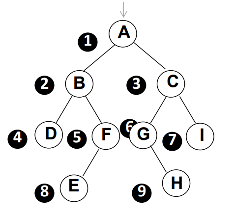

层序基本过程：先根结点入队，然后:

1. 从队列中取出一个元素；
2. 访问该元素所指结点；
3. 若该元素所指结点的左、右孩子结点非空， 则将其左、右孩子的指针顺序入队。

```c
void LevelOrderTraversal ( BinTree BT )
{ 	Queue Q; BinTree T;
    if ( !BT ) return; /* 若是空树则直接返回 */
    Q = CreatQueue( MaxSize ); /*创建并初始化队列Q*/
    AddQ( Q, BT );
    while ( !IsEmptyQ( Q ) ) {
        T = DeleteQ( Q );
        printf(“%d\n”, T->Data); /*访问取出队列的结点*/
        if ( T->Left ) AddQ( Q, T->Left );
        if ( T->Right ) AddQ( Q, T->Right );
    }
}

```

#### 输出二叉树中的叶子结点。

- 在二叉树的遍历算法中增加检测结点的“左右子树是否都为空”
- 其实就是遍历二叉树的应用

```c
void PreOrderPrintLeaves( BinTree BT )
{
     if( BT ) {//发现这只是在先序遍历的基础上增加了打印的条件。删掉if语句其就是一个先序遍历
         if ( !BT-Left && !BT->Right )
         	printf(“%d”, BT->Data );
         PreOrderPrintLeaves ( BT->Left );
         PreOrderPrintLeaves ( BT->Right );
 	}
}
```

#### 例--创建完全二叉树

- 完全二叉树的父节点和孩子节点的下标有对应关系（从1开始，这也是为什么创建了一个len+1大小的数组），我们可以利用这种对应关系直接钩链。
- 特殊结点特殊处理，因为如果是满二叉树的话结点总数就是2^n-1，是奇数个，所以如果最终len是奇数个的话，说明最后一层是偶数个，也就是倒数第二层每个结点都有左右孩子。如果len是偶数，那么说明最后一层只有奇数个，那么倒数第二层有孩子的最后一个节点只有左孩子。那么根据这个我们可以把倒数第二层的最后一个有孩子的结点放在最后，先把其它结点先钩链，出来再把倒数第二层的最后一个有孩子的结点连上左孩子，因为两种情况都有左孩子。最后判断len的奇偶性看看是否有右孩子。

```c
void CreatTree(BinTree &BT,int* arr){//传入一个数组创建一个完全二叉树 
	int i=0;
	while(arr[i]){//这边传入的arr数组一定要初始化过，没有元素的地方值为0 
		i++;
	}
	int len=i;
	BinTree* list=(BinTree*)malloc(len*sizeof(BinTree)+1);//创建一个元素为树（结点指针）的数组 
		
	for(i=1;i<=len;i++){//将树装入数组 
		list[i]=(BinTree)malloc(sizeof(TreeNode));//为指针分配空间 
		list[i]->data=arr[i-1];
		list[i]->left=NULL;
		list[i]->right=NULL;
	}
	for(i=1;i<=len/2-1;i++){//倒数第二层的最后一个元素单独处理，因为它可能没有右结点 
		list[i]->left=list[i*2];
		list[i]->right=list[i*2+1];
	}
	list[len/2]->left=list[i*2];
	if(len%2==1)//奇数个结点个数就有右结点 
		list[len/2]->right=list[i*2+1];
	BT=list[1];//返回根节点 
}
```


#### 例--求二叉树的高度

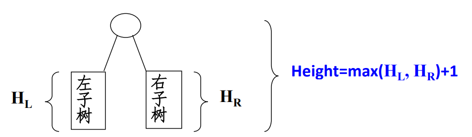

```c
int PostOrderGetHeight( BinTree BT )
{ 	int HL, HR, MaxH;
     if( BT ) {
         HL = PostOrderGetHeight(BT->Left); /*求左子树的深度*/
         HR = PostOrderGetHeight(BT->Right); /*求右子树的深度*/
         MaxH = （HL > HR）? HL : HR; /*取左右子树较大的深度*/
         return ( MaxH + 1 ); /*返回树的深度*/
     }
     else return 0; /* 空树深度为0 */
}
```

#### 例---二元运算表达式树及其遍历

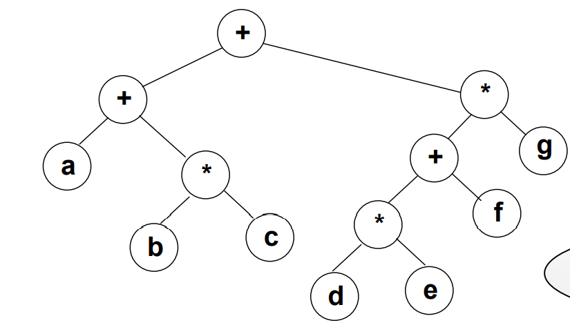

三种遍历可以得到三种不同的访问结果：

- 先序遍历得到前缀表达式：+ + a * b c * + * d e f g 
- 中序遍历得到中缀表达式：a + b * c + d * e + f * g ---------------不准
- 后序遍历得到后缀表达式：a b c * + d e * f + g * +

中缀表达式会受到运算符优先级的影响，解决：输出左子树的时候输出左括号，输出右子树的时候输出右括号

#### 例--由两种遍历序列确定二叉树

- 必须要有中序遍历才能确定二叉树--即不能够由前序和后序的遍历序列来确定一颗二叉树--因为左右根；根左右无法确定左右的边界
- 没有中序的困扰： 
  - 先序遍历序列：A B 
  - 后序遍历序列：B A

先序和中序遍历序列来确定一棵二叉树

分析：

- 根据先序遍历序列第一个结点确定根结点；
- 根据根结点在中序遍历序列中分割出左右两个子序列
- 对左子树和右子树分别递归使用相同的方法继续分解。

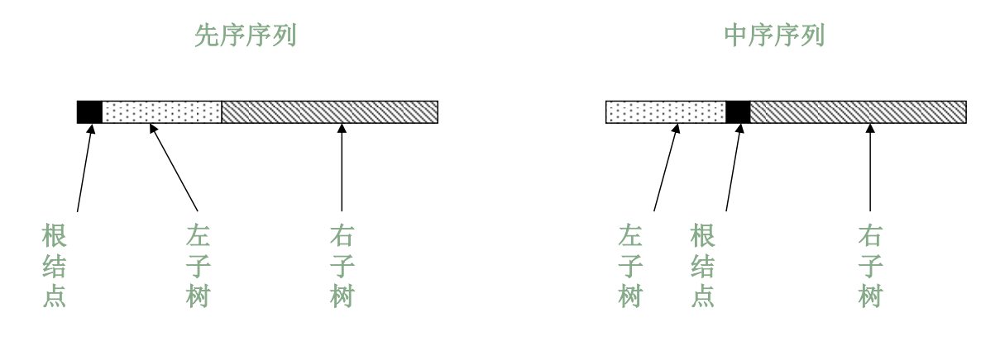


例：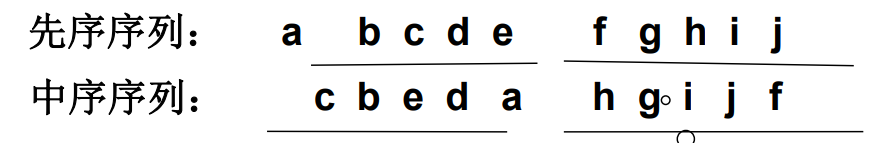

下面是由先序和中序确定二叉树

```c
BTNode *CreateBT1(char *pre,char *in,int n)
{
    //pre存放先序序列，in存放中序序列，n为二叉树的结点个数
    //算法执行后返回构造二叉链的根结点
    if(n<1)return NULL;
    BTNode* p=(BTNode*)malloc(sizeof(BTNode));
    p->lchild=NULL;p->rchild=NULL;
    p->data=pre[0];
    int i=0;
    for(i=0;i<n;i++){
        if(pre[0]==in[i])break;
    }
    if(i){//有左子树
        p->lchild=CreateBT1(pre+1,in,i);
    }
    if(i^(n-1)){//有右子树
        p->rchild=CreateBT1(pre+1+i,in+i+1,n-i-1);
    }
    return p;
}
```

下面是由后序和中序确定二叉树

```c
BTNode *CreateBT2(char *post,char *in,int n)
{
    //post存放后序序列，in存放中序序列，n为二叉树的结点个数
    //算法执行后返回构造二叉链的根结点
    if(n<1)return NULL;
    BTNode* p=(BTNode*)malloc(sizeof(BTNode));
    p->lchild=NULL;p->rchild=NULL;p->data=post[n-1];
    int i=0;
    for(i=0;i<n;i++){
        if(post[n-1]==in[i])break;
    }
    if(i){//有左子树
        p->lchild=CreateBT2(post,in,i);
    }
    if(i^(n-1)){//有右子树
        p->rchild=CreateBT2(post+i,in+i+1,n-i-1);
    }
    return p;
}
```

#### 例--复制二叉树

```c
void copy(BinTree T,BinTree &nt){//复制树 
	if(!T){
        nt=NULL;
    }
    else{
        nt=(TreeNode*)malloc(sizeof(TreeNode));
        nt->data=T->data;
        copy(T->left,nt->left);
        copy(T->right,nt->right);
    }
}
```

#### 例--叶子结点个数

```c
int LeafCount(BinTree T){
	if(!T) return 0;
	if(!T->left&&!T->right){//左右结点都为空,说明是叶子结点 
		return 1;
	}
	return LeafCount(T->left)+LeafCount(T->right);//负责把各个叶子结点return的1收集起来 
} 
```


## 树的同构

**给定两棵树T1和T2。如果T1可以通过若干次左右孩子互换 就变成T2，则我们称两棵树是“同构”的。 现给定两棵树，请你判断它们是否是同构的。**

这里的同构条件放宽，不一定要求左边和左边一样，右边和右边一样，左右一样也可以认为是同构的。也就是可以通过左右孩子（子树）的交换，变成是两颗一样的树。

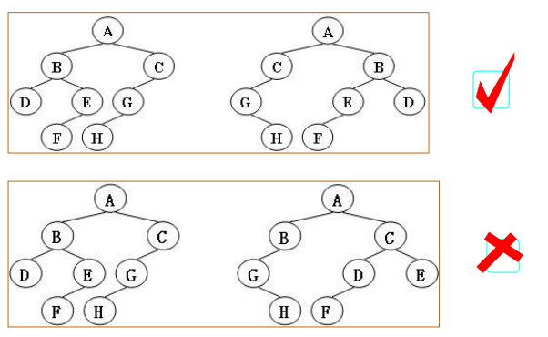

给出了结点的这些信息，我们**怎么把树画出来**呢？这里很关键的一点就是要**找出根节点在哪里**。

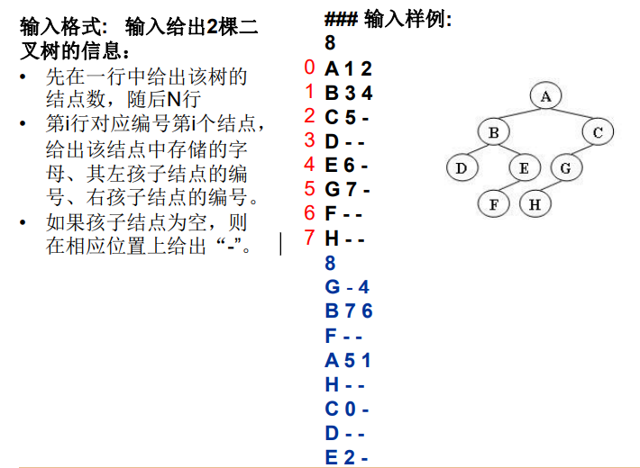

要解这道题要解决三个问题：二叉树的表示；建立二叉树；同构的判别

#### 如何表示题目的二叉树？

二叉树的表示最常见的是用链表，但是也不一定完全用链表，也可以用数组来表示。这道题里面会考虑用用数组来表示二叉树。

现在考虑第一个问题，我们最常见的二叉树的表示方法就是链式结构的一种表示方法。除了链表表示二叉树之外实际上也可以用数组来表示。用数组来表示二叉树最典型的一种形式就是把二叉树看成是一颗完全二叉树，按照完全二叉树的组织形式来表示一个二叉树，缺少的结点在数组中空出来。但是我们这边不采用这种一般的表示方法，我们准备采用一种结构数组的表示方法。就是我们基本的存储使用数组，把我们所需要的几点信息存储在数组中，但是左右儿子用类似链表的这种方法来表示，有数据来指示左右孩子在哪里，物理上的存储是数组，但是它的思想是一种链表的思想，所以这种链表我们把它称为**静态链表**。

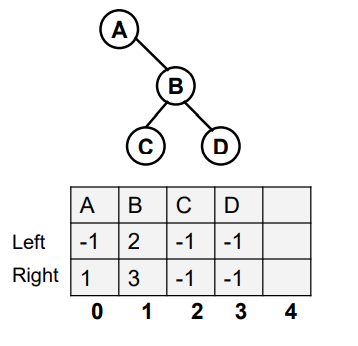

如何表示上面的二叉树：数组里的每个分量是个结构体，也就代表了每一列，每一列就是数组的一个分量，一个结构体包含了三个信息-结点本身的信息、结点的左孩子位置的下标、结点的右孩子位置的下标（没有就标为-1）。根据这种结构数组的表示方法，我们可以定义相应的数据结构

```c
##define MaxTree 10
##define ElementType char
##define Tree int
##define Null -1
struct TreeNode{
    ElementType Element;
    Tree Left;
    Tree Right;
} T1[MaxTree], T2[MaxTree];

```

要注意的是这边的左儿子和右儿子其实不是指针，当它指向的左儿子和右儿子空缺的时候，我们不用NULL（0）。为了区分传统空指针的那个NULL，我们定义了Null为-1。

ABCD在数组中的排序无所谓，可以随便换。那么如何找出根的位置呢？其实有一个事实，任意一个除根节点以外的结点，它都是别的结点的孩子，只有根节点不是别的结点的孩子。而是不是某个节点的孩子取决于它的下标有没有出现在left和right上。所以我们只要排除出现在left和right上过的下标，自然就可以找出根节点所在的下标了。

#### 程序框架的搭建

```c
int main()
{
 建二叉树1
 建二叉树2
 判别是否同构并输出
 return 0;
}
```

```c
int main()
{
 Tree R1, R2;
 
 R1 = BuildTree(T1);
 R2 = BuildTree(T2);
 if (Isomorphic(R1, R2)) printf("Yes\n");
 else printf("No\n");
 
 return 0;
}
```

需要设计的函数：  读数据建二叉树---BuildTree  二叉树同构判别---Isomorphic

###### 如何建立二叉树

因为一开始输入的是结点的个数，所以函数的一开始有一个scanf用来输入个数，接下来判定它是不是等于0，如果不是等于0，才进入下一步。接下来进入一个for循环，有几组数据就循环几次，一次读入Element、left、right。为了方便全部都读入字符，后面再把字符转换成整形。这样就把二叉树这n个节点的信息都读好了。但是这里函数有一个返回值：根节点。如何确定呢？---可以把这个结构数组从头到尾扫描一遍，看看有没有存在哪个结点不存在其它结点指向它。如果没人指向它，它就是根节点了。所以策略就是把T[i]这个数组遍历一遍。我们创一个和T数组一样大小的check数组，将每个元素的指向的非空节点的位置标为1。最后会只剩下一个下标保存0.这个下标就是根节点的下标。

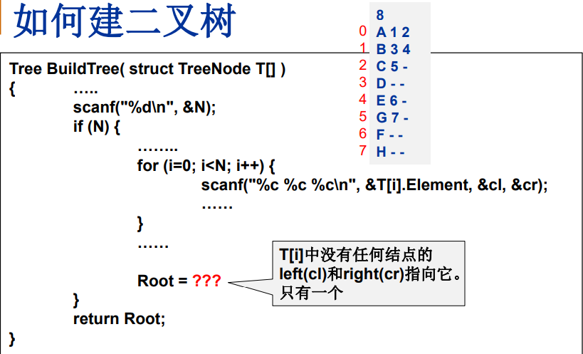


```c
Tree BuildTree( struct TreeNode T[] )
{ …..
    scanf("%d\n", &N);
    if (N) {
        for (i=0; i<N; i++) check[i] = 0;
        for (i=0; i<N; i++) {
            scanf("%c %c %c\n", &T[i].Element, &cl, &cr);
            if (cl != '-') {
                T[i].Left = cl-'0';
                check[T[i].Left] = 1;
            }
            else T[i].Left = Null;
            …….. /*对cr的对应处理 */
        }
        for (i=0; i<N; i++)
         if (!check[i]) break;
        Root = i;
    }
    return Root;
}

```

###### 如何判断两颗二叉树同构

这个函数一进来首先要对一些基本情况做个判别，如果两颗树都是空的，也就是R1R2都是-1，两颗空树我们认为是同构的。一个空一个不空那么肯定不同构。另一种情况根结点的值不一样，那么肯定不是同构的。

根节点判定完了，现在开始判断子树。一种是两棵树的左子树都是空的，那就看右边同构不同构（递归调用）。如果左边同时不空，那么就看看左边的Element一样不一样。

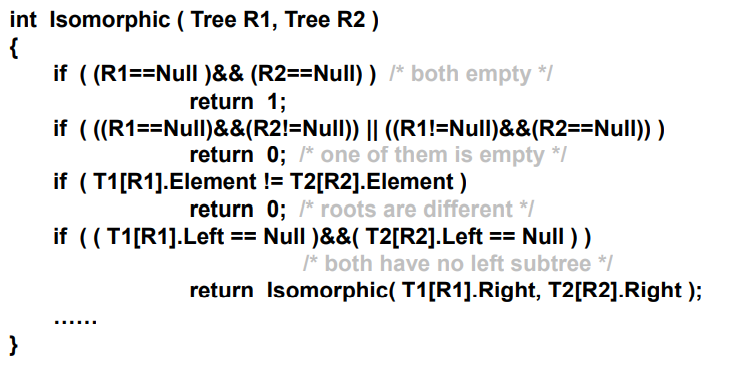


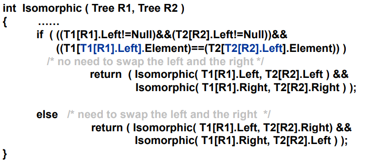


## 二叉搜索树

查找问题有两类：

- 静态查找和动态查找
- 针对动态查找，数据如何组织？

静态查找，集合的元素是不动的，也就是说在一个集合上主要做的是find操作，而没有insert和delete操作。另外一种查找就是我们要查找的对象的集合，本身会动态的发生变化，也就是经常要发生插入删除操作。静态查找问题有一个很好的方法就是二分查找，二分查找把一般的顺序查找的时间复杂度从n降到了logn，二分查找有这样好的效果实际上是因为我们事先把要查找的数据进行了有效的组织，把它有序化，这样给定的n个数我们查找的顺序可以形成一个叫判定树的结构，所以把一个线性的查找过程变成是在一个类似于树的一个查找过程，而它的查找效率就是树的高度。从这里面我们得到一个启示：有没有可能直接把元素就放到树上，不要放在数组里面。放在一个树上有一个好处---树的动态性比较强。要插入删除比在线性里面要方便。这就是我们讲的叫做二叉搜索树。我们怎么组织一个树或者说怎么把元素放在这个树上，从前面我们的判定树里面，得到一个启示：我们有没有可能把数据按照这种方式来组织--也就是树上的任何一个结点，它的值比左子树所有结点的值都要大， 比右子树的所有结点的值都要小。这样我们的查找过程就变成对当前结点的一个判断---是大于小于还是等于，等于就找到了，如果比当前的根节点的值要小，那么就到左边去找，必过比它大就到右边去找。这个每次也一样的把搜索范围一下子缩小一大部分。这就是我们所说的二叉查找树。

二叉搜索树（BST, Binary Search Tree）,也称二叉排序树或二叉查找树

二叉搜索树:一棵二叉树，可以为空;如果不为空，满足以下性质:

1. 非空左子树的所有键值小于其根结点的键值。
2. 非空右子树的所有键值大于其根结点的键值。
3. 左、右子树都是二叉搜索树。

- 二插搜索树操作的特别函数

  Position Find( ElementType X, BinTree BST):从二叉搜索树BST中查找元素X，返回其所在结点的地址;
  Position FindMin( BinTree BST):从二叉搜索树BST中查找并返回最小元素所在结点的地址;
  Position FindMax( BinTree BST ):从二叉搜索树BST中查找并返回最大元素所在结点的地址。

  BinTree Insert( ElementType x, BinTree BST)
  BinTree Delete( ElementType X, BinTree BST)

#### 二插搜索树的查找操作：find

1. 查找从根结点开始，如果树为空，返回NULL
2. 若搜索树非空，则根结点关键字和X进行比较，并进行不同处理:
   1. 若X小于根结点键值，只需在左子树中继续搜索;
   2. 如果X大于根结点的键值，在右子树中进行继续搜索;
   3. 若两者比较结果是相等，搜索完成，返回指向此结点的指针。

```c
Position Find( ElementType X, BinTree BST )
{
    if( !BST ) return NULL; /*查找失败*/
    if( X > B,ST->Data )
    	return Find( X, BST->Right ); /*在右子树中继续查找*/
    Else if( X < BST->Data )
    	return Find( X, BST->Left ); /*在左子树中继续查找*/
    else /* X == BST->Data */
    	return BST; /*查找成功，返回结点的找到结点的地址*/
}

```

上面的实现是递归实现，效率不高，而且是两次递归都是尾递归，也就是在程序在程序分支的最后即要返回（return）的时候才出现的递归从遍历的角度来讲，**尾递归都可以用循环来实现**。下面看看如何用循环来实现刚才这个查找过程。

- 由于非递归函数的执行效率高，可将“尾递归函数改为”迭代函数。

```c
Position IterFind( ElementType X, BinTree BST )
{
     while( BST ) {
         if( X > BST->Data )
         BST = BST->Right; /*向右子树中移动，继续查找*/
         else if( X < BST->Data )
         BST = BST->Left; /*向左子树中移动，继续查找*/
         else /* X == BST->Data */
         return BST; /*查找成功，返回结点的找到结点的地址*/
     }
     return NULL; /*查找失败*/
}

```

可以看出查找的效率是和树的高度有关的，因为我们可能一直找找到叶节点为止。而对于同样的n个结点来说，树的高度跟树的结构是很有关系的。如果树的结构不好，都只有左儿子没有右儿子全部串在一起。形成一条链，往左边倾斜，它的高度是n-1。同样的极端情况还有往右倾斜的树。所以总的来讲我们希望，这个树看起来比较平衡，不往一边倒，所以这就是我们后面要提到的，一个重要的议题----平衡二叉树。接下来来讲讲其它的的两个查找。最大查找和最小查找。

根据查找树的一个特点，最小元素一定在最左边，最大元素一定在最右边。也就是说从根节点一直往左边走到底就是最小值，往右边走到底就是最大值。

```c
Position FindMin( BinTree BST )
{
     if( !BST ) return NULL; /*空的二叉搜索树，返回NULL*/
     else if( !BST->Left )
     return BST; /*找到最左叶结点并返回*/
     else
     return FindMin( BST->Left ); /*沿左分支继续查找*/
}

```

```c
Position FindMax( BinTree BST )
{
     if(BST )
     while( BST->Right ) BST = BST->Right;
     /*沿右分支继续查找，直到最右叶结点*/
     return BST;
} 
```

#### 二插搜索树的插入

【分析】关键是要找到元素应该插入的位置，可以采用与Find类似的方法。要保证我们插完了之后我们这棵树还是二叉搜索树。也就是左子树的节点要比根节点的小。右子树的节点要比根节点大。基本的过程和find一样，但是因为要插入，所以我们要记住前面一个结点。我们有一种方法可以处理这种事情---利用递归把下一次的结果返还给上一次，直接把上一层的左子树或者右子树进行修改即可。

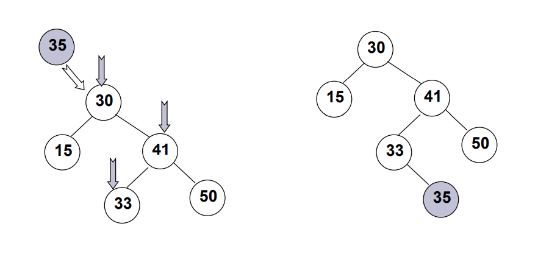


```c
BinTree Insert( ElementType X, BinTree BST )
{
 if( !BST ){
 	/*若原树为空，生成并返回一个结点的二叉搜索树*/
     BST = malloc(sizeof(struct TreeNode));
     BST->Data = X;
     BST->Left = BST->Right = NULL;
 }else /*开始找要插入元素的位置*/
 if( X < BST->Data )
 	BST->Left = Insert( X, BST->Left);
 	/*递归插入左子树*/
 else if( X > BST->Data )
 	BST->Right = Insert( X, BST->Right);
	 /*递归插入右子树*/
 /* else X已经存在，什么都不做 */
 return BST;
}

```

可以发现我们最后要插入的元素一定在原树上形成一个新的叶子结点。所以我们利用第一个if语句就可以创建这个节点，然后返回给调用者。从叶子结点一层层返回。

###### 【例】以一年十二个月的英文缩写为键值，按从一月到十二月顺序输 入，即输入序列为（Jan, Feb, Mar, Apr, May, Jun, July, Aug, Sep,  Oct, Nov, Dec）

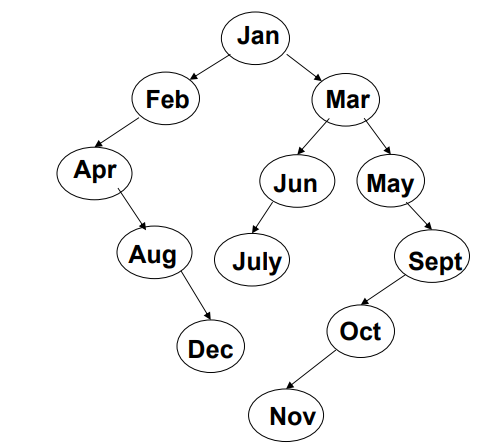

#### 二插搜索树的删除

同样的，我们要找到这个结点的位置。

考虑三种情况:

要删除的是叶结点:直接删除，并再修改其父结点指针---置为NULL

要删除的结点只有一个孩子结点:将其父结点的指针指向要删除结点的孩子结点

要删除的结点有左、右两棵子树：用另一结点替代被删除结点:右子树的最小元素或者左子树的最大元素

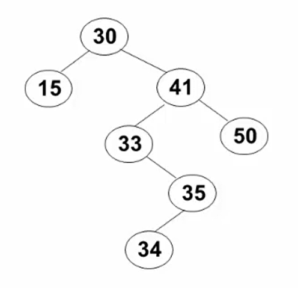


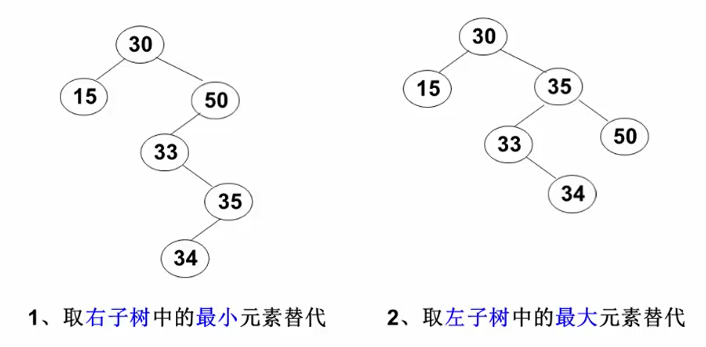

41左右两边都不空，若用右子树的最小值来替代。或者是左子树中找一个最大的，用35来替代41，也就是把删除41等价于删除35，然后把41的值换成了35。这样的替代方式有什么好呢？好处就是左子树的最大值、右子树的最小值一定不是有两个儿子的节点（因为一旦有两个儿子就说明它既不是最大也不是最小了），左子树的最大值一定在最子树的最右边，右子树的最小值一定在右子树的最左边，所以我们把删除的过程变成左右两边找最小或者是找最大的情况，使得我们要删除一个节点有两个儿子就变成前面一种情况了，要么没儿子要么只有一个儿子。删除左右子树的最大值或者最小值之后把原本要删除的结点替代成你已经删除的那个结点的值就行。

```c
BinTree Delete( ElementType X, BinTree BST ) 
{ Position Tmp; 
 if( !BST ) printf("要删除的元素未找到"); 
 else if( X < BST->Data ) 
 BST->Left = Delete( X, BST->Left); /* 左子树递归删除 */
 else if( X > BST->Data ) 
 BST->Right = Delete( X, BST->Right); /* 右子树递归删除 */
 else /*找到要删除的结点 */ 
 if( BST->Left && BST->Right ) { /*被删除结点有左右两个子结点 */ 
 Tmp = FindMin( BST->Right ); 
 /*在右子树中找最小的元素填充删除结点*/
 BST->Data = Tmp->Data; 
 BST->Right = Delete( BST->Data, BST->Right);
 /*在删除结点的右子树中删除最小元素*/
 } else { /*被删除结点有一个或无子结点*/
 Tmp = BST; 
 if( !BST->Left ) /* 有右孩子或无子结点*/
 BST = BST->Right; 
 else if( !BST->Right ) /*有左孩子或无子结点*/
 BST = BST->Left;
 free( Tmp );
 }
 return BST;
}
```

递归的值返回调用层树的左指针或者是右指针，也就是把递归删除后的左子树或者右子树的根节点的地址给上一层的节点的指针域。这边和插入的算法思想很像---这里从整棵树中删除这个结点，变成了从子树中删除这个结点。子树删除完了之后，它的根节点可能会发生变化（可能不动也可能变化），道理和insert一样。

## 平衡二叉树

###### 〖例〗搜索树结点不同插入次序，将导致不同的深度和平均查找长度ASL

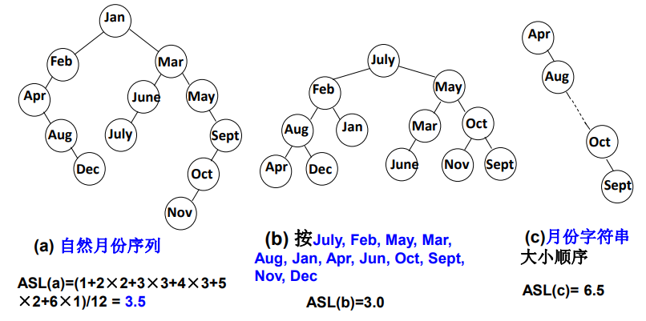

 对于搜索树来说，它的结点不同的插入顺序会导致树的样子不一样，树的深度也会不一样，最终会导致它的查找效率会不一样。所谓查找效率，我们有一个衡量指标叫做平均查找长度，也就是我们要找这些月份平均要查找几次。通过计算发现这三课树的平均查找长度都不一样。这样就产生了一个问题：树的结构应该怎么设计可以使得查找效率高。观察到第二个图的平均查找长度是最短的。所以这样的一种树结构是比较好的。这样的树结构有什么特点？它总体上给人的感觉是比较平衡的，左右两边比较均匀。一颗树是否均匀一种描述方法就是两边的结点数目一样--这个要求比较高，很难达到。所以我们把要求放宽一点，能够平衡但是又不要求完全一样，就是说左右两边应该怎么样子我们才认为是平衡的。我们可以有两种指标来衡量：1. 左右两边的节点数差不多；2. 左右两边的高度差不多。

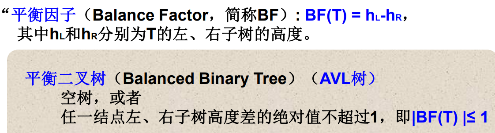

平衡因子是针对结点来说的，每个结点都可以有左右子树（当然也可能为空）

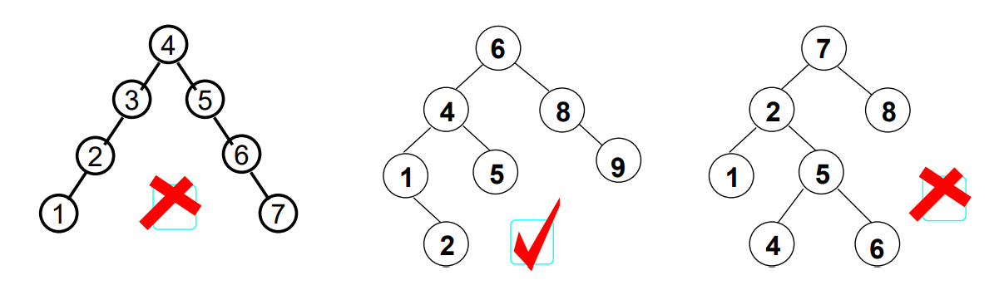

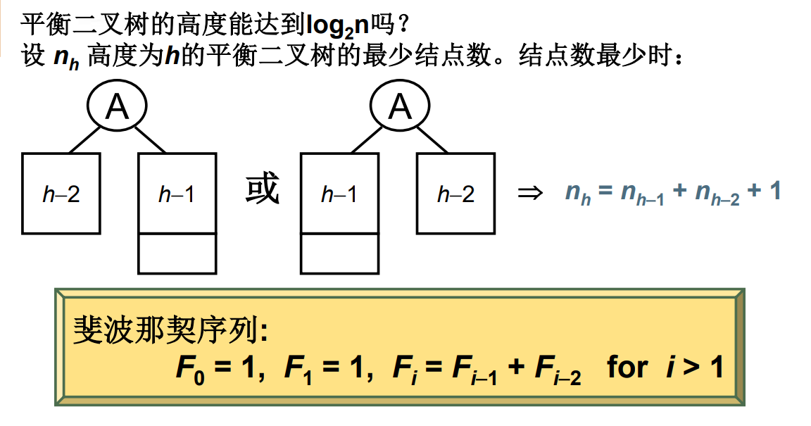


#### 平衡二叉树的调整

平衡二叉树也是一个查找树，是一个特殊的搜索树。这里会遇到一个问题，当我插入的时候会把一颗原本平衡的树一插变得不平衡了。下面我么需要对平衡二叉树进行调整，且保证调整完成之后它依然是一颗查找树

###### RR旋转

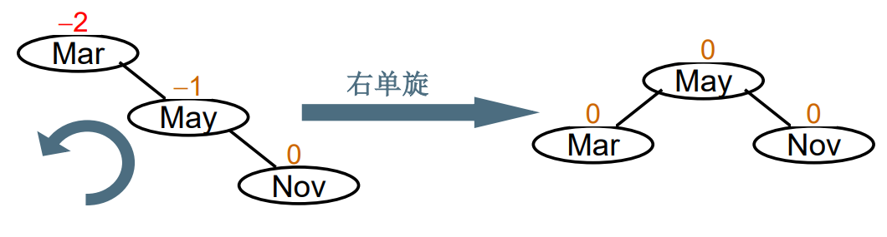

不平衡的“发现者”是Mar， “麻烦结点”Nov 在发现者右子树的右边， 因而叫 RR 插入，需要RR 旋转（右单旋）

 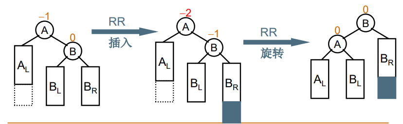

把B+BR提上来，A作为B的左子树，BL连接到A的右子树。

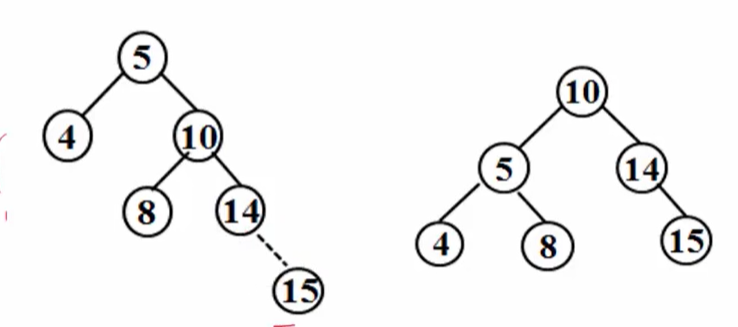

###### LL旋转

同理也有LL旋转

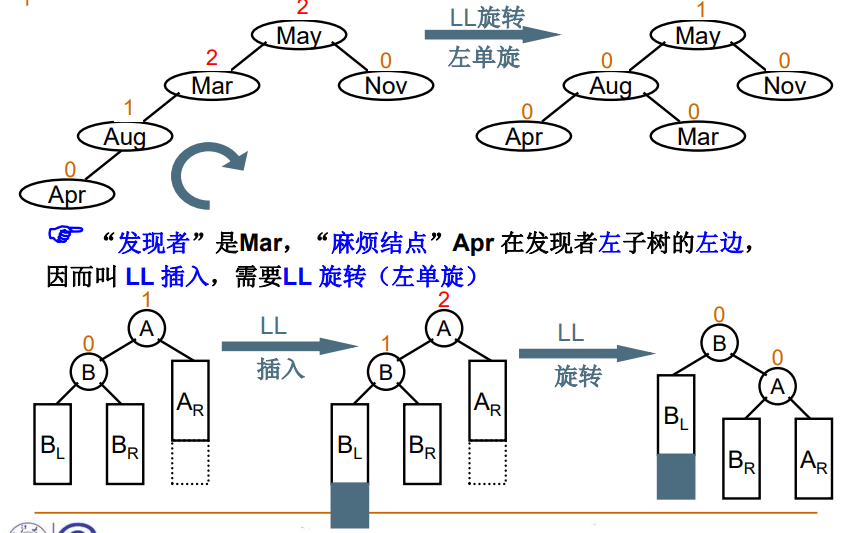

###### LR旋转

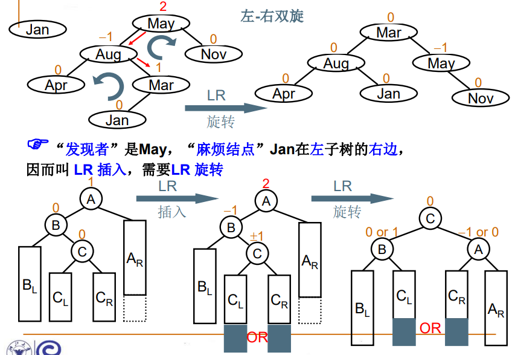

LR旋转的基本方法是：把ABC中的中间值作为根节点，BA分别作为左右节点，B和A左右的相对位置不变，把剩下的四块按照原来的相对次序搬过来。

###### RL旋转

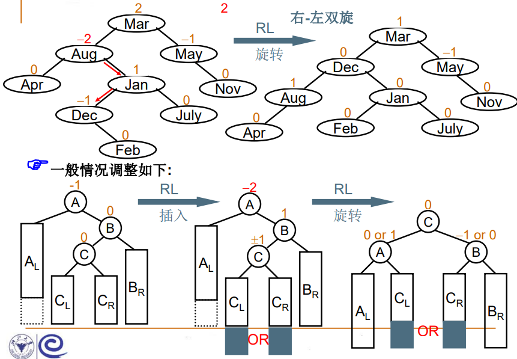

RL旋转也类似，直接把C当做根节点，AB的相对位置不变。其它四块的相对位置也不变

四种情况如何鉴别？就看插入的节点把谁破坏了，它和被破坏的结点是什么关系。破坏了不止一个就认定最近的那个。

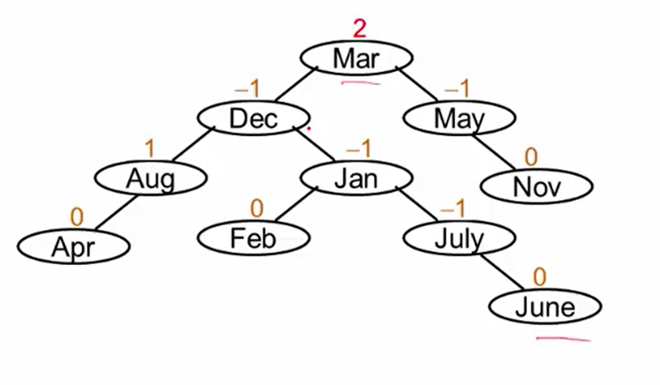破坏了Mar，它在Mar左子树的右边，所以是LR旋转。


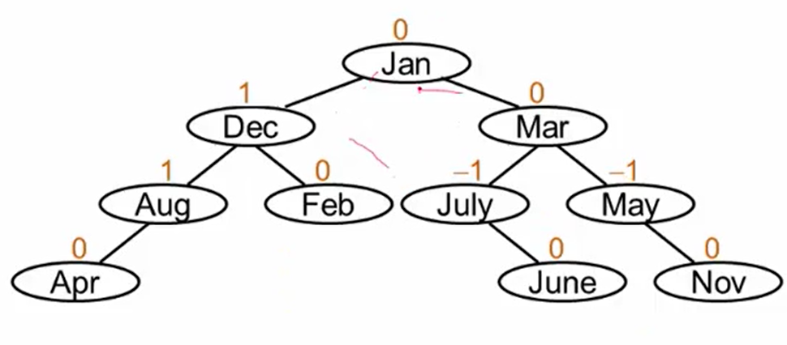

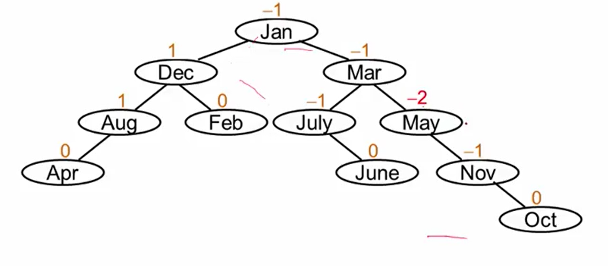

发现插入的Oct破坏了May所以我们要做RR旋转。

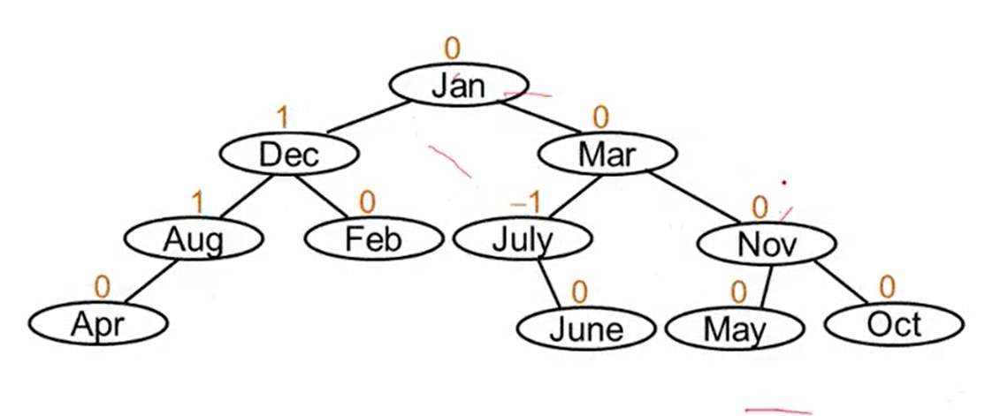

 注意插入之后即使平衡不需要调整，但结点的平衡因子是要变的。

## 是否为同一颗二叉搜索树

给定一个插入序列就可以唯一确定一棵二叉搜索树。然而， 一棵给定的二叉搜索树却可以由多种不同的插入序列得到。

- 例如，按照序列{2, 1, 3}和{2, 3, 1}插入初始为空的二叉搜索树， 都得到一样的结果。

问题：对于输入的各种插入序列，你需要判断它们是否能 生成一样的二叉搜索树。

把一个序列插入到一个二叉搜索树中，过程是按照顺序把逐个的元素插入到二叉搜索树中。每当插入一个数的时候就比较它和树根的大小，如果比树根小就插到左子树上，如果比它大就插到右子树上。所以如果给定一个插入的序列。那么它就唯一确定了一颗二叉搜索树。反过来如果给定一个二叉搜索树，它可以由不同的插入序列来得到。

这里我们看到，样例中的4表示结点的个数，2表示后面还有几组数据要和第一组数据进行比较--3412与3241

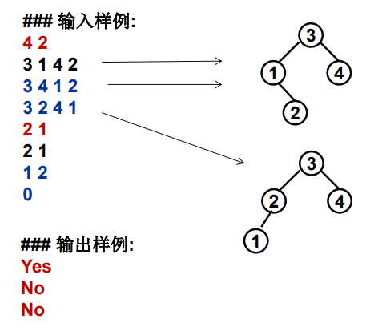

#### 解题思路

第一种，分别建立两颗搜索树的判别方法：根据两个序列分别建树，再判别树是否一样

第二种，不建树的判别方法：

我们根据第一个3，分别把两串序列分堆，一堆比3大一堆比3小。这样问题就变成比较子树。

第三种，**建一棵树，再判断其它序列是否与该树一致。**这样我们就有几个关键问题：一个是搜索树如何表示，一个是如何根据一个序列来创建这棵树，以及如何判别一个序列是不是和搜索树一致。

###### 搜索树如何表示

我们可以采用最传统最经典的表示方法，用链表的形式来表示我们的搜索树，但是这里我们多了一个域falg，用来判别一个序列是不是和树是一致的。如果某个节点没有被访问过，flag设为0.被访问过flag就设为1.falg作为有没有被访问过的一个标记。

```c
typedef struct TreeNode *Tree;
struct TreeNode {
    int v;
    Tree Left, Right;
    int flag;
};

```

###### 程序框架的搭建

程序框架大致是对应这样的，第一件事情要把N和L读进来，N代表序列元素的个数，也就是搜索树结点的个数，L代表有多少和序列需要比较。接下来根据第一行的序列建立树T，再让后面需要比较的序列和来T作比较来知道是不是一致的。

需要设计的主要函数：  读数据建搜索树T  判别一序列是否与T构成一样的搜索树

```c
int main()
{ 对每组数据
 读入N和L
 根据第一行序列建树T
 依据树T分别判别后面的
L个序列是否能与T形成
同一搜索树并输出结果
 return 0;
}
```

具体的语句如下，首先读入一个N。接下来判断这个N是不是0。如果N不是0那么就开始读入L。接下来要根据第一行的序列来建树，我们利用一个函数MakeTree创建完成。接下来就要和下面的L个序列进行比较。利用函数Judge，判断是否一致，一致就打印yes，不一致就打印no，ifelse语句执行完毕以后，由于Judge函数中利用到了flag，使用完之后需要清除flag，使用ResetT。for循环退出来之后说明这一组数据已经处理完毕了，要处理下一组数据了，这时候要把树的空间释放。

```c
int main()
{ 
    int N, L, i;
    Tree T;
    scanf("%d", &N);
    while (N) {
        scanf("%d", &L);
        T = MakeTree(N);
        for (i=0; i<L; i++) {
            if (Judge(T, N))printf("Yes\n");
            else printf("No\n");
            ResetT(T); /*清除T中的标记flag*/
        }
        FreeTree(T);
        scanf("%d", &N);
    }

    return 0;
}
```

###### 如何创建搜索树

第一个函数是建立搜索树，我们从空的搜索树开始，有N个元素组成的序列，我们一个个读进来，插入到树中，所以我们使用了一个insert函数把当前读入的结点插入到树里面。首先我们读入一个数到V中，利用V创建一个树T利用了函数NewNode，后面我们利用一个for循环，读入后面的n-1个数，把他们一个个插到T里面。

```c
Tree MakeTree( int N )
{ 
    Tree T;
    int i, V;
    scanf("%d", &V);
    T = NewNode(V);
    for (i=1; i<N; i++) {
        scanf("%d", &V);
        T = Insert(T, V);
    }
    return T;
}

```

怎么把一个数插入到T里面去呢？首先判断T空不空，T如果是空的就意味着，在空的搜索树上插入第一个结点，直接调用NewNode来产生这样的节点即可。不如不为空，通过递归实现。

```c
Tree Insert( Tree T, int V )
{
     if ( !T ) T = NewNode(V);
     else { 
         if ( V>T->v )
         T->Right = Insert( T->Right, V );
         else
         T->Left = Insert( T->Left, V );
     }
     return T;
}

```

```c
Tree NewNode( int V )
{ Tree T = (Tree)malloc(sizeof(struct TreeNode));
 T->v = V;
 T->Left = T->Right = NULL;
 T->flag = 0;
 return T;
}

```

###### 如何判断

接下来到了最关键的一步：如何判断是否一致。

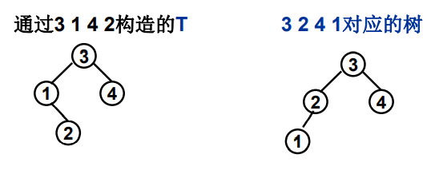

如何判别序列3 2 4 1是否 与树T一致？ 

**方法：在树T中按顺序搜索序列3 2 4 1中的每个数**

- **如果每次搜索所经过的结点在前面均出现过，则一致**
- **否则（某次搜索中遇到前面未出现的结点），则不一致**

找2的时候经过了312,1在前面没出现过，所以我们可以断定不一致

所以我们的判别方法很简单，就是T中搜索序列中的每一个整数。本质上就是一个查找过程。在查找的过程中我们观察看有没有哪些结点是我们之前没有碰到过的。上来先判断根节点有没有查找过，如果查找过就往左边找或者右边找，如果是第三种情况就是这个数出现了两次，此时我们认为是不一致的。如果flag标记为0，也就是没有查找过，如果当前节点的值如果恰好是要查找的值V，那么就直接把flag改为1，否则就是出现了未出现过的结点，返回0.

```c
int check ( Tree T, int V )
{
    if ( T->flag ) {
        if ( V<T->v ) return check(T->Left, V);
        else if ( V>T->v ) return check(T->Right, V);
        else return 0;
    }
    else {
        if ( V==T->v ) {
        T->flag = 1;
        return 1;
    	}
        else return 0;
    }
}

```

有了check函数之后，我们就可以判断每一个整数是不是一致的。

下面是有bug的版本，原因是在过程中读到不一致的时候程序直接退出了，还有后面的数据没有读入，后面的数据会进入到下一轮的judge中，会导致序列出现错误。**当发现序列中的某个数 与T不一致时，必须把 序列后面的数都读完**

```c
int Judge( Tree T, int N ) /* 有bug版本 */
{
    int i, V; 
    scanf("%d", &V);
    if ( V!=T->v ) return 0;//先判断根节点一样不一样，不一样就不用继续了。
    else T->flag = 1;
    for (i=1; i<N; i++) {
        scanf("%d", &V);
        if (!check(T, V) ) return 0;
    }
    return 1;
}

```

我们可以在整个程序上添加一个标记，来标记当前是否一致。等到for循环把每一个序列的数据都读入了之后退出来根据这个flag标记来返回正确的值。发现在for循环中的if语句完成了这样一件事情：如果程序已经有矛盾了，就不会再check了。但是还是会把数据继续读完。

```c
int Judge( Tree T, int N )
{
    int i, V, flag = 0; 
     /* flag: 0代表目前还一致，1代表已经不一致*/
    scanf("%d", &V);
    if ( V!=T->v ) flag = 1;
    else T->flag = 1;
    for (i=1; i<N; i++) {
        scanf("%d", &V);
        if ( (!flag) && (!check(T, V)) ) flag = 1;
    }
    if (flag) return 0;
    else return 1;
}

```

```c
void ResetT ( Tree T ) /* 清除T中各结点的flag标记 */
{
    if (T->Left) ResetT(T->Left);
    if (T->Right) ResetT(T->Right);
    T->flag = 0;
}
```

```c
void FreeTree ( Tree T ) /* 释放T的空间 */
{
    if (T->Left) FreeTree(T->Left);
    if (T->Right) FreeTree(T->Right);
    free(T);
}
```

## 堆

这里的堆不是堆栈。堆到底是要解决什么问题呢？有的时候我们排队是不完全按照时间的先后顺序来进行排队的，有时候要考虑优先的级别。典型的在我们的计算机cpu调度的时候，假如只有一个cpu，然后很多任务要运行，大家都抢着要，这时候cpu应该给谁呢？它的排队原则是什么？一种简单的原则就是按照时间，谁先来谁就排在前面，但是这样就会有一些问题，我们很多任务，优先级别不一样，比如说一个机器是用来控置核反应堆的过程，然后有两个任务，一个是用来进行核心的调度，一个要打印一张纸，显然前者的优先级高。这种涉及到核心调度的企业任务要先做，这样的话我们就有时候要管理一种队列，队列不是按照时间顺序来的，它的每个排队的对象都有一个优先级，那么如何对优先队列进行管理？我们要想管理一个优先队列，最常见的操作是插入新的任务、cpu空了拿一个优先级高的任务来执行（这时候我们要从队列中挑一个最大值来执行），归纳起来我们可以把它抽象成这样的一种数据结构。我们想管理一个树的一个序列，主要做两个操作，一个做插入操作，往集合中插入任何值的一个元素，然后从集合中挑一个最大值，把它删除（也可能删除最小值）。那么这样如何进行管理。

优先队列（Priority Queue）：特殊的“队列”，取出元素的顺序是 依照元素的优先权（关键字）大小，而不是元素进入队列的先后顺序。

问题：如何组织优先队列？

- 一般的数组、链表？
- 有序的数组或者链表？ 
- 二叉搜索树？ AVL树？

#### 若采用数组或链表实现优先队列

###### 数组

在这种数组中，不进行排序，插入的元素就直接排在最后，删除就从数组中找到一个最大值然后删除，后面的元素往前挪。这其实就是线性表。

插入 — 元素总是插入尾部 ~ O( 1 )

删除 — 查找最大（或最小）关键字 ~ O ( n ) 

从数组中删去需要移动元素 ~ O( n )

###### 链表

链表和删除比数组简单一点

插入 — 元素总是插入链表的头部 ~ O( 1 ) 

删除 — 查找最大（或最小）关键字 ~ O ( n ) 

删去结点 ~ O( 1 )

###### 有序数组

把数组排好序，既然要删除最大或者最小，那我就进去就排好序

插入 — 找到合适的位置 ~ O( n ) 或 O(log2 n ) + 移动元素并插入 ~ O( n ) 

删除 — 删去最后一个元素 ~ O( 1 )（删除最大就从小到大，删除最小就从大到小）

###### 有序链表

插入 — 找到合适的位置 ~ O( n ) + 插入元素 ~ O( 1 ) 

删除 — 删除首元素或最后元素 ~ O( 1 )


发现上面四种总有令人不满意的地方，有没有更好的方法？

#### 是否可以采用二叉树存储结构？

二插搜索树？搜索树有一个优点，插入结点和树的高度是有关系的，所以如果树的高度合适log2 n，那么插入就挺好的。如何删除？因为我们要删除的结点要么是最大值要么是最小值，要么在搜索树的最左边要么在搜索树的最右边。应该说用查找树来做的话，它插入删除的时间效率就是树的高度。但是问题在这里：如果我们每次都要删除最大的，就意味值每次都要删除最右边的，多删了几次之后会造成树歪了。左边是节点保持不动，右边是可能都被删光了，这个树就斜了。斜了之后树的高度就不再是log2 n了。这显然不是我们希望的。所以不能简单的用查找树或者是搜索树。

我们再想想，如果我们采用树的结构，我们的操作有两个。一个是插入任何节点，一个是删除最大值，那么我们的树结构应该是重点考虑插入删除中的删除，因为删除最大值和插入比起来更加难做，所以在这种情况下，我们有一个想法：就是把这些数据，放在二叉树里面，组织成--最大的在树根，这样一来要删除最大值我们就简单的把树根拿掉就行了。其它元素我们一样的可以相处这样一个原则，有没有可能任何一个节点，都是以它为根的这个子树的最大值。这样组织的树就是我们所称的最大堆。如果是这样做的话我们树的结构能不能安排的巧妙一点，平衡一点，最好的方法就是完全二叉树。所以堆的一个特点就是用完全二叉树来进行存储。然后它的每一个结点，都满足一个特性--任何结点值都比它的左右子树所有节点值都来的大。

如果采用二叉树结构，应更关注插入还是删除？

- 树结点顺序怎么安排？
- 树结构怎样

下面我们看到一棵完全二叉树，我们可以把它放在数组中，从根节点为下标1的地方开始，逐个往后面放。


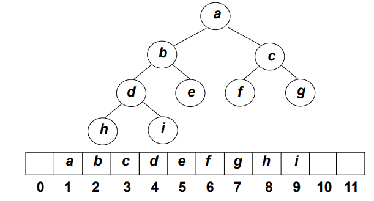

堆的两个特性：

- 结构性：用数组表示的完全二叉树；
- 有序性：任一结点的关键字是其子树所有结点的最大值(或最小值) 
  - “最大堆(MaxHeap)” ,也称“大顶堆”：最大值 
  - “最小堆(MinHeap)” ,也称“小顶堆” ：最小值


前面两个是最大堆，任何结点都是它所在子树的最大值。后面两个是最小堆。

再下面的前两个不是完全二叉树。

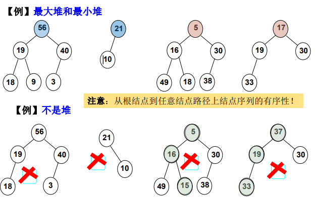

注意到最大堆和最小堆到任意结点路径上的有序性。正是这个有序性使得我们后面的插入删除，特别是插入就是沿着有序的轨迹来完成插入。

#### 堆的抽象数据类型的描述

```c
类型名称：最大堆（MaxHeap）
数据对象集：完全二叉树，每个结点的元素值不小于其子结点的元素值
操作集：最大堆H  MaxHeap，元素item  ElementType，主要操作有：
•MaxHeap Create( int MaxSize )：创建一个空的最大堆。
•Boolean IsFull( MaxHeap H )：判断最大堆H是否已满。
•Insert( MaxHeap H, ElementType item )：将元素item插入最大堆H。
•Boolean IsEmpty( MaxHeap H )：判断最大堆H是否为空。
•ElementType DeleteMax( MaxHeap H )：返回H中最大元素(高优先级)。
```

最大堆最主要的要实现的两个操作就是插入任何一个元素，还要能够删除这个堆中的最大值。

#### 最大堆的操作

###### 最大堆的创建

首先来看堆这个数据结构如何定义。

```c
typedef struct HeapStruct *MaxHeap;
struct HeapStruct {
    ElementType *Elements; /* 存储堆元素的数组 */
    int Size; /* 堆的当前元素个数 */
    int Capacity; /* 堆的最大容量 */
}; 
```

建立堆的时候就建立这样的一个结构。先为堆的结构申请一个空间。再对堆的三个分量进行赋值，Element本身是一个指针--我们申请一块数组的空间给它，空间的大小就是我们传进去的希望它的最大容量**+1**。加1的原因是因为堆的存放是从下标为1的地方开始的，下标为0的地方我们不存放堆的正式元素的。一开始建堆的size为0，堆的容量就是MaxSize。由于下标为0的地方空着没用，我们这里就赋值一个最大值，将来用作哨兵。

```c
MaxHeap Create( int MaxSize )
{ /* 创建容量为MaxSize的空的最大堆 */
    MaxHeap H = malloc( sizeof( struct HeapStruct ) );
    H->Elements = malloc( (MaxSize+1) * sizeof(ElementType));
    H->Size = 0;
    H->Capacity = MaxSize;
    H->Elements[0] = MaxData; 
     /* 定义“哨兵”为大于堆中所有可能元素的值，便于以后更快操作 */
    return H;
}

```

- 把MaxData换成 小于堆中所有元素的 MinData，同样适用于 创建最小堆。

###### 最大堆的插入

现在我们有了最大堆的结构，接下来看看相应的操作如何实现。先来看插入

想插入一个元素的最自然的想法就是把这个元素放在最后一个位置。现在我们是前5个元素。所以新插入元素然自然就想要放在第6个位置。放进去之后，按照我们完全二叉树的一种规则，它的父亲就相当于是6，因为3*2=6。但是这样有可能会破坏有序性，解决办法就是和它的父亲节点交换知道有序为止。

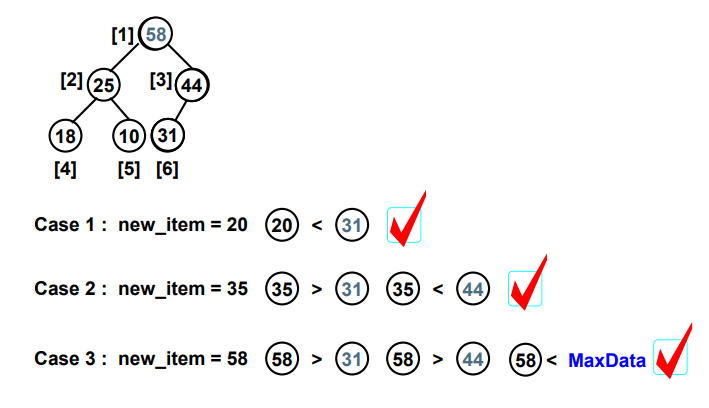

算法：将新增结点插入到从其父结点到根结点的有序序列中

先判别：堆是不是满了。如果堆不满，我就把元素放到堆的后面也就是Size+1的位置。放进去之后满足了完全二叉树的结构。但是还需要满足有序性。要满足有序性我们需要和它的父节点比较，这里利用一个for循环，如果item比父节点要大就把父节点挪下来，腾出父节点的位置。直到我们这个结点比父节点小了才停下来，放进去。这里有几个技巧，我们说要一直和父亲结点去比较，如果我这个元素是所有中最大的，意味着我一直放放放要放到头上去了，比如说i到2的时候和1比较，把原本的1挪下来，但是要注意，此时，如果继续for循环，i还要继续/2就变成1了，1和1/2比较就出堆了，所以我们应该要在for循环中添加一个条件i>1，但是我们这边没有这么做，因为我们在创建的时候在数组零下标的位置放了一个很大的数，所以不用担心我们的值会放出堆的范围。i为1的时候和i/2对比一定是小的，值就会乖乖放到1的位置，所以不需要多加一个判断。所以这里是一个哨兵，哨兵把你拒之门外了，你不会去哨兵的这个位置的。这样使得我们的程序效率提高了

插入的时间复杂度是O（log2 n）也就是树的高度

```c
void Insert( MaxHeap H, ElementType item )
{ /* 将元素item 插入最大堆H，其中H->Elements[0]已经定义为哨兵 */
     int i;
     if ( IsFull(H) ) {
         printf("最大堆已满");
         return;
     }
     i = ++H->Size;/* i指向插入后堆中的最后一个元素的位置 */
     for ( ; H->Elements[i/2] < item; i/=2 )
     H->Elements[i] = H->Elements[i/2]; /* 向下过滤结点，直接把父节点挪下来，比交换数据要快 */
     H->Elements[i] = item; /* 将item 插入 */
}

```

###### 最大堆的删除

下面我们来看最大堆的删除。最大堆的删除它删除的位置是确定的---根。把最大值删除了之后我们的堆就少了一个元素。删除了一个元素之后下面这个例子堆的元素就只能放到1234这四个下标上了，5下标就到堆的外面去了。所以有一个很自然的想法：你要把58删掉，自然用5号的元素替补1号的元素，所以我们的删除过程就变成是最后面元素来替补根的位置。替补完了，堆的完全二叉树的结构特性是保留了。接下来就是要让它保持有序性。我们找出替补后的1号的左右儿子中较大的儿子与1号作比较，如果儿子比它大那么他们就交换位置，重复上面的操作。这是我们删除的一种策略，它的时间复杂度是O（log N），也就是树的高度

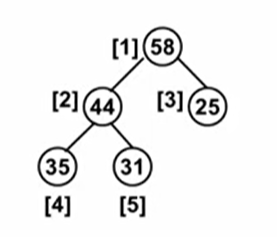

下面是程序的实现，首先判别一下堆空不空，如果空了那就不用删了。我们要把删的那个元素保存起来，将来我们是要返回回去的。接着根据刚刚的思路我们要把最后一个元素拿上来，顺便要把Size-1.接下来就是一个循环，这个循环负责找temp应该放的位置，这个位置由parent来指示。一开始我们假定我们是要把它放在根节点的位置的（parent为1），接下来看看它有没有左右节点（注意：Parent*2<=H->Size表明它至少有一个左孩子，如果Child!= H->Size则说明它既有左孩子又有右孩子，因为child<=H->Size，不等于说明就小于），挑一个大的，然后和parent这个位置去做比较。for循环的第一个if语句的目的就是要让child指向左右儿子中较大的---child！=maxsize说明有右孩子。接下来如果这个temp比左右儿子中最大的那个还要大，那么我就退出去。如果要小，那么就要把儿子移到父亲的位置。接着就是parent=child（在for循环的第三个分号语句）。接着重复继续和左右儿子比较，直到找到了位置才退出来。

```c
ElementType DeleteMax( MaxHeap H )
{ /* 从最大堆H中取出键值为最大的元素，并删除一个结点 */
     int Parent, Child;
     ElementType MaxItem, temp;
     if ( IsEmpty(H) ) {
         printf("最大堆已为空");
         return;
     }
     MaxItem = H->Elements[1]; /* 取出根结点最大值 */
     /* 用最大堆中最后一个元素从根结点开始向上过滤下层结点 */
     temp = H->Elements[H->Size--];
     for( Parent=1; Parent*2<=H->Size; Parent=Child ) {
         Child = Parent * 2;
         if( (Child!= H->Size) &&
         (H->Elements[Child] < H->Elements[Child+1]) )
         Child++; /* Child指向左右子结点的较大者 */
         if( temp >= H->Elements[Child] ) break;
         else /* 移动temp元素到下一层 */
         H->Elements[Parent] = H->Elements[Child];
     }
     H->Elements[Parent] = temp;
     return MaxItem;
}
```

###### 最大堆的建立

最大堆很有用，它的一个应用实例就是堆排序，但是这首先需要建立堆。所以必须要考虑给你n个元素怎么样把它建成最大堆，这是所有堆应用的前提。有一个很简单的方法就是不断地插入，一开始堆是空的，插进去一个，再插循环往复。每次插入它的时间复杂度是O（log2n），总共循环n遍，整个的时间复杂度就是O（NlogN）。但是这种方法效率不行。我们可以找出更加好的方法--线性时间复杂度。分两步，第一步先把所有的元素按照输入顺序放在一起，先满足完全二叉树的结构特性。然后再调整各节点的位置，以满足最大堆的有序特性。

建立最大堆：将已经存在的N个元素按最大堆的要求存放在 一个一维数组中

方法1：通过插入操作，将N个元素一个个相继插入到一个初 始为空的堆中去，其时间代价最大为O(N logN)。

方法2：在线性时间复杂度下建立最大堆。 （1）将N个元素按输入顺序存入，先满足完全二叉树的结构特性 （2）调整各结点位置，以满足最大堆的有序特性。

下面来看具体如何操作，如下就是n个元素按顺序放所形成的堆。接下来我们要不断地去调元素把它调成一个堆，调的这个方法和我们前面删除的操作是很像的。

删除是这样的，左子树是一个堆，右子树也是个堆，我们把最后一个元素替换到根节点（根节点左右两边是子堆）。注意：当把根顶的元素拿掉，我们用最后一个元素替换来的时候，发现左子树是个堆，右子树还是个堆，替换来了一个新的元素，如何把它调成一个堆？调的方法就是和左右儿子较大的比较，然后调上来。我们能不能把这样的思路用在建堆里。

对于现在这种情况，对于根节点来说，目前的情况左边不是堆，右边不是堆。对于66来讲左边不是堆右边也不是堆。怎么办？我们从底下开始做，从倒数第一个有儿子的节点开始，第一个有儿子的节点左右最多只有一个儿子。一个儿子，当然这个儿子本身就是一个堆。它是个堆那么就可以用刚刚删除时候的策略，就可以把它调整成有两个元素的堆了，这边就是87和9构成的堆。每一次都往前考虑一个节点也就是（下标-1）处的结点。最后到达上一层的时候，使用同样的删除时候的策略去调整，到79的时候左右两边就已经是堆了，就可以按照删除的步骤去插入了。

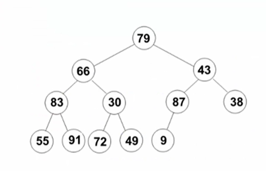

#### 堆中的路径

###### 题意理解


将一系列给定数字插入一个初始为空的小顶堆H[]。随后对任意给 定的下标`i`，打印从H[i]到根结点的路径。

第一行中5代表输入的数据有5个，3代表要进行三次查询。第二行中就是我们要插入的数据。第三行就是要给出的查询的数据。543分别代表最小堆中的下标，5就要打印出24,23,10这样的数据。


###### 堆的表示及其操作

堆是按照一定顺序组织的完全二叉树。所以堆的表示，一种最直截了当，也是完美的表示方法就是用数组来表示。所以我们进行堆表示的时候，往往就设置一个数组，数组的大小是MAXN--根据题目的要求我们不能超过1000，由于堆在存储的时候是把根节点放在数组下标为1的地方，也就是0是空缺的，所以大小就设为1001。根节点从数组下标为1的地方开始，按照一层层的顺序，逐个往数组里面放，由于这样的一种存放方式，使得堆中的任何一个元素可以很容易的找到他的父节点在哪里、左儿子在哪里、右儿子在哪里。如果自己在i这个位置的话，父节点是i/2，左儿子是2i，右儿子是2i+1.所以这是一个很完美的数据结构。除了数组之外，我们还需要知道当前堆的大小，我们就用size来进行表示。所以这是堆的一种表示，定义一个数组和一个表示堆的大小的size。堆中的函数，根据我们这个题目的要求，我们主要需要设计两个函数，第一个是堆的初始化，就是建立一个空堆，建立一个空堆是很简单的，只要把size设为0即可。H和size都是全局变量。另外我们再做一件事情，在堆里面根节点是从下标为1的地方开始存放的，所以0这个位置是空缺的，为了使得后面的操作更加方便，所以我们在0这个位置设置一个我们认为的最小值（这边是最小堆所以说赋值的是最小值，如果是最大堆就是赋值最大值）。这里就是-10001.它起的一个岗哨的作用。接下来我们要看的操作是插入操作，在插入的过程当中，要把准备插入的元素从底往上一个个比较，一直比较到根节点位为止。有了这个岗哨，我们在比较过程中就不用判别比较的下标i有没有越界。因为1/2是0，岗哨一定会比X来的小，所以就会跳出循环，也就是i最多到1.

```c
##define MAXN 1001
##define MINH -10001
int H[MAXN], size;
void Create ()
{
 size = 0; 
 H[0] = MINH; 
 /*设置“岗哨”*/
}

```

下面我们具体看看插入的过程，在原来的堆里面，每个节点到哦根节点的路径都是有序的。那么我们要插入的元素，就要插入到这里面的某个位置，使得树仍然是完全二叉树，且路径上的节点是有序的。一开始我们把它放到堆的后面，这时候就要沿着相应的路径进行插入，堆插入的程序，实际上就是在一个有序的序列里面，怎么插入一个元素来保证原来的序列还是有序的。我们用的方法是从最后开始比较，因为是最小堆，所以它要求父节点要比儿子来的小，父节点就是在i/2的位置，如果父结点的值大，父节点就需要往下挪让出位置，说明当前元素还需要继续插到前面去。for循环的起始条件就是从当前堆的最后一个的下一个开始，也就是++size这个位置。从这个位置开始去和父节点进行比较，如果发现父结点比它大就要把父节点挪下来。接下来就把i挪到上一个位置，也就是父节点的位置。一值做到父节点小于等于它的时候就退出来，直接放入到当前的位置即可。

```c
void Insert ( int X )
{ 
 /* 将X插入H。这里省略检查堆是否已满的代码 */
int i;
for (i=++size; H[i/2] > X; i/=2)
H[i] = H[i/2];
H[i] = X;
}

```

###### 主程序

回到问题，一开始第一行给的是两个整数n和m，n代表堆的元素的个数，m代表我要查询的次数。所以一开始我们要读入n和m，接下来要从第二行开始，把这n个序列读进来，一个个的插到空堆中，这样就完成了建堆。第三步就查询，对于你要求的m个位置，分别打印出当前位置到根的路径，

```c
int main()
{
读入n和m
根据输入序列建堆
对m个要求：打印到
根的路径
 return 0;
} 
```

具体的程序如下，首先scanf读进n和m。通过create函数建立一个空堆。接下来把n个元素一个个读进来，下面是一个循环，把每个读进来的数插入到堆中insert。这样就完成了把n个数据读入并且完成建堆的过程。再下来我们就要做m个查询了。所以下面是一个循环，每次循环就读进一个数，这个数我们把它赋值给j，代表当前要查询的位置，把这个位置的元素值先打印出来--printf("%d", H[j]);。然后就打印它的父亲，再是父亲的父亲，也就是要把从j这个位置到根节点路径上的祖先全部打印出来。当j大于1，也就是代表还没有到根的时候，那就把它的父节点j/2给打印出来。

```c
int main()
{ 
    int n, m, x, i, j;
    scanf("%d %d", &n, &m);
    Create(); /* 堆初始化 */
    for (i=0; i<n; i++) { /*以逐个插入方式建堆 */
        scanf("%d", &x);
        Insert(x);
    }
    for (i=0; i<m; i++) {
        scanf("%d", &j);
        printf("%d", H[j]);
        while (j>1) { /*沿根方向输出各结点*/
            j /= 2;
            printf(" %d", H[j]);
    	}
    	printf("\n");
    }
    return 0;
}

```


## 哈夫曼树和哈夫曼编码

编码这个问题是计算机里面最基础的一个也是很核心的一个问题，编码有很多方式，例如整数可以用二进制0101的形式进行编码。我们有一种叫做等长码的编码。每个ASCII码值它的编码可以用七位来进行编码，如果有一篇文章，它由若干个字符所构成，每一个abcd都用七位来进行编码，如果这篇文章有一万个字符，也就是说要用七万位来进行编码。现在计算机中用8位来存储一个字符，所以总共需要八万位。但是实际上我们每一个字符出现的频率是不一样的。比方说e字符出现的频率要大于很多字符的频率，如果我们也能够有不等长的编码，比方说e就不用七位的来编码了，既然出现的频率高我就用五位进行编码。频率出现没那么高的用6789位进行编码都没关系。这样编码的效率会得到提高。所以由于这样的一种背景，人家就在想，应该怎么进行编码，我已知的频率不一样，应该怎么进行编码，能达到比较好的效果。所以这就是哈夫曼树和哈夫曼编码所涉及到的一个重要的问题

#### 什么是哈夫曼树（Huffman Tree）

下面来看一个具体的例子

[例] 将百分制的考试成绩转换成五分制的成绩

```c
if( score < 60 ) grade =1;
else if( score < 70 ) grade =2;
else if( score < 80 ) grade =3;
else if( score < 90 ) grade =4;
else grade =5;

```

上面这一段代码实际上对应了下面这样一颗树。不及格的时候我只需要一次判断，90+的时候需要4次判断。如果我们本次的成绩90+的人很多，60分的人很少，这样一来绝大多数人就要做四次判断才能得出结论，而只需要判断一步的人非常少，显然这样的一种判定树不太好。

判定树：

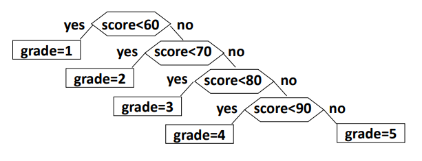

如果考虑学生成绩的分布的概率：

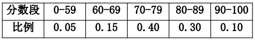

查找效率：0.05× 1+0.15 ×2+0.4× 3+0.3 ×4+0.1× 4 = 3.15

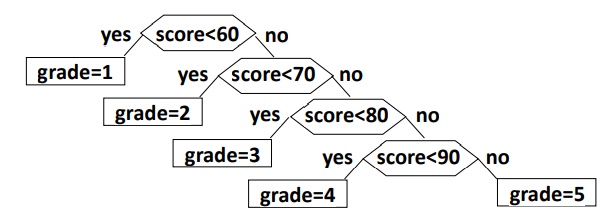

同样的一种分布，我们换一种判别的流程

如果考虑学生成绩的分布的概率：

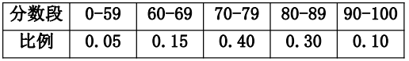

修改判定树：

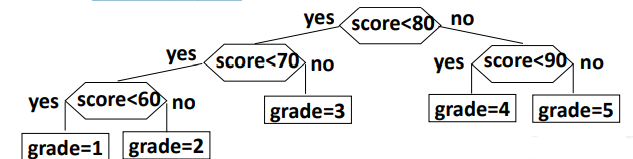

```c
if( score < 80 ) 
{ if( score < 70 )
 if( score < 60 ) grade =1;
 else grade = 2;
 else grad=3;
}else if( score < 90 ) grade =4;
else grade =5;

```

效率: 0.05× 3+0.15 ×3+0.4× 2+0.3 ×2+0.1× 2 = 2.2.

这给了我们启示：我们可以有不同的方法构造搜索树，不同的搜索树效率是不一样的。所以这就产生一个问题：如果根据不同频率来构造一个效率最好的搜索树。这就是哈夫曼树解决的问题

如何根据结点不同的查找频率构造更有效的搜索树？

#### 哈夫曼树的定义

我们的目标是要把带权路径的长度降到最低。哈夫曼是就是使得带权路径长度最低的树。

带权路径长度(WPL)：设二叉树有n个叶子结点，每个叶子结点带 有权值 wk，从根结点到每个叶子结点的长度为 lk，则每个叶子结 点的带权路径长度之和就是：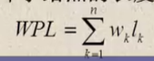

最优二叉树或哈夫曼树: WPL最小的二叉树

#### 哈夫曼树的构造

哈夫曼提出了一种构造这种树的方法：就是把权值从小到大排序，排完序之后把权值最小的两个结点并在一起，形成一颗新的二叉树，这个二叉树的权值就是并在一起的两个权值的和

- 每次把权值最小的两棵二叉树合并

所以哈夫曼树的构造是比较简单的，就是把两个最小的合并，形成一个新的二叉树。然后这个二叉树的权值就等于原来两个权值的和。接下来再从剩下的继续调两个最小的（二叉树也算在剩下的里面）。这个过程用下面的程序实现。在这个程序里面最主要的是解决两个问题：给你n个数如何选取两个最小的，并完了之后形成新的值。这个实际上就是堆要解决的问题，如果我们能够把结点的权值构造成一个最小堆从里面挑两个最小的并在一起形成一个新的结点。再把它插回堆里。所以用堆就可以很好地实现刚才那个过程。当然刚刚哪个过程也可以用排序的方法从小到大排好，然后删除两个小的合在一起，然后再把一个新的结点再插到已经排序号的结点中去显然这样的做法没有直接用堆效率高，直接用堆效率比较高。

哈夫曼树构造的过程的程序，首先给了频率之后，我根据这个频率，首先建一个堆，建完堆之后接下来这个循环每次从堆中删掉两个元素，取出两个最小的，分别作为T的左右儿子，T结点的权值为左右权值的和。然后把新节点T再插回堆中。循环了n-1次，也就是进行了n-1次合并之后，就可以结束了，所以循环从i=1开始，做到i<size。循环退出来之后，堆顶的那个元素就是我们的哈夫曼树。

时间复杂度是O(NlogN)

```c
typedef struct TreeNode *HuffmanTree;
struct TreeNode{
    int Weight;
    HuffmanTree Left, Right;
}
HuffmanTree Huffman( MinHeap H )
{ /* 假设H->Size个权值已经存在H->Elements[]->Weight里 */
     int i; HuffmanTree T;
     BuildMinHeap(H); /*将H->Elements[]按权值调整为最小堆*/
     for (i = 1; i < H->Size; i++) { /*做H->Size-1次合并*/
         T = malloc( sizeof( struct TreeNode) ); /*建立新结点*/
         T->Left = DeleteMin(H);
         /*从最小堆中删除一个结点，作为新T的左子结点*/
         T->Right = DeleteMin(H);
         /*从最小堆中删除一个结点，作为新T的右子结点*/
         T->Weight = T->Left->Weight+T->Right->Weight;
         /*计算新权值*/
         Insert( H, T ); /*将新T插入最小堆*/
     }
     T = DeleteMin(H);
     return T;
}
```

#### 哈夫曼树的特点


- 没有度为1的结点；

  - 因为哈夫曼在构造的时候每次都是两个结点并在一起，形成一个新的结点

- n个叶子结点的哈夫曼树共有2n-1个结点；

  - 由于没有度为1的节点，n2=n0-1，得到n=n2+n0=2n-1

- 哈夫曼树的任意非叶节点的左右子树交换后仍是哈夫曼树；

  - 因为哈夫曼树本来就是两个结点合并在一起的，我们没有强调是左右这样的顺序，可以左右也可以右左

- 对同一组权值{w1 ,w2 , …… , wn }，是否存在不同构的两 棵哈夫曼树呢？

  对一组权值{ 1, 2 , 3, 3 }，不同构的两棵哈夫曼树：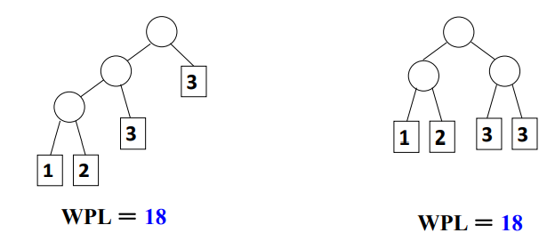

  虽然这边的哈夫曼树不一样但是WPL的值是一样的。

  #### 哈夫曼编码

  下面我们讲讲编码的问题，给定一段字符串，如何对字符进行编码，可以使得该字符串的编码 存储空间最少？不同的字符出现的频率是不一样的，我们如何对这种字符进行编码，使得整个字符串它的编码长度是最短的。

  [例] 假设有一段文本，包含58个字符，并由以下7个字符构：a，e，i， s，t，空格（sp），换行（nl）；这7个字符出现的次数不同。如何对 这7个字符进行编码，使得总编码空间最少？

  【分析】 （1）用等长ASCII编码：58 ×8 = 464位； （2）用等长3位编码：58 ×3 = 174位； （3）不等长编码：出现频率高的字符用的编码短些，出现频率低 的字符则可以编码长些？

  如何进行不等长编码？比方说我们想对前面的7个字符进行编码：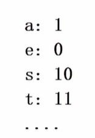

  这样的编码显然是由问题的，这样的编码会产生二义性。例如10编码代表的是ae还是s？

  如何避免二义性？

  **前缀码**prefix code：任何字符的编码都不是另一字符编码的前缀  可以无二义地解码

  那么如何保证我们的编码不会产生二义性呢？我们可以用二叉树来表示我们的编码

  ###### 用二叉树表示编码

  用二叉树进行编码： （1）左右分支：0、1 （2）字符只在叶结点上

  来看例子，四个字符的频率: a:4, u:1, x:2, z:1，我们可以按照等长码来进行编码，等长码就相当我们构造了这样一颗二叉树：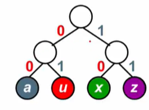

  

  因为这里四个对象，我们可以用两位来表示。这样的表示方法实际上就构成了对应的一个二叉树，在这个二叉树里面，左边是0右边是1，a的编码是00，u是01，x是10，z是11。那么什么情况下它会是前缀码，什么情况下它不是前缀码：当你的所有的结点都在叶子结点的时候就不可能会出现一个字符的编码是另一个字符编码的前缀的情况。当你的编码，有一个出现在另外一个结点编码当中的时候，在树的非叶结点上的时候，就会出现前缀。所以我们要保证我们的编码没有二义性，一种方法就是所有的字符都是在二叉树的叶子结点上。所以接下来的一个问题就是：我们如何来构造这样的二叉树，使得编码的总长度最短。那么当然我们的目标是要代价最小，我们来看一下这棵树的代价：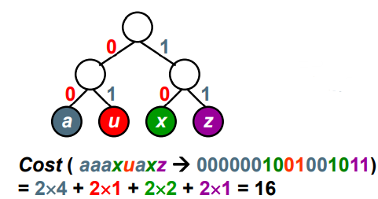

  对于这样的一个字符串，也就是说对于这样的一个频率，如果用这样的一个二叉树来进行编码，它的代价就是16.编码的总长度是16.这样的一棵树让我们想到了，相当于这里的频率乘以长度加起来，所以要让编码的长度最短，也就是要构造一个哈夫曼树。来看这样的一棵树：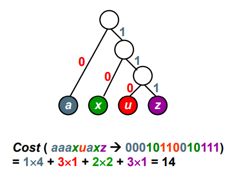

  在这里面编码不等长了。没有二义性，所以我们可以用二叉树来构造相应的编码，只要对象在叶子节点上。所以接下来的问题是：

  怎么构造一颗编码代价最小的二叉树？就是用我们前面提到的哈夫曼树来构造。

  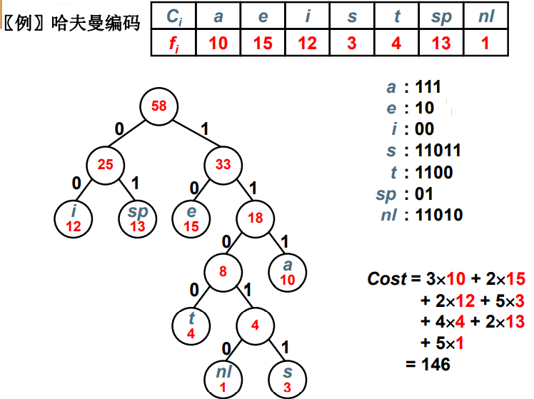

  

  

## 集合及运算

#### 集合的表示

  - 集合运算：交、并、补、差，判定一个元素是否属于某一集合 

  - 并查集：集合并、查某元素属于什么集合 

    一个是将两个集合并在一起，一个是查找一个元素是属于哪个集合的

  - 并查集问题中集合存储如何实现？

    有一个很典型的例子，比方我们有n台电脑，如果我告诉你哪台电脑和哪台电脑连在一起，问你是不是所有的电脑都连在一起了。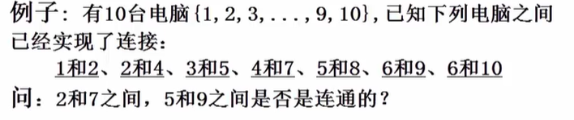

    这样的一个问题它有一个特点就是如果a电脑和b电脑连在一起，b电脑又跟c电脑连在一起，那么a和c就连在一起，这种连接具有一种传递性。那么如果我们给你n个这样的电脑，告诉你若干个电脑之间存在一个连线，那么某个电脑跟另外一个电脑之间有没有连在一起，我们如何解决这个问题。

    解决思路：

    1. 将十台电脑看成是十个集合
    2. 已知一种连接“x和y”，就将x和y对应的集合合并
    3. 查询“x和y是否是相通的”就是判别x和y是否同属于一个集合

    我们把n个电脑看成n个集合，如果有一条线把这两个电脑连接在一起，那么我们就把这两个集合并在一起，接下来如果你又告诉我另外两台电脑连在一起了，那么我们就看看那两台电脑属不属于同一个集合，如果不属于同一个集合，那么就把这两个集合并在一起。如果两台电脑是属于同一个集合的，说明他们之间肯定是相连的。所以这个问题就相当于我们要管理一堆集合，在这上面所做的主要操作就是两个，一个就是把两个集合并在一起，一个就是查某个元素属于哪个集合，这样的一种问题就叫并查集。那么对并查集这样的一个问题，我们首先考虑一下，集合怎么进行表示，也就是说怎么存储一个集合

    - 可以用树结构表示集合，树的每个结点代表一个集合元素

      我们可以用一个树结构来表示集合，一棵树表示一个集合，如果是两颗树就是两个集合。树里的每个节点代表集合的元素，用树根来代表这个集合，所以想查某个元素属于哪个集合，只要在这个树上去找，它的根节点是谁，如果要把两个结点并在一起，那么就是把两棵树并在一起形成一个更大的树。

    比方说我们有三个这个的集合，用三棵树来表示。在这里面我们有一个很重要的操作--是要查找某个元素属于哪个集合，要从这个元素的结点开始，去找这个树的树根，也就是要往上找。我们要把树并在一起呢？只要把一个根连接到另一个根就行了。所以在这两个并查操作过程中，我们不存在已知一个节点，找它儿子是谁。而我们更重要的是要知道已知一个节点，它父亲是谁，因为根据这个我们可以很快找到根，所以这是树的一种表示方法，就不像我们前面二叉树，多叉树是一个节点指向儿子，而是一个节点指向父亲，这种表示方法叫做双亲表示法，每个结点的指针都指向它的父亲。对于这样的一种树，我们如何进行存储，当然链表存储是一种方式，但其实我们有更好的存储方法--我们直接用数组就可以存储。下面来看一下，对于这样的三个树，如何用数组来进行存储。  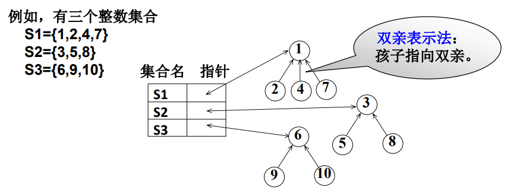

######   采用数组存储形式

这是数组的表示方法，数组的每一个分量是一个结构，结构包含两个域，一个是data一个是parent，data代表结点的信息，parent是一个下标，它是指向它父亲的位置。对于我们刚才的那三棵树，它所对应的数组的表示方法如下。每一行是一个数组的分量，它是一个结构，包含两个内容，一个是data一个是parent。例如2这个结点，它的parent域是0，0下标对应的是1这个结点。这样我们就可以用一个简单的结构数据表示这三个树。我们来看根节点1，它没有父亲所以我们-1来表示。利用这种结构，已知一个节点就很容易知道它的根节点是谁。

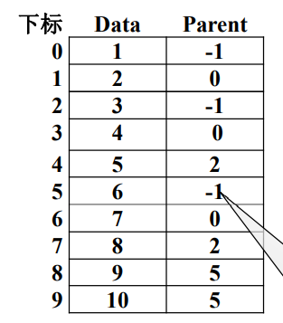

- 负数表示根节点；非负数表示双亲节点的下标。

```c
数组中每个元素的类型描述为：
typedef struct {
 ElementType Data;
 int Parent;
} SetType;
```

#### 集合运算

下面来看看两个最主要的操作

###### 查找某个元素所在的集合（用根结点表示）

find的目的是告诉你一个元素x，找x是属于哪个集合的。我们用根来代表一个集合。也就是说已知一个x，然后找x所在的树的树根下标是谁。这边的下标是一个整数。所以访问值是一个int。

首先是一个for循环来寻找x在哪，得到x的下标，这个下标在变量i里面，如果大于MaxSize说明这个循环走到最后都没有找到，i跑到外面去了，那么这个时候就return -1。如果i没有跑出去，代表找到了，我们就要开始找父亲了。利用分量parent，当parent为-1的时候才为根节点，所以我们就让parent>=0的时候一直循环，不断地往上走--i = S[i].Paren，原来指向i，现在跳到了i的parent，每循环一次往上走一层，退出的唯一条件就是parent为-1.退出来的时候i就是根节点的下标。

```c
int Find( SetType S[ ], ElementType X )
{ /* 在数组S中查找值为X的元素所属的集合 */
  /* MaxSize是全局变量，为数组S的最大长度 */
     int i;
     for ( i=0; i < MaxSize && S[i].Data != X; i++) ;
     if( i >= MaxSize ) return -1; /* 未找到X，返回-1 */
     for( ; S[i].Parent >= 0; i = S[i].Parent ) ;
     return i; /* 找到X所属集合，返回树根结点在数组S中的下标 */
}

```

######  集合的并运算

下面我们来看一下并运算。告诉你两个元素，把这两个元素所属的集合并在一起，所以我们首先要找到这两个元素分别是哪些集合的。我们要根据x1、x2的值找到这两个元素的根节点。然后要把这两个树并在一起。两个树并在一起就是把一个树的根节点的parent指向另一棵树的根节点。

- 分别找到X1和X2两个元素所在集合树的根结点

- 如果它们不同根，则将其中一个根结点的父结点指针设置成 另一个根结点的数组下标。

这个程序实现：一开始我们通过find操作找到x1和x2的根节点。接下来要判断是不是同一个集合，如果本来就是同一个集合了就不需要做并的操作了，如果不是同一个集合我们就合并，接着把root1的值写入到root2的parent里面去。root2就指向了roo1。

```c
void Union( SetType S[ ], ElementType X1, ElementType X2 )
{
     int Root1, Root2;
     Root1 = Find(S, X1);
     Root2 = Find(S, X2);
     if（ Root1 != Root2 ）S[Root2].Parent = Root1;当x1和x2不属于同一子集时，才需要合并
}

```

我们发现，在挂的过程中树会越来越大也可能会越来越高。所以说不断的合并树会越来越高，导致我们有一个效率会比较差---find操作。find因为要从结点开始一直往上找树根，所以当树比较高的时候find的效率就差了。为了保证集合查找的效率。一种策略是：采用小的集合合并到相对大的集合中（修改Union函数）。如果按照这个策略，我们我们一定要知道每个集合到底有多少元素。怎么样才能有这样的信息？一种简单的方法，可以增加一个分量。但是这样也会存在问题：只有根节点需要有这个分量，这就导致了空间的浪费。再想一个办法：在parent里面我们的值分为两种情况，一种是代表它父节点的下标，一种是为-1代表它是根节点。既然是负数，我们有没有可能利用这个信息，现在我们根节点统一用-1来表示，很自然的想到我们可以用负数的绝对值来表示元素的个数。这样一来parent为负数的时候就可以为我们提供两个信息，一个信息是负数--代表是根节点。一个是负数的绝对值--代表结点的个数。通过绝对值我们就可以知道那个集合大那个集合小了。这个一个很巧妙的方法，这样我们很显然可以不用增加格外的空间。

```c
void Union( SetType S[ ], ElementType X1, ElementType X2 )
{
     int Root1, Root2;
     Root1 = Find(S, X1);
     Root2 = Find(S, X2);
     if（ Root1 != Root2 ）{//当x1和x2不属于同一子集时，才需要合并
         if(S[-Root1.parent>-Root2.parent])S[Root2].Parent = Root1;//集合1大
         else S[Root2].Parent = Root1;//集合2大
     }
}
```

#### File Transfer

File Transfer这道题目的大概意思就是说给了我们一大堆的计算机，需要一遍按照要求给两个计算机连网线，一边需要随时来查询任何两个给定的计算机之间，是不是可以传输文件了，换言之就是它们之间是不是联网了，在换句话说就是它们是不是已经同属于一个集合了，所以File Transfer这道题是一道非常经典的；并查集的应用题。在正式介绍具体题目之前，我们有必要来重新审视一下，集合的一个简化的表示。前面已经介绍了一种，非常通用的集合的表示方法，但是就我们这道题来说，其实没有必要把事情搞得这么麻烦的。我们完全有可能做一定的简化，轻装上阵，所谓工欲善其事必先利其器。那么接下来我们就来看一下怎么把这个集合做一个简化的表示。

首先我们回顾一下，之前学过的集合的表示方法。首先集合是用一个数组来表达的，这个数组的类型是一个结构体，结构体内部有一个数据域data对应集合里面的元素具体的类型，它可以是任意一种你希望的集合的类型。另外有一个整形的变量，parent，相当于是一个指针，代表它的父节点在数组的下标。

```c
typedef struct {
ElementType Data;
int Parent;
} SetType;
```

相应的我们的查找。核心步骤和前面的一样不赘述。但是这边要注意一个问题，找X元素对应的下标是一个线性扫描的过程，是很浪费时间的。最坏情况就是我一直要找到数组的最后一个元素才找到，反反复复的找了N遍。如果这个集合里有N个元素，而我要把第N个元素反复找N遍，这个时候总体的时间复杂度会是什么样。N的平方数量级，太慢了。这一步真的很有必要吗？在我们这道题里，我们的计算机是从1~N编号的，也就是说这里面的data就是一个整数，这N个整数真的有必要开一个数据域去存它吗。有一种更一般的情况是，事实上**任何有限集合，如果这有限集合里有N个元素，都可以被一一映射为整数0~N-1.**由于这一题里，计算机是从1~N编号的，那么我们当然可以很方便的把1映射到0·····把N映射到N-1.这种映射是非常简单的。只要把计算机的编号减1，就完成这样的映射了。对于任何一个其它的问题，只要这个集合里面元素的个数是有限个，我们总是有办法做这样的映射。也就是说把这个集合里面的每一个元素，给它编个号，就从0~N-1.当我们看到0~N-1这个数据范围的时候，很自然就联想到，它其实就是数组的下标，换言之，这个问题可以简化为就是集合里面的每一个元素直接用它在数组里面的下标去代表即可。那么这时候这个数据域就可以不要了。我们直接定义一个整形数组，就可以表示一个集合了。

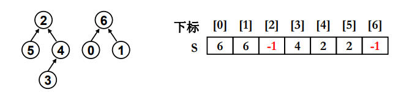

在这个例子里我们一个个看，用这种简化的表示方法，比如说我们这两个集合，会被表示成---可以用一个整形数组来存，集合里面的每一个元素就对应了数组的下标。由于集合中元素是按照0~6进行编号的，由于是0开始，那么可以完美的与数组对应。数组下标为几就代表集合中元素是几。数组里面的内容直接对应了parent。这样一来我们原本需要两个数据域就变成了只需要一个数组。如果最后我们还需要数一下，这个数组里究竟有多少个集合。其实我们只需要扫描一遍这个数组，数一数它里头到底有多少个-1，有几个-1就代表里面有多少个独立的集合。

```c
int Find( SetType S[], ElementType X )
{ 
    int i;
    for ( i=0; i<MaxSize && S[i].Data!=X; i++ ) ;
    if ( i>=MaxSize ) return -1;
    for( ; S[i].Parent>=0; i=S[i].Parent ) ;
    return i;
}
```

那像现在化简了以后，我们的C代码就可以这样写，首先我们还是需要一个ElementType，这个ElementType在这里头就直接定义为整型，是因为我们默认元素可以用非负整数（从0~N-1）表示。setName也是用一个整型数组来表示的。setName指的是一个集合的名称，我们默认使用根节点的下标作为集合的名称。根节点的下标就是一个整型，所以这边就定义为整型。最后SetType就是集合的类型，集合的类型被我们定义为一个数组，就是一个整型的数组。

```c
typedef int ElementType; /*默认元素可以用非负整数表示*/
typedef int SetName; /*默认用根结点的下标作为集合名称*/
typedef ElementType SetType[MaxSize];
```

经过我们这样简化以后，我们的find函数就变得十分简短了。当我们想要查找一个元素x在哪里的时候，我们不需要再去扫描整个数组，因为这个x的值直接就是数组的下标，我们通过刚刚敲定的映射规则直接找到它了。S[x]里面存的直接就是x的父节点。如果它的父节点是大于等于0的，我们就继续往上找。一直找到某一个结点的父节点是-1了，我们就退出循环，说明这个x就是根。

```c
SetName Find( SetType S, ElementType X )
{ /* 默认集合元素全部初始化为-1 */
for ( ; S[X]>=0; X=S[X] ) ;
return X;
}
```

Union函数就只有一行，当然这边做了一个假设，假设传进来的root1和root2不是一个集合。在前面的代码里面是有进行判断root1和root2是否相等的。我们这边就把root1和root2传进来的合法性交给了用户，

```c
void Union( SetType S, SetName Root1, SetName Root2 )
{ /* 这里默认Root1
和Root2是不同集合的根结点 */
S[Root2] = Root1;
}
```

###### 题意理解

首先给了一个整数代表计算机的个数，一共有五个。当我们读到一条指令它的第一个字符是C的时候，表示是check：查询3和2之间有没有联通。在刚开始的时候一条网线都没有，3和2之间显然是不连通的。当我们读到这条的时候输出应该是NO。下一条指令第一个字符是I，表示input输入，表示要在3和2之间加入一条网线，那么它们就连通了。读到字符S的时候就表示我们所有的输入都结束了。这时候就需要对整个网络进行判断，它分成几个连通集，所谓连通集就指的是在这个集合里面任意两个计算机都是直接或者间接连通的。那么显然在这个例子里，1是一个孤立的计算机，但是它自己可以认为是和自己连通的，剩下的四台机器认为是连通的。所以我们应该输出这个系统里面有两个连通集。

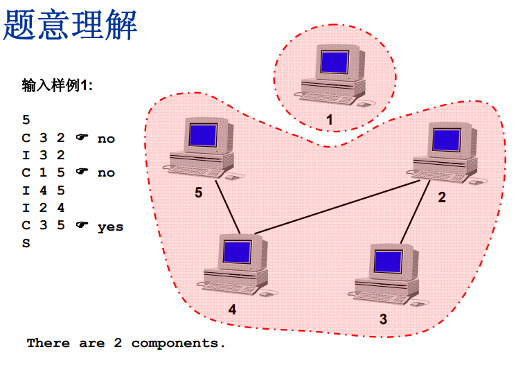

输入样例二是一个完全连通集，在这种情况下，最后一行输出的应该是，The network is connected。

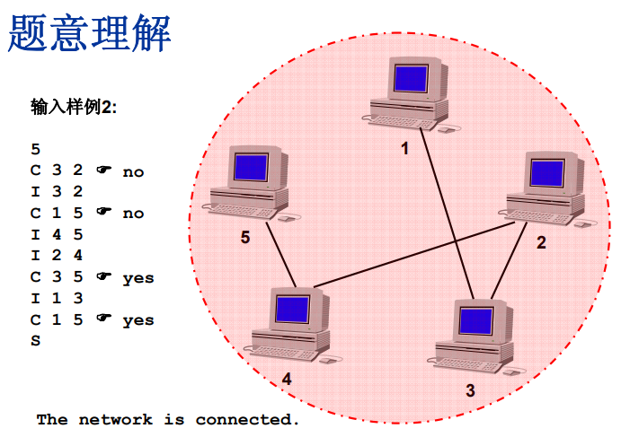

###### 程序框架搭建

下面来看代码。主函数很简单，我们显然是要用并查集来解决这个问题，那么在使用并查集之前我们首先要输出化这个集合，接着进入do-while循环，读入一条指令处理这条指令，一直到指令表示结束的时候才结束整个程序。

```c
int main()
{
    初始化集合;
    do {
        读入一条指令;
        处理指令;
    } while (没结束);
    return 0;
}
```

具体的代码：首先我们所需要一个并查集，n是这个集合里面元素的个数。接着我们需要读入每一条指令，指令的关键是它的第一个字符，我们用in来表示。做好了准备工作我们开始初始化集合，我们先读进集合的元素个数，接着写一个函数Initialization( S, n )来初始化集合。一开始每一个元素都是独立的，也就是说每一个元素都是自己的根节点，那么把每一个元素都定义成-1就行了。接下来进入一个do-while循环，每次先读这行指令的第一个字符，判断它是哪一种指令，接着处理相应的指令，一直循环直到while结束，如果读进来的这个in不是字符s就没有结束，就一直循环，如果是S那么就结束。在这里我们有三种指令需要处理，我们如果把三种指令的处理方法都写在主函数的话，会显得很不科学，一种比较科学的方法是写一个Switch，根据读进来的字符in是哪一种来做相应的处理，对每一种处理都写一个不同的函数来做相应的事情，如果是I就写一个函数叫Input_connection( S )，这个函数要做的事情就是把两台要连接的计算机的编号读进来，然后检查它们两个是不是连好了，如果没连好就把它们连好，在这个函数里面起最关键作用的函数就是Union函数，在做Union之前我们要先用find来检查这两台计算机它们是不是本来就连好了，已经连好了就不需要重复连接了。所以Union和Find函数都会出现在Input_connection函数里面；当读到的in是字符c的时候，表示我要处理的是一个查询叫做：Check_connection( S )，这个函数要做的事情就是读入待查询的计算机的编号，然后去检查它们到底是不是属于一个集合，所以在这个函数里面主要调用的就是Find这个函数。最后当我们读到终止符的时候，我们就调用Check_network( S, n )，这个函数就是检查一下整个的网络是不是已经连通了，它要做的任务就是数一下，现在的这个集合S里面到底有多少个根节点，也就是到底有多少个连通集。

```c
int main()
{ 
    SetType S;
    int n;
    char in;
    scanf("%d\n", &n);
    Initialization( S, n );
    do {
        scanf("%c", &in);
        switch (in) {
            case 'I': Input_connection( S ); break;
            case 'C': Check_connection( S ); break;
            case 'S': Check_network( S, n ); break;
    	}
    } while ( in != 'S');
    return 0;
}
```

接下来看看这三个函数具体如何实现

第一个先来看看i的处理，我们现在这个函数里面读进来两个计算机的编号，注意到我们的计算机是从1-n编号的，而我们集合的下标是从0-n-1的，所以我们需要一个简单的映射，当我调用find函数的时候，我要传进去的是，u这台计算机它的下标所以它的下标是u-1，v也类似。这里我们就是读进来两台计算机的编号，分别是查一下他们两个所属集合的根节点是什么，如果他们两个还分属于两个不同的集合的话，那么我们就在它们之间连一条网线，也就是把这两个集合合并在一起。

```c
void Initialization( SetType S, n ){
    int i;
    for(i=0;i<n;i++){
        S[i]=-1;
    }
}
```

```c
void Input_connection( SetType S )
{ 
    ElementType u, v;
    SetName Root1, Root2;
    scanf("%d %d\n", &u, &v);
    Root1 = Find(S, u-1);
    Root2 = Find(S, v-1);
    if ( Root1 != Root2 ) 
    Union( S, Root1, Root2 );
}
```

处理查询的函数比处理输入的函数还要更简单些。前面的处理是一样的，都是读入两个编号，找它们的根节点。不同的是后面，如果这两个同属于一个集合那么就打印yes，如果不一样就打印no。

```c
void Check_connection( SetType S )
{ 
    ElementType u, v;
    SetName Root1, Root2;
    scanf("%d %d\n", &u, &v);
    Root1 = Find(S, u-1);
    Root2 = Find(S, v-1);
    if ( Root1 == Root2 )
    printf("yes\n");
    else printf("no\n");
}
```

最后一个函数用来检查整个网络是不是已经连通，这是一个非常简单的操作。我只要去扫描，每一个S数组里面的元素，只要它是小于0的-1，那么就意味着它是一个根节点，计数器counter++，如果只有一个根节点那么就表示整个集合已经连通了，我们就输出The network is connected。否则counter等于几我们就输出一共有多少个连通集。

```c
void Check_network( SetType S, int n )
{ 
    int i, counter = 0;
    for (i=0; i<n; i++) {
    	if ( S[i] < 0 ) counter++;
    }
    if ( counter == 1 )
    printf("The network is connected.\n");
    else
    printf("There are %d components.\n", counter);
}
```

所以我们看到了整个程序的框架，是非常简单的，它的运行效率关键就取决于find函数和union函数到底是如何实现的。

###### TSSN的实现

首先我们用一个TSSN的方法来做一个实现。TSSN：too simple sometimes naive---太简单有时太天真。

这就是我们最原始的简单版，find和union代码。直接把这个代码提交上去会有什么结果呢？到PTA上跑一下，发现其它测试点都ok第六个测试点超时。我们来想想别的办法。我们来看一下union函数，当我们把两个集合并在一起的时候，我们默认是把第二个集合改掉，让第二个集合指向第一个集合的根节点，现在我们把这两个关系换一下会怎么样？---我们总是让第一个集合指向第二个集合的根节点。把这段代码再跑一下，发现只有测试5超时了。测试点6可以了，但是测试点5超时了。这又是怎么回事呢？我们再试一个版本，我们退回到何老师的版本，再进去跑一下，结果发现567都测试都超时了，但是这样的超时并不让人惊讶，因为find函数有一行找元素的代码太耗时了（O(n2)）可以看到n²对函数效率的破坏有多么严重。那么接下来的问题就是怎么办才能解决这个超时的问题。

```c
SetName Find( SetType S, ElementType X )
{ /* 默认集合元素全部初始化为-1 */
    for ( ; S[X]>=0; X=S[X] ) ;
    return X;
}
```

```c
SetName Find( SetType S, ElementType X )
{ /* 默认集合元素全部初始化为-1 */
    for ( ; S[X]>=0; X=S[X] ) ;
    return X;
}
```

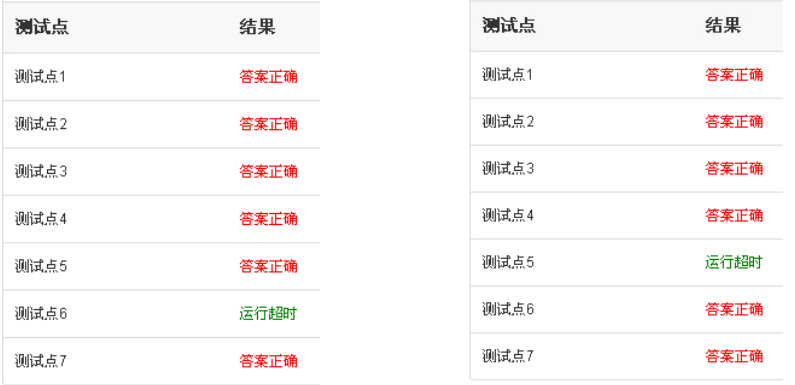

###### 按秩归并

现在我们已经知道前面哪个很天真很傻的方法是会超时的，所以我们需要一个稍微聪明一点的算法，这个算法叫做按秩归并。在讲按秩归并之前，首先先来研究一下为什么前面那个TSSN的算法会超时。它是这样的，首先我会要求你把计算机1和2连接到一起，注意顺序是2在前，也就是要把1挂在2上。接下来把1又挂在3上。我们发现树在越长越高。以此类推我们最后要把1挂在n上的时候，这棵树就退化成了一个单链表。整个一系列的操作时间复杂度是多少？我们发现这一系列工作量最大的操作就是这个find1，一方面这个树在越长越高，一方面每一次我们要从最底下的这个结点开始，一直往上找它的根节点，重复了n-1次以后，这个工作量积累起来就变成n²数量级的。当n是1000的时候，n²这个算法不超时才怪。所以我们就要设计力两组数据来卡这个事情。

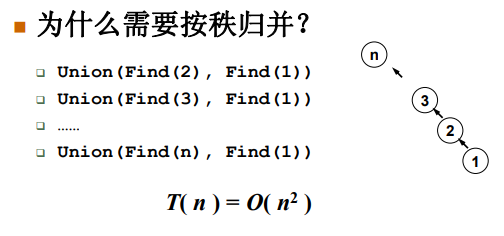

为什么树会越来越高呢？假设现在有两棵树一个树的高度是2一个树的高度是3，如果我们把3的树接到2的树上，那么树的高度就会变成4,。如果我们把2这课树接到3的树上，那么树的高度是保存原来最大的高度3而不会变高。也就是说只要我们把矮的树接到高的树上就行了。那么树的高度存在哪里？因为这种实现方法在决定把谁接到谁上的时候需要比较一下树的高度，所以我们需要一个地方去存树的高度，但是我们有必要新增加一个数据域来专门存树的高度码。这样子的话就只有根节点需要存树的高度，其它结点的那个域就浪费了，所以新增加数据域的这个方案肯定不行。我们想一下，现在这个实现方法，任何一个元素它数组里面的这个值都不是浪费的，存的是它父节点的下标，所以这个数字都是有意义的---这个数字代表它父节点的下标，除了根节点。根节点我们发现，它的下标是-1，因为-1不可能是任何一个元素的下标，这样就把根节点和其它非根节点区分开了,这个-1只是用来代表它是一个根节点，那么我们完全也可以用-2-3-4来代表它是一个根节点，只要它是负数。那么我们就可以用额外多出来的这些负数的绝对值来代表树的高度，所以我们有一个很自然的想法，我们让S[Root] 不是等于负1而是等于负的树高。一方面它是负数标志了它是一个根节点，另一方面数值本身的大小标志了树的高度，一举两得一箭双雕。那么在初始化一个集合的时候，这个s[root]应该初始化为什么呢？之前我们的初始化函数是把每一个值都初始化为-1的，我们一开始认为计算机自己就是一个独立的根节点，现在我们仍然可以把它初始化为-1.它代表每一个计算机都是一个独立的根节点，而这棵树的初始高度就是1.这时候当我们要实现union函数的时候关键就是要根据他们的高度来做一个判断，我们把矮的树接到高的树上。总共有三种情况，两棵树一样高，1比2高，2比1高。两颗树一样高的时候树的高度是需要做出改变的，树的高度存储在两个中的其中任意一个就行，在这种情况下1可以贴到2上，2贴到1上是一样的，区别是就是树的高度需要存在被贴的树上。这样我们就实现了按高度的归并。

伪代码如下

```c
if ( Root2高度 > Root1高度 )
S[Root1] = Root2;
else {
    if ( 两者等高 ) 树高++;
    S[Root2] = Root1;
}
```

代码如下。

```c
if ( S[Root2] < S[Root1] )
S[Root1] = Root2;
else {
    if ( S[Root1]==S[Root2] ) S[Root1]--;//树高++意味着S[root1]是--
    S[Root2] = Root1;//这边是把root2接到root1上，因为root2的父亲是root1了。所以如果树高要改，要改在root1上
}

```

其实还有另一种做法，它不是比高度，而是比规模，比哪棵树包含的元素更多一些。我们的原则就是把小树接到大树上，同理我们就把S[root]记成负的元素个数。

代码大体上是一样的，区别就是按照高度归并的时候我们有时候树的高度是不需要进行改变的，但是按照规模来进行归并的时候，无论如何最后树的规模都是要变得，且就等于原本两个树规模相加。

```c
void Union( SetType S, SetName Root1, SetName Root2 )
{ 
    if ( S[Root2]<S[Root1] ){
        S[Root2] += S[Root1]; //当把root1接到root2的时候，是root2的规模发生改变
        S[Root1] = Root2; 
    }
    else {
        S[Root1] += S[Root2]; //当把root2接到root1的时候，是root1的规模发生改变
        S[Root2] = Root1; 
    }
}
```

不管是按照高度归并还是按照规模归并，两种方法统称为按秩归并。个人来说更喜欢用比规模的方法，因为它跟我们后面一种方法结合起来用的时候，是更方便的。

如果我们一直都是按秩归并的，最坏情况下这课树的树高是多少？---不管我们按高度还是按规模，最坏情况下是我们每次都把两颗树差不多规模或者是同样高度的树并在一起，这种时候树的高度就不得不长大，如果我们整个问题的规模是n，像这种等秩的归并，我们最多可以进行logN次。也就是如果我们每次都去访问树最下面那个结点，我们的时间复杂度也只是logN，而不是N²。证明猜想，如果我们用f（n）来表示n个节点最多可以产生的高度，我们需要产生一棵高度为f（n）+1的树就需要有两颗一样高度的树，也就是f（n）+1=f（2n）

###### 路径压缩

做了按秩归并以后，我们程序跑起来就快很多了。那么能不能再快一点？答案是能，用一下路径压缩。按秩归并是对union的一个改进。路径压缩是对find的一个改进。

这是改进之后的源代码，看上去仍然是很简单的，这个函数到底在干啥，首先我们要明确一点：不管它是怎么做的，当我们调用find这个函数的时候，传进去的是这个集合里的一个元素X，返回的就是X所属的这个集合根节点的下标，也就是这个集合的名称。那么带路径压缩的find函数是怎么工作的呢？首先我们传进来一个元素X，我们判断一下，如果S[x]已经是一个负数的话那就意味着X本身就是根，直接返回即可。否则我们就返回这个东西：S[X] = Find( S, S[X] )。这句话到底在干什么？这句话事实上做了三件事情，第一件事：先找到根，也就是调用find函数，找的是X的父节点的根，也就是S[x]的根，父节点所属的集合和X所属的集合显然是一个集合，所以调用find以后，返回的就是我们想要的这个SteName。但是在我们真正要返回这个根之前，我们还做了第二件事：把根变成X的父节点，也就是把找到的这个集合的名称，直接赋值给S[X],也就是之间变成了X的父节点。最后再返回这个根。

```c
SetName Find( SetType S, ElementType X )
{ 
    if ( S[X] < 0 ) /* 找到集合的根 */
    return X;
    else
    return S[X] = Find( S, S[X] );
}

```

看一个例子。我们从X进去，一路压栈到最后一个根节点。然后把根节点返回调用，结果就是下面那个直接和它相连的节点被贴到根节点上面了，但是这一步等于什么都没有做，它本来就是贴着的。接下来返回的依然是根节点，因为是连等的关系。但是原本在根节点下下位置的结点被直接贴到了根节点上，这样一直重复，路径上所有的结点都直接贴到了根节点上。这就完成了一个路径压缩的过程，也就是在我调用find函数的时候，我不仅把根节点找到了，同时我还把路上的结点全部都直接贴到了根节点上，所以整个树，至少压栈的这条路径是被压短了的。路径压缩的好处就是我如果只调用一次find函数的话我其实只要把棕色的结点返回就行了，我们完全没有必要去路径压缩。但是在实际的应该过程中，我们是需要重复调用find函数的。调用完一次，我以后再次调用这条路径上的节点的时候就会变得很划算，最后一定要注意的一件事情就是这个find函数的递归调用事实上是一个尾递归，我们知道写递归函数的一个危险就是它可能让你的系统栈爆掉（Stack Overflow），如果你路径上压缩的节点太多的话。但是尾递归不会，因为尾递归是非常容易转换成循环的，他非常容易以至于编译器直接替你把它变成了循环，当机器真正在执行这段代码的时候它并没有执行递归。实际上做的是优化以后的循环代码。


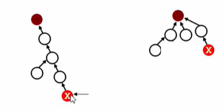

说到这，有一个问题来了：为什么我非要做路径压缩不可呢？我不做路径压缩又会怎么样？好像我们使用了路径压缩也并没有使得代码变得很快，这是为什么呢？回忆一下，在我们将路径压缩之前，如果我只按秩归并的话，最坏情况下树的高度是logN，于是我如果设计一组测试数据，每次都去查询树最深的一个节点，反复查询这个结点N次，那么整个的时间复杂度就是NlogN，如果我们做了数据压缩以后，情况会变成什么样呢？我们有这样一个引理。

这个引理就讲的是带路径压缩的查找和按秩归并这两件事情结合在一起并且交错执行它的最坏时间复杂度。我们假设查找的次数要大于等于合并的次数，这是一个比较自然的假设，因为我们合并之前总是要做两次find。这个不等式的意思是：最坏情况的时间复杂度差不多是M乘以一个α函数，α是一个函数，α函数和M、N都有关系，M乘以α函数即是最坏时间复杂度的上界也是下界。如果我们用渐进方式来表示的话，这就是一个θ关系。那么α函数到底是什么呢？α函数和Ackermann函数有关系。Ackermann函数是一个很有趣的函数，它可以以飞快的速度增长到很大很大。但是α不是这么大的函数，α是最小的i，i要满足的性质是使得Ackermann函数大于logN。由Ackermann函数来看要让它大于logN根本不是一件困难的事情。换句话说对于很小的i我们很容易让这个不等式得到满足，而α函数是所有满足这个条件的i里面最小的那个，也就是说α函数不是一个很大的数。另一方面，数学家为我们证明了红色部分的不等式。就实际意义来讲α函数一般不会超过4.

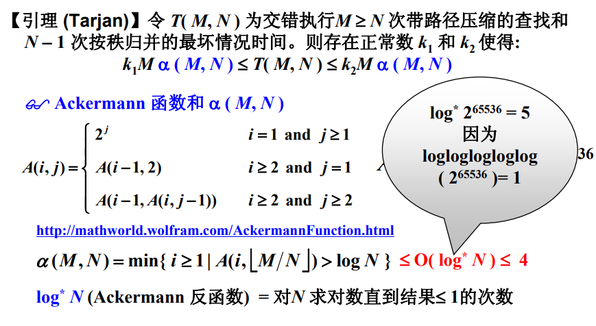

其实做路径压缩和不做路径压缩，它的根本区别就是在我查找的次数M前面，我到底是要乘以一个常数还是要乘一个logN的问题。logN是N的一个递增函数，所以当N无穷大，logN也无穷大。而常数是不会变的。所以从理论上来讲，做路径压缩当然从效率上来讲是要比不做路径压缩来的快的，在N充分大的时候，但是就我们这道题目来说，N只有10的四次方这么大，所以logN其实是一个很小的数字，所以从这道题比不出他们的优劣的。为什么不把N取大一点？如果这道题只是想卡C语言代码的是很容易的，可以把N在提高两个数量级，变成10的六次方，差不多就可以看出来两种代码的效率是不一样的，问题是我这个测试数据对所有的编程语言来做的，比如说Java语言，有一句话“当C家的蜗牛都绕地球N圈了，Java还没有读完输入”，也就是说如果我把N变成10的六次方的话，对于像Java这一类的编程语言，它光处理输入输出的时间就被埋没了执行整个算法的时间，所以这道题的测试数据要想充分体现路径压缩的优势是很难的。


# 图

## 什么是图

图在第一讲的时候提到过，在书店里，如果除了想摆书之外，还想统计一下每一本书有什么人买，买这些书的人还买过什么书，这时候我们就需要建立一种多对多的关系，这种工具就叫做图。图在现实生活中有很多应用，例如社交网络，在社交网络中我们每个人占一个顶点，顶点和顶点之间的边它代表的是什么关系？你可能会说那是网线--这太具体了，稍微抽象一点来说其实图里面任何两个顶点之间的边表示的是，这两样东西之间的某种关系。所以当我们的顶点是人的时候，这条边当然可以代表网线，如果他们是用网络连接的话。从另外一个角度讲，这个边其实也可以代表任何人之间的某种关系，可以是朋友关系也可以是敌对关系，只要他们之间有一种关系，他们之间就可以定义一条边来表示。着这个社交网络中，我们有一个有趣的理论---六度空间理论（Six Degree Of Separation）。这个理论讲的是，在任何两个人之间，他们可以通过不超过六个人来认识，比如说你和任意一个陌生人，你们一开始是不认识的，但是你们朋友的朋友可能有一个共同的朋友。这个理论听起来很神奇，到底是不是这样呢？在很小的关系图里我们很容易可以知道，但是如果是全球互联网呢？全球互联网大概有三十亿，这时候必须得有一个程序来解决这个问题。另外，图还有很多其它的应用，比如说，如果我们想要找从陈家庄到张家村最最短路径，这其实就是图论中一个非常经典的最短路径问题。还有如果要修路，我们如何画最少的钱，把村子连通呢，这也是图论里一个非常经典的最小生成树问题。回过来说到底什么是图呢？图表示的是一种多对多的关系，之所以说它强大，是因为它把线性表和树全部包含在里面了。我们知道线性关系表示一对一的关系，树表示一对多的关系，其实线性表和树全部都可以认为是图的一个特殊情况。


当我们要描述一个图的时候，有两件事情一定要清楚，第一件事情，是它的顶点---图一定包含一组顶点。顶点的集合我们通常用V（vertex）来表示顶点的集合。也就是说在这个城镇里我们可以把每一个村庄看成是一个结点；一组边我们通常用E（Edge）来表示边的集合，它表示的是顶点和顶点之间的某种关系。所以我们通常用顶点对来表示一条边，如果这条边是无向边，也就是无所谓方向，如果可以从v走到w，我们就假设一定也可以从w走到v，也就是说这条道路是双向道路，这个时候这个边用圆括号来表示。于此相对的，如果这是一条单行线，只可以从v走到w。不可以从w走回来的话，那么我们就叫他有向边，有向边是用一对尖括号来表示的；另外当我们在说到图的时候，我们是不考虑重边和自回路的，重边就是两个顶点之间，如果是无向边的话，我们默认它只有一条，不可能有很多条。自回路就是当我们说到有向边的时候，它一个从一个顶点指向另一个顶点，不可能只回自己。

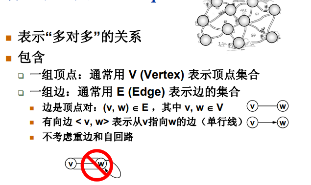

## 抽象数据类型定义

下面是抽象数据类型定义。三要素，类型名称--图。数据对象集：一个图G（V，E）由一个**非空**的有限顶点集合V，和一个有限边集合E组成。注意看这个顶点集合是非空的，也就是在我们提到图的时候它可以一个边都没有但是不能一个顶点都没有，它必须至少有一个顶点。操作集就有很多了：图相应的由一个很庞大的操作集，在这里我们只列举几个常见的。

```c
类型名称：图（Graph）
 数据对象集：G(V,E)由一个非空的有限顶点集合V和一个有限边集合E组成。
 操作集：对于任意图 G∈Graph，以及 v∈V, e∈E
 Graph Create()：建立并返回空图；
 Graph InsertVertex(Graph G, Vertex v)：将v插入G；
 Graph InsertEdge(Graph G, Edge e)：将e插入G；
 void DFS(Graph G, Vertex v)：从顶点v出发深度优先遍历图G；
 void BFS(Graph G, Vertex v)：从顶点v出发宽度优先遍历图G；
 void ShortestPath(Graph G, Vertex v, int Dist[])：计算图G中顶点v到任意其他顶点的最短距离；
 void MST(Graph G)：计算图G的最小生成树；
```

## 常见术语

1. 如果一个图里面所有的边都是无所谓方向的，那么我们叫它**无向图**

2. 图里面的边有可能是双向的也有可能是单项的，总之方向对它来说很重要，这样的图叫做**有向图**

3. 如果在每一条边上我们还给了一个数字，我们叫做**权重**。权重可以有各种各样现实中的意义，比如说我们把这个数字就定义为这条路线的长度，有带权重的这样的图我们有另外一个名字管它叫**网络**。

4. 有直接的边跟它相连的顶点，叫做这个点的**邻接点**

5. **度**：跟这个结点相关的所有边的个数

   **出度**：从这个点发出的所有边的个数叫做出度。

   **入度**：指向这个点的所有边的个数叫做入度。

6. **稀疏图**：点很多相对来说边很少。

   **稠密图**：不是稀疏图就是稠密图了。

7. **完全图**：给了你n个节点，任意两个节点之间都有一条边，也就是边数达到极大的一个图。

8. **连通**：如果从 V 到 W存在一条（无向）路径，则称 V 和 W是连通的。

9. **路径** ： V 到 W的路径是一系列顶点{V, v 1, v 2, …,  v n, W}的集合，其中任一对相邻的顶点间都有图 中的边。路径的长度是路径中的边数（如果带权，则是所有边的权重和）。如果 V 到 W之间的所 有顶点都不同，则称简单路径。

10. **回路**：起点等于终点的路径。

11. **连通图**：图中任意两顶点均连通。

12. **连通分量**：无向图的极大连通子图

     极大顶点数：再加 1个顶点就不连通了

     极大边数：包含子图中所有顶点相连的所有边

13. **强连通**：有向图中顶点 V 和 W之间存在双向路 径，则称 V 和 W是强连通的

14. **强连通图**：有向图中任意两顶点均强连通

15. **强连通分量**：有向图的极大强连通子图

## 如何在程序中表示一个图

前面我们说了一些抽象的图的概念，接下来就是有趣的部分。我们要写程序，去实现图相关的算法，第一件重要的事情就是我们如何把图在程序中表示出来。在这里我们介绍两个最基本的表示法。

#### 邻接矩阵

第一种最简单的表示法就是邻接矩阵表示法。什么是邻接矩阵呢？我们是用一个二维数组去表示一个图，如果我们有n个节点的话，我们假设顶点是从0-n-1来编号的。于是表示他们的边有一个直截了当的做法，如果从vi到vj有一条边的话（这边默认是有向边，无向边对称位置也为1即可），我们就让Gij为1，如果没有边的话它就是零。观察邻接矩阵有什么规律？首先它的对角线上全为0，因为没有自回路。还有一个特点就是这个矩阵它是对称的，我们发现在这个图中，我们把一条边存了两次（这里的图是无向图）。所以问题就来了，对于一个无向图的存储（有向图不一定是对称的，不能节省一半空间），显然有一半空间是被浪费掉的，如何才可以省一半的空间？

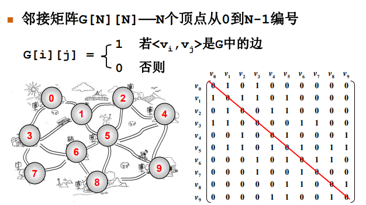

这里我们用的技巧是用一个一维数组去存下三角矩阵的元素，存法是按行来的，用一个长度是n*（n+1）/2的一维数组存储。这样空间节省了，但是元素变得不好找了，如果是按照原来的二维数组的存法，我们只需要去看一下Gij对应的位置上值为多少就能确定i和j之间有没有边。现在Gij被藏在A数组中，很简单：1+2+····+n+j。

对于网络来说，我们顶点之间不仅有边而且那条边上还有一个权重，很简单的解决方法就是我们把Gij的值不是定义为1而是定义为边的权重即可。

这里有一个问题，如果vi和vj在网络中如果没有边的话应该如何表示，我们说在一个无权的无向图中，如果没有边的话是用0来表示的，对于网络来讲，也是直接用0来表示吗？那可不一定，这个问题不是很好回答。-----回答待续。。。。

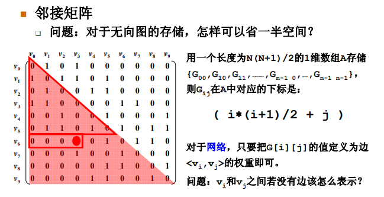

###### 特点

现在我们知道了一个图可以用一个邻接矩阵来表示，这种表示方法有什么好处呢？

1. 一个非常显然的好处就是直观、简单、好理解。
2. 另外一个好处：方便检任意一堆节点间是否存在边。
3. 除此之外，我们还方便找任意顶点的所有邻接点（有边直接相连的点）。于是我们要如果通过邻接矩阵来找和它相连的所有邻接点呢？对于无向图来说，我只要沿着这个矩阵的一行扫描过去，所有不是零的哪些顶点，就一定是有边跟它直接相连的。对于有向图来说，这个邻接矩阵不一定是对称的，所以我们不仅要扫描它的一行，我们还有扫描它的一列，才能够找到所有跟它有直接边相连的哪些邻接点。
4. 另外我们还方便计算任何一个顶点的度。什么叫度，就是跟这个结点相关的所有边的个数，对于有向图来说，还有两个概念，一个叫出度，一个叫入度，从这个点发出的所有边的个数叫做出度。指向这个点的所有边的个数叫做入度。我们怎么样计算任意一个结点的度呢？对于无向图来说，它对应的是或者扫描一行或者扫描一列的非零元素的个数，把它所有的1加起来就是它的度了。对于有向图来说，什么是它的出度---对应这一行的所有的非零元素的个数。也就是扫描第i行所有1的个数，就是从第i个节点发出的所有的边的个数，也就是出度。同理扫描第i列所有非零元的个数就是入度。
   - 无向图:对应行（或列）非o元素的个数
   - 有向图:对应行非o元素的个数是“出度”﹔对应列非o元素的个数是“入度”

前面我们说了邻接矩阵的好，那么它有什么缺点吗？

我们来想象这样的一种情况，就是在这个图里我们有很多很多的节点，但是一共只有两条边，你用这个邻接矩阵存的时候矩阵就有一大堆的0.所以在这种情况下它是非常浪费空间的。在存稀疏图（点很多相对来说边很少）的时候很浪费空间。但是如果你的图不是稀疏图，特别是完全图，还是比较合算的。如果这一个图它是稀疏图的话，它浪费的就不仅仅是空间了，它还浪费了时间。比如说我要统计这个稀疏图里一共有多少条边，那用邻接矩阵要怎么做呢？不得不把矩阵里面所有的元素都扫描一遍，然后数它到底有多少个1，但是问题是它1又很少，这样就它浪费的不仅仅是空间而且是时间。

1. 浪费空间一存稀疏图（点很多而边很少)有大量无效元素
   对稠密图（特别是完全图)还是很合算的
2. 浪费时间—统计稀疏图中一共有多少条边

###### 代码

```c
/* 图的邻接矩阵表示法 */

##define MaxVertexNum 100    /* 最大顶点数设为100 */
##define INFINITY 65535        /* ∞设为双字节无符号整数的最大值65535*/
typedef int Vertex;         /* 用顶点下标表示顶点,为整型 */
typedef int WeightType;        /* 边的权值设为整型 */
typedef char DataType;        /* 顶点存储的数据类型设为字符型 */

/* 边的定义 */
typedef struct ENode *PtrToENode;
struct ENode{
    Vertex V1, V2;      /* 有向边<V1, V2> */
    WeightType Weight;  /* 权重 */
};
typedef PtrToENode Edge;
       
/* 图结点的定义 */
typedef struct GNode *PtrToGNode;
struct GNode{
    int Nv;  /* 顶点数 */
    int Ne;  /* 边数   */
    WeightType G[MaxVertexNum][MaxVertexNum]; /* 邻接矩阵 */
    DataType Data[MaxVertexNum];      /* 存顶点的数据 */
    /* 注意：很多情况下，顶点无数据，此时Data[]可以不用出现 */
};
typedef PtrToGNode MGraph; /* 以邻接矩阵存储的图类型 */


MGraph CreateGraph( int VertexNum )
{ /* 初始化一个有VertexNum个顶点但没有边的图 */
    Vertex V, W;
    MGraph Graph;
    
    Graph = (MGraph)malloc(sizeof(struct GNode)); /* 建立图 */
    Graph->Nv = VertexNum;
    Graph->Ne = 0;
    /* 初始化邻接矩阵 */
    /* 注意：这里默认顶点编号从0开始，到(Graph->Nv - 1) */
    for (V=0; V<Graph->Nv; V++)
        for (W=0; W<Graph->Nv; W++)  
            Graph->G[V][W] = INFINITY;
            
    return Graph; 
}
       
void InsertEdge( MGraph Graph, Edge E )
{
     /* 插入边 <V1, V2> */
     Graph->G[E->V1][E->V2] = E->Weight;    
     /* 若是无向图，还要插入边<V2, V1> */
     Graph->G[E->V2][E->V1] = E->Weight;
}

MGraph BuildGraph()
{
    MGraph Graph;
    Edge E;
    Vertex V;
    int Nv, i;
    
    scanf("%d", &Nv);   /* 读入顶点个数 */
    Graph = CreateGraph(Nv); /* 初始化有Nv个顶点但没有边的图 */ 
    
    scanf("%d", &(Graph->Ne));   /* 读入边数 */
    if ( Graph->Ne != 0 ) { /* 如果有边 */ 
        E = (Edge)malloc(sizeof(struct ENode)); /* 建立边结点 */ 
        /* 读入边，格式为"起点 终点 权重"，插入邻接矩阵 */
        for (i=0; i<Graph->Ne; i++) {
            scanf("%d %d %d", &E->V1, &E->V2, &E->Weight); 
            /* 注意：如果权重不是整型，Weight的读入格式要改 */
            InsertEdge( Graph, E );
        }
    } 

    /* 如果顶点有数据的话，读入数据 */
    for (V=0; V<Graph->Nv; V++) 
        scanf(" %c", &(Graph->Data[V]));

    return Graph;
}
```


#### 邻接表

我们前面知道了邻接矩阵在表示稀疏图的时候是很不方便的，它比较浪费，不仅浪费空间，而且浪费时间。为了解决这个问题，我们就有了另外一种表示方法，叫做邻接表。邻接表是一个链表的集合，我们先定义一个指针数组，对应每一个节点。一个指针对应矩阵的是--我们把每一行非零元素存成一个链表，这样如果有大量的零的话，那些0全部都不会出现在链表里，想通过这个来节省空间。于是我们再来看一个例子，还是我们刚才的这个小城镇，如何用邻接表去存呢？

邻接表：G[N]为指针数组，对应矩阵每行一个链表， 只存非 0元素

注意邻接表的表示法是不唯一的，因为在一串上，后面几个节点以什么顺序出现都是无所谓的。但是如果你去数一下这个图一共占了多少空间的话，你会发现它并不是很省。因为在我们邻接矩阵的表示法里，每一条边都是占了一个整数的位置，而在这里，每一条边都会在两边存一次，例如59相连，5这里会有9,9里面也会有5。所以每一条边我们必定会存两边。而且在存一条边的时候我们不仅仅存了结点的编号，我们还要存它指向的下一个节点的编号，相当于一条边我们占了差不多两个整数，而且对于网络来说结构中还要增加存放权重的域。权重这个问题在邻接矩阵中的解决方案只要把1变成矩阵。所以综上，如果我们用邻接表的话，这个图一定要足够稀疏才划算！！

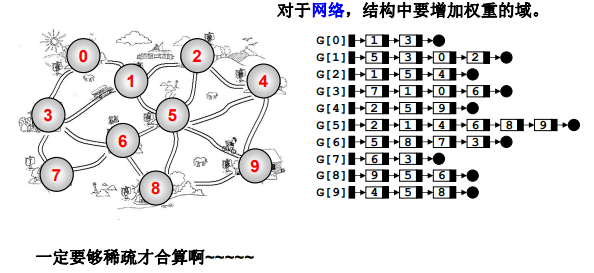

###### 特点

首先是非常方便来找任意节点所有邻接点，要找vi的所有邻接点，我只需要顺序Gi链表一直走下去，就把它所有的邻接点都访问了。途中没有访问到任何不必要的零点。我们做邻接表的目的就是为了节约稀疏图的存储空间，但是我们需要去看一下，整个邻接表占了多大的空间，我们需要N个头指针，每条边存两边，也就需要2E个节点，每个节点不考虑权重至少两个域，所以我们的问题就是到底这个图要多稀疏才是合算的。下一个问题就是我们是否方便计算任意一个顶点的度，这取决于我们在说一个什么图，如果对于无向图来说，yes，我们只要访问那个顶点所代表的那个链表，然后数一下这个链表上一共串了多少个边，我们就知道度是多少了。但是对于有向图来说这就是一个很麻烦的事情了，因为串在vi对应的那条链表上面，只是从vi往外指的，只能得到出度。如果还要计算入度的话，我们就需要构造一个逆邻接表（存指向自己的边），正邻接表是邻接矩阵的每一行存成了一个链表，逆邻接表就是把邻接矩阵的每一列再存成一个链表，相应的这一列存的就是指向它自己的边，这样才能够比较方便的计算入度。最后一个问题：是否方便检查任意一对顶点间是否存在边？对于邻接表来说很不幸，是一个非常麻烦的问题。在这还有一个问题要讲明白：虽然我们介绍了两种表示图的方法，大多数的教科书上也都是介绍的是这么两种表示的方法，但是这并不意味着，表示一个图，只能用邻接矩阵或者是邻接表。实际上对于图的表示，很很多种五花八门的方法，它取决你要解决的那个具体的问题。

1. 方便找任一顶点的所有“邻接点”
2. 节约稀疏图的空间
   - 需要N个头指针＋2E个结点（每个结点至少2个域)
3. 方便计算任一顶点的“度”?
   - 对无向图:是的
   - 对有向图:只能计算“出度”;需要构造“逆邻接表”（存指向自己的边)来方便计算“入度”
4. 方便检查任意一对顶点间是否存在边?
   No

###### 代码

```c
/* 图的邻接表表示法 */

##define MaxVertexNum 100    /* 最大顶点数设为100 */
typedef int Vertex;         /* 用顶点下标表示顶点,为整型 */
typedef int WeightType;        /* 边的权值设为整型 */
typedef char DataType;        /* 顶点存储的数据类型设为字符型 */

/* 边的定义 */
typedef struct ENode *PtrToENode;
struct ENode{
    Vertex V1, V2;      /* 有向边<V1, V2> */
    WeightType Weight;  /* 权重 */
};
typedef PtrToENode Edge;

/* 邻接点的定义 */
typedef struct AdjVNode *PtrToAdjVNode; 
struct AdjVNode{
    Vertex AdjV;        /* 邻接点下标 */
    WeightType Weight;  /* 边权重 */
    PtrToAdjVNode Next;    /* 指向下一个邻接点的指针 */
};

/* 顶点表头结点的定义 */
typedef struct Vnode{
    PtrToAdjVNode FirstEdge;/* 边表头指针 */
    DataType Data;            /* 存顶点的数据 */
    /* 注意：很多情况下，顶点无数据，此时Data可以不用出现 */
} AdjList[MaxVertexNum];    /* AdjList是邻接表类型 */

/* 图结点的定义 */
typedef struct GNode *PtrToGNode;
struct GNode{  
    int Nv;     /* 顶点数 */
    int Ne;     /* 边数   */
    AdjList G;  /* 邻接表 */
};
typedef PtrToGNode LGraph; /* 以邻接表方式存储的图类型 */


LGraph CreateGraph( int VertexNum )
{ /* 初始化一个有VertexNum个顶点但没有边的图 */
    Vertex V;
    LGraph Graph;
    
    Graph = (LGraph)malloc( sizeof(struct GNode) ); /* 建立图 */
    Graph->Nv = VertexNum;
    Graph->Ne = 0;
    /* 初始化邻接表头指针 */
    /* 注意：这里默认顶点编号从0开始，到(Graph->Nv - 1) */
       for (V=0; V<Graph->Nv; V++)
        Graph->G[V].FirstEdge = NULL;
            
    return Graph; 
}
       
void InsertEdge( LGraph Graph, Edge E )
{
    PtrToAdjVNode NewNode;
    
    /* 插入边 <V1, V2> */
    /* 为V2建立新的邻接点 */
    NewNode = (PtrToAdjVNode)malloc(sizeof(struct AdjVNode));
    NewNode->AdjV = E->V2;
    NewNode->Weight = E->Weight;
    /* 将V2插入V1的表头 */
    NewNode->Next = Graph->G[E->V1].FirstEdge;
    Graph->G[E->V1].FirstEdge = NewNode;
        
    /* 若是无向图，还要插入边 <V2, V1> */
    /* 为V1建立新的邻接点 */
    NewNode = (PtrToAdjVNode)malloc(sizeof(struct AdjVNode));
    NewNode->AdjV = E->V1;
    NewNode->Weight = E->Weight;
    /* 将V1插入V2的表头 */
    NewNode->Next = Graph->G[E->V2].FirstEdge;
    Graph->G[E->V2].FirstEdge = NewNode;
}

LGraph BuildGraph()
{
    LGraph Graph;
    Edge E;
    Vertex V;
    int Nv, i;
    
    scanf("%d", &Nv);   /* 读入顶点个数 */
    Graph = CreateGraph(Nv); /* 初始化有Nv个顶点但没有边的图 */ 
    
    scanf("%d", &(Graph->Ne));   /* 读入边数 */
    if ( Graph->Ne != 0 ) { /* 如果有边 */ 
        E = (Edge)malloc( sizeof(struct ENode) ); /* 建立边结点 */ 
        /* 读入边，格式为"起点 终点 权重"，插入邻接矩阵 */
        for (i=0; i<Graph->Ne; i++) {
            scanf("%d %d %d", &E->V1, &E->V2, &E->Weight); 
            /* 注意：如果权重不是整型，Weight的读入格式要改 */
            InsertEdge( Graph, E );
        }
    } 

    /* 如果顶点有数据的话，读入数据 */
    for (V=0; V<Graph->Nv; V++) 
        scanf(" %c", &(Graph->G[V].Data));

    return Graph;
}
```


## 图的遍历

遍历这个词在图里面的意思和在树里面的意思是一样的，图的遍历就是指把图里面每一个顶点都访问一次，而且不能有重复的访问。首先一个问题就是说我们干嘛要做这件事？不要小看，这件事看上去非常简单，它可以用来解决很多有意思的问题，后面会用例子给大家说明，为什么我们需要对图做遍历。在这先介绍两种非常典型的遍历的方法，dfs和bfs。

#### 深度优先搜索(Depth First Search, DFS)

所谓DFS，它指的是深度优先搜索，我们要讲清楚深度优先搜索是怎么做的，可以先通过一个迷宫的例子来看一下，假设我们有这样一个迷宫，这个迷宫在各个拐角处都有一些灯泡，你要去一个个把他们点亮，假设给定了你迷宫的入口，当然先把入口的灯泡点亮了，站在这个入口我要去点亮下一栈灯我要怎么想呢？

我站在路口看，我有三盏灯是我直接视力范围内可以看到的。我挑一盏灯先把它点亮，例如我挑了这盏灯。

于是我人现在站在这里可以看到两盏灯，其中一盏灯已经点亮了，还有一盏灯没有亮，那我走下去把这盏灯点亮

同样的站在这个路口，我可以发现下面有一盏灯可以点亮，我接着又去把那盏灯点亮。

在这个路口我选择就多了，我有三盏灯可以选，我选了其中一盏灯，假如我先往上走

走到这的时候发现还有一盏灯没有点亮，去把它点亮

点亮之后，我在这个位置，发现所有可以看到的灯都已经亮了，怎么办呢？原路返回，退到上一个路口

同样的，退到这个路口发现，我能看到灯也是全都亮了，这时候我也看到了出口，我是不是就可以从这直接出去了呢？千万不能，因为还有两盏灯没有点亮呢！但是我怎么知道点亮了还是没有呢？我不知道，为了保险起见，任何时候，在我视力范围内如果所有灯都亮了，我都要原路返回

原路返回到这个地点的时候会发现，还有两盏灯没亮，我就选其中一条走过去把它点亮

接着再走过去点亮另外一盏灯

点亮这盏灯的时候同样的道理，我视力范围内能看到的灯都已经点亮了，而且我看见出口了，我能从这直接出去吗？不行！因为你不知道还有没有其它的灯没有点亮，所以为了保险起见，你不可以从任何一个结点直接出去，一定要原路返回，原路返回一路的返回，直到你返回到了出口，才可以很放心的说这个迷宫里的灯已经全部点亮了。刚才演示的就是一个深度优先搜索的过程。这里头我们注意到有一个特点，当它访问完了一个节点所有的灯以后，它一定是原路返回的，原路返回的这个行为对应的是什么呢？在程序里面，它其实就对应的是一种堆栈，出栈的这么一个行为。

下面是深度优先算法的伪代码描述，我从给定的一个迷宫的入口进来，第一件事情就是我要给每一个结点定义一个变量，叫做visited，也就是说访问，visited为true的时候相当于是我把这盏灯点亮了。所以我访问到这个结点的时候，我先把它的灯点亮，然后对于v的每个邻接点w，也就是站在v这个位置，放眼一看可以看到的那些灯，如果这个灯还没有被点亮的话，那么我走到这栈灯的位置，递归的调用DFS，当我递归的去对w调用DFS的时候，我也是先把这盏灯点亮，然后站在w的位置上去找每一个邻接点，如果还有没有点亮的我再过去递归的把它点亮，如果所有邻接点的灯都点亮了，会发生什么事情呢？那我这个DFS的调用就结束了，我要返回上一层，返回上一层对应的就是我们的原路返回的过程，那说到这，这个程序看上去很眼熟呢？如果去想一下树的遍历，这个实际上是树的先序遍历。整个DFS实际上是树先序遍历的一个推广

类似于树的先序遍历：

```c
void DFS ( Vertex V ) 
{ 
    visited[ V ] = true; 
    for ( V 的每个邻接点 W )
    if ( !visited[ W ] )
    DFS( W );
}
```

接下来的问题就是：如果给定的这个图里有n个顶点，e条边，那么dfs的时间复杂度是多少？其实这时候问时间复杂度这个问法不科学，时间复杂度却绝于图在你的算法里是怎么表示的。如果我是用邻接表来存储的，那么v的每一个邻接点我只需要访问v对应的那条链表一个一个访问过去即可，链表上面邻接点的总个数实际上是等于它的边数的两倍（因为这边是无向图，每一条边被存了两次）。总的时间复杂度应该是对于每一个结点访问了一次，然后每条边访问了一次，所以是O（N+E）这个复杂度。如果我们用邻接矩阵来存储，那么当我们说v的每一个邻接点的时候，实际上我们是需要把这个邻接矩阵对应v的一整行n个顶点全部都要访问一遍（列就不需要了，因为这边是无向图），我才知道哪个是它的邻接点，所以整个的复杂度是n里面套了一个n，所以是O（n²）。

若有 N个顶点、 E条边，时间复杂度是：用邻接表存储图，有O(N+E)；用邻接矩阵存储图，有O(N 2)。

###### 代码--邻接表存储DFS	

```c
/* 邻接表存储的图 - DFS */

void Visit( Vertex V )
{
    printf("正在访问顶点%d\n", V);
}

/* Visited[]为全局变量，已经初始化为false */
void DFS( LGraph Graph, Vertex V, void (*Visit)(Vertex) )
{   /* 以V为出发点对邻接表存储的图Graph进行DFS搜索 */
    PtrToAdjVNode W;
    
    Visit( V ); /* 访问第V个顶点 */
    Visited[V] = true; /* 标记V已访问 */

    for( W=Graph->G[V].FirstEdge; W; W=W->Next ) /* 对V的每个邻接点W->AdjV */
        if ( !Visited[W->AdjV] )    /* 若W->AdjV未被访问 */
            DFS( Graph, W->AdjV, Visit );    /* 则递归访问之 */
}
```


#### 广度优先搜索(Breadth First Search, BFS)

广度优先搜索在树里面就相当于是一个层序遍历，所以我们先来回顾一下树的层序遍历。我们从根节点出发，然后从上到下从左到右一层层的访问这些节点（下面这课树的编号就是按照层序遍历访问的先后顺序），在程序实现的时候我们借助了队列，首先把1号入队，当把它（1号）弹出的时候，我们会把它的左右孩子（2/3号）继续入队然后在把2弹出的时候继续把它的左右孩子（4/5）入队，以此类推。

那么在图里面我们如何实现？树是一种特殊的图，那么在图里面我们需要指定一个起点，这个顶点就是我们的初始点，第一件要做的事情仍然是把它入队，然后进入队列的循环，把它弹出来的时候就循序的把直接和它有边相连的这些点一一入队。下一轮就会从队列中弹出2，然后继续把和2直接相连的顶点一一入队，以此类推，我们把下一层也按照这样的顺序来访问，这就是广度优先搜索。程序和树的层序遍历差不多。

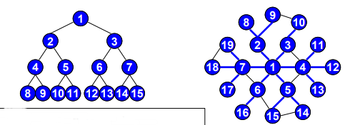

下面是伪代码表述的BFS的模板。我从一个给定的顶点V出发（Vertex V），我先把它标记为访问过，然后把它压到队列（Enqueue）里。然后进入一个while循环，每一次循环里头我从队列里弹出一个结点（Dequeue），然后在for循环里把它的每一个邻接点，如果邻接点没有被访问过（也就是还没有标记过），那么我就先去访问它然后把它入队，这就是一个BFS的过程。

```c
void BFS ( Vertex V ) 
{ 
    visited[V] = true;
    Enqueue(V, Q);
    while(!IsEmpty(Q)){
        V = Dequeue(Q); 
        for ( V 的每个邻接点 W )
        if ( !visited[W] ) {
            visited[W] = true;
            Enqueue(W, Q);
        }
    }
}
```

那么问题来了，如果给N个顶点，E条边，时间复杂度是多少？答案和DFS是一样的。如果我们用邻接表去存图的话，那么会发现，每一个顶点入列一次，所以一共有n个顶点，所以我们这一共有n步，在这里头v的每一个邻接点都被访问一次，也就意味着每条边都被访问一次，所以总体的时间复杂度是n+e。同样，如果我们用邻接矩阵来存访问v的每一个邻接点是比较耗时的（for ( V 的每个邻接点 W )），这一步要扫描所有的n个节点。

若有 N个顶点、 E条边，时间复杂度是：用邻接表存储图，有O(N+E)；用邻接矩阵存储图，有O(N 2)。

###### 代码--邻接矩阵存储BFS

```c
/* 邻接矩阵存储的图 - BFS */

/* IsEdge(Graph, V, W)检查<V, W>是否图Graph中的一条边，即W是否V的邻接点。  */
/* 此函数根据图的不同类型要做不同的实现，关键取决于对不存在的边的表示方法。*/
/* 例如对有权图, 如果不存在的边被初始化为INFINITY, 则函数实现如下:         */
bool IsEdge( MGraph Graph, Vertex V, Vertex W )
{
    return Graph->G[V][W]<INFINITY ? true : false;
}

/* Visited[]为全局变量，已经初始化为false */
void BFS ( MGraph Graph, Vertex S, void (*Visit)(Vertex) )
{   /* 以S为出发点对邻接矩阵存储的图Graph进行BFS搜索 */
    Queue Q;     
    Vertex V, W;

    Q = CreateQueue( MaxSize ); /* 创建空队列, MaxSize为外部定义的常数 */
    /* 访问顶点S：此处可根据具体访问需要改写 */
    Visit( S );
    Visited[S] = true; /* 标记S已访问 */
    AddQ(Q, S); /* S入队列 */
    
    while ( !IsEmpty(Q) ) {
        V = DeleteQ(Q);  /* 弹出V */
        for( W=0; W<Graph->Nv; W++ ) /* 对图中的每个顶点W */
            /* 若W是V的邻接点并且未访问过 */
            if ( !Visited[W] && IsEdge(Graph, V, W) ) {
                /* 访问顶点W */
                Visit( W );
                Visited[W] = true; /* 标记W已访问 */
                AddQ(Q, W); /* W入队列 */
            }
    } /* while结束*/
}
```


#### 为什么需要两种遍历

为什么需要有两种不同的遍历？所谓遍历，也就是把图里的每一个结点访问一次，那么我其实只需要知道其中一种就可以了，为什么需要知道两种？其实这两种遍历各有不一样的特点，他们的特点我们通过另外一个迷宫来演示

这个形状的迷宫在前面介绍堆栈的时候有展示。这种迷宫我们认为它是一个一个方格子构成的，黑色的格子就表示是走不通的，白的格子是走得通的。假设我们固定迷宫的入口在左上角，迷宫的出口我们把它定在一个很诡异的地方，然后我们来看一下BFS是如何解决这个问题的。

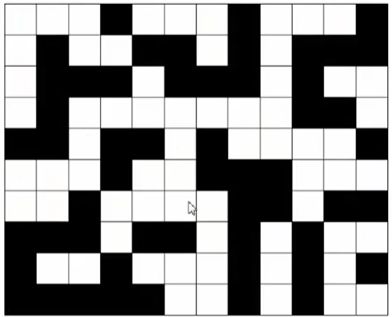

首先我们要知道什么叫图的节点，结点就是迷宫里面的每一个白格子，如果能从一个白格子直接走到下一个白格子那么我认为这两个顶点之间是由边的，当然我们在访问任意一个顶点相邻的这些邻接点的时候，我们得规定一个顺序，比如说我们规定一个不太聪明的顺序，我们每次都从它的最上方的那个格子开始考虑，然后顺时针的去考虑它周边的8个格子到底哪些是可以走通的。如果是这种情况的话，那么我们这位大侠走进了迷宫，第一步要往哪走？他发现上面（12点、一点半）走不通，那么他就往3点的方向走，走到这个格子以后递归的调用DFS。接着大侠会继续往3点钟方向走。继续递归，大侠往四点半的方向走。递归，往一点半的方向走。这里我们发现他已经进入死胡同了，但是他不知道。所以他还是回沿着这个方向一直走到死路无路可走，然后他发现进死胡同了，已经走不出去了，那么就只好一路返回。


返回到这里，他找下一条能走的路，他就往四点半的方向走了。递归，往四点半走。递归，往三点钟方向走。他又走错了，他在返回这个递归之前的所以递归都没办法走出去。但是他不知道，他会一直走，直到他把里面的路走遍了，发现自己走进死胡同了，才会回到这个递归。继续朝六点钟方向走。然后他又进了死胡同，然后又出来。接着往九点钟方向走才走出去。

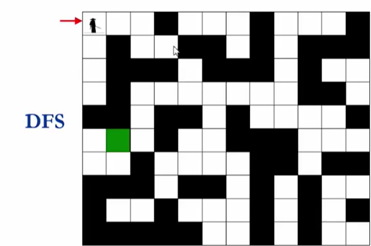

总之，我们用DFS来寻找出口我们需要走遍下面这么多的格子才能找到出口。

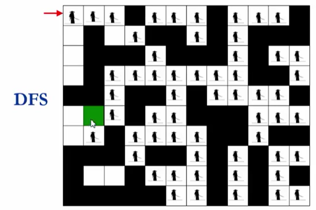

同样的一个迷宫，我们用BFS来是怎么解决问题的呢？因为它是广度优先搜索，所以它是一圈一圈的来找路径的。先把入口入队，弹出来以后把它相邻所有的白格子也进队，然后在弹出白格子的时候继续把白格子周围的白格子继续进队，所以BFS搜索过的路径是这样的一个情况。所以很明显的我们可以看到，在这个问题里，如果我们用广度优先会比深度优先搜素好很多。于是你要说了，那我一直都用广度优先搜索就好了，我还需要深度优先搜索干什么呢？其实这么说也是不公平的，这个问题里面广度优先搜索的表现好是因为迷宫的位置恰好设置的比较好。

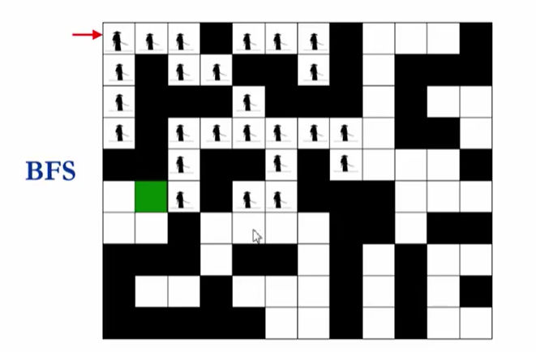

#### 图不连通怎么办？

前面我们讲了这两种图的遍历方法。要注意到，不管是哪种方法，它都是从一个节点出发，然后沿着某一条边往下走的，也就意味着它访问过的所有的节点互相之间都是有直接或者间接的边去连通的。如果这个问题里面，它有另外一个完全跟谁都不挨着的结点怎么办？他怎么能做到遍历呢？你如果用一次深度优先或者广度优先遍历，你肯定会丢掉一些孤立的结点，那么这就是我们的下一个问题，图不连通的时候怎么办？要想清楚这个问题，首先我们要知道什么是连通。

1. **连通**：如果从 V 到 W存在一条（无向）路径，则称 V 和 W是连通的。

   - 连通是一个很容易理解的概念，如果从 V 到 W存在一条路径的话，则称 V 和 W是连通的。于是这里头又有一个名词，什么是路径呢？

2. **路径** ： V 到 W的路径是一系列顶点{V, v 1, v 2, …,  v n, W}的集合，其中任一对相邻的顶点间都有图 中的边。路径的长度是路径中的边数（如果带权，则是所有边的权重和）。如果 V 到 W之间的所 有顶点都不同，则称简单路径。

   - 路径就指这从V到W中间有一系列的顶点，这个集合，我们来判断其中任意一对相邻的顶点之间都有图中的边，也就是说我可以从V出发，然后沿着图里面已经有的边，一个顶点一个顶点的走，最后我能够走到W。那这样的话就说V到W之间有这么一条路径。路径的长度就是路径中的边数，如果我们是在讲一个带权图，也就是一个网络的话，那么这个路径的长度就定义为所有边的权重的和。如果v到w之间所有的顶点都不同那么就称为简单路径。什么样的路径是不简单的呢？也就是说V到W这些顶点，如果有两个顶点是相同的话，这个路径就不简单了。那这样的路径是什么样的呢，就比如说我从V走到V1，然后走到V2，然后下一步我又走回来V1，这样它就形成了一个环

3. **回路**：起点等于终点的路径。

   - 上面说的环，学名就是回路，一个回路是指起点等于重点的这么一条路径。如果一个路径上有回路它就不是一个简单的路径了。

4. **连通图**：图中任意两顶点均连通。

   - 对于不连通的图我们仍然可以考虑它的部分连通的子图，这样的子图就叫连通分量

5. **连通分量**：无向图的极大连通子图

    极大顶点数：再加 1个顶点就不连通了

    极大边数：包含子图中所有顶点相连的所有边

   - 什么叫极大，什么东西极大，这里头有两个概念，一个是顶点数达到极大，也就意味着在这个连通分量里面，如果你再加一个顶点它就不连通了。所以连通分量它包含的是可以让它连通的所有的顶点全都包在里面；另外一个极大就是包含的边数达到极大，也就是说这个连通分量子图里面，所有的顶点相连的所有边都要包在里头，这才组成了一个完整的连通分量。来看一个例子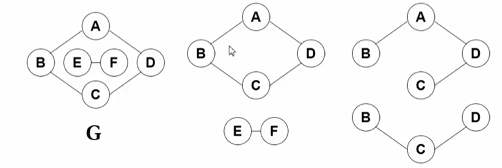

     这是我们给定的一个图G，它有多少个连通分量呢？或者问这个问题：我们给了这么四个子图，都是子图，所谓子图就是包含了G的一部分边和一部分顶点，这样叫做构成一个子图，那么在这四个子图里面，哪些是它的连通分量，哪些不是呢？我们可以看到，第一个是它的连通分量，首先它是G的一个子图，并且在这个图里面包含了四个顶点，如果我再加一个顶点进去，这个图就不连通了，所以这是所能达到的连通的最大顶点数，而且它包含了跟这四个顶点相关的所有的边，没有一条边被漏掉；同理e和f本身它也构成了另外一个连通分量；另外两个子图不是连通分量，一个它虽然包含了最大的顶点数，但是缺了一条边。另外一个更不对，因为它直接少了一个顶点。

     那我们在这说的连通分量，指的是无向图，对于有向图是什么概念呢？

     

6. **强连通**：有向图中顶点 V 和 W之间存在双向路 径，则称 V 和 W是强连通的

   - 对于有向图我们分强连通和弱连通，强连通是指的有向图中顶点v和w。之间存在双向的路径。也就是说我即可以从v走到w，又可以从w走到v，这两条往返的路径不一定是同一条，但是他们一定都存在，那么就称v和w是强联通的。

7. **强连通图**：有向图中任意两顶点均强连通

   - 于此相对的就有一个强联通图的概念，就是一个有向图，任意两个顶点都是强联通的。有强联通就有弱连通，什么是弱连通呢？也就是说他如果不是强联通的，但是我把这个图里面所有边的方向都抹去以后，把它变成无向图以后它就是连通的了，那么这样的图叫做弱连通图。

8. **强连通分量**：有向图的极大强连通子图

   - 同理，强联通分量就是有向图的极大连通子图。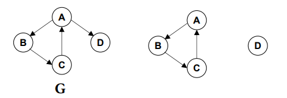

     在我们给的这个例子里头，它有几个强连通分量呢？两个。在第一个里面任意两个顶点之间都是强连通的。但是在第一个中再增加一个顶点它就不是强联通的了，因为a到可以到d但是d不能到a。所以d自己是一个单独的强联通分量，

实际上我们每调用一次dfs（v），就把v所在的连通分量遍历了一遍。BFS也是一样，只不过遍历的顺序不同。但是他们遍历的顶点都是一样的。那么也就是说每调用一次DFS，就访问了一个连通分量，如果这个图本身不连通，就意味着它有好多个不同的连通分量，在那个时候我如果想把所有的顶点都遍历一遍的话，我需要另外写一个程序来做这个事情。

其实解决方案很简单，这个程序名叫做 ListComponents，components就是分量的意思，就是我要把所有的分量都列出来。也就是说我对图里面的每一个顶点v，如果它没有被访问过，我就从它开始去调用DFS或者是BFS，那么我调用完DFS以后，整个跟它相连的连通分量里，所有的点都已经被访问过了，然后跳出来访问下一个没有被访问过的点V，然后继续调用DFS，就把另外一个连通分量又访问了一遍，用这种方法我们就可以把一个不连通图里面所有的顶点都访问一遍，

```c
void DFS ( Vertex V ) 
{ 
    visited[ V ] = true; 
    for ( V 的每个邻接点 W )
    if ( !visited[ W ] )
    DFS( W );
}

void ListComponents ( Graph G ) 
{ 
    for ( each V in G ) 
    if ( !visited[V] ) {
        DFS( V ); /*or BFS( V )*/
    }
}
```

## 应用实例--拯救007

前面学习了理论，现在来看看如何解决实际问题。电影中有一个情节，007被抓了，他们把007带到了一个湖心的孤岛上，他们把他押到岛上以后，这帮人就撤了，开始放鳄鱼。于是我们的问题是这样的。我们假设鳄鱼潭是一个湖心为原点，边长100的正方形池子。在湖心有一个小岛，小岛的直径也是给定的，007在这个岛上，在湖里分布着一群鳄鱼在向它逼近。假设这个时候007向你发送了一个求救信号，然后你赶紧从这个卫星图上确定了这些鳄鱼的位置，007要怎么做呢，他要做一个很大胆的举动，就是他朝着离他最近的鳄鱼直接跳上去，以这个鳄鱼为跳板再跳到下一个鳄鱼的头上。最后跳到岸上。这是他的策略，于是我们的第一个版本的问题是他先要你告诉他，根据现在鳄鱼的分布，他有没有可能跳到岸上。你只要回答他yes or no。

这是一个图的问题，我们之前说讲到一个图的时候，有两件事情必须确定，什么是图的节点呢？什么是图的结点呢？第二个问题：什么是图的边呢？我相信大多数人都会意识到，鳄鱼脑袋肯定是图里面的节点，但是肯定也有很多人忽略了岸边也是图里面的结点，尽管它看上去不像一个节点的样子。我们在说图的时候，说图是一个很抽象的概念，图的节点不一定非是一个圆头圆脑的东西，它可以是具有某种性质的一个对象。那么什么是图的边呢？图的边就是在我们这个问题里头我们说两头鳄鱼什么时候有关系呢？就是当007可以从一条鳄鱼跳到另外一条鳄鱼的时候，那这两条鳄鱼之间，就应该是会有一条边的，但是007不是跳着玩的，哪条鳄鱼能够和岸边这个结点拉上关系，那么这条鳄鱼和那个安全的岸就也是有边的。这样我们就建立了一个图，于是这个问题可以怎么解决呢？实际上就是一个图的遍历的应用。不管你用DFS，还是BFS，只要能在遍历的过程中发现有一条鳄鱼和这个岸边是有边的，就可以直接跳出去。然后告诉他说yes。

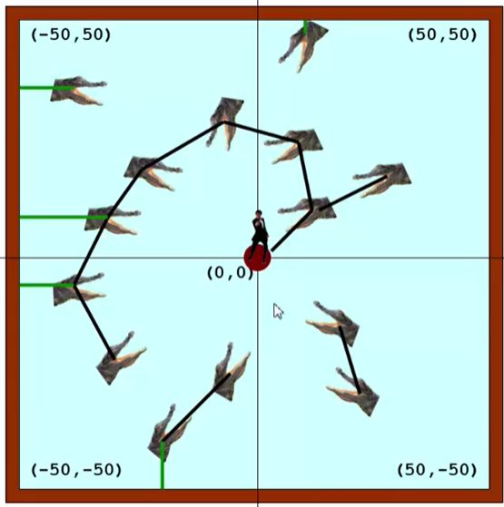

接下来我们可以把每一个鳄鱼的头看成一个点，于是当我们写程序要具体解决这个问题的时候，我们应该如何开始呢？第一步就是007要从这个孤岛上，向一个鳄鱼的头上去跳--往哪条鳄鱼的头上跳呢？换句话说也就是他和哪条鳄鱼有边呢？有边的话这个边又是如何建立起来的呢？这个问题很简单：也就是说007最多可以站在这个岛的边缘，向外跳一个单位，这个距离就是他能够跳跃的最大距离。所以我们以这个原点为圆心，半径是007的跳跃半径，加上孤岛的半径，以这个为半径画一个圆。然后看有哪些鳄鱼落在这个圆里。所以在程序里面实际上我们是扫描了一遍全体的鳄鱼。然后发现有一条落在圈里的鳄鱼，这就是我们的第一条可以踩的鳄鱼。所以它一跳就往这个鳄鱼的头上跳，虽然说我们是深度优先和广度优先都可以，但是从实现的角度讲显然是深度优先比较容易实现，也比较容易理解，那就是说我们跳到这条鳄鱼的头上，就开始以它为圆心，开始做DFS递归的去做下一件事情，下一个圆的半径就没有孤岛什么事了，这个圆的半径就是007自身可以跳跃的最大半径，以这个半径画一个圆，我们发现有两条鳄鱼落在他的跳跃范围，加入他先选择了这条，跳上去

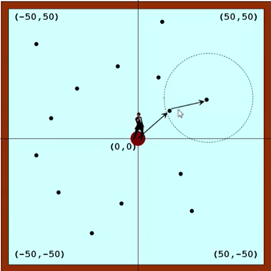


然后我们继续递归，继续以这条鳄鱼头尾圆心以007的跳跃半径画一个圆，在这个圆里面一检查发现此路不通。于是原路返回，去检查下一个他能够跳到的鳄鱼。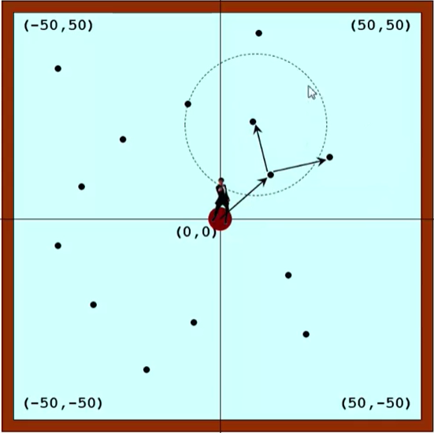

递归的调用这个鳄鱼的时候，我们继续画圆，（所谓递归的调用就是以鳄鱼为圆心画圆，找下一个可以跳的鳄鱼。一次递归就是把圆心移到下一个鳄鱼的头上），到什么时候为止呢？一直到我们找到这条鳄鱼的时候。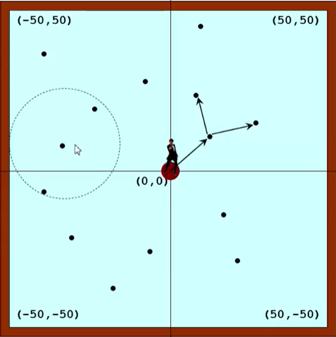

找到这条鳄鱼的时候我们发现，虽然他可以跳到第二个鳄鱼的头上，但是已经没有必要了，因为这个圆和岸边是有交的。所以可以直接跳上岸了。递归到这已经不需要继续了，我们可以直接跳出，返回yes。

#### 总体算法

当我们考虑总体算法的时候，这是不是只是一个简单的DFS呢？我们站在007的角度想问题：他的第一跳和其它的跳是不一样的，所以不方便把这一跳放在递归里一起处理，我们递归的时候基本上是一个重复的同样的过程，所以我们希望他跳跃的半径都是一样的，于是那个孤岛应该被作为一个特殊的结点来处理，在刚才我们那个图里，也就是007第一跳的范围里面只有一条鳄鱼，这个情况是比较简单的，但是更复杂一点的测试可能说在他第一跳的范围里有还几条鳄鱼是可以选择的，那每一条鳄鱼就对应了一个连通集，我们的关键就是要看那个连通集里有没有包含了安全的彼岸。所以我们的总体算法不是一个简单的DFS，而是相当于我们前一步实现的那个listcomponents，那个算法。

自己的理解：由于要保证递归的时候跳跃的半径是一样的，所以我们递归的结点不包括这个孤岛。也就是说我们没办法通过递归返回孤岛再去看第一次可以跳的其它鳄鱼。所以说我们就需要把第一次可以跳到的鳄鱼对应到若干个连通集，再来看能不能到达岸上。

下面是原始的算法，而我们拯救007的算法要在这个算法的基础上作一个改进

```c
void ListComponents ( Graph G ) 
{ 
    for ( each V in G ) 
    if ( !visited[V] ) {
        DFS( V );
    }
}
```

如何改？基本的大概的一个思路还是对G里面的每一个v如果没有visited（这里的visited是true就意味着007已经在这条鳄鱼的头上踩过一脚了），如果他还没有踩过一脚，那我们应该去做DFS，就是一脚踩上去。除此之外我们还需要做一个判断，其实我们的第一跳不仅是去看一看这个鳄鱼没有被踩过，而且要看一看007能不能够得着，所以这边的判断条件!visited[V]还需要再and一个FirstJump(V)来看看能不能跳的到。FirstJump(V)这个函数是什么意思呢？它的意思是007从孤岛上跳到V上有没有可能。如果FirstJump(V)这个函数返回是真的话，同时这条鳄鱼又没有被踩过，那么我们就跳上去DFS( V )。基本上到这里我们的问题就解决了，稍微有一个细节就是我们不仅要踩一遍这个鳄鱼，我们还得告诉007，yes or no。所以DFS在这里不能像以前那样，是一个void函数，它所需要返回一个结果，把这个结果放在answer里面。如果answer是yes，那么我们就不用往下了，我们直接break出来。跳出来判断如果answer是yes我们就告诉他yes。如果一直到所有的循环都做完了都没有出来，那么说明007没救了，告诉他no。

在这个伪码里面有两个很关键的函数要实现，一个是FirstJump，一个是DFS，

```c
void Save007 ( Graph G ) 
{ 
    for ( each V in G ) {
        if (!visited[V] && FirstJump(V)) {
            answer = DFS( V );
            if (answer==YES) break;
        }
    }
    if (answer==YES) output(“Yes”);
    else output(“No”);
}

```

#### DFS算法

这个DFS和我们经典的DFS有什么不一样？

```c
void DFS ( Vertex V ) 
{ 
    visited[V] = true; 
    for ( V 的每个邻接点 W )
    if ( !visited[W] )
    DFS(W);
}
```

上面是经典的DFS伪码，回顾一下，就是我们先一脚踩到鳄鱼的头上-visited[V] = true，踩了一脚表示我们访问过了，然后对v的每个邻接点w，在这个问题里什么是v的每个邻接点w呢？如果这条鳄鱼还没有被踩过的话，那么我就踩上去-DFS(W)。

下面是007DFS算法，首先第一件事情要把DFS的返回值变成int，我要返回一个answer。首先007一脚踩上去-visited[V] = true，之后他要做的一件事，不是要急着找下一条鳄鱼而是看看能不能直接到岸上，所以在找下一条鳄鱼之前我们首先要有一个函数IsSafe(V)，这个函数要做的事情就是要把v也就是这条鳄鱼的坐标传给你，你要告诉它从这个地方能不能直接上岸。能就返回真，不能就返回假。如果这个函数返回真的话，那么就不用往下跳了，直接就上岸了，直接令answer为1，接着就return回去了。如果不行才去看其它的鳄鱼，当然再看其它鳄鱼的时候- 在for ( each W in G )里面递归的时候我们要返回一个anser，如果这个anser在任何时候是等于yes，我们就break出来return。在这里还有一个问题，也就是什么叫v的每个邻接点w呢？也就是说什么样的w是和v直接有边的呢？这句话在我们这个问题里应该换成:如果这条鳄鱼还没有踩过，并且我们可以从v跳到这个w上，所以我们这里有一个jump函数，jump函数要解决的就是算一下v和w之间的距离，是不是小于等于007可以跳跃的最大距离，如果可以就返回真。在这里面我们扫描的是G里面的每一个W（其实也就是等价于找v的邻接点了，因为G里面的每一个满足条件的点事实上也就是V的邻接点了，V的邻接点就是007可以跳上去的点），如果可以跳上去就意味着它有边，就意味着w是V的一个邻接点，如果它还没有被访问过的话我们就进行DFS。最后还有一个问题，前面介绍了两种图的表示方法，一种是邻接矩阵，一种是邻接表，在这个问题里，用哪个好呢？或者是什么都不用？

可以每种方法都试一下，发现用邻接表去表示这个图，是很麻烦的。用邻接矩阵也是很麻烦的。所以其实一个图不一定非要用邻接矩阵或者是邻接表。怎么方便怎么表示即可，图只是一个抽象的概念，只是一个工具而已。

```c
int DFS ( Vertex V ) 
{ 
    visited[V] = true;
    if ( IsSafe(V) ) answer = YES;
    else { 
        for ( each W in G )
        if ( !visited[W] && Jummp(V,W) ) {
            answer = DFS(W);
            if (answer==YES) break;
        }
    }
    return answer;
}
```

## 六度空间（Six Degrees of Separation）

你和任何一个陌生人之间所间隔的人不会超过 六个

- 给定社交网络图，请对每个节点计算符合“六 度空间”理论的结点占结点总数的百分比

  也就是看看这个理论在多大程度上是合理的。

碰到这个问题我们应该怎么想？给任何一个节点，我们想要找的其实就是说，跟它直接有边相连就是它直接认识的人，数一下有多少个，这些人肯定是满足六度空间理论的。然后他的这些朋友直接认识的但是他又不认识的这是第二圈人，然后再去找第三圈第四圈第五圈，所以我们基本上的思路是一个广度优先搜索的思路，这就是我们的基本算法思路

#### 算法思路

首先我们对每个节点也就是每一个人进行一次广度优先搜索，在搜索的过程中我们不是为了搜索而搜索的，我们是为了数一下到底有多少人满足条件。所以在搜索的过程中，我们需要累计访问的节点数，但是我们是不是要一直遍历，也就是要遍历所有的结点，有这个必要吗？没有这个必要，我们要验证的是六度空间，所以我需要记录一个层数，仅仅计算六层以内的节点数就行了。所以这个问题最难的一点也就是处理这个层数的问题。

- 对每个节点，进行广度优先搜索 
- 搜索过程中累计访问的节点数 
- 需要记录“层”数，？？？？仅计算 6层以内的节点数

我们把这个函数叫做SDS，总体解决思路是很简单的，就是对图里面的每一个结点进行一次广度优先搜索，当然这个广度优先搜索我们之前的模板是一个void的函数它其实不返回任何东西，但是这里我们要求它返回一个count，就是BFS以后一共数出来多少人，得把这个数字返回回来，我们要输出的就是我们可以在六步之内访问到的节点数，占人群总数的百分比，这是我们的output，关键就是在里面我们怎么去实现，这个bfs。

```c
void SDS() 
{
    for ( each V in G ) {
        count = BFS(V);
        Output(count/N);
    }
}
```

下面是我们最原始的BFS的模板，回忆一下我们是怎么做的，我们先从根节点出发，也就是从我们要检查的这个人出发，把它的visited变成true，然后把他放到队列里，然后就进入了宽度优先遍历的过程，每一次遍历的时候，我们从队列里面出队一个元素-V = Dequeue(Q); 。然后把它的每一个邻接点，只要没有被访问过-if ( !visited[W] )，我们就访问一下并且把它入队-visited[W] = true;  Enqueue(W, Q);。这就是BFS的过程。在搜索的过程中我们需要累计访问的节点数，怎么累计呢？其实就是每一次我们把visited标记访问过的时候后面计数器+1.也就是我们刚进去的时候第一个结点我们令count=1，然后往下开始累计。每一次入队就count++。当然这道题的BFS要返回一个int，那么最后我们就return count即可。

```c
void BFS ( Vertex V ) 
{ 
    visited[V] = true;
    Enqueue(V, Q);
    while(!IsEmpty(Q)){
        V = Dequeue(Q); 
        for ( V 的每个邻接点 W )
        if ( !visited[W] ) {
            visited[W] = true;
            Enqueue(W, Q);
        }
    } 
}
```

下面就是加上count以后的结果。但是还有一个很难的问题要解决：我们如何来记录层数？有其中一种解决方案就是给图里面的每一个结点v加了一个属性叫做层（layer），于是每一次我要入队一个w之前我先把w的layer给记一下，是v的layer+1（这里的v也就是w的上一层，w的层数就是v的层数+1），然后再把它入队。出队的时候我就检查一下它是不是已经到六层了，到六层了我就不再往下做了（到六层说明如果继续往下，就要把第六层的那个结点的所有的相邻的结点入队，那些相邻的结点是第七层的了，不在我们的考虑范围之内）。这是一种解决方案，但是这种解决方案的问题是在于我对图里面的每一个结点都增加了一个整数，这样我就多占了O（n）数量级的。有没有一种更好的方法？接下来我们来看一个不一样的解决方法。

```c
int BFS ( Vertex V ) 
{ 
    visited[V] = true;count=1;
    Enqueue(V, Q);
    while(!IsEmpty(Q)){
        V = Dequeue(Q); 
        for ( V 的每个邻接点 W )
        if ( !visited[W] ) {
            visited[W] = true;
            Enqueue(W, Q);count++;
        }
    } 
    return count;
}
```

我们只需要在加了count之后的BFS算法里面进行一些修改即可。我们在前面加了两个变量level = 0;   last = V;，一个是level一个是last，level记的是当前这个结点它所在的层数，last指的是当前这一层我访问的最后一个节点是谁。比如说我们有这么一副图，我从中心1这个结点开始，然后我的层序遍历的顺序就是234567，然后从2开始，89-10-11-·····这样下去一直到19.那么这个level最初的时候指的是1的level，1的层数算作0.last的初始值等于1这个结点。因为1是它这层的第一个也是最后一个。当我们层序遍历进入while循环的时候，我们再把1的直接相邻的节点一个一个入队，最后一个进队列的是7，我们更新的时候就应该把last更新成7这个结点。一个很重要的问题就是什么时候我们知道last应该更新成谁呢？那我们还需要另外一个变量叫做tail，这个tail最后应该指向的是下一层进队列的最后一个结点，怎么做呢：在每一个v的邻接点w入队之后我都让tail指向这个w。也就是说tail一开始的时候会指向8然后指向9-10-11，最后会指向19。我们怎么知道19是最后一个呢？那就是当我们弹出来的v是等于前一步的last的时候，我们就知道这个tail它指向的这个结点一定是下一层的最后一个节点。所以我们要加一个判断，如果弹出来的v等于last，那么level++，更新这个last等于tail，就是又往外推了一层。什么时候停止，就是检查一下什么时候level等于6了，我们就退出循环，跳出来return这个count。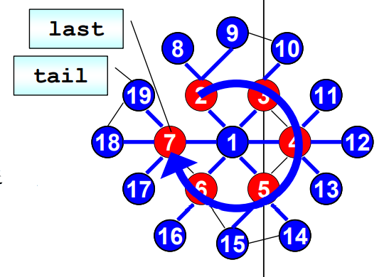


```c
int BFS ( Vertex V ) 
{ 
    visited[V] = true; count = 1;
    level = 0; last = V;
    Enqueue(V, Q);
    while(!IsEmpty(Q)){
        V = Dequeue(Q); 
        for ( V 的每个邻接点 W )
        if ( !visited[W] ) {
            visited[W] = true;
            Enqueue(W, Q); count++;
            tail = W;
        }
        if ( V == last ) {
            level++; last = tail;
        }
        if ( level == 6 ) break;
    }
    return count;
}
```

## 如何建立图

这一节来讲如何建立图，如何把一个抽象的图变成C语言代码。因为关于所有图的代码实现都有一个前提，就是首先得有一个图。前面说到，图主要由两种表示方法，一种四邻接矩阵来表示图，一种是用邻接表来表示图，我们先从简单的开始来考虑一下用邻接矩阵表示的图在程序里面怎么写

#### 用邻接矩阵表示图

用邻接矩阵表示图很简单，主要的就是一个矩阵，也就是在程序里对应一个二维的数组，那如果Vi和Vj是有一条边的话，那么相应的Gij就等于1，如果没有边就等于0.这是当我们在说一个无权图的时候，如果这个图是有权的话，那么当有一条边的时候，对应的不是1而是它的权重，没有边的时候，有可能是0也有可能是无穷大。那么在程序里怎么写呢？

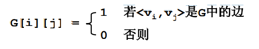

一个非常简单直观的写法就是，我就定义一个二维的数组，这个数组的大小是由它这个MaxVertexNum-是由这个图里面所有顶点的数量来决定的。前面把这个二维数组的类型定义为WeightType，这是一个抽象的写法，大多数情况下它就是一个整型，但是它有时候也有可能是double类型的，甚至有可能是字符类型的，这个根据具体的情况自己定义。除此之外关于图还有两个很重要的变量要定义，一个是顶点数，一个是边数。如果是在考试的时候要写一个图的话，这么写已经足够了因为它比较简单快捷。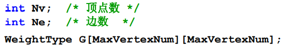

但是我们不是砌猪圈的程序员，我们是工程师，工程师要关心的事情和程序员要关心的事情和程序员有什么不同呢？就是工程师要考虑的是在一个大的系统里我们去实现一个小的模块，那么这个小的模块应该具有的特点至少有两个，一个是它要尽可能的通用，再一个是得让别人容易看懂，所以回到我们邻接矩阵表示的图，如果我们就简单这样去实现一个图的话，有一个显然的问题就是这两个遍历Nv和Ne，当别人去用你这个模块的时候，他有可能不理解这两个东西是干什么用的，那么它就有可能把这两个变量拿去做其它的用途，那我们现在要保证的告诉他说这两个东西是跟这个图一体的。既然他们是一体的，我们就得把他们打一个包，打在一个结构体里面。于是我们就定义这么一个结构体。把这个结构体的节点起一个名字叫做GNode。我们把一个指向结点的指针叫做一个图。为什么要把指针叫做一个图而不是把节点本身叫做一个图呢？那是因为我们后面在向函数传递一个图的时候，是传一个指针进去比较方便，而不是把整个的节点传进去。在这里还可能存在的一个数组我们把它取个名字叫做data，它是用来存放顶点的数据的，也就是当处理某一类问题的时候，可能图里面的每一个顶点它有自己的一个意义，在图的每一个顶点里面还要存一些东西，这个DataType有可能是任何东西，它甚至有可能是一个结构体。到此为止我们就完成了图的定义。接下来我们就看怎么在程序里面建立一个图

```c
typedef struct GNode *PtrToGNode;
struct GNode {
    int Nv; /* 顶点数 */
    int Ne; /* 边数 */
    WeightType G[MaxVertexNum][MaxVertexNum];
    DataType Data[MaxVertexNum]; /* 存顶点的数据，可能存在可能不存在 */
};
typedef PtrToGNode MGraph; /* 以邻接矩阵存储的图类型 */
```

###### MGraph初始化

建立一个图的过程，实际上是由两步组成的，第一步就是初始化一个有这么多个顶点但是没有边的图，也就是说先把顶点建立起来，我们知道一个图里面可以连一个边都没有但是不能连一个顶点都没有，那么在给定了顶点的个数以后，我们就可以实现这样一个函数叫CreateGraph。怎么做呢？非常简单，我先声明这个图的结点，这个图的结点一旦声明以后，这个矩阵的空间就已经有了，同时我们还有了Nv和Ne。既然顶点的个数给定了，我们把这个数字给Nv。现在我们初始化的是一个没有边的图，什么叫没有边，也就是说我们要把这个图里面的这个邻接矩阵任意一对顶点v和w之间的边都定义为0，表示他们之间没有边。但是如果是一个有权图的话可能我们会把它初始化成无穷（infinity），就是你自己定义一个很大的数代表无穷大，那就表示这两个顶点之间是没有边的。这个当然就对应了一个双重的循环，一个v一个w。那么这里头我们默认顶点是从0开始编号的，一直到n-1。可能一开始你不太习惯，就是为什么我这个循环变量，通常我们都是i和j的，为什么在这要用v和w呢？那我们在前头把这个v和w定义为是顶点类型（ Vertex V, W;）实际上顶点类型Vertex就是整型，因为我们是用顶点的下标来表示一个顶点的（typedef int Vertex），所以它就是整型，但是我在这要额外的声明一下的好处是要把它跟真正的整型变量区分开，比如说我们这个VertexNum这个顶点数它真的是一个整数，而当我们在说v和w的时候，我们不是在说两个整数，我们在说的是两个顶点。所以尽管表面上看起来他们都是整型，是一回事，但是本质上他们是不同的东西。所以作为专业的程序员，在这区分一下是有好处的。但是最后在我们做完了初始化以后不要忘了要把建成的图return回去。

- 初始化一个有VertexNum个顶点但没有边的图

```c
typedef int Vertex; /* 用顶点下标表示顶点,为整型 */
MGraph CreateGraph( int VertexNum )
{ 
    Vertex V, W;
    MGraph Graph;
    Graph = (MGraph)malloc(sizeof(struct GNode)); 
    Graph->Nv = VertexNum;
    Graph->Ne = 0;
    /* 注意：这里默认顶点编号从0开始，到(Graph->Nv - 1) */
    for (V=0; V<Graph->Nv; V++)
    for (W=0; W<Graph->Nv; W++) 
    Graph->G[V][W] = 0; /* 或INFINITY */
    return Graph; 
}

```

###### 向MGraph中插入边

现在我们已经初始化了一个有所有顶点但是没有边的图，那么接下来要做的动作就是每次向这个图里面插入一条边。现在我们的问题又来了，就是首先你得有一条边，那么这个edge边的类型要怎么定义呢？那其实每一种结构我们都可以模仿刚才那个图节点的那个定义，先定义一个边节点，然后定义它的PtrToNode指针，然后把边定义为指向这个结点的指针，当我们要插入一条边的时候就把这个指针传进去。那么这个结点里头应该包含些什么东西，我们先来考虑一下你要定义一条边的话，有哪些东西决定了一条边呢？最基本的就是一条边是由两个顶点来决定的，如果我们在讨论一个从V1指向V2的有向边的时候，那我们就定义这个一个顶点是它的出发点，一个顶点是它的终点。那除了这两个顶点之外还可能有什么呢？如果我们在讨论无权图的时候这样就可以了，如果是有权图的话那我们当然还得定义一个权重，那么这个权重的类型是WeightType，跟我们前面那个邻接矩阵的类型是一致的。在定义好了一条边以后，我们就看怎么往这个图里面插入一条边。对于邻接矩阵来说插入一条边是一件非常简单的事情，就是把相应的权重赋值给相应的邻接矩阵的这个元素就行了，所以如果我们插入的V1·V2的话，那么就把这个Graph里面邻接矩阵对应着V1和V2的这个元素赋值为边上的权重（Graph->G[E->V1][E->V2] = E->Weight）。当然如果我们说的是无向图的话，那么其实我们是要插入两条边的。如果是无向图的话还有把V2和V1也插进去。

```c
typedef struct ENode *PtrToENode;
struct ENode {
    Vertex V1, V2; /* 有向边<V1, V2> */
    WeightType Weight; /* 权重 */
};
typedef PtrToENode Edge;
```

```c
void InsertEdge( MGraph Graph, Edge E )
{
    /* 插入边 <V1, V2> */
    Graph->G[E->V1][E->V2] = E->Weight; 
    /* 若是无向图，还要插入边<V2, V1> */
    Graph->G[E->V2][E->V1] = E->Weight;
}
```

###### 完整地建立一个MGraph

在实现完了前面两个函数以后，我们就准备好完整的建立一个用邻接矩阵表示的图了。通常我们的输入是这样的。就是先给你所有的顶点的个数，给你总的边数，然后接下来有这么多行，每行给出一条边的信息，也就是边的初始点、终点以及它的权重等等，针对这个输入格式，我们来写一个函数BuildGraph，在这个函数里面我们要声明这么一个图（MGraph Graph;），通过后面的代码把它建好，然后返回。建立的过程刚刚说了，其实就是两步走，首先读进来一个顶点数（scanf("%d", &Nv);），但是可以看到顶点数和边数是一起给的吗，为什么不一起读进来呢？--后面解释。我不需要知道边数，只要有这个顶点数以后我就可以初始化一个图了，初始化的这个图是有所有的顶点但是一条边都没有的Gragh。然后我再读边数，就直接读的是Gragh->Ne，也就是说我不用另外去声明一个临时变量Ne读进来然后再把它赋值给Gragh->Ne。我可以在建立了这个Gragh之后直接把它读进来，那么如果读进来的边数等于0的话，说明本身这个图就没有一条边，那么到这一步以后我们就已经完成了，直接return就结束了。如果有边的话，那我们就要把一条一条边读进来，然后插到这个图里面，用InsertEdge函数，所以在调用它之间我们先要声明一个临时的边结点，去临时的存一下这个边，然后我们就进入了一个简单的循环，在每一次循环里面我们把一条边读进来，然后调用InsertEdge，把这条边插到图里。然后就完成了任务，当然在有些情况下顶点还是有数据的，那么后面还要给出每个顶点要存的数据，在这种情况下我们还需要一个循环，把这个顶点的数据也读进来。那么剩下的事情就是看看我们这里头用到了多少，临时变量在前面声明一下。就完成了这么一个MGragh的建立。

- 输入格式 

  Nv Ne

  V1 V2 Weight

  ……

```c
MGraph BuildGraph()
{ 
    MGraph Graph;
    Edge E;
    Vertex V;
    int Nv, i;
    scanf("%d", &Nv);
    Graph = CreateGraph(Nv); 
    scanf("%d", &(Graph->Ne));
    if ( Graph->Ne != 0 ) {
        E = (Edge)malloc(sizeof(struct ENode)); 
        for (i=0; i<Graph->Ne; i++) {
            scanf("%d %d %d",
            &E->V1, &E->V2, &E->Weight); 
            InsertEdge( Graph, E );
        }
    } 
    /* 如果顶点有数据的话，读入数据 */
    for (V=0; V<Graph->Nv; V++) 
    scanf(" %c", &(Graph->Data[V]));
    return Graph;
}
```

那么说到这你要想，真的有必要这么麻烦吗？如果是在考试的状态下你只有非常短的时间去建立一个图的话，其实只要这么一小段代码就行了。这一段代码在干什么事情？就是我直接把这个邻接矩阵以及顶点数和边数都声明成全局变量，在这我们简单的假设邻接矩阵就是整型的，如果是其它类型的话就对应变化就行了，那么BuildGraph就不需要再返回这个图了，因为这个图是一个全局变量，那么我直接把它写成void类型，那再这里面做的就是，首先相当于我们前面哪个CreateGragh，直接一个二重循环然后把邻接矩阵所有的元素初始化为0或者是无穷大。接着就读进来边数，然后对每一条边我把边的两个顶点和权重读进来，直接赋值就行了。那你要说了，本来可以这么简单实现的一个东西前面为什么费这么大功夫这么多个函数到底值不值得？这个问题其实不是特别显然，需要好好体会一下。

```c
int G[MAXN][MAXN], Nv, Ne;
void BuildGraph()
{ 
    int i, j, v1, v2, w;
    scanf("%d", &Nv);
    /* CreateGraph */
    for (i=0; i<Nv; i++)
    for (j=0; j<Nv; j++)
    G[i][j] = 0; /* 
    或INFINITY */
    scanf("%d", &Ne);
    for (i=0; i<Ne; i++) {
        scanf("%d %d %d", &v1, &v2, &w);
        /* InsertEdge */
        G[v1][v2] = w;
        G[v2][v1] = w;
    }
}
```

#### 用邻接表表示图

接下来看如何处理用邻接表表示的图，所谓邻接表就是一个指针的数组，数组里面的每一个指针对应着矩阵每行一个链表，只存非零的元素。下面的例子中的2这个链表意味着有从2到1，2到5,2到4.如果我们再说无向图的话那么一条边会被存两次。比如说如果从1到5有一条边的话，从5到1也有一条边。当我们在定义这个图的节点的时候，大部分内容都和前面是一样的。

- 邻接表：G[N]为指针数组，对应矩阵每行一个链表， 只存非 0元素

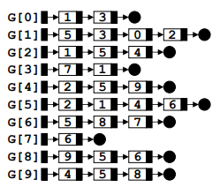

得有顶点数也得有边数，定义为指针类型Ptr，然后把指针定义为LGragh。最重要的是GNode定义中的第三行是不一样的，原来的那个地方的核心是一个邻接矩阵，现在这里的核心是邻接表，我仍然把这个邻接表的名字取为G（AdjList G;）。

```c
typedef struct GNode *PtrToGNode;
struct GNode { 
    int Nv; /* 顶点数 */
    int Ne; /* 边数 */
    AdjList G; /* 邻接表 */
};
typedef PtrToGNode LGraph;
/* 以邻接表方式存储的图类型 */
```

AdjList是邻接表的缩写，这个类型是要我们自己去定义的。它实际上是一个数组，这个数组的大小就是我们一共有多少个顶点这个数组就有多大。所有它是MaxVertexNum大小的。数组的每一个元素都是一个结点，这个结点我们去一个名字叫做VNode，这个头结点里面应该包含什么东西？首先它要包含一个指针，指向这么一个边的结点，那我们把边结点的指针的类型定义为PtrToAdjVNode指向AdjVNode，AdjVNode是边结点的类型等一下定义，把这个指针命名为FirstEdge也就是第一条边，我们这边取名为FirstEdge的原因是因为它总是指向链表里面的第一条边。如果顶点里面没有要存其它的元素这样就可以了，如果在有的情况在每一个结点需要存其它东西的话，这个东西就给它去一个名字叫做data，类型是DataType，跟前面一样这个DataType有可能是其它任意的类型。

```c
typedef struct Vnode{
    PtrToAdjVNode FirstEdge;
    DataType Data; /* 存顶点的数据 */
} AdjList[MaxVertexNum]; 
/* AdjList是邻接表类型 */
```

再来看看AdjVNode，也就是链表里头代表每一条边的这个结点它应该包含什么呢？虽然说它代表的是一条边但是它需要存两个顶点吗？没必要，因为这个条边必定是放在某一个顶点的链表里，那么这条边的出发点就已经决定了他在谁家的链表里，谁就是它的出发点，所以在这条边的结点里我们只需要存它的终点即可，也就是存出发点的邻接点即可。所我们把它去一个名字叫做邻接点（Vertex AdjV），它的类型是邻接点的下标Vertex，这个Vertex还像前面一样，我们把它定义为整型，除此之外，如果我们是在说一个有权图的话，还得有一个变量来存他这个边的权重，然后，这是链表里面的一个结点，所以它还有一个指向下一个节点的指针，到此为止我们就完成了用邻接表表示的图的所有结构的定义。

```c
typedef struct AdjVNode *PtrToAdjVNode; 
struct AdjVNode {
    Vertex AdjV; /* 邻接点下标 */
    WeightType Weight; /* 边权重 */
    PtrToAdjVNode Next; 
};

```

###### LGragh初始化

实际上建立LGragh的过程和建立MGragh的过程从原理上来说是一样的。都是先初始化一个包含了所有结点但是没有边的图。然后再一条边一条边插入。最后把一个完整的图建立起来。细节有所区别。

- 初始化一个有VertexNum个顶点但没有边的图

对于LGragh来说前面一部分是一模一样的，仍然是仍然是声明一个图节点，然后把顶点个数赋值、边数赋值。最重要的问题是：声明叫做没有边？在用邻接矩阵表示的图里面没有边，就表示任意一对顶点之间的值或者是0或者是无穷大。而在LGragh里面什么叫做没有边？就是每一个顶点跟着的那个链表都是空的。对于Gragh里面邻接表每一个顶点V来说它的FirstEdge它指向第一条边的这个指针都是空的。这样我们就初始化了所有的空的边。那么这个就对应了一个一重循环而不是二重循环。如此就完成了图的初始化。

```c
typedef int Vertex; /* 用顶点下标表示顶点,为整型 */
LGraph CreateGraph( int VertexNum )
{ 
    Vertex V, W;
    LGraph Graph;
    Graph = (LGraph)malloc(sizeof(struct GNode)); 
    Graph->Nv = VertexNum;
    Graph->Ne = 0;
    /* 注意：这里默认顶点编号从0开始，到(Graph->Nv - 1) */
    for ( V=0; V<Graph->Nv; V++ )
    Graph->G[V].FirstEdge = NULL;
    return Graph;
}
```

###### 向LGraph中插入边

接下来看如何在LGragh里面插入一条边。插入边的过程就是把一个顶点插到一个链表上去的过程，现在如果说要插入的这条边是从V1到V2的，也就是说我们要对V2建立一个边的结点，然后把这个结点插入到V1所在的这个链表里面，为了方便我们采用头插法。接着就是创建边结点，给空间、V2的名字存进去（下标）、把权重给进去，接下来就是头插。如果是无向图我们除了把<V1,V2>插进去以外还需要插入<V2,V1>，重复上面的方法把V1和V2换个位置即可。

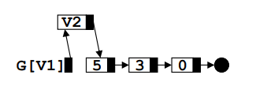

```c
void InsertEdge( LGraph Graph, Edge E )
{ 
    PtrToAdjVNode NewNode;
    /***************** 插入边 <V1, V2> ****************/
    /* 为V2建立新的邻接点 */
    NewNode = (PtrToAdjVNode)malloc(sizeof(struct AdjVNode));
    NewNode->AdjV = E->V2;
    NewNode->Weight = E->Weight;
    /* 将V2插入V1的表头 */
    NewNode->Next = Graph->G[E->V1].FirstEdge;
    Graph->G[E->V1].FirstEdge = NewNode;
    /********** 若是无向图，还要插入边 <V2, V1> **********/
    /* 为V1建立新的邻接点 */
    NewNode = (PtrToAdjVNode)malloc(sizeof(struct AdjVNode));
    NewNode->AdjV = E->V1;
    NewNode->Weight = E->Weight;
    /* 将V1插入V2的表头 */
    NewNode->Next = Graph->G[E->V2].FirstEdge;
    Graph->G[E->V2].FirstEdge = NewNode;
}
```

###### 完整地建立LGragh

实现了前面两步我们要完整建立LGragh。

```c
LGraph BuildGraph()
{ 
    LGraph Graph;
    Edge E;
    Vertex V;
    int Nv, i;
    scanf("%d", &Nv);
    Graph = CreateGraph(Nv); 
    scanf("%d", &(Graph->Ne));
    if ( Graph->Ne != 0 ) {
        E = (Edge)malloc(sizeof(struct ENode)); 
        for (i=0; i<Graph->Ne; i++) {
            scanf("%d %d %d",
            &E->V1, &E->V2, &E->Weight); 
            InsertEdge( Graph, E );
        }
    } 
    /* 如果顶点有数据的话，读入数据 */
    for (V=0; V<Graph->Nv; V++) 
    scanf(" %c", &(Graph->Data[V]));
    return Graph;
}
```

## 最短路径问题

之前的孤岛问题中你只能给007回复yes or no。那么我们能不能更进一步，告诉他怎么跳才能跳到岸上，并且希望告诉他的路线还是最短的。这就是图论里面最短路径的问题。现实中有很多问题可以归结为最短路径问题，这个问题有很多问法。

一种问法，比如我给你了地铁图两个站点的名字，一个a一个b，我要问题从a到b的最短路径是哪一条。在这个问题里我们的顶点就是一个一个的站点，我们所谓的路径就是只要两个站点直接有直通那么它们之间就有一条边，所谓的最短路就指的是最短的距离，所以边上的权重对应的就是两个站点之间的距离。所以我们要找的就是从a站点到b站点它的所有可达路径中间距离的和最短的那条，这就是一个最短路径。

另外一种问法，我要找从a站点到b站点最便宜的那条路，这其实也是一个最短路径的问题。区别就在于边上的权重你赋予的意义，这个问题的权重明显就是票的价钱。所以我们要找的就是整个可达路径上票的价格的和最小的那条路

还有一种问法，我要找从a到b最快的那条路，这时候会出现一个问题，如果我认为从一个站点到另一个站点中间经停的站点最少我就认为最快，那么这个问题我们应该怎么抽象呢？实际上这个问题相当于是我要树中间的经停站，其实经停站的个数跟它的边的条数是有对应关系的，我要找最少的经停站，也就是要数中间经过最少多少条边。那么在这个问题里面边的权重就变得无关紧要了，我们只关心边的个数。另一方面讲其实我们也可以把它理解为每一条边上的权重为1，然后我们把他们所有的权重加起来就相当于是这条路径上经停站的个数我就能数出来了。所以总而言之，上面所有的这些问题，我们都可以统一的抽象为归纳为一个图论的最短路径问题。

下面我们来看看最短路径问题的抽象。所谓网络就是在一个带权的图里，要求任意两个不同顶点之间的所有路径中边的权值之和最小的那条路径。所以我们对应不同的问题就对应这不同的边的权值的定义。这个路径我们就叫做两点之间的最短路径。这条路径涉及的第一个顶点我们叫做起点或者叫源点。最后一个顶点叫做终点。当我们说到最短路径问题的时候我们说的不是一个问题而是一类问题。这一类问题里面至少可以被分为两大类

- 在网络中，求两个不同顶点之间的所有路径 中，边的权值之和最小的那一条路径
  - 这条路径就是两点之间的最短路径 （Shortest  Path ）
  - 第一个顶点为源点 （Source ）
  - 最后一个顶点为终点 （Destination）

#### 问题分类

第一类叫做单源最短路径问题，也就是说源点是固定的，我们只考虑从一个固定的源点出发，然后求从这个点到其它所有顶点的最短路径。这个叫单源最短路问题。在单源最短路径问题中我们分两种情况，一种对应有权图一种对于无权图。并且可以是有向的也可以是无向的，算法其实都是一样的

单源最短路径问题：从某固定源点出发，求其 到所有其他顶点的最短路径

- （有向）无权图
- （有向）有权图

相对应的还有一个多源最短路径问题，也就是求任意两个顶点之间的最短路径。那么现在产生了一个问题，既然我可以知道单源最短路径问题的解法，为什么我不在每一个顶点上用一遍单源最短路径问题自然而然的就解决了多源最短路径问题，为什么还有单独的一个多源最短路径问题？是这样吗？是的！但是在某种特殊的情况下我们会有一个更聪明的办法可以把这个问题解决的更快些。

多源最短路径问题：求任意两顶点间的最短路径

#### 无权图的单源最短路算法

在我们考虑无权图的单源最短路算法的时候，有一个非常重要的思路。是说，我们是按照递增或者如果有并列数字的话我们叫非递减。我们按照递增的顺序来找从某一个固定的顶点到各个其它顶点的最短路。这是什么意思？来看一个例子。给出下面一幅图，我们的源点从V3出发去找它到各个其它顶点的最短路，那我们说我们是按照递增的顺序找最短路的。这个问题的初始情况就是从一个长度为0的路径开始，也就是说源点到它自己是不用走路的，所以它的路径长度是0.有了这个0以后我们要往下去生成下一组路径也就是路径长度为1的。哪些顶点会被收进来呢？很显然，从V3这个顶点直接由边出发指到的V1和V6这两个点他们到源点的距离显然是1。下一步的特点就是在上一步的基础上再往外走一步，所以没有必要再退回源点从开开始走。所以接下来我我们就可以得到和源点距离为2的，和源点距离为3的顶点（在之前就已经被访问过的顶点就可以不用管了）。到此为止我们发现所有的顶点都已经被访问过了，算法结束。回顾一下算法的流程，发现这些顶点一个一个被收罗进来的，收罗的书顺序是从V3的直接邻接点开始然后一圈一圈往外扩展的。这就是广度优先搜索BFS的特点。事实上解决了这个问题我们也就解决了007跳上岸最少需要多少步的问题。当然整个算法要实现的时候我们不是把一个BFS抄过来就行的，我们需要做一些改动。

- 按照递增（非递减）的顺序找出到各个顶 点的最短路

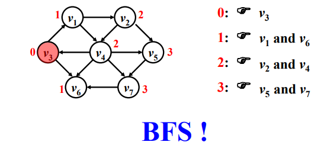

首先回顾BFS。在我们要求最短路的这个过程中，其实Visitied这个东西我们不需要，所以后面实现的时候Visited是要删掉的。但是于此同时我们仍然需要一个东西来让我们能够判断这个顶点它有没有被访问过。

```c
void BFS ( Vertex S ) 
{ 
    visited[S] = true;
    Enqueue(S, Q);
    while(!IsEmpty(Q)){
    V = Dequeue(Q); 
    for ( V 的每个邻接点 W )
    if ( !visited[W] ) {
        visited[W] = true;
        Enqueue(W, Q);
    }
    }
}
```

是什么东西呢？我定义了另外一个数组dist，dist[w]定义的是从源点到这个w它的最短距离。首先在程序一开始的时候我们先把源点的距离定义为0.实际上这个数组除了记录s到w的最短距离以外，还起了一个Visited的作用。所以我们在初始化的时候我只要把它定义为一个一看就知道不可能的数就行了（例如-1，正无穷、负无穷），我们根据这个来知道disk[w]是否访问过，如果已经被访问过了，那么disk[w]里面就是一个比较正常的值。除此之外，你除了告诉007可以跳的最少步数之外，还应该告诉他怎么跳。所以我们还需要一个数组path，来记录它的路径。这个数组是这样的定义的：对每一个顶点w我是把从源点到w的路上经过的某个顶点，会存在path[w]中。而这里说的某顶点到底是哪个顶点呢？我们一会看，我们先来看一下函数实现。

- dist[W] = S 到 W的最短距离
- dist[ S] =  0 
- path[W] = S 到 W的路上经过的某顶点

单元最短路径函数名称为Unweighted也就是无权的。我们的输入仍然是一个源点S，首先我们要做的就是把源点压入到队里，当然前提是这几个数组已经初始化好了，好了以后我们开始进入正题，源点入队以后，进入while循环，每次弹出一个顶点，当一个顶点被弹出来的时候就意味着这个顶点到S的最短路已经找到了，也就是disk[v]已经算好了。出队之后我们要往外扩展一步，也就是对V的每一个邻接点w进行判断访问，在我们这个问题里，w如果没有被访问过，disk[w]一定是-1，假如我们初始化的值是-1。如果w被判定为没有访问过，那么我就访问它。在这个问题里面什么叫做访问呢？也就是在这里我们要把disk[w]的距离更新一下，那么它的距离是多少呢？它的距离应该是disk[v]+1.在这个时候w的最短距离就已经找到了（其实是因为入队的时候顶点的最短路径已经保存了），那么谁是s到w路上必经的顶点呢？就是它的前一个顶点v，这样记录path这个数组它会有什么用呢？当我们整个程序完成了以后，比如说我指定了某一个顶点w，要求你把从s到w的路径打印出来，你要怎么做？首先你去看一下path[w]等于多少，它等于的这个数一定是在它前面那个顶点的编号v，然后再接着去看path[v]等于多少。这样可以一直顺着path数组一个一个往前推一直推到源点。那么这样就得到了一个反向的路径。是从w到s的一个路径。那么你如何打印出从s到w的路径呢？很简单，反向路径入栈即可，堆栈就是起反序作用的，完了一个一个弹出就是正向的路径了。接下来的问题就是这个算法的时间复杂度是多少？假设我们用的是一个邻接表，也就是用链表的方式去存的这个图，所以v的每一个邻接点是很方便找到的。但是时间复杂度如果通过while和for循环来看是很难算出来的。换一个角度来理解，在整个算法执行过程中，每一个顶点只入队一次出队一次，所以整个执行的过程里实际上是设计了两倍的V（入队+出队）。另外来看这个for循环是什么意思？v的每个邻接点w这个实际上就是把每条边访问了一次，所以整个算法里面每条边都被访问一次，所以我们算法的整体时间复杂度就是O（V+E）

```c
void Unweighted ( Vertex S ) 
{ 
    Enqueue(S, Q);
    while(!IsEmpty(Q)){
        V = Dequeue(Q); 
        for ( V 的每个邻接点 W )
        if ( dist[W]==-1 ) {
            dist[W] = dist[V]+1;
            path[W] = V;
            Enqueue(W, Q);
        }
    }
}
```

接下来我们就通过一个具体的例子看一下无权图的单源最短路径算法是如何工作的。在我们调用Unweighted这个函数之前，我们有两个数组需要初始化，一个是disk一个是path。两个数组我们都初始化为-1；我们取V3作为问题的源点。所以在调用这个算法之前disk[3]这个元素应该被初始化为0.做好了准备工作以后我们开始调用这个函数。传进去的是V3的下标。所以我们就调用Unweighted（3），当我们进入这个函数以后，我们第一件事情是要把源点入队。也就是V3进到队列里。

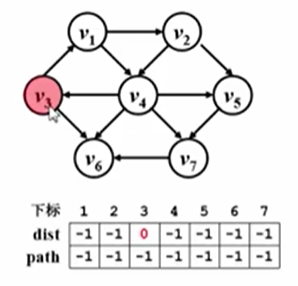

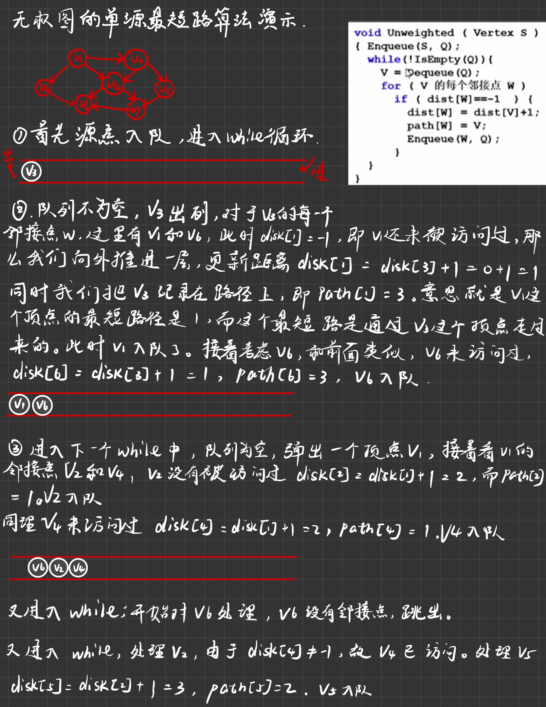

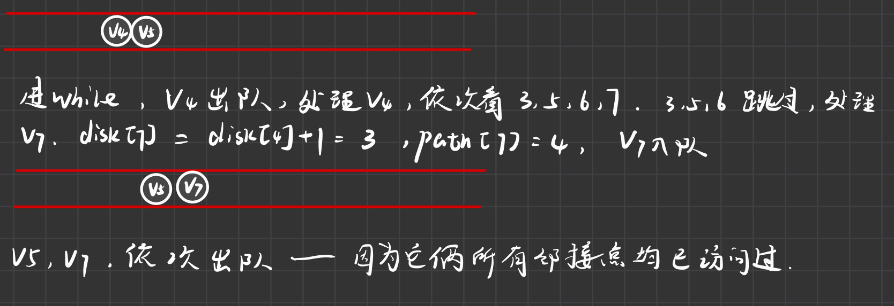

最后回到while循环，此时整个算法为空，算法结束，此时在disk里面存的数字，就是每一个顶点到V3最短的距离。而路径的信息就存储在path中，我们根据path数组里面存的数，一直往前追，追到path对应的地方是-1的时候，意味着我们已经到达了源点。

###### 代码--邻接表存储

```c
/* 邻接表存储 - 无权图的单源最短路算法 */

/* dist[]和path[]全部初始化为-1 */
void Unweighted ( LGraph Graph, int dist[], int path[], Vertex S )
{
    Queue Q;
    Vertex V;
    PtrToAdjVNode W;
    
    Q = CreateQueue( Graph->Nv ); /* 创建空队列, MaxSize为外部定义的常数 */
    dist[S] = 0; /* 初始化源点 */
    AddQ (Q, S);

    while( !IsEmpty(Q) ){
        V = DeleteQ(Q);
        for ( W=Graph->G[V].FirstEdge; W; W=W->Next ) /* 对V的每个邻接点W->AdjV */
            if ( dist[W->AdjV]==-1 ) { /* 若W->AdjV未被访问过 */
                dist[W->AdjV] = dist[V]+1; /* W->AdjV到S的距离更新 */
                path[W->AdjV] = V; /* 将V记录在S到W->AdjV的路径上 */
                AddQ(Q, W->AdjV);
            }
    } /* while结束*/
}
```


#### 有权图的单源最短路算法

看一个例子，假如我么把V1作为源点，V6选做终点，那么从V1到V6最短的路径是哪条？可以注意到，有权图的最短路和无权图的最短路一个很大的区别在于有权图的最短路不一定是经过顶点数最少的那条。

如果有一条边的权重是负数，会发生什么？如果权重是花销，那么负权重就是给钱。此时如果我把V5作为源点V4作为终点，那么最短路是什么？有趣的事情发生了，实际上可以沿这条回路走无穷多次，因为无穷小是最小。这种情况叫做有一个负值圈。如果图里面有这样一个负值圈基本上所有的算法都挂了。所以我们不考虑这种情况。

那么算法要怎么想呢？其实和无权图的算法还是有相似之处的。无权图可以认为是一种特殊的有权图，即权重都是1。

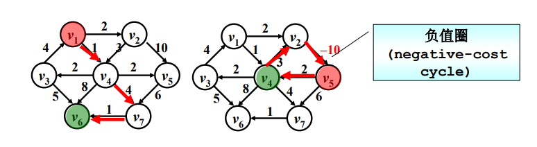

最重要的一个特点就是都是按照递增的顺序或者按照非递减的顺序找出固定的源点到各个顶点的最短路。解决这个问题的算法名字叫做Dijkstra算法

- 按照递增的顺序找出到各个顶点的最短路

###### Dijkstra 算法

和BFS算法相似的地方在于它都把顶点一个一个往集合里收，所以在这我们先定义一个顶点的集合S，初始状态下它只包含源点，然后随着算法一步一步的进行，我们把一个一个的顶点不断往里收，收进来的顶点他们的最短路径都是已经最后确定的了。我们仍然像前面一样定义一个距离的数组叫做dist。对于任意一个没有被收录的顶点V，我们把dist[v]定义为从源点到v的最短路径长度，但是这不是最终的最短的路径，这个路径仅仅经过这个集合里面已经收集到的顶点，也就是说从S到V但是中间经停的仅仅是这个集合里面的顶点，是这条路径的最小长度。那我们要说这个路径的最小长度呢多半不是最终的那个最小长度，但是随着一个一个顶点不断地被加入到这个集合，dist[v]会慢慢变小变小，一直到最后被完善到真正的最短路径。当它成为真正最短路径的时候，这个v就被收到了这个集合里面。

这个算法能够被这样执行的很重要的一个前提是我们的路径是按照递增或者非递减的顺序生成的，因为是按照这样的顺序生成的，所以当我们要把v，下一个v收到集合里去的时候，这个v**真正的最短路**必须只经过集合中的顶点，不会经过集合外面的顶点（因为如果不是这样的话，也就是说存在一个集合外的元素w，使得s先到w再到v，但是这样一来s到w肯定比s到v的路径短，也就是说在v被收进去之前，w已经被收进去了，所以有矛盾）。

所以我们想想应该怎么做呢？那我们每一次就看一下所有的dist里面的最小值，还有哪个没有被收进去，每次把dist里面最小的那个收进去就好了。也就是从未收入的顶点中选一个dist最小的，将其收进集合中即可。这种思想就是贪心算法的思想。什么是贪心，后面还会提到。

看上去好像这个问题已经解决了，但是要小心，当我把V收到集合里面的时候，它会不会影响其它顶点的最小长度？这就是我们的一个很严重的问题：增加一个 v进入 S，可能影响另外一个 w 的dist值！如果把V加到集合里面以后dist[w]变小了的话，那么V一定在从s到w的那个路径上（因为路径更新了这条路径上有v）。另外一个不好理解的事实是：不仅v在s到w的路径上，并且v到w必定还有一条直接的边。为什么不能是s先到v，v再到另外一个其它的顶点，然后再到w呢？这种情况是不可能的，因为路径是按照递增的顺序生成的，如果v和w之间还有另外一个顶点t的话，那么也就是说s到t的距离肯定比s到v的距离短，由此来说我们就不可能从s到v到t再到w，我们直接从s到t再到w会更短，所以其实在t节点收录的时候dist已经更新，所以说矛盾了，故v不可能途径任何结点才到w，v是和w直接相连的。所以如果一个V增加进去以后会使得另外一个w的dist变小的话，那么v一定在路径上，并且v到w一定有一条直接的边。换句话说就是w一定是v的邻接点。再清楚一点就是v增加进集合以后它能影响的就是它一圈的邻接点。所以在程序里面我们只要每把一个v收进集合的时候，我们只要检查它周围一圈的邻接点看看有没有谁能够得到一个更小的dist值，那么这个更小的dist值可能是什么呢？如果dist[v] +<v,w> 的权重，这个值更小我们就更新一下w的dist值。否则距离就保持不变。

- 令S={源点s + 已经确定了最短路径的顶点 v i }
- 对任一未收录的顶点 v，定义dist[v] 为 s 到 v的最 短路径长度，但该路径仅经过 S中的顶点。即路径 {s ->(v i∈S)->v}的最小长度
- 若路径是按照递增（非递减）的顺序生成的，则
  - 真正的最短路必须只经过 S中的顶点（为什么？）
  - 每次从未收录的顶点中选一个dist最小的收录（贪心）
  - 增加一个 v进入 S，可能影响另外一个 w 的dist值！
    - dist[w] = min{dist[w], dist[v] +<v,w> 的权重 }

下面就是Dijkstra算法的框架。首先给了一个一个源点s进去，用了一个死循环解决这个问题。每一次从没有收录的顶点中找一个dist最小的，把它收到集合里面。收到集合里面在这里就直接简单的定义了一个数组collected，在它收进来以后我要检查它的每一个邻接点w，如果这个w还没有被收进来，那么我们就看看w的dist要不要更新，如果dist[V]+E<V,W> < dist[W]的话就更新dist的值，于此同时我们还得把v记录在w的路径上（ path[W] = V）。

在这里我们暂停，来讲一讲dist应该如何初始化，首先源点s的dist应该是为0的，另外直接和s相连的哪些邻接点的dist都可以直接被定义为和s相连的那条边的权重。除此之外，和s没有直接边相连的那些顶点，在Dijkstra算法里dist不能再随便的初始化了，因为有dist[V]+E<V,W> < dist[W]这个不等式在，所以如果被初始化为-1或者是负无穷那么dist这个值将永远无法更新。所以我们最好将dist值初始化为正无穷，这也应对了我们之前说的，dist值是一直在变小最好完善成为真正的最短路径的。我们当描述一个顶点和s没有直接的路可以通的时候一定要把它定义为正无穷，这样的话当我们发现一个等短路径的时候才可以把这个路径往小的地方去更新。

基本上我们的算法就是这样一个实现，注意到我们是在一个while1的死循环里面，那么我们什么时候要跳出来呢？跳出来的条件应该是我们找不到dist中的最小者了，也就是说找不到这样的v了，也就是说如果所有的顶点都已经被收录了，那么我们就跳出来，表示我们的程序结束。这里头还要注意一个问题，如果我们有一条边是负的，这个算法是没有办法解决有负边的情况的。因为这个Dijkstra的基本思路是按照距离从小到大的顺序去收集每一个顶点，如果有一条边是负的，那么对于某一个w来说就有可能说有了一个dist[v]然后它减掉了一个正值，我们就可以得到一个比v还要短的w，而w之前是排在v的后面的。所以整个的算法就乱了。那么如果碰到负边的情况应该怎么做呢？·······

接下来就是时间复杂度是多少呢？这个问题不科学！其实整个算法的复杂度很大程度取决于我们是怎么找到“未收录顶点中dist最小者”的。当我们决定了（V = 未收录顶点中dist最小者;）这一步的算法以后，相应的才能决定（dist[W] = dist[V] + E<V,W> ;）这一步的算法。你要说了，dist[W] = dist[V] + E<V,W> ;不就是一个赋值语句吗？但是遗憾的是这只是一个伪码描述，虽然写出来看上去好像只是一个简单的赋值语句，但是它其实的意思只是说如果我有一个更短的距离，那么我要把这个值更新成为这个最短的距离。这个更新的过程不一定是一个简单的赋值。要解决这个问题其实我们有不止一种方法。

```c
void Dijkstra( Vertex s )
{ 
    while (1) {
        V = 未收录顶点中dist最小者;
        if ( 这样的不存在 )
        break; 
        collected[V] = true;
        for ( V 的每个邻接点 W )
        if ( collected[W] == false ) 
        if ( dist[V]+E<V,W> < dist[W] ) {
            dist[W] = dist[V] + E<V,W> ;
            path[W] = V;
        }
    }
}
```

有一种直接粗暴的方法就是直接扫描所有没有收录的顶点，甚至你可以闭着眼直接扫描所有的顶点，然后要找那个没有收录的、并且它的距离又是最小的一个，于是这一步的时间复杂度就是O（V），如果我们用这种简单粗暴的方法去做这一步，那么后面的赋值就真的是一行，因为我们所有的顶点都要被收录一次。所以外循环是有V的，在每一个循环里面你要扫描一遍又是O[v]的扫描，所以整体这一步的复杂度是V²的，那么在收集的过程中，要涉及到v的每个邻接点，也就是每条边又被访问了一次，所以也是和E成正比的。对于稠密图来说，也就是边相对多的图，一般我们说边的个数跟顶点个数是O（V²）级别的。在这种情况下，我们整体的时间复杂度就是O（V²）这个数量级的。所以对于稠密图来说效果还是比较好的。关键是程序实现起来比较容易。

方法 1：直接扫描所有未收录顶点 – O( |V| )

- T =  O( |V|² + |E| )

另外一种更文艺一点的方法就是我怎么样能够每次很快的找到一个最小的距离？那么就要用到最小堆了。如果我把整个数组是存成一个最小堆的，那么每次我只要把堆的根节点弹出来，然后调整这个最小堆，所以每一次获得最小距离的这一个步骤，是一个log（V）级别的，比前面的O（V）要快得多。但是更新dist值就变成了一件稍微复杂的事情，你不仅要把值给更新了，而且你还得把它插回到最小堆里。这个过程也是另外一个log（V）级别的执行过程，总的复杂度就变成O( |V| log|V| + |E| log|V| ) =  O( |E| log|V| )，|V| log|V|是因为每一个顶点都访问一次且访问完都要进行找最小dist操作，|E| log|V|是因为每一个边都要访问一次且都要进行更新dist操作。那么这样看来如果是稀疏图，如何理解稀疏图？也就是e和v同一个数量级的，e不是v²这个数量级的。那么最后这个复杂度就差不多相当于vlogv。比前面的O（v²）要好一点。所以如果图充分稀疏的话用一个最小堆去实现Dijkstra算法会得到更快的效果。

方法 2：将dist存在最小堆中 – O( log|V| )

- 更新dist[w]的值 – O( log|V| ) 
- T =  O( |V| log|V| + |E| log|V| ) =  O( |E| log|V| )

下面来看一个具体的例子来看看Dijkstra算法是如何工作的。调用Dijkstra算法之前，我们首先要初始化dist和path数组，存储距离的这个dist数组会被初始化为正无穷，存储路径的path会被初始化为-1.在这个问题里面我们选择编号为1的顶点，作为我们的源点。

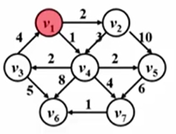

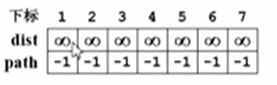

于是相应的源点到它自己的距离就被初始化为0.于此同时的，跟这个源点直接相邻的两个顶点他们到源点的最短距离就是对应这两条边的权重，于是相应的，V2到源点的距离被更新为2(dist[2]=2)，路径上的顶点就被更新为1(path[2]=1).同样的道理，v4到源点的距离被更新为1（dist[4]=1)，路径上的顶点也被更新为1(path[4]=1)。从这我们才正式进入Dijkstra算法。

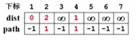

我们传进去的第一个顶点是源点v1，进入while循环，首先我们是要从未收录的顶点中选一个dist最小的顶点出来，不管使用扫描还是用最小堆，总之我们找了一下这里面，v1不算因为它本身是源点，除此之外下一个点就是v4了，v4的距离最小，所以现在的v是等于v4的，找到这样的v以后，collected标记为true，也就是说我们标志一下顶点v4是被访问过的，然后我们对v4的每一个邻接点w做下面的事情，v4有几个邻接点呢？3/5/6/7都是它的邻接点。我们从v3开始，显然v3是没有被收录过的，于是我们来判断一下现在现在是dist[3]是多少呢？是等于正无穷的，而dist[v]加上这条边的权重，为1+2=3，显然是小于正无穷的，也就意味着现在这条路径是当前（在集合S中）从V1到V3的最短路，于是我们就更新一下dist[3]=3.同时因为v4在v3的前面所以path[3]更改为4。到此为止我们就完成了对v3的处理。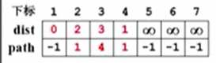

v4的下一个邻接点我们来考虑v5，v5也是没有被访问过的，而且显然任何更新的距离都会小于正无穷，所以v5到源点的距离就会被更新为现在这个v也就是v4的距离加上<v4,v5>这条边的权重，1+2=3，于此同时路径上的顶点也要更新为v4即path[5]=4.完全相似的我们去处理v6和v7，v6的距离就应该被更新为1+8=9，同时v4也是在它的路径上，path[6]=4.同理dist[7]=1+4=5,path[7]=4.到此为止我们处理完了v4这个for循环。进入下一轮while循环。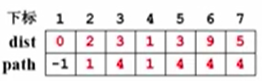

继续从没有收录的顶点中去找dist最小的那个顶点，显然现在是顶点v2，我们把collected[2]=true。然后对v2的每一个邻接点v4和v5做下面的操作。因为是对所有未收录的邻接点，所以这里v4就不用处理了，直接看v5。对于v5来说，现在的最短距离是3。现在v2的距离是2，边的距离是10，加起来12，比原本的v5的距离要大，所以就不用更新。此时关于v2的处理就结束了，我们进入下一轮while，去找下一个dist最小的顶点v收录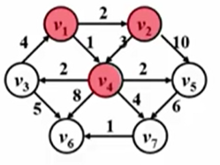

下一个最小的v是哪个？我现在其实有两个候选，一个是v3一个是v5，当前这两个顶点的最短距离都是一样的，那么我们就随便挑一个，从编号小的开始我们选择v3。对v3的每个邻接点，v1和v6进行处理，v1已经访问过了，我们来处理v6就行，v6当前的最短距离是9，而现在v3的距离3加上边的距离5,3+5=8，是小于9的，所以要更新v6的dist值，dist[6]=8,更新路径path[6]=3。结束了v3的处理我们继续去下一个没有收录顶点中收录一个dist最小的。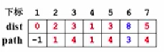

现在是轮到了v5。v5只有一个邻接点v7，v7现在的最短路径是5，而3+6=9，比现在这个大，所以从v5走并不是一条更短的路径，就是不等式是不成立的，不用更新。进入到下一轮while，继续去没有收录的顶点中找一个dist最小的来处理。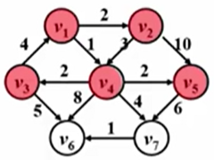

现在是轮到v7了，所以下一个访问的顶点就是v7，v7唯一的邻接点就是v6，v6现在的最短距离dist[6]=8,而v7的距离加上边的距离=5+1=6，比原来的8要小，所以dist[6]更新为6，path[6]更新为7.v7处理完毕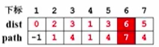

进入下一轮while，继续从未收录的顶点中找dist最小，这次只剩下v6了，我们直接处理v6。因为v6并没有任何的邻接点，所以for循环很快就出来了，到现在为止我们再去找没有收录的顶点中dist的最小值，我们会发现这样的顶点v已经找不到了，这样我们就从while循环从退出了。结束了算法。下面就是结束以后算法的情况，如果我们还要求输出从源点v1到v6的最短路径的最短路径，我们跟无权图的处理是一样的，我们沿着path[6]开始一直倒着在path数组里面找前一个顶点，直到我们找到了源点也就是path值为-1的时候我们就知道了最短路径上的所有顶点。我们倒序输出出来就是我们的最小路径了。这个例子最关键的就是通过v6这个顶点的变化来演示这个算法是如何一层一层更新顶点的最短路的。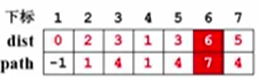

###### 代码--邻接矩阵存储

```c
/* 邻接矩阵存储 - 有权图的单源最短路算法 */

Vertex FindMinDist( MGraph Graph, int dist[], int collected[] )
{ /* 返回未被收录顶点中dist最小者 */
    Vertex MinV, V;
    int MinDist = INFINITY;

    for (V=0; V<Graph->Nv; V++) {
        if ( collected[V]==false && dist[V]<MinDist) {
            /* 若V未被收录，且dist[V]更小 */
            MinDist = dist[V]; /* 更新最小距离 */
            MinV = V; /* 更新对应顶点 */
        }
    }
    if (MinDist < INFINITY) /* 若找到最小dist */
        return MinV; /* 返回对应的顶点下标 */
    else return ERROR;  /* 若这样的顶点不存在，返回错误标记 */
}

bool Dijkstra( MGraph Graph, int dist[], int path[], Vertex S )
{
    int collected[MaxVertexNum];
    Vertex V, W;

    /* 初始化：此处默认邻接矩阵中不存在的边用INFINITY表示 */
    for ( V=0; V<Graph->Nv; V++ ) {
        dist[V] = Graph->G[S][V];
        if ( dist[V]<INFINITY )
            path[V] = S;
        else
            path[V] = -1;
        collected[V] = false;
    }
    /* 先将起点收入集合 */
    dist[S] = 0;
    collected[S] = true;

    while (1) {
        /* V = 未被收录顶点中dist最小者 */
        V = FindMinDist( Graph, dist, collected );
        if ( V==ERROR ) /* 若这样的V不存在 */
            break;      /* 算法结束 */
        collected[V] = true;  /* 收录V */
        for( W=0; W<Graph->Nv; W++ ) /* 对图中的每个顶点W */
            /* 若W是V的邻接点并且未被收录 */
            if ( collected[W]==false && Graph->G[V][W]<INFINITY ) {
                if ( Graph->G[V][W]<0 ) /* 若有负边 */
                    return false; /* 不能正确解决，返回错误标记 */
                /* 若收录V使得dist[W]变小 */
                if ( dist[V]+Graph->G[V][W] < dist[W] ) {
                    dist[W] = dist[V]+Graph->G[V][W]; /* 更新dist[W] */
                    path[W] = V; /* 更新S到W的路径 */
                }
            }
    } /* while结束*/
    return true; /* 算法执行完毕，返回正确标记 */
}
```


#### 多源最短路算法

之前我们说过可以把单元最短路算法使用v次，我们的第一个简单粗暴的方法就是直接去调用单元最短路算法。调用这么多遍在某种情况下是比较适用的，比如说这个图如果是比较稀疏的，我们前面说了它的时间复杂度可以是达到O（VlogV），调用v遍也就是多乘一个V上去，也就是v²logv。它还是比较好的。但是对于稠密图来说它就要在原来的（v²+e）的基础上再乘一个v，也就是	O( |V|³+ |E|*|V|)。所以整个这个算法对于稀疏图的效果比较好。

方法 1：直接将单源最短路算法调用|V| 遍 

- T =  O( |V|³+ |E|*|V|) ---稠密图
- T =  O(|V|²log|V| )---稀疏图

对于稠密图来说，我们需要有一个方法二。Floyd算法的时间复杂度就是O( |V|³  )。看上这两个算法好像都是V³，但是Floyd算法是一个真正V³的算法，没有后面的尾巴 |E|*|V|。所以对于稠密图来说Floyd的效果会好一点。

方法 2 ： Floyd算法

- T =  O( |V|³  )

那么Floyd算法是如何运行的呢?它其实和Dijkstra算法有一点相似，也是说每一条最短路不是一次性形成的，它是逐步成型的，既然我们是在讲一个稠密图，那么我们通常就用邻接矩阵来记稠密图，Floyd算法定义了一个二维数组，也就是一个矩阵，这个矩阵的Dij这个元素定义的是这个路径的最小长度。从i到j但是只经过一部分顶点，这一部分指的是编号小于等于k的这些顶点，也就是只经过编号小于等于k的这些顶点，它的最短路径的长度。那么最终我们要的路径是什么样的呢？假如说我们的顶点编号是从0开始，一直编到v-1，那么当k等于v-1的时候那么这个路径就是真正的最短路径了。所以我们的最短路径是一步一步生成的。是从D0开始，就一开始我们只考虑只有一个顶点，0号顶点进去，然后一步一步的递推，到最后我们得到的这个Dv-1，这个矩阵就存的是i到j真正的最短距离。

那么这里头我们的问题又来了。因为我们从0开始进，0再往前推我们把它记为-1，那么最初的那个D-1，也就是初始的这个矩阵应该怎么定义呢？其实这个D的初始化很简单，就直接把它定义为邻接矩阵就可以了，对角元全部是0，如果i和j之间有一条边的话Dij就定义为这条边的权重。

还有下一个问题，如果i和j没有直接边相连的话Dij应该定义成什么呢？这个值不能随便给，如果如果两个顶点没有直接边相连的话那么它必须要初始化成正无穷，后面才能把它慢慢的变小。那么最关键的步骤就是我们要怎么从一个D递推到下一个D，递推的原理是什么样的呢？对于中间任何一个Dk，如果前面的Dk-1步已经完成，我们递推到Dk的时候我们会面临两种可能。第一种可能是新收进来的这个顶点k它根本就不影响i到j的最短路径，也就是说它不在这个最短路径里面，所以我们就没有必要去更新这个路径，我们只要让Dk=Dk-1保持原样即可。如果新加进去一个k，影响了i到j之间的最短路的话，那么很显然k一定是在这个最短路上，也就是从i到j的最短路径上必须会经过k，更重要的是这个路径一定是由两段最短路径组成的。也就是说把k加进来以后i到j之间的距离一定是等于从i到k的最短距离加上从k到j的最短距离。那么i和k之间的距离以及k和j之间的距离，中间都不包含顶点k的，所以这两个距离应该是在Dk-1步就已经求出来了。所以我们要做的是什么呢？就是在递推到下一步的时候，我们算一下（Dik+Dkj）（k-1），如果更短的话我们就更新一下Dij（k）。

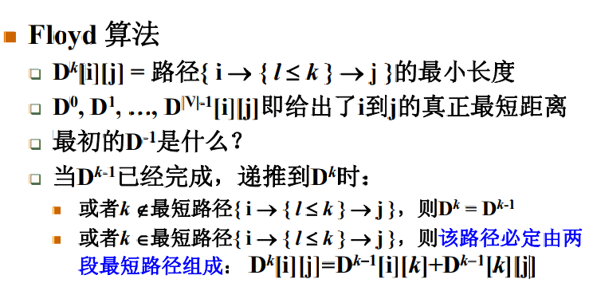

那么我们来看一下Floyd算法，一开始我们把Dij初始化，就是它的邻接矩阵。然后我们对于每一个k，k就是我们刚才的那个上标，从零开始一步一步往后推，对于每一个k来说（一层for），我去检查对于每一对ij（双层for），检查这个Dij的值，如果Dik+Dkj是一个更小的值的话，那么我就更新Dij的值，这样基本上就是Floyd算法的全部了。我们还需要再加些东西，加些什么呢？如果我们不仅要计算ij之间的最短距离，还要求输出他们两个之间的那个最短路径，要怎么办？我们需要另外一个二维数组path，来记录他们的路径。这个二维数组初始化成-1，表示ij之间现在是没有路径的。当这个路径在这一步（ Dij=Dik+Dkj）被更新的时候就意味着在i到j之间一定会经过k，那么我们就把k记在path-ij这个元素里，这样记录了以后我们就可以很容易把i到j之间的最短路径也打印出来。怎么打呢？这其实是一个简单的递归，我如果要打印从i到j的最短路径，那么这个最短路径一定是由从i到k的最短路径加上k到j的最短路径，这么三段组成的，所以我这个程序就可以递归的打印从i到k的路径，然后把这个path-ij的这个k打印出来，然后打k到j的那段路径就可以了。

我们注意到这里有三重for循环的嵌套，所以非常简单的，可以得到Floyd算法的时间复杂度就是V³。

```c
void Floyd() 
{ 
    for ( i = 0; i < N; i++ )
    for( j = 0; j < N; j++ ) {
        D[i][j] = G[i][j]; 
        path[i][j] = -1; 
    }
    for( k = 0; k < N; k++ )
    for( i = 0; i < N; i++ ) 
    for( j = 0; j < N; j++ ) 
    if( D[i][k] + D[k][j] < D[i][j] ) {
        D[i][j] = D[i][k] + D[k][j]; 
        path[i][j] = k;
    }
}
```

###### 代码--邻接矩阵存储

```c
/* 邻接矩阵存储 - 多源最短路算法 */

bool Floyd( MGraph Graph, WeightType D[][MaxVertexNum], Vertex path[][MaxVertexNum] )
{
    Vertex i, j, k;

    /* 初始化 */
    for ( i=0; i<Graph->Nv; i++ )
        for( j=0; j<Graph->Nv; j++ ) {
            D[i][j] = Graph->G[i][j];
            path[i][j] = -1;
        }

    for( k=0; k<Graph->Nv; k++ )
        for( i=0; i<Graph->Nv; i++ )
            for( j=0; j<Graph->Nv; j++ )
                if( D[i][k] + D[k][j] < D[i][j] ) {
                    D[i][j] = D[i][k] + D[k][j];
                    if ( i==j && D[i][j]<0 ) /* 若发现负值圈 */
                        return false; /* 不能正确解决，返回错误标记 */
                    path[i][j] = k;
                }
    return true; /* 算法执行完毕，返回正确标记 */
}
```

#### 哈利 ·波特的考试

故事是这样的，哈利要把猫变成老鼠，咒语是haha。要把老鼠变成鱼咒语是hehe。如果要把猫变成鱼有两种选择，就是先haha变成老鼠，再hehe变成鱼。第二种办法是用lalala咒语直接把猫变成鱼。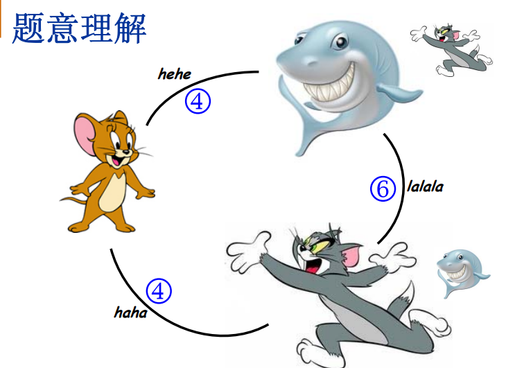

我们衡量一个路径的长度是以字符串的长度为标准的，那么haha+hehe一共是八个字符，lalala是六个字符，所以lalala是把猫变成鱼的更短的路径。这里头你既可以念haha把猫变成老鼠，也可以反过来念咒语ahah把老鼠变成猫，所以这是一个双向的，整个图是一个无向图，每种动物就是图里面的一个顶点，每一条无向边上是有一个权重的，权重为字符串的长度。

现在我们的问题来了。哈利要去考试，他只能带一只动物去，他应该带谁去比较合算？那么我们来挨个看一下，比如他带了猫去，那么如果老师要求他变出一只老鼠的时候他需要念一段4个字符的咒语，如果要变出一条鱼，有两种变法，这里头我们假设哈利永远都会选择最短的那条也就是六个字符的咒语。那么从猫这个出发点，最难变的是鱼。同理如果带鱼去的话他需要四个字符变成老鼠，需要六个字符变成猫，所以对于鱼来讲最难变的是猫。如果带老鼠去，无论是变成鱼还是变成猫都只要念四个字符的咒语，所以对于老鼠来说最难变的一只动物需要四个字符，对于另外两个来说，最难变的都是六个字符。所以显然带老鼠去。

我们来看一个稍微复杂一点的例子，这是这道题目给出的样例。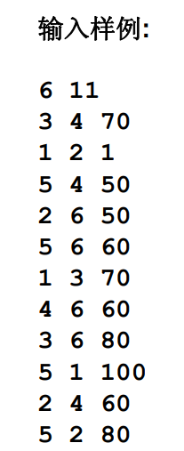

第一个数字6，指的是这个图里面顶点的个数，11表示的是边的个数。接下来每一行给出了一条边对应的就是这么一张无向的网图，这个图比刚才那个图要复杂的多了。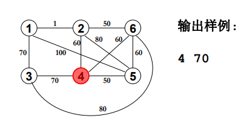

我们很难一眼看出带哪只动物去是最合算的，那么我们第一件要做的事情是首先把任意两个动物之间的最短路径找出来，那么要找图里面任意两个顶点之间的最短路径很显然就是用Floyd算法。通过直接调用这个算法我们可以直接得到一个最短距离的矩阵。我们把这个矩阵叫做D。Dij就记录的是从顶点i到顶点j之间的最短距离。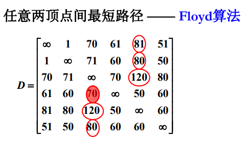

那么在回答哈利应该带哪只动物去的时候我们应该怎么做呢？首先检查每一行里面最大的那个数字，那一行里面最大的数字代表的是什么呢？比如说第一行里面最大的数字是81就意味着第一个动物变成第五个动物是最麻烦的，从1变到5它的最短路径也有81，也就是说我如果带一个动物去那么变成第五个动物是最麻烦的；我如果带第二个动物去也是变成第五个动物最麻烦，有80；带第三个动物去也是五最麻烦，120；如果我们带第四个动物去，最难的动物是第三个动物70；如果我们带5号动物去也是三号动物比较难变；带六号动物也是三比较难变。

那么到底带几号动物去使得我们最难变的动物是最好变的呢？也就是从我们圈出来的这六个最大值里面找一个最小的，也就是70。也就是说我们如果带了四号动物，那么它最困难的一个动物是变成3，咒语长度是70，已经是所有其它最困难的咒语中最容易的一个了。结论就是我们应该带四号动物去，最难变的那个咒语的长度是70.

所以我们来抽象的总结一下就是：我们给了一个抽象的网图，我们要用Floyd算法去算任意两点之间的最短路径。然后我们要去扫描每一个顶点到每一个顶点最短路径中的最大值，把这个最大值记下来以后我们要去找所有顶点里面最大值里面的最小值。

###### 程序框架搭建

接下来我们来看怎么写这个程序，在写main函数里面，我们首先要规划一下我们在main函数里面要做哪几件事情，就这道题而言我们可以非常简单的把它分为两个步骤，第一步我要把输入读进来，并且构架起一个图。然后开始对这个图去做分析，求它的任意两点之间的最短路，我要去找它最短距离里面的最大值，然后再找最大值里面的最小值，我都可以把它放在一个模块里，也就是分析图。

```c
int main()
{
    读入图;
    分析图;
    return 0;
}
```

这样计划了以后我们的main函数直接可以写成这样。就是我先buildGragh建立一个图，分析图我们就写成findAnimal，找动物这件事情交给这个函数去做。有一个细节问题我们先要考虑一下就是这个Gragh应该是哪一种图呢？是邻接表还是邻接矩阵呢？就这个问题我们到底用哪一种图是最合适的呢？因为在解决这个问题的时候我们主要要调用的一个模块是Floyd算法，就Floyd算法而言显然我们是把图表示成一个矩阵更容易做一点，所以在这我们生成的是MGragh也就是一个用邻接矩阵表示的图，我们要运行main函数的时候我们就是要准备两个模块。

```c
int main()
{
    MGraph G = BuildGraph();
    FindAnimal( G );
    return 0;
}
```

我们要建立一个图的话我们首先得有一个MGragh图的定义，如果我们要调用BuildGragh之前我们要有一个函数去CreateGragh，也就是建立一个空的图，然后我们往这个图里面不断的插入边。也就是我们一边读输入一边把这个边插入到图里面去InsertEdge。这两个模块都是BuildGragh需要的。总的来说这个两个模块都是我们现成的，搬过来改一改就能用了。真正要我们去实现的是这个FindAnimal这个模块。

FindAnimal这个模块首先要做的第一件事是调用Floyd算法，把这个图里面任意两点之间的最短路线得到，得到距离矩阵之后我们开始做FindAnimal这件事情也就是找到底应该带哪只动物去，这里就涉及到一个求最大距离，一个求最短距离。也就是说我首先要对第i个动物去找它最短距离中的最大距离，然后要求所有这些最大距离中的最小值。然后把这个最小值交给FindAnimal这个函数最后去输出。

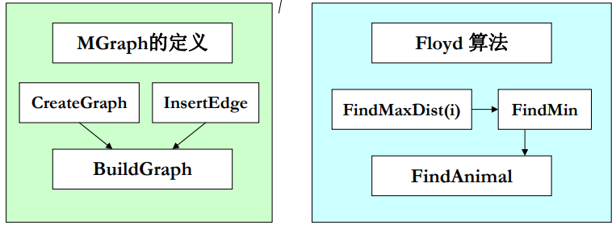

###### 选择动物

先来看看FindAnimal这个函数--传进来一个图。首先第一件事情是调用Floyd算法，首先是调用Floyd算法，把这个图传进去，得到一个距离矩阵D。接下来我可以把FindMin（从各个动物最短距离中的最大值找最小值）写成一个函数，也可以直接把FindMin就写在FindAnimal函数里面，总之这个模块要做的事情就是从各个动物最短距离中的最大值找最小值MinDist，以及对应的动物Animal。执行完了之后就输出编号以及最小距离。

本质上就是要从一堆距离中找最大值。技巧就是把MinDist定义成一个很大的数，然后我就开始扫描每一个动物，对于每一个动物来说我调用另一个函数叫做FindMaxDist--也就是找到第i个动物最大的那个距离MaxDist，然后把MAxDist和MinDist做比较，如果MaxDist比较小就更新MinDist，然后记录动物编号。注意这边编号是i+1，因为题目里面是从1开始编号的。从for循环跳出来了以后就扫描完了所有的动物，也就得到所有最大值的最小值和动物的编号，输出即可。

在for循环中我们有一种特殊情况需要考虑，也就是你带一只动物去根本不可能，什么时候会这样呢？也就是这个图根本不连通的时候，我有不止一个连通集所以带一只动物去根本是不可能的。那么我怎么才能知道这个图是不连通的？也就是当我返回的这个MaxDist是无穷大，就说明有i无法变出的动物。剩下的边边角角的细节就是你下面需要什么变量在前面要声明一下。

```c
void FindAnimal( MGraph Graph )
{ 
    WeightType D[MaxVertexNum][MaxVertexNum], MaxDist, MinDist;
    Vertex Animal, i;
    Floyd( Graph, D );
    MinDist = INFINITY;
    for ( i=0; i<Graph->Nv; i++ ) {
        MaxDist = FindMaxDist( D, i, Graph->Nv );
        if ( MaxDist == INFINITY ) { /* 说明有从i无法变出的动物 */
            printf("0\n");
            return;
        }
        if ( MinDist > MaxDist ) { /* 找到最长距离更小的动物 */
            MinDist = MaxDist; Animal = i+1; /* 更新距离，记录编号 */
        }
    }
    printf("%d %d\n", Animal, MinDist);
}

```

这里还有一个小的函数叫做FindDist.找最大值的技巧就是把MaxDist初始化成一个很小的数，扫描第i个动物到第j个动物的距离，如果这个距离比MaxDist大就更新MaxDist，但是这里有一个特殊情况要考虑，由于我们邻接矩阵最开始初始化是全部初始化成正无穷的，所以对角元的值永远是正无穷，如果我们在比较的过程中我们不把对角元排除掉的话，那么这个对角元的无穷肯定会更新到MaxDist，这是我们不希望的。所以还需要增加一个条件，也就是i≠j

```c
WeightType FindMaxDist( WeightType D[][MaxVertexNum], Vertex i, int N )
{
    WeightType MaxDist;
    Vertex j;
    MaxDist = 0;
    for( j=0; j<N; j++ ) /* 找出i到其他动物j的最长距离 */
    if ( i!=j && D[i][j]>MaxDist )
    MaxDist = D[i][j];
    return MaxDist;
}

```

###### 模块的引用与裁剪

在这道题目里面我们可以现成调用的模块有这么五个

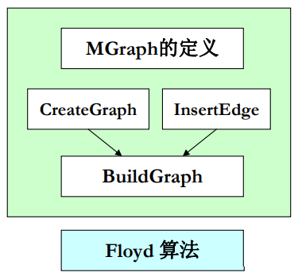

从MGragh的定义开始，下面是MGragh定义的程序头。在这里面我们唯一需要删掉的是“顶点存储的数据类型设为字符型”，在我们这个问题里面每一个顶点代表的是一个动物，但是我们不存这个动物的名字，所以这个定义可以删掉

```c
/* 图的邻接矩阵表示法 */

##define MaxVertexNum 100    /* 最大顶点数设为100 */
##define INFINITY 65535        /* ∞设为双字节无符号整数的最大值65535*/
typedef int Vertex;         /* 用顶点下标表示顶点,为整型 */
typedef int WeightType;        /* 边的权值设为整型 */
//typedef char DataType;        /* 顶点存储的数据类型设为字符型 */
```

剩下的边的定义没有什么好说的，我们需要它的两个顶点和它的权重，这都没什么问题；在图的定义里面多余的就是顶点的数据因为顶点不存数据所以这两行可以删掉。

```c
/* 边的定义 */
typedef struct ENode *PtrToENode;
struct ENode{
    Vertex V1, V2;      /* 有向边<V1, V2> */
    WeightType Weight;  /* 权重 */
};
typedef PtrToENode Edge;
       
/* 图结点的定义 */
typedef struct GNode *PtrToGNode;
struct GNode{
    int Nv;  /* 顶点数 */
    int Ne;  /* 边数   */
    //WeightType G[MaxVertexNum][MaxVertexNum]; /* 邻接矩阵 */
    //DataType Data[MaxVertexNum];      /* 存顶点的数据 */
    /* 注意：很多情况下，顶点无数据，此时Data[]可以不用出现 */
};
typedef PtrToGNode MGraph; /* 以邻接矩阵存储的图类型 */
```

下面是CreateGragh，唯一需要注意的是这里的图的编号是从0开始的。到题目里的编号需要一个简单的映射。InsertEdge函数也是可以直接引用不需要任何改动的。

```c
MGraph CreateGraph( int VertexNum )
{ /* 初始化一个有VertexNum个顶点但没有边的图 */
    Vertex V, W;
    MGraph Graph;
    
    Graph = (MGraph)malloc(sizeof(struct GNode)); /* 建立图 */
    Graph->Nv = VertexNum;
    Graph->Ne = 0;
    /* 初始化邻接矩阵 */
    /* 注意：这里默认顶点编号从0开始，到(Graph->Nv - 1) */
    for (V=0; V<Graph->Nv; V++)
        for (W=0; W<Graph->Nv; W++)  
            Graph->G[V][W] = INFINITY;
            
    return Graph; 
}

       
void InsertEdge( MGraph Graph, Edge E )
{
     /* 插入边 <V1, V2> */
     Graph->G[E->V1][E->V2] = E->Weight;    
     /* 若是无向图，还要插入边<V2, V1> */
     Graph->G[E->V2][E->V1] = E->Weight;
}
```

接下来就到了最关键的BuildGragh，我要从输入的数据读进来建立一个图，首先读顶点的个数，然后建立一个空图，然后读入边的个数，如果边数不为0就是有边的话那么我们就创建一个边结点，然后就把边的数据读进来插入图里面。最后如果顶点有数据的话我们还需要读入顶点的数据，在这个问题里面我们的顶点是没有数据的。所以这一块可以删掉，V也是不必要的。接下来的一个细节的问题就是当我们往图里面插入边的时候，这个图默认的编号是从0开始的，而当我们从输入里面把这个边读进来的时候，动物的编号是从1开始的，所以在这个地方我们不能直接插入边，我们只需要做一个简单的-1映射即可。

```c
MGraph BuildGraph()
{
    MGraph Graph;
    Edge E;
    //Vertex V;
    int Nv, i;
    
    scanf("%d", &Nv);   /* 读入顶点个数 */
    Graph = CreateGraph(Nv); /* 初始化有Nv个顶点但没有边的图 */ 
    
    scanf("%d", &(Graph->Ne));   /* 读入边数 */
    if ( Graph->Ne != 0 ) { /* 如果有边 */ 
        E = (Edge)malloc(sizeof(struct ENode)); /* 建立边结点 */ 
        /* 读入边，格式为"起点 终点 权重"，插入邻接矩阵 */
        for (i=0; i<Graph->Ne; i++) {
            scanf("%d %d %d", &E->V1, &E->V2, &E->Weight); 
            /* 注意：如果权重不是整型，Weight的读入格式要改 */
            E->V1--;E->v2--;//加上这行，做一个简单的映射
            InsertEdge( Graph, E );
        }
    } 

    /* 如果顶点有数据的话，读入数据 */
    //for (V=0; V<Graph->Nv; V++) 
        //scanf(" %c", &(Graph->Data[V]));

    return Graph;
}
```

最后是Floyd算法，这里的Floyd算法不仅要计算出任意两点之间最短距离这个数值，同时还要记录他们之间的路径，而在我们这道题里面不需要记录路径，所以所有和path相关的句子都可以删除。还有一个判断是说Floyd算法为什么要返回一个bool值呢？一般情况下它是可以正常结束的，如果正常结束的话我们就返回一个true，表示正常结束了。如果返回一个flase，那就表示出现了负值圈，也就是当i＝j的时候D的值是负数，也就是走了一圈回来的最短距离是一个负值，如果有负值圈的话Floyd算法是错的，这个时候我们就不继续做了，直接返回flase。但是在这个题目里这个判断是不需要的，因为我们保证输入的所有距离都是正的。它永远都是返回true。那么这个bool值也是没有必要的，直接改成void即可。这样我们就完成了代码的裁剪。

```c
//bool
void Floyd( MGraph Graph, WeightType D[][MaxVertexNum]
           //, Vertex path[][MaxVertexNum] 
          )
{
    Vertex i, j, k;

    /* 初始化 */
    for ( i=0; i<Graph->Nv; i++ )
        for( j=0; j<Graph->Nv; j++ ) {
            D[i][j] = Graph->G[i][j];
            //path[i][j] = -1;
        }

    for( k=0; k<Graph->Nv; k++ )
        for( i=0; i<Graph->Nv; i++ )
            for( j=0; j<Graph->Nv; j++ )
                if( D[i][k] + D[k][j] < D[i][j] ) {
                    D[i][j] = D[i][k] + D[k][j];
                    //if ( i==j && D[i][j]<0 ) /* 若发现负值圈 */
                        //return false; /* 不能正确解决，返回错误标记 */
                    //path[i][j] = k;
                }
    //return true; /* 算法执行完毕，返回正确标记 */
}
```


## 最小生成树问题

什么是最小生成树呢？之前有一个村村通的例子，也就是说我有很多分散的村落，每两个村落之间都是可以修路的，但是作为一个镇长来说我希望花费更少的钱，就能够把所有的这些小村落全部都连通起来，也就是说我想做成一个连通图这个连通图里面应该有最少的边。而且每一条边的选择就是每一条路的选择，我要选的是最好建的或者说建起来花销最小的那些边。那整个这个问题就可以归纳为一个最下生成树问题。

#### 什么是最小生成树(Minimum Spanning Tree)

什么是最小生成树呢？英文叫做(Minimum Spanning Tree)，这个名字信息量很大，包括了三个概念，首先它是一棵树，再一个它要是生成树，它还得是最小的生成树。他们分别是什么意思呢？

我们一样一样的来看，我们说树是一种特殊的图，特殊在哪里？首先一棵树它一定是连通的，其它它里面一定没有回路，再者，如果整个图有v个顶点的话他们它一定恰好有v-1条边，不能多也不能少。

什么叫生成树呢？也就说它包含了全部的顶点，图里面所有的顶点都一定要在这棵树里面，而这棵树的所有v-1条边都在原始的图里是有的。来看一个例子，下面是一个包含了四个顶点的一个完全图，也就是说我有四个村子，任意两个存在之间我是都有可能修路的，那么我要如何修路才能保证说任何两个村子之间我都至少有一条通路可以走过去呢？那么其实有好几种做法，这三个子图其实都是这个完全图的生成树，所以说生成树是不唯一的，我们有很多种方法只要就是说四个顶点三条边然后没有回路--要注意到**我们在生成树里面任意加一条边都一定会构成回路**。

什么是最小呢？是指的这个树里面这些边的权重和是最小的，也就是说我有很多种修路的办法，我选哪三条边才使得三条边的权重和是最小呢？这就是一个最小生成树问题。

一个很显然的结论是说最小生成树如果存在，图一定是连通的。反过来说，如果图是连通的话我们是一定可以找到一颗最小生成树的，这是一个充分必要条件。

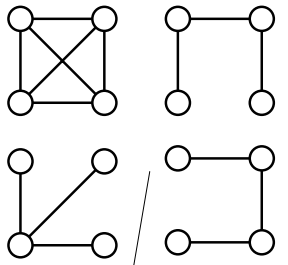

- 是一棵 树
  - 无回路
  - |V|个顶点一定有|V|-1条边
- 是生成树
  - 包含全部顶点
  - |V|-1条边都在图里
- 边的权重和最小

#### 贪心算法

解决最小生成树问题，我们有不同的算法，不管是哪一种它都可以归结为是贪心算法。什么是贪，贪的意思就是我解决这个问题是一步一步解决的，而在解决问题的过程中每一步我都要是最好的，只要眼前最好的，这就叫做贪。于是我们很重要的是要定义什么是好，在不同的问题里，好有不同的定义，我们这个最小生成树问题里，所谓好就是权重最小的边，我每次都要一条权重最小的边，这个就叫做贪心，这么说的话，问题是不是就变得非常简单了呢？是不是只要把边的权重来排个序，我从最小的开始收，收够了v-1条边为止，可以这样么？没有这么简单，因为我们有约束条件，注意到我们要的是生成树，首先我们只能用图里面有的边，原图里面没有的边是不能用的；第二我们我们必须正好用掉v-1条边，不能多也不能少。还有一个非常重要的，我们要生成的是一棵树，意味着每一条边当收进来的时候都不能在现有的树中形成回路。所以记住这三条约束，在满足这三条约束的条件下，我们来做一个贪心算法。

- 什么是“贪”：每一步都要最好的
- 什么是“好”：权重最小的边
- 需要约束：
  - 只能用图里有的边
  - 只能正好用掉|V|-1条边
  - 不能有回路

###### Prim算法 — 让一棵小树长大

贪心算法有两种非常有名的算法，首先来看看Prim算法，Prim算法的基本思路是从一个根节点开始，让一颗小树慢慢长大。这是什么意思呢？我们来看一个例子。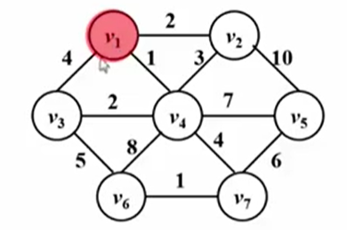我们首先在这个图里面随便选一个结点作为它的根节点，我们从v1开始，那么这课树里面我就先收罗了v1顶点，然后我要找的是什么呢？我要找一条最小的边，但是这条最小的边不能随便找，是要找跟这棵树有关系的，往外长能长出去的最小边，那也就是说跟v1直接相关的，三条边里面选一条最小的，我把这条边收进来，就意味着把它的另一端的顶点v4也收进来了。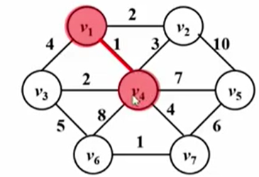

这时候我的树就长大了一点，有了两个顶点。然后我继续往外长这棵树，就是以v1和v4为基础然后想往外长下一步，能长得出去的最小边是哪条呢？我们看到在这个图里面我们有两种选择，这里<v1,v2>和<v3,v4>权重都是2，有一个更小的1收不进来，因为1和这棵树挨不上。在这两个2的边里面我们选一个。比如说我先选上面这个2选了这条边以后v2就被收罗在内了。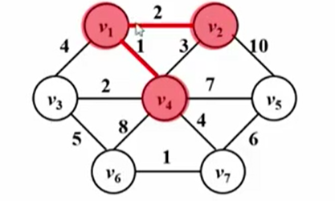

于是我们继续看跟现在这棵树相关的还有那条边比较小。刚刚另外那个2也进来了。

继续看和还有那条边比较小？是3，但是3这条边不能收进来，因为会形成回路。同理，有一个4也不行。但是另外一个4可以。我们把它收进来。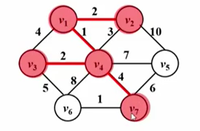

v7一进来，1那条边也可以收了。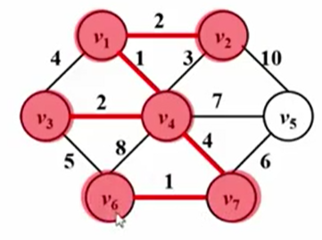

最后把6也收进来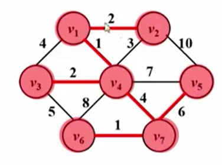

到此为止，我们已经把全部的七个顶点都收进来了。正好有六条边。于是就形成了我们的最小生成树。这就是Prim算法。有没有觉得Prim算法和Dijkstra算法很眼熟？我们看看他们像到什么程度。

回顾一下Dijkstra算法，就是每一次从没有收录的顶点中收录一个，注意到我们每次也都是一个一个顶点收录进去的，它每次从没有收录的顶点中找一个dist最小的，收进来，对于它的每一个邻接点看看邻接点的dist有没有受到影响，如果这个邻接点还没被收进来并且受到了影响，那么我们就更新一下dist值。这就是Dijkstra算法的基本思路。

```c
void Dijkstra( Vertex s )
{ 
    while (1) {
        V = 未收录顶点中dist最小者;
        if ( 这样的V不存在 )
        break; 
        collected[V] = true;
        for ( V 的每个邻接点 W )
        if ( collected[W] == false ) 
        if ( dist[V]+E<V,W> < dist[W] ){ 
            dist[W] = dist[V] + E<V,W> ;
            path[W] = V;
        }
    }
}
```

那么Prim算法不同的是第一步我先要初始化一颗最小生成树，至于最小生成树怎么表示我们回头再说，我们先随便选一个根节点s，然后进入while循环，在这个循环里我们依然是从没有收录的顶点中找dist最小的

接下来问题就来了--这个dist到底应该是什么？在这个最小生成树的问题里，我们把dist定义成一个顶点V到这棵最小生成树的最小距离，我们把V和这棵生成树里面应该收罗进去的顶点之间所有的距离里面最小的那个叫做V到这棵树里面的最小距离，然后我们每次要从dist中找一个最小的。在这里有一个问题，dist应该怎么初始化？如果一开始V和根节点有直接边相连的话，那么一开始到树的最小距离dist就是边的权重，如果一开始V和s没有直接的边那么就定义为无穷大。

另外一个问题就是我们如果存这个树呢？需要定义一个树节点然后把树构建起来吗？没有必要，有一个很简单的办法就是对每一个顶点，我去存它的parent，即它的父节点的编号，这跟并查集里面的概念差不多，我们先选了一个根节点s，我们就把parent[s]定义为-1，所以当我们发现某一个结点的parent是-1的时候我们就知道它是根结点了。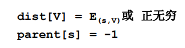

如果这样的dist最小的V不存在我们就退出循环，如果存在我们就收入进最小生成树。什么叫收进最小生成树呢？我们把V收进最小生成树就意味着这个顶点到这棵树的距离就变成0了，因为它已经是这棵树的一部分了，所以我们只需要把dist[V]设成0就意味着我们已经把V收录进最小生成树了。收进来以后我要看一下V的每个邻接点有没有被影响，如果邻接点W没有被收录（即dist值为0），如果这个V和W之间有一条直接边并且是小于w的dist值的，那么就把W的dist值更新一下，并且这个V就有可能是W的parent（如果W在某次被收录进去的时候dist还是没有更新的话）。

这就是整个收录的过程，那么什么时候跳出来？也就是这样的dist最小的V不存在的时候我们就跳出while。这个时候跳出来有两种可能，一种可能是没有未收录的顶点了也就是所有的顶点都已经在树里面了，如果是这种情况的话那么就成功了，程序顺利结束。还有一种可能就是，未收录的顶点中所有的dist都是无穷大。也就是说剩下的这些顶点和这个树没有边了。也就是说这个图其实是不连通的。所以我们跳出来的时候我们要数一下顶点的个数，如果个数正好是V个，那么就顺利结束。如果不到V个那么就意味着生成树不存在，换言之也就是整个图不连通。

时间复杂度也就取决于我们是如何来寻找未收录顶点中dist的最小者的。如果我们简单粗暴的扫描的话那么时间复杂度就是O（V²），之所以要简单粗暴的做是因为如果这个图是稠密图的话那么简单粗暴的方法就比较合适，并且容易实现。但是如果是稀疏图那么我们就有另外一种方法了

```c
void Prim()
{ 
    MST = {s};
    while (1) {
        V = 未收录顶点中dist最小者;
        if ( 这样的V不存在 )
        break; 
        将V收录进MST: dist[V] = 0;
        for ( V 的每个邻接点 W )
        if ( W未被收录 ) 
        if ( E(V,W) < dist[W] ){
            dist[W] = E(V,W) ;
            parent[W] = V;
        }
    }
    if ( MST中收的顶点不到|V|个 )
    Error ( “生成树不存在” );
}
```

###### 代码--邻接矩阵存储Prim算法

```c
/* 邻接矩阵存储 - Prim最小生成树算法 */

Vertex FindMinDist( MGraph Graph, WeightType dist[] )
{ /* 返回未被收录顶点中dist最小者 */
    Vertex MinV, V;
    WeightType MinDist = INFINITY;

    for (V=0; V<Graph->Nv; V++) {
        if ( dist[V]!=0 && dist[V]<MinDist) {
            /* 若V未被收录，且dist[V]更小 */
            MinDist = dist[V]; /* 更新最小距离 */
            MinV = V; /* 更新对应顶点 */
        }
    }
    if (MinDist < INFINITY) /* 若找到最小dist */
        return MinV; /* 返回对应的顶点下标 */
    else return ERROR;  /* 若这样的顶点不存在，返回-1作为标记 */
}

int Prim( MGraph Graph, LGraph MST )
{ /* 将最小生成树保存为邻接表存储的图MST，返回最小权重和 */
    WeightType dist[MaxVertexNum], TotalWeight;
    Vertex parent[MaxVertexNum], V, W;
    int VCount;
    Edge E;
    
    /* 初始化。默认初始点下标是0 */
       for (V=0; V<Graph->Nv; V++) {
        /* 这里假设若V到W没有直接的边，则Graph->G[V][W]定义为INFINITY */
           dist[V] = Graph->G[0][V];
           parent[V] = 0; /* 暂且定义所有顶点的父结点都是初始点0 */ 
    }
    TotalWeight = 0; /* 初始化权重和     */
    VCount = 0;      /* 初始化收录的顶点数 */
    /* 创建包含所有顶点但没有边的图。注意用邻接表版本 */
    MST = CreateGraph(Graph->Nv);
    E = (Edge)malloc( sizeof(struct ENode) ); /* 建立空的边结点 */
           
    /* 将初始点0收录进MST */
    dist[0] = 0;
    VCount ++;
    parent[0] = -1; /* 当前树根是0 */

    while (1) {
        V = FindMinDist( Graph, dist );
        /* V = 未被收录顶点中dist最小者 */
        if ( V==ERROR ) /* 若这样的V不存在 */
            break;   /* 算法结束 */
            
        /* 将V及相应的边<parent[V], V>收录进MST */
        E->V1 = parent[V];
        E->V2 = V;
        E->Weight = dist[V];
        InsertEdge( MST, E );
        TotalWeight += dist[V];
        dist[V] = 0;
        VCount++;
        
        for( W=0; W<Graph->Nv; W++ ) /* 对图中的每个顶点W */
            if ( dist[W]!=0 && Graph->G[V][W]<INFINITY ) {
            /* 若W是V的邻接点并且未被收录 */
                if ( Graph->G[V][W] < dist[W] ) {
                /* 若收录V使得dist[W]变小 */
                    dist[W] = Graph->G[V][W]; /* 更新dist[W] */
                    parent[W] = V; /* 更新树 */
                }
            }
    } /* while结束*/
    if ( VCount < Graph->Nv ) /* MST中收的顶点不到|V|个 */
       TotalWeight = ERROR;
    return TotalWeight;   /* 算法执行完毕，返回最小权重和或错误标记 */
}
```


###### Kruskal算法 — 将森林合并成树

如果图是比较稀疏的，也就是边的个数较顶点来说较少--差不多和顶点是同一个数量级的。在这种情况下我们有一个更好的算法是Kruskal算法，基本思想是把森林合并成一棵树。Kruskal算法的思想比Prim算法的思想更好理解，它的想法就是直接了当的贪心。也就是在这个图里面每次就找一个权重最小的边收进来。所以在这里我们很明显的看到有两条权重为1的边，我们就直接把它们收进来。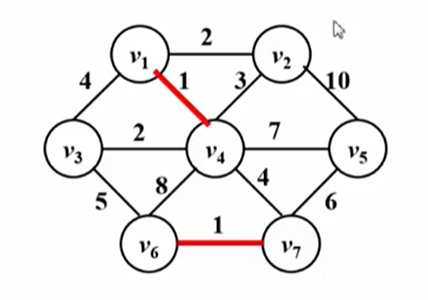

什么叫把森林合并成树呢？也就是在初始的状况下它认为每一个顶点都是一棵树，然后我通过不断的把边收进来，就把两棵树并成了一棵树，最后我要把所有的结点都并成一棵树。下面继续收两条为权重为2的边。

下条权重最小的是3，但是3是不能收进来的。因为收进来以后就形成回路了。同理V1和V3之间的4也是不能收进来的。但是<V4,V7>是可以收进来的。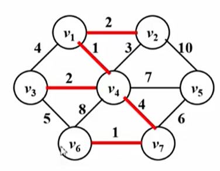

接下来<v3,v6>不能要。把<v7,v5>收进来，这时候我们已经有六条边了，到此为止我们就肯定生成了最小生成树。这就是Kruskal算法的基本思想。

下面来看看Kruskal算法的伪代码。在这个算法里面这个最小生成树收集的就不是顶点了，而是边，一开始的时候一条边都没有，所以一开始是一个空集。然后我们进入while循环，每一次我们从边集里选一条权重最小的边，把这条边从边集合里删除。然后检查一下，如果这条边加到最小生成树以后不会构成回路，我们就把这条边加入最小生成树中。如果这条边是构成回路的，那么我们就彻底无视这条边，生成树里不要它，边集合里面也删除它。重复上述的while如果边数还不到V-1,并且E中还有边，那么我们就继续。

整体的时间复杂度取决于我们如何实现---从 E 中取一条权重最小的边 E(v,w) ;--这个功能的。简单粗暴的遍历所有边和把所有的边排序都是不合算的，最聪明的方法是使用最小堆。把所有的边按照它的权重放到一个最小堆里，每次用一个logE的复杂度就可以取出一条权重最小的边。另外还有一点需要考虑就是什么叫--E(V,W)不在 MST 中构成回路--，我们怎么知道有没有构成回路？解决方案是使用并查集。我们一开始认为每一个顶点都是独立的一棵树，也就相当于并查集一开始认为每一个顶点都是一个独立的集合。当我们把一条边收进去的时候，就意味着我们把两棵树并成了一棵，也就是把两个集合并成了一个集合。什么时候构成回路呢？也就是当我把一个边<v,w>往生成树里放的时候我应该先检查v属于哪个集合w属于哪个集合。如果v和w分别属于不同的树，那么我把这条边加进去也就相当于把两个互不相连的集合并成了一个集合，这样肯定是不会构成回路的。如果v和w本身已经在同一棵树（集合）里面了，那么那么我加这条边进去一定会在树里面构成回路。

接下来就是我们从while循环出来后会面临几种情况呢？第一种情况就是最小生成树里面正好有v-1条边，成功！如果没有v-1条边就跳出来了，意味着E中已经没有边了，也就是说原图不连通，生成树不存在。

如果我们用最小堆和并查集实现Kruskal算法，那么时间复杂度就是O（ElogE）

```c
void Kruskal ( Graph G )
{ 
    MST = { } ;
    while ( MST 中不到 |V| -1 条边 && E 中还有边 ) {
    从 E 中取一条权重最小的边 E(v,w) ;
    将 E(v,w)从 E 中删除;
    if ( E(V,W)不在 MST 中构成回路) 
    将 E(V,W) 加入 MST;
    else
    彻底无视 E(V,W);
    }
    if ( MST 中不到 |V| -1 条边 )
    Error ( “生成树不存在” );
}
```

###### 代码--邻接表存储Kruskal算法

```c
/* 邻接表存储 - Kruskal最小生成树算法 */

/*-------------------- 顶点并查集定义 --------------------*/
typedef Vertex ElementType; /* 默认元素可以用非负整数表示 */
typedef Vertex SetName;     /* 默认用根结点的下标作为集合名称 */
typedef ElementType SetType[MaxVertexNum]; /* 假设集合元素下标从0开始 */

void InitializeVSet( SetType S, int N )
{ /* 初始化并查集 */
    ElementType X;

    for ( X=0; X<N; X++ ) S[X] = -1;
}

void Union( SetType S, SetName Root1, SetName Root2 )
{ /* 这里默认Root1和Root2是不同集合的根结点 */
    /* 保证小集合并入大集合 */
    if ( S[Root2] < S[Root1] ) { /* 如果集合2比较大 */
        S[Root2] += S[Root1];     /* 集合1并入集合2  */
        S[Root1] = Root2;
    }
    else {                         /* 如果集合1比较大 */
        S[Root1] += S[Root2];     /* 集合2并入集合1  */
        S[Root2] = Root1;
    }
}

SetName Find( SetType S, ElementType X )
{ /* 默认集合元素全部初始化为-1 */
    if ( S[X] < 0 ) /* 找到集合的根 */
        return X;
    else
        return S[X] = Find( S, S[X] ); /* 路径压缩 */
}

bool CheckCycle( SetType VSet, Vertex V1, Vertex V2 )
{ /* 检查连接V1和V2的边是否在现有的最小生成树子集中构成回路 */
    Vertex Root1, Root2;

    Root1 = Find( VSet, V1 ); /* 得到V1所属的连通集名称 */
    Root2 = Find( VSet, V2 ); /* 得到V2所属的连通集名称 */

    if( Root1==Root2 ) /* 若V1和V2已经连通，则该边不能要 */
        return false;
    else { /* 否则该边可以被收集，同时将V1和V2并入同一连通集 */
        Union( VSet, Root1, Root2 );
        return true;
    }
}
/*-------------------- 并查集定义结束 --------------------*/

/*-------------------- 边的最小堆定义 --------------------*/
void PercDown( Edge ESet, int p, int N )
{ /* 改编代码4.24的PercDown( MaxHeap H, int p )    */
  /* 将N个元素的边数组中以ESet[p]为根的子堆调整为关于Weight的最小堆 */
    int Parent, Child;
    struct ENode X;

    X = ESet[p]; /* 取出根结点存放的值 */
    for( Parent=p; (Parent*2+1)<N; Parent=Child ) {
        Child = Parent * 2 + 1;
        if( (Child!=N-1) && (ESet[Child].Weight>ESet[Child+1].Weight) )
            Child++;  /* Child指向左右子结点的较小者 */
        if( X.Weight <= ESet[Child].Weight ) break; /* 找到了合适位置 */
        else  /* 下滤X */
            ESet[Parent] = ESet[Child];
    }
    ESet[Parent] = X;
}

void InitializeESet( LGraph Graph, Edge ESet )
{ /* 将图的边存入数组ESet，并且初始化为最小堆 */
    Vertex V;
    PtrToAdjVNode W;
    int ECount;

    /* 将图的边存入数组ESet */
    ECount = 0;
    for ( V=0; V<Graph->Nv; V++ )
        for ( W=Graph->G[V].FirstEdge; W; W=W->Next )
            if ( V < W->AdjV ) { /* 避免重复录入无向图的边，只收V1<V2的边 */
                ESet[ECount].V1 = V;
                ESet[ECount].V2 = W->AdjV;
                ESet[ECount++].Weight = W->Weight;
            }
    /* 初始化为最小堆 */
    for ( ECount=Graph->Ne/2; ECount>=0; ECount-- )
        PercDown( ESet, ECount, Graph->Ne );
}

int GetEdge( Edge ESet, int CurrentSize )
{ /* 给定当前堆的大小CurrentSize，将当前最小边位置弹出并调整堆 */

    /* 将最小边与当前堆的最后一个位置的边交换 */
    Swap( &ESet[0], &ESet[CurrentSize-1]);
    /* 将剩下的边继续调整成最小堆 */
    PercDown( ESet, 0, CurrentSize-1 );

    return CurrentSize-1; /* 返回最小边所在位置 */
}
/*-------------------- 最小堆定义结束 --------------------*/


int Kruskal( LGraph Graph, LGraph MST )
{ /* 将最小生成树保存为邻接表存储的图MST，返回最小权重和 */
    WeightType TotalWeight;
    int ECount, NextEdge;
    SetType VSet; /* 顶点数组 */
    Edge ESet;    /* 边数组 */

    InitializeVSet( VSet, Graph->Nv ); /* 初始化顶点并查集 */
    ESet = (Edge)malloc( sizeof(struct ENode)*Graph->Ne );
    InitializeESet( Graph, ESet ); /* 初始化边的最小堆 */
    /* 创建包含所有顶点但没有边的图。注意用邻接表版本 */
    MST = CreateGraph(Graph->Nv);
    TotalWeight = 0; /* 初始化权重和     */
    ECount = 0;      /* 初始化收录的边数 */

    NextEdge = Graph->Ne; /* 原始边集的规模 */
    while ( ECount < Graph->Nv-1 ) {  /* 当收集的边不足以构成树时 */
        NextEdge = GetEdge( ESet, NextEdge ); /* 从边集中得到最小边的位置 */
        if (NextEdge < 0) /* 边集已空 */
            break;
        /* 如果该边的加入不构成回路，即两端结点不属于同一连通集 */
        if ( CheckCycle( VSet, ESet[NextEdge].V1, ESet[NextEdge].V2 )==true ) {
            /* 将该边插入MST */
            InsertEdge( MST, ESet+NextEdge );
            TotalWeight += ESet[NextEdge].Weight; /* 累计权重 */
            ECount++; /* 生成树中边数加1 */
        }
    }
    if ( ECount < Graph->Nv-1 )
        TotalWeight = -1; /* 设置错误标记，表示生成树不存在 */

    return TotalWeight;
}
```

## 拓扑排序

#### 例：计算机专业排课

整个表就告诉了我们整个计算机专业的课程之间他们的相互依赖的关系。这只有15门课而已，所以还是可以比较容易的把整个课程给理出来的。但是当这个课程数量大大增加的时候，这就变成了一个相当复杂的事情。这就可能需要写一个程序来解决这个问题。那么在我们数据结构里头有什么工具可以用来解决这个问题呢？

显然在这一章里面我们是用图来描述一个问题的。我们说要描述一个图，我们需要搞清楚两件事情。一个，什么是它的顶点。在这里比较好想，我就把每一门课看做是一个顶点即可。第二个问题就是什么是边呢？在这个问题里面，这个边肯定是一个有向边，如果从一个顶点到另一个顶点，也就是从一门课到另一门课有边的话就意味着前面的这门课是后面这门课的预修课程。就是如果他们之间有预修课程关系的话他们之间就会有一条边。就对这个例子我们的图要怎么画呢？我们可以观察到我们这里有四门课是没有预修课程的。我们先把这四个顶点画出来。然后我们看到数据结构C3它的预修课程是C1，C2。于是在这个图里面C3的前驱节点就有两个，分别是C1和C2。依次连接后面的顶点我们就可以把图画出来。这样我们就完成了计算机专业课的关系依赖图。这种图有一种名字----AOV (Activity On Vertex)网络。也就是在这个有向图里面所有的真实活动是表现在顶点上的。顶点和顶点之间的有向边表示了两个活动之间的先后顺序。

我们把整个问题抽象一下就抽象成拓扑排序了

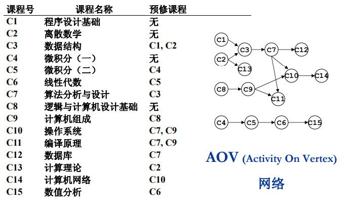

拓扑序就是说在AOV图里面如果有一条有向的路径的话，那么输出的时候V就一定排在V之前。换言之如果学习w之前要学习v的话，在输出的时候v一定要在w之前输出。满足这个条件的一个顶点序列就称为一个拓扑序。获得一个拓扑序的过程我们就叫做拓扑排序。一个AOV如果有合理的拓扑序，那么它一定是有向且无环的图。什么叫合理的拓扑序呢？如果这个图里面有一个环的话，就意味着v这个活动它自己是它自己的前驱，也就是说v活动开始之前就要已经结束了。这是一个不可能的事情。所以如果这个有向图里面存在环那么它就一定不可能得到一个合理的拓扑序。

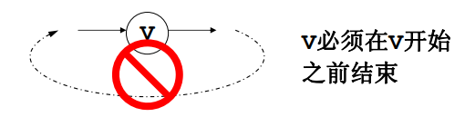

所以

- 拓扑序：如果图中从V到W有一条有向路径， 则V一定排在W之前。满足此条件的顶点序列 称为一个拓扑序

- 获得一个拓扑序的过程就是拓扑排序
- AOV如果有合理的拓扑序，则必定是有向无环 图（Directed Acyclic Graph, DAG）

我们继续回到刚刚的排课，如果给定了这样一个AOV网络，我们如何把这个课的顺序排出来？首先我们第一个学期可以排哪些课？肯定是排没有预修课程的课。说先输出那四门课，先后顺序无所谓。假如说我们先输出1这个顶点，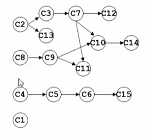

然后我们把1顶点从图中抹掉，更重要的是把边也抹掉。抹掉这条边以后我们再检查剩下的图我们仍然有三个，然后再随便再输出一个。把2也输出。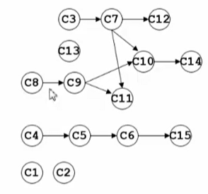

2输出了以后我们发现除了8和4之外还有3和13也是没有预修课程的了。那么我们能不能不3和13先输出了呢？也不是完全不行，但是这样不太好。为什么不好，要思考一下。总之在这里我不选择3和13，虽然我可以这么做。我仍然继续选择把8先输出。然后是4.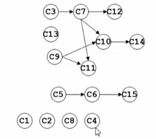

这样的话这四门课我把它们排在第一个学期上掉。这不会产生任何矛盾。然后第二个学期我要开始排，怎么排呢？我看了一下这个图里面我还有这么四门课3-13-9-5是没有前驱结点的，于是我再把它们一个一个的抹掉。输出。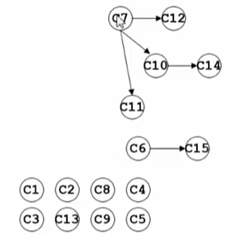

然后再下一个学期我们可以排7和6了。于是我们输出6和7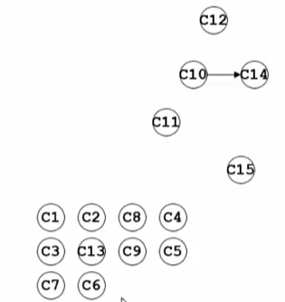

再下一个学期我发现10-11-12-15都是可以的，我们再把它依次输出。最后只剩一个14

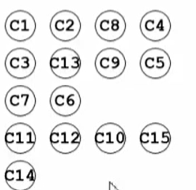

这样就完成了一个排课的过程。这个过程实际上就是一个拓扑排序的过程。它的规律就是每一次输出没有前驱的顶点。怎么知道它有没有前驱呢？我们知道对于一个有向图来说每个顶点有两个度，一个是入度一个是出度。所谓没有前驱节点的那些课程，特点就是他们的入度为0.没有任何一条边指向它。每次我们都选择的是入度为0的那个顶点。在输出的同时我们要把这个顶点从原始的图里面彻底抹掉，当我们把原来的图抹光的时候一个正常的拓扑序就产生了。

#### 算法

下面就是拓扑排序的算法，这个程序的框架很简单，我们是要把所有的顶点一个一个输出所以我前面设置了一个counter，做了一个for循环，每一次循环我们要找一个还没被输出的并且入度为0的顶点。找到了之后我们就把它输出出来，或者我们记录一下它的输出序号。然后要把这个v从原图里面抹掉。什么是抹掉呢？我不是真的把这个v删掉，而是我把它的每一个邻接点的入度-1.就意味着我把从v到w的这条边减掉了。w少了一条进来的边所以它的入度就-1.如果我们每一步执行都是正常的，一直到counter等于1-1的时候，也就是整个外循环执行了v步的时候，我们也就自然的把所有的顶点都输出了。但是如果外循环还没有结束在--V = 未输出的入度为0的顶点;--这一步我就已经找不到满足条件的v了，那么说明在这个图里面还有好几个顶点没有被输出但是每一个顶点的入度都不是0，也就是每一个顶点都有一条边指向它。在这种情况下图中必定是有一个回路的。也就是这个aov不是一个合理的aov。那么我们就无法找到一个合理的拓扑序，我们就不做了，跳出。

它的时间复杂度很大程度依赖于--V = 未输出的入度为0的顶点;--这一步是怎么找的。如果我用简单粗暴的方法，也就是把所有的点都扫描一遍，然后去找那个又没有输出过的，入度又为0的顶点。那么这时候这一步的做法，如果是O(V)这种复杂度的话，那么我们整体的复杂度是显然是v²了。这其实是一种非常不聪明的做法。聪明的方法就是要让这一步的速度变快。

```c
void TopSort()
{ 
    for ( cnt = 0; cnt < |V|; cnt++ ) {
        V = 未输出的入度为0的顶点;
        if ( 这样的V不存在 ) {
            Error ( “图中有回路” );
            break;
        }
        输出V，或者记录V的输出序号;
        for ( V 的每个邻接点 W )
        Indegree[W]––;
    }
}
```

#### 聪明的算法

其实这个聪明的算法也非常直截了当，我们随时检查当任何一个顶点它的入度变为零的时候，我不要还把它放在老地方，我把它放到一个特殊的容器里面。这个容器你可以把他理解为任何东西。你可以把它另外放到一个数组里、链表里、堆栈里、队列里，这个容器你怎么定义都可以，总之就是你把它放到一个特殊的地方。所以当下一次我要找一个度为0的顶点的时候我就不用重新扫描所有的顶点集合，我直接到这个容器里头取，所以这里的时间复杂度就瞬间变成了一个常数级别的时间复杂度。假设我在这里头我用一个队列做容器。拓扑排序就变成了这个样子

首先第一步我要检查一下图里面的每一个顶点v有没有入度为0的，如果入度为0我就把它们统统放到一个容器里面。然后我就开始不断的检查这个容器，每次从这个容器里头取出一个顶点，这个顶点必然是一个入度为零的一个顶点，把它直接输出，输出以后要把这个顶点从图里抹掉。就意味着我要把它的每一个邻接点的入度-1，在减1的时候要检查是否减完之后入度就为0了。如果入度为0了就放入容器。否则我就什么都不做，我去容器里面取下一个顶点。当我从while循环中跳出来的时候，什么条件下我就知道这个图中一定是有回路的呢？如果我从while循环跳出来的时候，并不是所有的顶点都已经被输出了。也就是还有顶点留在图里，那么就意味着这个图里面一定是有回路的。我怎么知道输出了多少顶点？很简单，输出的时候加一个计数器即可。出来的时候就数一下计数器正常的情况下应该等于顶点的个数，如果不相等，那么图中一定有回路。

那么我们把算法改成这个样子以后，时间复杂度是多少？每一个顶点会入列一次，因为我扫描了每个v的邻接点，也就意味着每条边也被扫描了一次，所以总体的时间复杂度是O（V+E），如果是一个稀疏图，那么差不多就是一个O（V）的时间复杂度。如果是一个稠密图的话那么就是O（V²）这个数量级的。

这个算法还可以用来检测一个有向图是不是一个有向无环图。即是不是一个DAG

```c
void TopSort()
{ 
    for ( 图中每个顶点 V )
    if ( Indegree[V]==0 )
    Enqueue( V, Q );
    while ( !IsEmpty(Q) ) {
        V = Dequeue( Q );
        输出V，或者记录V的输出序号; cnt++;
        for ( V 的每个邻接点 W )
        if ( ––Indegree[W]==0 )
        Enqueue( W, Q );
    }
    if ( cnt != |V| )
    Error( “图中有回路” );
}
```

#### 关键路径问题

作为拓扑排序的一个关键的应用，我们来看看关键路径问题。关键路径问题对应的是另一类网络，我们前面讲了一个aov，每一个顶点表示的是一个事件或者是一个活动。另外一类网络是AOE(Activity On Edge)，在这样的网络里头，每一条边代表的是一道工序或者是一个活动。这种网络一般是用于安排一个很庞大的项目，这个庞大的项目会分成很多道工序，工序和工序之间是有先后的依赖关系的。那么AOE的网络就经常用于解决这一类问题。那么在AOE网络里头，我们的活动是表示在边上，顶点表示这个活动到达这个顶点就结束了。通常在画网络的时候我们把一个顶点分成三块。

在边的上面写的是这个活动的持续时间，就是这个小组要完成这道工序它一共需要多少天，这个数字写在边的上面。边的下面写的是机动时间，什么是机动时间呢？后面再说。每一个顶点我们一般分成三块，左边这个区域我们一般写顶点的编号，如果是Vj的话，我们就写个j在里面。右上区域我们记的是这个顶点所有的任务最早完成的时间。右下是最晚的完成时间。

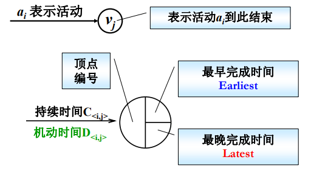

比如这个图是一个大的项目，我们从0这个顶点表示开始，到达8的时候表示项目结束。每一条边代表一件事情，每件事情按照如图依赖的顺序完成了以后到达8这个顶点作为结束。第一件事情我们先得知道每一道工序它要花多少天的时间完成，所以我们先把持续时间标出来。那么这些边之间的关系是什么意思呢？我如果想要<4,7>和<4,7>开工，它就必须等到<1,4>和<2,4>都完成。有一种情况更复杂，比如说<4,7>和<4,7>如果要开工，不仅要等到<1,4>和<2,4>都完成，还得等<3,5>也结束。也就是这三个组要全部等齐了才能开工。怎么办呢？我们可以看到<5,7>能不能开工和上面的组一点关系都没有，只关心<3,5>是否已经完工了。但是这边<4,7>和<4,7>非要等到<3,5>完成了才能走，那么这个图要怎么画呢？我们一个解决方法就是我们画一条虚边，这个虚边的权重或者说这个持续时间我们把它定义为0.这就是我们一个aoe的网络

有了这个aoe的网络之后，第一个问题是整个工期有多长？这件事情我们就要从头，从一开始第0天，因为0-1这个工序的需要6天时间，所以1这道工序最早在第6天完成。同理可知2顶点和3顶点的最早完成时间。然后在前一个顶点的最早完成时间的基础上再继续累加上完成时间。到了4顶点问题就来了，4顶点需要等齐三个顶点才能往下走，这里我们需要是这三个数字的最大值填进去。于是我们就导出了一个递推公式，首先我们把初始点的最早完成时间定义为0，然后每次往后递推的时候Ej都是等于它的前一步的Ei，如果<i,j>是一条边的话那么都是再Ei的基础上再加上边的权重。当时间不唯一的时候，也就是三条边同时指向它，我们就取所有中的最大值。照这个方法一直推到结束的顶点。我们就知道了整个的工期。

那么什么是机动时间呢？也就是作为一个项目的负责人当然想知道哪几个组是比较辛苦的，一天都不能耽误的。哪几个组中间是可以拧出去干别的事情的。也就是哪几个组有机动时间。这个事情要怎么做呢？也就是我要从保证整个工期要在十八天内结束，就是最晚开始时间也得是十八天的情况下反推回去，看前面一个顶点最晚哪天开始就可以，那么从结束的顶点开始往回推，因为<6,8>这个需要两天完工，所以如果要在第十八天结束的话它无论如何都得在第16天开始所以最晚开始时间得是16.同理<7,8>,7顶点最晚也得是14天的时候开工。所以一次类推，一个一个往前减权重。但是要注意到如果有一个顶点可以通过多个顶点减去权重得到，我们要取最小的那个值。因为我们不能耽误项目。所以这样就有了我们的倒推公式，是从最后一个顶点开始，最后一个顶点的L是等于它的E。如果i和j之间有一条边，那么就应该是Lj-<i,j>的权重。当我有多种选择的时候我们就应该选择最小的那个。

机动时间就是有哪些组是可以不用没日没夜的赶工的。例如<0,2>这个组，它最早第0天开工，它最晚在第6天完工就可以了，而它只需要四天的时间去做这件事。所以它其实有两天的时间是机动的。所以机动时间的计算公式就是如果i到j之间有一条边的话，也就是Lj-Ei-<i,j>，终点的最晚减去起点的最早再减去要花的时间，得到的值就是机动时间。有了这个图以后，整个项目的管理者就可以根据这个图来分配人手。

回到我们最初的问题，什么是关键路径呢？关键路径就是管理者最需要关注的哪些组，哪些组是一天都不能耽误的。只要它耽误一天，整个工期都得耽误。关键路径就指的是：**由绝对不允许延误的活动组成的路径**。整个这些边组成的路径叫做整个项目的关键路径。在这里关键路径不止一条，没有机动时间的那些组，从头走到尾那些任务组成的路径，就叫做关键路径。关键路径的程序怎么写？这个程序写起来繁琐。但是如果你只要回答第一个问题的时候程序写起来还是比较简单的。你要想知道整个工期有多长其实你只要把拓扑排序的那个程序稍微改改就可以解决了

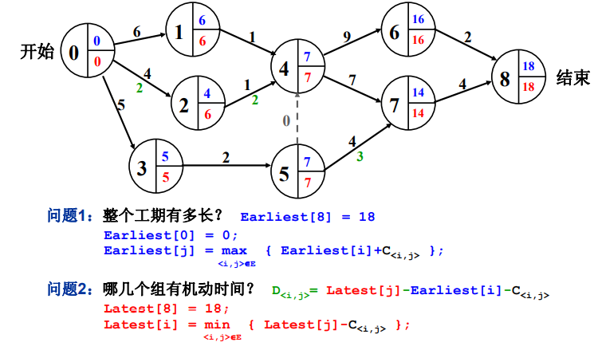


#### 代码--邻接表存储的拓扑排序算法

```c
bool TopSort( LGraph Graph, Vertex TopOrder[] )
{ /* 对Graph进行拓扑排序,  TopOrder[]顺序存储排序后的顶点下标 */
    int Indegree[MaxVertexNum], cnt;
    Vertex V;
    PtrToAdjVNode W;
       Queue Q = CreateQueue( Graph->Nv );
 
    /* 初始化Indegree[] */
    for (V=0; V<Graph->Nv; V++)
        Indegree[V] = 0;
        
    /* 遍历图，得到Indegree[] */
    for (V=0; V<Graph->Nv; V++)
        for (W=Graph->G[V].FirstEdge; W; W=W->Next)
            Indegree[W->AdjV]++; /* 对有向边<V, W->AdjV>累计终点的入度 */
            
    /* 将所有入度为0的顶点入列 */
    for (V=0; V<Graph->Nv; V++)
        if ( Indegree[V]==0 )
            AddQ(Q, V);
            
    /* 下面进入拓扑排序 */ 
    cnt = 0; 
    while( !IsEmpty(Q) ){
        V = DeleteQ(Q); /* 弹出一个入度为0的顶点 */
        TopOrder[cnt++] = V; /* 将之存为结果序列的下一个元素 */
        /* 对V的每个邻接点W->AdjV */
        for ( W=Graph->G[V].FirstEdge; W; W=W->Next )
            if ( --Indegree[W->AdjV] == 0 )/* 若删除V使得W->AdjV入度为0 */
                AddQ(Q, W->AdjV); /* 则该顶点入列 */ 
    } /* while结束*/
    
    if ( cnt != Graph->Nv )
        return false; /* 说明图中有回路, 返回不成功标志 */ 
    else
        return true;
}
```

#### 旅游规划问题

这题比较麻烦的地方在于它不止有一种权重，它的权重有距离和价格。我要找距离最短的最短路径，当这样的路径不止一条的时候我就找最便宜的。解决问题得到方法肯定是要基于Dijkstra算法。Dijkstra算法中每次会收一个dist最小的顶点，然后检查对未收录的顶点的影响，如果距离更短我才更新，但是因为这道题的特殊要求，所以我们在距离相等的时候还需要按照收费来更新。所以在这题里面我们更新path和dist的同时也需要更新cost。然后如果我找到了一条相等的路即--dist[V]+E<V,W> == dist[W]--我就看看它是不是更便宜，如果更便宜我就更新。

```c
void Dijkstra( Vertex s )
{ 
    while (1) {
        V = 未收录顶点中dist最小者;
        if ( 这样的V不存在 )
        break; 
        collected[V] = true;
        for ( V 的每个邻接点 W )
        if ( collected[W] == false ) 
        if ( dist[V]+E<V,W> < dist[W] ) {
            dist[W] = dist[V] + E<V,W> ;
            path[W] = V;
            cost[W] = cost[V] + C<V,W> ;
        }
        else if ( (dist[V]+E<V,W> == dist[W])
        && (cost[V]+C<V,W> < cost[W]) ){
            cost[W] = cost[V] + C<V,W> ;
            path[W] = V;
        }
    }
}

```

###### 其它类似问题

Dijkstra算法还有很多其它的应用。一种就是当我们在求最短路径的时候还要数等长的最短路径有多少条；另外一个问题就是说在所有的最短路里面我要找包含的边数最少的最短路。

先看第一种，要数最短路径有多少条，很自然的想法就是加一个计数器count，count[v]就记录从源点s到v的相等的最短路径有多少条，我们初始化为1，即count[s]=1，因为从s到s自己是一条。如果把v收进来，对w有影响的话，那么count[W]=count[V]; ，也就是w继承了v的最短路。如果找到了等长的最短路，那么w之前的路就还不需要丢弃，所以累加上v的最短路即可，v和w的路不可能重复，因为w在之前只能经过收录的顶点，v此前还未被收录。

要求数最短路径有多少条：

- count[s] = 1;
- 如果找到更短路：count[W]=count[V]; 
- 如果找到等长路：count[W]+=count[V]; 

另外一个问题就是要求边数最少的最短路。这边我们只需要把权重设为1就可。并且要初始化为0，因为源点到原点自己是没有边的。

要求边数最少的最短路：

- count[s] = 0;
- 如果找到更短路：count[W]=count[V]+1;
- 如果找到等长路：count[W]=count[V]+1；

# 散列

## 散列表

先来看查找需求的一种场景，就是在我们编译的时候提交给编译系统的是一个源代码，比如说是C语言的源代码，C语言有一个规则就是变量名必须先定义后使用，当它碰到变量名的时候有可能在两个位置，一个是在变量定义的位置，或者是在变量使用的位置。如果在引用或者是使用这个变量的时候它首先要判别这个变量有没有被定义过，没定义过就给你一个编译错误。如果定义过了，它还要知道这个变量是什么类型的，这个类型在这个语句环境下能不能用。所以我们涉及到了一个变量管理的问题。

把它抽象一下，是对变量以及变量属性的一个管理，涉及到插入--就是当我们碰到一个新的变量定义的时候我们要把变量名以及它相应的定义把它插到我们要管理的这个集合。还有一个查找，就是在编译的时候碰到一个语句使用这个变量的时候，它要去找这个变量有没有被定义过。也就是说在这个集合里面存不存在。如果是存在的，它把相应的属性拎出来，比方说拎出来它是一个指针类型、或者是整型。然后在这个语句环境里去判别，这样使用变量行不行。所以这就涉及到我们要管理这样的一种集合插入查找。除了插入查找之外我们还有可能要删除，所以这实际上是一个动态查找问题。那么对于这样的一个动态查找问题前面我们提到过了一些方法--查找树、AVL树这样的方法。那么我们能不能用AVL树来解决这个变量名的管理问题？好像也是可以的，但是我们再仔细分析，我们再查找树的时候我们每时每刻在查找的过程当中，经常要把一个关键词跟当前节点的一个关键词进行比较，而如果对变量名来讲意味着我们要把两个变量名进行比较。而变量名比较是一个字符串的比较比整数的比较复杂，效率不高。所以很显然变量名的比较更加费时，所以用查找树、AVL树这种方法来解决变量名的管理问题的话不是很好的方法。

还有没有什么方法呢？是不是可以把字符串变成一个数字，然后把字符串的比较变成数字的比较？假如说有一个函数能够把变量名转化成某一个具体的数字，接下来我们要比较这个变量名就变成是比较两个数字了，这就快得多了。这些思想就是属于散列查找里面的基本思想。

接下来我们再来分析一下我们到目前已知的查找有哪些。目前已知的查找主要有这么几种，一个是顺序查找，就是我们要找的对象放在数组里或者列表里，从头到尾一个一个找。但是这种查找效率比较差。所以我们有一个好一点的方法就是把它从小到大排好，然后我们用二分查找的方法查找，这样查找效率是log2n，但是它适合于静态查找不适合于我们刚刚说的那种对变量名管理的场景，它还有插入删除操作发生。那么动态查找我们前面提到了有一种方法叫做查找树或者叫搜索树。而当我们的搜索树设计成一个平衡二叉树的时候它的查找效率能够提升到log2N，但是这样的一个查找方法也有一个弊端就是涉及到关键词的比较，对于变量名来讲是一个字符一个字符的比较，所以把AVL树用在变量名管理的场景也不是很合适。所以我们试图寻找更好的方法。

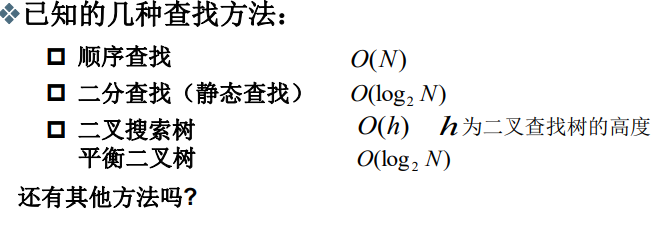

来看另外一些例子，QQ账号的管理。登录QQ的时候需要输入账号，而账号是一串很长的数字，那么用什么样的方法来管理这些账号，使得我们能很快的找到账号，根据这个账号来找到用户的一些信息。如果我们用二分查找，从时间效益上来看，二分查找的log2N还是不错的，从空间上来讲，如果一个用户是1k的空间，一个T的空间也够了。所以这些问题不是很大。麻烦的是这个查找是一个动态查找，我们不但会有新的人来加入这个账户，也有可能退出这个账户。所以二叉查找在这里面不是好的方法。我们需要一种好的方法来解决这个问题

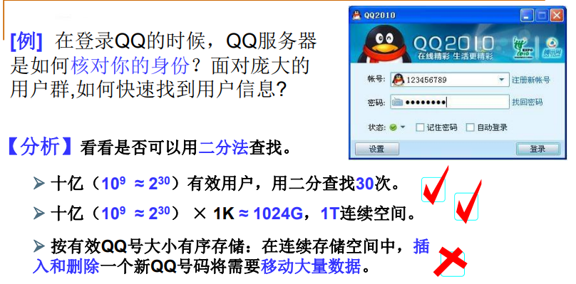

这个方法的关键就是我们怎么能快速的找到关键词所在的位置同时某些关键词可能是不像整数可以方便直接比较的，而是要进行字符串的比较，这个时候我们应该怎么办？为了解决这个问题，我们来看看查找的本质，查找的本质是就是我们有若干个对象，我事先放好在某个位置，然后我给你一个对象，让你去找这个对象在哪个位置出现。它的本质是给你一个对象找这个对象的位置。那么我们为了提高查找的效率，我们可能有两种思路。

一种是我们把这个对象排的好一点，按照某种策略把对象们有序的排好。所谓有序有一种可能是完全有序，典型的是二分查找从小到大排好。还有一种可能是半序，半序也就是说某些关键词存在的一个秩序，典型的就是我们的查找树，查找树的秩序是这样的，任何一个节点都比左子树所有的结点来的大，比右子树的所有节点来的小。但不像前面二分查找一样的完全有序从小到大。它是一半有序的。所以这是一种提高查找效率的一种方法，就是把对象进行有序的组织，这样我们能够根据这个规律来找到另外一种方法。

另外一种就是有没有可能我们直接算出这个对象在哪里，这个思路就是我们要说的散列的思路。基本的思路就是两点，第一点就是给你一个对象，我先计算它的位置，那么这个对象是一个整数也可

以，是一个字符串也可以，是一个照片也可以，反正随便什么对象，那么它的关键是要设计一个计算函数，这个函数就是要把对象计算出一个整数值来，这个整数值就代表这个对象要放在哪个位置，所以这是做散列的第一步要做的事情，就是根据我的问题需求设计一个函数把对象映射成一个比较小的整数，这个整数代表它要放的位置。如果我们的函数设计的很合理，每个对象都有不同的位置，这个问题就圆满解决了。但事实上我们很难得到这样的一个函数，因为我们没法预计未来的对象是什么样子的，很有可能来了一个对象它计算出的位置是和前面的某一个对象是重合的。那么就意味着两个对象要放在一个位置。这个时候怎么办？这种情况是不能够绝对避免的，散列的另外一个工作就是设计一个冲突解决策略。就是当冲突发生的时候我怎么办。如果我们圆满的用散列的方法解决这个问题，不发生冲突或者发生很少的冲突，这样的一个过程我们可以想象它的查找效率很高，它的时间发生在两个地方，一个是函数的计算方面，还有一个是发生冲突的时候。所以散列在很多时候在很多情况下如果函数设计得好冲突策略提的好，它的效率也是非常高的。

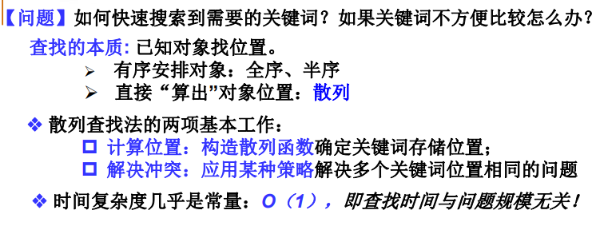

前面介绍了散列的基本思路，具体来说它的抽象数据类型描述可以这样来表述。他要管理的是一个符号表，所谓符号表是名字跟属性的一个二元组的集合，那么在上面可做的操作有：初始化符号表、判别一个对象在不在表里、给定一个对象找它在表里的属性、修改某个对象的属性、在表中插入一个新的对象、删除一个对象

- 散列表（哈希表）

```c
类型名称:符号表（SymbolTable）
数据对象集：符号表是“名字(Name)-属性(Attribute)”对的集合。
操作集：Table ∈ SymbolTable，Name ∈ NameType，Attr ∈ AttributeType
1、SymbolTable InitializeTable( int TableSize )：
 创建一个长度为TableSize的符号表；
2、Boolean IsIn( SymbolTable Table, NameType Name)：
 查找特定的名字Name是否在符号表Table中；
3、AttributeType Find( SymbolTable Table, NameType Name)：
 获取Table中指定名字Name对应的属性；
4、SymbolTable Modefy(SymbolTable Table, NameType Name, AttributeType Attr)：
 将Table中指定名字Name的属性修改为Attr；
5、SymbolTable Insert(SymbolTable Table, NameType Name, AttributeType Attr)：
 向Table中插入一个新名字Name及其属性Attr；
6、 SymbolTable Delete(SymbolTable Table, NameType Name)：
 从Table中删除一个名字Name及其属性。
```

下面来看一个具体的例子，比方说我们有11个对象，它的序列是18，23，11等等。我们想用散列表的思想来管理这些对象。首先我们要涉及一个散列函数，那么我们现在设计的一个散列函数我们是用求余的方法，这个散列表或者说是这个数组总共的大小是17.那么我们把这些对象放到数组大小为17也就是下标从0-16的这些数组分量里面去。怎么放呢？就是把这些数值对17求余，余数等于零，就放在零号位置以此类推。具体来讲，我们就可以把前面的11个元素放到这些位置里面。

如果这时候又来了一个35，发现要放到1号位置，发现1号位置已经有元素了，这时候就产生冲突了。所以这时候我们需要一种冲突解决方案。

如果这个表没有冲突，我们把元素都放进去了。接下来它怎么找呢？找的方法是一样的，你怎么放你就怎么找。把要找的这个元素的key拿来，通过哈希函数一算就知道它的位置了。

所以散列的这种方法基本思路就是先构造一个散列函数把对象放进去，将来找也是用相同的规则。也是通过散列函数一计算找到相应的位置。如果这个位置空的就不在散列表里面。

下面有一个概念，装填因子实际上说的是这个散列表在我们这里是一个数组，这个数组被充满的程度。所以计算方法就是把散列表的大小作为分母，放进去的元素个数作为分子。

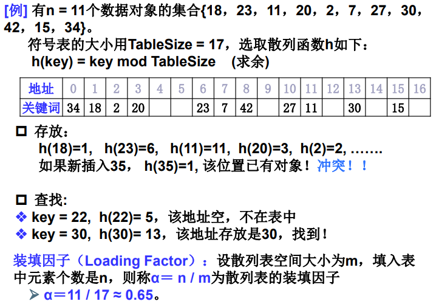

继续看一个例子，给你一些字符串或者叫变量名，我们想把这些名字管理起来，那么我们现在的管理方法使用一个二维数组。前面的例子是一维数组，那么一维数组的一个特点就是一个位置也就是一个数组的一个分量只能放一个对象。为了减少冲突，我们有一种思路，就是我弄一个二维数组如果你算出来是某一个位置那么我先放到这一行的第一列，如果有冲突就放到第二列。也就是我们的行的地址是哈希函数算出来的，同一个地址就放在同一行，先来的放在第一列，有冲突放在第二列。对于这样的一种方法我们来想一想看哈希函数怎么设计，一种简单的设计方法我们就看第一个字符第一个字符是a我放第一个位置，是b就放第二个位置，这样我们哈希函数就可以设计成这个字符串的第一个字符减去小写a，得到的一个整数值，这个值从0-25。所以我们这样的一个哈希表或者叫散列表就可以设计成26*2的一个二维数组。下面来看一个怎么把这些对象放进去。

可以看到，很容易就可以得到为一个单词应该放的位置。一直往里面放，一直到放到clock这个单词，我们发现c应该放的位置已经全部放满了，所以这时候我们就发生冲突了。再来ctime那更加冲突了也放不进去。所以从这里面我们可以看得到，对于哈希表这种思想，如果没有冲突，那么整个的效果还是很好的。我们要查找一个元素，要插入或者是删除，在线性的时间内就可以完成了。它就可以直接找到直接进行插入。

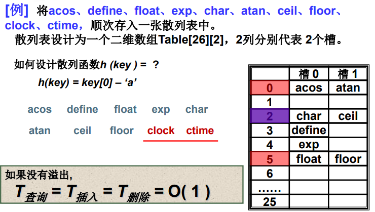

我们可以归纳一下，散列查找的基本思想是两个东西。一个就是我们要设计一个散列函数，然后我们将来给了一个key，然后你通过这个散列函数进行计算找到它相应的位置。接下来要提出一种解决冲突的策略。


## 散列函数的构造方法

- 一个“好”的散列函数一般应考虑下列两个因素： 1. 计算简单，以便提高转换速度； 2. 关键词对应的地址空间分布均匀，以尽量减少冲突。

### 数字关键词的散列函数构造

#### 直接定址法

把散列函数设计成一个线性函数。比如我们要管理的是不同年份里面的人口总数，关键词是年份，值是1990-2011（22个数），故我们要映射的地址就是0-21.所以可以直接用一个线性函数来实现计算，年份直接减到1990即可。


#### 除留余数法

最常用的一种方法。一般把p取为表的大小。为了映射均匀，p一般一般是取一个素数。

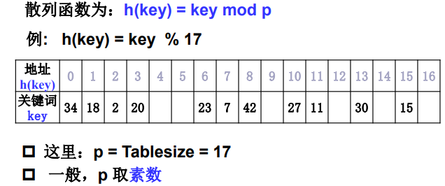

#### 数字分析法

我们给的关键词可能会有很多位组成，每一位在我们的对象里面的变化情况可能不一样，有的某一位它是一直不动的，也就是在不同的对象中这一位都是一样的。而有的某些位会随机变化。所以数字分析法只希望分析出对象的关键字在每一位上的表现，我们把那些能够随机变化的这些位取出来，组成我们的地址，达到映射均匀的目的。

比方说手机有11位，在同一个地区来讲，它的前几位可能差不多，变化最大的是后面的四位，所以我们可以把收集号码的后四位作为我们的地址。这里函数就可以设计成atoi(key7)，这什么意思呢？在我们这里，key是一个字符串，这里key就指向了这的位的第一个字符的地址。我们+7之后就往后那了7位就指向了倒数第四位。这样再通过一个atoi把一个字符串转化成整数。就获得了地址。

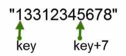

- int atoi(char *s):将类似"5678"的字符串转换为整数5678

另外一个典型的例子，看看身份证号码。身份证号码的18位中的每一位都是由特定的含义的。比方说前两位代表省等等。最后一位是校验位，可能是数字也可能是字母。

通过分析身份证号码的这18位的每一位的特点，我们就发现有那么几位的变化是比较随机的，比方说第六位，还有出生年月大多数人都是19多少多少，所以这个时候它变化最多的是最后一位。这位变化最随机。还有就是日期个位的变化相对来说要比十位的变化要多。还有151617位是在所在这个辖区里的序号，那么也同样的，后面两位的变化会更随机一点。最后一位就是校验位。所以我们就取这么6位蓝颜色标记的出来组成关键词。

对于这样的关键词我们可以进行设计。首先设计h1函数，这个函数把前面的5位关键词，也就是6/10/14/16/17，这么五位组在一起，把它看成一个五位数。然后我们还要把最后一位组合进来，最后一位由于它可能是数字也有可能是字母，所以我们做一种变化，把h1变成h，相当于再把18位再当成个位数组合进来，如果是0-9那么就直接组合进来，如果是x那么就+10组合进来。

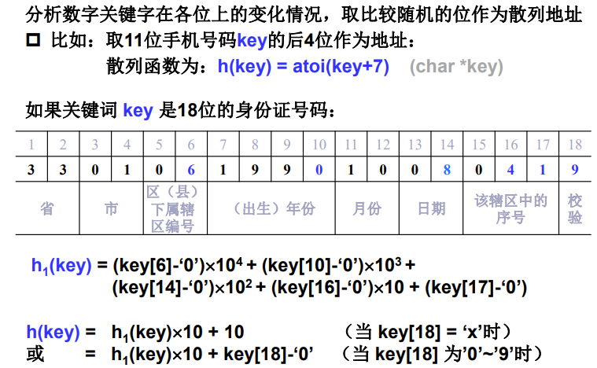

#### 折叠法

折叠法就是把我们很长的这种数字的关键词拆成若干个部分，然后叠加在一起。比方说把下面这个8位的数字拆成三位三位，最后不够前面补0。这样我们就获得三段，然后把这三段数字相加。得到结果1391，我们取391作为函数的值也就是地址。

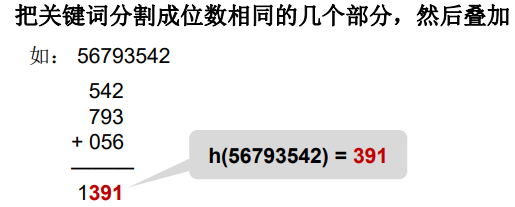

#### 平方取中法

同样对我们前面看到的这么八位数，我们希望设计的这个哈希函数他能够随机，就是我们希望这个函数值能够被每一位所影响，也就是每一位的变化都能影响到最后函数的结果值。所以有一种方式是把大数取个平方，得到一个结果--很大的一个数，然后我们取中间几位，比方说我们想取三位，那么我们就取中间的三位。

641这三位要比我们简单的取最后一位或者是头一位要好比方说我们最后一位4，4也只是受key的最后一位的影响了，2*2=4，所以平方取中的目的就是希望这个结果能够被更多的位数所影响。同样的，折叠法也是这种思想。他把数字拆成若干个段然后加在一起，每一位对最后的运算结果都能产生影响。


### 字符关键词的散列函数构造

前面我们谈到的关键词是数字的时候我们常用的散列函数的几种构造方法。下面我们来看一下如果是字符呢，比方说我们给的是一个变量名，变量名是若干个字符所构成的，我要把字符串这样一个对象映射为一个整数。一种简单的方法就是把每一个字符--它是一个ASCIl码的编码，是一个数字，把这个数字简单相加，然后求个余数就能获得相应的值。但是这样的方法会有很多冲突，比如a3/b2/c1/eat/tea的函数值是一样的。另外一个更致命的就是，我们知道ASCII码的编码它主要用到了7位，也就是对于每一个字符来讲，它的编码范围是0-127，如果变量名是10位的一个字符串--也就是我们考虑的变量名有十位，每个字符的变化范围是0-127，我们简单的把它们加起来，所以这个相加后的值就是在0-1270之间，而变量名实际上的变化是非常多的，所以以很窄的这种计算结果来对付一个很广的这种变量范围，就会使得这样的一个哈希函数很容易产生聚集，所以这不是一个很好的办法。

我们可以把它的变化再加大一点，一种简单的方法就是，比如变量名是abcde，我们可以考虑前面的三个字符，然后把abc看成是27进制里面的前3位，把地址空间扩展开。为什么是27呢？因为26个字母以后可能当中会有空格，所以有27个字符。尽管是这样我们仍然会发生冲突，因为我们的变量名有可能会比较长，前面三位是一样的，比如string、street、strong等等。还有一个问题就是他会造成地址空间的浪费，那么如果仅仅是对这个变量名来讲，如果都由字符所组成的，每个字符变化由26，所以三个字符来说它的变化是26³，而实际上有人通过统计得出一般的出现的情况是3000种，因为我们实际考虑的是26³，所以会有很大的空间浪费。

那么进一步考虑，我们就不是取前面三个字符进行组合。我们把所有的字符者都进行组合，就是你给我的名字--一个字符串，有可能3位有可能4位有可能能5位，我把三位四位五位六位全部考虑进去，比方说给我的是 abcdef，那么我就把它看成是一个多少进制的这样的一个字符的这样的一种序列，这里我们把它考虑成32进制，为什么是32而不是27，等等会考虑到这个问题。

#### 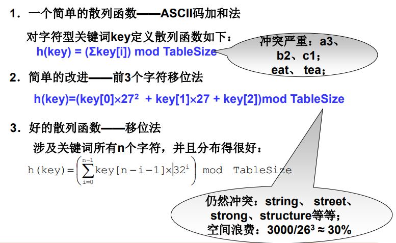

比方说这样的一个字母串是abcde，我们把它看成是一个5位数，个32进制的5位数，就把a的ASClI码值乘以32的四次方，加止b的ASCI码值乘以32的三次方。。。。这个数计算完了之后是会求余的。我们通过求余把整个大整数变成一个小的整数。这里先不讨论求余，先来看如何算出这样的一个大数出来。

下面要考虑的问题就是如何计算这样的一个值。可以把它看成是一个级数的和，求级数的和我们知道有一种巧妙的方法。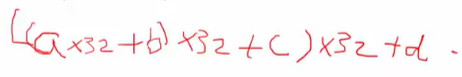

我们通过把级数的和转化成这种形式可以极大的减少乘法的次数。实际上我们还有更巧妙的方法，把一个数乘以32，事实上就是把这个数左移5位（二进制）。这个哈希函数给定的key是一个字符串，我们要把这个字符串里面值全部考虑进来，它的方法是一个循环while，然后看当前的这个key指向的位置这个字符是不是空的。一开始我们key指向的是a，它不等于\0也就是说明它还没有指向字符串的最后，这个时候我们就把目前的结果值左移5位，一开始等于0，所以左移五位还是0，然后加上key的值，所以这个时候我们得到了a。然后下一轮循环，key移到b这个位置，在这个位置的时候key也是不为\0所以把前面的结果也就是a左移5位，然后加上当前b的值。我们每次都有key++，所以下一轮循环就到c了。以此类推得到我们想要的结果。

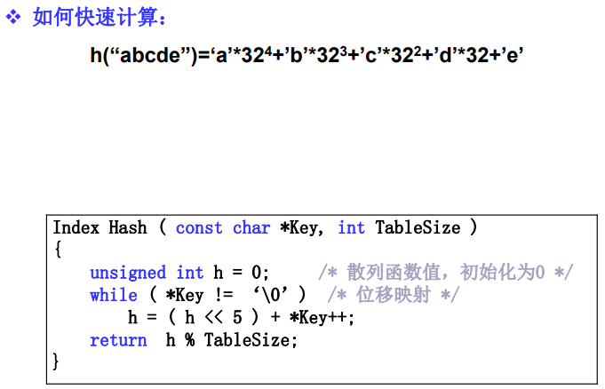

## 冲突处理方法

冲突处理的方法呢有两种常见的思路,一种呢我另列外我个地方放，所以这种方法典型的就是叫开放地址法。另外一种，把映射到同个位置的这些有冲突的对象，全部放在一起，可以采用链表结构把有冲突的对象都放在一个链表里面。将来从计算出来的这个地址出发，地址就是一个指针，指向单向链表，然后到哪个链表里面去找，这种方法叫做链地址法。


### 开放定址法

首先来看开放地址法，开放地址法就是发现冲突的时候利用某种规则去找下一个位置，看看那个位置有没有空，如果有空就放进去，没空就按一个规则再算下一个位置，所以他的一种基本思路呢也是这样的。

- 开放地址法：一旦产生了冲突（该地址已有其它元素），就按某 种规则去寻 找另一空地址

首先散列函数算出一个值来，这是代表他初始要放的位置了，当我们第一次发生冲突，我们要找下个位置的时候呢，这个时候我们在散列函数的基础上加上一个di，一开始i等于1，所以加上d1，再由冲突我们就加上d2。也就是在原来散列函数的基础上加上一个偏移量，是我们探测次数i的一个函数叫di。

根据di的不同设计方法我们又分为三种典型的开放地址法，一种叫线性探测，一种叫平方探测，一种叫双散列。

线性探测就把di设计成一个线性函数di就是等于i，所以我们一开始算出来的一个散列函数，比方说h，在这个基础上发现有冲突，我们就加上di，第一次探测就+1，第二次探测就+2，以此类推。也就是在原来计算函数的基础上分别+1+2+3，实际效果就是一个个的往后找。这个位置有冲突就找下一个位置，再下个位置就是在原来基础上+2，以此类推。所以这是线性探测。

线性探测也有一些问题，导致后面有人提出了另外一种方法，叫做二次探测或者叫平方探测。也就是我们的di设计成i²，而且我们是正负i²，也就是我们不是往一个方向去探测，左边探测一下，右边探测一下，所以我们的探测序列就变成第一次通过散列函数计算得到了一个位置h，发现有冲突，那么就h+1²，再有冲突就到h-1²，还有冲突就到h+2²去找，以此类推。所以就是在原来位置基础上偏移量开升级层次，+1-1，+4-4，+9-9.当然可能由于加减，它的位置超出了散列表的地址范围，这个时候我们用求余，通过求余它就回来了。

还有一种叫做双散列，也就是我们再设计一个散列函数，把di（偏移量）设计成i乘以这个散列函数。所以这叫双散列--我们设计了两个散列函数。第一次散列函数作为找起始的位置，第二个散列函数用来计算偏移量，将来在原来基础上再偏移多少去找相应的位置。

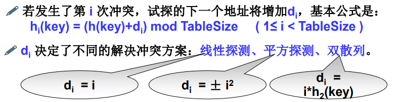

#### 线性探测法（Linear Probing）

线性探测就是在原来的基础上产生一个增量序列，这个增量序列就是1234，实际上就是在原来位置上找下一个再找下一个，以此类推。

- 线性探测法：以增量序列 1，2，……，（TableSize -1） 循环试探下一个存储地址。

看下面例子。 我们现在总共有9个数，我们设计的散列表大小为13，也就是我们数组的大小是13，想把这9个数装到13个位置中去。所以装填因子就是9/13。散列函数设计成对11求余，可以看到11是比13小的。我们先把九个数装进去，转入之前算一下这九个关键词的散列函数的值，填入下表

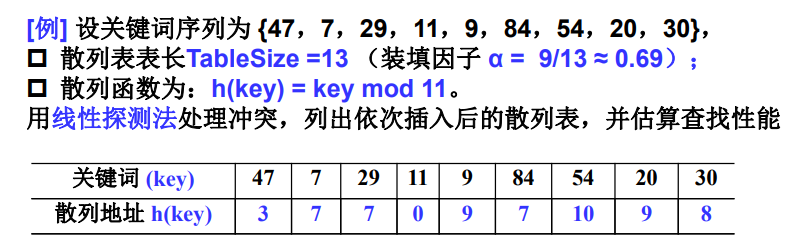

有了上表以后我们就能够用刚才提到的线性探测的方法逐步的把每个元素把它放到表里去。首先插入47，47的散列地址为3，这个位置是空的，没有冲突。接下来插入7，也没有冲突。接下来插入29,29的散列地址也是7，这个时候产生冲突了，我们就找下一个位置，也就是在7的基础上+1，也就是8，这个位置是空的，就把29放入了。以此类推，放入11,9,84,54,20.在放入30的时候超出散列表的范围了，这时候我们对13求余，回到了0，然后继续我们的线性查找，到30放入1这个散列地址。

在构造这个表的过程中我们可以算出每个元素插入进去的时候的冲突次数。最多的是30，冲突了6次。在这里我们注意到一个现象，当我们的散列值算出来有冲突，冲突集中在某一些位置的时候，在这个位置会形成聚集，这个地方的冲突会越来越多，这就是线性探测存在的问题---形成聚集现象。

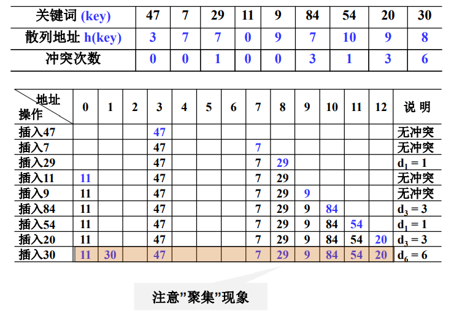

我们对散列查找的效率做一个分析。散列查找的效率主要就是看它平均查找的次数或者是平均查找的长度，叫做ASL。平均查找长度又分为两种，一种是成功的平均查找长度，一种叫不成功的平均查找长度。成功平均查找长度就是我要找的对象最后被我找到了。不成功就是要找的对象找不到。

什么情况下是成功的？就是在散列表里的元素，你去找才是成功的。不再散列表里的元素你去找那就是不成功的。所以我们要计算成功的平均查找长度只要把散列表里面的每个元素去算算看我找它需要找几次。然后平均值一算，就得到了成功的平均查找长度。看下面例子，有一个已经构造好的散列表，冲突次数也标好了。冲突次数为0的就代表我们通过散列函数一算就找到那个位置了，也就是我们找一次就够了--比较次数或者说是查找次数就为1.冲突六次就代表了前6次的查找都有冲突，最后一次（第七次）才成功了，所以比较次数为6+1=7次。所以比较次数就是冲突次数+1即可。我们再求平均值就很容易。算出来是2.56.这是指的成功的平均查找次数---也就是在散列表里面的元素的查找次数加起来求平均值。

反过来不成功的平均查找次数怎么算？不成功也就是不在散列表里面，不在散列表里面的元素多了去了。不可能用枚举法一个个去算。所以有一种方法就是把不在散列表里面的元素分为若干种类型，一类一类的算。不在散列表里面的元素可以分为几种类型？按照我们的查找过程，只要它的哈希函数值是一样的，整个的查找过程就是一样的，查找的次数也是一样的。比如n和m通过哈希函数一算入口都是在0。然后我们一个一个往后找，直到找到空位置了，就说明我们要找的m或者n是不在哈希表里面的。因为如果m和n在里面，那么它一定会按照前面的冲突解决方案--线性探测法一个一个往后找到一个空位放进去（这个空位是一个就近的空位，也就是在找到这个空位以前的所有位置都已经填有元素了），这样的话说我们一定找不到空位（如果n和m在散列表里面的话）。所以我们因为是mod11，所以对应了11个类，分别计算相加求平均就得到了不成功的平均查找长度。注意这里我们是看mod的那个数决定有几类，而不是看散列表的大小。

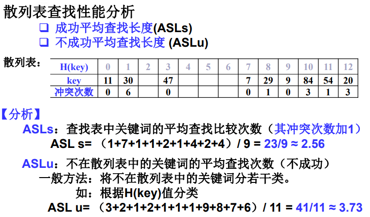

这里散列函数取的是第一个字符的位置，也就是把第一个字符拿来减去a。这样形成了0-25的地址，散列表大小为26。冲突的解决方案是线性探测。

前五个都是没有冲突的放入。第6个产生了冲突，然后找下一个位置，空位，放入。以此类推。

放完之后来看成功的平均查找长度。可以看到前五个是没有冲突的，所以前五个查找长度都是1，后面分别冲突了，1,4,3所以再加上2,5,3.计算得到平均查找长度为1.87.

不成功的平均查找长度，根据散列函数的值，我们把这些值分成26类--a-z打头。这样的一些情况我们认为是等概率的。所以如果一个变量名不在这里面，又是以a打头的，我们从0入口进去，找里0最近的一个空位即可，8-0=8代表我们前面8次都是冲突，最后这一次（第九次）是空位，我们断定这个元素不在散列表里。以此类推。我们很容易得到不成功的平均查找长度为2.38.

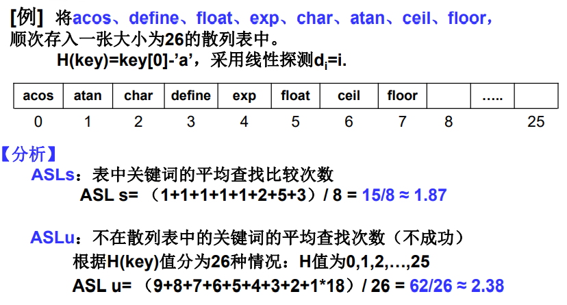


#### 平方探测法（Quadratic Probing）--- 二次探测

为什么叫平方探测？因为它采用的这个增量序列是加减i的平方。前面线性探测是+i，就是在原来算出来的哈希地址上加一个偏移量，这个偏移量是我们探测次数的一个线性函数。

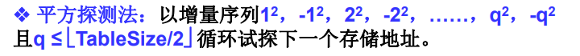

来看一个例子。还是9个数，哈希表的长度设置为11，散列函数设置为对11求余。算出散列地址，填在下表

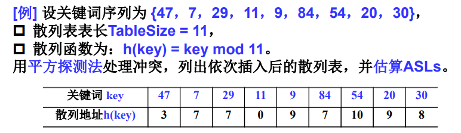

来看看插入散列表的过程。47和3都没有冲突，直接放入。接下的29，冲突，探测7+1=8位置是空，放入。接下来的11和9都没有冲突，直接放入。接下来84，散列地址为7产生冲突，探测7+1=8位置产生冲突，再探测第二次7-1=6位置为空，放入。接下来54没有冲突。再下来是20，冲突，探测+1-1位置冲突（2次冲突），探测+4位置，（9+4）mod11=2，位置为空，放入，冲突了3次。同理放入了30。

进一步就算出了成功的平均查找长度。

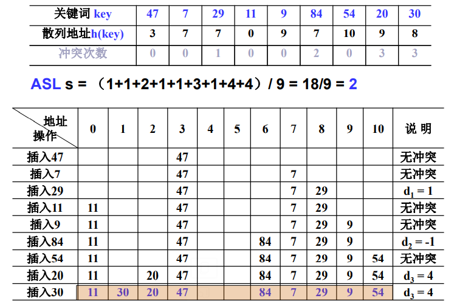

我们知道线性探测是冲突的时候依次往后面偏移一次来查找。按照这个策略，只要你的表有空位，我就一定能够通过平推来找到那个空位。所以只要表为空我就一定能够把这个元素放上去。但是二次探测或者说是平方探测是跳着来的，有可能我本来有空位的，但是就是找不着。也就是说我的散列表里面是有空间的，但是这样跳来跳去的老找不到这个位置。

看下面这种情况。散列表大小为5，散列函数是对5求余，我们已经放了三个元素567，接下来来了一个新的元素，这个元素是11，11求余的结果是1。最后我们算出探测序列，它的结果就在0和2之间跳来跳去。这是二次探测的一个缺陷。但是它避免了线性探测的聚集问题。二次探测也有聚集现象但是没有这么严重。

还好我们有一个定理：如果表的大小设计成4k+3的形式，而且是这种形式的素数的时候，那么只要有空位，我用平方探测一定能够找得到。这是一个定理，是可以证明的。

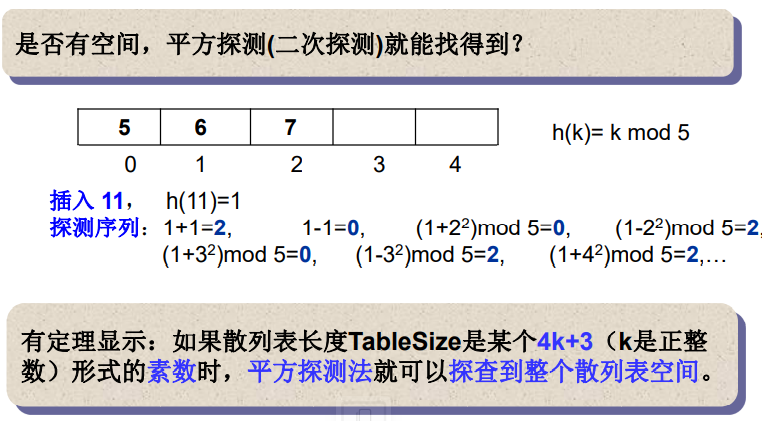

来看二次平方探测的代码实现。

散列表我们可以设计成一个结构结构叫做HashTbl，里面有两个分量，第一个分量是cell是一个数组实际上也是一个指针，当前这个表的大小叫做TableSize。

```c
typedef struct HashTbl *HashTable;
struct HashTbl{
 int TableSize;
 Cell *TheCells;
}H ; 
```

散列表的初始化，首先判别如果散列表太小就没必要做散列，你直接放在数组里面就行了。接下来（如果散列表足够大），我们就申请结构赋值给H。如果申请不成功就显示错误信息，如果申请成功了，我们希望表的大小是一个素数，所以就用一个函数叫做NextPrime，比方说说表的大小是12，但是我在实际操作的时候我们不一定用12，因为12不是素数，所以我要找一个素数来，而这个素数要比你这个表还要大。比如找了一个13。也就是你告诉了我12，我就给你找了一张13大小的表。13是一个素数，所以NextPrime函数是出于这个目的。

接下来是分配一个数组，根据我们刚才算出来的真正的TableSize分配一个空间，把它赋值给TheCell，那么TehCell就相当于指向一个数组了。

```c
HashTable InitializeTable( int TableSize )
{
 HashTable H;
 int i;
 if ( TableSize < MinTableSize ){
     Error( "散列表太小" );
     return NULL;
 }
 /* 分配散列表 */
 H = (HashTable)malloc( sizeof( struct HashTbl ) );
 if ( H == NULL )//判断是否分配成功
     FatalError( "空间溢出!!!" );
 H->TableSize = NextPrime( TableSize );//找一个比你输入的要大的素数
 /* 分配散列表 Cells */
 H->TheCells=(Cell *)malloc(sizeof( Cell )*H->TableSize);
 if( H->TheCells == NULL )//判断是否分配成功
     FatalError( "空间溢出!!!" );
 for( i = 0; i < H->TableSize; i++ )
     H->TheCells[ i ].Info = Empty;
 return H;
}
```

可以看到H是一个结构，TableSize变量就是11，下面是一个指针指向一个数组，为了方便后面的操作，这个数组我们设计成是一个结构数组，每一个分量Cell是一个结构。为什么要设计成结构？我们前面说过往表里面插入元素也说过在这个表里面怎么找元素，但是我们还没说怎么删除元素。实际上删除元素你不能真的把这个元素从表里拿掉，拿掉了之后我们查找的时候会有问题的。如果我把一个元素删除但是我仍然把它放在表里，但是我给他做一个记号，记号就是说这个元素被删掉了，它对于我们后面的查找和插入有什么好处？首先一个是我查找的时候碰到被删掉的元素就说这个位置它做了一个记号就是说被删掉了，我就知道现在还不是空位，还可以继续找，如果你真的把它拿掉了变成空位了就会产生误判。然后我插入的时候发现这个元素被删掉了，它不是空位，是原来有元素占着的，现在被删掉了。所以这个时候插入元素可以替代原来被删掉的元素。所以这样我们的插入删除操作就都可以做，并且不影响我们的查找过程。

所以这里我们有一种需求，对每一个元素有记号，说它是什么状态。所以我们用一个结构，这个结构包含了两个东西，一个是叫info，一个就是data。一开始表的每个元素都是空的，所以就设一个Empty给它。这是表的初始化。

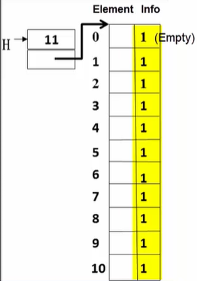

初始化完了之后我们要Find了，我们用平方探测的方法来找。首先要算哈希函数，所以我们先调用一个哈希函数，这个哈希函数怎么设计，可以求余等等。算一下获得了一个结果，这个结果值就是我们准备要放的位置，叫做CurrentPos。我们要看一下，这个位置空不空，所以就要先检查NewPos位置的info是不是等于Empty，如果这个位置不空，并且这个位置的值不等于我要找的key，那么就要继续找。所以循环的条件就是我要找的这个位置是被别人占了，那就是不空，同时这个元素的值由不等于我要找的这个key，这时候循环就一直做。

探测的基本方法是在原来的位置上CurrentPos--最早的哈希函数值，加减i的平方。获得了新的地址。注意到我们是一会加平方一会减平方，所以我们要判别现在到底是要加还是减。所以我们用了CNum---也就是i，一开始没有冲突CNum等于0.然后注意到先是++CNum，所以第一次探测i就等于1。如果%2的条件成立，代表现在的+1之后的CNum是为1而不是为0，等于1意味着是奇数。如果是奇数那么就加上i的平方。如果不是奇数，也就是else，那么就是减去i的平方。

```c
Position Find( ElementType Key, HashTable H ) /*平方探测*/
{ 
 Position CurrentPos, NewPos;
 int CNum; /* 记录冲突次数 */
 CNum = 0;
 NewPos = CurrentPos = Hash( Key, H->TableSize ); 
 while( H->TheCells[ NewPos ].Info != Empty &&
 H->TheCells[ NewPos ].Element != Key ) {//判断有没有找到。
 /* 字符串类型的关键词需要 strcmp 函数!! */
     if(++CNum % 2){ /* 判断冲突的奇偶次 */
         NewPos = CurrentPos + (CNum+1)/2*(CNum+1)/2;
         while( NewPos >= H->TableSize )
         	NewPos -= H->TableSize;
     } else {
         NewPos = CurrentPos - CNum/2 * CNum/2;
         while( NewPos < 0 )
         	NewPos += H->TableSize;
     }
 }
 return NewPos;
}
```

可以看到我们这边并不是简单的加i²，减i²。而是要对CNum进行了简单的操作才进行平方。为什么呢？可以看到，我们这里的i是-1+1，+2-2交替的，而我们的CNum是一直递增的。所以我们要找一个映射，把123456这样的一个序列映射到+1-1+2-2.要实现2对1的映射，我们可以分奇偶。135对123，发现+1后再除2即可。246对123，发现直接/2即可。

这里还有一句话while，要干什么？这里相当于求余。在+i平方的时候我们就减去表的大小。-i平方的时候我们就加上表的大小。我们通过不断的循环加上或者减去表的大小来使得NewPos落在表的范围里。

出了大while循环之后返回NewPos，也就是我们找到的位置。

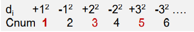

我们要插入一个元素首先要去Find，Find会返回给你一个位置，我们看一下Pos这个位置是什么状态，如果当前的Pos不是处于被占用的状态，那么这个元素就可以放进去。什么情况下不是被别人占用了？一个是空位，一个是被删除的。这个时候我们就把info设成被占用的状态，然后把key放进去。

```c
void Insert( ElementType Key, HashTable H )
{ /* 插入操作 */
 Position Pos;
 Pos = Find( Key, H );
 if( H->TheCells[ Pos ].Info != Legitimate ) {
     /* 确认在此插入 */
     H->TheCells[ Pos ].Info = Legitimate;
     H->TheCells[ Pos ].Element = Key;
     /*字符串类型的关键词需要 strcpy 函数!! */
 }
}
```

删除的一种方法是懒惰删除，我想把一个元素删掉，并不是真的把这个元素删掉，我在旁边做一个记号，说这个元素被删掉了。我找到这个位置的时候发现这个元素是被删掉的，那么我还可以继续找，如果不是这么做的，那么就会断了，因为按照前面的理解，如果真的删了，那么这个地方是空的，那么就会认为这个元素不在表里而产生误判。

- 在开放地址散列表中，删除操作要很小心。  通常只能“懒惰删除”，即需要增加一个“ 删除标记(Deleted)”，而并不是真正删除它。  以便查找时不会“断链”。其空间可以在  下次插入时重用。

##### 代码

- 素数只需检查从2到根号n即可。因为N=根号N * 根号N，如果有ab=N，那么必定要一个大于根号n一个小于根号n，也就是说ab一定成对存在，分布在区间的两侧，我们只需要检查一侧即可，根号n-1的区间宽度远小于n-根号n，所以选择前者作为我们检测的区间，由于我们这题开头直接选择了奇数，所以我们只需要从3开始到根号n

```c
#define MAXTABLESIZE 100000 /* 允许开辟的最大散列表长度 */
typedef int ElementType;    /* 关键词类型用整型 */
typedef int Index;          /* 散列地址类型 */
typedef Index Position;     /* 数据所在位置与散列地址是同一类型 */
/* 散列单元状态类型，分别对应：有合法元素、空单元、有已删除元素 */
typedef enum { Legitimate, Empty, Deleted } EntryType;

typedef struct HashEntry Cell; /* 散列表单元类型 */
struct HashEntry{
    ElementType Data; /* 存放元素 */
    EntryType Info;   /* 单元状态 */
};

typedef struct TblNode *HashTable; /* 散列表类型 */
struct TblNode {   /* 散列表结点定义 */
    int TableSize; /* 表的最大长度 */
    Cell *Cells;   /* 存放散列单元数据的数组 */
};

int NextPrime( int N )
{ /* 返回大于N且不超过MAXTABLESIZE的最小素数 */
    int i, p = (N%2)? N+2 : N+1; /*从大于N的下一个奇数开始 */

    while( p <= MAXTABLESIZE ) {
        for( i=(int)sqrt(p); i>2; i-- )
            if ( !(p%i) ) break; /* p不是素数 */
        if ( i==2 ) break; /* for正常结束，说明p是素数 */
        else  p += 2; /* 否则试探下一个奇数 */
    }
    return p;
}

HashTable CreateTable( int TableSize )
{
    HashTable H;
    int i;

    H = (HashTable)malloc(sizeof(struct TblNode));
    /* 保证散列表最大长度是素数 */
    H->TableSize = NextPrime(TableSize);
    /* 声明单元数组 */
    H->Cells = (Cell *)malloc(H->TableSize*sizeof(Cell));
    /* 初始化单元状态为“空单元” */
    for( i=0; i<H->TableSize; i++ )
        H->Cells[i].Info = Empty;

    return H;
}

Position Find( HashTable H, ElementType Key )
{
    Position CurrentPos, NewPos;
    int CNum = 0; /* 记录冲突次数 */

    NewPos = CurrentPos = Hash( Key, H->TableSize ); /* 初始散列位置 */
    /* 当该位置的单元非空，并且不是要找的元素时，发生冲突 */
    while( H->Cells[NewPos].Info!=Empty && H->Cells[NewPos].Data!=Key ) {
                                           /* 字符串类型的关键词需要 strcmp 函数!! */
        /* 统计1次冲突，并判断奇偶次 */
        if( ++CNum%2 ){ /* 奇数次冲突 */
            NewPos = CurrentPos + (CNum+1)*(CNum+1)/4; /* 增量为+[(CNum+1)/2]^2 */
            if ( NewPos >= H->TableSize )
                NewPos = NewPos % H->TableSize; /* 调整为合法地址 */
        }
        else { /* 偶数次冲突 */
            NewPos = CurrentPos - CNum*CNum/4; /* 增量为-(CNum/2)^2 */
            while( NewPos < 0 )
                NewPos += H->TableSize; /* 调整为合法地址 */
        }
    }
    return NewPos; /* 此时NewPos或者是Key的位置，或者是一个空单元的位置（表示找不到）*/
}

bool Insert( HashTable H, ElementType Key )
{
    Position Pos = Find( H, Key ); /* 先检查Key是否已经存在 */

    if( H->Cells[Pos].Info != Legitimate ) { /* 如果这个单元没有被占，说明Key可以插入在此 */
        H->Cells[Pos].Info = Legitimate;
        H->Cells[Pos].Data = Key;
        /*字符串类型的关键词需要 strcpy 函数!! */
        return true;
    }
    else {
        printf("键值已存在");
        return false;
    }
}
```

#### 双散列探测法（Double Hashing）

还有一种散列方法--双散列。我们再设计一个散列函数使得我们的偏移量di设计成i乘以h2这样的形式。我们往后的探测序列就变成h2,2h2,3h2.

对于任意的key，h2不能为0，为0就没有偏移量了，还是和原来一样。

有经验证明h2设计成下面这样是比较好的，p-（key mod p），一般p取成素数。

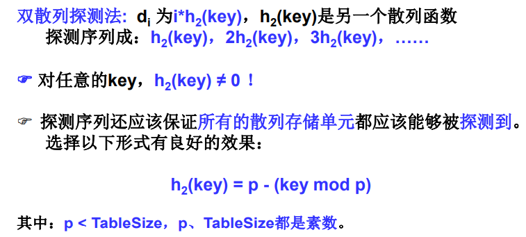

#### 再散列（Rehashing）

我们一个散列表一般是一个数组，我不断的把元素往里面放。如果元素太多，装填因子太大，这时候冲突会不断的增加，查找效率下降。rehashing---把散列表变大，比如11-23。散列表扩大的时候原有的元素需要重新计算放置到新表中去。

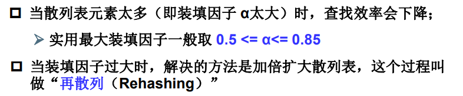

### 分离链接法（Separate Chaining）

- 分离链接法：将相应位置上冲突的所有关键词存储在同一个单链表中

结构和原来一样，H是一个指针，指向一个结点Node，结点的域一个是size一个是指向数组的指针，现在这个数组不是用来放元素的了，它是一个装着指针的数组，指针指向一个链表。链表没有元素就数组对应位置设为空指针。

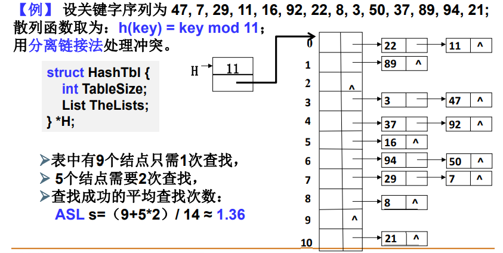

```c
 typedef struct ListNode *Position, *List;
 struct ListNode {
     ElementType Element;
     Position Next;
 };
 typedef struct HashTbl *HashTable; 
 struct HashTbl {
     int TableSize;
     List TheLists;
 };
```

Find里面先算散列位置，这个位置是代表的头指针在数组里的位置，这里的头指针的指针域就是Position，这样P就指向了单向链表的第一个元素。接下来是一个典型的循环，只要我的p不等于null（也就是后面还有元素，这个元素也可能是null）并且p指向的元素和我要找的元素不相等，就一直往后找。退出循环有两个情况，一种是p为空，一种是p所指向的值是我要找的。出来return p。

```c
Position Find( ElementType Key, HashTable H )
{ 
 Position P;
 int Pos;
 
 Pos = Hash( Key, H->TableSize ); /*初始散列位置*/
 P = H->TheLists[Pos]. Next; /*获得链表头*/
 while( P != NULL && strcmp(P->Element, Key) )
 	P = P->Next;
 return P;
}

```

#### 代码

```c
#define KEYLENGTH 15                   /* 关键词字符串的最大长度 */
typedef char ElementType[KEYLENGTH+1]; /* 关键词类型用字符串 */
typedef int Index;                     /* 散列地址类型 */
/******** 以下是单链表的定义 ********/
typedef struct LNode *PtrToLNode;
struct LNode {
    ElementType Data;
    PtrToLNode Next;
};
typedef PtrToLNode Position;
typedef PtrToLNode List;
/******** 以上是单链表的定义 ********/

typedef struct TblNode *HashTable; /* 散列表类型 */
struct TblNode {   /* 散列表结点定义 */
    int TableSize; /* 表的最大长度 */
    List Heads;    /* 指向链表头结点的数组 */
};

HashTable CreateTable( int TableSize )
{
    HashTable H;
    int i;

    H = (HashTable)malloc(sizeof(struct TblNode));
    /* 保证散列表最大长度是素数，具体见代码5.3 */
    H->TableSize = NextPrime(TableSize);

    /* 以下分配链表头结点数组 */
    H->Heads = (List)malloc(H->TableSize*sizeof(struct LNode));
    /* 初始化表头结点 */
    for( i=0; i<H->TableSize; i++ ) {
         H->Heads[i].Data[0] = '\0';
         H->Heads[i].Next = NULL;
    }

    return H;
}

Position Find( HashTable H, ElementType Key )
{
    Position P;
    Index Pos;
    
    Pos = Hash( Key, H->TableSize ); /* 初始散列位置 */
    P = H->Heads[Pos].Next; /* 从该链表的第1个结点开始 */
    /* 当未到表尾，并且Key未找到时 */ 
    while( P && strcmp(P->Data, Key) )
        P = P->Next;

    return P; /* 此时P或者指向找到的结点，或者为NULL */
}

bool Insert( HashTable H, ElementType Key )
{
    Position P, NewCell;
    Index Pos;
    
    P = Find( H, Key );
    if ( !P ) { /* 关键词未找到，可以插入 */
        NewCell = (Position)malloc(sizeof(struct LNode));
        strcpy(NewCell->Data, Key);
        Pos = Hash( Key, H->TableSize ); /* 初始散列位置 */
        /* 将NewCell插入为H->Heads[Pos]链表的第1个结点 */
        NewCell->Next = H->Heads[Pos].Next;
        H->Heads[Pos].Next = NewCell; 
        return true;
    }
    else { /* 关键词已存在 */
        printf("键值已存在");
        return false;
    }
}

void DestroyTable( HashTable H )
{
    int i;
    Position P, Tmp;
    
    /* 释放每个链表的结点 */
    for( i=0; i<H->TableSize; i++ ) {
        P = H->Heads[i].Next;
        while( P ) {
            Tmp = P->Next;
            free( P );
            P = Tmp;
        }
    }
    free( H->Heads ); /* 释放头结点数组 */
    free( H );        /* 释放散列表结点 */
}
```

## 散列表性能分析


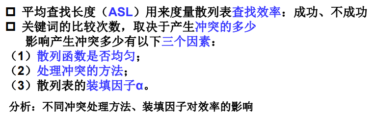

### 线性探测法的查找性能

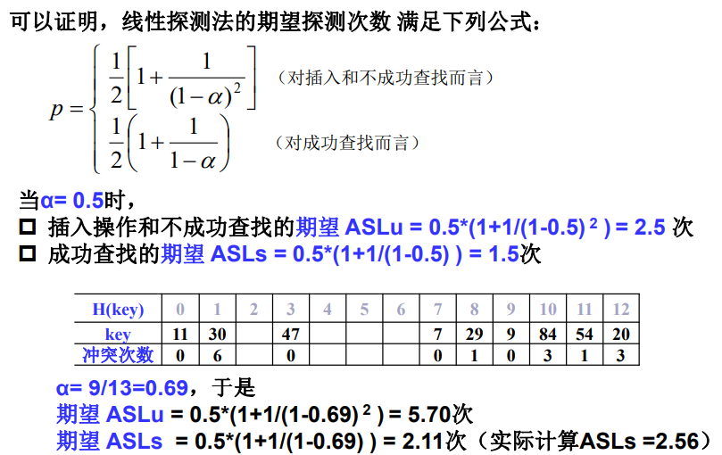

### 平方探测法和双散列探测法的查找性能


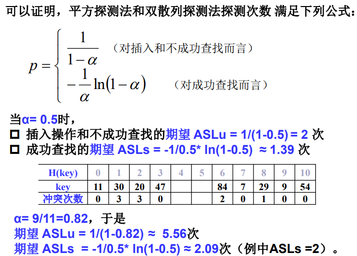

### 期望探测次数和α的关系

- 随着 α 的增大，线性探测法的期望 探测次数增加较快，不成功查找和 插入操作的期望探测次数比成功查 找的期望探测次数要大
- 合理的的最大装入因子α应 该不超过0.85

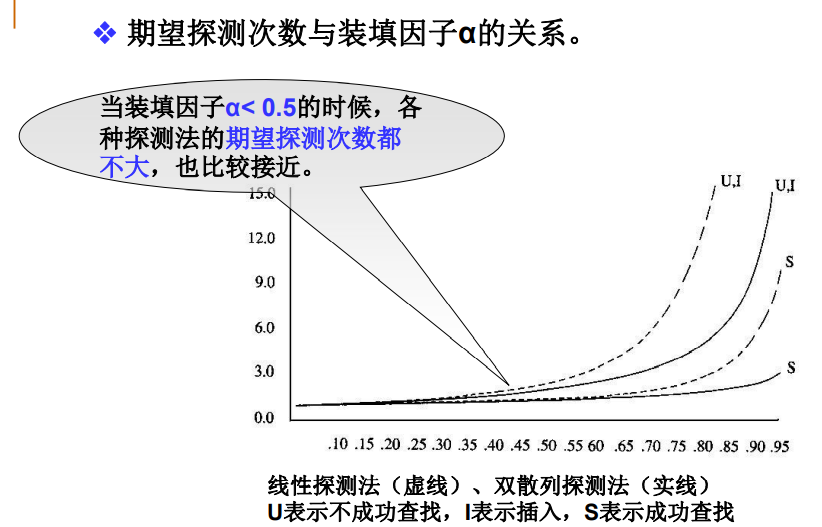


### 链接法的查找性能

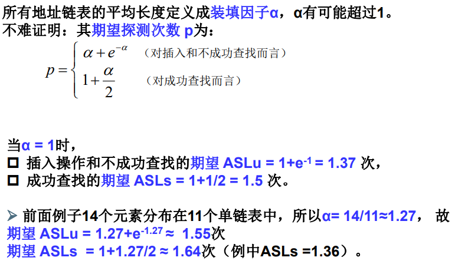

### 总结

散列查找有一个很大的优点，散列查找它和问题的规模关系不大，它是通过计算出位置。不发生冲突的时候是一次成功。如果散列函数、冲突解决方法冲突可以减少到一个比较少的水平。

散列查找在很多情况下是用于字符串的管理，也就是变量名、web地址名等等。因为在查找的时候首先要比较两个keyword是不是一样的，谁大谁小，当我们的keyword是数字的时候这种比较很简单，一步完成。当是字符串的时候，我们需要一个字符一个字符去比较，所以散列查找适合于这种关键词的比较不是很容易的时候，我们通过设计一个函数把它变成数字，然后进行比较。

另外一个特点，散列查找有一个装填因子，它反应了散列表的占有率，装填因子小意味着冲突少，所以散列查找是一种空间换时间的策略。

二分法的查找或者是搜索树的查找我们如果想找最大值最小值或者找某一个范围，在平衡二叉树或者是搜索树里面是容易实现的。但是散列表没有办法做这些事情。

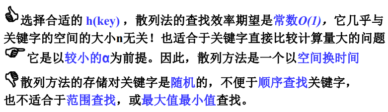


#### 开放地址法

优：散列表是一个数组，存储效率高，随机查找。

缺：散列表有“聚集”现象。

#### 分离链法

入口是一个数组，数组里面有一个指针指向单向链表。所以是一个数组和链表结合的一个方法。一旦发生冲突到链表去找的时候必须从头到尾一个一个去看，冲突多的时候链表会很长，查找效率降低。

特点：散列表是顺序存储和链式存储的结合，链表部分的存储效率 和查找效率都比较低。

优：关键字删除不需要“懒惰删除”法，从而没有存储“垃圾”。

缺：太小的α可能导致空间浪费，大的α又将付出更多的时间代价。 不均匀的链表长度导致时间效率的严重下降。

## 应用：文件中单词词频统计

切出一个单词的关键就是判断分隔符。切出来之后还涉及到一个查找来确定这个单词前面有没有出现过的问题。所以这就是一个查找和插入的一个过程，是一种动态查找。我们用散列表这种数据结构来管理单词表是最好的方法，因为单词是字符串。


InsertAndCount是先在散列表里面找，如果没找到就插入，如果找到了就词频+1；show：(1)统计最大词频； (2)用一组数统计从1到最大词频 的单词数； (3)计算前10%的词频应该是多少 (4)输出前10%词频的单词

```c
int main() {
 int TableSize = 10000； /* 散列表的估计大小 */
 int wordcount = 0, length;
 HashTable H;
 ElementType word;
 FILE *fp;
 char document[30]= "HarryPotter.txt“; /* 要被统计词频的文件名 */
 H = InitializeTable( TableSize ); /* 建立散列表 */
 if(( fp = fopen(document, “r” ))==NULL) FatalError(“无法打开文件!\n” ); 
 while( !feof( fp ) ){
     length = GetAWord( fp, word ); /* 从文件中读取一个单词 */
     if(length > 3){ /* 只考虑适当长度的单词 */
         wordcount++; /*统计文件中单词总数 */ 
         InsertAndCount( word, H );
     }
 }
 fclose( fp );
 printf("该文档共出现 %d 个有效单词，", wordcount);
 Show( H ，10.0/100 ); /* 显示词频前10%的所有单词 */ 
 DestroyTable( H ); /* 销毁散列表 */
 return 0;

```

## 电话聊天狂人

题意：读进来n个记录，每个记录有两个号码，一个是接电话的，一个是打电话的，要统计出谁的打电话和接电话的综合最多，这个人就是狂人。

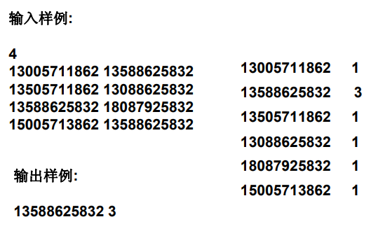

### 解法1 – 排序

第一种简单直接的方法就是直接把号码一次性读进来，然后从小到大非递减的排序。然后相同的号码就会堆在一起，我们再从头到尾扫描，一直更新最大的出现次数即可。

这种方法优点是很快，简单直白，但是由于这样的电话数据是无时无刻都在变化的，也就是说电话狂人是可能在动态更新的，所以我们需要找到一个可以解决动态变化的方法。

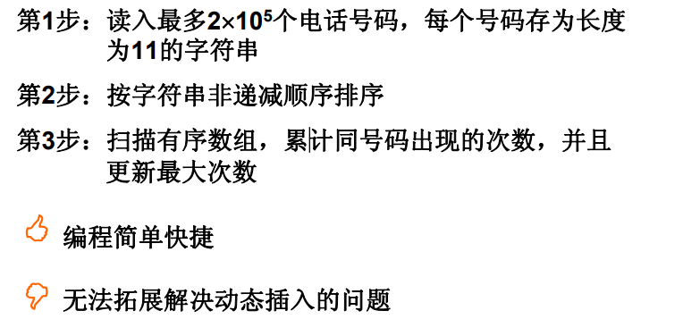

### 解法2 – 直接映射

为什么创建这么大的数组。因为我们默认手机号码第一位都是1，所以也就是后面10位在动，这个数组肯定足够大了。

这个方法也简单直白，并且满足了动态插入的需求，一步就能把电话号码插入。但是电话号码很长，开一个能存放这个号码的类型很浪费空间，更何况要开10的十次方这个两级的数组。并且就算数组开出来了，为了10的五次方的号码在10的十次方的数组里找，得到的是一个N²数量级的时间复杂度。

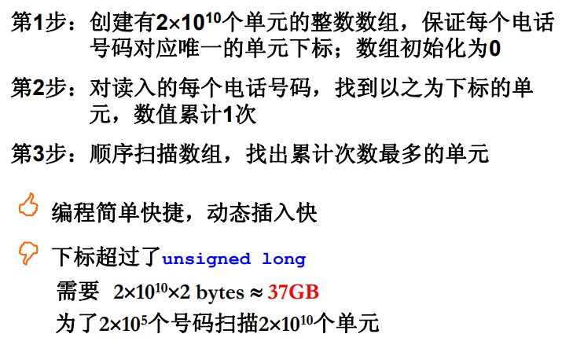

### 解法3 – 带智商的散列

解法2其实是一种没设计好的散列，它的散列表大小为10的十次方大小，散列函数h(n)=n。

这里我们要得到一个更加聪明的散列，我们要对手机号码进行分析。首先手机号码的前三位不适合作为散列函数来考虑，因为它是网络识别号，一共就几种，如果加入这三位的话就容易在几个区域内聚集。网络识别号的后面四位最早是地区编码，虽然现在它已经不完全是地区编码了，但是仍然可能有很大的概率是在同一区域内的，同样的，很多手机号都会被映射到同一地方，所以地区编码也是不好的。随机性最好的是最后的四位，它是真正的用户号码，是随机的。但是我们这题的问题规模是10的五次方，所以我们用上地区编码的最后一位加上用户的随机号码总共五位用于散列函数。

散列表可以用数组也可以用链表，在这里我们推荐用分离间接法来解决冲突。散列表的头H（指针）存在散列表的长度--素数p，大于2n的素数，因为我们有2n个不同的号码。建立好数组里面的头节点之后，就可以开始读入号码了。先找号码，如果找到了就在对应节点的计数器上+1，如果没找到就头插。


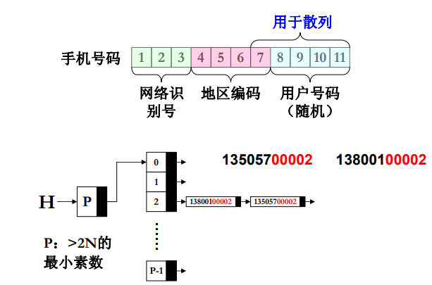

### 程序框架搭建

```c
int main()
{
    创建散列表;
    读入号码插入表中;
    扫描表输出狂人;
    return 0;
}
```

首先我们scanf读入一个记录，看看数据的大小创建一个散列表（2n）。接着就要一个循环来读入n条记录，插入表中。最后扫描表，输出狂人。完成任务记得释放空间。

这边key声明成了ElementType，配合我们散列表里面声明的类型。

```c
int main()
{ 
    int N, i;
    ElementType Key;
    HashTable H;
    scanf("%d", &N);
    H = CreateTable(N*2); /* 创建一个散列表 */
    for (i=0; i<N; i++) {
        scanf("%s", Key); Insert( H, Key );
        scanf("%s", Key); Insert( H, Key );
    }
    ScanAndOutput( H );
    DestroyTable( H );
    return 0;
}
```

在我们执行main函数之前我们需要做一些准备工作。在CreateTable之前我们要把散列表的定义复制来，然后才能调用，在CreateTable函数里面我们需要用到nextprime来生成比用户传进来的数要大一点的素数。我们还需要实现插入函数，要插入的话我们就需要散列函数来计算位置，然后Find函数来找到一个合适的位置来插入。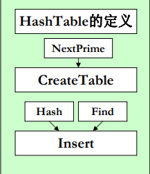

我们还需要ScanAndOutput来扫描这个表来输出狂人，这个模块就是一个大循环，这个循环要扫描整个散列表，扫描过程中更新最大的通话次数，遇到更大的我就更新一下。并且如果有不止一个狂人的话我们要输出电话号码最小的那个，所以当最大通话次数相等的情况下我们要更新最小的号码并且统计一下狂人有几个。

### 输出狂人

由于要扫描整个散列表，所以最外层是一个大的for循环用来扫描每一条链表，for循环里面用一个while循环来扫描链表的每一个结点，我们直接从头节点指向的下一个结点开始，如果不是null，那么就继续向后指，即while (Ptr){.......Ptr = Ptr->Next;}。在扫描的过程中要更新MaxCnt，如果当前Ptr指向的结点的计数器的值大于MaxCnt的话我们就需要更新最大的通话次数，也就是把MaxCnt定义成当前这个结点的Count，同时要把这个狂人的电话号码搬到我们要输出的这个最小电话号码上，由于比最大的MaxCnt的人是第一次出现，也就是说现在的狂人只有一个，也就是PCnt为1。最后我还有看，如果最后狂人的数目PCnt大于1那么还要把狂人的数量输出出来。如果发现指针指向的结点的Count等于现在的MaxCnt那么说明现在的狂人数量不唯一，我们要更新相关数据。接着就是补上声明。

```c
void ScanAndOutput( HashTable H )
{ 
    int i, MaxCnt = PCnt = 0;
    ElementType MinPhone;
    List Ptr;
    MinPhone[0] = '\0';
    for (i=0; i<H->TableSize; i++) { /* 扫描链表 */
        Ptr = H->Heads[i].Next;
        while (Ptr) {
            if (Ptr->Count > MaxCnt) { /* 更新最大通话次数 */
                MaxCnt = Ptr->Count;
            	strcpy(MinPhone, Ptr->Data);
            	PCnt = 1;
            }
            else if (Ptr->Count == MaxCnt) {
                PCnt ++; /* 狂人计数 */
                if ( strcmp(MinPhone, Ptr->Data)>0 )
                    strcpy(MinPhone, Ptr->Data); /* 更新狂人的最小手机号码 */
            }
            Ptr = Ptr->Next;
        }
    }
    printf("%s %d", MinPhone, MaxCnt);
    if ( PCnt > 1 ) printf(" %d", PCnt);
    printf("\n");
}

```

### 模块的引用与裁剪

第一个模块--HashTable的定义改动的地方就是红色，一个是更改关键词的长度。ketlength的原因就是在系源里面字符串的结尾还占了一个位置。另一个就是在节点里面增加一个计数器。

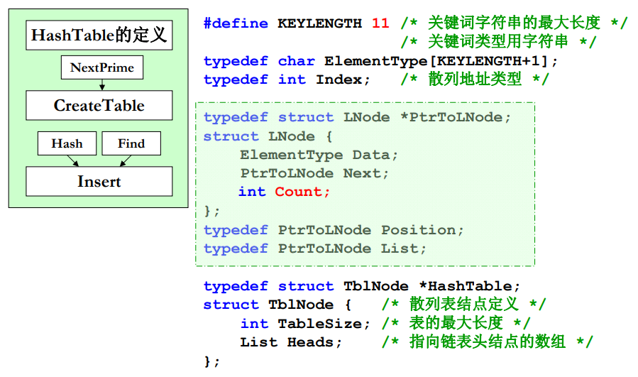

NextPrime这个函数什么都不用动，我们只要把上限给成一个合理的数即可。

再来看CreatTable，唯一要动的就是头节点的Count定义为0--不写这一行也没事，因为头节点是一个空节点，这个count没有意义，但是这是一个好习惯，也就是说这个结点里面所有的变量都有了一个初始值。

接下来就是一个散列函数，直接copy。但是要注意，这里面的key是一个整数，也就是说我们用这个函数之前要把电话号码的后五位截取出来变成一个整数了，而不是直接传一个11位的号码进来。

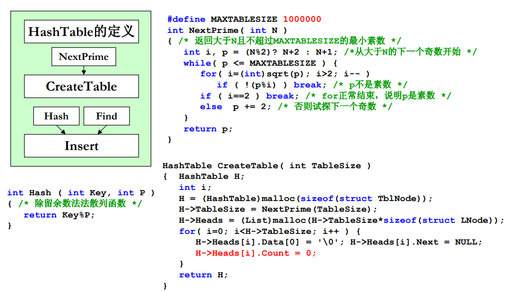

唯一要动的就是要把hash函数里面的key换掉，因为这个hash函数要的是一个整数，所以我们要把我们的字符串key转变成一个整数再放进来。调用atoi函数，key是一个指针，指向的是第一位，去错了length位再往回数MAXD位，MAXD位就是5.

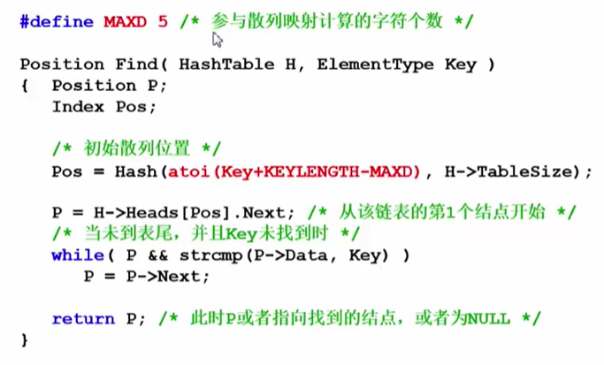

首先还是改hash，并且插入一个新的结点之前计数器要设置为1。如果找到了这个号码计数器的值+1.

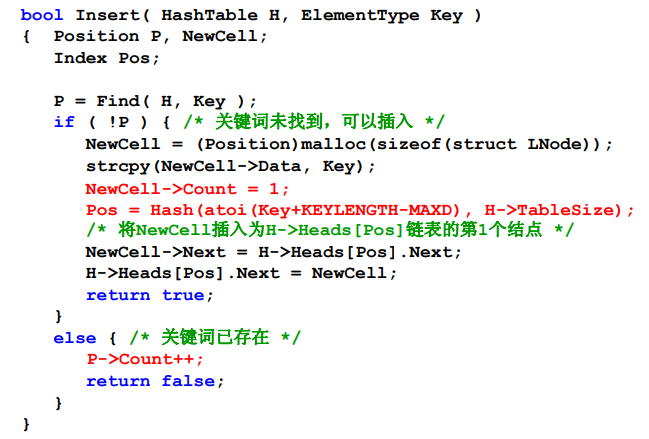
