# 经典面试题目

### Interview Coding 01

### 绳子盖点

题目1：

- 给定一个有序数组arr,从左到右依次表示X轴上从左往右点的位置
  **给定一个正整数K,返回如果有一根长度为K的绳子，最多能盖住几个点**
  绳子的边缘点碰到X轴上的点，也算盖住

思路1：

- 首先我们要考虑绳子放在哪？如下图，我们可以把绳子的开头放在1位置，也可以把绳子放在1.5位置。但是很明显，我们绳子的开头一定要放在arr数组中的点，例如1,3,7,10,13，才会使得压中的结点数最多。

- 定下了绳子的开头之后我们可以把问题拆分为，绳子开头在1时候的最大压中数量、绳子开头在3时候的最大压中数量、绳子开头在7时候的最大压中数量。。。。按照绳子的开头来进行求解答案，所有答案的最大值一定是全体的最大值。
- 有无单调性？有！如果在某一个位置的绳子已经无法盖住前面的点了，一定也无法盖住后面的点。所以我们可以利用滑动窗口来求解。每当arr[R]大于arr[L]+k的时候就更新一次全局的max，此时绳子以arr[L]开头，最大覆盖的点的个数就是R-L+1。


思路2：

- 和思路1一样，我们也把问题拆分为绳子以1,3,7,9开头分别求出最大然后求整体的最大。
- 不同的是，我们不使用滑动窗口来解。我们通过绳子的开头7以及绳子的长度3可以算出绳子的末尾10。我们只需要在arr数组的下标2~arr.len-1 部分求<=10最右的位置即可。
- 在一个数组的a~b部分求<=某个数最右的位置可以用二分法搞定！这样时间复杂度是nlogn


---

### 括号问题

题目2：

- 括号有效配对是指：
  1)任何一个左括号都能找到和其正确配对的右括号
  2)任何一个右括号都能找到和其正确配对的左括号
  有效的：(())  ()()  (()())  等
  无效的：(()  )(  等

  **问题一：怎么判断一个括号字符串有效？**
  **问题二：如果一个括号字符串无效，返回至少填几个字符能让其整体有效**

#### 判断有效

问题一思路：

- 只需要一个变量就能判断，不需要用栈，也不需要左右指针。
- 假设这个字符串只有左括号和右括号。只需要准备一个整型变量count，从左到右遍历这个字符串，遇到左括号就++，遇到右括号就--。如果在遍历的过程中count<0了，直接返回false。如果遍历结束之后count的值不等于0也返回false。否则就返回true。
- 为什么可以这样？如果count在任意时刻都不小于0，说明在任意一个位置，右括号的数量都不比左括号的数量多。并且如果最后count等于0了，就说明所有的左括号都可以找到一个右括号配对。

#### 添成有效

问题二思路：

- 和思路1一样，准备一个count变量，还有一个额外的need变量。从左往右遍历字符串，遇到左括号就++，遇到右括号就--，如果中途count== -1 ，就让need++，让count重新归为0，然后继续遍历。如果最后count>0，那么返回结果就是need+count。
- 原理：如果中途有count== -1 的情况，说明我需要在前面的某个位置补充一个左括号。如果最后count>0,说明我需要在后面的某个位置补充count个右括号。

#### 返回删成有效的所有方案数

```
LEETCODE 301
```


#### 最长有效子串

题目3：

- 括号有效配对是指：
  1)任何一个左括号都能找到和其正确配对的右括号
  2)任何一个右括号都能找到和其正确配对的左括号
  **返回一个括号字符串中，最长的括号有效子串的长度**

- 有可能给你一个无效的字符串，但是它的一部分子串是有效的，要返回最长的有效子串的长度。( **( ) ( )** ( **( ( ) )** 的最长有效子串是4

- 思路：这是一道动态规划。首先看到子串、子数组的问题。一个很自然的拆分思路就是枚举每一个位置开头或者结尾的答案，答案一定在其中。这样拆分，我们就可以把之前求过的位置都记在一个数组中，看看能不能帮助我现在这个位置求出答案。动态规划就是类似的思路，你在求0~i的答案的时候看看能不能用0~i-1的答案来帮助你。

  假设dp[i]代表0~i范围上，以i位置结尾的最长有效子串的长度。现在要求0~i范围的答案，**如果第i个位置是左括号，那么这个位置的答案就是0**，因为以左括号结尾一定是非法的。

  那么**如果i位置是右括号**？由于已经知道了dp[i-1]，那么我们就从i-1位置倒推dp[i-1]长度到达另外一个位置p，位置p是不在范围dp[i-1]的有效范围里面的。**如果`str[(i-1)-dp[i-1]]`是右括号，那么dp[i]等于0**

  现在有个难点，为什么p位置不是左括号dp[i]就一定是0？要理解“最长”，如果p位置是右括号的话，那么p之前就不可能出现如下图的一个方块外加一个左括号的结构，因为如果出现了这样的结构，那么dp[i-1]就求错了！矛盾。

  4里面的块也不可能有一小块和i位置的右括号匹配的，因为只有4里面的左括号才能和这个右括号匹配，但是4里面的左括号早就被4块中自己的右括号匹配光了！

  综上，只有p位置是左括号才能和i位置的右括号配对，其它情况都不可能匹配。


- 所以，如果i位置是左括号，dp[i]=0。如果i位置是右括号，并且p位置是右括号，dp[i]=0。
- 但是如果i位置是右括号，并且p位置是左括号，那么dp[i]至少等于dp[i-1]+2。它可能会更长！！我们继续看p-1位置然后加上dp[p-1]。


还有一个题，在代码中为deep方法

问的就是有效子串中最深的嵌套层数。很简单，还是只要一个count，遇到左括号++，遇到右括号--，count到达的最大值就是最大嵌套层数。前提是count到达这个最大值后还能够到达0.


---

### 正方形涂色

题目4：

- 有一些排成一行的正方形。每个正方形已经被染成红色或者绿色。现在可以选择任意一个正方形然后用这两种颜色的任意一种进行染色，这个正方形的颜色将会被覆盖。目标是在完成染色之后，每个红色R都比每个绿色G距离最左侧
  近。返回最少需要涂染几个正方形。
  如样例所示：s=RGRGR我们涂染之后变成RRRGG满足要求了，涂染的个数为2，
  没有比这个更好的涂染方案。

题意：

- 意思就是要把RGRRGRR这样的正方形排列，经过涂色变成左边都是R，右边都是G。左边几个R右边几个G不关系，我要求的是涂色的次数最少可以变成这样的效果。例如RRRRGGG/RRRRRRR/RRGGGGG都是合法的。但是要的是涂色次数最少的涂法。

思路：

- 这题可以枚举分界线。定下分界线，左边的G的个数加上右边的R的个数就是这个分界线的答案。
- 技巧：利用预处理数组来快速得到G和R的数量。gcount[i]代表从0~i范围上有几个G。rcount[i]代表从i~len-1范围上有几个R。但是其实我们只要知道gcount和rcount中的一个即可。另外一部分可以在遍历的过程中用一个变量抓住。
- 其实一个变量也可以实现count数组的作用。例如我要知道i~len-1的R的数量，那么我们先遍历一遍得到R的总数totol，当我来到一个位置如果这个位置是R那么totol就--，这样totol的含义就变成了右侧还有几个R。


---

### 矩阵中最大正方形

题目5：

- 给定一个N*N的矩阵matiⅸ，只有0和1两种值，返回边框全是1的最大正方形的边长长度。
  例如：
  01111
  01001
  01001
  01111
  01011
  其中边框全是1的最大正方形的大小为4*4，所以返回4。


 可以直接计算得到数量的阶数。长方形的数量有更简单直观的估计方式，就是在矩阵中任意找两个点。正方形的估计就是任意找一个点，然后往两边扩。


因为正方形的总数为O(N³)，所以算法的时间复杂度肯定也是O(N³)，因为你至少要把所有的正方形看过一遍才能知道答案

所以我们至少需要三个循环嵌套，前两个循环定一个点，第三个循环延长边。我们能优化的地方在于如果验证某个正方形是不是边框都是1。

所以我们使用额外的结构来加速我们验证正方形合法性的过程。r[i] [j] 代表在(i,j)这个点右边（连同自己在内）有多少个连续的1。d[i] [j] 代表在(i,j)这个点下面有多少个连续的1。很明显，我们只需要O（N²）的时间就可以得到这两个辅助结构。


---

笔试：

- C、C++ 10^8~10^9 常数级别的操作 1~2s内能过。java、python3~4s内能过。
- 如果数据量是10^6，那么如果你的算法是O(N²)，那么肯定过不了，因为你的常数级别操作就到了10^12的量级，超过了10^8~10^9。

---

### 构造数组

题目6：

- 给定一个正整数M,请构造出一个长度为M的数组arr,要求
  对任意的i、j、k三个位置，如果i<j<k,都有arr[i]+arr[k]!=2*arr[j]
  返回构造出的arrr

- 思路：分治。假设现在你有一个达标数组X，根据X数组，对X数组进行两次变化。分别是奇变换和偶变换，分别变换出A数组和B数组。A数组里面都是通过2x+1变换出来的奇数。B数组里面都是通过2x变换出来的偶数。A和B拼凑成一个新的数组AB，AB数组左半边和右半边分别达标。跨越A和B的边界也是达标的，因为A和B分别选一个相加为奇数，而AB数组中的任何一个数*2都是偶数，偶数一定不等于奇数。
- 空间复杂度不使用递归的话可以优化到O(1)。但是时间复杂度一定是最优了！
- 思考：想想看给你一个合格的，你怎么把它通过加工拼成一个更大的合格的。如果可以做到那么就可以分治了


---

### 二叉树路径

题目7：

- 给定一个二叉树的头节点head,路径的规定有以下三种不同的规定：
  1)路径必须是头节点出发，到叶节点为止，返回最大路径和
  2)路径可以从任何节点出发，但必须往下走到达任何节点，返回最大路径和
  3)路径可以从任何节点出发，到任何节点，返回最大路径和。（可以往上走）


思路

1. 第一种规定。可以不使用递归套路，如果使用递归套路的话需要注意，不能把null定为base case，要把叶子结点定位base case。

2. 第二种规定。 需要使用二叉树的递归套路。需要划分可能性：答案和头有关、答案和头无关。

   和头无关的时候会出现答案，例如头是负数的时候。此时我们需要左树的最大路径和以及右树的最大路径和（**不一定从头出发**）。

   和头有关的时候，有三种情况。a. 不往左走也不往右走，只有自己。b. 往左走。c.往右走。但是此时左右子树要给的信息是左右子树的最大路径和（**从头出发**，要和上面的情况区分开）。

   所以我们需要两种信息。第一个信息是和头无关的情况需要的，第二个信息是和头有关的时候需要的。分别是整棵树的最大路径和、从头结点出发的最大路径和。注意：**由于规定只能往下走，所以左右两边只能走一边**

3. 第三种规定。和第二种的区别就是路径可以往上走，但是沿途结点只能经过一次。

   依然是列可能性。第一种大情况是和头结点无关的时候，那么就往左右孩子要他们各自的最大路径。

   和头节点有关的时候。 a. 不往左走也不往右走，只有自己。b. 往左走。c.往右走。d. 既往左又往右。

4. 第四种规定：从任何结点出发但是一定要到叶子结点的最大路径和。


### Interview Coding 02

### 二维数组中寻数

题目1：

- 在行也有序、列也有序的二维数组中，找num,找到返回true,否则false


思路：

- 从左下角或者右上角开始走。如果从右上角开始走，那么只可能往左或者往下。
- 不能从左上角开始走，因为可能有两个方向，不好走。


---

### 打包机器

题目2：

- 有个打包机器从左到右一字排开，上方有一个自动装置会抓取一批放物品到每个打包机上
  放到每个机器上的这些物品数量有多有少，由于物品数量不相同，需要工人将每个机器上的
  物品进行移动从而到达物品数量相等才能打包。每个物品重量太大、每次只能搬一个物品进
  行移动，为了省力，只在相邻的机器上移动。请计算在搬动最小轮数的前提下，使每个机器
  上的物品数量相等。如果不能使每个机器上的物品相同，返回-1。

  每一轮指的是每一台机器都可以选择往左或者往右扔包裹或者不扔包裹。

  例如[1,0,5]表示有3个机器，

  每个机器上分别有1、0、5个物品，[1,0,5]，经过这些轮后：
  第一轮：[1,1,4]；第三台机器往左扔包裹，其它机器不动。

  第二轮：[2,1,3]；第三台和第二台机器都往左扔包裹。

  第三轮：[2,2,2];  第三台机器往左扔包裹。
  移动了3轮，每个机器上的物品相等，所以返回3
  例如[2,2,3]表示有3个机器，每个机器上分别有2、2、3个物品，这些物品不管怎么移动，都
  不能使三个机器上物品数量相等，返回-1

思路：贪心算法（难证明，不需要证明）

- 首先我们可以知道任何一个i位置需要多少件衣服，总衣服数/机器个数。并且我们需要用到每个i位置的前缀和。

- 对于任意一个i位置，我们可以求出它的左边的盈余left，如果盈余>0说明左边的衣服多了，如果盈余<0说明左边的衣服少了。右边的盈余right也同理。

  分情况讨论：

  a. 如果left>0,right>0，那么说明左右两边衣服都多了，需要向i位置扔衣服。左右两边可以同时往i位置扔衣服，所以此时需要max(left,right)。

  b. 如果left<0,right>0 , 说明此时左边缺衣服，左边缺的衣服一定是从i来的，所以至少需要|left|次，left次完了之后right如果不等于0还需要继续往i送。所以此时需要的轮数为max(|left|,|right|)。

  c.  如果left>0,right<0，和b情况类似，需要的轮数为max(|left|,|right|)。

  d. 两边的衣服都不够，需要i往左右两边送。因为一次只能送一件，所以此时的轮数为|left|+|right|。

  

- 贪心思路：我们从左到右遍历机器数组的每一个位置，依次求出所需要的轮数。所有的轮数中最大的就是答案，因为它是整个系统的瓶颈。

- 由于是从左到右的遍历流程，所以前缀和数组我们都可以不用求出来，直接在遍历的过程中求即可。空间复杂度只需O(1)

- 上面的a、b、c三种情况都可以用max(|left|,|right|)来表示


---

### 左右最大值相减的最值

题目3：

- 给定一个数组arr长度为N,你可以把任意长度大于0且小于N的前缀作为左部分，剩下的作为右部分。
  但是每种划分下都有左部分的最大值和右部分的最大值，请返回最大的，左部分最大值减去右部分最大值的绝对值。


思路：

- 本人第一眼看到的想法是准备两个大根堆。
- 实际上不需要这么麻烦，左部分最大值和右部分最大值肯定有一个就是全局的最大值。如果最大值在左边，那么问题就变成怎么让右边的最大值尽可能小。要让一个数组的某个范围内的最大值尽可能小最好的方法就是让这个范围缩小！因为右边部分必须包含len-1位置，那么我就让右部分只有arr[len-1]这个元素。同理，如果最大值在右边，那么就让左边只有0位置的数。两种情况求最大值。
- 单调性：一个部分的范围变大，最大值只可能变大或者保持不变，如果这个部分还已经包含了全局的最大值，那么范围变大最大值只会保持不变。在这部分不变的情况下，要让左部分最大值减去右部分最大值的绝对值达到最大，只需要让没有全局最大值的那个部分的范围最小即可 ----》arr[0] 或者 arr[len-1]


---

### 接雨水

题目4：

- 给定一个数组arr,已知其中所有的值都是非负的，将这个数组看作一个容器，请返回容器能装多少水

  容器两边的趋势认为是无限低的

  比如，r={3,1,2,5,2,4}根据值画出的直方图就是容器形状，该容器可以装下5格水

  再比如，arr={4,5,1,3,2},该容器可以装下2格水


- 思路：一个位置i可以放多少水，取决于左边最大高度以及右边最大高度当中的最小值。例如，左边最大值是12，右边最大值是15。那么这个位置就取决于12这个值。如果这个值大于等于12，那么放的水就为0，如果这个值小于12，那么可以放的水就等于12-这个位置的值。
- 只需要辅助数组,arr1[i]存放0~i位置的最大值，arr2[i]存放i~N-1的最大值。即可把时间复杂度降为线性。
- 还可以不需要辅助数组，直接用几个变量。L和R分别从第二个位置以及倒数第二个位置开始遍历，因为第一和倒一的位置肯定无法放水。用lm以及rm来表述此时0~L-1以及R+1~N-1的最大值。即使lm和rm是局部的最大值我们也可以对位置进行放水。每次遍历都选择lm和rm中较小的一边放水，例如lm小那么就往L位置放水，然后移动L。直到L和R相遇了。原理是尽管rm是局部的，如果lm已经小于rm了，那么lm肯定也小于全局的rm。

---

### 地形储水

题目5：

- 如果给你一个二维数组，每一个值表示这一块地形的高度
  求整块地形能装下多少水。

  认为每个格子只和自己的上下左右相连

- 流程：

  1. 准备一个堆，记录着当前数字来自于二维数组中的哪行哪列，也就是记录着三个指标，(num,row,col)，这是一个小根堆，根据num来排序。之前进堆过的元素不能重复进堆，用boolean类型的数组来记录。
  2. 先把二维数组边缘的所有元素放到堆中
  3. 设置一个全局变量max
  4. 从堆中弹出堆顶得到num，row，col。看看num能不能更新max。
  5. 把这个元素上下左右没有入过堆的都入堆，在boolean类型的数组中标记，并且结算水量，water累加上max-(up/down/left/right)num。

- 原理：

  1. 边缘放进去之后，堆顶就是短板。max就是此时的短板，只要没有更新max，后面弹出的元素都是以max作为短板。

  2. 当max更新说明你已经转到另一个局部区域了。例如下图，你从5区域转移到了6区域

     

- 时间复杂度：O(M * N * logK)，k为堆的大小

---

### 加和n元组

题目6：

- 给定一个**有序**数组arr,给定一个正数aim
  1)返回累加和为aim的，所有不同二元组
  2)返回累加和为aim的，所有不同三元组

  例如11222333566667DA77788899，aim=9，---》  (1,8)/(2,7)/(3,6)

思路：

1. 找出所有的二元组。左右指针，相加小于aim左指针动，大于aim右指针动。相等了，可以规定左指针动，如果此时arr[L-1]==arr[L]那么就不能收入答案，否则就收入答案。
2. 找出所有的三元组。只需要固定第一个，后面两个用找二元组的方法找即可。11122233344567，例如第一次固定了1，找出来之后，后面的两个1就可以省略了，因为后面两个1的范围比第一个1小，它们都被第一个1包括了。

- 原理，我们去两边，如果大于t，那么说明r位置的数和中间加起来也大于t，那么r就可以淘汰了。l同理

---

### 第K小的数值对

题目7：

- 长度为N的数组arr,一定可以组成N²个数值对。
  例如arr=[3,1,2],
  数值对有(3,3)(3,1)(3,2)(1,3)(1,1)(1,2)(2,3)(2,1)(2,2)
  也就是任意两个数都有数值对，而且自己和自己也算数值对。
  数值对怎么排序？规定，第一维数据从小到大，第一维数据一样的，第二维数组也
  从小到大。所以上面的数值对排序的结果为
  (1,1)(1,2)(1,3)(2.1)(2,2)(2.3)(3,1)(3,2)(3.3)
  给定一个数组arr,和整数k,返回第k小的数值对。

  注意：就算arr中有相同的元素，例如1,1,2,3,(1,2)和(1,2)看做是不一样的，因为分别是下标为0的1和下标为1的1.

思路：

1. 暴力方法，就是整出所有的数值对，然后排序，接着取第k个。
2. 我们可以做到O(N)的时间复杂度。假设arr有10个数，那么按照数值对的第一个元素来进行排列，每一排都有10个数值对。假设我们的每一排都是按照递增顺序，那么我们就可以根据这个来找到我们要找的数值对，如果排好了序应该在第几排。找出在第几排之后，那么需要知道它在第几列。这里的第几列不是严格的第几列，因为它可能大于10，因为数组中可能有重复值。所以我们需要除以它重复的个数。
3. 假设arr有序，首先定位序列的第一个数，arr[k-1/N]。找出小于arr[k-1/N]的数有多少个a，我们的目标变为找以arr[k-1,N)开头的第k-N*a（赋值为p）小。 如果arr[k-1/N]这个数有重复b次，如何知道我们要的来源于第几个这个重复的数---(p-1)/b。
4. arr没序了，想起我们之前的快排改进算法，可以找出一个无序数组的第k小的数，我们把其改成非递归，空间也省了。第一步，找k-1/N小的数，确定一个数。然后找(k-1/N)+(p-1/b)即可。

### Interview Coding 03

### 找工作

题目1：

- 每种工作有难度和报酬，规定如下
  class Job{
  	public int money;/该工作的报酬
  	public int hard:/该工作的难度
  }

  给定一个Job类型的数组jobarr,表示所有岗位，每个岗位都可以提供任意份工作
  选工作的标准是在难度不超过自身能力值的情况下，选择报酬最高的岗位
  给定一个int类型的数组arr,表示所有人的能力
  返回int类型的数组，表示每个人按照标准选工作后所能获得的最高报酬

思路：将工作排序，按照两个维度排序。第一个维度是难度，从小到大排序。第二个维度是钱数，从大到小排序。

第一步，将工作按照难度升序，钱数降序排列。

```
	public static class JobComparator implements Comparator<Job> {
		@Override
		public int compare(Job o1, Job o2) {//先按照工作的难度升序，再按照钱降序排列
			return o1.hard != o2.hard ? (o1.hard - o2.hard) : (o2.money - o1.money);
		}
	}
```

第二步，相同难度工作中留下一个钱最多的作为队长。

第三步，删掉队长中难度增加，钱减少的。

- 也就是只留组长，并且组长中必须保证难度上升报酬也在上升


这样做完之后难度是递增的，钱也是递增的了。然后把这些都放到一个有序表中，根据难度来排序，然后来一个人，就根据它的能力值，在有序表中查找<=他的能力值最近的那个工作，就是那个人应该选的工作。


---

### 零食（背包）

题目2：

- 背包容量为w
  一共有n袋零食，第i袋零食体积为v
  总体积不超过背包容量的情况下，
  一共有多少种零食放法？（总体积为0也算一种放法）。

在动态规划中，尝试的方法是最重要的。

尝试的方法有：从左往右的尝试模型。---从暴力递归的从左往右的尝试优化成动态规划。

暴力递归有三个参数`int[] arr,int index,int rest`，含义是arr的0~index-1范围的零食我已经选择过了，让你在背包容量还有rest的时候选择index~len-1范围的零食，看看有多少种方法。

- coding层面的问题，在返回0还是-1上面，自己要分得清无方案和值0的区别。如果你不希望上游用0，那么就使用-1自己进行判断。

递归写完之后去改动态规划就很简单

第二种方法：dp [ i ] [ j ] 代表0~i自由选择，凑成 j 的的方法数。可以写出最优子结构。最终结果就是sum{dp [n-1] [0...j]}。因为这里的dp的含义是刚好等于而不是<=


---

### 空间压缩

假设某一个动态规划问题在求dp [i] [j]的时候即依赖于它左边的格子又依赖于它右边的格子的时候，是否真的有必要申请一整张二维表的空间？能不能只申请一个数组呢？我们知道一个要填的dp二维数组中的第一行的值以及第一列的值是我们知道的。那么如果有一个策略可以使得我们可以从第i行的值退出第i+1行的值，那么我们就可以只要一个一位数组就够了。

看图可知，我们是可以通过一个数组迭代得到最后一行的值的。bcde可以从a得到，a'可以从a得到，b‘从b和a’得到。


那么如果依赖自己左上角的位置和上面的位置可以完成更新吗？也是可以的。不过这次数组是从右往左更新。


那么如果依赖自己的左边的，左上角的，上面的，有三个方向可以做到吗？依然可以。但是需要一个额外的变量来抓住被覆盖的之前的值

- 上下左右都要的就不能做空间压缩了。

如果需要自己左边的，上面的，跳一行左上角的，依然可以做到。但是需要三个数组交替的进行


但是如果二维数组行和列相差大，那么也可以用列申请一个数组，横着滚过去。


---


题目3：

- 给定一个二维数组matrix,其中每个数都是正数，要求从左上到右下
  每一步只能向右或者向下，沿途经过的数字要累加起来
  最后请返回最小的路径和
- 动态规划的空间压缩技巧！


---

题目4：

- 请注意区分子串和子序列的不同，给定两个字符串str1和str2,
  求两个字符的最长公共**子序列**
- 动态规划的空间压缩技巧！


---

题目5：

- 请注意区分子串和子序列的不同
  给定两个字符串str1和str2,求两个字符串的最长公共**子串**
- 动态规划的空间压缩技巧！

子串和子序列不同，子串是连续的。

所以这里dp [i] [j]的含义是同时以str1[i]位置结尾以及以str2[j]位置结尾，最长公共子串长度。这个和最长子序列的区别很大，因为最长公共子序列dp [i] [j]的含义是0~i 的str1和0~j的str2的最长公共子序列。造成这样的区别就是一旦str1[i]!=str2[j]的时候，子串的dp[i] [j]要清零，而子序列的dp[i] [j]不需要清零。

在最长子串问题中，答案是二维表中的最大值，而不是右下角的位置。

那么我们能否用子序列问题中的dp的含义来解子串问题？好像是不行的，因为子序列可以是跳跃的，所以dp [ i ] [ j ] 可以继承前面的值。如果子串问题继承前面的值是没有什么意义的，因为前面可能已经断掉了，判断是多少只能一个一个往前比对，这样就太低效了。

- 这题的最优解不是用动态规划，而是用求后缀数组的方法。这个在后面有

因为这题的dp只需要依赖左上角的值，所以我们用有限几个变量就可以了，都不需要数组。我们利用有限几个变量按照斜线的方式来进行更新。并且返回最大值以及返回是谁是一码事。


---

### 词频最大的前K个字符串

题目6：

- 给定一个由字符串组成的数组String[] strs,给定一个正数K
  返回词频最大的前K个字符串，假设结果是唯一的

先全部放到一个hash表中统计词频。接着把字符串和词频封装成一个对象。把这些对象全部放入一个大小为k的小根堆中。在小根堆中剩下的就是top k。


---

### 实现词频统计结构

题目7：

- 请实现如下结构：

  ```
  TopRecord{
      public TopRecord(int K):构造时事先指定好K的大小，构造后就固定不变了
      public void add(String str):向该结构中加入一个字符串，可以重复加入
      public List<String>top():返回之前加入的所有字符串中，词频最大的K个
  }
  ```

  要求 ：
  add方法，复杂度O(Iog k):
  top方法，复杂度O(k)

- 固定只能要top k，不能一会top 2，一会top 3

 用自己实现的堆结构来实现。自己实现的堆结构在基础班第四节。

系统实现的堆只能做到你给他一个（string ，integer），它帮你插入到堆中。但是没有办法帮你定位到string所在堆中的位置，然后直接把它的词频+1，接着做堆结构的调整。要实现这个功能我们需要有一个额外的结构，例如hash table帮助我们记录下string对应在heap中的位置。另外一个hash table帮助我们string与词频的对应关系，这样我们就不需要一个额外的类。但是创建一个Node也是可以的，看个人的偏好，区别就是判断在堆上移动的标准是从times表中拿还是从Node本身拿。

来一个字符串就在index表中看看这个字符串在不在堆上，如果在堆上，那么直接在对应的times表上+1，并且做堆结构的调整。如果不在堆上，那么仍然是times表上对应加一，然后直接插入小根堆，接着从小根堆中弹出一个。如果times表上找不到这个字符串，那么就在times表和上创建，然后插入小根堆。

- 另外一种思路：先遍历一遍，在hash表中统计词频。统计完了之后string和次数封装起来放到一个数组中，然后利用bfprt算法找到第k小的。接着遍历一遍数组把符合的全部挑出来，这样算法的复杂度是O（N)	

### Interview Coding 04

### 打印目录结构

题目1：


- 用前缀树。前缀树除了必须有一个指路结构之外，其它的结构都是看需求建立的。例如这题要打印目录结构，我们是来到一个结点之后打印的，所以我们就在结点中多记下我们是从那条路（这个路代表的就是某个字符或者是字符串，看题目）到这个结点的。如果每条路都是字符的话那么只需要26大小的数组即可，如果是字符串的话就要使用hash了。因为这里说的是同一级别要按照字典序，所以要使用TreeMap。
- java中\是转义。因为在正则表达式中`\\`表示匹配`\`，所以我们要在java中表示正则表达式的`\\`，就需要在正则表达式中的每个`\`前面多加一个`\`也就是`\\\\`


### 搜索二叉树转双向链表

题目2：

- 双向链表节点结构和二叉树节点结构是一样的，如果你把last认为是left，next认为是next的话。给定一个搜索二叉树的头节点head，请转化成一条有序的双向链表，并返回链表的头节点。


思路：可以用递归套路。用一个f(head)返回[start,end]。


### 先序、中序数组求中序数组

题目3：


思路：建树的话就慢了。这里我们搞一个函数f(arr pre,0,6,arr in,0,6,arr post,0,6)，先序数组给你0~6这段，中序数组也给你0~6这段，然后你帮我生成好后序数组0~6。

这题就是一个递归设计题，先序遍历的第一个数就是后序遍历的最后一个数，先填好，然后到中序遍历中找到先序遍历的第一个数在中序数组中的什么位置，然后继续递归。

但是这个找先序数组第一个数在中序数组的什么位置，可以遍历，也可以预处理数组。利用一个map即可。用了预处理就是n的复杂度，如果不用就是n²了。


### 最长递增子序列(n logn)

题目4：

- 给一个数组arr，求最长递增子序列

什么叫最长递增子序列呢？必须严格递增,连相等都不行。然后子序列：可以不连续

dp[i]啥意思？如果子序列必须以i结尾，最长递增子序列是多长。

- 子序列问题，但是dp[i]的含义设置为必须以i结尾，虽然反直觉，但是是合理的，因为在讨论情况的时候，如果i位置参与，我们其实是关心之前子序列的结尾的，因为不知道这个的话我们没有办法确定是递增的序列。既然我们关心结尾，所以我们就设置为必须以i结尾的含义。

求法：求i位置的dp，首先找到arr中i左边比你小的，在它们中找到一个dp最大的，然后+1即可。例如arr=[1,4,8,11,9,**10**],例如求加粗的10这个位置的dp，那么就找到前面有[1,4,8,9]比你小，下标分别是[0,1,2,4]，然后看一个求max{dp[0],dp[1],dp[2],dp[4]}，这个值+1就是加粗10位置dp的答案

对上面的过程做一个加速，因为不做加速的话，找前面比你小的数的下标位置就是一个n复杂度的了。

我们必须引入一个新的东西---ends数组。ends数组，它跟原来的这个array是等长的。ends[i]它的含义是：目前找到的所有长度为i+1的递增子序列中最小结尾是什么值。

注意这个ends数组中没有填过的位置认为是无效区。所以一开始ends都是无效区。只有在有效区里面的东西才有这个含义。然后ends有效区一定是有序的，因为如果无序，利用反证法，假设ends[4]=8,ends[5]=6，说明我找到了一个长度为6的子序列，并且以6结尾是最小的。那么我直接少一个结尾6的话，长度为5的子序列的最小结尾肯定是小于6的，而这里是8，所以矛盾了！故一定有序。

ends[i]和dp[i]是一起更新的，如何更新？在ends的有效区中，找到最左的大于等于arr[i]的位置，找到了就把这个位置改成arr[i]，然后数一数这个位置左边包括自己在内有几个数，有几个，dp[i]就填几。如果ends找不到最左的大于等于arr[i]的位置，那么就扩充有效区，然后把自己填进去。接着数这个位置左边包括自己在内有几个数，其实就是arr[i]影响到哪，dp的长度就到哪，影响的位置为i，那么长度就是i+1，因为自己影响了i+1长度的子序列的结尾。

- ends数组其实也是一个dp，含义就是每个长度的递增子序列的最小结尾是什么。可以猜到，i长度肯定是继承i-1长度的。这样就可以解释为什么只改一个位置的值，因为这些子序列默认就是继承前面的！也就是说，如果长度为2的结尾最小的子序列为3,5。那么长度为3的结尾最小的子序列肯定是3,5，x。这是一种继承关系！！有点贪心。

- arr[i]只会影响刚好大于自己的那个结尾，别的结尾影响不到，因为右边的自己还够不着，去左边自己没人家好。

- 如果只要最长递增子序列的长度，dp都可以不用填了，只需要用一个max抓住即可。要具体的序列也可以只用一个ends数组解决，因为上面填的值就是最长递增子序列的值。ends代表每种长度下最长递增子序列的结尾是多大。显然既然是最长递增子序列，如果尾巴的数越小，那么对于后面获得最长就越有利。所以每次来一个数，就去更新ends中大于等于它的最左边。

  你得到dp之后，遍历拿到的最大值就是最长的递增子序列的长度。如果要得到最长的递增子序列具体是什么，需要拿着dp去加工。


#### 无序数组最少操作多少次变为有序的

```
给你一个无序数组，你只能做一种查找，这种操作是把一个数往前放或者往后放，问你最少操作几次，这个数组可以变成有序的。
```

解法：求出最长递增子序列的长度。然后数组减去这长度就是你要做的操作次数。


#### 最少去掉多少数可以满足先升后降

```
例如[1,2,4,2,5,4,3,2,1]，去掉一个2之后[1,2,4,5,4,3,2,1]就是先升后降的。
```

其实就是正着求一次，反着求一次。然后看每一个位置dp1+dp2-1最大，抓住这个最大值，总人数减去这个最大值就是我们想要的。 

- 先升后降，降的部分逆着看也是升的。


#### 有多少不同的最长递增子序列

子序列看的是下标，不是值！

这题其实就是只利用了前面说的ends数组，只不过现在这个ends不只是数组了，里面存的是历史的当做最小结尾的数！也就是这个i位置的值是怎么更新来的我们做了个记录。当一个新的数到来的时候，还是到ends里面找大于等于自己最左的，然后插到这个表的最顶部，里面的value值从下面累加，以及从前面一个长度的顶部累加，再减去前面一个长度的表中你用不了的，也就是去前面一个长度的表中，找到大于等于自己最左，这些是你要减掉的。

code673！！


#### 信封问题

题目5：

- 每个信封都有长和宽两个维度的数据，A信封如果想套在B信封里面，A信封必须在长和宽上都小于B信封才行。如果给你一批信封，返回最大的嵌套层数

思路：第一维的数据从小到大，第二维的数据从大到小。


然后把二维数据单独拎出来做一个最长递增子序列就知道答案了。一维数据从小到大保证了底从小到大，然后二维数据打破了同底的递增序，这样一来只有是不同底的在二维数据中才可能递增。

我再给你举个例子。我给你一些二维的点，每一个点给你一个x方向的值，给你一个y方向的值。我问你我想找到一条线，一条曲线，这条曲线一定要严格的不断的往右上方窜的一条曲线。它不能够往下走，也不能够往左走，它只能往右或者往上走，或者平着来，或者往上走，怎么找到这么一条曲线穿过的点最多？这是不是信封套娃的问题啊？


#### 递增子序列的线段树解法

从最朴实无华的N²的做法出发。dp[i]的含义是必须以i结尾，最长子序列有多长

```
dp[i]=1+max{dp[i']...},  i'满足:arr[i']<arr[i]
```

leetcode2407题有一个新的约束，也就是

```
arr[i]-arr[i']>=k
```

其实本质和上题一样。都是一个动态规划。

现在看2407题的做法

```
dp[i]=1+max{dp[i']...},  i'满足:arr[i]-arr[i']>=k
如果i’不存在，那么dp[i]=1
对于每一个i，我们总是去寻找0~i-1范围上，所有arr[i]-arr[i']>=k的。如果arr[2]=arr[5]，我们知道dp[5]肯定是比dp[2]好的，因为遍历到5的时候，前面有的数值更多，更有可能插到一个更好的位置。所以在线段树中，我们把(arr[2],arr[2],dp[5])是可以的，因为我们肯定保证dp[5]的值优于dp[2]。所以我们就可以放心的把一个arr[i]对应的dp[i]放在线段树上。提供一个arr[i]-->dp[i]的映射。这样就可以方便的找出所有符合要求的arr[i']中对应的dp[i']的最大值。
```


#### 总结

本质就是ends数组，ends数组有效区的长度就是最长递增子序列的长度！

为什么用二分查找并替换呢？其实是为了增加ends数组变长的潜力，因为变小了之后，后面出现了比较小的元素，才有机会被你放到ends数组的末尾，ends数组才能变长！


### 子数组最大累加和

题目6

- 给定一个数组arr，返回子数组的最大累加和。

子数组：连续

用两个变量即可，一个变量cur，一个变量max。cur从左往右遍历数组，遇到一个数就加上去，然后看看能不能更新max。如果cur加得都<0了，那么就把cur置为0，然后继续遍历。

这个算法在数组是全负的时候也是对的。有负数和0的时候也是对的。现在证明三个都有的时候也是对的，我们假设数组的[m...n]是最大的累加和子数组，那么[m....i]和[i....n]这边上两段一定不小于0。并且[k...m-1]的累加和也小于0。所以说当我们的cur遍历到m位置的时候，cur一定是0，因为之前的[k...m-1]一定小于0。

设计流程！


### 子矩阵的最大累加和

题目7：

- 给定一个整型矩阵，返回子矩阵的最大累加和

子矩阵在大矩阵里面就是一个长方形。

思路：列举行的情况。0~0/0~1/..../0~n-1     1~1/1~2/.../1~n-1

然后在每种行的情况求一下列怎么囊括。列怎么囊括用子数组最大累加和即可。例如求0~3行情况的最大，那么把0~3行中的每一列加起来，压缩到一个数组里面，然后在哪个压缩数组里面求子数组的最大累加和。每次行情况求出来结果都用max看看能不能更新。

- 小优化：考虑行列的差异。


### Interview Coding 05

### 删成子串问题

code1：

- 给定两个字符串s1和s2，问s2最少删除多少字符可以成为s1的子串 ?

  比如 s1 ="abcde”，s2 =“axbc"。返回1。s2删掉x就是s1的子串了

思路1：如果s2比较小，那么就列出s2的所有子序列，然后和s1去kmp。原理是子序列删掉中间那些就连起来了。

思路2：把s1的所有子串搞出来，和s2去做编辑距离问题，这个编辑距离问题只能删除。或者反过来对称的，只有插入行为。和题目二的动态规划很像，只不过情况少了，只能删除了。

小优化：没有优化之前，子串N²，做编辑距离问题N*M复杂度，总复杂度O（N³ * M）。但是我们发现，我们从0~n子串到0~n+1的情况的时候，可以只加一行的dp就行。所以复杂度可以优化为O（N² * M）。那么我们可以利用没有优化之前的dp算法，返回一个dp数组出来，然后最后一列就是我们需要的答案。

### 编辑距离问题

code2：


比如说大家在用某搜索引擎搜索的时候，你搜了一个父亲节礼物。然后他给你联想了一个父亲节的礼物。他怎么做到的？编辑距离问题。他就把这个候选串中高频的候选串，看你的输入跟它有多少相似度。你编辑距离很小的，他先推荐。

思路：这题的插入和删除我们都认为在哪个位置插入和删除的代价都是一样的。这是一个样本做行一个样本做列的对应模型。


### 完全二叉树的结点个数

code3：

- 求完全二叉树节点的个数
  要求时间复杂度低于O(N)

思路：

1. 求树的总深度，假设有N层
2. 去看看head的右树的最左的结点是不是在第N层。如果在的话，那么说明head的左树是满的。如果没有在，那么说明右树是满的，只不过高度比左树满的情况少了一层。
3. 递归去求

复杂度：

- 在深度上玩等差数列，所以是O(  (log n)²  )

---


- 牛客网--面经。

- 北欧人--全

- career cup --- 国外的热门

### LRU

code4：

LRU算法：假设一个结构只能放三条数据。每个数据我都对应一个时间戳。每次查询或者修改的时候都更新为现在的时间戳。然后如果结构满了，又有新数据要进来，那么就找时间戳离现在最远的那个数据删掉，把新数据换进来。那么要你实现这么一个结构，通过k的方式给你，告诉你这个结构最多只能放k条记录。然后如果超过了，就按照上面说的来进行替换。只有put和get两种操作。要求put和get时间复杂度都是O(1)。

如果是堆和有序表实现的话，那么O(log n)是逃不了的。这个是LRU的算法设计。很难的是LFU--训练营第五期。这种数据结构设计题，它基本上也是用到讲过的结构拼出来的，我讲过哪些结构：队列、栈、哈希表、双链表、有序表。就这些玩意儿。

我们是双链表加哈希表的设计。一张表叫哈希表，这个哈希表的key就是用户给你的key，例如用户叫你把("abc",20)这条记录放到结构里，"abc"就是hash表的key，把“abc”这个字符串和20你给我怼到一起，做成一个node，作为hash表的value。这个node包含了用户的记录，还包含了两个指针---双链表。

当结构没满的时候，用户put记录，那么就把记录直接记到hash表中。例如用户记录为("a",10)，那么hash表的key就是“a”,value就是包含了记录的一个node结点，这个node结点是双向链表的一部分。如果现在用户get了，那么就可以直接从hash表中取出结果，结果都在node里。然后由于hash表可以直接找到node的位置，那么就把这个node直接从双向链表中间的位置拿出来，放到双向链表的最后位置，然后要把原本双向链表连好。双向链表中越尾巴的就是越近操作的。改双向链表的操作都是O(1)的时间复杂度。

你如果只有单链表，你单链表你通过中间的node，找前面那个你找不到，你没有办法把node分离出来之后，前面环境跟后面的环境连好，所以不能用单链表。


### 打印所有最短变换路径

code5：


- 这题的操作全是替换。start和end和list中的每一个字符串的长度都是一样长的。
- 这题就是一个宽度优先遍历结合深度优先遍历。

我们先解决一个什么问题，list中所有的字符串，离star的最近距离是什么？先把这个整个这个list给我变成一张图，图中每一个字符串就是一个点。那两个点之间怎么样去知道有没有边呢？如果两个字符串只通过改动一个位置的字符，能相互变到，我就认为它有边。如下图所示。

abc邻居：akc、abb

abb邻居：acb、akb、abc

。。。。

然后我们就可以生成一张hash 表，hash表的key就是字符串，value就是一个list，里面放的是key的所有邻居。但是怎么去生成list中字符串的所有邻居呢？如果你是一个一个遍历，str1去看看和str2、str3、... 、strn有没有路径，所有都这么过一遍，需要O(N²)的复杂度，如果字符串长度是k，那么总体需要O(N² * k)的时间复杂度。太慢了！

来看看另一种思路。你把list里面所有的字符串都放到一个hashset里面。例如现在要找str1="abc"的邻居。要知道，有路代表abc中只能变一个，那么a可以变成b/c/d/e/f/.../z，总共有25个。字符串的每一位都有25种变法。那么str1是三个字符，那么就有3 * 25种变法。你去hashset中看看没有，如果有，那么它就是你的邻居。如果字符串长度为k，那么就有k * 25种候选邻居。str1~strn都去hashset里面查，时间复杂度降为O(N * k * 25)，降了一阶。但是这个时间复杂度是在认为在set中查找的代价为O（1）的情况下。但是由于hashset要把字符串的所有字符遍历一下，去求hash值，所以和k有关。所以我们认为在hashset中找存不存在是O（k）的复杂度，故最终复杂度为O(N * k²)，25忽略。如果字符不只是小写字母，如果是ASCII字符，那么也就是128 * k。所以实际上是O(N * k²)大还是O(N² * k)大，根据具体的数据去决定。


coding问题：要返回一个list的list。因为我们需要返回所有的路径，一个路径就是一个list，返回所有的list就需要list的list。

- 当我们不能忽略hashset中单样本大小的时候，在hashset中求这个样本的hash值的时候，时间复杂度就是O(K)。因为算String的hashcode需要遍历string中的每一个字符串。
- 层序遍历Dijstra算法，距离都是1，不走回头路

所以现在我们有所有结点的邻居。然后求了start到所有结点的最短距离---宽度优先。然后根据知道的最短距离去深度优先遍历收集答案，在深度优先遍历的时候，只有让距离增大的邻居我才去走，父保证子的递归是合法的。要记得恢复现场。

### 图结构练习题

code6：


### Interview Coding 06


### 异或和问题

题目1：

- 一个数组的异或和是指数组中所有的数异或在一起的结果给定一个数组arr，求最大子数组异或和。

它是一道比较难的题。首先我没有说这个数组正负零这回事儿。那你就可以认为这个数组中什么值都可能会出现。而且它不是什么累加和最大，它也不是什么乘积最大，它是异或和最大，这个运算它跟乘跟加可不一样。两个超小的数异或起来可能超大，两个超大的数异或起来可能超小，一个两个中不溜的数异或起来可能超大或者超小。你完全无法摸住这个这个运算的性质。

你看到这种子数组的问题，你把你流程定成啥呀。每个位置开头的情况下怎么怎么样，每个位置结尾的情况下怎么怎么样，如果我都求出来，每个位置结尾或者开头时候的答案，那么我总答案不会错过。

暴力流程。我们枚举以每个位置结尾的子数组的异或和，然后求出最大的。0位置结尾的就是0~0。1位置结尾的就有0~1,1~1。这样去枚举肯定可以求出答案。异或这个运算太魔性了，我们摸不出什么规律。我们不摸这个规律我们怎么做比较快呢？如果是暴力的话，子数组个数是N²，然后遍历子数组求异或和是N的复杂度，所以总的求子数组的最大异或和的时间复杂度就是O（N³）。

这道题最终可以做到O（N）的复杂度！

我们先从我们的流程入手。我们前面暴力解在求异或和的时候是遍历子数组求异或和的，但是其实0~i的异或和其实等于0~i-1的异或和再异或arr[i]。所以我们可以用一个前缀异或和的预处理数组来加速我们的流程。求异或和数组只需要O（N）的复杂度，子数组个数依然是N²，但是求子数组的异或和只需要O（1）的复杂度了。所以总的复杂度可以降为O（N²）。eor[i]代表0~i的前缀异或和。那么arr[i...j]的异或和就是eor[j] ^ eor[i-1]。

我们不能优化的原因就是我们不知道我们之前算的哪一个异或和是有用的，是可以让后面异或和更大的。所以我们只能去枚举。这是慢的根本原因。

异或就是二进制的不进位相加。现在你要求5结尾的最大异或和。此时你知道0~5的前缀异或和eor[5]。按照我们之前的流程，我们是让eor[5]一个一个的和eor[0]/eor[1]/.../eor[4]去异或，看看哪个比较大的。但是由于异或是不进位相加，eor[5]的二进制是0110。我们肯定希望eor[0]~eor[4]中有1001。即便没有，我们在选择的时候也是从左到右优先的去选，例如1110就比0001好。1110只有第一个符合我们的预期，即便0001有三个符合我们的预期，但是也是1110最好。所以说我们可以把之前求的所有的前缀异或和按照二进制的形式全部加到前缀树里面。然后按照预先的决策，朝着最有可能最大的路去走。例如我们现在把eor[0]~eor[4]的前缀和的按照二进制的形式全部加到前缀树里面。然后我们希望按照1001的决策去走。也就是在头节点先看看有没有走向1的路。如果有就走，如果没有就走另外一边。然后第二次选路的时候就优先选走向0的路，以此类推，最后走到的位置我们拿到走向它的路径。去和eor[5]异或一下，就是以5结尾的子数组异或和的最大值了。

所以给了我们一个启发，如果你的优化思路和前缀预处理结构有关，那么前缀树可能是你解题的突破口。


但是还要继续推广。因为我们上面讨论是无符号的整数的情况。int类型是有正负的。我们肯定希望最后的结果是一个正数，也就是最高位是0。那么如果最高位是1，我们希望异或一个最高位也是1的让它变成0。如果最高位是0，那么希望异或一个最高位是0的。如果最高位可以满足变成0，那么我们希望从左到右异或完之后是1，这样可以保证结果最大。如果最高位只能是1，那么由于计算机里面是补数的概念，全1表示-1，也就是我们还是希望从左到右异或完是1，这样结果不会那么小。

所以我们的贪心策略是：我们希望高位和xor[i]一样，然后剩下的位从左到右最好能和xor[i]异或完之后能都是1。

---

加一道题，但是和异或有关的。在训练营四期

给你一个数组，你可以随便划分，划分成多少块都行，问你划分出来的块，异或和为0的块，最多能有几块？

假设dp[i]为arr[0...i]进行划分，异或和为0的块的最大数量。假设eor[i] ^ eor[j] = arr[j+1^...^i] = 0。很显然arr[j+1...i]可以划分为一个块，异或和是0 ,那么dp[i]=max{dp[i-1],dp[j]+1}。分类原则就是看i位置的数所在的块，是不是异或和为0的，如果不是，那么这块就没有用，dp[i]=dp[i-1]。如果是异或和为0的，那么就找到最近的异或和等于eor[j]==eor[i]的，然后就等于dp[j]+1。这两种情况求最大值。

- 我自己的尝试思路：如果arr[i]=0，那么就可以自己单独成块！至少是dp[i-1]+1。如果自己是1，那么就找到最近的异或和等于eor[j]==eor[i]的，然后就等于dp[j]+1。两种情况求最大值。（正确性待验证）
- 假设答案法，分析最后一个位置和答案有关还是无关。
- 注意，你划分出来的块不都是0，只是说你划分出来为0的块最多就行了

### 运算顺序组合

题目2：


- 你可以利用小括号得到所有的运算顺序，假设通过你加小括号总共有all种运算次序。问你这all中运算次序中能返回true的有几种。

一开始偶数位置上的东西不是0就是1，奇数位置上是与、或、异或。整个字符串的长度是奇数

- 动态规划，范围上的尝试模型

定义f(str,l,r,desired)。代表在str[l...r]的范围上，期待结果是desired总共有多少方式。假设f(str,0,10,desired)，那么就可以按照某个运算符作为最后一个运算来划分。假设以str[1]的运算符来作为最后一个运算符、以str[3]的运算符来作为最后一个运算符、...   、 然后根据这些位置的运算符是什么，来确定递归的左右两边分别期待什么结果。

l和r都是压中字符“0”和字符“1”的位置，不可能压中逻辑符号的位置，因为我们进递归之前都检查了字符串的合法性。暴力递归搞定，动态规划就出来了。f有三个可变参数，但是有一个参数只有两个可能的值，所以两张二维表可以搞定，一张true表，一张false表。

表是一个正方形。因为l<=r，所以表只有一半有用。由于l和r都是偶数位置，所以表中的奇数位置也没用。

照着递归直接改动态规划

### 跳格子问题

题目3：

- 给出一组正整数arr，你从第0个数向最后一个数，每个数的值表示你从这个位置可以向右跳跃的最大长度，计算如何以最少的跳跃次数跳到最后一个数。

思路：5步内能跳到的右边界是多少，可以由4步内能跳到的右边界决定的。base case就是0步内只能跳到0。准备三个变量，step代表现在走了几步，curR代表当前步数能到达的右边界，next是下一层能到达的右边界。从左往右遍历，遍历到9位置的时候step就是答案。从左往右的尝试模型。

### topk两数累加和

题目4：

- 给定两个有序数组arr1和arr2，再给定一个正数K，求两个数累加和最大的前K个，两个数必须分别来自arr1和arr2。

这里说的不能重复不是说12+14=26这个值不能重复，而是说两个数组中下标组合不能重复。


思路是一个样本做行一个样本做列的模型。

最开始先把最右下角的放进大根堆，大根堆用累加和来排序。然后以后每次都从大根堆中弹出一个node作为一个答案，然后把node的左边和上边都压进大根堆。但是要防止重复压入大根堆，所以需要有一个二维的boolean数组来判断是否已经压入过。

复杂度是O（k * logk）


### 切分成四份累加和相等的数组

题目5：


这道题其实非常简单O（N）搞定。然后只用一张哈希表。这也不是啥动态，要分辨能不能动态规划有时候还挺麻烦。有一个很大的套路，是关于动态规划的，二叉树也是递归套路也是动态规划，在树上做动态规划，几种什么套路模型也是搞动态规划的。

思路：我先把所有的前缀和。全记在这个哈希表里。注意，它是正数数组。其实如果不是正数数组的话，也有办法做，我们先说一下正数数组，因为正数数组它分析起来很简单。这个正数数组，那么它所有的前缀和都是不一样的，是递增的前缀和。用一个map记录每个位置结尾的前缀和。

首先你要知道。你切出来的部分得有数。你又是严格是切三刀。画出四个部分来。所以你知道你这个数组长度一定是大于等于七的。我们枚举什么呢？我们从1位置开始枚举。枚举的是第一刀的位置。为什么不从零枚举？因为零它做不了第一刀零，它要做第一刀，它左边没东西。我第一刀枚举的位置应该到哪？恐怕不是到n- 1。因为这样剩下的几刀没法放了。例如上面的arr[3,2,4,1,4,9,5,10,1,2,2]，假设第二刀下标在N-2，第三刀在N-4，那么第一刀只能枚举到N-6。也就是说第一刀枚举的位置是1~N-6。

如果第一刀的位置是i，如果有第二刀j，假设sum[i]代表前缀累加和数组，那么sum[i-1]=sum[j-1]-sum[i]，转化一下，也就是sum[j-1]=2 * sum[i-1] + arr[i] 。如果有第三刀z，那么就再看看sum[z-1]=3 * sum[i-1] + arr[i] + arr[j] 。我们是用hashmap来记录前缀和了，用数组记录也是一样的。在第一刀定了之后，中间如果有任何一个环节不对，那么说明第一刀放在那个位置是不行的。由于你只枚举了第一个位置，后面所有的位置成不成立都是在map中查的，所以复杂度为			O（N）。


### 判断交错组成字符串

题目6：


如果str1和str2没有重复字符，那么就可以用两个指针搞定。但是如果有重复字符就不行了，因为你没有办法判断这个重复字符属于哪个str。

思路：动态规划。首先过滤，str3的长度一定是str1和str2长度之和。还是一个做行一个做列的模型。还是一张二维表，但是行和列是0~N和0~M了。dp [i] [j] 的含义是str1前缀i的长度，str1[1...i-1]。str2拿j长度出来，也就是str2[0...j-1]。问能否交错组成str3的i+j长度，str3[0...i+j-1]。dp表中填的是布尔类型的变量。dp [N] [M]就是答案。

接下来就是填格子。dp [0] [0] 就是str1和str2都是空串，肯定是true。第一行和第一列都是看前缀是不是和str3的前缀一样，如果一样就一路true。一旦不等后面都是false。然后填普遍位置的顺序就是从上往下，从左往右。这样填每个格子的时候左边和上面的格子都是填好了。

接下来整理可能性。如果dp [i] [j]来自于dp [i-1] [j] ，那么dp [i] [j]=dp [i-1] [j] && str3[i+j-1]==str1[i]。如果dp [i] [j]来自于dp [i] [j-1] ，那么dp [i] [j]=dp [i] [j-1] && str3[i+j-1]==str2[j]。

### 最少的回文部分数

题目7：

再来一个范围上的尝试模型题目：一个字符串中，最少把字符串分为几个部分，能让分出来的部分全是回文串。

当然有一种方法是把每一个字符都切开，这一定是回文串。

这个几个尝试模型。你比如说从左往右的尝试模型。太多了，背包问题，每个位置要不要这种展开的。包括我们这个题，其实它利用的是从左往右的尝试模型加范围上尝试模型解决的。那么一般来讲，我们练的稍微多一点的是一个样本做行一个样本做列的对应模型。当你解题的时候，你发现前缀串只讨论结尾字符的可能性，能够把所有可能性列全，而且能试出来，那就是一个样本做行一个样本做列的对应模型。

他还是从尝试来的，就有一个东西就非常关键，可能性的组织。我发现我讨论前缀串的结尾的情况是能讨论干净的。这个尝试能做，那就是一个样本做行一个样本做列的对应模型。所谓的范围上尝试的模型是什么样？一种尝试思路就是在整个串或者一个样本上，我选择各种不同的分割点。这样的可能性展开，它最后就对应到范围上尝试的模型。因为你有分割点的话，你意味着左侧一个范围，右侧一个范围。

所以所谓的一个样本做行一个样本做列的对应模型，还是我们范围上尝试的模型，只是可能性的组织方式不同。就是如果我发现我利用前缀串可能性的组织，只讨论前缀串的结尾，类似于这种样的讨论。不需要再通过枚举，什么割裂点，分割点这种玩意儿，能够讨讨论干净，那就是一个样本做行一个样本做列的对应模型，但是如果发现我在一个范围上，我在讨论可能性的时候，我必须把它找若干个分割点去求这个答案的话，它就是范围尝试的模型。

这题f(arr,i),含义为arr[i...N-1]最少能划出几个部分让这几个部分都是回文。假设现在要求f(arr,i)，假设i位置以后的字符串是ababckkcb121。那么看看以i位置为前缀开头，能有多少个回文串，都去尝试一下，凑出答案。例如a自己就是一个回文，所以dp[i+1]+1就是一个答案。ab不是回文，所以dp[i+2]就不用考虑。aba是回文串，所以dp[i+3]+1也是一个答案。最后这些可能的答案求一个最小值。如果我们是遍历的方式去检查回文，那么复杂度就是N，你填dp表的时候需要列举后面所有的可能，复杂度是N²，所以总的复杂度是N³。

- 因为我们的复杂度组成是N² * N，如果我们可以用N²的复杂度，设计出一个预处理结构，可以把后面的O（N）变成   O（1），那么总的复杂度就变为N²。

但是如果我有一张表，是一个二维数组，可以告诉你这个数组l~r是不是一个回文。那么复杂度就低了。我们来看一下怎么生成呢？范围上的尝试，对角线单独填好，左下半区没用。然后一个普遍的位置dp [i] [j] ，i~j范围上要是回文，首先i位置的字符要等于j位置的字符。并且i+1~j-1的范围上也是回文。所以一个普遍的点(i,j)依赖左下角的点。所以我们可以一条对角线一条对角线的填。


### Interview Coding 07

### 需要排序的最短子数组

code1：

- 给定一个无序数组arr，如果只能在一个子数组上排序
  返回如果让arr整体有序，需要排序的最短子数组长度

1,2,3,7,6,5,4,8,9。这样的数组只需要7,6,5,4排序即可，所以返回4。如果数组是4,3,2,1那么就只能整体排序。

流程：先从左往右遍历，然后从右往左遍历。从左往右遍历的时候，来到了i位置，一路更新0~i位置的最大值max，一旦你发现i位置的数小于max了，那么说明递增断掉了，i位置不合格。找到最右的不合格的位置r。从右往左遍历的时候我们想要数组是递减的，所以要记录min，一路更新i~N-1的min，然后找到最左的不合格的位置l。l~r就是我们要排序的范围。

原理：我们利用max可以找到非递增区间，利用min找到非递减区间。在这两个区间之外的就是从左往右递增，从右往左递减，是不需要排序的。从左往右遍历打上叉号意思就是以后需要给比自己大的让路。从右往左遍历打上叉号意思就是以后需要给比自己小的让路。两边的就是不需要让路的，自然就不用动了。


### 最小不可组成和

code2：


- 背包问题。dp[i] [j]代表arr[0...i]能不能组成j的累加和。如果dp [i-1] [j] = true 则 dp [i] [j] = true。 

  否则dp [i] [j] = dp [i-1] [j-arr[i]] 

- 背包问题的解法，二维矩阵至少是N²，因为就算arr里面素有值都是1，加和最小也是N。

直接做进阶。之前的所有条件都不变，多加一个条件，arr中一定有1这个数，问有没有更快的解法。

先排序--N log N。然后有一个变量range表示0~range所有的数都可以加出来，range一开始设置为1。来到一个位置i的时候，假设这个位置的值是a。有两种情况，a>range+1 和 a<=range+1。在面对第二种情况的时候，range=range+a，因为range的含义就是0~range的所有我都能得到，所以如果a比我range+1小，那么此时range就能够凑成更大范围的数了。如果中了第一种，那么直接返回答案，答案就是range+1，因为往后的数都不能用了，因为太大了，range+1永远都得不到了。那么如果一直没违规，那么把数组处理完之后的range+1就是答案。


### 加和全覆盖

code3：


用题目2的技巧来解题目3。先看arr如果没有，我们缺几个数----二进制！(1,2,4,8,16.....)。

如果你已经达到了1~range所有的数你都能累加出来了，但是你还没有达到aim，那么你永远缺的是range+1这个数，它一定是最省且最经济的数。加上之后，你能到达的范围就从1~range变成了1~2 * range+1 了。

思路：在遍历的过程中如果我来到了i位置，值是a，那么我在这之前一定要完成1~a-1的这个范围才行，否则就缺数了！range在遍历的过程中会变大，变大的来源是你补上了缺的数字，或者你使用了arr中的数字。只要你的range在遍历的过程中达到了aim，那么就停，返回答案。如果你遍历完数组之后还是没有达到aim，那么就每次补上range+1，最经济的去接近aim。


### 返回数组中独立的域

code4：

- 一个数组中，如果两个数的公共因子有大于1的，则认为这两个数之间有通路。返回数组中，有多少个独立的域
- 一个数组中，如果两个数的公共因子有大于1的，则认为这两个数之间有通路。返回数组中，最大的域有多少个元素

3和6有一个公共因子3,3和21也有一个公共因子3，所以可以认为3和6和21是连在一块的，连在一块的称为一个域。问你一个数组中，互不相连的域有几个。


- 思路肯定是并查集，关键是怎么用并查集。假设并查集你已经实现了，并查集的操作复杂度是O（1）。对于一个arr，先把arr里面所有的数都加到这个并查集里面，每个数都是单独的集合。然后0下标和1下标、0下标和2下标、0下标和3下标、。。。、0下标和n-1下标看最大公约数是不是大于1的，是的话两个集合就union。然后最后看看并查集里面有几个集合就是有几个域。这种方法的复杂度是O（N²）

- 接下来换一个思路。如果我告诉你arr里面的数值范围不是很大。假如我现在拿到了第一个数20，下标是0，那么20背后的质数因子就是2和5。那么就用一个map记录(2,0)/(5,0)。第二个数是7，下标是1，map记录下(7,1)。第三个数14，下标2，指数因子是2和7，一查在map里面有，那么map就不需要记录了，map只有在没有的时候才添加。在map里面一查，发现之前下标0的那个元素对应的结合里面有质数因子2，所以就把2下标的集合与0下标的集合合在一起。同理，2下标的集合与1下标的集合也合在一起。这样等价于012下标对应的集合都合在一起了。 

  要得到一个数V的所有质数因子，需要O（V）的复杂度，因为你需要从1一直遍历到V才知道。整个算法的时间复杂度变为O（N * V）。如果V比n小，那么就可以用这种方法。

- 还有更好的方法，最终可以优化成O（N * 根号V）。其实遍历最多只需要遍历到根号V即可，我们不找质数因子，找所有因子。下面是证明。 也就是我要找17的所有因数，我们从1开始试，从1一直试到根号17下取整，也就是4。我们只找到了一对 1 * 17=17，我们把1忽略，只放17进去。

  

- 补充一个知识点：如果求a和b的最大公约数？辗转相处法！一行代码。唯一的约束就是初始调用的时候保证m和n都不是0。假设求30和20的最大公约数。gcd(20,30)-->gcd(30,20)-->gcd(20,10)--->gcd(10,0)--->10，20和30的最大公约数就是10。

  ```JAVA
  public static int gcd(int m, int n) {
     return n == 0 ? m : gcd(n, m % n);
  }
  ```

  证明：

  ```
  辗转相除法，也称欧几里得算法，可以用来求两个正整数a和b的最大公约数（Greatest Common Divisor，缩写为GCD）。当a和b不是正整数时，辗转相除法可能会失效，因此a和b必须是正整数。
  
  辗转相除法的基本思想是：假设a>=b，则a和b的最大公约数等于b和a%b的最大公约数。如果a%b=0，则b即为a和b的最大公约数。如果a%b不等于0，则继续对b和a%b进行相同的操作，直到a%b等于0为止。
  
  由于负整数的余数可能为负数，所以当a或b为负整数时，辗转相除法的结果可能不是最大公约数，因此a和b必须是正整数。
  
  证明：
  对于两个自然数 a 和 b,若存在正整数 q,使得 a=bq,则 b 能整除 a,记作 b | a,我们叫 b 是 a 的因数,而 a 是 b 的倍数.
  那么如果 c | a,而且 c | b,则 c 是 a 和 b 的公因数.
  
  由此,我们可以得出以下一些推论:
  
  推论一:如果 a | b,若 k 是整数,则 a | kb.因为由 a | b 可知 ha=b,所以 (hk)a=kb,即 a | kb.
  
  推论二:如果 a | b 以及 a | c,则 a | (b±c).因为由 a | b 以及 a | c,可知 ha=b,ka=c,二式相加,得 (h+k)a=b+c,即 a | (b+c).同样把二式相减可得 a | (b-c).
  
  推论三:如果 a | b 以及 b | a,则 a=b.因为由 a | b 以及 b | a,可知 ha=b,a=kb,因此 a=k(ha),hk=1,由於 h 和 k 都是正整数,故 h=k=1,因此 a=b.
  
  辗转相除法是用来计算两个数的最大公因数,在数值很大时尤其有用而且应用在电脑程式上也十分简单.其理论如下:
  
  如果 q 和 r 是 m 除以 n 的商及余数,即 m=nq+r,则 gcd(m,n)=gcd(n,r).
  
  证明是这样的:
  
  设 a=gcd(m,n),b=gcd(n,r)
  
  则有 a | m 及 a | n,因此 a | (m-nq)(这是由推论一及推论二得出的),即 a | r 及 a | n,所以 a | b (其中a和b都是最大公约数（为所有不同公约数的乘积），故若a是n和r的公约数，那么a必然能整除n和r的最大公约数b，即a | b)
  
  ---公约数可以整除最大公约数---
  
  又 b | r 及 b | n,所以 b | (nq+r),即 b | m 及 b | n,所以b | a.因为 a | b 并且 b | a,所以 a=b,即 gcd(m,n)=gcd(n,r).
  ```

  

  

### 保留单个字符使结果字典序最小

code5：


- 字典序

  ```
  显然的做法是先按照第一个字母、以 a、b、c……z 的顺序排列；如果第一个字母一样，那么比较第二个、第三个乃至后面的字母。如果比到最后两个单词不一样长（比如，sigh 和 sight），那么把短者排在前。
  ```

- 假设你有一个str，里面有三种字符，那么你就去删，删的最后里面还是三种字符（你不能给我删成两种字符了），但是要求字典序最小。

- 其实删除的顺序等价于一个挑选的次序。因为客观上就是你在原本的str中挑选几个下标下面的字符，这几个字符是互不相同的，并且满足挑出来的这几个字符组成的字符串字典序最小。

- 贪心流程：

  1. 首先统计词频，记在一个map里面。
  2. 然后从左往右遍历，遍历到str[i]就把map里面对应str[i]的词频-1。
  3. 假设从左往右遍历到k位置的时候第一次发现你把map中某个字符c词频减成0了，那么你就需要在0~k之间的位置挑选一个位置字符的作为你答案的第一个字符，因为在k位置往后开始挑的话你就没有c这个字符了，因为c的词频已经在k位置减成0了。0~k位置这么多字符我挑哪个作为我答案的字符呢？挑选0~k中字典序最小的，且最靠左的字符，选字典序最小的是显而易见的，最靠左是为了右边有更多的选择空间。例如0~k位置的str为dccdbc，我们就选择b。
  4. 把3.中你挑选的那个字符a的位置，假设是index位置，在str[index+1....N-1]位置中把所有的a字符去掉，重新生成一个str，回到1. ，继续挑选。直到重新生成的字符串是空串。


### 最长不重复子串

code6：


思路：动态规划！看到**子串**、**子数组**，想每个位置开头的子串怎么怎么样，或者每个位置结尾的子串怎么怎么样。我们现在就求子串必须以i位置结尾的情况下， 最长的无重复字符的子串长度是多少？求出以i结尾的子串答案是什么，0~N-1的答案你都求完之后，答案就在其中。影响你i结尾往前推到多少，取决于你str[i]这个位置的字符（a）上次出现的位置，如果上一次出现字符a的位置是k，那么从i位置最多推到k+1。用map来记录每个字符最近一次出现的位置。如果dp[i-1]最多推到k位置，那么dp[i]一定也不会推超过k位置。

`dp[i]=map[s[i]]==-1||map[s[i]]<i-dp[i-1]?dp[i-1]+1:i-map[s[i]]`。

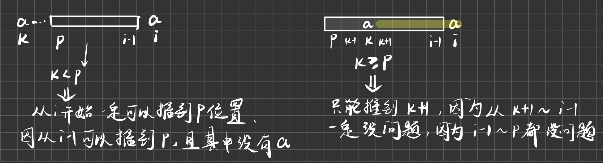

- 我自己在做的时候想到的是滑动窗口。--Code2718

### 直线穿过的最多点数

code7：

- 给定两个数组arrx和arry，长度都为N。代表二维平面上有N个点，第i个点的x坐标和y坐标分别为arrx[i]和arry[i]，返回求一条直线最多能穿过多少个点?

如何尝试：假设二维平面总共有(a,b,c,d,e,f,g)这几个点，我们尝试直线必须经过a的情况下求一个答案，必须经过b的时候求一个答案，。。。，最终答案一定在其中。遍历一遍数组，统计和a重合的点，和a的x坐标相同的点，和a有一个斜率的点---记在一个map，key就是斜率，value就是这个线经过了几个点。共y的情况就是斜率为0的情况，也记在map里面。最后从map中取出一个最大和共x的pk，取出一个max，max+重合的点的数量就是这条线经过的点的数量。这个流程太慢了，求必须经过某个点的经过二维平面上点最多的直线，是一个N的过程，总的就是N²的过程。

重合的点算不算取决于题目。

上面的过程能不能优化一下，你在求直线必须经过c点的时候，其实a和b就不需要考虑了，因为直线经过c又经过a的情况已经在直线经过a的时候就求了一个max了。即便如此，复杂度还是O(N²)

但是这道题还有一个很大的问题就是map中的那个斜率你怎么表示？你如果用double来表示斜率，有可能因为精度误差导致你明明不是一个斜率的直线，你认为是同一个直线了。所以我们就不要把x/y算成double值当成斜率，我们把x/y记成一个字符串或者一个Node来表示斜率。但是x和y我们要约分一下，约到不能再约，例如100/300，我们就除他们的最大公约数100（辗转相处法），然后把1/3记成一个字符串“1_3”，这样可以保证万无一失。可以用一个map(分子,map(分母，次数))来统计。要注意，辗转相除法计算的时候m和n都要是正整数。负数的话你就分为规定分母上带负号还是分母上带负号。


### Interview Coding 08

### 接收消息打印结构设计

code1：

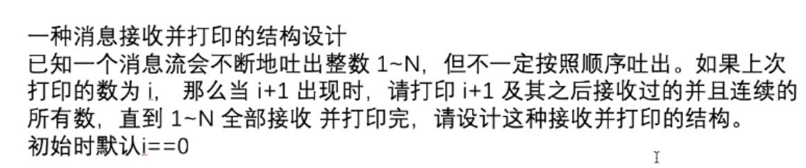

看电影的场景。这是一个结构，那么这个视频网站它会给你发电影的包。比如说从零号包开始，0/1/2/3/4/5..../n，它不一定是一个顺序来的。加入按照2、5 、4 的顺序来了，这时候你只在这个结构中留着它们，但是你不给用户播放，因为你零号包没到，然后1/3/9按照顺序来了，接着0号包来了，那你就给用户先播放零到五的内容。

看B站的时候，有的时候会卡一下。有可能你网络其实挺好的，但是为什么会卡一下呢？其实就是因为它这个在缓的过程中，迟迟等不到某个包，有可能你这个视频中其他内容已经加载好了，但是迟迟等不到那个按时序的那个包。那么这个时候你的这个APP，就会给这个远程的这个视频网站重新发一个请求，说你把这个我一直等不来的信息，你再发我一份儿，我整合完了之后，我就可以继续往下播了。

这个结构，信息体是一个单链表结构，有一个Node里面封装这序号和内容，以及还有一个指向Node的指针。然后有两张表，一张表叫头表，一张表叫尾表，都是map<Integer,Node(sequence,content)>。头表和尾表的元素的个数是相同的。添加过程如下，每次有信息到来都在head和tail分别建立一个结点，这个结点里面装的是信息的内容以及信息的序号k。然后看看k-1这个序号有没有在tail表里面，如果有的话就把tail表里面的key为k-1的记录删掉并把对应的Node取出，指向这个新节点，把head表里面把key为k的记录也删掉。这样还没完，继续查一下head表里面有没有key为k+1，如果有的话还要和后面的连。

因为你加入一个信息序号是k，其实就是把k~k的连续区间加进去了，你除了看tail表里面有没有k-1的key，还要看head表里面有没有k+1的key。

然后你等的那个信息序号（waitPoint）记在结构里面，等到那个序号的信息到来了，你就可以打印一串，然后更新你等的那个信息的序号。

Node里面你放不放编号其实无所谓，来信息的时候我知道这个编号方便我建立记录就行了。因为我打印信息的时候不需要打印编号，所以编号可以爱要不要。

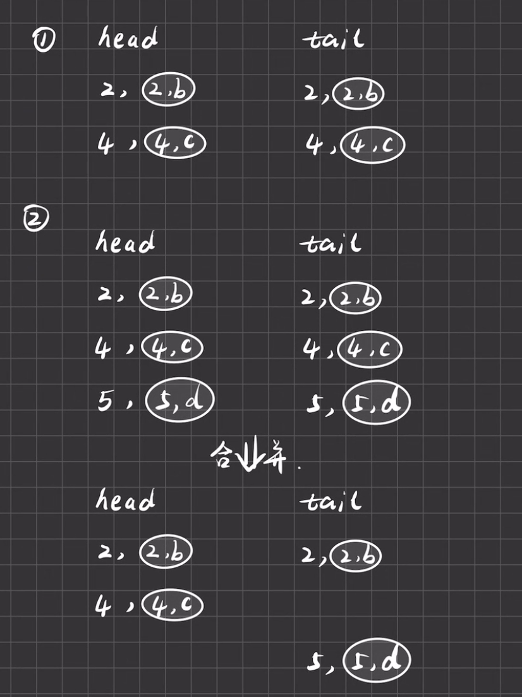

为什么需要用单链表把它串在一起？这个事情要解释一下。因为当我们等迟迟等着的那个信息到来的时候。我们可以一打印就打印一串。别看你只记录了头结点和尾结点，实际上中间的那些结点都被你串好了，可以一下子打印好多信息。结构中头只有头表跟尾表，那是为了让你的连续区间该合的合，该化简的化简，非常的快速。但是你迟迟等到的信息，如果到来的时候因为单链表的缘故，也能让你一打打印一串儿出来。

### 普通币、纪念币凑面值

code2：

- 现有n1+n2种面值的硬币，其中前n1种为普通币，可以取任意枚，后n2种为纪念币，每种最多只能取一枚，每种硬币有一个面值，问能用多少种方法拼出m的面值?

普通币里面。无重复值。因为它每一枚币本来就可以表示任意一枚，你有重复值是没有用的。另外就是纪念币呢，它这个是有可能有重复值的。重复值的具体情况在输入的时候提前约定。

这道题其实它就是两个动态规划。

第一个动态规划。给你一个无重复值的数组。这个无重复数组中每一个值代表一种面值，它可以使用任意一张的情况下，找出某一个钱数有多少种方法。dp1 [i] [j]代表使用arr[0....i]的情况下，凑出j元的有几种方法。j=0的情况下，二维表的值都是1，因为凑出零元，我一张货币也不用也是一种方法。i=0的情况下，只有是arr[i]整数倍的列才填1，其它都是0。

然后对于任意的一个dp1 [i] [j]位置，我来列举i号货币我使用0~k张的情况下，dp1 [i-1] [j-k * arr[i]] 的值全部加起来就是dp1 [i] [j]。之前说过，这种累加的是可以优化的。其实dp1 [i] [j] = dp1 [i] [j-arr[i]]+dp1 [i-1] [j]。看下图就很清晰了，i位置等于上面三个红色相加，蓝色等于上面两个红色相加，那么i其实就等于蓝色的加上自己头顶上那个红色的就行了。

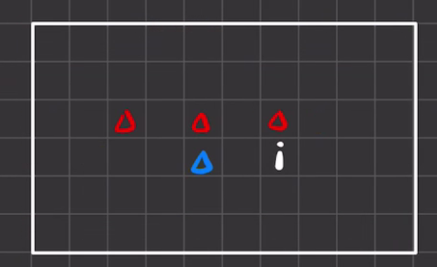

dp1求出来之后对我们有纪念币这题的作用就是最后一行。

第二个动态规划，就是处理纪念币的问题。这个问题就是普通背包问题。和第一种动态规划的区别就是第一种的动态规划每种货币可以使用很多次，你要去累加上一行的很多格子的答案。第二种动态规划就是每种币只能使用一次，你只要累加上一行两个格子的答案就行了。

两个动态规划都求好以后，假设要凑出m元。那么就列举第一种方法搞定k元（0<=k<=m），假设有n1种方法。第二种方法搞定m-k元，假设有n2种方法。n1*n2累加到总的方法数sum里面。累加m次之后，sum就是要的答案。

### 从1写到N，写了多少1

code3：

- 给定一个正数N，表示你在纸上写下1~N所有的数字。返回在书写的过程中，一共写下了多少个1

打表法没法做！

这道题很难，而且这道题。它就属于我们在尝试模型给的四种尝试模型中没有提到的那个额外的那一种。这是一个数位dp的模型。

设计一个递归f（N）。递归里面，它有一个非递归的部分和一个递归的部分累加得到。例如f(13625),我先在里面用一个非递归算法把3626~13625有多个1给求出来，然后调用递归f(3625)。f(3625)还是先在里面用一个非递归算法把626~3625有多个1给求出来，然后调用递归f(625)。这个递归有一个base case，就是当i小于10的时候，就只有1个1了。

现在的问题就是非递归部分怎么算了，分为最高位是1和不是1的情况，13625就是最高位为1的情况。3626~13625 中万位有1的就是10000~13625，总共3626个1。那么现在假设是xxxx~1xxxy，那么总共就是1xxxy/10 +1 ，或者假设1xxxy是k位，表示为1xxxy % 10^(k-1)   +1  也行。

最高位是1。公式如下。

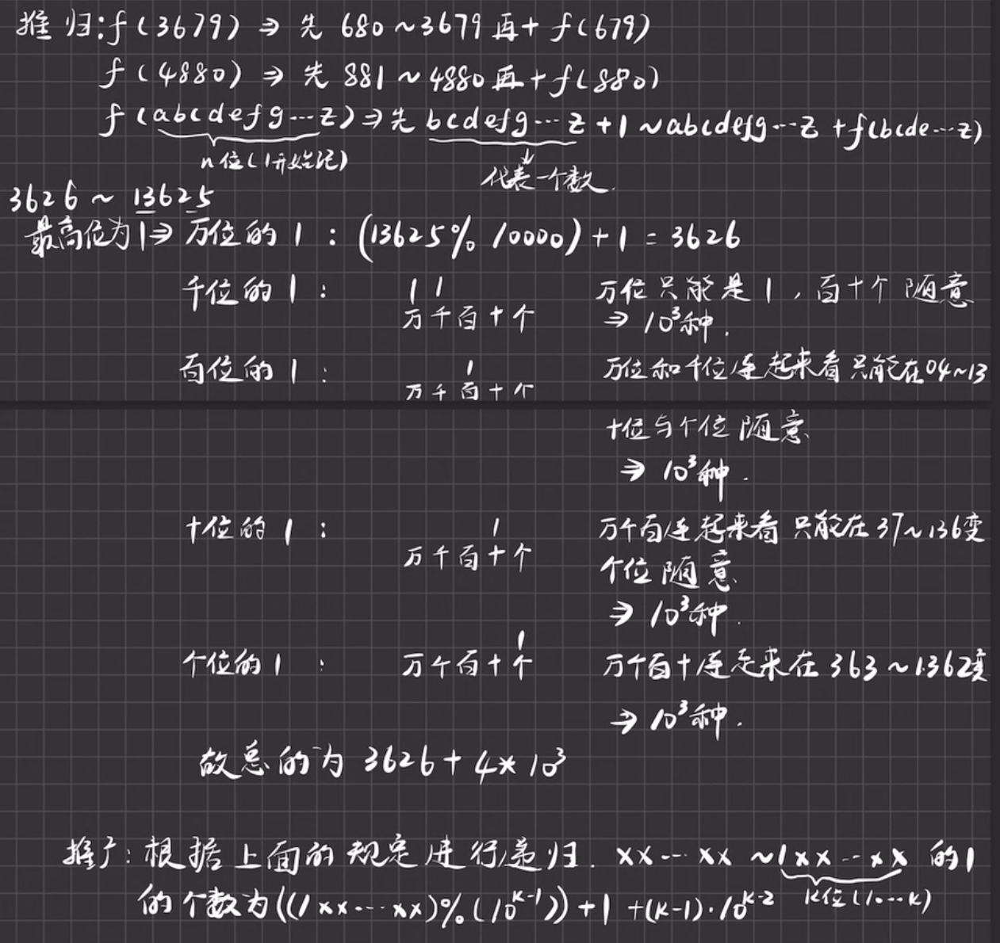

最高位不是1，公式如下。其实除了最高位为1上面公式和下面公式不一样，最高位不是1的时候其实公式可以统一的，因为下面其实就是乘了一个最高位的数firstNum，上面的情况其实就是乘了个1。

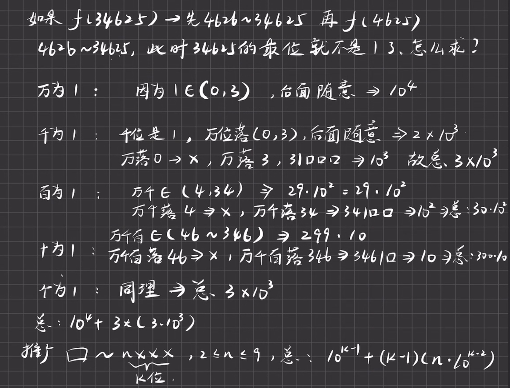

注意：固定为1的时候，有很多种情况，10^k次方种可能是左右两边一起共献，也可能是单边共献的。

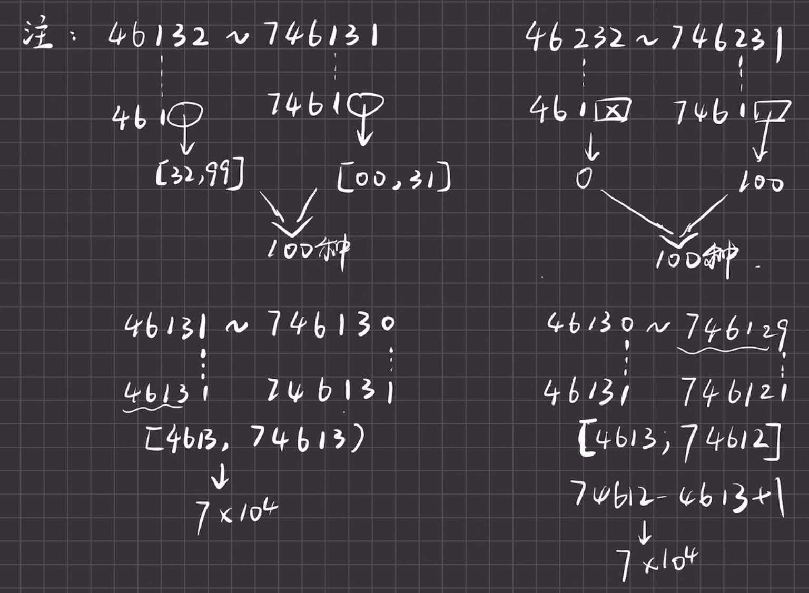

可以根据最高位数字进行分段。例如上面就可以分为46131~146130  146131~246130   246131~346130    346131~446130     446131~546130   546131~646130   646131~746130  可以分为七段。你可以个十百千万随便变		 10 ^ 5 这么多数。例如12345，那么我调整最高位是1让它落在第一段。调整最高位可以让个十百千万随意变都落在七段里面。因为你十百千万十万随意变我都可以满足七段，所以我现在固定其中的一位为1，其它随意变，还剩下4位可以随意变，所以就是7 * 10^4 。个十百千万这五位都可以这样搞，所以现在个十百千万上的1个数就有7 * 10^4 * 5了，还剩下十万位上的1的个数，那就是100000~199999，总共10^ 5 个。加起来就是总数。

我们先看一下这个时间复杂度是啥呀。大的调度是你每次拨掉一个数字，一共拨了log n次，然后你在非递归里面就是套公式，在算10^ n怎么算，10 ^ n 计算是一个log n的时间复杂度。所以总的时间复杂度就是 log n * log n 。

### 打怪兽问题

code4：


这道题它是根据输入数据的状况看菜下饭的题。动态规划有两种猜法。

第一种尝试方法：从递归开始f(d,p,ability,index)，尝试的方式就是从左往右尝试。如果你当前的能力值小于当前index的怪兽，那么你只能贿赂。如果你的能力值大于这个怪兽，那么你可以贿赂，也可以不贿赂，依次递归你这个怪兽贿赂和不贿赂需要花多少钱，从贿赂和不贿赂中选一个最省的。base case就是来到N了，也就是没有怪兽了，那么你一块钱也不用花。

- 你不好直接憋动态规划，你就先去写递归！

但是发现上面这个递归，如果要做成一个动态规划，ability的变化范围是所有怪兽能力值的累加和，如果怪兽的能力值都很大，那么你那张二维表也就很大，你可能填不完，甚至直接溢出了！

第二种尝试方法：dp [i] [j]定义为，我从0一直**通关**到i位置，必须**严格花够j元**，所到达的最大能力是多少。多一分少一分都不行。那么dp[i] [j]一个普遍的位置如何填写呢？如果dp[i-1] [j] >= d[i]，那么dp[i] [j]=dp[i-1] [j]，也就是如果上面的格子累计的能力值够我用，那么我就继承上面格子的能力。如果上面那个格子的能力值不够，那么我说明我得贿赂这个怪兽了，也就是在贿赂了的情况下是花了j元，那么就看看dp[i-1] [j-p[i]]是不是为-1，如果不是，那么说明我们我们可以通过贿赂的方式通过这个怪兽，且dp[i] [j] =dp[i-1] [j-p[i]]+d[i]，否则就不能，不能通过就为-1。在贿赂和不贿赂的方式中选择max。最终答案就是在dp中的最后一行找到第一个不是-1的那个行号就是你最少的钱数。

这种尝试方法的二维表就是N * 钱数累加和。这种方法适合钱数不是特大的时候。

这题当时腾讯给的数据规模是，N可能是0~500，能力值可能是10~10^6，钱数是1~200。此时毫无疑问选择第二种尝试。

- 此题第一种尝试和背包问题的区别就是背包问题在一个位置i，是通过此时背包的大小来判断取不取，背包最大的大小一开始就固定了，不会很大。而此题在一个位置i是通过你当前的能力值来判断取不取，能力值是怪兽能力值的累加，可能会爆炸！

### 最大可整合子数组

code5：

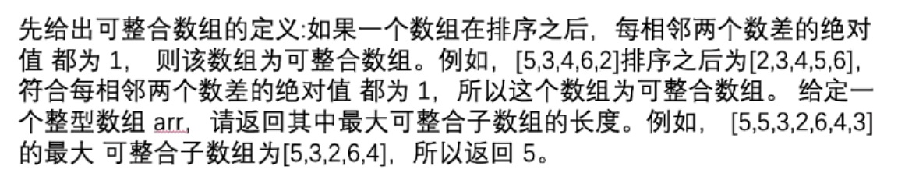

子数组总数N²，并且你不能再题目给的arr[l...r]去原地排序，因为你可能破坏原本arr的结构。所以你如果要排序，只能复制出一个子数组，然后排序一下，排序验证是一个n log n 的复杂度，验证是一个N的复杂度。所以总的就是N² * N * log N的复杂度，暴力方法复杂度完全不能接受。那么你能不能把这个可整合数组的定义等价变换一下？

这里我们改一下定义：

1. 数组无重复值
2. max - min = N -1

为什么要无重复值，直接max - min= N-1不行吗？不行！因为1,1,3与1,2,3 max -min=N-1。无重复值可以保证你的数组一定是排完序之后是单调的 最大值其实就是排完序的最后一个，也就是(N-1,max)，最小值是排完序的第一个，也就是(0,min)，你要这个数组相邻两个数都差1，那么不就是一个斜率为1的直线吗？有斜率的直线是单调的，那么一定要求无重复值。max-min/N-1-0 = 1，等价于max-min=N-1。

优化之后的流程还是尝试所有子数组，但是验证是否为可整合数组就是用的我们自己的标准了。

用窗口是不能做的，因为假设l~r你已经失败了，发现不是可整合数组，但是这时候你不能确定继续往下阔可能会重新是一个可整合数组。例如l~r上是[3,5,6,7,8,9],但是后面如果是[3,5,6,7,8,9,4]那么就是一个可整合数组了。max-min和个数之间是没有单调性的。

### 任意位置添加字符形成回文串

code6：

- 给定一个字符串，如果可以在字符串任意位置添加字符，最少添加几个能让字符串整体都是回文串。 

f(l,r)定义为，str[l...r]最少添加多少让整体都变成回文串。那么答案就是f(0,N-1)。如果这个暴力递归可以顺利写出来，改成动态规划就是一个二维表。这就是一个范围上的尝试。依然是只能l<=r，也就是说左下半区是没有用的。那么在填写dp [i] [j] 的时候，初始化我们先填第一个对角线，上面全都是0，因为自己就是一个回文串。填第二条对角线的时候，如果str对应的两个位置的字符相等就填0，如果不相等就填1。因为aa就不用添加，ab就添加一个变成aba。然后考虑dp [i] [j]怎么由dp[i+1] [j]或者dp[i] [j-1] 得到或者dp[i+1] [j-1]。假设从dp [i+1] [j]来的，你已经把str[i+1 ... j]变成了回文串，我们现在要str前面多了一个i位置字符，我只需要在最后一个位置添上和i位置一样的字符即可，也就是此时dp [i] [j] =dp [i+1] [j] +1 。同理dp [i] [j]= dp[i] [j-1] +1 。如果str[i]==str[j]，dp[i] [j] = dp[i+1] [j-1]。这三种情况选最少的，一个普遍位置由左边下边左下角的格子决定。

一个样本做列的对应模型，往往只讨论结尾如何。但是范围上的尝试模型讨论的是开头和结尾共同可能性如何。可能性怎么组织？就按照开头结尾分开组织。

我给大家加一个东西。就是有没有发现在某些面试题里面，它就让你求一个动态规划问题，最后的那个答案，那个长度就是一个简单的整数值。但在有些动态规划里面，它让你求一种结果是什么。我们现在目前为止面对的大量动态规划题目都是说我最后给你，让你求一个量，这个量是个整数值，让你返回的。我用这道题跟大家说一个事儿，就是如果他不仅仅要一个值，他要的是一种结果，一种决策的路径，你拥有动态规划表是可以把所有决策路径都搞对的。求动态规划表和最终要一个具体的结果是一码事儿，只不过需要一些加工的过程。就拿这道题来举例。这道题我们改了。我不仅让你添最少的字符，让它整体都变成回文串。你还告诉我它一种填完之后变成回文串的一个总结果。

例如看下面的例子，我要你告诉我生成的那一整个回文串是什么？如何通过dp表加工？如果只要一个路径，那么就根据答案的位置还原出当时是从哪个格子来的，然后最终得到答案。如果要得到所有的路径，那么就玩一个深度优先遍历。

如果你的动态规划做了空间压缩就没有办法反推了！

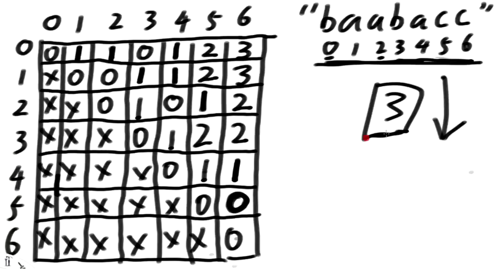


### Interview Coding 09

训练营4，第一节

### 二维数组最长递增链

code1：

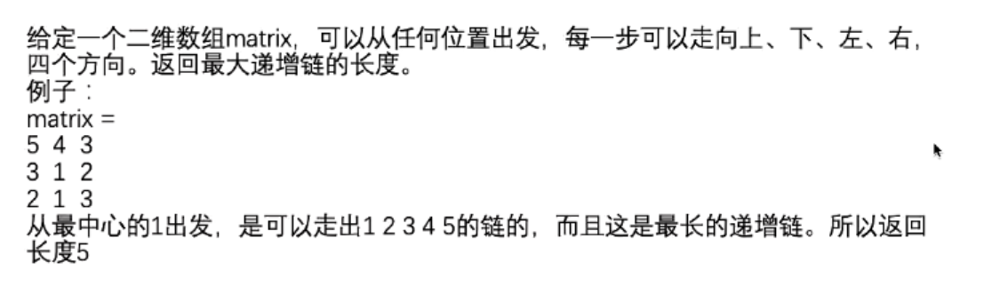

f(i,j)定义为从(i,j)位置出发，最长的递增链是多少，递归很好写，写完之后N²个位置全部调一遍f，可以求出一个答案，但是太暴力了！我们可以搞一个傻缓存（记忆化搜索）来加速，这也是自顶向低的动态规划。加了缓存之后，如果矩阵的规模是N * M，那么时间复杂度就是 N* M。这道题做到这个程度就可以了。

这题不好直接改动态规划，一个位置i，j可以依赖上下左右的值，你告诉我你怎么去写出状态转移出来，你怎么去给二维表dp做初始化。并且这种题目，记忆化搜索和严格位置依赖的动态规划都是依赖有限的几个位置，所以效率没有什么差别。但是如果递归里面由枚举行为，那么你最好去改成动态规划，观察看看转移方程的特征，看看是否枚举行为可以被临近的位置替代。


### 离k最近的子数组累加和

code2：

- 给定一个数组arr，再给定一个k值返回累加和小于等于k，但是离k最近的子数组累加和

流程：把子数组以某一个位置结尾都求一个答案，答案定在其中。你要求以i位置结尾的子数组中哪一个是小于等于k离k最近的，假设sum[i]=m,等价于在sum[0...i-1]中找一个 >= k-m 且离k-m最近的一个值。而找离某个值最近的这件事情可以用有序表来做。你就把所有的前缀核加到有序表里去，用这个有序表就行了。

以j作为结尾的子串一共有j+1个子串,str[0/1/2/3/j ... j]。**sum[i...j]=sum[j]-sum[i-1]**，和前面对照一下，发现后面这种加粗的等价转换有一种情况是不行的，i=0的时候不行，这种情况恰好子串就是str[0...j]。所以我们在遍历的时候，在sum[0~j]找>=某个值最接近的时候，需要把0先初始化上去，这代表的是str[0...j]一整个作为子串的情况。这样一来就不会漏掉了，可以完美的进行等价转换。

- 有序表中，在遍历开始前就要先加一个数0进去，指的是就是一个数也没有的时候就已经有一个前缀和是0了。所有的数组三连问题。用一个表来记录之前所有的结论，累加和问题的固有的一种做法就是你必须要加一个，一个数都没有的时候的累加和。
- 这题不需要告诉index下标是谁，我们只需要那个值即可，所以只用一个key就行了，不需要value，我在求i位置结尾的子数组的那个最大值的时候，可以用这个有序表记录之前所有的sum[0...i-1]，找出里面的我们需要的值就行，不用知道下标位置。
- 这题的累加和三连问题的第三题不一样，那题是小于等于某一个值的最长子数组，它关心的是长度，既然是长度，那么就需要知道下标位置。而我们这里面是关心的是小于等于累加和离它最近，不需要知道哪个小标的前缀和离的最近，我只需要知道这个前缀和的值即可。
- 关心下标就用数组三连问题第三连的解法，关心值就用有序表。

之前讲的求累加和小于等于k情况下最长。这个问题确实能够做到O（N）。可以再给大家介绍一个可能更好理解，但是不是O(N)的方法，就O(n×log n)的方法，这个在网上是大量流行的一个方法。回过头去看数组三连问题的第三连。

### 离k最近的子矩阵累加和

code3：

- 给定一个二维数组matrix，再给定一个k值。返回累加和小于等于k，但是离k最近的子矩阵累加和

思路：上面有一道题是求子矩阵的最大累加和的，也是先解决了子数组的最大累加和。对于矩阵来说也就是列举两个行，然后列举两个列。我们列举两个行的时候，例如列举r1~r2，那么在列举两个列的时候就可以利用子数组问题的解法来帮我们得到答案，我们可以把r1~r2的行全部都加到一个数组里面，在这个数组里面玩出来的子矩阵问题的答案就对应列举r1~r2时候子矩阵的答案。

假设矩阵是N * M的，那么复杂度就是N² * M * logM。

- 以后看到子矩阵问题，可以先去看看子数组问题怎么解。

### 二维数组走路拼单词

code4：


code4和code5很练递归，虽然在面试中出现的没有那么频繁了，但是还是很重要，这代表了递归的能力

- 这题所说的不能重复走指的是你在试图走出某个单词word的时候不能走走过的路，a单词走过的路是不影响b单词的。

设f(i,j)为从(i,j)位置出发，能走出的words中的所有的单词。最终答案就是对与二维数组中的每一个位置我都调用一遍f。

接下来就是f函数具体怎么设计。首先要有一个机制保证不走回头路，再来就是一个机制来知道某一个单词已经被我凑出来了。把words变成前缀树来保证知道某一个单词已经被凑出来了，用前缀树可以保证一个好的决策，在我们进行递归的时候可以进行剪枝，我们只走可能凑出words中单词的路，其它路我一律不走。不走回头路的机制就是在进入另一个递归进行深度优先遍历的时候，我们先把board中此时的位置标为0，递归结束的时候再改回来。另外还有一个地方可以优化，让递归不走冤枉路，具体做法就是前缀树Node中的pass值代表底下有多少个字符串经过了这个字符，假设我们当前位置调用了递归，然后加了8个字符串到结果里面，那么我就把pass值减去8，减到0了以后我以后再来到前缀树的这个结点我就不再往下走了，因为pass被我减为0，说明pass底下所有的字符串已经被我收集了！所以递归不是void返回类型，而是有一个int返回值代表我收集的字符串数量来做优化。

这递归难想是因为上面集齐了很多的优化，你能够想出多少剪枝的条件来优化你的递归。


### Interview Coding 10

训练营4，第二节

### 股票问题--系列

#### 买卖一股赚的最大钱数

code1：

- 给定一个数组arr，从左到右表示昨天从早到晚股票的价格。作为一个事后诸葛亮，你想知道如果**只做一次交易**，且每次交易只买卖一股，返回能挣到的最大钱数

买的时间点一定要比卖的时间点早。[3,5,2,9,10,6]，最好的就是2的时候买入，10的时候卖出。

枚举所有的可能的卖出点0~N-1，在一个卖出点i，用arr[i]-min{arr[0...i]}就是在i点卖出股票能得到的最大收益。把每一个卖出点求出来的最大值再抓出一个最大值就是总体的最大值。买入点可以和卖出点一样。

- 用一个变量就能抓住i左边的最小值，遍历到所有的点都减去这个最小值，差值就是答案的候选


#### 随意交易赚的最大钱数

code2：

- 给定一个数组arr，从左到右表示昨天从早到晚股票的价格。作为一个事后诸葛亮，你想知道如果**随便交易**，且每次交易只买卖一股，返回能挣到的最大钱数

你手里最大就是一股，要么就是零股。不能够同时有很多股。但是对你在一个节点的操作不做限制，你可以在一个结点上又卖又买，随便你玩，但是要求你手上只能有一股。

思想：把每一个递增的区间都榨干！跌的时候你不持有股票，每次你都在要涨的最低点买了，在最高点卖了。3,4,5,6你可以在3买6卖，你也可以在3卖4卖，4买5卖，5买六卖。这是等效的。

- 一个很好的尝试是从左到右的尝试模型，枚举在每一个位置的行为。由于每个位置的行为取决于每个位置你是否持有股票，所以我们补充一个参数代表当前是否持有股票。那么这个递归写出来可以解决冷冻期问题、至多交易k次的问题。


#### 买卖两股交易赚的最大钱数

可以用下面的k来解。但是也可以用几个变量直接玩出来。我们枚举所有的第二次交易的卖出时机，那么我们就需要一个info指标来代表0~i-1你去买卖一次并且买入一个股票的最优指标，第一次买卖的时间点要比你买入股票的时间点早。


#### 限定交易赚的最大钱数

code3：

- 给定一个数组arr，从左到右表示昨天从早到晚股票的价格。作为一个事后诸葛亮，你想知道如果交易次数不超过K次且每次交易只买卖一股，返回能挣到的最大钱数

比较难的是这题。这个题其实是个动态规划，但是在讲动态规划之前，我们来讲一种特殊情况，这是一个结论。假设你数组长度是100，你的交易次数限制在k次，而且这个次数指的是不超过k次，也就说这个k是你交易的上限。那我现在说这样一个结论，如果这个交易的上限大于了二分之n。它就等同于无限次交易。因为你在一个数组中，递增区间的个数一定是小于N/2的，因为一个递增区间最少两个元素。所以当k大于1/2的时候，可以用code2直接出答案，这是一个过滤器。

接下来这个k在小于二分之N的时候，我们就要好好讨论一下了。dp的行对应数组的index，列对应K。dp[i] [j] 的含义就是arr[0...i] 你去交易，但是交易次数不超过j次赚的最大钱数。dp初始化，第0列和第0行都是0。

dp[i] [j]一个普遍位置。第一种情况，最后一个点的股票价格，他压根不参与交易，那么dp[i] [j]=dp[i-1] [j]。第二种可能性就是i号股票参与交易。这里面有一个贪心，如果I号股票价格要参与交易的话。他只用去参与最后一次交易的卖出时机，除此之外，他参与什么交易都不会得到更好的解。贪心很显然，因为i是最后一个位置了，你在这个位置买，那么只能在这个位置卖，这样收益是零元，所以不需要参与买入时机。所以可能性二是按照最后一次交易的买入时机来枚举的。既然是枚举买入时机，那么买入时机当然有可能就是i的时候，所以dp[i] [j] = dp[i] [j-1] +arr[i] - arr[i]。第二种情况，dp[i] [j] = dp[i-1] [j-1] + arr[i] - arr[i-1]。第三种。。。其实这些情况都可以合起来，dp[i] [j] = max{dp[i-k] [j-1] +arr[i] - arr[i-k]}，0<=k<=i。 

- dp[i] [j] = max{dp[i-k] [j-1]  - arr[i-k]} + arr[i]，0<=k<=i。 

这是一个枚举行为，如果你不优化这个枚举行为，复杂度不会仅仅是二维表的规模，恐怕还要再乘上每一个格子时候的枚举代价。那我们就来调研一下这个枚举行为能不能省掉，很有意思，关键就是这个优化。看下图，蓝色部分去掉白色部分是两个位置共同求过的，如果我们可以在计算dp[10] [3]的时候把这个公共部分记录下来，当然这个公共部分要去掉arr[10]那么我们在求dp[11] [3]的时候就可以利用。也就是这个公共的部分是可以从上往下依次迭代的，所以我们for循环的嵌套的时候列号的for循环在最外层，行号for循环在里层，这样我们的公共部分的指标可以很好的传递。


#### 股票冷却

```
给定一个整数数组prices，其中第  prices[i] 表示第 i 天的股票价格 。​

设计一个算法计算出最大利润。在满足以下约束条件下，你可以尽可能地完成更多的交易（多次买卖一支股票）:

卖出股票后，你无法在第二天买入股票 (即冷冻期为 1 天)。
注意：你不能同时参与多笔交易（你必须在再次购买前出售掉之前的股票）。
```

这题的动态规划定义为0~i的最大值，而不是必须以i结尾的最大值，因为我们要求一个位置的最大值的时候需要枚举前面的最后值。

然后我们列举可能性，发现一个位置分为参与与不参与，不参与就是dp[i-1]。参与的话肯定参与的是卖出时机，所以需要arr[i]+info，这个info是一个最优指标，指的是你在前面做买卖，并且最后一次交易是买入股票的最大值。

所以我们同时维持了两个动态规划，一个动态规划是我们需要的答案，一个是dp需要的一个最优指标，这两个指标相互更新。


### S不同子序列和T字符串相同

code4：

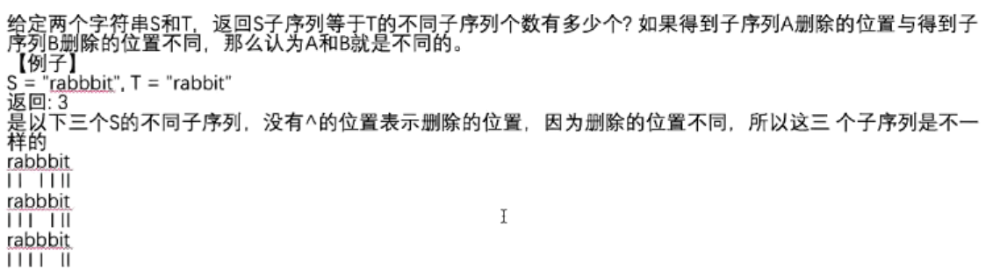

- 这题编辑距离似乎不是很直观，编辑距离问题是最小代价，这题是方法种数

一个样本做行一个样本做列。dp[i] [j]的含义是s[0...i]这个前缀，删成t[0...j]这个整体，有几种方法。答案就是最右下角的值。第一列只要遇到了t[0]就+1，连通dp [0] [0] 也填好了。第一行除了0,0这个位置，其它位置都是0。看一个普遍的位置dp[i] [j]怎么填，0~i上删掉几个字符变成t等价于0~i上选择几个字符保留变成t。可能性1就是i位置不参与t的组成，dp[i-1] [j]。可能性2，i位置参与t字符串的构成，能参与的前提是s[i]==t[j]，dp[i-1] [j-1]。


### 骑士最少的初始血量

code5：

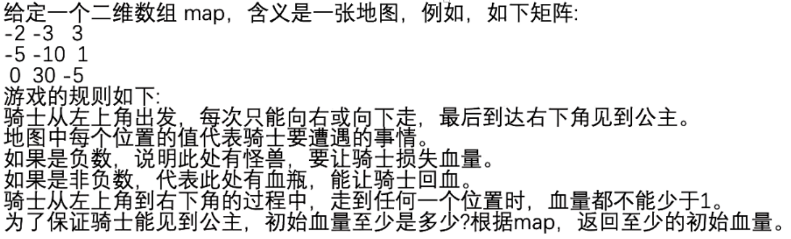

- 很显然，这是一个动态规划，只依赖上面的值和左边的值。

先从最朴实无华的暴力递归讲起。f(i,j)代表的就是从i，j出发到达最右下角需要多少血？首先是base case，就是到达最右下角的时候，如果最右下角的值是负数，那么你此时的血量至少要比这个负数的绝对值大，如果右下角的值是正数，那么你此时的血量只要大于1就行。

一个普遍的位置，也是讨论正负值。如果是负数，那么负数+此时的血量>=后面那个关卡需要的至少的血量。所以可以求出此时至少需要多少血量。如果是正数，要看看你这个正数+此时血量是不是大于后面通关的要求，如果是，那么血量只要是1就行了，如果不是，那么后面通关要求减去这个正数就是你至少需要的血量。

接着就是暴力递归改动态规划。

- 为什么递归含义不定义为从（0，0）出发到（i，j）需要多少血？因为如果是这样的含义，我们一个普遍的位置需要依赖上面的和左边的格子，这样我就丢失了左边和上边的剩余血量，丢失了这个信息导致我们无法判断一个普遍位置需要多少血。但是如果是定义为从（i，j）出发到右下角需要多少血，那么我们就可以根据后面需要的血量，推算出我们此时应该剩余多少血，这样一来剩余多少血这件事就不会丢失了。
- 猜，如果是求最少，那么就定义为（i，j）到右下角。如果求最大，那么就定义为0,0到i，j

### 矩阵最大路径和

code6：

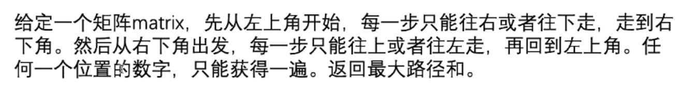

这道题不适用于贪心。

怎么尝试？有一个规则：就是同一个位置，如果你去的时候拿过了，回来的时候如果再经过它，你获得零。接着就是两个人同时从左上角出发，如果两个人同时到达了一个位置，那么只获得一次这个位置的值，然后返回两个人一起的路径和。这个就等价于一个人从左上角出发再回来且不能重复获得路上的值。

限制，由于A和B都是只能往下或者往右，所以如果A此时在的位置B此时没在，那么B以后再也来不到A这个位置。 但是递归不要带上四个可变参数了，只要三个就行，因为a和b走的步数一样，可以算。

base case就是两个人同时来到右下角，只获得一份值。然后一个普遍位置列出a和b走向的几种组合，总共4种。


### Interview Coding 11

训练营4，第三节

### 假想排序相邻数最大差值

code1：

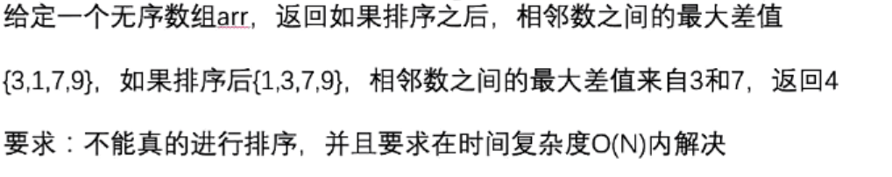

我们这个设计这个流程怎么做呢？这个流程的第一步。在这个数组中，把最小值跟最大值得到遍历一遍，得到最小值、最大值。假设最小值是0，最大值是99，那么，所有的数都是在0到99这个范围上的。假设你有9个数，我把从最小值到最大值这个这个范围我给它分成十等份。你有N个数就分为N+1等份。我们就称为N+1的桶，且一定有一个空桶，你遍历一遍数组，把对应的数放到相应的桶里面，根据我们设置的范围，最小值和最大值一定被放进第一个桶和最后一个桶。相邻的数只可能来自同一个桶，也可以跨桶，跨桶就是后面那个桶的最小和前面那个桶的最大是相邻数。由于一定有一个空桶，所以一定至少有一个对跨桶的相邻数，所以相同桶内的数我们都可以不用管了，肯定不是最大。所以说我们只要管跨桶的最大值即可。

进一步优化成最终流程，既然只考虑跨桶，跨桶只考虑桶的最大和最小，中间的都是桶内部的，不用考虑。所以我们桶里面只放最大值和最小值。遍历一遍数组，一直更新每个桶里面的最大值和最小值。更新完毕之后，把相邻的非空桶，前桶的最大值减去后桶的最小值，最终的答案就是这些值中的最大值。

 这是我们之前讲过哪一种题的思维方法，取舍可能性，数组三联问题的第三个。我一旦找到一种可能性，我分析出某一类的可能性，它完全不可能是答案，我该舍弃就舍弃了。但是它比数组三联难的地方在于，n个数准备n+1个桶，这一套模型是他自己奠定的。数组三连问题是我们研究假设答案之后分析出来的性质。而这一套做法它是在利用桶思想，架构出来一个模型，在这种模型下居然有可能性的舍弃，你构建这种舍弃可能性的模型很难。

### 多种小串拼大串的方法数

code2：

- 假设所有字符都是小写字母。长字符串是str，arr是去重的单词表，每个单词都不是空字符串且可以使用任意次。使用arr中的单词有多少种拼接str的方式，返回方法数

递归`f(char[] str , int i, HashSet<String> set)`，假设所有的贴纸（单词）都已经放到set里面了，这个递归的含义是str[i...N-1]如果可以被set里面的单词拼出来的话，返回方法数。base case就是i=str.len的时候，你已经没有需要分解的字符串了，所以有一种方法，这种方法就是一个word也不用。一个普遍的位置i，枚举由i开头的所有前缀串，看看在set里面有没有，如果有就进去递归，把所有的分支都加起来。这换成动态规划就是一个一维的动态规划，但是还不够优。

- 这题dp[i]含义明显是从i出发到N-1可以拼成的方法数，答案就是dp[0]。这样一来一个普遍位置i，就要列举i开头的所有前缀串。
- 如果dp[i]的含义是0~i可以拼成的方法数，那么就从i往前数串，就不是前缀串了，所以这题用上面的含义。

左的代码里面使用的substring获取一个string中间的子串，这是一个O(N)的方法，不太好。substring方法只有是获取前缀和后缀的时候是O(1)的复杂度。我们把substring优化成用一个变量累加即可，Hashset算作O(1)的复杂度，这样填写动态规划的时候就只有O（N²）的时间复杂度，如果用的是substring那么代价就是O(N³）。

```
在 Java 中，String 类型的 substring() 方法的时间复杂度为 O(n)，其中 n 是截取的子字符串的长度。

具体来说，如果调用 substring() 方法获取一个字符串的子字符串，假设原字符串的长度为 m，那么 substring() 方法会创建一个新的字符串对象，将原字符串中指定范围内的字符复制到新字符串中。这个复制的过程需要遍历原字符串中指定范围内的字符，因此时间复杂度为 O(n)。

需要注意的是，如果使用 substring() 方法获取字符串的前缀或后缀，也可以通过修改索引参数来实现常数时间复杂度的截取，例如：
String str = "hello world";
String prefix = str.substring(0, 5); // O(5) = O(1)
String suffix = str.substring(str.length() - 5); // O(5) = O(1)
在这些情况下，时间复杂度为 O(1)。但如果需要截取中间的子串，则需要进行复制操作，时间复杂度为 O(n)。
```

前面我们说填写dp一维表，首先一个for填写dp，另外一个for枚举前缀串，然后里面不用substring，用一个变量累加得到前缀串是O(N）复杂度，HashSet平均查找效率为O(1)，所以总的平均的效率是N²。

上面是用HashSet，平均复杂度是O(1)，但是最差的情况下是O(N)的复杂度，所以最差的情况下还是O(N³）的复杂度。所以还可以优化，一看到前缀串，想想看能不能用前缀树优化。把所有的word都加进去，这样我们在拿到一个前缀串以后，只需要通过移动一个位置就能知道这个位置合不合法，一定是O(1)的复杂度，而不是Set的平均的O(1)。


### 二叉树上累加和为k的最长路径

code3：

- 给定一棵二叉树的头节点head，和一个数K。

  路径的定义:可以从任何一个点开始，但是只能往下走，往下可以走到任何节点停止

  返回路径累加和为K的所有路径中，最长的路径最多有几个节点?

这题用树形dp递归套路肯定可以解。但是比较麻烦

我们用数组上的累计和为k的最长子数组长度问题的解来优雅解决这个问题---数组三连。

可以利用一个有序表存一个累加和最早出现的层数。

大流程是一个深度优先遍历，在遍历的过程中，把沿途一条链上的的累加和求出来--需要一个参数提供之前路径上的累加和presum以及当前的结点 x 。然后map中记录每一个前缀和最早出现的层数，遍历的时候需要一个参数是当前的层数level以及一个map。如果到当前层的累加和为sum，且sum-K这个累加和在map里面存在，那么就可以更新答案了，答案是一个全局的static变量，也可以用一个只有一个元素的数组来代替。整个递归的过程注意要恢复现场。

- 每条深度优先遍历的路线都维持自己的一个唯一的前缀和，利用类似累加和为k为最长子数组长度来计算这个最长路径。所有深度优先遍历的路线都求一个最长路径，答案必定在其中。

### 每个数出现k次的数组找出现1次的数

code4：

- 给定一个int类型数组arr，已知除了一种数只出现1次之外，剩下所有的数都出现了k次（k>1），如何使用O(1)的额外空间，找到这个数。

使用了k进制异或的思想。使用k进制来表示一个数，建立一个32个空间的数组digit，用这个数组来表示k进制中的每一位。然后遍历数组arr，每一个arr[i]都去算一下它怎么用k进制表示，对应位置上的数加到digit数组里面，全部遍历完之后，把digit上面的所有位置都模k，剩下的digit去算一下转成十进制就是我们要的答案。原理很简单，每个数都出现了k次，所以加到digit的同一些位置上，这些位置加了k次肯定是可以被k整除的。

之前有一道题是有一个数出现了1次，其它都出现了2次。求那个出现了一次的数。那题直接把所有数异或在一起就行了。直接异或，其实就是在计算机底层用了2进制异或，计算机的异或运算就是2进制异或。k进制异或就是k进制不进位相加

### 水王问题

code5：

- 给定一个数组arr，如果有某个数出现次数超过了数组长度的一半，打印这个数，如果没有不打印


一定要是超过了才打印，就正好一半都不打印。这题当然可以用Hash表来做，但是肯定不是最好的，这题的目标是有限几个变量可以搞定。

思路就是如果我能够实现一种机制，在数组中一次删掉两个不同的数，如果真的有一个数出现了一半以上的话，它最后一定会剩下来。是必要条件而不是充分条件，不是说剩下了这数就一定是出现一半以上，而是说出现一半的数-也就是我们需要的答案是在那剩下的数里面。所以说我们一次删掉两个不同的数，找出剩下的那个数之后还需要再遍历一边数组，看看是否真的出现了一半以上。

一次删掉两个不同数怎么实现？代码很精简！两个变量，一个是hp，一个是cand，遍历到i没有候选的时候我们就立其arr[i]这个数作为候选，并且hp设置为1。如果有候选，看看这个arr[i]这个数和候选一不一样，如果不一样，那么就把hp-1，如果hp减为0了，那么就视为此时是无候选状态。如果一样，那么就把hp++。有没有候选用hp来判断

你会发现在这个方法中有一件非常奇妙的事，你可能没有注意，就是我根本不需要知道数组中具体的值是多少，我只用关心它跟候选相等还是不相等这件事。

一道非常著名的题--摩尔投票。投票机制是为了选一个领导人，所有公民可以选择任何人作为领导，把领导的身份证号写到票上，不是说只能在一些提名的人上面选，而是可以选任何人，你也可以选自己。国家会统计说哪一个身份证号得票人数最多。但是必须至少有一个人的投票次数超过了国家人数的一半能才宣告这次选举领导人成功，否则就是失败。有一个重要限制，国家为了保证公平，只提供给一个机器，这个机器就只能放两张票，这个机器上放两张票的时候可以告诉我这两张票是不是一个身份证号。这个机器只是一个布尔类型的机器，就是你放上去两张票，它只告诉你一样还是不一样。唱票的人只能够干把票放在这个机器上，看看返回一样还是不一样，告诉一个结果，但是绝对不能够看这个票上面的身份证号是什么。也就是两张票放在机器里面，唱票的人并不知道里面两张票是谁的身份证号码。请问你怎么样确定最终谁当选或者这次票选活动是失败的。

利用刚刚我们的代码，选择cand不需要知道具体值的这种特点，我们可以实现上面的摩尔投票问题，首先选出一个cand，再拿到机器过一遍，看看是否出现一半以上，如果是，那么选举活动成功，否则就是失败。


- 给定一个数组arr和整数k，arr长度为N，如果有某些数出现次数超过了N/K.打印这些数，如果没有不打印

很容易知道，上面最多只有K-1个候选。那么还是类似的做法，我们这次搞出一个map，里面只能放k-1个候选。然后还是遍历去，如果候选没满，那么就把当前数立为候选，给一点血量。如果满了，看看自己是不是在候选里面，如果是就把自己血量+1，否则就把候选里面的所有-1，陪当前数死去。最后把剩下的候选遍历一遍，跳出真正的候选，只有大于N/K的才是达标的候选。时间复杂度是O(N * K），因为我需要频繁的删，删的代价是k。


### Interview Coding 12

训练营4，第4节

### 返回楼群的轮廓线

code1：

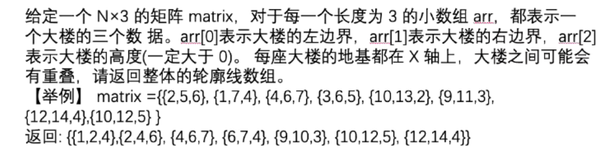

题目意思：[1,3,2]表示一个大楼从1坐标开始一直到3结束，2是大楼的高度。只关心轮廓线就是在外面的那些线。用颜色笔标记的就是轮廓线。

这道题的难度其实在于我们怎么把这件事情给在脑海中就脑补出来，整个建立模型去抓轮廓线的这个过程，建模过程可能是特别重要的一件事情。你说这道题它真的有什么算法吗？其实不多，它主要是模拟的一种流程，或者说模型建立。

我们先建立一种机制，这种机制来自于我最大高度的变化。只要最大高度有变化了，无论是在某一个位置的时候大楼消失了还是大楼立起来了都可能导致最大高度的变化。如果在某一个点一座大楼起来了，并且使得最大高度发生了变化，那么这时候前面一个被超越的大楼的轮廓线就生成了。如果在某一个某一座大楼消失了，这时候最大高度就会变成别的大楼，那么此时消失的大楼轮廓线也出来了。所以只要最大高度发生了变化，就会产生得到一个轮廓线。 

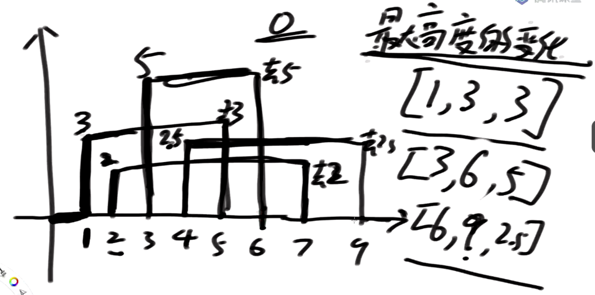

轮廓线的产生来自于最大高度的变化，那么你给我一张表，这张表放着每一个位置对应的最大高度。拿这样一张表去生成轮廓线，我们就可以忘掉原来的结构。我们只去关注所有大楼的崛起点跟结束点，剩下的点我们可以不看。

把[3,7,4]这样的数据变成两个对象，分别代表起始点和结束点。只需要去记录这一个大楼在哪个点位置加了高度，在哪个点位置要减掉一个高度就行了。但是可能一个高度它被加了多次，所以还需要记录高度被加的次数。

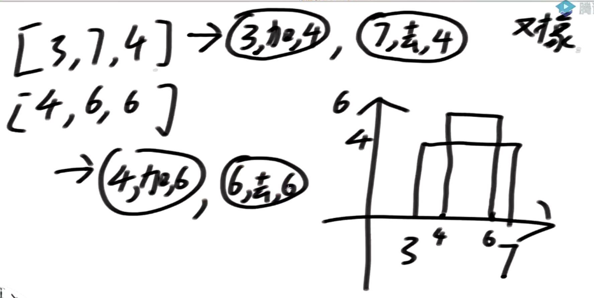

看下图，一个高度4可能被多次加入，1位置加一个高度4的时候，记录里面是（4,1）；2位置加一个高度4的时候，记录里面是（4,2）、3位置加一个高度4的时候，记录里面是（4,3）。那么在7/8/9位置减的时候也是一次减掉一个。当记录里面的高度4减到零的时候，这个高度才彻底不要了。所以这张表应该是一个有序表，这样我们就可以拿出当前key的最大高度，然后每一个key加入了几次我们也可以记录。接下来我们来到某一个点，直接从有序表里面拿，就知道当前的最大高度了。先把数据做一个离散化，按照小到大排序，依次处理我们生成的对象。但是注意，你从小到大排序完了之后，要注意一维数据，如果一维数据都一样，例如在一个7位置可能有多次加多次减，那么你要把7位置的加加减减一次性处理完了之后再去看7位置现在的最大高度是多少。

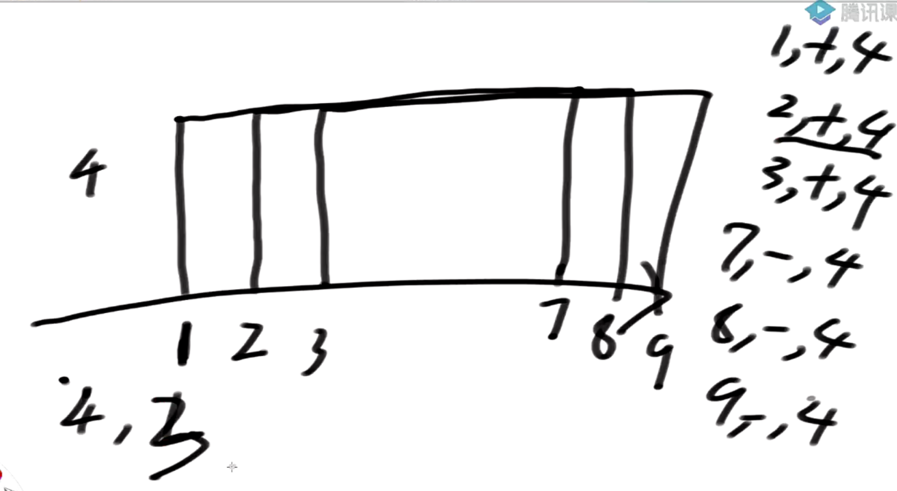

但是我们要警惕一种大楼。也就是纸片大楼[7,7,6]，这种大楼如果你把减高度6排在加高度6前面了，那么就出错了。如果没有这种纸片大楼那么你只需要关心一维数据，如果有这种大楼，那么就最好把二维数据加的排在减的前面。

我们把op操作对象放到一个一个有序表中map1。然后根据这个有序表去生成另外一张表map2，map2代表的就是轮廓线，因为我们可以把map1中的操作对象操作完了之后得到对应的最大高度。map2也是一个有序表，因为我们希望从小到大生成轮廓线。map1存在的意义就是帮我们生成map2，map2告诉我们每一个点的最大高度是多少。


### 两个有序数组中找topK

code2：

给定两个整数数组A和B。A是长度为m、元素从小到大排好序了。B是长度为n、元素从小到大排好序了。希望从A和B数组中，找出最大的k个数字

- 最后这题能做到复杂度O（log {min{N，M}}），和k没关系。
- 找出最大的k个数字和找到第k大的数字其实是一码事

最普遍的解法，就是两个指针分别指向两个数组，谁小谁动，最后可以动到k。复杂度是O(K)。

第二种方法就是在A中二分，用mid拿出来，看看在两个数组之中是第几小，如果这个数拿小了就去右边二分，拿大了就去左边二分。如果A中二分到底也没有找到，那么就去B中重复这个行为。因为在A中要二分，二分里面还要去B里面二分找mid在B中干过了几个数，也就是找>=mid最左的位置，所以总的复杂度是O(log n * log m）

那么最优解是什么？我们先忘掉这个事，开一个更基本的题。这个题是这样的，a和b的长度等长，等长的情况下还有序。问题是求两个等长数组整体的上中位数。注意这道题目，它长度为奇数与长度为偶数，它是有区别的。直接拿例子来说，比如说如果我先告诉你a和b的长度是偶数的。

A和B长度都是偶数。先取出A和B的上中位数。第一种情况如果相等，直接返回。如果不等，不妨讨论b>b'的情况。可以知道，如果一个数大于了N个数，那么它一定不是上中位数。如果一个数小于了N+1个数，那么它一定也不是上中位数。看下面例子，所以cd一定不是上中位数，因为c大于了a/b/a'/b'。a'和b'也一定不是上中位数，因为b'小于了b/c/d/c'/d'。所以我们一下子把讨论的范围缩小了一半。

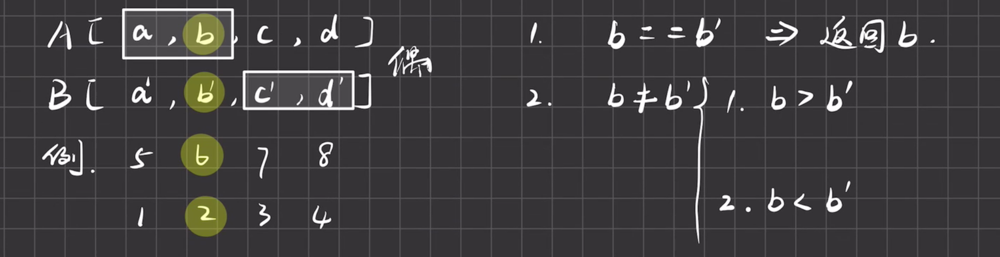

下面来一个很魔性的结论。我接下来就进递归。[a,b]和[c',d']继续去找上中位数，在[a,b]和[c',d']里面找到的上中位数mid，一定就是[a,b,c,d]和[a',b',c',d']中的上中位数。证明如下，下面证明了

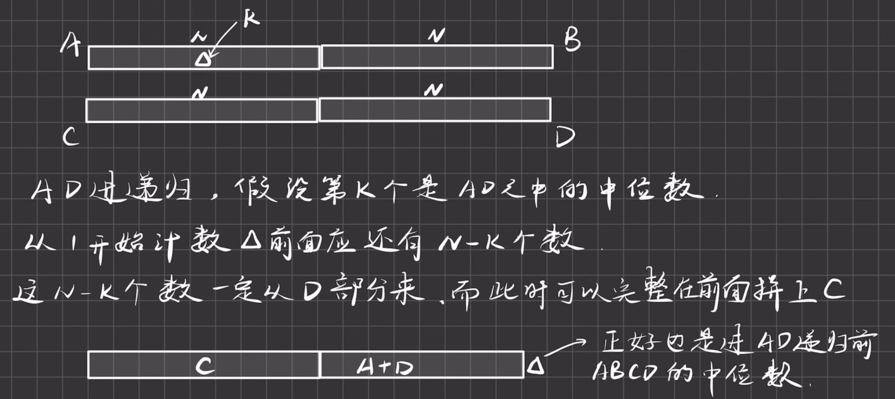

如果是奇数，那么情况就有所不同了。假设a和b两边刚好是n。N=2n+1。如果一个数大于了N个数，那么它一定不是上中位数。如果一个数小于了N+1个数，那么它一定也不是上中位数。a大于了n+n+1=N，所以a肯定不是中位数。b只小于了2n+1个数，不到N+1，所以b可能是。但是b左边的数就至少小于2n+2个数了已经小于N+1，所以b左边的肯定不是中位数。所以现在两个范围不一样大了。不能递归。

所以下面有两种解决方案：

1. 我们就把b和a左边的位置c手动比一下。当b>=c的时候，b是蓝色两部分的中位数。b加上前面的四个格子放到c的后面，这样b刚好被推到最右边，成为了整体的中位数。其它情况b就不是中位数，等价于下面的蓝色区域缩小一格，求剩余蓝色区域的中位数，就可以递归了。
2. 不去手动比一下，上面的蓝色部分补上黄色的a进去递归也可以。虽然我明确知道a不是中位数，但是我为了维持递归的含义，我放进去递归也可以的。

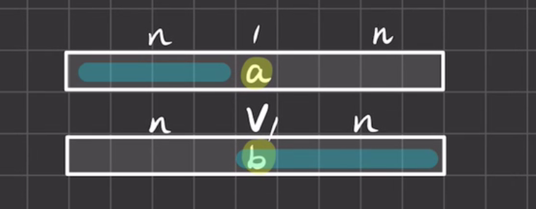

错一格也可以刚好维持上面的性质。再错就不行了。

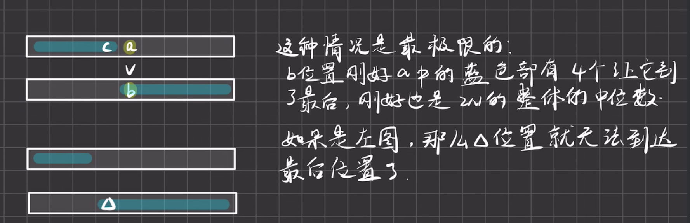

这个解法是对数级别可以拿下的。但是拿下这个问题只是万里长征的第一步。

主问题，两个数组的长度可能不一样。所以分情况，如果小数组是A，大数组是B。

如果1<=k<=N，那么就等价于A取前k个，M取前k个，去拿他们的第k小，也就是都取前k个，玩一个取中位数。

如果N<k<=M，不妨设k=15，可以先掐掉1'~4'，以及16'~17'。然后5‘手工比较，如果<=10，那么就返回5’。否则就6‘~15’与1~10求上中位数，也就是第十小，加上前面的1‘~5'这五个数，刚好是第15小。

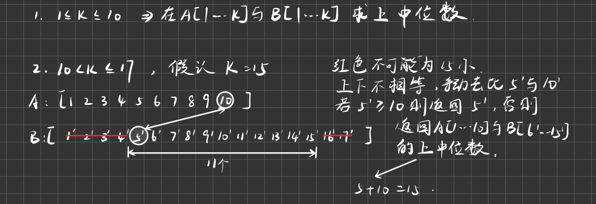

如果M<k<=N+M。如下，不能直接调用中位数，需要手动扣一次

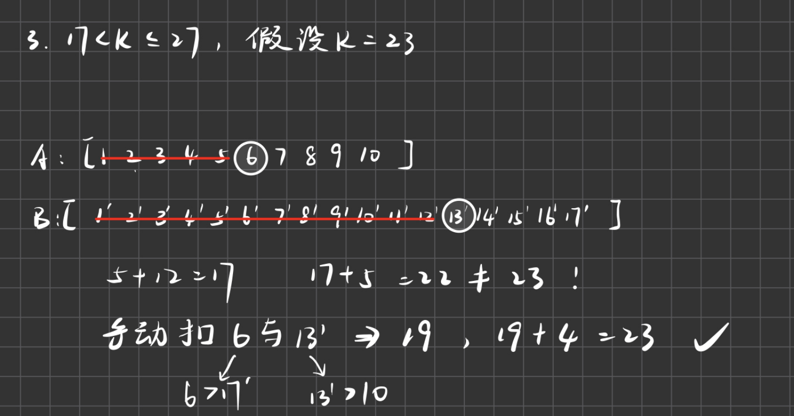

### Nim博弈问题

code3：

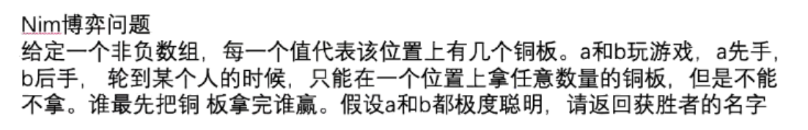

解释一下nim博弈。有一个数组[9,3,6,2,7]，里面的数值代表硬币。有两个人，一个先手一个后手，先手先拿硬币，每一次都可以拿任意位置的任意个硬币，也就是我可以到9位置上去拿硬币，可以拿1~9个，但是你不能拿零个。谁先拿光硬币谁赢，或者谁最先让对让对方面对无硬币可拿谁赢。假设先手跟后手都绝顶聪明，博弈论的一个基础，请你告诉我，给你输入一个数组返回是先手赢还是后手赢？

这个题的流程是你把数中所有的数异或起来，得到的异或和最终是是零的话先手输，异或和不是零的话，先手赢。

你最后输家面对都是零的数组，那这所有的零异或起来就是0。先手就给自己定下一个目标。如果我每一次先手，在面对数组的时候异或和我能做到都不是零，但是我每一步弄完都能让我的对手后手面对这个数组的时候，它面对的异或和永远都是零。如果先手能够做到这样一个更严格的目标，其实先手一定会赢。因为能完成这样的目标，先手一定遇不到都是0的数组。

例如，此时先手就让111变成110即可，也就是拿走一个硬币。然后就变成异或和是0的情况了，后手无论怎么拿，肯定会让数组再变成异或和不是零的情况。

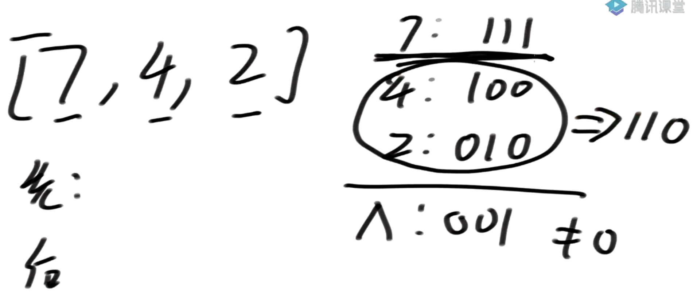

### 约瑟夫环问题

code4：

- 约瑟夫环

是一个单链表问题，头尾相连成环。从第一个结点开始数数，报数，假设是7，那么从1开始报数的话，7这个结点就死了，然后从7的下一个结点，也就是8继续从1开始报数，继续数到7的结点就死了。依次类推，问最后谁能活下来。

模拟的方法代价太大了，是一个O(N * K）的复杂度。这个问题就是没有O(N)就能确定的方法。

数到最后只剩一个节点，他在自己的链表中编号，这个节点就是一号节点。假设我有一个公式，这公式可以让我算出杀之前的编号。你在变成一个结点之前，肯定经历过2个结点的时候，这个f（n）函数可以算出你之前的n+1轮的时候的编号。也就是f(1)就算出有两个结点的时候你的编号是多少。然后继续调f(f(1))就知道有三个结点的时候编号是多少。这样我们就可以一直往外调，调用到n结点的时候就知道编号是多少，直接把那个结点保留，其它的都干掉。

先不说这个公式是什么，因为它比较难求，我们先搞一些基础的一些内容，先认识一个很简单的函数，假设i是一个常数，y=x%i就是一个一堆平行的线，有一个周期性。

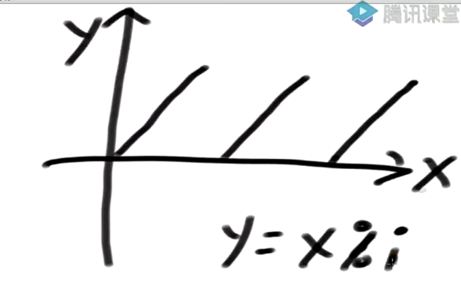

我们把这个函数给放在旁边，我们先不去推新老编号之间的关系，我们先搞一个更基本的，就是我在一个环形链表中编号和所报的数字是一个什么关系？假设有四个结点，1~4号，1号报的数就是4k+1，2号就是4k+2，等等。图像如下，发现上面那个图像往右上角移动就可以得到下面的图像，然后利用初中数学得到下面图像y=(x-1)%i+1。不要依赖自己找规律的能力，发现是剃刀感觉的函数，直接画图，和最原始的那个y=x%i函数做比对。

号是编号，数是报的数，i是人数。报数一直在增加1234 5678  --  对应 1234 1234 的人 。 图像画出来


现在我们开始来搞，我们真正想做的了。找杀之前的编号和杀之后的编号是什么规律。

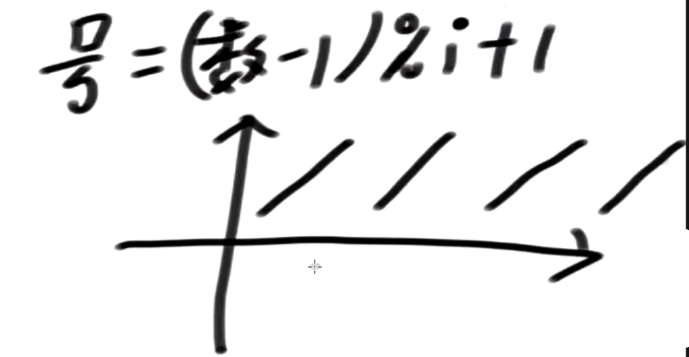

杀之前假假设有1234567这些编号。那我杀谁是个问题，我们假设杀掉3。但你把3干死之后。四号就变成一号，五号变就会变成二号，六号就会变成三号，七号就会变成四号，而原来的一号会变成五号，二号会变成六号。三的编号就没了，因为它被干掉了。我们用杀之后去推杀之前，或者说是用新的去推旧的。新旧之间，它的长度会发生变化，如果旧编号的长度是i的话，那么新编号中它的长度就是i- 1。

所以我们根据这个来画图像，新的作为x，旧的作为y，（1,4），（2,5），（3,6），（4,7），（5,1），（6,2），发现延长之后会和y=1这条线相交在一个可以算出来的点。抽象化，假设s号死了，那么就会相交在(-s+1,1)这个位置。左下角这图图像其实就是左上角那个图像往左移动s位。

所以旧=(新+s-1)%i + 1。但是现在还有一个问题，s是啥？s就是报号为k对应的那个人s=(k-1)%i+1。

所以旧=(新+(k-1)%i+1-1)%i + 1。这个公式还能优化。**旧=(新+k-1)%i + 1**。f(i,k)=(f(i-1,k)+k-1)%i+1，新的--人少了

- 报到k死一个人、i是还没死人的时候有多少人。


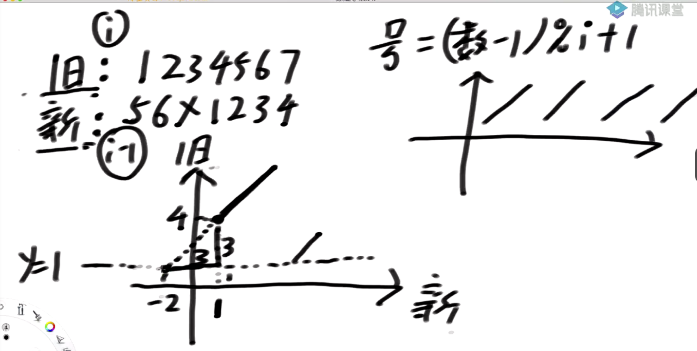

这题找到的是递推式，强行画图，发现和  旧 = (号-1) % i +1的图像很像，因为最高点都到达了i，只不过这里新号的取值范围为[1,i-1]了，这里的"号"替换为"新"。其实就是原本的图像左移了s。


### 乘船过河

code5：

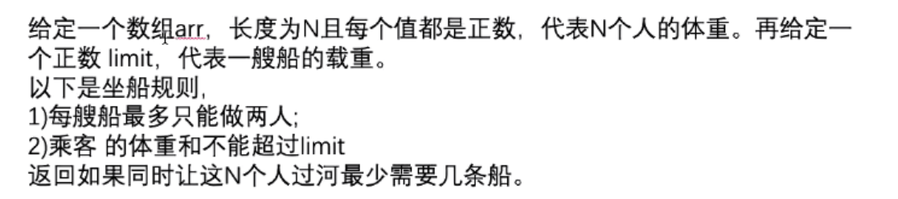


乘客有7的体重，而船只有5，那么怎么都过不去，你需要max条船也过不去，无解，返回-1；

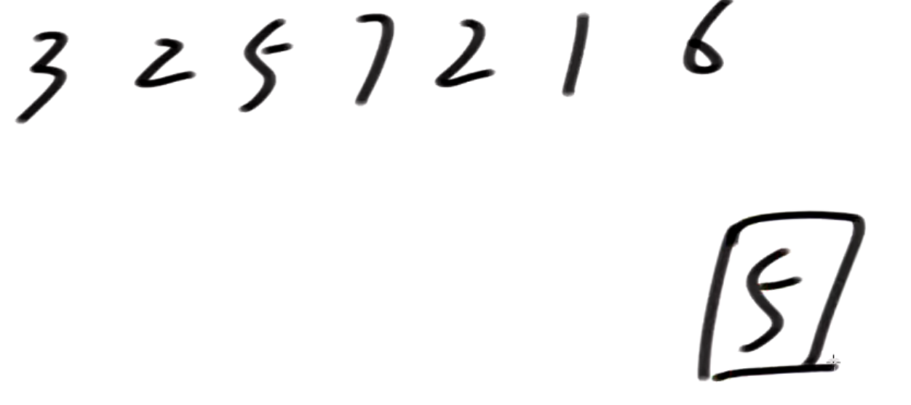

下面的情况至少需要4条船

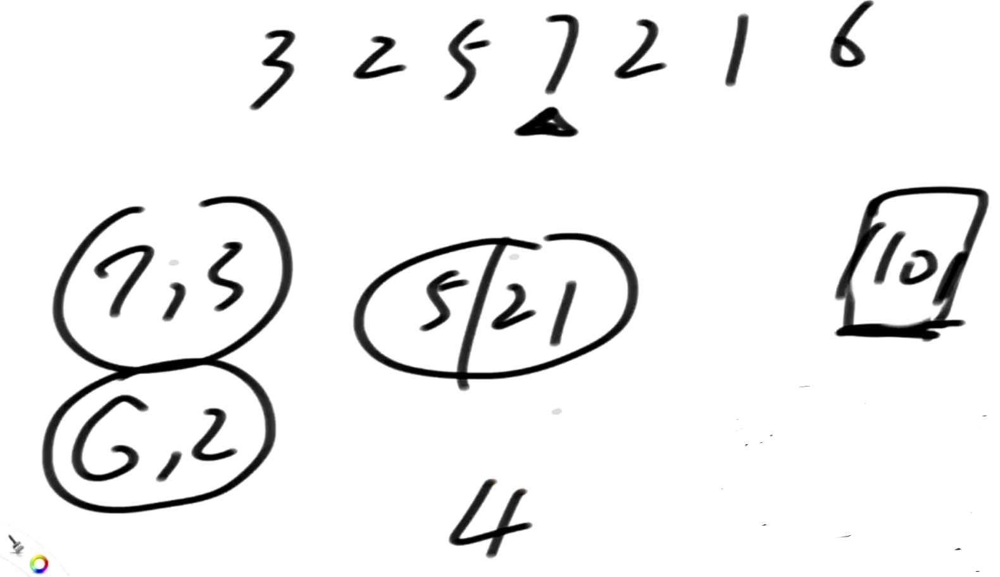

这个题其实是个贪心。先搞一个大过滤器，确定没有大胖子导致怎么都过不去。然后把这个数组排个序。我们关注limit/2的位置，在这个数组中找到小于等于limit/2最右的位置，你这里面可以二分也可以不二分，因为排序已经卡着了。

我们接下来的目标就是让l的的数搭配r位置的一个数凑一团，l和r位置的只有两种情况，一种是l+r位置的数大于limit，另一种就是小于等于limit。第一种不达标，第二种达标。

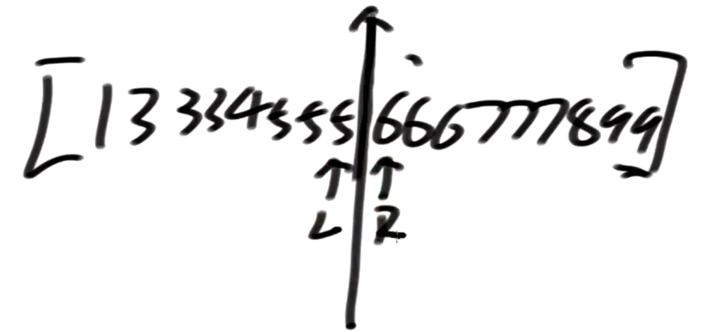

如果不达标就让l往左移动，前三个5显然不达标，直到l走到4的时候达标了。然后r再往右走，一直走到l搞不定的位置，也就是此时的7位置。然后让l往左边找三个去搞定r那边空出来的三个，这一定是最经济的。原因很显然，你肯定希望左边更小的数得到更好的利用。这就是我们主要的思路，但是有一些边界条件要处理一下。我们分别举两个例子来解释有哪些边界条件。

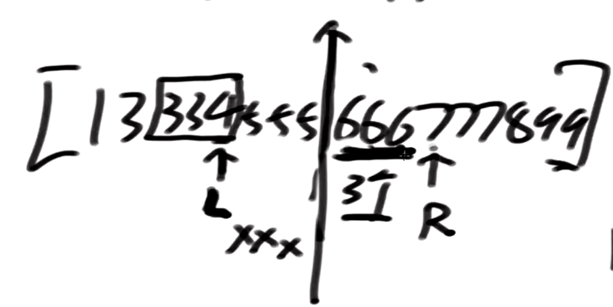

可以看到左边的先耗尽了，没办法来搞定右侧这么多的胖子。

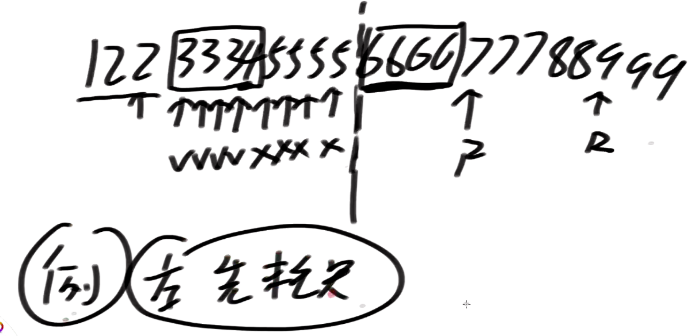

此时就可以知道需要几条船了。看看左侧有多少的对号，然后加上那些没有凑对的胖子自己一条船，然后左侧中所有画叉的都可以两个人一条船。这三块算一下，加在一起。

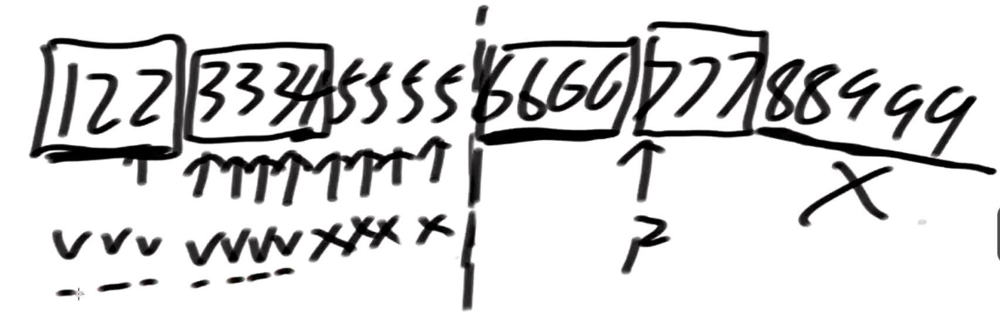

右侧先耗尽，就是对号加上画叉的两两一条船，没有单独的胖子。

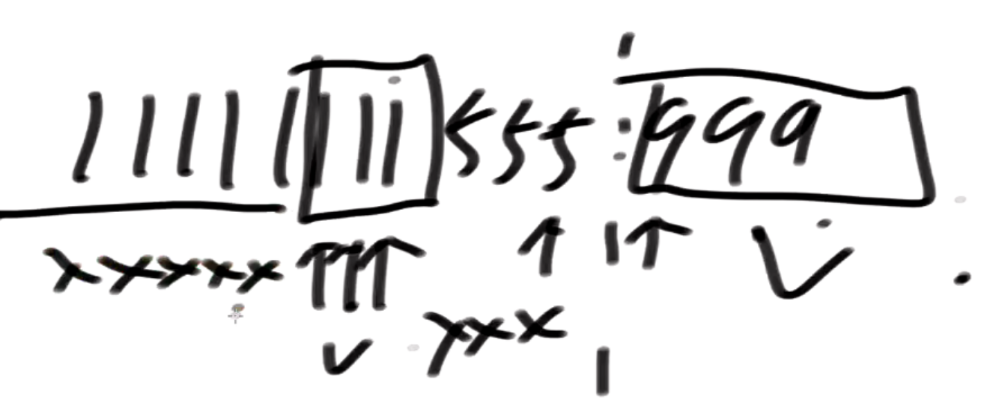

小技巧：N/2向上取整，可以写成(N+1)/2

- 这题我想出了一种更牛逼的贪心，排序完之后搞左右指针。

### 咖啡机问题

code6：

我们在基础课的时候。讲了一个咖啡问题，咖啡问题几乎是我们目前为止对于业务限制模型唯一的认识。下面有一个小题，它不是业务限制模型。我给你个数组，我告诉你这个数组里面代表每一个是泡咖啡的机器的工作时间。N台咖啡机可以一起工作，但是每一台咖啡机只能是串行的产生咖啡，一杯咖啡生成完才能生成下一杯。假设我有m个人，比如说我有100个人，这100个人都在零号时间点的时候开始排队，也就是零号时间点的时候，这100个人涌向这n台机器。实际上，从0号人到99号人是无差别的。请你返回一个数组res,res[i]代表i号人得到咖啡的最好时间是多少。如果这个你理解不了，那么返回res，res[i]代表i号咖啡机应该帮你搞定几个人。这两个res实际上是等价的，就是这么多人，我想保证所有人得到咖啡的总时间最短、最后一个人他得到咖啡的时间尽量早。

这道题没有挥发的设定，只是做咖啡的问题，和洗咖啡还没有关系，你先给我解决这个问题，然后才有机会去解决加上挥发的那个更复杂的问题。这道题用一个小根堆就行，Node代表里面有一个值代表咖啡机多少时间能产生一杯咖啡，以及还有一个时间点。小根堆按照时间点和咖啡机生成时间的和来比较。很接近自然智慧，因为人肯定是选择能尽快产出咖啡的机器去排队。


### Interview Coding 13

训练营4，第5节

### 最长回文子序列

code1：

- 给定一个字符串，求最大回文子序列的长度

做最长回文子序列这个问题有两种解法。

第一种方法。你如果知道两个字符串，一个字符串叫string 1，一个字符串叫string 2。它俩求最长公共子序列那个那个算法原型。那么一个字符串求最长回文子序列就是这个字符串和自己的逆序串，这两个串的最长公共子序列就是原串的最长回文子序列。它属于什么模型？一个样本做行，一个样本做列的对应模型。

第二种方法。去看看[l,r]范围上的最长回文子序列是多长，看看这个能不能做。左下半区没有用。第一条对角线都是1，第二条对角线，如果相等就是2，不相等就是1。问题就是看看一个普遍位置i，j怎么填。分为四种情况，分别列举i参不参与构成与j参不参与构成。第一种情况就是i和j都参与最长回文子序列的构成，那么只有可能i和j相等的情况下等于		dp[i+1] [j-1]+2。第二种情况就是只有i参与构成，那么有i和无i是一样的，那么dp[i] [j]=dp[i+1] [j]。第三种就是只有j参与构成，那么有j和无j是一样的，那么dp[i] [j]=dp[i] [j-1]。第四种情况i和j都不参与构成，dp[i] [j]=dp[i+1] [j-1]。

没有哪一种模型是单独解决哪一类问题的，有可能一个问题可以被多种问题解多种模型来解，关键就是你得掌握模型的试法。用模型的这种试法来启发你想到


### 贪吃蛇问题

code2：

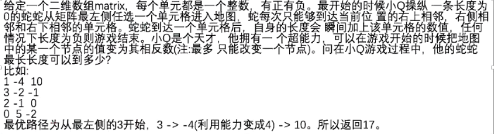

- 蛇从最左一列任意一个位置出发都行。右上邻角的意思是可以往右上、右下、正右侧走，也就是必须往右边一格，但是上下可以-1,0,1的偏移量。并且蛇不会回头，每一步都往右边靠，走到最后一列就结束。中途可以为0的长度，但是不能为负

边界条件很多，如果上来所有格子都是负数，那么它可以发动一次能力。即便如此接下来也可能走哪死哪，那么最长的长度就是登上最左侧的时候。就是说它这个它这个蛇它是很有可能它走不到最右侧的。

这道题其实是一个非常标准的业务限制模型。业务它要怎么走？它会怎么选？题目告诉你清清楚楚。所以你业务上想怎么试？它可能不属于我们说的那几种模型，但是它属于一个业务限制模型。所以你们的暴力尝试无非就是业务逻辑把它抽象成递归表达。为什么我不直接去憋动态规划？因为可能动态规划憋出来之后，万一你这个状态转移方程写不对，你这个代价不是挺高的嘛？

假设我要登上某个位置，这个蛇我想登到这个格子上去。这个格子如果是正数的话，我固然可以登上去。但它如果是负数的话我就得看一下我要不要用能力了。粗略的分析，你就知道，我登上一个格子，恐怕应该收集两个答案，第一个答案就是我彻底不用能力的情况下，我登上它最大的长度是能是多少？第二个就是我登上去，我在其中用过一次能力的情况下，我登上去能够让我的长度能够到达多少？你有可能一开始想不到这两种可能性，但你试着试着，你会发现你试不下去，因为你确实依赖你前面的过程告诉你。哎，你在之前的过程中，到底你使没使用过能力呀？我得知道这件事儿，我才能决定我此时登上去到底不能用能力还是能用能力。


### 计算表达式


code3：

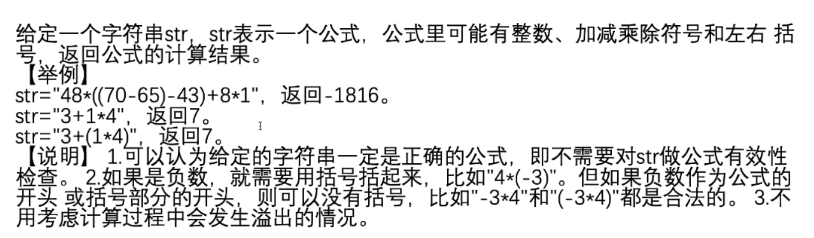

这种类型的题就是类似于文法解析，还有小黄号给你打乱优先级这种题经常见。这样的题递归结构都一样。只要我给你讲一个，你就知道以后其他的优先级的题怎么搞了。类似于编译原理什么文法分析这种什么大括号小括号优先级什么顺序改变这种题全可以这么干。给你讲一个非常经典的递归模型，你要是用栈去做，这道题150行以外了，很难写。用递归函数的便利性帮你做。思路很清晰。如果参数的有效性没给你保证，那你还是去跑，能跑出来说明就是有效的，不然就是无效的，直接try-catch。

有几个说明。第一，可以认为字符串一定是正确的，我不需要对string的公式进行有效性检查。第二点，如果是个负数我需要用括号括起来，因为负数那个负号和减号容易混淆，括起来的的前提是负数会产生歧义，如果不产生歧义，那么就可以不用括起来。三点限制，其实就是帮助你不要去抠太多的边界条件，你把整个过程梳理清楚，这就算你过。

f（i）的含义是你告诉我从i位置一直算到一个合适的位置，答案是多少。另外还要告诉我你是算到哪里停的。

那什么叫合适的位置呢？我规定从i开始往后遍历，我如果遇到整个字符串的结尾，或者我遇到右括号就停。这种递归结构，它几乎可以搞定，类似于所有编译原理，文法解析的问题。关键就在于我设计了一个在哪停的这个信息的返回。这样主函数就调用f（0）

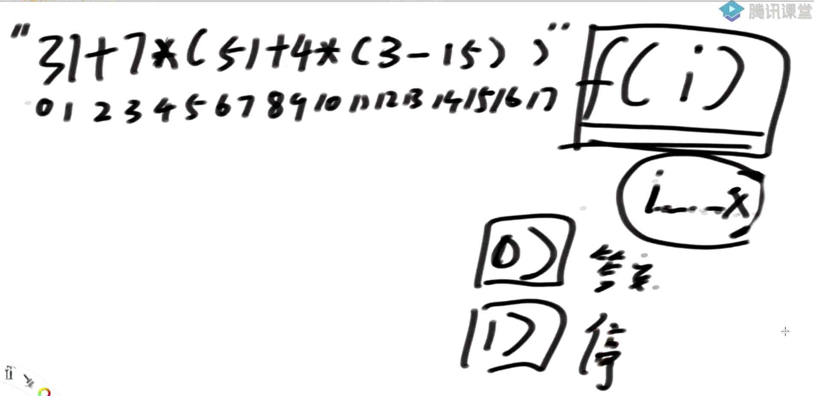

这是解决括号优先级的一个递归设计。那如果一个字符串中它没有括号。这个公式应该怎么算？一个栈其实很好做。两种情况，你遇到数字的时候就意味着就是我现在在收集数字的阶段。你遇到加减乘除，就意味着我之前收集数字的阶段结束了。

看下图，我遇到3，cur是"3"，遇到1，cur变成“31”。然后遇到了+号，这时候就把数字和加号都放进去，把cur清空。

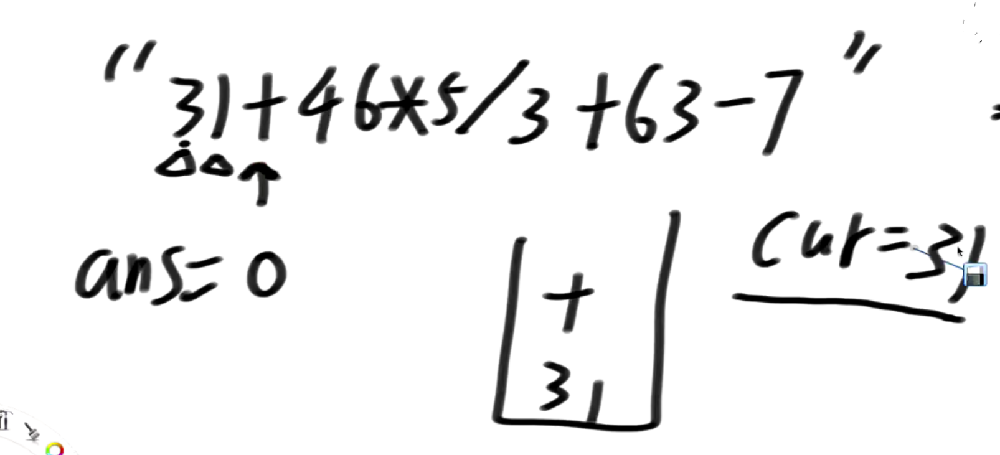

然后继续，cur收集成"46"了，然后遇到乘号了，看到此时栈顶是加号，我不管，直接把46和乘号都放进去。然后继续，cur收集到"5"，然后遇到除号了，这时候看一下栈顶，发现栈顶是乘号，如果栈顶是乘号或者除号，那么就把当前收集到的数字和乘号下面压着的46数字先计算一下再扔回去，最后再把除号也放进去。

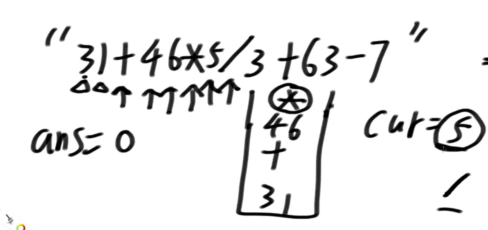


所以我们把46 * 5计算了一下，把结果重新放回去，然后把除号放进去。这样的含义进行下去，实际上就是把这个式子中乘除连着的先算了，最后只保留加减号。所以当我没有括号的时候。我们我们知道一个公式怎么算。按照上面流程即可，一个栈搞定。

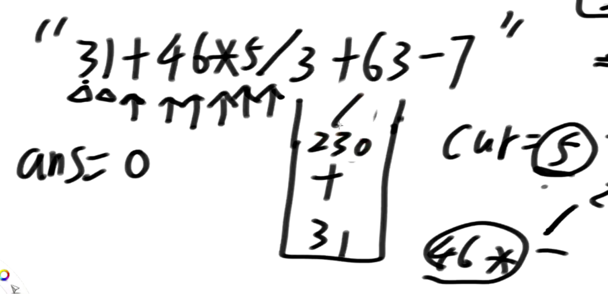

现在所有的东西都已经具备了，我们先来展示一个它混着它混着小括号的东西怎么弄。f（0）在自己的小空间里面玩我们上面的没有括号的过程，如果没有遇到括号就一直玩，知道在5位置遇到了一个小括号，我才不想自己算左括号里面的答案是多少，我让递归f（6）去算，所以在f（0）里面，我的cur现在是一个等着递归函数告诉我的状态。

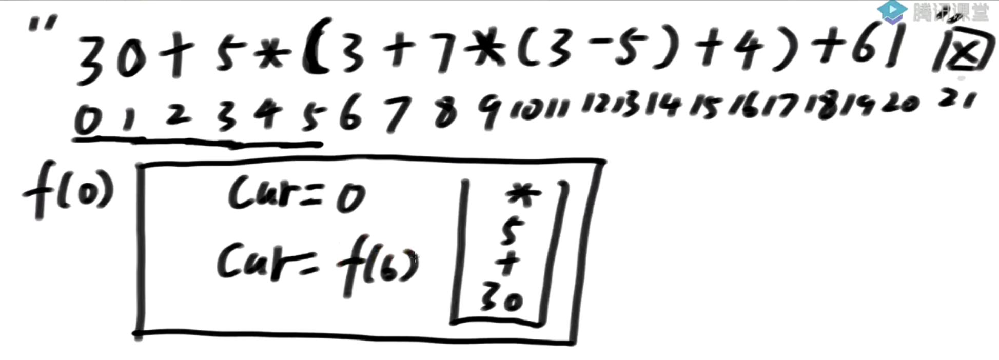

如果一直遇不到右括号或者结尾，而是一直遇到左括号，那么我就一直调递归。直到有一个递归遇到了右括号了，这里     f（11）在14位置遇到了右括号，这个时候就可以给前面返回了，f（11）把3-5算出来=-2，然后把-2以及自己算到了14位置返回给了这两个信息返回给了f（6）。所以f（6）就知道了我当时不关心的(3-5)的值是-2，所以cur为-2了，然后自己从15位置开始算。所以进一次递归就是消了一对括号。

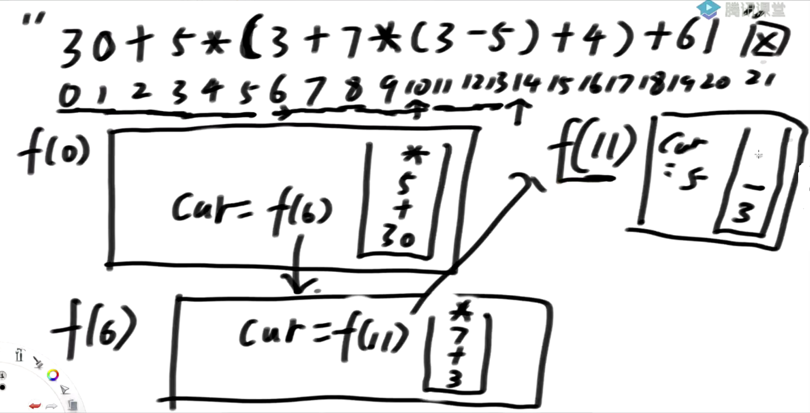

f（0）永远遇不到右括号，因为括号都被自己的子过程消完了。


### 删成回文串方案数

code4：

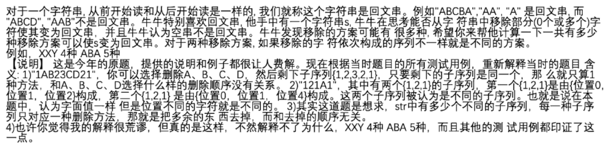

首先我们还是明确一点，就是删怎么删除字符跟怎么保留字符是一回事儿。空串不是回文串，这是一个非常重要的限制。只要你删除的字符的下标构成的序列不一样，就认为不一样，不管你这些下标序列构成的字符串一不一样，例如1,3,4下标子序列是“abc”，5,6,7下标的子序列是“abc”,认为是不一样的删法。

这道题它很难，不是难在找范围尝试的模型，在于它可能性的梳理，这道题可能是把范围上尝试的模型玩到一种比较变态的地步了。第一条对角线和第二条对角线都好填。第一条都是1，因为空串不是回文串。第二条，如果两个字符相等就是3，如果不相等就是2。

问题就来到了一个普遍位置怎么填。这个跟长度就不一样了，这是问你严格的总数有几种保留的方案能够让他出回文，而不是关心长度，这是和长度最大的区别。还是按照L和R位置参不参与来列出四种可能性，假设方案数分别为abcd，abcd必然没有重合部分。我们拿abcd去拼答案。abcd是我们拿L-R这个范围去拆出来的，讨论了L和R参与和不参与分出来的四个不重合的子答案。dp[L+1] [R]位置，我们不按照左右边界去分了，我们拿R位置参不参与来做拆分，R参与其实就是c，R不参与对应的就是a，所以dp[L+1] [R]=a+c。同理dp[L] [R-1]=a+b。所以左边的和下边格子的和也就是						dp[L+1] [R]+dp[L] [R-1]=2a+b+c。所以a+b+c=dp[L+1] [R]+dp[L] [R-1]-dp [L+1] [R-1]。然后最后一个就是d，d的情况是L和R都参与构成，这种情况只有L和R相等才行。也就是说L和R两边固定，中间随便变！但是注意！中间随便变是不包含空串的，但是L和R中间夹着空串也是合法的，所以d=a+1。这就是为什么说空串这个限定很重要！

- 看到依赖了很多地方，而且是种数的时候，长个心眼。a就是dp[L+1] [R-1]，但是b不是dp[L] [R-1]，								c不是dp[L+1] [R]。只有中间全是省略号的部分才能用dp的值代替

- 还是下图的关系，如果是求最长回文子串的时候，dp[L+1] [R] = max{a,c} , dp[L] [R-1] = max{a,b} ,所以dp[L] [R]就等于max{dp[L+1] [R] ,dp[L] [R-1],d} ， 而d就是 2+a=2+dp[L+1] [R-1]。所以dp[L] [R]就等于max{dp[L+1] [R] ,dp[L] [R-1],dp[L+1] [R-1]+2(这种情况当且仅当前后相等)}

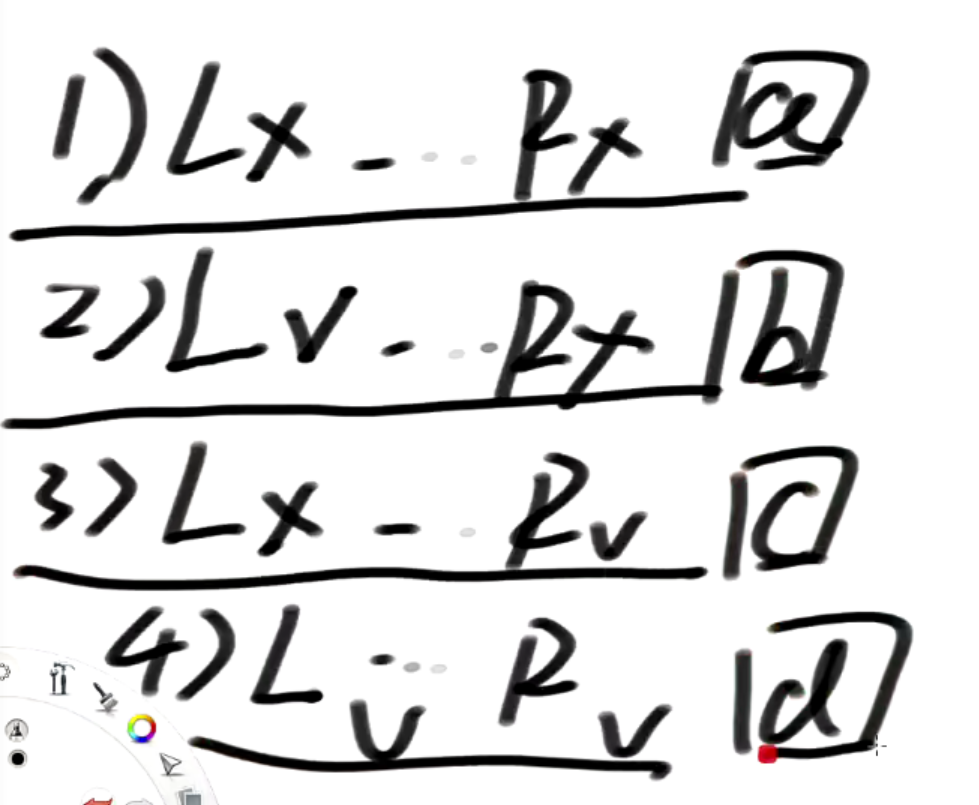


### Interview Coding 14

训练营4，第6节

### 正数裂开方法数

code1：

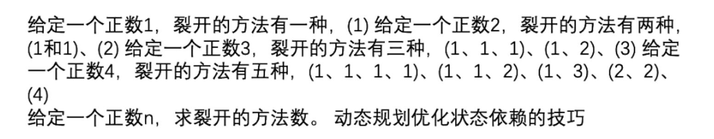

这题就是从左往右的尝试模型，两个参数是因为加了限制。你用一个参数去试，发现试不出来，你就看看加上一些限制能不能帮到你。

它要求裂开的方式是你不能够出现下降趋势，就一定要是一个有序的方式裂开。

f（int pre，int rest）。假设你是5，那么f（1,5）代表5的第一块不能用比1小的裂开，你还剩下5要去裂开。第一块裂开的不能比1小。前面的pre其实是一个对后面的rest裂开方案的约束，rest裂开的数不能比pre小。到rest为0的时候，递归结束。实际上就是在每一步决定裂开多少的时候留下了一个答案。

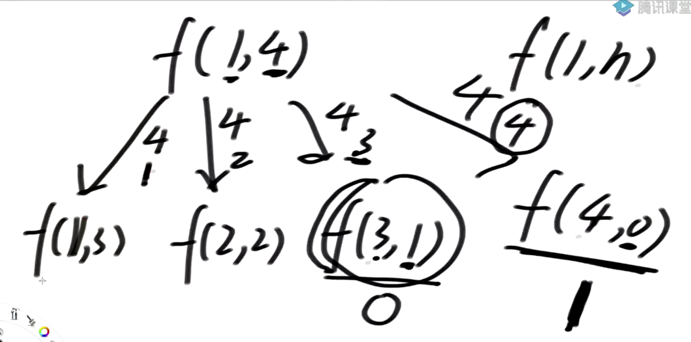

写出递归之后，直接改动态规划，把pre做行，rest做列的话，发现一个格子依赖自己左边的和下面的。所以从下往上，从左往右就填好了，或者沿着对角线填。但是改完之后还没完，因为有枚举行为，去优化！对号位置加下方位置

rest固定，这其实就是一条斜率为负的斜线。肯定可以优化

```
ways += dp[i] [rest - i];
```


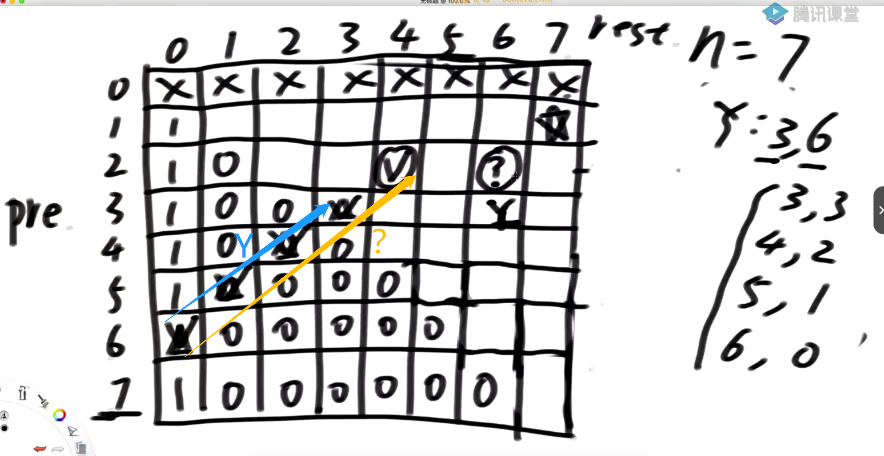


### 正好有K个逆序对

code2：

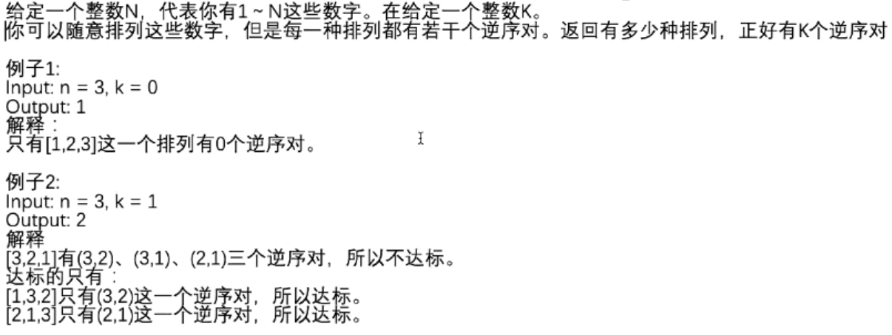

给了你两个参数，猜，一个样本做行一个做列。表规模就是dp[1~N] [0~K]。dp[i] [j] 含义定为给你1~i的数，逆序对为j的有几个。dp[i] [0]，0个逆序，也就是排序完的情况，只有一种。dp[0] [i]无意义，因为需要N>=1。dp[1] [i]，只有一个数，不可能有逆序对，所以只有dp[1] [0] = 1，其它都是0。

然后我们从左往右再从上往下填，这样我们来到一个普遍位置就认为我上面的东西已经填好了，也就是少一个数字的时候，k为任何的答案我都有。那么现在是一个普遍位置，我就看我怎么把这个多的数字插到上面去，按照插进去的位置列可能性。假设我要求dp[7] [3] ，开始列可能性，如果我把7放在最后，前面的6个需要排出k个逆序对，因为7在最后，不会产生逆序对。如果7放在倒数第二个位置，因为7是最大的，所以它右边一定会产生1个逆序对，所以前面的6个数需要排出3-1个逆序对。依次类推！所以dp[7] [3]依赖dp[6] [3] 、 dp[6] [2]、dp[6] [1]、dp[6] [0]。但是要注意dp[7] [7]，当7放第一个的时候，依赖dp[6] [1]。会有差异的！所以dp[num] [k]依赖dp[num-1] [k-i] ，其中i∈[0,num)，保证k-i不越界。

因为一个样本做行一个样本做列的模型很关注最后一个在哪，所以你就可能会憋出讨论7插哪这个可能性了。

在求dp[i] [j]的时候，其实我们就是列举最后这个数排在1~i的哪一个位置，j比较小的时候，0~j个逆序对也就j+1种情况，对应不上1~i。所以你自己要注意做一个统一--max函数，让j不要减到越界了。

写完动态规划，看到枚举行为，直接看看能不能优化。要分为i>j的时候的优化和i<=j时候的优化。把最初始的情况也看看是不是也可以助力。不然就要抠掉。

因为是7，所以公共7个坑位，枚举7个位置，如果不越界的话。会有错位的，想象两个等长的线段错一位是啥样的。

dp[7] [8] = dp[6] [2] + ...+dp[6] [8] = dp[7] [7] - dp[6] [1] + dp[6] [8]

dp[7] [7] = dp[6] [1] + ...+dp[6] [7] =dp[7] [6]- dp[6] [0] + dp[6] [7]

dp[7] [6] =  dp[6] [0] + ...+dp[6] [6] = dp[7] [5] + dp[6] [6]

dp[7] [5] =  dp[6] [0] + ...+dp[6] [5]

就是因为有枚举行为我才去搞出动态规划看看能不能依赖，没有枚举行为我才懒得搞！


### 最大二叉搜索树拓扑结构

code3：

- 给定一棵二叉树的头节点head，已知所有节点的值都不一样，返回其中最大的、且符合搜索二叉树条件的最大拓扑结构的大小。拓扑结构:不是子树，只要能连起来的结构都算。

拓扑结构：不一定要是子树，只要是连成一片的都是拓扑结构。而子树是你从一个结点出发，下面的结点我全都要了。

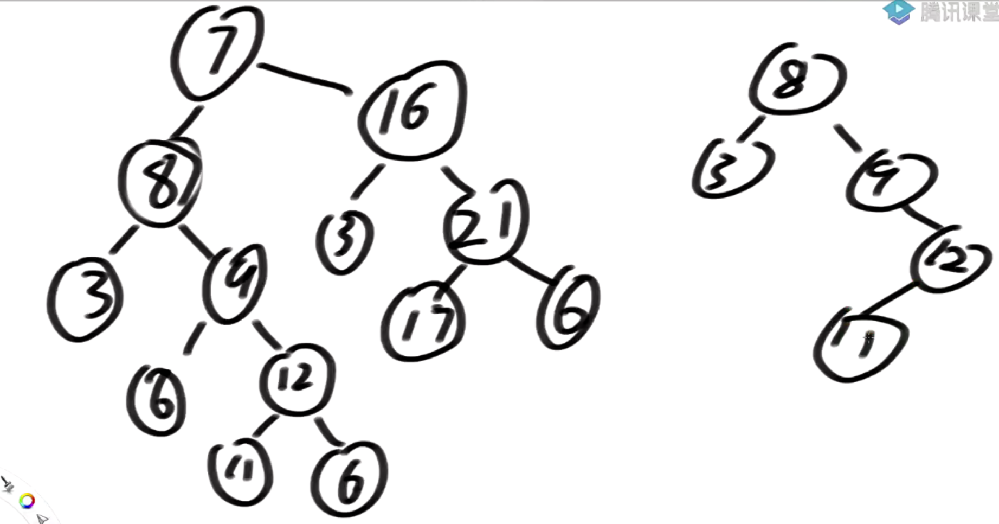

暴力它的流程是这样的，拓扑结构也有头结点，我现在可以抠掉某些点，可以留下某些点，这都叫结构，但它这个结构也有一个具体的头结点。f（Node node）定义为以必须以你传入的这个参数node为头，满足二叉搜索树条件的最大拓扑结构能有几个点。那么我对于每一个结点都调一次f，毫无疑问，答案一定在其中。

对于node的左右结点left和right，分别再以搜索二叉树的搜索方式找一遍，看看能不能找到left或者right，如果找不到我就不算到拓扑结构里面，如果找得到我就算到我的拓扑结构里面。left和left的左右孩子，继续以node为头继续按照搜索二叉树的方式找。

具体就是node按照先序遍历，可以找到它下面的所有结点，对它到达的结点x从node开始用搜索二叉树的方式找，看看能不能找到，找得到我就加进去，找不到，连同它下面的子树都不要了。这只是对node这个结点玩了一遍f函数，你接下来要对所有的N个结点都玩一遍这个f函数，这是一个N³的算法。

下面的方法可以达到线性阶。先说一个东西叫拓普贡献记录的概念，这个拓扑贡献记录它针对的是唯一的一个头部。

假设现在针对5的贡献记录。1结点它的左树和右树分别给五这个头部贡献了几个结点，左树零个结点，右树零个结点。4这个结点它左树和右树给这个头部分别贡献了一个结点，零个结点。在每一个节点上，我都有两个记录，这个记录就是拓扑贡献记录，每一个节点上的贡献记录是对最大的这个头部（5号结点）说的。

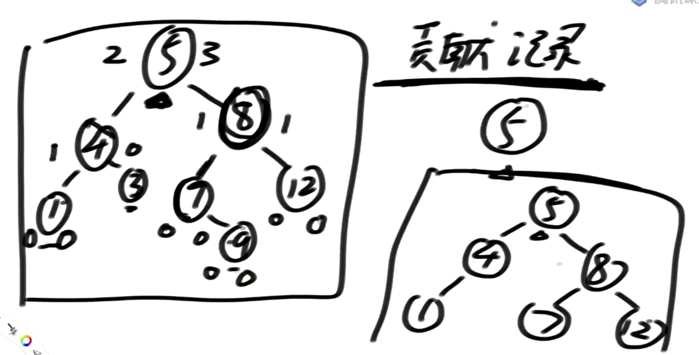

你要写递归，递归一个很重要的就是递归含义的传递。也就是L子树下面的所有的结点所形成的记录都是对L负责的，同理R子树下面的所有的结点所形成的记录都是对R负责的。如果我可以把对L下面所有的结点中的对L负责的贡献记录、R下面所有的结点中的对R负责的贡献记录，转变为对X负责的贡献记录，那么递归含义就可以传递了。如果从子到父，这种更新逻辑很快的话，那你写一个递归不就玩起来了。

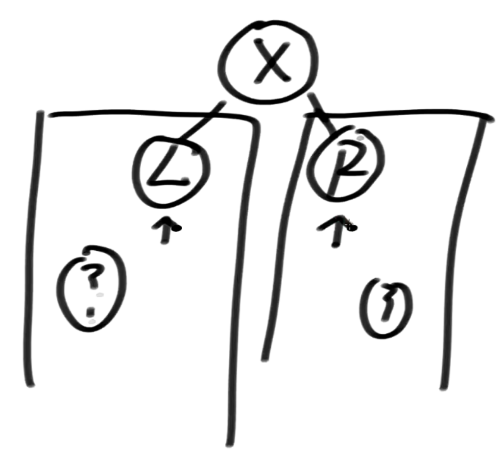

怎么改负责呢？其实有些都可以不用改，10这个结点的左树的含义直接可以迁移为对13的共献，同理12的左树也是可以直接含义迁移的。但是到了14这个结点的时候，因为14本身算不进去了，所以14不能要，那么12也就和14断开了，所以要沿途把右树的信息改回去，一路改信息，具体就是25-25,50-25。这个是过左树的右边界。

如果是改13的右孩子的话，右孩子的右边界肯定是达标的，主要就是看一下右孩子的左边界，所以就是过一遍13的左边界然后改回去。

虽然每一个结点都过了自己左树的右边界和右树的左边界，整棵树相当于按照边界分解掉了，总体复杂度就是N的。

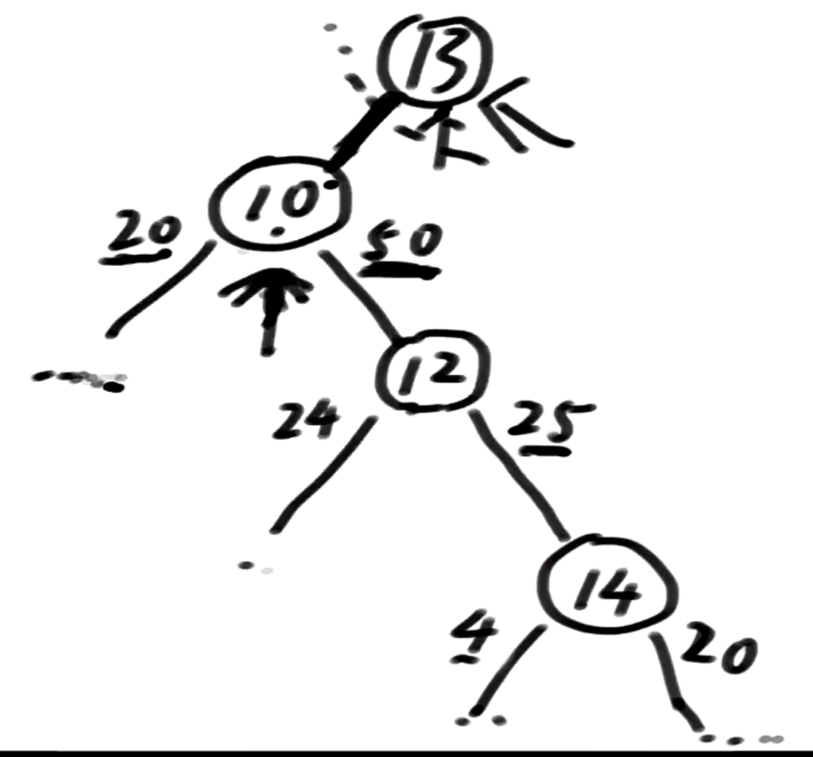

### 完美洗牌问题

题目4：

```
给定一个长度为偶数的数组arr，长度记为2*N。前N个为左部分，后N个为右部分。 arr就可以表示为{L1,L2,..,Ln,R1,R2,..,Rn},请将数组调整成{R1,L1,R2,L2,..,Rn,Ln}的样子。
```

时间复杂度:O(N)	空间复杂度:N(1)

很多题目的最优解需要用到完美洗牌算法调整结构

假设下标都是从1开始的。元素个数必须为偶数

t1(N,i)观察arr（下标从1开始），如果arr长度为2N。1. 当i-l>N时，去的位置为(i-N) * 2 -1 ；2. 当i<=N时，去的位置为 2 * i .

- 推广得到坐标公式 t(l,r,i) , 根据从下标1开始的算出偏移量得到。off=t1(N,i-(i-1))-1 是相对起始位置的偏移量,所以 t(l,r,i)=off+l

- 环状调整算法 f(arr,l,r,start)。例如abcd，应该变为cadb . 从a开始，通过公式算到1位置的a应该去2位置，直接空降到2位置，然后把那个位置的b抓住，通过公式算出2位置的b应该去4位置，然后直接空降4位置 , 以此类推 , 直到回到了出发点 . 在abcd的这种情况 , 恰好可以将四个元素调整到正确的位置。

有可能在特定的偶数长度下这样的流程不能一次调整完。如下，从1位置开始，形成1-2-4-1环。所以调整过程需要拆解为多个环来完成。问题转化为如何找到所有环的起点？

```
A B C D E F
1 2 3 4 5 6
```

结论（不需要会证明，直接用即可）：当总长度`S= (3^k) -1`的时候，环的出发点就是1,3,9,27,...,3^(k-1) 。意思就是当我的长度是(3^k)-1的时候，环的出发点就是1,3,9,27，这样的3的次幂，分解为k个环。对于任意一个偶数长度N，我们将N分解为诺干个满足长度 (3^k) -1的子数组即可。

```
了解一个小算法模型(下标从1开始 数组长度为N)
g(arr,l)代表将arr[1~l]和arr[l+1,N]整体进行交换
算法：
	1. reverse(arr,1,l)
	2. reverse(arr,l+1,N)
	3. reverse(arr,0,N)
复杂度：时间O(N)	空间O(1)
例子：
g([1,2,3,4,5,6,7],4)  => [6,7,1,2,3,4,5]
推广：g(arr,l,m,r) 代表arr[l,m]与arr[m+1,r]整体交换
```

下面我们就开始了。你现在具备了两个底层函数，一个底层函数是f函数，决定一个位置 i 它应该去 i‘ 。还有在l到r范围上，如果我给你左侧的范围，你怎么把右侧侧底拿到左边来，把左侧侧彻底拿到右边去。这两个底层函数是有限几个变量，时间复杂度线性阶可以做到。这就这么两个底层，然后再加上刚才那个结论就可以进行分解普通偶数长度的数组了。

一个普遍的偶数，先找最接近它的3^k -1的数，这个例子是8。那么就把前八个他要的结果先搞出来。所以下一步的目标就是让L1~L4，R1~R4贴在一起。L5~L7，R5~R7贴在一起。这样左边可以直接用结论调整好，右边去递归。如何从上面的变到下面的呢？L5~R4这个范围调用一下k=3那个底层。

- 递归可以变成while

```
算法h(arr,l,r)：
2N=r-l+1
index: 1  2  3  4  5  6  7  8  9  10 11 12 13 14
arr  : L1 L2 L3 L4 L5 L6 L7 R1 R2 R3 R4 R5 R6 R7
找到最接近且不超过元素个数的2M=(3^k)-1,这里是8,调用g(arr,5=l+M,7=l+N-1,11=l+N-1+M)
==>            part1				  part2
arr  : L1 L2 L3 L4 R1 R2 R3 R4 | L5 L6 L7 R5 R6 R7

part1利用f函数 环恰好调整完毕
part2递归调用h
```

时间复杂度证明，直观的看 , 每次调用h都会搞定一部分（O(M)）,并且这一部分就不动了。最多调用k次h函数。所以这k次h调用的k次f函数恰好把长度为N的arr调整完毕。所以时间复杂度为O(N)


### Interview Coding 15

训练营4，第7节

### 项目结束的时间

code1：

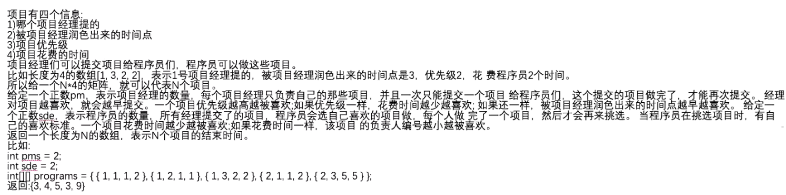

第一维数据是这个项目是被谁提出的。第二维数据是提出的时间点，在这时间点之前此项目不可见。第三维数据是项目优先级，越低越紧迫。第四维数据就是这个项目需要花费程序员多少时间。

讲一下这个大流程，假设我一开始是零号时间点。

每一个项目经理他有一个自己的一个设计书的池子。这个设计池是啥意思？就是当一个一号经理的项目写完设计书，它才会出现在项目经理一的设计池。如果设计书在当前时间点还没有润色出来，哪怕它属于项目经理一，它也不在这个设计池。现在时间点往后推了，过了一些时间，那么可能就有一些设计池里面有设计书了。每一个项目经理都会有自己的设计池。项目经理会按照什么样的策略组织自己的设计池？他有一个自己的喜好排序，这个喜好排序是什么规则？**优先级**是项目经理喜欢的第一要素。如果优先级一样，**花费时间**越少，项目经理越喜欢，如果这个也还一样，那么项目项目经理被润色出来的**时间点**哪个是最早设计的哪个最喜欢。所有的项目经理都按照这个排序规则，那么就可以认为项目经理自己内部的设计文书，它就能组成一个堆。

程序员这边，我给你五个程序员，你可以认为这五个人的程序员是没有差别的，任何一个程序员，他们工作效率一样。这五个程序员就等待着要做项目。但怎么做项目呢？这五个程序员都盯着一个项目池。项目经理可以把自己的某一个项目扔到项目池里去。项目经理会怎么扔到项目池里去？自己最喜欢的方案扔到项目池里去。也就是把自己的设计池的堆顶扔进来。每一个项目经理只能把一个项目扔到项目池里去，除非他当前申报的项目被做完了，他才可以把下一个项目再扔到这个项目池里去。但是从这这五个程序员会在项目池中挑选项目做，他们的策略是什么？那是程序员自己的喜好标准。一个项目**花费时间**越少越被程序员喜欢，如果花费时间一样，项目的**负责人编号**越小程序员越喜欢。所以你可以认为这个项目池会根据程序员的喜好标准维持一个堆。所有的程序员都会在项目池里面领项目做。都会在项目中领项目做，就这么个流程。他问你所有项目被做完的时间，请你返回。

先来看一个基本结构。这个结构里面是这样的，每一个项目经理有自己的堆，维持着每一个项目经理喜欢的设计文档。有一个程序员堆。这个结构它对外开放两个功能，第一，你把一个新的项目文档加到这个结构里去，也就是add（book x）。这个x它内部有信息，它自己知道它是哪个项目经理润色出来的。他是他是项目经理几，他就丢到相应项目经理的池子里去。第二个方法，就是程序员去调这个结构，你告诉我程序员堆里面目前为止堆顶的项目是什么，get。外部怎么调用这个结构先不说，你内部怎么去协调？例如经理1把自己目前的池子里最喜欢的a项目，放到程序员堆了，但是现在到了一个新的时间点，来了一个新的b项目，现在经理1最喜欢b项目，所以它需要到程序员堆中找到之前他加进去的那个项目，然后把它删掉（或者引用换掉），把现在自己最喜欢的项目加进去。所以这是需要两个堆配合的一个结构。你每次一个东西进到堆中，或者堆里面的东西改了，删了，都需要进行堆结构的调整，swim和sink！！这是当一个项目进来的时候。一个项目出去的时候是啥样？程序员堆里面弹出了一个项目x，这个x需要找到对应的经理的设计池，删掉！

当我一个设计书被润色出来，我就调这个结构的add。当有任何程序员想做项目，我就调这个结构的get方法，你把这个结构想的简单一点儿，再想外部如何调用。

外部调用，时间点怎么表示，你有几个员工，你就有几个时间点！表示时间的东西也是一个堆结构。


### 找到两个错误结点

code2：

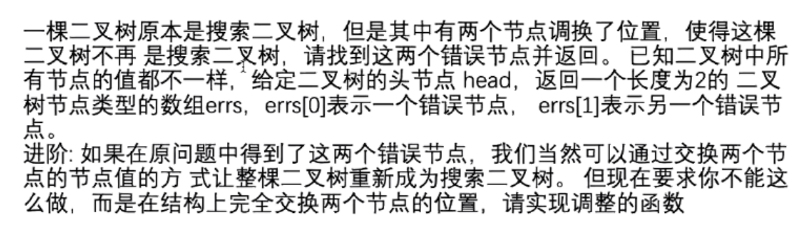

这题有更难的问法：问你这棵树上，可能有0个结点、2个结点、或者更多结点错了，如果0个结点错了你就返回没有，2个结点就返回那两个错的结点，更多的话你就不用返回了。但是这里没有必要，我就规定这里一定有两个结点错了。

怎么找？先把中序遍历的序列搞出来。如果有两次降序，那么这两结点一定是第一次降序的第一个结点和最后一次降序的最后一个结点，也就是6和3。但是不一定有两次降序，可能只有一个降序，但是一定也是第一次降序第一个结点和第一次降序最后一个结点，只不过在这种情况中，第一次降序和第二次降序是同一次。其它情况的降序情况也是这个规律

| 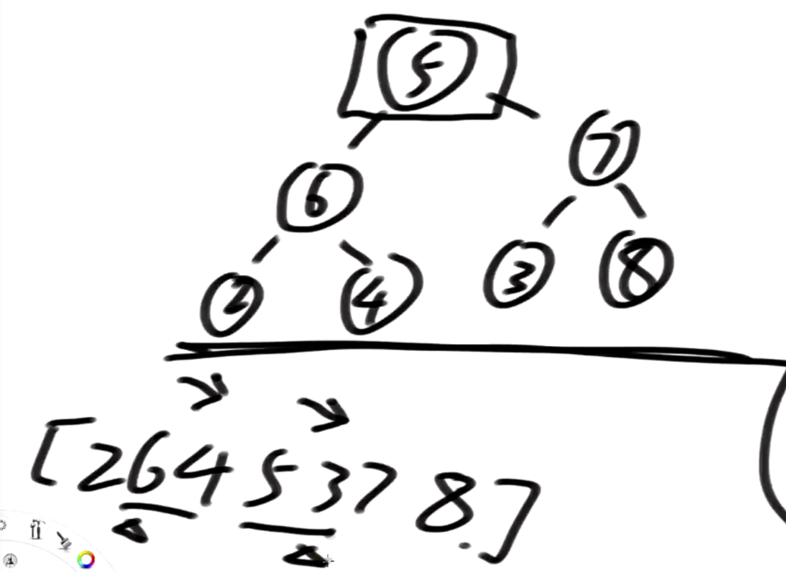 |  |  |
| ------------------------------------------------------------ | ------------------------------------------------------------ | ------------------------------------------------------------ |

你找到两个错误节点之后，你怎么把它调对？怎么把整棵树调对？在lead code上，它的标准答案就是你找到两个结点之后，你把它们内部的值调换一下。这样其实不好，为啥呢？因为其实你并没有在结构上把它们换回来，你只是把两个结点的值互换了，我们想想它会有什么问题。如果你在工程上，你的这个你一个节点就是一台服务器的话，你把这个结点的值换一下，其实是没有什么用的。所以其实按道理来讲，应该是你找到两个结点之后，在结构上把它们彻底调过来。可能是更有建设性的一种方式。

那么f（ head，e1，e2），作用是把e1和e2在head为头的树上，把结构互换了。f函数一定返回Node类型而不是void，因为f函数玩下去可能会换头的。你要返回你的新头部。这其实挺复杂的，因为e1和e2可能的情况非常多。怎么在结构上整理好彼此之间的关系？是这道题的重点。

要考虑的点很多

1. e1和e2可能是头
2. e1和e2与其父亲结点的关系--左孩子？右孩子？
3. e1和e2是紧挨着的吗？如果挨着，e1和e2谁是谁的父亲。

但是要注意了，你e1和e2是按照中序遍历找的。所以下面，第一种和第四种情况一定不会出现，所以你的代码里面就不需要考虑。但是如果你考虑了，没关系，这段代码它又跑不进去，只是你做无用功了。

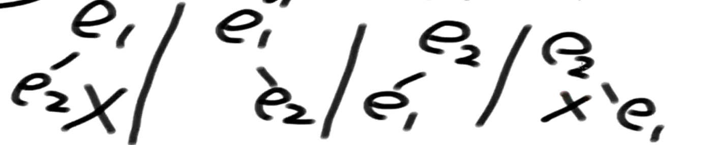

这题我并不打算把所有的细节都给你抠明白，但是。我给你提供的方法中，我把14种情况全部列出来，每一种情况针对怎么调整全写了。这道题目如果你练会了二叉树，调整这个问题，以后就不叫事儿了。接下来就是一件纯粹非常tricky的事情，就完全就只是恶心你。让你去整理清楚所有的边界条件，这是一道非常练边界条件整理能力的题。


### 可见环形山

code:3：

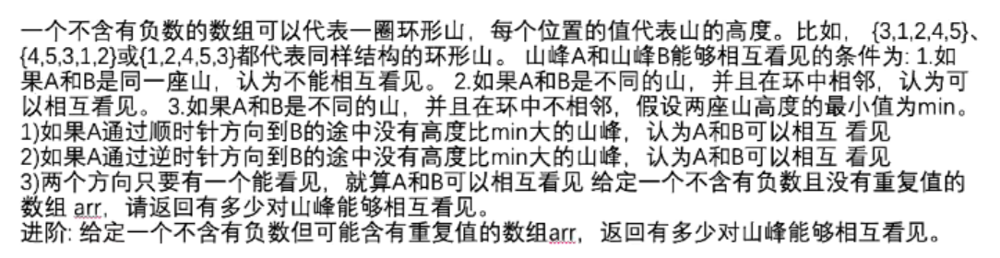

不要重复算，例如1和3可见了就不要写3和1可见，你只要按照升序排列，就不会重了。{n,m}，后面的m不要比前面的n小，就不会重了。不相邻山相互看见的规定很符合自然，因为中间隔着的话，中间的山不能挡住才行，挡住了那座矮的山就看不见高的山了，所以肯定不能相互可见。暴力肯定好做，从一个点出发，所有点都遍历一遍。 

这题中，无重复值是最简单的，复杂度O(1)。f(1)=0、f(2)=1、f(3)=3 。限定找山峰对的时候都是小的去找大的山，因为小的比较矮，才会被挡住，并且规定小的找大的永远都是去重的。公式是2 * (N-2)+1，因为既然山峰数量大于3，那么肯定有一个最大和一个次大的山，除去这两个最高的山给定任意一个x，一定有且只能找到两对。加上这两个最大的山，由于我们限定小找大，所以就是1对。总的2n-3对。

下面来看可能有重复值的时候。找一个数两边离你最近的比自己大的---》单调栈。是一个环形山所以你肯定得实现一个能够环形遍历的这么一个机制。

先遍历这个array，找到其中的最大值，这个最大值可能不是一个，那就随便拿一个，你找到它的位置。不妨设arr中最大值是5，这个5可能有多个，你从哪一个5出发都可以。我通过它，逆时针方向依次遍历，最后会回到5。

在这个过程中，我们准备一个栈利用单调栈的做法，并且是有重复值的单调栈的实现，准备一个队列装值相等的下标，弹出来的时候一起设置，这题就是找离你最近的大于你的。如果弹出设置的时候列表都是1个数，那么就不用管，就是2个记录。但是如果弹出设置的时候列表有n个数，那么已经有2 * n了，并且n个山峰一样高，一样高我们认为两两可以看见所以还有C(n,2)对。注意为什么是C(n,2)，因为我们认为只有中间有比你高的才会挡住，意思就是和你一样高的山不会挡住你。

这样一来按照单调栈的流程，你到最后肯定栈里面会剩下东西，这些东西怎么结算？注意，在之前别的题的单调栈中，最后单独处理的时候单调栈会认为右边已经没有大于你的数了，但是，这题的特殊之处在于，是环形的。也就是即使现在已经没有东西可以让栈顶弹出了，但是不意味着栈顶在逆时针方向上看不见山了，这些山现在可能就压在你的下面，因为栈底是放大的数，如果你下面压着的山不止两条，那么你对外就有两条记录，因为环形的缘故你可以从两个方向上分别看到比你高的山，对内还是C(n,2)。如果你下面压着的只有一条了，那么看看这一个队列里面有一座山还是两座山以上，如果只有一座山那么对外就只能有一条否则或者就还是2条，对内C(n,2)。如果你下面一条都没压，说明你是最大的，对外没有，对内C(n,2)。说一点，其实栈底就是你逆时针看能看到的第一座高山，你顺时针看就能看到你栈顶下面压着的第一座高山。

- C(n,2)其实也把1个山对内0条也包含进去，用一个公式就行了。

现在回到一开始。为什么一定要从数组的最大值开始：为了给我压一个永远不会弹出的底，否则在逆时针加的时候，如果栈底不是最大值，那么栈底就可能弹出，那么栈底弹出来了，我逆时针看这个把我弹出来的数，那我顺时针看谁呢？所以一定从最大值开始。

- 这题好像只关心我栈里面同一高度的山出现了几次，不关心山的下标，所以可以不用一个队列来存放相同值对应的下标，我们用一个Record结构来代替队列，Record里面记录山出现了几次即可！


### 子序列模m最大值

code4：

- 给定一个非负数组arr，和一个正数m。返回arr的所有子序列中累加和%m之后的最大值

这题就是一个背包问题。dp[i] [j] 代表arr的0~i自由选择能否严格凑出j，是一个布尔类型的二维数组。然后遍历dp的最后一行，把能搞定的j去模m，抓住最大值即可。但是这样列数可能很多，如果里面的值都很大的话，你需要把每个数都加起来，甚至可能会溢出。

那么我们就把dp[i] [j] 的含义变一下。dp[i] [j] 含义变为arr的0~i自由选择的累加和%m之后能否凑出j，也是一个布尔类型的表。

```GPT
在计算数组的子序列时，可以选择从数组中选取一些元素，也可以不选取任何元素。如果不选取任何元素，则子序列为空序列。因此，全不选的情况也属于子序列的一种情况。

一个序列的累加和定义为该序列中所有元素的和。对于空序列而言，它不包含任何元素，因此其累加和为0。

在数组的子序列中，空子序列是一种特殊的子序列，它不包含任何元素。因此，如果要计算数组的所有子序列的累加和，需要把空子序列的累加和也算上。由于空子序列的累加和为0，因此可以把它看作是一个初始值，并在计算其他子序列的累加和时累加上去。

子数组是原数组的一段连续子序列，因此子数组不可能为空。子数组至少包含一个元素。

相反，子序列可以为空，因为子序列不要求元素是连续的，可以从原序列中选取任意个数的元素，包括空序列。
```

dp[0] [0] = T ，因为0~0自由选择累加和凑出0，我一个都不选，累加和就是0。

第一列，都是T，空序列

第一行，dp[i] [arr[0]]=T，别的不管，保持默认值。

一个普遍的位置dp[i] [j]，讨论i位置参与和不参与的情况。

1. 如果i位置不参与累加加去模m，那么如果dp[i-1] [j]=T，那么dp[i] [j]也为T。
2. 如果i位置参与累加和然后去模m，如果(arr[i]%m)-j<0，依赖dp[i-1] [m+c-j]；如果(arr[i]%m)-j>=0，依赖dp[i-1] [c-j]

```
取模运算具有分配律。

具体来说，对于任何三个整数 a、b 和 c，以及一个给定的正整数 m，以下等式成立：

(a + b) % m = (a % m + b % m) % m

这意味着，如果你想要计算一个表达式 (a + b) % m 的值，你可以先计算 a % m 和 b % m 的值，然后将它们相加，最后再将和取模 m 的结果。这样做不会影响最终的结果。

同样地，对于任何整数 a 和 b 以及一个给定的正整数 m，以下等式也成立：

(a * b) % m = ((a % m) * (b % m)) % m

这意味着，如果你想要计算一个表达式 (a * b) % m 的值，你可以先计算 a % m 和 b % m 的值，然后将它们相乘，最后再将积取模 m 的结果。这样做同样不会影响最终的结果。
```

presum是我希望你前面给我搞出来的累加和，加上我的arr[i]刚好模上m就等于j了。等价变换一下，这等价于你之前搞出来的累加和模上m等于km+arr[i]%m-j。这等价于你0~i-1位置累加和模上m，你能不能给我搞出一个km+arr[i]%m-j。也就是依赖dp[i-1] [km+arr[i]%m-j]，这里的k只可能为0或1，如果arr[i]%m-j小于0它就是1，否则就是0。

```
(presum+arr[i])%m=j   <==>  (presum%m+arr[i]%m)%m=j
假设arr[i]%m=c，则(presum%m+c)%m=j  ==>  presum%m + c = mk+j,(k<=1)，因为c+presum%m不超过2m
presum%m = mk+j-c
如果c-j<0,presum%m =m+j-c
如果c-j>=0,presum%m =c+j-c
```

搞定dp表之后，从右往左，第一个true的就是答案。

看菜下饭的题。第一种方法复杂度N * sum。第二种N * m。但是如果数组里面的值也很大，m也很大，但是N不太大，怎么办？第三种方法，把数组切成两半，一半去算所有的子序列累加和%m所能凑出来的数，另一半也同样去算。第一种情况就是我直接去左边的List找离m-1最近的。第二种情况就是去右边找离m-1最近的。第三种情况就是列举所有的List1里面的，然后到List里面找离m-1-x最近的。但是可以注意到第三种其实包含了第一和第二种，list1或者list2枚举累加和为0的情况就是情况1和情况2。这是指数级别的！！分两半是为了减少指数的次方，分治。在这种情况下我暴力递归去做，我都不用记忆化搜索或者动态规划了，因为N本身很小，但是sum和m很大，你去记忆化搜索或者动态规划，根本命中不了几次。

为什么决定要用np问题，我告诉大家实际状况是啥？这道题在出的时候，它就逼着你用第三种方法。

### Interview Coding 16

训练营4，第8节

### 正则表达式匹配

`leetcode-10`

code1：

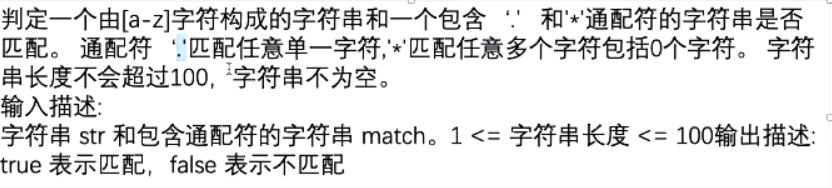

可以认为，除了点跟星之外，剩下的字符都是没有特殊字符的。我们现在讨论的字符串都是由数字、字母、点、星  构成的，而string它只会由数字跟字母构成，match串在含有数字跟字母的基础上还可能含有点和星。点可以变成任何一个单一字符，但是它不能变成星字符。星不能自己单独使用，它必须跟它前面一个字符配合使用，前面的字符可以是点、数字、字母。a*代表0个a、1个a、.....  、n个a。它必须跟前一个字符配合使用，那也就是意味着，即便是在match串中，两个星也不可能在一起，因为这不合法。

| 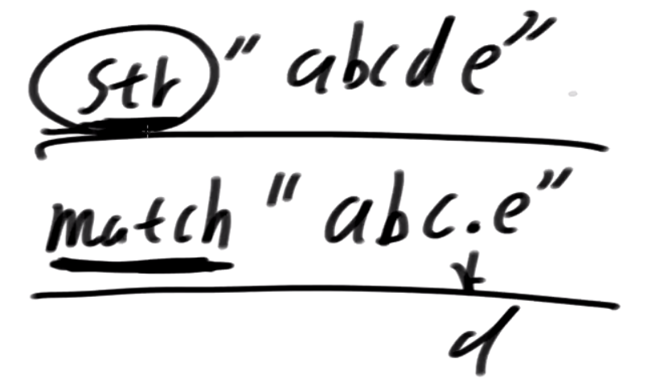 | 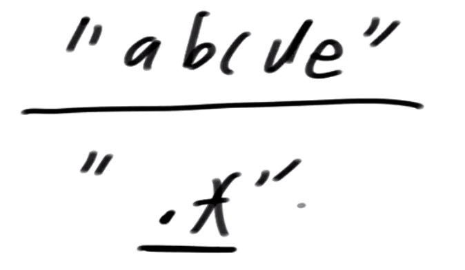 | 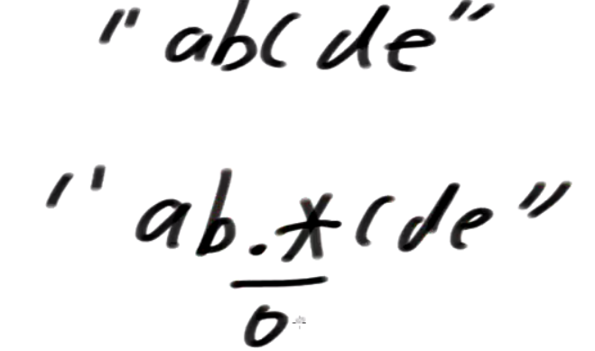 | 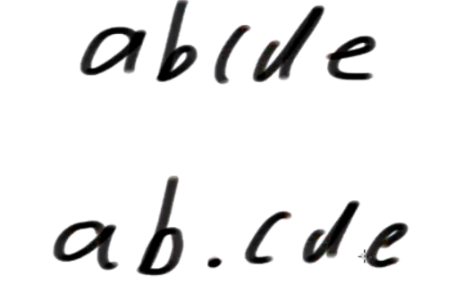 |
| ------------------------------------------------------------ | ------------------------------------------------------------ | ------------------------------------------------------------ | ------------------------------------------------------------ |
| 匹配，点变成d                                                | 匹配，点星变成5个点                                          | 匹配，点星变为0个点                                          | 不匹配，点至少变一个字符                                     |

这道题怎么试？给你两个样本了，一个样本做行一个样本做列的对应模型。

定义以下函数f。str从si出发往后的所有字符能否被express串从ei出发往后的所有字符变出来。动态规划嘛，要么0~i要么i~N-1，一道题可能两种定义都行，也可能只能一种行。所以主函数调用f(str,exp,0,0)。

```
boolean f(String str,String exp,int si,int ei)
```

接下来我们就来看一下这个函数应该怎么拆。我们先不看这个终止位置，就比如说你si碰到str结尾了怎么样，越界了怎么办。express如果这个ei碰到终止位置怎么样，也先不管。f函数我们省掉固定参数，用可变参数来讨论。在主函数里面，我先检查一下，确保string中没有点没有星，再确保match串中星号不在开头位置。因为如果星号在开头位置，它是一个不合法的串，星号必须跟前面一个字符搭配使用，所以match串的开头不能是星，还有就是两个星不能挨着。在整个调主函数这个f之前，先做有效性检查。

base case是，ei来到了这个串的结尾，就相当于是你的表达式串已经耗尽了，它已经是空串了。你的表达式串已经是空串了，你怎么能变成s的东西呢？只有si后面的也是空串才能变，如果不是空串就返回false。

看普遍情况，ei和si都在一个正常位置，都有字符。可能性怎么整理？看ei+1位置是不是星？如果ei+1位置不是星，首先你si和ei的位置要能匹配才行，所以要求你的字符要和str字符相同或者exp这个位置的字符是点。

f函数有一个潜台词，隐含的限制。你不能让ei压中 星 的位置，你调所有的f函数必须满足这个限制。因为星开头的东西不合法，你递归的东西含义要传递，既然你说星开头不合法，你怎么能让子过程星开头？所以我以后调的每一个子的过程，ei位置请你不要去压星，有星你给我跳过，你得想办法不让它压中星。所以我们才可以只讨论ei+1位置是不是星，而不讨论ei位置是不是星。

注意：如果ei来到了exp的结尾，ei来到exp结尾隐含着ei+1也不是星，因为没有字符。在ei+1不是星的情况下，你ei来到一个位置，只要ei还在[0,exp.len-1]的范围内，那么就要求si...往后有东西，也就是si<str.len才行，并且ei位置的字符和si的字符能对上，并且调用子过程，往后的也得配上才行。

下一种情况就是ei+1位置是星的情况，因为你做了有效性检查，ei+2位置一定不是星。如果ei字符和si字符不一样，那么只能靠ei+1位置的星来挽救，把你这个不一样的字符变成0个，所以后续要调用f(si,ei+2)。如果ei位置和si位置的字符一样，那么就要枚举了，让星变成0个你f(si,ei+2)，让星变成1个你f(si+1,ei+2)，变成2个你f(si+2,ei+2)，变成3个你f(si+3,ei+2)，直到前缀串不一样了才停，只要有一个分支调用是true，整个就能变出来。

最麻烦的就是点星了，点星可以帮你搞定所有前缀。

搞定了暴力递归之后，来搞二维表看看能不能斜率优化。我们发现初始化完了之后，一个普遍格子依赖自己右下角的格子，以及跳1列下面的格子。有枚举，观察之后可以优化。

看下面的位置依赖，好像我的初始位置不够用。一个格子需要依赖右下角的格子，那么你至少也需要把下面的格子也填好吧？也就是我们需要把第三列和第五行都填好，我们的普遍位置才有救。 如果我不准备好最后一行和倒数两列的话，我们填格子就优点困难了。先来看第三列怎么填，第三列其实代表exp已经到达了最后一个字符了，首先确定这个exp的字符不可能是*，因为如果这个位置是星，递归行为永远调用不到它，递归行为调用不到我当然不需要填了。所以如果exp[3]位置是星的话，你倒数第二列求都不要求了。如果exp的最后一个字符不是星，那么第3列的最后一个位置必定是false，因为str耗尽了，但是你exp还剩下一个。4,3位置意味着str剩一个，exp也剩一个，那么取决于他们相不相等。(0~3,3)都是false，因为exp剩下一个，但是str还不止一个。这样一来倒数两列解决了，现在解决最后一行，也就是第五行。最后一行代表str已经没了，耗尽了，而exp还有，那么exp只有变成空串才有戏，所以只有是某星某星某星这样下去，所以最后一行从右往左都是星某星某，星的位置是T，某的位置是false，一旦false true断掉，左边全部都是false，一旦断了左边都是false。

这道题我想说什么？有的时候递归函数很凑巧，看似我没有讨论si到最后的时候是啥情况，实际上，这个讨论是掺在每一个循环里的。但是你掺在一起，发现你看不出来了。我介绍这个技巧是说你写递归函数的时候，如果你base case你不知道怎么想，无所谓，你先把普遍位置写好，普遍位置写好之后，你再反推，你需要垫什么样的base case？写递归函数，你就可以假设一种最普通的情况去写，可能你写完的时候你都不知道你base case怎么去整理？不要紧，你就看你普遍位置的依赖关系，你至少要准备多少，要准备什么样的情况，成为你的base case。

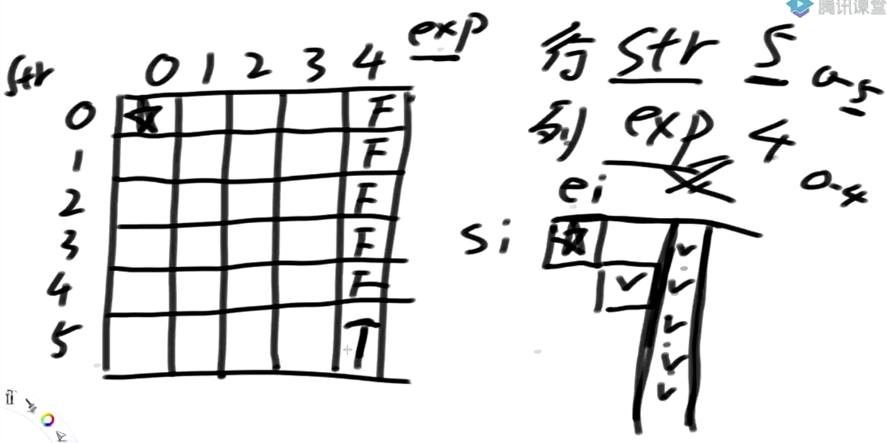

dp补不补位置取决于你暴力递归能不能到达len位置。

dp定位从0~i还是从i~N-1，取决你的题目从左往右试舒服还是从右往左试舒服。从左往右试，跟从右往左试，其实没有太大的区别，它可能决定你在列可能性的时候的一个方向，但是策略应该是差不多的。这道题我们为什么决定从从左往右试，因为到一个字符，它是往后去看是不是星号的，而不是往前去看是不是星号，所以可能从前往后试，会比较舒适一点。因为到一个位置，取决于后面的字符是不是星，所以要求后面的dp求过了，所以dp定义为i~N-1。

暴力递归的从左到右尝试对应到动态规划其实就是i~N-1这样的，例如这题，你需要知道后面的情况怎么样。如果是从右往左尝试的话，对应到动态规划就是0~i这样的范围，0~i这样的范围对应之前的题，有最长不重复子串，因为要依赖前面出现的字符，所谓依赖前面的位置，就是要求前面位置的dp求过了，所以定义为0~i去试，会舒服一点。

### 自由之路

`LEETCODE-514`

code2：

- 电子游戏“辐射4”中，任务 “通向自由” 要求玩家到达名为 “Freedom Trail Ring” 的金属表盘，并使用表盘拼写特定关键词才能开门。

  给定一个字符串 ring ，表示刻在外环上的编码；给定另一个字符串 key ，表示需要拼写的关键词。您需要算出能够拼写关键词中所有字符的最少步数。

  最初，ring 的第一个字符与 12:00 方向对齐。您需要顺时针或逆时针旋转 ring 以使 key 的一个字符在 12:00 方向对齐，然后按下中心按钮，以此逐个拼写完 key 中的所有字符。

  旋转 ring 拼出 key 字符 key[i] 的阶段中：

  您可以将 ring 顺时针或逆时针旋

  转 一个位置 ，计为1步。旋转的最终目的是将字符串 ring 的一个字符与 12:00 方向对齐，并且这个字符必须等于字符 key[i] 。
  如果字符 key[i] 已经对齐到12:00方向，您需要按下中心按钮进行拼写，这也将算作 1 步。按完之后，您可以开始拼写 key 的下一个字符（下一阶段）, 直至完成所有拼写。

| 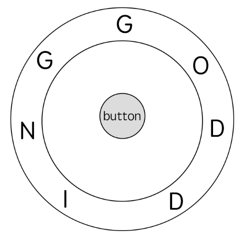 | 输入: ring = "godding", key = "gd"<br/>输出: 4<br/>解释:<br/> 对于 key 的第一个字符 'g'，已经在正确的位置, 我们只需要1步来拼写这个字符。 <br/> 对于 key 的第二个字符 'd'，我们需要逆时针旋转 ring "godding" 2步使它变成 "ddinggo"。<br/> 当然, 我们还需要1步进行拼写。 因此最终的输出是 4。 |
| ------------------------------------------------------------ | ------------------------------------------------------------ |

str从0位置开始编号，一开始顶针在0位置，字符串按照顺时针排开。你给我搞定一个函数，f(i,j)，从顶针指向i位置字符，到顶针指向j位置字符最少需要移动几次，这肯定是一个公式可以搞定的，g是0位置，走到6位置，0-6+7=1，6-0=6，选1步。

```
(i+x)%m=j,  km+j=i+x  => x=j-i+km (k=0或1)  i顺时针走x可以到j
(i+m-x)%m=j , km+j=i+m-x => x=i+m-j-km => x=i-j+km (k=0或1)  i逆时针走x可以到j
顺指针步数x1:j-i+(j-i<0?m:0)
逆时针步数x2:i-j+(i-j<0:m:0)
f(i,j)=min{x1,x2}
m为字符串的长度
```

- 简单的理解上面公式，从i顺时针到另一个地方j需要走的步数就是末位置减去首位置j-i然后根据正负去加上m。从i逆时针到另一个地方j需要的步数，等价于从j顺时针走到i，所以需要的步数就是i-j然后根据正负加上m。


然后你把ring遍历一遍，看看每一个字符都出现在哪些位置，所以是一个装着List的HashMap，key是字符。然后你根据它要的，玩一个深度优先遍历，搞一个全局最小值，抓住。暴力递归很容易搞出来，直接记忆化搜索，因为就两个可变参数。


### 打气球

code3：

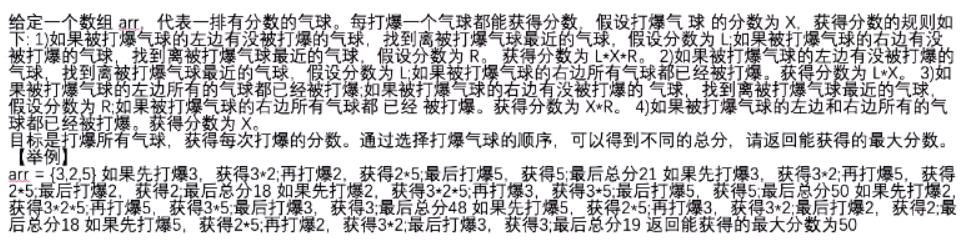

爆了的气球自己有一个分数，叫做m。它得到的分是，左侧找离他最近的没爆的，右侧找离他最近的没爆的，得到的分数是L * m * R 。如果它左侧已经没有气球了，那你认为L就变成1。如果他右侧已经没有气球了，那就认为R就是1。

我们先把这道题的试法给大家讲明白，然后我们再看看有可能产生的试法为什么不对。尝试的时候如果要加可变参数，要是简单类型。如果你要准备可变参数的话，你一定要保证它的类型不要突破单个整形这个复杂程度。l到r上这些气球要打爆，最大得分是多少？有很强的潜台词：我在arr的l到r上这个范围打爆气球的时候。l- 1位置的气球一定没爆。r+1位置的气球也一定没爆。所以这道题我们再次强调一点，这个函数f(L,R)啥含义，返回一个整形，他说的是你在arr的l到r上要打爆气球，但我告诉你l- 1位置，它一定是没爆的，r+1位置也一定是没爆的情况下，你打爆上面所有的气球，最大得分是多少？

你主函数在调用的时候，你把给的arr左右都补个1，然后传进去。例如arr[2,3,5] => arr[1,2,3,5,1]，调用f(arr,1,3)。

我怎么整理可能性，注意：可能性整理谁是最后爆的气球。假设L是最后爆的气球，那么就等于f(L+1,R)+arr[L-1] * arr[L] * arr[R+1]。假设R是最后爆的，那么就等于f(L,R-1)+arr[L-1] * arr[R] * arr[R+1]。开头L和结尾R我们都讨论，还有情况就是中间一个普遍的位置i都可能是最后爆的，那么就等于f(L,i-1)+f(i+1,R)+arr[L-1] * arr[i] * arr[R+1]。所有情况求max。

这题重点不是上面的思路，而是你怎么想到这个思路。你有可能会想到范围上的尝试，因为有L个R嘛。这样一来，有可能干扰你的一个非常强大的干扰，就是我去尝试每个气球最先打爆。那么含义是f（L，R）还是你能获得的最大值，但是你是通过枚举每一个位置最先打爆来进行递归的。这样一个问题就来了，我其实很关系你L~R外面两边的数据状况的。去枚举每个位置上最先打爆，我就没有办法补那个潜台词，我可能不得不去加参数，加什么参数呢？我左侧离我最近的不爆东西是啥？你打爆之后你进递归，你需要给你的递归函数更新这个结构，维持左边最近的没爆的是谁。左右的状况你都要维持，这样你的参数就太多了。你想完谁最先打爆，是不是就该想谁最后打爆了。这样列可能性，你就不需要维持左右两边最后没爆的信息了。原理不能够帮你去启发，但是可以把你不靠谱的路提前堵死。

这道题如果换一问。我每个气球在爆的时候。左侧离我最近的最先爆的气球的因子，乘以我自己，乘以右侧离到我最近的最先爆的气球，如果是这样一种评价标准，我告诉你，尝试每个气球最先爆是最好的。他这个问题本身就一定要拿最后场，拿最后打爆气球去试的。他这个问题本身就一定要拿最后打爆气球去试的。你发现你试不下去了，你发现你潜台词补不出来了，你发现你要必须加一个很复杂的可变参数才能描述这种状况了，你别试了，咱换一个可能性去罗列。

### 数组汉诺塔

code4：

- 给定一个数组arr，数组中只有三种值，分别是1,2,3。那么这个arr从下标0开始到N-1，圆盘的大小从小到大，数组里面的值123代表左中右三根柱子。这样一个数组可以表示一个汉诺塔的状态。如果这个数组它表示的汉诺塔的状态是最优解的其中一步的状态的话，你返回它的第几步。如果你给我的这个状态，它最优解走的过程中根本不会有这个状态出现，你就返回-1。

我们假设现在解决的是i层汉诺塔问题。主函数的时候是解决的一到n的问题。定义f(arr,N,from,to,other)，如果圆盘总共有10个，调f(arr,9,1,3,2)，9代表0~9，数组从下标0开始编号。圆盘它对应下标是零到九，他们整体要从1柱子移到3号柱子去2是另外一个柱子。你告诉我这个array里面的状况是这个大目标的第几步？如果它不是大目标的任何一步你返回负一。如果这个而位的状况是大目标的一步你返回它是第几步？这是f函数的含义。

汉诺塔问题就是三步，第一步和第三步去递归，i不可能会去other位置，因为去other位置它肯定不是最优解。那它不等于other，它一定等于from或to，再看下一种情况。第二种情况是当前arr[i]等于from，说明你第一步没走完，那你就调下图的第一步呗，递归去，f(arr,i-1,from,other,to)。

最大的那个盘就是i位置，最大盘不可能去other位置，是显然的。再来，如果i在from位置，说明此时，在你给的那个大范围上，第一步都没有走完，所以让它进递归到子过程中分解。如果i位置已经到了to位置了，那么要算总步数，就还要算上前面一二步的步数，计算方法就是n层汉诺塔问题最优解的步数是2^n -1步，所以0~i 这个子过程的一二步的总和就是	2^(i-1)然后再加上第三步进去递归。

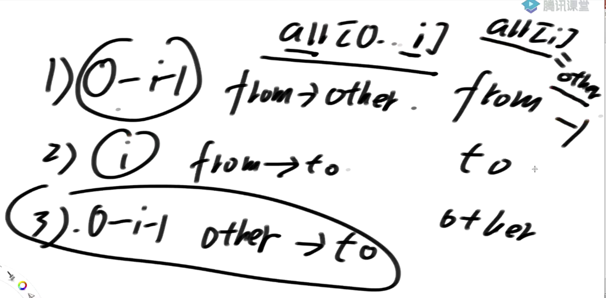

### 最小合成代价

code5：

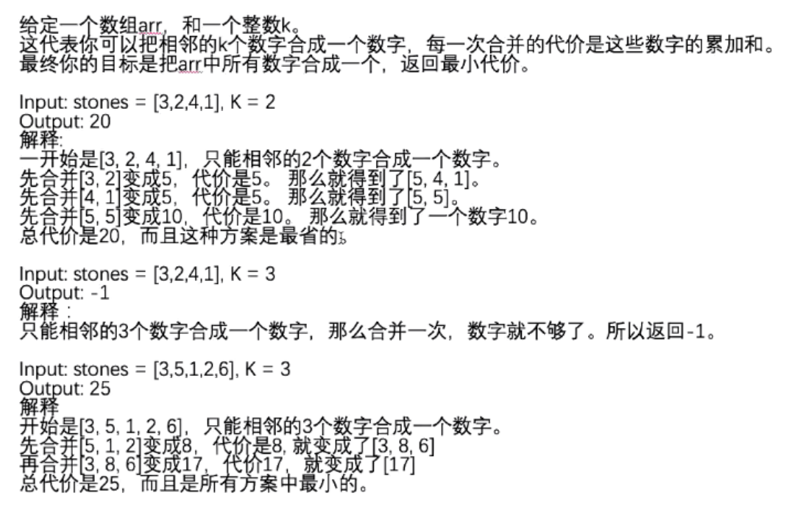

一定存在一个关于长度跟k的这样一个关系。这个n和k满足某种关系，才能最终合成一个数。例如k为3的时候，4个数你无论如何都合不了，所以有一个过滤条件。n- 1模k- 1大于零就合成不了----观察法。

尝试：f(L,R,part)，含义是l到r上，相邻k合完之后正好剩下part个数。请问最小代价是多少？主函数调f(0,N-1,1)。

如果只有一个数，那么只要part==1的时候才返回0，其它都是-1，本身就是1个数，不需要和别人搞在一起，所以只有0的代价。如果不止一个数，但是你要我搞出1份，由于只能k份合并，所以我调用子过程帮我搞出k份，然后合并。如果想让你合出来的不止1，那么就所有的前缀都去试，然后调递归。但是要注意，这些所有的前缀中，只有一些是合法的，就是只有个数是k整数倍的才合法。

这题其实是一个动态规划，但是有点难，大的主逻辑其实是一个范围上尝试的模型，但是又掺了一些业务限制，叫做我合了多少份，等到我真正去讨论part大于1的时候，它又是一个前缀，类似于从左往右的尝试模型。这题为位置依赖很乱，你去记忆化搜索。


### Interview Coding 17

训练营5，第1节

有的视频音画不同步


### str1包含str2所有字符的最小子串

code2：

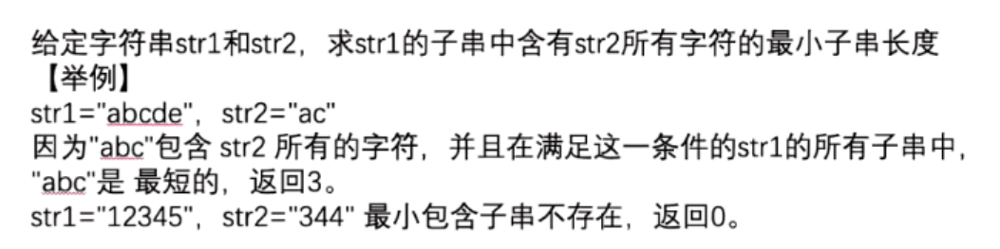

滑动窗口。因为你需要含有str2中的所有字符，所以你既需要知道str2中的字符种类，又需要知道字符出现的次数，所以我们需要一个HashMap做映射。map作为我们的欠账表。一开始你欠账8个，说明你的账没有还完，就让这个窗口右边界移动，c先进来，看看是不是有欠c，如果是就还掉，all也-1变成7。一直这样下去，直到all为0，具体怎么维持，是coding，然后l往右边移动，直到all不能为0了，就收集窗口的大小。

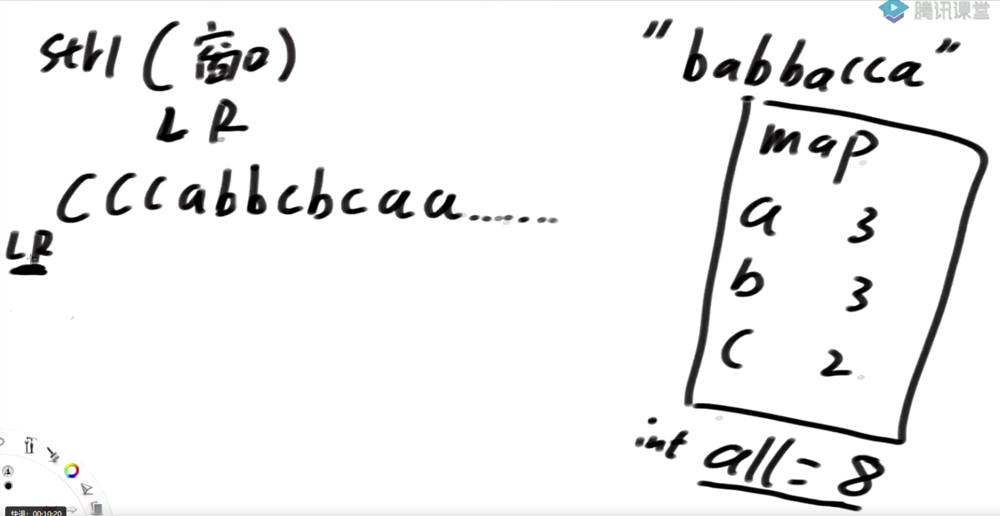


### LFU

code3：

 

既然是一个内存替换算法，那就要指定不要超过多少条记录，假如是k条记录。你对同一个记录，put或者get，都会增加那个记录的频度。当你的已经装满k条记录了，你就可以淘汰掉记录，怎么替换，你扔掉频度最低的记录。如果里面频度都一样，替换谁？替换最早进来的那个。

所以lfu其实包含两个策略，第一个就是当我频度能够分出最小值，而且这个最小值是唯一的一条记录的时候就扔掉这条记录，那如果我多个频度都是最小值我扔掉哪条记录？你看所有的key中，离你最遥远的上次操作的那个key扔掉。这是我们的所谓的lfu内存替换算法，这道题很有名。实际上，它的算法、它的数据结构设计并不特别的复杂。它是一个什么结构？我put方法跟get方法都要求时间复杂度O(1)，这个难。你搞一个时序的机制很好实现，用结构记录来到的时间，但是这样就不是O(1)了。用堆也不行，用堆O(logN)跑不了。

map是肯定要用的，但是跟大家说这个题难点在于什么？它是一个二维双向链表。首先我有桶这个概念，大概是个大盒子里面放的是一个一个的大桶，桶就是一个容器。当然这个桶其实它是双链表结构的。这个桶它跟下一个桶的连接方式是双向链表。


然后怎么玩？首先我有一个map，map里面放key对应的那个结点的内存地址。具体来说就是来了一个记录(A,17)，我会创建一个Node，放到某一个桶里，但是下次如果你要put(A,19)，我希望我通过这个map里面的记录找到A这key被我封装到了哪个结点里面，map直接把这个结点的内存地址告诉我。同时我还会有一个map2，这个map2是具体某一个元素的node它对应的桶是多少？具体来说，我是有桶的概念的，所以我们不仅需要找到那个结点，还需要知道那个结点在那个桶里。桶和Node都是我自己定义的结构，都可以通过记录一个引用直接找到。

举个例子，看到具体是怎么做的。一开始进来一条记录(A,17)，我先在map里面查一下，有没有A这个key，没有我就建出这个结点Node（A，17）。桶是依次建立，并且是双向链表连接。那我就查，你既然是刚进来的，所以你频度是1。我这个结构中最左边的桶意味着次数最少的，最右边的桶意味着是次数最多的，那我就看我这个桶中最左侧的桶有没有。一看，发现没有，说明不仅你是新进来的，而且你是第一个。此时你就是第一个，连大桶都没有，所以我就建出一个桶对象放在最左的位置，然后把（A，17,1）扔进去。那么这个桶叫什么名字？给它取个名字叫做频度为1的桶，因为里面放的次数是1。也就说这个桶里面以后只放频度为1的东西。然后不要忘记更新map2，知道Node在哪个桶。

| 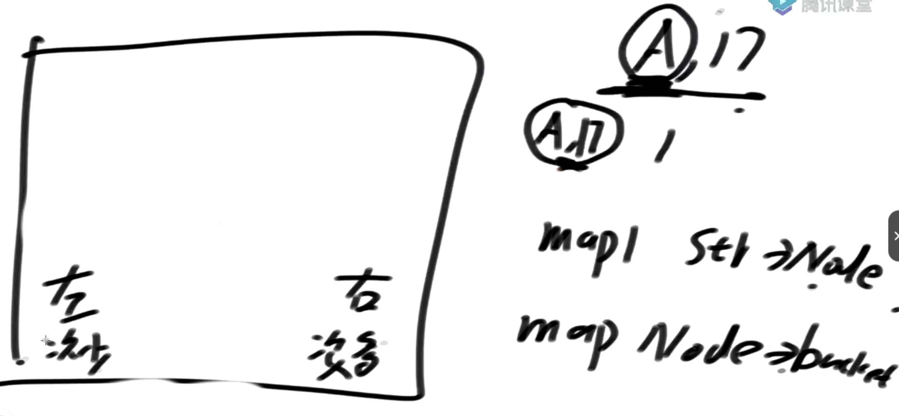 | 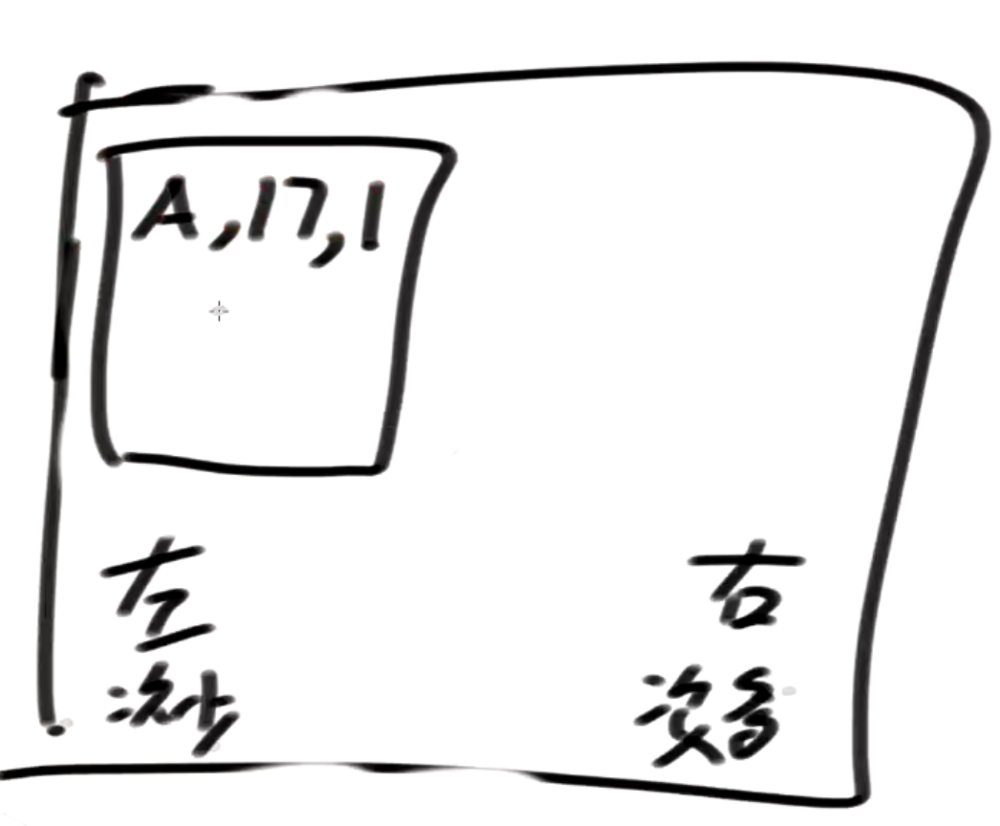 |
| ------------------------------------------------------------ | ------------------------------------------------------------ |

下条记录来了，（B，13），map 1查没有关于这个B这个key的记录，所以建出一个东西来（B，13,1）。既然你是刚进来的，所以你频度肯定是1。然后我看看这个大结构中最左侧的桶频度是几？最左侧的桶频度就是你这个桶中元素随便拿出一个它频度是几，桶的频度就是几。这里发现第一个桶的频度是1，发现正好，（B，13,1）这个Node就放进去这个桶里面。同样的map2记得更新一下。

再来一条记录（C，10），那就继续加。

| 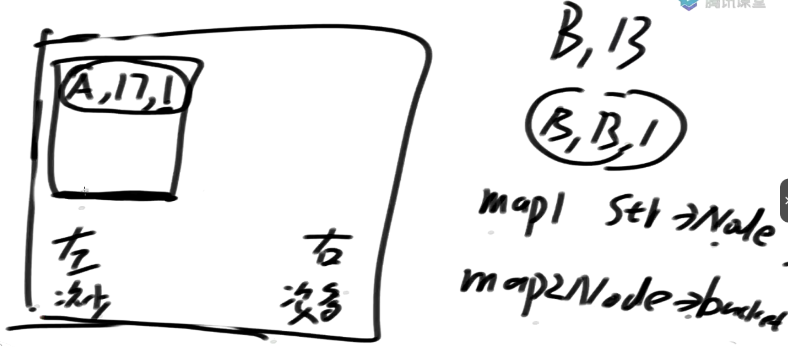 | 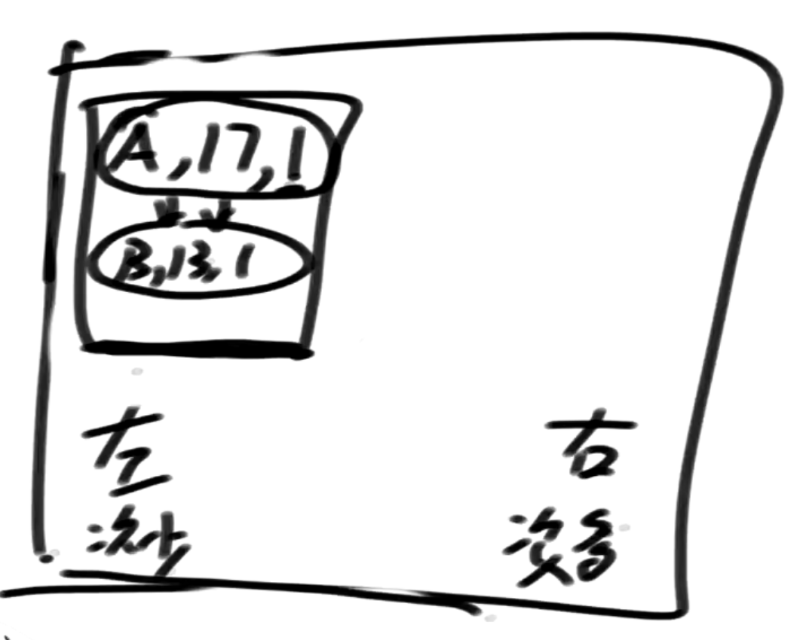 | 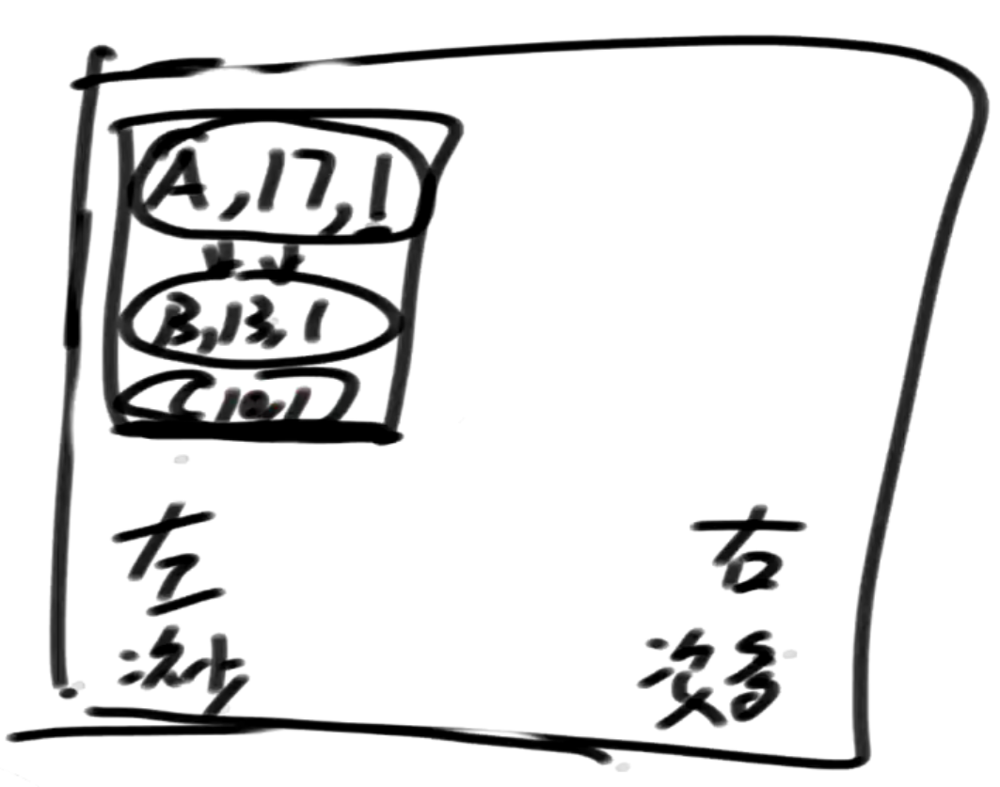 |
| ------------------------------------------------------------ | ------------------------------------------------------------ | ------------------------------------------------------------ |

假设现在我要put（B，26）了。我就在map 1中查有没有你这个点，有你这个点，有你这个点直接能够一杆子插到这个点。因为我这个表中是直接记内存地址的，我不根本不需要遍历桶，我也不需要遍历桶里面的元素，我直接能找到它，通过这个map1！所以你直接把它值改成26。

然后注意，此时B在对应的那个桶里面，词频要+1，+1之后就不再属于那个桶了，要从那个桶里面分离出来。那么我分离出来，这个代价就是上下环境重连，这毫无疑问是常数时间的事情。所以接下来你就把B拿走，A和C连好。

然后干嘛？我这么看你现在的词频为二，我看看你这个桶下面有没有桶？你这个桶下面是木有桶的，所以我就知道自己一定要新建一个桶，把B放进去，桶与桶之间是双向链表结构。

| 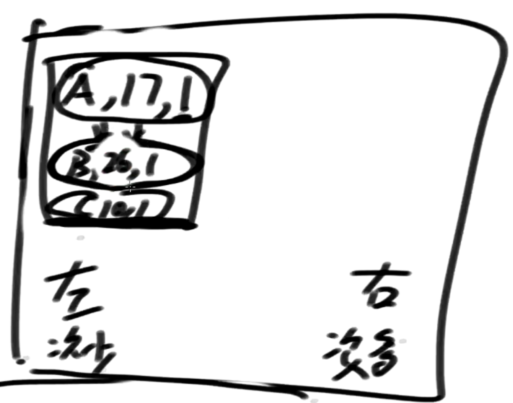 | 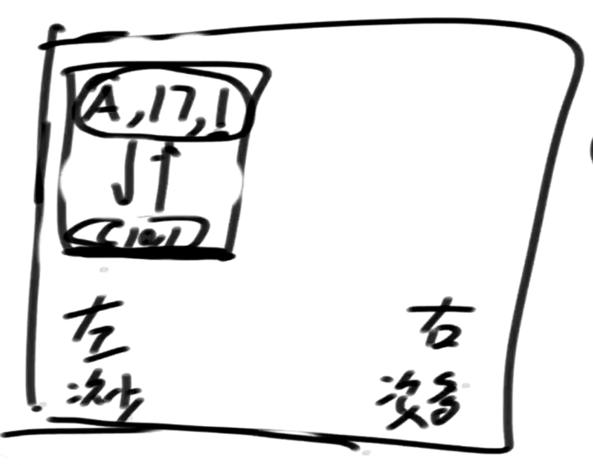 | 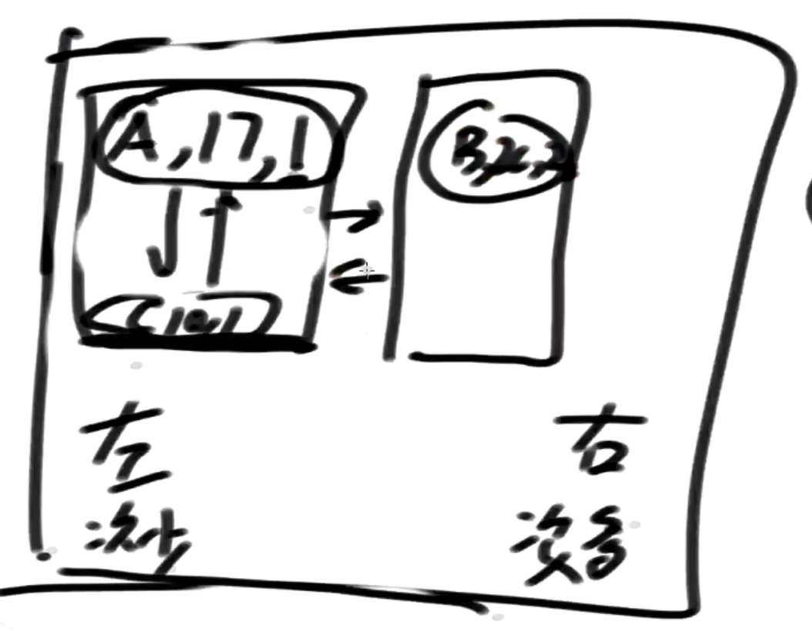 |
| ------------------------------------------------------------ | ------------------------------------------------------------ | ------------------------------------------------------------ |

更魔幻的事情到来了，我又get了一遍B，我肯定可以拿到它的值，因为map 1能够告诉我它node在哪。然后这个时候，B这个结点的频度变为3了，不再属于2这个桶了，继续把自己从原本的桶分离出来，然后看看下面有没有桶，没有桶，新建，把（B，26，3）放进去。

而且这个桶空了，你要把它删掉，桶与桶之间前后环境重连。

为什么要删掉桶？因为如果你留着空桶的话会有问题。它可能会造成空间的浪费。如果我就是对一个key做了100万次操作，你这个程序会不会内存泄露。如果真的这时候C，get了一下，你从原本的一号桶分离出来，然后看看下一个桶有没有，有的话是不是装2频度的桶，如果不是你就临时新建一个。

| 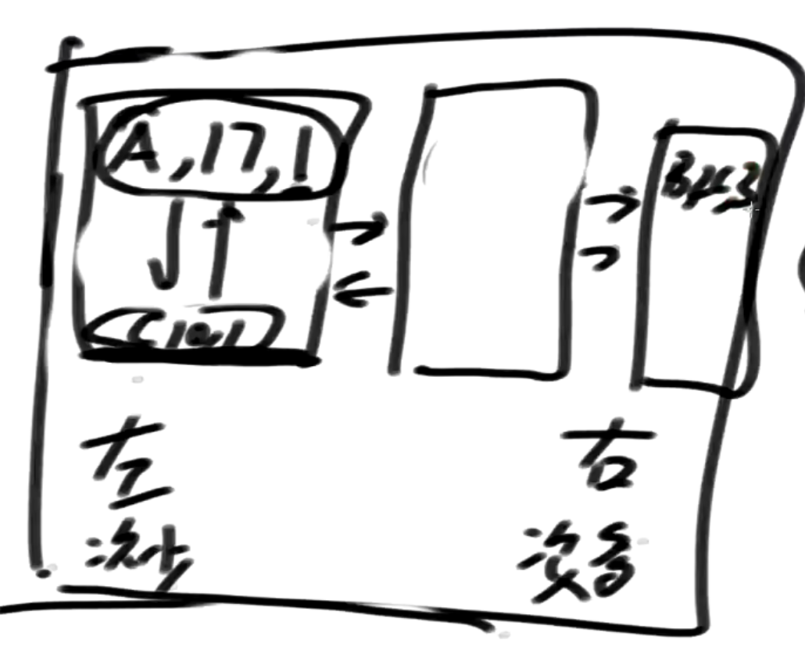 | 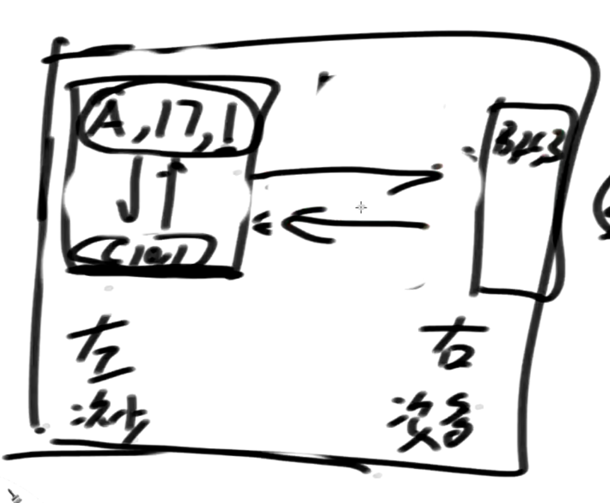 | 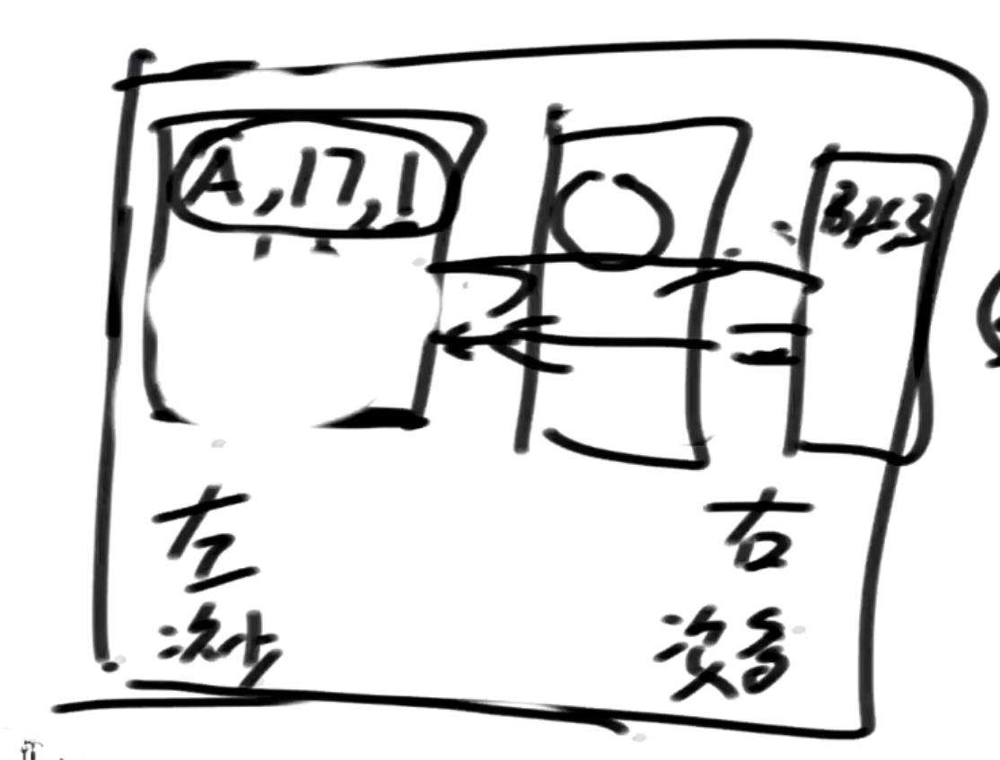 |
| ------------------------------------------------------------ | ------------------------------------------------------------ | ------------------------------------------------------------ |

为啥需要桶呢？替换的时候，直接找到最左边的桶，把最上面的记录扔了就行了，这里删头部因为默认我们来了一个新节点是尾插到桶里面的，如果你来一个新节点是头插到桶里，那么就删除的时候就删尾部。为什么要用二维桶？为了当一个结点的频度变的时候方便的更新它的频度，并且移动到另一个位置（下一个桶中）。

所有结构之间，每动一点，想清楚怎么配合？这是这道题的难点，它算法并不难。但是变化情况很多，想清楚怎么去配合。临时建立桶、临时销毁桶、桶的头变了、要替换元素的头变了、要替换元素的尾变了、要替换元素不在桶里面、已经没元素了怎么办？这个coding难度决定这道题很难。


### Interview Coding 18

训练营5，第2节

### 距离为i的城市有几座

code1：

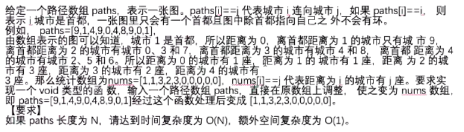

这题纯是coding！难点在于

array只会有一个首都，而且我告诉你的数据一定能够串成一棵树，我在输入的时候就可以保证这一点。所以一个数组就可以对应成一张图，唯一的首都，而且每一个点往上串，最后都能串到首都。答案就是让你统计一个每一层的结点数。res[i]表示到首都距离为i的城市有几座

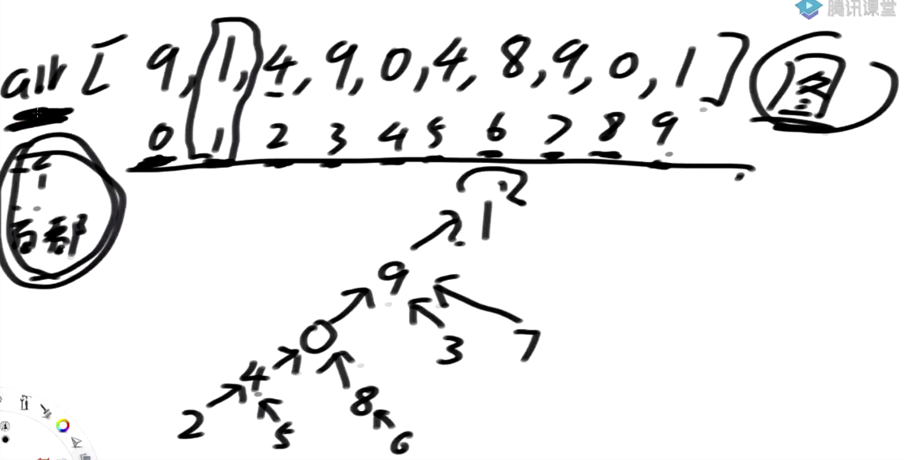

这道题，没有什么难度的，这道题你把图建出来，宽度优先，遍历一下就解决了。但是难在它要你用有限几个变量，在原本的这个图数组中自己更新出答案。

我们先别想这么可以直接变就变出答案了，我们看看怎么先有一个过渡的过程。我们想能不能先把arr变成这样一种含义，0到首都的真实距离是2，但是我们要把它变成-2的形式，arr[i]含义为i到首都的距离，用负数的形式来表达。我们来看看这个arr能不能由题目的arr自主更新得到，再来看能不能变成到首都距离有几座这样的res的含义。

我们是用下标循环怼的方式得到中间的这个状态。假设我们从零出发。我们用两个变量就够了。第一个变量叫next，接下来要去的地方。第二个变量叫lase，我上一回从哪儿来的。你现在从0出发，你完全知道下面要去9，next就设置为9，我即将要蹦到九位置上去了，但是还没蹦呢，我知道我一旦蹦到九位置上去。我是从哪来的？我是从零位置来的。然后我们跳到9上，我又知道要去1了，所以next设置为1，然后我把last填到9的位置上去。填完之后，把last改为当前位置下标9，接着我们就通过next记录来到1了，来到一位置，我发现是首都，它是首都，我就开始往回蹦，提供往回蹦的机制就是这个last。

| 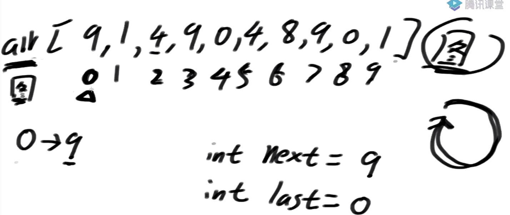 | 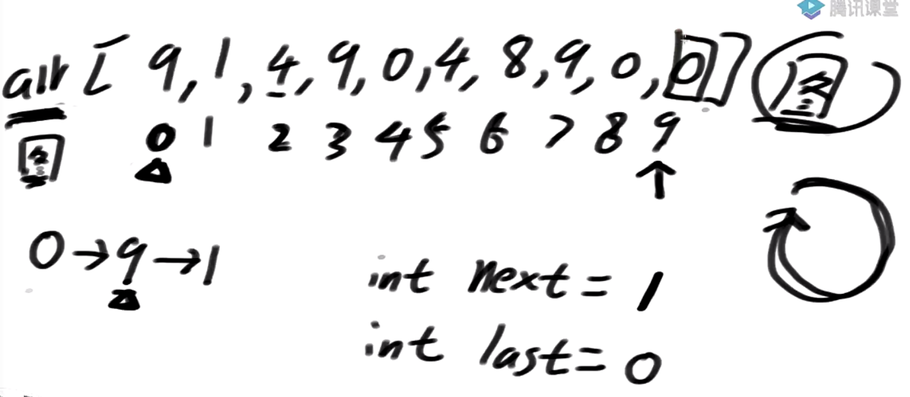 | 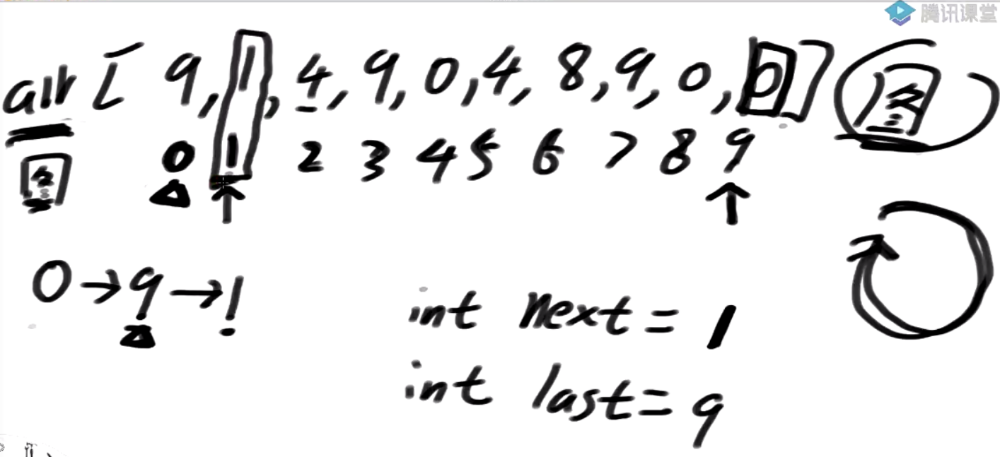 |
| ------------------------------------------------------------ | ------------------------------------------------------------ | ------------------------------------------------------------ |

所以我们现在往回蹦，所以我们在1位置，通过last值，蹦回了9。来到9位置怎么继续往回蹦，这就用到我们刚刚把9位置的值改成了之前的last，这样就可以一直往回蹦。所以现在我们来到了9位置，知道我们下一步去0位置，所以我们把next改为0，并且把9位置的值改为-1，这个-1代表我们现在到首都的距离是1，但是我使用负数的形式表达的。接下来我可以来到零位置。而且我如果用再单用一个变量init表示我是从0位置开始跳的，我就知道我到零位置可以不用再往前蹦了，我把这上面的值改成负二，代表到首都的距离是2了。我在用正负性这件事情表示，这个点是新含义还是老含义。

不一定每次都蹦到首都，可能中途蹦到扭转过含义的结点，就一路返回改含义即可。图三。最终，你把整个数组都改对。那么，只有首都是没有动过的，那最后你再把首都自己的位置改成它到自己的距离是零。

| 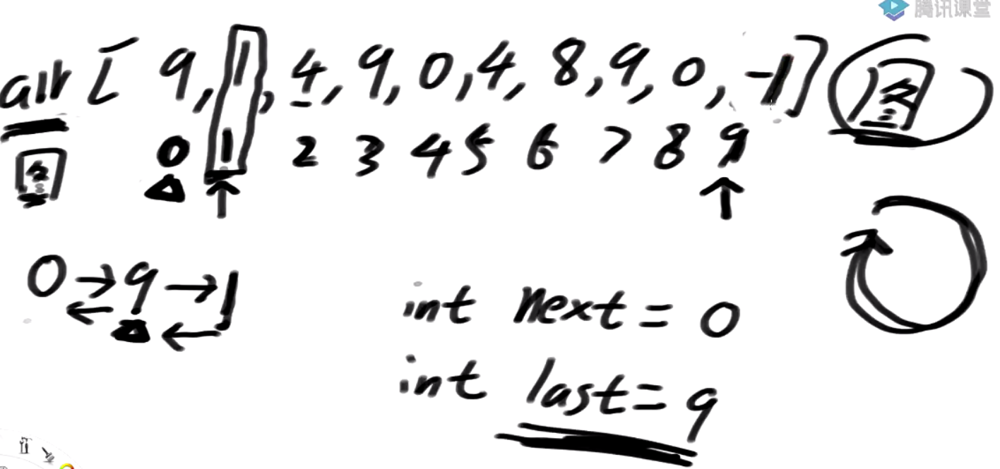 | 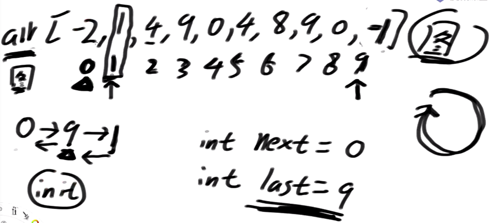 | 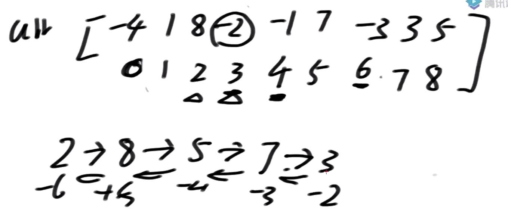 |
| ------------------------------------------------------------ | ------------------------------------------------------------ | ------------------------------------------------------------ |

接下来的任务就是把上面那个中间过程的含义变成到首都距离为i的有几座这种含义。现在上面是负数，代表是老含义，如果不是负数，代表是统计含义，也就是res要的含义。一开始从0出发，init还是0，如果0位置是负数，就先把0位置的值变成统计学含义的0，因为上面的值我用完就没用了，我发现0位置上面的老值是-2，代表我找到了一座城到首都距离是2，那么就把2位置的值改成1，代表我现在找到了一座城到首都距离是2，但是你把原来的老值踢掉之前，要存一下，方便下次到对应的距离下标循环怼，所以这里把2位置改为1了。老值拿出来-2，发现到首都距离为2的城又发现一座，一看2下标位置是正数了，所以是统计学含义，直接++即可。

在这整个过程中到首都的位置就认为结束，所以最后0位置需要我们手动去修改，为什么可以手动改，因为我们明确知道到首都距离为0的只有首都自己。

| 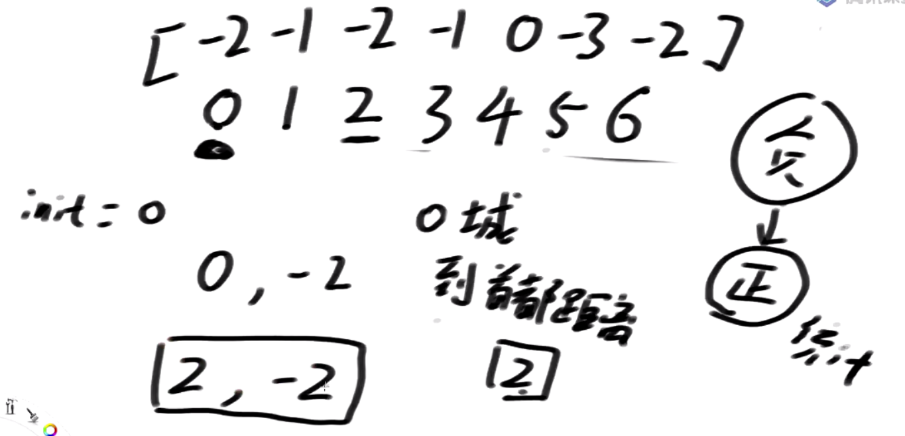 | 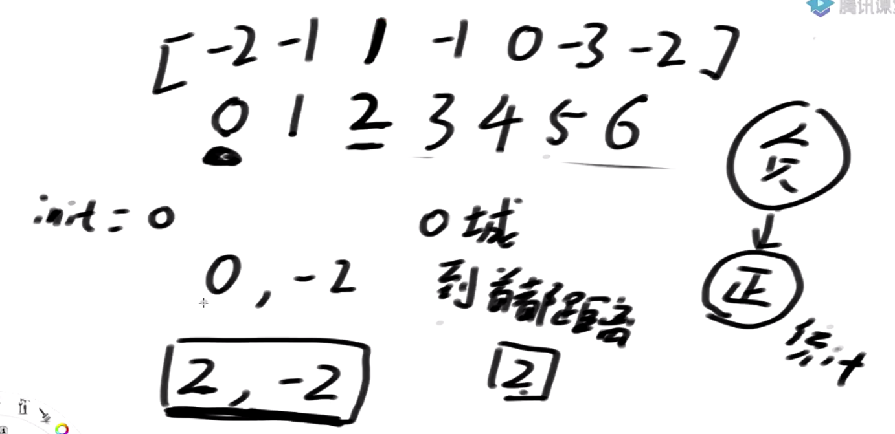 | 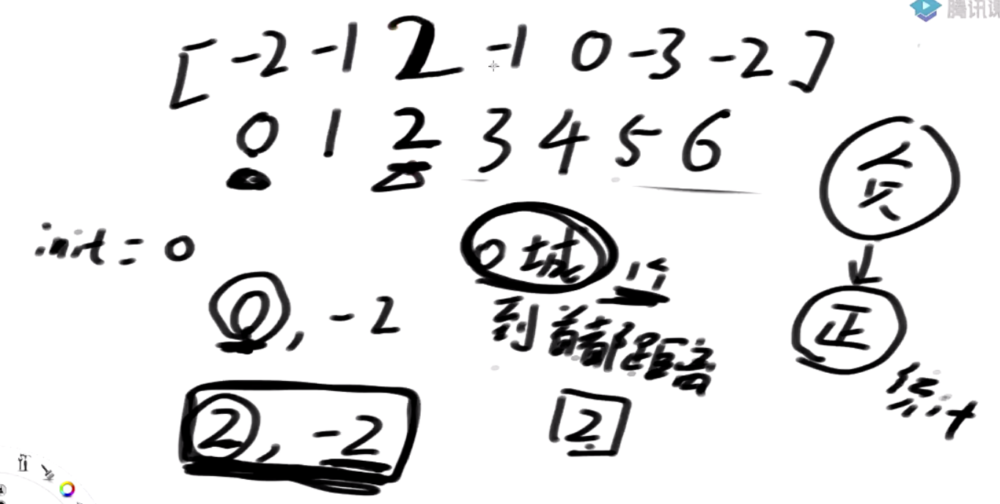 |
| ------------------------------------------------------------ | ------------------------------------------------------------ | ------------------------------------------------------------ |


### 分糖果

code2：

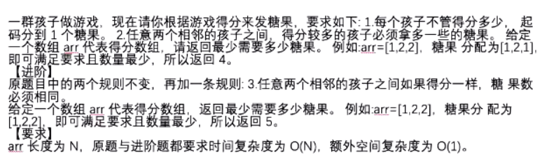

它规则是这样的，每一个小朋友必须至少得一块糖。第一个规则也就说你这个数组中不可能有某个位置等于零。第二规则，这孩子他会攀比。如果有两个相邻的小孩子，相邻孩子如果得分一样，你给它怎么分糖是无所谓的，多了少了都不会闹。但是相邻孩子如果，比如说甲这个分数明显大于乙，但是如果你给甲的糖块数不如乙多，那么甲这个孩子会闹。你为了让所有孩子都不闹，请问你至少要怎么去生成这个数组而且要保证总糖块数最少。这就是我们初始的设定，进阶的设定就是多了规则三，相等得分的孩子一定要得相等的糖。

这个题很简单，它其实是个贪心，比较好猜。举个特殊例子，这个数组是相邻孩子得分不一样，怎么决定？把变化趋势列出来，顶峰的几个点，看看左右两边哪边下的点多，按照坡度大的算，例如数组的得分为6的孩子，左边两个孩子，右边1个孩子，那么就给得分为6的孩子3块糖就行。

更简单的来了。先来一个left，从左往右遍历，第一个孩子要1，第二个孩子不必左边的孩子大，我就要一个1。如果比左边的孩子大，就比它多分一块糖，当前的数只要比左侧数大，那么就等于左侧的数+1。当前数如果不比左侧的数大回到1。再来一个right数组，从右往左遍历，当前的数只要比右侧数大，那么就等于右侧的数+1。当前数如果不比右侧的数大回到1。总体怎么分糖果，res[i]=max{left[i],right[i]}。

进阶就是相等孩子一定要拿同样多的糖。还是left，但是只不过在相等的时候维持和左侧相等就行了。right也求出来。res求法和上面一样

| 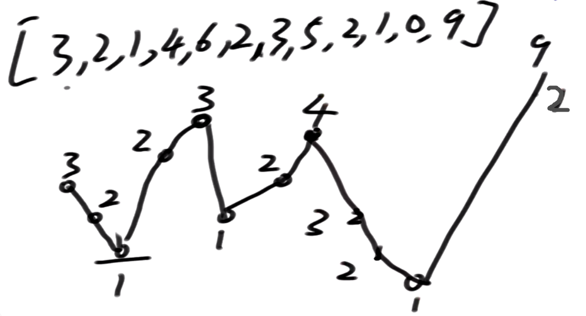 | 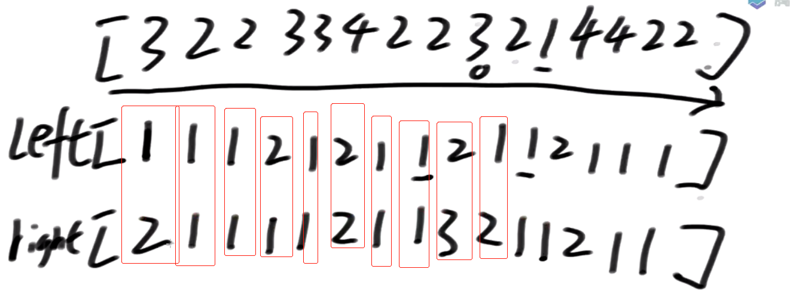 | 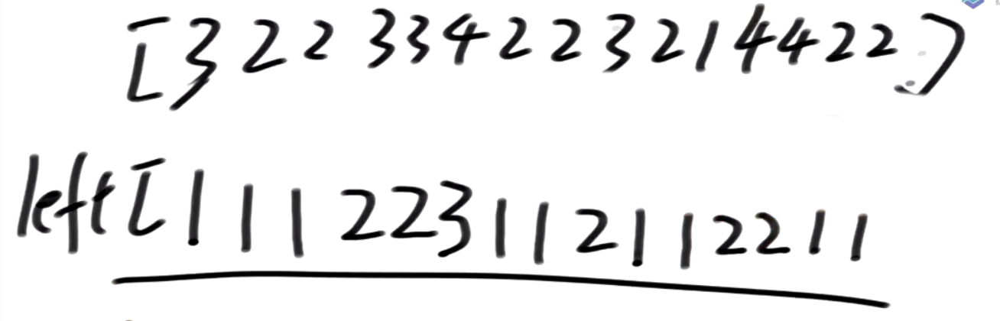 |
| ------------------------------------------------------------ | ------------------------------------------------------------ | ------------------------------------------------------------ |

怎么想到的？其实就是一个爬坡的问题，你开始先想到爬坡这个解，然后想办法用怎么样用优雅的coding来实现，结果发现这么简单，就就两个辅助数组搞定了。这题也可以不用辅助数组，但是就需要你自己去维持上坡下坡的逻辑，很考验coding，发现拐点这件事情全靠coding手撸出来。


### 二叉树放置相机全覆盖

code3：

- 给定一棵二叉树的头节点head，如果在某一个节点x上放置相机，那么x的父节点、x的所 有子节点以及x都可以被覆盖。返回如果要把所有数都覆盖，至少需要多少个相机。

这个题用到二叉树的递归套路，而且它好用到什么程度？你想不出他最牛逼的那个贪心的解。你这道题时间复杂度也能做到跟那个最优的解时间复杂度一样。你如果不想去做贪心，这道题你依然可以线性复杂度解掉。

放置一个相机在x结点，如果x结点有父亲，有左右孩子，那么最多就覆盖4个结点。x的兄弟结点是覆盖不到的。但是麻烦的地方在，一个相机能影响自己，也能影响子，也能影响父。

当我们想在以x为头整棵树上求最少几个相机才能全覆盖，自然而然就想到递归定义为以x为头的时候整棵树至少放几个相机。那我发现如果只定义成这一个信息可能性，它够不够列？这样你会发现你的左右孩子给你的信息只有左右孩子分别覆盖完了整棵子树的答案，换句话说，左右孩子给你的这一条唯一的信息意味着左右孩子已经被覆盖了。但是这题我们在x结点讨论的时候，我们应该是可以在左右孩子放相机的，既然x可以往左右孩子放相机，那么就需要知道左孩子在头结点没有被覆盖的情况下其它结点都覆盖了的最少相机。所以这样可能性你列不出来。因为对x来说，它需要知道的是，我左孩子没覆盖的情况下，剩下节点都被覆盖了，和我右孩子没被覆盖的情况下，剩下节点都被覆盖了，最少需要几个相机。那你需要这个信息，你补一个不就完了吗。

来到一个x结点，它可能有三种状态，x放了相机，x没放相机但是被覆盖了，x没被覆盖。既然是哪个可能性，我们就设置三个信息

1. x位置放相机并且它下面的结点全部被覆盖了最少需要几个相机。
2. x位置不放相机，但是x已经被覆盖了，并且下面的结点也都被覆盖了，最少需要几个相机
3. x位置没有被覆盖，并且下面的结点也都被覆盖了，最少需要几个相机

我的递归一定要返回这三个值。需要强调一点的是，为什么每一个答案都强调它底下的节点一定要被覆盖？因为它底下节点如果不覆盖的话，你往上返回，你是补救不了的，因为上面的结点管不了下面。就是说我只希望让我的子函数给我在我这一层能解决的，你子函数把你自己的问题先解决好，你返回一定要给我返回好好的。

base case就是为空的时候，为空的时候肯定认为是被覆盖了，因为这个问题根本就不管空，我们就认为空节点一定是已经被覆盖的。空节点返回上面的三个信息怎么组织，由于null天然被覆盖，并且你不可能在上面放相机，所以1和3信息都为空，只有2信息返回一个0，代表我天然被覆盖了，并且我下面放0个相机就全覆盖。

如何加工出自己的信息？如果x自己没有被覆盖，那么左右孩子肯定不能放相机，并且左右孩子必须要被覆盖了，所以用左右孩子的2信息加工出自己的3信息。如果x被覆盖，但是x上没有相机，那么就通过左右孩子的1信息也就是有相机的情况（3种，左右都有、只有左有、只有右有），求出一个min，就是自己的2信息。自己的1信息，也就是x放了相机了，你左右孩子无所谓了，你用左右孩子的123信息来求出一个最小。

来看最优解。最优解它是基于一种假设。我们刚才说以x为头的情况下三种情况的答案我都要，这是我们刚才不贪心的那个解。你为什么要都返回呢？因为你不确定你的父亲需要哪个。我并不知道我父亲对什么答案感兴趣，我都给他。最优解基于一种假设，就是我明确知道我的父亲只要一种答案的解。举个例子，假设这个节点左孩子是空，右边不清楚。这个空结点知不知道自己的父亲需要什么答案？明确知道，因为它只有一种答案。这种答案叫我没有办法放相机。我也没有办法，不被覆盖。这已经不是说我知不知道我父亲需要哪个答案的问题了，是我只能给他一个答案。这个情况比较简单。那我们再举个例子，这种情况x也知道父亲需要上面，我只能x这里放一个，因为我这里不放我父亲补救不了。所以我肯定会给我的父亲一个答案。我上面既放了相机，又被覆盖。那这只是一些很片段化的东西。那你推成一个普遍状况下，x可能身处于各种各样的情况，是不是每一次他都能够知道自己父亲一定需要自己的一个唯一解呢？这就是我们这个假设。如果这个假设成立的话，我就不用把三种情况的解都给我的父亲了。

那么我就不需要返回我之前三种状态时候的所有最小数量给父亲，我只需要返回其中一种状态时候的相机数量给父亲即可。我就把我的返回值定成只有一种情况下的最优解

| 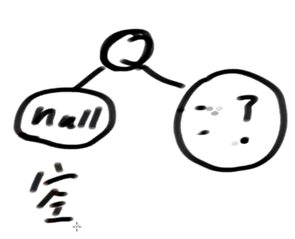 | 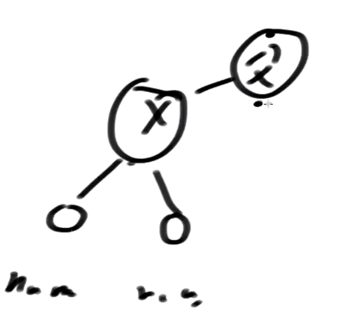 |
| ------------------------------------------------------------ | ------------------------------------------------------------ |

现在从左右孩子获得信息。列举如下可能性

1. 如果得知左右孩子中有其中一个没有被覆盖，那么x一定要放相机，别无选择然后给父亲返回。
2. 如果左右孩子中都被覆盖了并且其中一个还放了相机，那么我这里就贪心了，我明知道x这个点已经被覆盖了，我可以放相机，也可以不放相机。但是我这里只给父亲返回了我不放相机的状态，因为我明知道在我这里放相机肯定没有在父亲上放相机好，所以我把选择权交给父亲了，这里做了一个贪心。
3. 如果得知左右孩子都被覆盖了，并且都没有放相机，那么x这个点我不放相机，我交给我的父亲去决定，因为我x这个点放相机一定没有父亲放相机的收益高。

可能性列举完毕，我发现我只给我的父亲返回一个类型的信息就够了。我怎么把我的返回值优化成这个样子的？是在所有情况下我都明确的知道我的父亲，只要我一种答案。这个其实很难想的。


### 长度为k的三子数组最大和

code4：

- 给定一个数组arr，给定一个正数k。选出3个不重叠的子数组，每个子数组长度都是k，返回最大的三子数组的最大和。

假设我只让你求子数组哪一个累加和是最大的。我能不能建立这么一些记录，dp2[i]表示arr[0...i]所有子数组中累加和最大的是多少，不要求你以i结尾。求dp2怎么求？如果不以i结尾，那么dp2[i]=dp2[i-1]。如果以i结尾，根据下面的dp1的含义，如果dp1[i]的含义为：必须以arr[i]结尾的情况下，子数组的累加和最大是多少。第一种情况，只包含arr[i]。第二种情况，可以往前推，那么arr[i]+dp1[i-1]。

真的有必要用dp1的含义帮助怼出dp2吗？我们之前谈到过一个算法原型，一个数组中求最大累加和是多少？只需要有限几个变量就能搞定，在那个过程中，走到每一步，max的值天然的含义就是0~i上子数组累加和必须是多少。甭管你用什么办法，我们现在就有了一个结论了，有一个记录了，我们的dp2[i]我就可以认为是arr[0 ... i]范围上的子数组最大累加和。你反过来再来一遍，dp3[i]代表i~N-1这个范围上子数组的最大累加和。有了dp2和dp3了。

现在再来一个dp4，dp4[i]代表arr[0...i]这个范围上长度必须为k的子数组最大累加和是多少。这样一来，我们来一个dp5，代表的是arr[i...N-1]这个范围上长度必须为k的子数组最大累加和是多少。dp5相当于dp4反。主问题的调度，前面dp4告诉我，后面dp5告诉我，中间那块卡死的直接求。

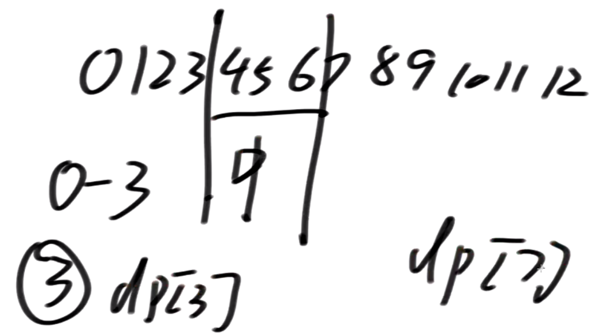

重新梳理，上面相当于是别的题：现在有k的限制。dp[i]告诉你0~i范围上必须是k长度子数组的最大累加和。dp'[i]告诉你i~N-1范围上必须是k长度子数组的最大累加和。你前面枚举，选够k个，然后往后枚举，中间刚好选够k个，推算出dp'需要什么位置。这样就枚举完毕

dp[i]告诉你0~i范围上必须是k长度子数组的最大累加和，这个dp含义怎么求？很简单，如果不以i位置结尾，那么就是dp[i-1]。如果以i结尾，那么就是sum[i-k+1,i]。


### Interview Coding 19

训练营5，第3节

### 牛牛分田地

```
测试到牛客网搜索分田地
```

code1：

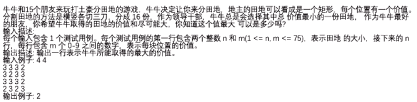

这道题是说一定要横切三刀，竖切三刀，分成16份。不管是哪一种切法的情况下，牛牛这个人一定会选择总价值最小的一份。目标就是让切出来的田地最小值尽量大，让牛牛多拿点。

算法原型：在一个大的长方形中我怎么求出任意一个矩阵的累加和来。遍历太慢，有没有得到一个区域长方形的时间复杂度变为常数阶。

你给我abcd，我快速给你算出来。搞一个辅助结构出来，help[i] [j]代表（0,0）这个点作为矩形左上角、（i，j）做右下角的矩形的累加和。观察help和matrix几个格子的关系，发现左边的和上面了重复算了左上角的，所以`dp[i] [j]=dp[i-1][j]+dp[i][j-1]-dp[i-1][j-1]+matrix[i][j] `。

| 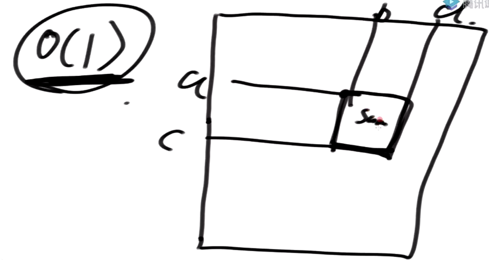 | 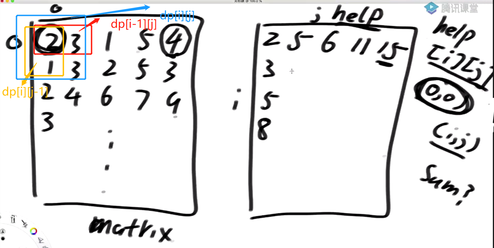 |      |
| ------------------------------------------------------------ | ------------------------------------------------------------ | ---- |

help从左到右从上到下填好。到矩阵里面，给你一个任意的矩形，怎么求？

看图`S=help[i][j]-help[i-1][j]-help[i][j-1]+help[i-1][j-1]`。

| 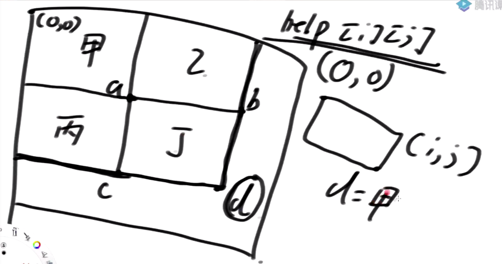 |      |      |
| ------------------------------------------------------------ | ---- | ---- |

再来解决一个底层问题。

假设在一个矩阵中，竖着的三刀已经规定好了，但是你可以决定横着的一刀，如何让切出来的8块中最小值尽量大。把红色的看成一个矩阵，求怎么切一刀让它的最小值尽量大，其实和一个数组切一刀，怎么让左部分累加和与右部分累加和尽量大，是一个问题。无非就是在这个问题中，我要把abcd遍历一下就知道最小值了，efgh遍历一下就知道最小值了。本质是一样的。

接下来我就固定这竖着的三刀。我就问从0~i范围上怎么横着切一刀最好，我把这所有信息记录下来。

| 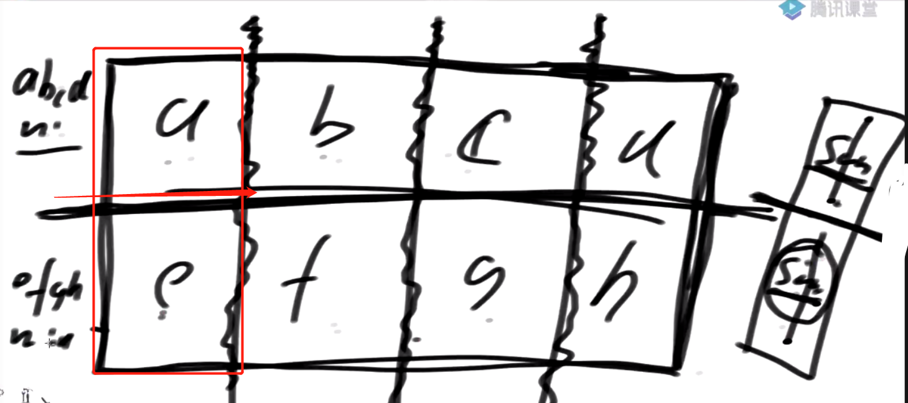 | 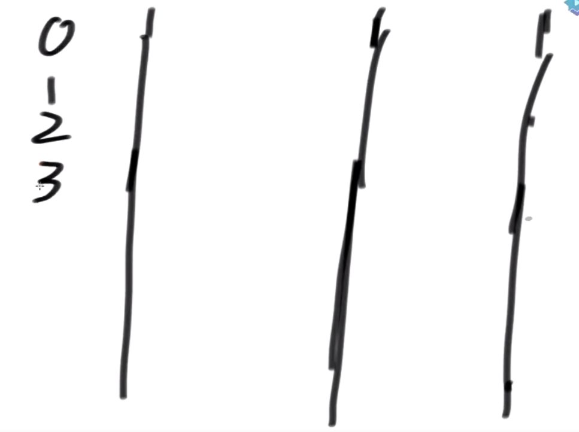 |      |
| ------------------------------------------------------------ | ------------------------------------------------------------ | ---- |

然后我在反着求，把i~N-1怎么横着一刀最好也记录下来。

那么主问题就可以变成枚举中间一刀的位置。上下用我们之前的记录。

| 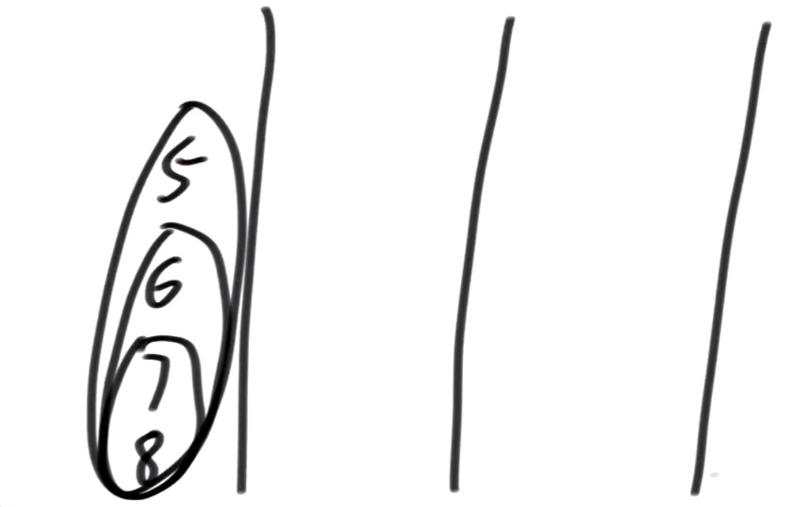 | 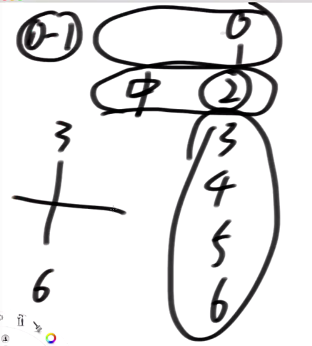 | 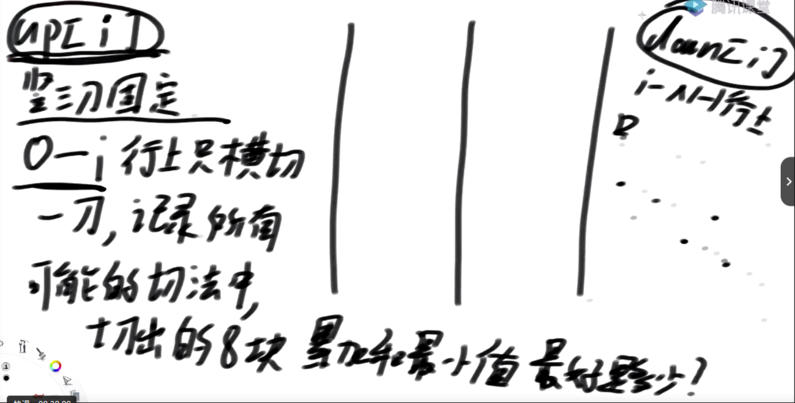 |
| ------------------------------------------------------------ | ------------------------------------------------------------ | ------------------------------------------------------------ |

up数组怎么求？求0~1，只能有一种切法。这种切法下，我已经有一个help数组可以告诉我abcdefgh的值，我只要把他们求一个min出来就行了，这样up[1]就搞定了。

现在问你up[2]怎么求，也就是012行怎么切最好。注意，四边形不等式。如果0~i-1行的最好一刀在k位置，0~i行的时候最好一刀你不用去k之前枚举。这样的话你去求up[1...N-1]这个过程可以是O(N)。

这个s跟范围是有单调性的。范围越大，这四块儿的范围越大，它的最小值只会上升，不会减小。它的它下面块也是范围越大，它最小值只会上升，不会减小时又是一个差外面套好这个问题，存在区间划分不用回退的情况。

| 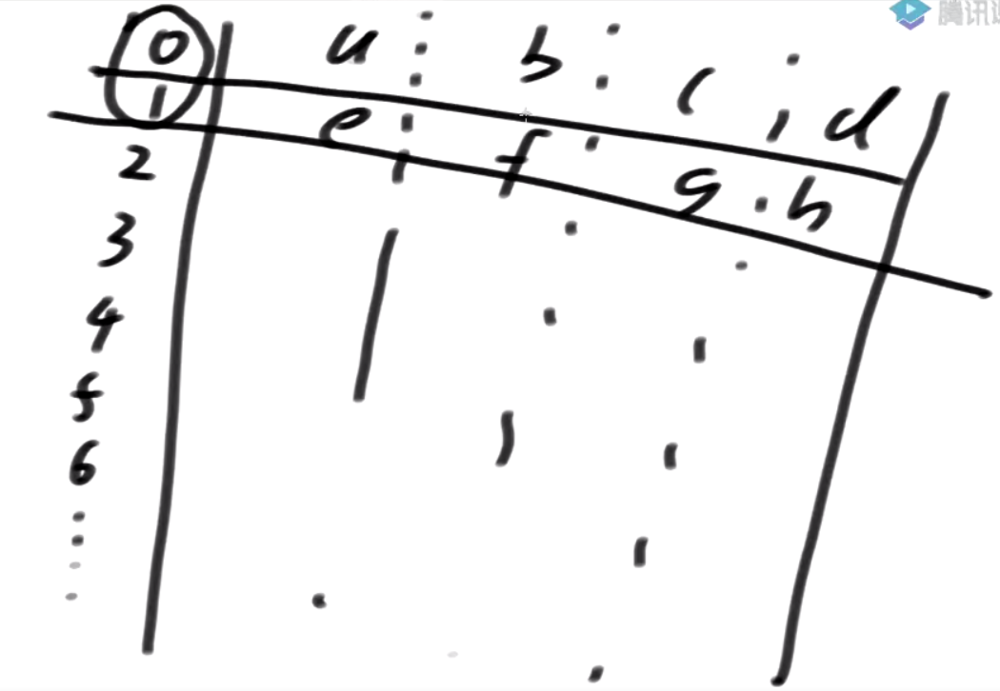 | 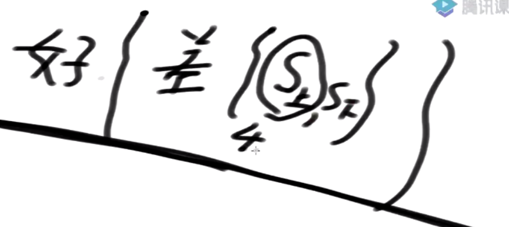 |      |
| ------------------------------------------------------------ | ------------------------------------------------------------ | ---- |

这道题我们整体过程我们来梳理一下。首先，我们要求出一个结构help，任何子矩阵的累加和O(1)能得到。这样的话，我们在每一次切一刀的时候，提取出一行的四块来就很快了。把这个问题搞定之后，我们去枚举所有可能的竖三刀，暴力三个for循环去枚举所有可能竖三刀。在三层for里面就等于说竖三刀已经固定了，接下来我们先去求up数组，再去求down数组，都是O(N)的。然后再去枚举中间一刀，上面的东西就可以在up里面拿了，下面的东西也可以在down里面拿了。整体三层for里面是一O(N)的过程。如果整个矩阵是n×n的矩阵的话，这个做法O(N^4)，无法优化了，这就是最优解。

- 思路和长度为k的三个子数组的最大和差不多，在那题中我们求三个子数组最大累加和也不是一口气求出来的，而是先搞定0~i最大的子数组累加和、以及i~N-1最大的子数组累加和，有了前面两个的基础，我们再来手动列举中间的可能性，求出三个时的最大是多少。这题也是一样，我们不能一口吃掉，我们先固定竖着的三刀，然后利用和那题一样的思想，先求出0~i范围上怎么切最好，然后再去求i~N-1范围上怎么切最好，最后手动罗列最后一刀的可能性，逐步把问题拆解。


### 炮弹打天花板

```
https://leetcode.cn/problems/bricks-falling-when-hit/
```

code2：

返回每一发炮弹能打落多少的砖块，炮打打上去的那个砖块认为直接碎掉，不会掉落

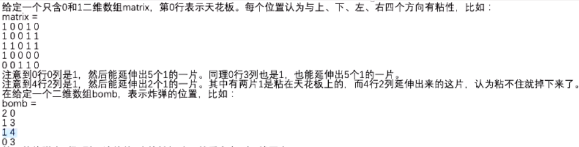

2,0打完之后下面的和右边的砖块就不稳定了，没有1连接，就会掉下来。接着1,3的炮弹，下面的三个1会掉落，不稳定了，一个格子只和上下左右四个发现格子相粘，斜线方向是没有粘度的，所以会掉落三个。下一发炮打在1,4位置，打空了，因为第三发炮弹让这个位置的砖块掉落了，所以掉落0个砖块。最后炮弹打在0,3，就只是它自己碎了，没有砖块掉落。所以返回[2,3,0,0]

| 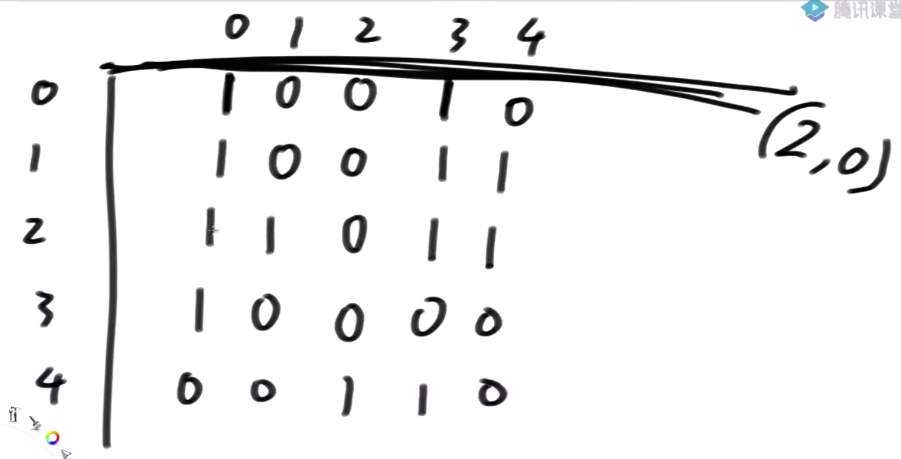 | 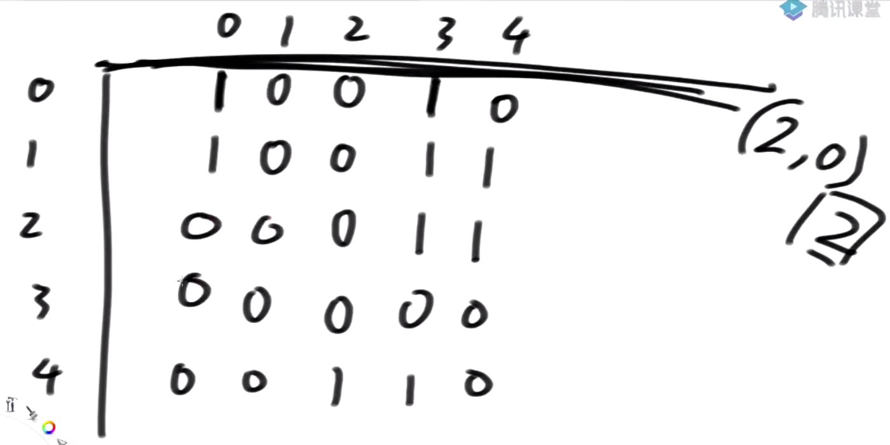 | 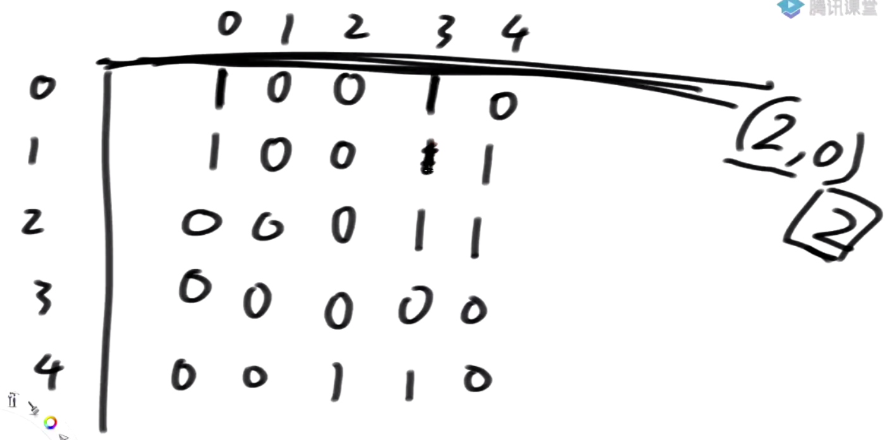 |
| ------------------------------------------------------------ | ------------------------------------------------------------ | ------------------------------------------------------------ |
| 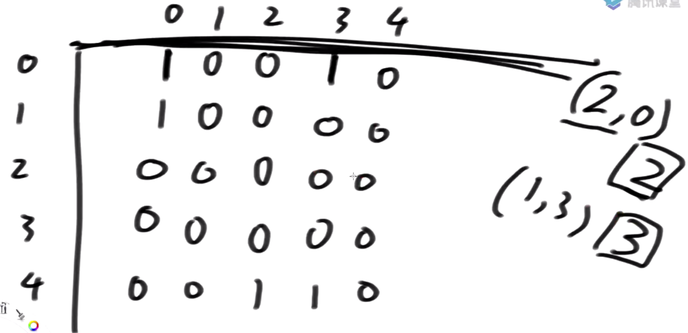 | 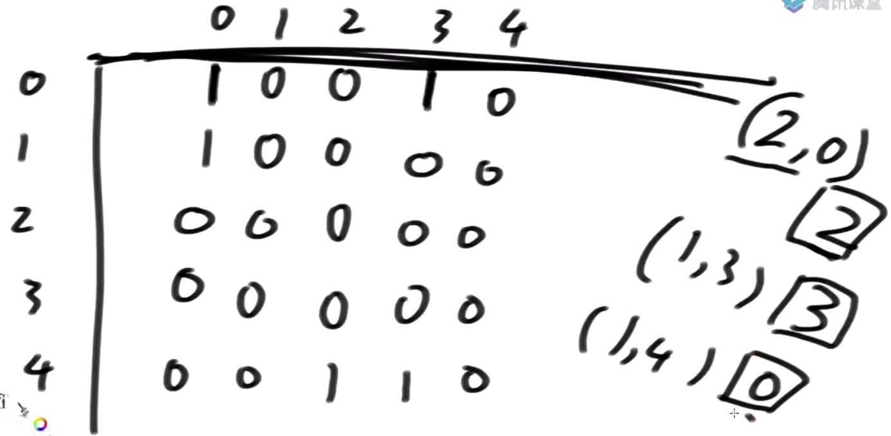 | 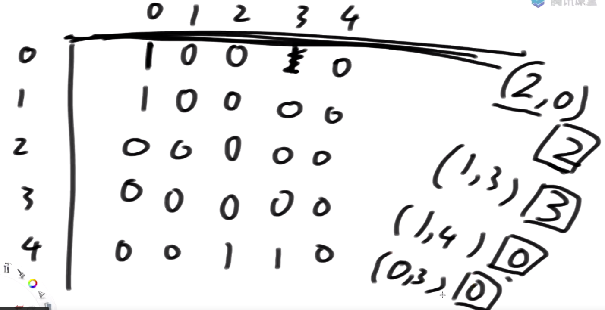 |

我想用什么样的一种方式来评估炮弹打完之后砖块会掉落这件事情。我们先把炮弹的影响给它加上。比如说我一开始第一个炮弹是打在（2,0）位置，我把这个位置变成二。炮弹打的位置上如果真的有一，请你把一变成二。炮弹位置上如果是0，就维持0。

接下来，假设2是分割点，我们看一下此时接到天花板上一的数量，就两，所以指标是2。求解的过程中，我们从炮弹最晚发生的，逆着回去求。先到（0,3）去看一眼，发现它是2，所以你把它变成1，此时再看一下，接到天花板的数量变成3了，但是这个三是你自己打碎了，指标只加了1，这个1是你自己打碎了，所以掉落了0块砖。

| 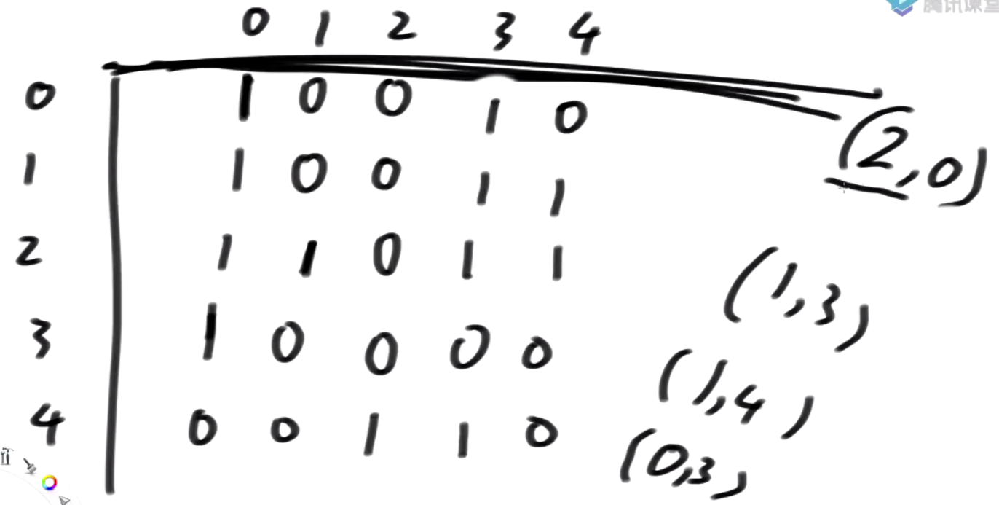 | 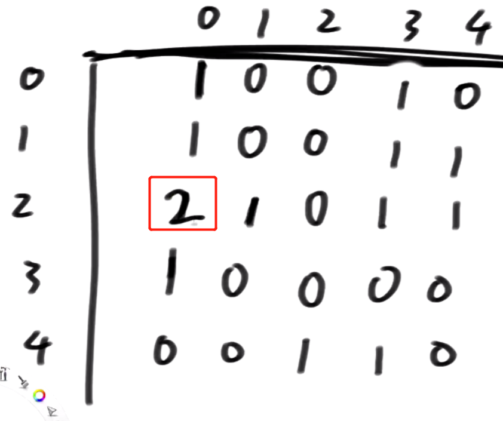 | 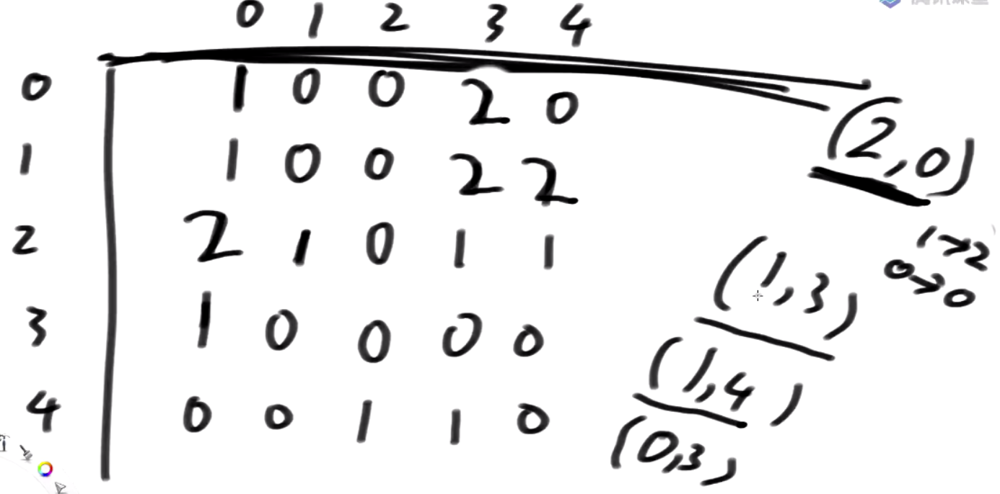 |
| ------------------------------------------------------------ | ------------------------------------------------------------ | ------------------------------------------------------------ |
|  | 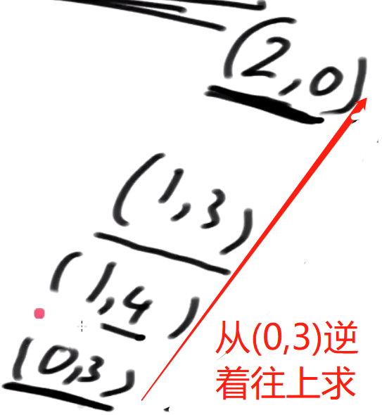 |  |

为什么我要把零三最后处理，得到答案才是对的？这两个二要先影响的情况下，你再看你能掉落几个砖块。你现在就等于说因为有二的存在的位置相当于之前的炮弹是已经影响过的。我们从后面的炮弹往前面的炮弹去枚举的原因是我必须考虑前面影响的情况下我能够让天花板上加几个1。

然后继续玩，看（1,4）这个炮弹，我看一眼（1,4）这个位置，发现是2，那么说明之前是1，把2还原成1。再看指标，连在天花板1的数量还是3。说明接到天花板上数量的依旧没有变过，答案零。

再看（1，3），把2还原，指标变为7。多了4个1，你自己碎一个，所以掉了3个。

再看（2,0），还原，指标变为10，多了3个1，自己碎一个，所以掉了2个。

如果还原你之后。跟还原你之前接到天花板上的一的数量是不变的，那你答案也是零。如果加完你之后跟加完你之前只相差一，那你答案也是零。

| 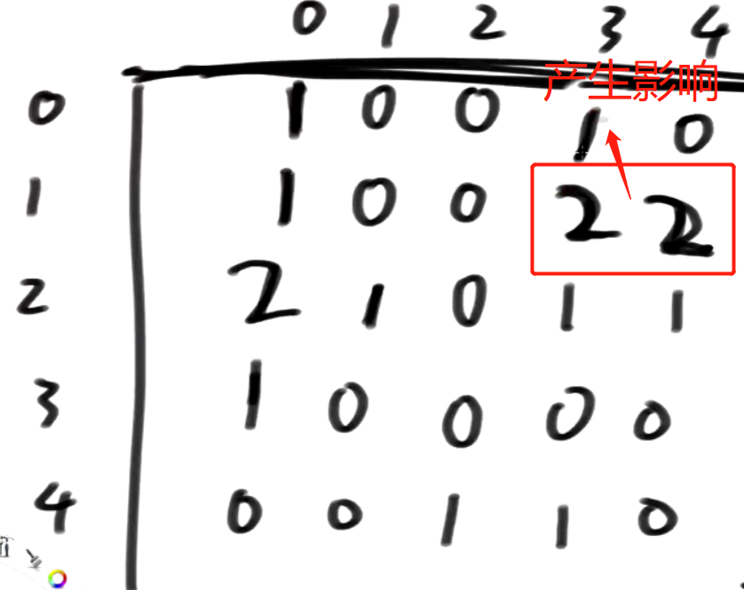 | 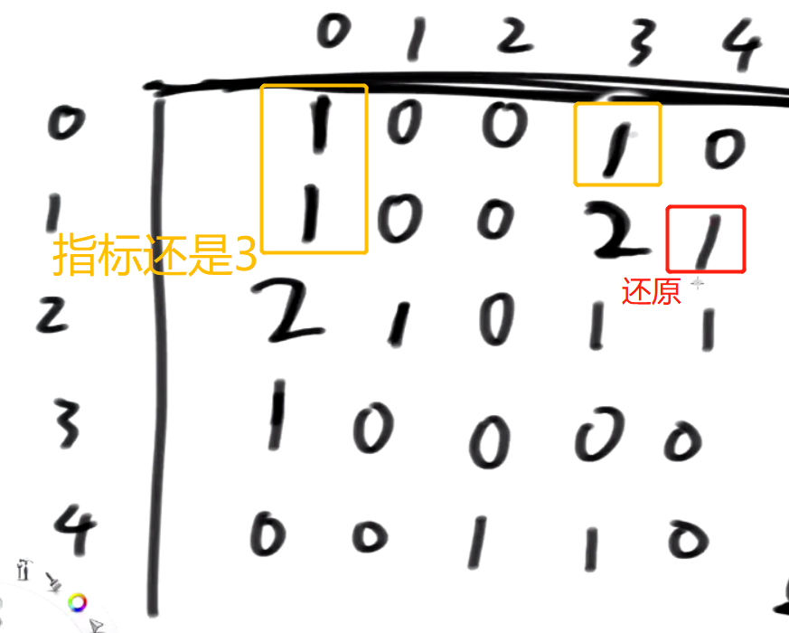 | 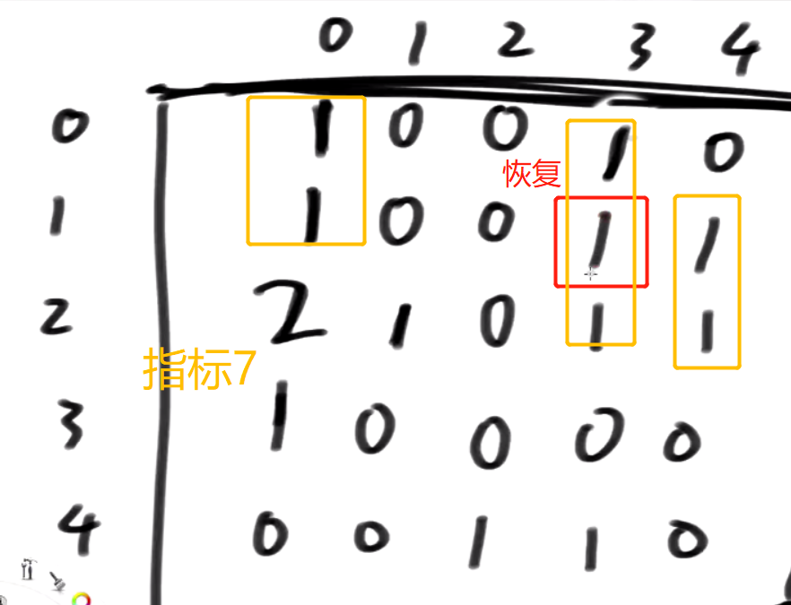 |
| ------------------------------------------------------------ | ------------------------------------------------------------ | ------------------------------------------------------------ |
| 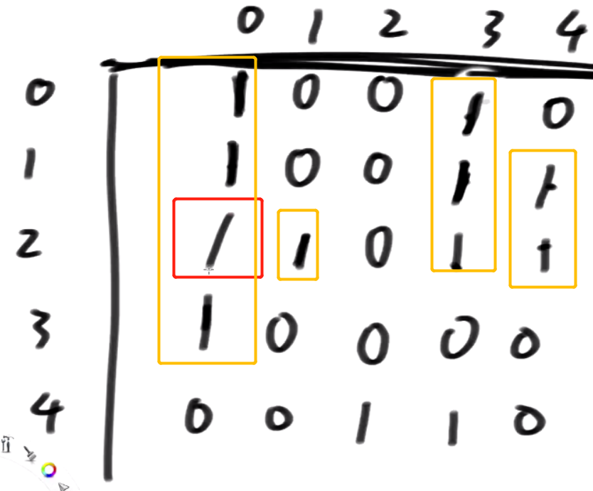 |                                                              |                                                              |

那么你知道是用并查集。但是具体怎么用并查集呢？你没用并查集之前也和上面的流程一样，先变2。然后你把里面每一个1认为是单独一个集合，并且一个集合上面要多加一个属性，他有没有连在天花板上。然后你再把每一个1上下左右给我去连，所以这这两个一就会合成一个集合，它共同是接在天花板上的。其它1也是该合的合，接在天花板为红框，没有接在天花板的为黄框。

接下来（0,3）出现了，把2还原为1，建出这个集合，它是连在天花板上的。我们的并查集还得给我们连到天花板上的1的数量，这时候并查集告诉我连在天花板上的有三个。

然后（1,4），还原为1，把小集合建出来，然后和下面的就连在一起了，三个1连成一片了，但是这个集合没有接在天花板上。

（1,3）来了，还原为1之后把小集合建出来，然后上下左右相连，所以这5个1连在一起了，此时由于有其中一个集合是在天花板上的，所以总的合完之后是连在天花板上的。这时候并查集告诉我连在天花板上1的数量为7，7-3-1=3。

（2,0），还原为1，建出小集合，然后相连，这5个就连在一起了，并且合成的集合是连在天花板上的。

所以并查集的用法，大体逻辑如下。

|  | 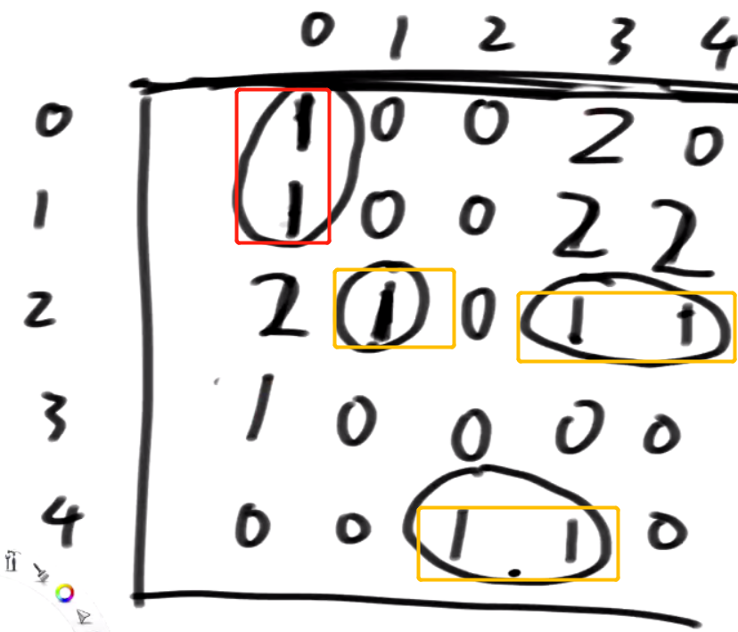 | 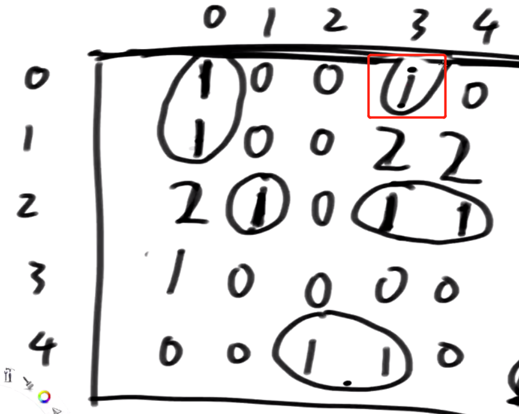 |
| ------------------------------------------------------------ | ------------------------------------------------------------ | ------------------------------------------------------------ |
| 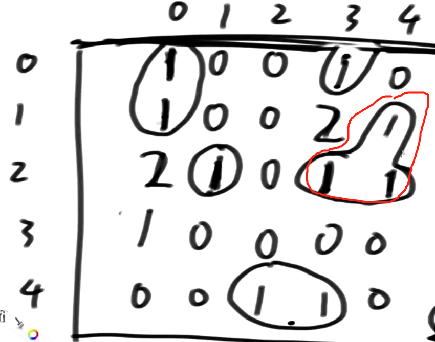 | 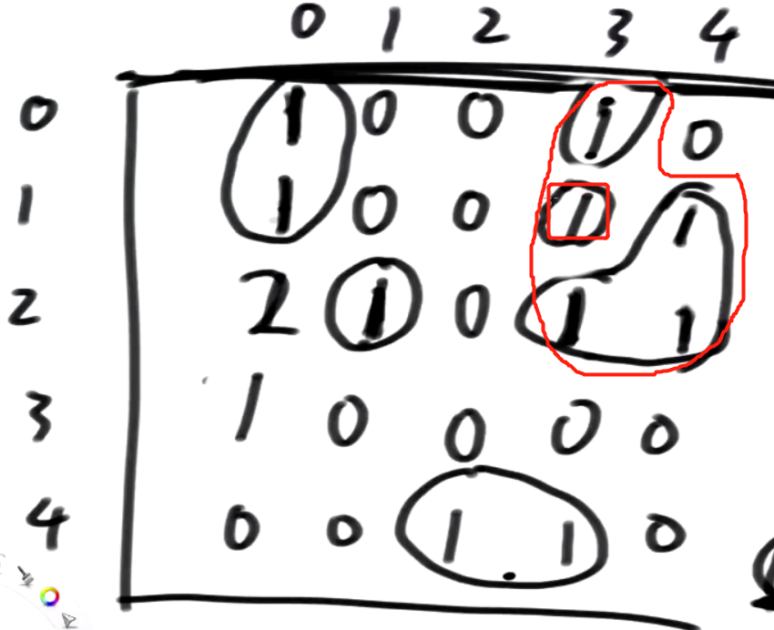 | 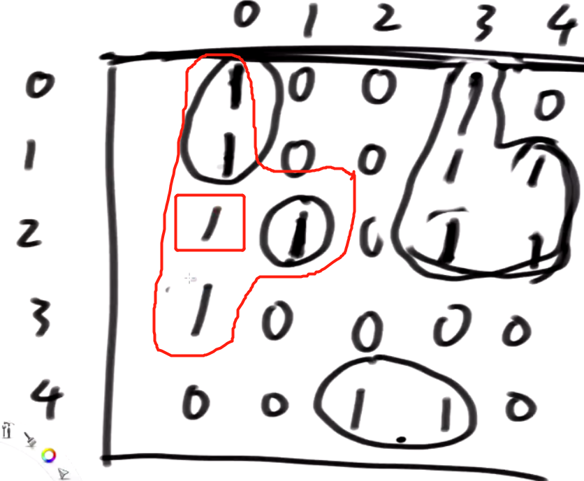 |

这里面有两个新操作。我们这里要加一个其他属性确定集合是否是连在天花板上。这个并查集结构还得告诉我们此时接到天花板上一共有多少个一？这件事如果把这两个事玩的好好的，这个问题就解了。

这题难点在于建模。并且要想到你要逆着去还原，还要先把这个matrix先处理一下。逆着还原是因为前面会对后面产生影响，那么我就从后面开始，既然是从后面开始，那么你就对matrix处理一下，先把前面的影响反应在matrix上，这个反应就是打过的地方1变成2。接着就是并查集去加信息。

- 技巧：如果前面的对后面的有影响，看看能不能倒着求。


### 等累加集合对

```
https://leetcode.cn/problems/tallest-billboard/
```

code3：

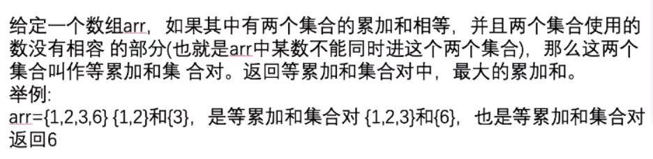

就是拼木棍问题，arr里面就是木棍，你要给我选拼出两根一样长的木棍，材料都是从arr来，arr里面的木棍只能选一次，那么就是等价于上面这个问题，问的就是你能从arr中选材，拼出两根一样长的木棍，最长有多长。

思路，生成一个map，key的含义是数组arr中任意选出两个不重合的集合累加和的差值，例如[1,2]，差值有0,1,2,3。0就是两个集合都是空，1就是1进了一个集合，另外一个集合啥也没有；2就是2进了一个集合，另外一个集合啥也没有；3就是1/2同时进了一个集合，另外一个集合啥也没有。会产生差值为一的集合对有哪些。它value会记录所有会产生这个差值的集合对儿中比较大的那一对的最小值，那么差值为1的这个key，value就对应着（2,1）中的1，（1，空）我是不管的。既然是记录最小值，我又知道差值，所以大的那个就是value+key（差值）。所以（key，value）其实等价于差值为1中基础最好（比较大的）的那一对。

如果我可以把这个map，在我遍历第一个数的时候把它更新对，我遍历第二个数的时候把它更新对，我遍历第三的时候也把它更新对，我来每一个数的时候，我都能够保证这个map它每一个差值都不错过，而且每一个差值最好的那一对我也不错过。那么，我遍历完所有数组的时候，在map中把key等于零的记录拿出来，那就是我要的答案。关键点就在于你怎么更新map。

比如说你一开始的第一个数是二。map搞出两个记录。两个集合都是空，差值是0，最小的那个是0；一个集合是2，另一个为空，差值是2，小的那个是0。假设第二个数字是3，3到来了，你拿出map中的第一条记录，第一条记录代表{空}{空}这两个集合，然后3有两个可能性，一个是进左边，一个是进右边，那么拱出了两个新的差值对{空}{3}、{3}{空}。然后我搞一个map‘出来，把我们拱出来的新差值记录放进去，去重一下{x}{y}、{y}{x}视为一样。接下来把map中（2,0）记录拿出来，这代表{2}{0}这两个集合，拱出来两个新的{5}{0}、{2}{3}，放到map’里面。然后map和map‘去合并，合并的时候key一样，选value大的保留。同样，新供出来的新的要放到map’里面的时候，如果key一样，也是保留大的。

我们为什么要留一个明显不是零的差值？因为我们不知道后面会出什么样的数，又重新拱出一个为零的来。那么这道题其实就是leet code上的最优解了。

| 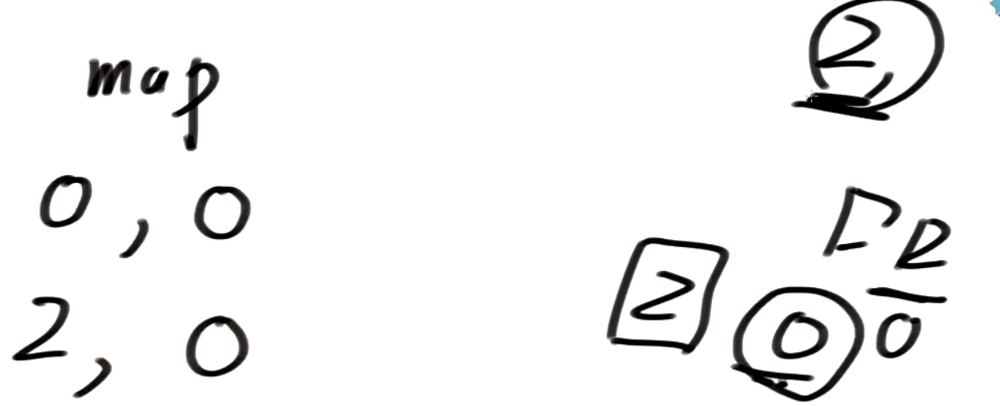 | 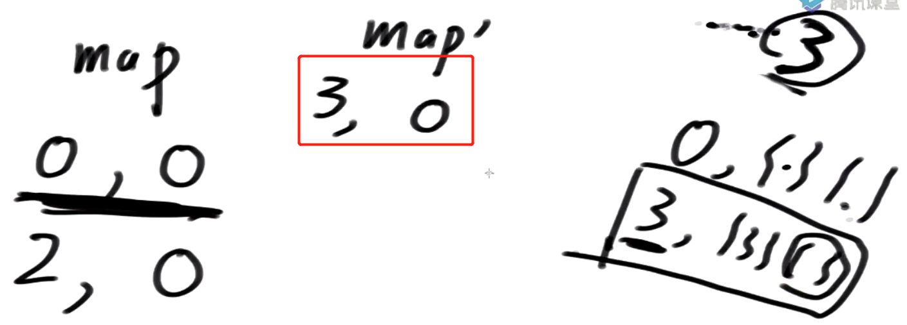 | 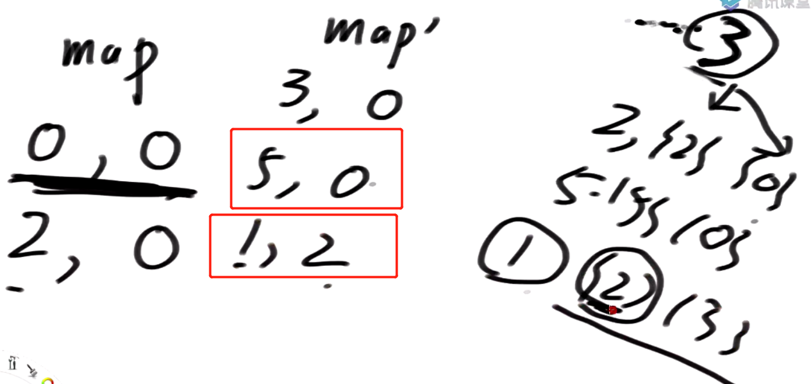 |
| ------------------------------------------------------------ | ------------------------------------------------------------ | ------------------------------------------------------------ |


### 字面值不相同的子序列

code4：

- 给定一个字符串s，求s中有多少个字面值不相同的子序列

[1,1,1]这个数组都是1，字面值为1的子序列有很多，保留1的方式有三种。这道题问的就是。给你一个s，s的所有子序列不同字面值有多少。

我们来先看一种比较简单的情况，就是假设这个字符串中没有重复的字符。这是整个字符串，我建立这么一些信息，我假设这个字符串中所有的字符就是a到z小写。我建立这样记录（a，types），以a结尾有type种不同的字面值。一个字符都没遍历的时候所有信息都是零。这里的a不是说某一个位置的a，而是a这种字符，以这种字符结尾就都算。

| 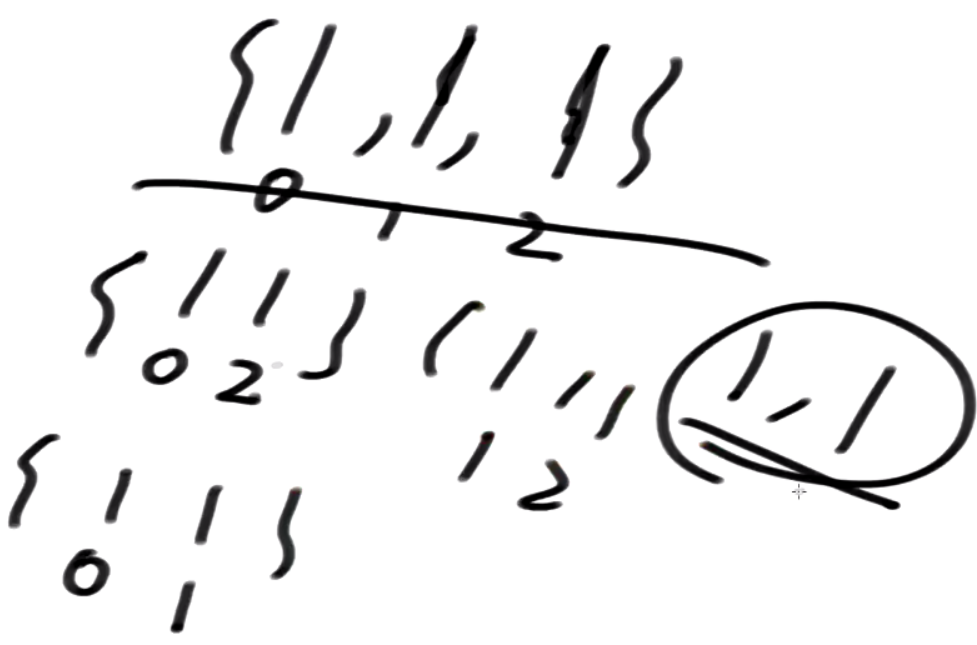 | 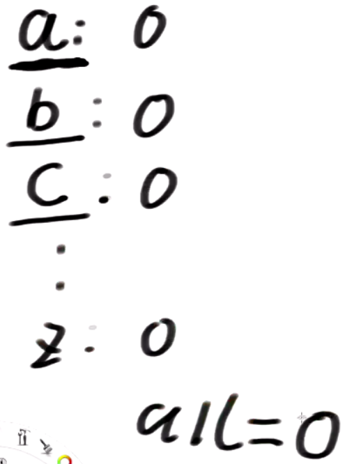 |      |
| ------------------------------------------------------------ | ------------------------------------------------------------ | ---- |

下面开始推这些东西。在这之前我们规定一个字符都没有也算一种字面值，所以all一开始是1。假设第一个字符是a，a来了，我们要算新出现的字面值有哪些。你之前的集合有哪些？只有一个空集，那么毫无疑问，这个空集往后添一个a变成{a}的话，它肯定是新的。所以我知道新产生的不同字面值就一种，把这个a设置成1，因为它确实是以a结尾的，然后这个all加上1变成2。

假设下一个字符b来了，我要算推到b为止，新出现的子集有几种，2种，你这个all里面任意一个集合，不管哪一个形成的字面值，往后面统一添一个b都是新的字面值。如果在字符都没有重复的情况下，很容易就就想到就是说我新增的就是all。

| 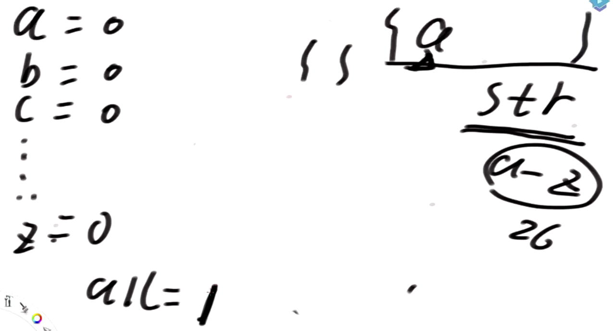 | 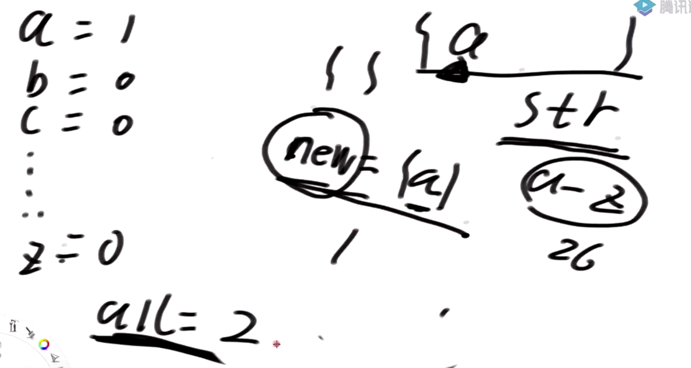 | 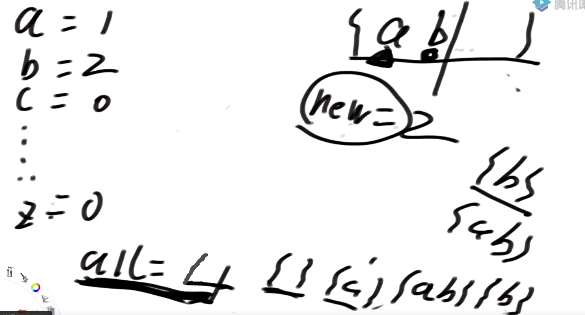 |
| ------------------------------------------------------------ | ------------------------------------------------------------ | ------------------------------------------------------------ |

如果如果你下面还是没有重复字符，就来个c，新增的幅度还是all，所以all变成8。

| 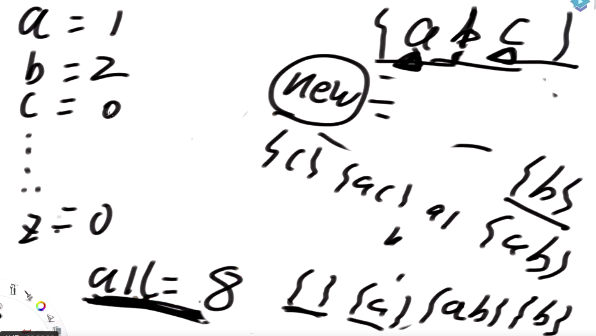 |      |      |
| ------------------------------------------------------------ | ---- | ---- |

我们来分析有，如果有重复字符都是啥情况。假设我们已经考虑ab了。假设下面又来了个b。我新增的是什么？你还能够按刚才原来那样算吗？你先画一个大体范围是可以的，假设我这四个集合，后面统一填个b之后都是新的，先这么假设，发现如下，你会重一块之前原先是b结尾的。所以`NEW=ALL-MAP['b']`。所以你此时新增了2个，更新。

| 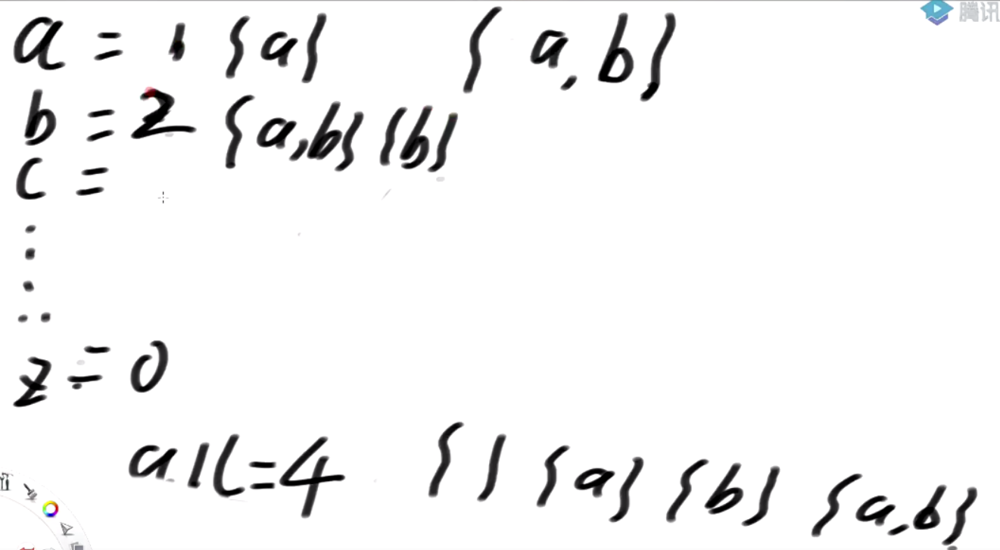 | 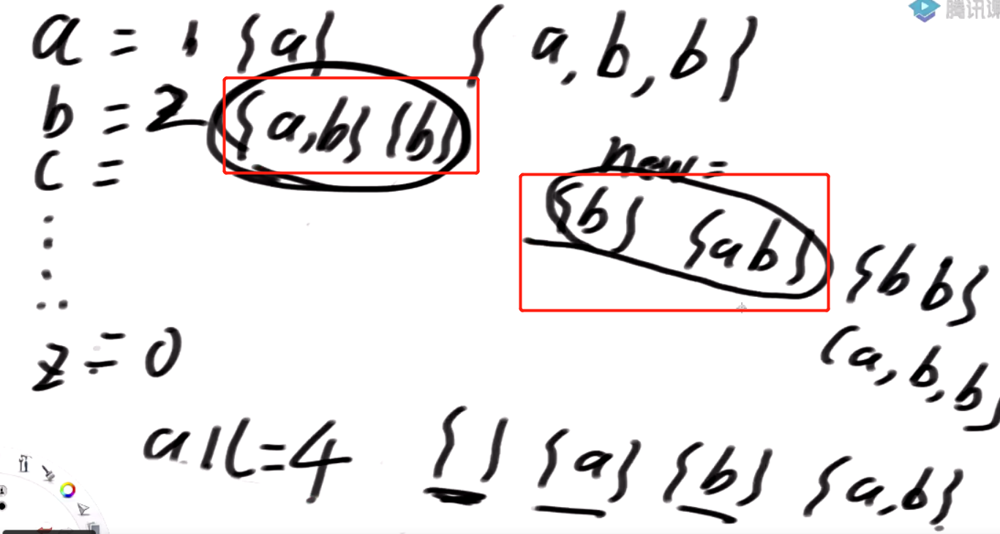 | 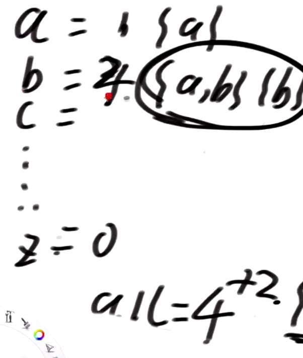 |
| ------------------------------------------------------------ | ------------------------------------------------------------ | ------------------------------------------------------------ |

为什么是`NEW=ALL-MAP['b']`,因为你现在用all再拱一遍，你会把之前b出现的那些老集合再拱一遍出来，那些是重复的。

- code3思路很像，都是“拱”的思想


### Interview Coding 20

训练营5，第4节

### 画匠作画问题

```
分割数组的最大值
https://leetcode.cn/problems/split-array-largest-sum/
```

四边形不等式

code1：

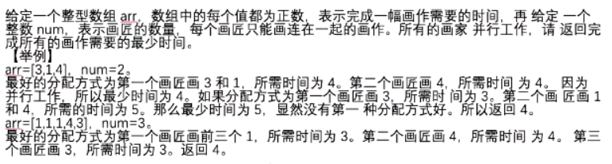

我们有一个数组如下，实际上就是问你，一定要把整个数组分成三份，怎么分能够让最后总结束的总时间最短。

画家只能画连续的画，这题就是问你，数组彻底分解成k块儿不相容的子数组，sum分别为sum1~k，让他们总的最大值尽量小。

| 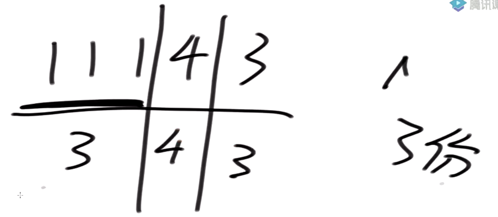 | 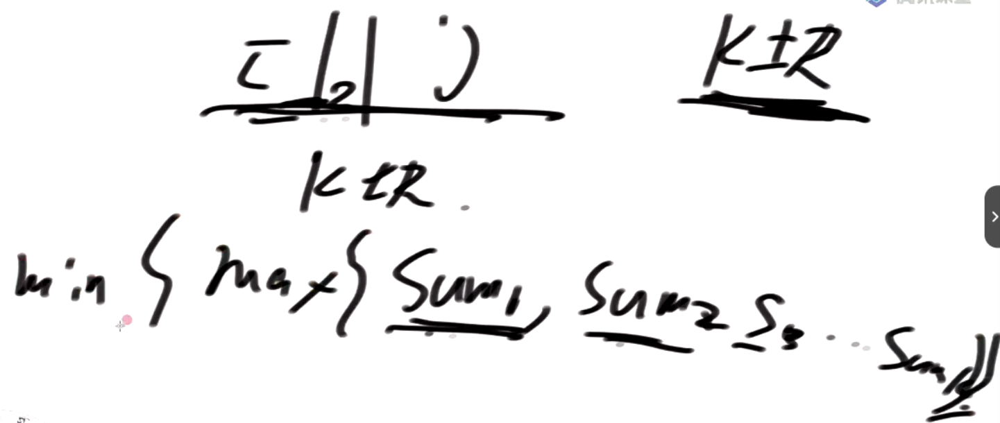 |      |
| ------------------------------------------------------------ | ------------------------------------------------------------ | ---- |

怎么试？一个样本做行一个样本做列。dp [i] [j] 的含义是0~i这些画你就给我分成不相容的k块，由k个画家画。问你哪种划分情况下，累加和各块累加和最大值怎么尽量小的那个答案记在dp里。如果这张表能顺利填好最右下角的值就是我们要的。跟那个邮局问题基本上是一样的，怎么枚举啊？最后一个画家负责的范围是啥？

所以怎么依赖的呀？举一个具体的例子。你的画是下边零到七这些画，每一个画上面有时间，我给你三个画家，dp[7] [3]这个格子怎么填？第一种情况，最后一个画家，自己负责七这幅画，那么剩下的画家就是负责0~6，max{dp[6] [2],arr[7]}。枚举所有的情况，求一个min出来。

再来看看位置怎么依赖的。第一个特征，有枚举。第二个特征，画家变多，只可能变好，不可能变差。画变多，只可能变差不可能变好。第三个特征，很明显区间划分。第四个特征，不同时依赖自己本行和本列。直接猜！！

| 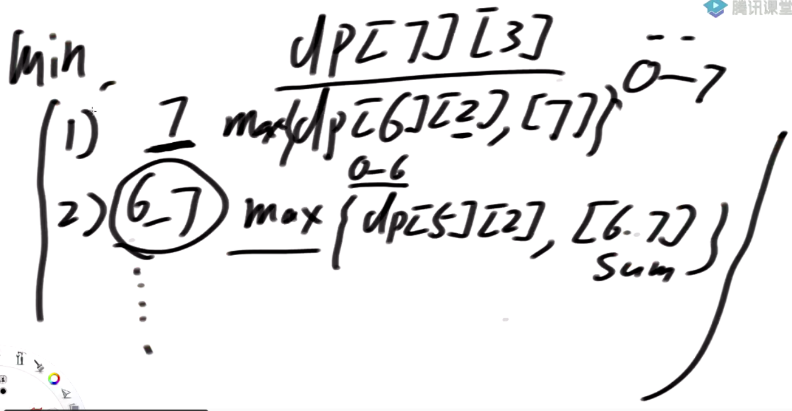 | 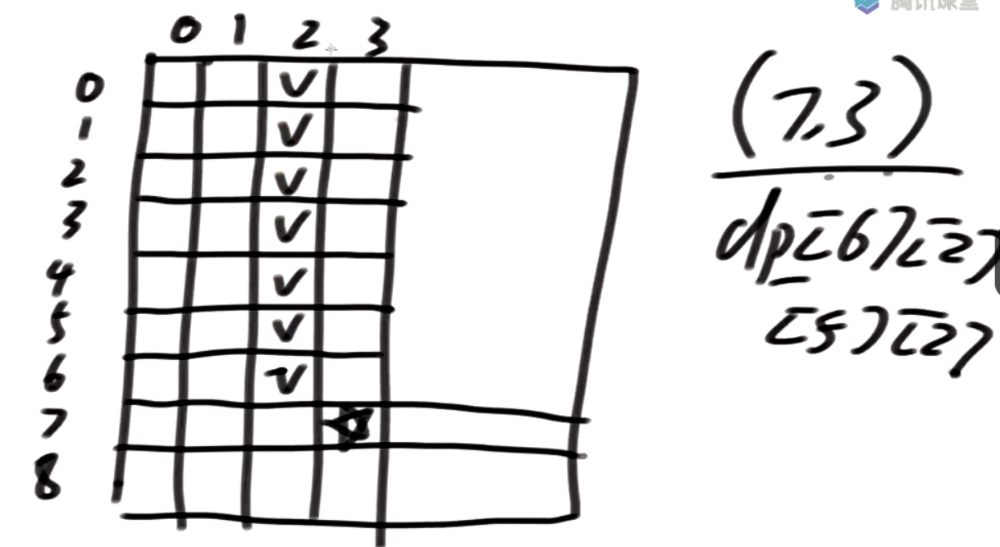 |      |
| ------------------------------------------------------------ | ------------------------------------------------------------ | ---- |

画匠问题结束了吗？没有。关于四边形不等式的技巧，我们就其实已经讲完了。但是在面对具体题目的时候，我告诉大家，四边形不等式的题目往往背后对应着一个比四边形不等式优化本身还好的尝试。就是说你可以用四边形不等式干出来一个非常优良的解，但它可能不是最优解，邮局问题四边形不等式的解确实是最优解，但画像问题其实不是。那画像问题的最优解是什么？它的最优解的尝试跟原来的尝试方法根本没关系。

我们这么想：我所有的这些画放在array里，我假设我先给它定一个目标。目标是啥意思？就是你在你拆块的时候，你拆出来的每一块的累加和不能大于这个目标。问你。能够做到这一点的情况下，你至少要拆几块。举个例子。画在arr中，k=2。假设我先定一个粗略的小目标，我去画块，但是每一块的累加和不能超过五，请问我至少要几块？其实就是用一个sum依次去加，加到超过了，就把那些划进去。然后算出最后至少需要画出多少块来满足你的目标。所以f(arr,target)函数假设可以搞定我们目标为target的时候arr至少需要划分出几块。

现在的问题是我一共就两人。我想知道最合适的目标是什么。那你就在从零到所有正数的累加和之间二分去。二分的时候你看看每一个二分的点，你是不是超过两人了。因为你的目标一定在零到总共所有数的累加和之间，挑二分的方式总能找到最合适的目标。

| 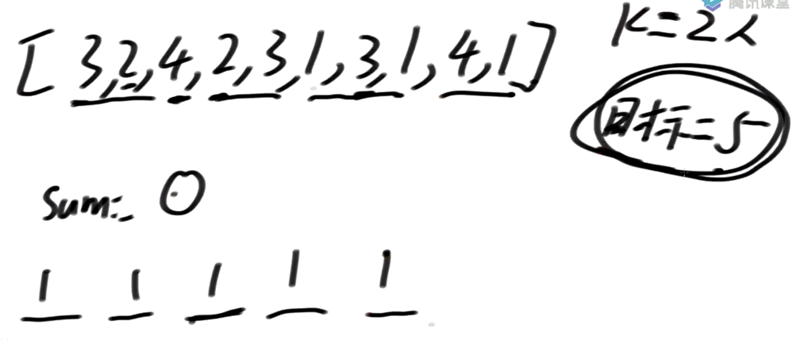 |      |      |
| ------------------------------------------------------------ | ---- | ---- |

举个例子。最开始，目标定为12。调用f函数，发现至少要三个块，也就是要三个人。我就知道我目标定严苛了，恐怕12小时内是结束不了的。所以下一个目标选18。然后发现18可以拿下。然后继续去13~18之间去二分。最晚的那个位置，结束的位置，就是最好的位置。所以复杂度为O(N log_sum)。

| 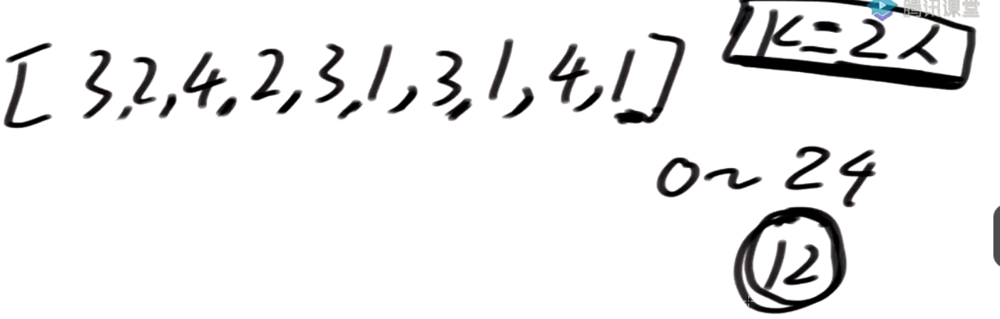 |      |      |
| ------------------------------------------------------------ | ---- | ---- |

优化技巧的上限来自你的试法。如果试法不好，即便你有再多手段优化，也可能不如好的试法。我们优化的技巧可以帮助你把一个不怎么样的试法优化到一个很好的程度，比如说我们有斜率优化，比如说我们有四边形不等式。但是归根结底在于你试法优不优秀。把话说回来，四边形不等式的题目，其实在大量的面试中或者比赛中以四边形不等式做最优解的题是有的，但是比较少，比如说邮局问题。但是在面试中有面试中其实更大量的情况，或者说70%以上它都存在一个更好的试法，把四边形不等式优化的那个很好的解再干掉。为什么能够总是带有这种特征？因为我们新的试法对单调性的挖掘特别极致。它其实在于你能够炸出多少它单调性的好处，四边形不等式，你可以认为它炸单调性的好处其实是有限的。四边形不等式，只是说我存在一种模糊单调性，然后我告诉你它可以有这样一个上限跟下限。它莫不如你直接去挖掘单调性。


### 扔棋子问题

四边形不等式

code2：

- 一座大楼有0~N层，地面为0层，最高一层为N层。棋子从第0层掉落一定不碎，1层及以上就可能会碎了。给定N作为楼层数，K作为棋子数，返回如果想找到棋子不会碎的最大高度，找到最少次数，这个最少次数是考虑了最差情况也能达到的最少次数。一次只能扔一个棋子。

这道题的难点就在于，你一定要随时随地的想到它可能遇到最差情况。假设你只有一颗棋子。你的目标一定要试出最高的不会碎的楼在哪一层。你一定要确保即便遇到最差情况你这个目标也能达到。如果你只有一颗棋子，但是你有五层楼，我们规定零层楼是不会碎的，一共只有五层楼，你一定要完成这个目标，你只能每个楼层都去扔一次，因为你只有一个棋子。我一定得保证我完成这个目标，我还没有办法控制它在哪层碎，我还得假设它对我是最不友好的情况，请问我至少要扔几次。我一定要确保完成目标。我还得时刻提防着最差情况发生，请问我至少要扔几次。

来看看这题。首先我们有个大过滤器，如果k大于了log2_n，你就二分去，棋子够用。试法是什么？就是第一颗棋子扔哪。定义一个函数f(i,j)，含义是如果我还剩 i 层楼需要去试，我还有j个棋子，请问最差情况下我还得满足目标的情况下，我至少要扔几次。大家不要小看这个函数，设我已经知道99层楼是不碎的了，我还剩下100层楼，101层楼，102层楼，103层楼和104层楼需要去试五层楼，我就调f(5,3)，我不管你到了哪层楼，你就剩下五层楼，这个问题让我去试，我i就等于五。

| 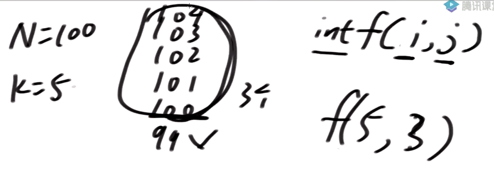 |      |      |
| ------------------------------------------------------------ | ---- | ---- |

假设楼100层，棋子5。你不用管它最底层是到了第几层，假设是a层，那么上面是a+1、是a+2、。。、第100层是a+99。第一种情况是我第一颗棋子就扔在a处。两种情况了，如果碎了，a- 1层是最高的不会碎的楼。你为什么还剩100层需要去试？你一定知道你底下的楼层是不碎的，所以我们再补一个潜台词，假设底下的楼层都是不碎的。所以一开始上来100层，我可以调f（100,5），因为我知道我零层肯定不碎。所以我们看如果我在a层我碎了，我就知道a- 1层是最高的不碎的。这样一种情况下，我就其实就试出来了，我就扔了一次，我把第一个棋子扔在a处。换句话讲，就是我第一颗棋子扔在a处，如果它碎了，我就还剩零层需要去试，还剩四颗棋子，f（0，4）。如果它没碎，我就还有99层需要去试，还有五颗棋子，因为它没碎。永远假设最差情况，所以取max再+1是我最少的次数。

到一个普遍位置i，可能分为碎和不碎，但是默认命运总是给我最差的情况。那我就枚举所有可能的i。所以我们来试看一下f（7,2）。

| 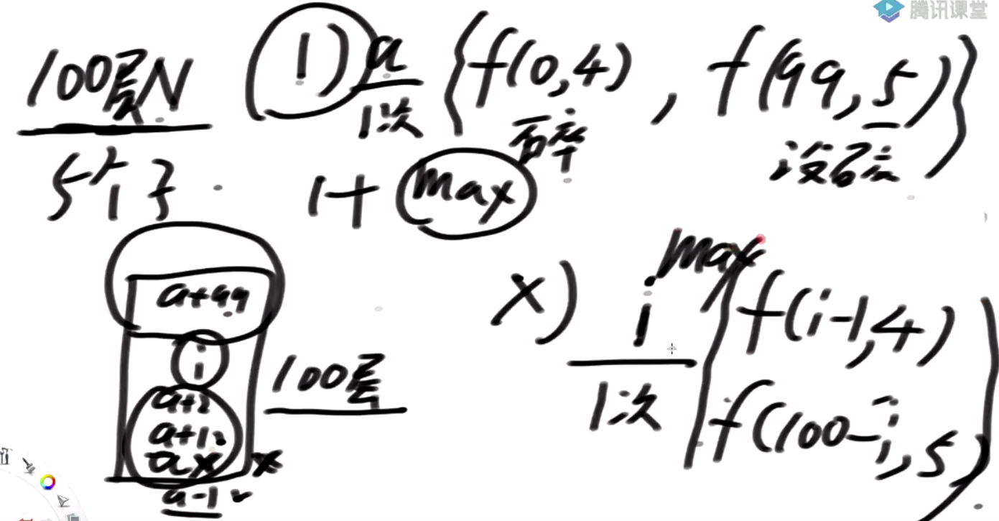 | 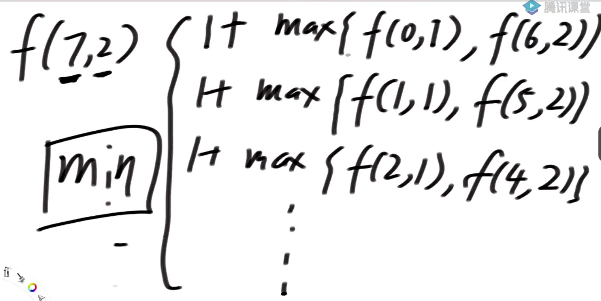 |      |
| ------------------------------------------------------------ | ------------------------------------------------------------ | ---- |

这个暴力解中，我们只要解决一些base case就行了，只有两个可变参数。i=0，你扔0次。如果你只剩一颗棋子，那么你只能从上往下一个一个试，所以扔i次。两个base case一套，所有大问题拆吧。就两个可变参数，所以是张二维表，这是什么模型？业务限制模型。你发现它就给你两个可变参数，一个是表示楼层，一个表示棋子，很自然的就硬憋这个递归。业务限制模型指的是当我去猜递归的时候，我的可变参数都要深入的去搞题目本身所透露给我的提议。

来看位置依赖。星星需要把我自己本列和我前一列的东西都枚举一下，才能知道星星位置的值。开始猜，有枚举、有单调性，区间问题，不同时依赖行列。四个条件，一成立，每一个格子在算的时候，我上边儿的格子在算的时候，你告诉我你枚举到哪一层的时候，是得到最优解。我右边格子在枚举的时候，你告诉我你枚举到哪一层的时候，得到最优解，我就在你们中间枚举。

|  |      |      |
| ------------------------------------------------------------ | ---- | ---- |

这是最优解吗？不是。这道题它依然是一个试法能够很好的把四边形不等式的解给干掉的一个题。最优解的试法很奇怪，是反过来想的。他这么想，我定义一张dp表，i是棋子数，j是扔的次数，dp [i] [j] 就是我假设我有i个棋子，在我可以扔j次的情况下。可以搞定多少层楼的问题？题目的目标是你是要搞定100层楼，假设你有三颗棋子。请问你要扔多少次？这个dp表怎么用？

假设五颗棋子，所以我这张表。我要准备下标零到五，列我不知道准备多少，我顺着往下。第零列废掉，扔0次，搞定不了。第一行也不用填，你没有棋子怎么搞定。第二列，都是1，因为你只能扔一次。最好搞定1层楼的问题。第二行就是从底往上一层层试，也好填。一个普遍位置怎么求，我们要搞定这个问题了。

假设要搞定dp[3] [10]。我假设在求dp[3] [10]之前我能够先求dp[3] [9]=a，还有一个dp[2] [9]=b，我们可以假设，因为我们可以控制填格子的顺序。用两种方式来解释dp[3] [10]怎么求。

第一种解释。你剩三颗棋子。你还能扔十次。我假设你扔到的是最优层。如果它碎了，你已经扔过一次了，所以你还剩9次可以扔。如果你碎了，你下边能够解决b层楼的问题。如果没碎，那么你往上可以解决a层。dp[3] [10]=a+b+1。

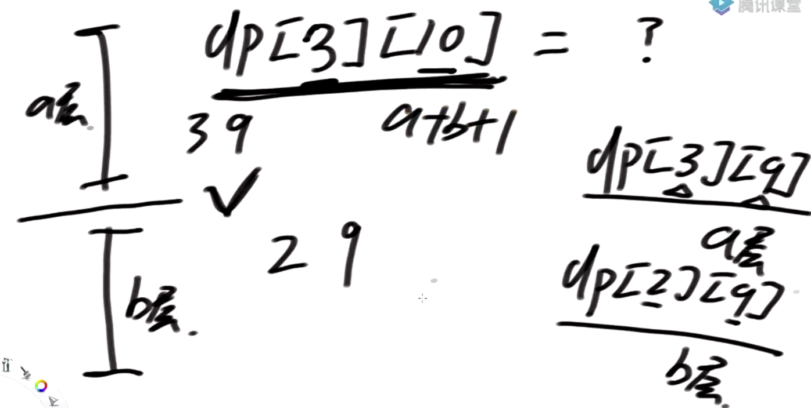

第二种解释，我告诉你客观情况下，三个棋子扔九次可以解决20层楼的问题，两颗棋子扔九次可以解决15层楼的问题。假设这都是客观的值。我问你，你三颗棋子。扔十次能不能解决36层楼的问题？一定可以。我就把第一个棋子扔在16位置，如果碎了，那么就去底下调，如果没碎就去上面调。我们还是用第二种解释更加平易近人一点。

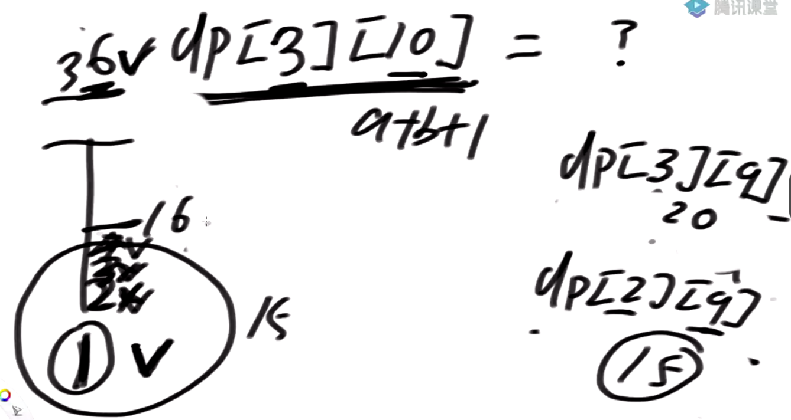

开始填表。刚刚超过一百或者等于100的列数就是你的答案。这张表是增长极快的。列不定，用空间压缩的方式让它动态滚动下去，不准备整张表，我就一直滚到你出现100。这是最优解吗？我们先算一下这个解它的时间复杂度是多少？如果你给我一个具体的n给我一个具体的k，假设客观上来讲实际解决的次数是s次。时间复杂度就k×s。假设你这个k只有一颗棋子，你这个s也就是n的水平，所以最差可能是O（k  *  n）。但如果你的k比较大的话，这个s会其实非常会非常小。

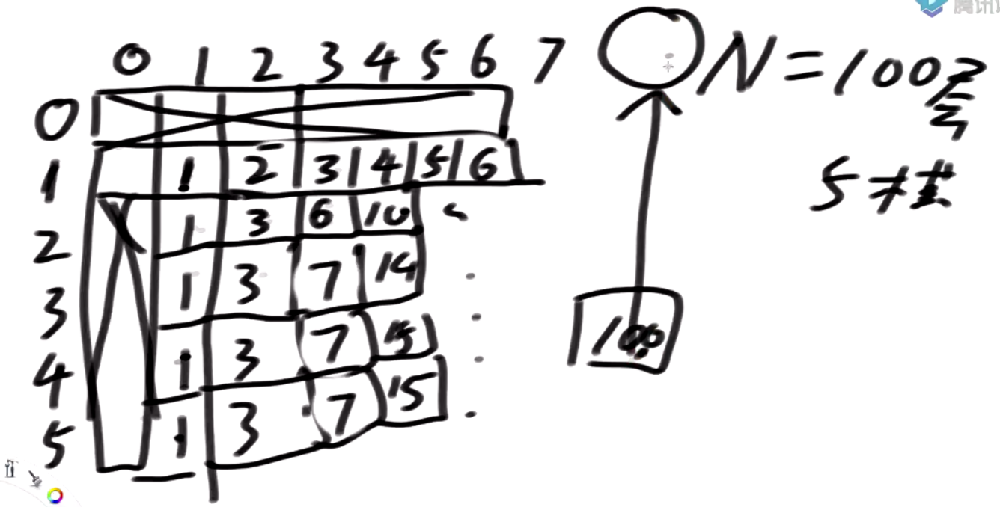

为什么说还能优化，随着你往后填，你会发现，一列上的值不重复了。你看看能不能搞定一个类似斐波那契数列的解。


### 邮局问题

四边形不等式

code3:

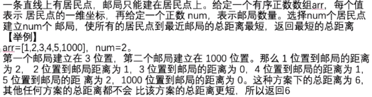

给你一个array，它是有序的。代表着在x轴上，有3,17,60,76这样一些居民点，然后再给你一个参数k代表一共要建的邮局数量。你有很多居民点你的邮局只能建在居民点上。你的邮局只能建在居民点上。但是你建在具体哪个居民点上，它会让总距离不一样。举个例子p2，你只有三个居民点，要建k个邮局，你只能建在7位置，因为这样别的居民点到你的距离的累加和最短，建在3和15都没有7好。

假设每一个居民都会选择离自己最近的邮局去寄邮件，那么会存在一个总距离的问题。请你告诉我总距离怎么能够尽量小？返回最后最小的总距离是多少？

| 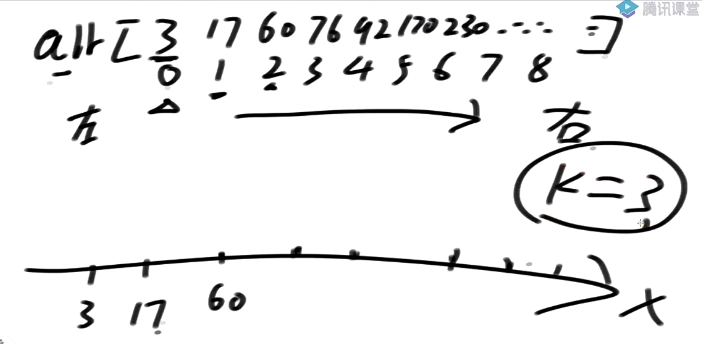 | 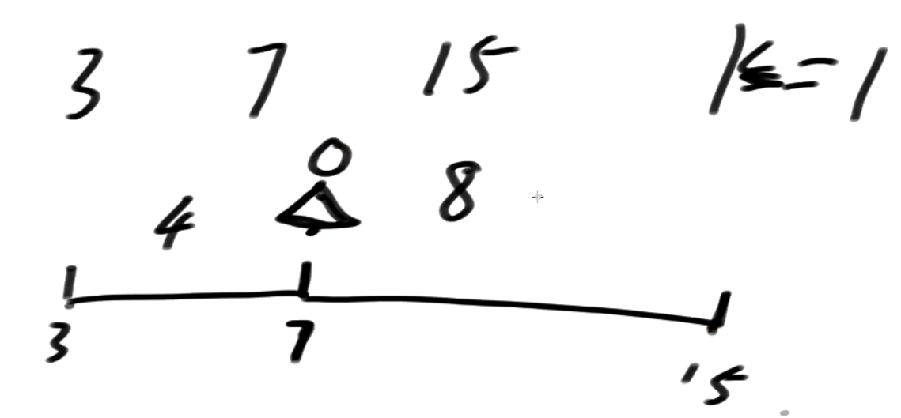 |      |
| ------------------------------------------------------------ | ------------------------------------------------------------ | ---- |

让你做动态规划，你会怎么猜。dp[i] [j]代表0~i这些居民点里面，一定要刚好建够j个邮局，总距离最小是多少？所以这张表它的行数。就是居民点的index，它的列数就是零到k。如果你能够把这张表填好。最右下角的值就是你要的。你永远不用去讨论零个邮局的时候如何如何，所以这张表中最左一列画个叉，用不到。第一行都是0，因为你只有一个居民点，建几个都是在原地。

再来看第二列，硬求，我奇数建中点，偶数建上中点和下中点一模一样，能求。第二行，邮局比居民点还多的情况，都是都是0。

现在我们要求一个普遍位置的dp[i] [j]，一个样本做行，一个样本做列的对应模型是不是总去讨论结尾的情况，我们按照最后一个邮局能够处理的居民点来分，最后一个邮局单独处理i、i-1~i、i-2~i，这样枚举下去，答案必定在其中。 

为什么这样去枚举？因为你会发现你枚举i位置建不建邮局，当i不建邮局的时候你不知道你之前最后一个邮局在哪，你没办法算出一个答案。所以你会发现，我好像关心最后一个邮局在哪，所以我何不去枚举最后一个邮局的可能性，所以我去枚举，最后一个邮局在i，在i-1，在i-2，这样枚举下去。这样枚举可能有建在同一个点的邮局，无所谓！我当它炸掉了！但是你会发现枚举邮局建的位置，似乎信息还是不够，因为我并不知道我这个邮局实际处理了多少在它左侧的居民点。所以我们枚举邮局建的位置，也不太好。既然我们还需要这个邮局实际处理了多少居民点，那么我何不枚举最后一个邮局处理的范围呢？所以枚举处理[i,i] [i-1,i] [i-2,i] [i-3,i]这些居民点交给最后一个邮局处理，抖机灵--我最后一个邮局什么都不处理，也是一种情况，我当它炸掉了。

| 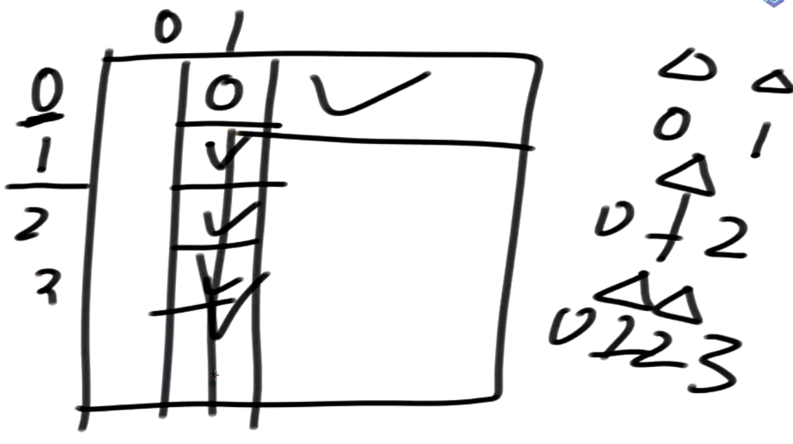 | 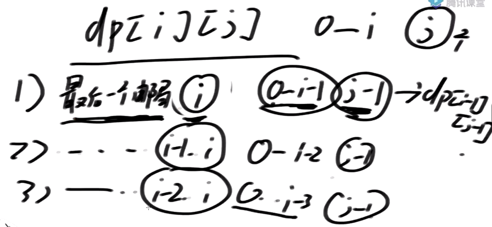 | 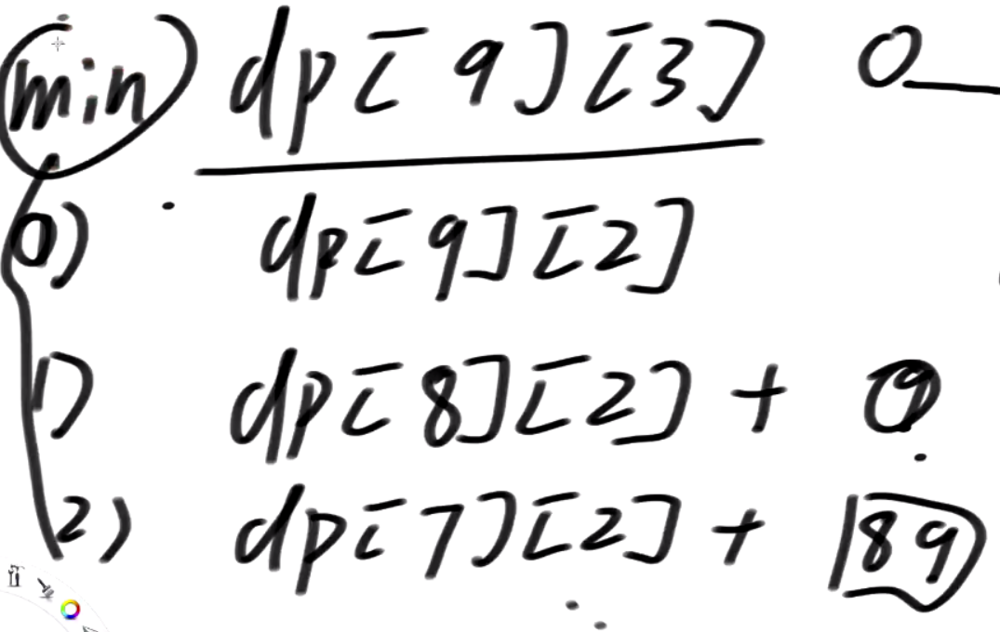 |
| ------------------------------------------------------------ | ------------------------------------------------------------ | ------------------------------------------------------------ |

所以我们枚举了一个范围交给一个邮局去处理，我们肯定希望邮局建立在这个范围的最合适的位置。这样的话我们需要做一个预处理结构，算出一个范围上的居民到某一个邮局的总距离最小是多少。record数组可以告诉我i~j范围上，如果只建一个邮局总距离最小是多少。我要把这个record做出来之后，毫无疑问，可以去加速我们刚才那个流程。注意！我们确实可以直接算出中点，得到最优的居民点在i~j中的哪一个位置。但是record不是要告诉我们最优邮局建在哪，而是要告诉我们一个最小的距离，你要帮我把值算出来，而不是就告诉我邮局建在中点，这个中点我都可以自己去算。

所以现在问题来了，我们再求l~r这个范围的最小距离和的时候，我们不能去枚举每一个位置到中点的距离是多少，然后加起来，这样就n³了，太慢了。我们要利用已知的格子的信息，快速的求出来，时间复杂度要维持在N²才行。很简单，假设你现在要求L~R范围上的最小值，L~R的中点和L+1~R的中点一样吗？可以一样，如果L+1~R是偶数，那么就放在下中点，如果是奇数，就直接放在中点，到L~R范围的时候，邮局的位置就成了L~R位置的上中点了。既然如此，那么dp[L] [R] = dp[L+1] [R] + (arr[R]-arr[R+L>>1])。

位置依赖，星号依赖上面那些点。不优化是O(N²K）复杂度。你有枚举行为的时候，有一种技巧叫斜率优化。这就牵扯到接下来我要提到的一个非常重要的技巧。这个技巧叫做四边形不等式。我们现在已经有一个O(N²K）的方法了，这玩意儿能不能做我们的对数器？也就说我们以后猜的话，即便猜中跟猜不中，都不需要证明，你既然有这么一个对数器，如果你猜出可能的一种一种优化的话，你最多拿两个对数去验一下，结果你就知道你猜对还是没猜对了吗？

怎么猜？我当然要关注这个星号的临近位置。注意到有几个特征。第一个特征，每一个格子有枚举行为。第二个特征，这个问题所要求的动态规划的值就dp，具体某个格子(i,j)的值。他对这两维参数有一种说不清道不明的单调关系。你的dp[i] [j] 这个i一旦增大，这个dp值只升不降。你的dp[i] [j] 这个j一旦增大，这个dp值一定小于等于原本的。这是有关于四边形不等式的两个特征。第三个特征。我们所求的这个dp值，它粗略上概念上来讲，它是一种区间划分问题。

现在猜一件事儿，居民点的个数从零到5的，邮局给的数量3个。假设0-4范围上最右边的邮局负责，k~4。当你的范围变为0~5的时候，你的最后一个邮局负责的范围k'~5，这个k'一定不会小于k。

|  | 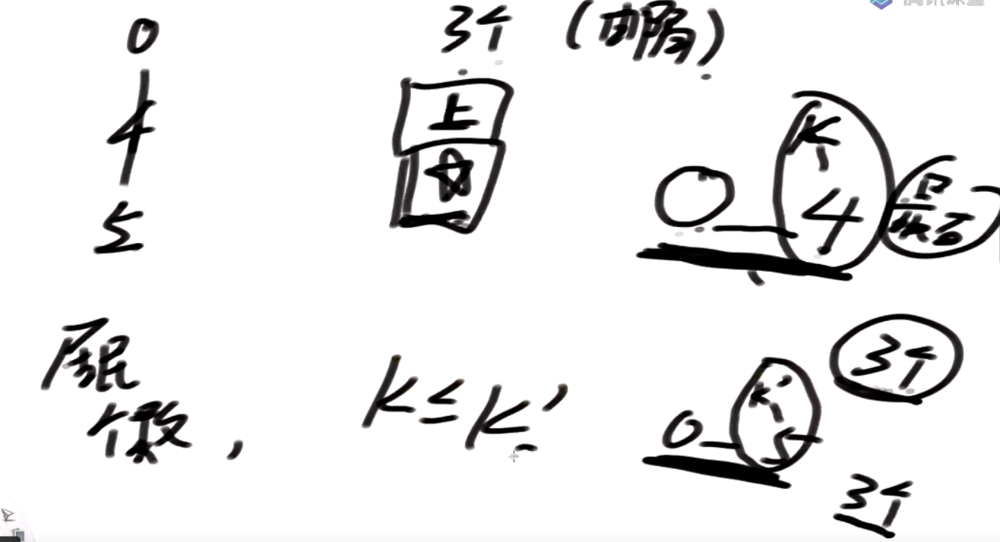 |      |
| ------------------------------------------------------------ | ------------------------------------------------------------ | ---- |

想一下我们当前格子是0~5居民点，你给我三个邮局，我上面的格子是零到四号这些居民点，分三个邮局，假设上面这个格子的最优划分在a位置。轮到我再去试的时候再去枚举的时候，我划分点的位置 不用在a之前，相当于我在尝试的时候，我只用从a开始往右试就行了。这是一边。

右边那个格子，有四个邮局，如果最优划分是4~5，那么当我减少一个邮局的时候，我恐怕不需要在4的右边去试。

我上边给了我一个枚举的下限，我右边可以给我一个枚举的上限。我只用在a跟b之间去试。我们不知道它成不成立我们在猜。i增大是增，j增大是降，所以我们往i小，j大的方向去依赖。也就是依赖上面的和右边的。

任何一个格子它上边的位置会给它一个指导a，它右边的位置会给它一个指导b，这个格子如果只在大于等于a跟小于等于b之间去枚举，就能省掉很多枚举行为。

我们一旦发现有一个dp问题，具备三个特征。第一个特征，有枚举行为。第二个特征，dp值跟两个参数之间存在一种单调关系，但是不是很清晰。第三种情况，它是一个区间划分问题。我们就直接看看任何一个格子它上边、它右边这一组，跟它的枚举是否存在一些关系？如果你分析不出来，你就假设它存在。比如说这道题，我们就假设当我在求某一个格子的时候，我不仅填一个dp，我还在求每一个格子的时候，把它的划分位置记在了另外一张表里。叫选择表--choose表，choose表的规模跟dp是一样的，这个choose表只负责记录我上面的格子，当时它在枚举的时候，它取得最优解的时候这个划分值a。我右边的格子在当时他没举的时候，他能算出来他最优的划分值在b。那么，我如果假设它上面的格子跟它右面的格子能够对它产生影响，在我算这个星号的时候，我就只用再把最后一个邮局负责的划分位置限制在a和b之间。我不知道这对不对，我就先这么猜，我们有对数器帮我们验。

| 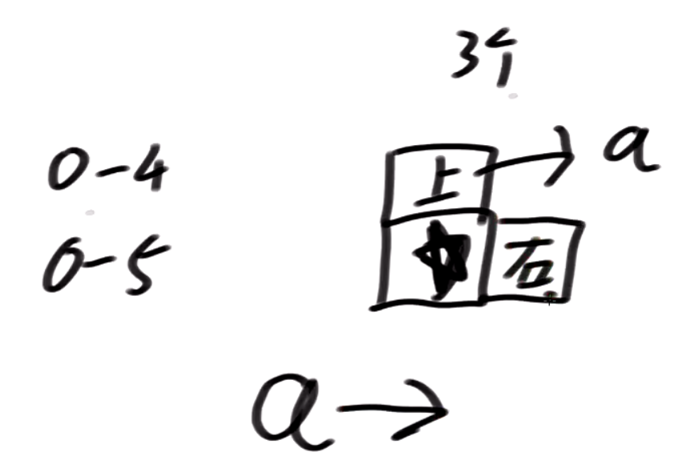 | 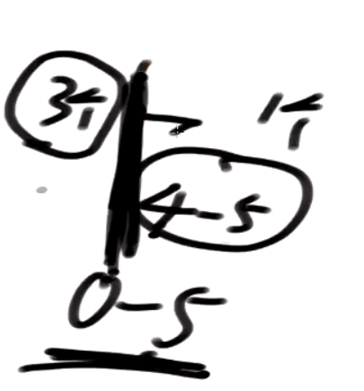 | 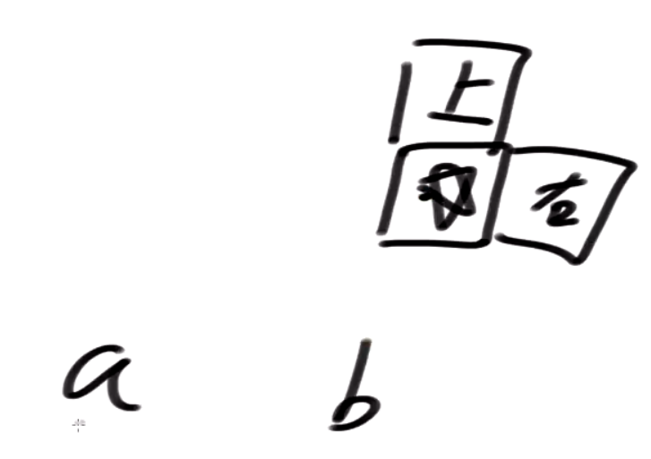 |
| ------------------------------------------------------------ | ------------------------------------------------------------ | ------------------------------------------------------------ |

我为了让每一个位置都能够有优化。所以我每一行从右往左算。因为什么我们同时需要上面的和右边的帮我们优化。你算1的时候没有上限只有下限，算完1之后，234格子都有上限又有下限。

我们只关注一个动态规划问题，具备了四边形不等式的特征，如果有，直接硬猜不去证明。如果能优化，是直接减掉一阶的！

补一个特征，第四个特征，求单独一个格子的时候，它不同时依赖于自己本行的值和自己本列的值。如果我这个格子，我既依赖自己本行，又依赖自己本列。当我求一个格子的时候，我指望它上面的位置跟它右面的位置是算过了的，这点是做不到的。

| 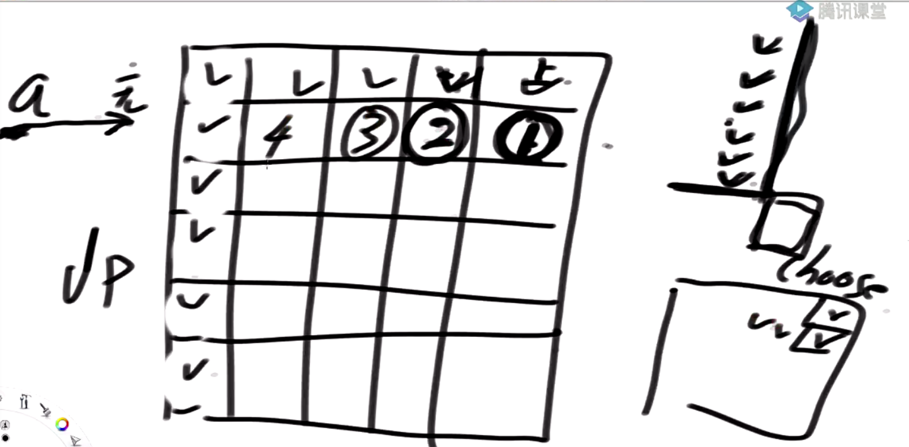 |      |      |
| ------------------------------------------------------------ | ---- | ---- |


### 反转数组求每次逆序对

code4：

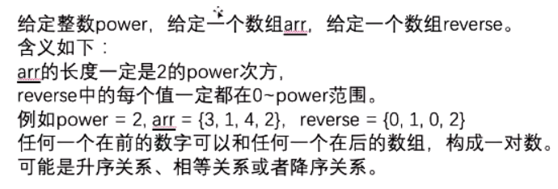

- 限制：p>=0；arr长度是2^p；0<=reverse[i]<=p

例子：arr{3,1,4,2}  op{0,1,0,2}

第一个操作是0，代表整个数组，如果每一块的长度是2^0=1的情况下是怎么分组的。经过零操作之后，还是原数组，因为都是自己和自己反转。问你在这样一个数组中逆序对儿有多少个？有3个。

下一个操作是1，2^1=2，也就是每一块长度为2。所以[3,1] [4,2]组队，然后逆序[1,3] [2,4]，再整个的[1,3,2,4]看看几个逆序对，1个。

在变过之后的数组中做第三个操作0，在[1,3,2,4]这个上次操作过的数组中搞一个操作0，我们知道操作零不动，所以逆序对还是1。

接下来操作2,也就是4个一组。变成[4,2,3,1],逆序对是5。

- 也就是操作数组中可能会有[0,1,2,4,...,k]，拿到k就代表2^k一组的数去reverse

| 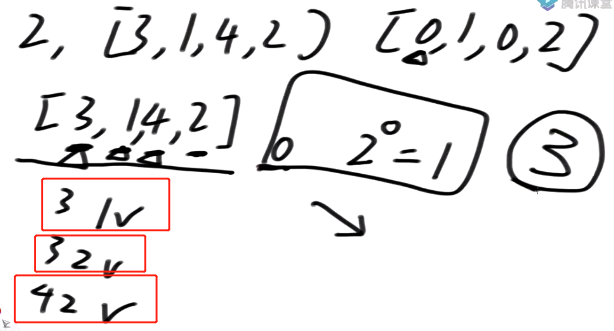 | 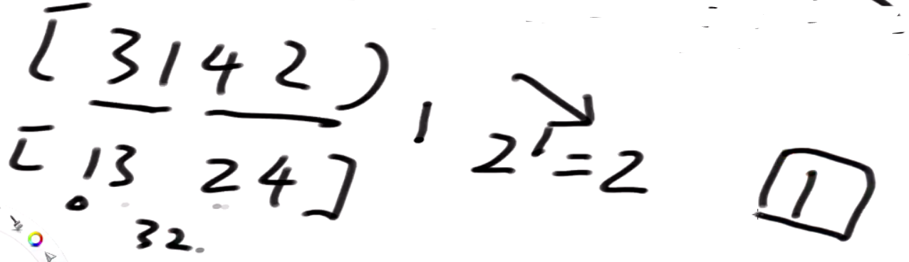 |      |
| ------------------------------------------------------------ | ------------------------------------------------------------ | ---- |

我们把这个逆序对这么来分类，比如说[3,1,4,2]。我们定义一个数组dp1[4]，dp1[i]的含义就是以2^i分组，假设每组的大小为s，每组的逆序对只能来自于前一半的s/2以及后一半的s/2，统计所有组逆序对的数量之和。这个分组是按照题目的意思分，从左到右分，不重复。并且一组里面逆序对的来源，是分别来自于左部分和右部分。

如下，dp1[2]，每组4个，有两组，第一组逆序对，分别来自[3,0] [6,2]，所以有（3,2）总共1对。第二组同理，有（7,6）、（7,5）、（8，6）、（8,5），4对，总的就是1+4=5对。

```
正序对+逆序对+sum{C(k,2)}=C(N,2)   k为每个数重复的次数
正序对+逆序对=C(N,2) - sum{C(k,2)} (在数组中某个数重复了k次)
```


然后你再建立一个dp2的信息。dp2[i]的含义和dp1一样，不过统计的是正序对的数量。两个信息。先如果都提前建好，我们看接下来怎么玩。现在你去把数组两两一组，逆序一下，看看新的这个数组dp和dp'有什么规律。当你p=i操作的时候，其实就是dp[k<=i]和dp'[k<=i]交换一下，大的不变，小的全部交换，这是因为我们的特殊规定导致的。

也就是说。当我们对一个原始数组。先建立dp跟dp撇的记录的话，来一个reverse。我们就可以知道dp跟dp撇里面怎么交换。你每一步的答案怎么求啊？所有dp里面值累加起来不就是答案吗。每一回都这么干，所有答案顺利求出来。

| 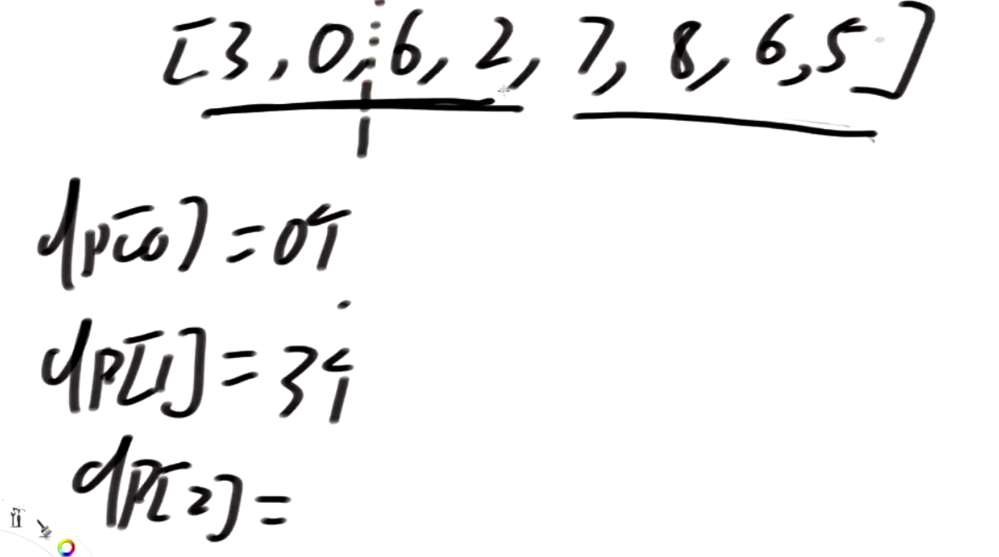 | 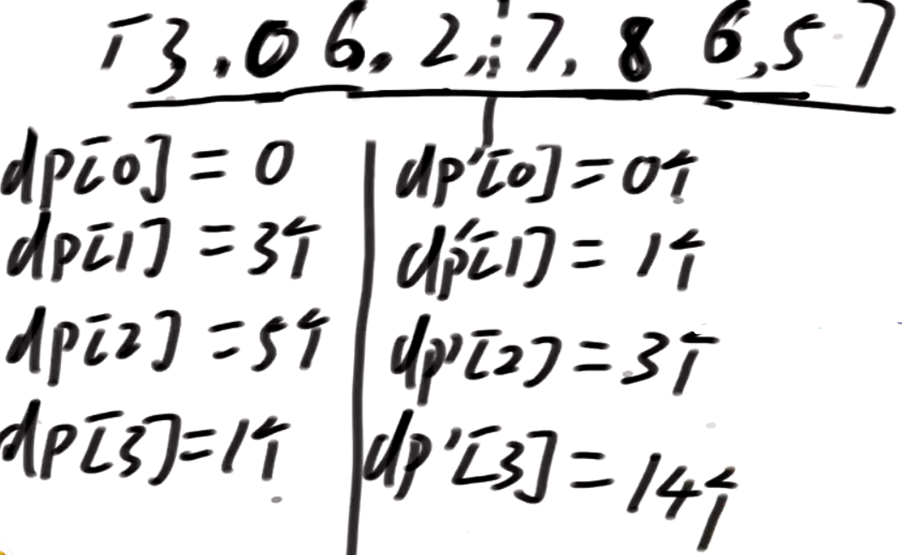 |      |
| ------------------------------------------------------------ | ------------------------------------------------------------ | ---- |

关键就是dp跟dp撇怎么求----小和问题。用一个归并排序把dp和dp‘搞出来。


### 全是1的最大正方形

加一个题。在一个matrix中必须要画正方形，里面全是一这样的正方形才叫达标的正方形。假设这个矩阵中不是零就是一只有两种值，可能会有很多正方形达标。我让你返回达标的正方形，里面含有一数量最多的那个个数是多少。

怎么猜？dp[i] [j]代表啥，正方形必须以（i，j）这个点做右下角的点的情况下，它往左上方延伸最大的正方形是多大（边长）。第一行第一列好填，都是自己。看一个普遍位置。首先matrix[i] [j]如果为0，那么对应的dp直接就是0。我们只要讨论matrix[i] [j]如果为1的情况，如果左边上面左上角其中有一个是0，那么dp[i] [j] 直接就是1。

`dp[i][j]=min{dp[i-1][j-1],dp[i-1][j],dp[i][j-1]}+1`。

| 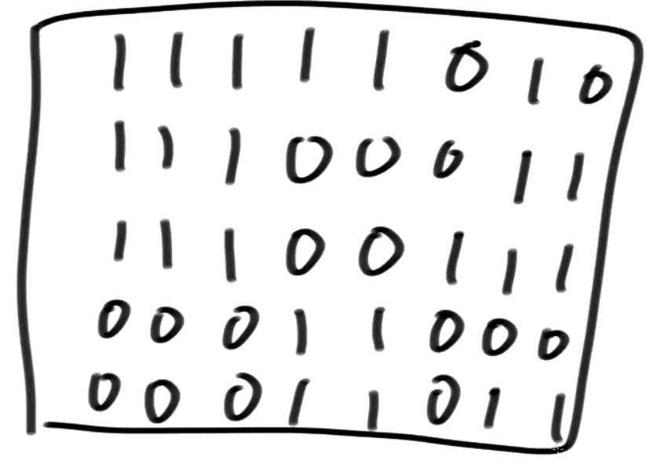 | 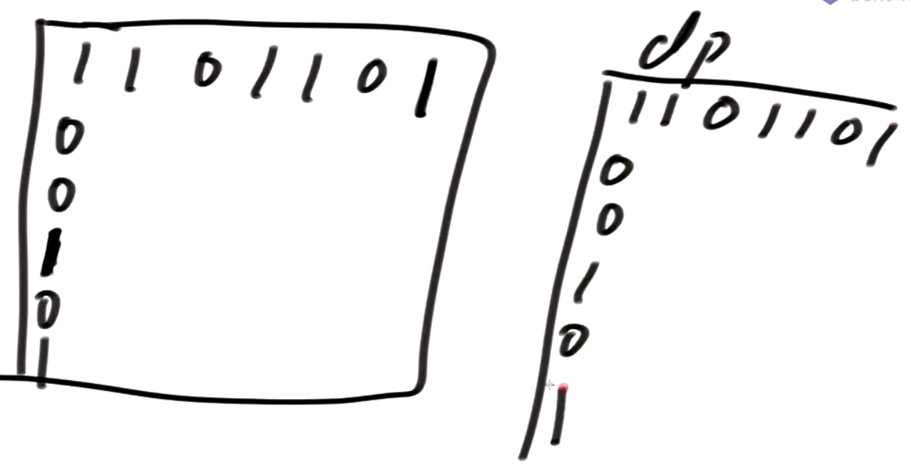 | 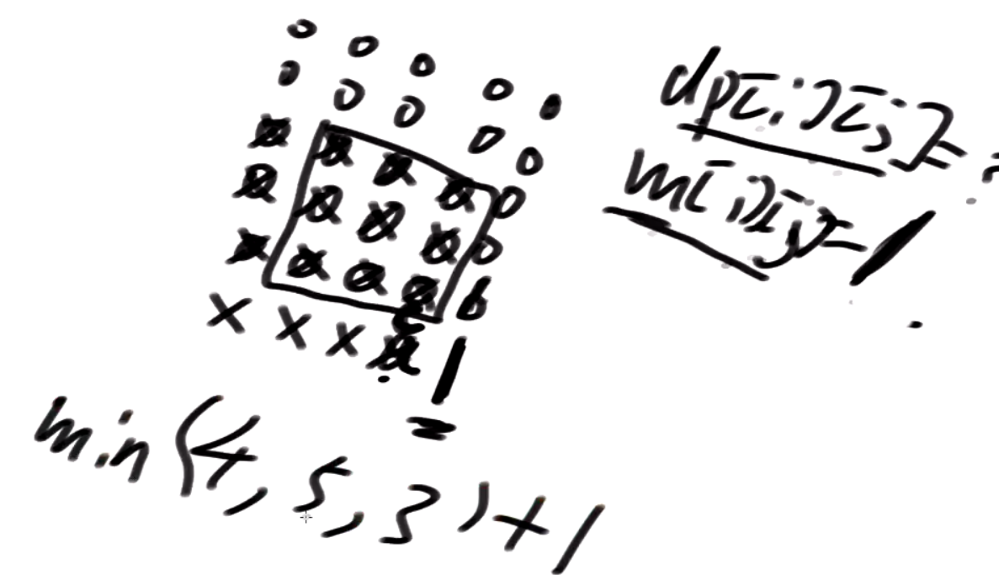 |
| ------------------------------------------------------------ | ------------------------------------------------------------ | ------------------------------------------------------------ |


### Interview Coding 21

训练营5，第5节

### 回文串记录

code1：

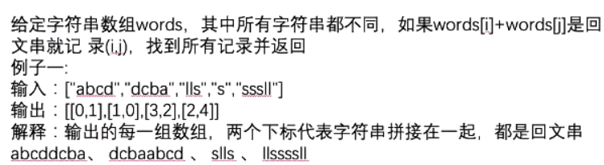

这里面我们不能忽略的一件事情就是字符串长度。字符串的长度是一定会考虑到时间复杂度里去的，因为它这里面拼的过程中，它是需要字符串长度的。所以在这里面，我们得把长度这个因素考虑上。假设字符串平均长度是k。那么如果你有n个字符串，你每两个字符串试一下暴力去试，就是O(N² * K）。

那还有一个方法是这样的，我先把所有的字符串放到一个哈希set里去。然后假设我拿出了一个字符串，我们之前的做法是说我找其他的字符串跟它配，能不能成回文，现在我们不这么做了。现在我们挖掘这个字符串本身的一些特征。怎么挖掘呢？这个字符串先看前缀，前缀哪些是回文的情况？第一种情况。前缀单独是a的时候，它是回文。然后我把它后面的一坨拿出来，我到set里面去找，找它的逆序。如果有的话。那么把这一段彻底拼到前面去，它整体就是回文串了。这是一种可能性。

换一个短点的。当前的字符串是aabaa。第一种可能性就是前缀为a的时候。我就查什么的逆序呢？ABAA的逆序。如果它发现它有a aba这个逆序的形式，拿前面去就就整体就拼成回文了。第二种可能性前缀是AA的时候。它是回文串那我就在set中查什么baa的逆序aab？如果我有aab的话，拿到前面去，它就是回文了。第三种可能性前缀为a ab的时候，它不是回文，所以跳过，因为不是回文，你即便后面有它的逆序，拼到前面去，也不是回文。最后一种情况，就是我整体AAbaa是回文是，那我就查有没有空串。

| 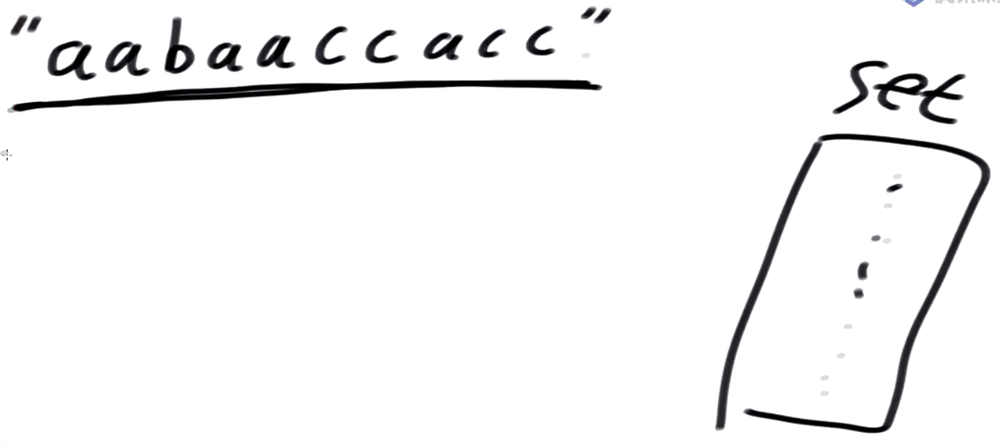 |  | 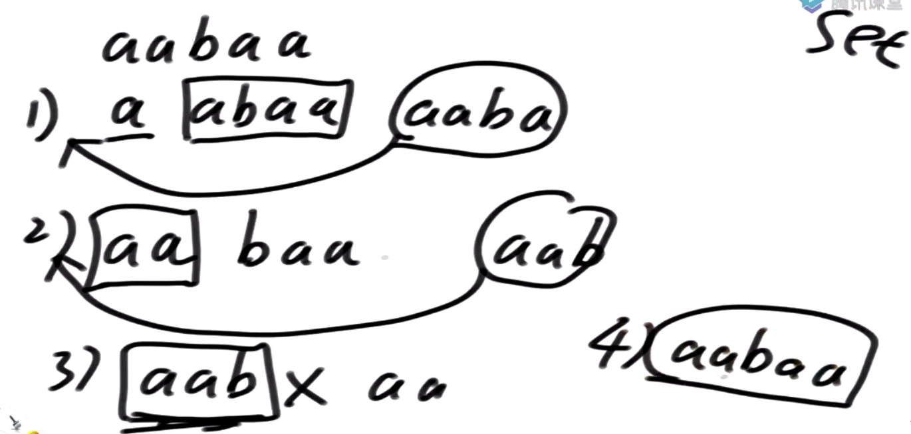 |
| ------------------------------------------------------------ | ------------------------------------------------------------ | ------------------------------------------------------------ |

第一种方法是先拼再看是不是回文，第二种是我挖掘自己的特征，然后去set里面找有没有能构成回文的。如果你这种前缀试完了之后，你再试后缀。举个例子，aaaccc。所以就分为两大块来求解。第一大块，所有前缀是回文的情况。完之后检查后缀，后缀是同理的。你前缀查一遍，后缀查一遍，所有这个字符串的情况都枚举了。然后还差一种，你看看在set中有没有它本身的逆序。

- 前缀枚举所有的可能性，后缀枚举所有的可能性，然后看自己的逆序有没有？一切只用查set就够了。

估计一下复杂度，有N个字符串，你都是这么玩，所以外头乘一个N，然后在里头，一个字符串的长度是K，你去枚举字符串的每一个前缀，是外头再套一个K，然后再里面，检查是否是回文O(K），再看看set里面有没有+O(K)。所以总的是O(N * K²）的复杂度。为什么Set中查也是O(K)，因为这个时候字符串的长度不可忽略，你set底层是通过遍历str来计算hashcode的。

你用第一种还是第二种，看菜下饭吧。

| 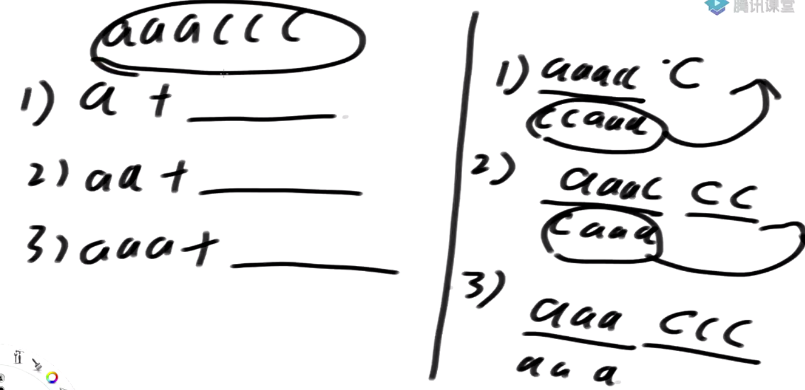 |      |      |
| ------------------------------------------------------------ | ---- | ---- |

流程就是这样。但是检查一个字符串的哪些前缀串是回文串这个过程是可以加速的。但是在这道题里面，这个加速就显得无关紧要了。因为检查一个前缀串是否是回文串，你即便把它做得非常高效，但是后面这两个过程还是O(K)的，这是相加的关系，拖你后腿了。

对于我们这道题来说，你把一个前缀检查它是否是回文这件事情，你优化还是不优化，都不会影响最后的复杂度，因为你后面的过程怎么也得把它生成逆序的形式，这个字符串还得在哈希表中查，这两个东西你是省不掉的。

下面我们换一道题，我给你个字符串，你告诉我它哪些前缀是回文，给我返回。

下面是例子，"aacaab"，返回res[0,1,4]代表，0~0/1/4是回文。返回的数组里面每一个值代表零开头到当前位置是回文哪些前缀串是回文。这道题你前缀串的优化就有必要了，因为它只要你哪些前缀串是回文这件事儿。我怎么样生成这个结果数组？ManACher算法。manacher算法中对于每一个位置都会有个回文半径，有一个Parr。你先用manacher算法，把所有位置的回文半径数都跑出来，接下来，哪些前缀是回文你就知道了，你只要看一个位置推一个回文半径能不能达到0位置，是的话整个直径包括的东西，都是回文串。整个得到所有前缀串的代价是O(N)。当你得到Parr之后，你可以方便检查前缀串或者后缀串是不是回文了，所以你检查前缀串跟后缀串是否是回文这件事是可以加速的，相当于用manacher算法帮你搞一个Parr预处理结构出来。

| 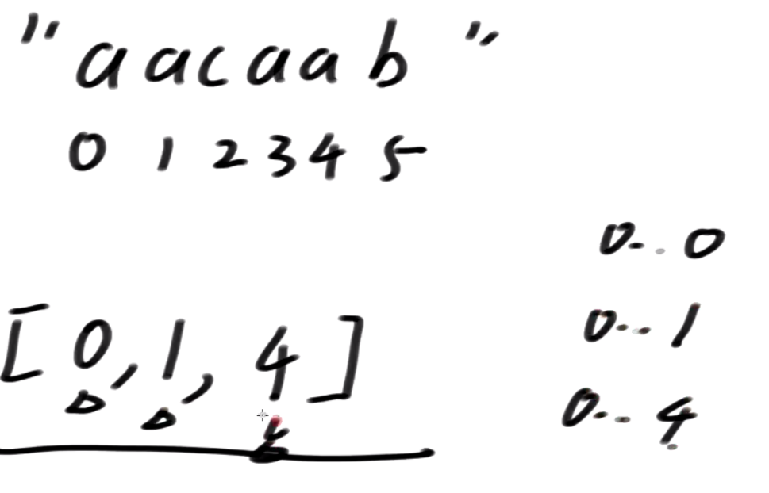 |      |      |
| ------------------------------------------------------------ | ---- | ---- |


### 数组的最长的连续序列

code2：

- 给定无序数组 arr，返回其中最长的连续序列的长度。

  例子：arr=[100,4,200,1,3,2]，最长的连续序列为[1,2,3,4]，所以返回4

这个复杂度可以做到O(N)。这道题你到面试上遇到你一定要把逼装好，这个题可以装逼装的很高端。先说一下我们这个最优解的比较好理解的一种版本，这个版本的思想在Interview Coding 08 的code1中也有。

随便来个例子。你设两个map，一个叫map头，一个叫map尾。任何一个连续区间，头记录在map头里，尾记录在map尾里。比如说一开始你遇到这个100了，那么就空降了一个100~100的区间，记一下。

| 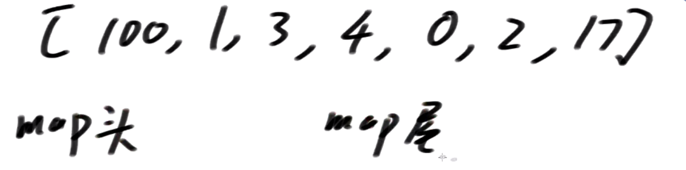 | 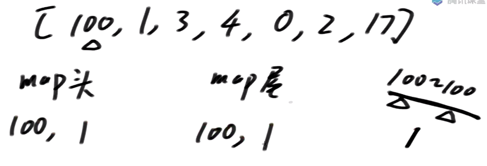 |      |
| ------------------------------------------------------------ | ------------------------------------------------------------ | ---- |

然后空降了1~1的连续区间，然后你看看能不能和之前的合并，合并就是在头表查2，在尾表里面查0，发现不行，然后继续。

继续空降3~3的连续区间。

| 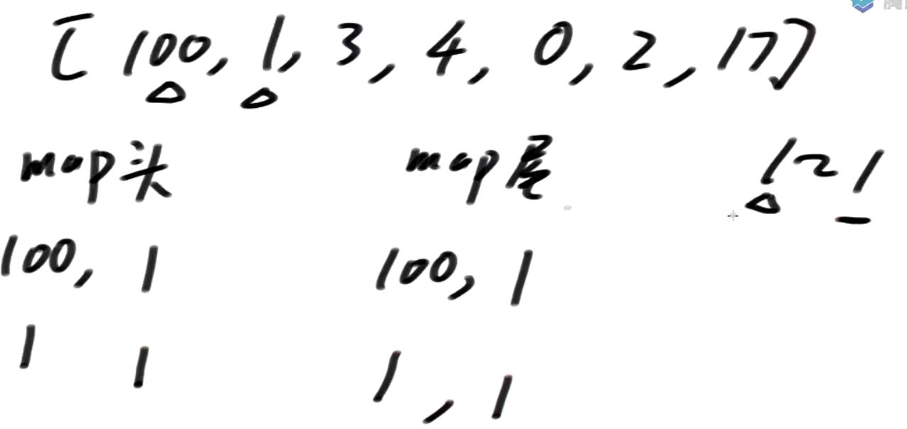 | 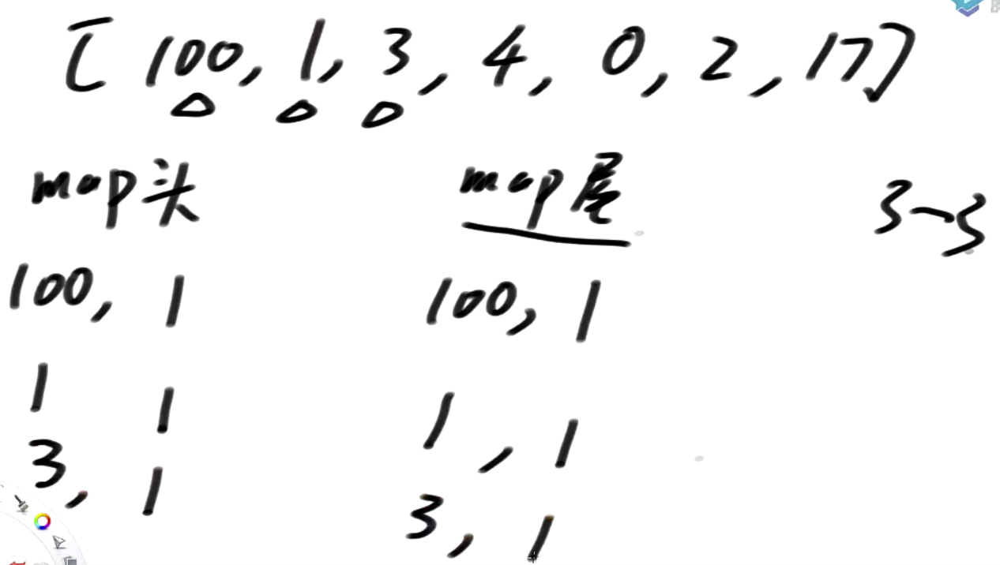 |      |
| ------------------------------------------------------------ | ------------------------------------------------------------ | ---- |

接下来四就热闹了。发现可以合并，该删的删，该改的改。就这样下去。最后map中value的最大值就是要返回的。

| 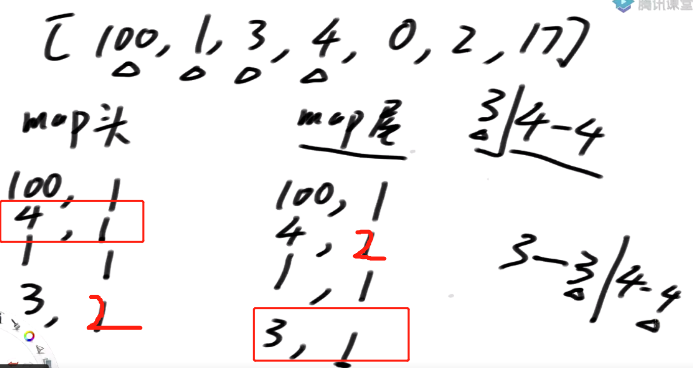 |      |      |
| ------------------------------------------------------------ | ---- | ---- |

这种做法是非常直白的最优解，装逼版本来了，就用一张表。先空降一个100，直接只加一条记录（100,1）。（key：所在的连续区间，value：长度）。我不去纠结这个100到底是开头还是结尾。那你这样做，你能更新对吗？首先，这张map表还做有一个功能，我所有的key都不删。如果我下回再遇到一个100，我看都不看它，我完全不处理它。因为我们最终想求那个连续区间有重复值跟没重复值 答案不会变。所以我遇到重复值的时候，我就直接跳过。map既然所有的key都不删，它可以帮助我做去重这件事情。

现在1也空降了，看了一下，map里面既没有0也没有2，所以就孤零零的加。3也同理。

| 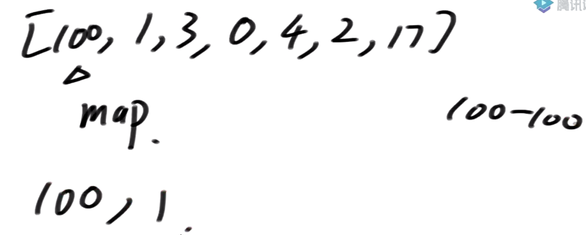 | 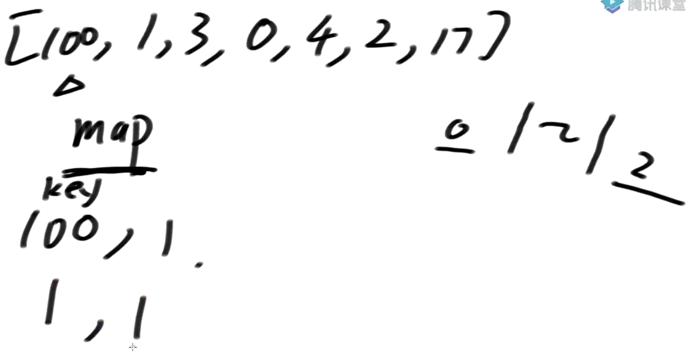 | 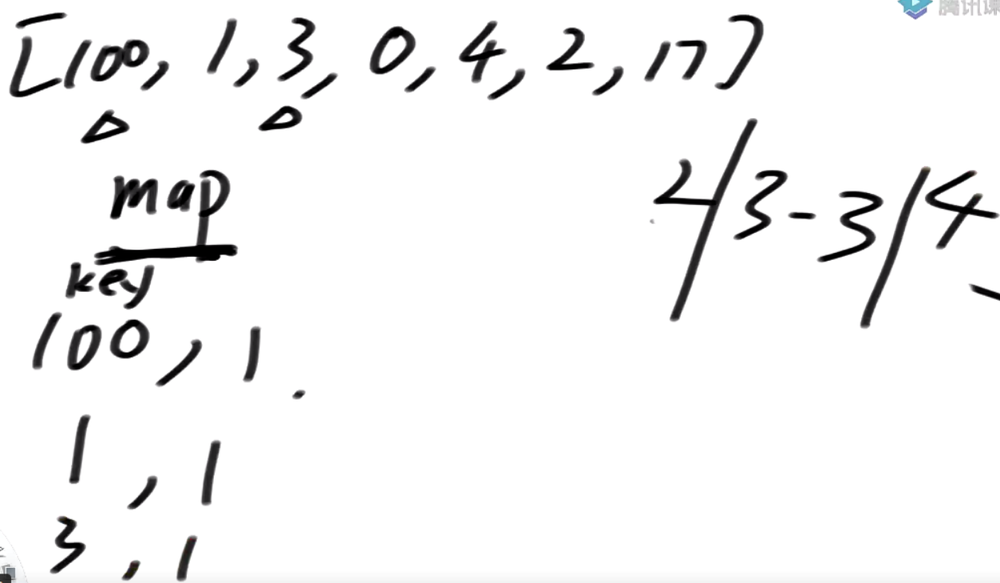 |
| ------------------------------------------------------------ | ------------------------------------------------------------ | ------------------------------------------------------------ |

然后0来了。我们为什么要处理零是因为零之前没出现过，如果零之前出现过，我们就不会处理此时的零了，你之所以能够处理此时的零说明零是刚出现的。所以你去查1的记录，如果有，它就表示开头。也就是说我这个记录的含义本身是不表示1是开头的，但此时它就是开头的意思。所以这时候我们就把0和1的value都改为2。

现在处理4，你之所以能够处理四是因为之间没出现过4，我查有没有3这个数，发现有，查出来长度是1，那就是三到三这个连续区间。这个3它虽然在map中它不表示结尾。但是你既然你空降一个四，你能处理说明之前没出现过四，既然没出现过四，你是第一个四，你去查这个三，它必表示结尾。所以3和4的value就可以改为2了。 

| 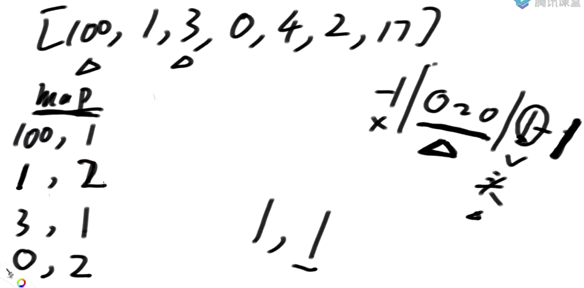 | 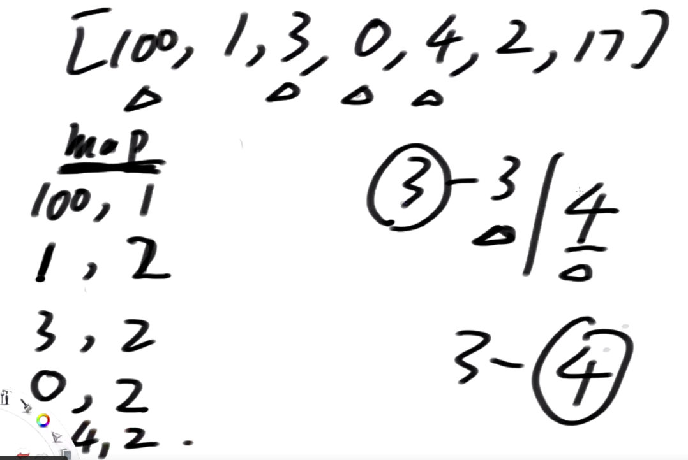 |      |
| ------------------------------------------------------------ | ------------------------------------------------------------ | ---- |

现在2来了。2之前没出现过，我查1必然是结尾，我查3必然是开头。所以就更新为2+2+1了，但是注意，我们只修改0和4这两个key的value。1,2,3这几个key我不修改，他们是脏数据，用来过滤重复值，不会影响我的解。 也就是以后再出现1~3，我只用知道它在我的map里面出现过，它的值我不关心，如果出现-1或者6，那么我本身也只需要知道0的value和5的value。

你先跟面试官说出正常版本，然后你说哎，其实我们可以讨论一下这个map可以省掉一个。然后你最后还来一句说哎，如果在工程上的话，为了防止同事产生歧义，看代码产生歧义，所以还是用两个map比较好，这个逼装的多圆润。面试官既知道你有能力，还知道你不会在工作上乱干。


### 查询o1和o2的最近公共祖先

code3：

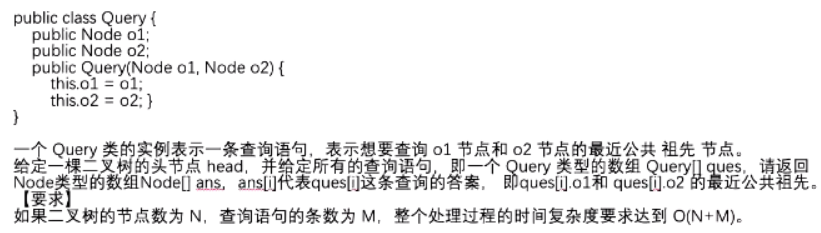

基础课讲过的那个查最低公共祖先，但是那个是只查一次，这个是批量查！ 

| 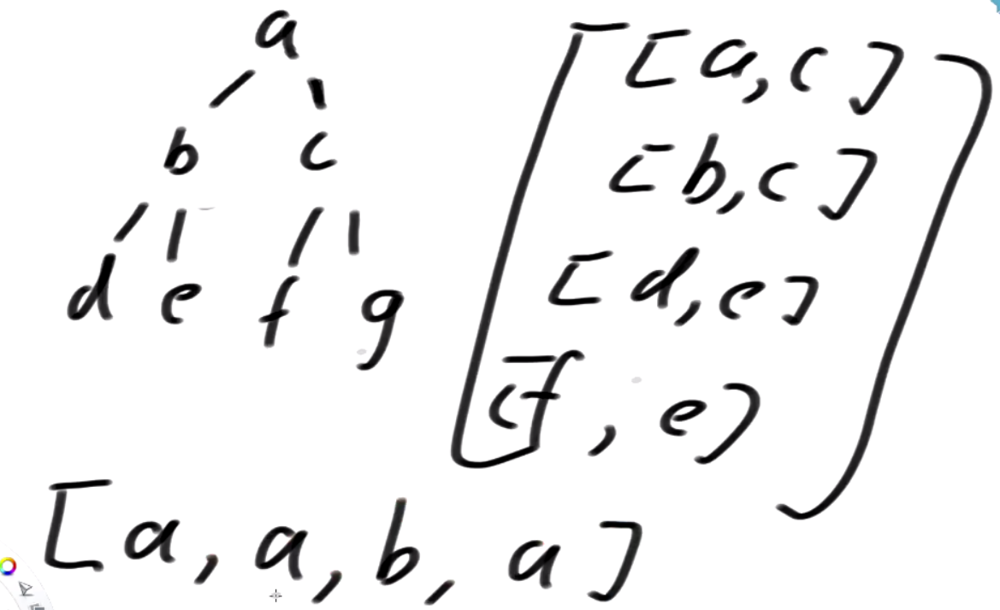 |      |      |
| ------------------------------------------------------------ | ---- | ---- |

先说一个普遍的，一个解啥呢？就是你把每一个节点，它的这个父亲节点全记录一下。这个和基础课的那个代码类似。搞一遍树的先序遍历就行了。 给你一个极端的查询要求，你又刚好是比较尴尬的形状，那么你每次都要查N次，总代价就是M * N。

| 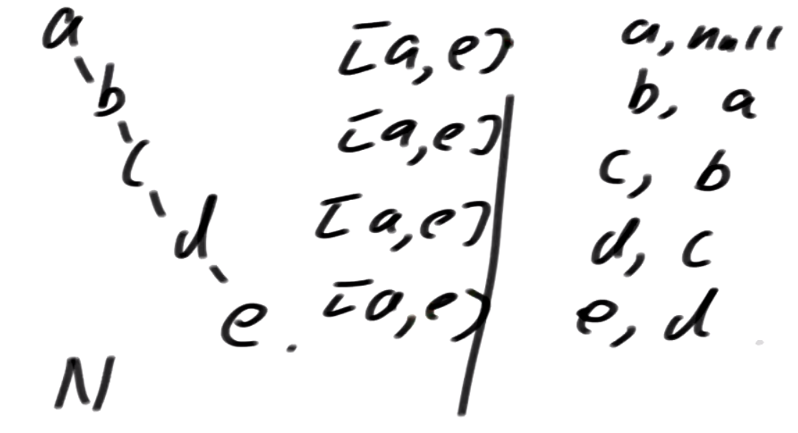 |      |      |
| ------------------------------------------------------------ | ---- | ---- |

从流程的设计上来讲。它是一个tangent算法，你们没接触过。从底层用到的东西来讲并插集，这个见过。我们要说一下，就是我们首先并查集。我们知道这个并查集它有集合代表节点的概念。我们接下来这个流程中谈的代表结点就指的是并插集的内部的这个最顶部的节点叫代表节点。然后每一个集合上面还要打上一个tag，这个tag叫父结点。你现在认为父结点跟代表结点是两回事儿，我现在还没有解释这个父结点是要干啥。但是我提的时候请你注意，我提代表节点的时候就指的并插集内部，这个集合的代表元素是啥。我提父结点不是在并查集里面的它的这个最顶部这个节点的意思。是一门一整个集合打上了某一个父结点的tag，是另外的一个属性。

然后我们看流程如何设计。查询中，我先洗数据。第一，如果是c结点跟c结点之间的最低公共组先这样的查询，直接告诉他答案。第二，如果是某个结点跟空结点之间的查询，直接告诉他答案。这种查询不值得我去遍历。那么剩下的就是实打实要查的。


| 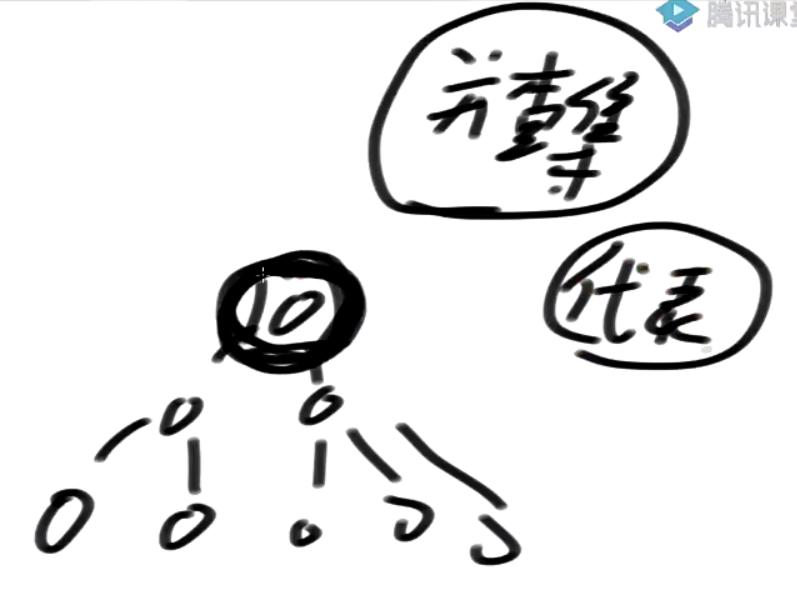 | 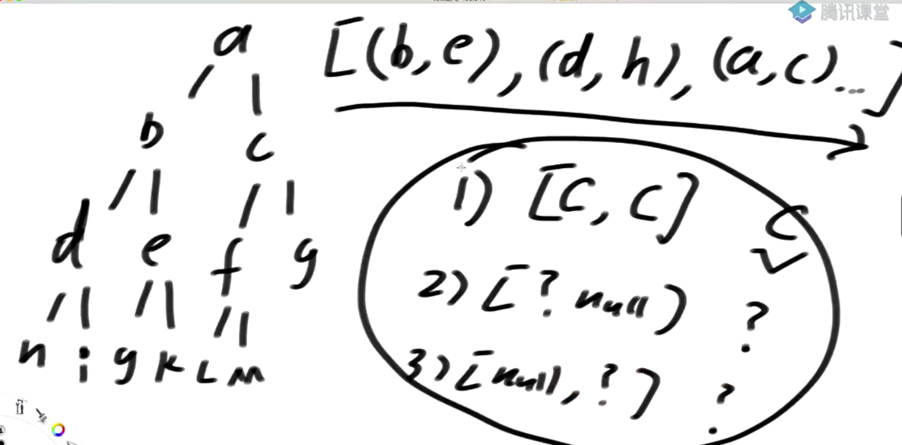 |      |
| ------------------------------------------------------------ | ------------------------------------------------------------ | ---- |

然后我生成这么几个表。这个表是为了我们将来填答案以及做查询用的两张表。第一张表叫问题表。第二张表叫填写答案表。你有一个（b，e）这样的查询，那么我这里就在问题表里，记录b和e有一个问题，e和b之间也有一个问题。因为这个查询在你查询请求中的0位置，所以在填写表中，记录关于b的第一个查询填在结果的0位置。e也是。

下面假设是b和c之间的一个查询。继续做出响应的更新。问题表就是依次往列表里面放。填写表也是根据查询的序号，依次往里面放。你遍历一遍，生成两张表。


| 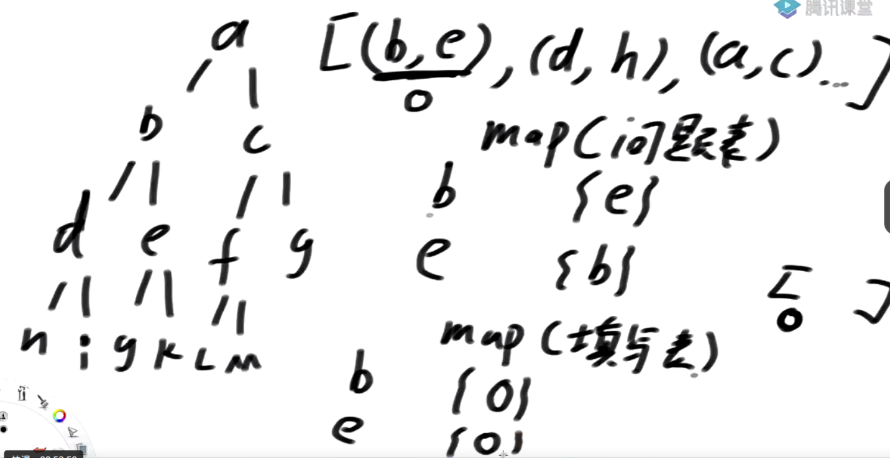 | 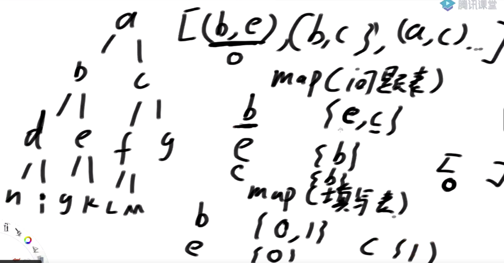 |      |
| ------------------------------------------------------------ | ------------------------------------------------------------ | ---- |

我们为什么要记两个呢？我们主逻辑想这么干，我们整体遍历的顺序就是一棵二叉树的递归遍历。那么递归便利就一定能够来到自己三次。如果我一次也没有来到的时候，比如说我来到这个a的时候，我能够查询关于a的有哪些问题。在这里假设它没有问题，任何人跟a都没有问题，a跟任何节点也没有问题。a就跳过，来到b。来到b的时候我就可以查询你b跟c和e，但问题是e跟c你还没遇到过。所以此时。我就删掉b跟e之间的问题，也删掉b跟c之间的问题。同时也删掉填写表上b的记录。我删掉是没有问题的，为啥因为我记了两个反向，b和e、c的问题可以通过c和e的记录还原回来。等到下次我遇到e的时候我就有一个机制知道b已经遍历过了，此刻b的填写滞后了，但是无所谓，因为下回你遇到e的时候，你就会发现你跟b之间有查询。并且b也遇到过，你也遇到过，这个时候你们就可以填答案了，通过e的查询表知道把答案填在零位置。就是一个问题表中两个结点，我们都遇到过，我们才填答案。这就是我们做反向的记录的原因。

你到e的时候发现b遇到过，e也遇到过，那么就可以把答案填好，填在0位置。但是c之前没有遇到过，所以删掉，在填写表也对应着删掉。那这个答案会不会错过？不会，你总有遇到c的时候。

| 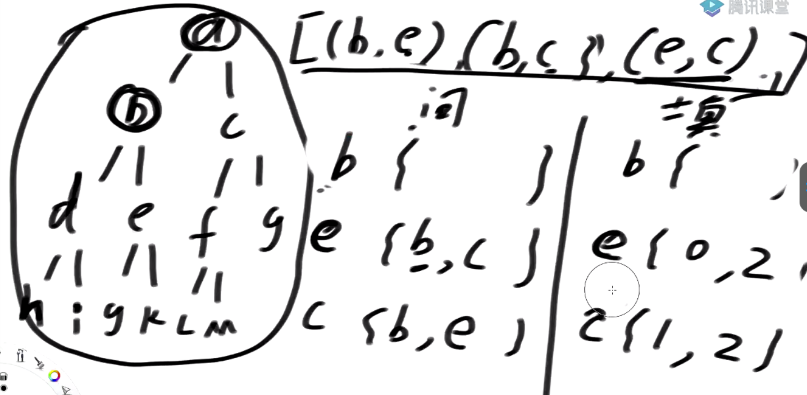 | 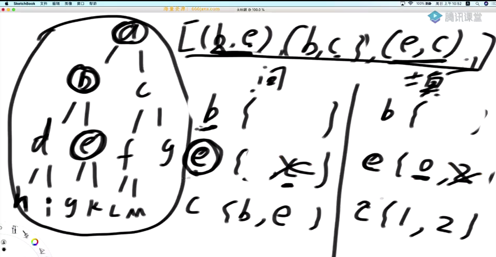 |      |
| ------------------------------------------------------------ | ------------------------------------------------------------ | ---- |

那么我们的流程就开始了。我们先简单的讲一下查问题的时候，我们用什么机制。假设我们要查一个ED之间的问题。一开始每一个点。都是单独的集合。从a开始遍历，它逻辑是这样的，去左侧递归的时候，请你把所有的结点合成一个大集合然后返回。返回的时候把a自己这个结点合并进左侧的集合里。然后打上父结点的tag是a再去查右边。在遍历到a的时候，它左侧遍历完之后是啥样？bce会合在一块。这个样子，回到你的时候，你把a也融进这个集合里去，abce彻底一个集合，然后abce这个集合统一打上一个tag叫做a这个结点。你至于abce内部谁是代表结点，我不关心。

然后我去右边遍历，当我遇到d的时候，我能够查出d跟e之间有一个问题，这个问题的答案是什么？这个问题的答案是e所在集合的tag。就是说你发现d跟e之间有有一个问题，怎么查出答案？你先查e所在的集合是啥？把代表节点查出来，这个代表节点上会打一个tag，发现是a，那么d跟e的答案就是a。

| 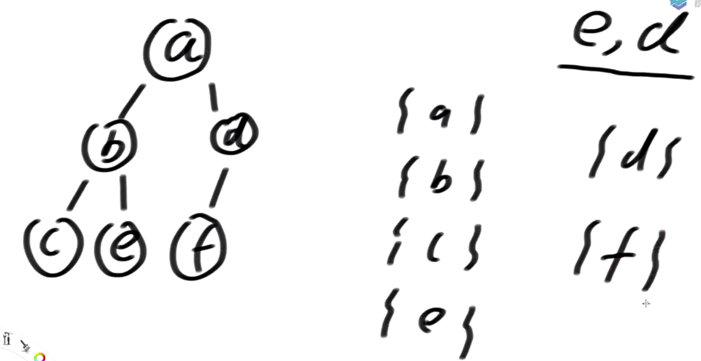 | 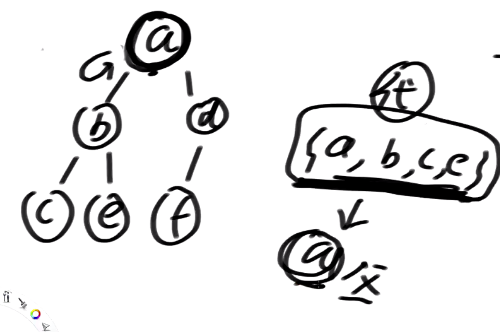 |      |
| ------------------------------------------------------------ | ------------------------------------------------------------ | ---- |

再来一个例子，假设查询e和f的答案。你遍历到c之前afks已经遍历过了，他们是一个集合，tag是a。你来到c的时候。左边遍历一下，回来，ce也合成一块，tag是c。遇到f的时候，你一看f和e是有问题的，通过表知道e也变量过了，那么此时就生成答案，答案就是e所在集合的代表结点打上的tag c，然后你通过填写表，把答案填到相应的位置。

所以粗略上来说就是x左树遍历完之后，把左树的集合跟自己合在一块，打上x的tag。右树遍历完之后，在第三次回到x的时候，把自己x所在的集合和这个右树所在集合彻底合在一起，打上x的tag。

打tag的顺序是这样的。查问题的时候，第二次遇到的节点和第一次遇到的节点之间怎么查答案，第一次遇到的结点所在的tag就是你们的答案。下图，2,1这个问题现在遇到了，发现1之前已经遇到过了，你么1所在集合的tag就是答案。

| 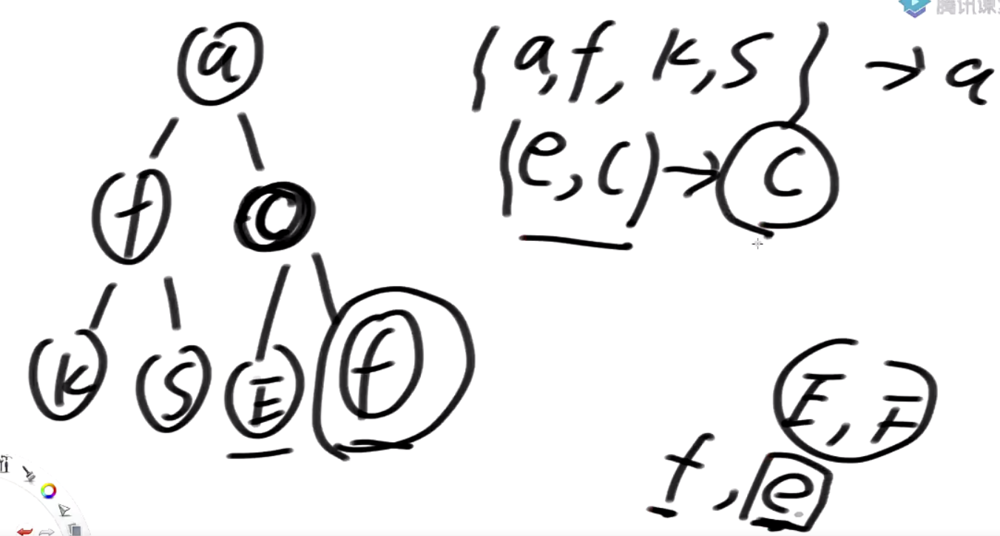 | 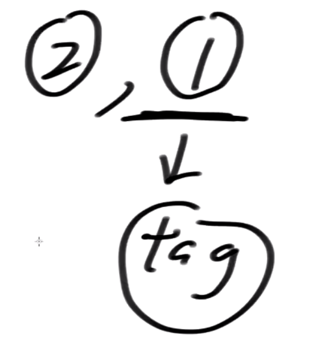 |      |
| ------------------------------------------------------------ | ------------------------------------------------------------ | ---- |

看例子。一开始所有集合都是空都打都没tag。所以你可以把怎么样叫遍历过，怎么样叫没遍历过，你就可以用这个东西来标记了，如果一个结点，它所在的集合没tag。这个节点没遍历过。如果一个结点，它所在的集合有tag，这个结点遍历过。然后你就开始遍历，a，b都没问题，依次往下，到e的时候，发现有两个问题，然后你就知道f和c之前没遍历过，因为f和c所在集合没有tag。此时e就可以打上tag了，tag就是e自己。

| 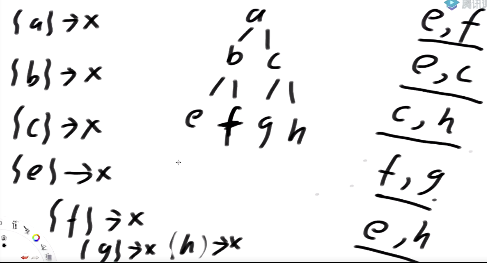 | 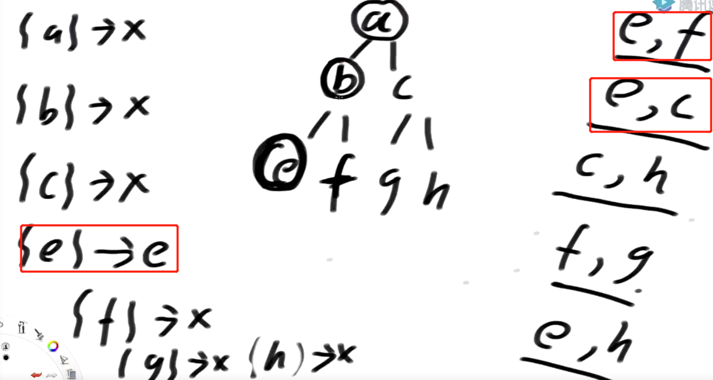 |      |
| ------------------------------------------------------------ | ------------------------------------------------------------ | ---- |

开始往上回，来到b。把b所在的集合跟e所在的集合合在一块并且打上b的tag。所以现在be合在一起了，tag是b。然后接下来来到f。f干件什么事，把自己所在的集合打成自己。开始查问题，发现f和e之间，并且e已经遍历过了，因为e所在集合有tag。所以e和f的答案就是e所在集合的tag，所以答案是b，这个答案就可以结算了。f和g还有问题，但是g没有遍历过，因为g集合没有tag。所以先滞后这个问题，等到轮到g的时候再去解答，然后f就返回了。f就返回到了b，b所在的集合跟f所在的集合合并而且打上自己的tag b。

| 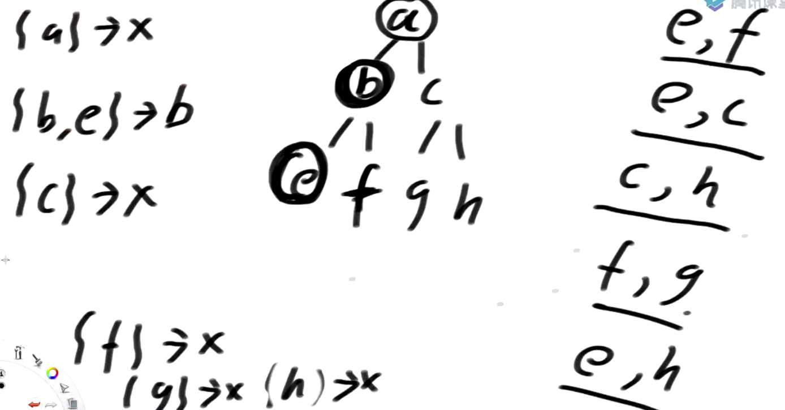 | 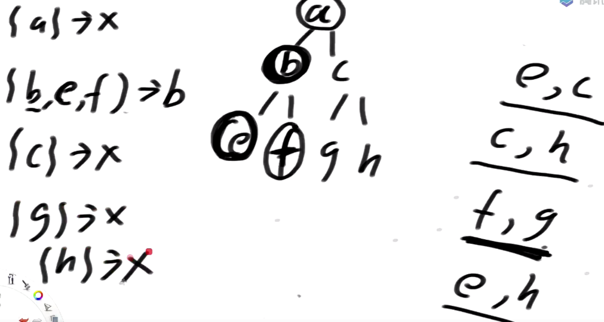 |      |
| ------------------------------------------------------------ | ------------------------------------------------------------ | ---- |

往上返回来到a，然后就把左树b所在集合和a所在集合合并，打上a的tag。往右边便利，来到c的时候，查发现c和h、e有问题。h没遍历过，滞后。但是e已经遍历过了，所以结算e和c，答案就是e集合的tag a。

来到g的时候，发现有一个f和g的问题，f遍历过，所以答案是f所在集合代表结点的tag a。要走之前，g所在集合tag打上自己。

| 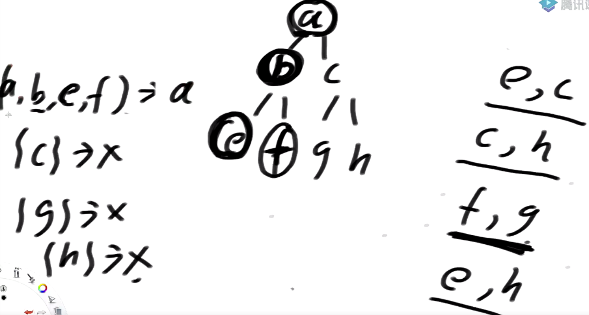 | 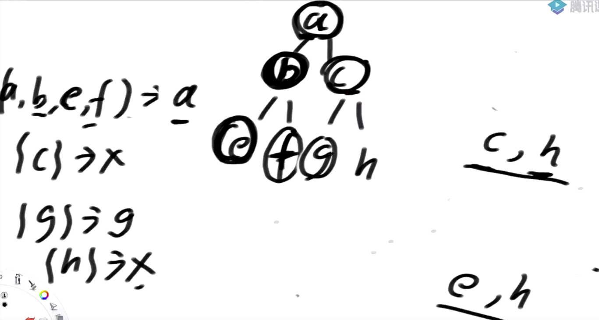 |      |
| ------------------------------------------------------------ | ------------------------------------------------------------ | ---- |

回到c的时候合并，gc打上tag c。接着来到h，c和e都遍历过，c所在集合tag是c。e所在集合tag是a。结算答案，至此搞定所有。

| 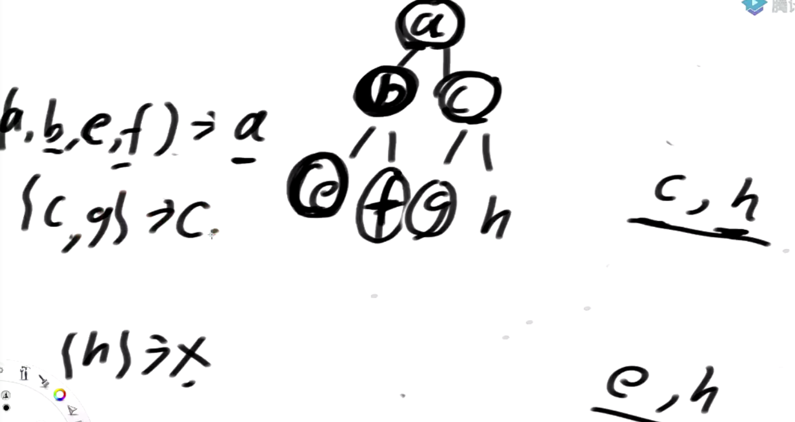 | 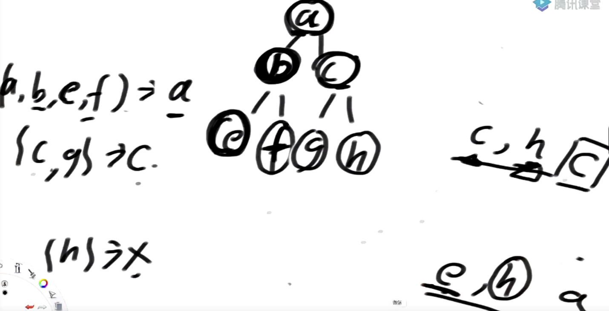 |      |
| ------------------------------------------------------------ | ------------------------------------------------------------ | ---- |

我就是从祖先往下才遇到你的，所以我不会弄错。例如下面的f和g。我一定是c弄完之后才会和f和g合并的往b走的，所以我tag不会变成b，此时的tag就是离你最近的。因为tag就是一直插到底，然后往上走的，一定会达到最低公共祖先的位置。

其实到第二个点的时候，第一个点到过的最高点就是答案，我们这个算法就是在模拟这个最高点到哪这件事。

|  |      |      |
| ------------------------------------------------------------ | ---- | ---- |

coding：集合打tag等价于代表结点存一个记录。并查集中所有的元素，他都是他怎么拿自己的tag，他不是说直接拿的，他是往上走到自己的代表节点，然后再看看自己代表节点上打了什么tag。

它这整体就是一次后序遍历。所以代价就是O(N)。问题的数量如果是m的话，最多就搞m个问题，都是在遍历这一遍的过程中搞的。所以总复杂度n+m。


### 全是1的最大子矩阵

常考

code4：

- 给定一个二维数组matrix，其中的值不是0就是1，其中，内部全是1的所有子矩阵中，含有最多1的子矩阵中，含有几个1?

前面有一个正方形的，这道题是长方形。

我们先看一个算法原型。求直方图的最大矩形面积。leetcode85题。就是单调栈，求每个数两边离自己最近的比自己小的。言外之意，中间的就是都是大于等于自己的，那么就可以构成一个长方形。

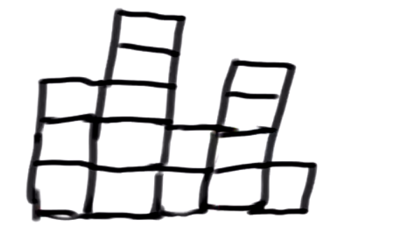

那么这题中，就是列举matrix每一行作为直方图的底就能做出来。复杂度O(N * M）。


### Interview Coding 22

训练营5，第6节


### 移除盒子

leetcode546

code1：

```题目
给出一些不同颜色的盒子 boxes ，盒子的颜色由不同的正数表示。

你将经过若干轮操作去去掉盒子，直到所有的盒子都去掉为止。每一轮你可以移除具有相同颜色的连续 k 个盒子（k >= 1），这样一轮之后你将得到 k * k 个积分。

返回 你能获得的最大积分和 。

示例 1：

输入：boxes = [1,3,2,2,2,3,4,3,1]
输出：23
解释：
[1, 3, 2, 2, 2, 3, 4, 3, 1] 
----> [1, 3, 3, 4, 3, 1] (3*3=9 分) 
----> [1, 3, 3, 3, 1] (1*1=1 分) 
----> [1, 1] (3*3=9 分) 
----> [] (2*2=4 分)
```

怎么设计递归函数呢？你一开始可能想到f(L,R)表示L~R范围上消掉的最大得分是多少。但是你会发现。像1122211这样的样例，你决定把222消掉了，后面会变成11xxx11，这样其实是不对的。这几个1应该视为连起来。这样的话你的arr就不是固定的了，你需要改变arr的值，而可变参数突破整型是我们的大忌！我一定要找出一种设计，让我的可变参数还是整形。

所以我们递归就设计成这个`int f(arr,L,R,K)`，三个可变参数，意思是我在L~R这个范围上，还有k个东西和L这个位置的东西一样。就是我这个范围上，我前面跟着k个a的情况下，请问这一坨东西都消掉得分是多少？

举个例子，主函数这么调。我最大的目标是在零到七范围上都消掉，那我前面跟了几个一呢？零个，所以如果我的递归含义真的能尝试出来的话。主函数就应该调它把值返回就可以了。

我们递归含义定了，那你到底想怎么展开可能性呢？展开可能性的同时，你也得维持原来的递归含义。我们递归含义只告诉我们前面的k个是和L位置相同的，别的我不知道。所以f(L,R,K),第一种可能性展开就是f(L,L,K)+f(L+1,R,0 )，意思就是我这个L位置的东西决定和前面的东西一起消掉。这样一来消掉之后，后面的范围就没有包袱了，所以k清空。这里有一个贪心，如果你前面有一坨1，然后你L后面还有和L位置一样的，那么你肯定把连着的一起消掉增长的快。但是跨着的就不一定一起消了，也就是222右边的11不一定一起消。

| 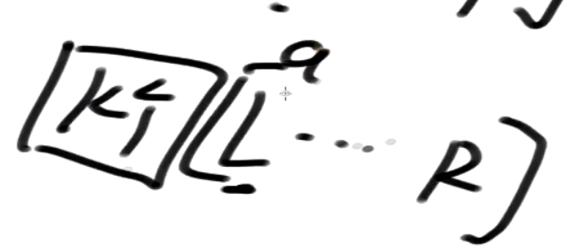 | 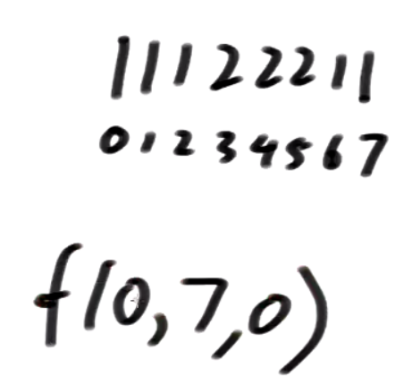 | 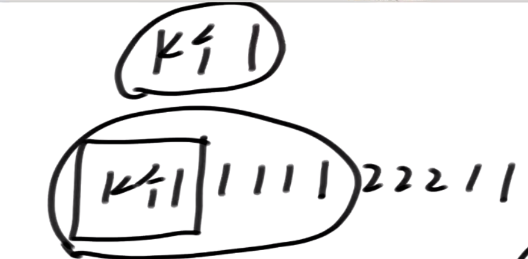 |
| ------------------------------------------------------------ | ------------------------------------------------------------ | ------------------------------------------------------------ |

重新列一下可能性。由于贪心，有一种可能性肯定是我前面的k个1和后面的11111一起消掉。这个得分假设叫a，位置假设x，那么第一种可能性如下，a+f（x，r，0），消掉就意味着包袱清空了

但是我也可以不清空我的包袱，我要把我的包袱变大，和222后面的111一起消掉，所以当务之急就是把222消掉？222怎么消？调用递归即可。这也一来，前面的包袱就累加到后面的111里面了。所以调用，f（x，y，0）+f（y+1，r，k+5），包袱变大！

我还想让包袱变得更大怎么办？那继续递归。一直这样尝试，直到后面的1都被你搞完了。

| 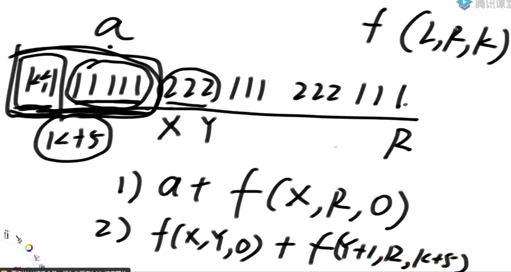 |      |      |
| ------------------------------------------------------------ | ---- | ---- |

这种试法我们来说一下，它完全就是根据我们这个原则给硬憋出来的。它牵扯到一个外部信息变简单化的过程，这个说实话，这种题都很难。你我们一开始说了，如果你整个在array上直接去修改的话，你的外部信息就没有办法变简单化，它就会变成一个很复杂的可变参数array本身。所以说我们就把L~R需要的信息给它放到外面去，变成一个简单的参数。它完全就是根据我们这个原则。想想尽办法补充潜台词，然后给硬憋出来的设计L、R、K都不超过整形的这样一种憋法。

### 奇怪的打印机

lc664

code2：

```
有台奇怪的打印机有以下两个特殊要求：
    -打印机每次只能打印由 同一个字符 组成的序列。
    -每次可以在从起始到结束的任意位置打印新字符，并且会覆盖掉原来已有的字符。
    
给你一个字符串 s ，你的任务是计算这个打印机打印它需要的最少打印次数。
 
示例 1：
输入：s = "aaabbb"
输出：2
解释：首先打印 "aaa" 然后打印 "bbb"。

示例 2：
输入：s = "aba"
输出：2
解释：首先打印 "aaa" 然后在第二个位置打印 "b" 覆盖掉原来的字符 'a'。
```

f（L，R）意思是你的L~R范围上要变成s[L...R]至少需要几转，主函数就是f（0，N-1）。范围上的尝试不难，想含义也不难定，关键就是可能性怎么列？还是先需要建立一些贪心。如果我就解决l到r上的问题，边缘处是啥情况？第一个贪心是，第一次如果我强行要求第一转的时候就把边缘的这个数弄出来，以后再也不改了，如果把策略定成这个，不会影响最后的最优转数。最优转法可能不止一种，但即便我们规定了边缘处的是第一次转出来，而且以后再也不改了，它也不会影响到最优解。

想法是你一个一个去枚举，潜台词是第一转全部都变成L位置，枚举每一个范围f（L，L+k）+f（L+k+1，R），如果s[L]==s[L+k+1]的话，最后需要减-1，因为开头这个位置在之前帮你做了。不要考虑会跨区间的问题，这个递归就是让左边帮你搞定，右边也帮你搞定，然后你再看看加工的时候要不要-1。

当大家遇到一道题目，可能性过多，你发现你守不出来一个整型的参数的时候，你发现你设计不出这个参数列表的时候，你可以从业务本身去挖掘它的一些贪心的东西。


### 最小区间

在有序表那里讲过

leetcode632

code3：

```
你有 k 个 非递减排列 的整数列表。找到一个 最小 区间，使得 k 个列表中的每个列表至少有一个数包含在其中。
我们定义如果 b-a < d-c 或者在 b-a == d-c 时 a < c，则区间 [a,b] 比 [c,d] 小。

示例 1：
输入：nums = [[4,10,15,24,26], [0,9,12,20], [5,18,22,30]]
输出：[20,24]
解释： 
列表 1：[4, 10, 15, 24, 26]，24 在区间 [20,24] 中。
列表 2：[0, 9, 12, 20]，20 在区间 [20,24] 中。
列表 3：[5, 18, 22, 30]，22 在区间 [20,24] 中。
```

那这个题其实它有可能有多个解。如果有如果这个最窄区间不止一个，你选那个开始的位置最小的。你建个有序表，放的数字从小到大组织。先把每个数组第一个数放进来。然后你在有序表中把最小值跟最大值拿到得到一个区间，那么，毫无疑问，这个区间一定是每一个数组中至少有一个数包含在里面的。一共多少个数你记录一下。然后最小值-9弹出，并且我有机制来知道-9来自哪，来自哪你就从拿再拿一个数放进来，所以拿了6放进来。然后再得到最大和最小，这次还是11个数，之前的开始位置-9比现在的-4早，所以我要之前的区间。

| 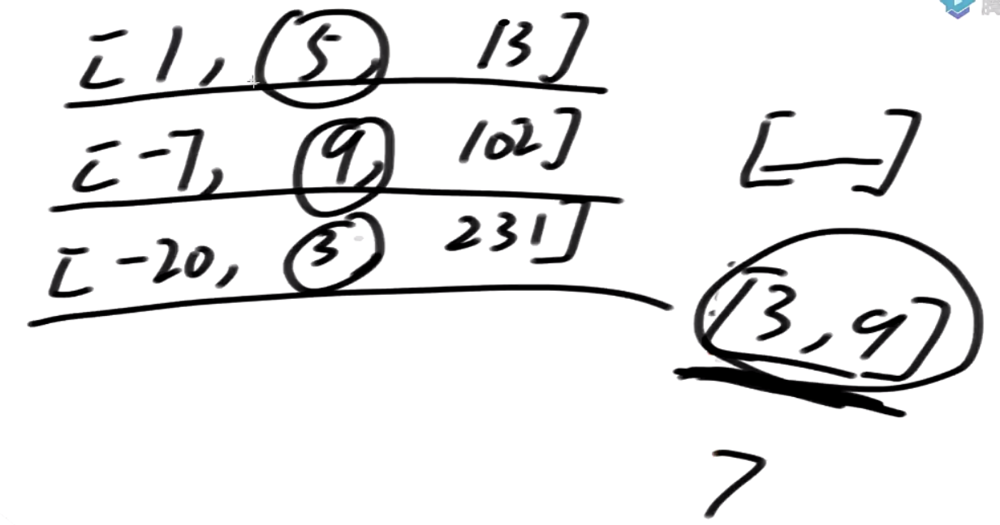 | 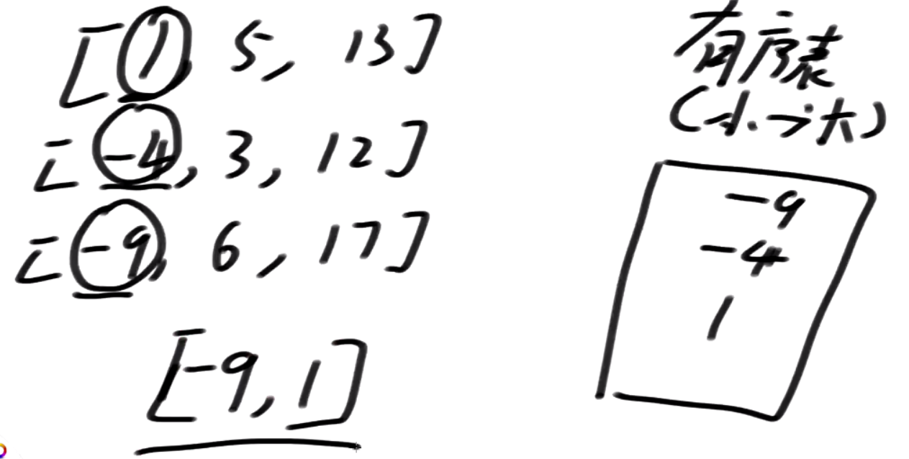 | 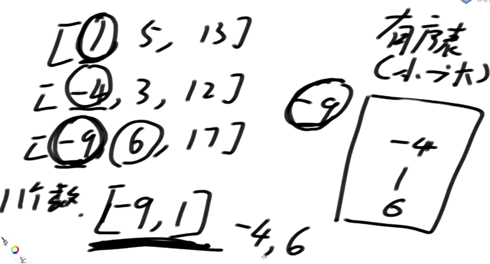 |
| ------------------------------------------------------------ | ------------------------------------------------------------ | ------------------------------------------------------------ |

再把-4弹出来，3进去。这次又得到一个新的区间，6个数，比之前窄，更新区间。依次类推你能找到所有的答案。本质上我们在枚举区间以每一个数字开头的答案是什么。这里有一个贪心，我区间的开始和结尾没有必要包含数组没有出现过的数。

| 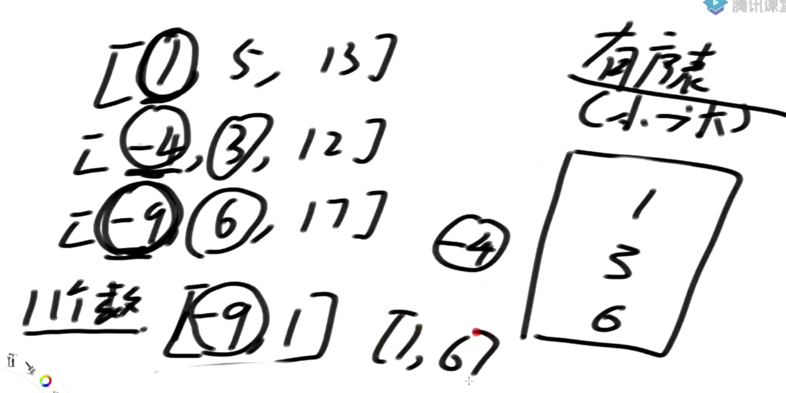 |      |      |
| ------------------------------------------------------------ | ---- | ---- |

### 丢失数字

code4:

这种这个题，它出来是有功能的。不是给这个普通学生做的。它是为了在有一有一些别的功能的。筛出一些聪明人。

- 整型数组arr长度为n(3 <= n <= 10^4)，最初每个数字是<=200的正数且满足如下条件

  1. 对0位置的要求：arr[0] <= arr[1]
  2. 对n-1位置的要求：arr[n-1] <= arr[n-2]
  3. 对中间i位置的要求：arr[i] <= max(arr[i-1]，arr[i+1])

  但是在arr有些数字丢失了，比如k位置的数字之前是正数，丢失之后k位置的数字为0请你根据上述条件，计算可能有多少种不同的arr可以满足以上条件
  比如 [6,0,9] 只有还原成 [6,9,9]满足全部三个条件，所以返回1种。


它的麻烦点在于一个位置可能是跟它左边跟右边共同有关系。猜法：f（v，i，s）。i代表我现在来到了i位置，i位置的数字是v，s代表右边的数和当前数的关系，s==0代表右边大，s==1代表相等，s==2代表右边小。f就是在这情况下，0~i有几种有效的变法。主函数如下。最右侧不是丢失的数字0，因为右边没有数了，要让右边对你没有影响，所以传2。如果最右边数0，也就是一个丢掉的数字，你就把N-1位置变为1~200，去枚举。

这个v是我意想的。不是arr中真的是v。能不能递归下去你要去验证。

这个题跟我们remove box那个问题都很难猜，它的难点在于什么，你自己猜的时候，你发现你怎么都要改变一下array的值，千万别，还是那句话，不能让可变参数突破到整形以上。这样的话，你就得想尽办法绞尽脑汁把这种变化给它搞出一个外部信息，而且是简单参数能代表的。

coding你可以先去想象然后再去递归里面验证，你页可以调用的时候就先看看它能不能让你想象。这题有枚举，我们改成经典的动态规划去看看能不能省掉枚举。

| 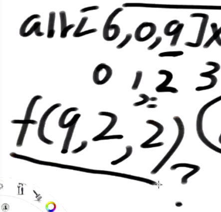 | 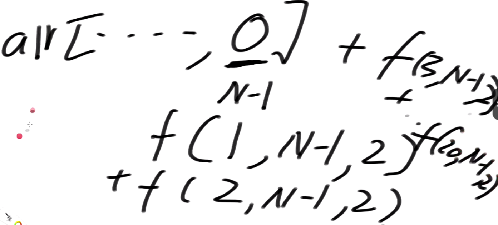 |      |
| ------------------------------------------------------------ | ------------------------------------------------------------ | ---- |

你会发现，只有中间这一坨在枚举，而且是累加和的关系，那么我就想，我如果有dp[i-1] [xx] [0/1/2]的前缀和就好了！所以我们的优化就来了。

| 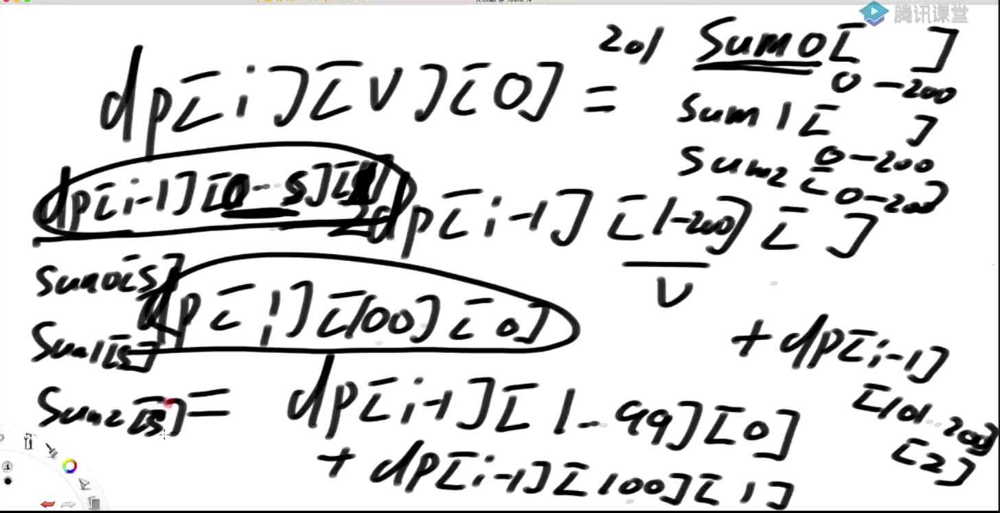 |      |      |
| ------------------------------------------------------------ | ---- | ---- |


### Interview Coding 23

训练营5，第7节

我们现在都不知道说一个np问题，能不能转化成一个p问题，这个都不知道。那如果一个p类的高阶问题，能不能转化成一个p类的低阶问题，更不知道了。


### TSP问题

code1：

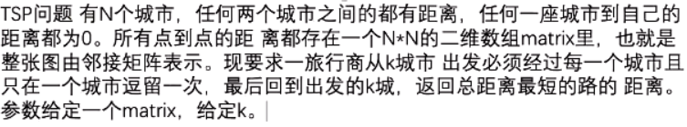

它这个图是一个全连接图。也就是说比如我给你0~4这五座城市，这个图是个全连接的，任意两个点之间都有距离。有向图2->3距离不一定等于3->2，但是这里我们认为是无向图，也就是2->3距离等于3->2距离。tsp问题本身是无效图，有效图都能解，那么这里面我先简单的理解为无向图。你这样一来的话，你这张表里面所有的值假设都没有正无穷，那么它就是一个全连接图。

既然是全连接图，就有一个问题了。我假设我某一个邮差，我这是零座城市，一座城市，二座城市，三座城市，四座城市。我某一个小人。我想做的工作是什么？我从一个点出发。比如说我从一出发。我想最终我从一出去，我想最终回来。沿途的每一个城市都必须经过一遍，而且只能经过一遍，最后回到一。请问这个过程中我选哪条路能够让总距离最短？这就是TSP问题。首先我们来看。TSP问题有一个特征，就是你不管从哪个城市出发，最终回到哪个城市。最短的总距离是一样的。也就是你，不管是你从从零出发，最终回到零，还是从一出发，最终回到一，还是从二出发，最终回到二，还是从三出发，最终回到三。还是从四出发，最终回到四，这个总距离的值是一定是一样的。因为你整个最优的这个这个路，它是一个环。也就是说tsp问题是不用指定从哪出发的。它不管指定从哪儿出发，它的最优总距离转一圈儿回来都是一样的。

这里面尝试怎么写？我们这样来想这件事情。假设我有个递归函数。那么，这个第一个参数呢？是一个集合。第二个参数呢，是假设它是某一个出发点。这个出发点一定是属于这个集合里面的某个点。返回的是，我有一个规定好的原出发点。这个是一个外部信息，跟f没关系，这个函数指的是通过这个出发点，把这里面集合，所有东西都连通之后，最终回到原出发点，请问最优的总距离是多少？

举个例子。假设我们有五座城市，我们规定从谁出发最终回到谁都行，我们就可以规定零，也可以规定一，也可以规定二，哪个都能规定，那么就选一个。假设原出发点，它就是零。那么我们主函数怎么调？就这样调-p2。这个函数指的是。你在这个集合里面有零一二三四，这五座城。我指定好了你要从零出发。最终，请你把通过零城市，通过一城市，通过二城市，通过三城市，并且通过四城市之后。再回到原来的点零，请问这个过程中最优距离是多少？

我现在已经来到零这个点了。我有几种选择。第一种选择。我就想从零直接去一。那你子函数是什么？--图3。在这个集合中，一二三四这个集合中，我是从一出发的。我一定要经过一经过二经过三经过四沿途节点，只经过一次之后，最终回到零点，最小距离是多少？这个距离我求出来，我只要再加上零到一的距离，就是总距离。回去的点永远是固定的，当做是一个潜台词

| 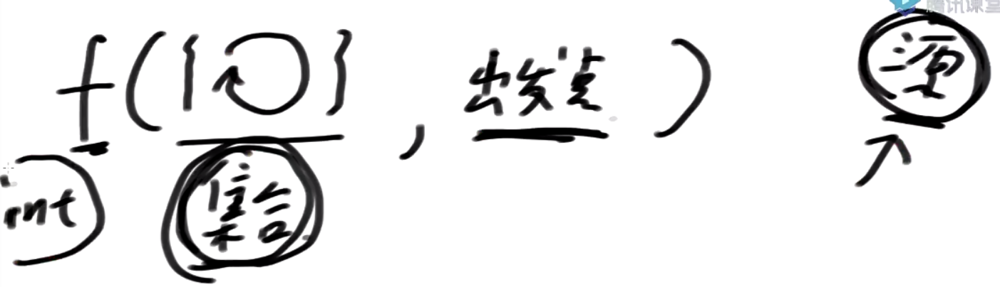 |  | 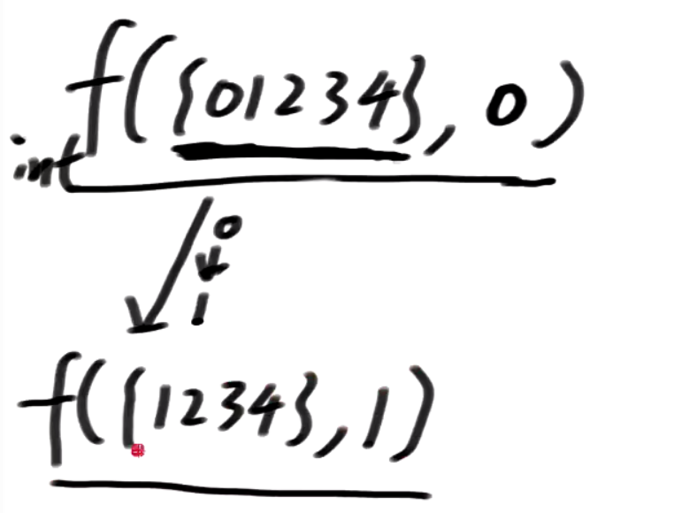 |
| ------------------------------------------------------------ | ------------------------------------------------------------ | ------------------------------------------------------------ |

那我还能怎么选？零这个点我就想让它直接去二，那么继续调子过程。请你去从二位置出发，最终。经过一。。。经过四之后回去的总距离最好是多少？如果我把这个总距离求出来，再加上零到二的距离就主问题的解。第三个分支就是我零到三。下个分支就是我零到四。只有这么四条路。我把每一个子问题都列出来，那你说最好的是啥？那就是几个子问题补上相应的一段距离，那个好选哪个。

你会发现base case这里是你人为规定回到0，所以最终所有会串起来。

| 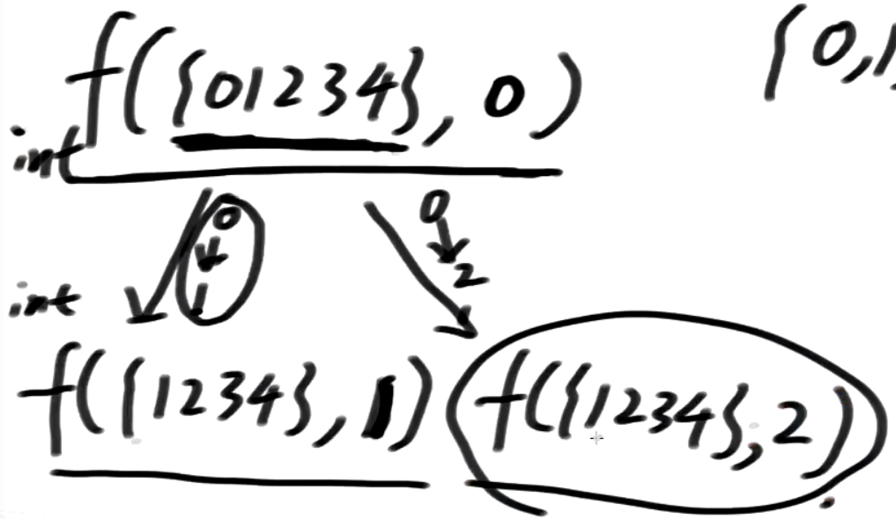 |  |      |
| ------------------------------------------------------------ | ------------------------------------------------------------ | ---- |

我们先了解一个问题。就是说你。你两个可变参数，你会不会撞到重复解？有的。既然它有重复解。既然它有重复解，就势必。存在某种形式的动态规划，不让它重复计算。但是怎么确定集合是一样的呢？我们这个递归函数是f函数，它是集合的概念。它可变参数是个集合，对不对？它第二个参数是个整数，这个好说。如果你第一个可变参数，它是一个集合概念的话，它就很复杂了。这也就相当于违反了我们猜递归猜动态规划的那个原则，不要让你单一的可变参数突破到整形以上。因为你如果突破到了整形以上，就意味着这个单独参数的可能性非常的多。所以tsp问题可以说是我们面试中遇到动态规划的一个异类，它叫状态压缩的动态规划。什么叫状态压缩的动态规划，就指的是我无论怎么样尝试，我这个集合都没有办法化成更简的形式了。事实上，这种尝试就是世界上tsp问题的最优解。

我们说我们刚才怎么表示集合的？零位置是空表示不存在，一位置是一表示存在，二位置是空表示不存在，三位置是一表示存在，四位置是一表示存在。你能不能用位信息代替啊？位信息可不可以再给它搞成一个整数？也就是说，我们这个f函数可以设计成两个整形的东西。但是这个整数我不是用它的值来表示可能性的，我是用它每个位的状态来表示可能性的。这样一个整数的位状态就可以替代一个列表形式，存在跟不存在的样子。所以叫状态压缩。所以我们的暴力递归还可以改写一版。

| 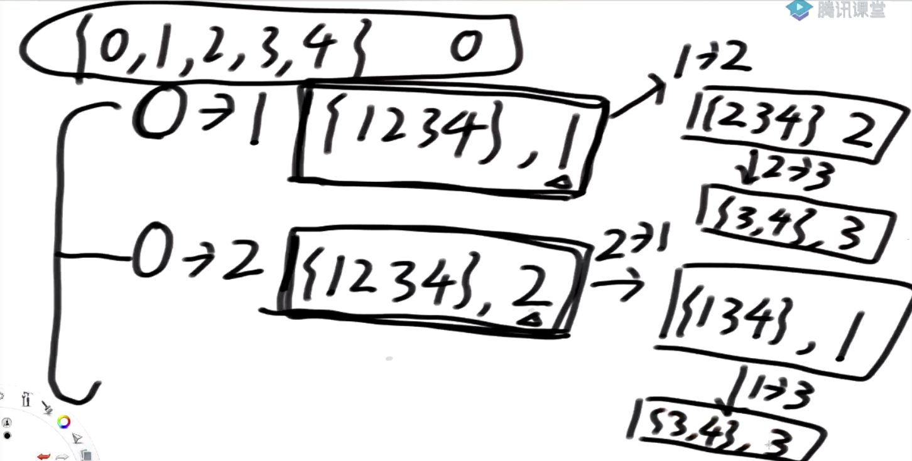 | 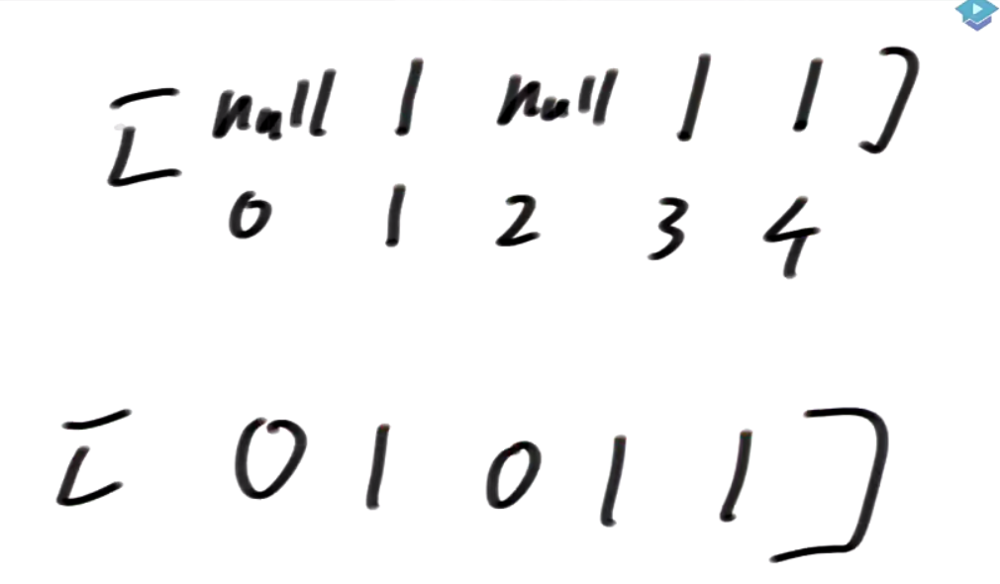 |      |
| ------------------------------------------------------------ | ------------------------------------------------------------ | ---- |

搞完之后，就是两个可变参数int了，直接记忆化搜索。

```
位运算怎么得到最右边的城市？
status&(~status+1)，与上自己的补码就可以得到右边的1

如何把第i座城市去掉？城市从0开始编号
status&(~(1<<i))
  10110011
& 11101111     <=> ~(1<<4)= ~(00010000) = 11101111
= 10100011

如何把第i做城市加回来？
status|(1<<i)

如何检查第i座城市在不在？
status&(1<<i) != 0 ，不为0说明在，否则就是不在
```

记忆化搜索完了，你也别给我弄说明记忆化搜索了，你严格位置依赖，能不能把表给我填好直接返回？先分析一下它这个状态怎么依赖的来看？假设我有五座城。f函数的第一个参数做了行对应，也就是状态做了行对应，出发城市做了列对应。所以第一个状态就是全零的状态。请问全零的状态怎么填？0这座出发城市都不在，所以全零的第一行无意义。第二行，00001呢？因为只有第0位是1，所以只有0这座城市出发才有意义，其它都无意义。 并且只有零这座城市，它最终回到自己，所以值为0。再下来是00010，还是一样，只有从1城市出发才有意义，并且它只有一座城市，所以填从1到0的距离。接下来是00011，2~4城市格子无意义。00011依赖（00001,1）以及（00010,0），这两个上面都有。

所以它精髓的地方就在于我们通过状态依次加一所得到的所有状态，在求具体一个状态的时候，上边的状态我们都已经求过了，你依赖的任何一行在顶上的状态我们都有。为什么让状态加1，你需要依赖的东西我上面都有？因为你去除某一个城市的时候，一定是让status变小的！一定不会变大！！

复杂度如下。是目前世界上最优解。很多的经典的一些新的算法流派也会去算tsp问题，但它不是奔着最优解去的，它奔的是一个还不差的优良解去的。如果要最优解，这个复杂度就是最好的。

| 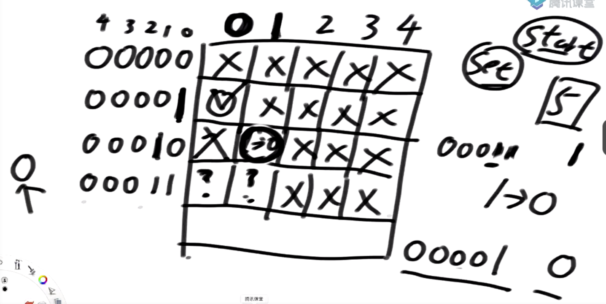 | 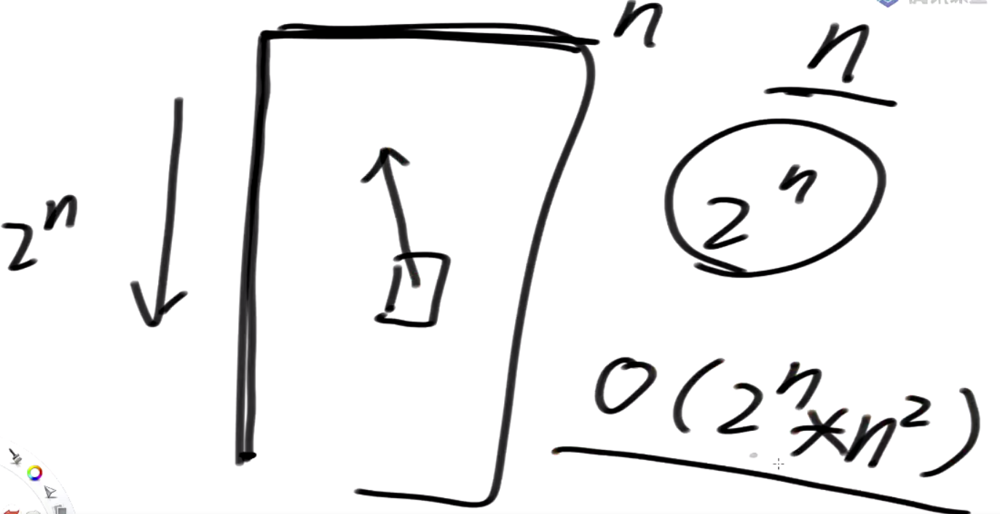 |      |
| ------------------------------------------------------------ | ------------------------------------------------------------ | ---- |


### 贴瓷砖问题

- 你有无限的1 * 2的砖块，要铺满2 * N的区域，不同的铺法有多少种?
- 你有无限的1 * 2的砖块，要铺满M * N的区域，不同的铺法有多少种?

这道题很难猜。你正常猜就一个可变参数设计的时候，它不用突破到整形以上，再次强调这一点。今天只是给大家长长见识而已。

第一题，在斐波那契数列问题里面有。很简单。f（n）就代表摆平2 * n区域有多少种方法。

| 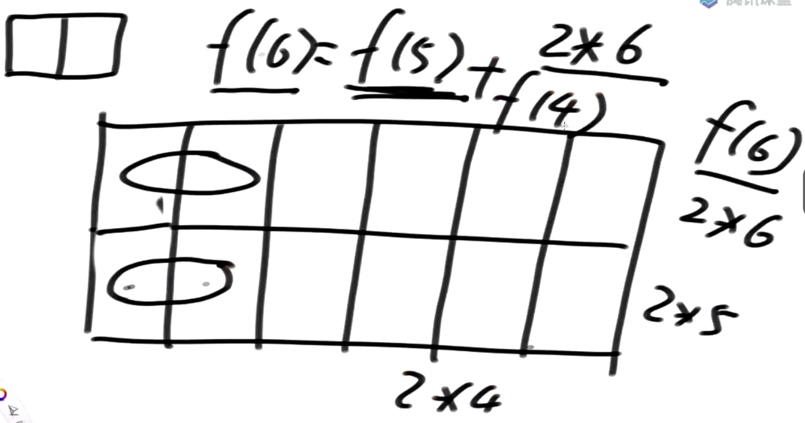 | 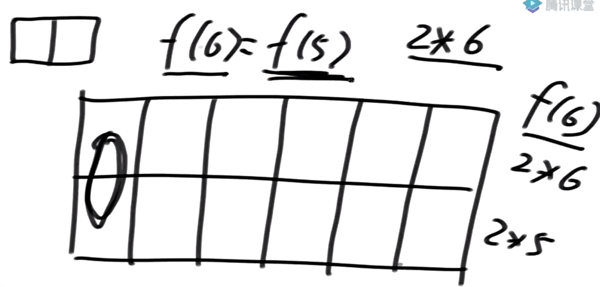 |      |
| ------------------------------------------------------------ | ------------------------------------------------------------ | ---- |

如果我给你参数是一个m×n的区域，你想铺满它有多少种不同的铺法？我定义一个函数f，其中第一维参数是一个矩形，是一个二维的可变参数。问你在这个二维的可变参数上铺满有多少种方法？如果你随便放了一个，你要把这两块给抠掉，如果你这么猜的话。你就干了。你可变参数是一维的时候都已经很复杂了，你还搞个二维的。但是它有没有可能有重复解？有可能。但是命中率太低了。

猜法很特别啊。他怎么憋出来的？它已经单精竭虑到把二维可变参数变成一维，就以这个猜法就已经很怪了。它定义这么一个可变参数	f（int[] , i），一个状态的数组一维的，i行。这个递归代表啥意思？这个递归代表你现在来到了第I行，我告诉你第i行上现在还没有填瓷砖呢。然后我们限制一下一个点上铺瓷砖的方式只有两种，而不是任意的四种。一个点，要么你往右侧摆，要么你往上侧摆。那你做这样的限制，会不会影响你的方法数？不会为什么，因为一个点往左摆，就等同于你在这个点的左边的时候选择往右摆。实际上这样并不会影响我们的方法数。我们先把摆瓷砖的方式限制死，之后我们再来分析这个递归是啥意思？

我现在来到di行。从第I行开始往下，从第I行开始，包括第I行及其下面的所有行都是干净的。这个数组它只由零和一组成的一个数组，这个数组，它表示i行的上一行也就是i- 1行它的状况，零代表没瓷砖，1代表有瓷砖。也就是说。第一个参数表示i- 1行，有砖无砖的状况。第i行表示，我从第i行开始往下都是干净的，而且我现在要考虑在第i行放砖的问题。这是强大的潜台词。还有一个。我认为i- 1行网上的所有的行都是无空隙的。i- 1行，往上所有的行我都认为摆的满满当当，已经摆完了。

总共这个函数是说。我现在来到第i行，开始摆瓷砖，i行及其往下所有东西都是干净的。我告诉你i- 1行的状况在数组里。而且我告诉你i- 2行及其上面所有的行都是无空隙的，被砖头塞满了。这种情况下，你把i- 1行都填满，且把i行下面的东西都填满，方法数是多少？

| 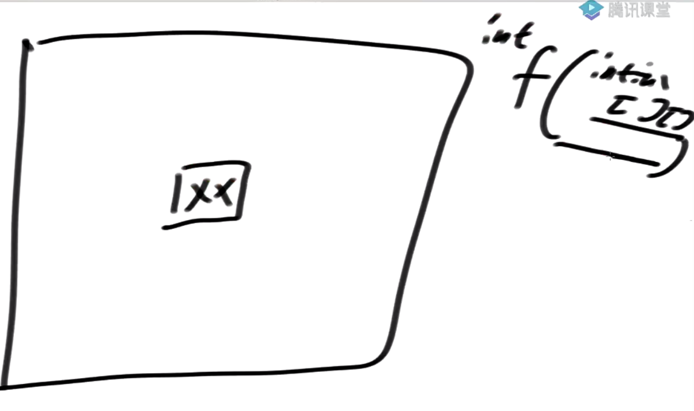 | 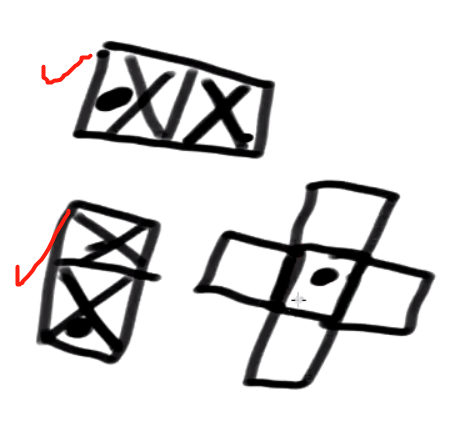 | 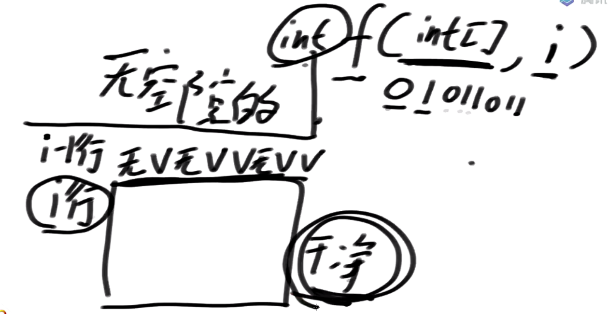 |
| ------------------------------------------------------------ | ------------------------------------------------------------ | ------------------------------------------------------------ |

主函数怎么调？从零行开始填起。我负一行的状态全是满的。负一行及其网上的砖都填满了，问你把零行填满，把负一行所有的砖都填满，并且把底下的地方都填满，有几种方法？我的base case是什么呢？假设你一共有从零行到n- 1行。你什么时候停当你的f。来到n行的时候，你就可以停了。你来到n行，就意味着你已经无法再填瓷砖了。来到n行，就已经意味着你无法再填瓷砖了，那f的返回值是什么？如果这个参数是全一的状态，返回一。如果这个参数，哪怕有一点不是全一的状态返回零。既然我N行没办法填了，你N-1行给我的数组必须全是1，你给我把N-1塞满了。

下面问题就是你普遍位置怎么拆？假设你来到第零行。负一行完全不用你操心。你说你第零行想怎么填？因为我们规定你砖头只能往上和往右，上面又插满了，所以你砖头只能往右摆。我可以在前面塞一个砖，然后我就不管了，你去下面做决定吧。还可以右边的那种，继续去下面做决定。第0行所有可以自由发挥的可能性巨多种每种都给我去试！你0行可以尝试的状态是因为你-1行已经插满了，现在我们假设上面没插满。

|  | 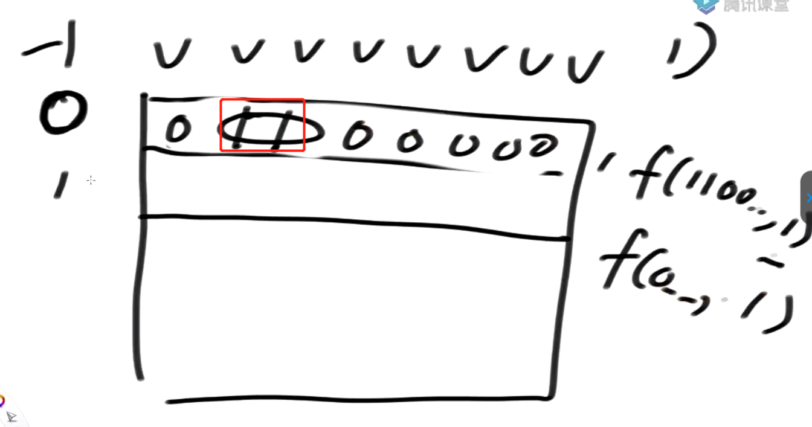 |      |
| ------------------------------------------------------------ | ------------------------------------------------------------ | ---- |

当上面没有插满，在上面为空的时候，只能在你这里竖着摆。其它没有空着的地方你去自由发挥。上一行的数据状况决定了你哪，你这一行哪些点不能胡乱试，只能竖着往上摆。但是上一行满的，在这一行你是可以自己去自由搞的，摆砖或不摆砖，随你的便。

|  |      |      |
| ------------------------------------------------------------ | ---- | ---- |

这种状态压缩的方法，一旦在面试场上出现，它的概率是极低的。我怎么设计一个非常简洁的外部信息其实对于设计一个递归参数是非常有帮助的，或者说有很有启发意义的。尽量把你依赖的外部信息变得很少或者说结构很简单。你越变得越简单，你的最后的动态规划越好写。再比如说打气球那个问题，如果我让每一个气球都最后爆，我发现我外部信息就只用限制成潜台词就够了，就是在l跟r上试气球的时候l- 1位置的气球一定不爆、r+1位置的气球一定不爆，我就能试出来了。关键就在于如果一道题它很难猜，你的着眼点应该集中在我依赖的外部信息怎么样最省。潜台词是什么、怎么去设计含义。第六节里面就有两道题是关于外部信息简单化这个问题的讲解。还是那几个原则，你设计出一个不好的外部信息，你是能知道的，只要你发现你的可变参数突破了整形，你就知道你没猜对，你就换一种猜法。

### Interview Coding 24

训练营5，第8节


### 后缀数组

后缀数组的地位。后缀数组比官方的最优解还好，但是太难，不会作为标准。

首先很多字符串问题是以后缀数组作为最优解的。这就意味着有很多问题在你在面试的时候聊出来的话，会极大的涨身价。所以它有点像装逼性质的，但实际上它非常有用，只是因为过于难，导致反而在要求上不会到这种程度。

后缀数组它是个解决什么问题的呢？它解决的是这样的问题。我们都知道一个字符串，它可以认为是字符类型的数组。0~6开头的后缀串如下。如果我要排序的话，按照字符串的字典序来排谁是排第一位的。什么叫后缀数组呢？就是把这个排名记下来。这东西返回了，它就是我的后缀树组。所以后缀数组是什么？后缀数组的意思是以某个位置开始，后面整体的后缀串它在所有开头位置的后缀串中排名第几？把这个排他自己的排名作为成一个数组返回。跟它对应的就是rank数组。rank数组是啥意思呢？所以后缀数组和rank数组，它就是一种转化关系，你拿后缀数组可以在O(N)的时间转化出rank数组来。你拿rank数组可以在O(N)的时间转化出后缀数组来。后缀数组的下标代表后缀串，rank的下标代表排名。

后缀数组与rank数组这两个东西可以解决非常多字符串的问题。大名鼎鼎的rmq。所以有关于这个后缀数组，如果你会了之后，它有哪些应用？如果你就可以下面自己去看帖子学习了。关键点就是在于后缀数组怎么样去生成最方便。

| 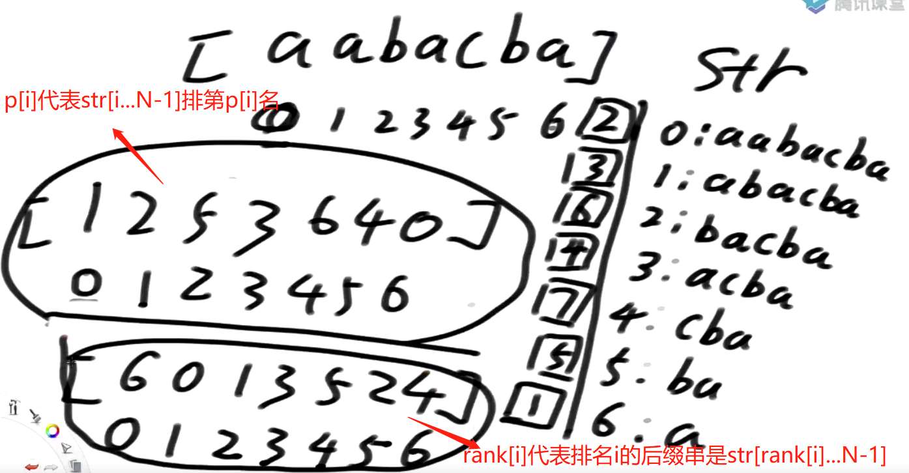 |      |      |
| ------------------------------------------------------------ | ---- | ---- |

暴力方法当然是我生成所有的后缀串。我光生成这个所有后缀串的代价就已经是N²了，N是字符串的长度。排序的代价是N² log N，N是后缀串的个数，由于比较的代价和N有关，所以多了一阶。这样一来总的复杂度就是N² log N。最优解可以做到O(N)！！前提是字符串里面的字符类型不超过ASCII。

在正式介绍后缀数组最好的生成办法之前，先来温故需要用到的一个排序，这个排序叫基数排序。升级一下，假设有两位信息，那么就拿第一位过一遍，再拿第二位过一遍就行了。这个东西有了。我们来想一下，那哪怕你一个数字是三位信息，并且告诉你每一位的值不会特别大，那么这些好多对象排序完还是O(N)的，无非就是每一位过一遍桶。

| 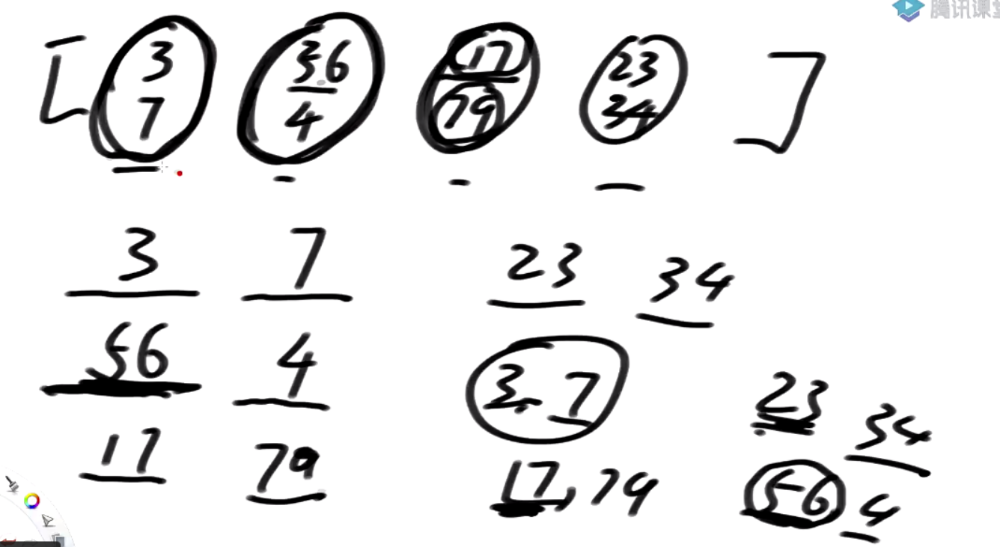 |      |      |
| ------------------------------------------------------------ | ---- | ---- |

开始真正的搞后缀数组的求解了。整个求后缀数组的解法叫DC 3算法，2002年出来的算法，也叫skew。还有一个叫倍增算法就是。但是倍增它的复杂度，其实没有DC 3好，但是它这个常数项优秀一点是吧？这个我们就不讲倍增了，你理解完DC 3，你去你去搞倍增跟玩一样。

首先我把我下标分类。如果I模上三之后是零，我就认为I是零类下标，代号s0类。如果I模三之后是一的话我就认为这个I属于一个一类下标，代号就是s1类。如果这个I模三之后等于二的话，我就认为这个I它是一个二类下标，代号就是s2。那么我们就看一下这个这个这些下标都属于什么类？它一定是交替的。所有后缀串长度是不一样的，不可能有重复排名。

我假设有一个非常方便的方法可以把s1类跟s2类开头的后缀字符串的数组排名求出来。你比如说。一开头的是s1类，那它的后缀字符串是BAAAACC。所以二下标的后缀字符串，它也属于这个范畴。四开头的它也属于s一二类、然后五开头的也属于s一二类。但是3/6这种位置就不是了。假设s一二类可以非常方便的求出来，我能不能得出所有零类下标一类下标跟二类下标整体的排名？也就是我们通过s1和s2类的这个排名，加工出整体的排名。

我先看看s一二类能不能把s0内部的排名搞定？就是下标为零开头的，下标为三开头的，下标为六开头的你们这三个的排名能不能得到？你发现还不用s1和s2的信息，我就先知道了6下标的肯定不如前面的，因为它是c开头的，这个过程可以用一个基数排序。也就是说你s0内部的首字母如果不一样，其实根据首字母就可以画块儿了。我a块的东西就是比c块的好，首字母不一样的块儿，不同的块儿之间的排名我一定能够求出顺序。那么，下面的问题就是说我零开头的后缀串跟三开头的后缀串就是同样在一块，怎么排名？六已经决定出来了，它是最后一名。

| 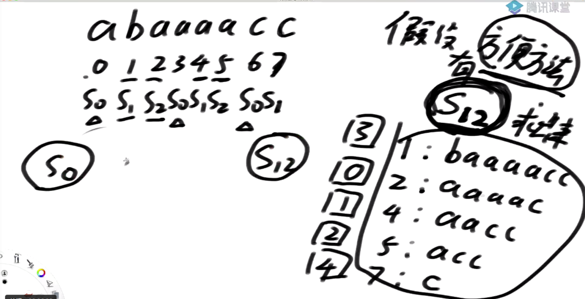 | 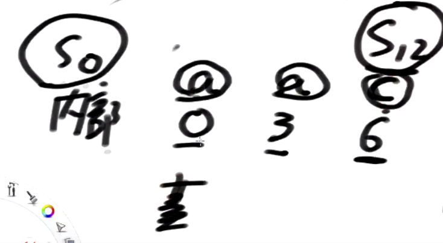 |      |
| ------------------------------------------------------------ | ------------------------------------------------------------ | ---- |

那我以零开头的这个字符是a，我三开头的字符也是a，我接下来PK什么？接下来pk后面的所有。但是现在你有发现了，0下标后面是1开头，3下标后面是4开头，1和4不就是s1的信息吗，这个是我们当前假设可以得到的信息。下面假设0开头的后缀串后面跟着的s1信息是3，而3开头的后缀串后面跟着的信息是1，那么我就知道0开头的这个串干不过3开头的这个串，那么排名也就出来了。就是它往后整体的信息，它需要的都在s一二内部。我们在s0内部排完之后，发现决定不了的，通过s1和s2的信息再过一遍排序。

也就是说，我通过s一二的信息是可以把s0内部信息搞定了。现在的情况是，s0内部你搞定了，s1s2内部你也搞定了。你要整体排名，你只要有merge策略就行了。那么看能不能merge？你先把s0内部的第一拿出来，然后s12内部的第一拿出来，发现第一个字符都是a，比不出来。然后你往后列，直到列到两个字符的位置都在s12内部，再去调用s12的信息。具体就是再往后比两个字符，发现5和4往后的信息在s12里面有了，就可以直接用了。也就是当s0位下标遭遇s2位置的下标的时候你最多比较三次就知道谁大谁小了。如果是s0位下标遭遇s1位置的下标的时候你最多比较2次就知道谁大谁小了。

| 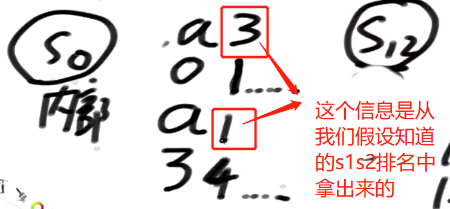 | 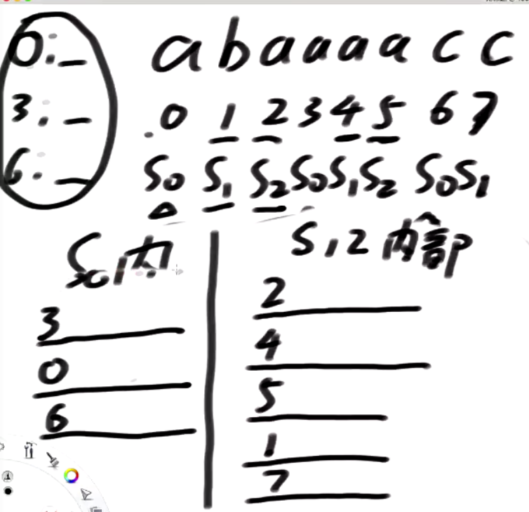 | 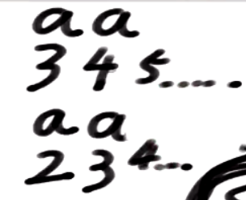 |
| ------------------------------------------------------------ | ------------------------------------------------------------ | ------------------------------------------------------------ |

4和5开头的后缀串从s12的值，4的在前。所以2位置开头的后缀串在所有中排第一。所以2这个后缀串就排出去了，s12内部的指针来到了4位置开头。4位置开头继续和s0内部的3位置开头的pk。然后只需要比两位就够了，到4和5的时候直接去s12拿信息。发现4比5排名高。所以3开头的后缀串也排出去了。s0内部的指针继续往下。继续去merge，可以统统排干净。

| 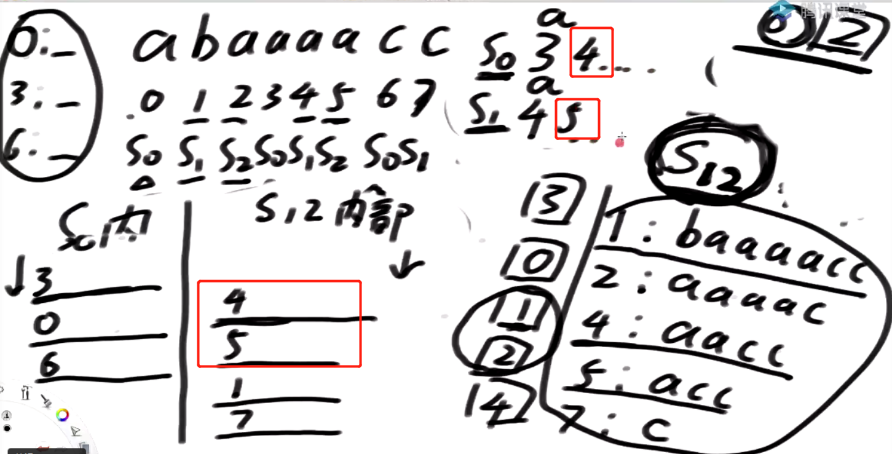 |      |      |
| ------------------------------------------------------------ | ---- | ---- |

梳理一下。字符串长度N。第一步我必须有一个迷之的f函数的过程，帮我得到所有s12内部的排名。第二步就是我用s12的这个信息，我去得到s0内部的信息，也就是内部排名，那么这个过程都用基数排序O(N)。第三步就是我把s12跟s0去merge，我又利用到s12类的信息都排出来，这个毫无疑问也是O(N)的。也就是说成败的关键就是第一步，后面两个过程都是O(N)的一个过程。

下面我们就要把目光聚焦在第一步上了。我要你搞定s12类精确的排名，里面肯定没有重复值。画三角的它就是s0类，我们不管它。画下划线的就是s一二类。我们先这么想，我们怎么决出1/2/4/5/7/8/10/11开头的后缀串的排序？我们先不急，我们先只拿前三维信息来比一下。一开头我先不考虑所有，我先只拿前三个字符来试一下它。1开头前三个aab，2开头前三个abb，。。。，11开头前三个a00。这个例子给你展示的是，如果我们仅拿三位信息，就足以得到严格排名的话，那岂不爽哉。你这一个基数排序直接精确排名出来了，如果这样呢，就这个例子就给你展示很爽，是最好生成的一个例子，你就是过了一遍基数排序是一个O(N)的事情。

| 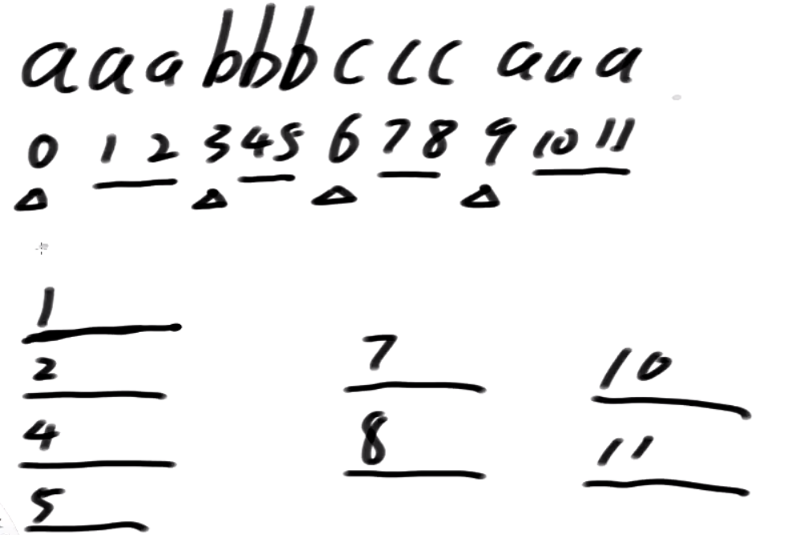 | 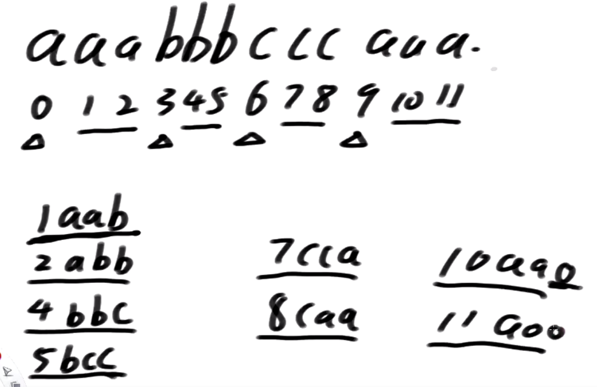 |      |
| ------------------------------------------------------------ | ------------------------------------------------------------ | ---- |

但是现实情况是，他有可能只拿前三位信息，他排不出严格的。我们拿Mississippi作为例子，这个例子你发现只拿前三字符决不出来。这样的话，我们就没有决出精确排名。下面的过程很有意思了，这个过程是整个算法最精髓的地方。接下来我生成一个数组，把s1类整体的排名，3321放在数组左边，对应的后缀串开头位置是1、4 、7 、10，数组对应的下标是0 、 1、 2 、 3。把s2类全部放在数组的右边，后缀串开头位置是2、 5 、8，排名是554，数组下标是4 、5、 6。

我把这个数组我就认为它是一个字符串数组。我递归的调用求它后缀数组的排名。你就认为字符串就是3321554。如果求出来了，那么这个数组下标3位置就是第一名，对应回原来就是10开头的后缀串是第一名。

| 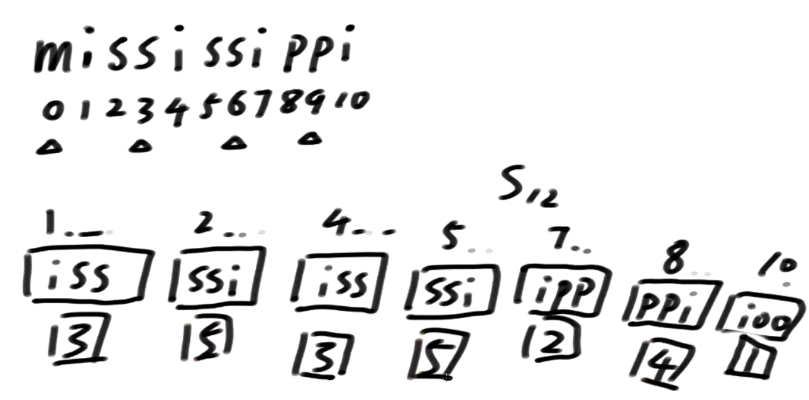 | 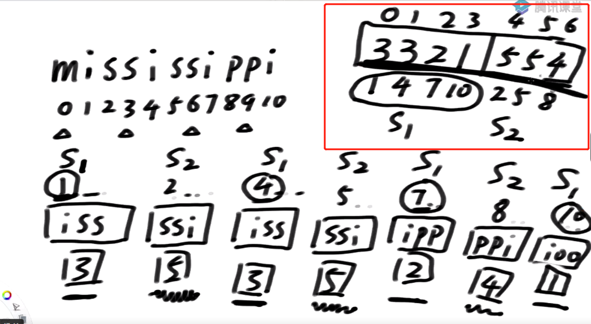 |      |
| ------------------------------------------------------------ | ------------------------------------------------------------ | ---- |

这个数组当做字符串，去求后缀数组，求出来的rank数组是如下。第一名是数组下标为3的，对应回原来的就是10开头的后缀数组排第一。第二名是数组下标为2的，对应回原来的就是7开头的后缀树组排第2名。

为什么是这样？你有一个比较糙的排名，我虽然没有得到精确排名。我这里面有两个三。有两个五，但如果你把这个排名的值当做是字符的话。我这个1它不可能在排完之后排名往后掉，因为相当于我的首字母是1。同理，首字母是2也不可能排到首字母是3或者4后面去。也就是说我们操作出来，原本的排名不会被打乱。那么问题就来到了，为什么我们的摆放是有讲究的，我们还分了左右，然后才当做一个做字符串继续去求后缀树组？

我们原本s12里面，为什么1开头和4开头比不出来，就是因为我们前三个字符是一样的，1开头后面就要补4...，4开头的后面就要补7...。你会猛然发现，我们排在这个新数组的上的位置，刚好续上了。第二个位置的3代表从4开头的后缀串，这不就是第一个位置3想要的信息吗，同理第二个3想要的信息在后面也续上了。

| 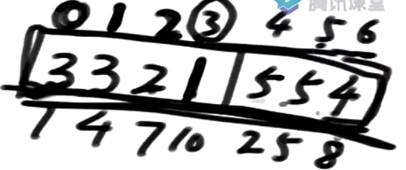 | 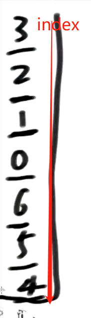 | 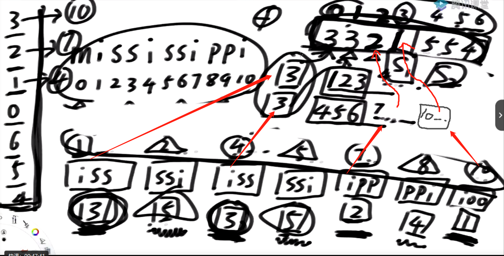 |
| ------------------------------------------------------------ | ------------------------------------------------------------ | ------------------------------------------------------------ |

所以，总体来说，如果我们只拿出前三位可以逼出来1，那么万事大吉。如果比不出来，没关系，2/3规模的数据量，也就是那个排名，进递归。构造的数组会适当的补0来去除边界的干扰。  

我是把排名再扔进去再求一次后缀数组，排名肯定不会超过N，所以去基数排序即便你的排名搞的很大，也是O(N)的算法。

| 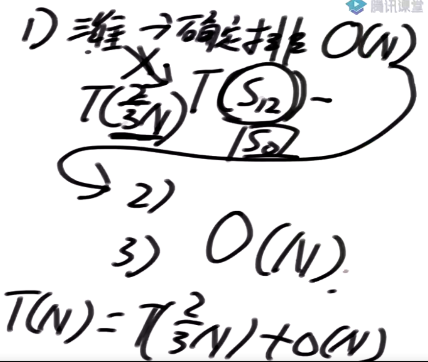 | 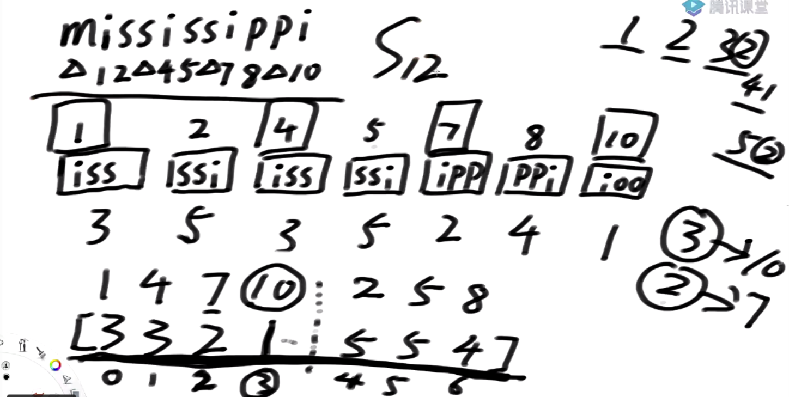 |      |
| ------------------------------------------------------------ | ------------------------------------------------------------ | ---- |


### 拼接最大数

code1:

```
给定长度分别为 m 和 n 的两个数组，其元素由 0-9 构成，表示两个自然数各位上的数字。现在从这两个数组中选出 k (k <= m + n) 个数字拼接成一个新的数，要求从同一个数组中取出的数字保持其在原数组中的相对顺序。

求满足该条件的最大数。结果返回一个表示该最大数的长度为 k 的数组。

说明: 请尽可能地优化你算法的时间和空间复杂度。

示例 1:

输入:
nums1 = [3, 4, 6, 5]
nums2 = [9, 1, 2, 5, 8, 3]
k = 5
输出:
[9, 8, 6, 5, 3]
```

大流程就是枚举str1挑几个，str2里面挑剩下的。我们先搞一个f（arr，p）是叫你再arr里面挑p个数来，最好的结果是啥。调度如下，无非就是要想想怎么merge，让两个最好的merge出最终的那个最好的

| 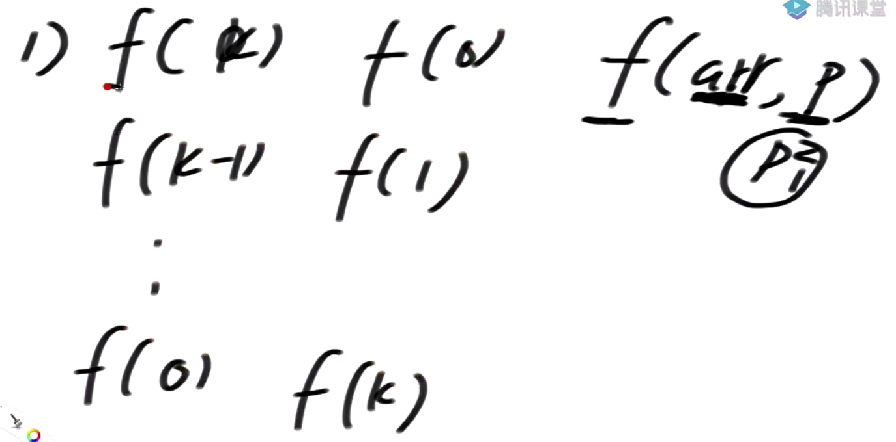 |      |      |
| ------------------------------------------------------------ | ---- | ---- |

那么挑选的函数其实是一个dp，含义为：如果我只能在i~N-1范围，一定要挑出j个数去拼数。得到的最好结果中开始的数在什么位置上？存的是一个位置。先把无意义的位置填了，没得选的位置填了。普遍位置，从下往上从左往右填。一个普遍位置i,j就讨论选i做开头与不选i做开头。然后两个开头到数组里面比较一下，选大的那个。如果两个值一样，选下标小的。

dp搞完之后主流程就是在这个表上跳转k次。leetcode上merge是一个指针漂，遍历的过程，O(N²）

后缀数组可以加速这件事情。全部数字加2，然后中间夹一个1。去搞后缀数组。

| 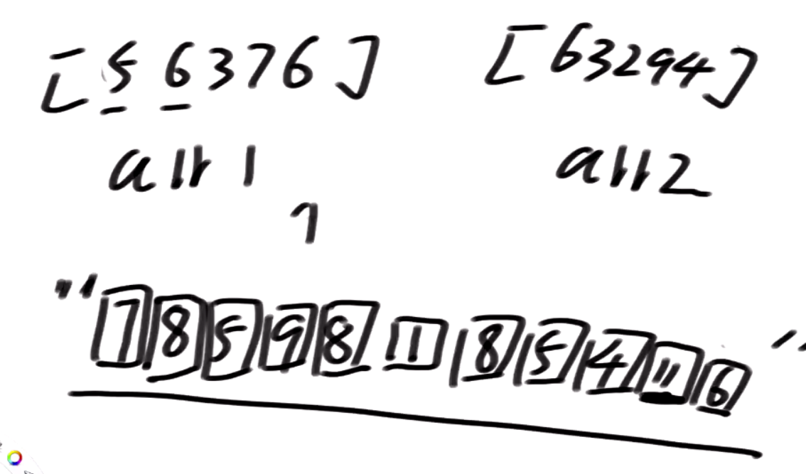 |      |      |
| ------------------------------------------------------------ | ---- | ---- |


a